# 四、为打破常规而设计

安迪·克拉克

`www.malarkey.co.uk`

`www.stuffandnonsense.co.uk`

在英国，**安迪·克拉克**(马拉其)有广告背景。1998 年，他创办了自己的设计咨询公司 Stuff and nullness。从那以后，他为英国迪斯尼商店、英国心脏基金会、救助儿童会和英国世界野生动物基金会设计了网站。

安迪对设计和网络标准充满热情；他弥合了设计和代码之间的鸿沟。在工作室之外，Andy 是 Web 标准项目的成员，他在 2006 年重新设计了该组织的网站，并且是 W3C 的 CSS 工作组的特邀专家。

Andy 是国际知名的培训师和会议发言人，他定期培训设计师和开发人员 Web 标准的创造性应用。他在自己的个人网站上写一些关于设计和流行文化的内容，这些都是胡扯(`www.stuffandnonsense.co.uk`)，他还是《超越 CSS 的 ??:网页设计的艺术()的作者，该书于 2006 年由 New Riders 出版(`www.transcendingcss.com`)。

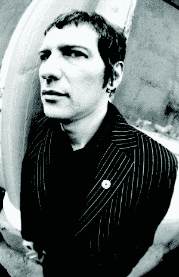

# 担忧？

“哦宝贝，怎么了？”她说。“你看起来压力很大，很担心。”

“我是，”我回答。“我担心我们的车需要新轮胎，除了一纸袋蘑菇和一管番茄酱，我们冰箱里没有喝茶用的东西，我妈妈的脚又有问题了。”

我可以告诉你，这可不是闹着玩的。如果担心自己的问题还不够糟糕，担心别人的问题会让人抓狂。尽管如此，一种叫做`WorrySome.net`的新型虚拟服务形式的帮助就在眼前。

这将不是你常见的或普通的网络应用程序，有足够的风险资本在新德里发动一场小战争和一个呼叫中心。这个网站是“由真实的人，为真实的人”的人会为你担心，当然是收费的。只要你继续付费，这项服务将让你自由自在地生活，无忧无虑。

我需要一个新网站，而你正是这份工作的合适人选。这是一个棘手的问题，但不要担心；帮助就在你身边，引导你把这个设计变成现实。如果你觉得在任何阶段你开始变得哪怕是一丁点儿担心，你总是可以付钱给一个担心的人来减轻你的负担。

在这一章中，你将把`WorrySome.net`主页从 design visual 变成一个使用 XHTML 和 CSS 的工作原型。你将从有意义的、内容外的标记开始，这总是开发一个创造性的、基于标准的设计的第一步。您将学习如何使用强大的 CSS 选择器和布局技术来实现这种设计。

# 担心网络

我个人很高兴`WorrySome.net`能代我担心，因为这两年，我一直在担心网页设计。网络是一个年轻的、充满活力的媒介，人们应该喜欢与他们访问的网站互动。创建人们喜欢使用的网站是创造性网页设计的主要目标之一。但是网页设计者和开发者经常关注标记、CSS、Ajax 的技术方面，或者可用性和可访问性的“科学”，而不是通过好的设计来联系访问者的情感。

我们已经看到了 CSS 提供的工具的进步，以及主流 web 浏览器对这些工具更广泛的支持。我希望我们不要再担心支持过期的浏览器，而是通过创造新的、鼓舞人心的设计来打破当前的思维模式。

# 为`WorrySome.net`设计

由于`WorrySome.net`是一种处理世界忧虑的新颖的新方法，该网站呼吁一种打破当今许多闪亮的网络应用程序的熟悉惯例的设计。摘要要求这种设计是开放和友好的。它必须让访问者感觉“像一个值得信赖的朋友一样受欢迎，而不是像一个顾客一样。”

在设计`WorrySome.net`的外观时，设计采用了多种形式。我用许多不同的界面想法做了几个实验性的布局，只有少数几个进入了最终的设计。图 4-1 显示了你将在本章中使用的那个。

让我们开始将`WorrySome.net`主页的设计变成现实吧。您将使用有意义的 XHTML 标记和 CSS，但不只是任何旧的 CSS。这个最小的标记将要求你使用你可能还没有在自己的工作中实现的技术和 CSS 选择器。您可以从`www.friendsofed.com`下载所有必要的文件。

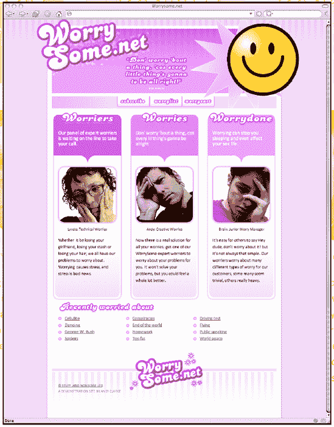

**图 4.1。`WorrySome.net`主页**

## 别担心，从涨价开始

从事网络工作的设计师的目标之一应该是传达意义。我说的不仅仅是通过视觉设计来强化品牌价值所表达的意思，还有通过为内容选择的 XHTML 元素所传达的意思。根据元素的含义而不是视觉表现来选择合适的元素，这将有助于你创造出尽可能灵活和易于理解的设计。(当然，你还需要确保你的标记尽可能的精简和灵活。)您希望确保在没有 CSS 所提供的视觉丰富性的情况下，元素能够传达内容的全部含义。

回头看图 4-1 ，写下页面上每个视觉元素的含义。在此设计中，您会看到以下元素:

*   一个包含网站名称和标语的品牌区，歌词来自鲍勃·马利，一位悠闲生活方式的大师

*   导航链接列表

*   三个标题，每个标题后面都有几段文字和一个烦恼者的内嵌图像

*   标题后面是一系列人们经常担心的话题:从阴谋到乔治·w·布什(我想不出有什么联系，没有，先生)

*   网站信息，通常包含法律注释、版权信息和设计致谢

完成内容大纲后，您就可以充实最适合表达其含义的标记了。在这一点上，您应该只关心描述这个内容的含义，而不是任何 division 元素或表示性标记技巧。

你应该从内容大纲的顶部开始，然后向下，所以我们从品牌开始。

## 添加内容元素

在 WorrySome 的主页上，网站名称可以作为页面顶级标题的一个不错的选择。

```html
<h1>Worrysome.net</h1>
```

许多设计者会选择在内部页面上改变这一点，选择二级标题，保留顶级标题作为页面名称。在内部页面上，这个名称可能还会包含一个返回主页的链接，这在主页上是多余的。

接下来是标语。写在牙买加马利家的台阶上，那里烟雾缭绕，这是《三只小鸟》的摘录，非常适合作为一个放松的网站。浏览 XHTML 规范的页面，如果需要的话，寻找一个`lyric`元素。我就在这里等着，唱着“纯净而真实的甜美歌曲”，直到你回来。

已经回来了？

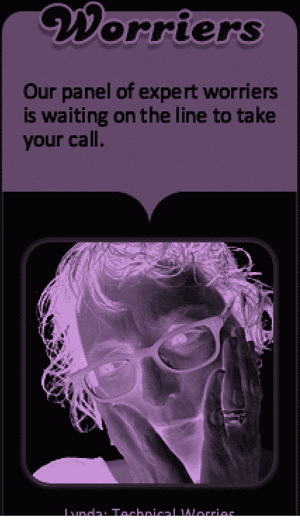

在没有更合适的元素来标记雷鬼伟人的这首诗的情况下，一个`blockquote`元素就可以了；毕竟他唱过那些词。

```html
<blockquote cite="http://www.bobmarley.com/songs/songs.cgi?threebirds">
<p>Don' worry 'bout a thing, cos every lil thing is gonna be alright.</p>
</blockquote>
```

### 注意

注意引用的 URL 来源已经被引用。尽管这些信息在访问者的网络浏览器中是看不到的，但你还是应该注明你引用的任何引文的来源。关于使用脚本显示引用的 URL 的示例，请参见 Jeremy Keith 的书*DOM scrp ting:Web Design with JavaScript and the Document Object Model*(编辑之友，ISBN: 1-59059-533-5)。

如果你仍然“心情愉快”，那么构成主导航的订阅页面、忧虑列表和购物车的链接列表是有序的，任何特定链接都没有任何重要性或权重。无序列表是标记这些链接的合适选择。

```html
<h4>Main navigation</h4>
<ul>
  <li><a href="#" title="Subscribe">Subscribe</a></li>
  <li><a href="#" title="Worrylist">Worrylist</a></li>
  <li><a href="#" title="Worrycart">Worrycart</a></li>
</ul>
```

但是标题在那里做什么？导航链接列表顶部的低级标题可以帮助使用屏幕阅读器(或其他形式的辅助技术)的访问者了解列表的用途。您可以选择使这些标题可见或隐藏，也许是通过在屏幕上缩进它们。这种技术被称为提供一个*嵌入式替换*。

现在我们真的“卡住了”，是时候转移到这个主页上感兴趣的主要内容了:这个站点提供的服务的描述。您将为每个内容区域选择一个二级标题，后面是相关内容。

```html
<h2>Worriers</h2>
<p>Introduction text</p>

<p>Name and role of worrier</p>
<p>Further descriptive text</p>

<h2>Worries</h2>
<p>Introduction text</p>

<p>Name and role of worrier</p>
<p>Further descriptive text</p>

<h2>Worry done</h2>
<p>Introduction text</p>

<p>Name and role of worrier</p>
<p>Further descriptive text</p>
```

一个第三级标题自豪地宣布网站的专家担忧小组可以从你肩上卸下的主题列表。因为这个列表是按字母顺序排列的，所以选择一个有序列表而不是无序列表是否最合适是有争议的。对于这个例子，我选择了无序，因为没有一个条目比它的兄弟条目更重要。

```html
<h3>Recently worried about</h3>
<ul>
  <li><a href="#">Worry item</a></li>
  <li><a href="#">Worry item</a></li>
  <li><a href="#">Worry item</a></li>
</ul>
```

你现在几乎在页面的底部，在网站信息和一个方便的链接回到顶部，以保存访问者的滚动手指。

```html
<p><a href="http://www.stuffandnonsense.co.uk"> Stuff and
  Nonsense Ltd.</a> A demonstration site by Andy Clarke</p>
<ul>
  <li><a href="#worrysome-net" title="Top of this page">Top</a></li>
</ul>
```

有了整洁地编写的有意义的标记，现在你有机会在开发浏览器中预览你的页面(见图 4-2 )并验证你的代码以确保没有错误出现。

### 注意

如果像我一样，您选择的开发浏览器是 Firefox，您可以找到许多开发人员扩展，它们将在您工作时保持您的标记有效，尤其是 Chris Pederick 的基本 Web 开发人员工具栏。您可以从`http://chrispederick.com/work/webdeveloper/`下载 Web Developer 工具栏。

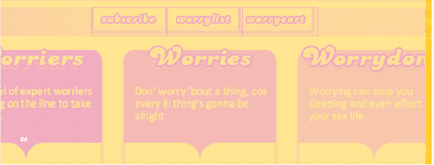 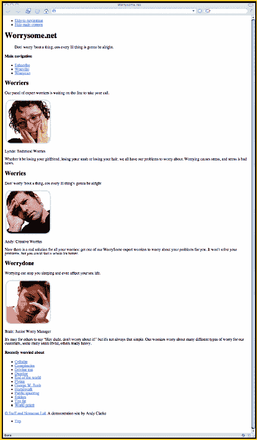

**图 4.2。在浏览器中预览页面，以确保在没有字体的情况下阅读时内容是有序的，这是开发视觉上富有表现力但又易于访问的设计的第一步。**

## 从内容中添加分部出来

总的来说，web 设计人员对标记和 CSS 的理解在最近几年有所发展，但是自从我们使用表格进行布局以来，我们对使用 CSS 完成视觉设计的方式的想法几乎没有改变。剥去许多基于标准的网站的外观，它们的 W3C“有效的 XHTML 和 CSS”徽章在阳光下闪闪发光，你会发现大量无意义和不必要的`<div>`和`<span>`元素。

从内容着手意味着只从结构元素开始，比如标题、段落和列表。这是让您的标记不受表示元素影响的理想方法。

接下来，您将只对那些您先前选择的相关元素进行分组，并为每个元素赋予一个标识来描述它所包含的内容。

### 注意

关于语义元素命名的主题已经写了很多。前 CSS 武士约翰·奥尔索普创建了 WebPatterns ( `www.webpatterns.org`)，一个致力于元素命名惯例的网站。我关于命名约定主题的原始文章可以在 All That Malarkey ( `www.stuffandnonsense.co.uk/archives/whats_in_a_name_pt2.html`)找到。

为了避免代码重复，下一个示例只显示了内容区域，而不是再现标记的每一个细微差别。

```html
<div id="branding">
  <h1>Worrysome.net</h1>
  <blockquote cite="http://www.bobmarley.com/songs/songs.cgi?threebirds ">
    <p>Don' worry 'bout a thing, cos every lil thing is gonna be alright.</p>
  </blockquote>
</div>

<div id="nav_main">
  <h4>Main navigation</h4>
  <ul>
    <li><a href="#" title="Subscribe">Subscribe</a></li>
    <li><a href="#" title="Worrylist">Worrylist</a></li>
    <li><a href="#" title="Worrycart">Worrycart</a></li>
  </ul>
</div>

<div id="content">
  <div id="content_main">
<div id="worriers">
                   <h2>Worriers</h2>
                   <p>Introduction text</p>
                   
                   <p>Name and role of worrier</p>
                   <p>Further descriptive text</p>
                </div>
```

```html
<div id="worriers">
      <h2>Worriers</h2>
      <p>Introduction text</p>
      
      <p>Name and role of worrier</p>
      <p>Further descriptive text</p>
   </div>

   <div id="worries">
      <h2>Worries</h2>
      <p>Introduction text</p>
      
      <p>Name and role of worrier</p>
      <p>Further descriptive text</p>
    </div>
  </div>

  <div id="content_sub">
    <h3>Recently worried about</h3>
    <ul>
      <li><a href="#">Worry item</a></li>
      <li><a href="#">Worry item</a></li>
      <li><a href="#">Worry item</a></li>
    </ul>
</div>
</div>

<div id="siteinfo">
  <p><a href="http://www.stuffandnonsense.co.uk"> Stuff and Nonsense Ltd. </a>
  A demonstration site by Andy Clarke</p>
  <ul>
    <li><a href="#worrysome-net" title="Top of this page">Top</a></li>
</ul>
</div>
```

这些适当标识的部分不仅增加了结构，使您能够更容易地开发视觉布局，而且它们的标识符也有助于增强它们所包含的内容的意义。在基于内容的工作流中，这种最小化划分的使用应该始终是您的方法。这使得在编写标记时，内容而不是视觉布局成为您思考的中心。

如果需要额外的部门来完成任何特定的设计，应该一次添加一个部门，直到可以实现您的设计。对于这种设计，只需要一个额外的容器部分，包装所有的元素。除了`html`和`body`元素之外，这个容器是一种允许您进一步选择样式的常用方法。

```html
<div id="container">
All document content
</div>
```

您可能已经注意到，在这个标记示例中，没有添加额外的标识符或`class`属性，尽管设计很复杂。很少需要这样的表示属性，因为您的标记已经包含了所有的元素和属性(`href`、`title`、`alt`等等)，当您对基于标准的设计采用成熟的方法时，您可能会用到这些元素和属性。

完成标记中的元素和适当的划分后，但在开始使用 CSS 之前，您应该花点时间考虑再添加一个元素。这将有助于那些使用屏幕阅读器或不支持样式表的小屏幕浏览器浏览网站的访问者。

虽然期望每个访问者都能完全访问这个网站或任何其他网站是一个不可能的梦想，但在你的文档中添加一些不引人注目的内容会给一些人带来巨大的帮助。对于本例，您将添加一个简短的跳转链接列表，以允许屏幕阅读器用户跳转到主导航或主要内容。

```html
<ul id="nav_access">
<li><a href="#nav_main">Skip to navigation</a></li>
<li><a href="#content_main">Skip main content</a></li>
</ul>
```

您应该将这个列表直接插入到开始的`<body>`标签之下，容器部分之外。

## 满足你的灵魂(用 CSS)

如果标记是你的“朋克雷鬼派对”，那么将它转化为视觉设计布局应该是你“满足我的灵魂”的时间。(好了，这是最后一首鲍勃·马利的歌名说大话，我保证。)

从面条事件(`www.thenoodleincident.com`)和蓝色机器人(`www.bluerobot.com`)的早期开始，使用 CSS 实现设计布局已经走了很长的路。在实际使用 CSS 的那些日子里，定位是实现列和其他布局特性的首选方法。不久之后，随着设计者越来越雄心勃勃地尝试使用 CSS 来制作复杂的设计，定位让位于使用浮动。不幸的是，定位及其相关的`z-index`堆叠已经有些失宠了。

尽管乍一看，定位很难理解，但它可能仍然是 CSS 设计工具中最强大的。实现`WorrySome.net`布局将大量使用定位和`z-index`以及浮动。

您还将使用图像替换和一整套 CSS 选择器。如果你使用 CSS 已经有一段时间了，其中的许多你会很熟悉；其他人可能看起来很奇怪。你将使用选择器，直到最近它还是网页设计者的梦想。不要担心“水牛战士”(对不起，我无法抗拒)，我会解释每一个新的选择器和技术，因为我们的进展。

**开往 Styleville 的火车**

直到最近，你对可以在不同浏览器上可靠使用的 CSS 选择器和技术的选择还仅限于世界上最常用的浏览器微软的 Internet Explorer 6 for Windows 支持的几个简单的选择器。由于 Internet Explorer 7 开发人员的辛勤工作和对标准的热情，以及 web 标准项目(`www.webstandards.org`)的 Molly E. Holzschlag 等人的奉献，这种情况现在已经改变了，他们在 Web 开发人员社区和微软之间架起了桥梁。我们都应该感谢他们的工作。

Internet Explorer 7 远非完美的浏览器(什么浏览器？)，但确实让浏览器公平竞争。它对所谓的“高级”CSS 选择器有很好的支持，并修复了过去版本的渲染问题和错误，这些问题和错误近年来一直困扰着 web 设计人员。

**我想要时尚**

尽管它们对 CSS 的渲染大体一致，但大多数浏览器在应用作者或用户样式之前会有不同的页面默认渲染方式，即页面的外观，使用所谓的*用户代理*或*浏览器样式*，通常也称为*默认*样式。因此，您应该从在样式表中添加一些简单的规则开始，以保证任何元素的样式都符合您的意图，而不是浏览器的意图。这个例子包含了比您将要用来实现`WorrySome.net`更广泛的元素，使您能够处理将来可能需要的任何元素。

```html
/*  =reset.css */
body, div, dl, dt, dd, ul, ol, li, h1, h2, h3, h4, h5, h6, pre, form,
  fieldset, input, p, blockquote, address, th, td {
margin : 0; padding :0; }

h2, h3, h4, h5, h6 {
font-size : 100%;
font-weight : normal; }

ol, ul {
list-style-type : none; }

table {
border-collapse : collapse;
border-spacing : 0; }

caption, th {
text-align : left; }
fieldset, img { border : 0; }

dt, address, caption, cite, code, dfn, em, i, strong, b, th, var {
font-style : normal;
font-weight : normal; }

q:before, q:after { content :''; }
```

除了这个 reset CSS，我还建议你在常用的文本元素上指定`margin`和`padding`。

```html
/* =blocktext */
h2, h3, h4, h5, p, ul {
margin : 0 20px;
padding : .5em 0; }
```

## 造型`WorrySome.net`

许多网页设计者采用一种粒度方法来使用 CSS 实现他们的设计，而你将采用一种由外向内的方法，首先关注设计的外部元素，然后再处理细节。您将从应用设置布局结构的样式开始，从包含所有内容的`html`、`body`和`container`部分开始。

应用于根元素`html`的`background-color`、`background-image`和字体`color`将使球滚动。一个细长的`background-image`将水平重复(`repeat-x`)来创建网站的条纹背景。

```html
html {
background : #f7d8e8 url(img/html.png) repeat-x;
color : #333; }
```

### 注意

我选择的许多图像文件名都与它们所设计的元素密切相关。这种方法有助于节省时间，并减少几个月后返回网站时的混乱，或者当许多设计人员或开发人员在一起工作时。

接下来，您应该对`body`元素应用样式。这种设计将是固定宽度的，并在浏览器窗口中居中。

```html
body {
position : relative;
width : 740px;
margin : 20px auto 0 auto;
padding-top : 10px;
background : url(img/body.png) repeat-y;
font : 88%/1.5 Calibri, Trebuchet, "Trebuchet MS", Helvetica, Arial, sans-serif; }
```

您可能想知道为什么`position : relative;`应该应用于`body`元素。毕竟，`body`不太可能被定位或偏离其自然位置。这个设计中的很多视觉元素都是绝对定位在页面上的。将`position : relative;`应用到`body`元素会将它建立为其任何定位后代的定位上下文。

接下来，轮到外`container`师了。同样，该元素已经被建立为其后代的定位上下文，并位于`body`的中心，以允许该元素的`background-image`为页面深度创建微妙的投影。

```html
div[id="container"] {
width : 700px;
margin : 0 auto; }
```

### 注意

如果您不熟悉示例中的选择器，请不要担心。这是一个属性选择器，由于在 Internet Explorer 6 中缺乏对它的支持，web 设计人员和开发人员很大程度上避免使用这种类型。

属性选择器由三部分组成:

*   您正在选择的元素(本例中为 div)

*   用于选择特定元素的属性(本例中为 id)

*   属性的值(本例中为容器)

您可以使用 div#container 或者甚至#container 来选择相同的元素，但是那样就没那么有趣了，不是吗？

**造型基础页面分部**

有了外部区域，您可以将注意力转向定义此设计的品牌、导航和内容区域。对于每一个，您将应用基本的样式，包括框和背景属性。从顶部的品牌区域开始。

```html
div[id="branding"] {
height : 200px;
margin-bottom : 10px;
background : #f0a4c7 url(img/branding.png) repeat-x; }
```

这可以跟随主导航的外部划分。

```html
div[id="nav_main"] {
background : #fedaeb url(img/nav_main.png) repeat-y; }
```

最后，将样式应用于其余的主要部分:

```html
div[id="content"] {
margin-bottom : 80px; }

div[id="content_main"], div[id="content_sub"] {
width: 100%;  }

div[id="siteinfo"] {
clear : both;
min-height : 120px;
padding: .5em 0;
background : url(img/siteinfo.png) repeat-x;  }
```

通过在您的开发浏览器中加载页面，查看您的设计是如何完成的(参见图 4-3 )。对于如此少的努力来说，表现还不算太差，但你仍然只是第 40 名的新人，你还有一段路要走，才能登上排行榜的榜首。不用担心；这不会像你想象的那么难。

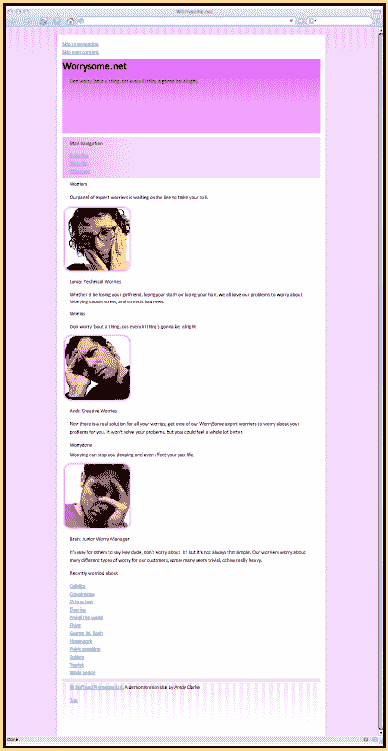

**图 4.3。样式化基本页面 divs、html 和 body 来创建画布，在画布上创建`WorrySome.net`设计**

**制作栏目**

我想是史蒂夫·克鲁格在他的书《不要让我思考》中建议莱昂纳多·达芬奇发明了标签。我不确定是谁发明了柱子。也许是纳尔逊勋爵，但我跑题了。

`WorrySome.net`的主页将它的三个主要内容区域分成几列，每一列都包含对该服务的不同解释，顶部是不同颜色的圆形图像。您的下一个任务是使用 floats 创建三个列。

以下规则将适用于所有三列。它将每个浮动到左边，并给它们一个最小的高度、宽度和边距；少量底部填充；和一个位于分区底部的`background-image`。

```html
div[id="worriers"], div[id="worries"], div[id="worrydone"] {
float : left;
min-height : 42em;
width : 220px;
margin-right : 20px;
padding-bottom : 1em;
background : url(img/worryone-b.png) no-repeat 0 100%; }
```

现在您可以选择将出现在最右边的`worrydone`部分，并移除它的右边距，将其放在容器的最外边。

```html
div[id="worrydone"] {
margin-right : 0; }
```

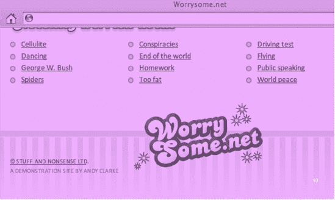

您的列制作考察的最终结果显示在图 4-4 中。

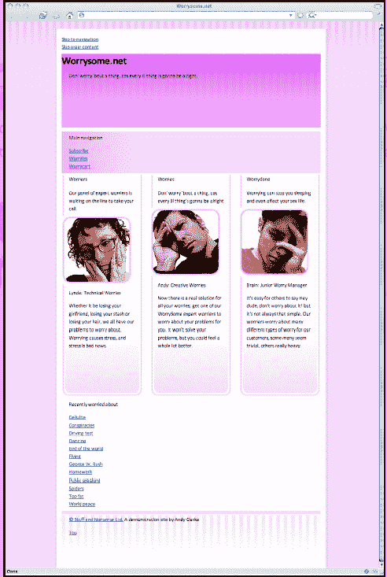

**图 4.4。浮动师团让三个纵队配得上特拉法尔加广场**

接下来，您将向这三列中的每一列添加单独的样式，从标题开始向下。您将使用流行的 Phark 负文本缩进技术(如第二章，“用 CSS、Flash 和 JavaScript 驯服野生 CMS 参见`http://phark.net`。该方法对每个标题应用一个`background-image`，并通过缩进大量像素将文本从浏览器窗口的左侧移开。

第一条规则适用于所有三个标题。

```html
div[id="worriers"] h2,
div[id="worries"] h2,
div[id="worrydone"] h2 {
min-height : 50px;
margin : 0;
text-indent : 9999px; }
```

这应该遵循给每个标题添加一个唯一的`background-image`的规则，如图 4-5 中的所示。

```html
div[id="worriers"] h2 {
background : url(img/worryone-t.png) no-repeat 0 0; }

div[id="worries"] h2 {
background : url(img/worrytwo-t.png) no-repeat 0 0; }

div[id="worrydone"] h2 {
background : url(img/worrythree-t.png) no-repeat 0 0; }
```

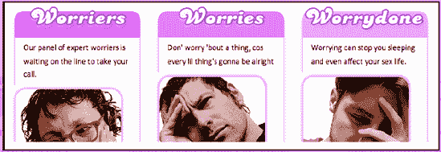

**图 4.5。使用图像替换来设计标题样式**

介绍性文字的每一段都将使用不同颜色的背景图像和更大的字体，如图图 4-6 所示。同样，第一条规则是所有三个段落共有的。

```html
div[id="worriers"] h2 + p,
div[id="worries"] h2 + p,
div[id="worrydone"] h2 + p {
min-height : 4em;
margin : 0;
padding : 5px 20px 40px 20px;
font-size : 120%;
line-height : 1;
color : #fff; }

div[id="worriers"] h2 + p {
background : #cc6195 url(img/worryone-m.png) no-repeat 0 100%; }

div[id="worries"] h2 + p {
background : #dd82ae url(img/worrytwo-m.png) no-repeat 0 100%; }

div[id="worrydone"] h2 + p {
background : #f0a4c7 url(img/worrythree-m.png) no-repeat 0
100%; }
```

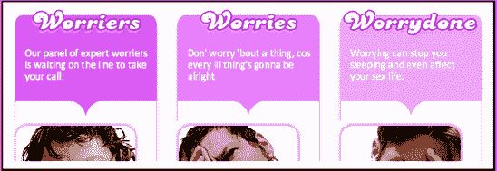

**图 4.6。三个介绍性段落的顺序明显不同**

### 注意

等等，这些选择器里的+号是干什么的？这个符号被称为兄弟组合子，并形成一个相邻的兄弟选择器。这种类型的选择器根据其前面的元素选择一个元素；在这种情况下，紧接着 h2 的是 p 元素。Web 设计人员和开发人员在很大程度上避免了这种类型的选择器，因为在 Internet Explorer 之前的版本中缺乏对它的支持。

你的专栏正在成形。最后，你可以整理肖像和烦恼者名字周围的空间，将文字居中并缩小字体大小，如图图 4-7 所示。

```html
div[id="worriers"] img,
div[id="worries"] img,
div[id="worrydone"] img {
margin-left : 15px; }

img + p {
padding-top : 0;
font-size : 92%;
text-align : center; }
```

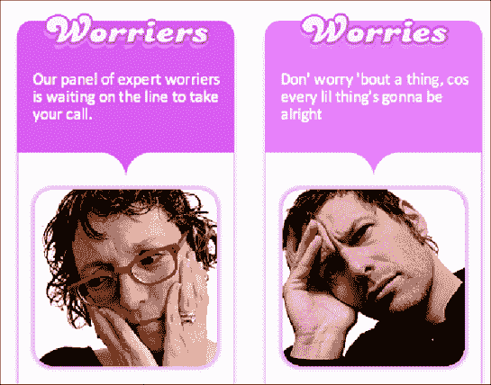

**图 4.7。使用属性和相邻选择器**深入细节

虽然浮动和图像替换在您的脑海中还记忆犹新，但是让我们来看看令人担忧的主题列表及其标题。再次使用 Phark 方法替换标题文本。

```html
div[id="content_sub"] h4 {
height : 35px;
width : 300px;
padding : 0;
background : url(img/h4.png) no-repeat;
text-indent : 9999px; }
```

该网站的专家团队可以代表您担心的主题列表将被转换为三栏式设计。您可以通过浮动每个列表项并使用一个`background-image`来提供一个装饰性的项目符号来完成这个效果。

```html
div[id="content_sub"] ul {
float : left;
padding-bottom : 80px; }

div[id="content_sub"] li {
display : block;
float : left;
width : 190px;
padding-left : 20px;
background : url(img/li.png) no-repeat 0 50%; }
```

结果如图 4-8 所示。

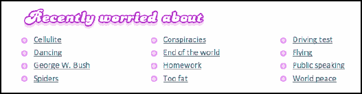

**图 4.8。浮动列表项目:用简单列表创建列设计的有效方法**

**样式页脚**

页脚有时可能是设计中被忽略的部分。通常，他们最简单的处理会让你的视线离开页面底部。

页脚有一个较小版本的主标志和一个非常有用的顶部链接，这样网站的访问者就不用担心滚动到页面顶部会喘不过气来。

首先，开始设计页脚中的一小段文本。将其内容转换为大写字母，并减小其字体大小和对比度以降低其重要性。

```html
div[id="siteinfo"] p {
padding-top : 40px;
font-size : 82%;
text-transform : uppercase;
color : #999;  }

div[id="siteinfo"] p a {
display : block; }
```

### 注意

如果你能更具体地说明你的目标锚，也许通过设计不同于你网站上其他页面的外部链接，这不是很好吗？现在，在很多情况下你可以。除了 Internet Explorer 7 之外，所有支持标准的主流浏览器都支持如下选择器:

```html
div[id="siteinfo"] a[href^="http"] {
      display : block; }
```

带有^的选择器是一种子串匹配属性选择器，有点拗口，但却是 CSS 中最有趣的选择器类型之一。从现在开始，我将引用 tas 子串选择器，以节省墨水和树。

这种类型的选择器有不同的种类，其中许多可以使完成这种设计更加容易。此处的示例针对 siteinfo 部分中包含的所有链接，其中 href 以 http 开头。随着本章的深入，您将看到更多的子串选择器。

现在是时候将注意力转向添加小的`WorrySome.net`标志了。查看该页面的标记可以发现，这里没有内嵌的徽标图像。在一个无序列表中，只有到页面顶部的链接。从删除列表中的所有边距开始。

```html
div[id="siteinfo"] ul {
margin : 0; }
```

现在，您可以使用定位和图像替换的组合，将这个不起眼的链接转换为闪亮的徽标。首先，设置它的比例并绝对定位它:左边 240 像素，上面 50 像素。

```html
div[id="siteinfo"] ul a {
position : absolute;
display : block;
top : 50px;
left: 240px;
height : 120px;
width : 230px; }
```

应用一个背景图像，将它的文本滑动到屏幕之外，你就可以开始了。

```html
div[id="siteinfo"] ul a {
background : url(img/a-t.png) no-repeat;
text-indent : 9999px; }
```

好吧，也许你还没有完成。在您的浏览器中预览结果，您将会看到徽标并没有像您预期的那样正好位于页脚上方。相反，它被定位在`body`元素之上 50px，因为这是它最近的定位祖先，如图 4-9 的顶部所示。

你可以很容易地补救这一点。通过应用`position : relative;`但不应用偏移，使站点信息部分本身成为定位上下文。

```html
div[id="siteinfo"] {
position : relative; }
```

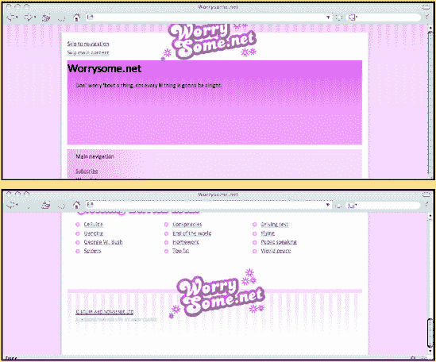

**图 4.9。更正页脚徽标的位置。你可以说我老土，但我认为它在底部更好看。**

**设计主导航**

理解子字符串选择器的功能和灵活性非常重要，因为您将在设计该页面的主导航时更多地使用它们。同样，您将使用一系列不同的技术，包括定位和图像替换。主导航将如图 4-10 所示。


**图 4.10。主导航的最终外观**

但是如何实现这一点呢？您的第一个简单任务是从视图中删除标题，这一次是将它放置在浏览器窗口的顶部边缘。

```html
div[id="nav_main"] h4 {
position : absolute; top : 9999px; }
```

现在标题被取消了，除了浏览没有样式的页面的人，您可以设置无序导航列表的比例，并添加包含所有三个按钮图形的背景图像。

```html
div[id="nav_main"] ul {
width : 310px;
height : 38px;
margin-left : 200px;
padding : 0;
background : url(img/li_nav_main.png) no-repeat; }
```

该列表中的导航链接将通过定位三个锚点来完成。接下来，建立这个无序列表作为定位上下文，并将所有列表项设置为内联显示，而不是块级元素。

```html
div[id="nav_main"] ul {
position : relative; }

div[id="nav_main"] li {
display : inline; }
```

将`position : relative;`应用于列表以建立定位上下文，现在为所有三个锚点设置一个通用规则。

```html
div[id="nav_main"] a {
position : absolute;
top : 0;
display : block;
height : 38px;
width : 104px;
text-indent : 9999px; }
```

根据锚的`title`属性，这将遵循针对单个锚的特定规则。这些`title`属性为每个链接添加了一个可视化的工具提示，并允许您定位它们的锚点。

```html
a[title="Subscribe"] {
left : 0; }

a[title="Worrylist"] {
left : 104px; }

a[title="Worrycart"] {
left : 208px; }
```

### 注意

您已经在前面的选择器示例中遇到了^符号，并了解到它针对的是以特定值开头的属性。相比之下，$符号针对的是以特定值结尾的属性。

```html
<a href="#" title="Worries in your Worrycart">Worrycart</a>
  a[title$="worrycart"] {
   left : 208px; }
```

在浏览器中预览完成的结果。为了说明锚点的位置，我给图 4-11 中的每个锚点添加了一个红色边框(使用 Firefox 的 Web Developer 工具栏的轮廓功能)。

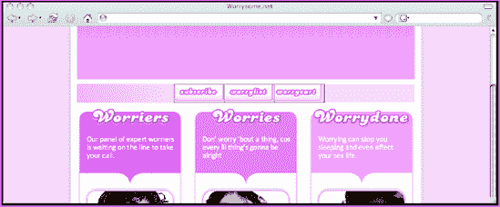

**图 4.11。显示完成的结果，并突出显示锚点**

**品牌设计**

我希望，尽管有了所有的新技术和选择器，你的头脑没有烦恼。页面上还有一个区域需要你去处理，这是我在所有网站设计中最喜欢的部分:品牌。

此时，您已经使用了所有的选择器技术和类型，将品牌区域的顶级标题和 Marley 的“三只小鸟”的摘录转换为有吸引力和有意义的视觉元素。

由于这些元素将被定位为创造标志“打破常规”的视觉效果，因此首先要将品牌部门转变为这些元素的定位环境。

```html
div[id="branding"] {
position : relative; }
```

现在你已经准备好放置顶层标题和`blockquote`。使用 Phark 图像替换方法将文本替换为`background-image`。

```html
h1 {
z-index : 1;
position : absolute;
left : 50px;
top : 30px;
height : 178px;
width : 379px;
background : url(img/h1.png) no-repeat;
text-indent : 9999px; }

div[id="branding"] blockquote {
z-index : 2;
position : absolute;
left : 225px;
top : 85px;
height : 103px;
width : 198px;
background : url(img/blockquote.png) no-repeat;
text-indent : 9999px; }
```

### 注意

为了确保醒目的块引用始终位于其相邻标题的前面，块引用被赋予了更高的 z 索引。关于 z-index 的创造性灵活性的更详细的解释，请阅读我在`http://24ways.org/advent/zs-not-dead-baby-zs-not-dead`的 24ways 文章。

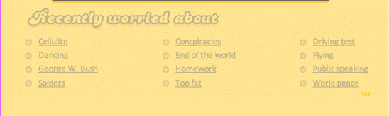

这样做的结果是，你引人注目的网站口号变成了更有吸引力的东西，如图 4-12 所示。

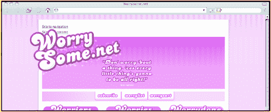

**图 4.12。定位和`z-index`相结合，创建网站的品牌，没有什么顾虑。**

**对无障碍的家伙微笑**

你的工作几乎完成了，但是`WorrySome.net`品牌的一个重要方面仍然缺失:黄色笑脸。如果您向后翻页查看该页面的标记，您会看到每个元素和属性都被使用了；没有任何东西被浪费。除了保存方便的跳转链接的无序列表之外，什么都没有。

不用担心；这个元素很快就会对你有用。许多 web 设计人员和开发人员选择隐藏这些嵌入式辅助功能，通常将它们推到屏幕之外，看不到。您将使用此元素，通过附加笑脸`background-image`来赋予品牌区域以生命。

```html
ul[id="nav_access"] {
position : absolute;
top : 33px;
right : 50px;
height : 291px;
width : 340px;
margin : 0;
padding : 0;
background : url(img/a-access.png) no-repeat;
text-indent : 9999px; }
```

在你的浏览器中预览商标区所有的笑脸，你会发现这张脸并没有对你微笑。CSS 缺少了一个重要的部分，以及一个重要的教训。除非您为任何定位的元素指定了一个`z-index`值，否则那些在文档顺序中跟随它的元素将始终位于顶部。它们越靠近结束的`</body>`标签，它们在堆叠顺序中的位置就越高。

可访问性列表出现在文档的最开始，因此在堆叠顺序中，它位于所有其他定位的元素之后。你可以纠正这一点，通过给笑脸一个明确的`z-index`来恢复它的快乐，这将确保它在设计中占据应有的位置，如图 4-13 所示。

```html
ul[id="nav_access"] {
z-index  : 2; }
```

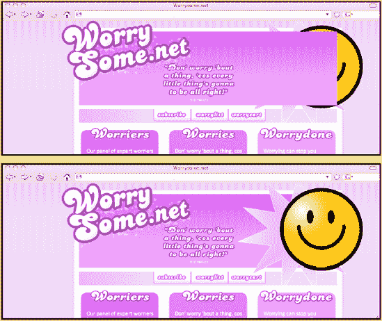

**图 4.13。微笑，帮助有特殊需求的访客的隐藏工具也可以作为视觉设计元素的挂钩。**

我们会让你再看看最终的设计(图 4-1 )，看看它的辉煌:

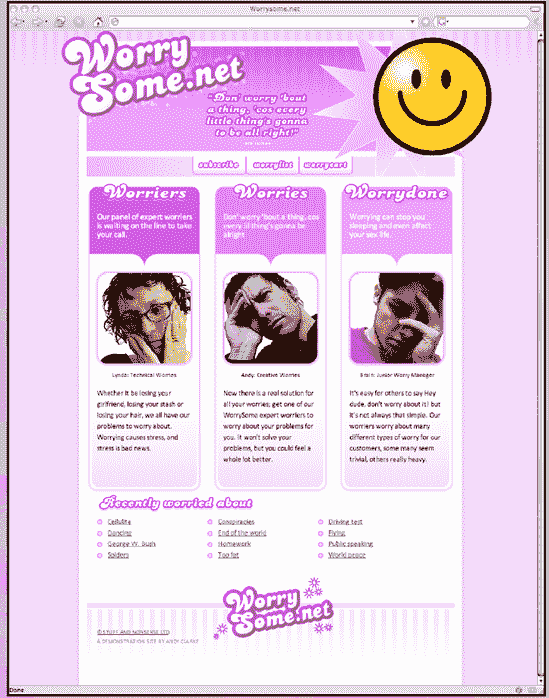

# 处理传统浏览器

尽管已经有很多关于 CSS 的书，但是很少有人涉及到被认为是高级选择器的实际应用。一个原因是网络上最常用的浏览器，Windows 的 Internet Explorer，不支持这些选择器。Web 设计人员和开发人员避免使用这些选择器，或者他们集中精力限制他们的设计，以便页面在不同年龄或功能的浏览器上显示相同。

如果网页设计要进步，就必须找到新的方法。并不是你在本章中使用的所有技术在所有浏览器中都是一样的。不用担心；这是故意的。

在许多工作环境中，web 设计人员和开发人员必须处理浏览器的功能，这些功能仍在日常使用中，但也远远超出了最佳使用日期。不幸的是，这一群乌合之众的老浏览器包括 Windows 版的 Internet Explorer 6。幸运的是，有一个 solutionone 可以让你完全采用开发`WorrySome.net`时一直在使用的技术和选择器。

狄恩·爱德华兹的 IE7 脚本(`http://dean.edwards.name/IE7/`)使用 JavaScript 将样式表解析成 Internet Explorer 6 和更早版本可以理解的形式。它们使您能够在样式表中使用 CSS2 甚至一些 CSS3 选择器，并将 Internet Explorer 的旧版本转换成一个无忧的新浏览器，该浏览器能够理解以下内容:

*   子选择器

*   相邻兄弟选择器

*   属性值选择器

*   `:first-child`、`:last-child`、`:only-child`和`:nth-child`结构伪类

*   `:before`和`:after`生成的内容

### 注意

狄恩·爱德华兹的 IE7 脚本可能不适合在所有情况下使用。这不是企业级解决方案，也不适合高流量网站。

随着越来越多的人将浏览器升级到 Internet Explorer 7，随着其对 CSS2.1 的支持增加，Internet Explorer 6 的用户数量将会减少。这使得 Edwards 的解决方案成为中低流量网站的设计者和开发者的有用选择，他们的目标是在更广泛的浏览器中安全地使用所谓的高级技术。

微软建议设计者和开发者停止使用 CSS hacks，转而使用微软专有的条件注释。这些注释仅受 Internet Explorer for Windows 支持，通过将注释放在文档的`<head>`部分，可以很容易地定位 Internet Explorer 的版本。

条件注释最常见的用途是提供特定的样式表，以解决旧版 Internet Explorer 中的错误和呈现错误。它们可以很容易地用于为需要它们的浏览器提供狄恩·爱德华兹的 IE7 脚本。例如，此注释将只为版本 7 之前的 Internet Explorer 版本提供脚本。

```html
<!--[if lte IE 7]>
<script src="js/ie7-standard-p.js" type="text/javascript"></script>
<![endif]-->
</head>
```

# 没关系！

在这一章中，你已经了解到，当使用以前被认为是先进的 CSS 来创建一个打破常规的设计布局时，没有什么可担心的。现代的 CSS2.1 选择器、浮动和定位是用最少的非表示性标记创建引人入胜的网站设计的完美工具。

您已经看到了如何在精通 CSS 的 web 浏览器中将这些工具和技术付诸实现，以及如何使用巧妙的脚本来填补旧的、更糟糕的浏览器中的漏洞。我期待着看到你将如何利用你所学到的东西。

我的西装熨好了，我的皮鞋擦得锃亮了，摩登女郎们正在布赖顿大街上行进。是时候让你在剩下的章节里见到“王牌面孔”了。