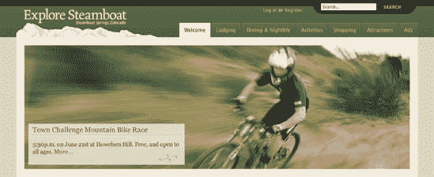
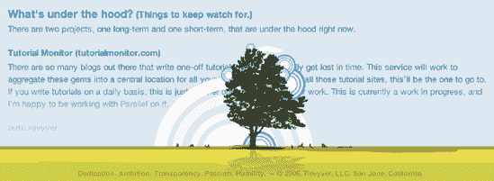
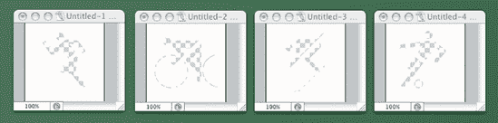

# 五、PNG 透明在网页设计中的创造性运用

杰夫·克罗夫特

`www2.jeffcroft.com`

**杰夫·克罗夫特**是一名专注于基于标准的开发的网页和平面设计师，他在堪萨斯州的劳伦斯生活和工作。作为世界在线的高级设计师，杰夫在`www.lawrence.com`和`www.ljworld.com`等获奖新闻网站工作。杰夫还在`www.jeffcroft.com`经营一个受欢迎的博客和个人网站，在那里他写了许多话题，包括现代网络和图形设计。

自从有网可织以来，杰夫就一直在织网。他在 1994 年用 SimpleText 和 Netscape Navigator 1.1N 在 Macintosh Performa 600 上创建了他的第一个网页。他于 1996 年开始全职从事网络工作，并一直坚持到现在。

尽管 Jeff 喜欢技术和小工具，但网络真正激发他灵感的是它沟通和联系人们的能力。杰夫是设计的忠实消费者，几乎在任何地方都能找到灵感。

当杰夫不在电脑前工作时，他喜欢摄影、音乐、电影、电视和在镇上度过一个美好的夜晚。


# PNG、GIF 和 JPEG

PNG 图像被网页设计社区广泛忽视，这是有原因的。直到最近，还不可能充分利用这种格式并让它在所有浏览器中可靠地工作。但是，有了 Internet Explorer 7 中对 PNG 的适当支持，以及一些方便的 JavaScript 和 CSS 技巧来解决旧浏览器的问题，我们可以使用 PNG 图像来大大增强我们的设计词汇。

## 什么是 PNG？

PNG 通常读作“ping”，代表便携式网络图形。这是一种无损压缩位图图像格式。简单地说，这是一种保存图形图像的方式，可以在不降低图像质量的情况下减小文件大小。它最初是作为无处不在的 GIF 格式的替代品而创建的，GIF 格式过去需要成像软件的生产商获得专利许可才能合法使用它(GIF/LZW 专利已经过期，所以这不再是一个因素)。PNG 也是国际标准(ISO/IEC 15948:2003)和 W3C 官方推荐标准(`www.w3.org/TR/PNG/`)。

除了作为一种免费的格式，PNG 还为网页设计者提供了几个优于 GIF 的实用优势:

*   **更大的压缩率**:对于大多数图像来说，PNG 文件比 GIF 文件更小。

*   更大的颜色深度:PNG 提供高达 48 位的真彩色，而 GIF 只允许 256 色调色板。

*   alpha 通道透明:GIF 只提供二进制透明，而 PNG 通过启用 Alpha 通道来实现透明，从而允许几乎无限的透明效果。

值得一提的是，PNG 和 GIF 一样不支持动画。有一个相关的标准叫做多图像网络图形(MNG，`www.libpng.org/pub/mng/`)，它确实允许这两种情况，但是它没有得到网络浏览器或图像软件的广泛支持。

## 那么为什么 GIF 还这么受欢迎呢？

你可能想知道为什么 PNG 不是网络上最常用的图像格式，如果它像广告宣传的那样好的话。答案在很大程度上在于对格式和浏览器支持的误解。因为 Internet Explorer 6 和更低版本不支持 PNG 的所有功能(包括 alpha 通道透明度)，人们似乎认为(尽管是错误的)Internet Explorer 根本不支持 PNG，或者至少不支持透明度。实际上，Internet Explorer 5 和 6 都支持足够多的 PNG 规范，使 PNG 图像在功能上等同于(或优于)非动画 GIF 图像。所有其他著名的浏览器，包括 Firefox、Netscape 6 和更高版本、Mozilla、Opera 6 和更高版本、Safari 和 camino，都完全支持 PNG 透明。

除了对浏览器支持的误解之外，GIF 对动画的内置支持是(并将继续是)它成功的一个关键原因。然而，近年来，随着其他技术(特别是 Flash)在动画中变得越来越常见，GIF 的这种使用变得不那么流行了。

透明性是 GIF 和 PNG 的一个关键特征，这也是它们中的任何一个被选为网页设计者选择特定图像元素的格式的原因。尽管 PNG 对透明性提供了更广泛的支持，但 web 设计人员经常需要创建图像的 GIF 版本，以适应较旧的浏览器。使用 CSS，可以将 GIF 图像发送到旧的浏览器，将高质量的 png 发送到理解它们的浏览器。但是创建两个图像对网页设计者来说是额外的工作，这经常导致人们满足于最小公分母，仍然是 GIF 图像。

最后，GIF 仍然如此受欢迎有几个原因，但大多数是基于误解或越来越不常见的用例场景。掌握了 PNG 如何工作以及如何在各种浏览器中可靠使用的一些新知识，您应该能够利用这种格式提供的所有优势，而不必依赖 GIF。

## JPEG 呢？

JPEG 是网络上另一种无处不在的文件格式，对于照片(或类似照片)图像来说，它几乎总是比 PNG 或 GIF 更好的选择。巴布亚新几内亚无意与 JPEG 竞争。在处理照片时，JPEG 的有损压缩(每次保存图像时都会导致质量下降)会产生比 PNG 小得多的文件。另一方面，当 PNG 中的图像是文本、艺术线条、徽标、单色等时，它会生成较小的文件。

# 不起眼的巴布亚新几内亚的一些伟大用途

现在让我们来看看 PNG 在网页设计中的一些重要用途。我已经将每个例子的所有文件包含在本章代码下载的一个单独的文件夹中，可以在`www.friendsofed.com`找到。

## 渐变

在过去的几年里，两种或两种以上颜色之间的渐变已经成为网页设计者最好的朋友。特别受欢迎的是微妙的，几乎不明显的渐变填充，它增加了深度和纹理的感觉，而不明显和俗气。

GIF 有时候是渐变的好选择。如果渐变是简单的双色渐变，GIF 通常就可以了。但是，GIF 256 色限制通常会在更复杂的渐变过渡中产生明显且难看的条纹。另一方面，JPEG 可以呈现非常令人愉悦的渐变，但通常会以文件大小超出预期为代价。虽然 JPEG 渐变通常“足够好”，但请记住，JPEG 确实使用有损压缩，这意味着再现的图像永远不会像原始的未压缩图像那样高保真。

考虑通常用于按钮、框和其他任何东西的典型背景渐变样式。它可能看起来有点像图 5-1 。从左上方顺时针方向，我们有原始(未压缩)图像、GIF 版本、PNG 版本和 JPEG 版本。您可以看到，PNG 产生的文件最小(515 字节)。比 GIF 图小四倍左右。JPEG 比 PNG 稍大，为 637 字节，由于有损压缩，它的质量也较低(不可否认，在这个简单的例子中，人眼察觉质量差异的能力是值得怀疑的)。


**图 5.1。Photoshop 的“存储为 Web 格式”面板显示不同格式的同一图像的文件大小差异**

## 需要在任何背景下工作的图像

有时有必要创建一个在各种背景下都能很好工作的图像。一些常见的例子是徽标和图标。这些情况传统上是 GIF 文件的领域，但是有几个原因说明 PNG 可能是更好的选择。在标志和其他简单艺术品的文件大小的较量中，巴布亚新几内亚几乎总是赢家。此外，PNG 固有的透明性使得创建一个可以在任何背景上工作的文件变得简单。PNG 确实提供了二进制透明性与 gif 一样，但也提供了更令人兴奋的 alpha 通道种类，其中像素可以是部分透明的，而不是简单的开或关。使用后者确实会增加文件大小，有时会超过(二进制)透明 gif 的大小，但也允许对艺术作品的边缘进行抗锯齿处理，这有助于在背景上放置更优雅的文件。

对于堪萨斯州托皮卡的 KTKA 频道新闻网站(`www.49abcnews.com`)，世界在线的工作人员精心制作了漂亮的天气图标，在网站的标题中显示当前的天气状况。但是，由于一个聪明的编程，使得标题在日落时从白天的配色方案变为夜间的配色方案，天气图像需要在不同的背景下工作得同样好。看看图 5-2 和图 5-3 。


**图 5.2。`www.49abcnews.com`头球，白天**


**图 5.3。`www.49abcnews.com`头球，夜间**

通过使用 PNG，我能够公正地处理设计师的作品，无论它是出现在白天还是夜晚的背景上。而且，如果我们选择在某个时候改变背景，我就不必重新制作任何天气图标，因为透明的 PNG 文件在任何东西上看起来都很棒。

如果我选择使用 GIF，我会被限制在 GIF 的二进制透明性。结果看起来会像图 5-4 。我想我们都同意这还不够好。


**图 5.4。`www.49abcnews.com`标题，nightime，用 GIF 图片代替 PNG**

## 半透明的 HTML 覆盖

一种非常常见的图形设计技术是在照片或其他图像上覆盖一个部分透明的区域，通常包含文本。这使得文本可读，而不会完全模糊下面的图像。设计师 Wilson Miner ( `www.wilsonminer.com`)在 Gingeroot 珠宝网站(`www.simplygingeroot.com`)上很好地利用了这一点，你可以看到图 5-5") 。


**图 5.5。`www.simplygingeroot.com`，由天才的威尔逊·迈纳(`www.wilsonminer.com` )** 设计

Wilson 将他的透明区域和文本包含在 JPEG 图像中。他事先用 Photoshop 制作了它们。这很好，并且完全适合网站的需求。但是，如果半透明区域的文本需要经常改变，甚至对每个访问者都不一样，那该怎么办呢？在这种情况下，将文本放在图像中是不实际的。该文本将需要在 HTML 和 CSS 精心制作。使用 PNG 的透明 alpha 通道，我们可以模仿 Wilson 的风格，而无需将文本放入图像本身。

我将从我女儿 Haley Madysan 的一张照片开始，并将其放入一个简单的 XHTML 页面中，使用一些基本的 CSS 样式(这是代码下载中的`haley_example/index.html`)。注意，我使用嵌入的 CSS 样式表只是为了演示。在现实世界中，使用链接的外部样式表通常会提供更大的灵活性、更少的代码重复和更实用的文件管理。

```html
<!DOCTYPE html PUBLIC "-//W3C//DTD XHTML 1.0 Strict//EN"
  "http://www.w3.org/TR/xhtml1/DTD/xhtml1-strict.dtd">
<html  xml:lang="en" lang="en">
<head>
  <meta http-equiv="Content-Type" content="text/html; charset=utf-8"/>
  <title>Haley's web site</title>
  <style>
    body {
      font-family: "Lucida Grande", Helvetica, Arial, sans-serif;
      background-color: #304251;
      color: #304251;
      margin: 20px auto;
      width: 720px;
    }
    #feature {
      position: relative;
      width: 720px;
      height: 439px;
    }
    #feature-content {
      position: absolute;
      bottom: 0;
      left: 0;
      height: 125px;
      width: 720px;
      background-color: #dfdfdf;
    }
    #feature-content h1 {
      margin: 0;
      padding: 0;
      line-height: 125px;
      padding: 0 30px;
      font-weight: normal;
      font-size: 2.3em;
    }
    #feature-content a {
      float: right;
      font-size: .6em;
      color: #fff;
      text-decoration: none;
      text-transform: uppercase;
```

```html
}
</style>
</head>
<body>
  <div id="feature">
    
    <div id="feature-content">
      <h1>Sweet. Smart. Beautiful. <a href="/haley" 
title="Haley Madysan Croft">Learn more </a></h1>
    </div>
  </div>
</body>
</html>
```

这样，我或多或少复制了你在 Wilson 的 Gingeroot 网站上看到的，除了没有任何透明度，如图 5-6 所示。


**图 5.6。模仿 HTML 和 CSS 的`www.simplygingeroot.com`风格，但是没有透明度**

现在我将在 Photoshop 中创建一个 1×1 像素的图像。我用浅蓝色填充图像，设置图层透明度为 70%。最后，我使用 Photoshop 的 PNG-24 设置保存图像，启用透明度。然后我简单地使用这张图片作为叠加的背景，而不是你在图 5-6") 中看到的纯灰色。

```html
#feature-content {
      position: absolute;
      bottom: 0;
      left: 0;
      height: 125px;
      width: 720px;
      background-image: url('transparent.png');
    }
```

结果与原始的非常相似，但是有了 HTML 和 CSS 文本，它变得更加灵活，如图 5-7 所示。


**图 5.7。通过 PNG 图像格式添加透明度几乎复制了`www.simplygingeroot.com`样式。**

Wilson Miner 实际上在`www.simplygingeroot.com`现场的不同区域使用了相同的概念。在展示可用产品的页面上，一个透明的 PNG 图像被用来在销售项目产品照片的左上角显示一个`On Sale`标志，如图图 5-8 所示。通过一次性创建`On Sale`图像，并使用透明背景将其保存为 PNG 图像，Wilson 避免了为每个嵌入旗帜的产品图像创建单独版本的需要。


**图 5.8。`www.simplygingeroot.com`的项链部分使用 PNG 图像，透明背景覆盖在产品图像上，在左上角显示一个`On Sale`标志。**

我还在探索汽船(`www.exploresteamboat.com`)上使用了这种技术，这是一个致力于科罗拉多州汽船泉事件、娱乐和活动的网站，如图 5-9 所示。



**图 5.9。通过透明 PNG 的方式在图像上放置一个半透明的盒子。**

在另一个创意例子中，设计师布莱恩·贝洛索(`www.avalonstar.com`)使用了一个固定在页面底部的透明 PNG 图像来创建一种“淡入”效果，当你向下滚动页面时，文本似乎凭空出现。在`www.revyver.com`(见图 5-10 和图 5-11 )发现的效果比描述的要好，所以一定要亲自检查一下。此外，树图形位于页面文本内容的前面，产生了意想不到的视觉效果。当你第一次看到它时，它有一种令人惊叹的因素。



**图 5.10。在`www.revyver.com`，设计师布莱恩·贝洛索使用了一种透明的 PNG 来创建一种当你向下滚动页面时的“淡入”效果，并将他的作品放在页面文本内容的前面。**


**图 5.11。通过在 Photoshop 中查看 Bryan 的页脚 PNG 图像，我们可以了解如何构建透明 alpha 通道来实现设计的效果。**

## 水印

另一种常见的图形设计技术是在图像上叠加微妙的水印。这可能纯粹是为了视觉风格，但也可能是为了表明图像的版权所有者或来源。

在我的个人网站上(`www.jeffcroft.com`，见图 5-12 ，我展示了我拍摄的大量照片(目前超过 2000 张)。这些照片实际上是上传到 Flickr ( `www.flickr.com`)，流行的在线照片分享网站，然后通过 Flickr 的 open API 在我的网站上本地显示。


**图 5.12。`www.jeffcroft.com`上的照片详情页**

如果我想把我的个人标志放在我所有的照片上呢？是的，可以在 Photoshop 中打开每个图像，应用徽标，然后重新保存图像。然而，当处理成千上万的频繁更新的图片时，这变得非常不切实际，有时当我不在电脑旁边时(例如，当我通过手机向 Flickr 发送照片时)。如果 logo 是自动添加的不是很好吗？巴布亚新几内亚可以帮助做到这一点。

用于在页面中显示照片的 HTML 如下所示:

```html
<a class="photo-container" href="http://www.flickr.com/photos/jcroft/2622915/">
  
</a>
```

我创建了一个 80×80 像素的白色版本，然后在 Photoshop 中将不透明度设置为 15%。使用 Photoshop 的标准 PNG-24 优化设置保存，15%的半透明性会保留在生成的 PNG 图像中。然后，我简单地将该图像添加到我的 HTML 中:

```html
<a class="photo-container" href="http://www.flickr.com/photos/jcroft/2622915/">
  
  
</a>
```

然后使用一点 CSS 将其定位在正确的位置:

```html
a.photo-container {
  position: relative;
  display: block;
}

img.watermark {
  position: absolute;
  top: 2em;
  left: 1em;
}
```

结果是一个水印看起来像是嵌入在照片本身，但实际上是一个独立的 PNG 图像位于它的上面，如图图 5-13 所示。通过把它放入我的内容管理系统的模板中，我不用做 2000 多次就可以在每张图片上添加水印。


**图 5.13。微妙的`www.jeffcroft.com`徽标标记通过透明 PNG 出现在照片的左上角。**

如果您想变得更聪明，您甚至可以使用 DOM 脚本来动态插入水印的附加(X)HTML 标记。

## 面具

PNG 图像和它的 alpha 通道透明度的另一个方便的用途是遮罩它下面的图像。从技术上来说，这与你刚才看到的水印非常相似，但它实现了不同的视觉效果。

这一次，我将在 Photoshop 中制作一个更大版本的徽标。我不把 logo 做成白色，而是把它做成透明的，图像的其余部分是白色，因为白色是页面的背景色，如图图 5-14 所示。


**图 5.14。在 Photoshop 中创建用作透明 PNG 蒙版的图像**

正如我所说的，它的技术方面与上一节中的水印几乎相同，从 HTML 开始:

```html
<a class="photo-container" href="http://www.flickr.com/photos/jcroft/2622915/">
  
  
</a>
```

然后是 CSS:

```html
a.photo-container {
  position: relative;
  display: block;
}

img.mask {
  position: absolute;
  top: 0;
  left: 0;
}
```

最终结果见图 5-15 。


**图 5.15。PNG 蒙版放在照片的上面，创造出一种“打孔”的效果。**

## 变色图标

通过使用你在前一个例子中看到的蒙版概念，一些人只用 CSS 就创建了可以改变颜色的图标。这个想法既简单又巧妙:将一个带有图标符号“打孔”的透明图像放在一个正方形、矩形或其他具有单色 CSS 背景的形状上，这样就有了一个图标。通过简单地改变背景的 CSS 颜色，你给人以图标改变颜色的印象。

也许我们需要一组表示常见运动的图标，如图图 5-16 所示。


**图 5.16。一些常见的体育图标**

我已经用图标符号形状的透明穿孔创建了白色图像，正如我在上一节的蒙版示例中对徽标所做的那样，如图图 5-17 所示。



**图 5.17。为每个图标创建“挖空”的 PNG 蒙版**

在将图像缩小到合适的尺寸(我选择了 48×48 像素)后，我使用 Photoshop 的 PNG-24 默认设置并启用了透明度来保存它们。然后我创建了一个简单的 XHTML 文件来引用每张图片(代码示例下载包中的`sports_icons_example/index.html`):

```html
<!DOCTYPE html PUBLIC "-//W3C//DTD XHTML 1.0 Strict//EN"
  "http://www.w3.org/TR/xhtml1/DTD/xhtml1-strict.dtd">

<html  xml:lang="en" lang="en">
<head>
  <meta http-equiv="Content-Type" content="text/html; charset=utf-8"/>
  <title>OMG Sports Icons!</title>
  <style>
    img {
      background-color: #cc0000;
    }
  </style>
</head>
```

```html
<body>
  
  
  
  
</body>
</html>
```

我已经指定了`#cc0000`(一种强烈的红色)作为这个文件中图像的背景色。其结果是红光透过冲压出来的形状，如图图 5-18 showing through the image.") 所示。请注意，由于 PNG 对部分透明像素的支持所允许的抗锯齿，边缘非常平滑。


**图 5.18。透明的 PNG 图像作为网络图标。注意 CSS 背景色(红色)透过图像显示出来。**

正如你在图 5-19 中看到的，我可以简单地通过改变 CSS 中的颜色值来改变图标图像的颜色:

```html
img {
  background-color: #000066;
}
```


**图 5.19。在 CSS 中改变背景颜色会改变图标的外观颜色。**

当你需要重新设计你的网站时，这种简单的颜色变化会非常方便。不用重新制作所有的图标图像，你只需要在 CSS 中改变一次颜色。这也是为链接图像实现简单鼠标悬停效果的好方法。例如，您可以使用红色作为标准颜色，蓝色作为悬停样式(代码示例下载包中的`sports_icons_example/index_links.html`):

```html
<!DOCTYPE html PUBLIC "-//W3C//DTD XHTML 1.0 Strict//EN"
  "http://www.w3.org/TR/xhtml1/DTD/xhtml1-strict.dtd">

<html  xml:lang="en" lang="en">
<head>
  <meta http-equiv="Content-Type" content="text/html; charset=utf-8"/>
  <title>OMG Sports Icons!</title>
  <style>
    a:link img,
    a:visited img,
    a:active img {
      background-color: #cc0000;
    }
    a:hover img {
      background-color: #000066;
    }
  </style>
</head>

<body>
  <a href="/running/"></a>
  <a href="/biking/"></a>
  <a href="/skiing/"></a>
  <a href="/soccer/"></a>
</body>
</html>
```

你可以使用额外的 CSS 来做更多有创意的事情，比如添加一个边框(见图 5-20 ):

```html
img {
  background-color: #000066;
  padding: 2px;
}
```


**图 5.20。使用 CSS 通过添加边框进一步增强图标的外观**

丹·塞德霍尔姆(`www.simplebits.com`)早在 2003 年(`www.simplebits.com/notebook/2003/07/24/magic_icons_for_lazy_people_like_me.html`)就在他的博客中写过一个非常类似的技术，PJ·小野里(`www.somerandomdude.net`)在他的网站(`www.somerandomdude.net/srd-projects/sanscons/`)上提供了一组基于它的图标(称为 Sanscons)。

然而，我通过使用一个带有穿孔符号的白色图像颠倒了他们的概念。他们在透明的背景上使用了一个白色的符号，这也非常有效。在这种情况下，您的 CSS 背景颜色会作为围绕符号的正方形或矩形而发光，而不是作为符号本身发光。

丹和 PJ 都使用透明的 gif 文件而不是 png 文件。这完全符合他们的需求，因为他们创建的图标风格是位图，看起来像小精灵。通过使用 png，您可以应用相同的技术，但是要利用抗锯齿边缘和部分透明来用于更详细的图标。

# 好的，但是它能在什么浏览器上工作呢？

我知道你在想什么:所有这些 PNG 透明的东西看起来真的很好，但是它实际吗？

好消息是，几乎所有现代浏览器都完全支持 PNG 图像，包括我在示例中充分利用的 alpha 通道透明度。Safari(所有版本)、Firefox(所有版本)、Opera(6 版及更高版本)、Netscape(6 版及更高版本)和 Mozilla(所有版本)都会很乐意做我要求它做的一切。坏消息是，我没有提到的浏览器是你的用户最有可能使用的:Internet Explorer。

Internet Explorer 6 和更低版本不支持 PNG 格式内置的 alpha 通道透明度。由于这几年来它一直是绝大多数网络冲浪者的选择(或非选择)浏览器，这个明显的漏洞让许多网页设计师远离 PNG。但是，随着 Internet Explorer 7 的发布，我们终于在所有主流浏览器中完全支持 PNG alpha 透明。此外，还有一些方法可以让 alpha 透明的 png 在 Internet Explorer 6 及更低版本中工作。所以，如果你想使用这些效果，没有什么可以阻止你。Internet Explorer 6 和它的老版本比它应该做的工作多了一点，但这是完全可能的。

## Internet Explorer 变通方法:AlphaImageLoader

Internet Explorer 包括几个专有的过滤器。它们在 CSS 中使用，但是它们不是任何官方 CSS 规范的一部分。换句话说，它们不是网络标准。不幸的是，Internet Explorer 6 和更低版本不完全支持 PNG 图像格式(W3C 推荐)，但微软确实包括了一个克服这一弱点的过滤器:AlphaImageLoader。

根据微软关于该主题的官方网页(`http://msdn.microsoft.com/workshop/author/filter/reference/filters/alphaimageloader.asp`)，AlphaImageLoader“在对象的边界内以及对象背景和内容之间显示图像。”换句话说，AlphaImageLoader 确实加载了 PNG 图像的全部透明度，但它是作为自己的层加载的，位于它所应用到的对象的内容之下。以这种方式加载的 PNG 图像的行为类似于背景图像，而不是前景图像(尽管它们实际上位于对象的背景之上)。

简而言之，您可以简单地将 AlphaImageLoader CSS 应用于一个`img`元素，并让它产生想要的结果。这样做将加载图像，透明度保持不变，但也会将图像作为没有透明度的对象的前景内容再次加载(从而模糊您的透明版本)。

你不能使用一个透明的 PNG 作为一个(X)HTML 元素(比如一个`<div>`)的 CSS 背景图像，并期望 AlphaImageLoader 过滤器使它在 Internet Explorer 中像预期的那样工作。记住 AlphaImageLoader 在对象的背景和前景之间插入图像。所以，虽然它会加载你的透明图片，但它还是会加载你的 CSS 背景图片，没有你漂亮的半透明像素。

## AlphaImageLoader 的实际应用

让我们回到前面的一个例子，试着让 Internet Explorer 正确地加载图像。还记得托皮卡的电视台 49 频道吗？你当然知道。图 5-21 显示了网站在 Internet Explorer 6 中的样子。


**图 5.21。`www.49abcnews.com`页眉，在 Windows 的 Internet Explorer 6 中显示，PNG 透明度保持不变**

标题的天气部分的 HTML 看起来像你所期望的那样:

```html
<div id="weather">
  <a href="/weather/"></a>
  <p><a href="/weather/">Currently in Topeka, KS:<br />
<strong>82 Overcast</strong><br /><span>Get the forecast
and more...</span></a></p>
</div>
```

你可以看到问题中的图像是一个 PNG 文件，但是 Internet Explorer 可以完美地加载它。这里的秘密成分是 JavaScript。我实际上使用了一点 DOM 脚本来动态移除`img`元素，并用一个`div`元素来替换它，您可以猜到它是 AlphaImageLoader CSS 应用于它的。JavaScript 在*条件注释*中被引用，这是微软在 ie 浏览器中内置的另一个方便但完全不标准的习惯用法。条件注释使您可以针对特定版本的 Internet Explorer 编写代码。所有其他浏览器都会忽略这些代码，所以不会影响它们。在`www.49abcnews.com`的`<head>`元素中，你会发现:

```html
<!--[if lte IE 6]>
  <script src="http://media.49abcnews.com/js/fixWeatherPng.js" type="text/javascript"></script>
<![endif]-->
```

由于第一行是`if lte IE6`，只有在低于或等于(这就是`lte`所代表的)6 的 Internet Explorer 版本显示时，这个脚本元素才会包含在呈现的文档中。其他所有浏览器，包括即将发布的 Internet Explorer 7，都将完全忽略它。

那么 JavaScript 文件`fixWeatherPng.js`中到底有什么呢？看一看:

```html
window.attachEvent("onload", fixWeatherPng);

function fixWeatherPng() {
   var img = document.getElementById("weatherImage");
   var src = img.src;
   img.style.visibility = "hidden";
```

```html
var div = document.createElement("DIV");
   div.style.filter = "progid:DXImageTransform.Microsoft.
AlphaImageLoader(src='" + src + "', sizing='scale')";

   *// Some 49abcnews.com-specific CSS styling omitted for brevity.*

        img.replaceNode(div);
}
```

我们来一步步分析这个脚本在做什么。首先，我们告诉浏览器，我们希望在页面加载时运行`fixWeatherPng`函数。脚本的其余部分是函数本身。

首先，我们通过图像的`id`属性找到要处理的图像，并将其存储在一个名为`img`的变量中。我们将`src`属性(图像文件的 URL)保存在一个名为`src`的变量中。然后，我们通过将`visibility` CSS 属性设置为`hidden`来隐藏`img`元素。

接下来，我们创建一个新的`div`元素，并将其存储在一个名为`div`的变量中。我们将使用之前保存的`src`变量中的 URL，对其应用 AlphaImageLoader 过滤器。

最后，我们用新创建的`div`元素替换原来的`img`元素(它是隐藏的),这个元素附加了 AlphaImageLoader 的优点。

使用 DOM 脚本动态插入经过 AlphaImageLoader 过滤的位有一个好处，就是可以将不必要的无效 CSS 排除在 CSS 文件之外。同样，它将无意义的`div`元素排除在(X)HTML 标记之外。由于所有这些都只在条件注释中引用，所以其他浏览器不可能被微软的专有代码所阻塞。

如果你一定要做一些无效的事情，至少你可以把它抽象出来，和所有不需要它的东西隔离开来。

# 结论

PNG 作为一种图像文件格式，比广泛使用的 GIF 提供了许多技术优势。事实上，它的优势如此之大，以至于 PNG 早就应该成为所有非照片图像的首选文件格式了。但是，Internet Explorer 缺乏对 PNG 的一些更令人兴奋的功能的适当支持，如 alpha 通道透明性，导致许多 web 开发人员回避它。但是有两个很好的理由让你不应该害怕巴布亚新几内亚。

首先，即使 Internet Explorer 6 和早期版本对 PNG 的支持并不完美，但仍然提供了 GIF 的所有功能(当然，除了动画)。PNG 几乎总是产生更小的文件，以实现更快的传输和更少的带宽使用。

第二，Internet Explorer 7 完全支持 PNG 的 alpha 通道透明性。不透明度选项的完整范围可以实现的效果实际上是无穷无尽的。我怀疑那些找到使用透明 png 的有趣方法的设计师们，比如在这一章中概述的那些，将会打开一扇全新的风格之门，这种风格迄今为止还没有在网上广泛出现。我已经给了你一些关于如何用 PNGs 和透明度来获得创造性的想法，但是不要就此打住。也找到你自己的！