# 六、网格设计

马克·博尔顿是一名来自英国加的夫的印刷设计师。他曾在悉尼、伦敦和曼彻斯特的设计机构担任艺术总监，为 BBC、T-Mobile 和英国航空公司等客户服务。马克在 BBC 做了四年的高级设计师，设计网站和网络应用程序，之后他创办了自己的设计咨询公司马克·博尔顿设计公司。

他是国际排版设计师协会的活跃成员，并在`www.markboulton.co.uk`撰写设计期刊。


# 什么是网格系统？

网格系统是一个框架。这是一个用来创作作品的系统。放眼望去，你可以看到网格系统:城市街区、杂志、报纸、建筑立面。这是因为我们人类喜欢组织事物，而且，在许多西方文化中，当它们被组织成直线时，我们就能理解它们。因为网格系统，我们知道下一步看什么，下一步按什么或点击什么，下一步做什么。但是网格系统不仅仅是功能性的；他们可以很美。

一个网格系统可以用黄金分割来设计，这个比例几个世纪以来一直与美感联系在一起。如果某样东西被认为是美丽的，那么根据美学可用性效果，它也更有用。

### 注意

关于黄金分割的更多信息，请看`http://en.wikipedia.org/wiki/Golden_section`。

网格系统在设计过程中非常重要。它们和排版一起决定了信息的视觉组织。

在这一章中，我将向你展示我是如何为最近的一个项目设计一个简单的网格系统的。不过，在我开始之前，我觉得有必要简要概述一下网格系统的设计，网格系统是如何产生的，以及它们在过去几十年中所经历的变化。

## 千古以来

没有人真正知道网格系统起源于哪里。有些人会争辩说，自从人类开始创作艺术以来，它们就一直存在。另一些人会说，当人类发展出书面语言时，它们就开始了。然而，我认为它们开始于设计师有意识地开发它们来解决构图问题的时候。我认为，这始于至少从中世纪就开始使用的维拉德图。

在第二次世界大战之前，网格系统是非常公式化的，简单明了的事情围绕着设备的比例建造的矩形结构，如维拉德图。它们往往受到生产技术的限制，有时会出现被图像打断的文本列。那个时代的网格系统很少使用空白作为设计手段，更不用说多种字体了。直到一些著名的设计师出现，包括挑战当时设计传统的约瑟夫·穆勒-布罗克曼。他们提出了一个新系统:一个更灵活的网格，有更多的工具供设计者使用，称为*模块化网格*。

这些设计师思维的重要性不应该被低估。我们所理解的现代印刷术和网格系统设计的大部分都来自于他们。从杂志设计(见图 6-1 )到网站(见图 6-2 )的平面设计中，可以看到他们工作的证据。

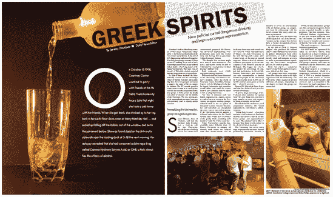

**图 6.1。杂志版面，即使像这样复杂的版面，也使用网格系统来帮助设计者编排页面。**

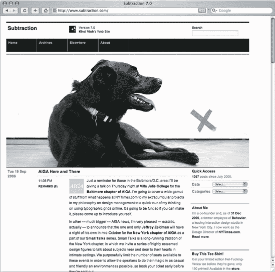

**图 6.2。Khoi Vinh 的`Subtraction.com`是少数几个使用网格系统取得巨大成效的网站之一。**

## 比率和画布

比率是任何设计良好的网格系统的核心。那些比例有时候是有理的，比如 1:2 或者 2:3，有时候是无理的，比如 1:1.618(黄金分割比例)。设计网格系统的挑战是使用这些比率来创建和谐的组合。

使用我们选择的度量将比率应用于网格系统。然而，我们在网络上无法控制的一件事是网格位于浏览器窗口的画布上。

印刷设计的画布大小由媒体大小决定，无论是纸张、标牌、信封还是其他。Web 上网格设计的画布大小通常由浏览器窗口大小决定，而浏览器窗口大小又由用户的屏幕分辨率决定。这些都不是固定的。考虑到这种灵活性，设计师应该按照最低要求进行设计，这通常是大多数用户的平均屏幕分辨率。

我不会在这里引用数字，因为我可能会错，但在相当长的一段时间里，设计的屏幕分辨率一直是 800 600 像素。

随着 List Apart(见图 6-3 )和 Stylegala 等网站的重新推出，关于 1024 像素固定宽度网格的讨论又开始了。就实际的网格设计而言，画布的大小真的无关紧要。决定采用 1024 像素的应该是对用户屏幕分辨率的研究。如果某个网站的用户群显示使用该尺寸或以上的分辨率，那么使用该尺寸进行设计的决定是有效的。??

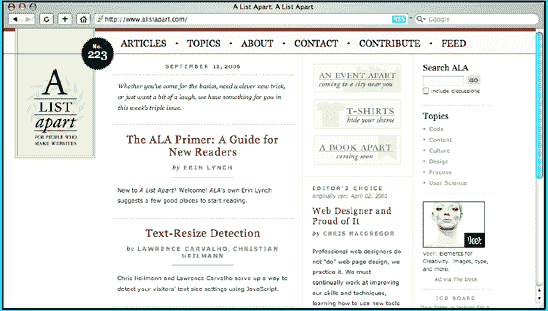

**图 6.3。Jason Santa Maria 设计的 List Apart 使用了比标准宽度更宽的宽度。这为您使用网格生成的布局提供了更大的灵活性。**

然而，正如一些人注意到的，即使你运行的分辨率高于 800 600，这是否意味着你的浏览器窗口占据了整个屏幕？我们不知道。我个人认为，这不仅是特定于平台的，还取决于个人及其经验水平。也许 PC 上更有经验的用户不会全屏使用浏览器。根据我对各种各样的人进行用户测试的经验，我看到许多 PC 上的新手用户以全屏方式运行浏览器，因为这是默认的；在 Mac 上，默认不是全屏幕。

现在您已经对网格系统有了一些了解，让我们看一个实际的例子。

# 将网格系统付诸实践

2005 年春天，国际文凭组织(IBO)找到我，让我设计一个内部网应用程序和一个他们自己开发的新的基于 web 的应用程序。选择我作为他们的设计师的令人兴奋的原因部分是因为这个项目需要使用 Web 标准来构建。

IBO 是国际教育领域公认的领导者。IBO 目前与 122 个国家的 1，785 所学校合作，为超过 200，000 名 3 至 19 岁的学生开发和提供课程计划。为了教很多学生，必须有很多老师，所有这些老师都需要访问文档资料。

几年前，IBO 开发了一个名为在线课程中心(OCC)的教师内部网，IBO 教师可以在这里访问和共享文档。在接下来的几年里，OCC 在用户和功能方面都有所增长，直到它变得明显需要重新设计。从一开始，IBO 就想要新的设计一些新鲜的、现代的、实用的东西。除了 OCC，我还被要求为 IBO 员工设计一个新的在线应用程序，名为“车间资源中心(WRC)”。这是一个复杂的应用程序，车间领导(IBO 有带教师的开发车间)可以从库中选择文档，然后将它们转换为 pdf 进行打印。它的工作方式有点像电子商务系统，将文档添加到用户的“购物车”中，然后签出进行转换和存储。

正如我所说的，这两个项目都必须使用 Web 标准构建，选择符合标准的浏览器，谢天谢地，没有包括 Internet Explorer 5！

### 注意

Internet Explorer 5 可能是一个挑战，正如你将在本书的其他部分看到的，包括 Ethan Marcotte 的第三章。Andy Budd 等人(编辑之友，ISBN:1-59059-614-5)在《掌握 CSS》中也对浏览器支持问题进行了很好的讨论。

在查看了简介之后，很明显这个项目的大部分内容都是印刷的。需要整合各种各样的内容类型，其中许多内容类型仍有待创建。因此，排版结构需要清晰简洁。此外，信息需要以四种语言呈现:英语、法语、西班牙语和中文。

将所有这些字体显示在屏幕上，不仅需要强大的排版层次，还需要强大的网格。

在我动笔或写代码之前，我关注的是用户需求和功能。一旦 IBO 同意了这些，每个人都很高兴，我们就从之前制作的线框开始进行视觉设计。

## 从笔开始

我喜欢用纸和笔开始每一个设计。这种方法有几个优点。绘图快速、便宜且容易。如果有什么不行，可以把那张纸扔掉，重新开始。你可以乱涂乱画，直到有东西能用为止。此外，与坐在电脑屏幕前相比，使用钢笔和墨水是一个更加有机的过程，可以让想法更快地流动。简而言之，既省时又省钱，还能让你远离电脑！

制作缩略图草图对于处理设计范围至关重要。在你花时间在电脑上之前，内容、功能和技术要求都可以先写在纸上。参见图 6-4 中我的初步草图示例。

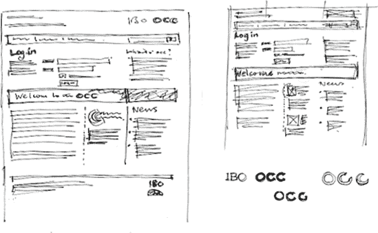

**图 6.4。在你接近电脑屏幕之前进行设计不仅省钱，还能保护你的眼睛！**

## 分解元素

在与 IBO 合作了一段时间，并研究了该组织提供的现有网站和应用程序后，我们决定采用一种框架设计方法，这种方法可以应用于各种各样的模板。逐页设计这样规模的项目是不合理的。

我们进行的过程类似于传统的网页设计过程:简要，发现，线框，设计，生产，代码。然而，我在 IBO 中扮演了更多的伙伴角色。这帮助我彻底理解了组织的业务目标和用户的目标。所以当涉及到设计时，就容易多了。

一个重要的任务是分解网站的内容对象。现在，这可能看起来像是技术、信息架构，甚至是项目经理的任务。我实际上将内容分析视为设计师任务的一部分。由于这个框架将主要是排版和网格结构，将内容分解到微观层次对于理解它们之间的关系非常重要。我通过识别设计中的元素开始了这个过程。这些可以分解为宏观元素和微观元素。

**宏元素**

宏观元素是设计中的大东西，是所有东西都适合的结构。网格可能位于一个宏元素之上，因为其他元素可以放入其中。这是我为这个项目列出的宏元素列表(见图 6-5 )。

*   列

*   桅顶

*   主导航

*   页脚

**微量元素**

微元素是构成内容其余部分的比特。它们是视觉元素，需要单独考虑，但也需要在更广泛的设计系统中考虑。以下是 IBO 项目的微观要素(见图 6-6 ):

*   框出(侧边栏元素)

*   状态框

*   标题

*   列表(有序、无序和定义)

*   桌子

*   链接

*   段落

*   形象

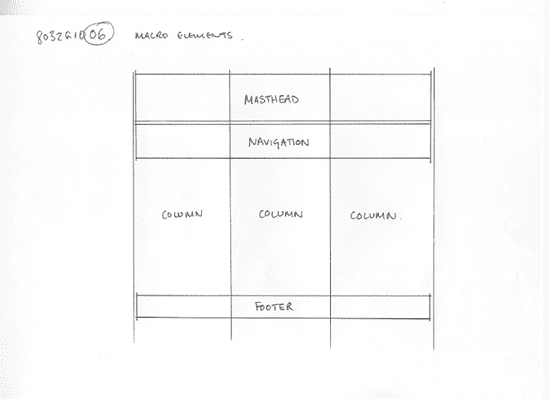

**图 6.5。可以先绘制宏元素(如柱)的草图。**

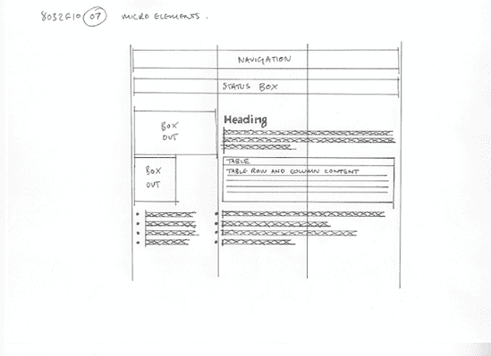

**图 6.6。微距元素位于微距元素的内部和周围，构成了页面的内容。**

你大概可以看到这是怎么回事。这开始看起来像一个 CSS 文件的结构。

## 设计柱子

开发的线框非常复杂。有很多信息需要用户快速理解，其中大部分是排版信息。屏幕上会有很多单词。因此，显示这种类型的网格需要仔细考虑。

遵循我在本章前面讨论过的一些基本原则，我开始绘制较大的网格元素，即柱。三列布局是 Web 上一种流行的网格配置，这也许是有充分理由的。

三分法是一个合成法则。事实上，它更像是一个指南，主要由摄影师使用，但可以应用于平面设计。三分法则指出，将空间水平分成三份(如果你使用图像，也可以垂直分成三份)，并使你的设计与这些线条对齐，可以创造更多的能量和张力。它帮助设计者从创造有趣的作品中去掉一些猜测。

根据三分法，我创建了一个六列网格。图 6-7 显示了我的笔墨渲染，图 6-8 显示了我在 Photoshop 中创建的版本。

您可能会注意到，在这一点上，我没有提到任何关于屏幕分辨率或浏览器窗口宽度的具体内容。我喜欢在最初的网格设计中保留这些，因为我在这个过程的这一点上处理比率和比例。在深入生产的本质之前，我不喜欢关注绝对的测量。

然后，可以将这些列划分为多个布局配置，如图图 6-9 所示。正如你所看到的，这里的布局选项对于大多数网站和应用程序来说是足够多样的。

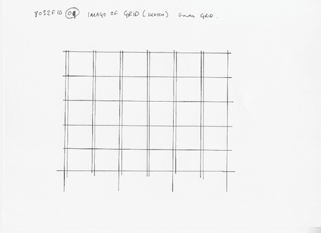

**图 6.7。最终六列网格草图**

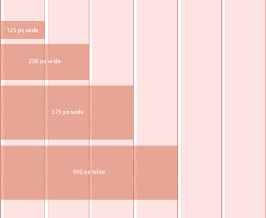

**图 6.8。显示色谱柱配置和尺寸的最终表格**

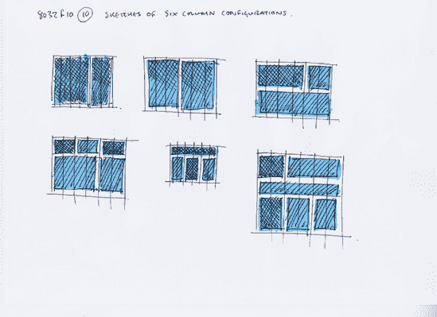

**图 6.9。从六列网格中可以获得许多成分配置。此处显示的示例不仅说明了不同的列配置，还显示了这些列的相对视觉重点。**

## 添加装订线、边距和填充

你可能已经注意到在我最初的网格设计中没有水槽。

檐槽是柱子之间的缝隙。它们在那里，所以不同列的文本或图像不会碰到一起。在网格系统设计中，有时(取决于你阅读的理论)，檐槽与柱子是分开的。由于我们构建列的方式，这给我们在 Web 上设计网格系统带来了实际问题。

通常，但不总是，我们使用 Web 标准创建的列是`div` s，它们使用 CSS 给定宽度、位置和样式。因此，理想情况下，我们不希望为檐槽创建单独的列。因此，我们将檐槽作为列的*部分*(参见图 6-10 )，并且它们是通过填充或者创建边距来实现的，用于放置在列内的元素或者有时是列本身。


**图 6.10。本例中的檐槽是柱的一部分，而不是位于柱之间。**

我总是选择向列中的元素添加填充。这可能意味着当我写样式表时，我最终会为自己创造更多的工作。我可以简单地添加一个空白。但是这样做可以确保当我想让元素相互碰撞时，我可以做到。这也避免了 Internet Explorer 的盒子模型问题，但由于在这个设计中它不是一个受支持的浏览器，我不必太担心这个问题。

所以，我有我的专栏全部六个。现在我可以开始添加水平元素，如页脚和报头。但在此之前，我需要解决一个重要的排版测量问题。

对于这个项目的构建，要求用户能够选择固定或灵活的布局。在固定布局中，列将由像素测量来确定，因此是固定的。在灵活布局中，百分比将用于列，而 ems 将用于排版。

em 是一种印刷度量单位，等于字体的宽度。所以，如果字体设置为 12px，那么 1em(宽度)就是 12px。当使用 em 作为度量单位时，我们遇到的问题是大多数浏览器的内部样式表将 1em 渲染为大约 16px。这本身是好的，但它使使用倍数和除法比它需要的更困难(除非，当然，你对 16 乘法表很在行)。为了解决这个问题，我将默认的 16px 减少到 10px(见图 6-11 )。我通过向 CSS 文件中的 body 标记添加声明来实现这一点:

```html
body {
font-size: 62.5%;
}
```

### 注意

Richard Rutter 在 2004 年写了一篇名为“如何在 ems 中调整文本大小”的文章，详细介绍了这种技术。

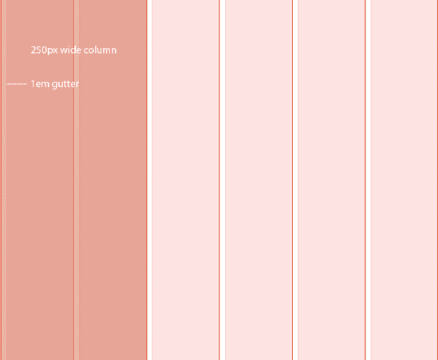

**图 6.11。10px 的装订线现在变成了 1em，因为我已经将正文的字体大小定义为 62.5%。**

这使得 1em 大约为 10px (16 除以 100 乘以 62.5 等于 10)，这是一个很容易处理的度量单位。现在我们可以把像素大小等同于 ems。例如，设置为 14px 的文字可以表示为 1.4em，9px 的文本可以表示为 0.9em，依此类推。

当我将它添加到 body 标记中时，我还添加了全局空白重置，它删除了所有浏览器默认的边距和填充。

```html
{ margin: 0; padding: 0;}
```

### 注意

全局空白重置是由 Andrew Krespanis 在 2004 年 10 月(`http://leftjustified.net/journal/2004/10/19/global-ws-reset/`)的`www.leftjustified.net`首次开发的。

通过使用 CSS 通用选择器`*`，我能够选择 HTML 文档中的所有元素，然后移除所有默认的填充和边距。

如果你想要更严格的样式，你可以使用雅虎的全局重置样式表，它可以移除浏览器中几乎所有的默认样式。这给了你一个完全空白的画布来开始你的工作。参见`http://developer.yahoo.com/yui/reset/`了解更多关于该样式表的信息。

## 颜色和其他视觉元素呢？

这个项目的所有颜色和图形元素都由另一个单独的样式表控制。这是因为网格、版式和许多元素的基本样式(比如无序列表、定义列表和图像)需要在整个站点中保持不变，因为整个站点有两种不同的配色方案。很简单，用灰色设计，简单地根据网站覆盖颜色。

向容器`div`中添加一个类来控制各种布局选项。这个三列布局有一个类`c1-c2-c3`，但是布局选项是为各种各样的布局创建的，比如`c1`、`c1-c2`、`c1-c2-c3-c4-c5`等等。这个命名约定告诉我两件事:六列网格中使用的列数以及文档顺序。例如，`c1-c2-c3`可能看起来和`c2-c1-c3`一样，但是文档顺序会不同:带有`c2`的`id`的`<div>`会出现在`c1`和`c3`之前。

总而言之，OCC 有六种不同的样式表:

*   全局样式表

*   IBO 样式表，控制所有顶级颜色

*   用户可配置的布局样式表

*   一个排版样式表，它的元素是用户可配置的

*   颜色样式表，控制整体颜色

*   出于辅助目的的替代缩放布局

这被证明是该设计最具挑战性的方面之一。

## 构建 XHTML

一旦我有了网格的想法，我就开始考虑如何使用 Web 标准来构建它。首先，我构建了一个粗略的 XHTML 模板，开始开发 CSS。

### 注意

在任何多栏布局中，一个重要的考虑因素是文档顺序。在这一阶段，你应该试着把网格的外观放在一边，把注意力集中在文档的内容流上。先获取内容；稍后添加 CSS。

所以，我开始添加线框中规定的各种元素。一、实用程序菜单:

```html
<!-- BEGIN #utilities -->
<div id="utilities">
  <ul id="accessibility">
    <li><a href="#">High contrast layout</a></li>
  </ul>
  <ul id="services">
    <li><a href="#">IBO</a></li>
    <li><a href="#">OCC</a></li>
    <li><a href="#">IBIS</a></li>
    <li><a href="#">WRC</a></li>
    <li><a href="#">Log out</a></li>
  </ul>
  <!-- END #utilities -->
</div>
```

然后是刊头:

```html
<!-- BEGIN #masthead -->
<div id="masthead">
  <!-- branding -->
  <div id="branding">
    <h1><a href="#">International Baccalaureate Organization</a></h1>
    <h2><a href="#" title="The IBO's Online Curriculum Centre
      Homepage" accesskey="1">online curriculum centre</a></h2>
  </div>
  <ul id="language">
    <li><a href="#">English</a></li>
    <li><a href="#">Francais</a></li>
    <li><a href="#">Espanol</a></li>
    <li><a href="#">Chinese</a></li>
  </ul>
  <!-- END # masthead -->
</div>
```


报头包括几个重要的元素:组织的名称、您所在的服务(或站点)以及语言切换(这两个站点有四种语言版本)。

我尽量避免使用在意义上是表象的类名。例如，我可以将刊头命名为`topbar`、`topnavigation`或类似的名称，但这意味着一个表示性的位置，所以，`masthead`就是这样。

一旦我有了这两个元素，我需要将它们包装在一个容器`div`中，我将使用这个容器来定义网格的宽度，包括固定模式和灵活模式。

```html
<div id="container">
```

然后，我可以在报头后面添加列。出于演示的目的，我在这里添加了虚拟内容。

```html
<!-- BEGIN #c1 -->
<div id="c1">
  <p>Some content goes here</p>
  <!-- END #c1 -->
</div>

<!-- BEGIN #c2 -->
<div id="c2">
  <p>Some content goes here</p>
  <!-- END #c2 -->
</div>

<!-- BEGIN #c3 -->
<div id="c3">
  <p>Some content goes here</p>
  <!-- END #c3 -->
</div>
```

我这里有三列，分别是从`c1`到`c3`的`id`。也许，从语义上来说，这些不是列的最佳名称，但是在命名约定中不要太抽象，我认为这是说明这一点的最佳选择。此外，出于开发目的，它们很容易记住，这在六列网格有数百种布局可能性时非常重要。

现在我有了 HTML 结构的基本框架。我有一个刊头和三个栏目。

```html
<!DOCTYPE html PUBLIC "-//W3C//DTD XHTML 1.0 Strict//EN"
"http://www.w3.org/TR/xhtml1/DTD/xhtml1-strict.dtd">
<html >
<head>
  <title>IBO: OCC logged in home page</title>
</head>
<body>

  <!-- BEGIN #utilities -->
  <div id="utilities">
    <ul id="accessibility">
      <li><a href="#">High contrast layout</a></li>
    </ul>
    <ul id="services">
      <li><a href="#">IBO</a></li>
      <li><a href="#">OCC</a></li>
      <li><a href="#">IBIS</a></li>
```

```html
<li><a href="#">WRC</a></li>
      <li><a href="#">Log out</a></li>
    </ul>
    <!-- END #utilities -->
  </div>

  <!-- BEGIN #masthead -->
  <div id="masthead">
  <!-- branding -->
    <div id="branding">
      <h1><a href="#">International Baccalaureate Organization</a></h1>
      <h2><a href="#" title="The IBO's Online Curriculum Centre
        Homepage" accesskey="1">online curriculum centre</a></h2>
    </div>
    <ul id="language">
      <li><a href="#">English</a></li>
      <li><a href="#">Francais</a></li>
      <li><a href="#">Espanol</a></li>
      <li><a href="#">Chinese</a></li>
    </ul>
    <!-- END # masthead -->
  </div>

</body>
</html>
```

图 6-12 显示了此时的 XHTML。现在让我们继续使用 CSS 进行样式化和布局。

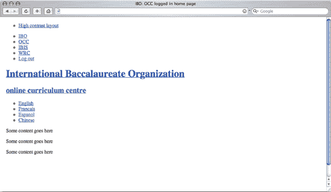

**图 6.12。XHTML。目前还没有应用 CSS，但是这个阶段对于显示文档顺序非常重要。**

## 构建 CSS

我现在正处于网格发展的阶段，我需要移动东西。我总是发现首先开发一个基于固定像素的网格更容易，以确保我所有的比例都正确，并且构图正常。我在这方面使用的一个小技巧是由 Khoi Vinh 在他的优秀网站`www.subtraction.com`上首次描述的。还记得我在 Photoshop 里做的网格图(图 6-8 )吗？在网格的整个开发过程中，我导出网格并将其作为背景添加到容器`div`中。

```html
#container {
background: url(img/grid_background.gif);
}
```

我现在有了一个网格的可视化表示(见图 6-13 )来开始对齐元素。网格可能是复杂的野兽，所以拥有一个可以如此容易地从模板中添加和删除的视觉参考对我们设计师来说真是一个好消息。

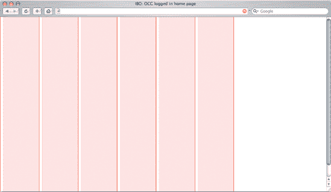

**图 6.13。使用网格作为背景图像允许我将所有元素对齐到它。**

**设定容器的宽度**

我通常从外部元素向内开始构建 CSS。我首先设置容器的宽度`div`。

```html
#container {
  float: left;
  width:750px;
  margin:0 auto;
  text-align: left;
  background: #fff url(grid_background.gif) repeat-y;
}
```

声明非常简单。我定义了一个 750 像素的全局宽度；这是因为我的列宽是 125px 乘以 6。上下页边距被有效移除，左右页边距被设置为`auto`以使`div`在浏览器窗口居中(参见图 6-14 )。

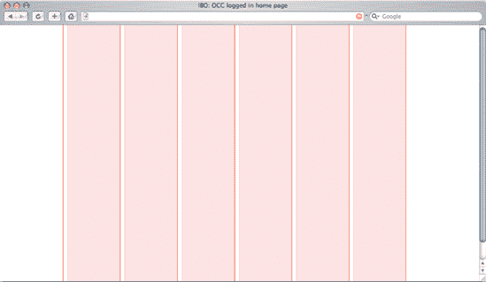

**图 6.14。网格居中**

**设置列宽**

接下来，我使用浮动来定位列。首先，我向左浮动`#c1`和`#c2`，向右浮动`#c3`。

```html
#c1 {
  float: left;
  width: 250px;
}

#c2 {
  float: left;
  width: 250px;
}

#c3 {
  float: right;
  width: 250px;
}
```

这会将列定位在背景图像的网格标记上。为了确保这一点，我给每个`div`添加了不同深浅的灰色作为背景色(见图 6-15 )。

```html
#c1 {
  float: left;
  width: 250px;
  background: #eee;
}

#c2 {
  float: left;
  width: 250px;
  background: #ccc;
}

#c3 {
  float: right;
  width: 250px;
  background: #999;
}
```

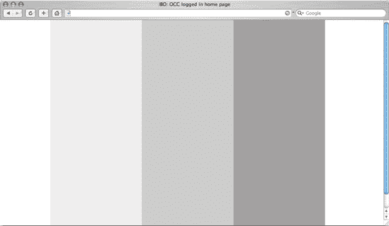

**图 6.15。三列**

现在，柱应该与垂直网格线完全对齐。但是报头和所有那些列表呢？嗯，用一点 CSS，我可以删除项目符号，将它们显示成一行，并确保报头的高度与其中的版式相关。

一旦对齐正确，我就移除列中的灰色，为了这个例子的目的，我给列增加一个高度，以显示当`div`中有内容时网格将如何延伸。

**设计标题和语言菜单的样式**

报头只是向左浮动，宽度设为 100%，以确保`div`一直延伸。

```html
#masthead {
  float:left;
  width:100%;
  background: #000;
  margin: 1em 0 0 0;
}
```

正如你在 HTML 中看到的，语言菜单只是一个带有`language`的`id`的`<ul>`。首先，我给它一点填充，这样文字就不会碰到浏览器窗口的顶部。这是以像素为单位设置的，不像我所有其他的排版尺寸，都是以 ems 为单位设置的，因为我不希望这个值在文本调整大小时改变。我希望它在右边，所以我将整个列表向右浮动，并给它一个`none`的`list-style`，以去掉子弹。

```html
#language {
  padding: 2px 0 0 0;
  float: right;
  list-style:none;
}
```

接下来，我将每个`<li>`向左浮动，并在两边添加一些填充。请注意，此填充是以 ems 而不是像素来声明的。这是因为当调整文本大小时，我希望按比例保留这个空间。如果度量单位是像素，那么 Internet Explorer 中的空间会调整大小，但文本不会。最后，我在右边添加了一个边框，以便在视觉上分隔元素。

```html
#language li {
  float: left;
  padding: 0 1em 0 1em;
  border-right: 1px solid #fff;
}
```

然后我把链接变成白色，以突出黑色。我将用一个单独的颜色样式表覆盖这个默认颜色，但是我总是发现用黑白颜色开始开发更容易。

```html
#language li a {
  color: #fff;
}
```

### 注意

我发现首先用黑白设计有助于澄清我正在做的设计决定。如果颜色不是问题的一部分，那就把它去掉，下次再考虑。

图 6-16 显示了布局中的报头。

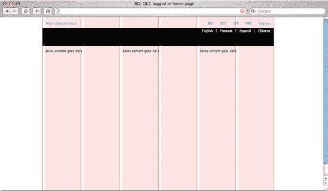

**图 6.16。添加报头。现在布局真的成型了。**

**设计可访问性和服务菜单**

我用对待语言菜单的方式来对待可访问性和服务菜单中的列表。我将`<li>`元素向左浮动，并给它们填充和一个`none`的`list-style`:

```html
#accessibility {
  float: left;
  list-style:none;
  padding-top: 15px;
}
#accessibility li {
  float: left;
  padding: 0 1em 0 1em;
  border-right: 1px solid #ccc;
}

#services {
  float: right;
  list-style:none;
  padding-top: 15px;
}
#services li {
  float: left;
  padding: 0 1em 0 1em;
  border-right: 1px solid #ccc;
}
```

我还在这些列表的顶部添加了一些填充。请再次注意，这是以像素为单位的固定填充。调整文本大小时，我不希望此值改变。

**品牌设计**

任何网站的品牌都非常重要。在这里，品牌不仅仅是你在哪里，你在做什么服务的标志，它还是一个导航装置。这两个标题将链接到相关网站。网站品牌部分的`h1`和`h2`组合在一起，作为同类商品的一个分支，一个`div`，带有`branding`的`id`。我浮动左边，给它一些空白和填充，并添加 IBO 标志作为背景图像。

```html
#branding {
  float: left;
  text-align: left;
  margin: 1em 0 0 1em;
  padding: 0 0 1em 6em;
  background: url(ibo_logo.gif) no-repeat 0 0;
}
```

右侧填充如此之大的原因是为了容纳 IBO 标志，当我开始添加颜色和圆角时，我会马上添加它。

使用 ems 确定标题的大小。给`h1`一个相当于 14px 的值，给`h2`一个相当于 18px 的值。

```html
#branding h1 {
  font-size: 1.4em;
}
#branding h2 {
  font-size: 1.8em;
  font-weight: bold;
}
```

然后我把链接涂成白色。

```html
#branding h1 a,
#branding h2 a {
  color: #fff;
}
```

图 6-17 显示了这些增加的内容。

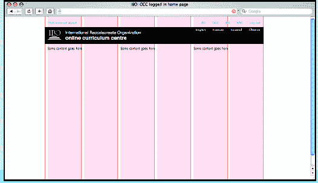

**图 6.17。添加品牌和菜单。在这里，我添加了 IBO 标志作为报头的一部分，和其他菜单一起。**

## 它开始看起来像一个网站

事情现在开始看起来更像一个网站。我坚持我建立的网格，设计开始感觉正确。

现在我已经有了基本的列结构和报头，我添加一些示例内容:标题、链接、段落和无序列表。我仍然是黑白的，所以我可以专注于对齐网格，并确保排版处于良好的工作状态。

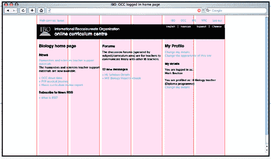

接下来，我开始给报头添加颜色(通过一个单独的彩色 CSS 样式表)。

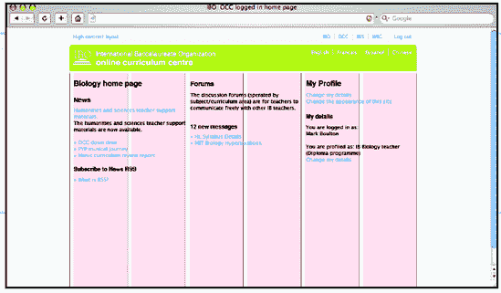

现在谈谈排版。在这个阶段，我从 body 标签上的背景声明中删除了网格图像。我现在不需要它了，因为我知道一切都正常。

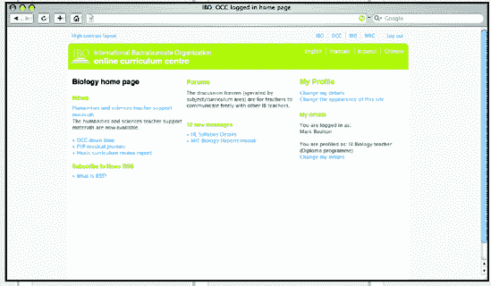

最后，我给列中的元素添加了一些边距，以创建一些水平对齐。

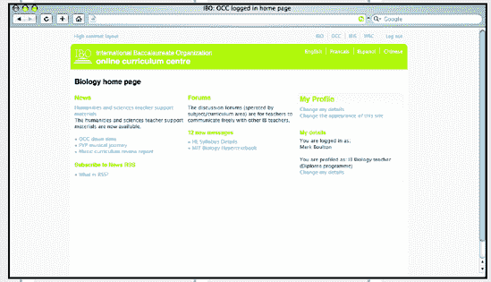

# 设计的问题

这个项目面临许多挑战。这是一次重新设计，所以有遗留的内容，品牌方面的历史，以及所有重新设计带来的一定程度的用户期望。这些都是必须考虑的。

CSS 是一个特殊的挑战。不过，原因可能出乎你的意料。你以为我会说 ie 浏览器有问题，对吗？啊哈！不，那不是问题所在。

作为一名设计师，我很幸运能为一个梦想中的客户工作，他基本上会说，“哦，忽略不符合标准的浏览器。”当然，我问他们是否确定。起初，我不太明白这是为什么，但我很快意识到这是因为在推荐和支持的软件方面，我们面对的受众非常有限。在 IBO 中，Firefox 实际上是推荐的浏览器。当然，对于 IBO 的读者来说，Internet Explorer 仍然是主流浏览器，但是我使用 Firefox 作为主要浏览器来开发设计，以确保代码尽可能符合标准。后来，我将注意力转向了 Internet Explorer 6，并添加了变通方法以确保它也能在该浏览器中工作。很高兴目标浏览器允许我将黑客攻击保持在最低限度。

### 注意

在这一章中，我没有涉及 CSS 黑客。为什么呢？嗯，我认为它们超出了这里的范围，可能会混淆对构建网格的解释。如果您的设计需要，您可以在中添加 hacks。在这本书里有更多关于黑客的内容，CSS Mastery(ED 之友，ISBN: 1-59059-614-5)包含了关于黑客的全面信息。

正如我所说的，这个项目的挑战是如何管理 CSS。

这个网站的定制选项非常丰富。所有这些选项都将保存到用户配置文件中，这意味着系统必须记住用户保存的字体大小、布局等等。概要规定用户必须能够改变布局(固定或灵活)和字体大小。此外，还有一个为视障人士设计的缩放布局。除此之外，两个站点，OCC 和 WRC，都必须共享相同的元素，比如网格和排版；唯一的区别是颜色。如果所有这些都要使用不同的样式表来解决，这是一个复杂的问题。

克服这些问题并不容易，但是由 IBO 和我自己承担的项目过程对我帮助很大。有规格，线框，用例，和概念所有你在这样规模的项目中期望的文档。然而，这个过程很小，而且与客户很亲密。一次又一次的重复。我想说，一起解决问题是这个项目真正的成功之处。

# 结论

我在这里创建的是一个简单的网格系统，而不仅仅是列。

对于不经意的观察者来说，这只不过是使用标准 250 像素宽的三列布局。然而，我仔细地构建了网格，考虑到我使用这个六列网格系统的所有组成选项。这允许各种各样的布局选项，重要的是，这些选项相互关联。

为了子孙后代，也为了让你了解新设计的根本不同，我提供了一些截图来显示之前和之后的状态。图 6-18 和 6-19 为 OCC 现场，图 6-20 为 WRC 现场。我肯定你会同意，新网站远远超过旧网站。

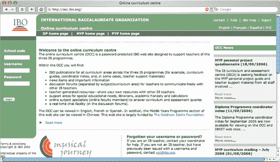

**图 6.18。前世的 OCC**

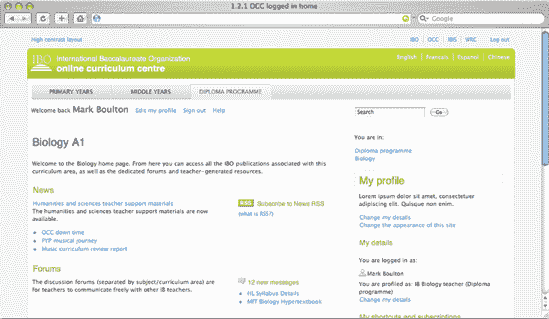

**图 6.19。新的 OCC 设计通篇使用 CSS 布局，并为用户提供改变字体和大小的选项，并为视障用户提供高对比度布局。**

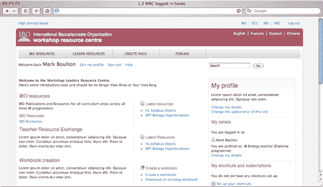

**图 6.20。新 WRC 与 OCC 共享许多基本样式表。唯一的区别是不同的`colour.css`，它覆盖了基础`colour.css`。**