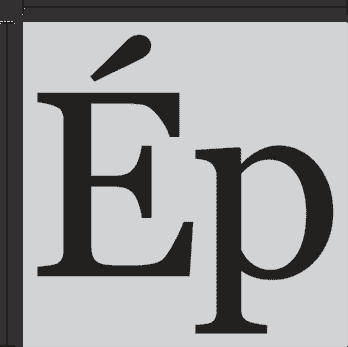
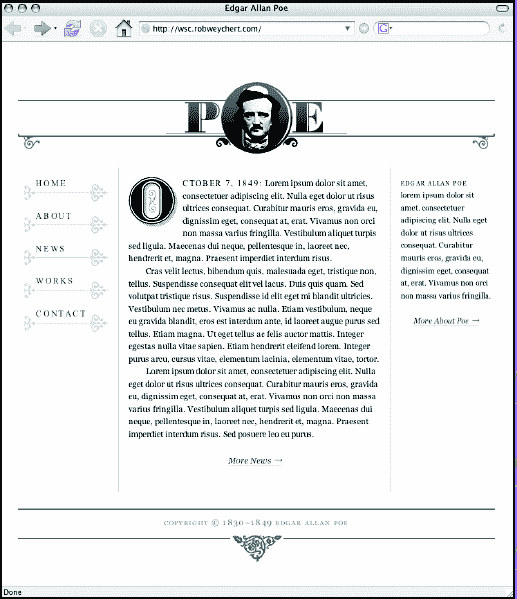

# 七、跨越类型鸿沟：CSS 的经典排版

**罗布**微信

`www.robweychert.com`

Rob Weychert 是一名平面设计师、艺术家、作家和思想家，以其对细节神经般的一丝不苟而闻名。自 20 世纪 90 年代末以来，Rob 一直为娱乐、旅游、医疗保健、教育、出版和电子商务等不同行业的客户提供印刷和交互式平面设计解决方案。

当他不专心于设计时，Rob 将大部分时间花在了仔细研究音乐和电影，写俳句，丝网印刷，拍照，骑着他的 BMX 在家乡费城的街道上巡游。他也在他的个人网站`www.robweychert.com`上写关于这些主题和所有设计的东西。


# 铅字简史

像所有的艺术一样，它(印刷术)基本上不受进步的影响，尽管它也不能不受变化的影响。

罗伯特·布林赫斯特，

*排版风格的要素*

印刷术有着丰富而传奇的传统，就像大多数艺术形式一样，它的制作过程进展缓慢。

自 15 世纪古腾堡发明了具有里程碑意义的活字印刷术(一种由金属雕刻而成的单个字母组成的印刷方法)之后，印刷术技术直到工业革命才出现重大变化。随后的照相排字机和 Monotype 机以及(相对短命的)照相排字工艺本质上是同样古老的印刷方法的更快、更有效的模型。然而，麦金塔在 1984 年将字体和设计引入数字时代是一种激进的新方法的培养。然后，不到十年后，就在平面设计师开始习惯于印刷的数字制作工具时，一种全新的媒介被推给了他们。

万维网是一种革命性的获取信息的方式，因此，它需要一种不同的方式来思考设计。然而，随着几个世纪的印刷传统被抛在身后，以及相对较新的计算机的采用，大多数设计师很难考虑除了印刷以外的任何东西，而且 HTML 从未打算适应平面设计也没有帮助。网站的另一半是由计算机爱好者设计的，无论是专业的还是业余的。他们对网络令人兴奋的潜力有了更好的理解，但对视觉设计原理知之甚少或一无所知。

网页设计的早期黑暗时代就这样过去了。语义的、灵活的文档看起来一点也不好，好看的文档一点也不语义或灵活。跨越世纪之交，对标准化 web 技术的更大重视旨在解决这个问题。

CSS 给了设计者设计漂亮网页所需的工具，而不会破坏 HTML 的底层语义结构。以前闻所未闻的印刷控制现在成为可能。但是这个时候，许多设计师已经在网上成熟了，并且忘记了经过时间考验的传统和细致入微的印刷设计惯例。

今天，在网络越来越复杂的初期，它的大部分排版仍然是软绵绵的。

本章旨在通过将印刷排版丰富的视觉传统与网络排版激动人心的动态功能相结合，来帮助阻止这种趋势。我将展示他们可能会在哪里汇合，他们应该在哪里同意不同意，以及仅仅几个简单而微妙的排版技术如何给页面注入新的生命。

# 认识你的文字面孔

设计者对于在网络上设置字体的第一个抱怨似乎是跨平台可用的字体数量很少。虽然这可能会令人沮丧，但重要的是要记住，选择字体只是排版设计的一个方面。印刷世界中一些最好的印刷工把他们的武器库限制在几个他们通过反复学习和使用而非常熟悉的字体上。即使适用于网络的有限的字体选择确实提供了较少的多样性，它也迫使我们保持同样的良好习惯。幸运的是，一些可用的面孔是为屏幕设计的最好的例子。对这些字体的深刻理解，包括它们的创造者和历史背景，对我们使用它们大有裨益。

## 介绍格鲁吉亚

如果你怀疑一个漂亮的设计可以用一种普通的字体来实现，我希望这一章能改变你的想法。我要讲的大部分内容将使用 Georgia，这是微软在 1993 年委托著名字体设计师 Matthew Carter 设计的衬线字体。根据一项正在进行的代码风格网站调查(`www.codestyle.org/css/font-family/sampler-CombinedResultsFull.shtml`)的最新结果，Georgia 出现在大约 91%的 MAC、84%的 PC 和 53%的 Unix 系统上，使其成为世界上最普遍的衬线字体之一。谢天谢地，这也是一个出色的设计。

乔治亚很像 Times New Roman ( 图 7-1 vs. Georgia (bottom)") )，是仅有的分布较广的衬线字体之一。像泰晤士报新罗马，格鲁吉亚是一个永恒的设计，体现了几个不同的历史时期的审美和实用的特点。然而，就我们的目的而言，乔治亚在屏幕上胜过泰晤士报新罗马，因为那是它被设计来显示的地方。


**图 7.1。泰晤士报新罗马(上)对佐治亚(下)**

## 流程

通常，当创建数字字样时，其印刷形式优先。首先绘制文字形状的轮廓，然后基于这些轮廓绘制小文本大小的位图版本(为了在屏幕上清晰，以防它会出现在屏幕上)。换句话说，与分辨率无关的设计被改造成极低的分辨率。结果各不相同，但在许多情况下，小文本在屏幕上几乎难以辨认。在格鲁吉亚问题上，卡特决定逆转这一进程。因为这种字体主要是为屏幕设计的，所以首先绘制位图(8 到 12 点大小)，然后绘制轮廓以适应它们(图 7-2 )。这为基于屏幕的衬线字体带来了前所未有的优雅清晰度，这种分类因其模糊性而臭名昭著。


**图 7.2。佐治亚州轮廓 vs 佐治亚州位图**

## 这项工作的合适人选

马修·卡特被选中承担这项任务绝非偶然。他是一位著名的字体设计师和印刷历史学家的儿子，20 世纪 50 年代末，他开始在金属上切割原始设计和经典字体的复刻，然后继续共同创立了著名的 Bitstream 和 Carter & Cone digital type foundries。基于他几十年的经验，令人印象深刻的客户名单(包括*时代杂志*、*纽约时报*和*华盛顿邮报*)和大量工作(最著名的是贝尔百年纪念，以及后来的屏幕上的 Verdana)，很少有人能声称更有资格设计一种永恒、清晰的字体，用于屏幕上，但仍然植根于传统。

好了，现在你已经掌握了乔治亚是如何、为什么以及何时产生的，你已经准备好用一个实际的例子来使用它了。让我们建造一些东西！

# Poe 的页面

为了展示一些可能性，我为恐怖片的原创大师埃德加·爱伦·坡做了一个小小的主页。基本布局由宽度大致相等的四列组成。两个中间的列组成了主要的内容区域，左侧是导航列，右侧是侧边栏列。页眉和页脚横跨四列的整个宽度。


**图 7.3。示例项目**

以下是标记的简化版本:

```html
<body>
<!-- FULL PAGE WRAP -->
  <div id="wrap">
<!-- NAV -->
    <ul id="nav">
      <li>Home</li>
      <li>About</li>
      <li>News</li>
      <li>Works</li>
      <li>Contact</li>
    </ul>
<!-- MAIN CONTENT -->
    <div id="main">
      <p>Main content copy.</p>
    </div>
<!-- ABOUT -->
    <div id="about">
      <p>About copy.</p>
    </div>
<!-- FOOTER -->
    <h6 id="footer">Copyright information.</h6>
  </div>
</body>
```

您可以在`http://wsc.robweychert.com/`在线查看该案例研究，并且可以从`www.friendsofed.com/`下载源文件。该页面已在以下浏览器中经过测试:

*   用于 Windows 的 Internet Explorer 6 和 7

*   适用于 Windows 和 Macintosh 的 Firefox 1.5

*   适用于 Windows 和 Macintosh 的 Opera 9

*   用于 Macintosh 的 Safari 1.3 和 2.0

### 注意

因为这一章的重点是排版，案例研究的某些方面在这里就不讨论了，但是在其他地方有详细的记录。其中包括 Roger Johansson 的一般页面布局的弹性设计方法(“固定宽度还是可变宽度？有弹性！”`www.456bereastreet.com/archive/200504/fixed_or_fluid_width_elastic/`)和道格拉斯·鲍曼(Douglas Bowman)的滑动门技术，用于展开标题和导航(“CSS 的滑动门”，`www.alistapart.com/articles/slidingdoors/`)。

## 一个可读的行长度

我将讨论的大部分技术集中在案例研究的主要内容领域(`#main`)。这一节将演示其比例是如何设计的，以及这些比例对布局其余部分的影响。

的数目。。。

由于`#main`是页面层次结构中最重要的元素，我想确保它具有适当的焦点权重，并且可读性最大化。第一步是确定线条长度的宽度。单列中可读文本集的标准范围是 45 到 75 个字符(包括空格)。这个范围允许行以合理的增量断开，防止它们变得太长或太短而不便于阅读。许多排字工人认为大约 66 个字符的行是理想的，我也是其中之一，所以这个例子将使用这个宽度。这是一个关键的比例，我想确保它尽可能保持良好，这将是如何将页面放在一起的一个重要因素。

### 注意

好吧，我们承认:这本书打破了这里多次概述的行长惯例，但我们有我们的理由。这主要是因为我们不仅要处理文本，还要处理代码段；如果你不得不把代码分割成几个片段来适应页面，代码行的可读性会变得很差。

如果我使用的是液体布局，线条长度会根据用户浏览器窗口的宽度而增减(图 7-4 )。另一方面，如果我使用固定宽度的布局，当用户调整浏览器文本的大小时，行的长度会增加或减少，如果浏览器窗口比我的页面指定的宽度小，水平滚动的可能性也存在(图 7-5 )。由于对这两个选项都不满意，我选择了弹性布局，这给了我两全其美的选择(图 7-6, but also contracts with the window to avoid horizontal scrolling (right).") )。

布局将随着文本大小或浏览器大小的调整而扩展和收缩，但不会扩展超过指定的宽度。这里的折衷方案是，我的行会随着浏览器窗口的收缩而变短，但太短的行比太长的行更容易阅读，也是水平滚动的一个令人愉快的替代方案。


**图 7.4。流动布局:当浏览器窗口扩大时，许多人会发现这一行太长，阅读起来不舒服。**


**图 7.5。固定宽度布局:如果浏览器窗口太小，水平滚动是必要的。**


**图 7.6。弹性布局，扩展和收缩:当浏览器窗口扩展(左)时，行长度保持所需的比例，但也会随着窗口收缩以避免水平滚动(右)。**

**全能的 em**

弹性布局的秘密武器是 em。在印刷和网络世界中，em 是字体大小的正方形，基于其最宽字符的宽度或其最低下行字母(如小写字母 *p* 的词干)到其最高上行字母(如小写字母 *b* 的词干)或发音符号(图 7-7 )的距离。在 CSS 中，em 基于父元素的`font-size`。因此，如果我在 ems 中指定我的布局的宽度，它将随着文本大小的调整而扩展和收缩，保持文本大小和行长度之间的比例，从而保持我的 66 个字符的行完整无缺。



**图 7.7。一个乔治亚 em**

我的布局的弹性将适合大多数桌面浏览器分辨率，但我仍然希望它的预期比例(图 7-8 )在 800600 浏览器窗口中舒适地放置，因此 740px 的原生页面宽度是谨慎的。为了在 ems 中指定这个宽度，我必须做一些数学计算。


**图 7.8。近似布局比例**

我的主要内容区域(`#main`)需要有 66 个字符的宽度，这也需要是布局全宽(`#wrap`)的 50%左右。如果我用 ems 中指定的宽度设置一个 Georgia 文本块，计算几行中的字符数(包括空格)，然后用这些行的平均值除以文本块的宽度，我会发现 Georgia 对一个 em 来说平均是 2.2 个字符。因此，一个 66 字符的度量应该是 30em，这将使`#wrap`成为 60em。如果我用 740 像素除以 60，我得到 12.3 像素，然后*瞧！*我有一个`font-size`。

但是有一个问题。Internet Explorer 不会使用以像素为单位指定的`font-size`来调整文本的大小。幸运的是，现代浏览器对关键词的渲染相当一致，我知道`font-size: small`的分辨率大约是 13px。有了这个数字和一点点数学知识，我可以在我想要的结果范围内达到比例。

首先，我需要重新计算`#wrap`的宽度，因为它是基于我的`font-size`的，现在它有点大了。如果我用 740 像素除以 13 像素，`#wrap`的新宽度(四舍五入)是 57em。为了保持我的 66 字行，`#main`的宽度将保持为 30em，这是`#wrap`宽度的 53%(再次取整)。最后，考虑每列 2%的页边距将得到图 7-9 所示的比例。


**图 7.9。最终布局比例**

**翻译**

带着自鸣得意的简单，CSS 简洁地显示了我如此努力和冗长地确定的比例:

```html
body {
  font-family: Georgia,"Times New Roman", Times, serif;
  font-size: small;
  }

#wrap {
  max-width: 57em;
  }

#nav {
  width: 19%;
  margin-right: 2%;
  }

#main {
  width: 53%;
  margin-left: 2%;
  margin-right: 2%;
  }

#about {
  width: 19%;
  margin-left: 2%;
  }
```

图 7-10 展示了结果:一个可读性很强的文本块，其比例将保持合理预期的一致性。关于在 CSS 中使用 ems 的另一种方法，参见第六章“网络网格设计”


**图 7.10。`#main`一个可读行的长度为**

## 段落缩进

现在`#main`有了一个舒适的宽度，我将把注意力转向其中的段落。自从段落元素出现以来，web 浏览器通常使用默认的下边距来呈现段落元素，通常在 1em 到 2em 之间。这就产生了段落之间空行的效果，这种习惯在印刷中肯定不是没有过。然而，在印刷中很可能看到的是一种在网络上相对罕见的描绘惯例:段落缩进。

空行有时会破坏连续的文本，段落首行的缩进可以标记新的段落，同时保持文本的连贯性。不过，在网络上应该谨慎使用。段落缩进作为空行的替代方法在打印时效果很好，因为文本还有其他物理拆分方式，如多列和分页。网络上的冗长写作偶尔也会给读者的眼睛一种空行所能提供的放松，因此，在简洁的陪伴下，网络上的段落缩进是最快乐的。

由于只有三个简短的段落，`#main`是段落缩进的完美候选。我只需要做两件事:

*   缩进除第一段以外的所有段落的第一行。

*   去掉那些空行。

**简单缩进**

一个既能缩进段落又能去掉空行而不修改标记的非常简单的方法是这样做:

```html
p {
  text-indent: 2.1em;
  margin: 0;
  }
```

缩进 2.1em 在我的文本块中雕刻出一个正方形(图 7-11 )，看起来很棒。不幸的是，尽管结果很完美，但是这个 CSS 规则缩进了我的第一段。除了缩进之外，在段落之间使用空行是多余的，同样，缩进文本中的第一段也是多余的。两种形式的描述一前一后只会强调重点，就像添加一些大的红色文本，上面写着，“看，一个新段落的诞生！”好吧，也许没那么糟，但我还是不想做。


**图 7.11。每个段落缩进都有一个空格。许多排字工人认为正方形是理想的缩进。**

**不完美世界中的相邻选择器**

使用相邻选择器是我合乎逻辑的下一步:

```html
p {
  margin: 0;
  }

p+p {
  text-indent: 2.1em;
  }
```

`p+p`相邻选择器将只处理紧接在另一个段落前面的一个段落。理论上，这正是我想要的*,因为第一段明显没有另一段在前，因此会忽略这条规则。在一个完美的世界里，这会完成手头的任务，我现在应该在酒吧了。遗憾的是，Internet Explorer 6 不支持相邻的选择器，现在它将我的所有段落呈现为一个模糊的斑点。*

 *当我在整理我的个人网站时遇到类似的问题，我是这样解决的:

```html
p {
  text-indent: 2.1;
  margin: 0;
  }

h2+p {
  text-indent: 0;
  }
```

所讨论的内容区域以两个标题开始:一个标题(`h1`)和一个日期戳(`h2`)，然后是第一段(`p`)。`h2+p`相邻兄弟选择器在兼容的浏览器中实现了预期的效果，在 Internet Explorer 中实现了缩进的第一段，这是在标记不可更改的情况下的必要妥协。

在我目前的情况下，这不是一个可行的选择，因为`#main`的第一段前面没有另一个元素，但也没有什么能阻止我稍微改变标记。我只需要给第一段一个类`first`:

```html
<p class="first">First paragraph copy goes here.</p>
```

然后在我原来的 CSS 中再添加一条规则:

```html
p {
  text-indent: 2.1em;
  }

.first {
  text-indent: 0;
  }
```

任务完成(图 7-12 )！


**图 7.12。具有优雅段落缩进的内聚文本块**

这个文本块的形状很好，但是还需要一点点。这种排版风格的最后两个要素包括创造性地使用大写字母，这将为页面增添足够的视觉趣味来完成设计。

## 首字下沉

首字下沉是一种被称为 *versal* 的书写形式，这种书写传统可以追溯到欧洲中世纪时期最早的照明手稿(图 7-13 )。一个 versal 的目的是庄严地介绍文本。首字下沉通过显著放大段落的第一个字母并在前几行为其留出空间来做到这一点。


**图 7.13。15 世纪 70 年代晚期的一页小时书，一种常见的照明手稿**

作为另一个优雅的保险措施，我的读者会立即被`#main`要说的话吸引，首字下沉将非常适合这一页。

以下是我希望首字下沉包括的属性:

*   正文应该换行。

*   它应该是文本大小的六倍左右。

*   顶部应该与第一行文本的顶部齐平。

*   左侧应该与文本的左侧保持齐平，但右侧和底部应该有一个小的边距，以避免与文本对接。

**不完美世界中的伪元素**

因为我直接处理第一段中的第一个字母(它已经有了一个类`first`)，所以使用 CSS `:first-letter`伪元素选择器是一个合理的起点。因此，我的首字下沉规则将被发送到`p.first:first-line`，并且很容易从我的期望属性列表中逐行翻译出来。

```html
p.first:first-letter {
  float: left;
  font-size: 6em;
  line-height: .75em;
  margin-right: .1em;
  margin-bottom: .1em;
  }
```

难得的是，这段代码在我测试过的所有浏览器中都呈现出合理的一致性，*除了 Mac 版 Firefox 的*，它神秘地在首字下沉的顶部和底部插入了额外的空间(图 7-14 )。再怎么摆弄`line-height`、`padding`或`margin`也不会让它在不同浏览器中表现一致，如果段落以`em`或`strong`(或`span`，我稍后会添加)这样的行内元素开头，结果会更加不同。遗憾的是，我不得不尝试不同的解决方案。


**图 7.14。火狐`:first-letter` bug**

**跨越到救援**

对加价的另一个小调整将是必要的。我将我的 *O* 包装在一个`span`(带有一个`drop`类)中，如下所示:

```html
<p class="first"><span class="drop">O</span>ctober 7, 1849...</p>
```

我给这门课的规则和以前完全一样，就像这样:

```html
.drop {
  float: left;
  font-size: 6em;
  line-height: .75em;
  margin-right: .1em;
  margin-bottom: .1em;
  }
```

有效！我的首字下沉已经到位(图 7-15 )。


**图 7.15。一款纯 CSS 格鲁吉亚首字下沉**

**图像替换**

但是我还是不开心。尽管我很爱乔治亚，但那个大乔治亚还是不太适合我。这一页需要一些更具装饰性的东西，所以我创建了自己的华丽首都 *O* ( 图 7-16 )。这种字体大致基于波多尼字体，这是一种精致的现代衬线字体，在爱伦坡出生前一年设计。


**图 7.16。我的定制 versal**

我将使用图像替换技术，而不是把我的通用图像放在标记中。

### 注意

我使用的特殊图像替换技术只是众多技术中的一种，其中大部分是由 Dave Shea 在他的`mezzoblue.com`网站(`www.mezzoblue.com/tests/revised-image-replacement/`)上编辑的。虽然我在这个例子中推荐这个方法，但是其他的方法可能更适合不同的情况，我建议对它们进行复习。你也可以在第二章“用 CSS、Flash 和 JavaScript 驯服野生 CMS”中找到更多关于图像替换技术的内容

图像替换正如它所说的那样:它用图像替换元素的 HTML 文本。在这个例子中，它将通过使用负的`text-indent`从元素中吸出文本，然后放入我的 versal 图形作为背景图像来完成。

```html
.drop {
  width: 83px;
  height: 83px;
  float: left;
  text-indent: 9999px;
  background-image: url(o.gif);
  background-repeat: no-repeat;
  background-position: top left;
  margin-right: .1em;
  margin-bottom: .1em;
  }
```

我的浮动和边距与前一个例子相同，我的文本负向缩进到另一个星系，宽度和高度的值对应于我的通用图形的宽度和高度。它在我测试的所有浏览器上都很棒，除了 Internet Explorer。那个浏览器选择了负缩进我的整个段落，而不仅仅是我的`span`，导致段落完全消失(图 7-17 )。


**图 7.17。Internet Explorer 文本缩进错误**

幸运的是，这个问题可以通过简单地将`span`声明为块级元素来解决:

```html
.drop {
  width: 83px;
  height: 83px;
 display: block;
  float: left;
  text-indent: 9999px;
  background-image: url(o.gif);
  background-repeat: no-repeat;
  background-position: top left;
  margin-right: .1em;
  margin-bottom: .1em;
  }
```

我定制的首字下沉已经到位了(图 7-18 )！


**图 7.18。我闪亮的首字下沉**

## 全部大写

我对我的首字下沉很满意。然而，让我的段落从如此夸张的介绍直接变成小得多的小写文本在视觉上有点不协调。我将用最后一点改进来解决这个问题，之后`#main`将准备好与公众见面。

如果你没有在排版世界里学过，你可能已经在网络世界里学过了，尤其是在电子邮件和即时消息中:用全部大写字母设置的文本应该非常谨慎地使用。大写锁定键的错误组合会给你的观众留下你在对他们大喊大叫的印象，这不是让他们回来的最好方法。记住这个规则，所有的大写字母仍然可以发挥很大的作用，有节制的使用将在我巨大的首字下沉和它引入的小得多的正文之间建立一个逻辑桥梁。由于我的日期戳`October 7, 1849`(爱伦坡的死亡日期)已经作为一个简洁、独立的文本开头，所以它是一个完美的全大写处理的候选。

您的第一反应可能是在标记中设置全部大写的文本，从而避免我将要描述的更加费力的 CSS 过程。这不是一个好主意，原因有很多，其中最主要的是您以后可能希望对文本进行不同的样式化。如果这是一个用来构建许多页面的模板，那么在一个 CSS 文件中更改一个规则要比在几十个(或者几百个或者几千个)HTML 文档中更改标记容易得多。此外，正如您将在下面的示例中看到的，在设置所有大写文本时，可能需要考虑更多的内容，而不仅仅是在大写锁定状态下键入。

首先，我将最后一个`span`添加到我的标记中，作为日期戳的目标:

```html
<p class="first"><span class="datestamp">
<span class="drop">O</span>ctober 7, 1849:</span> Lorem ipsum...</p>
```

现在，我只需要两个简单的、不言自明的 CSS 规则来使我的`datestamp`类以期望的方式运行:

```html
.datestamp {
  text-transform: uppercase;
  letter-spacing: .13em;
  }
```

给`text-transform`一个值`uppercase`将确保我的文本全部大写。它还可以取值`lowercase`(所有小写文本)和`capitalize`(每个单词的第一个字母大写)。至于`letter-spacing`，当文本全部大写时，一点额外的字母间距是易读性的关键。通过少量的实验，我发现非常精确的 0.13em 测量对于这种情况是理想的(图 7-19 )。


**图 7.19。#全大写的美因日戳格鲁吉亚**

## 文本图与标题图

我的段落介绍看起来不错，但是我还有最后一条鱼要钓。让 Georgia 如此珍贵的原因之一是，它是唯一一种在网络上广泛使用的字体，包括*文本数字*(有时被称为*旧式数字* ) ( 图 7-20 vs. Times New Roman's titling figures (bottom)") )，本质上是小写数字。就像小写字母一样，文字数字的上升和下降对正文的破坏性比大写字母要小，称为*标题数字*。理想情况下，字体将包括文本和标题图，但通常只包括后者。Georgia 有一个奇怪的区别，它只包含文本数字，因此，我的大写日期戳包含小写数字。这不行。


**图 7.20。佐治亚州的文字数字(上)与泰晤士报新罗马标题数字(下)**

泰晤士报新罗马，其相似性和格鲁吉亚和包括所有权的数字，是这个问题的完美解决方案。此外，我发现 Times New Roman 的所有大写字母比 Georgia 的所有大写字母略轻一些。通常情况下，我会避免在同一个文档中使用如此相似的字体，但是在这种情况下效果很好，因为这里的想法是创造一个*一个*字体的假象。再有一个简单的 CSS 规则，`#main`将最终完成(图 7-21 ):

```html
.datestamp {
 font-family: "Times New Roman", Times,
Georgia, serif;
  text-transform: uppercase;
  letter-spacing: .13em;
  }
```


**图 7.21。`#main`完成**

## 小型大写

我还选择了一个排版元素，应用在 Poe 主页右侧的`#about`段落中。我希望第一行以小型大写字母出现。

`#about`的基本标记和`#main`非常相似。

```html
<div id="about">

  <p class="first">Edgar Allan Poe lorem ipsum...</p>

  <p class="more"><a href="#" title="Edgar Allan Poe: About">
    More About Poe </a></p>

</div>
```

小型大写字母通常比其字体的 x 高度略高，x 高度是其小写字母 *x* 的高度。因此，它们实际上是小写大写字母。它们通常用于缩写、首字母缩略词，如在本案例研究的例子中，以比 versal 更柔和的方式标记文本的开始。为此，介绍性段落的前几个词或整个第一行可以用小型大写字母。

**公平警告**

对于外行人来说，小型大写字母很容易被误认为是大写字母的缩略版本。但是，在一个设计良好的字体中，小大写和大写字母是分开画的，两者的细微差别保持了字母笔画粗细的一致性(图 7-22, the full cap (center), and the true small cap (right).") )。真正的小型大写字母在小字体时更容易阅读，并且不会扰乱文本的流动，而仿小型大写字母(例如，8 点大写字母设置在一组 12 点字体中)几乎总是引人注目和分散注意力。


**图 7.22。请注意仿小笔帽(左)、全笔帽(中)和真小笔帽(右)之间的笔画宽度差异。**

当面对下面一组 CSS 规则时，web 浏览器会将指定的文本设置为乔治亚斜体，这当然是一种不同于 Georgia 常规字体的设计，而不仅仅是一种倾斜的斜体。

```html
font-family: Georgia;
font-style: italic;
```

然而，如果我要添加一个规则`font-variant: small-caps`，文本不能设置为真正的小型大写字母，因为格鲁吉亚没有提供。同样，绝大多数最广泛、公开传播的数字文本字体不包括一组小型大写字母。因此，web 浏览器默认使用仿小型大写字母。在 Quartz (Mac OS)和 ClearType (Windows)等屏幕字体平滑技术出现之前，这并不是什么大问题，因为人造小型大写字母的比例差异的微妙之处被像素化字母的低分辨率所取代(图 7-23 vs. smoothed small caps (bottom)") )。然而，随着屏幕字体平滑变得越来越普遍，我们不能再依靠浏览器来掩盖自己的印刷错误*??。仿小型大写字母现在在屏幕上看起来和印刷时差不多。*


**图 7.23。像素化小型大写字母(上)与平滑小型大写字母(下)**

虽然早在网络出现之前，假的小型大写字母就已经成为合法的嘲笑对象，但可以说它们在网络上是可以接受的，因为真正的小型大写字母还没有出现。尽管它们可能很显眼，但它们仍然有能力增强和丰富页面。是否使用它们是你自己的决定。

**不完美世界中更多的伪元素选择器**

我最后一次尝试使用伪元素选择器以心痛告终(还记得`:first-letter`？)，但是，为了小盘，我准备再试一次，这次用`:first-line`。不出所料，`:first-line`会影响其目标元素的第一行文本。在这种情况下，目标元素将是`#about`的第一段。

```html
#about p.first:first-line {
  font-variant: small-caps;
  text-transform: lowercase;
  letter-spacing: .1em;
}
```

到目前为止，这些 CSS 规则应该是相当基本的，但是有一行可能引起了质疑。为什么我用了`text-transform: lowercase`？原因既有优惠的，也有实际的。小型大写字母本质上既可以作为大写字母，也可以作为小写字母。因此，通常需要大写的单词(如专有名词)在以小型大写字母设置时，可能会也可能不会以全大写字母开头。出于一致性的考虑，我通常更喜欢*而不是*使用小型大写字母，因为首字母缩写词通常使用小型大写字母来代替构成它们的完整大写字母。至于实际的关注，我不希望任何更多的注意力吸引到我的人造小帽比必要的。让他们和完整的帽子坐在一起会招致比较，并进一步暴露他们的不真实(如图 7-23 中的所示)，所以如果可以的话，我更喜欢把他们放在他们自己的同类中。 vs. smoothed small caps (bottom)")

这可能是合理的推理，但 Internet Explorer 和 Safari 不会听进去。每一种都有自己的缺陷，阻碍了预期效果的发生。Internet Explorer 不会认可`font-variant`和`text-transform`规则的任何组合，Safari 也不会认可应用于伪元素选择器的`text-transform`规则。因此，Internet Explorer 和 Safari 都将标记的大写字母显示为全大写。Firefox 和 Opera 可以正确显示文本。

特别是 Safari 的 bug 使得我想要的效果不可能在不同的浏览器上一致地呈现，因为它是我在这里尝试使用的伪元素选择器`first-line`和文本转换规则`lowercase`的组合。因此，要避免对我的标记进行进一步的更改，并确保我的小型大写字母只保留在文本的第一行，这需要一个折衷方案:Internet Explorer 和 Safari 将显示一个可能混合了全大写字母和仿小型大写字母的包。看着完成的页面(图 7-24 )，我想我绝对可以做得更差！



**图 7.24。所有的努力都是值得的！**

# 结论

毫无疑问:印刷世界和网络世界是不同的地方，各有各的特点。不过，它们至少有一个非常重要的共同点，那就是它们的存在是为了帮助人们交流。虽然我们应该承认并尊重这样一个事实，即在印刷上对一方有效的东西对另一方可能无效，但我们也应该尊重读者，他们可以从许多技术中受益，这些技术的效用与任何一种媒体都没有必然的联系。我在这一章中概述的技术应该已经给了你一个很好的想法，让你可以在网上激活类型。*