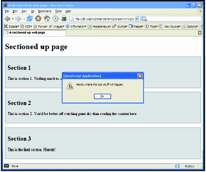
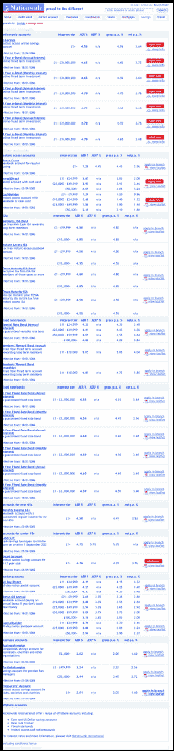

# 八、打印魔法：使用 DOM 和 CSS 拯救地球

伊恩·劳埃德经营着`Accessify.com`，一个致力于促进网页可访问性并为网页开发者提供工具的网站。具有讽刺意味的是，他的个人网站 Blog Standard Stuff 与博客标准毫无关系(这是一种文字游戏)，尽管偶尔可以在那里找到与标准相关的精华。

伊恩全职为全国建筑协会工作，在那里他尽力影响基于标准的设计(“在不同程度上！”).他是 Web 标准项目的成员，为可访问性任务组做出了贡献。除了网络标准和可访问性，他喜欢写他的国外旅行，最近从工作和所有网络事物中抽出“一年时间”(但后来在他休假的一年里写的比以往任何时候都多)。他发现自己的大部分时间都被一个苛刻的老太太占用了(放松，这只是他的旧大众野营车)。

伊恩最近为 SitePoint 写了他的第一本书，名为*使用 HTML & CSS* 以正确的方式构建你自己的网站(在这本书中，他向完全的初学者教授基于 Web 标准的设计)。


# 一种印刷技术诞生了

拯救地球？这是怎么回事？好吧，我会在适当的时候说的。首先，我想带你回到过去。好的，当我写这篇文章的时候，仅仅是一个月前，但是正是在这个时候，我得到了你将在这一章中读到的东西的灵感。

我正坐在办公桌前忙着某件事，这时我的同事对我说，“有没有什么方法可以让你的网页只打印某个特定的部分？”

“哦，是的，”我回答说，“这很容易，你可以用打印 CSS 样式来做到这一点。您想打印页面的哪一部分，不想打印哪一部分？”

“嗯，那要看情况，”他回答道，准备抛出众所周知的曲线球。“我们有很长很长的利率页，但根据这个人的账户，他们会希望打印不同的部分。”

我仔细考虑过了。我记得在一些浏览器上，可以选择页面的一部分，然后只打印那一部分，这是在`Print`对话框中提供的一个选项，但这并不理想，因为它要求用户知道这个选项的存在。此外，它并不是在所有浏览器上都可用。对于技术人员来说，可以使用一个油滑的猴子<sup class="footnote1">【1】</sup>脚本来打印一个给定的选择，但这可能只占我们预期受众的 0.001%。我的同事想要的是浏览器没有以任何明显的格式提供的东西。所以我告诉他，“对不起，你不能这么做。恐怕除非他们知道突出显示某个部分，然后选择“打印选择”，否则这是不可能的。”

然后我回到我当时在屏幕上推动的像素。然而，这个想法一直萦绕在我的脑海里。我个人很讨厌你想打印一页的一个部分，结果却打印了七页废话，其中六页马上就被扔掉了。难道没有办法解决这个问题并减少浪费的打印输出吗？然后我想到了:打印 CSS 的混合；一些好的、可靠的语义标记；一些不引人注目的 JavaScript 可能正好达到他的目的。所以我开始进行概念验证。

# 基本想法

我知道使用 DOM、JavaScript 和 CSS 可以动态地改变网页在屏幕上的外观，我想知道同样的理论是否适用于打印。没有任何迹象表明这不可能发生。我记得在 List Apart ( `http://www.alistapart.com`)中读过 Aaron Gustafson 的文章，他演示了一种显示脚注的方法，我知道这种行为有一定的范围。我只是不确定这会有多“动态”。找到答案的唯一方法就是尝试一下。于是，我开始有了这个想法:

对于任何具有可能需要单独打印的特定部分的给定页面，比如促使我进行调查的利率页面，使用 JavaScript 动态切换显示属性(也就是说`block`或`none`)，但是对于打印视图，仅*切换*。

这项技术的其他目标包括

*   这项技术必须不引人注目。<sup class="footnote2">【2】</sup>它应该符合渐进式增强的类别，<sup class="footnote2">【3】</sup>并且所有的行为都应该从一个共享的 JavaScript 文件进行控制。

*   一定要好看，不仅仅是工作。

*   它必须基于完全干净和有效的标记。

*   这项技术的目的需要对用户来说非常明显。

令人欣慰的是，所有这些目标都是可以实现的，我将在接下来的几页中展示这一点。

# 准备基础

有了一个清晰的最终目标和一些明确的目的，我开始着手一个简单的概念证明。这是视觉效果看起来有点难看的过程的一部分，但功能部分得到了解决，所以不要担心，我会在本章的后面让它看起来很漂亮。我知道最终的目的是什么(将它应用到冗长的利率页面上，该页面需要切割以供打印)，但首先，我创建了一个包含基本内容的虚拟页面。

## 分割页面

这项技术的关键是知道你想打印和不想打印的页面部分。在我看来，这可以使用 CSS 类来完成，显而易见的选择是使用类名`section`，或者，如果你想让它的用途非常清楚，使用类似于`print_section`的类名。<sup class="footnote1">【4】</sup>所以，这里有一个简单的 HTML 页面，包含一些部分

```html
<!DOCTYPE HTML PUBLIC "-//W3C//DTD HTML 4.01 Transitional//EN"
  "http://www.w3.org/TR/html4/loose.dtd">
<html>
<head>
<title>A sectioned-up web page</title>
<meta http-equiv="Content-Type" content="text/html; charset=utf-8">
<style type="text/css">
.print_section
{
  border:1px solid gray;
  background:#e1e1e1;
  margin:0 0 15px 0;
  padding:10px;
}
</style>
</head>

<body>
  <h1>Sectioned up page</h1>

 <div class="print_section">
    <h2>Section 1</h2>
    <p>This is section 1\. Nothing much to see here, just a bunch of meaningless words.</p>
 </div>

 <div class="print_section">
    <h2>Section 2</h2>
    <p>This is section 2\. You'd be better off watching paint dry than reading the content here.</p>
 </div>
```

```html
 <div class="print_section">
    <h2>Section 3</h2>
    <p>This is the final section. Hurrah!</p>
 </div>

</body>
</html>
```

图 8-1 显示了这个虚拟页面。


**图 8.1。分割页面，准备打印**

这将是访问者将看到的基本页面(忽略我用于虚拟页面的占位符内容)。现在的诀窍是在那些浏览器的基础上增加额外的好的层次，这些浏览器正在进行工作渐进增强。

## 识别截面

页面的基本结构已经有了，但是如果这项技术要发挥作用，还需要一些其他的东西。如果我们在任何给定的时间都不能确定我们正在处理的是哪个部分，我们如何神奇地切换这些部分的外观呢？线索就在这个问题中:*标识*，或者`id`，这些部分。是的，我们只需要给部分添加一个`id`属性，就像这样:

```html
<div id="sect1" class="print_section">
  <h2>Section 1</h2>
  <p>This is section 1\. Nothing much to see here, just a bunch of
    meaningless words.</p>
</div>

<div id="sect2" class="print_section">
  <h2>Section 2</h2>
  <p>This is section 2\. You'd be better off watching paint dry than
    reading the content here.</p>
</div>

<div id="sect3" class="print_section">
  <h2>Section 3</h2>
  <p>This is the final section. Hurrah!</p>
</div>
```

这暂时不会对事物的视觉方面产生影响，但是它将提供我们 JavaScript 行为所需要的钩子。现在让我们来看看它的具体细节。

## 伪代码第一

在本章的前面，我用简单的英语描述了这种技术应该做什么。现在我将转向伪代码的世界，描述这里将要发生的事件的顺序。

浏览器开始加载页面，并在包含所有行为规则的外部`.js`文件中包含一段 JavaScript。当页面加载后，JavaScript 启动并执行以下操作:

1.  首先，它遍历整个文档寻找`div`元素并创建一个数组

2.  接下来，它一个接一个地遍历这个由`div`元素组成的数组。如果`div`元素的类名为`print_section`，它会执行以下操作:

    1.  它会创建一个按钮或链接，显示“打印此部分”或类似内容。

    2.  然后，它对该按钮应用一个行为。单击时的行为是首先检查被单击链接的 id。如果 id 与当前节匹配(当浏览器浏览文档中所有可打印的节时)，使该节可见(在打印视图中)。如果单击的链接的 id 不匹配(当浏览器搜索文档中所有可打印的部分时)，它会隐藏当前部分(同样，仅用于打印)。

3.  在浏览器中调出`Print`对话框，如图图 8-2 所示。不幸的是，要避免这一步并让它直接*印刷是不可能的。用户仍然可以再单击一个按钮。在图 8-2 中的 Firefox 示例中，是`OK`按钮。*

    

    **图 8.2。打印前出现`Print`对话框。**

4.  当创建了每个部分的可视元素并定义了它们的相关行为后，它们就会被插入到页面中。

所有这些步骤都应该很快完成。除非网页很长，或者网页上有一个元素下载时间比其他元素长得多(例如，来自外部网站的图像像狗一样运行，而不是灰狗)，否则用户不会注意到页面外观的不协调变化。

### 注意

页面上的单个低速加载元素会延迟这种效果的原因是因为 JavaScript 在页面加载后运行。这是因为一旦页面上的所有内容都被下载了，所有链接到其他位置的图像、脚本和 CSS 文件都会发生 onload 事件，而不仅仅是页面的标记。

这就是虚拟页面的攻击计划。让我们看看一些真正的代码，它们将帮助我们实现这一目标。

## 活动策划

首先需要做的是设置页面加载事件。现在有许多不同的方法可以做到这一点，关于哪种方法是最好的也有同样多的观点。我敢打赌，这本书的许多读者都有能力做出自己的决定，并能适应我正在使用的建议的`addEvent`函数(来自斯科特·安德鲁:`http://tinyurl.com/qcmrd`)。然而，即使事实并非如此，你，亲爱的读者，不知道我在说什么，也不要担心，这真的是太担心最小的细节了。走开，这里没什么可看的，没什么可看的。。。

`addEvent`功能启动网页。它告诉浏览器它需要运行什么(哪个 JavaScript 函数)和什么时候运行(在什么事件上，例如，当页面加载时或者当某个东西被点击时)。这是:

```html
function addEvent(elm, evType, fn, useCapture)
{
  if(elm.addEventListener)
    {
    elm.addEventListener(evType, fn, useCapture);
    return true;
    }
  else if (elm.attachEvent)
    {
    var r = elm.attachEvent('on' + evType, fn);
    return r;
    }
  else
    {
    elm['on' + evType] = fn;
    }
}
```

如果你觉得这看起来像天书，不要担心。你不需要理解它做的每件事或如何做。您只需要知道它是为了解决一些跨浏览器 JavaScript 问题而创建的，它允许您使用三个参数来调用它:

*   你在处理什么元素(`elm`)

*   事件是什么(点击、加载、聚焦)(`evType`)

*   当元素触发了事件时，您希望它执行什么 JavaScript 函数(`fn`)

这是一个你如何称呼它的例子:

```html
addEvent(window, 'load', addPrintLinks, false);
```

或者，说白了，当`window`(或者更准确地说，这个窗口中的文档)已经`load` ed 时，请运行`addPrintLinks`功能。这个函数还没有建立，所以为了测试它是否工作，我暂时在这里放了一个简单的警告:

```html
<script type="text/javascript">
  function addPrintLinks()
  {
    alert("Here's where the cool stuff will happen");
  }
  addEvent(window, 'load', addPrintLinks, false);
</script>
```

警报看起来像图 8-3 。



**图 8.3。动作中的警报占位符**

## 从伪代码到实代码

列出了完成这项工作所需的步骤之后，让我们来看看将完成这项工作的实际代码(我将引用我前面的描述):

浏览器开始加载页面，并在包含所有行为规则的外部`.js`文件中包含一段 JavaScript

在前面的例子中，我展示了嵌入页面本身的脚本。现在是时候将脚本放在它们自己的文件中，并在网页中引用它们了，就像这样:

```html
<!DOCTYPE html PUBLIC "-//W3C//DTD XHTML 1.0 Strict//EN"
  "http://www.w3.org/TR/xhtml1/DTD/xhtml1-strict.dtd">
<html >
<head>
  <title>A sectioned-up page</title>
  <script type="text/javascript" src="print_sections.js"></script>
  <meta http-equiv="Content-Type" content="text/html; charset=iso-8859-1">
...
```

当页面加载后。。."

这是我们之前提到的`AddEvent`部分。`addEvent`函数应该在`.js`文件中，正如下面对该函数的调用一样:

```html
addEvent(window, 'load', addPrintLinks, false);
```

".。。JavaScript 启动并执行以下操作:

首先，它遍历整个文档寻找`div`元素并创建一个数组。"

```html
function addPrintLinks()
{
var el = document.getElementsByTagName("div");
for (i=0;i<el.length;i++)
  {//loop through the array of divs and do something cool

  }
}
```

**为页面创建新的打印链接**

接下来，它一个接一个地遍历这个由`div`个元素组成的数组。如果`div`元素的类名是`print_section`。。."

```html
function addPrintLinks()
{
var el = document.getElementsByTagName("div");
for (i=0;i<el.length;i++)
  {
    if (el[i].className=="print_section")
    {//focus on only divs that are print sections

    }
  }
}
```

".。。它执行以下操作:

它会创建一个按钮或链接，显示“打印此部分”或类似内容。

然后，它对该按钮应用一个行为。"

实现这些目标需要相当多的 JavaScript，下面是(在适当的地方有注释解释每个部分在做什么):

```html
function addPrintLinks()
{
var el = document.getElementsByTagName("div");
for (i=0;i<el.length;i++)
  {
  if (el[i].className=="print_section")
    {
    // create the anchor element
    var newLink = document.createElement("a");
    // give it some text content
    var newLinkText = document.createTextNode("print this section only");
```

```html
// create a container for the link to
    // go in and give it a class
    var newLinkPara = document.createElement("p");
    newLinkPara.setAttribute("class","printbutton");

    // set up the 'print this section' link

    newLink.setAttribute("href","#");
    // the print button will need a unique ID
    // (this will be used to tell the function
    // what section is to be shown or hidden)
    var btId = "printbut_" + el[i].id;
    newLink.setAttribute("id",btId);
    // add the text for the link to the anchor element
    newLink.appendChild(newLinkText);
    // add the anchor element to the paragraph element
    newLinkPara.appendChild(newLink);

    //add the behaviors for the new link
    newLink.onclick = togglePrintDisplay;
    newLink.onkeypress = togglePrintDisplay;
    }
  }
}
```

此时，我们已经创建了将用于打印输出的链接。它被放在一个段落中，但该段落尚未插入到文档中。它目前在浏览器内存的某个地方处于浮动状态，但我们一会儿就会看到。然后继续进行伪-实代码翻译:

点击时[链接的]行为是首先检查被点击的链接的`id`。如果`id`与当前部分匹配(当浏览器浏览文档中所有可打印部分时)，使该部分可见(在打印视图中)。如果点击链接的`id`与*不匹配(当浏览器搜索文档中所有可打印的部分时)，它会隐藏当前部分(同样，仅用于打印)。*

在浏览器中调出`Print`对话框:"

使用以下几行脚本附加了链接的行为:

```html
newLink.onclick = togglePrintDisplay;
    newLink.onkeypress = togglePrintDisplay;
```

这意味着当点击链接或者当链接获得焦点并且检测到按键事件时，浏览器应该运行一个名为`togglePrintDisplay`的新函数。

**添加行为**

我们来看看`togglePrintDisplay`函数里有什么。我将首先一次性展示所有内容，然后逐一解释各个组成部分，解释发生了什么:

```html
function togglePrintDisplay(e)
{
var whatSection = this.id.split("_");
whatSection = whatSection[1];
var el = document.getElementsByTagName("div");
```

```html
for (i=0;i<el.length;i++)
  {
  if (el[i].className.indexOf("print_section")!=-1)
    {
    el[i].removeAttribute("className");
    if (el[i].id==whatSection)
      {
      //show only this section for print
      el[i].setAttribute("className","print_section print");
      el[i].setAttribute("class","print_section print");
      }
    else
      {
      //hide the sections from printout
      el[i].setAttribute("className","print_section noprint");
      el[i].setAttribute("class","print_section noprint");
      }
    }
  }
if (window.event)
  {
  window.event.returnValue = false;
  window.event.cancelBubble = true;
  }
else if (e)
  {
  e.stopPropagation();
  e.preventDefault();
  }
window.print();
}
```

这是一步一步来的。首先，该函数从被点击的链接中获取`id`。这个`id`应该是类似于`printBut_sect2`的东西。它是以编程方式创建的(抓取父容器的`sect2`的`id`，并将其附加到新创建的按钮上)，就像这样:

```html
var btId = "printbut_" + el[i].id;
```

当然，使用更短的变量名是可能的，但是我这里的目标是可读性。请注意，`id`不能以数字开头；因此，我在`id`值中使用了下划线。这使得以后检索该值变得非常容易，如下面的代码片段所示。我们使用一个`split`函数，在下划线处进行分割。这创建了一个包含两个值的数组:`printBut`和我们真正想要的部分，在下面的例子中是`sect2`。

这两个值被传入一个变量`whatSection`。不过，我们真正想要的只是数组的第二部分。因为数组从 0 开始，所以使用`[1]`引用数组中的第二项；因此，我们使用`whatSection[1]`获得我们想要的信息。该值随后被传递到`whatSection`变量中(覆盖其先前的数组值；`whatSection`现在不再是数组，变成了字符串)。

```html
function togglePrintDisplay(e)
{
var whatSection = this.id.split("_");
whatSection = whatSection[1];
```

现在我们已经有了要寻找的`id`，我们需要再次浏览文档，寻找所有的`div`元素，特别是类名为`print_section`的`div`元素:

```html
var el = document.getElementsByTagName("div");
for (i=0;i<el.length;i++) //loop through all the divs found
  {
  if (el[i].className.indexOf("print_section")!=-1)
    {
```

因此，在这个阶段，我们看到一个在类名中某处有值`print_section`的`div`。注意，我选择在脚本的前面使用`indexOf`方法来匹配`className`属性是有原因的。在下一部分中，我将把`print_section`类名与`print`或`noprint`类名结合起来，这样直接的`==`比较就不起作用了。然后继续向上。

首先，我们去掉为当前正在查看的元素找到的任何`className`属性(记住，我们正在遍历一个集合)，然后检查我们之前确定的`id`。如果`id`匹配(例如，`sect1`，`sect2`)，那么我们知道被点击的按钮与这个`div`相关，我们可以通过设置`print`的`class`以及恢复`print_section`类名来相应地处理它(否则，这个脚本在第一次用于任何给定的页面后都会失败):

```html
el[i].removeAttribute("className");
    if (el[i].id==whatSection)
      {//if this is the section to be printed, set a 'print' classname
      el[i].setAttribute("className","print_section print");
      el[i].setAttribute("class","print_section print");
      }
    else

      {
      // otherwise hide the section from printout
      el[i].setAttribute("className","print_section noprint");
      el[i].setAttribute("class","print_section noprint");
      }
    }
  }
```

注意，这里似乎需要加倍努力:同时设置`class`属性和`className`属性。这是解决 Internet Explorer 和其他浏览器处理事物的方式之间的差异的一种变通方法。这不是一个*大的*开销，几乎不值得创建一个新的自定义函数来处理它(如果你愿意，你可以这样做)。

脚本的最后一部分只是取消浏览器执行被点击元素的默认动作。在这里的例子中，我选择启动打印功能的元素是一个链接(准确地说是锚点)，我给了它一个`#`的`href`属性。通常，具有该属性的链接会再次调用同一个页面。如果这种情况发生在我们的页面中，当选择打印按钮时，页面会重新加载并出现跳转，这不是我们想要的效果。以下代码阻止默认操作发生:

```html
if (window.event)
  {
    window.event.returnValue = false;
    window.event.cancelBubble = true;
  }
else if (e)
  {
    e.stopPropagation();
    e.preventDefault();
  }
```

### 注意

使用一个链接，将一个 href #放在那里，然后将该链接用于其他目的，这通常被认为是一种不好的做法。那我到底为什么要这么做？我如何为这些行为辩护？嗯，这通常是一个坏主意的原因是，当 JavaScript 关闭时，以这种方式编写的链接会失败。然而，我们使用 JavaScript 来创建这项技术；因此，绝对没有这种情况发生的危险。

另一个解决方案可能是动态地编写按钮而不是链接。然而，这本身就存在一些问题。首先，这可能会限制您的样式选项(与 button 或 submit 类型的输入相比，您对 link 元素有更多的 CSS 控制)。其次，这其实不是一种形式，对吧？如果您动态地编写表单按钮，您需要在它周围包装一个表单元素。此外，如果是一个表单，您应该使用按钮或提交类型的输入？毕竟，没有提交表单数据进行处理。所以，我选择了主播。有人开枪打我吗！

最后，我们调用`Print`对话框。所有的类名都被改变了，这影响了它们的显示，所以我们已经准备好了:

```html
window.print();
}//end of the togglePrintDisplay function
```

**将新链接写入文档**

不过，我们还没有完成。从`addPrintLinks`函数调用了`togglePrintDisplay`函数，第一个脚本还没有完全完成。有一件小事，就是在网页加载后将按钮(包含在段落中)插入网页。这是通过这条线实现的:

```html
el[i].insertBefore(newLinkPara,el[i].firstChild);
```

## 概述:这些脚本的作用

现在我们差不多完成了。所以来回顾一下:

1.  页面加载，`addPrintLinks`运行。

2.  `addPrintLinks`调用另一个函数`togglePrintDisplay`，在这里设置行为。

3.  当为每个所需的元素设置了行为后，`addPrintLinks`恢复，将新的链接追加到 web 页面中。

以下是完整的脚本:

```html
function addEvent(elm, evType, fn, useCapture)
{
  if(elm.addEventListener)
    {
    elm.addEventListener(evType, fn, useCapture);
    return true;
    }
  else if (elm.attachEvent)
    {
    var r = elm.attachEvent('on' + evType, fn);
    return r;
    }
  else
```

```html
{
    elm['on' + evType] = fn;
    }
}

function addPrintLinks()
{
var el = document.getElementsByTagName("div");
for (i=0;i<el.length;i++)
  {
  if (el[i].className=="print_section")
    {
    var newLink = document.createElement("a");
    var newLinkText = document.createTextNode("print this section
      only");
    var newLinkPara = document.createElement("p");
    newLinkPara.setAttribute("class","printbutton");

    //set up the 'print this section' link
    var btId = "printbut_" + el[i].id;
    newLink.setAttribute("id",btId);
    newLink.appendChild(newLinkText);
    newLink.setAttribute("href","#");
    newLinkPara.appendChild(newLink);

    //add the behaviors for the new link
    newLink.onclick = togglePrintDisplay;
    newLink.onkeypress = togglePrintDisplay;

    //insert the para and the two links into the DOM
    el[i].insertBefore(newLinkPara,el[i].firstChild);
   }
  }
}

function togglePrintDisplay(e)
{
var whatSection = this.id.split("_");
whatSection = whatSection[1];
var el = document.getElementsByTagName("div");
for (i=0;i<el.length;i++)
  {
  if (el[i].className.indexOf("print_section")!=-1)
    {
    el[i].removeAttribute("className");
    if (el[i].id==whatSection)
      {
      //show only this section for print
      el[i].setAttribute("className","print_section print");
      el[i].setAttribute("class","print_section print");
      }
    else
      {
```

```html
//hide the sections from printout
      el[i].setAttribute("className","print_section noprint");
      el[i].setAttribute("class","print_section noprint");
      }
    }
  }
if (window.event)
  {
  window.event.returnValue = false;
  window.event.cancelBubble = true;
  }
else if (e)
  {
  e.stopPropagation();
  e.preventDefault();
  }
window.print();
}
addEvent(window, 'load', addPrintLinks, false);
```

# CSS 呢？

哇，关于脚本的所有讨论，你可能已经忘记了还有一个非常重要的方面，那就是打印 CSS 样式。脚本改变了文档中各种元素的类名，但是在某些地方我们需要定义这些项目的外观。需要将以下 CSS 添加到文档中。第一部分纯粹是装饰性的(为了让链接看起来“扣扣的”)，但是重要的部分用粗体突出显示:

```html
.print_section p.printbutton
{
  float:left;
}
.print_section p.printbutton a
{
  text-decoration:none;
  background:white;
  display:block;
  float:left;
  margin:3px;
  padding:10px;
  border:1px solid red;
}
media print
{
  .noprint, .printbutton
  {
    display:none;
  }
  .print
  {
    display:block;
 }
}
```

通过包含在`media print`后的花括号内，样式被限制为打印显示。因此，显示样式的切换不会影响屏幕视图(或其他媒体类型)。

将所有这些缝合在一起，最终的结果看起来像图 8-4 。


**图 8.4。完成的原型页面**

如果点击`OK`按钮，将只打印页面的一部分。在这个例子中，它是第二部分，正如 Firefox 中的打印预览功能所展示的那样(见图 8-5 )。


**图 8.5。打印一个部分的功能正在工作！**

# 几处改进

在我们从概念验证阶段进入实际应用之前，有一个小问题需要解决。考虑一下这个场景:

如果用户点击了一个`Print this section`链接，然后点击了`Cancel`，会发生什么？也许用户最终想要打印整个页面？

如果您检查各种事件何时被触发以及它们做了什么，您会注意到有一个问题。通过在第一次激活一个打印部分按钮后单击浏览器的打印按钮，只有部分部分将被打印。这是因为 CSS 显示已经设置好了，浏览器的打印按钮不会对此产生影响。

一个解决方案是写出两个链接:一个写着`print this section`，另一个写着`print the whole page`。这个想法是为了阻止人们转向他们的浏览器打印按钮，如果他们刚刚使用了`print this section`按钮。或者，您可以创建另一个函数，当某个可预测的事件发生时，将每个部分的显示重置为默认值。例如，这可能发生在当鼠标指针经过页面标题区域时，如果它从页面的一部分移动到浏览器的顶部，这几乎肯定会发生，如图图 8-6 所示。


**图 8.6。使用`mouseover`事件重置显示，该事件检测用户是否被浏览器的打印按钮**吸引

下面是我的第一个解决方案所需的代码(为每个部分添加第二个打印按钮的更简单的解决方案)。在`addPrintLinks`功能中(粗体显示的附加内容):

```html
var btId = "printbut_" + el[i].id;
newLink.setAttribute("id",btId)
newLink.appendChild(newLinkText);
newLink.setAttribute("href","#");
newLinkPara.appendChild(newLink);

//set up the print all link
newLink2.setAttribute("href","#");
var bt2Id = "printall_" + el[i].id;
newLink2.setAttribute("id",bt2Id);
newLink2.appendChild(newLinkText2);
newLink2.setAttribute("href","#");
newLinkPara.appendChild(newLink2);

//add the behaviors for the new links
newLink.onclick = togglePrintDisplay;
newLink.onkeypress = togglePrintDisplay;
newLink2.onclick = printAll;
newLink2.onkeypress = printAll;
```

注意，新链接将调用一个名为`printAll`的新函数。这是`togglePrintDisplay`函数的变体(我相应地复制、粘贴和修改了它)。该功能简单地运行所有可打印部分，并重置显示，以便它们可用于打印目的:

```html
function printAll(e)
{
var el = document.getElementsByTagName("div");
for (i=0;i<el.length;i++)
  {
  if (el[i].className.indexOf("print_section")!=-1)
    {
      el[i].setAttribute("className","print_section print");
      el[i].setAttribute("class","print_section print");
    }
  }
if (window.event)
  {
    window.event.returnValue = false;
    window.event.cancelBubble = true;
  }
else if (e)
  {
    e.stopPropagation();
    e.preventDefault();
  }
window.print();
}
```

### 注意

对原始函数(togglePrintDisplay)进行抽象并不难，这样它就可以处理打印部分和打印全部的场景，而不是拥有两个独立的函数。然而，我现在选择将它们分开，主要是为了阅读的清晰。

修改后的概念验证页面现在看起来像图 8-7 。


**图 8.7。完成的原型页面，进行了改进**

请注意，您可以将为每个部分添加一个`print the whole page`链接的想法与我之前提出的关于当鼠标经过标题区域(或类似区域)时重置打印区域以显示所有内容的建议结合起来，这是众所周知的“带括号”方法。

# 让我们看看它的实际效果吧！

嗯，您已经看到了该技术背后的理论，并且在一个基础页面上看到了它的演示，但是该技术的实际应用呢？正如我在本章开始时提到的，灵感来自一位同事，他问当打印的人可能只对利率的一部分感兴趣时，是否真的需要打印整页利率。图 8-8 显示页面。



**图 8.8。如你所见，这是很长的一页！**

## 在代码中滑动

在概念验证的例子中，我将所有的函数放在一个单独的`.js`文件中。这包括了`addEvent`功能。如果你有可能在整个网站中不止一次地使用`addEvent`功能，最好将`.js`文件分成两部分:

*   一个包含`addEvent`函数的文件(它可以在站点的任何地方用于任何目的)

*   另一个包含打印处理函数的文件(因为它只需要在得到这种打印处理的页面上调用)

这就是我在实际应用中所做的(相关的利率页面可以在`www.nationwide.co.uk/savings/rates.htm`找到)(但是请不要太仔细地研究其余的标记，你可能会感到不安。老实说，我并不能完全控制上线的内容！).以下是文档标题中 JavaScript 的链接:

```html
<script src="/_common_scripts/add_event.js" type="text/javascript">
</script>
<script src="/_common_scripts/print_sections_handler.js"
  type="text/javascript"></script>
</head>
```

这是加入的行为。现在需要的是在当前页面的相关部分添加额外的标记。下面是一个使用最小部分(只有两个表格行)的示例，其中包含打印功能所需的新标记:

```html
<div id="sect4" class="print_section">
 <table cellpadding="4" cellspacing="0" width="100%">
  <thead>
    <tr>
      <th>accounts for over 65s</th>
      <th>interest tier</th>
      <th>AER %</th>
      <th>AER* %</th>
      <th>gross p.a. %</th>
      <th>net p.a. %</th>
      <th> </th>
    </tr>
  </thead>
  <tbody>
    <tr>
      <td class="textbottom" valign="top">
        <a href="/pdf/P8865_Sep05.pdf" target="_blank">
        Monthly Income 65+</a><br>passbook account
        with a guaranteed regular income for the over 65's
        <br><br><small>effective from: 01/09/2005</small>
      </td>
      <td>1+</td>
      <td><strong>4.50</strong></td>
      <td>n/a</td>
      <td>4.41</td>
      <td>3.53</td>
      <td>
        <a href="http://www.multimap.com/clients/places.cgi?
          client=nationw_01" onclick="popUpWin(this.href,'console',
```

```html
600,500);return false;">apply in branch</a><br>
        <a href="http://www.nationwide.co.uk/pdf/P8865_Sep05.pdf"
        target="_blank">view leaflet</a>
      </td>
    </tr>
  </tbody>
</table>
</div>
```

页面上的每个部分都需要以这种方式标记，id 为 sect#，其中#是部分编号。

标记现在有了必要的钩子，脚本可以抓取并写入打印链接。但是这些看起来怎么样？嗯，比概念验证中显示的要好得多！图 8-9 显示了上下文中链接的建议设计。


**图 8.9。打印链接设计**

不出所料，这个设计是在 Photoshop 中完成的，但很大程度上是关于如何构建的想法。在图 8-9 的例子中，链接按钮可以使用图像来创建(脚本需要修改，以便写出`img`元素而不是文本)。图 8-10 显示了两种方法:第一组链接是背景图片上的 HTML 文本，第二组基于`img`元素。


**图 8.10。创建链接按钮的两种方法**

为了建立在概念验证阶段并进行对等翻译，我将展示如何使用 CSS 背景图像和真实文本的组合来实现这一点，而不是使用`img`元素。

*重要的*:我应该警告你，这种方法的缺点是，当你在页面上放大文本时，按钮的背景图像不会相应地放大，文本可能会脱离按钮区域，如图 8-11 所示。编写一个`img`元素可以解决这个问题，但是我会把这个问题留给你去试验(真的，改编脚本来做这件事并不困难！).


**图 8.11。当文本位于按钮顶部时，在 Internet Explorer 中放大到最大尺寸的效果**

## 设计打印链接

不管链接采用什么方法，都需要应用一些 CSS。在概念证明中，我使用了一个段落，其中包含了两个链接。这可以用来包含一个背景图像(图 8-10 中的灰色部分包含一个打印机)，而链接本身需要背景。图 8-12 显示了组成部件。


**图 8.12。用于设计打印链接样式的背景图像和按钮**

在查看 CSS 之前，简单回顾一下:这些按钮的 HTML(一旦通过 JavaScript 生成并插入到 DOM 中)完全符合概念验证。此处显示的粗体标记是将动态生成的部分:

```html
<div id="sect1">
 <p class="printbutton">
    <a href="#" id="printbut_sect1">print this section</a>
    <a href="#" id="printall_sect1">print whole page</a>
  </p>
  <table><!table stuff goes here --></table>
</div>
```

为了让它看起来像建议的设计，CSS 需要将整个部分推到右边，应用必要的背景，并在第一个链接的左边留出足够的空间，以便小打印机图标可见。下面是让我们做到这一点的 CSS:

```html
p.printbutton
{
  background-image:url(print-button-para-bg.gif);
  background-repeat:no-repeat;
  background-color:#576374;
  float:right;
  padding:6px 0 0 40px;
}
#sect1 p.printbutton a
{
  background-image:url(print-button-bg.gif);
  background-repeat:no-repeat;
  padding:2px 0;
  margin:0 10px 0 0;
  color:white;
  text-decoration:none;
  width:110px;
  height:19px;
  font-weight:bold;
  font-size:x-small;
  display:block;
  float:left;
  text-align:center;
}
```

## 齐心协力

脚本已经被插入到文档头中，生成的链接的样式已经被定义，页面已经应用了所有必要的`id`来使技术工作。图 8-13 显示了在屏幕上看到的最终结果(在 Firefox 的 Windows 版本中)。


**图 8.13。完成的网页**

# 别管那些了，拯救地球怎么样？

啊，那个！我说我会回到主题，这是所有关于节约纸张，避免不必要的打印输出。有了你在本章中看到的 JavaScript 魔法，用户现在可以只打印他们感兴趣的部分，这就是证据。首先，图 8-14 显示了在“之前”应用脚本之前页面的打印输出结果


**图 8.14。唷，这么多纸！**

并且图 8-15 显示了应用脚本“after”后的结果


**图 8.15。好多了！**

眼尖的人会注意到，出现在页面上用于有选择地打印某些部分的控件没有显示在打印输出上。你为什么需要打印出来？您不能单击它们或在纸上做任何事情，所以这些动态生成的控件在打印样式表中被关闭，如下所示:

```html
media print
{
  p.printbutton
  {
    display:none;
  }
}
```

您会发现这种技术有许多不同的用途，但本质上，它在有大量内容的地方非常方便，有时可能只需要打印其中的一部分。在我的个人网站上，这项技术首次被提出的原始帖子仍然有效，可供评论(见`http://tinyurl.com/p9tqb`)，包括人们对改进这项技术的任何建议。

# 结论

如果我能从这个练习中得出一个结论，那就是很容易因为浏览器做不到而放弃一个想法。有了 DOM、CSS 和 JavaScript，您可以定制构建功能以适应各种创造性的想法，并为长期存在的浏览器问题提供解决方案，这些问题看起来永远无法解决。网络上的印刷品经常被忽视，但事实并非如此。一些微调可以走很长的路。而且在这个过程中还可以拯救一两棵树，这都是好的。

* * *

<sup class="para">【1】</sup>grease monkey 是火狐的一个扩展，允许你给浏览器附加额外的功能。要了解更多信息，一个很好的起点是深入了解 Greasemonkey ( `http://diveintogreasemonkey.org/install/what-is-greasemonkey.html`)。

<sup class="para">【2】</sup>不引人注目的脚本在 HTML 中不需要内联事件处理程序，比如 onclick 或 onmouseover。所有的脚本都是集中的，使得站点范围的管理和维护更加容易(类似于使用共享样式表集中管理站点的表示)。

<sup class="para">【3】</sup>渐进式改进是一种网页设计方法，它向所有人提供对网页基本版本的访问，但为浏览器增加了一层额外的行为或样式(或两者都有)。您可以在`http://en.wikipedia.org/wiki/Progressive_Enhancement`找到关于这项技术的更多信息和相关文章的链接。

<sup class="para">【4】</sup>如果我们使用 XHTML 2.0，我们可以选择使用 section 元素。更多信息见`www.w3.org/TR/xhtml2/mod-structural.html#edef_structural_section`。标记(仅应用少量 CSS 来帮助识别边界):