# 九、使用 JavaScript 创建动态界面

卡梅隆·亚当斯有一个法律学位和一个科学学位。很自然，他选择了 web 开发这一职业。当被追问时，他自称为“网络技术专家”，因为他喜欢参与图形设计、JavaScript、CSS、Perl(是的，Perl)以及那天早上他喜欢的任何东西。他经营自己的公司，为政府部门、非营利组织、大公司和小型创业公司工作过。

除了帮助他的客户名单，卡梅伦还在全国各地的许多研讨会上授课，并在世界各地的会议上发表演讲，如媒体和网络方向。他在 2006 年发布了他的第一本书，*JavaScript 选集*，这是关于现代 JavaScript 技术最完整的问答资源之一。

卡梅伦住在澳大利亚的墨尔本，在马拉松比赛间隙，他喜欢踢足球，为愤怒的邻居混音。


# 针对不同需求的不同布局

随着互联网变得越来越普及，用户开始从越来越多的设备访问网页，如笔记本电脑、台式机、PDA、移动电话、冰箱等。。。谁知道拐角处会有什么？每个新设备都有不同的设计限制。手机肯定没有台式电脑的屏幕空间，所以用户可以和应该查看内容的方式将会大不相同。

即使在同一台设备上，不同的用户也有不同的需求。访问者来你的网站做不同的事情，你的界面应该能够适应所有这些。您希望能够为用户提供适合其所选设备和用途的最佳体验。

本章探索了使用 JavaScript 和 CSS 处理这些设计问题的技术。我称这些为动态接口*。我们将着眼于创建两种类型的布局:分辨率相关的布局和用户控制的模块化布局。示例的所有源文件都可以从`www.friendsofed.com/`下载。*

 *# 分辨率相关的布局

很明显，不同的设备有不同的显示能力。这一点在比较移动设备(如 PDA)和它们的桌面兄弟时表现得最为明显。PDA 的分辨率可以低至 240320，而桌面显示器可以高达 20481536 甚至更高。即使在台式机上，分辨率的差异也是惊人的。你的父母可能正在浏览一个(现在是史前的)800600 系统，而你的超级用户姐姐正在浏览一个 1280960 屏幕。两者之间的差异是巨大的，可用面积增加了 150%以上。并且每一种的设计要求同样不同。将宽屏和双屏系统组合在一起，可能性就会爆炸。

有了如此大的差异，说“好吧，创建一个适用于所有分辨率的流畅布局”就不再可行了我们在这里讨论的是页面布局方式的根本区别。分辨率越高，人们看到的信息就越多，因此您的设计应该考虑到这一点。分辨率越低，人们看到的信息就越少，您的设计也应该能够处理这种情况。

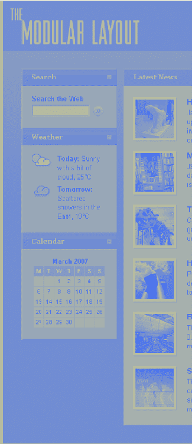

问题是，如果你试图让你的设计一刀切，你会遇到不可调和的分歧。在 1280960 中，四列文本可能会为你的内容产生最简洁、最有条理、最可见的结构，但是给一个 800600 显示器上的人四列文本只会产生一团乱麻。相反，在 800600 时工作得相当舒适的单栏设计在 1280960 时看起来会痛苦地拉伸。

传统上，一个答案是简单地限制页面的宽度，将其锁定在一个固定的宽度，在 800 像素(或您选择的基本分辨率)或以上的宽度下产生良好、可读的行长度。然而，这往往不公平地限制了那些利用高质量技术的人。分辨率较高的用户从他们的投资中得不到任何好处；他们只是在内容的两边获得了更多的空间。

最近的统计(`www.thecounter.com/stats/2006/August/res.php`)表明，屏幕分辨率为 800600 的用户约占市场的 16%，约 55%的用户分辨率为 1024768，约 21%的用户分辨率高于 1024768(任何特定网站的实际统计数据将因受众而异)。通过设计 800600 的分辨率，你在为少数人的情况惩罚你的大多数用户，尽管是相当大的少数人。

那么，有没有一种方法可以让大屏幕用户从辛苦获得的像素中受益，而不损害低分辨率用户的利益呢？是的，通过提供不同尺寸的不同设计。

起初，这可能听起来工作量过大。但是由于基于标准的布局的灵活性，很可能甚至很容易使用完全相同的 HTML 标记并通过改变 CSS 提供不同分辨率的不同设计。

通过比较 UX 杂志(`www.uxmag.com`)和白皮书(`www.whitepages.com.au`)网站的不同布局，如图图 9-1 到图 9-4") 所示，你可以看到，页面的设计美学不必为了适应不同的浏览器大小而有很大的改变。大多数情况下，只需对主要内容区域进行重组，就足以创建更流畅的布局，最大限度地利用屏幕空间。针对更宽屏幕优化的布局通常会降低页面高度，从而在折叠上方显示更多内容，使用户无需滚动即可看到页面的更多部分。假设你的标题、菜单、表单和其他网站附件都是用一些漂亮的、健壮的 CSS 编码的，它们应该很容易适应任何一种设计。

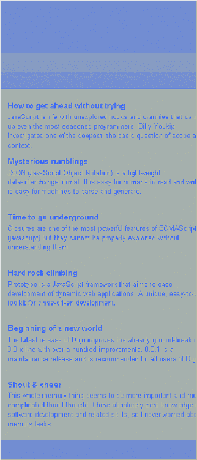 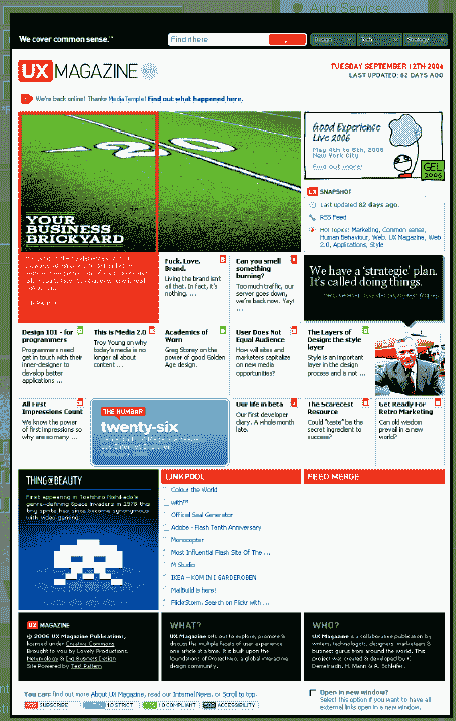

**图 9.1。UX 杂志网站布局针对 800600** 的最大化浏览器窗口进行了优化

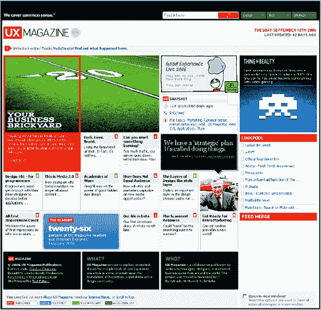

**图 9.2。UX 杂志网站布局针对 1024768** 的最大化浏览器窗口进行了优化

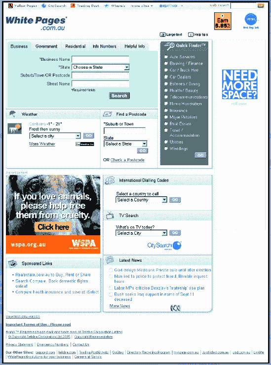

**图 9.3。针对较窄的浏览器窗口(宽度小于 1200 像素)优化的白页网站布局**

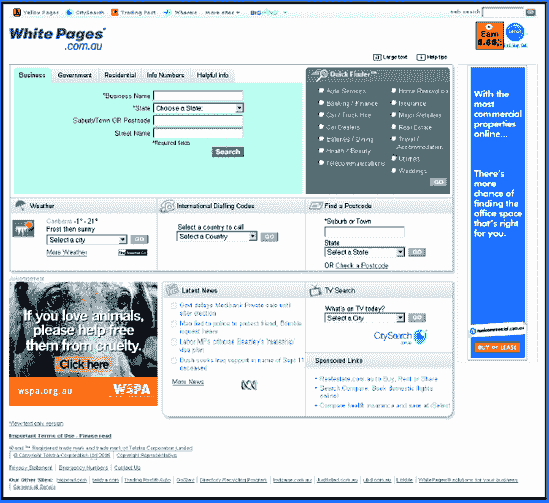

**图 9.4。针对更宽的浏览器窗口(宽度大于 1200 像素)优化的白页网站布局**

## 浏览器大小，而非分辨率

尽管窗口大小通常与屏幕分辨率有关，但两者并不相同。浏览器窗口不一定要最大化，所以不能假设浏览器大小会和屏幕分辨率匹配。根据轶事证据，1024768 和更低分辨率的用户倾向于用最大化的窗口浏览，而分辨率更高的用户更有可能用多个未最大化的窗口进行多任务处理。

我在这里提出的解决方案没有基于屏幕分辨率的假设(即使它被称为依赖于*分辨率*的布局)。我们的目标是浏览器窗口的布局，所以如果大屏幕上的用户碰巧在小窗口中浏览，他们仍然会得到最佳的小窗口布局。

分辨率相关的布局也不仅仅适用于固定宽度的网站。您仍然可以将流畅的布局作为样式表的一部分。这意味着您将获得两个世界的最佳结果:布局不仅考虑了浏览器大小之间的小不一致(侧边栏、滚动条、最大化/非最大化等等)，而且还处理了大的变化，为我们提供了足够的额外空间来保证内容的重组。

## 多个 CSS 文件

创建分辨率相关布局的第一步是创建不同分辨率所需的不同样式表。

交替样式表和样式切换已经被普遍使用了一段时间。人们普遍认为，当用户打印出一页时，他们需要的格式与他们在屏幕上看到的不同。这就是为什么我们有交替打印样式表。许多网站都有替代的样式表，用于更大的文本、高对比度的布局，或者只是简单的不同外观。所以我们在这里要做的是为不同的分辨率制作一个替代的样式表。这通常需要更改内容以获得更大的页面宽度。

与任何替代样式表一样，首先需要定义基本样式。你的目标是哪个基线人群？目前，800600 通常被认为是最低的普通桌面分辨率，所以我们将使用它作为我们的默认大小。

接下来，您需要决定哪个(些)决议将获得一个替代样式表。什么分辨率会从不同的布局中获得最大的好处？您可以为许多不同的分辨率提供许多不同的布局，但是为了简单起见，我们将只创建一个备选样式表。我们将使用 1024768 作为备用布局的开关。它不像 800600 到 12801024 那样激进，但仍然提供了足够的空间来保证布局的改变。

图 9-5 显示了我们的基本设计，针对 800600 进行了优化。它是流动的，所以它也适用于较小的屏幕。图 9-6 显示了我们针对 1024768 和更高分辨率的设计。

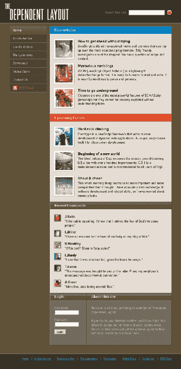

**图 9.5。针对 800600** 优化的示例页面

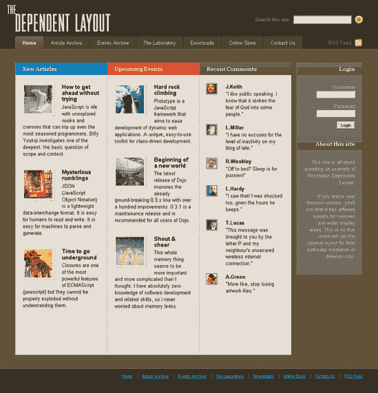

**图 9.6。针对 1024768** 优化的示例页面

这两种布局之间有两个主要变化:

*   较大样式的内容呈现在页面的四列中，而较小样式的内容保持在一列中。四列布局可以在更高的分辨率下更好地利用空间，并降低页面高度。在较小的屏幕尺寸下，列变得太窄而没有用，因此单列产生更好的内容宽度。

*   菜单的位置不同。当使用水平菜单时，随着菜单项数量的增加，我们经常会在较小的屏幕上遇到问题。最终，它们会绕成两行。为了解决这个问题，我们将菜单的方向从水平改为垂直，并将其放置在内容旁边。

使用 CSS，通过修改宽度和浮动元素，可以相对容易地实现这两种改变。例如，在 800600 中，三个主要内容面板都使用其默认的浏览器样式:跨越其容器 100%的块元素。为了让它们在 1024768 样式表中并排排列，我们让它们向左浮动并提供一个宽度:

```html
.panel
{
  float: left;
  width: 26.5%;
}
```

这两种布局都使用了包含在`resolution.htm`中的完全相同的 HTML 标记，所以您只需要修改样式表。

因为备用样式表是主样式表的补充，所以我们继续对 800600 样式表进行编码，就像我们通常所做的那样，无论如何它都会被应用。为了获得更宽的样式表，我们扩展了基本样式。我们不需要编写一个全新的样式表；我们只是修改和增加已经存在的风格。

正如您将在本例的可下载文件中看到的，基本样式表`main.css`有 442 行。另一个样式表`wide.css`要小得多，只有 190 行。

为了在页面上包含两个样式表，我们使用了`link`元素:

```html
<link rel="stylesheet" type="text/css" 
   href="css/main.css" />
<link rel="alternate stylesheet" 
   type="text/css" href="css/wide.css"
   title="Wide" />
```

主样式表的`rel`属性被设置为`stylesheet`，因此它将自动应用于页面。通过将替换样式表的`rel`属性设置为`alternate stylesheet`，我们向浏览器表明，除非指定，否则不应该应用它。为备用样式表包含一个`title`属性也很重要，这样我们可以在以后识别它。

但是当我们需要它的时候，我们如何打开替换样式表呢？

## 开启风格

我们有几个选项可以向用户提供这种新的依赖于分辨率的样式表，其中大多数都非常无效:

*   在 HTML 中包含替代样式表，并希望用户使用的浏览器允许在替代样式表之间切换，并且*意识到*有替代样式表，*然后*会费心打开它，如果它适用于他(不会发生)。

*   使用页面内样式表切换器。在每个页面上创建一个小部件，允许用户指定她希望页面以何种风格显示(就像 Paul Sowden 在他的文章《与列表分离》(on A List Apart，`http://alistapart.com/stories/alternate/`)中描述的那样)。这有点像原生浏览器选项，除了它更容易被更多的浏览器看到和访问。然而，以我的经验来看，用户不会特意去改变页面的默认外观，即使这对他们有好处。

*   自动做。将更宽的样式表提供给能够处理它的浏览器。给用户最好的体验，而不用动一根手指。

你可能已经猜到我们要走第三条路，因为这就是分辨率相关布局的意义所在。方法是使用一些 JavaScript 在页面加载时检测窗口大小，如果合适的话应用更宽的样式表。如果 JavaScript 恰好关闭，页面不会爆炸。相反，用户将获得基本的样式表，如果设计得当，它应该仍然完全可用。就把这种替代布局看作是大屏幕用户和 JavaScript 用户的额外收获吧(这是一个相当大的用户群体)。

JavaScript 应该放在 HTML 中的样式表声明之后:

```html
<link rel="stylesheet" type="text/css" href="css/main.css" />
<link rel="alternate stylesheet" type="text/css" href="css/wide.css" title="Wide" />
<script type="text/javascript" src="scripts/resolution.js"></script>
```

这很重要，因为 JavaScript 将会立即运行并尝试处理样式表，所以如果它们还没有被包含进来，就会有问题。

在`resolution.js`中要做的第一件事是检查浏览器窗口的大小:

```html
checkBrowserWidth();

function checkBrowserWidth()
{
  var theWidth = getBrowserWidth();

  if (theWidth == 0)
  {
    addLoadListener(checkBrowserWidth);

    return false;
  }

  if (theWidth >= 960)
  {
    setStylesheet("Wide");
  }
  else
  {
    setStylesheet("");
  }

  return true;
};
```

`checkBrowserWidth()`首先使用`getBrowserWidth()`获得浏览器的宽度:

```html
function getBrowserWidth()
{
  if (window.innerWidth)
  {
    return window.innerWidth;
  }
  else if (document.documentElement && document.documentElement.clientWidth != 0)
  {
```

```html
return document.documentElement.clientWidth;
  }
  else if (document.body)
  {
    return document.body.clientWidth;
  }

  return 0;
};
```

实际上有几种方法可以确定浏览器窗口的宽度，这取决于你使用的浏览器，而`getBrowserWidth()`中的每个条件都符合其中一个。火狐、Mozilla、Safari、Opera 使用`window.innerWidth`。Internet Explorer 6 和 7 使用`document.documentElement.clientWidth`。

奇怪的是，`document.documentElement.clientWidth`在 Internet Explorer 5 和 5.5 中存在，但它总是被设置为 0，所以我们必须检查这一点，如果是这样的话，就默认为`document.body.clientWidth`。唯一的问题是`body`元素必须在 Internet Explorer 5 之前存在。 *x* 可以计算出浏览器窗口的宽度，所以一旦页面被加载，我们必须重新安排对`getBrowserWidth()`的调用。这是在`checkBrowserWidth()`里面的第一个条件下完成的。如果`getBrowserWidth()`返回 0，说明浏览器很可能是 Internet Explorer 5。 *x* ，所以我们创建了一个新的 load 事件监听器，并在进行任何样式表切换之前等待页面加载。

`addLoadListener()`是一个通用的页面加载事件处理程序，它抽象了浏览器事件处理中的一些差异:

```html
function addLoadListener(fn)
{
  if (typeof window.addEventListener != 'undefined')
  {
    window.addEventListener('load', fn, false);
  }
  else if (typeof document.addEventListener != 'undefined')
  {
    document.addEventListener('load', fn, false);
  }
  else if (typeof window.attachEvent != 'undefined')
  {
    window.attachEvent('onload', fn);
  }
  else
  {
    return false;
  }

  return true;
};
```

这个和另一个抽象的事件处理程序包含在`event_listeners.js`中，因为您可能会在其他项目中经常用到它们。

然而，大多数浏览器不需要经历繁琐的页面加载。`checkBrowserWidth()`将立即收到浏览器宽度，并能够检查它。这是通过一个简单的条件来完成的，我们对照预定值检查`theWidth`。在我们的例子中，我们使用 960 作为阈值，因为对于分辨率为 1024768 的最大化窗口大小来说，这是一个很好的安全值，如果我们减去浏览器 chrome(如滚动条)的空间。如果您希望您的样式表以不同的分辨率更改，只需将该值更改为您需要的值。

如果窗口宽度大于或等于 960 像素，我们通过使用适当的样式表标题调用`setStylesheet()`来激活替代样式表，在本例中是`Wide`:

```html
function setStylesheet(styleTitle)
{
  var links = document.getElementsByTagName("link");

  for (var i = 0; i < links.length; i++)
  {
    if (links[i].getAttribute("rel") == "alternate stylesheet")
    {
      links[i].disabled = true;

      if(links[i].getAttribute("title") == styleTitle)
      {
        links[i].disabled = false;
      }
    }
  }

  return true;
};
```

`setStylesheet()`获取一个样式表标题并遍历页面中的所有`link`元素，检查它们的`rel`属性是否与`alternate stylesheet`匹配。如果那个`link`是一个替换样式表，它的`disabled`属性被设置为`true`(关闭任何未被选择的样式表)，然后检查`title`属性看它是否是`Wide`。如果匹配，`disabled`设置为`false`(打开样式表)。

该循环完成后，所选的替代样式表将被打开，而所有其他样式表将被关闭。如果浏览器宽度不大于我们的阈值，则使用相同的函数。我们用一个空字符串(`""`)调用`setStylesheet()`，这将关闭所有可选的样式表，因为它们的标题都不匹配。

一旦所有这些都发生了，正确的样式表将被选择，页面现在应该以适合用户浏览器大小的最佳布局显示。

最后要做的事情是添加一个事件侦听器，以便在有人调整浏览器窗口大小时使用。当某人第一次访问一个页面时，检测浏览器的大小是很好的，但是如果他改变了窗口的大小，我们就要相应地改变布局。为此，我们只需为窗口调整大小事件添加一个事件监听器，再次调用`checkBrowserWidth()`:

```html
attachEventListener(window, "resize", checkBrowserWidth, false);
```

同样，这里我使用了一个通用的事件处理程序(来自`event_listeners.js)`,它抽象了浏览器事件处理中的一些差异:

```html
function attachEventListener(target, eventType, functionRef, capture)
{
  if (typeof target.addEventListener != "undefined")
  {
    target.addEventListener(eventType, functionRef, capture);
```

```html
}
  else if (typeof target.attachEvent != "undefined")
  {
    target.attachEvent("on" + eventType, functionRef);
  }
  else
  {
    return false;
  }

  return true;
};
```

## 针对 Internet Explorer 5.x 的优化

如前所述，Internet Explorer 5。x 浏览器在获得浏览器宽度之前必须等待页面加载。交换样式表时，这可能会导致一点视觉闪烁。为了在某种程度上改善这一点，我们可以设置一个 cookie，在用户第一次访问网站时存储浏览器宽度，然后在重复加载时使用这个值。这样，用户只会在第一次访问时得到一个闪烁。为此，我们需要修改`checkBrowserWidth()` :

```html
function checkBrowserWidth()
{
  var theWidth = getBrowserWidth();

  if (theWidth == 0)
  {
    var resolutionCookie = document.cookie.match(/(^|;) res_layout[^;]*(;|$)/);

    if (resolutionCookie != null)
    {
      setStylesheet(unescape(resolutionCookie[0].split("=")[1]));
    }

    addLoadListener(checkBrowserWidth);

    return false;
  }

  if (theWidth >= 960)
  {
    setStylesheet("Wide");
    document.cookie = "res_layout=" + escape("Wide");
  }
  else
  {
    setStylesheet("");
    document.cookie = "res_layout=";
  }

  return true;
};
```

现在，一旦浏览器宽度已经确定，样式表已经切换，我们还设置了一个名为`res_layout`的 cookie 来存储应用的样式表的标题。在重复访问时，如果浏览器宽度返回为 0(即，它是 Internet Explorer 5。 *x* ，我们检查`res_layout`的 cookie 值是否存在，如果存在，立即相应地设置样式表。这消除了闪烁。我们仍然继续添加调用`getBrowserWidth()`的负载监听器，所以如果用户在设置 cookie 后碰巧改变了浏览器的大小，我们可以将布局调整到新的宽度。

我们已经完成了分辨率相关的布局。让我们转向另一种方法。

# 模块化布局

根据用户的浏览器大小提供静态的布局选择是一回事，但是让用户个人控制他们在你的页面上看到什么以及他们在哪里看到它是另一回事。

模块化布局为用户提供了一个视觉和行为框架，允许他们从根本上改变界面在网页上的实时显示方式。一旦设计者将内容划分为独立的内容模块，这些模块就可以被展开和折叠，它们的顺序可以被重新组织，它们在页面上的位置可以被用户改变。

### 注意

允许用户定制页面不是你应该随意提供的。如果一个人在一生中只花十分钟的时间，他不太可能会花时间去研究一个界面并根据自己的喜好修改它。然而，当你提供的服务旨在让用户经常回到你的网站，当他们可以通过定制界面获得一些浏览或工作流程效率时，拥有一个可定制的布局可以是一个非常宝贵的工具。最有可能选择可定制布局的是 web 应用程序，在这种应用程序中，用户可能只想执行应用程序提供的任务的一部分，或者他们经常使用应用程序中的特定功能。

图 9-7 显示了一个带有模块布局的样本页面的默认视图，我们将构建它来演示动态布局技术。中心内容保持不变。我们将重点关注两侧的辅助模块。

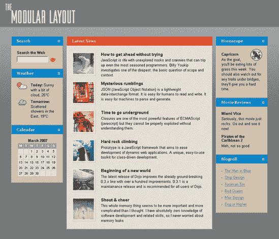

**图 9.7。模块化布局示例的默认视图**

图 9-8 显示了一个修改后的界面视图，在用户通过折叠、重组和移动的组合按照自己的喜好重新排列模块后。

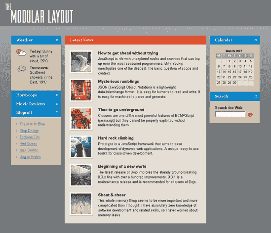

**图 9.8。模块化布局示例的用户自定义视图**

我们使用的例子反映了各种门户页面。用户可能会定期访问该网站以查看不同类型信息的集合，某些信息的重要性因用户而异。

所有的界面定制都必须用 JavaScript 来完成。这意味着不支持 JavaScript 的用户代理将无法访问定制功能。这些用户将收到页面的默认视图，并能够访问所有信息，就像它是一个普通的静态网页一样。

## 加价

页面内容的高层结构相当简单。左侧的数据模块包含在各自的部分中，接着是中心内容，然后是右侧的更多数据模块:

```html
<div id="modules1">
. . .
</div>
<div id="news">
. . .
</div>
<div id="modules2">
. . .
</div>
```

这里要注意的最重要的事情是，如果用户将内容从一个模块区域移动到另一个模块区域，它必须被放置到适当的容器中。

### 注意

网页的 HTML 不必严格遵循 modular.htm 的模板。然而，示例中使用的 JavaScript 和 CSS 是为该标记定制的，需要根据特定页面的布局方式进行调整。

在每个模块区域内，我们使用一个带有类`module`的`div`将每个模块分成它自己的部分:

```html
<div id="modules1">
  <div class="module">
    <h2>
      Search
    </h2>
    <div class="moduleContent">
. . .
    </div> <!-- END .moduleContent -->
  </div> <!-- END .module -->
```

我们的大部分 JavaScript 将关注这个`h2`元素，因为它提供了执行展开/折叠和移动动作的句柄。我们不关心包含在`moduleContent div`中的 HTML，因为它是特定于每个模块的。我们只想抽象出我们的框架来处理每个模块块。

## 展开和折叠模块

扩展和折叠内容的能力并不是一个新概念，实际上非常简单。也许我们能做的最重要的事情就是让它不引人注目，容易接近。

另一方面，没有打开 JavaScript 的用户不应该被提供他们无法访问的功能。这意味着允许展开/折叠的元素应该通过 JavaScript 本身来包含。

**JavaScript**

当页面上包含`expand_collapse.js`时，它会设置一个页面加载监听器，然后遍历每个模块并插入适当的 HTML 元素:

```html
addLoadListener(initExpandCollapse);

function initExpandCollapse()
{
  var modules = [document.getElementById("modules1"), document.getElementById("modules2")];

  for (var i in modules)
  {
    var h2s = modules[i].getElementsByTagName("h2");

    for (var i = 0; i < h2s.length; i++)
    {
      var newA = document.createElement("a");
      newA.setAttribute("href", "#");
      newA.setAttribute("title", "Expand/Collapse");
      attachEventListener(newA, "mousedown", mousedownExpandCollapse,false);
      newA.onclick = clickExpandCollapse;

        var newImg = document.createElement("img");
        newImg.setAttribute("src", "img/min_max.gif");
        newImg.setAttribute("alt", "Expand/Collapse");
        newA.appendChild(newImg);

      h2s[i].appendChild(newA);
    }
  }

  return true;
};
```

页面加载监听器是使用与分辨率相关的布局示例相同的`event_listeners.js`文件中的`addLoadListener()`函数添加的，并在页面准备就绪时调用`initExpandCollapse()`。

`initExpandCollapse()`首先创建感兴趣的模块元素的数组，然后遍历该数组，找到所有的`h2`元素。对于每个`h2`，我们创建一个新的`anchor`元素，它包含一个`img`元素(我们的小展开/折叠图标)，然后我们对那个`anchor`应用一些行为。通过使用一个`anchor`元素而不是`span`或`div`，我们确保了展开/折叠功能是键盘可访问的。`anchor`元素可通过键盘聚焦，当用户按下回车键激活它们时，会收到一个点击事件。

我们在`anchor`标签上捕捉两个事件:鼠标按下和点击。mousedown 侦听器需要抵消我们将用于拖放内容模块的 mousedown。本质上，我们想要监听`anchor`上的点击，但是每当有人点击鼠标按钮时，它之前也会有鼠标按下。因为`anchor`在`h2`内部，这将触发`h2`的 mousedown 事件，所以我们需要在`anchor`的 mousedown 事件触发时取消`h2`的 mousedown 事件。这是通过`mousedownExpandCollapse()` : 完成的

```html
function mousedownExpandCollapse(event)
{
  if (typeof event == "undefined")
  {
    event = window.event;
  }
```

```html
if (typeof event.stopPropagation != "undefined")
  {
    event.stopPropagation();
  }
  else
  {
    event.cancelBubble = true;
  }

  return true;
};
```

这个简短的函数主要是为了避免浏览器在事件处理上的差异。第一个条件检查一个`event`对象是否被传递给了函数本身。这通常由事件侦听器自动完成，但在 Internet Explorer 5 中不会发生。 *x* 。如果事件对象不存在，我们默认为`window.event`，也就是 Internet Explorer 5。 *x* 用途。

接下来，我们检查`event`对象方法`stopPropagation()`是否存在。这是阻止事件向上冒泡的 W3C 标准方法(也就是说，阻止`anchor`上的 mousedown 事件也在`h2`上注册)。如果`stopPropagation()`存在，我们称之为。然而，Internet Explorer 使用名为`cancelBubble`的`event`对象的专有属性来停止事件冒泡。如果`stopPropagation()`不存在，我们就把`event.cancelBubble`设为`true`，这也是一样的效果。

现在我们需要处理点击事件。您可能已经注意到，为了向`anchor`添加 mousedown 事件监听器，我们使用了来自依赖于分辨率的布局`attachEventListener()`的抽象函数，但是对于 click 事件，我们实际上使用了一个旧的事件处理程序，即`onclick`属性。因为 Safari 不允许我们停止使用 W3C 事件侦听器添加的默认点击事件操作，所以我们需要恢复到点属性。实际上，这不会造成太大的问题。我们将事件处理程序添加到由我们自己的脚本创建的元素中，因此它不应该附加任何其他可能冲突的事件信息。

点击事件处理程序指向的函数是`clickExpandCollapse()`:

```html
function clickExpandCollapse()
{
  if (!hasClass(this.parentNode.parentNode, "collapsed"))
  {
    addClass(this.parentNode.parentNode, "collapsed");
  }
  else
  {
    removeClass(this.parentNode.parentNode, "collapsed");
  }

  return false;
};
```

这在包围着`h2`的`div`上做了一个简单的类切换。如果那个`div`没有`collapsed`的类，我们添加这个类。如果它有一个`collapsed`类，我们删除这个类。这使得完全通过 CSS 来设计折叠和展开模块的不同视图变得容易。

在处理`clickExpandCollapse()`中的元素类时，我们总是使用这些自定义函数:`hasClass()`、`addClass()`和`removeClass()`。这使得在同一个元素上使用多个类名变得更加容易。我已经将这些函数包含在它们自己的库文件`class_names.js`中，所以它们可以很容易地包含在其他项目中:

```html
function hasClass(target, classValue)
{
  var pattern = new RegExp("(^| )" + classValue + "( |$)");
```

```html
if (target.className.match(pattern))
  {
    return true;
  }

  return false;
};

function addClass(target, classValue)
{
  if (!hasClass(target, classValue))
  {
    if (target.className == "")
    {
      target.className = classValue;
    }
    else
    {
      target.className += " " + classValue;
    }
  }

  return true;
};

function removeClass(target, classValue)
{
  var removedClass = target.className;
  var pattern = new RegExp("(^| )" + classValue + "( |$)");

  removedClass = removedClass.replace(pattern, "$1");
  removedClass = removedClass.replace(/ $/, "");

  target.className = removedClass;

  return true;
};
```

对一个元素的类进行直接的字符串比较是不正确的，因为它实际上可以包含多个类，每个类之间用空格隔开。这与您不应该对类进行直接赋值的原因是一样的，因为您可能会覆盖现有的类。`hasClass()`检查您正在搜索的值是否是多个类中的一个。`addClass()`确保您不会覆盖任何现有的类或多次添加同一个类。`removeClass()`只删除指定的类，而保持所有其他类不变。

现在 click 事件已经就绪，每次用户单击内容模块的展开/折叠链接时，它都会根据需要添加或删除`collapsed`类。这就完成了我们的展开/折叠行为！

**CSS 样式**

既然我们已经向页面添加了一些新元素和类，那么是时候对展开/折叠小部件进行样式化了。扩展/折叠`anchor`标签嵌套在`h2`中，所以我们可以通过 CSS(来自`main.css`)使用它:

```html
.module h2
{
  position: relative;
}

.module h2 a
{
  position: absolute;
  top: 50%;
  right: 10px;
  width: 9px;
  height: 9px;
  overflow: hidden;
  margin: 4px 0 0 0;
  cursor: pointer;
}

.module h2 a img
{
  display: block;
}
```

为了让链接与`h2`的右边对齐，我选择了绝对定位，并使用`right`定位属性将它放置在距离边缘 10px 的位置(你也可以轻松地将元素向右浮动)。

`h2`本身是相对定位的，这个对主播有重要作用。通常，当你绝对定位一个元素时，它将相对于整个页面定位；例如，如果您将它的顶部设置为 0，它将移动到页面的顶部。然而，当你将一个绝对定位的元素(比如我们的`anchor`)嵌套在一个相对定位的元素(比如我们的`h2`)中时，`anchor`将会相对于`h2`进行定位。所以当我们设置`anchor`的`right`位置时，它将从`h2`的右边开始定位。

链接的尺寸取决于它所包含的图像的大小。小加号和减号图标的大小是 9px 乘 9px，所以这应该是链接的大小。实际上，包含图标的*图像*的大小是 9px 乘 18px。这是因为两个图标在同一个图像文件中，如图图 9-9 所示。

通过将两个图标放在同一个图像文件中，我们可以通过 CSS 影响展开/折叠链接的显示。通过将链接本身限制为仅一个图标的大小，然后将`hidden`值应用到`overflow`属性，我们有效地裁剪了图像的其余部分，使其看起来像只有一个图标。然后，在`main.css`里，我们可以在它的“盒子”里移动图像，将图标从减号切换到加号:


**图 9.9。用于展开和折叠的两个图标组合在一幅图像中**

```html
.collapsed h2 a img
{
  position: relative;
  top: 9px;
}
```

默认情况下，将显示减号图标，表示您可以折叠该模块。但是一旦模块被折叠，我们使用`collapsed`类来指定图标图像现在应该相对于它的包含元素(链接)向上移动 9px，从而显示加号图标。

显示和隐藏模块的实际内容更加容易:

```html
.collapsed .moduleContent
{
  display: none;
}
```

现在展开和折叠的样式与行为相匹配，如图 9-10 和 ?? 9-11 所示，我们都完成了！

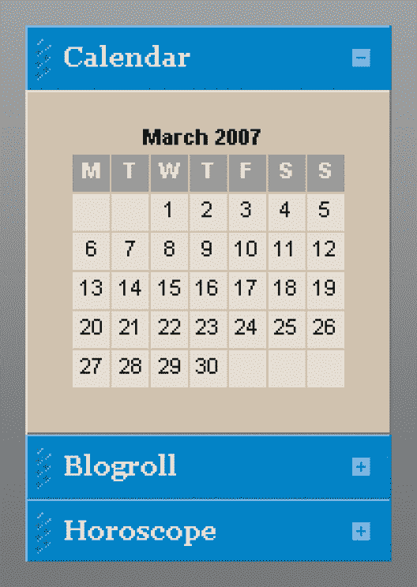

**图 9.10。默认扩展视图中的日历模块**

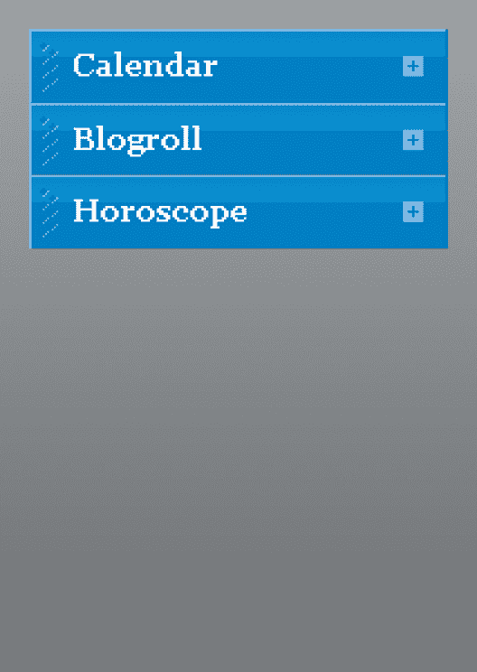

**图 9.11。折叠后的日历模块**

## 重组模块

展开/折叠是容易的部分。真正让用户控制的是能够指定模块本身的布局。我们将允许用户抓住一个模块的标题栏，拖动它在它的容器位置上下移动，或者把它换到另一个模块区域。因为重组行为完全独立于展开/折叠行为，所以我们可以将它包含在一个不同的文件`modular.js`中，以便于维护。

**拖放事件监听器**

设置新行为的第一步是为拖放操作创建事件侦听器:

```html
addLoadListener(initModular);

function initModular()
{
  var modules = [document.getElementById("modules1"), document.getElementById("modules2")];

  for (var i = 0; i < modules.length; i++)
  {
    var h2s = modules[i].getElementsByTagName("h2");

    for (var j = 0; j < h2s.length; j++)
    {
      addClass(h2s[j].parentNode, "moduleDraggable");
      attachEventListener(h2s[j], "mousedown", mousedownH2, false);
    }
  }

  return true;
};
```

我们使用`addLoadListener()`添加了另一个页面加载监听器，但是这一次它调用的是`initModular()`，它很像`initExpandCollapse()`，遍历模块区域，找到每个`h2`元素。对于每个`h2`，我们向其父类`div`添加一个新类`moduleDraggable`，并在`h2`上创建一个鼠标按下事件监听器。我们将这个类放在`h2`的父类`div`上，这样一旦我们知道 JavaScript 已启用，我们就可以添加一些样式调整。我们想给用户一个提示，模块是可移动的(否则，他们可能不会意识到这个事实)，所以我们在`main.css`中使用这个 CSS 规则:

```html
.moduleDraggable h2
{
  cursor: move;
}
```

当用户将鼠标悬停在一个可拖动的`h2`元素上时，光标变为移动光标，如图 9-12 中的所示。

通过收集信息和设置变量，mousedown 监听器在`h2`上调用的函数为模块的拖放行为做了大量工作:

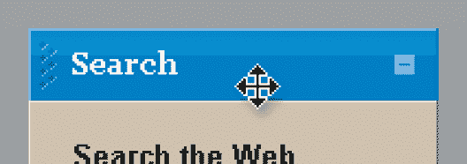

**图 9.12。当鼠标光标悬停在模块的标题栏上时，它的外观会发生变化。**

```html
function mousedownH2(event)
{
  if (typeof event == "undefined")
  {
```

```html
event = window.event;
  }

  if (typeof event.target != "undefined")
  {
    dragTarget = event.target.parentNode;
  }
  else
  {
    dragTarget = event.srcElement.parentNode;
  }

  dragOrigin = [event.clientX, event.clientY];
  dragHotspots = [];

  var modules = [document.getElementById("modules1"), document.getElementById("modules2")];

  for (var i = 0; i < modules.length; i++)
  {
    var divs = modules[i].getElementsByTagName("div");

    for (var j = 0; j < divs.length; j++)
    {
      if (divs[j] != null && hasClass(divs[j], "module"))
      {
        var modulePosition = getPosition(divs[j]);

        dragHotspots[dragHotspots.length] =
        {
          element: divs[j],
          offsetX: modulePosition[0],
          offsetY: modulePosition[1]
        }
      }
    }

    var modulePosition = getPosition(modules[i]);

    dragHotspots[dragHotspots.length] =
    {
      element: modules[i],
      offsetX: modulePosition[0],
      offsetY: modulePosition[1] + modules[i].offsetHeight
    }
  }

  var position = getPosition(dragTarget);

var ghost = document.createElement("div");
  ghost.setAttribute("id", "ghost");
  document.getElementsByTagName("body")[0].appendChild(ghost);
```

```html
ghost.appendChild(dragTarget.cloneNode(true));
  ghost.style.left = position[0] + "px";
  ghost.style.top = position[1] + "px";

  attachEventListener(document, "mousemove", mousemoveDocument, false);
  attachEventListener(document, "mouseup", mouseupDocument, false);

  event.returnValue = false;

  if (typeof event.preventDefault != "undefined")
  {
    event.preventDefault();
  }

  return true;
};
```

在它完成正常的事件对象抽象之后，`mousedownH2()`接着开始寻找哪个元素被点击了。这在理论上可以通过引用`this`对象来实现，但是不幸的是，当使用 W3C 事件模型添加事件时，Internet Explorer 不能正确地分配这个对象。相反，我们必须依赖于`event`对象的目标元素属性，如果在我们的事件目标中有嵌套的元素，这可能是不准确的，但是在这里没有问题，因为`h2`是这个分支中最深的元素。自然，Internet Explorer 不会像其他浏览器那样将这个元素称为`target`；在 ie 浏览器里是`srcElement`。所以我们必须检查`event.target`是否存在(标准属性)，如果不存在，就使用`event.srcElement`(Internet Explorer 属性)。

一旦这些差异得到解决，我们就在一个名为`dragTarget`的全局变量中创建一个对目标元素的父节点(围绕着`h2`的`div`)的引用，这样我们以后就可以在其他函数中使用它。

识别出目标后，我们创建一些全局变量，帮助跟踪用户拖动模块时发生的情况。`dragOrigin`存储原始鼠标按下事件的坐标。每当事件被触发时，`event.clientX`和`event.clientY`记录两个坐标，这两个坐标定义了页面上事件发生的位置；在这种情况下，用户按下鼠标按钮。存储这个原始位置很重要，因为当用户移动鼠标时，我们想知道她从最初点击的位置移动了多远。

**一页地图**

是一个数组，存储了你可以拖动一个模块的所有可能的位置。你可以把它想象成一种地图。当用户拖动一个模块时，他们不会改变它在页面上的任意位置；相反，它们实际上改变了它相对于其他模块的位置。因此，我们没有用绝对坐标来指定一个模块的目的地，而是试图用它在其他模块中的位置来描述它的目的地:“将搜索模块移动到日历模块之下，星座模块之上。”为了做到这一点，我们需要创建一个页面地图，指示所有其他模块的位置。这样，当被拖动的模块在页面中移动时，我们知道被拖动的模块应该在每个静态模块的上面还是下面。不过，所有计算都是由 mousemove 处理程序完成的。目前，我们只关心创建地图。

我们可以在 mousemove 处理程序中创建地图，但是每次鼠标移动时，都必须重新进行计算。只需按下鼠标按钮一次就可以创建地图，这样效率更高。

为了创建映射，我们查看每个模块区域的内部，并遍历所有具有类`module`的`div`。对于那些`div`，我们在`dragHotspots`数组中创建一个新对象，它保存对模块的引用(`element`)、模块左上角的水平页面偏移量(`offsetX`)和模块左上角的垂直页面偏移量(`offsetY`)。最后两个属性从`getPosition()`函数中获取值，该函数获取一个元素并返回其位置:

```html
function getPosition(theElement)
{
  var positionX = 0;
  var positionY = 0;

  while (theElement != null)
  {
    positionX += theElement.offsetLeft;
    positionY += theElement.offsetTop;
    theElement = theElement.offsetParent;
  }

  return [positionX, positionY];
};
```

获取元素在页面上的位置过于复杂，但对此无能为力。元素只能辨别其相对于“偏移父元素”的位置(偏移父元素根据其定位、浮动等方式而变化)。为了获得它在页面上的绝对位置，我们必须递归地沿着偏移父树向上(使用`element.offsetParent`)，获得每个偏移父树的位置，并将它们加在一起返回一个总数。

一旦一个模块区域中的每个模块都被添加到`dragHotspots`中，有一种特殊的情况是我们将模块区域本身添加到`dragHotspots`中。这是为了让我们能够识别被拖动的模块何时位于模块区域中所有其他元素的下方；在这种情况下，我们把它移到最后。

**鬼魂**

创建地图后，我们需要创建可视元素，向用户指示他们正在拖动什么东西。它实际上是用户拖动的模块的副本，我们通过改变它的透明度使它看起来像幽灵一样，所以我称它为幽灵。

我们使用`getPosition()`获得被拖动模块的当前位置，然后创建新的`ghost`元素。这是一个绝对定位的空`div`,包裹着被拖动模块的直接副本。空的`div`代替了模块区域`div`的约束，给了模块一个要填充的宽度；否则，它将扩展到 100%的宽度。因为它被绝对定位并插入到 body 元素的末尾，所以它可以自由地移动到用户鼠标光标移动的任何地方。

使用`cloneNode()`方法创建被拖动模块的副本。`cloneNode()`接受一个参数，该参数指定是希望节点的内容也被复制，还是只复制节点本身。通过给`dragTarget.cloneNode(true)`打电话，我们说我们想要一份`dragTarget` *和*的内容。我们将该副本添加到空壳中，然后将它放在原始模块上，这样看起来就像用户将幽灵拖出了它的身体。通过应用一点 CSS 不透明度，我们可以给幽灵一个幽灵般的外观:

```html
#ghost .module
{
  opacity: 0.65;
  filter: alpha(opacity=50);
}
```

你可以在图 9-13 中看到结果。

为了跟踪按钮被按下时用户移动鼠标的位置，我们需要向整个文档添加一个 mousemove 侦听器。我们添加了一个 mouseup 侦听器来告诉我们用户何时释放了鼠标按钮。

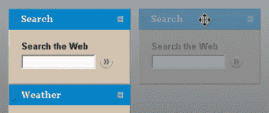

**图 9.13。原模块旁边的模块的幻影副本**

现在我们已经为用户拖动模块做好了充分的准备。`mousedownH2()`做的最后一件事是停止鼠标按下的默认动作。这可以防止浏览器在用户按下鼠标按钮时正常工作。在拖放的情况下，当拖动重影时，它会阻止页面上的文本被选中。

随着用户四处移动鼠标，文档 mousemove 事件监听器将不断调用`mousemoveDocument()`:

```html
function mousemoveDocument(event)
{
  if (typeof event == "undefined")
  {
    event = window.event;
  }

  var ghost = document.getElementById("ghost");

  if (ghost != null)
  {
    ghost.style.marginLeft = event.clientX - dragOrigin[0] + "px";
    ghost.style.marginTop = event.clientY - dragOrigin[1] + "px";
  }

  var closest = null;
  var closestY = null;

  for (var i in dragHotspots)
  {
    var ghostX = parseInt(ghost.style.left, 10) + parseInt(ghost.style.marginLeft, 10);
    var ghostY = parseInt(ghost.style.top, 10) + parseInt(ghost.style.marginTop, 10);

    if (ghostX >= dragHotspots[i].offsetX -
    dragHotspots[i].element.offsetWidth && ghostX <=
    dragHotspots[i].offsetX + dragHotspots[i].element.offsetWidth)
    {
      var distanceY = Math.abs(ghostY - dragHotspots[i].offsetY);

      if (closestY == null || closestY > distanceY)
      {
        closest = dragHotspots[i];
        closestY = distanceY;
      }
    }
  }

  if (closest != null)
  {
    var ghostMarker = document.getElementById("ghostMarker");

    if (ghostMarker == null)
    {
      ghostMarker = document.createElement("div");
      ghostMarker.id = "ghostMarker";
```

```html
document.getElementsByTagName("body")[0].appendChild(ghostMarker);
    }

    ghostMarker.marked = closest.element;

    ghostMarker.style.left = closest.offsetX + "px";
    ghostMarker.style.top = closest.offsetY + "px";
  }
  else
  {
    var ghostMarker = document.getElementById("ghostMarker");

    if (ghostMarker != null)
    {
      ghostMarker.parentNode.removeChild(ghostMarker);
    }

  }

  event.returnValue = false;

  if (typeof event.preventDefault != "undefined")
  {
    event.preventDefault();
  }

  return true;
};
```

这个函数的首要任务是改变重影的位置，使它看起来像是在跟随用户的鼠标光标。我们通过计算用户从最初的鼠标按下点移动了多远来做到这一点，然后在 ghost `div`上设置边距来反映这一差异。使用`event.clientX`和`event.clientY`再次获得鼠标光标的当前坐标，全局`dragOrigin`变量用于原始鼠标按下坐标。

`mousedownDocument()`然后需要使用我们的其他模块的映射来找出被拖动模块的新插入点。我们知道 ghost `div`的位置，并且我们知道每个静态模块左上角的位置，所以很容易计算出 ghost 离哪个静态模块最近。我们希望在静态模块之前插入被拖动的模块。

对于`dragHotspots`中的每一个条目，我们都快速测试一下幽灵的水平位置。如果 ghost 的任何部分都不在静态模块所在的模块区域的宽度内，我们就不希望将它视为被拖动模块的可行目的地。因此我们检查重影的*右*边缘是否在静态模块左边缘的右侧，以及重影的*左*边缘是否在静态模块右边缘的左侧。这意味着重影的某些部分与模块区域的宽度重叠。

然后，我们可以关心幽灵和静态模块之间的垂直距离。为此，我们测量重影顶部和静态模块顶部之间的差异，然后将其与已经找到的最小值进行比较。如果到当前静态模块的距离小于当前最小值，则该值成为新的最小值。在检查完所有的`dragHotspots`条目后，我们知道是否有合适的位置可以插入被拖动的模块，如果有，在哪里。

如果有合适的位置，我们需要向用户显示，这样他们就知道如果释放鼠标按钮，拖动的模块将被插入到哪里。为此，我们创建了一个名为`ghostMarker`的新元素，它只是一个位于候选插入点顶部的方形小块。ghost 标记是`body`元素的绝对定位子元素，所以为了定位它，我们使用最近的静态模块的坐标。正如你在图 9-14 中看到的，通过一点 CSS 样式，ghost 标记很好地指出了被拖动的模块将被插入的位置。

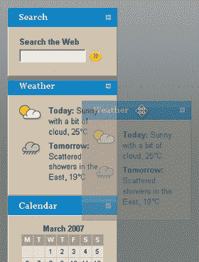

**图 9.14。显示拖动模块插入位置的重影标记**

为了便于以后插入被拖动的模块，我们还创建了一个新的属性`ghostMarker`，它记录了正在标记哪个静态模块:`ghostMarker.marked`。

如果没有一个合适的位置来插入被拖动的模块，那么当我们实际移除`ghostMarker`时，用户没有将 ghost 拖动到足够靠近某个静态模块的位置。因此，如果用户将重影从一个合适的位置移动到一个不合适的位置，它仍然不会表明他可以重新定位被拖动的模块。

`mousemoveDocument()`中的最后一个操作再次停止了浏览器通常为鼠标移动执行的默认动作，防止用户拖动时发生不必要的动作。

**重新定位的模块**

当用户决定将拖动的模块放在哪里，或者不想移动它时，他将释放鼠标按钮。这是由`mouseupDocument()`捕获的:

```html
function mouseupDocument()
{
  detachEventListener(document, "mousemove", mousemoveDocument, false);

  var ghost = document.getElementById("ghost");

  if (ghost != null)
  {
    ghost.parentNode.removeChild(ghost);
  }

  var ghostMarker = document.getElementById("ghostMarker");

  if (ghostMarker != null)
  {
    if (!hasClass(ghostMarker.marked, "module"))
    {
```

```html
ghostMarker.marked.appendChild(dragTarget);
    }
    else
    {
      ghostMarker.marked.parentNode.insertBefore(dragTarget, ghostMarker.marked);
    }

    ghostMarker.parentNode.removeChild(ghostMarker);
  }

  return true;
};
```

大部分繁重的工作已经完成，所以这个函数只是把事情整理一下。首先，它从文档中删除了 mousemove 事件侦听器，因为我们不再需要知道用户何时移动鼠标。之后，我们移除`ghost`元素，因为我们想要停止显示副本。

然后我们决定将拖动的模块放在哪里。如果`ghostMarker`仍然存在，意味着用户在有一个有效的地方移动被拖动的模块时释放了鼠标按钮。使用`ghostMarker.marked`属性，我们可以看到哪个元素之前插入了被拖动的模块。我们需要检查被标记的模块是否真的是一个模块，或者它是否是我们放在模块区域末尾的额外占位符。如果是一个实际的模块(它有一个`module`类)，我们可以使用`insertBefore()`方法将被拖动的模块移动到被标记的模块之前。如果是一个模块区域，我们使用`appendChild()`将被拖动的模块放在区域的末尾。无论哪种方式，我们都删除了重影标记，被拖动的模块现在就在它的新位置结束了，就在用户想要的地方！如果`ghostMarker`不再存在，我们知道被拖动的模块无处可去，所以我们可以安静地完成。

图 9-15 显示了用户将一个模块从一个模块区拖动到另一个模块区的全过程。

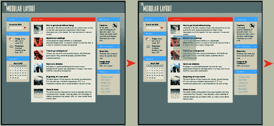

**图 9.15。将一个模块拖到另一个模块区**

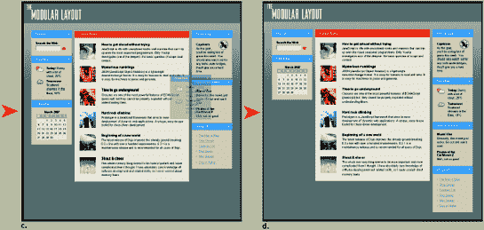

## 跟踪变化

本例中介绍的技术创建了一个用户可以随心所欲定制的页面。但是，如果他们第二天返回到该页面，而该页面没有保留他们的任何更改，那么这将是徒劳的。

虽然可以从服务器下载页面，并通过 JavaScript 重新排列模块，但这是一个相当笨拙的过程，可能会导致用户在页面切换到他们的定制布局之前看到默认布局。

最好的解决方案是在服务器上组装自定义布局，并按照用户的安排提供给他们。实现这一点最简单的方法是在用户的浏览器中存储一个 cookie，告诉服务器用户布局的顺序，服务器可以用它来组装适当的页面。

我们所要做的就是跟踪哪些模块在哪个模块区域以及它们的顺序。为此，我们需要确保每个模块在我们的标记中都有一个惟一的 ID。一旦完成，我们可以修改`mouseupDocument()`函数来编写一些包含偏好数据的 cookies。这个更新的功能包含在`modular_cookie.js`(你可以包含它而不是`modular.js`):

```html
function mouseupDocument()
{
  detachEventListener(document, "mousemove", mousemoveDocument, false);

  var ghost = document.getElementById("ghost");

  if (ghost != null)
  {
    ghost.parentNode.removeChild(ghost);
  }

  var ghostMarker = document.getElementById("ghostMarker");

  if (ghostMarker != null)
  {
    if (!hasClass(ghostMarker.marked, "module"))
    {
      ghostMarker.marked.appendChild(dragTarget);
    }
    else
    {
      ghostMarker.marked.parentNode.insertBefore(dragTarget, ghostMarker.marked);
    }

    ghostMarker.parentNode.removeChild(ghostMarker);

    var modules1 = document.getElementById("modules1");
    var modules1Modules = [];
    var divs = modules1.getElementsByTagName("div");

    for (var i = 0; i < divs.length; i++)
    {
```

```html
if (hasClass(divs[i], "module"))
      {
        modules1Modules[modules1Modules.length] = divs[i].getAttribute("id");
      }
    }

    document.cookie = "modules1=" + modules1Modules.join(",");

    var modules2 = document.getElementById("modules2");
    var modules2Modules = [];
    var divs = modules2.getElementsByTagName("div");

for (var i = 0; i < divs.length; i++)
    {
      if (hasClass(divs[i], "module"))
      {
        modules2Modules[modules2Modules.length] = divs[i].getAttribute("id");
      }
    }

    document.cookie = "modules2=" + modules2Modules.join(",");
  }

  return true;
};
```

现在，当一个模块被重新定位时，会写入两个 cookies。对于每个模块区域，找到具有类`module`的`div`，并将它们的 id 添加到数组中。该数组将反映模块的顺序，因为`getElementsByTagName()`按源代码顺序返回元素。一旦数组完成，它就被写入一个 cookie 中，根据具体情况，可以是`modules1`或`modules2`，每个 id 用逗号分隔。

当这些 cookies 被传递到服务器时，您应该能够使用它们来检查模块的顺序，并以适当的顺序将它们写入 web 页面。

# 结论

用户需求的多样性——无论是技术性的还是基于任务的——正在挑战传统的静态网页形式。创建动态接口是满足这些需求的方法之一。我在这里描述的两种技术展示了基于标准的 web 页面的灵活性如何改变我们为 Web 设计的方式。

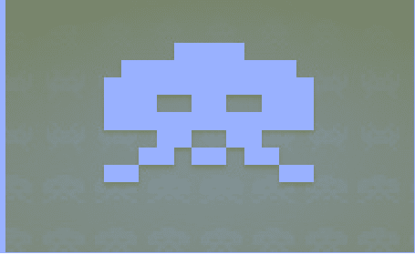*