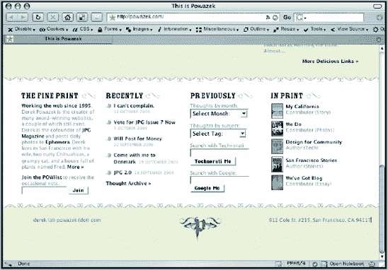
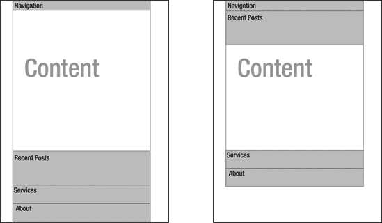
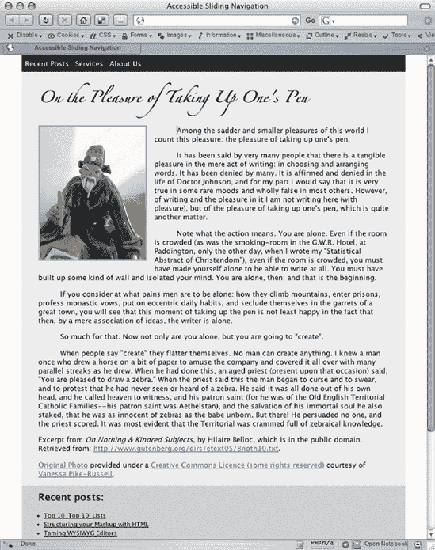
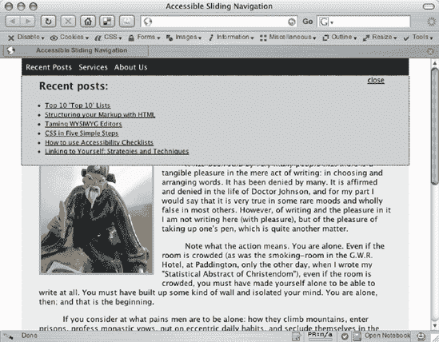
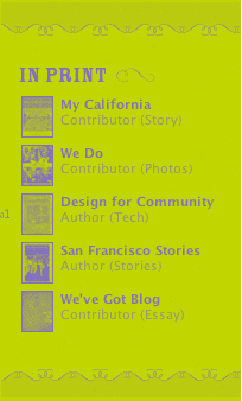
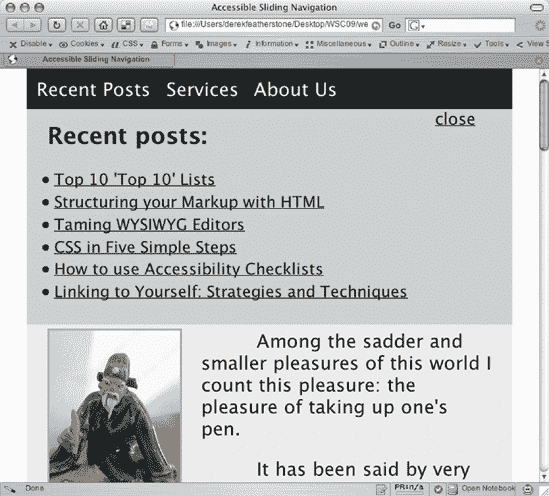
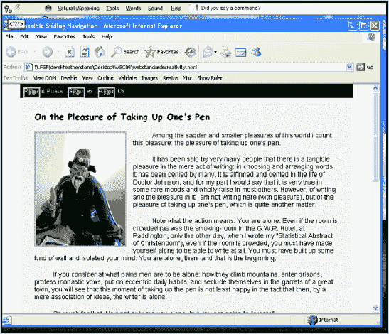
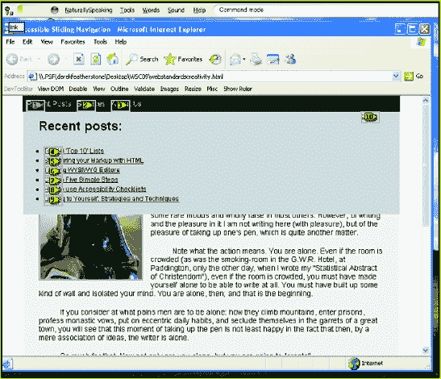

# 十、无障碍滑动导航

德里克

费瑟斯通

`boxofchocolates.ca`

`furtherahead.com`

德里克·费瑟斯通(Derek Featherstone)迷人、令人惊讶、鼓舞人心，他有一种天赋，能够以全新的视角看待 web 开发的几乎每一个方面，并以一种重新点燃我们的热情的方式进行教学，让 Web 为每个人变得更好。费瑟斯通是国际知名的可访问性和 web 开发权威，也是受人尊敬的技术培训师和作家。

作为关于 HTML、CSS、DOM 脚本和 Web 2.0 应用程序的深入课程的创建者，Derek 从不忘记支持 Web 标准和通用可访问性的事业。自 1999 年以来，他通过自己的公司 the Further Ahead(`www.furtherahead.com`)成为政府机构、教育机构和私营企业的抢手顾问。他丰富的经验和洞察力使他能够为观众提供直接适用的，非常简单的方法来应对网站设计中的日常挑战。

Derek 是可访问性任务组的负责人，也是 Web 标准项目的 DOM 脚本任务组的成员。他还在自己广受欢迎的博客和个人网站`www.boxofchocolates.ca`上评论各种话题。


# 杀手锏

承认吧。你想要它。你知道，你网站上的杀手锏让博客圈说“aaaaaaahhhhhh。”为你赢得重启奖的那个。让你的网站脱颖而出的那个。好吧，算了。通过为访问者提供更容易的信息和链接，让他们的生活变得更容易的那个呢？

我们现在谈论的是老式动态 HTML 菜单系统的替代品，这种系统只需简单的鼠标悬停和点击，就可以访问所有的分类和子分类链接。这个替代品是*滑动导航系统*，它显示了很好分类的链接。

肖恩·因曼的博客(`www.shauninman.com`)在他 2005 年的重新设计中展示了这一技术，完成了一个滑动导航和搜索标签，隐藏和暴露了他的网站的细节。他的博客类别、最近的帖子、搜索框和其他好东西都被隐藏起来，直到被一些忠实的 JavaScript 调用。

网站设计的另一个最新趋势是信息丰富的页脚。德里克·波瓦泽克在他 2005 年的重新设计中“拥抱了他的底部”(`www.powazek.com/2005/09/000540.html`)，使他的网站的页脚非常突出和有用，而不是模糊不清和充满版权声明(见图 10-1 )。他有这个行业中最好的助手之一。它的设计目的和意图是激励、提供更多信息，并为访问者提供背景。

在这一章中，我们将实现一个将滑动导航和信息丰富的页脚结合到一个系统中的网站，该系统为当今许多网站上的传统“选项卡式”导航增加了细节和可用性增强。而且，正如您所料，它从一开始就将可访问性考虑在内。



**图 10.1。德里克·波瓦泽克博客的页脚。与普通的页脚相比，Derek 的页脚更有用，它为访问者提供了更多的上下文和与博客相关的功能。**

# 辅助功能基础知识

网页可访问性最好被描述为一套指导原则或指南，帮助我们制作适合所有不同类型用户的网站，不管他们的能力如何。当我们编写网站代码时，我们努力将这些不同水平的能力考虑在内

*   视力障碍(不同程度的失明、低视力和色盲)

*   移动性或灵活性障碍(需要使用语音识别软件或硬件辅助工具来方便键盘使用或帮助补偿不同水平的精细运动控制)

*   听觉障碍(例如，需要多媒体音频和视频的字幕和/或抄本)

*   认知障碍(包括不同程度的阅读障碍、自闭症和其他学习障碍)

为了考虑到这种广泛的能力，我们需要做一些简单的事情。我们确保图像有适当的替代文本，以便视力受损的人有替代的表示，他们的屏幕阅读器软件可以读给他们听。我们实现了一些解决方案，允许用户调整页面上的文本大小，以便更容易阅读。我们在前景色和背景色之间有适当的颜色对比。我们标记表单域，使用结构化标记来确保屏幕上的元素使用最好的 HTML 元素，如标题、段落、列表、表格、表单按钮等等。

建设无障碍网站的一个长期问题是，作为开发人员、设计人员和内容创建者，我们几乎没有与残疾人一起工作的实践经验，以了解他们的真正需求以及我们如何避免为他们设置无障碍障碍。进入万维网联盟的网页可访问性倡议(`www.w3.org/WAI`)。

## 无障碍指南

Web Accessibility Initiative (WAI)致力于让每个人都能更方便地访问 Web，并制定了一套指导原则来帮助开发人员构建可访问的网站。不用担心；这不完全取决于我们。WAI 还为浏览器制造商和创作工具供应商制定了指导方针，以便他们能够确保人们使用的工具能够促进可访问性。这些其他的指导方针用户代理可访问性指导方针(UAAG)和创作工具可访问性指导方针(ATAG)是重要的，但是超出了我们作为开发人员所做的范围。我们应该坚定地把注意力放在网站内容无障碍指南上(WCAG)。

WCAG ( `www.w3.org/WAI/intro/wcag.php`)是一套指导方针，为我们创建无障碍网站提供了一些起点。然而，这并不意味着简单地遵循指南就能保证我们的网站是可访问的。为了创建可访问的网站，我们通常需要遵循指南中的原则，然后与使用辅助技术的人一起测试我们生成的网页。这确保了我们可以两全其美。我们通过遵守指导方针来实现技术合规性，并通过对残疾人的测试，我们创造了对他们实际有用的东西。

本章中的示例研究了 WCAG 的许多原理，包括用各种屏幕阅读器、语音识别软件和屏幕放大器进行测试的结果。

### 注意

要详细深入地了解可访问性，请阅读《Web 可访问性:Web 标准和法规遵从性》(编辑之友，ISBN: 1-59059-638-2)。

## 可访问性和 JavaScript

多年来，可访问性和 JavaScript 都是精通某个专业领域的专家的领域。这一领域的工作一直受到 web 开发人员代代相传的长期神话的阻碍。这个神话非常简单:为了确保你的网页是可访问的，它必须与 JavaScript 一起工作。

这种误解在很大程度上是由于 WCAG 检查站 6.3 ( `www.w3.org/TR/WCAG10/wai-pageauth.html#tech-scripts`)造成的，该检查站规定:

### 注意

当脚本、小程序或其他编程对象被关闭或不受支持时，确保页面可用。如果不可能，请在另一个可访问的页面上提供等效信息。

1999 年，当 WCAG 1.0 发布时，这是一个合理的指导方针。屏幕阅读器和浏览器远没有今天这么先进。人们普遍认为(并传播)屏幕阅读器不理解 JavaScript。开/关场景曾经相当准确。

今天的屏幕阅读器*确实*理解了今天的浏览器所支持的大部分 JavaScript，然而许多人仍然坚持认为这是不可能的。他们坚持 WCAG 检查点 6.3 所必需的假设:作为二进制开/关场景的可访问性和脚本。

进入网络可访问性和辅助技术的现代时代。是的，一些残障人士可能会使用无法处理脚本的浏览器，甚至关闭 JavaScript，但大多数人可能会使用支持脚本的常规浏览器。这不再是一个非黑即白的问题。确保一个页面在脚本打开或关闭的情况下工作更多的是关于互操作性，而不是 ?? 的可访问性。

因此，创建可访问的 JavaScript 的技巧不仅仅是确保我们的解决方案可以打开或关闭 JavaScript。我们还必须确保我们的解决方案与不同能力的用户和辅助技术兼容。在我们学习本章的其余部分时，请记住这一点。

# 无障碍解决方案

根据我们的经验，基于标准的 web 开发方法为残障人士提供了基本的可访问性以及与不同设备的基本互操作性:结构化 HTML、用于表示的 CSS 以及用于提供行为的最终 JavaScript 层。这种方法将在本章的例子中使用，以确保我们已经涵盖了基础知识。我们将使用语义 HTML，使用 CSS 进行设计，并交付一个可以打开或关闭 JavaScript 的解决方案。一旦我们完成了这些，我们将添加更多的脚本来确保系统对于使用各种辅助技术的人来说工作良好。

在我们开始编写代码之前，让我们先来看一下解决方案的简要概述以及实现这一切的文件(这些文件可以从本书的页面`www.friendsofed.com`下载):

*   基本 HTML 文件，`wscslide.html`

*   样式表，`wscslide.css`

*   JavaScript 函数，`wscslide.js`

图 10-2 显示了我们试图用滑动导航实现的效果的简单线框。当页面加载时，在任何 JavaScript 生效之前，导航窗格的初始位置在内容之后的底部。一旦最近文章的主导航链接被激活，我们使用一些基本的 JavaScript 来改变应用于导航窗格的 CSS，使其在视觉上位于导航下方。

一旦我们做到了这一点，我们将使用一些额外的 JavaScript 来设置该窗格的高度为 0，然后通过一步一步地改变该高度来创建一个滑动效果，将高度返回到其初始值。例如，如果最近的文章窗格的原始高度是 180 像素，我们将高度设置为 0，然后将其更改为 90 像素，然后 135 像素，然后 158 像素，依此类推，直到高度回到其原始大小 180 像素。

在最终的解决方案中，导航窗格的初始状态将如图 10-3 所示。



**图 10.2。滑动导航功能的线框**



**图 10.3。导航、内容和附加导航窗格在默认位置的初始状态**

点击主链接后，导航窗格将滑动到最终位置，如图图 10-4 所示。



**图 10.4。“暴露”状态，其中一个导航窗格位于其新位置，视觉上位于主导航**的正下方

它们代表了每个选项卡的两种“状态”:当信息被隐藏时和当信息被暴露时(当我们稍后检查解决方案的 CSS 和 JavaScript 部分时，这将是很重要的)。

## 从原始的 HTML 开始

为了使任何网站或 web 应用程序工作，我们需要一个通过干净的 HTML 提供的内容和功能的坚实基础。HTML 不仅应该在内容上有意义，而且应该在功能上有意义。尽管大多数人倾向于认为 HTML 只是内容，但它确实通过表单域和链接提供了基本的功能。在本章的后面，我们将使用这些链接作为脚本交互部分的基础。

对于这个解决方案，我们需要实现 HTML 的三个主要方面:

*   航行区域

*   主要内容

*   页脚中的附加内容

导航将由一个无序列表组成，每个条目包含一个到相关页脚部分的链接。注意，这些`hrefs`只是指向页面的另一部分。

```html
<ul id="nav">
<li><a href="#drop-posts">Recent Posts</a></li>
<li><a href="#drop-services">Services</a></li>
<li><a href="#drop-about">About Us</a></li>
</ul>
```

对于这个实现来说，主要内容基本上是不相关的。在这个例子中，它的主要目的是确保当访问者第一次到达页面时，页脚内容是不可见的。

页脚内容相当简单，包括几个部分。在本例中，我们使用了一个`About`部分、一个`Recent Posts`部分和一个`Services`部分。当详细查看该部分时，这些内容区域中的每一个都提供了对完整内容的一瞥，提供了各种摘要。我们将每个页脚部分包装在自己的`<div></div>`中，以便稍后提供适当的样式。

请注意，在本例中，`Recent Posts`窗格中链接的`href`是空白的，纯粹是为了方便。在文档中包含这样的空白链接会让所有用户感到困惑，尤其是那些有残疾的用户，尤其是那些使用屏幕阅读器软件的用户。

```html
<div id="drops">
<div id="drop-posts">
  <h2>Recent posts:</h2>
  <ul>
    <li><a href="">Post 1</a></li>
    <li><a href="">Post 2</a></li>
    <li><a href="">Post 3</a></li>
    <li><a href="">Post 4</a></li>
    <li><a href="">Post 5</a></li>
    <li><a href="">Post 6</a></li>
  </ul>
</div>

<div id="drop-services">
  <h2>Services</h2>
  <p>things about services go here</p>
</div>

<div id="drop-about">
  <h2>About Us</h2>
  <p>Stuff about you goes here</p>
</div>

</div>  <!-- ends drops -->
```

每个`div`的`ids`在本例中只是为了清晰起见，并不一定是最佳选择。在包含所有附加导航窗格的`div`上放置一个`drops`的`id`意味着一个非常特殊的功能。如果我们以后改变这个网站，使它不再使用滑动导航，名称`drops`可能会令人困惑。最好给包装器`div`一个`id`来更好地表示它的功能，比如`supplemental`。然而，为了识别我们在这个例子中实现的行为，我们将保持`id`为`drops`。

还要注意，我们在每个页脚部分添加了标题，为该部分提供了一种“标记”。为了举例，我们将这些标记为`<h2>`元素。您将需要决定`<h2>`是否适合您的使用，或者其他更低级的标题是否更合适。

这些代码块将作为我们其余实现的基础。我们将在添加样式和功能时对其进行修改。

## 添加演示文稿

这个例子的 CSS 相当简单，大部分都是为了修饰这个例子。我们添加一些样式来布局基本页面，指定颜色和背景图像，并格式化文本。有了这些，我们可以专注于页脚本身和我们需要的样式，让导航从顶部向下“滑动”。

最终完成 CSS 需要一些工作，但是核心布局保持不变。对于这个版本的滑动导航，我们使用绝对和相对定位将导航窗格从页面底部移动到顶部。正是这个动作形成了核心 CSS“开关”,使导航成为可能并保持其可访问性。主要机制只是一个链接，链接到包含我们想要的信息的页面的另一部分。当一个窗格被暴露时，它会占据页面顶部的位置，就像前面图 10-4 中的窗格一样。

## 使用 JavaScript 在 CSS 状态之间切换

在 JavaScript 因其在 Web 上的使用方式而遭到诋毁的时代，内联脚本、事件处理程序和样式属性的修改只是简单的做事方式。这些特别的变化通常与修改和定义飞行高度、宽度、背景颜色和各种其他样式属性有关。

### 注意

我们已经从那些黑暗的日子里取得了显著的进步，并努力将我们的 HTML 从我们的 CSS 和 JavaScript 中分离出来。现代技术努力确保我们的页面在打开和关闭时都能使用 JavaScript。这被称为“不引人注目的脚本”，是本书其他地方以及其他现代脚本书籍中的标准，如 Jeremy Keith 的书 DOM Scripting(ED 之友，ISBN: 1-59059-533-5)。

在我们目前的网络浏览器中，我们有一个更加可预测的工作环境。这种可预测性使我们能够改变高度和宽度之外的属性，并在包括 CSS 定位在内的预定义状态之间进行切换。将所有需要的 CSS 更改存储在一系列 CSS 规则中，我们可以简单地使用一些 JavaScript 来根据需要更改适当的包含元素的类。

出于滑动导航的目的，我们有两个核心状态:

*   在初始页面加载时，我们的导航窗格出现在页面底部(见图 10-3 )。

*   当一个导航项目被激活时(用键盘或鼠标)，导航窗格移动到页面顶部(见图 10-4 )。

我们使用 JavaScript 将导航窗格的类更改为“exposed”，这使它在页面顶部导航下方有了合适的位置。我们创建一个样式规则，将任何窗格放置在正确的位置(来自样式表，`wscslide.css`):

```html
/* apply to any div with class="exposed"
  that is in the <div id="drops"> */
div#drops div.exposed {
  position: absolute;
  top: 0;
  left: 0;
  padding: 0; /* added to remove doubled-up padding when positioned */
}
```

请注意，这是可行的，因为我们将这些窗格定位在最近的相对定位的父窗格中，`div#inner-wrap`:

```html
div#inner-wrap {
  background-color: #ccc;
  color: #000;
  position: relative;
  margin: 0;
  padding: 0.5em 0;
}
```

我们还使用 JavaScript 删除暴露的类，以将窗格返回到页面底部。

我们可以通过多种方式结合 JavaScript 来实现这一点。为了维护我们坚实的 HTML 基础，我们使用 JavaScript 拦截或“劫持”导航项目上的点击，并切换导航窗格的状态。它使用了一个名为`toggle`的函数，可以在暴露的导航窗格和原始状态之间切换。最好将这些动态地分配给每个导航项目，但是为了清楚起见，这最终导致我们的导航链接如下:

```html
<a href="#drop-posts" onclick="return toggle('drop-posts');">
  Recent Posts
</a>
```

下面是来自`wscslide.js`的`toggle`函数的第一个版本:

```html
function toggle(element) {

  var inner = document.getElementById('inner-wrap');

  /* if the scripting isn't supported, we want to return true so that
      default behavior of clicking the link works (i.e., take the user
      to the bottom part of the page)
  */

  if (!document.getElementById) return true;

  var elt = document.getElementById(element);

  // do a test on the className property on the element to
  // check for the exposed class

  if (/exposed/i.test(elt.className)) {
    // exposed state was found, so remove it

    elt.className = elt.className.replace(/exposed/g,'');
  } else {
    // add exposed to current class to respect any
    // styles/classes that already exist

    elt.className += " exposed";
  }

  return false;
}
```

### 注意

在这种情况下，核心功能由 hrefs 提供。确保它们到位意味着我们实现了与脚本的基本互操作性，无论是开还是关。不要把这和残疾人无障碍混淆。在解决了基本的互操作性需求之后，我们将在后面讨论可访问性。

这个脚本的关键部分是我们使用脚本来接管 HTML 中的`<a href="#drop-posts">`链接所提供的功能。这确保了在没有脚本支持的情况下使用浏览器的人将被带到页面的正确部分。

这是其余脚本的基础。有了这个主开关，我们就可以添加滑动行为了。

## 添加滑动行为

现在，我们已经使用脚本在每个导航窗格的暴露位置和正常位置之间切换，我们可以添加脚本来将导航从主导航的“下方”滑出。我们通过在激活`exposed`状态时将窗格的高度改为 0，并编写一个通过改变其高度来显示导航窗格的函数来实现这一点。

### 注意

作为替代，当我们激活暴露状态时，我们可以在 content div 上放置一个适当的 padding-top，以允许导航窗格位于内容之上。使用 CSStop 属性的负值，我们可以隐藏顶部导航下方的导航窗格，并使用 JavaScript 将 div#inner-wrap 向下滑动适当的距离。然而，在该解决方案的早期测试中，一些测试者报告了“起伏不定”的滑动行为。这在一定程度上是由于滑动了一个包含页面上所有内容的 div。随着页面的变大，滑动变得不顺畅。

这种解决方案和示例中使用的解决方案都需要额外的脚本，但是从技术角度来看，它们对可访问性都没有显著的影响。(虽然一般来说滑动导航可能会有问题，也可能没有问题，例如对于有认知障碍的人来说。)

完成的脚本包括几个使其工作良好的附加特性:

*   简单的错误检查，防止用户在标签上点击两次。一旦导航窗格“移动”，该函数就返回，而不是再次调用它。

*   一种基本的重置功能，可用于将选项卡重置为其原始状态。

*   常数`SLIDEINTERVAL`，它让我们定义重复调用`Reveal`函数的速度。在这种情况下，我们每 65 毫秒调用一次。

我们可以对这个脚本进行一次大范围的浏览，一步一步地查看我们所做的更改。例如，我们可以详细研究动画策略。然而，我想把重点特别放在细节的可访问性方面，让大部分核心脚本自己说话。您可以在整个脚本中找到注释来详细说明发生了什么。下面是最终核心脚本的清单，`wscslide.js`:

```html
var slideready = false;
var SLIDEINTERVAL = 65;
var revealTimer = null;
var moving  = false;

window.onload = function() {
  slideready = true;
}

function toggle(element) {
  if (!slideready || moving) return false;
  reset(element);
  if (!document.getElementById) return true;
  var elt = document.getElementById(element);
  var initialheight= elt.offsetHeight;
  Reveal(element, initialheight);
  //return false;
}
```

```html
/* reset function used to set all navigation pane divs back to their
  initial state */

function reset(element) {
  var elt = document.getElementById('drops');
  var elts = elt.getElementsByTagName('div');
  var exposed = document.getElementById(element);
  for (i=0; i< elts.length; i++) {
    // we only want to reset divs that are acting as navigation panes
    // and exclude the current one that has been set to "exposed"
    if (!/drop-/i.test(elts[i].id) || (exposed ==  document.getElementById(elts[i].id))) {
      continue;
    }
    thiselt = elts[i];
    thiselt.className = thiselt.className.replace(/exposed/g,'')
    // set style back to overflow: hidden to remove visual artifacts
    // when switching from one tab to another
    thiselt.style.overflow = "hidden";

  }

  return;

}

function changeHeight(elt, dH) {
  var thiselt = document.getElementById(elt);
  // is this a reveal up or down? if up, the final target height is 0
  var targetHeight = (dH < 0) ? 0 : dH;

  // the current height of the element
  var currHeight = thiselt.offsetHeight;

  // the change in height required - to smooth the transition we reveal
  // half of the remaining height of the pane with each iteration
  var dHeight = Math.ceil((targetHeight - currHeight) / 2);

  newHeight = currHeight + dHeight;

  // if the difference is less than 1 pixel we'll stop moving,
  //clear the interval and set the height to the exact height
  // we started with
  if (Math.abs(dHeight) <= 1) {
    clearInterval(revealTimer);
    moving = false;
    newHeight = targetHeight;

  }
```



```html
// set the height to a new value
  thiselt.style.height =  newHeight + "px";

  // if the height is now zero, we need to remove the "exposed" state
  // set the height back to the original height and clear the JS set
  // value for height so that it is reset to the value found in the
  // original CSS
  if (thiselt.offsetHeight == 0) {
    thiselt.className = thiselt.className.replace(/exposed/g,'');
  //force a repaint for getting around Safari rendering issue
    thiselt.innerHTML = thiselt.innerHTML + '';
    thiselt.style.height = '';
  }
}

function Reveal(elt, dH) {
  // prevent the function from doing anything if it is already active
  if (moving) return;
  var thiselt = document.getElementById(elt);
  if (/exposed/i.test(thiselt.className)) {
    // if we are exposed, we want to slide the pane up instead of down
    dH = -dH;
// if we are sliding up, then we want to reset the overflow to hidden
    thiselt.style.overflow = "hidden";
  } else {
    // this opens the tab and respects classes that already exist
    thiselt.className += " exposed";
  }
  moving = true;
  // run the changeHeight function at the specified interval;
  // will run until we clear the interval
  revealTimer = setInterval("changeHeight('" + thiselt.id "','" + dH + "')", SLIDEINTERVAL);
}
```

# 可访问性在其中起了什么作用？

这个脚本的核心是可访问的，因为它是可互操作的。这给我们带来了以下好处:

*   它可以在脚本打开或关闭的情况下工作。

*   它使用 HTML 固有的核心行为，即指向同一页面上其他位置的简单链接。

*   (一般来说)我们只改变页面组件的 CSS，我们不使用`display: none`改变任何 CSS(这是众所周知的从屏幕阅读器的内部 DOM 中移除元素；见`http://css-discuss.incutio.com/?page=ScreenreaderVisibility`对这种经常令人沮丧的行为的讨论)。

*   所有链接都允许键盘激活。我们没有为此做任何事情；这是固有的行为。在我们的脚本中，我们确保不做任何会*剥夺*键盘功能的事情。

这是一个好消息，但这并不意味着我们没有进一步的义务。为了确保这个解决方案确实可行，我们需要做一些额外的测试。让我们来看看其中的一些测试。

## 视力低下

CSS 的构造使得文本在所有浏览器中都是可伸缩的。导航窗格的高度从未被定义为静态数字；允许有弹性。每个导航窗格的高度是在脚本运行时确定的。这意味着，如果用户打开和关闭窗格，调整文本大小，然后再次打开和关闭窗格，脚本和 CSS 会自动调整以适应大小。我们成对地声明了背景色和前景色，这样当一个窗格被打开并且文本被调整大小时，它仍然是可读的，即使它从包含它的窗格中掉出。图 10-5 显示了一个调整了文本大小的页面。



**图 10.5。灵活的大小调整允许在不破坏设计的情况下调整字体和导航窗格本身的大小。**

### 注意

当使用屏幕放大镜时，我们注意到关闭链接没有出现在视野中。这并不比任何其他不使用缩放布局的网站更难使用。当然，可以做更多的实验来实现完全左对齐的缩放布局。

## 语音识别

这种特殊的解决方案似乎与语音识别软件配合得很好(Dragon NaturallySpeaking 用于测试)，只有一个小的例外。语音识别用户能够专注于页面中的链接。他们可能会说“链接”,并显示有编号的选项，如图图 10-6 所示。



**图 10.6。使用 Dragon NaturallySpeaking 中的链接功能选择导航链接**

如果使用该网站的人随后打开导航窗格，则在屏幕之外的链接将不能使用编号机制。然后用户可以再次说出“link”来重新填充链接数组，给出一个编号的链接选择，如图 10-7 所示。



**图 10.7。当导航窗格打开时，窗格中包含的链接无法使用 links 数组。用户需要再次说出命令“link”来重新填充阵列，如此处所示。**

如果用户重复“链接”命令，然后关闭导航窗格(或切换到另一个窗格)，他会在每个链接原来所在的地方看到一个可视的“工件”(见图 10-8 中的例子)。这可以通过手动重新填充链接数组来解决。


**图 10.8。链接数组的视觉效果。当使用 DOM 脚本效果在页面中移动或生成内容时，links 数组不会自动更新。它要求用户通过给出适当的命令(如“link”)来手动更新它**

## 屏幕阅读器

用屏幕阅读器测试这个解决方案揭示了一个问题。如果我们在劫持`href` s 时返回`false`(这是避免页面“跳转”到`href`指向的内部锚/ `id`的常见做法)，那么我们将屏幕阅读器的“光标”留在它原来的位置。虽然我们在视觉上将相关的导航窗格移动到顶部，但我们没有提供对屏幕阅读器的相同访问。事实上，返回`false`会删除屏幕阅读器用户的功能。我们通过不允许页面跳转设置了一个障碍。

我们如何解决这个问题？这是我们必须再次检查可访问性和 JavaScript 的地方。如果我们仅仅停留在确保我们的页面在脚本打开或关闭时都可用，我们就不会意识到我们给屏幕阅读器用户带来的问题。重申一下，脚本开/关场景更多的是关于基本的互操作性，而不是关于残疾人的可访问性。

一种可能是不返回`false`，让历史堆栈顺其自然。在某些情况下，这样做甚至是可取的。然而，这意味着我们在页面中得到视觉上不和谐的“跳转”,并且最终隐藏了主导航，从视图中移除了切换点。这种解决方案不是特别有用，而且很可能会让用户感到厌烦，让签署该解决方案的人无法接受。

另一种可能是返回`false`，但是使用链接中的`href`并将焦点放在导航窗格上。如果我们这样做，我们将允许屏幕阅读器用户继续在正确的位置阅读，并确保我们不会覆盖我们的导航或跳转到整个屏幕。该解决方案在本章的最终文件中实现。

另一个屏幕阅读器问题是`close`链接。这可能会让屏幕阅读器用户感到困惑。在他们看来，他们只是简单地移动到页面的另一部分，那么他们为什么需要关闭任何东西呢？这个链接只有在视觉上看到页面的人才有意义。为了尝试解决这个问题，我们使用了一个关闭图标(典型的`x`图形)，带有“返回主导航”的可选文本，以及一个合适的`href`。使用与主导航链接相同的策略，我们劫持`href`将屏幕阅读器光标放在下一个逻辑位置。

## 仅供键盘使用

只使用键盘的用户会遇到许多与屏幕阅读器用户相同的问题。特别是，将焦点放在导航窗格中对于允许键盘用户正确导航至关重要。

随着时间的推移，一种可能变得流行的解决方案是对`tabindex`属性使用无效值。将`1`的`tabindex`值分配给一个元素允许该元素以编程方式接收焦点，但不会将其添加到文档的自然 tab 键顺序中。这个解决方案有点争议，因为无效的 valueby 规范，HTML 要求`tabindex`是 0 到 32767 之间的数字(详见`www.w3.org/TR/REC-html40/interact/forms.html#adef-tabindex`)。

`tabindex`解决方案是可接受的吗？IBM、Mozilla 和微软似乎都这么认为，尽管 IBM 的代表暗示他们知道这个解决方案不太正确(见`www.csun.edu/cod/conf/2005/proceedings/2524.htm`):

### 注意

请记住，这还不是任何 W3C 或其他官方标准的一部分。此时，有必要修改规则以获得完整的键盘可访问性。

一个无效的值可能会有不可预见的后果，并且在节点上操作 DOM 来包含一个`tabindex`值(在那里它不是一个有效的属性)似乎有点笨拙。我们实际上使用 JavaScript 只是为了掩盖这样一个事实，即我们正在做的事情根据 HTML 规范是无效的。

### 注意

1 tabindex 策略似乎得到了行业内的支持。web 超文本应用技术工作组(WHAT WG，`www.whatwg.org`)，一个由 Web 浏览器供应商和其他感兴趣的团体组成的组织，正在致力于开发 HTML5。在该规范中，tabindex 是一个允许用于任何元素的属性，并且允许负的 tabindex 值。

# 结论

这是最终可行的解决方案吗？也许是，也许不是。我们所知道的是，我们已经尽了最大努力来确保我们在解决方案中有一个互操作性和可访问性的基线，具体做法是:

*   通过简单的 HTML 代码提供内容和核心功能

*   确保我们使用不引人注目的脚本

*   确保我们的字体是可扩展的，并同时使用前景色和背景色

*   以创造性的方式使用 CSS 来修改事物出现的方式，同时保持逻辑、语义结构

*   使用 JavaScript，这样我们就可以利用链接和`href`来引导键盘用户或屏幕阅读器用户浏览页面

我们已经进行了基本测试，这使我们能够解决残疾人在使用该解决方案时将面临的许多问题。额外的测试将会告诉你这个解决方案对所有能力水平的用户是否有用。您必须对真实用户进行自己的可访问性测试。

在你的网站上试试这里展示的技术。本章已经给了你足够的信息来开始使用你自己的可访问的 JavaScript 解决方案。