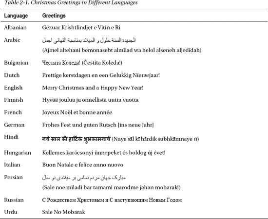
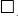
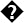
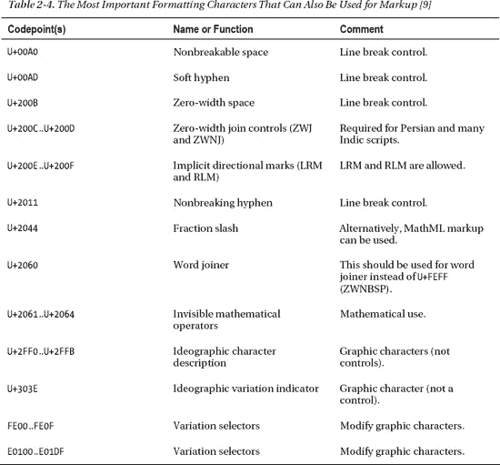

# 二、国际化

网站作者用世界上所有的语言发表文章，有几种技术支持这种多语言网站。在 Web 上正确表示字符的一个关键因素是应用适当的字符编码。虽然这也取决于服务器设置，但是 web 开发人员可以有效地为 web 文档的物理和语法结构的适当国际化做出贡献。标准网站开发的第一步是在文件和文档内容级别应用国家设置。Unicode 可以被认为是最终的编码，是从标准化组织的角度来描述的。Unicode 字节顺序标记提供了关于在这种多字节字符编码表示中可单独寻址的子组件的顺序的信息，使用 Unicode 字节顺序标记可能会引起混淆。特殊字符和符号通常可以通过各种方式提供，包括实体集、转义码和十六进制表示法。

在本章中，您将学习如何保护网站上的字符显示，使其能够正确显示自然语言的任何字符或表意文字。字符可以用几种方式表示，这取决于所选择的字符编码。虽然有各种各样的字符编码系统，但 Unicode 可以用于几乎所有的场景。字符编码可以用多种方式设置，从`meta`标签到 HTTP 头。大多数字符可以直接添加到标记中；但是，您应该记住一些例外情况。您还将学习字符实体和空白字符的正确应用，这些字符可用于向网站添加特殊字符，如不可见、不可打印的控制字符。

### 字符编码的重要性

直到 20 世纪 90 年代，计算机主要仅支持英语字母表的字符(部分是因为美国在计算机市场上的主导地位)，并且对国际字符的需求已经由当时使用的操作系统(例如，DOS、Windows 3.1、Windows 95)支持的硬件代码页来满足，例如 CP852 或 CP1252。例如，中欧字符的正确显示取决于硬件配置、操作系统及其设置。几年后，随着网络的出现，这样的限制再也不能被接受了。1997 年，HTML 4.0 引入了对国际字符的高级支持。

美国信息交换标准码(ASCII)是得到最广泛支持的字符编码方案，它在 7 位上存储 128 个字符。8 位字符集提供了额外的字符，例如基于 ASCII 的标准字符编码的 ISO/IEC 8859 系列(非正式地称为 Latin-1)。它们于 1987 年首次发布，支持大多数西欧语言，部分支持其他一些语言。

大多数现代字符编码系统都是基于 ASCII 的；然而，它们支持更多的字符。

如果需要除了最基本的拉丁字符之外的任何东西，除非指定适当的*字符编码*，否则您的网站上的文本可能无法阅读。这些标准不仅定义了每个字符的 i 标识和相关的数值(*码点 1* )，还定义了该值在被编码文件的位中的表示方式。

如果正确声明了字符编码，浏览器可以使用适当的编码来呈现 web 文档。因此，所有特殊字符都将正确显示。浏览器通常也有一个自动字符编码识别特性，在文档的字符编码没有声明的情况下会被激活。根据文件的设置，浏览器可能会识别所使用的字符编码。用户也可以在大多数浏览器中手动选择编码方案，这是一种强制方法，如果所有服务器和文档设置都正确，则不应使用。

作为一个例子，让我们假设圣诞祝福将在网页上以几种语言发布，如表 2-1 所示。

__________

1 代码点是代码位置，可以是构成字符编码的代码空间的任何数值。

此内容旨在满足无法通过所有字符编码方案编码的本地化要求；也就是说，并不是所有的字符编码系统都适合表示这种字符种类。这些角色的正确表现并不像人们想象的那样自然。很容易出现不需要的字符，如正方形()或问号()，而不是非基本字符的正确形式。不适当的字符编码(或其声明)也会导致额外的问题；例如，文本可能变得无法搜索。即使适当的和不适当的字符编码的重叠部分可能有清晰的字符，文本的大部分也会包含无意义的字符。错误的编码不仅会导致不适当的渲染，还会导致进一步的处理问题；例如，数据库可能变得不可访问。

除了编码信息不足之外，其他原因也会破坏文本的可读性。缺失字体只是其中之一。

对特殊字符进行编码的可能性取决于所使用的字符编码和字符集。

有各种各样的字符集。最著名的可以归纳如下:

*   *utf*:utf-8/utf-16/utf-32(unicode，全球通用)
*   *ISO 标准* : ISO-8859-1(西欧)、ISO-8859-2(中欧)、ISO-8859-3(南欧)、ISO-8859-4(北欧)、ISO-8859-5(西里尔文)、ISO-8859-6-i(阿拉伯文)、ISO-8859-7(希腊文)、ISO-8859-8(希伯来文、视觉)、ISO-8859-8-i(希伯来文、逻辑)、ISO-8855
*   *US-ASCII(基础英语)*
*   *Windows* : Windows-1250(中欧)、Windows-1251(西里尔文)、Windows-1252(西欧)、Windows-1253(希腊文)、Windows-1254(土耳其文)、Windows-1255(希伯来文)、Windows-1256(阿拉伯文)、Windows-1257(波罗的海沿岸)
*   *东方语言编码* : EUC-JP(日语、Unix)、Shift_JIS(日语、Win/Mac)、EUC-kr(韩语)、gb2312(中文、简体)、gb18030(中文、简体)、big5(中文、繁体)、Big5-HKSCS(中文、香港特别行政区)、tis-620(泰语)
*   *其他* : koi8-r(俄语)、koi8-u(乌克兰语)、Macintosh (MacRoman)等等。

尽管种类繁多，但只有单一字符编码的变体——Unicode——才应该使用，除非有非常充分的理由不这样做。下一节描述字符编码。

### 统一码

Unicode 是通用字符编码的标准。它提供了对世界上书写语言所使用的所有字符进行编码的能力 [1 ]。除了自然语言的字符和广泛使用的符号，世界上所有的历史文字也包括在内。Unicode 为大约 109，000 个字符提供代码，涵盖 93 种文字(甚至包括埃及象形文字等历史文字)，包括字母、表意文字集和符号。此外，Unicode 代码空间支持超过一百万个代码点。Unicode 字符代码表提供了对任何字符及其代码点 [2 ]的快速访问。这些分类也让我们深入了解 Unicode 所支持的语言和字段的丰富性:

*   脚本
    *   *欧洲文字*:亚美尼亚语(包括连字)、科普特语(包括希腊文区的科普特语)、塞浦路斯音节表、西里尔语、格鲁吉亚语、格拉哥利特语、哥特语、希腊语、拉丁语(扩展，包括连字和全角拉丁字母)、线性 B(带有音节表和表意文字)、Ogham、古意大利语、Phaistos Disc、Runic 和 Shavian
    *   *音标*:音标扩展、音标扩展、声调修饰字母、间距修饰字母、上标和下标
    *   *组合变音符号*:组合变音符号和组合半音符号
    *   非洲文字:巴姆语、埃及象形文字、埃塞俄比亚语、恩科语、奥斯曼语、提夫纳语和瓦伊语
    *   *中东文字*:阿拉伯语、帝国阿拉姆语、阿维斯陀语、卡利安语、楔形文字(包括数字和标点符号、古波斯语和乌加里特语)、希伯来语、吕底亚语、曼达语、古南阿拉伯语、巴列维语、帕提亚语、腓尼基语、撒马利亚语和叙利亚语
    *   中亚文字:蒙古语、古突厥语、八思巴语和藏语
    *   *南亚文字*:孟加拉语、梵文、梵文、古吉拉特语、古尔穆希语、凯提语、卡纳达语、Kharoshthi 语、莱普查语、林布语、马拉雅拉姆语、Meetei Mayek 语、Ol Chiki 语、奥里雅语、索拉什特拉语、僧伽罗语、Syloti Nagri 语、泰米尔语、泰卢固语、塔纳语和吠陀扩展语
    *   *东南亚文字*:巴塔克语、巴厘语、布吉纳语、占语、爪哇语、克耶黎语、高棉语(带符号)、老挝语、缅甸语(扩展)、新大略语、热江语、巽他语、乐泰语、泰坦语、泰越语和泰语
    *   菲律宾文字:布希德语、哈努努语、他加禄语和塔班瓦语
    *   *东亚文字*:注音(扩展)、中日韩统一表意文字(汉，扩展)、中日韩兼容表意文字(带补充)、/康熙字根、韩文 Jamo(扩展)和音节、平假名、片假名(带音标扩展、假名补充、半角片假名)、堪布、傈僳族、彝语(带音节和字根)
    *   美国文字:切罗基语、沙漠语和统一的加拿大土著印第安方言领音
    *   *其他文字*:字母表示形式、半角全角形式、ASCII 字符
*   符号和标点符号
    *   *标点符号*:普通标点符号(ASCII 标点符号、Latin-1 标点符号、小型变体)、补充标点符号(CJK 符号和标点符号、CJK 兼容格式、全角 ASCII 标点符号和竖排格式)
    *   *字母数字符号*:字母状符号(包括罗马符号)、数学字母数字符号、封闭字母数字、封闭 CJK 字母和月份、CJK 兼容符号(包括附加的方形符号)
    *   *数字和数字*:爱琴海数字、古希腊数字、ASCII 数字(包括全角 ASCII 数字)、普通印度数字形式、计数杆数字、楔形数字和标点符号、数字形式、鲁米数字符号、上标和下标
    *   *数学符号*:箭头、数学字母数字符号、数学运算符和几何形状
    *   *其他符号*:炼金术符号、古代符号、盲文图案、货币符号、丁字、表情符号、游戏符号、杂项符号、音乐符号(包括古希腊音乐符号和拜占庭音乐符号)、交通和地图符号、易经符号
    *   *特殊字符*:布局控件、不可见操作符、标签、变体选择器

该标准支持三种编码格式(UTF-8、UTF-16 和 UTF-32 ),它们使用通用的字符集。它们支持相同的数据传输，但每码单位格式分别为 8、16 或 32 位(字节、字或双字)。它们甚至可以相互转化。所有三种编码形式每个字符最多需要 4 个字节(32 位)的数据。根据所选择的编码形式(UTF-8、UTF-16 或 UTF-32)，每个字符被表示为一个 1 到 4 个 8 位字节的序列、一个或两个 16 位代码单元，或者单个 32 位代码单元。由于 UTF-8 和 UTF-16 是可变宽度编码，UTF-8 导致英文文本的文件较小。然而，UTF-8 要求一个亚洲字符需要 3 个字节，而 UTF-16 只需要 2 个字节。UTF-32 码点计算可以快速执行，但所有码点都需要 4 个字节(固定宽度编码)。

对于 web 内容，推荐 UTF-8，它提供了与 US-ASCII 2 的互操作性和向后兼容性，并具有进一步的优势特性 [3 。UTF-8 支持*国际化资源标识符* (IRIs，多语言网址)[4，5]。UTF-8 在编码字符时至少使用一个字节，而 UTF-16 使用两个字节，因此 UTF-8 编码的文件往往比 UTF-16 编码的文件小。UTF-8 是面向字节的，而 UTF-16 和 UTF-32 不是；换句话说，UTF-16 和 UTF-32 文件的字节顺序应该由字节顺序标记来声明(BOM——将在“特殊字符”下的相应部分中描述)。UTF-8 在从错误中恢复方面比其他 Unicode 风格更好。

UTF-16 和 UTF-32 还有更多变体，这取决于*字符顺序*，这是字符集中可单独寻址的子组件的顺序。如果最高有效字节是第一个字节(最低地址)，最低有效字节是最后一个字节(最高地址)，那么这个文件就叫做*大端* (UTF-16BE，UTF-32BE)。如果这些字节被颠倒，文件被称为*小端* (UTF-16LE，UTF-32LE)。表 2-2 总结了 UTF-8 与 UTF-16 和 UTF-32 的不同之处。

_________

2 所有 US-ASCII 字符在 UTF-8 中使用与 US-ASCII 完全相同的字节；即，仅包含 ASCII 字符的 UTF-8 文件等同于 ASCII 文件。

根据 HTML5 规范，“鼓励作者使用 UTF-8。一致性检查器可能会建议作者不要使用遗留编码 [6 ]。创作工具应该默认为对新创建的文档使用 UTF-8[7]。

#### 标记上下文中应该避免的字符

由于以下一个或多个原因，一些 Unicode 字符不应应用于 HTML 或 XML 文档(表 2-3 )的标记上下文中:

*   在 Unicode 标准中不赞成使用它们。
*   没有额外的数据就无法支持它们。
*   它们很难处理，因为它们是有状态的。 3
*   使用标记可以更有效地处理它们。
*   应该避免使用它们，因为它们可能会导致与等效标记的潜在冲突。

__________

3 文本中由特定值表示的字符取决于文本流中先前提供的值，例如转义序列或双向嵌入控制。

#### 格式化也适合标记的字符

Unicode 中有一些特殊的格式化字符也可以用于标记(表 2-4 )。它们影响文本，并且可以同时应用于标记。这些格式化字符由渲染引擎解释。

#### 特殊字符

某些 Unicode 字符值得特别注意，因为它们应该谨慎使用。

##### 字节顺序标记(BOM)

Unicode 文件可以在最开始包含特殊字节，称为*字节顺序标记* (BOM)。这个码点是 U+FEFF(零宽度不间断空格，ZWNBSP)。如前所述，应该声明 UTF-16 和 UTF-32 编码文件的字节顺序，BOM 提供了这些信息。

在 UTF-16 中，2 或 4 个字节的字符可以用两种方式排序(小端或大端——本质上只是定义字节的读取方向)。要从这两者中选择，用 UTF-16 编码的文档应该总是以 BOM 开始。在 UTF-8 中，它是可选的，因为字符中没有可选的字节序列。如果 BOM 仍然在 UTF-8 中提供，它被称为 *UTF 8 签名*。根据 W3C 的 I18N 活动组，字节顺序标记应该在 UTF-8  [10 ]中省略。这种字节顺序标记在某些浏览器中会导致显示问题。例如，它会在页面顶部产生额外的一行或不需要的字符 [11 ]。可以使用高级文本编辑器或 Richard Ishida 的 *UTF-8 BOM 测试仪*  [12 ]来检查 UTF-8 签名的存在。

##### 空白字符

一小部分 Unicode 字符被认为是空白字符，它们具有不同的换行属性、不同的连接属性和不同的宽度。这些字符用于用换行符、制表符和空格分隔文档的不同部分。它们代表网页上的水平或垂直空间，因此有助于内容块或整个页面的外观和布局。空白字符通常是非可视标记，但在呈现时会保留一些空间。空白字符列表因上下文而异。例如，换页控制字符在 HTML 中被认为是空白，但在 XML 中不是。此外，每种标记语言都定义了一些可以作为标记语法一部分的空白字符。XML 规范将空白定义为一个或多个以下字符的组合:空格(U+0020)、回车符(U+000D)、换行符(U+000A)或制表符(U+0009)。HTML 4.01 还支持换页符(U+000 c)；但是，该字符不能在 XHTML 中使用。

并非所有空白字符都可以从键盘键入，尽管最常见的空白字符，如空格(西方语言中的基本单词分隔符)或单个制表符，可以分别使用空格键和 Tab 键键入。高级文本编辑器通常为所有其他编辑器提供插入选项(参见后面的“开发工具”一节)。

20 世纪 90 年代的一个非常糟糕的做法是通过嵌入空白图像来提供空白，比如`spacer.gif`文件，而不是空白字符。这种方法仍然存在，尽管它只有缺点。例如，使用空格符图像的网页内容失去了它的结构，并且提供了没有语义或结构意义的元素。结果，这种文档的源代码的长度不是最佳的。即使是对内容最轻微的修改也可能导致布局混乱。这样的图片也可能对搜索产生负面影响。此外，这种文档的页面内容对于文本浏览器和屏幕阅读器是不可访问的(这将重复读出“spacer.gif”)。

#### 建议 NFC 标准化

在 Unicode 中，相同的文本可以提供不同的字符序列。例如，被加重的 a(换句话说，α)可以表示为*预组合的* U+00E1(带锐音符的拉丁文小写字母 a)或者表示为 U+0061(拉丁文小写字母 a)和 U+0301(组合锐音符)的*分解的*序列。

Unicode 标准支持四种*规范化形式* : *NFC* 、 *NFD* 、 *NFKC* 、 *NFKD* 。 *C* 代表组合(预组合)， *D* 代表分解， *K* 代表兼容性。

当在(X)HTML 标识符或 CSS 选择器和类名中使用重音符号或其他音调符号时，所使用的规范化形式尤其重要。如果这样的单词在 HTML 中以预先组合的形式使用(例如，`
`)，但是在 CSS 中以分解的形式使用(例如，`#hangsúlyos { color: red; }`)，那么选择器将不会匹配类名。这个问题可以通过在标记属性和 CSS 属性中避免重音字符来解决，这是强烈建议的。

W3C 建议在 Web 上进行 NFC 标准化，以提高互操作性 [13 ]，默认情况下，高级文本编辑器支持 NFC 标准化。

#### 应该首选 Unicode

Web 文档应该一次使用一种字符编码。同一文档的不同部分不应使用不同的编码方案进行编码。

UTF-8 字符编码可以显著降低多语言网站的复杂性。与任何其他编码系统相比，Unicode 允许在一个页面上使用更多的语言。在大多数情况下，它是内容、表单、脚本和数据库的理想选择。因此，应尽可能使用 Unicode[14]。幸运的是，这种用法在网络上有很好的趋势。根据谷歌 2010 年 8 月发布的报告，大约 50%的网站应用 UTF-8。终极字符编码的普遍使用可以消除用户代理在呈现包含特殊字符的文档时做出的错误假设。

但是，Unicode 的应用并不能保证文本能够在浏览器中正确显示。诸如阿拉伯语之类的一些脚本语言需要额外的技术来确保字形的适当字符序列。

### 声明标记的字符编码

可以通过多种方式确定 web 文档的字符编码:

*   使用 HTTP 头
*   使用文档内声明
    *   使用 *pragma 指令* (HTML 4，XHTML，(X)HTML5)
    *   使用元字符集属性(HTML5)
    *   使用 XML 声明 4 (XHTML)

最后三个选项用在标记中，但不是第一个，它是由 web 服务器应用来指示字符编码的。如前所述，并不是所有的文档内声明都可以在任何标记语言中使用，但是 pragma 指令可以在大多数标记语言中使用。由于所有这些技术都向呈现引擎提供了关于如何解释文件的编码信息，因此确保这些声明与文件的实际字符编码相对应是至关重要的。

如果多个编码声明不一致或相互矛盾，以下优先规则将决定应用哪个声明:

1.  HTTP `Content-Type`头
2.  字节顺序标志 5
3.  XML 声明
4.  `meta`元素
5.  `link charset`属性

__________

如果只使用 XML 声明来提供字符编码声明，一些渲染引擎会忽略它。

#### 编码声明在 HTTP 头中

声明字符编码的一个选项是在 HTTP 头中提供适当的数据。清单 2-1 显示了一个例子。

***清单 2-1。**设置 HTTP 头中的字符编码*

`HTTP/1.1 200 OK
Date: Tue, 02 Aug 2011 14:18:05 GMT
Server: Apache/2.2.3 (Oracle)
…
Content-Type: text/html; **charset=UTF-8**
Content-Language: en`

如前所述，这些声明具有最高的优先级。它们应该与文档内声明一致。

使用 UTF-16 的文档应该声明为`UTF-16`而不是`UTF-16BE`或`UTF-16LE`，并在文件中提供一个字节顺序标记。

HTTP 头也用于其他目的。有关 HTTP 报头的更多信息，请参见第四章。

#### 文档内声明

在 HTML 4 中， *pragma 指令*应该以清单 2-2 所示的形式用在 head 元素的顶部。

***清单 2-2。**用 Pragma 指令声明字符编码*

`<meta http-equiv="Content-type" content="text/html;**charset=UTF-8"**>`

前面的声明也可以在 HTML5 中使用，它还提供了一个新指定的元字符集属性(清单 2-3 )。它们中的任何一个都可以使用，但是一次只能使用一个。整个声明必须在页面的前 512 个字节内。

***清单 2-3。** HTML5 `meta charset`*

`<meta **charset="UTF-8">**`

XHTML 文档的编码声明取决于它们使用的 MIME 类型。如果它们被用作`text/html`，那么清单 2-2 中的*杂注指令*可以用在 head 元素的顶部。

用作 XML 的 XHTML 文档可以在文档的第一行使用 XML 声明的编码声明(清单 2-4 )(见第三章)。

_________

HTML5 规范已经将 BOM 添加到层次结构中，但是这还没有在所有的浏览器中实现。

***清单 2-4。**设置 XML 文档中的字符编码*

`<?xml version="1.0" **encoding="utf-8"**?>`

对于使用除 UTF-8 或 UTF-16 之外的字符编码的任何 XML 文档，以及在 HTTP 头不提供编码的情况下，都需要 XML 声明(参见后面的第三章)。

### 为 CSS 声明字符编码

通常，不需要为样式表声明字符编码。然而，当且仅当 CSS 中提供了任何非 ASCII 内容时，才应该声明外部 CSS 文件的编码。或者，用要求非拉丁字符的语言编写的选择器或其他 CSS 内容的描述性名称可以不带重音符号，完全消除了对 CSS 编码声明的需要。

#### HTTP 头声明

CSS 编码也可以在 HTTP Content-Type 头中声明。例如，如果字符编码是 UTF-8，那么 HTTP 声明看起来就像清单 2-5 中的。

***清单 2-5。**为 CSS 声明字符编码(很少使用)*

`Content-Type: text/css; **charset=UTF-8**`

除了 HTTP 声明之外，还总是建议使用文档内声明(参见下一节)。这可以保证即使在本地移动或使用文件，也可以确定外部 CSS 文件的编码。

HTTP 头中声明的字符编码应该与 CSS 文件中声明的一致。自然，第一个优先级更高。

#### 文档内声明

字符编码可以通过`@charset` *at-rule* 设置，语法如清单 2-6 所示。

***清单 2-6。**`@charset`At 规则的语法*

`@charset "<charset-name>";`

每个 CSS 文件只能使用一个`@charset`规则。应该在文件的最开始声明它。声明前不应有字符(如果 CSS 文件是 Unicode 编码的，则只有 BOM6)。

`charset-name`可以是 IANA15 定义的字符集之一。某些编码在 IANA 注册表中有多个名称(在这些情况下，应该应用表示为首选的名称)。清单 2-7 展示了一个外部 CSS 文件字符编码声明的典型例子。

***清单 2-7。**用 At 规则设置 CSS 的字符编码*

`@charset "UTF-8";`

_________

6 外部 CSS 文件通常采用 US-ASCII 编码。

这些规则只能用于外部样式表。文档内样式表声明应该避免`@charset`规则。

HTML 4.01 规范为`link`元素定义了一个`charset`属性，它可以用来标识目标文档的字符编码。然而，在 HTML5 中，`link`元素的这个属性被认为是过时的(部分原因是浏览器不完全支持它)；因此，应该避免。

### 转义码、特殊字符和符号

在 HTML 和 XHTML 文档中，每个字符可以直接表示，也可以用一个字符序列表示(也称为*字符引用*)。存在两种类型的字符序列:*数字字符引用*和*字符实体引用*。

假设一个文档片段包含一个带重音的 a 字符。它可以通过`&#xE1;`或`&#225;`数字字符引用或者通过(X)HTML 文档中的`&aacute;`实体引用来声明(详见以下章节)。但是，应该直接使用字符á。版权标志(而非`&copy;`)、注册商标标志(而非`&reg;`)等也是如此。

字符应该总是优先于转义码，除非那些应该表示的字符在(X)HTML 或 XML 中有语法意义，但不可见或不明确。然而，在这些情况下，使用实体是强制性的 [16 ]。换句话说，文本或属性值中使用的标记字符必须经过*转义*。例如，当一个(X)HTML 源代码应该表示为未经处理的文档内容时，`<`和`>`字符应该由它们在源代码中的实体名称提供。类似地，如果需要一个`&`字符作为 RSS 提要或 RDF 文件中的文本，那么应该使用`&amp;`实体(更多信息请参见“实体引用”一节)。

#### 数字参考

数字字符引用通过*通用字符集*或 *Unicode 码位*以`&#*nnnn*;`的形式标识字符，其中 *`nnnn`* 是十进制形式的码位。

HTML 和 XHTML 都支持十六进制引用。在 HTML 中，它们可以以`&#*Xhhhh*;`或`&#*xhhhh*;`的形式应用。因为 XML 是区分大小写的，所以在 XHTML 中它们必须是小写的(`&#*xhhhh*;` )  [17 )。

nnnn 或 hhhh 可以是任意数量的数字，并且可以包括前导零。

应该消除数字引用，以利于直接使用字符。在大多数情况下，没有理由在标记中插入一个撇号作为`&#8217;`而不是`’`字符本身。其他角色也是如此。如果不能用键盘键入字符，如日语表意字符，可以用高级软件工具插入相应的字符，或者通过剪贴板从其他应用、代码图表或网站复制并粘贴相应的字符。请注意，即使是高级文本编辑器，在开发过程中也会错误地显示许多这些直接插入的字符；但是，如果包含文件的字符编码设置正确并且该文件被正确提供，浏览器将正确显示它们。

#### 实体引用

字符实体引用通过适当实体的名称来引用字符，该实体以& *name* 的形式将所需字符作为其替换文本；。

HTML 支持 252 个字符实体 [18 ]。XHTML 中有 253 个实体(包括 XML 1.0 的 5 个预定义实体)[19]；然而，它们的应用受到 XHTML 文档处理方式的影响。应该记住，XHTML 文档，如果服务正确，是由 XML 解析器处理的，而不是由解释 HTML 文档的 SGML 解析器处理的。那些在 XML 中有意义的字符，比如小于号(`<`)，如果直接提供而不是使用实体，会导致解析错误。在所有 XML 环境中，只有四种字符实体的处理得到保证:`&amp;`、`&gt;`、`&lt;`和`&quot;`(分别为`&`、`>`、`<`和`"`)。幸运的是，这个简短的列表包含了那些可以用于语法符号的非常重要的字符实体(与号、大于号、小于号)。W3C 推荐在 XHTML 文档的`href`属性中使用&字符 [20 ]。应特别注意包含参数的 URIs。这些 URIs 中的单个&字符应由实体`&amp;`21 替换。

虽然`&apos;`实体(撇号，`U+0027`)是 XML 的五个预定义实体之一，但它不应该用在 XHTML [ [22 ]中。

由于几乎所有字符都可以直接用 Unicode 表示，包括但不限于自然语言的所有字母和表意符号、加重字母、特殊字符、数学符号和符号，因此字符引用应该被删除 [23 ]。直接使用字符比数字或实体引用更容易解释、维护和修改(清单 2-8 )。带有引用的文本更难扩展，几乎不可能搜索到。许多字符不能用引用来表示，这在 90 年代经常导致网页上出现不正确的字符。例如，显示了带颚化符的小写`o`，`õ`，而不是带双锐音符(也称为 Hungarumlaut)的`o`，ő是一个不同的字符。

***清单 2-8。**具有字符、数字和实体引用的相同中欧文本的三个版本*

`<h1>Áttekintés</h1>

A HTML5 a HTML teljes megújulása, új funkciókkal felvértezve.

<h1>&#193;ttekint&#233;s</h1>

A HTML5 a HTML teljes meg&#250;jul&#225;sa, &#250;j funkci&#243;kkal felv&#233;rtezve.

<h1>&Aacute;ttekint&eacute;s</h1>

A HTML5 a HTML teljes meg&uacute;jul&aacute;sa, &uacute;j funkci&oacute;kkal felv&eacute;rtezve.

`

### 检查 I18N

那些支持国际化的设置和内容可以通过 *W3C 国际化检查器*  [24 进行检查。它可以确定 HTML/XHTML 文档是否包含非 NFC 类名和标识符、页面的语言设置等等。验证器在第十四章的“验证 I18N”部分有详细描述。

### 总结

在本章中，您了解了国际化设置的重要性，这些设置使正确显示的字符能够在网站上呈现或在数据库中处理。您现在已经知道有很多字符编码系统可供选择，其中许多已经使用了几十年，但在最近几年已经过时了。有一种终极的可变宽度字符编码，称为 UTF-8，它是 Unicode 的一种风格，省略了 BOM，并向后兼容曾经最广泛使用的编码方案 ASCII。

下一章将描述标记，大多数标准化工作都在这里进行。标记不仅提供文档结构和内容，还作为可访问性支持和语义注释的基础。正如你将看到的，标记语言有很大的选择余地，不仅仅是 HTML5，这是最近大多数开发者谈论的一种语言。您将学习 HTML 和 XHTML 元素和属性，这些元素和属性可以安全地应用于各种文档，同时保持符合标准。这一章还会让你明白为什么严格标记总是首选。

### 参考文献

1.  Unicode Consortium(2010)Unicode 标准:技术介绍。Unicode 公司[www.unicode.org/standard/principles.html](http://www.unicode.org/standard/principles.html)。2010 年 9 月 29 日访问
2.  Unicode (2011) Unicode 6.0 字符代码图表。Unicode 联合会。[www.unicode.org/charts/](http://www.unicode.org/charts/)于 2011 年 8 月 3 日访问
3.  叶尔乔·F(2003 年)。UTF-8，ISO 10646 [RFC3629]的一种转换格式。互联网协会。[www.ietf.org/rfc/rfc3629.txt](http://www.ietf.org/rfc/rfc3629.txt)2010 年 9 月 29 日访问
4.  Duerst M，Suignard M (2005)国际化资源标识符(IRIs)。互联网协会。[www.ietf.org/rfc/rfc3987](http://www.ietf.org/rfc/rfc3987)2010 年 9 月 30 日访问
5.  Ishida R (2010)多语言网址介绍。万维网联盟。[www.w3.org/International/articles/idn-and-iri/](http://www.w3.org/International/articles/idn-and-iri/)2010 年 9 月 30 日访问
6.  希克森一世(编辑。)(2010) HTML5(网络作者版)修订版 1.4439。HTML 和 XHTML 的词汇表和相关 API。编辑稿。万维网联盟。[`dev.w3.org/html5/spec-author-view/semantics.html`](http://dev.w3.org/html5/spec-author-view/semantics.html)2010 年 9 月 29 日访问
7.  希克森一世(编辑。)(2010) HTML5(包括仍在开发中的下一代附加功能)。标准草案。苹果电脑公司、Mozilla 基金会和 Opera 软件公司。[www . whatwg . org/specs/we b-apps/current-work/multipage/semantics . html](http://www.whatwg.org/specs/web-apps/current-work/multipage/semantics.html)。2010 年 9 月 29 日访问
8.  Dürst M，Freytag A (2007)不适合用于标记的字符。in:XML 和其他标记语言中的 Unicode。Unicode 技术报告#20。W3C 工作组说明。万维网联盟。[www.w3.org/TR/unicode-xml/#Suitable](http://www.w3.org/TR/unicode-xml/#Suitable)2010 年 9 月 30 日访问
9.  适合用于标记的 Dürst M，Freytag A (2007)格式字符。in:XML 和其他标记语言中的 Unicode。Unicode 技术报告#20。W3C 工作组说明。万维网联盟。[www.w3.org/TR/unicode-xml/#Format](http://www.w3.org/TR/unicode-xml/#Format)2010 年 9 月 30 日访问
10.  Ishida R (2010)我需要了解 BOM 的哪些信息？in:HTML 中的字节顺序标记(BOM)。万维网联盟。[www . w3 . org/International/questions/QA-byte-order-mark # BOM how](http://www.w3.org/International/questions/qa-byte-order-mark#bomhow)。2010 年 9 月 30 日访问
11.  Cawkwell D，Ishida R (2010 年)展示了 UTF-8 轰炸造成的问题。万维网联盟。[www.w3.org/International/questions/qa-utf8-bom](http://www.w3.org/International/questions/qa-utf8-bom)2010 年 9 月 30 日访问
12.  Ishida R (2007 年)。UTF-8 炸弹测试机。理查德·石田。[`rishida.net/utils/bomtester/`](http://rishida.net/utils/bomtester/)2010 年 9 月 30 日访问
13.  Ishida R(2010)HTML 和 CSS 的标准化。万维网联盟。[www . w3 . org/International/questions/QA-html-CSS-normalization](http://www.w3.org/International/questions/qa-html-css-normalization)。2010 年 9 月 30 日访问
14.  如果可以的话，使用 UTF-8。输入:选择&应用字符编码。万维网联盟。[www . w3 . org/International/questions/QA-choosing-encodings # use unicode](http://www.w3.org/International/questions/qa-choosing-encodings#useunicode)。2010 年 9 月 30 日访问
15.  Simonsen K 等人(2010)的字符集。互联网号码分配机构。[www.iana.org/assignments/character-sets](http://www.iana.org/assignments/character-sets)2010 年 9 月 30 日访问
16.  Ishida R (2010)何时使用转义。In:在标记和 CSS 中使用字符转义。万维网联盟。[www.w3.org/International/questions/qa-escapes#use](http://www.w3.org/International/questions/qa-escapes#use)2010 年 9 月 30 日访问
17.  Pemberton S 等人(2002)将实体引用为十六进制值。在:XHTML 1.0 可扩展超文本标记语言(第二版)。HTML 4 在 XML 1.0 中的重构。W3C 推荐。万维网联盟。[www.w3.org/TR/xhtml1/#h-4.12](http://www.w3.org/TR/xhtml1/#h-4.12)2010 年 9 月 29 日访问
18.  勒霍斯，雅各布一世(编辑。)(1999)HTML 4 中的字符实体引用。在:HTML 4.01 规范。W3C 推荐。万维网联盟。[www.w3.org/TR/html4/sgml/entities.html](http://www.w3.org/TR/html4/sgml/entities.html)2010 年 9 月 29 日访问
19.  Pemberton S 等人(2002)实体集。在:XHTML 1.0 可扩展超文本标记语言(第二版)。HTML 4 在 XML 1.0 中的重构。W3C 推荐。万维网联盟。[www.w3.org/TR/xhtml1/#h-A2](http://www.w3.org/TR/xhtml1/#h-A2)2010 年 9 月 29 日访问
20.  Pemberton S 等人(2002 年)在属性值中(和其他地方)使用了&符号。在:XHTML 1.0 可扩展超文本标记语言(第二版)。HTML 4 在 XML 1.0 中的重构。W3C 推荐。万维网联盟。[www.w3.org/TR/2002/REC-xhtml1-20020801/#C_16](http://www.w3.org/TR/2002/REC-xhtml1-20020801/#C_16)2010 年 9 月 30 日访问
21.  石田 R (2010)顺便说一句。In:在标记和 CSS 中使用字符转义。万维网联盟。[www.w3.org/International/questions/qa-escapes#bytheway](http://www.w3.org/International/questions/qa-escapes#bytheway)2010 年 9 月 30 日访问
22.  Pemberton S 等人(2002)命名字符引用&apos；。在:XHTML 1.0 可扩展超文本标记语言(第二版)。HTML 4 在 XML 1.0 中的重构。W3C 推荐。万维网联盟。[www.w3.org/TR/2002/REC-xhtml1-20020801/#C_16](http://www.w3.org/TR/2002/REC-xhtml1-20020801/#C_16)2010 年 9 月 30 日访问
23.  Ishida R (2010)何时不使用转义。In:在标记和 CSS 中使用字符转义。万维网联盟。[www.w3.org/International/questions/qa-escapes#not](http://www.w3.org/International/questions/qa-escapes#not)2010 年 9 月 30 日访问
24.  W3C I18N 活动组(2010) W3C 国际化检查器。万维网联盟。[`qa-dev.w3.org/i18n-checker/`](http://qa-dev.w3.org/i18n-checker/)2010 年 9 月 30 日访问