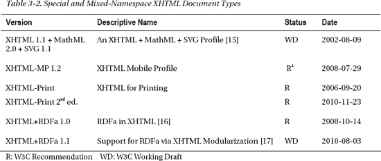

# 三、标记语言：不仅仅是 HTML5

由于标记是 web 文档的本质，它为标准化工作提供了最大的空间。自从 Web 诞生以来，HTML 的受欢迎程度并没有降低；因此，熟悉该语言的版本和变体非常重要。另一方面，XML 语言的应用显著增加。HTML 和 XHTML 之间的差异对于理解从一种文档类型迁移到另一种文档类型的技术至关重要。所有 web 文档的一般结构遵循相同的逻辑；然而，HTML5 引入了新的结构化元素，可以用来创建相当复杂的文档结构。通过研究内容有限的结构良好的文档示例，您将能够自己创建结构良好的 web 文档。为了实现良好的结构，应该区分块行和内联级别的元素，这对于理解如何将元素相互嵌入(元素嵌套)也很重要。您还应该知道如何使用正式的公共标识符和文档类型定义来创建符合标准的文档。XML 声明的严格规则对于 XHTML 创作至关重要。

在这一章中，你将学习网站开发中最重要的标准。本章涵盖了最高级的标记语言以及混合命名空间的文档类型。为了更容易理解，我提供了示例 HTML 和 XHTML 文档。您将了解如何区分不应该使用的不推荐使用的元素和属性，以及可以在当今 Web 上可用的标记语言的几乎所有版本和变体中使用的元素和属性。除了最流行的标记语言版本之外，您将通过混合命名空间文档了解 XML 的强大功能，在混合命名空间文档中，文本标记不仅可以提供通用文本，还可以提供矢量图形和数学注释。阅读完本章后，您将能够应用语义上有意义的标记元素和属性，消除过时的标记，并使用适当的元素嵌套和 DOM 结构创建 web 文档。

 **注**标记基础知识的详细描述不在本书范围内。初级和中级开发人员都可以使用一些资源。其中之一是“HTML 入门”，这是 HTML 规范的作者兼编辑戴夫·拉格特 [ 1  ]写的一篇非常简短的概述。另一个——强烈推荐——W3C 文档是 Michael Smith 的“HTML:标记语言参考”。关于 HTML5【例如 3 、 4 、 5 、 6 和 XHTML 的书也很多。  1  然而，必须更加小心地考虑有关 HTML5 的文档的变更和过时。如果在开发过程中某个元素需要一个简短的总结，W3C Cheatsheet 也非常有用。

### SGML 语言

*标准通用标记语言(SGML)* 是一个标记语言家族。从 20 世纪 80 年代中期开始使用。SGML 的主要特性之一是灵活性。

对于 web 开发人员来说，最重要的 SGML 语言是 HTML，它从一开始就是万维网的核心语言。

 **注意**尽管早期 HTML 版本和 HTML5 的标记语法有相似之处，但最新版本不再基于 SGML 但是，它向后兼容传统的 HTML 解析。

#### HTML

早在 1989 年，位于瑞士日内瓦的欧洲高能物理实验室(CERN)就诞生了超文本标记语言(HTML)的概念。一年后，万维网项目也在那里启动。最初，HTML 被用来在科学家之间共享信息。这种语言的主要元素是在那时形成的，包括标题、段落和超链接。然而，这些文件的语义是有限的 [9 ]。后来还添加了新元素和多媒体功能，这导致了跨不同平台的文档的互操作性问题。

这种语言相对简单的语法和词汇使得快速广泛的传播成为可能。然而，这也是 90%以上的 HTML 文档中存在无效标记的原因。浏览器的容错能力不断被误用。人们应该认识到高质量的 web 文档、可访问性、良好的表示和各种浏览器中的功能的价值。

__________

XHTML 手工编码者可以轻松地编写 HTML 标记。

### XML 语言

*可扩展标记语言(XML)* 是万维网上结构化文档和数据的通用格式。因为 XML 是从 SGML 扩展而来的，所以它也可以被认为是 SGML 的一种受限的、机器可读的形式。在这种情况下，它删除了 SGML 中那些可能导致源代码松散的特性。

与大多数计算机语言不同，XML 没有固定的、预定义的标签集。使用 XML，可以定义单独的标记格式。Web 上一些最著名和最常用的 XML 格式和/或 XML 序列化是 XML、XHTML、SVG、MathML、XSL、RDF、Atom 和 RSS。

许多标记语言主要是为文本文档设计的；然而，表示其他类型信息的需求也在不断增长。音乐、视频、播放列表、矢量图形、内容聚合和各种 web 服务都是典型的例子。XML 的一大优势是它是严格的、定义良好的和可扩展的。XML 还使得将多种标记语言组合成单个概要文件成为可能，比如 XHTML + MathML + SVG 或 XHTML + SMIL。其他 XML 应用的附加词汇表(元素、属性和其他组件)可以通过 xmlns 属性声明的名称空间机制来使用。这是 XHTML 相对于 HTML 的主要优势之一。

#### XHTML

*可扩展超文本标记语言(XHTML)* 是一个 XML 语言家族，可以用来替代 HTML。XHTML 是 XML 的应用，因此比 HTML 更具限制性。与 HTML 相反，对于 XHTML 文档，必须确保它们被正确地编写；否则，呈现引擎会给出错误消息，而不是呈现内容。它们需要 XML 解析器，而不是 SGML 解析器。

使用 XML MIME 类型的文档，比如`application/xhtml+xml`，被浏览器视为 XML 文档；换句话说，它们由 XML 处理器解析。因此，XML 和 HTML 被不同地处理。事实上，即使是很小的语法错误也会妨碍 XML 文档(或声称是 XML 的文档)的正确呈现。相反，这类文档的错误在 HTML 语法中会被忽略。XML 文档的解析错误很容易导致“黄屏死亡”

### 版本概述

理解不同标记语言版本和变体的主要差异和功能，并分析被称为*框架文档*的具有最少内容的样本文档是很有用的。它们将在以下各节中提供。这些文档可以作为手工编码开发的基础。注意缩进是用来提供清晰易懂的代码。自然，为了获得完全的代码最优性，可以省略制表器。此外，所有提供的文档都是按原样逐字符有效的，因此它们必须用有效的标记进行扩展，以保持有效性。所有这些文件都可以在本书的网页上下载，也可以在本书的配套网站上下载。

#### HTML 版本和变体

这一部分将强调 HTML 的某些版本，原因有二。首先，有些对网络的发展产生了重大影响，并被用作未来标准的基础。第二，有些在引进 10 多年后仍在使用。

虽然大多数早期的 HTML 版本已经不再使用了，但是了解它们的里程碑和 HTML 的演变是很重要的。

HTML 的正式规范创建于 1992 年，该规范以 SGML 文档类型定义的形式不断发展。HTML 很快成为网络出版的通用语言。HTML 文档可以在纯文本编辑器和 WYSIWYG 环境中手动创建。 2

HTML 2.0 由互联网工程任务组的 HTML 工作组于 1995 年创建。它也被称为 RFC 1866  [10 ]。HTML 2.0 是核心 HTML 元素的第一个标准化形式。HTML 2.0 用于独立于平台的超文本文档。文档类型已过时，当前被声明为历史记录。更多细节可以在 W3C 档案 [11 ]中找到。

*HTML 3.2* 是 W3C 的首个 HTML 推荐。在这个版本中，引入了新的元素来创建表格、小程序、上标和下标，以及图像周围的文本流 [12 ]。HTML 3.2 向后兼容 2.0 版本。清单 3-1 中的代码是一个 HTML 3.2 文档的片段。

***清单 3-1。**旧 HTML 文档中的不良做法(只是演示，不应使用)*

`<!DOCTYPE HTML PUBLIC "-//W3C//DTD HTML 3.2//EN">
<title>An HTML 3.2 example</title>
<body **bgcolor="#FFF6F0"**
 **text="#000000"**
 **link="#C00000"**>
<h1 **align=center**>Example header</h1>

 
<**A HREF**=http://www.example.com/></**A**> <i>The Author</i>
</body>`

您可以看到这个标记不区分大小写。前面的例子是松散的代码；事实上，对于 web 开发人员来说，这是一个糟糕的例子，因为有些属性没有被引用(例如，`width=102`而不是`width="102"`)，使用了应该通过使用 CSS 来消除的严格表示属性(`bgcolor`、`align`)，段落没有被关闭(`
`标签丢失)，等等。

 **提示**虽然 HTML 允许在元素和属性名中同时使用大写和小写字母，但最好习惯使用小写字母，这在每个标记中都是允许的(包括区分大小写的 XHTML)。

__________

对于网络标准来说，第一个是真正的选择。

*HTML 4* 是一个符合 ISO 标准的版本(ISO 8879)，它是事实上的标准，多年来一直是“万维网的发布语言”。该规范于 1997 年发布，并于 1998 年修订。HTML 4 被 HTML 4.01 取代。

清单 3-2 显示了一个典型的 HTML 4.0 文档的片段。

***清单 3-2。**一个典型的 HTML 4 文档(过时)*

`<!DOCTYPE HTML PUBLIC "-//W3C//DTD HTML 4.0 Transitional//EN">
<html>
<head>
<title>An HTML 4.0 example</title>
</head>
<body>
 …
</body>
</html>`

毫无疑问，这份文件的结构与前一份文件有相似之处。标记语言在不断发展，大多数版本都依赖于早期版本和变体。

以前使用的最著名的 HTML 版本之一是 HTML 4.01。十多年来，它一直是网络的主要标记语言。W3C 推荐标准于 1999 年末发布。它有三种变体:严格、过渡和框架集。在 HTML 4 时代，真正的选择是严格风格，因为它只包含那些被选择包含在未来版本中的元素。创建过渡性变体是为了让开发人员更容易停止使用不推荐使用的标签，并提供时间来学习如何在没有这些过时标签的情况下编写标记(因此得名)。因为框架已经被认为过时很多年了，所以框架集文档根本不应该被使用。框架存在许多问题。例如，如果您访问一个框架集已损坏的网站，丢失的内容会占据整个窗口。如果一个访问者通过一个框架页面的直接链接到达，上下文就会被遗漏。搜索引擎不能有效地索引框架集文档。有链接和书签问题，还有其他问题，如后退按钮在浏览器中不起作用。框架还会减少网页上的可用空间，并导致打印问题。

#### XHTML 版本和变体

XHTML 是一个文档类型系列，它是 HTML 在 XML 而不是 SGML 中的重构。典型的 XHTML *文件扩展名*有`.html`、`.htm`、`.xhtml`、`.xht`和`.xml`。XHTML 文档一般应用`application/xhtml+xml` *互联网媒体类型*；然而，偶尔也会有例外(你将在下一章看到)。

除了 XHTML 的核心版本(表 3-1 )之外，还知道一些复合、扩展和特殊的配置文件(表 3-2 )，还可以定义更多。附加机制允许 XHTML 子集或超集。XHTML 1.1 + MathML 2.0 + SVG 1.1 和 XHTML+RDFa 文档是 XHTML 超集的典型例子。由于在其中应用了额外的(外部)元素集，它们拥有比简单的 XHTML 文档更广泛的标记元素。

XHTML 1.1 + MathML 2.0 + SVG 1.1 文档可以用任何一种化合物编写，它们都有自己的文档格式。所选择的语言是*宿主语言*(参见本章后面的“XHTML + MathML + SVG”一节)。

##### XHTML 1.0

根据其 2000 年发布(2002 年修订)的规范的副标题，XHTML 1.0 是“HTML 4 在 XML 1.0 中的重新表述” 18 。与 HTML 4.01 的三种风格相似，XHTML 1.0 也分别定义了严格、过渡和框架集变体。XHTML 1.0 Strict 只包含那些在 HTML 4.01 中没有被否决的元素和属性。每一个“缺失”的元素和属性都可以被它们的 CSS 等价物所替代。

__________

3 已经暂停。

4 由开放移动联盟而非 W3C 定义。

XHTML 1.0 Transitional 提供了在 Strict variant 中不允许的表示元素，如 center 或 font。清单 3-3 和 3-4 展示了一个例子。

***清单 3-3。**XHTML 1.0 过渡文档中仍在使用一个很久以前就被弃用的元素*

`

  

  A paragraph aligned to center.
  

`

***清单 3-4。**清单 3-3 中的代码用 XHTML 1.0 编写，风格化为 CSS*

`.center {
  text-align: center;
}

A paragraph aligned to center.

`

XHTML 1.0 也有一个框架集变体，尽管正如我们前面看到的，强烈建议消除框架集，即使它们是 web 最初十年中 Web 文档的一个常见特征。

清单 3-5 展示了一个 XHTML 1.0 严格框架文档。

***清单 3-5。**一个 XHTML 1.0 严格框架文档*

`<?xml version="1.0" encoding="UTF-8"?>
<!DOCTYPE html 
 PUBLIC "-//W3C//DTD XHTML 1.0 Strict//EN" 
 "http://www.w3.org/TR/xhtml1/DTD/xhtml1-strict.dtd">
<html xml:lang="en" lang="en">
  <head>
    <title>Minimal XHTML 1.0 Document</title>
    <meta http-equiv="Content-Type" content="application/xhtml+xml; charset=utf-8" />
  </head>
  <body>
    

    This is a minimal XHTML 1.0 document.
    

  </body>
</html>`

 **提示**对于任何种类的 XHTML 文档来说，这都是最好的起点，因为这种文档类型只包含从 HTML 派生出来的基本标记元素，并且在大多数标记语言中仍然通用。这种标记也作为使用外部词汇表进行扩展的基础(这样做，文档类型将会改变)。如果您想使用 HTML5 中引入的新标记元素，并从 XHTML 1.0 Strict 迁移，只需进行最小的更改(例如删除 DTD，将字符编码声明更改为新的，并添加新元素)。

##### XHTML 1.1

多年来，人们已经认识到，标记语言中的表示组件可以用样式表更有效地处理。此外，如果在文档中应用所选元素的子集而不是整个元素集，为手持设备开发的 web 文档可以更有效地使用有限的资源。这就是 *XHTML 模块化*背后的基本思想，这些元素子集被称为*元素模块*。

XHTML 1.1 是“基于模块的 XHTML”，专门包含那些由“XHTML 模块化”定义的元素。因此，HTML 4 和 XHTML 1.0 中不推荐使用的元素不能在 XHTML 1.1 中使用。XHTML 1.1 的模块如下 [20 :

*   结构模块:`body`、`head`、`html`、`title`
*   文本模块:`abbr`，`acronym`，`address`，`blockquote`，`br`，`cite`，`code`，`dfn`，`div`，`em`，`h1`，`h2`，`h3`，`h4`，`h5`，`h6`，`kbd`，`p`，`pre`，`q`，`samp`，`span`，`strong`，`var`
*   超文本模块:`a`
*   列表模块:`dl`、`dt`、`dd`、`ol`、`ul`、`li`
*   对象模块:`object`，`param`
*   展示模块:`b`、`big`、`hr`、`i`、`small`、`sub`、`sup`、`tt`
*   编辑模块:`del`，`ins`
*   双向文本模块:`bdo`
*   表单模块:`button`、`fieldset`、`form`、`input`、`label`、`legend`、`select`、`optgroup`、`option`、`textarea`
*   表格模块:`caption`、`col`、`colgroup`、`table`、`tbody`、`td`、`tfoot`、`th`、`thead`、`tr`
*   图像模块:`img`
*   客户端图像映射模块:`area`，`map`
*   服务器端图像映射模块:`img`上的`ismap`属性
*   内在事件模块:事件属性
*   元信息模块:`meta`
*   脚本模块:`noscript`，`script`
*   样式表模块:`style`元素
*   样式属性模块(已弃用):`style`属性
*   链接模块:`link`
*   基本模块:`base`

前面模块的描述，它们的元素和属性，以及它们的最小内容由“XHTML 的模块化”19 定义。

清单 3-6 展示了一个 XHTML 1.1 框架文档。

***清单 3-6。**一个 XHTML 1.1 框架文档*

`<?xml version="1.0" encoding="utf-8"?>
<!DOCTYPE html PUBLIC "-//W3C//DTD XHTML 1.1//EN" 
 "http://www.w3.org/TR/xhtml11/DTD/xhtml11.dtd">
<html xml:lang="en">
  <head>
    <title>XHTML 1.1 sample document title</title>
    <meta http-equiv="Content-Type" content="application/xhtml+xml; charset=utf-8" />
  </head>
  <body>
    

    XHTML 1.1 sample document body
    

  </body>
</html>`

XHTML 1.1 也可以用在混合名称空间文档中，以支持数学标记和矢量图形(参见“XTHML+MathML+SVG”)。

##### XHTML 2.0

XHTML 2.0(也称为 XHTML 2)可能是下一代标记语言，是 XHTML 1.0 和 1.1 的继任者。然而，它仍处于工作草案阶段，从未成为一项建议。

虽然 XHTML 2.0 有一些早期标记语言的元素，但是它有向后兼容性的问题。尽管如此，熟悉 XHTML 1.0 和 1.1 的编码人员可以轻松开发 XHTML 2.0 文档。

“XHTML 模块化”指的是 XHTML 2.0 不仅仅是另一种标记语言，而是一种 XHTML 宿主语言  [19 。它由具有元素和属性的模块组成。然而，与“XHTML 的模块化”相比，XHTML 2.0 中有几个更新的模块。

在其暂停之后，几个原本打算包含在 XHTML 2.0 中的特性(除了重要的文本和超链接模块之外)正在由 W3C 内部的独立工作组开发。这些技术包括访问、RDFa、角色、XForms 或 XML 事件。

#### HTML5

HTML5 最初是由来自苹果、Mozilla 基金会和 Opera Software 的个人提出的，被称为 *Web 超文本应用技术工作组* ( *WHATWG* )  [21 。后来，W3C 注意到了 WHATWG 的提议，并宣布重新开始 HTML 规范的工作。WHATWG 发现 XHTML 2.0 过于以文档为中心，因此不适合博客、论坛、网络商店和多媒体网站。他们主要关心的是为动态 web 应用创建一个平台。

尽管名字有点复杂， *HTML5* 不仅仅是另一种 HTML 语言。它经常在 web 应用的上下文中使用。它是 HTML 的完全重构，具有新的功能。尽管如此，HTML5 被设计成向后兼容旧的浏览器。此外，HTML5 使用与 HTML 和 XHTML 文档都兼容的 HTML 语法。但是，不支持处理指令。除了众所周知的文本/html 媒体类型之外，还可以使用一种称为`text/html-sandboxed`的新媒体类型，这使得在不将内容提供给网站其余部分的情况下解释文件成为可能。由于一种分离创作和呈现一致性需求的新方法，不再需要废弃的标签。

在未来几年，当早期的浏览器版本仍然存在时，HTML5 支持可能是至关重要的。存在诸如“HTML5 测试”的服务，其在打开它们的浏览器中检查 HTML5 支持 [24 ]。至于标记贡献者，W3C 测试网页上提供了一些测试，在那里可以查看当前的测试，并提交新的测试 [25 ]。

HTML5 不仅强烈关注标记中的结构和多媒体元素，还关注应用编程接口(APIs 因此，具有一些编程知识的 web 开发人员可以为他们的 web 站点开发应用。HTML5 应用是可访问的和独立于设备的，代码可以很容易地重用。此外，与传统的过程式编程相比，这些 web 应用需要声明式编程(因此需要更少的代码)。然而，很大一部分 HTML5 功能可以通过使用其他技术来实现，包括 CSS3、服务器端脚本、JavaScript 转换、Java 或 XSLT。

清单 3-7 显示了一个 HTML5 框架文档。

***清单 3-7。**一个 HTML5 框架文档*

`<!DOCTYPE html>
<html>
  <head>
    <title>Sample HTML5 document</title>
    <meta charset="UTF-8" />
  </head>
  <body>
    <header>
      <h1>Document sample</h1>
    </header>
    <section>
      <article>
        <h2>Article1</h2>
          The first article of the document.
      </article>
      <article>
        <h2>Article2</h2>
          The second article of the document.
      </article>
    </section>` `    <footer>
      Copyright © 2011 John Smith. All rights reserved.
    </footer>
  </body>
</html>`

HTML5 还支持外部词汇，如可缩放矢量图形(SVG)和 MathML，这两种词汇都可以直接嵌入到 HTML5 标记中。例如，SVG 图像可以嵌入在`<svg>`和`</svg>`标签之间，如清单 3-8 所示。

***清单 3-8。**直接在 HTML5 中嵌入 SVG*

`<svg >
   <rect stroke="black" fill="blue" x="50px" y="50px" width="300px" height="150px" stroke-
    width="2">
</svg>`

MathML 方程可以类似地嵌入。这些元素也可以嵌套起来用于更复杂的内容 [27 ]。

 **注意**与普遍的误解相反，HTML5 还不是一个标准！该规范的不同模块处于不同的开发阶段，您可能会看到误导性的标签，如“生活标准”，其中大部分仅指相应的模块。根据 W3C 的预期，HTML5 很可能会在 2014 年成为 W3C 的推荐标准 [ 28  ]。

##### XHTML5

在 HTML5 中，开发人员可以自由选择风格，因为 HTML5 可以用 HTML 或 XML 语法编写。在后一种情况下，该标记称为 XHTML5。XHTML5 是 HTML5 的 XML 序列化。HTML5 规范描述了语法。但是，不要混淆，因为 XHTML5 是 XML 的应用。换句话说，HTML5 和 XHTML5 拥有相同的词汇，但解析规则不同。

使用 HTML5 规范定义的元素和属性的文档可能被写成有效的 XML 文档。这种标记通常被称为*多语言*，它是同时是 HTML5 和 XML 文档的文档的*重叠语言*。如果一个 web 文档是一个有效的 HTML 文档和一个格式良好的 XML 文档，并且在作为 HTML 处理和作为 XML 解析时生成相同的 DOM，那么该 web 文档的标记可以被认为是多语言标记。HTML5 和 XHTML5 序列化是交叉兼容的。但是，XHTML5 有更严格的语法。此外，XHTML5 的某些部分(如处理指令)在 HTML5 中是无效的。

清单 3-9 显示了一个 XHTML5 框架文档。

__________

5 除了那些 HTML 和 xml 解析器生成不同 DOM 的 XML、xmlns 和 xlink 属性，例如`xml:lang, xml:space, xml:base, ", and xlink:href.`

***清单 3-9。**一个 XHTML5 框架文档*

`<?xml version="1.0" encoding="utf-8"?>
<!DOCTYPE html>
<html >
  <head>
    <title>An XHTML5 example</title>
    <meta charset="UTF-8" />
  </head>
  <body>
    <header>
      <h1>Document sample</h1>
    </header>
    <section>
      <article>
        <h2>Article1</h2>
          The first article of the document.
      </article>
      <article>
        <h2>Article2</h2>
          The second article of the document.
      </article>
    </section>
    <footer>
      Copyright © 2011 John Smith. All rights reserved.
    </footer>
  </body>
</html>`

### 标示语法

虽然相似，但 HTML(直到版本 5)和 XHTML 的标记有一些相当大的差异。我们将在这里检查主要的。

#### HTML 语法

各个标记组件被称为*元素*。在 HTML 中，在被称为*标签*的尖括号中提供的关键字界定了它们所应用的文档片段。元素应该有一个开始标签和一个结束标签，如清单 3-10 所示。

***清单 3-10。**开始和结束标签的伪代码*

`**<element_name>** element_content **</element_name>**`

*开始标签*包含元素的名称，用尖括号括起来(以`<element>`的形式)。诸如外观、行为或功能等元素特征由开始标签上指定的可选*属性*(图 3-1 )决定。它们由空格隔开。

***图 3-1。** HTML 元素结构*

为了区分*结束标签*和开始标签，结束标签在开角括号后有一条斜线(形式为`</element>`)。例如，一个简单的 HTML 段落看起来像清单 3-11 。

***清单 3-11。**HTML 中的一个简单段落*

`**
**A simple paragraph.**
**`

这些元素可以通过指示连贯的部分，如标题、段落、列表、表格、图像嵌入、表格等，为 web 文档提供结构和含义。

用于呈现文档的浏览器的默认样式表决定了默认外观。然而，默认外观可以被外部样式表任意覆盖，这将在我们讨论级联样式表(CSS)时讨论。

HTML 中的两个特殊标签不同于所有其他标签。可以通过`<!-- … -->`标签添加注释。文档类型可以由`<!DOCTYPE>`标签定义(参见本章后面的“文档类型声明”一节)。

#### XHTML 语法和限制

HTML 和 XHTML 语言的元素和属性集在很大程度上是重叠的，大多数 HTML 元素都可以在相应的 XHTML 1.0 版本中使用(XHTML 1.0 Transitional 中的 HTML 4.01 Transitional 元素和 XHTML 1.0 Strict 中的 HTML 4.01 Strict 元素)。但是，XHTML 规范中引入的一些元素可以排他地应用于 XHTML 中(比较表 3-7 中各种标记语言版本的元素)。早期的 HTML 和 XHTML 版本之间的主要区别是，XHTML 比 HTML 更严格，并且它是可扩展的，而 HTML 不是。 6 随着最新标记版本 HTML5 和 XHTML5 的引入，HTML 和 XHTML 词汇表之间的差异完全消失了，因为 HTML5 具有与 XHTML5 完全相同的元素和属性。

通过理解有效的 HTML 和 XHTML 标记之间的区别，您向网站标准化迈出了重要的第一步。事实上，这些要点不仅可以作为有效 XHTML 标记的基础，还可以作为可访问性和语义符号的基础。这些规则是创作同时向后和向前兼容的 web 文档的关键。

__________

64.01 版本之前。从 HTML5 开始，外部词汇表，如 SVG 和 MathML，也可以在 HTML 中使用，您将在后面看到。

##### 格式良好

格式良好是 XHTML 中的一个基本概念。所有元素都必须关闭。嵌套应该按照正确的顺序进行(列表 3-12 )。XHTML 中的重叠元素是不正确的(清单 3-13 )。

***清单 3-12。**恰当地嵌套元素*

`**
**Part of this **<strong>**bold text should be **<em>**italic as well**</em></strong>.
**`

***清单 3-13。**重叠元素(不正确)*

`
Part of this <strong>bold text should be <em>italic as well</strong></em>.
`

##### 名字是小写的

因为 XML 是区分大小写的，所以所有的 XHTML 元素和属性名都必须是小写的。

##### 所需的结束标签

在 HTML 中，可以省略几个元素的结束标签，这在 XHTML 中是不允许的(清单 3-14 和 3-15 )。

***清单 3-14。**正确关闭元素*

`
This is the first paragraph.

This is the second one.
`

***清单 3-15。**XHTML 中未终止的元素不正确*

`
This is the first paragraph. 
This is the second one.`

所有在 DTD 中声明为*空元素* ( `meta`、`link`、`br`、`hr`、`img`、`input`)的元素都可以用结束标记(类似于非空元素)或简写符号来结束；换句话说，在声明结束前插入一个空格和一个斜杠字符，如清单 3-16 所示

***清单 3-16。**用速记符号结束元素的伪代码(自结束)*

`<element_name attrib1="value*1*" … attribn="value*n*" />`

这提供了更短的代码。虽然空格是可选的，但它应该是首选的，因为结果更容易阅读(清单 3-17 )。没有结束标签的标签也被称为*自闭标签*。

***清单 3-17。**终止空元素*

` `

在 XHTML 中，所有未终止的元素都是不正确的，包括未终止的空元素(清单 3-18 )。

***清单 3-18。**未终止的空元素在 XHTML 中不正确*

`  unterminated elements are incorrect in XHTML 
`

根据参数的数量和元素的行为,`script`元素可以应用于完整的形式(带有结束标签)或简写符号。

##### 引用的属性值

所有属性都必须包含 XHTML 中的值。所有属性值都必须用引号括起来(清单 3-19 )。XHTML 中不允许使用不带引号的属性值(清单 3-20 )。

***清单 3-19。**正确定义 XHTML 属性*

`<input **type="checkbox" name="checkbox" id="checkbox" value="True" checked="checked"** />`

***清单 3-20。**未加引号和最小化的属性(在 XHTML 中不正确)*

`<input **type=checkbox name=checkbox id=checkbox value=True checked** />`

##### 无属性最小化

属性-值对必须写完整(清单 3-21 )。XHTML 不支持属性最小化(清单 3-22 )。属性名如`compact`和`checked`不能在没有指定其值的元素中使用(表 3-3 )。

***清单 3-21。**属性要写全*

`<option value="eng" **selected="selected"**>English</option>`

***清单 3-22。**最小化属性(在 XHTML 中不正确)*

`<option value="eng" selected>English</option>`

##### 空白处理

在 XHTML 中，开头和结尾的空白字符被去除。

与 HTML 不同，XHTML 属性值中的空白字符被规范化为单个空格。根据 XML 规范，单个单词间空格(`#x20`)被附加到空白字符序列(`#x20`、`#xD`、`#xA`、`#x9` )  [30 )。

##### 使用脚本和样式元素

虽然`script`和`style` HTML 元素的内容类型是字符数据(CDATA)，但它是 XHTML 中经过处理的字符数据(#PCDATA)。`script`和`style`元素用#PCDATA 内容定义；换句话说，`<`被处理为标记代码的开始，而`&lt;`被识别为一个实体(清单 3-23 )。

***清单 3-23。**未转义的脚本内容*

``

XML 处理器识别这些 CDATA 部分。它们在文档对象模型中表示为节点。

或者，可以使用外部脚本文件/样式表文件，消除对非转义脚本或样式内容的需要。

##### 标识符

XHTML 中应该使用 id 属性作为标识符，而不是 HTML 4 中定义的`name`属性。

当在元素`a`、`applet`、`form`、`frame`、`iframe`、`img`和`map`上定义片段标识符时，XHTML 文档必须使用`id`属性。这确保了 XML 所需的良好结构。

##### 元素禁止

在 XHTML 中，元素不能任意嵌套。那些不熟悉 XHTML 的人经常会犯嵌套错误。嵌套规则不应该与重叠混淆，重叠在 XHTML 中是严格禁止的。XHTML 1.0 的嵌套规则类似于 HTML 4.01。但是，也有一些不同之处。在 XHTML 中`table`元素可以直接包含一个`tr`元素，这在 HTML 中是不允许的。在这种情况下，`tbody`元素隐含在 HTML 中，而不是 XHTML 中。这种行为在某些情况下很重要，比如在 web 页面的 CSS 中将`tbody`用作选择器。表 3-4 总结了那些 XHTML 中不允许的父子元素关系。

此外，XHTML 规范中的描述定义了一些嵌套限制。因此，当应用 XHTML 文档类型时，一些嵌套违规不能被验证器识别，而当使用 HTML 时，错误可以被清楚地识别。

与 HTML 不同，如果不将文本包装在容器元素(比如 p)中，就不能在 XHTML 主体中直接提供文本。这种尝试通常会在 W3C 标记验证器中导致错误消息“此处不允许字符数据”(第十四章)。

##### 无效字符

旧的 HTML 文档，尤其是在网络出现的第一个十年中编写的文档，通常充满了字符实体。这不仅适用于那些用来表示非拉丁字符的文档，也适用于那些包含特殊字符的文档，如版权符号( )或注册商标符号()。这些实体应该在 XHTML 中消除(除了少数特殊字符的情况，如前所述)。强烈建议在 UTF-8 编码中直接使用字符。

##### 注释中的破折号受到限制

双破折号只能出现在 XHTML 注释的开头和结尾(清单 3-24 )。

***清单 3-24。**XHTML 中的一个评论*

`<!-- Comment -->`

##### 避免使用不推荐使用的元素

尽管在某些 XHTML 版本和变体中也可以使用大量的 HTML 元素(如前所述)，但是`blackface`、`blockquote`、`embed`、`layer`、`noembed`和`shadow`这些不推荐使用的元素却不能。除了内容可以提供`object`的`embed`和`noembed`外，都可以用样式表代替。而且，有些元素在 XHTML 1.0 Transitional 和 XHTML 1.0 Frameset 中是允许的，但在 XHTML 1.0 Strict 中却不能使用(表 3-5 )。

虽然在 XHTML 1.0 Strict 和 XHTML 1.1 中`menu`元素被替换为`ul`元素(或者在 XHTML2 中为`nl`，但是在 XHTML5 中可以再次使用。

最有争议的元素是`i`和`b`，它们没有被否决，可以在每个 XHTML 版本中分别用于创建斜体和粗体文本。然而，它们纯粹是表示性的元素，没有结构意义。尽管大多数用户代理呈现适当的结构元素(`em` 和`strong`)与基本字符格式化元素`i`和`b`相似，但是`em`和`strong`是优选的。

应用大多数或所有 XHTML 版本和变体支持的最严格的 XHTML 元素集是一个好的实践。当然，也可以使用新版本(如 XHTML5)中引入的新元素，但前提是浏览器支持变得足够并得到验证。

一般来说，XHTML 1.0 严格的手工编码人员也可以很容易地学习和应用其他 XHTML 文档类型，因为它们消除了过时的元素。

##### 避免不赞成使用的属性

在 XHTML 中，一些 HTML 属性已经被弃用，取而代之的是其他属性或样式表(表 3-6 )。

### 数据类型

可以在元素内容和属性值中使用的数据类型是由 dtd 和所用标记语言的规范定义的。虽然许多元素和属性允许大多数 Unicode 字符(如`p`、`div`和 section 元素)，但也有一些元素和属性有特定的限制。显然，`a`元素的`href`属性中的链接必须包含有效的 URL 或文件路径(清单 3-25 )。了解允许的值对于提供有效的属性值非常重要。例如，`img`元素的`width`属性应该是一个用数字表示的值，可以有也可以没有单位`px`或`%`，不能在任何单位中(清单 3-26 )。

***清单 3-25。**属性值*中正确和不正确的 URL

`<a href="http://www.example.com/about/"> <!-- correct -->
<a href="contact.htm"> <!-- correct -->
<a href="a**;**b.html"> <!-- incorrect (contains an illegal character) -->`

***清单 3-26。**正确和不正确的`Width`属性值*

` <!-- correct -->
 <!-- correct -->
 <!-- incorrect (not
allowed unit) -->`

由于多种原因，字符在某些数据类型中可能是非法的，例如，它们被保留或不安全。

HTML 元素和属性可以包含各种数据类型，例如大小写信息、SGML 基本数据类型、文本字符串、URIs、颜色、长度、内容类型、语言代码、字符编码、单个字符、日期和时间、链接类型、媒体描述符、脚本数据和样式表数据 [31 ]。

核心标记元素内容值和属性值的语法源自 SGML 标记，如下所示:

*   *PCDATA* :解析后的字符数据。混合内容；换句话说，一个元素可以包含任意数量的字符数据和/或任意顺序的子元素。

__________

7 它仅在某些元素上被弃用(例如，不能在 td 上使用，但在`img`上允许)。

*   *CDATA* :字符数据。文件字符集中的一个字符序列，可以包括字符实体。CDATA 属性值不应包含前导或尾随空白字符。用户代理用字符替换字符实体，用单个空格替换回车和制表符，并在解释 CDATA 属性值时忽略换行符。对于`script`和`style`元素，CDATA 部分被视为原始文本，并按原样向前传递。结束标签的开始分隔符`</`被认为是元素内容的终止符。
*   *NAME，ID* :标识符令牌，必须以字母(`A`–`Z`，`a`–`z`)开头，后面可以跟任意数量的字母、数字(`0`–`9`)、连字符(`-`)、下划线(`_`)、冒号(`:`)和句点(`.`)
*   *数字*:最少包含一位数字(`0`–`9`)的令牌。

它们已经在 ISO 8879 标准 [32 ]中引入，它们决定了在标记属性中使用的数据类型的允许值，比如 URL、文本、数字等等。

PCDATA 和 CDATA 数据类型主要用于 XML 应用和序列化，包括 XHTML、RSS、Atom 等等(第七章)。SGML 和 XML 文档类型定义文件也使用 PCDATA 和 CDATA 进行标记声明。

 **小心**在 HTML 中，`<![CDATA[...]]>`是一个*伪评论*；即，字符序列`]]>`被认为是常规字符数据。在 XHTML 中，`<![CDATA[...]]>`是 CDATA 节；换句话说，字符序列`]]>`应该是 CDATA 段的结束标记。否则，将导致格式良好性错误。

自然，现代标记语言中有更多的数据类型。HTML5 的基本数据类型如下:

*   *文本*:Unicode 字符序列，不包含`U+0000`字符、除空格字符之外的控制字符或任何永久未定义的 Unicode 字符。
*   *字符串*:文本和字符引用的任意混合。
*   *Token* :不带空格字符的字符串。
*   *浏览上下文名称*:不以下划线(`_`)字符开头的字符串，长度至少为一个字符。
*   *浏览上下文名称或关键字*:一个字符串，可以是浏览上下文名称，也可以是下列字符串之一:`_blank`、`_self`、`_parent`或`_top`。
*   *ID* :不含空格字符的字符串，长度至少为一个字符。
*   *Name* :不含空格字符的字符串，长度至少为一个字符。
*   *哈希名引用*:以`#`字符开头的字符串。
*   *数字*:整数、正整数、非负整数、浮点数、正浮点数、非负浮点数。
*   *日期和时间*:RFC 3339 中定义的日期时间，附加约束条件是文字字母 *T* 和 *Z* 必须始终大写，日期+整年被描述为四位或更多位表示大于 0 的数字。
*   *URL*:RFC 3987 中定义的有效 IRI 引用。
*   *MIME 类型*:标识 RFC 2046 定义的有效 MIME 媒体类型的字符串。
*   *字符编码名称*:对 IANA 注册中心的名称或别名进行编码的字符。
*   *元字符集字符串*:由以下部分组成的字符串(按此顺序):文字字符串`text/html;`，一个或多个可选空格字符，文字字符串`charset=`，字符编码名(HTML5)或字符串`UTF-8` (XHTML5)。
*   *刷新值*:非负整数或包含非负整数的字符串、`;`字符、一个或多个空格字符、字符串`url=`，最后是 URL(按此顺序)。
*   *默认样式名*:字符串。
*   *媒体查询列表*:W3C 规范“媒体查询” 33 中定义的媒体查询列表。
*   *语言标签*:BCP 47[34 中定义的语言标签。
*   *键标签列表*:一组有序的唯一空格分隔的标记，每个标记的长度正好是一个 Unicode 码位。
*   *Dropzone 值*:一组无序的唯一空格分隔标记，每个标记都是值`copy`、`move`或`link`中的一个，或者是最少三个字符的任意字符串，以文字字符串`s:`(普通 Unicode 字符串)或`f:`(文件项)开头。默认值为`copy`。
*   *Functionbody* :根据 ECMA 262，是 Functionbody 产品的任何 JavaScript 代码。
*   *坐标*:矩形坐标(四个整数)，圆坐标(两个整数和一个非负整数)，或者多边形坐标(最少六个整数)。
*   *沙盒允许关键字列表*:一组无序的唯一空格分隔标记，可以是文字字符串`allow-forms`、`allow-scripts`、`allow-top-navigation`或`allow-same-origin`。
*   *Pattern* :正则表达式，是根据 ECMA 262 的 JavaScript 模式产品。
*   *电子邮件地址*:匹配 ABNF 产品`1*( atext / "." ) "@" ldh-str 1*( "." ldh-str )`的任何字符串，其中`atext`如 RFC 5322 中所定义，`ldh-str`如 RFC 1034 中所定义。
*   *Color* :一个正好 7 个字符长的字符串，以一个`#`字符开始，后面是范围`0`–`9`、`a`–`f`和`A`–`F`中的 6 个字符。

### 标记元素

HTML 的各种版本和变体提供了一组不同的元素；换句话说，它们有不同的词汇，尽管有很大程度的重叠(表 3-7 ，不包括历史版本)。

HTML 的早期版本引入了基本的标记元素，后来的版本逐渐扩展了元素集。一些元素随着时间的推移变得*过时*并且被*废弃*、8移除或替换。此外，新规范通常会引入新元素。HTML 3.2 规范中列出的元素有 70 个 [35 ]，HTML 4.01 中有 91 个 [36 ]，HTML5 中有 100 多个 [37 ]。

HTML 的过渡、框架集和严格风格的元素与 XHTML 的对应元素有很大的相似之处。XHTML 1.0 框架集是 HTML 4.01 框架集的 XML 等价物，HTML 4.01 框架集是提供框架集文档定义的文档类型，是 20 世纪 90 年代后期常见的 web 功能。XHTML 1.0 Transitional 是 HTML 4.01 Transitional 的 XML 等价物，这种文档类型包括表示元素，如`center`和`font`，它们被排除在严格变体之外。XHTML 1.0 Strict 是 HTML 4.01 Strict 的 XML 等价物，它严格地包括那些没有被否决的元素。

各种 XHTML 版本和变体提供了一组不同的元素。XHTML 1.0 Transitional 中有 89 个元素，XHTML 1.0 Frameset 中有 92 个，XHTML 1.0 Strict 中有 78 个，XHTML 1.1 中有 83 个，XHTML 2.0 中有 99 个，XHTML5 中有 100 多个(与 HTML5 相同) [38 ]。XHTML 1.0 中已经不推荐使用`applet`、`basefont`、`center`、`dir`、`font`、`isindex`、`menu`、`s`、`strike`、`u`元素。因此，它们可以在 XHTML 1.0 Transitional 或 XHTML 1.0 Frameset 中使用，但不能在 XHTML 1.0 Strict 或更高版本中使用。 9 这个重要的事实，十几年来很多应用 HTML4 或者 XHTML 1.0 的过渡变体的开发者都没有理解。一个过渡变体，即使写得没有错误，也允许包含在规范中已经被弃用的过时元素，目的是表明这些元素将从未来的标记版本中删除，因此不应该使用。换句话说，数以百万计的网站直到最近还在使用一种标记，这种标记允许在 HTML 4.01 中已经过时的元素！

XHTML 1.0 Strict 和 XHTML 1.1 有一组非常相似的元素。最重要的区别是 XHTML 1.1 引入了 *Ruby 元素*并移除了`access`元素。在 XHTML 1.1 之前，使用的是 lang 属性(而不是今天首选的`xml:lang`)。在 XHTML 1.0 之前，锚点和客户端地图的`name`属性一直被使用，应该被 XHTML 1.1 中的`id`属性所取代。XHTML 1.1 的本质是元素被收集到*模块*，使得在资源有限的环境(例如移动设备)中应用完整元素集的子集成为可能，这被称为 *XHTML 模块化*(如本章前面所述)。

XHTML 2.0 有几个其他标记语言中没有的元素，即`action`、`delete`、`di`、`dispatch`、`ev:listener`、`group`、`h`、`handler`、`insert`、`l`、`load`、`message`、`model`、`nl`、`output`、`range`、`rebuild`、`recalculate`、`refresh`、`repeat`、`reset`、`revalidate`、`secret`XHTML 2.0 中引入了这些元素，但在(X)HTML5 中停止了。XHTML 1.1 中已经定义了少量的 XHTML 2.0 元素，有些已经包含在(X)HTML5 中，比如`ruby`，有些则被排除在外，比如`rtc`。基本元素源自早期版本。

__________

HTML5 之前的 8

唯一的例外是 HTML5 中再次允许的菜单，尽管有了新的含义。

如前所述，XHTML 的最新版本 XHTML5 拥有与 HTML5 相同的元素集。在过去十年中，标记元素和属性最重要的扩展是在(X)HTML5 中实现的，特别是因为新的结构化和多媒体元素不能在任何早期版本中使用。

#### 块与行内元素

为了提供对不同文档部分的完全控制，HTML 元素位于不同的级别。类似于文字处理器中使用的字符、段落和文档格式级别，HTML 提供了具有不同范围的标签。被称为*行内元素*的某些元素既可以应用于单个字符，也可以应用于字符串，比如字体特征、斜体或粗体文本、下标和上标。 10 它们通常放在包含文本和/或行内元素的段落(`p`)或分部(`div`)中。这些容器是构成 web 文档基本结构的块元素。这些元素也可以是其他块元素的容器。块级元素有自己的块边距、宽度和高度属性，可以独立于文档的其他部分进行设置(参见第五章)。块级元素通常在新的一行上呈现。相比之下，行内元素被视为文本流的一部分，不能有边距，不能有宽度或高度属性，并且可以换行。

在清单 3-27 中，标题下面的段落以新的一行开始，因为`h1`和`p`都是块级元素。段落中强调的文本(在`<em>`和`</em>`之间)是连续呈现的，并不从新行开始，因为`em`是一个行内元素。虽然`div`可能有边距(从 CSS 设置)，但`em`没有。

***清单 3-27。**块与行内元素*

`

  <h1>Attention</h1>
  
View our <em>special offers</em> now!

`

大多数可以在文档体中使用的 HTML 元素被分类为块级元素或行内元素。有一些元素可以在这两种上下文中使用(比如按钮、对象和脚本)。

__________

专门用于字符格式化的过时的 HTML 元素应该被 CSS 所取代。(这些样式元素已经从严格版本和后来的所有其他版本中删除。)

##### 块级元素

在 HTML5 中，以下元素被作为块级元素处理:`article`、`aside`、`blockcode`、`blockquote`、`body`、`button`、`canvas`、`caption`、`col`、`colgroup`、`dd`、`div`、`dl`、`dt`、`embed`、`fieldset`、`figcaption`、`figure`、`footer`、`form`、`h1`、`h2`、`h3`、`h4`、`h4`。 `pre`、`progress`、`section`、`table`、`tbody`、`textarea`、`td`、`tfoot`、`th`、`thead`、`tr`、`ul`、`video`。

##### 行内元素

通常，行内元素只能包含文本或其他行内元素。它们通常在当前行中呈现。HTML5 的内联元素有`a`、`abbr`、`address`、`area`、`b`、`cite`、`code`、`del`、`details`、`dfn`、`command`、`datalist`、`em`、`font`、`i`、`iframe`、`img`、`input`、`ins`、`kbd`、`label`、`legend`、`link`、`mark`、`meter`、`meter`

##### 可以是块元素或行内元素的元素

诸如`button`、`del`、`iframe`、`ins`、`map`、`object`和`script`之类的元素既可以用作块级元素，也可以用作行内元素。如果用作行内元素(例如，在另一个行内元素或段落中)，这些元素不应包含任何块级元素。

### 属性

HTML5 元素属性汇总在表 3-8  [39 中。

全局属性和事件处理程序将在以下部分按类别进行描述。

###### 全局属性

表 3-9 总结了适用于大多数元素的属性。

虽然在 HTML 4 中也可以使用`accesskey, class, dir, id, lang, style, tabindex,`和`title`属性，但是在 HTML5 中它们的上下文和允许的值集被改变了。

###### 窗口事件属性

HTML5 向 body 元素添加了几个属性，用于在浏览器窗口上执行操作。它们在表 3-10 中进行了总结。在 HTML 4 中，只能应用 onblur、onfocus 和 onload 属性。

所有窗口事件属性都有一个脚本作为属性值。

###### 表单事件属性

有几个动作与 HTML 表单相关联。用户可能会添加不正确的数据，错过所需的行，等等。表 3-11 总结了表单上使用的事件处理程序。

注意，HTML5 不支持`onreset`属性。

###### 键盘事件属性

网页功能也可以通过键盘激活，有三个属性可以应用于所有元素(表 3-12 )。

###### 鼠标事件属性

在图形用户界面时代，许多用户动作都是由定点设备触发的，定点设备通常是鼠标。在表 3-13 中描述的鼠标事件属性适用于所有 HTML5 元素。

###### 触摸事件属性

表 3-14 总结了 HTML5 支持的触摸事件。

###### 媒体事件属性

媒体事件属性适用于所有 HTML5 元素，但最常用于媒体元素，如`audio`、`embed`、`img`、`object`和`video`。它们在表 3-15 中进行了总结。

### HTML 文档结构

HTML 文档应用了一个独立于平台和语言的接口，称为*文档对象模型* ( *DOM* )，使得将 HTML、XHTML 和 XML 元素作为对象引用成为可能 [40 ]。该模型为脚本 [41 ]提供动态内容访问和更新以及文档样式。DOM 可以被认为是一种使网页像应用一样运行的机制。DOM 可以被可视化为一个文档中标记元素层次的树形结构(清单 3-28 、图 3-2 )。

***清单 3-28。**一个结构良好的 HTML 文档*

`<!DOCTYPE html>
<html>
  <head>
    <title>A DOM example</title>
    <link rel="stylesheet"
     type="text/css"
     href="main.css">` `  </head>
  <body>
    
Paragraph content

  </body>
</html>` 

***图 3-2。**清单 3-28 的 DOM 树 *

不正确的结束元素——以及在许多情况下丢失的结束标记——会破坏 DOM 结构，这可能会产生严重的后果，从布局混乱到样式不正确。由于 web 浏览器内置的错误处理功能，许多这样的错误可能会在渲染时被即时纠正，但预期的结构只能假设。开发人员不应该依赖这种错误处理功能！

HTML 文档通常由文档类型声明、正式的公共标识符和将文档与适当的 DTD 相关联的链接组成，在文件的最开头按此顺序排列(HTML5 文档除外，它通常省略最后一项)。所有 HTML 文档都必须有一个`html`根元素 11 ，分别包含文档头和文档体 [43 ]。

文档头提供与整个文档相关的处理信息和元数据。背景、字体样式、边距和其他样式通常也在这里定义。

文档体保存文档的内容。例如，这可以包含简单文本、格式化文本、图像、视频、小程序或动态内容。块元素可以用`div`元素分组(图 3-3 )，而行内内容可以用`span`分隔。具有段落语义的文本应该由`p`元素提供。

在 HTML 的旧版本中，通常的结构看起来像清单 3-29 中的。

***清单 3-29。**文档结构达 HTML 4.01*

`<!DOCTYPE HTML PUBLIC
"-//W3C//DTD HTML 4.01//EN"
"http://www.w3.org/TR/html4/strict.dtd">
<html>
  <head>
    <title>Sample HTML document structure</title>
  </head>
  <body>
    **
**
      **
**
        <h2>Abstract</h2>
        
… first paragraph of main content …

      **
**
      **
**
        <h2>Overview</h2>
        
… second paragraph of main content …

      **
**
    **
**
    **
**
      

      Copyright © 2011 John Smith. All rights reserved.
      

    **
**
  </body>
</html>`

__________

即使 HTML 4.01 规范将它表示为可选的。

***图 3-3。**HTML 4.01 中的典型文档结构*

在 HTML5 中有额外的、有意义的(语义的)结构化元素(图 3-4 )，所以 HTML5 文档的典型结构更加复杂和符合逻辑(清单 3-30 )。

***清单 3-30。**典型的 HTML5 文档结构*

`<!DOCTYPE html>
<html>
  <head>
    <title>Sample HTML5 document structure</title>
  </head>` `  <body>
    **<header>**
      <h1>Document structure sample</h1>
    **</header>**
    **<section>**
      **<article>**
        <h2>Abstract</h2>
        
This sample document demonstrates the structure of HTML5 documents.

      **</article>**
      **<article>**
        <h2>Overview</h2>
        

        HTML5 adds more semantics to the document stucture. Instead of using general purpose
divisions, it provides meaningful elements.
        

      **</article>**
    **</section>**
    **<footer>**
      

      Copyright © 2011 John Smith. All rights reserved.
      

    **</footer>**
  </body>
</html>` 

***图 3-4。**html 5 中的文档结构*

HTML5 的新结构元素可以总结如下:

*   `article`:文章、博客帖子、论坛帖子等等
*   `aside`:侧边栏，如对文章的交叉引用
*   `section`:元素组(通常带有一个`header`和一个`footer`)
*   章节的标题(通常有一个标题和一个简短的概述)
*   `hgroup`:标题组的`h1`–`h6`元素，用于副标题、备用标题或标语
*   `footer`:整个页面或部分页面的页脚信息(因此，一个页面中可能会有更多的`footer`标签)
*   `nav`:导航元素

当然，并不是所有的结构化元素都能在所有的网页上使用，它们应该被相应地应用。

#### 单据类型声明

由于标记语言有各种不同的版本，具有不同的特性，所以应该以不同的方式处理它们。如前所述，一种文档类型的元素不一定允许出现在其他文档类型中。因此，适当的呈现强烈依赖于所使用的文档类型的标识。

一个简单的解决方案是在文档的顶部声明文档类型，将它与正式定义的规范相关联。文档类型声明可以用一个*形式公共标识符* ( *FPI* )和所谓的*文档类型定义的 URI*(*DTD*)来定义。这些 URIs 用于识别，它们不是超链接。这是一种机器可读的方式来表达“这个文档是 HTML”或“这个文档是 XHTML。”大多数 DTD 驱动程序文件是由万维网联盟提供的。

FPI 是人类可读的描述性名称，用于标识 HTML 版本，而 DTD 定义了 W3C 服务器上的`.dtd`文件(机器可读语法)的位置(该文件指定了文档类型应该遵循的规则)。

你可以在清单 3-31 中看到 HTML 文档类型声明的一般语法。注意 HTML5 有一个流线型的`DOCTYPE`，你会看到。

***清单 3-31。**文档类型声明的通用语法*

`<!DOCTYPE root-element PUBLIC "FPI" 
  SYSTEM "URI"
>`

根元素是`html`，因为它是 HTML 文件中最先打开和最后关闭的元素(参见“核心结构元素”)。

各种版本的 HTML 使用相似的语法(HTML5 除外):

*   HTML 2.0(历史，不再使用)`<!DOCTYPE html PUBLIC "-//IETF//DTD HTML 2.0//EN">`
*   HTML 3.2(历史版本，不再使用)`<!DOCTYPE html PUBLIC "-//W3C//DTD HTML 3.2 Final//EN">`
*   HTML 4.0 过渡版(不应使用)`<!DOCTYPE HTML PUBLIC "-//W3C//DTD HTML 4.0 Transitional//EN" 
      "http://www.w3.org/TR/REC-html40/loose.dtd">`
*   HTML 4.0 框架集(过时，不应使用)`<!DOCTYPE HTML PUBLIC "-//W3C//DTD HTML 4.0 Frameset//EN" 
      "-//W3C//DTD HTML 4.0 Frameset//EN">`
*   HTML 4.0 严格版`<!DOCTYPE HTML PUBLIC "-//W3C//DTD HTML 4.0//EN" 
      "http://www.w3.org/TR/REC-html40/strict.dtd">`
*   HTML 4.01 过渡版(不应使用)`<!DOCTYPE HTML PUBLIC "-//W3C//DTD HTML 4.01 Transitional//EN" 
      "http://www.w3.org/TR/html4/loose.dtd">`
*   HTML 4.01 框架集(过时，不应使用)`<!DOCTYPE HTML PUBLIC "-//W3C//DTD HTML 4.01 Frameset//EN" 
      "http://www.w3.org/TR/html4/frameset.dtd">`
*   HTML 4.01 严格版`<!DOCTYPE HTML PUBLIC "-//W3C//DTD HTML 4.01//EN" 
      "http://www.w3.org/TR/html4/strict.dtd">`
*   HTML 4.01+RDFa `<!DOCTYPE HTML PUBLIC "-//W3C//DTD HTML 4.01+RDFa 1.1//EN" 
      "http://www.w3.org/MarkUp/DTD/html401-rdfa11-1.dtd">`
*   HTML5 ( `DOCTYPE`不带 DTD)。与以前的基于 SGML 的 HTML 版本不同，HTML5 既不需要 FPI 也不需要对 DTD 的引用。文件类型可以由`DOCTYPE`声明`<!DOCTYPE html>`定义。由于 HTML5 的`text/html`序列化不是基于 SGML 的，HTML5 只为模式选择应用文档类型。`<!DOCTYPE HTML>`

##### 核心结构要素

xHTML 文档必须包含一个元素，它是所有其他元素的父元素，即`html`元素。这个元素被称为*根元素*。在 HTML 2.0 规范中，它和另外两个基本结构元素`head`和`body`一起被标准化了。

`html` *根元素*包含文档中的所有其他元素；换句话说，`<html>`开始标签和`</html>`结束标签界定了文档。

###### HTML 头

HTML 文档的头部是处理信息和元数据的容器。文档头应位于`<head>`和`</head>`标签之间，文档体之前。

HTML 头中的常见元素(每个元素都有一个示例)包括:

*   `title`元素(必需)`<title>Document title</title>`
*   元元素 12 (可选，一个或多个)`<meta name="keywords" content="web standardization, valid XHTML5, valid 
      XHTML+RDFa, tableless CSS layout, W3C validation, WCAG, semantic web, 
      accessibility">`
*   链接元素(可选，一个或多个)`<link rel="stylesheet" type="text/css" media="all" href="alt2.css" 
      title="Alternate style 2">`
*   脚本元素(可选，一个或多个)``

文档正文是 web 文档的主要内容。它可能包含块元素和行内元素，包括但不限于纯文本和格式化文本、列表、标题、段落、分割、图像、对象、表单和表格。但是，某些禁止规定决定了哪些元素可以包含在其他元素中。

##### 元素嵌套

为了维护逻辑文档结构，某些 HTML 元素不能包含所有类型的数据或元素。例如，表体和数据单元格等表的元素应该在表内；当用作行内元素时，`ins`元素不能包含块级内容，依此类推。有些元素不能包含其他同类的封闭元素(例如，`form`、`label`)。由某些元素分隔的内容只能是某种类型的数据(如`script`、`style`)。

某些嵌套规则需要内容类别的知识。在 HTML5 中，区分以下种类的内容 [44 ]:

*   *元数据内容*:决定页面内容的表现或行为，建立文档与其他文档的关系，或者提供附加信息的内容。
    `base`，`command`，`link`，`meta`，`noscript`，`script`，`style`，`title`
*   *流动内容*:文档和应用主体中使用的大多数元素都称为流动内容。
    `a`、`abbr`、`address`、`area`(作为一个`map`元素的后代)、`article`、`aside`、`audio`、`b`、
    、`bdi`、`bdo`、`blockquote`、`br`、`button`、`canvas`、`cite`、`code`、`command`、`datalist`、`del`、`details`、
    、`dfn`、`div`、`dl`、
    、`hgroup`、`hr`、`i`、`iframe`、`img`、`input`、`ins`、`kbd`、`keygen`、`label`、`map`、`mark`、`math`、`menu`、`meter`、
    、`nav`、`noscript`、`object`、`ol`、`output`、`p`、`pre`、`progress`、`q`、`q`。

__________

12 详见第七章。

*   *分节内容*:定义页眉页脚范围的内容。
    `article`，`aside`，`nav`，`section`
*   *标题内容*:定义一个节的标题的内容。
    `h1`，`h2`，`h3`，`h4`，`h5`，`h6`，`hgroup`
*   *语法内容*:文档文本和段落中的元素。
    `a`(仅含短语内容)、`abbr`、`area`(作为某`map`元素的后代)、
    、`audio`、`b`、`bdi`、`bdo`、`br`、`button`、`canvas`、`cite`、`code`、`command`、`datalist`、`del`(仅含
    短语内容)、`dfn`、`em`、`embed`、`i`、`iframe`、`iframe`。 `meter`、
    、`noscript`、`object`、`output`、`progress`、`q`、`ruby`、`s`、`samp`、`script`、`select`、`small`、`span`、
    、`strong`、`sub`、`sup`、`svg`、`textarea`、`time`、`u`、`var`、`video`、`wbr`和文本
*   *嵌入内容*:从外部资源导入的内容，或者直接嵌入到文档中的另一个词汇表的内容。
    `audio``canvas``embed``iframe``img``math``object``svg``video`
*   *互动内容*:专用于用户互动的内容。
    `a`、`audio`(仅具有`controls`属性)、`button`、`details`、`embed`、`iframe`、`img`、
    (仅具有`usemap`属性)、`input`(仅当`type`属性未设置为
    `hidden`)、`keygen`、`label`、`menu`(仅当`type`属性未设置为`toolbar`)、`object`、
    (仅具有`usemap`属性)

*最常见的元素可以嵌套如下:*

`html`

 `head`

 `title`(必选)

 `script, style`

 CDATA

 `base, meta, link`(空)

 `object`

 `param`(空)

流量

 `body`

 `ins, del`

流量

块

内嵌

 `script`

 CDATA

块

 `address`

内嵌

 `article`

 `header`

切片(`article`、`aside`、`section`)

 `aside`

 `header`

切片(`article`、`aside`、`section`)

 `audio, video`

 `blockquote`

块

 `script`

 CDATA

 `div`

流量

 `dl`

 `dt`

内嵌

 `dd`

流量

 `fieldset`

 #PCDATA

内嵌

流量

 `legend`

内嵌

 `form`

除了封闭的`form`块

 `script`

 CDATA

 `footer`

流量

`h1``h2``h3``h4``h5``h6,`p

内嵌

 #PCDATA

 `a`

内联，除了一个封闭的`a`元素

 `button`

流程除`a`、`button`、`fieldset`、`form`、`label`、`select`、`textarea`外

`abbr``b``bdo``cite``code``dfn``em``i``kbd``q``samp``small``span``strong``sub``sup``var`

内嵌

 `img`，`br`(空)

 `input`(空)

 `label`

 `label`除括`label`

 `map`

 `area`(空)

块

 `object`

 `param`(空)

 `flow`

 `script`

 CDATA

 `select`

 `optgroup`

 `option`

 `option`

 `textarea`

 `header`

 `hgroup`

`h1``h2``h3``h4``h5``h6`(最少 2 个)

`h1``h2``h3``h4``h5``h6`

 `form`

 `img`

流量

 `hr`(空)

 `nav`

 `header`

切片(`article`、`aside`、`section`)

 `noscript`

流量

 `pre`

内联除`img`、`object`、`small`、`sub`、`sup`

 `section`

 `header`

 `hgroup`

`h1`、`h2`、`h3`、`h4`、`h5`、`h6`(最少 2 个)

`h1``h2``h3``h4``h5``h6`

 `form`

 `img`

流量

 `footer`

切片(`article`、`aside`、`section`)

 `table`

 `caption`

内嵌

 `colgroup`

 `col`(空)

 `col`(空)

 `thead`，`tbody`

 `tr`

 `th`，`td`

流量

 `ul`，`ol`

 `li`

流量

理解了块级元素和行内元素之间的区别之后，嵌套元素就变得相当简单了。空元素，如`img`或`hr`，不能包含其他元素。有些元素不仅对元素有限制，而且对它们可以包含的数据类型也有限制(例如，脚本元素的内容应该是 CDATA)。违反元素的嵌套顺序可能会破坏文档的 DOM 结构，这使得呈现不可靠，危及网页的可用性。

#### XHTML 文档结构

XHTML 文档结构在某种意义上类似于 HTML，有头和主体部分；但是，还存在其他限制。因为 XHTML 文档也是 XML 文档，所以它们以 HTML 中未知的 XML 声明开始。此外，根据正在开发的 web 文档的主要目的，有几种文档类型和配置文件可供选择。

##### XML 声明

XHTML 文档的第一行通常是可选的 XML prolog(W3C 推荐使用它)。最常用的 XML 声明看起来像清单 3-32 中的。

***清单 3-32。**最常用的 XML 声明*

`<?xml version="1.0" encoding="utf-8"?>`

声明前不允许有任何内容(可选的字节顺序标记除外)。

虽然字符编码只是可选的，但强烈建议使用。

一些较旧的浏览器不能处理 XML 声明。网页可能变得不可见，或者内容呈现不正确(例如，在 IE6 中)。IE7 忽略 XML prolog，并以严格模式正确呈现内容(在第一章的中讨论)。

##### 单据类型声明

与 HTML 类似，XHTML 文档使用特定的文档类型声明 13 来标识正在使用的文档类型。

一般来说，将一个 XHTML 文档转换成另一个 XHTML 文档类型很简单，尤其是在专门应用 XHTML 1.0 Strict 元素的情况下。但是，由于规格之间的差异，在执行此类操作时必须小心。XHTML 1.0 Transitional 要宽松得多，更改这些文档的文档类型声明可能会导致大量错误，为了获得有效的 XHTML 1.0 Strict、XHTML 1.1 或 XHTML5 文档，应该调整这些错误。

直到最近，W3C 的前质量保证兴趣小组还维护着一个“文档类型声明推荐列表”45。尽管它可以被认为是“有效 dtd 的列表”，但它并不完整；因此，一些较新的以及最新的文档类型没有列出(例如，Mobile Profile、XHTML 2.0 或 XHTML+RDFa)，部分原因是该小组于 2007 年关闭。这并不影响此类文件的应用或验证。一些非 W3C 验证器使用前面的列表，如果使用了列表中缺少的文档类型，就会给出警告。

这种警告在许多情况下被认为是误报，因为一些较少使用的早期 dtd 以及最新的文档类型不在列表中。

各种 XHTML 版本和变体的文档类型声明总结如下:

__________

XHTML5 之前的 13

*   一般文件
    *   XHTML Basic 1.0 `<!DOCTYPE html PUBLIC "-//W3C//DTD XHTML Basic 1.0//EN" 
         "http://www.w3.org/TR/xhtml-basic/xhtml-basic10.dtd">`
    *   XHTML Basic 1.1 `<!DOCTYPE html PUBLIC 
         "-//W3C//DTD XHTML Basic 1.1//EN" 
         "http://www.w3.org/TR/xhtml-basic/xhtml-basic11.dtd">`
    *   XHTML 1.0 过渡版(不应使用)`<!DOCTYPE html PUBLIC "-//W3C//DTD XHTML 1.0 Transitional//EN" 
         "http://www.w3.org/TR/xhtml1/DTD/xhtml1-transitional.dtd">`
    *   XHTML 1.0 框架集(过时，不应使用)`<!DOCTYPE html PUBLIC "-//W3C//DTD XHTML 1.0 Frameset//EN" 
         "http://www.w3.org/TR/xhtml1/DTD/xhtml1-frameset.dtd">`
    *   XHTML 1.0 严格版`<!DOCTYPE html PUBLIC "-//W3C//DTD XHTML 1.0 Strict//EN" 
         "http://www.w3.org/TR/xhtml1/DTD/xhtml1-strict.dtd">`
    *   XHTML Basic 1.1 `<!DOCTYPE html PUBLIC "-//W3C//DTD XHTML Basic 1.1//EN" 
         "http://www.w3.org/TR/xhtml-basic/xhtml-basic11.dtd">`
    *   XHTML 1.1 `<!DOCTYPE html PUBLIC "-//W3C//DTD XHTML 1.1//EN" 
         "http://www.w3.org/TR/xhtml11/DTD/xhtml11.dtd">`
    *   XHTML 2.0 (XHTML2)(暂停[46)`<!DOCTYPE html PUBLIC "-//W3C//DTD XHTML 2.0//EN" 
         "http://www.w3.org/MarkUp/DTD/xhtml2.dtd">`
    *   XHTML5 ( `DOCTYPE`不带 DTD) `<!DOCTYPE html>`
    *   XHTML+RDFa `<!DOCTYPE html PUBLIC "-//W3C//DTD XHTML+RDFa 1.0//EN" 
         "http://www.w3.org/MarkUp/DTD/xhtml-rdfa-1.dtd">`
*   手机档案
    *   XHTML 移动配置文件 1.0 `<!DOCTYPE html PUBLIC "-//WAPFORUM//DTD XHTML Mobile 1.0//EN" 
         "http://www.wapforum.org/DTD/xhtml-mobile10.dtd">`
    *   XHTML 移动配置文件 1.1 `<!DOCTYPE html PUBLIC "-//WAPFORUM//DTD XHTML Mobile 1.1//EN" 
         "http://www.openmobilealliance.org/tech/DTD/xhtml-mobile11.dtd">`
    *   XHTML 移动配置文件 1.2 `<!DOCTYPE html PUBLIC "-//WAPFORUM//DTD XHTML Mobile 1.2//EN" 
         "http://www.openmobilealliance.org/tech/DTD/xhtml-mobile12.dtd">`
*   数学标记
    *   MathML 1.01 `<!DOCTYPE math SYSTEM 
        "http://www.w3.org/Math/DTD/mathml1/mathml.dtd">`
    *   MathML 2.0 `<!DOCTYPE math PUBLIC "-//W3C//DTD MathML 2.0//EN" 
         "http://www.w3.org/TR/MathML2/dtd/mathml2.dtd">`
    *   MathML 3.0 `<!DOCTYPE math PUBLIC "-//W3C//DTD MathML 3.0//EN" 
         "http://www.w3.org/Math/DTD/mathml3/mathml3.dtd">`
*   图形标记
    *   SVG 1 .0㎡t 0㎡
    *   SVG 1 .1 tiny .. . ??㎡
    *   SVG 1.1 basic±0±0
    *   SVG 1.1 全文
*   复合文档
    *   XHTML + MathML + SVG(使用 XHTML 作为宿主)`<!DOCTYPE html PUBLIC 
         "-//W3C//DTD XHTML 1.1 plus MathML 2.0 plus SVG 1.1//EN" 
         "http://www.w3.org/2002/04/xhtml-math-svg/xhtml-math-svg.dtd">`
    *   XHTML + MathML + SVG(使用 SVG 作为宿主)`<!DOCTYPE svg:svg PUBLIC 
         "-//W3C//DTD XHTML 1.1 plus MathML 2.0 plus SVG 1.1//EN" 
         "http://www.w3.org/2002/04/xhtml-math-svg/xhtml-math-svg.dtd">`

##### XHTML 中的根元素

所有 XML 文档必须包含一个根元素，其语法如清单 3-33 所示。

***清单 3-33。**根元素的伪代码*

`**<root>**
  <child>
    <subchild>.....</subchild>
  </child>
**</root>**`

XHTML 文档的根元素必须是`html`。此外，根元素必须包含一个`xmlns`属性，以便将其与 XHTML 名称空间相关联。命名空间 URI 对于 XHTML 1.0 和 XHTML5 文档是`[`www.w3.org/1999/xhtml`](http://www.w3.org/1999/xhtml)`，对于 XHTML2 文档是`[`www.w3.org/2002/06/xhtml2/`](http://www.w3.org/2002/06/xhtml2/)`。因此，最常见的 XHTML 名称空间声明类似于清单 3-34 。

***清单 3-34。**最常见的 XHTML 名称空间声明*

`<html **>**` **XML 文档的自然语言通常由`html`元素 14 ( 清单 3-35 )的`xml:lang`属性来标识。

***清单 3-35。**常用的`xml:lang`属性*

`<html **xml:lang="en">**`

##### 名称空间声明

除了默认的 XHTML 名称空间`[`www.w3.org/1999/xhtml`](http://www.w3.org/1999/xhtml)`，还可以在 XHTML 文档中使用其他名称空间。例如，XHTML+RDFa 文档经常为语义标记使用额外的名称空间(更多细节，参见第七章)。在清单 3-36 所示的例子中，FOAF 词汇表规范的名称空间遵循默认的名称空间声明。

***清单 3-36。**附加名称空间声明*

`<html version="XHTML+RDFa 1.0" 
  **xmlns:foaf="http://xmlns.com/foaf/0.1/"** 
 xml:lang="en">`

在混合名称空间的文档中，比如 XHTML + MathML + SVG，多个名称空间声明出现在整个文档体中(与前面在 head 部分声明的不同)。清单 3-37 显示了一个例子。

***清单 3-37。**复合文档*的`body`中的名称空间声明

`<!-- … XHTML content … -->
  **<math >**
    <!-- … MathML notation … -->
  **</math>**
  <!-- … XHTML content … -->
  **<svg:svg version="1.1"** 
   **xmlns:svg="http://www.w3.org/2000/svg" xmlns:xlink="http://www.w3.org/1999/xlink">**
    <!-- … SVG graphic … -->
  **</svg>**
<!-- … XHTML content … -->`

__________

虽然经常使用，但这只是识别 XML 文档语言的众多选项之一(见第四章)。

##### XHTML 头

XHTML 文档的标题可以用和 HTML 完全一样的方式写，也就是在开始和结束标签之间(清单 3-38 )。

***清单 3-38。** XHTML 文档标题*

`**<title>**Title of the sample XHTML document**</title>**`

像在 HTML 文档中一样，`meta`、`link`和`script`元素可以在 XHTML 文档的 head 部分提供。然而，在 XHTML 中，这些元素(以及所有其他元素)应该是封闭的。这些空元素应用 XHTML 速记符号(自结束)(清单 3-39 )。

***清单 3-39。**XHTML 中的自结束链接元素*

`<link rel="stylesheet" type="text/css" media="all" href="alt2.css" 
 title="Alternative style 2" />`

在下面的例子中，`title`属性被用来指示搜索引擎显示在哪里可以找到德语和匈牙利语版本的原始英语文档(清单 3-40 )。`xml:lang`属性声明目标文档的语言。

***清单 3-40。**链接到同一文档的其他语言版本*

`<head>
  <title>The document in English</title>
  **<link title="Das Dokument auf Deutsch" 
   rel="alternate" 
   href="http://example.com/german/" />
   xml:lang="de" 
  <link lang="hu" title="A dokumentum magyarul" 
   rel="alternate" 
   xml:lang="hu" 
   href="http://example.com/hungarian/" />**
</head>`

被指定为链接目标的页面的字符编码可以由`charset`属性声明。

`media`属性指定链接适用的媒体。表 3-16 总结了可能的值。

清单 3-41 显示了为三种不同媒体类型(`all`、`handheld`、`print`)编写的三种不同样式表的例子。

***清单 3-41。**不同媒体类型的 CSS 文件*

`<link rel="stylesheet" type="text/css" **media="all" href="main.css"** 
 title="Default style" />

<link rel="stylesheet" type="text/css" **media="handheld" href="mobile.css"** 
 title="Styles for mobile devices" />

<link rel="stylesheet" type="text/css" **media="print" href="print.css"** 
 title="Styles for printing" />`

`rel`属性(代表关系)是一个用空格分隔的一个或多个值的列表，指定当前页面和目标资源之间的关系(清单 3-42 )。可能的值有`alternate`、`appendix`、`bookmark`、`chapter`、`contents`、`copyright`、`glossary`、`help`、`index`、`next`、`prev`、`section`、`stylesheet`和`subsection`。

***清单 3-42。**属性`rel`的应用示例*

`<link rel="alternate" type="application/rss+xml" title="New feed of example page" 
 href="http://www.example.com/rss.xml" />
<link rel="glossary" title="Glossary" href="glossary/" />
<link rel="copyright" title="Copyright" href="copy/" />
<link rel="bookmark" title="About" href="about/" />` `<link rel="bookmark" title="Services" href="services/" />
<link rel="bookmark" title="Portfolio" href="portfolio/" />
<link rel="bookmark" title="Contact" href="contact/" />`

可以类似地确定文档的作者(清单 3-43 )。

***清单 3-43。**作者链接*

`<**link rel="author"**> href="http://www.example.com/" />`

收藏夹图标(favicon15T5)，默认为 16x16 像素的正方形图标，可以通过`shortcut icon`或`icon`链接(清单 3-44 )来确定。第一种是所有浏览器都支持的；但是，它并没有在 HTML 规范中声明。

***清单 3-44。**链接到网站的图标*

`<**link rel="shortcut icon"** href="favicon.ico" type="image/x-icon" />`

尽管默认的图像格式是 ICO，但现代浏览器也支持其他格式，如 PNG、动画 PNG、JPEG、GIF、动画 GIF 和 SVG。它们可以以列表 3-45 所示的形式使用。

***清单 3-45。**链接示例为`rel="icon"`*

`<**link rel="icon" type="image/vnd.microsoft.icon"**> href="http://www.example.com/image.ico" />

<**link rel="icon" type="image/png"**> href="http://www.example.com/image.pgn" />

<**link rel="icon" type="image/gif"**> href="http://www.example.com/image.gif" />`

 **提示**由于属性值图标直到 HTML5 和浏览器支持变化后才被标准化，所以用`shortcut icon`和`icon`属性值声明同一个图标文件是一种常见的做法。

文件大小也可以是 32x32 或 48x48 像素，颜色深度为 8 位、24 位或 32 位。然而，由于不同的浏览器支持，favicon 的首选格式是网站根目录中提供的*事实上的*文件名和类型( **favicon.ico** )。请注意，分辨率和色深越大，下载时间就越长。文件大小应该保持在合理的范围内(详见第九章)。

属性也经常在其他上下文中使用。例如，微格式`rel="license"`、`rel="nofollow"`和`rel="tag"`在(X)HTML 元素上提供了各种元数据，最常见的是在`a`元素上。一般来说，它们是文档主体的一部分，但用于特定的目的；因此，稍后将在第七章的中对其进行描述。

在 XHTML 文档的 head 部分，除了默认的 XHTML 名称空间之外，还可以使用其他名称空间的属性值。清单 3-46 显示了一个例子。

__________

15 也称为书签图标、URL 图标、快捷方式图标或网站图标

***清单 3-46。**链接到额外的名称空间*

`<**link rel="foaf:primaryTopic"** type="application/rdf+xml" title="FOAF" 
href="http://www.example.com/metadata/foaf.rdf" />`

在这种情况下，还需要 FOAF 名称空间来使`foaf:primaryTopic`有意义。附加名称空间的声明应该在`html`元素上提供，如前一节所述(清单 3-36 )。

##### XHTML 正文

从文档结构的角度来看，XHTML 文档体类似于 HTML 体。但是，XHTML 区分大小写。因此，JavaScript 事件处理程序`onload`不能用 HTML 中使用的 camel case 符号 onLoad 来编写。它应该是小写的(清单 3-47 )。

***清单 3-47。**XHTML 中区分大小写的事件处理程序*

`<body **onload="function();"**>`

### 从 HTML 转移到 XHTML

web 标准化组织的一个常见任务是将 HTML 文档转换成 XHTML。然而，随着 HTML 全新系列的发布，越来越多的 web 开发人员打算使用 HTML5。 16 使用更严格的标记有几个原因。虽然在升级到 XHTML 时对 HTML 文档所做的一些更改很简单，但是这两种格式在特性和行为上有很大的不同，需要加以考虑。由于 XHTML 是 HTML 4 作为 XML 应用的重新表述，因此它可以作为一种符合 XML 的语言使用，并具有所有附带的好处:

*   *严格标记*:与 HTML 不同，XHTML 遵循严格的约定。因此，没有丢失的结束标记、重叠的元素或不必要的属性，只有纯代码。XHTML 格式良好，易于编写、解释和阅读。内容和风格是分开的。
*   新标记的简单引入:通过 XHTML 模块可以很容易地添加新元素和属性。
*   *XML 一致性*:因此，它们很容易用标准的 XML 工具来查看、编辑和验证。
*   *DOM 选择*:applet 和脚本，以及其他应用可以应用 HTML 文档对象模型或 XML 文档对象模型。
*   互操作性:随着 web 标记语言的发展，符合 XHTML 约定的文档将更有可能在未来不同的用户代理之间进行互操作。

此外，通过适当的标记可以确保向后和向前的兼容性。

__________

重要的是要记住，HTML5 也可以用 XML 风格的语法编写，称为 XHTML5，它使用相同的词汇，并提供格式良好的 XML 文件。

### 特定的标记语言

除了通用的 HTML 和 XHTML 标记语言之外，还有更具体的语言，如表示矢量图形(SVG)、数学注释(MathML)、多媒体演示(SMIL)或与其他媒体同步的文本信息的语言(TTML  [47 )。这种语言的词汇要么用在特定的文件类型中，要么嵌入在通用标记中。以下部分提供了 SVG 和 MathML 的概述。

#### SVG

与浏览器多年来处理的 GIF、PNG 或 JPEG 等光栅图形格式相反，直到 HTML5 的引入，矢量图形的原生支持才出现。虽然 1998 年出现了*矢量标记语言* ( *VML* )和*精确图形标记语言* ( *PGML* )，但很快在 1999 年又出现了*可缩放矢量图形*(*SVG*)；然而，实施者不得不等待十年。

SVG 是一种基于 XML 的标记，用于描述二维静态和动态(动画或交互式)矢量图形 [48 ]。第一个版本 SVG 1.0 在 2001 年成为 W3C 推荐标准，随后在 2003 年成为 SVG 1.1。除了完整版，SVG 还有一个微小的规范和一个为移动设备优化的基本规范 [49 ]。它们被描述为 SVG 1.1 的概要文件。SVG Tiny 1.2 在 2008 年成为 W3C 的推荐标准。SVG 1.2 的完整版本在工作草案阶段被搁置，取而代之的是 SVG 2.0，这是一个全新的版本，对 HTML5、CSS3 和 Web 字体提供了高级支持(第九章)。由于(X)HTML5 中的原生 SVG 支持以及越来越多的浏览器支持，SVG 格式逐渐流行起来。17Internet Explorer 9+、Firefox 3.5+、Safari 3.1+和 Opera 9.5+具有原生 SVG 渲染和嵌入支持，不需要 SVG 图像插件。

 **注意**现代浏览器对 SVG 的支持不需要显示 SVG 的插件，每种嵌入方法(内嵌、通过`img`、通过`object`)和特性(SVG 效果、SMIL 动画中的 SVG、SVG 过滤器、CSS 背景中的 SVG 和 SVG 字体)都不一样。

大多数支持 SVG 的浏览器不呈现 SVG 文件，除非它们是作为 image/svg+xml 提供的。嵌入式 SVG 文件最常见的呈现错误是它们使用了不正确的 MIME 类型。

SVG 适用于徽标、图形、地理信息系统等等。SVG 格式的主要优点可以总结如下:

*   *可访问性*:图像通常会被移动用户以及视障人士放大。SVG 图像是可缩放的，没有失真或质量损失。此外，在 SVG 中，文本被呈现为文本。也可以开发对象的文本等价物。
*   *最佳文件大小*:尽管这取决于图像内容的复杂性，但 SVG 文件通常比位图文件小。
*   *可脚本性*:SVG 图像的所有特性都可以通过 JavaScript 和 DOM 来操作。
*   *动画* : SVG 元素和元素组也可以在没有脚本的情况下制作动画。这可以通过使用同步多媒体集成语言(SMIL)和 SVG 来实现。

__________

17 虽然在 XHTML 1.x/2.0 中也可以使用。

 **注意** SMIL 是一种 XML 标记语言，它定义了媒体同步、布局、动画、视觉过渡和媒体嵌入的标记。它支持带有文本、图像、音频、视频的演示文稿，以及到其他 SMIL 演示文稿的链接。SMIL 是 W3C 推荐的 [ 50  ]。

##### 语法

嵌入和内嵌 SVG 图像的根元素都是`svg`。清单 3-48 显示了一个例子。

***清单 3-48。**`svg`根元素*

`**<svg** **>**
  <rect x="10" y="10" rx="0" ry="0" width="80" height="80" fill="#898989" />
**</svg>**`

名称空间前缀也可以在`xmlns`属性中指定。这样，对应的命名空间就不是默认的命名空间。因此，必须给所有元素分配一个明确的名称空间前缀，如清单 3-49 中的所示。

***清单 3-49。**显式名称空间前缀*

`<**svg:svg xmlns:svg**="http://www.w3.org/2000/svg">
  <**svg:rect** x="10" y="10" rx="0" ry="0" width="80" height="80" fill="#898989" />
<**/svg:svg**>`

两个示例都使用 rect 元素绘制一个矩形，矩形具有左上角定位(`x`、`y`)、尺寸(`width`、`height`)以及可选的水平和垂直角半径(`rx`、`ry`)。如果省略长度单位，则假定它们以像素为单位。这类对象的默认填充颜色是黑色，可以被`fill`属性覆盖。

类似地，可以在 SVG 中绘制其他几何形状。例如，圆可以通过水平和垂直中心以及半径来声明(清单 3-50 )。

***清单 3-50。**SVG 中的一个圆*

`<circle cx="100" cy="100" r="90" stroke="#666" fill="#fff" />`

对于椭圆，需要水平和垂直中心，以及水平和垂直半径(列表 3-51 )。

***清单 3-51。**SVG 中的省略号*

`<ellipse cx="100" cy="100" rx="120" ry="80" fill="blue" />`

`svg`元素可以以任意顺序 [51 ]包含以下任何元素:动画元素(`animate`、`animateColor`、`animateMotion`、`animateTransform`、`set`)、描述性元素(`desc`、`metadata`、`title`)、形状元素(`circle`、`ellipse`、`line`、`path`、`polygon`、`polyline`、`rect`)、结构元素(`defs`、`g`、`svg`、) `clipPath`、`color-profile`、`cursor`、`filter`、`font`、`font-face`、`foreignObject`、`image`、`marker`、`mask`、`pattern`、`script`、`style`、`switch`、`text`、`view`。

##### 嵌入

通过使用 img 或 object 元素，或者通过将 SVG 代码直接写入标记( *inline SVG* )，可以将 SVG 图像嵌入到标记中。

第一种方法应用标记元素 img，它用于 JPEG 或 PNG 等其他图像(清单 3-52 )。

***清单 3-52。**用`img`元素嵌入 SVG*

``

然而，这种嵌入类型直到最近才在具有本地 SVG 支持的浏览器中得到支持。在不支持通过`img`元素嵌入 SVG 的浏览器和浏览器版本中，可以使用`object`元素(不能保证用户安装了 SVG 插件)。清单 3-53 显示了一个例子。

***清单 3-53。**使用`object`嵌入 SVG*

`<object type="image/svg+xml" data="img/cover.svg" width="400" height="300">
  
</object>`

该技术的缺点是图像是作为一般对象而不是图像提供的，从语义的角度来看这不是最佳的:表示图像的元素的含义在逻辑上是由具有关于内容的更具体信息的`img`元素提供的。主要优点是它在不能显示 SVG 的浏览器中显示图像的替代版本(在本例中是 PNG)。此外，对象元素包含在 DOM 中，这允许编写 SVG 图像的脚本。

提供 SVG 内容的第三种选择是直接将其写入 XHTML 或 HTML5 标记。与在 XHTML 中直接嵌入 SVG 相关的主要风险是，包含内嵌 SVG 文件的 XHTML 文档应该是有效的，充当`application/xml`或`application/xml+xhtml`，并且有一个 XHTML `DOCTYPE`。否则，浏览器中不会显示 SVG 图像。此外，如果 XHTML 文档通过真正的 XML 解析正确地提供给浏览器，那么 Internet Explorer 根本不会呈现文档(不仅仅是 SVG 图像)。 18 这个问题在 HTML5 中是不存在的，直接 SVG 嵌入是它的原生特性。

__________

18 这个问题可以通过为 Internet Explorer 指定 MIME 类型`text/html`和为服务器上的其他浏览器指定`application/xml`来解决。

由于这些问题，提供外部 SVG 文件通常是更好的解决方案，尤其是在整个站点使用相同文件(如徽标)的情况下。

有一些非标准化的方法叫做 *SVG 支持库*，比如 JavaScript API“raphal”52。它以所有图形对象也是 DOM 对象的方式支持 SVG 和 VML，并有可能附加 JavaScript 事件处理程序。Raphaë提供了跨浏览器的解决方案；但是，它需要启用 JavaScript，并通过 JavaScript 而不是 SVG 标记来应用员接口。Raphaë的优势在于它为 IE8 或更早版本提供了 VML，并为所有支持 SVG 的浏览器提供了 SVG。

#### MathML

*数学标记语言(MathML)* 是一个 XML 应用，用于描述 Web 上的数学注释。它提供了内容和结构，使索引和处理方程成为可能。

数学标记语言的第一个版本 MathML 1.0 在 1998 年成为 W3C 的推荐标准[53，并在 1999 年稍作修改成为 MathML 1.01[54。经过三年的发展，MathML2 在 2001 年获得了推荐地位，直到 2003 年作为第二版进一步完善 [55 ]。在认识到第二个版本的局限性后，MathML3 中引入了几个新功能，如高级换行符和缩进、初等数学符号、Content MathML 与 OpenMath 的对齐、对双向语言的支持、`math`标签的新属性、语义注释、与宿主环境的交互、链接以及新元素，如`mglyph`和`mpadded`  [56 。

MathML 受到各种应用的支持，包括网页、电子书、屏幕阅读器、盲文显示器、公式编辑器、墨水输入设备以及电子学习和计算软件工具。然而，MathML 的呈现引擎实现各不相同，没有浏览器提供完整的 MathML 支持。

Internet Explorer 没有本机 MathML 支持，MathPlayer 插件一直用于 IE8 之前的版本。不幸的是，MathPlayer 不能在 IE9 下工作。MathML 的原生渲染支持在基于 Gecko 的浏览器中可用，比如从第一版开始的 Firefox 和 Camino，以及从版本 5.1 开始的 Safari。Opera 从 9.5 版本开始支持 MathML。截至 2011 年，Chrome 还不支持 MathML，但 WebKit 支持正在开发中。

##### 语法

MathML 有表示、内容和混合标记元素。MathML 标记有两种风格。第一个主要关注公式的显示，称为 *Presentation MathML* 。第二个， *Content MathML* ，强调数学注释的语义。

与 XHTML 类似，MathML 中有两种类型的元素:带有开始和结束标记的元素以及自结束的空元素。但是，MathML 中空元素的比例比 XHTML 中高得多。元素可以有由名称和值组成的可选属性(后者用双引号或单引号引起来)。大多数 MathML 属性值必须采用预定的格式，比如正整数或关键字`true`。

MathML 中有*容器元素*如 mrow(一组子表达式)和*令牌元素*如`mi`(标识符；即常数、变量或函数的名称)。元素`mo`代表一个操作符(例如`+`)、一个栅栏(例如`{`)或者一个分隔符(例如`,`)。数字文字由`mn`指定。正确使用`mi`、`mo`和`mn`对于为渲染引擎提供足够的信息以应用正确的印刷规则至关重要。只有当标记元素分隔纯文本字符、特殊实体引用或符号(有意义的最小单位)时，容器才能包含其他元素。清单 3-54 显示了一个例子。

***清单 3-54。MathML 中容器和令牌元素的简单例子***

`<mrow>
  <mi>a</mi>
  <mo>+</mo>
  <mi>b</mi>
</mrow>`

实体引用以&符号(`&`)开始，以分号(`;`)结束。除了`&alpha;`这样的关键字之外，还允许使用一种数字格式来表示符号的 Unicode 码位。支持 1800 多个符号。

MathML 命名空间是`[`www.w3.org/1998/Math/MathML`](http://www.w3.org/1998/Math/MathML)`。它可以通过两种方式声明:使用`xmlns`属性或带有`xmlns`前缀的属性。在第一种情况下，默认名称空间应用于提供它的元素，以及所有子元素(清单 3-55 )。

***清单 3-55。**应用 MathML 名称空间的演示 MathML 文档片段*

`<math mode="display" **>
  <mrow>
  <mi>x</mi>
  <mo>=</mo>
  <mfrac>
    <mrow>
      <mrow>
        <mo>-</mo>
        <mi>b</mi>
      </mrow>
      <mo>&#xB1;<!--PLUS-MINUS SIGN--></mo>
      <msqrt>
        <mrow>
          <msup>
            <mi>b</mi>
            <mn>2</mn>
          </msup>
          <mo>-</mo>
          <mrow>
            <mn>4</mn>
            <mo>&#x2062;<!--INVISIBLE TIMES--></mo>
            <mi>a</mi>
            <mo>&#x2062;<!--INVISIBLE TIMES--></mo>
            <mi>c</mi>
          </mrow>
        </mrow>
      </msqrt>
    </mrow>
    <mrow>
      <mn>2</mn>
      <mo>&#x2062;<!--INVISIBLE TIMES--></mo>
      <mi>a</mi>
    </mrow>**` **`    </mfrac>
  </mrow>
</math>`

这与清单 3-56 中的内容符号相同。

***清单 3-56。**内容 MathML 相当于清单 3-55 中的*

`<math>
  <apply>
    <eq/>
    <ci>x</ci>
      <apply>
        <divide/>
      <apply>
        <plus/>
        <apply>
          <minus/>
          <ci>b</ci>
        </apply>
        <apply>
          <root/>
          <apply>
            <minus/>
            <apply>
              <power/>
              <ci>b</ci>
              <cn>2</cn>
            </apply>
            <apply>
              <times/>
              <cn>4</cn>
              <ci>a</ci>
              <ci>c</ci>
            </apply>
          </apply>
        </apply>
      </apply>
      <apply>
        <times/>
        <cn>2</cn>
        <ci>a</ci>
      </apply>
    </apply>
  </apply>
</math>`

在支持 MathML 的浏览器中，两者都应呈现为以下众所周知的二次公式:

在第二种情况下，前缀将其他元素和属性与特定的名称空间相关联。例如，名称空间和前缀是在 body 元素上声明的，如清单 3-57 所示。

***清单 3-57。**`body`*上的名称空间和前缀声明

`<body **xmlns:m="http://www.w3.org/1998/Math/MathML"**>`

这增加了数学符号的含义，比如清单 3-58 中的符号。

***清单 3-58。**使用 MathML 前缀的例子*

`<m:math>
  <m:mrow>
    <m:mi>x</m:mi>
    <m:mo>+</m:mo>
    <m:mn>y</m:mn>
  </m:mrow>
</m:math>`

##### 嵌入

由于 MathML 是一种 XML 语言，它可以直接嵌入到 XML 文件中，包括 XHTML(见下一节)。由于缺乏对名称空间的支持，4.01 之前的 HTML 版本都不支持 MathML 嵌入。HTML5 是第一个支持 MathML 的 HTML 版本。

### 组合、概要和混合命名空间文档

几个新开发的网站功能非常有用，但不是基本文档所必需的。这些技术是由各种规范定义的，这些规范可以用作某些版本的(X)HTML 的扩展。其中一个结合了标记和附加语义，而另一个支持(X)HTML 文档中的数学标记和矢量图形。这些复合文档中的一些有它们自己的 dtd，它们可以根据这些 dtd 和名称空间 19 进行验证，这些名称空间为标识符的上下文提供容器，包括唯一命名的元素和属性。

#### (X)HTML+RDFa

发布语义上有意义的结构化数据的需求，比如 RDFa 中的元数据，并不是最近才出现的。XHTML 中的 RDFa 在 2008 年 10 月 14 日成为万维网联盟(W3C)的推荐标准。XHTML+RDFa(可扩展超文本标记语言+属性中的资源描述框架)是 XHTML 标记语言的扩展版本，用于通过格式良好的 XML 文档形式的属性和处理规则的集合来支持 RDF。这种组合是当今最先进的标记代码之一。XHTML+RDFa 通过嵌入丰富的语义标记提供了开发语义 Web 内容的选项。该语言的 1.1 版是 XHTML 1.1 的超集，根据 RDFa Core 1.1 集成了属性。换句话说，就是通过 XHTML 模块化的 RDFa 支持。RDFa Core 1.1 规范描述了如何使用属性在任何标记语言中表达结构化数据，重点是 HTML(而不是 XHTML)、SVG、开放文档格式和其他支持 web 的文档格式 [58 ]。如果宿主语言是 XHTML，则称为 XHTML+RDFa 1.1  [59 ]。

__________

通过利用名称空间，XHTML 文档可以包含来自其他基于 XML 的语言(如 SVG 和 MathML)的片段，从而提供可扩展性。这个选项是 XHTML 语言的特权，在 HTML5 之前不被 HTML 支持。

XHTML+RDFa 中的 RDFa 标记重用了标记代码，从而消除了不必要的重复。XHTML+RDFa 可以在标记代码中提供机器可读的元数据，这使得额外的用户功能可用。最重要的是，可以自动执行操作，实现最新的发布、结构化搜索和共享 [60 ]。

XHTML+RDFa 还没有广泛分发，可能是因为缺乏创作工具和内容管理系统的支持 [61 ]。然而，有一个好的趋势，特别是因为在(X)HTML5 中引入了原生 RDFa 支持。虽然规范 HTML+RDFa 1.1 主要是 HTML5 的扩展，但它描述了应用 RDFa 的规则和指南，不仅在 HTML5 中，而且在 HTML 4.01 和 XHTML5  [62 ]中。

清单 3-59 展示了一个 XHTML+RDFa 框架文档。

***清单 3-59。**一个带有额外名称空间的 XHTML+RDFa 框架文档*

`<?xml version="1.0" encoding="UTF-8"?>
<!DOCTYPE html PUBLIC "-//W3C//DTD XHTML+RDFa 1.0//EN" 
 "http://www.w3.org/MarkUp/DTD/xhtml-rdfa-1.dtd">
<html  version="XHTML+RDFa 1.0" 
  
 xmlns:foaf="http://xmlns.com/foaf/0.1/" xml:lang="en">
  <head>
    <title>An XHTML+RDF example</title>
    <meta http-equiv="Content-Type" content="application/xhtml+xml; charset=utf-8" />
  </head>
  <body>
    
This is a paragraph with semantic content. It was written by 
     John Smith.
    

  </body>
</html>`

RDFa 符号在第七章的中有描述。

#### XHTML-Print

XHTML-Print 是在 W3C 推荐标准“XHTML 的模块化”中定义的。此配置文件可在打印环境中使用，无需安装打印机专用驱动程序。XHTML-Print 对于移动设备和低成本打印机也很有用，这些设备和打印机通常缺少大的(整页)缓冲区，并且通常从上到下、从左到右纵向打印。

XHTML-Print 文档结构基于 XHTML 1.0 规范。但是，应用和使用限制适用于图像、样式和表单。

#### XHTML + MathML + SVG

展示 XML 威力的最简单方法之一是创建混合名称空间的文档。通用和数学标记以及矢量图形可以通过 XHTML + MathML + SVG 配置文件在同一文档中进行描述。这个概要文件结合了 XHTML 1.1、MathML 2.0 和 SVG 1.1。

XHTML + MathML + SVG 文档的*宿主语言*可以是 XHTML，也可以是 SVG。

##### XHTML 作为宿主语言

清单 3-60 展示了一个典型的 XHTML + MathML + SVG 文档。

***清单 3-60。**一个 XHTML 中的 XHTML + MathML + SVG 骨架文档*

`<?xml version="1.0" encoding="UTF-8"?>
<!DOCTYPE html PUBLIC 
 "-//W3C//DTD XHTML 1.1 plus MathML 2.0 plus SVG 1.1//EN" 
 "http://www.w3.org/2002/04/xhtml-math-svg/xhtml-math-svg.dtd">
<html xml:lang="en" dir="ltr">
  <head>
    <title>Sample XHTML 1.1 plus MathML 2.0 plus SVG 1.1 document</title>
    <meta http-equiv="Content-Type" content="application/xhtml+xml; charset=utf-8" />
    <link rel="stylesheet" type="text/css" href="style/style.css"/>
  </head>
  <body>
    <h2 id="math">MathML sample</h2>
    
Math expression
      <math >
        <mrow>
          <mi>y</mi>
          <mo>=</mo>
          <mfrac>
            <mn>1</mn>
            <msqrt>
              <mrow>
                <msup>
                  <mi>x</mi>
                  <mn>2</mn>
                </msup>
                <mo>+</mo>
                <mn>1</mn>
              </mrow>
            </msqrt>
          </mfrac>
        </mrow>
      </math>
    inside an XHTML paragraph.

    <h2 id="svg">SVG sample</h2>
    
` `      <svg:svg xmlns:svg="http://www.w3.org/2000/svg" width="5em" height="4em" 
       viewBox="0 0 500 400" version="1.1">
        <svg:title>A star</svg:title>
        <svg:polygon style="fill:red; stroke:blue; stroke-width:10" 
         points="210,46 227,96 281,97 238,129 
         254,181 210,150 166,181 182,129 
         139,97 193,97" />
      </svg:svg>
    

  </body>
</html>`

如果需要，开发人员可以自由地更改 DTD 的参数实体。由于 MathML 和 SVG 需要额外的支持，前面代码的有效性不能保证所有 web 浏览器都能正确呈现文档。

##### SVG 作为宿主语言

用`foreignObject` ( 清单 3-61 )将 XHTML 和 MathML 插入 SVG 可以创建一个混合文档。

***清单 3-61。**SVG 中的一个 XHTML+MahtML+SVG 骨架文档*

`<?xml version="1.0"?>
<!DOCTYPE svg PUBLIC 
 "-//W3C//DTD XHTML 1.1 plus MathML 2.0 plus SVG 1.1//EN" 
 "http://www.w3.org/2002/04/xhtml-math-svg/xhtml-math-svg.dtd"
  <!ENTITY % SVG.prefixed "IGNORE" >
  <!ENTITY % XHTML.prefixed "INCLUDE" >
  <!ENTITY % XHTML.prefix "xhtml" >
  <!ENTITY % MATHML.prefixed "INCLUDE" >
  <!ENTITY % MATHML.prefix "math" >
]>
<svg version="1.1" xml:lang="en" 
  
 xmlns:xlink="http://www.w3.org/1999/xlink">
  <desc>SVG as the host language</desc>
  <!-- ... SVG content ... -->
  <switch>
    **<foreignObject width="800px" height="600px">**
      <xhtml:p xmlns:xhtml="http://www.w3.org/1999/xhtml">
      <!-- ... XHTML content ... -->
        <math:math xmlns:math="http://www.w3.org/1998/Math/MathML">
        <!-- ... MathML content ... -->
        </math:math>
      <!-- ... XHTML content ... -->
      </xhtml:p>
    **</foreignObject>**
  </switch>
  <!--... SVG content ... -->
</svg>`

### 选择一种标记语言

选择标记语言时要考虑的最重要的一个方面是浏览器支持。即使最新的标记语言上有成千上万的资源，浏览器对其功能的支持也在逐渐增加，但呈现用最新标记编写的网页总是会有一些风险。

HTML 4.01 和 XHTML 1.0 的过渡版本已经开发出来，通过提供已经计划好替换的功能(标记为不推荐使用的元素)，来减轻 web 开发人员的工作。他们的目的是给开发人员时间来改变过时的标记，而不是维护它们。传统的变体旨在提供一种向现代 web 标准过渡的方式。框架集文档与 XHTML 的哲学相矛盾。因此，XHTML 1.0 的框架集变体具有与过渡变体相似的目的。这两种变体的设计都考虑到了向后兼容性。换句话说，只要有可能，XHTML 1.0 Strict 应该是在引入之后才使用的。尽管许多内容作者都这样做了，但无错误标记一直非常少见。但是，在错误百出的实现中应用严格规范的标记有什么意义呢？事实上，这不完全是网络开发者的错。Web 开发人员经常不得不处理第三方和 CMS 基于不符合标准的模板生成的动态内容形式的错误标记。

XHTML 1.1 中模块化的潜力也没有得到开发。XHTML 2.0 受到了 web 开发人员的批评，W3C 被迫暂停了该规范的开发。

因为在(X)HTML5 中引入了新的高级特性，所以可以推荐 HTML5，但是要注意逐渐改进浏览器支持。对于传统的 web 文档，没有理由将有效的 XHTML 1.0 严格标记更改为 HTML5，除非后者中引入的一些新功能对于内容来说是必不可少的。

#### XHTML 1 的好处。 *x* over HTML 4。 *x*

尽管严格的 XML 代码有很多优点，但开发人员花了几年时间才意识到 XHTML 的强大，并实现了 XHTML 而不是 HTML。HTML 和 XHTML 各有利弊(表 3-17 )。

很容易看出，一些声称有利的 HTML 特性并不一定是真正的好处，因为精确、严格的标记应该总是比松散的标记更好。

#### HTML 5 优于 HTML 4 的好处。 *x* 和 XHTML

HTML 的最新版本克服了早期 HTML 版本和 XHTML 的一些限制和不一致性。HTML5 的新解析规则不是基于 SGML 的，这使得解析更加灵活，提高了兼容性。新元素提供了更复杂的文档结构(`article`、`aside`、`audio`、`bdo`、`canvas`、`command`、`datalist`、`details`、`embed`、`figcaption`、`figure`、`footer`、`header`、`hgroup`、`keygen`、`mark`、`meter`、`nav`、`output`、`progress`、`rp`、`rt`、`ruby`、`section`、`source`、`source`)废弃的标记元素已被删除，包括`acronym`、`applet`、`basefont`、`big`、`center`、`dir`、`font`、`frame`、`frameset`、`isindex`、`noframes`、`strike`和`tt`。引入了新的属性，例如`id`、`tabindex`和`hidden`全局属性，以及自定义数据属性`data-*`。改进了`meta`元素上的`charset`属性和`script`元素上的`async`属性。内联 SVG 和 MathML 可以嵌入到`text/html`文档中。

HTML5 被大量开发者和 W3C 推荐，因为它满足了所有常见的用户需求，并支持适合大多数应用的现代媒体。

### Web 标记的替代方案

尽管 web 文档的大部分是以(X)HTML 文件发布的，但表格、小册子、传单、海报、动画、源代码、演示文稿和办公文档通常以其他格式提供，如 Google 索引的格式:

*   adobe flash(“??”)
*   Adobe 可移植文档格式(`.pdf`)
*   Adobe PostScript （ `.ps` ）
*   Autodesk Design Web 格式(`.dwf`)
*   基本源代码(`.bas`)
*   C/C++源代码(`.c`、`.cc`、`.cpp`、`.cxx`、`.h`、`.hpp`)
*   谷歌地球(`.kml`，`.kmz`)
*   GPS 交换格式(`.gpx`)
*   汉坤汉语 （ `.hwp` ）
*   Java 源代码(`.java`)
*   微软 Excel ( `.xls`，`.xlsx`)
*   微软 PowerPoint ( `.ppt`，`.pptx`)
*   微软 Word ( `.doc`，`.docx`)
*   OpenOffice 演示文稿(`.odp`)
*   OpenOffice 电子表格(`.ods`)
*   OpenOffice 文字(〈??〉)
*   Perl 源代码(`.pl`)
*   Python 源代码(`.py`)
*   富文本格式(`.rtf`，`.wri`)
*   文本(`.ans`、`.asc`、`.cas`、`.txt`、`.text`)

始终使用合适的文件类型进行 web 发布。(X)HTML 文档是一般内容的首选，应尽可能使用。随着 HTML5 的引入，作为标记发布的文档份额变得更大。html 5——特别是由 CSS3 样式表支持的——具有创建动画而不是 Flash、演示而不是 PowerPoint 演示的所有功能，等等。然而，可编辑的文档不应该被转换成标记。下载一个 Word 文档并根据需要进行修改会非常方便。只需签名的可打印文档通常以 PDF 格式提供。特殊文件类型容易混淆，用户代理无法处理。 20 以正确的文件格式提供文档是网络作者的责任。

### 总结

在这一章中，你学习了标记语言的版本和变体，这在很多方面都是有益的。首先，需要了解标记语言的历史，以便能够为您的项目选择最合适的标记。其次，当从一种文档类型转换到另一种文档类型时，这些标记语言之间的关系至关重要。第三，熟悉 HTML 和 XHTML 语言的词汇不仅有助于比较，而且有助于确保只使用所选文档类型中允许的元素和属性。

无错误标记代码是符合标准的网站的最重要的功能之一，但是只有通过正确的设置才能充分发挥它的潜力。下一章将讨论服务器配置的基础知识，最常见的内容类型，以及用于查询和链接网站的 URIs。

__________

浏览器无法通过扩展名识别的未知文件类型仍可能被处理或呈现(例如 XML 序列化中提供的未知格式可能被表示为 XML 树)。

### 参考文献

1.  Raggett D(2005)HTML 入门，修订版。万维网联盟。[www.w3.org/MarkUp/Guide/](http://www.w3.org/MarkUp/Guide/)2010 年 9 月 11 日访问
2.  Smith M (2010) HTML:标记语言参考。万维网联盟。[`dev.w3.org/html5/markup/`](http://dev.w3.org/html5/markup/)2011 年 1 月 21 日访问
3.  Pilgrim M (2010) HTML5:启动并运行。塞瓦斯托波尔奥莱利媒体
4.  Meloni JC，Morrison M (2009)在 24 小时内自学 HTML 和 CSS。印第安纳波利斯的萨姆斯
5.  Lemay L，Colburn R (2010)每天一小时自学 HTML 和 CSS 的网络出版:包括新的 HTML5 内容(第六版)。印第安纳波利斯的萨姆斯
6.  鲍威尔 TA (2010) HTML & CSS:完整参考(第五版 edn)。麦格劳-希尔·奥斯本公司
7.  W3C (2010) W3C 备忘单。万维网联盟。[www.w3.org/2009/cheatsheet/](http://www.w3.org/2009/cheatsheet/)2010 年 10 月 1 日访问
8.  蒂姆·伯纳斯·李(1999 年)《时代》杂志百名世纪人物。时代杂志。[`205 . 188 . 238 . 181/time/time 100/scientist/profile/bernerslee . html`](http://205.188.238.181/time/time100/scientist/profile/bernerslee.html)。2010 年 9 月 11 日访问
9.  使用 HTML、XML 和 CSS 的多用途出版。计算机械协会，www.w3.org/People/Janne/porject/paper.html，??。2010 年 9 月 11 日访问
10.  伯纳斯-李 T (1995)超文本标记语言-2.0，RFC 1866。网络工作组，互联网工程任务组。[`datatracker.ietf.org/doc/rfc1866/`](http://datatracker.ietf.org/doc/rfc1866/)2010 年 9 月 11 日访问
11.  康诺利 D (1999) HTML 2.0 材料。万维网联盟。[www.w3.org/MarkUp/html-spec/](http://www.w3.org/MarkUp/html-spec/)2010 年 9 月 11 日访问
12.  Raggett D (1997) HTML 3.2 参考规范，W3C 推荐标准。万维网联盟。[www.w3.org/TR/REC-html32](http://www.w3.org/TR/REC-html32)2010 年 9 月 11 日访问
13.  Raggett D，Le Hors A，Jacobs I (1998) HTML 4.0 规范，W3C 推荐。万维网联盟。[www.w3.org/TR/1998/REC-html40-19980424/](http://www.w3.org/TR/1998/REC-html40-19980424/)2010 年 9 月 11 日访问
14.  Raggett D，Le Hors A，Jacobs I (1999) HTML 4.01 规范，W3C 推荐。万维网联盟。[www.w3.org/TR/html401/](http://www.w3.org/TR/html401/)2010 年 10 月 1 日访问
15.  一个 XHTML + MathML + SVG 的概要文件。W3C 工作草案。万维网联盟。[www.w3.org/TR/XHTMLplusMathMLplusSVG/xhtml-math-svg.html](http://www.w3.org/TR/XHTMLplusMathMLplusSVG/xhtml-math-svg.html)2011 年 2 月 17 日访问
16.  Adida B，Birbeck M，McCarron S，Pemberton S(2008)XHTML 中的 RDFa:语法和处理。扩展 XHTML 以支持 RDF 的属性和处理规则的集合，W3C 推荐。万维网联盟。[www.w3.org/TR/rdfa-syntax/](http://www.w3.org/TR/rdfa-syntax/)2010 年 9 月 10 日访问
17.  麦卡隆 S (2010) XHTML+RDFa 1.1。通过 XHTML 模块化支持 RDFa，W3C 工作草案。万维网联盟。[www.w3.org/TR/2010/WD-xhtml-rdfa-20100803/](http://www.w3.org/TR/2010/WD-xhtml-rdfa-20100803/)2010 年 9 月 10 日访问
18.  Pemberton S 等人(2002) XHTML 1.0 可扩展超文本标记语言(第二版)。HTML 4 在 XML 1.0 中的重构。W3C 推荐。万维网联盟。[www.w3.org/TR/xhtml1/](http://www.w3.org/TR/xhtml1/)2010 年 10 月 5 日访问
19.  Altheim M，Boumphrey F，Dooley S，McCarron S，Schnitzenbaumer S，Wugofski T(2001)XHTML 的模块化，W3C 推荐。万维网联盟。[www.w3.org/TR/2001/REC-xhtml-modularization-20010410/](http://www.w3.org/TR/2001/REC-xhtml-modularization-20010410/)2010 年 9 月 14 日访问
20.  Altheim M，McCarron S(eds)(2001)XHTML 1.1 文档类型。W3C 推荐。万维网联盟。[www.w3.org/TR/xhtml11/doctype.html](http://www.w3.org/TR/xhtml11/doctype.html)2010 年 10 月 6 日访问
21.  希克森 I(2010)html 5 标准草案。网络超文本应用技术工作组。[www.whatwg.org](http://www.whatwg.org)2010 年 9 月 9 日访问
22.  希克森 I (2007) W3C 重新开始 HTML 的努力。载于:WHATWG 博客，2007 年 3 月 7 日。网络超文本应用技术工作组。[`blog.whatwg.org/w3c-restarts-html-effort`](http://blog.whatwg.org/w3c-restarts-html-effort)2010 年 9 月 9 日访问
23.  希克森一世(2008)与 XHTML2 的关系。In: HTML 5。用于 HTML 和 XHTML 的词汇表和相关 API，W3C 工作草案。万维网联盟。[www.w3.org/TR/2008/WD-html5-20080122/#relationship0](http://www.w3.org/TR/2008/WD-html5-20080122/#relationship0)2010 年 9 月 9 日访问
24.  leen heer N(2010)HTML5 测试——你的浏览器对 html 5 的支持程度如何？尼尔斯·林希尔。www.html5test.com/[。2011 年 1 月 19 日访问](http://www.html5test.com/)
25.  W3C (2011)测试–HTML Wiki。万维网联盟。[www.w3.org/html/wiki/Testing](http://www.w3.org/html/wiki/Testing)2011 年 1 月 19 日访问
26.  Pemberton S (2010) XML 及其应用。万维网联盟。[www.w3.org/2010/Talks/11-11-steven-applications/](http://www.w3.org/2010/Talks/11-11-steven-applications/)2010 年 11 月 11 日访问
27.  Van Kesteren A (2010) HTML5 与 HTML4 的差异。万维网联盟。[www.w3.org/TR/2010/WD-html5-diff-20100624/](http://www.w3.org/TR/2010/WD-html5-diff-20100624/)2010 年 9 月 23 日访问
28.  Le Hégaret P，Jacobs I(2011)html 5 最后一次调用的常见问题。万维网联盟。[www.w3.org/2011/05/html5lc-faq.html](http://www.w3.org/2011/05/html5lc-faq.html)于 2011 年 8 月 14 日访问
29.  Graff E (2011)多语言标记:HTML 兼容的 XHTML 文档。万维网联盟。[www.w3.org/TR/html-polyglot/](http://www.w3.org/TR/html-polyglot/)于 2011 年 8 月 12 日访问
30.  Bray T，Paoli J，Sperberg-McQueen CM，Maler E，Yergeau F (2008)可扩展标记语言(XML) 1.0，第 3.3.3 节-属性值规范化。万维网联盟。[www.w3.org/TR/REC-xml/](http://www.w3.org/TR/REC-xml/)2010 年 9 月 23 日访问
31.  Raggett D，Le Hors A，Jacobs I (eds) (1999)基本 HTML 数据类型。在:HTML 4.01 规范。万维网联盟。[www.w3.org/TR/html4/types.html](http://www.w3.org/TR/html4/types.html)2011 年 2 月 15 日访问
32.  ISO (1996)“信息处理—文本和办公系统—标准通用标记语言(SGML)”。ISO 8879:1986/Cor 1:1996。国际标准化组织。[www . iso . org/iso/iso _ catalogue/catalogue _ TC/catalogue _ detail . htm？csnumber=28557](http://www.iso.org/iso/iso_catalogue/catalogue_tc/catalogue_detail.htm?csnumber=28557) 。2011 年 2 月 15 日访问
33.  Lie H W，elik T，Glazman D，van Kesteren A (eds) (2010 年)媒体询问。万维网联盟。[www.w3.org/TR/css3-mediaqueries/](http://www.w3.org/TR/css3-mediaqueries/)于 2011 年 8 月 13 日访问
34.  Phillips A，Davis M (eds) (2009)用于识别语言的标签。互联网工程任务组。[`tools.ietf.org/html/bcp47`](http://tools.ietf.org/html/bcp47)于 2011 年 8 月 13 日访问
35.  Raggett D (1997) HTML 3.2 参考规范。W3C 推荐。万维网联盟。[www.w3.org/TR/REC-html32](http://www.w3.org/TR/REC-html32)2010 年 10 月 1 日访问
36.  Raggett D，Le Hors A，Jacobs I (eds) (1999)元素索引。在:HTML 4.01 规范。W3C 推荐。万维网联盟。[www.w3.org/TR/html401/index/elements.html](http://www.w3.org/TR/html401/index/elements.html)2010 年 10 月 1 日访问
37.  希克森一世(编辑)(2010)元素索引。HTML 5——一个用于 HTML 和 XHTML 的词汇表和相关 API。W3C 工作草案。万维网联盟。[www.w3.org/TR/html5/index.html#elements-1](http://www.w3.org/TR/html5/index.html#elements-1)2010 年 10 月 1 日访问
38.  希克森一世(编辑)(2010)元素索引。HTML 5——一个用于 HTML 和 XHTML 的词汇表和相关 API。W3C 工作草案。万维网联盟。[www.w3.org/TR/html5/index.html#elements-1](http://www.w3.org/TR/html5/index.html#elements-1)2010 年 10 月 1 日访问
39.  希克森本人(编辑)(2011) HTML5 属性。In: HTML5。HTML 和 XHTML 的词汇表和相关 API。万维网联盟。[www.w3.org/TR/html5/index.html#attributes-1](http://www.w3.org/TR/html5/index.html#attributes-1)2011 年 2 月 16 日访问
40.  Le Hégaret P (2009)文档对象模型(DOM)。万维网联盟。[www.w3.org/DOM/](http://www.w3.org/DOM/)2011 年 1 月 25 日访问
41.  Le Hors A，Le Hégaret P，Wood L，Nicol G，Robie J，Champion M，Byrne S (eds) (2004)文档对象模型(DOM)3 级核心规范 1.0。W3C 推荐。万维网联盟。[www.w3.org/TR/2004/REC-DOM-Level-3-Core-20040407/](http://www.w3.org/TR/2004/REC-DOM-Level-3-Core-20040407/)2010 年 10 月 1 日访问
42.  Zeldman J，Marcotte E (2010)一种让网页表现得像应用一样的标准方法。在:用网络标准设计，第三版。，新骑手，伯克利
43.  一个 HTML 文档的全局结构。在:HTML 4.01 规范。W3C 推荐。万维网联盟。[www.w3.org/TR/REC-html40/struct/global.html](http://www.w3.org/TR/REC-html40/struct/global.html)2010 年 10 月 12 日访问
44.  希克森本人(主编)(2011)种内容。HTML 5——HTML 和 XHTML 的词汇表和相关 API。万维网联盟。[www.w3.org/TR/html5/content-models.html#kinds-of-content](http://www.w3.org/TR/html5/content-models.html#kinds-of-content)于 2011 年 8 月 14 日访问
45.  Dubost K，Curran P (2007)推荐在 Web 文档中使用的 Doctype 声明。万维网联盟质量保证兴趣小组。[www.w3.org/QA/2002/04/valid-dtd-list.html](http://www.w3.org/QA/2002/04/valid-dtd-list.html)2010 年 9 月 17 日访问
46.  Axelsson J，Birbeck M，Dubinko M，Epperson B，Ishikawa M，McCarron S，Navarro A，Pemberton S(2006)XHTML 2.0 文档类型。在:XHTML 2.0，W3C 工作草案。万维网联盟。[www.w3.org/TR/xhtml2/xhtml2-doctype.html#s_doctype](http://www.w3.org/TR/xhtml2/xhtml2-doctype.html#s_doctype)2010 年 9 月 23 日访问
47.  亚当斯 G (ed)，多兰 M，弗瑞德 G，海斯 S，霍奇 E，柯比 D，米歇尔 T，辛格 D (2011)时控文本标记语言(TTML) 1.0。万维网联盟。[www.w3.org/TR/ttaf1-dfxp/](http://www.w3.org/TR/ttaf1-dfxp/)2011 年 2 月 18 日访问
48.  W3C SVG 工作组(2011)什么是 SVG？网络图形标记。万维网联盟。[www.w3.org/Graphics/SVG/](http://www.w3.org/Graphics/SVG/)2011 年 1 月 24 日访问
49.  Andersson O、Berjon R、Dahl strm E、Emmons A、Ferraiolo J、Grasso A、Hardy V、Hayman S、Jackson D、Lilley C、McCormack C、Neumann A、Northway C、金特 A、Ramani N、Schepers D、Shellshear A (eds)等人(2008)的可缩放矢量图形(SVG) Tiny 1.2 规范。万维网联盟。[www.w3.org/TR/SVGTiny12/](http://www.w3.org/TR/SVGTiny12/)2011 年 1 月 24 日访问
50.  博尔特曼 D，扬森 J，塞萨尔 P，穆兰德 S，海奇 E，德梅利奥 M，金特 J，川村 H，韦克 D，帕涅达 XG，梅伦迪 D，克鲁兹-拉拉 S，汉克里克 M，祖克 DF，米歇尔 T(编辑)(2008)同步多媒体集成语言(SMIL 3.0)。万维网联盟。[www.w3.org/TR/SMIL/](http://www.w3.org/TR/SMIL/)于 2011 年 8 月 14 日访问
51.  Dahl strm E、Ferraiolo J、Fujisawa J、Grasso A、Jackson D、Lilley C、McCormack C、Doug Schepers D、Watt J、Deng ler P((2010)SVG 元素。在:可缩放矢量图形(SVG) 1.1(第二版)。万维网联盟。[www.w3.org/TR/SVG11/struct.html#SVGElement](http://www.w3.org/TR/SVG11/struct.html#SVGElement)2011 年 1 月 24 日访问
52.  Baranovskiy D(2011)raphal-JavaScript 库。德米特里·巴拉诺夫斯基。[`raphaeljs.com/`](http://raphaeljs.com/)2011 年 1 月 23 日访问
53.  Ion P，Miner R (eds)，Buswell S，Devitt S，Diaz A，Poppelier N，Smith B，Soiffer N，Sutor R，Watt S 等(1998)数学标记语言(MathML) 1.0 规范。万维网联盟。[www.w3.org/TR/1998/REC-MathML-19980407/](http://www.w3.org/TR/1998/REC-MathML-19980407/)2011 年 2 月 9 日访问
54.  Buswell S，Devitt S，Diaz A，Ion P，Miner R，Poppelier N，Smith B，Soiffer N，Sutor R，Watt S 等(1999)数学标记语言(MathML) 1.01 规范。万维网联盟。[www.w3.org/TR/REC-MathML/](http://www.w3.org/TR/REC-MathML/)2011 年 2 月 9 日访问
55.  Ausbrooks R，Buswell S，Carlisle D，Dalmas S，Devitt S，Diaz A，Froumentin M，Hunter R，Kohlhase M，Poppelier N，Smith B，Soiffer N，Sutor R，Watt S 等(2003)数学标记语言(MathML)2.0 版(第二版)。万维网联盟。[www.w3.org/TR/MathML2/](http://www.w3.org/TR/MathML2/)2011 年 2 月 9 日访问
56.  卡莱尔 D、扬 P、迈纳 R (eds)、奥斯布鲁克斯 R、布斯韦尔 S、卡莱尔 D、查夫查尼泽 G、达尔马斯 S、德维特 S、迪亚兹 A、杜利 S、亨特 R、科尔哈斯 M、拉兹雷克 A、利布雷希特 P、米勒 B、罗利 C、萨金特 M、史密斯 B、索伊弗 N、苏托尔 R、瓦特 S 等人(2010)数学标记语言(MathML)3.0 版。万维网联盟。[www.w3.org/TR/MathML3/](http://www.w3.org/TR/MathML3/)2011 年 2 月 9 日访问
57.  Adida B，Birbeck M，McCarron S，Pemberton S(eds)(2008)XHTML 中的 RDFa:语法和处理。扩展 XHTML 以支持 RDF 的属性和处理规则的集合。W3C 推荐。万维网联盟。[www.w3.org/TR/2008/REC-rdfa-syntax-20081014/](http://www.w3.org/TR/2008/REC-rdfa-syntax-20081014/)2010 年 10 月 27 日访问
58.  Adida B、Birbeck M、McCarron S、Herman I (eds) (2010) RDFa Core 1.1。通过属性嵌入 RDF 的语法和处理规则。W3C 工作草案。万维网联盟。[www.w3.org/TR/2010/WD-rdfa-core-20101026/](http://www.w3.org/TR/2010/WD-rdfa-core-20101026/)2010 年 10 月 27 日访问
59.  McCarron S(ed)(2011)XHTML+RDFa 1.1-通过 XHTML 模块化支持 RDFa。万维网联盟。[www.w3.org/TR/2010/WD-xhtml-rdfa-20100422/](http://www.w3.org/TR/2010/WD-xhtml-rdfa-20100422/)2011 年 5 月 3 日访问
60.  波洛克·JT(2009)虚拟语义网。霍博肯，卫斯理出版社
61.  沃森 M (2009)脚本智能:Web 3.0 信息、收集和处理。伯克利阿普莱斯
62.  Sporny M、McCarron S(编辑)、Adida B、Birbeck M、Pemberton S(作者)(2010 年)HTML+RDFa 1.1。在 HTML4 和 HTML5 中支持 RDFa。万维网联盟。[www.w3.org/TR/2010/WD-rdfa-in-html-20101019/](http://www.w3.org/TR/2010/WD-rdfa-in-html-20101019/)2010 年 10 月 26 日访问
63.  谷歌公司(2010)谷歌可以索引哪些文件类型？谷歌网站管理员中心。[www.google.com/support/webmasters/bin/answer.py?hl=en&回答=35287](http://www.google.com/support/webmasters/bin/answer.py?hl=en&answer=35287) 。2011 年 1 月 15 日访问****