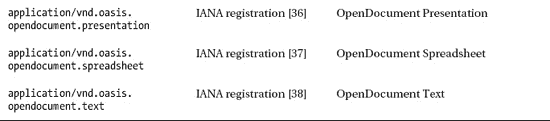

# 四、服务和配置

web 文档的正确外观和处理不能简单地通过应用严格的、无错误的标记来保证。Web 服务器配置对网站的外观、操作和行为有重大影响。文档应该使用正确的媒体类型和字符编码。内容协商可用于向支持相应媒体类型的浏览器提供各种文档版本。XHTML 文档可以作为 HTML 或 XML 提供，但是在处理上有很大的不同。XML 文件由比 SGML 解析器更容易出错的 XML 解析器处理。XHTML 作为 XML 存在着文档根本无法呈现的风险。另一方面，向后兼容的服务不能利用严格 XML 标记的好处。将 HTML 和 XHTML 从服务器发送到呈现引擎有几个方面，所有这些都应该被考虑以实现正确的设置。

在本章中，您将学习如何配置您的网站、浏览器和服务器，以便正确地提供 web 文档。熟悉最重要的 MIME 类型对于正确提供 web 文档及其使用的文件至关重要，例如样式表、图像、音频和视频文件、ZIP 存档和 office 文档。除了互联网媒体类型，您还将学习域名配置；URIs、URL 和 urn 的区别；基本目录的应用；和实践来消除文件扩展名。

### HTTP 头

万维网上数据通信的基础是超文本传输协议(HTTP)。它是一种网络协议，在客户端-服务器计算模型中充当请求-响应协议。在这种模型中，典型的客户端是 web 浏览器，而在网站主机上运行的应用是服务器。在每次查询过程中，客户机向服务器提交一条 HTTP 请求消息。作为回报，服务器向客户机发送一个包含附加数据的响应消息，例如关于请求的完成状态信息，该消息与 web 文档一起从服务器发送到用户代理。这些报头字段构成了 *HTTP 报头*。报头字段确定 HTTP 通信的参数。HTTP 请求用于指示哪些内容类型和字符集是可接受的(`Accept`、`Accept-Charset`)、消息发送的日期和时间(`Date`)、域名(`Host`)、代表用户代理的字符串(`User-Agent`，等等。

正如您在清单 4-1 中看到的，HTTP 响应提供了服务器名称(`Server`)、返回数据的备用位置(`Content-Location`)以及响应过期的日期和时间(`Expires`)。`Vary`字段确认缓存的响应是否可以使用，而不是重复请求。隐私偏好项目平台(P3P)策略可以通过`P3P`字段进行设置。资源的特定版本的标识符由`ETag`提供。这些是最常见的 HTTP 头字段，但还有更多，所有这些都在 RFC 4229 [1]中有描述。

***清单 4-1。** HTTP 报头示例*

`HTTP/1.1 200 OK
Date: Fri, 10 Sep 2010 10:05:08 GMT
Server: Apache/2.2.16 (Unix) PHP/5.3.3
Content-Location: index.html
Vary: negotiate,accept-language,accept-charset
TCN: choice
P3P: policyref=http://example.com/p3p.xml
Cache-Control: max-age=21600
Expires: Fri, 10 Sep 2010 16:05:08 GMT
Last-Modified: Fri, 21 Aug 2009 22:18:49 GMT
ETag: "3668bab8;37e77d1c"
Accept-Ranges: bytes
Content-Length: 11537
Connection: close
Content-Type: text/html; charset=UTF-8
Content-Language: en`

### 互联网媒体类型(MIME)

互联网媒体类型(也称为*哑剧类型*或*内容类型*)决定了浏览器处理网络文件的方式。它们是网站的文件格式标识符。因此，为网站组件和网页设置正确的媒体类型至关重要。

多用途互联网邮件扩展(MIME)规范是由互联网工程任务组在 1992 年提出的(关于 IETF 的更多信息，参见第一章)。大多数规范都以 IETF/ISOC 征求意见稿(RFC)的形式提供。尽管最初的 MIME 概念是为格式化非 ASCII 消息而设计的，但它在 web 浏览器中被用来呈现或处理(X)HTML 之外的文件。IANA 注册对互联网媒体类型进行了标准化(同样，参见第一章了解更多关于 IANA 的信息)[2]。非标准 MIME 类型和子类型可以通过它们的前缀来识别，因为它们都以`x-`开头。特定于供应商的子类型以`vnd.`开头，而个人子类型以`prs.`开头。

媒体类型至少由两部分组成:类型、子类型和可选参数。

XML 数据可以分配给两种 MIME 媒体类型:`application/xml`和`text/xml`。RFC 3023 [3]对它们进行了定义。此外，MIME 类型可以通过后缀`+xml`来识别。从 web 标准化组织的角度来看，最重要的媒体类型是为 XHTML 注册的 XML 媒体类型，即在 RFC 3236 [4]中定义的`application/xhtml+xml`。虽然 XHTML 文档可以使用`application/xhtml+xml`、`application/xml`或`text/xml`媒体类型，但是 W3C 推荐将 XHTML 作为 XML 使用其专用的 MIME 类型`application/xhtml+xml` [5]。然而，如果没有正确的 XML 头，使用这种媒体类型不能保证正确的 XML 处理(更多关于 XML 头的信息，见第三章)。此外，Internet Explorer 6 和更早的 IE 版本不呈现作为`application/xhtml+xml`的文档内容；相反，系统会提示用户下载该文件。

__________

高级版本 S/MIME 也支持消息加密。

 **注意**如果 XHTML 网页的媒体类型设置为`text/html`，它将被解析为 HTML。如果媒体类型设置为`application/xhtml+xml`，浏览器会将文档解析为 XML。这是一个巨大的差异！使用正确 MIME 的 XHTML 文件不能包含一个错误；否则，文档将不会被呈现，XML 解析器将给出一个错误，正如前面在第一章和第三章中提到的。

另一种注册的 XML 媒体类型是`application/atom+xml`，它用于由提议的标准 RFC 4287 [6]定义的 Atom 联合格式(参见第八章)。这种类型的其他常用 XML 媒体类型有`application/rss+xml`(RSS；参见第八章)、`application/mathml+xml`(MathML；参见第三章)，`image/svg+xml`(SVG；参见第三章)，以及`application/xslt+xml`(XSLT；参见第五章。MIME 类型的完整列表发布在 IANA 网站上[7]。

HTTP 头的`Content-Type`字段将数据格式描述为 MIME 媒体类型(清单 4-2 )。此外，该条目还可以提供文档的字符编码(如前面在第二章中所讨论的)。

***清单 4-2。**一个内容类型的例子*

`Content-Type: application/xhtml+xml; charset=UTF-8`

web 页面的 MIME 类型也可以用`meta`元素在文档级设置，如清单 4-3 中的所示。

***清单 4-3。**带有`meta`元素的 MIME 类型声明*

`<meta http-equiv="Content-Type" content="application/xhtml+xml; charset=utf-8" />`

一般来说，MIME 类型`text/html`用于 HTML 文档，`application/xhtml+xml`用于 XHTML 文档。然而，XHTML 文档可以同时支持这两者(我们将在本章后面看到)。

种类繁多的互联网媒体类型并不固定。自定义 MIME 类型也可以在 IANA 注册[8]。

#### 常见媒体类型

下面几节列出了最常见的媒体类型。请注意，这绝不是一个完整的列表。

##### 特定应用的媒体类型

表 4-1 总结了最常见的特定于应用的 MIME 类型。

__________

2 不能在 IE8 或更早版本中使用

##### 特定于供应商的媒体类型

表 4-2 总结了最常见的特定于供应商的 MIME 类型。

在不久的将来，与广泛使用的文件格式相关联的非标准化 MIME 类型很可能会被注册。`application/x-dvi`代表与设备无关的文档。LaTeX 文件的 MIME 类型`application/x-latex`也还没有标准化。Adobe Flash 文件可能会有已经广泛使用的媒体类型，`application/x-shockwave-flash`。可能与`application/x-rar-compressed` MIME 类型相关联的 RAR 存档文件也仍然没有标准化。

##### 音频媒体类型

表 4-3 总结了最常见的音频 MIME 类型。

##### 图像媒体类型

表 4-4 总结了最常见的图像 MIME 类型。

##### 多部分对象媒体类型

表 4-5 总结了最常见的多部分对象介质类型。

##### 文字媒体类型

表 4-6 总结了最常见的文本媒体类型。

##### 视频媒体类型

表 4-7 总结了最常见的视频媒体类型。

### 上菜 XHTML

提供 XHTML 有两种方法，这两种方法各有优缺点。下面几节将对它们进行描述。

#### 将 XHTML 作为 HTML

在网络的早期，HTML 是唯一的标记语言。几年后，新的创新出现了，这些创新是 HTML 所不能覆盖的。XML 规则被加入其中，创造了 XHTML，一种新的标记语言。这些规则也是将 HTML 文档转换成 XHTML 时应该应用的规则，正如前面在第三章中讨论的。

但是，HTML 4.01 的词汇或多或少被保留了下来；因此，它类似于 XHTML 1.0。因此，XHTML 文档可以作为 HTML 提供给呈现引擎。这种方法提供了向后兼容性。媒体类型可以用来请求浏览器将 XHTML 作为 HTML 而不是 XML 来处理。如果一个 XHTML 文档的媒体类型被定义为`text/html`，那么渲染引擎会像解析 HTML 一样解析网页。如果给定媒体类型为`application/xhtml+xml`，浏览器将把文档作为 XML 处理。

默认情况下，一些服务器和服务器端脚本平台(PHP、ASP 等)将`text/html`媒体类型应用于 web 内容。XHTML 的“肮脏秘密”是几个带有 XML 解析器的浏览器将文档视为带有 XHTML 语法的`text/html`，将`DOCTYPE`视为 HTML。 3 但是向后兼容是有代价的:XML 令人印象深刻的特性根本无法在以这种方式服务的 XHTML 中使用。如果文档不能充分发挥其潜力，那么应用严格的规则又有什么意义呢？在向后兼容性不是主要问题的地方，解决方案是将 XHTML 作为 XML。

#### 将 XHTML 作为 XML

在编程语言等许多环境中，错误是完全不被接受的。代码可靠性强烈依赖于标记结构和正确性。浏览器拒绝呈现无效 XHTML 标记的行为可能看起来很烦人；然而，浏览器有一个很好的理由这样做。充满错误的 HTML 文档通过猜测开发人员的意图来处理。浏览器不能每次都成功完成这项任务，也不能保证结果。此外，渲染引擎的误差容限提供了各种结果。

有些情况下错误是不可容忍的。例如，在科学出版中，数学方程式的表达应该是可靠的。如果这样的文档发布在 Web 上，并且在 XHTML 中嵌入了 MathML，那么错误是不可容忍的，因为后果可能会花费数百万甚至是致命的。这是 XML 解析器对错误极度敏感的主要原因。

作为一个 XML 语言家族，XHTML 本来是作为 XML 来使用的。这种方法享有 XML 的所有好处。然而，这也涉及到严重的风险。Web 文档作为`application/xhtml+xml`请求浏览器根据 XML 的规则处理它们。因为无效的 XHTML 标记根本不会在 web 浏览器中呈现，所以在将 XHTML 作为 XML 提供时应该格外小心。源代码中错误位置的一个简单字符会导致 XML 解析错误消息，而不是网页内容(正如第一章中已经暗示的)。大概这也是 HTML 一直被大部分内容作者和开发者所偏爱的原因之一。然而，真正的 web 标准化人员不应该害怕编写纯 XHTML 代码。如果您学会了如何使用前一章中描述的实践，您不仅能够创建无错误的 XHTML 文档，还能够创建任何类型的结构化标记。

__________

真正的 XML 解析器，比如 Firefox 或 Safari，考虑的是文档的 MIME 类型(由服务器发送),而不仅仅是文件语法和文档类型。

尽管现代浏览器支持 MIME 类型，但一些老的浏览器不支持。保持与旧浏览器的向后兼容性并支持现代浏览器的高级 XML 应用的一个选择是称为*内容协商*的技术。可以通过`.htaccess` 4 设置或者使用服务器端脚本语言来完成。

HTTP 规范定义了为同一资源的不同版本服务的机制[60]。文档类型、文档语言和图像类型就是一些例子[61]。首选的和可接受的文档格式——在我们的例子中，是 HTML 和 XHTML 文件之间的首选——可以在 HTTP 头中定义，如清单 4-4 所示。

***清单 4-4。**HTTP 报头中的内容协商*

`Accept: text/html, application/xhtml+xml, application/xml; q=0.9, */*; q=0.8`

使用前面的例子，浏览器可以指定 HTML 和 XHTML 优先于 XML。“相对质量参数”(`q`)及其值(`qvalue`)被认为如下。所有没有指定偏好值的项目都获得默认值`1`(在本例中为`text/html`和`application/xhtml+xml`)。`application/xml`的指定值为`0.9`，所有其他格式为`0.8`。按降序排序的优先级值揭示了实际的优先级，换句话说，`1`表示`text/html`和`application/xhtml+xml`，而`0.9`表示`application/xml`，而`0.8`表示任何其他内容类型。

在 Apache 服务器上，应该将清单 4-5 中所示的指令添加到您的`.htaccess`(或`httpd.conf`)文件中，以设置正确 MIME 类型所需的 HTTP 头。

***清单 4-5。**在`text/html`和`application/xhtml+xml`和*之间的偏好

`Options +Multiviews
AddType application/xhtml+xml;qs=0.8
AddType text/html;qs=0.9`

“源的质量”参数(qs)，在我们的例子中设置为`0.8`，决定了`AddType`指令是否应用指定的 MIME 类型。由于`application/xhtml+xml`的`qs`值小于`text/html`，`application/xhtml+xml`将只被兼容的浏览器使用；否则，首选版本将是 MIME 类型`text/html`。

内容协商也可以用服务器端脚本语言实现。清单 4-6 、 4-7 和 4-8 总结了最常见的实现。

***清单 4-6。**PHP 中的内容协商*

`$accept = $_SERVER["HTTP_ACCEPT"];
$ua = $_SERVER["HTTP_USER_AGENT"];
if (isset($accept) && isset($ua)) {
  if (stristr($accept, "application/xhtml+xml") || stristr($ua, "W3C_Validator")) {
    header("Content-Type: application/xhtml+xml");
  }
}`

__________

4web 服务器上的通用配置文件(注意是以句点开头，没有扩展名)。

***清单 4-7。**ASP 中的内容协商*

`Dim strAccept, strUA
strAccept = Request.ServerVariables("HTTP_ACCEPT").Item
strUA = Request.ServerVariables("HTTP_USER_AGENT").Item
If InStr(1, strAccept, "application/xhtml+xml") > 0 Or InStr(1, strUA, "W3C_Validator") > 0
  Then Response.ContentType = "application/xhtml+xml"
End If`

***清单 4-8。**ASP 中 C#的内容协商。网*

`string accept = Request.ServerVariables["HTTP_ACCEPT"];
string ua = Request.ServerVariables["HTTP_USER_AGENT"];
if (accept != null && ua != null) {
  if (accept.IndexOf("application/xhtml+xml") >=0 || ua.IndexOf("W3C_Validator") >= 0) {
    Response.ContentType = "application/xhtml+xml";
  }
}`

前面的代码使用自己的语法执行内容协商。例如，在 PHP 中，`$_SERVER`数组中包含的服务器变量用于评估用户代理的 HTTP Accept 头，并通过`header`函数设置适当的 MIME 类型(清单 4-6 )。

### URIs、URL 和 urn

一个*统一资源标识符* ( *URI* )是一个在互联网上标识一个名称或一个资源的字符串(RFC 2396 [62])。URIs 可以归类为*统一资源定位符*(*URL*；RFC 1738 [63])、*统一资源名称* ( *URNs* )或两者。URN 定义了资源的身份，而 URL 提供了查找资源的方法(包括协议和路径)。URIs 经常被错误地用作 URL 的同义词，尽管 URI 是一个更广泛的术语(RFC 3305 [64])。URN 和 URL 都是 URI 的子集，但它们通常是不相交的集合。

URL 最著名的例子是万维网上的网站地址。清单 4-9 显示了通用的 URL 语法。

***清单 4-9。**网址语法*

`protocol://domain:port/path?query_string#fragment_identifier`

*协议* ( *方案名*)后面跟一个冒号。URL 的其他部分取决于所使用的方案。通常有一个域名或 IP 地址，一个可选的端口号，以及一个可选的资源或脚本路径。PHP 或 CGI 脚本之类的程序可能有一个查询字符串。URL 的结尾可以是可选的片段标识符。

因为这些部分中有许多是可选的，所以省略了其中的一个或多个部分。清单 4-10 显示了一个例子，其中`http`是协议，`[www.masteringhtml5css3.com](http://www.masteringhtml5css3.com)`是域，路径指向`shop`目录。

***清单 4-10。**一个典型的网址*

`http://www.masteringhtml5css3.com/shop/`

URI 引用在标记语言中被广泛使用，例如，作为 HTML 中`a`元素的`href`属性的属性值，或者作为 XML DTD 中`SYSTEM`关键字之后的系统标识符。

#### 执着的 URIs

所有网络用户都知道，当浏览器地址栏中输入的网站地址无法检索时，会是什么样子。当用户单击网页的超链接时，也会发生同样的情况。

URIs 失去联系有很多原因。最简单的原因是文件已被移动到另一个文件夹或已从服务器上删除。另一个原因是服务器上应用的技术已经改变。例如，一家公司过去应用 CGI 脚本，但最近改用 Perl。在这种情况下，位于`cgi-bin`目录中的文件的 URIs 已经过时。

只有在少数情况下，停止维护 URIs 是可以接受的，例如公司或组织已经关闭。然而，应该消除无原因的变化。

设计不良的 URIs 是网页上大量死链接的罪魁祸首。将 URIs 设计成在未来几十年都可以使用是一项相当复杂的任务。

##### 设计 URIs

可以通过最小化其中提供的信息来持久地设计 URIs[65]。更新文档的作者可能不同于原始文档的作者，因此作者不应包括在内。主题也应该被删除，因为它变化非常快。例如，一个网络技术博客应该使用目录名`markup`，而不是当前最新技术的确切名称(`XHTML11`、`HTML5`)。表示文档状态的目录名，如`draft`或`latest`不应该在 URIs 使用，因为文档状态会随着时间而改变。每个文档的最新版本都需要一个持久的 URI。

网站的某些部分可能只对成员开放。还应取消 URIs 的查阅，因为文件可能会从私人部门转移到公共部门，反之亦然。

在 URIs 最常提供的无用信息是文件扩展名。目前被认为是最先进的技术和工具可能会在不久的将来发生变化，或者开发人员可能会改变应用的技术。更改 URIs 不仅会影响网页或网页组件的可查找性，还会影响您的维护任务。精心选择的目录名是合乎逻辑的，很少应该在标记的引用中更改。

 **提示**使用名称`script`或`scripts`作为您存储网站脚本文件的目录，而不要使用`php`或`javascript`，因为如果您以后采用进一步的脚本语言，网站文件中的 URIs 将反映一种特定的语言，而不是一个通用的名称。同样，目录名`style`或`styles`比`css`或`xsl`更实用，名字`news`或`feed`比`rss`或`atom`更吉利。名字`images`比`jpg`好听，一个`doc`或者`docs`目录可以容纳从 PDF 到 Word 文档的多种文档，而不仅仅是某一种类型。

表示软件机制的目录名，如`cgi-bin`，也应该从 URIs 中删除。他们可能会改变。主题名称、公司部分、访问级别或安全级别也不适合 URIs。分类可以改变。创建日期是固定的，因此可以提供。请记住，通过代理和重定向，多个 web 服务器可以隐藏在一个明显的服务器中。

除了为用户和机器提供描述性的名称，URIs 应该简单、稳定和易于管理。正确设计的 URIs 是语义网的基础部分[66]。

##### 域名

Web 资源可以通过唯一的 IP 地址来定位。然而，它们很难被记住。因此，在大多数情况下，*域名被用来代替*。图 4-1 显示了域名和 URL 的关系；`[www.example.com](http://www.example.com)`是节点`example.com`的子域，节点`example.com`是`com`域的子域。域名语法规则由 RFC 1035 [67]、RFC 1123 [68]和 RFC 2181 [69]定义。

***图 4-1。**网址内的域名*

子域树最多可以包含 127 级。每个标签最多可包含 63 个字符。根据 RFC 2181，域名的全长是 253 个字符。

传统的域名不能包含基于拉丁字母的带有音调符号的字符、非拉丁字符或文字。随着国际化域名(IDN)的引入，可以用本地字母和文字表示多种语言的名称和单词。

域名在注册之前应该仔细考虑。它们应该容易记忆和拼写[70]。还有 SEO 方面的考虑。虽然一个人的名字多年来通常保持不变，但一个产品或技术的名字可能会改变。例如，随着高清时代的开始，一家 DVD 商店的老板可能已经从销售 DVD 转向销售蓝光。但是包含 *DVD* 字样的域名还是代表老技术。如果使用了*电影*或*电影*这个词，这个域名就不会过时。找到一个合适的域名，仍然是免费的，并包含流行的关键字，可以是一个真正的挑战。

##### 没有 WWW

虽然`www.`子域名在网络上很常见，但一些网站管理员认为它已经过时或不合适[71]。类似于不使用`request@mail.example.com`格式的邮件服务器，web 服务器可以允许通过主域访问网页。

在 Apache 服务器上，通过将清单 4-11 中的代码添加到`.htaccess`文件中，可以将`www.`从域内的 URIs 中移除。它的名字代表超文本访问。该文件提供目录级的访问控制，可用于授权、认证、重定向、阻塞、定制错误响应和缓存控制。

***清单 4-11。**用`.htaccess`配置*从 URIs 移除`www.`

`RewriteEngine On
RewriteCond %{HTTP_HOST} ^www\.example\.com$ [NC]
RewriteRule ^(.*)$ http://example.com/$1 [R=301,L]`

这段代码使得没有必要从网站的每个超链接中逐个删除`www.`。然而，很大一部分网站管理员不同意将`www.`从 URIs 移除。根据他们的推理，`www.`是一个提醒，万维网(WWW)只是互联网上众多服务之一。

 **提示**之前的代码实际上并不需要，因为域名注册价格中通常包含无限数量的子域名。一种常见的做法是，域所有者将主域和`www`子域指向 web 服务器的同一个目录。换句话说，`[www.domain.com](http://www.domain.com)`是首选的 URI，检索`domain.com`的用户被重定向到`[www.domain.com](http://www.domain.com)`。这样，无论有没有`www`，用户都可以访问相同的内容。

##### Base href

前面几节讨论了绝对 URL。由于许多网页组件位于与域相关联的根目录的子目录中，因此也可以使用相对 URL。然而，它们更短，并且不总是方便的。例如，如果层次太深，并且样式表位于一个网页上面三个目录的`styles`目录中，那么路径就会变得相当长(清单 4-12 )。

***清单 4-12。**复杂网站中的漫漫长路*

`<link rel="stylesheet" type="text/css" href="**../../../styles/main.css**" />`

如果所有的位置都是根据根目录声明的话，情况会有所不同(清单 4-13 )。

***清单 4-13。**为网站设置基本目录*

`<base href=**"**http://example.com/**"** />`

指定的 URL 用作文档中所有相对 URL 的基础。通过将`base`元素添加到文档头，可以简化最初的例子(清单 4-14 )。

***清单 4-14。**根据基目录的短路径*

`<link rel="stylesheet" type="text/css" href="**styles/main.css**" />`

##### 消除文件扩展名

创建永久 URIs 的关键技术之一是删除文件扩展名。在 Apache 等基于文件的 web 服务器上，可以通过*内容协商*【73】来完成。我们在本章前面使用了内容协商来设置 MIME 类型之间的优先级；现在我们将使用它来创建文件类型的优先顺序。因此，文件扩展名可以保留在文件中，但可以安全地从链接中删除[74]。

使用类型映射文件，Apache 服务器可以检查目录中具有给定名称和任何扩展名的所有文件，并选择适当的文件(优先级最高的文件)。类型映射文件优先于文件扩展名(即使启用了隐式文件名模式匹配的特殊搜索，*多视图*)。高质量图像文件变体的优先级可通过`qs`参数设置。在清单 4-15 中，文件`logo.svg`将被用于引用没有扩展名的文件的所有 URIs。如果目录中没有该文件的 SVG 版本，将使用 PNG 版本。

***清单 4-15。**由`qs`参数*设置的文件类型的优先顺序

`URI: logo

URI: logo.svg
Content-type: image/svg+xml; qs=0.8

URI: logo.png
Content-type: image/jpeg; qs=0.5`

`qs`值从`0.000`到`1.000`不等。永远不会选择`qs`值为`0.000`的变体。不同变体的条目由不能在条目内使用的空行分隔。

对于拥有成百上千个文件的大型站点来说，显式设置特定文件变量的路径是不可行的。Apache 服务器上内容协商的第二个选项是使用 MultiViews 搜索特性，服务器在目录中执行隐式文件名模式匹配，并从结果中进行选择。MultiViews 是消除文件扩展名的一个很好的选择，它有助于容易维护(如果将使用新的文件版本)和优化标记(因为链接更短)。多视图可以在服务器配置或`.htaccess`文件中启用(清单 4-16 )。

***清单 4-16。**多视图启用*

`<Directory /home/www/example/htdocs>
Options + MultiViews
</Directory>`

现在，当服务器接收到对不存在 img/logo`img/logo`的请求时，服务器在`images`目录中搜索所有名为`logo.*`的文件，根据每个文件的扩展名分配 MIME 类型。然后，服务器根据偏好选择最佳匹配，并交付该资源。例如，让我们假设`images`目录包含以下文件变量:`logo.svg`、`logo.png`和`logo.gif`。当有一个针 img/logo`的查询时，优先顺序将被考虑在对该查询的回答中(清单 4-17 )。

***清单 4-17。**图像文件格式的优先顺序*

`Accept: image/svg+xml; q=.8, image/png; q=.5, image/gif;q=0.2, */*;q=0.1`

启用多视图时，服务器将搜索引用的目录，并以最高质量(由于最高优先级)交付图像，换句话说，`logo.svg`。这是在中实现的，这种方式使得 HTML/XHTML 文件中的 URIs 不需要包含文件扩展名，这使得维护更容易并且减小了文件大小。URIs 现在可以忽略资源背后的技术。由于`example.cimg/logo.svg`变成了`example.cimg/logo`，整个场地使用的 logo 嵌入也从``变成了``。

虽然以`.html`或`.php`结尾的 URI 在不久的将来可能会保持不变，但即使是广泛使用的文件类型在几年内也可能会很快过时或不太常用。Flash 动画(`.swf`)可能会被更改为 HTML5 标记(`.html`)，PNG 图像(`.png`)可能会被更改为 SVG 版本(`.svg`)，等等。因此，所有当前创建的网站内部链接以及其他网站上的外部链接都将无效。

万维网联盟已经掌握了消除链接中的扩展名。即使网站的图像在链接中也没有扩展名(文件有扩展名)，因此如果图像将被改变，例如从`logo.png`到`logo.svg`，那么在数百个 web 文档中指向该文件的链接不应该被修改。

带有扩展名的引用仍然可用；然而，它们不允许服务器选择当前可用的和未来的格式中的最佳者。另一方面，通过*类型地图*声明或启用*多视图搜索*【75】，多年来使用的光栅图像可以立即更新为新的 SVG 版本。不带扩展名的文件名为*内容类型通用*，带扩展名的文件名为*内容类型专用*。

有一个所有 web 服务器都支持的特殊文件，叫做`index.html`。当用户没有在地址栏中指定文件时，浏览器默认打开该文件(通过内容协商，扩展名不仅可以是`.html`，还可以是`.php`、`.jsp`、`.aspx`等等)。这就是为什么不需要在域名末尾输入文件名和扩展名如`[www.example.com/index.html](http://www.example.com/index.html)`就可以打开网站的原因。这种服务器行为也可用于创建对站点内网页的永久访问。不是将`about.html`、`services.html`、`portfolio.html`和`contact.html`文件添加到域的根目录，而是将它们作为 index.html 文件提供在它们自己的子目录中。因此，网站的页面可以作为`[www.example.com/about/](http://www.example.com/about/)`、`[www.example.com/services/](http://www.example.com/services/)`等访问，而没有文件扩展名。当然，如果在服务器上设置了每个目录的默认文件，也可以保留原始文件名。但是，在这种情况下，如果网站的宿主提供商发生变化，也应该迁移服务器设置。

##### 命名空间 URIs

命名空间 URIs 用于唯一标识 XML 应用，并将其与其他 XML 语言区分开。当您希望将元素或属性与特定的 XML 名称空间相关联时，与名称空间 URI 相关联的前缀非常方便。虽然名称空间 URI 不一定指向特定的文档，但是很多都指向，比如 XHTML 1 使用的`[`www.w3.org/1999/xhtml`](http://www.w3.org/1999/xhtml)`名称空间。 *x* /5(之前在第三章中讨论过)。前面的名称空间 URI 将让 XML 解析器知道文档中使用的元素和属性来自 XHTML 词汇表。

 **注意**命名空间 URIs 可能揭示了相应的规范或标准，但许多只是占位符。

即使它们通常被设计成稳定的，名称空间也可能随着时间的推移而演变。为了消除这个问题，名称空间通常在`purl.org`【77】注册为*持久统一资源定位符*。如果它们指向的资源发生变化，可以在`purl.org`上的配置文件设置中修改 URI，这将为最新的 URI 提供永久地址。

XML 名称空间应该由相应的 W3C 推荐标准[78]控制。

### 总结

在本章中，您学习了 HTTP 头的一般结构，它提供了服务器发送的 web 文档的信息。到目前为止，您已经知道了最常见的 MIME 类型及其声明，这可以用来确保浏览器能够正确处理您的 web 站点组件。您还知道如何在服务器上使用内容协商来消除文件扩展名，这使得将来的维护更加容易。此外，您还学习了如何正确地服务 XHTML，这非常重要，因为用作`application/xhtml+xml`的 XHTML 文档将由 XML 解析器解析，而不是由对错误不太敏感的 HTML 解析器解析。你知道如何设计 URIs 来最大化他们的持久性。

到目前为止，您已经准备好创建符合标准的标记，并使用适当的设置来提供网站文件。在下一章中，你将学习使用层叠样式表(CSS)将网站内容从其表现中分离出来的技术。

### 参考文献

1.  诺丁汉 M，Mogul J (2005) HTTP 标题字段注册。RFC 4229。互联网协会。[`tools.ietf.org/html/rfc4229`](http://tools.ietf.org/html/rfc4229)。于 2011 年 8 月 15 日访问
2.  IANA (2007)哑剧媒体类型。互联网号码分配机构。[www.iana.org/assignments/media-types/](http://www.iana.org/assignments/media-types/)。2011 年 1 月 1 日访问
3.  Murata M，Laurent S，Kohn D (2001) XML 媒体类型。互联网协会。[`tools.ietf.org/html/rfc3023`](http://tools.ietf.org/html/rfc3023)。2010 年 10 月 8 日访问
4.  Baker M，Stark P (2002)“应用/xhtml+xml”媒体类型。互联网协会。[`tools.ietf.org/html/rfc3236`](http://tools.ietf.org/html/rfc3236)。2010 年 10 月 8 日访问
5.  Masayasu I (2002) XHTML 媒体类型。W3C 注释。万维网联盟。[www.w3.org/TR/2002/NOTE-xhtml-media-types-20020801/](http://www.w3.org/TR/2002/NOTE-xhtml-media-types-20020801/)。2010 年 10 月 8 日访问
6.  Nottingham M，say re R(eds)(2005)Atom 联合格式。互联网协会。[`tools.ietf.org/html/rfc4287`](http://tools.ietf.org/html/rfc4287)。2010 年 10 月 8 日访问
7.  IANA (2007)哑剧媒体类型。互联网号码分配机构。[www.iana.org/assignments/media-types/](http://www.iana.org/assignments/media-types/)。2010 年 10 月 8 日访问
8.  IANA (2002)申请媒体类型。互联网号码分配机构。[www.iana.org/cgi-bin/mediatypes.pl](http://www.iana.org/cgi-bin/mediatypes.pl)。2011 年 1 月 1 日访问
9.  Nottingham M，say re R(eds)(2005)Atom 联合格式。提议的标准。互联网协会。[`tools.ietf.org/html/rfc4287`](http://tools.ietf.org/html/rfc4287)。2010 年 11 月 22 日访问
10.  Gregorio J，de Hora B (eds) (2007)原子出版协议。提议的标准。互联网协会。[`tools.ietf.org/html/rfc5023`](http://tools.ietf.org/html/rfc5023)。2010 年 11 月 22 日访问
11.  Hoehrmann B (2006)脚本媒体类型。互联网协会。[`tools.ietf.org/html/rfc4329`](http://tools.ietf.org/html/rfc4329)。2011 年 1 月 1 日访问
12.  crock Ford D(2006)JavaScript 对象符号(json)的应用/json 媒体类型。RFC 4627。互联网协会。[`tools.ietf.org/html/rfc4627`](http://tools.ietf.org/html/rfc4627)。2011 年 1 月 1 日访问
13.  Carlisle D，Ion P，Miner R(eds)(2010)MathML 实例的媒体类型选择。数学标记语言(MathML)3.0 版。W3C 推荐。万维网联盟。[www.w3.org/TR/MathML3/appendixb.html](http://www.w3.org/TR/MathML3/appendixb.html)2011 年 1 月 2 日访问
14.  自由 N，博伦斯坦 N (1996)八位流亚型。在:多用途互联网邮件扩展(MIME)第二部分:媒体类型。RFC 2046。互联网协会。[`tools.ietf.org/html/rfc2046`](http://tools.ietf.org/html/rfc2046)。2011 年 1 月 1 日访问
15.  冈萨尔维斯 I，菲佛 S，蒙哥马利 C (2008)奥格媒体类型。RFC 5334。互联网协会。[`tools.ietf.org/html/rfc5334`](http://tools.ietf.org/html/rfc5334)。2011 年 1 月 1 日访问
16.  Taft E，Pravetz J，Zilles，Masinter L (2004)应用/pdf 媒体类型。RFC 3778。互联网协会。[`tools.ietf.org/html/rfc3778`](http://tools.ietf.org/html/rfc3778)。2011 年 1 月 1 日访问
17.  多用途因特网邮件扩展(MIME)第一部分:因特网消息体的格式。RFC 2045。互联网工程任务组。[`tools.ietf.org/html/rfc2045`](http://tools.ietf.org/html/rfc2045)。2011 年 2 月 18 日访问
18.  自由 N，博伦斯坦 N ( 1996) PostScript 亚型。在:多用途互联网邮件扩展(MIME)第二部分:媒体类型。RFC 2046。互联网协会。[`tools.ietf.org/html/rfc2046`](http://tools.ietf.org/html/rfc2046)。2011 年 1 月 1 日访问
19.  Swartz A (2004)应用/rdf+xml 媒体类型注册。RFC 3870。互联网协会。[www.ietf.org/rfc/rfc3870.txt](http://www.ietf.org/rfc/rfc3870.txt)。2011 年 1 月 2 日访问
20.  IANA(2007)MIME 类型应用/rtf 的注册。互联网号码分配机构。[www.iana.org/assignments/media-types/application/rtf](http://www.iana.org/assignments/media-types/application/rtf)。2011 年 1 月 3 日访问
21.  莱文森 E (1995) SGML 媒体类型。互联网号码分配机构。[www.rfc-editor.org/rfc/rfc1874.txt](http://www.rfc-editor.org/rfc/rfc1874.txt)。2011 年 1 月 3 日访问
22.  Hoschka P (2006)应用/smil 和应用/smil+xml 媒体类型。RFC 4536。互联网协会。[www.ietf.org/rfc/rfc4536.txt](http://www.ietf.org/rfc/rfc4536.txt)。2011 年 1 月 3 日访问
23.  Baker M，Nottingham M (2004)“应用/soap+xml”媒体类型。RFC 3902。互联网协会。[`tools.ietf.org/html/rfc3902`](http://tools.ietf.org/html/rfc3902)。2011 年 1 月 1 日访问
24.  Prud'hommeaux E，Seaborne A (2007)互联网媒体类型、文件扩展名和 Macintosh 文件类型。in:RDF 的 SPARQL 查询语言。万维网联盟。[www.w3.org/TR/2007/CR-rdf-sparql-query-20070614/#mediaType](http://wwww.w3.org/TR/2007/CR-rdf-sparql-query-20070614/#mediaType)。2011 年 1 月 3 日访问
25.  Beckett D，Broekstra J (eds) (2007)互联网媒体类型、文件扩展名和 Macintosh 文件类型。In: SPARQL 查询结果 XML 格式。万维网联盟。[www.w3.org/TR/2007/CR-rdf-sparql-XMLres-20070925/#mime](http://www.w3.org/TR/2007/CR-rdf-sparql-XMLres-20070925/#mime)。2011 年 1 月 3 日访问
26.  Baker M，Stark P (2002)“应用/xhtml+xml”媒体类型。RFC 3236。互联网协会。[`tools.ietf.org/html/rfc3236`](http://tools.ietf.org/html/rfc3236)。2011 年 1 月 1 日访问
27.  Murata M，St.Laurent S，Kohn D (2001) XML 媒体类型。RFC 3023。互联网协会。[`tools.ietf.org/html/rfc3023`](http://tools.ietf.org/html/rfc3023)。2011 年 1 月 1 日访问
28.  凯 M(编辑)(2007)XSLT 媒体类型。在:XSL 转换(XSLT)版本 2.0 中。W3C 推荐。万维网联盟。[www . w3 . org/TR/2007/REC-XSLT 20-2007 01 23/# media-type-registration](http://www.w3.org/TR/2007/REC-xslt20-20070123/#media-type-registration)。2011 年 1 月 3 日访问
29.  保罗·林德纳(编辑)(1993)注册新的 MIME 内容类型/子类型应用/zip。互联网号码分配机构。[www.iana.org/assignments/media-types/application/zip](http://www.iana.org/assignments/media-types/application/zip)。2011 年 1 月 1 日访问
30.  ashbridge M(2006)MIME 类型应用的注册/vnd.google-earth.kml+xml。互联网号码分配机构。[www . iana . org/assignments/media-types/application/vnd . Google-earth . KML+XML](http://www.iana.org/assignments/media-types/application/vnd.google-earth.kml+xml)。2011 年 1 月 3 日访问
31.  ashbridge M(2006)MIME 类型应用的注册/vnd.google-earth.kmz。互联网数字地址分配机构。[www . iana . org/assignments/media-types/application/vnd . Google-earth . kmz](http://www.iana.org/assignments/media-types/application/vnd.google-earth.kmz)。2011 年 1 月 3 日访问
32.  林德纳 P (1993)注册的媒体类型申请/msword。互联网号码分配机构。[www.iana.org/assignments/media-types/application/msword](http://www.iana.org/assignments/media-types/application/msword)2011 年 1 月 2 日访问
33.  gill SS(1996)MIME 类型应用的注册/vnd.ms-excel。互联网号码分配机构。[www . iana . org/assignments/media-types/application/vnd . ms-excel](http://www.iana.org/assignments/media-types/application/vnd.ms-excel)。2011 年 1 月 3 日访问
34.  gill SS(1996)MIME 类型应用的注册/vnd.ms-powerpoint。互联网号码分配机构。[www . iana . org/assignments/media-types/application/vnd . ms-PowerPoint](http://www.iana.org/assignments/media-types/application/vnd.ms-powerpoint)。2011 年 1 月 3 日访问
35.  舒伯特 S (2009)应用/vnd . oasis . open document . graphics MIME 类型。互联网号码分配机构。[www . iana . org/assignments/media-types/application/vnd . oasis . open document . graphics](http://www.iana.org/assignments/media-types/application/vnd.oasis.opendocument.graphics)。2011 年 1 月 2 日访问
36.  舒伯特 S (2009)应用/vnd . oasis . open document . presentation MIME 类型。互联网号码分配机构。[www . iana . org/assignments/media-types/application/vnd . oasis . open document . presentation](http://www.iana.org/assignments/media-types/application/vnd.oasis.opendocument.presentation)。2011 年 1 月 2 日访问
37.  37.舒伯特 S (2009)应用/vnd . oasis . open document . spread sheet MIME 类型。互联网号码分配机构。[www . iana . org/assignments/media-types/application/vnd . oasis . open document . spread sheet](http://www.iana.org/assignments/media-types/application/vnd.oasis.opendocument.spreadsheet)。2011 年 1 月 2 日访问
38.  舒伯特 S (2009)应用/vnd . oasis . open document . text MIME 类型。互联网号码分配机构。[www . iana . org/assignments/media-types/application/vnd . oasis . open document . text](http://www.iana.org/assignments/media-types/application/vnd.oasis.opendocument.text)。2011 年 1 月 2 日访问
39.  尼尔森 M (2000)音频/mpeg 媒体类型。RFC 3003。互联网协会。[`tools.ietf.org/html/rfc3003`](http://tools.ietf.org/html/rfc3003)。2011 年 1 月 1 日访问
40.  barbato L(2008)Vorbis 编码音频的 RTP 有效载荷格式。RFC 5215。互联网协会。[`tools.ietf.org/html/rfc5215`](http://tools.ietf.org/html/rfc5215)。2011 年 1 月 1 日访问
41.  Windows Media Services 的 Microsoft Support (2003) MIME 类型设置。KB 288102。微软公司。[`support.microsoft.com/kb/288102`](http://support.microsoft.com/kb/288102)。2011 年 1 月 2 日访问
42.  弗莱舍曼 E (1998)波和 AVI 编解码器注册。RFC 2361。互联网协会。[`tools.ietf.org/html/rfc2361`](http://tools.ietf.org/html/rfc2361)。2011 年 1 月 1 日访问
43.  Boutell T 等人(1997) PNG(便携式网络图形)规范版本 1.0。RFC 2083。互联网工程任务组。[`tools.ietf.org/html/rfc2083`](http://tools.ietf.org/html/rfc2083)。2011 年 1 月 1 日访问
44.  Randers-Pehrson G (2009)媒体类型图像/png 的注册。互联网号码分配机构。[www.iana.org/assignments/media-types/image/png](http://www.iana.org/assignments/media-types/image/png)。2011 年 1 月 2 日访问
45.  Andersson O 等人(2008)图像/svg+xml 的媒体类型注册。In:可缩放矢量图形(SVG) Tiny 1.2 规范。W3C 推荐。[www.w3.org/TR/SVGTiny12/mimereg.html](http://www.w3.org/TR/SVGTiny12/mimereg.html)。2011 年 1 月 2 日访问
46.  Parsons G，Rafferty J (2002)标记图像文件格式(TIFF)-图像/tiff MIME 子类型注册。RFC 3302。互联网协会。[`tools.ietf.org/html/rfc3302`](http://tools.ietf.org/html/rfc3302)。2011 年 1 月 1 日访问
47.  Butcher S (ed) (2003)供应商树- vnd.microsoft.icon .互联网数字地址分配机构。[www . iana . org/assignments/media-types/image/vnd . Microsoft . icon](http://www.iana.org/assignments/media-types/image/vnd.microsoft.icon)。2011 年 1 月 2 日访问
48.  Levinson E(1998)MIME 多部分/相关内容类型。RFC 2387。互联网协会。[`tools.ietf.org/html/rfc2387`](http://tools.ietf.org/html/rfc2387)。2011 年 1 月 2 日访问
49.  Masinter L (1998)从表单返回值:多部分/表单数据。RFC 2388。互联网协会。[`tools.ietf.org/html/rfc2388`](http://tools.ietf.org/html/rfc2388)。2011 年 2 月 18 日访问
50.  Galvin J，Murphy S，Crocker S，Freed N(1995)MIME 的安全多部分:多部分/签名和多部分/加密。RFC 1847。互联网工程任务组。[`tools.ietf.org/html/rfc1847`](http://tools.ietf.org/html/rfc1847)。2011 年 1 月 2 日访问
51.  Lie H，Bos B，Lilley C (1998)文本/css 媒体类型。RFC 2318。互联网协会。[`tools.ietf.org/html/rfc2318`](http://tools.ietf.org/html/rfc2318)。2011 年 1 月 2 日访问
52.  Shafranovich Y (2005)逗号分隔值(CSV)文件的通用格式和 MIME 类型。RFC 4180。互联网协会。[`tools.ietf.org/html/rfc4180`](http://tools.ietf.org/html/rfc4180)2011 年 1 月 2 日访问
53.  “文本/html”媒体类型。RFC 2854。互联网协会。[`tools.ietf.org/html/rfc2854`](http://tools.ietf.org/html/rfc2854)。2011 年 1 月 2 日访问
54.  Hoehrmann B (2006)脚本媒体类型。RFC 4329。互联网协会。[`tools.ietf.org/html/rfc4329`](http://tools.ietf.org/html/rfc4329)。2011 年 1 月 2 日访问
55.  Gellens R (2004)文本/普通格式和 DelSp 参数。互联网协会。[`tools.ietf.org/html/rfc3676`](http://tools.ietf.org/html/rfc3676)。2011 年 1 月 2 日访问
56.  Lim Y，Singer D(2006)MPEG-4 的 MIME 类型注册。RFC 4337。[`tools.ietf.org/html/rfc4337`](http://tools.ietf.org/html/rfc4337)。2011 年 1 月 2 日访问
57.  冈萨尔维斯 I，菲佛 S，蒙哥马利 C (2008)奥格媒体类型。RFC 5334。互联网工程任务组。[`tools.ietf.org/html/rfc5334`](http://tools.ietf.org/html/rfc5334)。2011 年 1 月 2 日访问
58.  林德纳·P(编辑)(1993 年)。MIME 内容类型/子类型视频/quicktime 的注册。互联网号码分配机构。[www.iana.org/assignments/media-types/video/quicktime](http://www.iana.org/assignments/media-types/video/quicktime)。2011 年 1 月 2 日访问
59.  Windows Media Services 的 Microsoft Support (2003) MIME 类型设置。微软公司。[`support.microsoft.com/kb/288102`](http://support.microsoft.com/kb/288102)。2011 年 1 月 2 日访问
60.  诺丁汉 M，Mogul J (2005) HTTP 标题字段注册。互联网协会。[`tools.ietf.org/html/rfc4229`](http://tools.ietf.org/html/rfc4229)。2010 年 10 月 8 日访问
61.  Fielding R，Irvine UC，Gettys J，Mogul J，Frystyk H，Masinter L，Leach P，Berners-Lee T (1999)超文本传输协议-HTTP/1.1。万维网联盟和互联网协会。[www.w3.org/Protocols/rfc2616/rfc2616-sec14.html](http://www.w3.org/Protocols/rfc2616/rfc2616-sec14.html)。2010 年 10 月 8 日访问
62.  Berners-Lee T，Fielding R，Masinter L (1998)统一资源标识符(URI):一般语法。RFC 2396。互联网协会。[`tools.ietf.org/html/rfc2396`](http://tools.ietf.org/html/rfc2396)。2011 年 1 月 18 日访问
63.  伯纳斯-李 T，马辛特 L，麦卡希尔 M(编辑)(1994 年)统一资源定位器(网址)。RFC 1738。互联网工程任务组。[`tools.ietf.org/html/rfc1738`](http://tools.ietf.org/html/rfc1738)。2011 年 1 月 18 日访问
64.  Mealling M，dene nberg R(eds)(2002)W3C/IETF URI 计划兴趣小组联合报告:统一资源标识符(URIs)、URL 和统一资源名称(urn):澄清和建议。RFC 3305。互联网协会。[`tools.ietf.org/html/rfc3305`](http://tools.ietf.org/html/rfc3305)。2011 年 1 月 18 日访问
65.  伯纳斯-李 T (1998)酷 URIs 不改变。万维网联盟。[www.w3.org/Provider/Style/URI](http://www.w3.org/Provider/Style/URI)。2010 年 12 月 13 日访问
66.  Sauermann L，Cyganiak R (eds)，Ayers D，vlkel M(2008)语义网的酷 URIs。W3C 兴趣小组说明。万维网联盟。[www.w3.org/TR/cooluris/](http://www.w3.org/TR/cooluris/)。2011 年 2 月 18 日访问
67.  Mockapetris P (1987)域名-实施和规范。RFC 1035。互联网工程任务组。[`tools.ietf.org/html/rfc1035`](http://tools.ietf.org/html/rfc1035)。2011 年 1 月 19 日访问
68.  Braden R (ed) (1989)互联网主机的要求-应用和支持。RFC 1123。互联网工程任务组。[`tools.ietf.org/html/rfc1123`](http://tools.ietf.org/html/rfc1123)。2011 年 1 月 19 日访问
69.  Elz R，Bush R (1997)对 DNS 规范的说明。RFC 2181。互联网工程任务组。[`tools.ietf.org/html/rfc2181`](http://tools.ietf.org/html/rfc2181)。2011 年 1 月 19 日访问
70.  尼尔森 J (2007) URL 作为用户界面。雅各布·尼尔森。[www.useit.com/alertbox/990321.html](http://www.useit.com/alertbox/990321.html)。2011 年 1 月 19 日访问
71.  没有 WWW (2008) www。已弃用。[`no-www.org/`](http://no-www.org/)。2011 年 1 月 19 日访问
72.  汉普顿 M (2011) www。不推荐使用。迈克尔·汉普顿。[www.yes-www.org/](http://www.yes-www.org/)。2011 年 1 月 19 日访问
73.  Fielding R，Irvine UC，Gettys J，Mogul J，Frystyk H，Masinter L，Leach P，Berners-Lee T (1999)内容协商。输入:超文本传输协议-HTTP/1.1。互联网协会。[www.w3.org/Protocols/rfc2616/rfc2616-sec12.html](http://www.w3.org/Protocols/rfc2616/rfc2616-sec12.html)。2010 年 10 月 8 日访问
74.  TASF (2011)内容协商。Apache HTTP 服务器版本 2.0。阿帕奇软件基金会。[`httpd.apache.org/docs/2.0/content-negotiation.html`](http://httpd.apache.org/docs/2.0/content-negotiation.html)。2011 年 1 月 23 日访问
75.  TASF (2011)阿帕奇模块修改 _ 协商。阿帕奇软件基金会。[`httpd . Apache . org/docs/2.0/mod/mod _ negotiation . html # type maps`](http://httpd.apache.org/docs/2.0/mod/mod_negotiation.html#typemaps)。2011 年 1 月 23 日访问
76.  Berners-Lee T (ed) (2011)命名空间随时间而变化。在:W3C 命名空间的 URIs。万维网联盟。[www.w3.org/2005/07/13-nsuri](http://www.w3.org/2005/07/13-nsuri)。2011 年 2 月 18 日访问
77.  OCLC，泽费拉(2011)持久统一资源定位器(PURL)。OCLC 在线计算机图书馆中心有限公司。[`purl.org`](http://purl.org)。2011 年 2 月 18 日访问
78.  Bray T，Hollander D，Layman A，Tobin R，Thompson HS(eds)(2009)XML 1.0 中的名称空间(第三版)。W3C 推荐。万维网联盟。[www.w3.org/TR/xml-names/](http://www.w3.org/TR/xml-names/)。2011 年 2 月 18 日访问