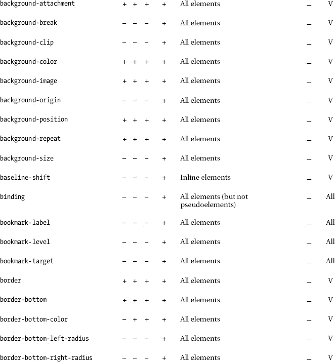
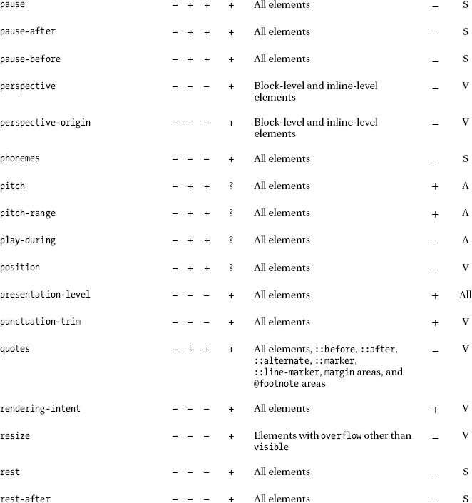

# 五、样式表

网站标准化的金科玉律是将内容和外观分开。XHTML 元素消除了样式属性。样式表应该在外部文件中提供。CSS 中提供的样式定义与早期 HTML 文档中应用的内联样式具有相似的特性。然而，命名约定和附加机制经常令人困惑。除了代码有效性之外，还有其他一些特性，如范围、属性值继承和分隔符的顺序，也应该考虑这些特性以获得优化的 CSS 文件。

在这一章中，你将学习常用的网站样式标准，包括一般的 CSS 语法规则和对每个网站都至关重要的选择器语法。在研究了不同 CSS 版本的属性之间的差异之后，您将对标准化问题和提供向后兼容性的挑战有一个坚实的理解。您还将熟悉 CSS 规则集优化的基本原则。此外，您将分析渲染引擎用于确定要应用的样式的方法。

### 层叠样式表

*层叠样式表* ( *CSS* )是 W3C 推出的一种样式表语言(style language)。*层叠*是指确定样式规则优先级的过程。CSS 用于定义结构化文档的表示语义。它提供了对 HTML 和 XHTML 文档及其元素的视觉和听觉特征的控制。一些典型的特征是，例如，字体、颜色、背景、边距、边框和层。CSS 提供了一个强大的特性，不仅支持可视媒体，还支持在不同类型的设备上运行的特殊浏览器:媒体类型。CSS 不仅支持最常用的视觉媒体类型，还支持其他媒体类型，这些媒体类型可以按如下方式分组:

*   *听觉*:听觉浏览器的属性。例子:`pitch`、`pitch-range`、`play-during`、`richness`、`voice-family`。
*   *交互*:允许用户交互的设备属性。例子:`nav-down`、`nav-index`、`nav-left`、`nav-right`、`nav-up`。

__________

尽管与 web 文档相关的大多数样式都是视觉的，CSS 也支持听觉属性，包括音量、说话、暂停、提示、空间属性和声音特征。它们用于听觉表达，例如当一个文档被转换为纯文本并输入到屏幕阅读器时。除了提高可访问性，听觉样式表在在线教育、娱乐、车内使用等方面也有潜力。

*   *分页和不连续*:分割成一页或多页的文件内容属性，如要打印的文件页面。例子:`image-orientation`、`page`、`page-break-before`、`page-break-inside`、`page-policy`、`size`。
*   *语音*:语音样式属性。例子:`cue`、`cue-after`、`cue-before`、`mark`、`mark-after`、`mark-before`、`pause`、`speak-header`、`speak-numeral`、`speak-punctuation`、`speech-rate`、`stress`。

正如您将在本章后面看到的，大多数 CSS 属性都是可视属性，或者可以应用于所有媒体，但也有许多属性是为特定媒体类型设计的。

CSS 的主要概念之一是将 HTML/XHTML 内容与外观分开，换句话说，将样式与结构区分开来。另一个目标是集中化，这意味着从一个位置提供对多个文档样式的完全控制。

尽管 CSS 主要用于样式化(X)HTML web 文档，但它也可以应用于所有种类的 XML 文档，例如 XUL 或 SVG  [1 ]。在 SVG 中，许多 CSS 属性在样式中被重用，例如字体属性、文本属性和其他可视属性。SVG 还使用 CSS 特性，比如 CSS 语法、选择器、外部样式表、级联、继承和 at-rules，稍后将详细描述其中的每一项。由于 SVG 是一个 XML 应用，内部 CSS 样式表可以作为 CDATA 部分提供(清单 5-1 )。

***清单 5-1。**在 SVG 中嵌入 CSS*

`<?xml version="1.0" standalone="no"?>
<!DOCTYPE svg PUBLIC "-//W3C//DTD SVG August 1999//EN"
 "http://www.w3.org/Graphics/SVG/SVG-19990812.dtd">
<svg>
  <defs>
    
  </defs>
  <text class="main">Here is my title</text>
</svg>`

CSS 甚至可以在有或没有 MathML 的情况下用于数学符号，MathML 是在第三章第一部分中讨论的标记语言，它是专门为在网络上发布方程式和数学符号而设计的 [2 ， 3 ]。

#### 级别、配置文件和模块

CSS 的各种版本通常被称为 *CSS 级别*。每个 CSS 级别都基于前一个级别，并添加了新的属性和功能。三个最重要的版本是 CSS1、CSS 2.1 和 CSS3。

为特定设备创建的至少一个 CSS 级别的子集被称为 *CSS 简档*，例如 CSS 打印简档 [4 、CSS 电视简档 [5 、以及 CSS 移动简档 [6 。

构成 CSS3 的规范被称为 *CSS 模块*。

 **注意**配置文件不等于媒体类型，这是在 CSS2 中引入的。

下面几节将介绍三个主要的 CSS 版本。

##### CSS1

CSS Level 1 是第一个级联样式表规范，发布于 1996 年。它是 W3C 推荐的，但是它的开发已经被 W3C  [7 ]关闭了。CSS1 引入了字体属性、元素颜色、对齐、表格、边距、边框、填充和定位的样式。CSS1 属性可以应用于唯一标识的元素或元素组。

##### CSS2 和 CSS 2.1

CSS Level 2 是作为 CSS1 的超集开发的，并且已经扩展了几个新特性。最重要的是层顺序(`z-index`)、三种元素定位(`absolute`、`relative`和`fixed`)、`aural`媒体类型和双向文本。

CSS Level 2 Revision 1，通常缩写为 CSS 2.1  [8 ]，多年来一直是 Web 上最终的样式解决方案。CSS 2.1 在 2011 年成为 W3C 推荐标准。

##### CSS3

CSS3 的开发始于 2005 年。与其他 CSS 规范相比，CSS3 是模块化的 [9 。它由单独的文档描述，如模块选择器、媒体查询、文本、背景和边框、颜色、2D 变换、3D 变换、过渡、动画和多栏。这些模块处于不同的开发和浏览器实现阶段。直到最近，只有少数模块被标准化了，比如色彩模块 [10 ]。

CSS3 中引入了各种新的功能和特性，如`border-radius`、`box-shadow`、`background-origin`；HSL、HSLA 和 RGBA 的颜色声明；`text-shadow`；`text-overflow`；`word-wrap`；`box-sizing`；属性选择器；多栏布局；网络字体；和演讲。

#### 语法和惯例

由不存在的属性、不正确的值、格式错误的声明等引起的解析错误可以通过遵循正确的 *CSS 语法*来消除。该语法确保了 CSS 在语法上的正确性，这使得浏览器能够正确地处理解析规则、选择器、属性、值和单元符号。虽然基本规则是相似的，但是每个 CSS 版本都有自己的语法 [11 ]。作为 CSS 2.1 的超集，CSS3 引入了额外的语义约束。

##### 标识符和类别

ID 和类标识符应该总是以字母开头。因为这些标识符对应于`id`和`class`标记属性，并且因为具有`id`属性的元素在网页中是唯一的，所以 ID 标识符可以用于样式化页面的唯一元素。如果相同的样式应用于多个元素，应该使用类标识符。标识符名称区分大小写。强烈推荐使用字母`a–z`和数字`0–9`，尽管下划线和连字符也是允许的。名字应该有意义和语义。应该使用唯一的名称。

##### 单位

CSS 支持多个测量值，这些测量值汇总在表 5-1 中。

 **注**尽管种类繁多，但大部分时间只使用其中三种单位:`%`、`em`和`px`。

##### 颜色声明

CSS 中有几种表示颜色的符号。以下部分提供了一个简要的概述，这是很重要的，因为颜色声明的例子将在整个章节的演示规则集中大量使用。

###### 十六进制表示法

十六进制表示法是目前为止 CSS 中声明颜色最常用的表示法。在网页上使用的 RGB 颜色空间中，任何颜色都可以通过加色混合来表示，使用三种颜色的不同强度变量:红色、绿色和蓝色(RGB)。三种基色的 256 种色调足以混合任何颜色，因为人眼不能区分强度差为 1/256 的任何两种相邻的红色、绿色或蓝色色调。由于每个通道有 256 个色调，每个通道的值从 0 到 255(十六进制表示法中的`00`到`ff`)不等；0 是通道最暗的阴影，255 是最亮的。

十六进制数字系统应用位置(也称为*位值*)符号。与十进制数字系统的 10 个数字相反，十六进制系统中有从`0`到`9`和`a`到`f`的 16 个符号(字母代表从`10`到`15`的值)。最后一个符号对应于乘以 16 的 0 次次幂2的值，最后一个符号之前的符号代表乘以 16 的 1 次次幂的值，依此类推。

因此，十六进制的符号`0`–`9`对应十进制的相同数字，而十六进制的`a`等于十进制的`10`、`b`到`11`、`c`到`12`、`d`到`13`、`e`到`14`、`f`到`15`。可以通过位值计算更多的数字(从`0`开始)。比如十六进制值`e8`对应十进制值`232`，因为 14 161+8 160= 14 16+8 1 = 224+8 = 232。从十进制到十六进制的转换可以类似地执行，但是计算过程相反。比如十进制记数法中的`86`是十六进制记数法中的`56`，因为 86/16 = 5.375，所以第一位数字是 5。5 16=80，余数是 6，是第二位数，因为 5 161+6 160= 5 16+6 1 = 80+6 = 86。

在 CSS 中，十六进制颜色声明以一个数字符号(`#`)开始，后面是六个十六进制(hex)值，每个通道两个。它们被用来任意混合颜色。比如纯红色可以通过`#ff0000`设置。换句话说，红色通道的强度最大(`ff`)，而绿色和蓝色的强度最小(`00`)。同样，纯绿色是`#00ff00`，而纯蓝色是`#0000ff`。如果每个通道的值都设置为`00`，则结果为黑色(`#000000`)。如果所有值都是最大值，则得到白色(`#ffffff`)。如果每个通道的值相同，结果是灰色阴影(清单 5-2 )。

***清单 5-2。**为所有段落声明灰色字体颜色*

`p {
  color: #898989;
}`

 **提示**如果每个通道的两位数相同，可以通过省略第二位来缩写。例如，`#f00`代表红色，`#0f0`代表绿色，`#00f`代表蓝色，`#000`代表黑色，`#fff`代表白色等等。

###### RGB 和 RGB(a)符号

RGB 模型中每个颜色通道的饱和度也可以用十进制数或百分比来声明(清单 5-3 )。

***清单 5-3。**简单的 RGB 符号*

`p {
  color: rgb(0, 255, 0) /*  equivalent to rgb(0, 100%, 0), #00ff00 and #0f0 */
}`

__________

任何非零的 0 次幂都是 1。

CSS 2.1 支持前面的符号，但在 CSS3 中已经扩展了颜色的透明度(alpha 通道)。这种符号被称为 RGB(a)。例如，透明度为 75%的纯绿色(相当于 25%的不透明度)可以如清单 5-4 中的所示进行声明。请注意，alpha 始终是一个百分比(从 0 到 1 的值)，而不是像其他颜色一样从 0 到 255。

***清单 5-4。**CSS3 中的一个 RGB(a)符号*

`p {
  color: rgb(0, 255, 0, **0.25**);
}`

###### HSL(a)符号

在 CSS 中，颜色也可以用 HSL(a)符号来表示，其中颜色由它们的色调、饱和度和亮度来表示。第一个值可以是 0 到 360 之间的数字，而第二个和第三个值可以声明为百分比。alpha 通道的工作方式与 RGB(a)相同(清单 5-5 )。

***清单 5-5。**HSL(A)符号中的透明色*

`#warning {
  background-color: hsl(240, 78%, 50%, 0.25);
}`

提示如果你想使用照片或网站上看到的颜色，你可以通过多种方式获得代码。首先，您可以检查页面或站点的样式表中的颜色代码。如果不方便，还有其他技术可以得到色标。如果您的计算机上没有安装高级图像处理应用，您只需使用“打印屏幕”按钮创建一个屏幕截图，然后将其复制并粘贴到基本的图像处理应用，如 Microsoft Paint。选择拾色器工具，然后单击您选择的颜色。从“颜色”菜单中选择“编辑颜色”选项，然后单击“定义自定义颜色”。 3 你得到颜色的色相、明度、饱和度，以及红、绿、蓝分量。因为它们是以十进制提供的，所以需要用诸如 Windows Calculator 之类的应用将其转换成十六进制(在科学模式下)。如果您有比 Paint 更高级的图像操纵器，如 Adobe Photoshop，您可以在粘贴的图像上使用拾色器工具，以获得不同颜色空间和符号的颜色代码，包括十进制和十六进制。

__________

Windows 7 中的 Paint 版本有一个功能区界面，而不是早期版本中的传统菜单。

###### 网页安全色

在彩色电脑屏幕的最初几年，电脑只支持 256 种不同的颜色。在那个时代，216 种颜色的列表被称为*网页安全色*。这种跨浏览器调色板用于确保所有计算机，包括使用 256 色调色板的计算机，都能正确显示颜色。网页安全色由每个通道的`00`、`33`、`66`、`cc`和`ff`值组成(例如`00ff00`、`663300`、`993300`、`cc6600`和`ff9966`)。

 **注意**从表现的角度来看，网页安全色不再有趣，因为所有现代的屏幕、显示器和投影仪都能够表现 RGB 色彩空间中的任何颜色。

###### 颜色名称

CSS 支持 16 种基本颜色的名称。这些关键字比它们对应的十六进制值 4 ( 表 5-2 )更容易读懂。然而，强烈建议使用十六进制记数法(见第十三章)。

__________

4 学会了用十六进制记数法调色后，使用数值就成了例行任务。

##### 选择器语法

一个 *CSS 选择器*识别 CSS 样式将被应用的那些标记元素。特定的元素组由各种类型的选择器决定样式。一个 *CSS 规则*(或者多个声明的 *CSS 规则集*)的一般结构如图图 5-1 所示，可以用清单 5-6 所示的伪代码编写。

***图 5-1。** CSS 规则结构*

***清单 5-6。**CSS 规则集的伪代码*

`selector [, selector*2*, …, selector*n*] [:pseudo-class] {
  property: value;
  [property*2*: value*2*;
   …
  property*m*: value*m*;]
}`

同一个选择器的多个声明可以组织成用分号(`;`)分隔的组。

 **提示**虽然在规则集中省略最后一个声明后面的分号是合法的，但是强烈建议总是提供分号。它使维护和修改变得更加容易，当一个声明被移动到 CSS 中的另一个位置时变得非常方便。

例如，清单 5-7 中的规则可以写成清单 5-8 所示。

***清单 5-7。**单独声明同一个元素的规则不是最佳选择*

`**h1** { font-weight: bold }
**h1** { font-size: 1.6em }
**h1** { font-family: Verdana }`

***清单 5-8。**同一元素的规则应分组*

`**h1** {
  font-weight: bold;
  font-size: 1.6em;
  font-family: Verdana;
}`

虽然它们是等效的，但出于许多原因，第二个版本应该是首选的。首先，它更短，因此有助于码长优化。其次，其他选择器的进一步声明可能会意外地插入单行之间，使得 CSS 文件更难维护。最后，第二种排列更容易阅读，这使得开发更容易。

###### 元素选择器

如果一个网站的所有段落都要用 Garamond 以 1.2em 的字体大小编写，那么规则集看起来就像清单 5-9 中的。

***清单 5-9。**所有段落的规则集*

`**p** {
  font-size: 1.2em;
  font-family: Garamond;
}`

这适用于标记中的所有段落，例如清单 5-10 中的段落。

***清单 5-10。**由清单 5-9 的规则集设置样式的段落*

`**
**
 A paragraph.
**
**
**
**
 Another paragraph.
**
**`

自然，段落的子集可能有不同的规则集，部分或全部覆盖一般规则(见本章后面的“层叠”一节)。

在前面的示例中，选择器选择了一个标记元素。这样的选择器被称为*元素选择器*，并自己应用相应的元素名称。花括号包含要设置样式的元素的属性，以及应该将它们更改为的值。花括号和它们之间的内容是*声明块*。属性-值对之间用分号分隔。属性与其值之间用冒号分隔。每行被称为一个*声明*或*声明*。

选择器由*组合子*分隔，即空格、 **`>`** 或 **`+`** 。在组合符和它们周围的简单选择器之间可能会出现更多的空白字符 [12 ]。

如果应用相同的 CSS 规则，选择器也可以被分组。应该使用逗号( **`,`** )作为组合符。对通用规则进行分组有助于 CSS 代码的优化。例如，清单 5-11 分别用`id`属性`articles`和`relatedlinks`改变两个`div`元素的颜色和字体大小。

***清单 5-11。**通用规则可以分组以避免重复*

`**#articles, #relatedlinks** {
  color: white;
  font-size: 1.8em;
}`

###### 班级选择器

*以句点(`.`)开头的类选择器*，选择所有`class`属性与其中指定的值相同的元素。由于`class`属性可以在一个网页中多次应用，所以类选择器可以用相同的类标识符来设计文档中任何元素的样式。例如,清单 5-12 中的规则在标记中被引用，如清单 5-13 和清单 5-14 所示。

***清单 5-12。**类选择器示例*

`**.abstract** {
  font-size: 1.1em;
 }`

***清单 5-13。**清单 5-12 中的类选择器可以应用于标题*

`<h3 **class="abstract"**>Abstract</h3>`

***清单 5-14。**同样的类选择器也可以应用于段落*

`

 The abstract of the first Chapter

`

如果规则集应该应用于具有指定类名的某些类型的元素，则可以通过在句点之前提供元素名称来编写更具体的规则。例如，如果前面的规则只对段落有效，那么它应该通过声明所需的元素类型来扩展(清单 5-15 )。

***清单 5-15。**对所有具有类名`abstract`* 的段落的规则

`**p.abstract** {
  font-size: 1.1em;
 }`

###### ID 选择器

某些标记元素在整个 web 文档中是唯一的；也就是说，它们在每个网页上只能出现一次。它们由标识符属性`id`识别。那些选择 web 页面上唯一元素的选择器，其`id`属性等于其中指定的值，这些选择器被称为 *ID 选择器*，并以一个散列标记(`#`)开始。清单 5-16 显示了一个例子。

***清单 5-16。**一个 ID 选择器示例*

`**#main** {
  margin-left: 120px;
}`

清单 5-17 显示了一个应用了先前规则的标记示例。

***清单 5-17。**可应用 ID 选择器`#main`的示例内容*

`

  The main content has a left margin of 120 pixels.

`

###### 通用选择器

一个*通用选择器*匹配网页上任何元素类型的名称(任何元素，不管是什么类型)。通用选择器标有星号(`*`)。清单 5-18 显示了一个例子。

***清单 5-18。**通用选择器示例*

`*****.caution {
  color: #ff2318;
}`

如果通用选择器不是简单选择器的唯一组件，星号可以省略(清单 5-19 )。

***清单 5-19。**可以安全省略星号的规则*

`.caution {
  color: #ff2318;
}`

考虑到清单 5-20 中显示的标记，选择器`div * em`将匹配大多数`em`元素，并应用于`h1` ( `favorite`)、`p` ( `impressive`)、第一个`li`元素(`hybrid electric`)和第二个`li` ( `fuel efficient`)中`em`元素的内容。在后两种情况下，`*`与`ul`或`li`匹配。

***清单 5-20。**通用选择器的示范标记*

`<body>
  

    <h1>My <em>favorite</em> car</h1>
    
The Lexus CT 200h is <em>impressive</em> due to the following reasons:

    <ul>
      <li>It is a <em>hybrid electric</em> car.</li>
      <li>It is a <em>fuel efficient</em> car.</li>
    </ul>
    That’s why it is a nice <em>entry-level luxury</em> hatchback.
  

</body>`

因为内容为`entry-level luxury`的`em`元素是`div`元素的直接子元素，所以`*`在`div`和`em`之间没有匹配的内容。

 **注意**通用选择器在 Internet Explorer 7 及更早版本中的实现并不完美。

###### 属性选择器

*属性选择器*选择方括号内指定属性的每个元素。属性类型或具有特定值的属性可以用它们来设置样式。例如，通过应用清单 5-21 中所示的规则，文档中所有具有`title`属性的`img`元素都可以有一个黄色边框。

***清单 5-21。**带有属性*的属性选择器示例

`**img[title]** {
  border-color: #ff0;
}`

属性选择器不仅可以用于属性，还可以用于属性-属性值对。例如，使用清单 5-22 所示的 CSS 规则，可以给网页中的所有`logo.png`图像添加 10 像素的边框。

***清单 5-22。**带有属性和属性值的属性选择器*

`**img[src="logo.png"]** {
  border: 10px;
}`

这适用于整个网页中清单 5-23 中标记的多个实例。

***清单 5-23。**一个标记代码，其中清单 5-22 被应用*

`<**img src="logo.png"** alt="logo" />`

###### 子选择器

*子选择器*当且仅当右边的元素是左边元素的直接子元素时，选择选择器中右边的元素。在子代和祖先之间使用大于号(`**>**`)。清单 5-24 显示了一个例子。

***清单 5-24。**子选择器示例*

`**td > a** {
  font-weight: bold;
}`

这适用于表格数据单元格内的所有超链接，例如在清单 5-25 中，但一般不影响超链接，例如在清单 5-26 中。

***清单 5-25。**清单 5-24T5 中子选择器的超链接示例*

`**<td><a** href="http://www.nairobicity.go.ke/"**>**Nairobi, Kenya**</a></td>**`

***清单 5-26。**子选择器示例不适用于不是数据单元格子元素的锚点*

`**<a** href="http://www.capital.sp.gov.br/"**>**São Paulo, Brazil**</a>**`

 **注意**Internet Explorer 6 及更早版本不支持子选择器。

###### 后代选择器

DOM 树上较低位置的元素样式可以由使用空格分隔的元素名称的*后代选择器*提供。与子选择器相比，后代选择器不要求子元素是祖先的直接子元素。清单 5-27 显示了一个例子。

***清单 5-27。**后代选择器示例*

`**td a** {
  font-weight: bold;
}`

这适用于表格数据单元格内的所有超链接，例如清单 5-25 (类似于前面显示的子选择器)或清单 5-28 。然而，这个规则一般不影响超链接。

***清单 5-28。**一个锚示例，其中清单 5-27 被应用*

`**<td>
**One of the unique attractions of **<a** href="http://www.nairobicity.go.ke/"**>**Nairobi,
Kenya**</a>** is the Nairobi National Park.**
</td>**`

注意子选择器和后代选择器之间的区别。

###### 相邻同级选择器

*相邻同级选择器*选择选择器右侧的元素，当且仅当它旁边有左侧元素的实例时。`**+**`符号被用作组合符。兄弟元素在 DOM 层次结构中处于同一级别。清单 5-29 显示了一个例子。

***清单 5-29。**相邻同胞选择器示例*

`**h2 + p** {
  color: #0f0;
}`

该选择器适用于清单 5-30 ，但不适用于清单 5-31 和清单 5-32 。

***清单 5-30。**应用来自清单 5-29* 的绿色的元素

`**<h2>**Heading**</h2>**
**
**A paragraph**
**`

***清单 5-31。**不适用清单 5-29 中所示规则的一段*

`**
**A paragraph**
**`

***清单 5-32。**由于段落前缺少二级标题，此处也不应用该样式*

`**<h1>**Heading**</h1>**
**
**A paragraph**
**`

 **注意**IE6 或更早版本不支持相邻同级选择器。

###### 伪班

伪类使用冒号将元素与其状态分开，是更复杂的选择器。根据超链接的状态，它们经常用于确定超链接的样式。例如，清单 5-33 适用于所有的`a`元素，但是只有当鼠标悬停在链接上时。

***清单 5-33。**当一个锚停留在*上时应用的链接颜色

`**a:hover** {
  color: #000080;
}`

再比如清单 5-34 ，将所有已经访问过的 5 的超链接颜色改为绿色。

__________

5 显示当前浏览器历史记录

***清单 5-34。**链接颜色设置为已访问的超链接*

`**a:visited** {
  color: #0f0;
}`

###### 伪元素

*伪元素*可用于为特定元素部分而非整个元素添加样式。它们也可以应用于在某些元素之前或之后插入内容。组合符是一个冒号(`:`)。例如，清单 5-35 中的 CSS 规则将网页中所有段落的第一个字母的字体大小改为 2 em。

***清单 5-35。**段落第一个字母的规则*

`**p:first-letter** {
  font-size: 2em;
}`

##### 属性值类型

CSS 属性值可以是以下内容:

*   关键词(例如，`auto`)
*   基本数据类型(例如，`%`)
*   关键字和自定义数据的组合(例如，`url('[`example.cimg/book.png`](http://example.cimg/book.png)'`)

##### 速记符号

某些 CSS 属性可以分组到单个属性声明中。最常见的速记符号将在以下章节中介绍。

###### 字体属性的速记符号

字体属性可以写成清单 5-36 中的完整形式，也可以写成清单 5-37 中的简写形式。

***清单 5-36。**如果要为同一个元素设置多个字体属性，规则集会变得太长*

`p {
  font-weight: bold;
  font-size: 1em;
  line-height: 1.2em;
  font-family: Garamond;` `  font-style: normal;
}`

***清单 5-37。**字体属性的速记符号*

`p { font: bold 1em/1.2em Garamond }`

 **注意**在第二种情况下，`font-style`属性没有被设置，因此取 CSS 规范中为该属性定义的*默认值*，即`normal`。

###### 背景属性的速记符号

单独的背景属性(清单 5-38 )具有简写属性`background` ( 清单 5-39 )。

***清单 5-38。**可缩短的独立背景属性*

`body {
  background-color: #232323;
  background-image: url('img/bg.jpg');
  background-repeat: no-repeat;
  background-position: 100% 0%;
  background-attachment: fixed;
}`

***清单 5-39。**背景属性合并成一个单一的背景属性*

`body {
  background: #232323 url('img/bg.jpg') no-repeat 100% 0% fixed;
}`

###### 列表属性的速记符号

列表样式，比如在列表 5-40 中的样式，也可以通过枚举`list-style`速记属性的单个属性值来缩短(列表 5-41 )。

***清单 5-40。**列出可以缩短的款式*

`ul.tick {
  list-style-image: url('tick.png');
  list-style-type: none;
  list-style-position: inside;
}`

***清单 5-41。**三个列表样式属性值的单行规则*

`ul.tick {
  list-style: url('tick.png') none inside;
}`

###### 填充、边框和边距属性的简写符号

有五个属性用于设置顶部、右侧、底部和左侧填充(分别为`padding-top`、`padding-right`、`padding-bottom`、`padding-left`)或所有这些属性以及速记属性`padding`。对于边框(`border-top`、`border-right`、`border-bottom`、`border-left`、`border`)和边距(`margin-top`、`margin-right`、`margin-bottom`、`margin-left`、`margin`)也存在类似的约定。有多种选项可以缩短属性值枚举的顺序:

*   Four values set the padding of each side: the top, the right, the bottom, and finally the left padding (clockwise, starting from top) (Listing 5-42).

     **提示**这个顺序值得记忆，因为它不仅可以用于填充，还可以用于边框和边距。

    ***清单 5-42。**用四个值填充速记属性*

    `#decor {
      padding: 10px 5px 20px 30px;
    }`
*   Three values set the top, right, and left (equally), and the bottom padding (Listing 5-43).

    ***清单 5-43。**用三个值填充速记属性*

    `#decor {
      padding: 10px 20px 15px;
    }`
*   Two values set an equal padding for the top and bottom sides, and then an equal padding for the right and left sides (Listing 5-44).

    ***清单 5-44。**用两个值填充速记属性*

    `#decor {
      padding: 30px 20px;
    }`
*   One value sets an equal padding for all sides (Listing 5-45).

    ***清单 5-45。**用一个值填充速记属性*

    `#decor {
      padding: 10px;
    }`

类似的简写符号可用于通过`border`和`margin`简写属性设置 border 和 margin 属性值。进一步的填充、边框和边距属性也可以用速记符号书写。清单 5-46 显示了一个例子。

***清单 5-46。**可以缩短的边框属性*

`.book {
  border-width: 1px;
  border-style: solid;
  **border-top-color: #000;**
  **border-right-color: #000;**
  **border-bottom-color: #000;**
  **border-left-color: #000;**
}`

因为在这个例子中每边的边框颜色都是一样的，所以第三、四、五、六行中的属性可以写成`border-color` ( 清单 5-47 )。

***清单 5-47。**`border-color`速记属性设置元素*每一侧的边框颜色

`.book {
  border-width: 1px;
  border-style: solid;
  **border-color: #000;**
}`

即使边框颜色不同，也可以通过简单地按照上、右、下、左的顺序(顺时针，从顶部开始)枚举所需的颜色，由`border-color`速记属性来声明。

所有先前的属性仍然可以缩短为一行，如清单 5-48 所示。

***清单 5-48。**多物业最短边界申报*

`.book {
  border: 1px solid #000;
}`

#### 实施

有三种方法可以实现 CSS。选择的方法决定了样式的范围。

*   *Inline style*: Styling with the most limited scope. An inline style is embedded in an (X)HTML tag to which it exclusively applies. This CSS fragment is defined by the style attribute that can be provided on most markup elements. The attribute value has the same syntax as the contents of a CSS declaration block except that the delimiting braces are omitted [13]. Listing 5-49 shows an example.

    ***清单 5-49。**内联样式声明示例*

    ``
*   *Embedded (internal) style*: A code block usually located in the document head. Embedded styles are used for styling rules unique to that web page (the element to style does not occur in other pages on the site). Listing 5-50 shows an example.

    ***清单 5-50。**嵌入式风格的一个例子*

    `<head>
      …
    **  **
      …
    <head>`
*   *External style sheet*: An external style sheet is a separate file with the `.css` extension that contains style rules for multiple web documents, such as an entire web site. This is a plain-text file usually encoded in US-ASCII. CSS files cannot contain the `style` element, just the CSS style rules themselves. Each page refers to that file with the `link` element in the (X)HTML head section. Listing 5-51 shows an example.

    ***清单 5-51。**链接到 XHTML 中的外部样式表文件*

    `**<link rel="stylesheet" type="text/css" href="**main.css**" />**`

    在 XML 文档(XML、XUL、SVG 等)中，外部样式表可以由第一个文档段 [14 ] ( 清单 5-52 )中的 *XML 处理指令* `xml-stylesheet`提供。

    ***清单 5-52。**链接到 XML 格式的外部样式表文件*

    `**<?xml-stylesheet type="text/css" href="**default.css**"** title="Default style" **?>**`

嵌入样式会覆盖在外部 CSS 文件中声明的相应样式，这使得在为单个网页声明一些特定规则时，可以使用网站的主要样式规则。内联样式更加具体，并且局部覆盖外部样式表的样式以及嵌入的样式(如果有的话)。

样式表也可以用`@import`规则从其他样式表文件导入 CSS 规则。它应该在`@charset`规则(如果有)之后但在所有其他规则之前提供。如果额外的 CSS 文件在同一个目录结构中，那么路径就足够了(清单 5-53 )。

***清单 5-53。**重用外部样式表*

`**@import "**styles/alter.css**";**`

包含此规则的文件的规则集将覆盖导入样式的相应规则(如果有)。例如，如果一个站点的不同页面有相同的样式，除了作为设计的一部分被修改的`background-color`，那么所有的样式都可以被导入并且`background-color`属性被覆盖(在清单 5-54 中的`alter.css`)。类似地，为移动设备设计的样式表可以重用主要样式，但删除背景图像 6 ，并将文档主体的最大宽度设置为当今智能手机可用的最大屏幕宽度(清单 5-54 中的`mobile.css`)。其他款式都是进口的，包括`color`和`font-family`。

***清单 5-54。**重用和扩展网站主 CSS 文件的样式*

更健壮的声明提供的不是文件的路径，而是文件的 URL。清单 5-55 显示了一个例子。

***清单 5-55。**通过提供完整的 URL 导入样式表文件*

`@import url("http://www.example.com/alter.css");`

导入样式表的应用之一是为 web 站点提供替代样式，这些样式有多种用途。例如，可以通过为不同的媒体提供不同的样式表来提高可访问性。站点的特定于媒体的 CSS 文件可以在标记中由`link`元素上的`media`属性控制，正如前面在第三章中讨论的。这种 CSS 文件的规则集有一个由站点的主 CSS 文件定义的交集。特定于媒体的规则的文件相互依赖，并且经常从彼此导入规则(清单 5-56 )。多个 CSS 文件也可以用于网站设计。

__________

6 在这个例子中，`background-image`属性是使用`main.css`文件中的速记属性`background`设置的。

***清单 5-56。**导入特定媒体风格*

`@import url("print.css") print;
@import url("mobile.css") handheld and (max-width: 480px);`

#### 显示和可视性

HTML 和 XHTML 文档的元素级别已经讨论过了。在 CSS 中，(X)HTML 元素通常可以通过以下方式显示:

*   *Block:* Uses the full width available, along with a new line before and after (Listing 5-57)

    ***清单 5-57。**元素显示为块的规则*

    `display: block;`
*   *Inline:* Uses only as much width as needed without breaking the row (Listing 5-58)

    ***清单 5-58。**元素内联显示规则*

    `display: inline;`
*   *Not displayed:* Removes the element completely from the document so it does not take up any space, even though its corresponding markup is still in the source code (Listing 5-59)

    ***清单 5-59。**无空格隐藏元素的规则*

    `display: none;`
*   *Hidden:* Hides the element but still takes up space in the layout (Listing 5-60)

    ***清单 5-60。**用空格符隐藏元素的规则*

    `visibility: hidden;`

#### 层叠

CSS 中的 *C* 代表*级联*。它是一种机制，用于确定一组样式规则中的一个声明，这些规则应该应用于某个元素-属性对。浏览器按照以下顺序考虑三个特征来选择声明 [15 ]:

1.  *Weight*: The declaration with the highest weight is chosen. In CSS3, the weight of a declaration is based on the *origin of the declaration* and its *level of importance*. The origin can be of three kinds: *author*, *user*, and *user agent*. CSS declarations have two levels of importance: *normal* and *important* (the first one is the default level; the second one is optional and should be marked). An important declaration looks like Listing 5-61.

    ***清单 5-61。**最重要的规则*

    `#menu {
      margin-top: 12px **!important**;
    }`

     **提示**级联机制的适当利用消除了对`!important`规则的需要。

    源自不同来源的样式表的权重按降序排列如下:

    1.  用户样式表(重要)
    2.  作者样式表(重要)
    3.  创作样式表(普通)
    4.  用户样式表(普通)
    5.  渲染引擎的默认样式表

    因此，开发人员编写的声明通常比用户样式表更重要，用户样式表比浏览器的默认样式更重要。这就是为什么链接通常用网站开发者定义的字体颜色而不是默认的锚色来呈现的原因(清单 5-62 )。

    ***清单 5-62。**CSS 文件中的规则比浏览器默认样式表中的相应规则权重更大*

    `a {
      font-color: #12ee12;
    }`
2.  *Specificity*: The declaration with the highest specificity is chosen. The specificity of selectors can be calculated as follows [16]:
    *   计算选择器中 ID 属性的数量。
    *   计算选择器中其他属性和伪类的数量。
    *   计算选择器中元素名称的数量。
    *   这些数字的串联就是特异性。
    *   负选择器的计数类似于它们的简单选择器参数。
    *   伪元素被忽略。

    在清单 5-63 中，第一个声明的特异性最低，最后一个声明的特异性最大。所有段落的字体颜色都是相同的(黑色)，除了包含在一个分区中的那些段落，它们具有不同的字体颜色(绿色)。具有为`class`属性声明的`tip`值的`div`元素有一个更具体的规则，这使得它们的字体颜色与众不同(红色，不同于任何其他段落的颜色)。

    ***清单 5-63。**越来越具体的声明*

    `p {
      color: #000;
    }

    div p {
      color: #0f0;
    }

    .tip p {
      color: #00f;
    }`
3.  *声明顺序*:如果两个声明具有相同的权重、来源和特性，则选择最后一个声明(还应考虑导入的样式表)。导入的样式规则在样式表规则之前处理。进一步导入的样式表规则按照`@import`规则的顺序考虑。

#### 继承

在 web 标记语言和样式表中，某些代码会被自动重用。在 CSS 中，父元素的属性值可以设置给它们的子元素。元素-属性组合的指定值是从父元素的相应计算值中复制的。这个过程叫做*继承*。它消除了定义简单属性的需要。例如，如果定义了 web 文档的背景色，文档中的所有容器元素、分隔线和段落都将继承该属性。当然，它们中的任何一个都可以被任意覆盖。

某些 CSS 属性值被定义为*继承的*。除非为这些元素-属性组合指定了值，否则该值由继承决定。

`inherit`值可用于通过继承确定的所有属性。例如，颜色是一种可继承的属性。然而，锚元素的颜色通常被用户代理样式表设置为蓝色。通过使用值`inherit`，用户代理样式表的声明可以被覆盖:所有子锚元素从父元素继承前景色的值(清单 5-64 )。

***清单 5-64。**继承的财产价值*

`#warning {
  color: #000;
}
#warning a:link {
  color: inherit;
}`

 **注**应该考虑的是，属性越具体，可以应用的元素就越少。正如您将在 CSS 属性概述中看到的，很大一部分 CSS 属性根本没有被继承。

#### 范围和结构

与最初几年使用的带下划线的蓝色超链接不同，现代网站经常使用不同的颜色和装饰来适应整体设计。然而，当超链接使用虚线下划线时，链接图像共享相同的样式是相当令人沮丧的。为了解决这个问题，应该移除图像边框并设置更具体的样式。清单 5-65 显示了一个例子。

***清单 5-65。**消除一般规则声明的链接下划线的具体规则*

`img {
  border: 0;
}

a.nounder {
  border-bottom: none;
}`

规则的*范围*对它们的应用有很大的影响。适用于同一类别中更多(大多数)元素的规则应该在网站开发的早期阶段确定。例如，如果绝大多数段落都有相同的缩进，那么这个值应该作为一个通用的 CSS 规则应用于所有的`p`元素(例如，`p { text-indent: 3em; }`)，而另一个规则应该写入不同的段落类(例如，`p.morein { text-indent: 5em; }`)。

在最佳情况下，对于那些可以作为整个网站基础的属性，范围和继承都要考虑，比如默认字体大小(清单 5-66 )。

***清单 5-66。**整个网站的默认字体大小可以从文档体继承*

`body {
  font-size: 0.8em;
}`

对于那些需要不同字体大小的元素，比如标题，可以专门设置该属性(清单 5-67 )，所有其他元素继承为文档正文设置的默认字体大小。因此，没有必要为所有的`p`和`div`元素声明字体大小，如果它们所需的字体大小是默认的，因为属性是从`body`元素继承的。

***清单 5-67。**覆盖先前清单中设置的默认字体大小的特定声明*

`h1 {
  font-size: 1.4em;
}
h2 {
  font-size: 1.2em;
}
h3 {
  font-size: 1em;
}`

#### 盒子模型

块元素的实际标记内容由可选的*填充*、*边框*和*边距*包装，称为 *CSS 盒模型* ( 图 5-2)17。这些矩形框是为文档树中的某些标记元素生成的。

***图 5-2。**CSS 盒子模型*

文本和图像出现在内容中。填充清除内容周围的区域。填充受框的背景颜色影响，类似于填充周围的边框区域。边距是边框周围最外面的区域。它没有背景色，是透明的。每个区域的大小可以由 CSS 属性决定。既然是可选的，也可以折叠到`0`(即完全消除)。

两个垂直相邻的块体元件的边缘通常会相互塌陷；也就是说，边距根据第一个框的较大底部边距的大小以及它下面的另一个框的顶部边距的大小来呈现。

##### IE 盒子模型 Bug

从 CSS 的第一个版本开始，所有块级元素的宽度和高度都是显式指定的，只决定可见元素的宽度或高度，填充、边框和边距是在以后应用的。在早期版本的 Internet Explorer 中，CSS 规范实现不正确，这通常被称为 *Internet Explorer box 模型错误*。例如，Internet Explorer 5 将内容、填充和边框包含在指定的宽度或高度内，导致框的呈现更窄或更短 [18 ] ( 图 5-3 )。

***图 5-3。**W3C 和 IE5 盒子模型的比较。注意宽度的不同解释。*

Internet Explorer 6 和更新的 IE 版本 7 在其符合标准的模式下应用了正确的实现，但出于兼容性的原因，当页面以怪癖模式呈现时，bug 仍然存在。

#### CSS 属性概述

表 5-3 总结了 CSS 属性的丰富选择。CSS1 中有 53 个属性，CSS2 中有 120 个，CSS 2.1 中有 115 个，CSS3 中有 200 多个(还在增加中)。

__________

Mac 版的 ie 浏览器(于 2006 年停产)中没有这个漏洞。

__________

8none 值适用于所有介质。

浏览器对 CSS 属性的支持各不相同，并且正在逐步改进。然而，即使是 CSS 2.1 属性也只是在最近才获得了或多或少的完整和正确的实现。因此，旧的浏览器不支持所有的属性，并且许多属性的实现不正确。这是多年来在不同浏览器下呈现同一个网站的巨大差异的主要原因。随着 CSS 属性在现代浏览器中的正确实现(如果不是完全实现的话),这种差异已经减少到最小。

 **提示**强烈建议谨慎应用 CSS3 规则，因为 CSS3 的大部分模块尚未标准化，浏览器支持也各不相同。造型不是一个“要么一切要么什么都没有”的命题。例如，基本的 CSS 属性——也是 CSS 2.1 和大多数浏览器所支持的——可以用来定位一个`div`元素，并为它提供诸如背景颜色、字体大小和边距之类的样式。尽管通过使用 CSS3 属性`border-radius`声明的圆角不能在旧的浏览器中呈现，但是总的布局和样式在旧的浏览器中提供了与支持 CSS3 的现代浏览器相似的外观。类似地，如果在网站上使用 Web 字体嵌入——旧版浏览器不支持——一个通用字体和至少一个通用字体系列应该被声明为后备机制(详见第九章)。

#### 初始属性值

所有 CSS 属性都有它们的*初始值*，当属性值既不是通过级联也不是通过继承设置时，这些初始值就会被应用。每个属性的初始值由 CSS 规范定义。初始值是相应 CSS 属性的允许值之一。例如，颜色声明(以任何允许的格式，通常以十六进制表示)，`transparent`和`inherit`都是`background-color`属性的合法值，其中`transparent`是初始值，通过在 CSS 文件中声明所需的值可以很容易地覆盖它(清单 5-68 )。

***清单 5-68。**声明的值覆盖 CSS 规范定义的初始值*

`body {
  background-color: #198c00;
}`

这就是为什么所有段落、分割和其他元素的背景都是透明的原因。另一个例子是列表的项目符号类型，它经常在没有覆盖的情况下使用。如果属性`list-style-type`的值不是开发者设置的，则使用初始值进行渲染，也就是`disc`。但是，它可以被该属性的任何其他允许值覆盖，包括`circle`、`square`、`decimal`、`decimal-leading-zero`、`lower-roman`、`upper-roman`、`lower-greek`、`lower-latin`、`upper-latin`、`armenian`、`georgian`、`lower-alpha`、`upper-alpha`、`none`和`inherit`。最后一个值`inherit`不仅可以应用于`list-style-type`，还可以应用于任何其他 CSS 属性，以便显式应用相应属性的初始值。

因为根元素没有父元素，所以默认情况下，它的值被设置为初始属性值。

#### 渲染引擎的默认样式

由于呈现引擎的默认样式表包含某些属性的不同属性值，因此网站开发人员未声明的属性值在各种浏览器下可能会有所不同。由于不同的行高、边距、字体大小和其他属性，网站的整体外观通常是不一致的。尽管某些默认属性值只是略有不同，但开发人员不能依赖于呈现引擎的默认样式。

 **提示**通过覆盖渲染引擎默认样式表的 CSS 属性值，可以最小化浏览器 CSS 实现之间的不一致性。这种技术叫做 *CSS 重置*。最著名的 CSS 重置文件之一是由 Eric A. Meyer 编写和维护的(清单 5-69 )，可以在您的网站上免费使用 [ 19  ]。

***清单 5-69。**CSS 复位*

`/* http://meyerweb.com/eric/tools/css/reset/
  v2.0 | 20110126
  License: none (public domain)
*/
html, body, div, span, applet, object, iframe, h1, h2, h3, h4, h5, h6, p, blockquote, pre, a,
abbr, acronym, address, big, cite, code, del, dfn, em, img, ins, kbd, q, s, samp, small,
strike, strong, sub, sup, tt, var, b, u, i, center, dl, dt, dd, ol, ul, li, fieldset, form,
label, legend, table, caption, tbody, tfoot, thead, tr, th, td, article, aside, canvas,
details, embed, figure, figcaption, footer, header, hgroup, menu, nav, output, ruby, section,
summary, time, mark, audio, video {
  margin: 0;
  padding: 0;
  border: 0;
  font-size: 100%;
  font: inherit;
  vertical-align: baseline;
}
/* HTML5 display-role reset for older browsers */
article, aside, details, figcaption, figure, footer, header, hgroup, menu, nav, section {
  display: block;
}
body {
  line-height: 1;
}
ol, ul {
  list-style: none;
}
blockquote, q {
  quotes: none;
}
blockquote:before, blockquote:after, q:before, q:after {
  content: '';
  content: none;
}
table {
  border-collapse: collapse;
  border-spacing: 0;
}`

### XSL

虽然它并没有被广泛使用，而且只有有限的 web 开发人员熟悉它，但是自 1999 年以来，除了 CSS 之外的一种技术也可以用于样式化某些 web 文档。*可扩展样式表语言* ( *XSL* )是一个语言家族，可用于 XML 文件的样式化、操作和转换。有三种 XSL 语言；然而，其中只有一种是样式表语言:

*   XSL 转换(XSLT):一种 XML 样式表语言，可用于将 XML 文档转换成其他 XML 文档或其他格式，如 HTML 或纯文本。原始文档保持不变，并基于现有文档创建一个新文档。
*   *XSL 格式化对象* (XSL-FO):一种 XML 标记语言，用于指定 XML 文档的可视化格式。一些软件支持 XSL-FO，可以提供各种输出格式，包括纯文本、PDF、PS、SVG、PCL 和 MIF。
*   *XML 路径语言*(XPath):XSLT 也可以使用的非 XML 查询语言。

#### XSLT 样式表

XSLT 样式表由一个或多个样式表模块组成，这些模块是 XML 文档的一部分，或者单独形成整个 XML 文档。XSLT 的典型文件扩展名是`.xsl`和`.xslt`。XSLT 样式表使用媒体类型`application/xslt+xml`。

##### 名称空间

XSLT 名称空间是`[`www.w3.org/1999/XSL/Transform`](http://www.w3.org/1999/XSL/Transform)`。但是，XSLT 处理器 [21 ]也可以识别其他(保留的)名称空间，包括:

*   标准函数命名空间，`[`www.w3.org/2005/xpath-functions`](http://www.w3.org/2005/xpath-functions)`
*   XML 命名空间，`[`www.w3.org/XML/1998/namespace`](http://www.w3.org/XML/1998/namespace)`
*   模式名称空间，`[`www.w3.org/2001/XMLSchema`](http://www.w3.org/2001/XMLSchema)`
*   模式实例名称空间，`[`www.w3.org/2001/XMLSchema-instance`](http://www.w3.org/2001/XMLSchema-instance)`

##### 结构

XSLT 样式表的结构看起来像清单 5-70 中的。

***清单 5-70。** XSLT 样式表结构*

`<xsl:stylesheet version="1.0"
xmlns:xsl="http://www.w3.org/1999/XSL/Transform">
  <xsl:import href="…"/>
  <xsl:include href="…"/>` `  <xsl:strip-space elements="…"/>
  <xsl:preserve-space elements="…"/>
  <xsl:output method="…"/>
  <xsl:key name="…" match="…" use="…"/>
  <xsl:decimal-format name="…"/>
  <xsl:namespace-alias stylesheet-prefix="…" result-prefix="…"/>
  <xsl:attribute-set name="…">
    …
  </xsl:attribute-set>
  <xsl:variable name="…">…</xsl:variable>
  <xsl:param name="…">…</xsl:param>
  <xsl:template match="…">
    …
  </xsl:template>
  <xsl:template name="…">
    …
  </xsl:template>
</xsl:stylesheet>`

请注意，前面的示例显示了所有允许的元素类型；然而，样式表可能包含零个或多个这样的元素。

##### 元素

XSLT 样式表在 XML 文档中由`xsl:stylesheet`或`xsl:transform`元素表示。一个`xsl:stylesheet`元素必须有一个`version`属性。`xsl:stylesheet`元素可以包含以下类型的元素:`xsl:import`、`xsl:include`、`xsl:strip-space`、`xsl:preserve-space`、`xsl:output`、`xsl:key`、`xsl:decimal-format`、`xsl:attribute-set`、`xsl:param`、`xsl:variable`、`xsl:namespace-alias`和`xsl:template`。表 5-4 提供了 XSLT 1.0 元素的概述。

XSLT 元素的应用很简单，并且遵循一般的 XML 创作原则。清单 5-71 显示了一个例子。

***清单 5-71。** XSLT 元素和属性符合 XML 指南*

`<xsl:param name="page-header-margin">20px</xsl:param>`

##### 标准属性

几个标准属性与 XSLT 元素相关联，包括`version`、`exclude-result-prefixes`、`extension-element-prefixes`、`xpath-default-namespace`、`default-collation`和`use-when`。为了将它们与作者定义的属性区分开来，它们应该用名称空间符号写成`xsl:version`、`xsl:exclude-result-prefixes`、`xsl:extension-element-prefixes`、`xsl:xpath-default-namespace`、`xsl:default-collation`和`xsl:use-when`。

### 结合 CSS 和 XSL

XSL 还可以用作复杂的基于 XML 的文档和 CSS 格式模型之间的桥梁。因为 CSS 没有 XML 语法，所以 CSS 属性在 XSL 语法中变成了 XML 属性。主 CSS 对象是`chunk`。可能还需要其他对象。通常它们是其他具有功能的`chunk`对象，如`anchor`，或者更远的对象，如`switch`。例如，清单 5-72 中的 CSS 规则集可以用 XSL 语法编写，如清单 5-73 所示。

***清单 5-72。**要转换成 XSL 的 CSS 规则集示例*

`{
  font-size: 1.2em;
  text-indent: 1em;
}`

***清单 5-73。**清单 5-72 中的 XSL 等价物*

`<css:chunk` `  font-size="1.2em"
  text-indent="1em">`

### 总结

在这一章中，你学习了如何将表示和内容分开，这在网站标准化中是必要的。您知道级联样式表的语法，这是几乎每个网站都使用的语言。您已经掌握了 CSS 选择器的使用，并可以在日常工作中应用它们来精确控制那些需要样式化的元素或元素集的外观。到目前为止，您已经知道如何放心地使用 CSS 的层叠功能，这使得创建长度最佳且易于维护的 CSS 文件成为可能。您还知道如何通过应用回退机制和即使是旧浏览器也支持的属性来确保向后兼容性。您了解了 XML 文件不仅可以用 CSS 样式化，还可以用 XSL 样式化。

在下一章，你将学习服务器端脚本和 web 应用的标准化问题。

### 参考文献

1。Dahl strm E、Dengler P、Grasso A、Lilley C、McCormack C、Schepers D、Watt J、Ferraiolo J、Jun F、Jackson D(eds)(2011)CSS 造型。在:SVG 1.1(第二版)。万维网联盟。[www.w3.org/TR/SVG/styling.html#StylingWithCSS](http://www.w3.org/TR/SVG/styling.html#StylingWithCSS)于 2011 年 8 月 18 日访问

2。Chavchanidze G (2004)用层叠样式表格式化数学文章。安德烈·拉兹马兹数学研究所。[www.princexml.com/samples/math.pdf](http://www.princexml.com/samples/math.pdf)2010 年 10 月 9 日访问

3。Bos B，Carlisle D，Chavchanidze G，Ion PDF，Miller BR(2011)A MathML for CSS Profile。W3C 推荐。万维网联盟。[www.w3.org/TR/mathml-for-css/](http://www.w3.org/TR/mathml-for-css/)2011 年 8 月 18 日访问

4。Grant M (ed) (2006) CSS 打印配置文件。万维网联盟。[www.w3.org/TR/css-print/](http://www.w3.org/TR/css-print/)于 2011 年 8 月 17 日访问

5。Hayes S，Adams G，elik T，Lie HW (2003) CSS 电视简介 1.0。万维网联盟。[www.w3.org/TR/css-tv](http://www.w3.org/TR/css-tv)于 2011 年 8 月 17 日访问

6。舒伯特的 CSS 移动配置文件 2.0。万维网联盟。[www.w3.org/TR/css-mobile/](http://www.w3.org/TR/css-mobile/)于 2011 年 8 月 17 日访问

7 .。Lie HW，Bos B (2008)级联样式表，级别 1。W3C 推荐标准(修订版)。万维网联盟。[www.w3.org/TR/CSS1/](http://www.w3.org/TR/CSS1/)2010 年 10 月 9 日访问

8。博斯 B、切利克 T、希克森 I、李 HW (eds) (2011)级联样式表 2 级修订版 1 (CSS 2.1)规范。万维网联盟。[www.w3.org/TR/CSS21/](http://www.w3.org/TR/CSS21/)2011 年 8 月 18 日访问

9。Meyer EA，Bos B (eds) (2001)模块描述和相关信息。请参阅:CSS3 简介。W3C 工作草案。万维网联盟。[www.w3.org/TR/css3-roadmap/#module](http://www.w3.org/TR/css3-roadmap/#module)2010 年 10 月 9 日访问

10。elik T，Lilley C，Baron LD，Pemberton S，Pettit B (eds) (2011) CSS 颜色模块级别 3。万维网联盟。[www.w3.org/TR/css3-color/](http://www.w3.org/TR/css3-color/)于 2011 年 8 月 18 日访问

11。博斯 B，切利克 T，希克森 I，李 HW(编辑)(2011)CSS 2.1 语法。在:级联样式表级别 2 修订版 1 (CSS 2.1)规范中。W3C 推荐。万维网联盟。www.w3.org/TR/CSS21/grammar.html.于 2011 年 8 月 18 日加入

12。博斯 B，切利克 T，希克森 I，李 HW(编辑)(2011)选择器语法。在:级联样式表级别 2 修订版 1 (CSS 2.1)规范中。W3C 推荐。万维网联盟。[www.w3.org/TR/CSS21/selector.html#selector-syntax](http://www.w3.org/TR/CSS21/selector.html#selector-syntax)2011 年 8 月 18 日访问

13。埃利克 T，埃特马德 EJ(编辑)(2010)语法和解析。输入:CSS 样式属性。万维网联盟。www.w3.org/TR/2010/CR-css-style-attr-20101012/#syntax[。2010 年 10 月 16 日访问](http://www.w3.org/TR/2010/CR-css-style-attr-20101012/#syntax)

14。Clark J，Pieters S，Thompson HS (eds) (2010)将样式表与 XML 文档关联 1.0(第二版)。W3C 推荐。万维网联盟。[www.w3.org/TR/xml-stylesheet/](http://www.w3.org/TR/xml-stylesheet/)2010 年 11 月 2 日访问

15。李华伟(编辑)(2005)级联。在:CSS3 模块:级联和继承。W3C 工作草案。万维网联盟。[www.w3.org/TR/2005/WD-css3-cascade-20051215/#cascading](http://www.w3.org/TR/2005/WD-css3-cascade-20051215/#cascading)2010 年 10 月 10 日访问

16。格雷兹曼 D，切利克 T，希克森 I，林斯 P，威廉姆斯 J(编辑)(2001)计算一个选择器的特异性。输入:选择器。万维网联盟。[www.w3.org/TR/2001/CR-css3-selectors-20011113/#specificity](http://www.w3.org/TR/2001/CR-css3-selectors-20011113/#specificity)2010 年 10 月 10 日访问

17。博斯 B，切利克 T，希克森 I，李 HW (2010)箱型模型。在:级联样式表级别 2 修订版 1 (CSS 2.1)规范中。W3C 工作草案。万维网联盟。[www.w3.org/TR/CSS21/box.html](http://www.w3.org/TR/CSS21/box.html)2010 年 12 月 12 日访问

18。Silver L (2006)固定盒子，而不是在盒子外面思考。in:Internet Explorer 6 中的 CSS 增强功能。微软公司。[`msdn . Microsoft . com/en-us/library/bb 250395 . aspx # CSS enhancements _ topic 3`](http://msdn.microsoft.com/en-us/library/bb250395.aspx#cssenhancements_topic3)。于 2011 年 8 月 19 日访问

19。Meyer EA，Meyer KS (2011) CSS 工具:重置 CSS。埃里克. a .迈耶凯瑟琳. s .迈耶。[`meyerweb.com/eric/tools/css/reset/`](http://meyerweb.com/eric/tools/css/reset/)于 2011 年 8 月 19 日访问

20。Clark J (ed) (1999) XSL 转换(XSLT)版本 1.0 W3C 推荐标准。万维网联盟。[www.w3.org/TR/xslt](http://www.w3.org/TR/xslt)2010 年 10 月 12 日访问

21。凯 M(编辑)(2007) XSL 转换(XSLT)版本 2.0。W3C 推荐。万维网联盟。[www.w3.org/TR/xslt20/](http://www.w3.org/TR/xslt20/)2010 年 10 月 12 日访问