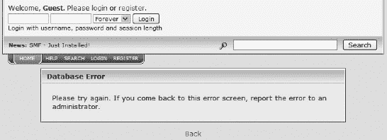
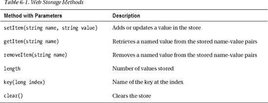

# 六、脚本和应用

许多现代网页都是动态的。它们不仅仅只有句法结构和语义。不同的网站部分可以有不同的行为，并可能对用户交互作出反应。较大的站点需要需要处理的数据库。小程序可以在远程服务器或本地计算机上运行。但是，服务器端语言生成的内容往往是不正确的。尽管内容作者不能影响内容管理系统的硬编码部分，但模板通常提供了包含标准化潜力的手工编码选项。

在本章中，您将了解为什么动态内容的标准化比静态页面的标准化更具挑战性。熟悉最广泛使用的客户端和服务器端脚本语言的基本语法是至关重要的，因为用这些语言编写的小程序通常嵌入到标记中。因此，脚本嵌入可能会影响整个网页的标准符合性。您还将学习如何为脚本提供替代内容。虽然使用 web 编程语言、框架和开发平台来提供 web 应用的服务器端生成的标记的标准符合性在不断提高，但仍然有许多结果页面包含错误的情况。这些开发技术中有许多尚未标准化，但仍在全球范围内使用。因此，其中一些被认为是事实上的标准。许多技术依赖于许多其他技术，有些依赖于标准。本章提供了一些最常见的脚本和应用开发技术的快速概述；然而，这份清单无论如何都不完整。

### 客户端-服务器架构

分布式应用结构在资源或服务提供者(称为*服务器*和服务请求者(称为*客户端*)之间划分任务和/或工作负载，称为*客户端-服务器模型*。客户端和服务器通过 Web 进行通信，以交换数据和执行任务。

*客户端-服务器*架构代表了 web 应用中协作程序之间的关系。例如，联系人表单可以在客户端进行评估，在服务器端进行处理。

下面几节将讨论最流行的客户端和服务器端脚本和编程语言、技术和框架的一般语法和语法约定。请注意，脚本和应用的详细描述超出了本书的范围。从标准化的角度分析 Web 编程。直接嵌入到标记中的脚本对标准的符合性有相当大的影响，所以标准化组织应该关注有效的嵌入。虽然内容管理系统(CMSs)的核心在许多情况下是硬编码的，但是它们的模板可以被用户修改，这使得提供符合标准的代码片段成为可能。

### 脚本和标准实现

一个*脚本*是在运行 [1 ]之前不需要预处理(比如编译)的程序代码。web 文档的小动态组件，如当前日期或交互式内容和行为可以通过*脚本语言*添加。可以在网页内容上执行修改，而无需重新加载页面的新版本。使用*异步 JavaScript 和 XML* ( *Ajax* )可以在网页上添加或发送内容，也不需要重新加载新的页面版本。

客户端脚本有恒定的内容，如果仔细提供，可以产生有效的标记。另一方面，服务器端脚本提供了动态生成的内容。当检查标记错误时，作为该任务基础的程序的源代码相当复杂。此外，由服务器端脚本技术生成的标记中使用的模板在许多情况下是硬编码的，不能被内容作者修改。对拥有成千上万网页的大型网站进行验证和标准化实际上是不可能的。

依赖于存储在数据库中并由服务器端脚本处理的数据的网站的主要问题是较高的复杂性和缺乏完全控制。CMSs 使用的模板并不总是符合标准的。因此，这些模板的所有错误都存在于应用这些模板的数千个站点中。此外，脚本或数据库的单个问题会导致错误消息，而不是网页内容(图 6-1 )。

***图 6-1。**内容被错误信息替换*

在网页上运行的小程序和为生成网页而创建的程序有着巨大的区别。服务器端脚本语言功能强大，提供了静态内容无法实现的特性。例如，小的联系方式没有任何问题。但是，只要合适，就应该使用服务器端脚本。有数据库需求的大型网站肯定应该应用这些技术。此外，服务器端脚本可以提供相同的页眉、页脚等，作为整个 web 站点中相同标记片段的模板，可以很容易地从单个位置进行维护(与静态 web 页面相反)。但是，在不依赖于数据库和动态生成内容的网站上，应该尽量减少服务器端脚本的应用，例如小规模、小册子风格的网站。这是获得和确保完全符合标准的最直接的方法。毫无疑问，Web 上很大一部分无效标记代码是由服务器端脚本语言生成的。在许多情况下，需要额外的实践来获得有效的标记，例如处理在 PHP 会话的 URL[2]中用作参数分隔符的&字符。

### 客户端开发

客户端开发是指那些在客户端运行的 web 程序，一般是 web 浏览器，而不是在服务器端执行(在 web 服务器上)。根据用户输入和其他变量，客户端程序可用于在网页上提供不同的和不断变化的内容。例如，可以根据一天中的当前时间将“动态”问候添加到网页中。

#### Ajax

*Ajax* 是*异步 JavaScript 和 XML* 的缩写。它不是一种编程语言，而是一组相互关联的 web 开发技术，如 HTML、CSS、DOM、JavaScript、XML 和 XSLT。Ajax 可以在客户端创建交互式 web 应用。支持 Ajax 的网站应用可以异步地向服务器发送数据和从服务器检索数据(这就是该名称的由来)。Ajax 适合在异步交换数据时避免整页重载。这种方法确保了当前页面的显示和行为不会受到干扰。尽管名字如此，Ajax 并不需要 XMLJavaScript Object Notation (JSON)，一种轻量级的基于文本的开放标准 [3 ]，经常被用来代替。请求也不一定是异步的。Ajax 通常使用`XMLHttpRequest`对象 [4 ]来检索数据。DOM 和 JavaScript 一起用于动态显示信息，并允许用户与显示的信息进行交互。使用 Ajax 交换的数据可以使用 XSLT 操作。

 **注意**现代浏览器都有内置的`XMLHttpRequest`对象。在 IE7 之前，Internet Explorer 提供了一个名为`ActiveXObject`的对象。

为了演示 Ajax，清单 6-1 中的代码创建了一个链接，用文本文件的内容替换元素的内容。文档对象模型用于操作对象。对象用于让 HTTP 请求加载文件`ajaxdemo.txt`并显示其内容。

***清单 6-1。** Ajax 演示*

``

在文档体中，我们需要一个函数调用和一个带有要替换文本的`div`(清单 6-2 )。

***清单 6-2。**函数调用和`div`原文*

`

  <a href="javascript:replace()">Click here to replace text</a>

  Original text in the markup

`

`http.open()`参数是在后台发送请求的异步参数。

#### 弹性

Adobe Flex 是一个基于 Adobe Flash 技术 [5 ]的软件开发工具包(SDK)，用于跨平台的富互联网应用。用户界面布局和行为由基于 XML 的声明性语言 MXML 描述，而客户端逻辑是使用 ActionScript 3.0 编程语言创建的。

 **注意** ActionScript 是一种面向对象的语言，是 ECMAScript 的一种方言。因此，ActionScript 是 JavaScript 语法和语义的超集。最常见的是，ActionScript 嵌入在 SWF 文件中。

例如，让我们创建一个简单的 RSS 新闻阅读器！首先，我们需要编写一个通用的 XML 声明，然后是一个 MXML 声明(清单 6-3 )。

***清单 6-3。**XML 和 MXML 宣言*

`<?xml version="1.0" ?>
<mx:Application xmlns:mx="http://www.macromedia.com/2003/mxml">

</mx:Application>`

在`mx:Application`中，应该定义我们的`HTTPService`，并为面板准备好自定义控件(DataGrid、TextArea 和 Button)(清单 6-4 )。

***清单 6-4。**自定义控件的`HTTPService`和面板*

`<mx:Application xmlns:mx="http://www.macromedia.com/2003/mxml">
  <mx:HTTPService id="httpRSS" url="http://www.example.com/rss/" resultFormat="object" />
  <mx:Panel id="reader" title="Simple RSS Reader" width="600">` `  </mx:Panel>
</mx:Application>`

现在是时候定义数据网格了。面板的水平尺寸应由`width`参数设定。RSS 文件的每个 item 标签都通过`dataProvider`属性绑定到一个 DataGrid 行。接下来，我们创建一个事件处理程序来显示用户选择的 RSS 条目中描述标签的内容。`entries.selectedIndex`变量用于确定哪个项目被点击了。通过`httpRSS.result.rss.channel.item[entries.selectedIndex].description`检索相应项目的描述。RSS 描述的值被分配给 TextArea 的`htmlText`属性(清单 6-5 )。

***清单 6-5。**为 RSS 阅读器创建数据网格*

`<mx:DataGrid id="entries" width="{reader.width-15}" 
 dataProvider="{httpRSS.result.rss.channel.item}" 
  cellPress= 
  "{body.htmlText=httpRSS.result.rss.channel.item[entries.selectedIndex].description}">
  <mx:columns>
    <mx:Array>
      <mx:DataGridColumn columnName="title" headerText="Title" />
      <mx:DataGridColumn columnName="pubDate" headerText="Date" />
    </mx:Array>
  </mx:columns>
</mx:DataGrid>`

最后，需要使用`mx:TextArea`标签创建一个 TextArea，需要使用`click`事件处理程序创建一个按钮来调用`HTTPService`对象上的`send()`方法(清单 6-6 )。

***清单 6-6。**文本区和按钮*

`<mx:TextArea id="body" editable="false" width="{reader.width-15}" height="400" />
<mx:Button label="Load
RSS channel items" click="{httpRSS.send()}" />`

#### html 5 API

HTML5 提供的不仅仅是新的结构化元素。HTML5 支持许多原本只能通过插件或复杂代码获得的特性 [6 ]。除了标记元素和属性，HTML5 还指定了脚本应用编程接口(API)7。本地绘图 API、本地套接字等消除了与插件相关的问题，例如缺少或禁用对漏洞问题的支持。

一些 HTML5 APIs 在 W3C 标准化下，而另一些在 WHATWG 开发下。下面几节将讨论一些最常用的 API。

##### html 5 画布 API

HTML5 中引入了`canvas`标记元素。它允许 2D 形状和位图图像的动态脚本化呈现。

 **注意**html 5 canvas 没有内置的场景图，这是一种通用的数据结构，用于安排图形场景的逻辑(通常是空间)表示。场景图通常由基于矢量的图形系统使用，包括 SVG。在 SVG 中，所有绘制的形状都作为一个对象存储在场景图或 DOM 中，然后呈现为位图图形。因此，如果 SVG 对象属性发生变化，浏览器可以自动重新渲染场景，这在画布上是不可能的。从这个角度来看，SVG 图形比 HTML5 画布上的形状更高级。

在清单 6-7 中，你可以看到如何在 HTML5 画布上画一个简单的三角形。首先，为不支持 HTML5 画布的旧浏览器声明一个带有替代文本内容的定制大小的画布。第二，一个`script`元素指定了两个变量来缩短代码，一个二维画布，一个祖母绿填充颜色，一个三角形的三个角的坐标，以及带有填充颜色的三角形。

***清单 6-7。**在 HTML5 画布上画画*

`<canvas id="samplecanvas" width="200" height="200">
  A triangle (requires HTML5 Canvas support)
</canvas>
`

IE9+、Firefox 3.0+、Chrome 1.0+、Safari 3.0+和 Opera 9.5+都支持 HTML5 画布。

##### html 5 文件和 DnD API

HTML5 文件 API 在 web 浏览器中提供了易于使用的文件控制。万维网联盟正在对文件 API 进行标准化。Drag & Drop (DnD) API 规范定义了一个基于事件的机制，该机制添加了额外的标记，用于声明可在网页上拖动的元素。网络超文本应用技术工作组 [9 ]正在开发 DnD API。

清单 6-8 中的代码创建了一个界面，通过浏览你计算机上的目录或使用拖放来选择文件。将使用 HTML5 文件 API 检索所选文件的名称、大小和 MIME 类型。

***清单 6-8。**文件 API 演示*

`<h1>Choose file(s)</h1>

` `  <input id="upload" type="file" multiple="multiple">

  You can also drag and drop your files here

<h1>Retrieved file information</h1>
<ul id="fileList">
  <li class="no-items">&lt;no files uploaded yet&gt;</li>
</ul>
`

前一个例子(`
`)中代表拖放区的分割应该使用边框或者背景色来使其可见(清单 6-9 )。

***清单 6-9。**上例的 CSS 规则集*

`#drop {
  border: 2px dashed #f00;` `  padding: 10px;
}`

接下来，创建一个非常简单的拖放示例，其中包含五个单词，可以从一个部门拖到另一个部门，然后再拖回来。首先，声明`div`项，并用`draggable`属性使它们可拖动。然后，将它们放入一个容器`div`，并创建第二个`div`(目标)(清单 6-10 )。

***清单 6-10。**DnD 示例的标记*

`<section>
  <header>
    <h3>Drag the word “DnD” to the other box and back</h3>
  </header>
  

   
My

   
dog

   
is

   
called

   
Bobby

  

</section>`

在文档头中，声明一个`script`元素，并创建在以下情况发生时要调用的函数(清单 6-11 ):

*   项目开始被拖动
*   被拖移的项目位于另一个项目上方
*   拖动完成
*   被拖动的项目被放下

***清单 6-11。**处理拖拽的功能*

``

最后，在文档头或外部文件中声明样式，包括框的布局和颜色(清单 6-12 )。

***清单 6-12。**盒子的样式*

`body {
  width: 800px;
  margin: 100px auto;
}

#leftDiv, #rightDiv {
  float: left;
  width: 200px;
  height: 100px;
  margin: 50px;
  background-color: #bbdeee;
  border: 1px solid #000;
}

.word {
  width: 60px;
  height: 20px;
  margin: 5px;
  text-align: center;
  font-weight: bold;
  background-color: #ff6;
  display: inline-block;
  cursor: move;
}`

Firefox 3.6+和 Chrome 6.0+支持文件 API。Opera 11.5 支持文件 API，但不支持拖放 API。IE9 支持拖放 API，但不支持文件 API。Safari 从 4.0 版开始部分支持文件 API，在 6 版中将完全支持。

##### html 5 表单 API

HTML5 为`input`元素引入了新的属性(`autocomplete`、`autofocus`、`form`、`formaction`、`formenctype`、`formmethod`、`formnovalidate`、`formtarget`、`height`、`list`、`max`、`min`、`multiple`、`pattern`、`placeholder`、`required`、`step`和`width`)，并为`input`元素的`type`属性引入了新的属性值(包括`email`、`url`、】

例如，为一个网站的注册页面创建一个(X)HTML5 表单(清单 6-13 )。

***清单 6-13。**一张登记表*

`<form action="newaccount.php" method="post">
  <fieldset title="Create account">
    

      <label for="mailadd">E-mail address:</label>
**      <input id="mailadd" type="email" required="required" name="mail"**
**       placeholder="email@example.com" />**
    

    

      <label for="passwd1">Password:</label>
      <input id="passwd1" type="password" **required="required"** name="pwd" />
    

    

      <label for="passwd2">Confirm password:</label>
      <input id="passwd2" type="password" **required="required"** name="pwd2" />
    

    

      <label for="website">Website:</label>
      **<input type="url" name="website" placeholder="http://www.example.com" />**
    

    

      <label for="number">Number:</label>
      **<input type="number" name="number" min="0" max="10" placeholder="0-10" />**
    

    

      <label for="range">Range:</label>
      **<input type="range" name="range" min="0" max="10" step="2" />**
    

    

      <input type="submit" value="Create account" />
    

  </fieldset>
</form>`

##### HTML5 地理定位 API

地理位置 API 提供了检索客户端设备的地理位置信息的接口。换句话说，可以在 web 浏览器中使用它来查找用户的当前位置。在用户确认请求之前，不会共享用户的位置。W3C  [11 ]正在对地理定位 API 进行标准化。

清单 6-14 展示了地理定位 API 的应用示例。在示例中，`setOnLoadCallback`函数用于创建地图。`if-then`构造用于检查地理定位 API 是否受支持，获取当前位置，如果成功检索，则在地图上进行标记。如有必要，我们通知用户接受地理定位请求，否则无法确定位置。该位置被硬编码为澳大利亚阿德莱德的花园岛，直到用户启用地理定位为止。在`else`分支，为使用浏览器但没有地理定位支持的用户设置了一个好位置。

***清单 6-14。**检索用户的位置*

`

`

 **提示**此位置仅为近似值。在前面的例子中，我们得到一个标记，它不一定标记用户的确切位置。更复杂的界面，如 Firefox 的“位置感知浏览”测试页面，在地图上方提供了一个半透明的圆圈，而不是一个指向确切位置的标记。

iPhone 上运行的 IE9+、Firefox 3.5+、Chrome 5.0+、Opera 10.6+和 Safari 都支持 HTML5 地理位置 API。

##### html 5 网络存储 API

Web Storage 是一个 API，用于在浏览器(`sessionStorage`)中持久存储键值对数据(类似于 cookies)，以及在会话之间保存的窗口本地存储(`localStorage`)。万维网联盟正在对网络存储 API 进行标准化。

例如，为名称-值对的本地存储创建两个输入字段，以及一个按钮，让用户设置输入的条目(清单 6-15 )。在表中显示名称-值对。创建一个文本字段，用户可以在其中添加要在单击相关按钮后从存储的对中删除的项目。添加可用于清除存储项目的按钮。提供另一个文本字段，可以在其中键入项目名称以检索其值。因为表是由`displayItems`函数创建的，所以该函数应该由`body`元素上的`onload`属性作为`<body onload="displayItems()">`加载。

***清单 6-15。**一个`localStorage`例子*

`<form name="lsform">
  <fieldset title="WebStorage">
    <legend>Local storage of name-value pairs</legend>
    
` `<label>Value:</label>
      <input name="data">
    

    

      <label>Name:</label>
      <input name="name">
    

    

      <input type="button" value="Set item" onclick="setTheItem()">
    

    <table id="pairs"></table>
    

      Enter name to remove item:
      <input name="remove">
      <input type="button" value="Remove item" onclick="removeTheItem()">
      <input type="button" value="Clear items" onclick="clearItems()">
    

    

      Enter name to retrieve value:
      <input name="retrieve">
      <input type="button" value="Get value" onclick="getTheItem()">
    

    
  </fieldset>
</form>`

IE 8+，Firefox 3.5+，Google Chrome 4+ ( `sessionStorage`从 5+开始)，Safari 4+，Opera 10.50+都支持 Web 存储 API。

##### html 5 Web Workers API

Web Workers 是一个 API，可用于独立于任何用户界面脚本在后台执行脚本。因此，用户界面不会受到影响，所有浏览器任务都不会延迟执行。

Web Workers 中的“worker”是指存储在外部文件中的脚本，在后台加载并执行(清单 6-16 )。

***清单 6-16。**创造一个“工人”*

`new Worker("worker.js");`

虽然复杂的 JavaScript 代码可能会使您的浏览器挂起(例如给出“无响应脚本”警告)，但 Web Workers API 可以在浏览器执行事件处理、DOM 操作、查询和处理等任务时避免用户中断。

 **注意**由于 JavaScript 最初被设计为在单线程环境中运行——也就是说，多个脚本不能同时运行——所以 Web Workers 可以被认为是一个为 JavaScript 带来线程的 API。

在我们的示例中，我们创建了一个在后台从 0 数到 10，000 的“worker”。首先，在文档主体中需要两个按钮来开始和停止计数(两个具有唯一标识符的输入元素)，并且需要一个带有标识符的段落(`
`)，结果将显示在该段落中(清单 6-17 )。

***清单 6-17。**Web Worker 示例的标记*

`<h1>Start/Stop the Worker</h1>

  <input id="start" type="button" value="Start">
  <input id="stop" type="button" value="Stop">

` `<h1>The results</h1>

Click Start to start the Worker

`

我们还需要一个用于开始按钮的函数、一个错误事件处理程序和一个用于停止按钮的函数。实际执行计数的函数发生在一个外部`.js`文件中(清单 6-18 )。

***清单 6-18。**`webworker.js`文件*

`onmessage = function (evt) {
  for (var i = evt.data, t = 10000; i < t; i++) {
    postMessage(i);
  };
};`

IE10+、Firefox 3.5+、Chrome 5.0+、Safari 4.0+和 Opera 10.6+支持 Web Workers API。

##### html 5 web socket API

WebSocket API 可用于传输控制协议(TCP)套接字上的双向全双工通信。

万维网联盟正在对 WebSocket API 进行标准化。

在与 web 服务器建立 WebSocket 连接之后，可以使用`onmessage`事件处理程序从服务器检索数据，并通过`send()`方法将数据从客户端发送到服务器。

可以创建一个新的`WebSocket`对象，如清单 6-19 中的所示。

***清单 6-19。**一个新的`WebSocket`对象*

`var Socket = new WebSocket(http://example.com/ws/);`

可选地，协议也可以在 URI 之后指定。

WebSocket 对象有两个只读属性:`Socket.readyState`和`Socket.bufferedAmount`。第一个代表连接状态(`0`为尚未连接，`1`为连接已建立，`2`为关闭握手，`3`为连接关闭或无法建立)。第二个属性给出了使用`send()`方法排队的字节数。

WebSocket API 支持四个事件:`open`(套接字连接建立)`message`(客户端从服务器接收数据)`error`(通信出错)`close`(连接关闭)。它们可以分别由`Socket.onopen`、`Socket.onmessage`、`Socket.onerror`和`Socket.onclose`事件处理程序来处理。

WebSocket 的两种方法分别是`Socket.send()`(`send()`方法通过连接传输数据)和`Socket.close()`(`close()`方法用于终止已有的连接)。

作为一个例子，我们在文档头中创建一个客户机和服务器之间的双向 TCP 套接字(清单 6-20 )。

***清单 6-20。**创建网络套接字*

``

在文档体中，应该调用`myWS()`函数来启动 WebSocket ( 清单 6-21 )。

***清单 6-21。**一个主播启动 WebSocket*

`

  <a href="javascript:myWS()">Start WebSocket</a>

`

客户端程序现在已经准备好了，但是我们还需要一个支持 WebSocket 的服务器来测试它。比如 pywebsocket，可以作为 websocket 独立服务器，也可以作为 Apache HTTP 服务器的 WebSocket 扩展，适合测试 [15 ]。

HTTP 握手之后，TCP 套接字就可以使用了，连接是活动的；服务器和客户端都可以发送数据。

在客户端，WebSocket API 被 Firefox 4+，Google Chrome 4+，Safari 5+，Opera 11+所支持。

##### 离线网络应用

HTML5 中的离线 web 应用功能允许在线应用不间断地工作，即使互联网连接不可用。例如，当用户找不到 Wi-Fi 热点时，可以在他们的网络邮件客户端撰写邮件。

由于浏览器在离线时无法访问网站文件，所以第一步是在一个名为`offline.manifest` ( 清单 6-22 )的文件中指定缓存所需的资源(一个简单的基本文件列表)。

***清单 6-22。**一个`offline.manifest`文件*

`CACHE MANIFEST
index.html
styles.css
main.js`

这个文件应该作为`html`元素上的`manifest`属性的属性值提供(清单 6-23 )。该文件应该使用 MIME 类型`text/cache-manifest`来提供。

***清单 6-23。**使用清单文件*

`<html manifest="offline.manifest">`

将要求用户允许在其计算机上进行缓存。

JavaScript 使用`navigator.onLine`可以确定浏览器的在线/离线状态。

当浏览器离线时，可以使用前面讨论的 Web 存储 API 轻松地将数据存储在本地，也就是说，`sessionStorage`用于在会话期间检索数据，或者`localStorage`用于将值保留更长时间。

Firefox 3.5+、Chrome 1.0+、Safari 4.0+和 Opera 10.6+支持离线 web 应用。

#### Java 小程序

Java 是一种面向对象、结构化、命令式、跨平台的编程语言。Java 最初是由 Sun Microsystems 公司开发的，该公司现在归 Oracle 公司所有。Java 可以在客户端和服务器端的各种环境中使用，包括 applets、servlets、Swing 应用和 JavaServer Pages (JSP)。

Java 小程序是用于执行特定任务的小应用，在网站上以一种称为 Java 字节码的格式提供，可以由 Java 虚拟机(JVM)执行。尽管 Java 小程序可以被 Flash、Curl 或 Microsoft Silverlight 等替代技术所取代，但它们仍然存在于 Web 上。

一个 Java applet 应该由两个`object`元素和自结束参数提供。内物用三叉戟，外物用壁虎。清单 6-24 显示了一个例子。

***清单 6-24。** Java 小程序嵌入有`object`*

`<object classid="java:bookflip.class"
 type="application/x-java-applet"` ` archive="bookflip.jar"
 height="120" width="120">
  <param name="res" value="1" />
  <param name="image1" value="01.jpg" />
  <param name="link1" value="NO" />
  <param name="flip1" value="0" />
  <param name="image2" value="02.jpg" />
  <param name="link2" value="NO" />
  <param name="flip2" value="0" />
  <param name="speed" value="4" />
  <object classid="clsid:8AD9C840-044E-11D1-B3E9-00805F499D93" height="120" width="120" >
    <param name="code" value="bookflip" />
    <param name="archive" value="bookflip.jar" />
    <param name="res" value="1" />
    <param name="image1" value="01.jpg" />
    <param name="link1" value="NO" />
    <param name="flip1" value="0" />
    <param name="image2" value="02.jpg" />
    <param name="link2" value="NO" />
    <param name="flip2" value="0" />
    <param name="speed" value="4" />
  </object>
</object>`

每页只能呈现一次对象。正如你将看到的，Flash 对象也有类似的方法。

#### ECMAScript 和 JavaScript

一种广泛使用的脚本语言是 ECMAScript，它由 Ecma 国际(ECMA-262  [16 ]、ECMA-290  [17 ]、ECMA-327  [18 ]、ECMA-357  [19 ])和国际标准化组织(ISO/IEC 16262  [20 )进行标准化。ECMAScript 的互联网媒体类型为`application/ecmascript`，文件扩展名为`.es`。

ECMAScript 的三种最著名的方言是 JavaScript、JScript 和 ActionScript。第一个是 JavaScript，它是 Web 上主要的客户端脚本语言。数以百万计的网站使用它来增加互动和功能。

 **注意** JavaScript 不要和 Java 混淆。虽然两种语言都有类似 C 的语法，但是 JavaScript 是脚本语言，而 Java 是通用编程语言。JavaScript 有动态类型，Java 有静态类型。JavaScript 是弱类型语言，而 Java 是强类型语言。JavaScript 从人类可读的源代码中加载，而 Java 从编译后的字节码中检索。与基于原型的 JavaScript 对象不同，Java 对象是基于类的。

JScript 是 ECMAScript  [21 ]的微软实现。JScript 的主要实现是 Windows Script 和 JScript .NET，JScript 的典型文件扩展名是`.js`、`.jse`、`.wsf`、`.wsc`，如果嵌入的话还有`.htm`、`.html`和`.asp`。

ActionScript 是一种面向对象的语言，最初由 Macromedia 开发，现归 Adobe Systems 所有。它是在 Adobe Flash 和前面提到的 Adobe Flex 中实现的。外部 ActionScript 文件的典型文件扩展名是`.as`。ActionScript 重用 ECMAScript 的 MIME 类型。

##### 嵌入和加载 JavaScript

应用于整个网页的 JavaScript 代码通常在(X)HTML 头中声明。JavaScript 也可以在 web 文档的主体部分本地使用。在整个网站中使用的 JavaScript 代码是在外部文件中编写的。

一般来说，在网站上使用 JavaScript 有三种方式。下面几节将对它们进行讨论。

###### 从外部文件加载 JavaScript

当同一个脚本应用于多个文档时，使用这种技术。外部 JavaScript 文件的文件扩展名为`.js`。这些文件的字符编码通常是 US-ASCII。用其他编码方案编码的 JavaScript 文件可能会有互操作性问题。虽然 UTF-8 是(X)HTML web 文档的最佳选择，并且可以作为默认字符编码应用于任何开发人员的文本编辑器中，但必须注意尽可能以 US-ASCII 编码 JavaScript 文件(类似于 CSS 文件)。

外部 JavaScript 文件应该只包含 JavaScript 代码(清单 6-25 )。脚本标签也必须避免(清单 6-26 )！

***清单 6-25。**标记中的 JavaScript 代码*

`****`

***清单 6-26。**外部`.js`文件中的相同代码*

`document.write("Nice coding");`

外部 JavaScript 文件可以用`script`元素上的`src`属性加载。 1 清单 6-27 显示了一个例子。

***清单 6-27。**从外部文件加载 JavaScript】*

``

这种嵌入通常用于文档头中加载的脚本和任何太长而不能直接写入标记的脚本。替代样式选择器、字体大小调整器和隐藏层控制器脚本是这种方法的一些例子。

__________

1 在 Web 的早期，`language="javascript"`属性-值对被用在`script`元素上，后来被弃用，取而代之的是`type="text/javascript"`。

###### 内联 JavaScript

JavaScript 也可以作为`script`元素的内容直接写在标记中。假设我们在文档头或外部`.js`文件中有清单 6-28 中所示的 JavaScript 函数和清单 6-29 中的变量。

***清单 6-28。**一个简短的 JavaScript 函数*

`function fourdigits(number) {
  return (number < 1000) ? number + 1900 : number;
}`

***清单 6-29。**变数*

`var now = new Date();
var year = fourdigits(now.getYear());`

该代码提供了当前年份，可用于“动态”版权内容，如清单 6-30 。

***清单 6-30。**内联 JavaScript 示例*

`Copyright © **** John Smith`

这是一个内联 JavaScript 代码。在这种情况下，它将表示版权符号和名称之间的当前年份，如清单 6-31 中的所示。

***清单 6-31。**列表 6-28 、 6-29 、 6-30 、*的结果

`Copyright © 2011 John Smith`

注意，如果 JavaScript 代码由于某种原因无法运行，文档的其他部分仍然会被呈现出来(清单 6-32 )。

***清单 6-32。**禁用 JavaScript 或不支持 JavaScript 的相同代码的结果*

`Copyright © John Smith`

###### 事件处理程序

JavaScript 通常用于根据用户交互(如用鼠标单击元素)来控制文档元素或浏览器窗口。

假设一个网页上有三个图像，当用户点击它们时，它们会修改层`main`的字体大小。清单 6-33 显示了一个可能的解决方案。

***清单 6-33。**操作字体大小的功能*

`function normal() {
  var esize = document.getElementById('main').style;
  esize.fontSize = "1.1em";
}`  `function larger() {
  var esize = document.getElementById('main').style;
  esize.fontSize  = "1.4em";
}

function huge() {
  var esize = document.getElementById('main').style;
  esize.fontSize = "1.8em";
}`

这三个函数既可以写在文档的`script`标签中，也可以写在外部文件`font.js`中。在后一种情况下，它们可以用`script`元素的`src`属性加载，如前面在清单 6-27 中所讨论的(文件路径和名称可以任意修改)。

现在可以用`onclick`属性加载适当的事件处理函数了(清单 6-34 )。

***清单 6-34。**当用户点击*时加载适当函数的事件处理程序

`<a href="#" **onclick="javascript:normal();"**>
  
</a>
<a href="#" **onclick="javascript:larger();"**>
  
</a>
<a href="#" **onclick="javascript:huge();"**>
  
</a>`

哪个功能将被运行取决于用户点击哪个图像链接。

###### 确定 JavaScript 支持

JavaScript 支持可以很容易地由具有替代内容的脚本来确定，如清单 6-35 中的所示。

***清单 6-35。**带有替代内容的 JavaScript】*

`
**<noscript>JavaScript is NOT enabled!</noscript>**`

不支持 JavaScript 的浏览器会显示`noscript`元素的内容。

#### 银光

Silverlight 是微软公司为开发富互联网应用而创建的免费应用框架。Silverlight 的运行时环境作为一个 web 浏览器插件提供。Silverlight 提供了许多类似于 Adobe Flash 的功能，例如动画、绘图对象、反射效果、字形等等。

Silverlight 使用可扩展应用标记语言(XAML ),而不是可缩放矢量图形(SVG)。XAML 是一种声明性的、基于 XML 的用户界面标记语言，由微软开发，在. NET 中广泛使用

与 Flash 类似，Silverlight 的一个常见嵌入选项是使用`object`标签(清单 6-36 )。

***清单 6-36。** Silverlight 嵌入替代内容(确定支持)*

`<object id="SilverlightPlugin1" width="300" height="300" 
 data="data:application/x-silverlight-2," 
 type="application/x-silverlight-2" >
  <param name="source" value="SilverlightApplication1.xap" />
  <a href="http://go.microsoft.com/fwlink/?LinkID=149156&v=4.0.60310.0">
    
  </a>
</object>`

Silverlight 不仅可以在您的文本编辑器中编写，还可以在 Microsoft Visual Studio 软件开发平台中编写，这使得创建与源代码同时显示的图形界面更加容易。

### 服务器端开发

虽然静态内容对于许多网站组件来说已经足够了，但是高级网站功能，如 web 应用、内容管理、在线银行、表单提交、数据库管理等等，都需要服务器端编程。

 **注**客户端和服务器端编程的主要区别在于，客户端脚本由浏览器下载、解释和执行，而服务器端脚本和应用运行在服务器上。

 **提示**与客户端技术相反，客户端技术的支持要么嵌入在大多数浏览器中(例如 JavaScript)，要么可以通过安装免费插件轻松设置(例如 SilverLight)，而服务器端技术的支持应该由托管服务提供商提供。虽然大多数托管服务都支持 PHP 和 MySQL 等广泛采用的技术，但强烈建议您在选择服务和支付服务费用之前向提供商咨询特殊技术的支持，因为托管公司通常会拒绝安装任何不包含在其软件包中或不受其支持的软件组件(例如，FFMPEG、ionCube PHP Loader、Apache Ant、Ivy、JTA、JAXP)。有些技术依赖于其他技术，可能需要安装某些软件组件。

有各种各样的服务器端脚本和编程语言用于创建服务器端应用。下面几节描述了一些最广泛采用的方法。

#### cold fusion

ColdFusion 是 Adobe  [23 ]提供的应用服务器，用于处理 ColdFusion 标记语言(CFML)。CFML 是一种脚本语言，使用与 HTML 结构相似的标签(这也是得名的原因)[24；它有一个类似于 PHP 的功能。除了 Adobe ColdFusion，CFML 还有几个实现，例如。NET 框架、Java 虚拟机和谷歌应用引擎。由于其可扩展性，ColdFusion 不仅是桌面环境的理想选择，也是日益流行的移动 web 应用的理想选择。

与 ColdFusion 竞争的最重要的技术是 BlueDragon  [25 ]、Coral Web Builder  [26 ]、IgniteFusion  [27 ]、Railo  [28 ]和 SmithProject  [29 。

#### Java

在前面关于 Java 小程序的章节中已经提到了 Java 编程语言。不过服务器端也用 Java。

JavaServer Pages (JSP)是一种用于动态生成网页的 Java 技术。JSP 的语法结合了 scriptlet 元素和标记(通常是 HTML 或 XML)  [30 。scriptlet 元素的内容是可能与标记混合在一起的 Java 代码。

Java 平台企业版(Java EE)是一个流行的 Java 服务器端编程平台。平台和相关的 API 在单独的规范 [31 、 32 中定义。

WebObjects 是由 Apple 开发的用于 Mac OS X 的 Java web 应用服务器和 web 应用框架。WebObjects 由苹果规范 [33 、 34 、 35 描述。

#### The。NET 框架

微软。NET 是一个流行的软件框架，拥有广泛的库 [36 ]。那个。NET 框架支持多种编程语言(C#、J#、VB。NET 等等)。这些语言中的任何一种都可以使用用其他语言编写的代码，这提供了高度的互操作性。框架架构的一个基础部分是名为*公共语言运行时(CLR)* 的应用虚拟机，它是微软对*公共语言基础设施(CLI)* 的实现。CLI 是 ECMA 标准(ECMA 335[37)。

的一些应用。NET 框架，如 ADO.NET、ASP.NET 和 Windows 窗体，不是前面提到的标准的一部分。

##### ASP.NET

Active Server Pages 通常被称为 ASP 或 ASP Classic，是由微软开发的用于创建交互式动态网页的 web 应用框架。它已经被 ASP.NET 取代，后者为网络应用和服务提供了强大的功能。典型的文件扩展名是 ASP 的`.asp`和 ASP.NET 文件的`.aspx`。

正如你在清单 6-37 中看到的，通过用`<%`和`%>`分隔脚本，一个 ASP 脚本可以嵌入到网页的文档体中。

***清单 6-37。** ASP 脚本中的标记*

`<!DOCTYPE html>
<html>
  <head>
    <title>Simple ASP embedding example</title>` `    <meta charset="UTF-8">
  </head>
  <body>
    **<%**
    **response.write("Hello, World!")**
    **%>**
  </body>
</html>`

在 2011 年在 Visual Studio 和 ASP.NET 中引入 HTML5 支持之前，ASP.NET 在大多数情况下都会生成无错误的 XHTML 标记。然而，由于 ASP.NET 不修改静态文本和非服务器标记元素，最终的标记不一定符合 XHTML 1.0 Strict 标准。根据微软的说法，一些提供可选功能的标记控件，尤其是那些具有指定其客户端行为的目标属性的控件(`AdRotator`、`BulletedList`、`HyperLink`、`HyperLinkColumn`、`ImageMap`、`MenuItem`、`TreeNode`)，可能会导致标记代码不符合标准 [39 。

##### C#

一种流行的编程语言，常用于。NET 是 C#(读作*见夏普*)，已经被 ECMA  [40 和 ISO  [41 ， 42 标准化。C#是一种多参数编程语言，它是声明性的、泛型的、函数式的和命令式的，并且具有强类型。C#应用了面向对象(基于类)和面向组件的原则。

#### 珠

Perl 是一种高级的、解释的、通用的动态编程语言。该语言的规范可在 Perl.org 获得。在 20 世纪 90 年代后期，Perl 因为其解析能力而成为流行的 CGI 脚本语言。Perl 的核心语法总结在“Perl 风格指南”44 中。Perl 的一个令人印象深刻的文本处理特性是，如果有足够的内存，它可以处理任意长度的文本文件。

#### PHP

*PHP:超文本预处理器*是最流行的开源服务器端脚本语言之一。它是一种跨平台的通用语言，最初是为生成动态网页而设计的。这些年来，一些程序员试图引入 PHP 的“标准化”最佳实践例如， [45 、 46 、 47 、 48 ]，但都没有获得官方地位。PHP 的主要规范由 PHP 小组 [49 ]维护，它被认为是该语言事实上的*标准，因为没有正式的规范。*

PHP 是 ASP.NET 等竞争对手的广泛使用的、免费的、高效的替代品。

##### 嵌入和加载 PHP

虽然一些 PHP 代码嵌入在(X)HTML 文档中，并与标记元素混合在一起，但复杂的 PHP 应用是在外部文件中提供的。

###### PHP 中的标记

PHP 代码通常由`<?php`和`?>`或者``分隔。不可移植的短标签`<?`和`<?=`以及 ASP 风格的标签如`<%`和`<%=`不应该被使用。PHP 解析器只解析分隔符内的代码。在 XML 文档中(XHTML 也是如此)，第一种嵌入方法提供了格式良好的 XML 处理指令。因为它们不是文档中字符数据的一部分，所以标记和 PHP 代码的组合有可能在 PHP 解析之前在服务器上提供有效的标记。

在标记中嵌入 PHP 的最简单的例子是一个“Hello World”脚本，比如`hello.php` ( 清单 6-38 )。

***清单 6-38。**PHP 中的“Hello World”*

`<!DOCTYPE html>
<html xml:lang="en" lang="en">
  <head>
    <title>Hello World in PHP</title>
    <meta charset="UTF-8" />
  </head>
  <body>
**    <?php echo '
Hello World
'; ?>**
  </body>
</html>`

根据适当的服务器配置，PHP 代码应该被解析，清单 6-39 中的输出将被发送到浏览器。

***清单 6-39。**解析 PHP 后的输出*

`<!DOCTYPE html>
<html xml:lang="en" lang="en">
  <head>
    <title>Hello World in PHP</title>
    <meta charset="UTF-8" />
  </head>
  <body>
    **
Hello World!
**
  </body>
</html>`

结果标记验证为 HTML5。注意，为了便于理解，省略了结构元件和附加内容。

###### 外部文件中的 PHP

外部 PHP 文件的典型文件扩展名有`.php`、`.phtml`、`.php5`和`.phps`。外部 PHP 文件通常在开始和结束分隔符之间包含 PHP 代码。换句话说，它们以`<?php`开始，以`?>`结束。然而，许多 PHP 文件，例如用于设置的文件，不一定有结束分隔符。

`include`命令可以用来将指定的外部 PHP 文件的内容插入到标记中(清单 6-40 )。

***清单 6-40。**嵌入 PHP 文件*

`<?php include("copyright.php"); ?>`

外部 PHP 文件可能包含 PHP 代码、标记或两者的组合。

 **提示**通常的做法是收集常见的(经常重复的)网页内容的标记片段，例如菜单和法律信息，并从外部 PHP 文件中嵌入它们。这种方法消除了站点常见脚本需求的冗余。

#### Python

Python 是一种通用的高级编程语言 [50 ]。与其他动态语言类似，Python 也经常被用作脚本语言。Python 支持多种编程范式。虽然 Python 主要是面向对象的，但也涉及到函数式编程风格。该语言的功能可以通过第三方工具进行扩展；例如，Python 代码可以作为独立的可执行文件提供。Python 解释器可用于各种操作系统，这使得 Python 成为一种跨平台语言。

#### 红宝石

Ruby 是一种通用的、动态的、反射式的面向对象编程语言。最常见的 Ruby 实现之一是名为 *Ruby on Rails* 的开源 web 应用框架。Ruby 的主要文档包括 Ruby 核心参考 [51 ]、Ruby 标准库参考 [52 ]、Ruby C API 参考 [53 ]以及关于 Rails 可搜索 API 的文档 [54 。

#### SSJS

尽管 JavaScript 主要用于客户端，但它也有服务器端的实现。服务器端 JavaScript (SSJS)于 1996 年首次在 Netscape Enterprise Server 2.0 和 Netscape LiveWire 中实现。SSJS 开发的通用规范由 CommonJS 社区提供。服务器端 JavaScript Google Group 致力于创建跨平台的 SSJS 标准 API[56]。

### 客户端和服务器端技术的结合

并非所有的编程环境都是纯粹的客户端或服务器端技术。例如， *Google Web Toolkit* 有用 Java 编写 JavaScript 前端应用的工具。使用开发工具和框架 *Pyjamas* ，可以用 Python 开发 Ajax 应用和富互联网应用。一个用于开发具有客户端功能和服务器端处理的富互联网应用的开源平台是 *Tersus* 。

### 数据库技术

很大一部分服务器端应用和服务依赖于存储在数据库中的数据。Web 上最常用的数据库之一是跨平台关系数据库管理系统 *MySQL*  [57 ]。它被认为是事实上的 ?? 标准，也被世界上流量最大的网站所使用。虽然它非常受欢迎，但 Ruby 和 Python 等语言经常应用 MySQL 以外的数据库服务器。Web 上其他一些常用的数据库技术有 Apache Derby  [58 ]、IBM DB2  [59 ]、Firebird  [60 ]、Microsoft SQL Server[61]、Oracle  [62 ]、PostgreSQL  [63 ]、SQLite  [64 ]和 Sybase 

### 脚本的替代内容和回退机制

在网站标准化中，为脚本提供替代内容以及为不支持脚本的用户代理设计 web 文档是至关重要的。您可以通过使用`noscript`元素来提供替代内容。不执行脚本，只有当浏览器配置消除了脚本或者在极少数情况下不支持`script`元素中使用的脚本语言时，用户代理才会呈现`noscript`元素的内容。没有客户端脚本支持的浏览器必须呈现`noscript`元素的内容。

例如，如果动态创建的数据是由`script`元素提供的，那么如果不支持脚本，可以使用到资源的直接链接([清单 6-41 )。

***清单 6-41。**有用的候补内容*

`<noscript>
  
<a href="http://example.com/news/">Latest News</a>

</noscript>`

有一种做法是注释掉标记中编写的脚本，以消除不能处理`script`元素的浏览器呈现元素内容。高级渲染引擎认为应该执行注释中的脚本。如果使用外部脚本文件，这可以消除注释的需要。

正如你在本章前面学到的，当 JavaScript 不被支持时，一个正确嵌入的脚本不会破坏页面布局或内容流。尽管如此，这种方法通常不能提供与脚本相同的功能或行为(提供的信息应该是相似的)。替代内容或回退机制对于 JavaScript 代码的重要性可以通过“动态”菜单得到最好的证明，这种菜单不应该只依赖于 JavaScript，因为如果 JavaScript 被禁用或脚本无法加载，站点的功能将会丢失。

让我们假设你有一个特殊的帮助屏幕，包含在一个层中，默认情况下是隐藏的(清单 6-42 )，只有当用户点击菜单“帮助”时才显示。

***清单 6-42。**一帮`div`默认隐藏*

`#help {  
  display: none;
}`

由于帮助是使用 JavaScript 显示的(清单 6-43 )，如果 JavaScript 被禁用或不被支持，帮助将不可用。

***清单 6-43。**显示隐藏的`div`功能*

`function display_help() {
  document.getElementById("help").style.display = 'block';
}`

一个好的回退机制是提供一个传统的超链接——看起来与调用 JavaScript 代码的链接相同，该代码在页面上方显示特殊的帮助层——作为替代内容(清单 6-44 )。如果由于缺乏 JavaScript 支持而无法显示该层，该链接将打开另一个 web 文档，其中包含 Help `div`将提供的相同内容。虽然“帮助屏幕”和帮助文档的视觉外观不同，但内容是相同的。他们中的一个总是可用的。

***清单 6-44。**带有回退机制的高级菜单项*

`<li>
  
  <noscript>
**    <a href="http://example.com/help/" title="Guide and access keys" accesskey="h"** 
      **tabindex="22">Help</a>**
  </noscript>
</li>`

### 总结

在本章中，您学习了用于创建脚本、小程序和 web 应用的客户端和服务器端脚本和编程语言。每天使用这些技术是不可避免的，现在您已经知道它们在 web 应用和服务开发中是至关重要的。然而，它们中的许多是特定于供应商的，并且还没有被标准化。您还知道很大一部分不正确的标记是由服务器端应用生成的，尽管越来越多的应用提供符合标准的 web 文档。

在下一章中，你将学习新兴的语义网技术和机器可读的元数据注释。

### 参考文献

1。什么是脚本？在:脚本和 Ajax。万维网联盟。[www.w3.org/standards/webdesign/script](http://www.w3.org/standards/webdesign/script)2011 年 1 月 24 日访问

2。Dorward D (2005)的&符号，PHP 会话和有效的 HTML。万维网联盟。[www.w3.org/QA/2005/04/php-session](http://www.w3.org/QA/2005/04/php-session)2011 年 1 月 24 日访问

3。crock Ford D(2006)JavaScript 对象符号(json)的应用/json 媒体类型。互联网协会。[`tools.ietf.org/html/rfc4627`](http://tools.ietf.org/html/rfc4627)2011 年 8 月 20 日访问

4。范·凯斯特伦 A (2010) XMLHttpRequest。万维网联盟。[www.w3.org/TR/XMLHttpRequest/](http://www.w3.org/TR/XMLHttpRequest/)2011 年 8 月 20 日访问

5。Adobe(2011)Adobe Flex–构建富有表现力的跨平台移动、web 和桌面应用。Adobe 系统公司[www.adobe.com/products/flex/](http://www.adobe.com/products/flex/)。2011 年 8 月 22 日访问

6。吕贝尔斯 P，艾伯斯 B，萨利姆 F (2010)亲 HTML5 编程-强大的 API，更丰富的互联网应用开发。纽约媒体有限责任公司

7 .。van Kesteren A，Pieters S (2011 年)原料药。In: HTML5 与 HTML4 的区别。万维网联盟。[`dev.w3.org/html5/html4-differences/#apis`](http://dev.w3.org/html5/html4-differences/#apis)2011 年 8 月 22 日访问

8。阮冈纳赞 A，西京 J (2010)文件 API。万维网联盟。[www.w3.org/TR/FileAPI/](http://www.w3.org/TR/FileAPI/)2011 年 8 月 22 日访问

9。希克森 I (ed) (2011)拖放。在:HTML。网络超文本应用技术工作组。[www . whatwg . org/specs/we b-apps/current-work/multipage/dnd . html](http://www.whatwg.org/specs/web-apps/current-work/multipage/dnd.html)。2011 年 8 月 22 日访问

10。希克森一号(2011)表格。在:HTML。网络超文本应用技术工作组。[www . whatwg . org/specs/we b-apps/current-work/multipage/forms . html](http://www.whatwg.org/specs/web-apps/current-work/multipage/forms.html)。2011 年 8 月 23 日访问

11。Popescu A (2010)地理定位 API 规范。万维网联盟。[www.w3.org/TR/geolocation-API/](http://www.w3.org/TR/geolocation-API/)2011 年 8 月 20 日访问

12。Mozilla (2011)位置感知浏览。[www.mozilla.com/en/firefox/geolocation/](http://www.mozilla.com/en/firefox/geolocation/)Mozilla 公司。2011 年 8 月 21 日访问

13。希克森 I (2011)网络存储。万维网联盟。[www.w3.org/TR/webstorage/](http://www.w3.org/TR/webstorage/)2011 年 8 月 20 日访问

14。希克森一世(2011)的 WebSocket API。万维网联盟。[www.w3.org/TR/websockets/](http://www.w3.org/TR/websockets/)2011 年 8 月 20 日访问

15。Google (2011) pywebsocket -用于测试 Apache HTTP 服务器的 websocket 服务器和扩展。谷歌公司[`code.google.com/p/pywebsocket/`](http://code.google.com/p/pywebsocket/)。2011 年 8 月 23 日访问

16。ECMA(2009)ECMA 262 标准，第五版。Ecma 国际。[www . ECMA-international . org/publications/files/ECMA-ST/ECMA-262 . pdf](http://www.ecma-international.org/publications/files/ECMA-ST/ECMA-262.pdf)。2011 年 1 月 21 日访问

17。ECMA (1999) ECMAScript 组件规范。ECMA-290 标准。ECMA 国际。[www . ECMA-international . org/publications/files/ECMA-ST/ECMA-290。PDF](http://www.ecma-international.org/publications/files/ECMA-ST/ECMA-290.PDF) 。2011 年 8 月 23 日访问

18。ECMA (2001) ECMAScript 第三版压缩概要。ECMA-327 标准。ECMA 国际。[www . Ecma-international . org/publications/files/ECMA-ST/Ecma-327 . pdf](http://www.ecma-international.org/publications/files/ECMA-ST/Ecma-327.pdf)。2011 年 8 月 23 日访问

19。ECMA (2005) ECMAScript for XML (E4X)规范，第二版。ECMA-357 标准。ECMA 国际。[www . Ecma-international . org/publications/files/ECMA-ST/Ecma-357 . pdf](http://www.ecma-international.org/publications/files/ECMA-ST/Ecma-357.pdf)。2011 年 8 月 23 日访问

20。国际标准化组织(2002 年)国际标准化组织/IEC 16262:2002。国际标准化组织。[www.iso.org/iso/catalogue_detail.htm?csnumber=33835](http://www.iso.org/iso/catalogue_detail.htm?csnumber=33835)2011 年 1 月 21 日访问

21。微软(2011)JScript(ecmascript 3)-Windows 脚本 5.8。微软公司。[`msdn . Microsoft . com/en-us/library/hbxc2t 98% 28v = vs . 85% 29 . aspx`](http://msdn.microsoft.com/en-us/library/hbxc2t98%28v=VS.85%29.aspx)。2011 年 8 月 23 日访问

22。微软(2011) Silverlight。微软公司。[www.silverlight.net](http://www.silverlight.net)2011 年 8 月 23 日访问

23。Adobe (2011) Adobe ColdFusion 9 系列。Adobe 系统公司[www.adobe.com/products/coldfusion-family.html](http://www.adobe.com/products/coldfusion-family.html)。2011 年 8 月 23 日访问

24。Brooks-Bilson R (2009)核心 CFML 标记。CFML 咨询委员会。[www.opencfml.org/display/cfmladvisory/Core+CFML+Tags](http://www.opencfml.org/display/cfmladvisory/Core+CFML+Tags)2011 年 8 月 23 日访问

25。新亚特兰大(2009)从 ColdFusion 升级。在:蓝龙 7.1 用户指南。新亚特兰大通信有限责任公司。[www . newatlanta . com/products/bluedrong/self _ help/docs/7 _ 1/bluedrong _ 71 _ User _ guide . pdf](http://www.newatlanta.com/products/bluedragon/self_help/docs/7_1/BlueDragon_71_User_Guide.pdf)。2011 年 8 月 24 日访问

26。rave7 (2011)珊瑚网建设者。rave7。[www.pcaonline.com/index.cfm?DocID=10082&fkb = y](http://www.pcaonline.com/index.cfm?DocID=10082&fkb=y)2011 年 8 月 24 日访问

27。FindMySoft (ed) (2011)点火燃料 CFML 发动机。[www . findmysoft . com/scripts/ignite fusion-CFML-引擎-下载. html](http://www.findmysoft.com/scripts/IgniteFusion-CFML-engine-download.html) 。2011 年 8 月 24 日访问

28。Railo (2011) Railo Technologies。Railo 技术有限公司。www.getrailo.com[。2011 年 8 月 24 日访问](http://www.getrailo.com)

29。Placona M (2011)又一个免费的 ColdFusion 引擎。马科斯·普拉科纳博客。[www . PLA ConA . co . uk/52/cold fusion/yet-another-free-cold fusion-engine/](http://www.placona.co.uk/52/coldfusion/yet-another-free-coldfusion-engine/)。2011 年 8 月 24 日访问

三十岁。Sun (2001) JAVASERVER PAGES (JSP)语法版本 1.2。太阳微系统公司[`java.sun.com/products/jsp/syntax/1.2/card12.pdf`](http://java.sun.com/products/jsp/syntax/1.2/card12.pdf)。2011 年 8 月 23 日访问

31。Oracle (2011)您的第一杯:JavaTM EE 平台简介。甲骨文公司。[`download . Oracle . com/javaee/6/first cup/doc/first cup . pdf`](http://download.oracle.com/javaee/6/firstcup/doc/firstcup.pdf)。2011 年 8 月 23 日访问

32。Oracle (2011) Java 平台企业版 6–API 规范。甲骨文公司。[`download.oracle.com/javaee/6/api/`](http://download.oracle.com/javaee/6/api/)2011 年 8 月 23 日访问

33。苹果(2007) WebObjects 概述。苹果公司[`developer . apple . com/legacy/MAC/library/documentation/web objects/web objects _ Overview/web objects _ Overview . pdf`](http://developer.apple.com/legacy/mac/library/documentation/WebObjects/WebObjects_Overview/WebObjects_Overview.pdf)。2011 年 8 月 23 日访问

34。苹果(2007) WebObjects Web 应用编程指南。苹果公司[`developer . apple . com/legacy/MAC/library/documentation/Web objects/Web _ Applications/Web _ Applications . pdf`](http://developer.apple.com/legacy/mac/library/documentation/WebObjects/Web_Applications/Web_Applications.pdf)。2011 年 8 月 23 日访问

35。苹果(2007) WebObjects 企业对象编程指南。苹果公司[`developer . apple . com/legacy/MAC/library/documentation/web Objects/Enterprise _ Objects/Enterprise Objects . pdf`](http://developer.apple.com/legacy/mac/library/documentation/WebObjects/Enterprise_Objects/EnterpriseObjects.pdf)。2011 年 8 月 23 日访问

36。微软(2011)微软。NET 框架。微软公司。[www.microsoft.com/net](http://www.microsoft.com/net)2011 年 8 月 24 日访问

37。ECMA (2010)公共语言基础设施(CLI)，第五版。ECMA-335 标准。ECMA 国际。[www . ECMA-international . org/publications/files/ECMA-ST/ECMA-335 . pdf](http://www.ecma-international.org/publications/files/ECMA-ST/ECMA-335.pdf)。2011 年 8 月 24 日访问

38。微软(2011)微软 ASP.NET 官方网站。微软公司。[www.asp.net](http://www.asp.net)2011 年 8 月 23 日访问

39。Visual Studio 和 ASP.NET 中的微软(2010) XHTML 标准。微软公司。[`msdn.microsoft.com/en-us/library/exc57y7e.aspx`](http://msdn.microsoft.com/en-us/library/exc57y7e.aspx)2011 年 8 月 23 日访问

40。ECMA (2006) C#语言规范，第四版。ECMA-334 标准。ECMA 国际。[www . Ecma-international . org/publications/files/ECMA-ST/Ecma-334 . pdf](http://www.ecma-international.org/publications/files/ECMA-ST/Ecma-334.pdf)。2011 年 8 月 24 日访问

41。ISO (2006)信息技术–编程语言–c#。ISO/IEC 23270:2006。国际标准化组织。[www . iso . org/iso/iso _ catalogue/catalogue _ ics/catalogue _ detail _ ics . htm？csnumber=42926](http://www.iso.org/iso/iso_catalogue/catalogue_ics/catalogue_detail_ics.htm?csnumber=42926) 。2011 年 8 月 24 日访问

42。ISO (2006)信息技术-公共语言基础设施(CLI)分区 I 至 VI。ISO/IEC 23271:2006。国际标准化组织。[www . iso . org/iso/iso _ catalogue/catalogue _ ics/catalogue _ detail _ ics . htm？csnumber=42927](http://www.iso.org/iso/iso_catalogue/catalogue_ics/catalogue_detail_ics.htm?csnumber=42927) 。2011 年 8 月 24 日访问

43。丛龙飞(编辑)(2011) Perl 5 版本 14.1 文档-完整版。Perl 编程语言的官方文档。Perl5 搬运工。[`perldoc.perl.org/perldoc.tar.gz`](http://perldoc.perl.org/perldoc.tar.gz)2011 年 8 月 23 日访问

44。丛龙飞(编辑)(2011) Perl 版本 5.14.1 文档-Perl 风格指南。[`perldoc.perl.org/perlstyle.pdf`](http://perldoc.perl.org/perlstyle.pdf)2011 年 8 月 24 日访问

45。Hoff T，Kristiansen F (2003) PHP 编码标准。托德·霍夫，弗雷德里克·克里斯蒂安森。[www.dagbladet.no/development/phpcodingstandard/](http://www.dagbladet.no/development/phpcodingstandard/)2011 年 8 月 24 日访问

46。谷歌(2011) PHP 标准工作组。谷歌公司[`groups.google.com/group/php-standards`](http://groups.google.com/group/php-standards)。2011 年 8 月 24 日访问

47。Icontem (2011) PHP 标准讨论组向世界开放- PHP 类。Icontem。[www . PHP classes . org/blog/post/96-PHP-standards-discussion-group-opens-to-the-world . html](http://www.phpclasses.org/blog/post/96-PHP-standards-discussion-group-opens-to-the-world.html)。2011 年 8 月 24 日访问

48。Donat J (ed) (2011) PHP 标准。[`phpstandards.net`](http://phpstandards.net)2011 年 8 月 24 日访问

49。奥尔森·P(编辑)、阿舒尔·M、贝兹·F、多夫加尔·A、洛佩斯·N、马格努松·H、里克特·G、塞圭·D、弗拉纳·J 等人(2011 年)PHP 手册。PHP 文档组。[www.php.net/manual/en/](http://www.php.net/manual/en/)2011 年 8 月 24 日访问

50。PSF (2011) Python 编程语言-官方网站。Python 软件基础。[www.python.org](http://www.python.org)2011 年 8 月 23 日访问

51。Britt J，Neurogami (2010) Ruby 核心参考。詹姆斯·布里特，神经游戏玩家。[www.ruby-doc.org/core/](http://www.ruby-doc.org/core/)2011 年 8 月 24 日访问

52。Britt J，Neurogami (2011) Ruby 标准库参考。詹姆斯·布里特，神经游戏玩家。[www.ruby-doc.org/stdlib/](http://www.ruby-doc.org/stdlib/)2011 年 8 月 24 日访问

53。Britt J，Neurogami (2006) Ruby C API 参考。詹姆斯·布里特，神经游戏玩家。[www.ruby-doc.org/doxygen/current/](http://www.ruby-doc.org/doxygen/current/)2011 年 8 月 24 日访问

54。科列斯尼科夫 V (2009) Rails 可搜索 API 文档。弗拉基米尔·科列斯尼科夫。[`railsapi.com`](http://railsapi.com)2011 年 8 月 24 日访问

55。丹古尔 K *等* (2009) CommonJS: JavaScript 标准库。CommonJS 社区。[www.commonjs.org](http://www.commonjs.org)2011 年 8 月 24 日访问

56。谷歌(2011)CommonJS 谷歌集团。谷歌公司[`groups.google.com/group/commonjs`](http://groups.google.com/group/commonjs)。2011 年 8 月 24 日访问

57。Oracle (2010) MySQL:世界上最受欢迎的开源数据库。甲骨文公司。[www.mysql.com](http://www.mysql.com)2011 年 8 月 24 日访问

58。ASF (2011)阿帕奇德比。Apache 软件基金会。[`db.apache.org/derby/`](http://db.apache.org/derby/)2011 年 8 月 24 日访问

59。IBM (2011) DB2 数据库软件。国际商业机器。[www-01.ibm.com/software/data/db2/](http://www-01.ibm.com/software/data/db2/)2011 年 8 月 24 日访问

60。火鸟项目(2011)火鸟:真正的开源关系数据库，适用于 Windows、Linux、Mac OS X 等。火鸟基金会有限公司。[www.firebirdsql.org](http://www.firebirdsql.org)2011 年 8 月 24 日访问

61。微软(2011)微软 SQL Server。微软公司。[www.microsoft.com/sqlserver/en/us/default.aspx](http://www.microsoft.com/sqlserver/en/us/default.aspx)2011 年 8 月 24 日访问

62。甲骨文(2011)甲骨文数据库。甲骨文公司。[www.oracle.com](http://www.oracle.com)2011 年 8 月 24 日访问

63。PostgreSQL GDG (2011) PostgreSQL:世界上最先进的开源数据库。PostgreSQL 全球开发小组。[www.postgresql.org](http://www.postgresql.org)2011 年 8 月 24 日访问

64。Hipp DR (2011) SQLite。[`sqlite.org`](http://sqlite.org)2011 年 8 月 24 日访问

65。Sybase (2011)数据库管理。赛贝斯公司[www.sybase.com/products/databasemanagement](http://www.sybase.com/products/databasemanagement)。2011 年 8 月 24 日访问