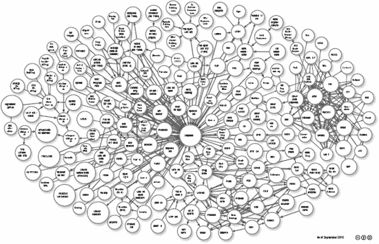
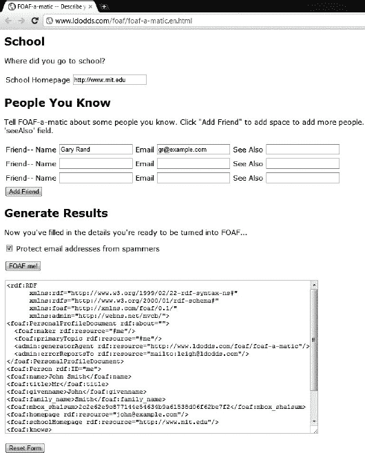
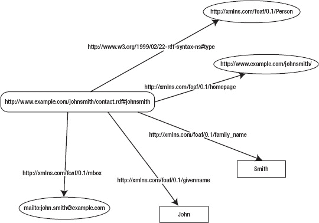
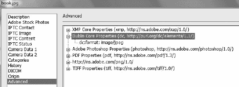
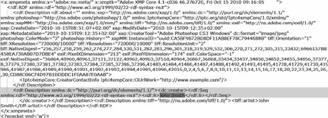

# 七、元数据和语义网

web 文档的基本结构提供了所需的外观和功能。然而，默认情况下，内容是人类可读的。您可以使用额外的技术为 web 文档提供意义，使它们成为机器可读的和语义 Web 的一部分。最近为新兴的语义网技术引入了许多术语，但是由于缺乏正式的定义，许多定义有些模糊。例如，由于自动执行动作的潜力，一个新的网络时代已经开始，它被称为 Web 2.0。在在线社区门户网站上流行起来之后，语义网的一些特性以及个性化现在被称为 Web 3.0。有大量的元数据可供选择，还有微格式和各种注释，可以极大地扩展 web 文档的可能性。它们还可以大大提高网络搜索的效率。RDF 应该被用来增加网络的结构，改变传统的搜索引擎使用暴力的方法。

在本章中，你将学习机器可读的元数据注释和语义上有意义的属性。您还将熟悉资源描述框架，这是语义 Web 技术背后的基本标准。阅读完本章后，您不仅能够应用各种元数据注释，还能够创建新的词汇、方案和本体，包括但不限于以下内容:

*   *标记中的通用元数据*:常规`meta`标签
*   *微格式*:作为标记元素属性值提供的元数据
*   *微数据*:html 5 中通用元数据嵌入的元数据注释
*   RDF:语义网数据模型的标准化框架
*   OWL:一种用于描述和共享 web 本体的知识表示语言，它将知识正式表示为一个领域中的一组概念以及这些概念之间的关系
*   *FOAF 和 DOAC* :机器可读的人类本体和他们的专业能力
*   *XMP，Rich Snippets，SearchMonkey RDFa* :图像和视频剪辑的元数据格式

### 语义网

直到最近，软件代理还不能处理许多可能与文件相关联的信息。虽然文件结构和扩展名提供了一些关于文件的信息，很多信息无法表达。例如，扩展名为`.jpg`的文件总是代表 JPEG 图像，但在引入 Exif 和 XMP 等元数据格式之前，不提供关于快门速度、曝光程序、f-stop、光圈、ISO 速度等级或焦距的信息(见第九章)。然而，共享存储在二进制文件中的元数据仍然不是共享元数据的最有效方式，特别是如果它更通用的话。在数字时代，出售的电子文件(电子书、MP3 文件等等)可以在许多类型的设备上检索或播放。各种元数据技术可用于表达任意信息，并以机器可读格式表示与电子文档相关的任何种类的知识。机器可读数据(自动化数据)是以机器可读格式存储的数据，使得自动化软件代理可以在没有人工干预的情况下访问和处理它。

对于浏览器来说，web 文档只包含人类可读的数据。事实上，信息与包含它们的容器混淆了。与传统的 Web(“文档 Web”)不同，语义 Web 是“数据 Web”。语义网提供了机器可处理的数据，使得软件代理有可能“理解”Web 文档所表示的信息的含义(换句话说，语义)。这个功能可以用于各种服务 [2 ]，比如博物馆 [3 ]，社区网站 [4 ]，或者播客 [5 。

 **注意***语义*这个词在网络上的其他语境中也会用到。例如，在 HTML5 中有语义的(换句话说，有意义的)结构化元素，但是这个表达式指的是元素的“意义”。在这种情况下，单词*语义*将元素的“含义”与旧 HTML 版本的通用元素(如“无意义的”`div`)进行对比，例如`section`(主题分组)。标记元素的语义不应该与语义 web 上使用的元数据注释和 Web 本体的语义(换句话说，机器可处理性)相混淆。后者可以提供比标记元素更复杂的数据。

传统的 web 文档可以用额外的数据来扩展，这些数据增加了文档的意义，而不仅仅是结构。语义网是一种将会改变网络世界的新方法。令人惊讶的是，早在 2001 年，蒂姆·伯纳斯·李就描述了语义网存在的原因 [6 ]。在语义网上，可以从看似不相关的领域自动检索数据，以便组合它们，找到关系，并做出发现 [7 ]。语义网应该被认为是传统网络的延伸。

两个术语经常与语义网联系在一起，尽管它们都没有明确的定义: *Web 2.0* 和 *Web 3.0* 。

Web 2.0 是一个总括术语，用于表示构成第二代 Web 的一系列技术，如可扩展标记语言(XML)、异步 JavaScript 和 XML (Ajax)、真正简单聚合(RSS)和会话发起协议(SIP)。它们是即时消息、IP 语音、维基、博客、论坛和联合背后的底层技术和标准。

下一代 web 服务越来越多地被称为 Web 3.0，这是一个总括术语，通常指定制和语义内容以及面向人工智能的更复杂的 Web 应用，包括计算机生成的内容 [9 ]。

语义网是 Web 2.0 [0]和 Web 3.0  [1 ]的一个主要方面。Web 3.0 可以被认为是语义网的超集，其特点是社交联系和个性化。

一些技术有助于共享这些信息，而不仅仅是网页，语义 web 应用的数量也在不断增加。

由传统 web 应用控制的所有数据都由应用自己保存，这使得很大一部分数据及其关系实际上不可用于自动化处理。另一方面，语义 web 应用可以通过通用 Web 架构访问这些数据，并在应用和网站之间传输结构化数据。语义网技术可以广泛应用于各种领域，如数据集成、资源发现和分类、编目、智能软件代理、内容分级和知识产权描述 [3 ]。与传统网页相比，语义网页可以执行更广泛的任务；例如，可以自动处理数据甚至句子之间的关系(见下一节)。此外，效率更高。例如，一种非常有前途的方法提供了关系数据到 RDF 的直接映射，使得在语义网上共享关系数据库的数据成为可能。由于关系数据库在计算中非常流行，到目前为止存储在本地硬盘上的数据库可以在语义网上共享。市面上已经有商业 RDF 数据库软件包(5Store、AllegroGraph、BigData、Oracle、OWLIM、Talis Platform、Virtuoso 等等) [5 。语义工具也可以用于各种其他领域，包括业务流程建模或诊断应用。

除了这些好处之外，还有几个未解决的问题需要进一步研究，在某些情况下，还需要开发新的方法。语义 Web 应用的最大挑战是解决语义数据质量问题，并识别有用和有意义的信息。有越来越多有前途的方法；然而，它们有一个共同的特征:都依赖于标准的注释、分类法、词汇表和本体。在本章中，我们从标准化的角度分析了这些基本技术及其特性。

#### 结构化数据

数据的结构应该支持数据类型的高级可处理性和可搜索性。结构化数据是以某种结构组织起来以便识别的数据。这种数据已经在计算中使用了几十年，例如以 Access 和 SQL 数据库的形式，其中可以执行查询来检索信息(例如，邮政编码)。与关系数据库相比，Web 上的大多数数据都存储在包含非结构化数据的(X)HTML 文档中。

传统的 web 文档包含大量可以在 web 浏览器中呈现的非结构化数据。这种方法对于出版目的来说是令人满意的；然而，存储在 web 文档中或与 web 文档相关联的大量数据不能以这种方式处理。根据 Berners-Lee 的说法，用来描述人与人之间社会联系的数据是这类数据的一个很好的例子。我设计它是为了一种社会效果——帮助人们一起工作——而不是作为一个技术玩具。网络的最终目标是支持和改善我们在世界上的网络生活。我们聚集成家庭、协会和公司。我们在远处培养信任，在拐角处培养不信任。我们相信、赞同、同意和依赖的东西是可以表现的，并且越来越多地在网络上表现出来。我们都必须确保我们用网络构建的社会是我们想要的那种。”

在语义网上，有各种各样的结构化数据，通常在资源描述框架中表达，或者基于资源描述框架，这将在后面详细描述。与传统的概念建模方法(如类图和实体关系)类似，RDF 数据模型基于以主-谓-对象表达式的形式描述和表征资源(尤其是 web 资源)的语句。主题与资源相对应。谓语表达了主语和宾语之间的关系。这样的表达式叫做*三元组*。

例如，陈述“草地是绿色的”可以用 RDF 三元组表达如下:

*   主题:“草地”
*   谓语:“是”
*   物体:“绿色”

RDF 是一个抽象模型，有几种序列化格式。因此，三元组的语法因格式而异(参见后面的“资源描述框架”一节)。

 **注意** RDF 是概念，不是语法。

“传统”网站的作者通常发布非结构化数据，因为他们不知道结构化数据的威力，觉得 RDF 太复杂，或者不知道如何以任何序列化格式创建和发布 RDF。以下是将结构化数据添加到传统(X)HTML 标记的问题的解决方案，这些数据可以由适当的软件提取并转换成 RDF:

*   微格式，重用标记属性
*   微数据，用结构化元数据扩展 HTML5 标记
*   RDFa，用不属于(X)HTML 词汇表的标记属性来表达 RDF

#### 链接开放数据

链接数据(也称为*链接数据*)可以用来改进对“数据网”的利用。该表述指的是结构化数据的发布，通过在不同来源的数据之间创建类型化的链接 [9 ]来提供更高级别的可用性。通过使用链接数据，可以找到其他相关数据。结构化数据应满足四个要求才能称为链接数据[0]:

*   应将 URIs 分配给数据集的所有实体。
*   需要 HTTP URIs 来确保用户和用户代理可以引用所有实体。
*   应该使用 RDF/XML 等标准格式来描述实体。
*   应该创建到其他相关实体 URIs 的链接。

所有满足这些要求并向公众发布的数据称为*链接开放数据* (LOD)。发布为关联数据的各种数据集由 LOD 云图表示(图 7-1 )  [1 )。

***图 7-1。**LOD 云图(由 Richard Cyganiak 和 Anja Jentzsch 提供)*

该图像收集根据关联数据原则发布的数据集，并表示它们之间的链接。气泡的大小对应于每个数据集中存储的三元组的数量。贡献者包括链接开放数据社区项目、个人和组织。

### 各种各样的注释和语法

元数据是描述网站功能和内容信息的结构化数据。写在(X)HTML head sections 中的`meta` *标签*，不需要额外的技术，可以用来描述关于网页的一般数据(前面在第三章中提到过，下一节会详细描述)。语义的、机器可读的标签可以通过微数据、微格式或 RDFa 作为(X)HTML 或 XML 元素的属性值提供。

有几种元数据技术；许多应用不同的注释。例如，对一个人的描述可以用 RDFa、微数据、vCard 微格式以及其他词汇(如 FOAF 或 DOAC)来表达。

诸如许可之类的特殊元数据可以用不同的符号来提供。图像和包含图像的网页的许可信息可以不同。提供许可证元数据对每个网站都有好处，尤其是那些版权不同于用户内容的网站，比如像 Flickr  [2 这样的图片共享门户网站。图像许可可以以基本标记、微数据、`rel="license"`微格式和 RDFa 的形式提供。

几种元数据技术可以用多种语法编写。例如，在微格式的情况下，可以嵌入微格式的标记语言之间存在差异。在其他情况下，需要降低复杂性(例如 RDF 语法)。

### meta 标签

在 20 世纪 90 年代，`meta`元素对网络搜索结果有很大的影响。从那以后，它们的重要性一直在下降，部分原因是被用来操纵搜索引擎排名的不道德的伎俩。一个很好的例子是*关键字填充*，它被用来加载一个网页，网页中有一些流行的关键字，但这些关键字不一定与页面内容相关，或者在`meta`标签中，或者在内容中。在后一种情况下，关键字通常是隐藏的，但是包含它们的网页会被搜索引擎编入索引。这种伎俩使开发者有可能在搜索结果中获得更高的排名，但也大大增加了搜索结果列表中不相关链接的数量。虽然现在`meta`标签已经不那么重要了，但是它仍然应该被用来为搜索引擎提供网页内容的信息。

HTML/XHTML 中的`meta`标签可以定义各种元数据，例如，内容类型、作者、发布日期、关键字、页面内容描述、字符编码等等。这些标签是在 HTML 2.0 中引入的，现在仍然有效。

在`meta`元素上可以使用四个属性:`content`、`http equiv`、`name`和`scheme`。第一个是唯一必需的属性。`meta`元素属性可以指定以下内容:

*   *Alternatives to HTTP headers* that are sent by web servers prior to the web page content. Listing 7-1 shows an example.

    ***清单 7-1。**由`meta`标签*提供的文件到期日期

    `<meta http-equiv="expires" content="Fri, 15 October 2010 14:15:00 GMT" />`
*   *Names and associated content attributes* describing aspects of (X)HTML pages. Listing 7-2 shows an example.

    ***清单 7-2。**带`meta`标签的关键字声明*

    `<meta name="keywords" content="standardization, accessibility" />`

    方案指定了定义键的含义及其值的语义框架。它们还可以防止潜在的歧义。清单 7-3 显示了一个例子。

    ***清单 7-3。**一个元方案*

    `<meta name="foo" content="bar" scheme="DC" />`

    在这种情况下，meta 元素中的 foo 元素具有来自 Dublin Core (DC)资源描述框架(RDF)的值 bar。

通过定义文档语言、最相关的关键字和简短描述，`language`、`keywords`、`description`和`robots`属性有助于更精确的 web 搜索。最后一个属性`robots`的值在有限的范围内提供了对搜索引擎行为的控制。可以阻止网页被索引(`noindex`)、抓取(`nofollow`)、缓存(`noarchive`)、描述(`nosnippet`)或者根据*开放目录项目* ( `noodp` )  [4 ]进行描述。`noindex`、`nofollow`值的组合可以用值`none`  [5 代替。例如，该设置可用于搜索引擎不应考虑其内容和链接的机密文档。 1 从搜索引擎 Google、Yahoo！，而 Bing 可以具体禁用。要应用的`meta name`是谷歌的`Googlebot`，雅虎的`Slurp`！，而`msnbot`为 Bing ( 清单 7-4 )。

___________

1 还有其他技术可以达到类似的效果。例如，`robots.txt`中不允许的目录所包含的 web 文档将不会包含在搜索结果中。

***清单 7-4。** `meta`不同爬虫的标签*

`<meta name="Googlebot" content="noodp" />
<meta name="Slurp" content="noodp" />
<meta name="msnbot" content="noodp" />`

如果您想阻止从 Yahoo！目录从搜索结果中显示出来，可以使用`noydir`值 [6 ] ( 清单 7-5 )。

***清单 7-5。**使用`noydir`属性值*

`<meta name="robots" content="noydir" />`

重要的是要记住，尽管属性值多种多样，使用`meta`标签来阻止搜索引擎索引或抓取并不是最好的解决方案。为此，应该使用`robots.txt`文件。

web 文档头部分提供的典型通用元数据看起来像清单 7-6 中的。

***清单 7-6。**Web 文档`meta`标签的完整示例*

`<meta http-equiv="Content-Type" content="application/xhtml+xml; charset=utf-8" />
<meta http-equiv="Content-Style-Type" content="text/css" />
<meta name="robots" content="index, follow" />
<meta name="content-language" content="en" />
<meta name="author" content="John Smith" />
<meta name="keywords" content="My Darling, pet shop, pet accessories, dog, collar, 
  harness, dog lead, dog kennel, dog bowl, dog coats" />
<meta name="description" content="The website of the pet shop My Darling in Tauranga, 
  New Zealand." />`

因为`meta`元素上的`name`属性的属性值是`robots`，所以`content`属性的值(`index, follow`)应用于所有搜索引擎，而不是特定的一个。

### 模式、词汇和本体

*分类法*或*词汇表*是可以用作元数据元素值的术语的结构化集合。它们是映射概念及其关系的概念数据*模式*(概念数据模型)的一部分。*名称空间*揭示了标签和属性的含义，并形成了*词汇表*。形式化的概念结构可以被定义为*本体*，换句话说，领域中概念集合的知识表示以及它们之间的关系。Web 本体使得以机器可读的格式描述任何主题的复杂语句成为可能。

名称空间提供了一种扩展标记语言词汇的机制。为了使用各种元数据技术的外部词汇和本体，应用了 XML 名称空间工具，以便将所有属性与定义它们的适当模式相关联。可以通过这种方式提供特定的元数据，例如作者的朋友、离作者最近的机场、办公室的 GPS 坐标等等。可以为资源的附加类和实例创建用户定义的名称空间(模式)。

在语义网中，速记符号被用来减少文档长度。一种流行的机制叫做*限定名* ( *Qname* ，应用于 XML、XML Schema、RDF、RDF Schema、OWL、Dublin Core 等等。以下是最常见的 Qnames:

*   `dc`
*   指命名空间 URI `[`purl.org/dc/elements/1.1/`](http://purl.org/dc/elements/1.1/)`
*   `owl`
*   指命名空间 URI `[`www.w3.org/2002/07/owl#`](http://www.w3.org/2002/07/owl)`
*   `rdf`
*   指命名空间 URI `[`www.w3.org/1999/02/22-rdf-syntax-ns#`](http://www.w3.org/1999/02/22-rdf-syntax-ns)`
*   `rdfs`
*   指命名空间 URI `[`www.w3.org/2000/01/rdf-schema#`](http://www.w3.org/2000/01/rdf-schema)`
*   `xsd`
*   指命名空间 URI `[`www.w3.org/2001/XMLSchema#`](http://www.w3.org/2001/XMLSchema)`

语义网应用的选择越来越多。例如，OntosMiner 运行本体驱动的多语言信息提取，并以各种格式提供输出，包括 RDF(S)、XML、OWL 和 N3  [7 ]。在 OWL 中，临床原型可以作为 web 本体来表示和管理。OWL 还可以应用于电子政务表示。网络本体可以用于考虑学习资源的观点，例如在线编程课程 [8 ]。财经头条新闻也可以用本体 [9 ]来表示。以下是一些比较成熟的本体论的简短列表:

*   *书目记录的功能需求*，通常简称为 *FRBR* ，可以用来表达具有`creator`、`part`、`embodiment`、`successor`、`subject`等属性的书目记录。FRBR 有四个等级:`Work`、`Expression`、`Manifestation`和`Item`【0】。
*   创意作品的许可可以用*知识共享*来表示。知识共享权利表达语言是描述 RDF 版权的理想语言。它有`permits`、`requires`、`prohibits`、`jurisdiction`、`legalcode`、`deprecatedOn`等属性，还有`Work`、`License`、`Jurisdiction`、`Permission`、`Requirement`、`Prohibition`、 1 等类。
*   *开放数字权利语言*是一种用于政策表达的开放标准，由 ODRL 倡议 [2 ]开发和推广。使用 ODRL 执行的权利的数字管理也引起了关注，ODRL 也被描述为 W3C 注释 [3 ]。
*   叙词表和分类法可以用 W3C 标准 *SKOS* 、*简单知识组织系统*来描述。它具有诸如`broader`、`narrower`、`subject`和`related`  [4 ]的属性，这些属性对应于分类法、叙词表、分类方案以及进一步结构化的受控词汇表的属性。
*   地理位置可以在 *Geo* 中精确标注。它有`lat`、`long`和`alt`属性以及`SpatialThing`和`Point`类 [5 ]。
*   传记信息可以用*传记*词汇 6 来表达。
*   在教育方面，IMS/IEEE *学习对象元数据* ( *LOM* )可以做一个服务 7 。
*   Math-Net 可用于标准化数学部门和研究机构的信息呈现。
*   人和他们的社交网络可以通过朋友的朋友(FOAF)的属性如`name`、`homepage`、`knows`、`weblog`、`interest`在 RDF/XML 或 OWL 中精确描述(参见“FOAF”一节) [9 )。所有社交网站都应该使用 FOAF。
*   专业能力和成就可以通过职业描述来描述(DOAC)(见“DOAC”一节)[0]。DOAC 与可以从 FOAF+DOAC 文件生成的欧洲课程(Europass)兼容。
*   软件项目，尤其是开源项目，可以用项目描述(DOAP)来表达。

这些模式、词汇和本体只是无尽变化的示范。这份名单无论如何都不完整。Schemaweb.info  [2 ]、vocab.org[3]和其他库收集更具体和复杂的词汇、模式和本体，例如啤酒本体 [4 ]、音乐词汇 [5 ]或视频本体 [6 ]。你也可以用谷歌搜索找到很多词汇。

然而，网络本体论有其局限性和开放性的问题。例如，用规则扩展验证 OWL 本体是相当复杂的。但是，可以通过使用声明性方法(一种称为 Datalog 的新语言) [7 ]在符号级别验证它们。应该解决各种本体之间的语义差异。实现这一目标的努力被称为*本体对齐*。从大型 RDFs 中存储和检索数据只能通过高级技术来执行 [8 ]。

#### 微格式

元数据的一种特殊方法是一组简单的开放数据格式，称为微格式(F).)通过应用和重用现有技术的特性(例如,( X)HTML `rel`属性),并通过尽可能简单的方法引入新技术——基于*普通的旧语义 HTML* ( *POSH* )(例如 hCard)，它们与语义 Web 高度相关。它们不仅可以应用于(X)HTML 标记，还可以应用于 XML、RSS、Atom 等等。

微格式可以用`class`、`rel`和`rev`属性值 [9 ]来表达站点结构、链接权重、内容类型和人际关系。它们非常容易编写，支持它们的软件数量也在增加(例如，Operator [0]和 Tails Export[1]Firefox 的附加组件，Google Chrome 扩展 Michromeformats  [2 ]，Microformats transformer Optimus[3]，或者 Safari、Firefox 和 IE 的 Microformats Bookmarklet[4])。

然而，仍有一些未决问题。例如，应该避免在`a`元素上应用各种微格式作为多个值(例如，`rel="nofollow"`和`rel="friend"`)。投票链接微格式使用的`rev`属性不能在 HTML5 中使用。

由`profile`属性提供的配置文件 URIs 不能在 HTML5 中的`head`元素上使用，其中`profile`属性值可以在锚(`a`或链接元素(`link`)上为`rel`属性声明。例如，为 hCalender 微格式提供了一个包含所有三个选项的配置文件 URI。hCalendar 微格式基于 iCalendar 标准(RFC 2445  [5 ])。所有使用 hCalendar 符号的内容都应该引用 hCalendar XMDP 配置文件，换句话说就是 `[`microformats.org/profile/hcalendar`](http://microformats.org/profile/hcalendar)`，如清单 7-7 或清单 7-8 中所示，作为文档头，或清单 7-9 中所示，作为文档体的一部分。这些方法也可以结合使用。

***清单 7-7。**在文档头中提供 hCalendar 头配置文件(不能在 HTML5 中使用)*

`<head profile="http://microformats.org/profile/hcalendar">`

***清单 7-8。**链接到文档头中的 hCalendar 配置文件*

`<link rel="profile" href="http://microformats.org/profile/hcalendar">`

***清单 7-9。**在文档正文中使用 hCalendar 配置文件*

`<a rel="profile" href="http://microformats.org/profile/hcalendar">hCalendar</a>`

HTML5 引入的新结构元素，比如`article`、`nav`和`section`，不能被某些微格式解析器识别。

在接下来的部分中，我们将向您概述一些最流行的微格式，即 hCalendar、hCard、`rel="license"`、`rel="nofollow"`、`rel="tag"`、投票链接和 XFN。

##### hCalendar

您可以使用 hCalendar 微格式为体育赛事、周年纪念、提醒、会议、研讨会、会议和其他事件创建日历条目。hCalendar 的根类名是`vcalendar`。事件的根类名是`vevent`，这是所有事件列表所必需的。

这些属性由 hCalendar 的元素表示。需要的属性有`dtstart`，需要以 ISO 日期格式提供， 2 和`summary`。

清单 7-10 显示了一个 hCalendar 的例子。

***清单 7-10。**为期三天的会议在 hCalendar 召开*

`

  <h1 class="summary">Semantic Web Conference '11</h1>
  
The Semantic Web Conference 2011 will take place in Pretoria, 
   South Africa.

  
Posted on: <abbr class="dtstamp" title="20110825T080000Z">Aug 25, 2011</abbr>

  
uid1@host.com

  
Organized by: <a class="organizer" href="mailto:js@expl.com">js@expl.com</a>

  
Dates: <abbr class="dtstart" title="20111012T093000Z">October 12, 2011, 09:30 
   UTC</abbr> – <abbr class="dtend" title="20111014T200000Z">October 14, 2011, 20:00 
   UTC</abbr>

  
Status: Confirmed

  
Filed under:

  <ul>
    <li class="category">Conference</li>
  </ul>

`

___________

除了 hAtom、hCalendar、hCard 和 hReview 等微格式之外，还有一些 web 技术将 ISO 8601 日期格式应用于日期时间表示，如 XML、XML schema 数据类型、RDF 和 Atom。

可选属性包括但不限于:`location`、`url`、`dtend`、`duration`、`rdate`、`rrule`、`category`、`description`、`uid`、`geo`、`attendee`、`contact`、`organizer`、`attach`和`status`。`geo`属性有子属性`latitude`和`longitude`，而`attendee`有子属性`partstat`和`role`。根据规范，属性列表不是最终的，正在被扩展 [6 ]。

那些必须定期发布新事件的人可能会发现 hCalendar 生成器 hCalendar-o-matic 非常有用。

##### hCard

hCard 微格式标准可用于通过语义标记 [8 ]来表示个人、公司和组织的联系数据。hCard 元数据应该在网站的联系页面上提供。据雅虎称，2010 年夏天，hCard 突破了 20 亿大关。Search Monkey，使其成为网络上最受个人和组织欢迎的元数据格式。

hCard 基于 vCard 标准(RFC 2426  [9 ])。事实上，现有的 vcard 可以很容易地转换为 hCard。??

 **提示**vCard 标准广泛用于存储电子名片。例如，Microsoft Outlook 将这种格式用于“联系人”下的名片。

hCard 类名应该是小写的。

 **注意**hCard 的根类名是`vcard`。具有类名`vcard`的元素本身被称为 hCard。

hCard 中的两个必需属性是`fn`和`n`。然而，如果任何*隐含的“N”优化规则*有效，则第二个是可选的。 4 属性`n`可能有子属性`family-name`、`given-name`、`additional-name`、`honorific-prefix`和`honorific-suffix`。

其他所有属性都是可选的，包括`adr`、`agent`、`bday`、`category`、`class`、`email`、`geo`、`key`、`label`、`logo`、`mailer`、`nickname`、`note`、`org`、`photo`、`rev`、`role`、`sort-string`、`sound`、`tel2`、`title`、`tz`、`uid`和`url`。`adr`允许的子属性有`post-office-box`、`extended-address`、`street-address`、`locality`、`region`、`postal-code`、`country-name`、`type`、`value`；`type`和`value`为`email`；`latitude`和`longitude`为`geo`；`organization-name`和`organization-unit`为`org`；`tel2`的`type`和`value`。

典型的 hCard 代码类似于清单 7-11 中的。

___________

3vCard 符号`BEGIN:VCARD`是 hCard 中的`class="vcard"`，N:是`class="n"`，FN:是`class="fn"`，以此类推。

4 如果 n 被省略但`fn`存在，`n`的值将等于`fn`的值。

***清单 7-11。**典型的 hCard*

`

  
  <a class="url fn" href="http://www.example.com">John Smith</a>
  
Smith and Sons

  <a class="email" href="mailto:smith@example.com">smith@example.com</a>
  

    
123 Nice Street

    Vancouver,
    BC,
    V5K
    Canada
  

  
+12345678

`

以下 hCard 元素是单数，只能提供一次:`fn`、`n`、`bday`、`tz`、`sort-string`、`uid`、`class`和`rev`。所有其他属性都允许有多个实例。

通常，标记元素的 visible 属性值表示 hCard 属性的值。然而，也有一些例外。

对于由一个或多个 hCard 属性的`a`元素表示的超链接，`href`属性为所有具有 URL 值的属性提供属性值(例如，`photo`)。如果使用了`img`元素，`src`属性保存所有带有 URL 值的属性的属性值。对于`object`元素，数据属性提供属性值。元素的内容是所有其他属性的属性值。

如果为带有 hCard 符号的`abbr`元素提供了`title`属性，则其值将被视为 hCard 属性，而不是其他情况下使用的元素内容。

虽然手动创建 hCard 元数据很容易，但是 hCard 元数据可以由 hCard 创建者 *hCard-o-matic* 在规范作者的网站上生成[0]。你只需简单地填写一张关于姓名、组织、国家、电子邮件和其他联系信息的表格，软件就会生成 hCard。

为了提供额外的信息，微格式也可以嵌套。例如，体育赛事评论可能不仅包含评论，同时还包含个人信息(hCard)(清单 7-12 )。

***清单 7-12。**hReview 和 hCard 的组合*

`

  <strong class="item">The winner takes it all Review</strong>
  
  By John Smith, Editor 
  at Consumer Reviews
  
  Rating: 4.5 out of 5.
  A fascinating performance.

`

审查由 hReview 微格式(`class="hreview"`)描述。审核人姓名由`span class="reviewer"`透露。hCard 微格式嵌套在 hReview 微格式中，以便提供关于他的附加信息(在 ``中用空格分隔的属性值列表)。hCard 属性描述了审阅者的姓名(`fn`)、职位(`title`)和组织(`org`)。

##### rel= "许可证"

有数以百万计的网络资源保留部分或全部权利。许多与文档和对象相关联的许可证是复杂的，用户不可能知道它们。

可以将`rel="license"`微格式添加到指向许可证描述的超链接中。这对于图像尤其有用，但也可以用于任何资源。

基本的图像嵌入只应用于`img`元素的`src`和`alt`属性，如清单 7-13 中的所示。

***清单 7-13。**一个基本的图像嵌入*

``

要声明图像许可，还应该使用`rel`和`href`属性。以*知识共享署名-相似分享许可*为例，它应该是清单 7-14 所示的形式。

***清单 7-14。**申报图像许可*

`**`

`href`属性的值提供了描述许可证的资源的相关 URI。一些最常用的*许可证契约*有 [1 如下:

*   知识共享署名(cc by)
    `[`creativecommons.org/licenses/by/3.0/`](http://creativecommons.org/licenses/by/3.0/)`
*   知识共享署名共享(cc by-sa)
    `[`creativecommons.org/licenses/by-sa/3.0`](http://creativecommons.org/licenses/by-sa/3.0)`
*   知识共享署名无衍生品(cc by-nd)
    `[`creativecommons.org/licenses/by-nd/3.0`](http://creativecommons.org/licenses/by-nd/3.0)`
*   知识共享署名非商业性(cc by-nc)
    `[`creativecommons.org/licenses/by-nc/3.0`](http://creativecommons.org/licenses/by-nc/3.0)`
*   知识共享归属非商业共享(cc by-nc-sa)
    `[`creativecommons.org/licenses/by-nc-sa/3.0`](http://creativecommons.org/licenses/by-nc-sa/3.0)`
*   知识共享归属非商业无衍生品(cc by-nc-nd)
    `[`creativecommons.org/licenses/by-nc-nd/3.0`](http://creativecommons.org/licenses/by-nc-nd/3.0)`

您应该选择一个与您允许他人对您的作品所做的事情相匹配的许可证(商业或非商业分发、重新混合、调整、适当授权共享、修改等等)。

这个微格式的概要文件是`[`microformats.org/profile/rel-license`](http://microformats.org/profile/rel-license)`  [2 ，可以在`head` (X)HTML 标签上指定，如清单 7-15 所示。

***清单 7-15。**`"rel=license"`?? 的头像简介】*

`<head profile="http://microformats.org/profile/rel-license">`

##### rel="nofollow "

rel 属性的一个值值得进一步关注，因为它经常在*搜索引擎优化* (SEO)中使用。当`rel="nofollow"`被添加到一个超链接时，链接目的地不应该被搜索引擎考虑为附加排名。如果文档所有者需要超链接，而又不影响他们的网页或外部网站链接的排名，则可以应用该属性值。例如，如果一个超链接在网页上是至关重要的，但是它的目标页面具有非常低的 PageRank，那么该超链接应该提供有`rel="nofollow"`以避免背书。

 **注** PageRank (PR)是一种链接分析算法，用于为每个 web 文档分配一个数字权重，以便在 0-10 的范围内表示其相对重要性。

例如，如果`lowprsite.com`的 PR 值很低，但是你必须链接到它，因为那里显示的内容，你可以使用`rel="nofollow"`微格式，如清单 7-16 所示。

***清单 7-16。**搜索引擎索引页面时不会考虑的链接*

`<a href="http://www.lowprsite.com" **rel="nofollow"**>Low PR site</a>`

清单 7-17 显示了这种微格式的轮廓 URI。

***清单 7-17。**`rel="nofollow"`*的简介 URI

`<link rel="profile" href=**"http://microformats.org/profile/rel-nofollow"**>`

尽管这种微格式被广泛使用，但它还有几个公开的问题。`rel="nofollow"`微格式表示一种行为而不是一种关系，所以这个定义是不合逻辑的。微格式的名称并不能反映其真正的含义。它不是名词。它不影响垃圾邮件。最后，许多合法的非垃圾链接可能会被忽略或降低权重，这是一个不幸的副作用，应该消除 [4 ]。

##### 标记

自 2005 年 [5 ]以来，`rel="tag"`仍然是一个草案规范。与其他微格式和一般元关键字不同，这种微格式可用于可见链接。它可以应用于超链接元素，以指示链接的目的地是当前页面的一般作者指定的标签(关键字)。

在这个微格式中，空格可以作为`+`或`%20`提供。Unicode 字符根据互联网协会(RFC 3986  [6 ]描述的 URIs 通用语法规则进行编码。

##### 投票链接

投票链接是一种基本的微格式，在`a`元素的`rev`属性上有三个可能的值:`vote-for`、`vote-against`和`vote-abstain`。这些值是互斥的。可选地，可视翻转可以由`title`属性提供。清单 7-18 显示了一个例子。

***清单 7-18。**投票链接示例*

`<a rev="vote-for" href="http://example.com/thumbsup/" 
title="HTML should be the primary markup language">HTML5</a>
<a rev="vote-against" href="http://example.com/thumbsdown/" 
title="XHTML should be the primary markup language">XHTML5</a>`

最初，规范草案在 rel 属性上应用了投票链接，现在不推荐使用 [7 ]。

清单 7-19 显示了 URI 档案参考。

***清单 7-19。**投票链接的 URI 简介*

`<link rel="profile" href=**"http://microformats.org/profile/vote-links"**>`

##### XFN

第一个 HTML 微格式 XHTML 朋友网络(XFN)于 2003 年 12 月推出。XFN 是由全球多媒体协议组织设计的，用简单的超链接 [9 ]来表达人际关系。XFN 对于小册子风格的主页和博客条目特别有用。

应该提供人名作为超链接的文本(在`<a>`和`</a>`之间)。个人网站是超链接的目标，换句话说，是`href`属性的值。所有关系数据都可以由`a`元素上的`rel`属性提供。允许多个值，并用空格分隔。友谊类型可以是`contact`、`acquaintance`或`friend`。如果是个人认识的人，可以用`rel`属性的`met`属性值来表示。例如，莱斯利·西科斯的一个朋友可以在他的网站上发布 XFN 的关系，如清单 7-20 所示。

***清单 7-20。**链接到朋友的网站*

`I am an old friend of <a href="http://lesliesikos.com" **rel="friend met"**>Leslie Sikos</a>.`

该人的住所与其朋友的住所之间的距离可以用`co-resident`和`neighbor`值来表示。亲属可以设置为`child`、`parent`、`sibling`、`spouse`或`kin`。也支持职业关系`co-worker`和`colleague`。感情也可以表达(`muse`、`crush`、`date`、`sweetheart`)【0】。

CSS 样式也可以添加到 XFN 元数据中。例如，朋友可以用粗体显示，同事用斜体显示，CSS 规则如清单 7-21 所示。

***清单 7-21。**造型 XFN*

`a[rel~="friend"] {
  font-weight: bold;
}

a[rel~="colleague "] {
  font-style: italic;
}`

虽然从零开始创造 XFN 很容易，但 XFN 的创造者，如 XFN 创造者[1 或 Exefen[2 可能会加快发展。

##### XMDP

XHTML 元数据配置文件(XMDP)元数据是一种基于 XHTML 的格式，用于定义机器可读和人类可读的元数据配置文件。XMDP 由属性定义列表、可选描述以及一个或多个定义列表项(如果适用)组成。配置文件定义列表由`class` ( 列表 7-22 )标识。

***清单 7-22。** XMDP 配置文件定义*

`<dl class="profile">`

定义术语由`id` ( 列表 7-23 )标识。

***清单 7-23。【XMDP 的定义术语和数据***

` <dt id="property1">property1</dt>
 <dd>propertydesc</dd>`

例如，信息性使用的`meta`属性`author`和`keywords`可以由 XMDP 定义，如清单 7-24  [3 所示。

***清单 7-24。**一个完整的 XMDP 例子*

`<dl class="profile">
  <dt id="author">author</dt>
  <dd>A person who wrote (at least part of) the document.</dd>
  <dt id="keywords">keywords</dt>
  <dd>A comma and/or space separated list of the keywords or keyphrases of the document.</dd>
</dl>`

清单 7-25 显示了 XMDP 配置文件 URI 的结构。

***清单 7-25。**一个 XMDP 配置文件 URI*

`<link rel="profile" href=**"http://gmpg.org/xmdp/samplehtmlprofile.html"**>`

##### 草稿和未来的微格式

新开发的微格式的数量正在增加。您可以应用它们来提供各种资源的特定元数据。

地址信息可以用`adr`  [4 来描述。地理坐标(经纬度对)可根据*世界大地测量系统* (WGS)以`geo`微格式 [5 ]提供。`hAtom`可用于网络联合组织 [6 ]。通过使用`hAudio`微格式 [7 ]可以嵌入有关音频记录的信息。`hListing`微格式可以应用于开放的分布式列表。图像、视频和音频媒体组件可以用`hMedia`  [9 来描述。`hNews`是一种在网站上提供新闻内容的微格式[0]。产品描述可以用`hProduct`1 表示。烹饪和烘焙食谱可以在网上用`hRecipe`  [2 描述。简历和履历可以用`hResume`  [3 发布。文档评论可以写在`hReview`  [4 。`rel-directory`微数据可以指示链接目的地是引用当前页面的目录列表。提供下载的文件附件可以用`rel-enclosure`微格式 6 表示。`rel-home`提供到网站主页的超链接 [7 ]。微格式是一种在线支付机制。`robots meta`标签的返工是`robots-exclusion`微格式 9 。`xFolk`微格式(代表 xFolksomony)是为发布书签集合[0]而设计的。

微格式社区欢迎元数据爱好者创建新的微格式。

#### 微数据

HTML5 中引入了*微数据*的概念，用于标记内容，以描述特定类型的信息 [2 ]。HTML5 微数据可用于对人、组织、事件、产品、评论和链接的语义描述。

 **注意**html 5 微数据中提供的很多描述也可以用微格式表示(前面讨论过)，也可以用 RDFa 表示(后面会看到)。然而，每种格式都有其优点和缺点，这将在后面详细描述。

##### 人

各种元数据可以用来描述网络上的人。表示姓名、职务或地址等属性的选项之一是微数据。可以用微数据描述一个人，如清单 7-26 所示。

***清单 7-26。**用微数据描述一个人*

`

  John Smith lives in Adelaide, Australia and works as a 
  Senior Developer at 
  LS Inc.

`

##### 事件

研讨会、会议、体育赛事等事件可以通过以下微数据属性进行描述:

*   `description`:事件的描述
*   `duration`:ISO 持续时间格式的事件持续日期
*   `endDate`(`dtend`):ISO 日期格式的事件结束日期和时间
*   `eventType` ( `category`):事件的类别，例如`Concert`、`Festival`、`Lecture`
*   `geo`:地点的地理坐标，有两个元素:`latitude`和`longitude`
*   `location`:活动的地点或场所
*   `photo`:与事件相关的照片或图像的超链接
*   `startDate` ( `dtstart`):事件的开始日期和时间，ISO 日期格式(必选)
*   `summary`:事件名称(必填)
*   `url`:描述事件详情的网页超链接

例如，一个体育赛事可以被描述为清单 7-27 中的所示。

***清单 7-27。**用微数据描述体育赛事*

`

<a href="http://www.example.com/news.htm">National flyball competition</a>

The national flyball competition is approaching.
When: Nov 13, 9:00AM—12:00AM
Where: Dog Park, 123 Arena Eve, Melbourne, VIC
Category: Sport

`

##### 使用微数据的图像许可

提供图像许可信息的选项之一是 HTML5 微数据。清单 7-28 显示了一个例子。

***清单 7-28。**用微数据描述图像许可*

`<figure itemscope itemtype="http://example.org/pics" itemref="licenses">
  
  <figcaption itemprop="title">The DB9.</figcaption>
</figure>
<footer>
  
All images are licensed under the <a itemprop="license" 
   href="http://creativecommons.org/licenses/by-sa/3.0/">Creative Commons 
   Attribution Share Alike license</a>.
  

</footer>`

强烈建议您在网上发布带有许可元数据的照片。这可以消除版权问题和许可问题，并有助于先进的网络搜索。

#### 福夫

FOAF 是一个机器可读的本体，用来描述人们以及他们的联系数据、兴趣和与他人的关系。2007 年，Berners-Lee 定义了一个新的语义网概念，称为“巨型全球图”。他表示，FOAF 是 GGG 的重要组成部分:“我在一个 FOAF 文件中表达了我的网络，这是革命的开始” 4 。

与用 PHP 或 JSP 开发的传统在线社交网络不同，FOAF 网络可以在没有中央数据库的情况下构建。此外，FOAF 内容可以自动处理。没有人必须在 FOAF 网络中寻找朋友，因为系统本身描述了联系。 5 根据 2000 年开始的原 FOAF 项目，这些系统都是开放式网络 [5 ]。

FOAF 搜索引擎越来越多，比如 QDOS FOAFNet  [6 ]，netEstate Friend Of A Friend (FOAF)搜索引擎 [7 ]，语义网搜索 [8 ]，或者 Quatuo  [9 。例如，后者也可用于创建 FOAF 文件。然而，也有专门的 FOAF 发电机。最著名的是由利·多兹开发的 FOAF-O-MATIC。FOAF 文件可以通过填表生成(图 7-2)【0】。

___________

然而，任何人都可以提供自己的 FOAF 文件，并搜索他人的文件。

***图 7-2。** FOAF 自动驾驶汽车在行动*

一些流行的内容管理系统，比如 Drupal，也支持 FOAF。在这些工具出现之前，缺乏图形用户界面可能是这项强大技术直到最近才得到普遍使用的主要原因。

FOAF 词汇表提供了各种类和属性来表达个人数据和关系:

*   基本信息
    *   *类:`Agent`，`Person`，*
    *   属性:`name`、`nick`、`title`、`homepage`、`mbox`、`mbox_sha1sum`、`img`、`depiction` ( `depicts`)、`surname`、`family_name`、`givenname`、`firstName`
*   个人信息
    *   属性:`weblog`、`knows`、`interest`、`currentProject`、`pastProject`、`plan`、`based_near`、`workplaceHomepage`、`workInfoHomepage`、`schoolHomepage`、`topic_interest`、`publications`、`geekcode`、`myersBriggs`、`dnaChecksum`
*   在线账户
    *   班级:`OnlineAccount`、`OnlineChatAccount`、`OnlineEcommerceAccount`、`OnlineGamingAccount`
    *   属性:`holdsAccount`、`accountServiceHomepage`、`accountName`、`icqChatID`、`msnChatID`、`aimChatID`、`jabberID`、`yahooChatID`
*   项目和成员资格
    *   班级:`Project`、`Organization`、`Group`
    *   属性:`member`、`membershipClass`、`fundedBy`、`theme`
*   文档和图像
    *   班级:`Document`、`Image`、`PersonalProfileDocument`
    *   属性:`topic`(`page`)`primaryTopic``tipjar``sha1``made`(`maker`)`thumbnail``logo`

一个完整的 FOAF 描述看起来像清单 7-29 。

***清单 7-29。**与 FOAF 描述个人元数据*

`<foaf:Person>
  <foaf:name>Thomas Davis</foaf:name>
  <foaf:gender>Male</foaf:gender>
  <foaf:title>Mr</foaf:title>
  <foaf:givenname>Thomas</foaf:givenname>
  <foaf:family_name>Davis</foaf:family_name>
  <foaf:homepage rdf:resource="http://www.example.com"/>
  <foaf:weblog rdf:resource="http://www.example.com/blog/"/>
</foaf:Person>`

正如您将看到的，这样的描述可以嵌入到 XML 和 RDF 文件中。与传统的社区门户(如 PHP 和 MySQL 驱动的门户)的配置文件相比，这些文件的全部内容都可以自动处理。任何在网站上发布 FOAF 或 DOAC 文件的人都可以提供机器可读的个人介绍、资源以及同事和朋友的链接。

#### DOAC

FOAF 属性可以被认为是脸书上描述的个人特征和关系的语义对等物，DOAC 属性是 LinkedIn 特征的语义对等物。DOAC 词汇表不仅提供了描述专业能力的类和属性，还重新应用了来自`foaf:Person`领域的 FOAF 属性，包括`doac:summary`、`doac:experience`、`doac:education`、`doac:skill`、`doac:reference`和`doac:publication`、 7 。

就业历史和职业经历可以通过`doac:Experience`类的`doac:title`、`doac:date-starts`、`doac:date-ends`、`doac:position`、`doac:activity`和`doac:location`属性来描述。

教育培训信息可以通过`doac:Education`类的`doac:title`、`foaf:organization`、`doac:date-starts`、`doac:date-ends`、`doac:subject`、`doac:level`属性提供。

`doac:Skill`类有子类`doac:Skill`、`doac:LanguageSkill`、`doac:SocialSkill`、`doac:OrganizationalSkill`、`doac:ComputerSkill`和`doac:DrivingSkill`。

一个 FOAF+DOAC 的文件看起来像清单 7-30 中的。

***清单 7-30。**一个完整的 FOAF+DOAC 的例子*

`<foaf:Person>
  <foaf:name>John Smith</foaf:name>
  <foaf:mbox rdf:resource="mailto:john@jsmith.com" />
  <foaf:homepage rdf:resource="http://www.jsmith.com" />
  <doac:experience>
    <doac:VolunterExperience>
      <doac:title>CEO</doac:title>
      <doac:organization>ABC Company</doac:organization>
      <doac:start-date>2010-04-06</doac:start-date>
      <doac:end-date>2011-09-18</doac:end-date>
    </doac:VolunterExperience>
  </doac:experience>
  <doac:education>
    <doac:Degree>
      <doac:title>Information Management</doac:title>
      <doac:organization>Nanyang Technological University</doac:organization>
      <doac:start-date>2000-09-01</doac:start-date>
      <doac:end-date>2005-06-15</doac:end-date>
    </doac:Degree>
  </doac:education>
  <doac:skill>
    <doac:LanguageSkill>
      <doac:language>en</doac:language>
      <doac:reads rdf:resource="http://ramonantonio.net/doac/0.1/#nativelevel" />
      <doac:writes rdf:resource="http://ramonantonio.net/doac/0.1/#nativelevel" />
      <doac:speaks rdf:resource="http://ramonantonio.net/doac/0.1/#nativelevel" />
    </doac:LanguageSkill>
  </doac:skill>
</foaf:Person>`

当有人在找工作或想要以机器可处理的格式描述他们职业生涯的基石时，这种元数据特别有用。因此，DOAC 文件可以用来使软件代理人根据他们的资格和经验自动提供工作。

#### 都柏林核心

都柏林核心是由都柏林核心元数据倡议(DCMI)开发和发布的一组基本元数据元素，并由国际标准化组织(ISO 15836[2)、互联网工程任务组(IETF)(RFC 5013[3)和美国国家标准协会(ANSI/NISO z 39.85-2007[4)进行标准化。Dublin Core 元数据经常用在(X)HTML 文档`head`部分(类似于一般的 meta 标签)、XHTML+RDFa 文档的属性中，以及 feed channels 等其他文件中。它可以使用 meta 和 link (X)HTML 元素、RDFa、RDF/XML 表示和普通 XML  [5 ]来表示。都柏林核心语法在由*都柏林核心抽象模型*规范 6 定义的参考模型中提供。

*都柏林核心元数据元素集合*定义了都柏林核心的 15 个基本元素，包括`contributor`、`coverage`、`creator`、`date`、`description`、`format`、`identifier`、`language`、`publisher`、`relation`、`rights`、`source`、`subject`、`title`、`type`  [7 。如果专门使用这些元素，我们说的就是*简单都柏林核心*。扩展的元素集是更高级别的都柏林核心集，称为*合格都柏林核心集*，它提供了更具体的元素。除了简单都柏林核心的一般规则，进一步的规则适用于合格都柏林核心。合格的都柏林核心属性不仅可以是 15 个都柏林核心元素，还可以是都柏林核心元数据倡议或 DCMI 元素细化所推荐的其他元素。可选地，合格的都柏林核心值可能具有关联的编码方案，每个编码方案由一个名称来标识。元素细分的处理类似于属性(与 Dublin Core 名称空间相关联的元素细分名称)。

##### 都柏林核心命名空间

Dublin Core 名称空间可以由(X)HTML `link`元素上的`rel`属性声明，也可以用 XML 中的`xmlns`属性声明。(X)HTML 声明由前缀和名称空间 URI 组成(见清单 7-31 )。

***清单 7-31。**都柏林核心命名空间声明*

`<link rel="schema.DC" href="http://purl.org/dc/elements/1.1/" />`

所有 DCMI 属性、类和编码方案的命名空间 URIs 由以下 DCMI 命名空间 URIs  [8 ]定义:

*   `[`purl.org/dc/dcmitype/`](http://purl.org/dc/dcmitype/)`

    DCMI 类型词汇中的类别

*   `[`purl.org/dc/dcam/`](http://purl.org/dc/dcam/)`

    DCMI 抽象模型中使用的术语

*   `[`purl.org/dc/elements/1.1/`](http://purl.org/dc/elements/1.1/)`

    都柏林核心元数据元素集，版本 1.1(15 个原始元素)

*   `[`purl.org/dc/terms/`](http://purl.org/dc/terms/)`

    所有其他 DCMI 属性、类和编码方案

DCMI 抽象模型还应用了资源描述框架和 RDF Schema (RDFS)的一些语义概念，包括`resource`、`property` / `element`、`class`、`syntax encoding scheme`，一些关系(`has domain`、`has range`、`sub-property of`、`sub-class of`)，以及普通类型值字符串的概念 [9 。

##### 简单的都柏林核心

都柏林核心记录由一个或多个属性及其相关属性值组成(清单 7-32 )。

*清单 7-32**。**DC 属性(`Creator`)和与之关联的值(`John Smith` )*

`<meta **name="DC.Creator" content="John Smith"** />`

每个属性都应该是来自 *Dublin Core 元数据元素集*的元素。所有属性都是可选的，并且可以重复[0]。DC 属性值被视为文字字符串，可能有关联的语言(例如，`en-US`)。都柏林核心记录和它们所应用的资源没有联系；然而，这种链接可以选择由元素`identifier`提供，资源 URI 作为属性值(清单 7-33 )。

***清单 7-33。**都柏林核心元数据与`identifier`*

`<dc:title>
  Tutorials
</dc:title>
<dc:description>
  HTML5 and CSS3 tutorials.
</dc:description>
<dc:publisher>
  Dr. Leslie F. Sikos
</dc:publisher>
**<dc:identifier>**
**  http://www.lesliesikos.com/tutorials/**
**</dc:identifier>**`

都柏林核心元数据倡议为都柏林核心的实施推荐了三个通用规则:

1.  Dublin Core properties should be provided as XML elements. Property values should be the contents of those elements. Listing 7-34 shows an example.

    ***清单 7-34。**作为 XML 元素的 Dublin Core 属性*

    `<dc:title>Dublin Core in XML element format</dc:title>`
2.  All Dublin Core property names should be lowercase. Listing 7-35 shows an example.

    ***清单 7-35。**小写的都柏林核心酒店名称*

    `<dc:title>Dublin Core example</dc:title>`
3.  Multiple property values should be declared by repeating the XML element for that property (see Listing 7-36).

    ***清单 7-36。**多个 Dublin Core 属性值的重复 XML 元素*

    `<dc:creator>John Smith</dc:creator>
    <dc:creator>Robert Johnson</dc:creator>`

##### 合格的都柏林核心

合格的 Dublin Core 使得比简单的 Dublin Core 更具体和更高级(有意义)的注释成为可能。使用合格的都柏林核心元数据类似于添加简单的都柏林核心，除了合格的都柏林核心属性不仅可以来自最初的 15 个 DC 元素的集合，还可以来自 DCMI 元数据术语建议 [1 ]定义的附加元素或元素细化。此外，所有合格的 Dublin Core 属性值可能具有相关联的编码方案，该编码方案具有在 DCMI 元数据术语建议中被列为`Term name`的唯一名称。

除了一般实施指南之外，以下规则适用于合格的都柏林核心:

1.  Similar to DC properties, the element refinement names should be XML *qualified names* (*QName*) that link to the associated DCMI namespace name (Listing 7-37).

    ***清单 7-37。**带 Dublin Core 的 XML QName】*

    `<dcterms:available>2011-04</dcterms:available>`

    在本例中，资源变得可用或将变得可用的日期或期间用合格的 Dublin Core 表示。

    元素细分可能会进一步嵌入元素细分。

2.  Encoding schemes should be declared by the `xsi:type` attribute on the XML element for the property. The name of the encoding scheme is provided as the attribute value in the form of a QName. Listing 7-38 shows an example.

    ***清单 7-38。**编码方案申报*

    `<dc:identifier xsi:type="dcterms:URI">
      http://www.example.com/
    </dc:identifier>`
3.  The names of both the element refinements and the encoding schemes should be those that are specified in the DCMI Metadata Terms recommendation. The first letter of the element and element refinement names should always be in lowercase. The first letter of encoding scheme names should be in uppercase. Scheme names are often provided in all uppercase. Listing 7-39 shows an example.

    ***清单 7-39。**元素细化和编码方案*

    `<dcterms:isPartOf xsi:type="dcterms:URI">
      http://www.example.com/
    </dcterms:isPartOf>`
4.  The language of the property value can optionally be provided by using the xml:lang attribute (Listing 7-40).

    ***清单 7-40。**为都柏林核心设置自然语言*

    `<dc:subject xml:lang="en">
      website standardization
    </dc:subject>
    <dc:subject xml:lang="hu">
      weblap-szabványosítás
    </dc:subject>`

##### 由(X)HTML 元和链接元素表示的都柏林核心

URI 引用可以是 URI，也可以是以 RFC 3986 格式 [2 ]表示的相对引用。URI 参考资料应完整表示(清单 7-41 )。

***清单 7-41。**元数据`subject`的完整 URI 引用*

`<link rel="DCTERMS.subject" href="http://example.org/docs" />`

仅当相对引用可以由基本 URI(`base`元素上的`href`属性或来自文档 URI)解析时，才允许相对引用。清单 7-42 显示了一个例子。

***清单 7-42。**都柏林核心集的相对 URI 参考*

`<base href="http://example.org/docs/" />
<link rel="schema.DCTERMS" href="http://purl.org/dc/terms/" />
<link rel="DCTERMS.isReferencedBy" href="doc1" />`

一个*前缀名*是 DC-HTML 格式中使用的 URI 的缩写 [3 ]。一个 DC-HTML 前缀名称由一个*前缀*后跟一个*句点* ( `.`)和一个*本地名称*组成。例如，以 DC-HTML 为前缀的名称被表示为属性值，如清单 7-43 所示。

***清单 7-43。**一个 DC-HTML 前缀名*

`<link rel="schema.DC" href="http://purl.org/dc/elements/1.1/" />
<meta name="DC.title" content="Smartphone descriptions" />`

Dublin Core 语句由(X)HTML `meta`或`link`元素表示，这取决于语句的内容(文字或非文字值代理)。例如，文档标题可以由 meta 元素提供，如清单 7-44 中的所示，而主题由清单 7-45 中的`link`元素表示。

***清单 7-44。**使用 Dublin Core 声明的文件标题*

`<meta name="DC.title" content="Smartphone descriptions" />`

***清单 7-45。**使用 Dublin Core 声明的文档主题*

`<link rel="DCTERMS.subject" href="http://example.org/topic" title="Topic" />`

关于文档语言、作者等的 Dublin Core 元数据可以在 XHTML 文档的 head 部分声明，如清单 7-46 所示。

***清单 7-46。**用 Dublin Core 描述的文档语言和创建者*

`<meta name=**"**DC.language**"** content=**"**en**"** />
<meta property=**"**dc:creator**"** content=**"**John Smith**"** />`

##### 用 XML 表示的都柏林核心

建议使用简单的 Dublin Core 元数据根据 XML 模式而不是 XML DTDs 创建 XML 应用。应该应用 XML 名称空间来标识都柏林核心元素、元素精化或编码方案。属性应该编码为 XML 元素和值。这些 XML 元素的名称应该是 XML 限定名(QNames)。属性名应该全部小写。当提供多个属性值时，XML 元素应该重复。

XML 元素的`xsi:type`属性应该用于实现编码方案。元素细化和编码方案使用由 DCMI 元数据术语指定的名称。属性应该被应用来在 XML  [4 ]中提供合格的 Dublin Core 值的语言。清单 7-47 显示了一个复杂的例子。

***清单 7-47。**XML 中的 Dublin Core*

`<?xml version="1.0"?>
<metadata 

xmlns:xsi="http://www.w3.org/2001/XMLSchema-instance" 
xsi:schemaLocation="http://example.com/xmlapp/ http://example.com/schemata/schema.xsd" 
xmlns:dc="http://purl.org/dc/elements/1.1/">
  <dc:title>
    DC in XML sample document
  </dc:title>
  <dc:description>
    The description of the XML application.
  </dc:description>
  <dc:publisher>
    John Smith
  </dc:publisher>
  <dc:identifier>
    http://www.example.com
  </dc:identifier>
</metadata>`

都柏林核心描述集(DC-DS-XML)也可以用 XML  [5 ]来表示。这些集合由一个或多个描述(包含零个或一个描述的资源 URI)以及一个或多个语句组成。这些语句包含一个属性 URI 和一个值代理。根据值代理的类型，它可以是一个值字符串(在文字值代理的情况下)或零个或一个值 URIs，零个或一个词汇编码方案 URI，以及零个或多个值字符串(在非文字值代理的情况下)。值字符串可以是普通值字符串，也可以是类型化值字符串。第一个可以可选地与值字符串语言相关联，而后一个具有语法编码方案 URI。非文字值也可以用其他描述来描述。

一个*描述集元素*有一个扩展名称，带有一对 XML 名称空间名称`[`purl.org/dc/xmlns/2008/09/01/dc-ds-xml/`](http://purl.org/dc/xmlns/2008/09/01/dc-ds-xml/)`和本地名称`descriptionSet` ( 清单 7-48 )。

***清单 7-48。**一个描述集合元素*

`<?xml version="1.0" encoding="UTF-8" ?>
<dcds:descriptionSet 
xmlns:dcds="http://purl.org/dc/xmlns/2008/09/01/dc-ds-xml/">
  <dcds:description>
    <dcds:statement 
     dcds:propertyURI="http://purl.org/dc/terms/title">
      <dcds:literalValueString>
        Smith and Sons Inc Home Page
      </dcds:literalValueString>
    </dcds:statement>
  </dcds:description>
</dcds:descriptionSet>`

*描述元素*是 XML 元素，是名为`dcds:description`的描述集元素的子元素。

statement 元素是由 description 元素的子 XML 元素表示的单个 Dublin Core 语句。语句元素的名称是`dcds:statement`。

*值字符串元素*是语句元素的子元素。文字值代理，包含一个表示文字的值字符串的文字值的值代理，可以由值字符串元素`dcds:literalValueString`编码，每个语句元素只能提供一次。

非文字值代理可选地包含一个值 URI，表示为语句元素的 XML 属性`dcds:valueURI`的值(清单 7-49 )。

***清单 7-49。**非文字值代理中的可选值 URI*

`<dcds:statement 
dcds:propertyURI="http://purl.org/dc/terms/publisher" 
dcds:valueURI="http://example.com">
  <dcds:valueString>Smith and Sons Inc</dcds:valueString>
</dcds:statement>`

对于非文字值代理，*词汇编码方案 URI* 可以选择由`dcds:vesURI`属性提供。

普通值字符串的*值字符串语言*可以由值字符串元素的`xml:lang`属性提供。应该应用 IETF RFC 4646 或更高版本 [6 的语言标识符。清单 7-50 显示了一个例子。

***清单 7-50。**值字符串语言声明*

`<?xml version="1.0" encoding="UTF-8" ?>
  <dcds:descriptionSet 
   xmlns:dcds="http://purl.org/dc/xmlns/2008/09/01/dc-ds-xml/">` `    <dcds:description 
     dcds:resourceURI="http://example.com">
    <dcds:statement 
      dcds:propertyURI="http://purl.org/dc/terms/title">
      <dcds:literalValueString xml:lang="en-US">
        Example document
      </dcds:literalValueString>
    </dcds:statement>
  </dcds:description>
</dcds:descriptionSet>`

对于类型化的值字符串，应该使用语法编码方案 URI 属性`dcds:sesURI`。

##### 用 RDF 表示的都柏林核心

简单的 Dublin Core 也可以用 RDF 表示，包括 RDF/XML 序列化67。清单 7-51 显示了一个包括 XML 声明、XML DTD 引用、RDF 声明和资源描述的例子。

***清单 7-51。**RDF/XML 中的 Dublin Core*

`<?xml version="1.0"?>
<!DOCTYPE rdf:RDF PUBLIC "-//DUBLIN CORE//DCMES DTD 2002/07/31//EN" 
"http://dublincore.org/documents/2002/07/31/dcmes-xml/dcmes-xml-dtd.dtd">
<rdf:RDF xmlns:rdf="http://www.w3.org/1999/02/22-rdf-syntax-ns#" 
xmlns:dc="http://purl.org/dc/elements/1.1/">
  <rdf:Description>
    <dc:title>Internet for everyone</dc:title>
    <dc:creator>Leslie Sikos</dc:creator>
    <dc:format>Book</dc:format>
    <dc:identifier>ISBN 963 9425 08 7</dc:identifier>
  </rdf:Description>
</rdf:RDF>`

XML 字符编码规则适用。可选地，这些文档中任何元素的语言都可以由`xml:lang`属性提供。

在 RDF 中表达合格的 Dublin Core 由另一个 DCMI 规范 [8 描述。相反，像`dc:creator`和`dc:date`这样的属性在本文中被认为是实体而不是名称。清单 7-52 显示了一个例子。

***清单 7-52。**RDF 中合格的 Dublin Core*

`<http://www.example.com> dc:creator <http://www.example.org/pj>`

定义 DC RDF 实现的原始规范已经被 2008 规范 [9 ]和注释[0]所取代。例如，规范中已经删除了 DCMI 属性和类的 RDF 模式。

___________

6 RDF 将在接下来的章节中描述。

#### 资源描述框架

虽然最初被设计为元数据数据模型，*资源描述框架* ( *RDF* )已经成为一种通用的 web 资源描述和建模语言。它可以用于存储在 web 资源中的信息的概念描述或建模。RDF 可以用来创建任何种类资源的机器可读描述，因为 RDF 文件可以用任意数量的外部词汇表进行扩展。与许多 W3C 标准不同，RDF 没有单一的规范，而是由一组文档定义的 [1 ]。

RDF 数据模型可用于描述可由 URI 识别的任何种类的资源。如前所述，RDF 文档是一系列被称为 *RDF 三元组*(资源-属性-值或主体-谓词-对象)的语句。表示主语和宾语之间关系的谓语(性质)只能是二元的。RDF 中的任何表达式都是三元组的集合。一组三元组被称为 *RDF 图*，这是一个有向的、带标签的图，表示网络上的信息。RDF 图的节点是资源和值 [2 ]。

如前所示，一个人可以用 FOAF 词汇来描述。这种描述可以用 XML 或 RDF 编写。清单 7-53 展示了如何用 RDF 编写 FOAF。

***清单 7-53。**用 RDF 描述一个人*

`<rdf:RDF 
xmlns:rdf="http://www.w3.org/1999/02/22-rdf-syntax-ns#" 
xmlns:foaf="http://xmlns.com/foaf/0.1/" 
>
  <foaf:Person rdf:about="http://www.example.com/johnsmith/contact.rdf#johnsmith">
    <foaf:mbox rdf:resource="mailto:john.smith@example.com" />
    <foaf:homepage rdf:resource="http://www.example.com/johnsmith/" />
    <foaf:family_name>Smith</foaf:family_name>
    <foaf:givenname>John</foaf:givenname>
  </foaf:Person>
</rdf:RDF>`

图 7-3 将该文件表示为 RDF 图。

***图 7-3。**一个简单的 RDF 图*

正如您将看到的，RDF 可以用多种格式表示。例如，清单 7-54 是清单 7-53 的另一种表示法。这个符号，N3，也将在后面详细描述。

***清单 7-54。**相当于前一个例子的 N3*

`@prefix :     <http://www.example.org/~joe/contact.rdf#> .
@prefix foaf: <http://xmlns.com/foaf/0.1/> .
@prefix rdf:  <http://www.w3.org/1999/02/22-rdf-syntax-ns#> .

:joesmith a foaf:Person ;
  foaf:givenname "Joe" ;
  foaf:family_name "Smith" ;
  foaf:homepage <http://www.example.org/~joe/> ;
  foaf:mbox <mailto:joe.smith@example.org> .`

RDF 名称空间是`[`www.w3.org/1999/02/22-rdf-syntax-ns#`](http://www.w3.org/1999/02/22-rdf-syntax-ns)`，它通常与名称空间前缀`rdf:`相关联。

RDF 图的 URI 引用中的 Unicode 字符串不能包含控制字符(`#x00`–`#x1F`、`#x7F`–`#x9F`)。这些 URIs 应该是带有可选片段标识符的绝对 URIs。

RDF 文字用于标识数字和日期之类的值。RDF 文字是包含一个或两个命名组件的 Unicode 字符串。它们应该写成在 *归一化形式 C* 中归一化的 *UTF-8(典范分解后是典范合成 [3 ])。RDF 文字可以是普通的，也可以是类型化的。普通文字是由可选的语言标签组合而成的字符串(规范化为小写)。它们对应于自然语言中的纯文本。类型化文字是与数据类型 URI 结合的字符串，用于将词汇到值的映射应用于文字字符串。*

资源描述框架的正式语法是在 1999 年引入的。RDF 有以下词汇:

*   `rdf:Alt`, `rdf:Bag`, `rdf:Seq`

    替代容器、无序容器和有序容器(`rdfs:Container`是三者的超类)

*   `rdf:List`

    RDF 列表的类别

*   `rdf:nil`

    一个空列表(`rdf:List`的一个实例)

*   `rdf:Property`

    属性的类别

*   `rdf:Statement`, `rdf:subject`, `rdf:predicate`, `rdf:object`

    具体化

*   `rdf:type`

    一个谓词，标识资源是其实例的类

*   `rdf:XMLLiteral`

    类型化文字的类

这个词汇表也被用作可扩展知识表示语言 *RDF 模式*的基础(参见“RDF 模式”一节)。

有一种叫做 *SPARQL* (发音为“Sparkle”)的*查询语言*，可以用来检索和操作以 RDF 存储的信息，或者以 RDF  [5 ]格式存储的信息。输出可以是结果集或 RDF 图。还可以通过一种称为 *SPARQL 1.1 统一 HTTP 协议*  [6 ]的协议来更新 RDF 图。

从标准化的角度来看，资源描述框架技术非常重要，原因有很多。首先，RDF 的基本数据模型是一个标准图。第二，命名系统应用标准的 URL。RDF 使用的数据检索和组合机制也是标准技术。

RDF 可以以多种语法/序列化格式提供，例如，RDF XML 序列化(RDF/XML)、RDFa、Turtle、Notation3、JSON-LD、N Triples  [7 ]、TRiG  [8 ]和 TRiX  [9 。下一节将介绍最常见的方法。

##### XML 序列化语法中的 RDF

RDF 应用推荐和最常用的语法是 XML 序列化格式 RDF/XML [0]。尽管 RDF 还有其他更容易阅读和书写的符号(见下一节)，RDF/XML 提供了广泛接受的 XML 文档。然而，RDF/XML 的基本问题是用树结构表示图形的矛盾。

RDF/XML 的互联网媒体类型是`application/rdf+xml`。推荐的文件扩展名是`.rdf`。

RDF 的 XML 序列化提供了格式良好的 XML 文档(第一章)。

例如，一个人的维基百科页面可以用 RDF/XML 以机器可读的形式描述，如清单 7-55 所示。

***清单 7-55。**用 RDF/XML 描述的维基百科页面*

`<rdf:RDF 
xmlns:rdf="http://www.w3.org/1999/02/22-rdf-syntax-ns#" 
xmlns:dc="http://purl.org/dc/elements/1.1/">
  <rdf:Description rdf:about="http://en.wikipedia.org/wiki/Rowan_Atkinson">
    <dc:title>Rowan Atkinson</dc:title>
    <dc:publisher>Wikipedia</dc:publisher>
  </rdf:Description>
</rdf:RDF>`

##### N3 语法中的 RDF

符号 3，通常缩写为 *N3* ，是 RDF 的非 XML 序列化的简写。它是 RDF 的超集，比 RDF 的 XML 序列化更紧凑。N3 的语法由 W3C 以多种格式 [1 ]定义，例如以*扩展的巴科斯诺尔形式*(*EBNF*)7[2】。

N3 的 MIME 类型和字符编码应该声明为`text/n3; charset=utf-8`。典型的文件扩展名是`.n3`。语法中没有指定标记化和空白处理。

用于解析相对 URIs 的基本 URIs 可以用形式为`@base <[`example.com/overview/`](http://example.com/overview/)>`的`@base`指令来设置。

前缀可以通过`@prefix`指令与名称空间 URI 相关联。

字符串转义的几个规则来源于 Python，分别是:`stringliteral`、`stringprefix`、`shortstring`、`shortstringitem`、`longstring`、`longstringitem`、`shortstringchar`、`longstringchar`。此外，还可以应用在另一个 RDF 序列化(N-Triples)中使用的`\U`扩展。合法的转义序列有`\newline`、`\\`(反斜杠、`\`)、`\'`(单引号、`'`)、`\"`(双引号、`"`)、`\n` (ASCII 换行，LF)、`\r` (ASCII 回车，CR)、`\t` (ASCII 水平制表符，Tab)、`\uhhhh`(BMP 中的 Unicode 字符)和`\U00hhhhhh`(平面 1-16 符号中的 Unicode 字符)。无法使用转义符`\a`、`\b`、`\f`和`\v`，因为 RDF 中不允许使用相应的字符。

速记符号可用于以下常见谓词:

*   `a`(代表`<[`www.w3.org/1999/02/22-rdf-syntax-ns#type>`](http://www.w3.org/1999/02/22-rdf-syntax-ns#type>)`)
*   `=`(代表`<[`www.w3.org/2002/07/owl#sameAs`](http://www.w3.org/2002/07/owl#sameAs)>`)
*   `=>`(代表`<[`www.w3.org/2000/10/swap/log#implies`](http://www.w3.org/2000/10/swap/log#implies)>`)
*   `<=`(代表`<[`www.w3.org/2000/10/swap/log#implies`](http://www.w3.org/2000/10/swap/log#implies)>`)

可以在新的词汇表中定义新的类和新的属性 [3 ]。一个类可以被定义为清单 7-56 ，因为`rdf:type`属性在 N3 被缩写为`a`。

___________

EBNF 是一个元语法符号家族，可以用来表达上下文无关的语法。

***清单 7-56。**N3 的一个 RDF 班*

`:Sport a rdfs:Class.`

该类的一个对象可以被定义，如清单 7-57 所示。

***清单 7-57。**声明一个 N3 类的对象*

`:Kayak a :Sport.`

对象可以在多个类中。类之间的关系可以写成清单 7-58 所示。

***清单 7-58。**N3 的阶级关系*

`:Watersport a rdfs:Class; rdfs:subClassOf :Sport .`

可以定义一个属性，如清单 7-59 所示。

***清单 7-59。**N3 财产申报*

`:paddle a rdf:Property.`

类之间的关系不一定是层级关系。你可以在清单 7-60 中看到一个例子。

***清单 7-60。**N3 的非等级关系*

`:paddle rdfs:domain :Sport;
        rdfs:range :Watersport.`

上一节描述的这个人的维基百科页面可以用 N3 语编写，如清单 7-61 所示。

***清单 7-61。**N3 的一个维基百科页面描述*

`@prefix dc: <http://purl.org/dc/elements/1.1/>.

<http://en.wikipedia.org/wiki/Rowan_Atkinson>
  dc:title "Rowan Atkinson";
  dc:publisher "Wikipedia".`

Notation3 有几个子集，包括 Turtle、N-Triples、n3 RDF 和 N3 规则。其中最流行的将在下一节讨论。

##### Turtle 语法中的 RDF

N3 的一个子集是*简洁的 RDF 三重语言*，通常被称为*海龟*。Turtle 提供了一种语法，以紧凑的文本形式描述 RDF 图，这种形式很容易开发。它是符号 3 (N3)的子集和 N-三元组的超集。Turtle 在语义 Web 开发人员中很流行，被认为是 RDF/XML 的易于阅读的替代品。Turtle 正在被万维网联盟标准化。海龟文件的典型文件扩展名是`.ttl`。海龟文件的字符编码应该是 UTF-8。乌龟的 MIME 类型是`text/turtle`。Turtle 得到了很多可用于查询和分析 RDF 数据的软件框架的支持，比如 Jena  [5 ]、Redland  [6 ]、Sesame  [7 ]。

Turtle 文件由一系列指令、代表三元组的语句和空行组成。在 Turtle 中，三元组可以写成一系列主-谓-宾语术语，由空格分隔，以句号(`.`)结束。URIs 应该写在尖括号中(`<>`)。文字由双引号(`""`)分隔。清单 7-62 显示了一个例子。

***清单 7-62。**海龟语法的一个基本例子*

 `<http://example.com/shop> <http://example.com/contact> "Text content" .`

URI 长度可以通过`@PREFIX` ( 列表 7-63 )减少。

***清单 7-63。**一个 URI 前缀声明*

`@PREFIX ex: <http://example.com/> .`

在这种情况下，第一个例子可以写成清单 7-64 。

***清单 7-64。**使用前缀*

`ex:shop ex:contact "Text content" .`

其中`ex:shop`声明了`[`example.com/`](http://example.com/)`与`shop`的连接，揭示了最初的 URI `[`example.com/shop`](http://example.com/shop)`。

##### RDFa

RDF 的力量，前面已经演示过，可以通过用相当复杂的语法编写的外部文件来利用。然而，有一个很好的例外:RDFa。RDFa(属性中的 RDF)为任何标记语言(从这个角度来看，宿主语言，如前面在第三章中讨论的)增加了属性级扩展，以描述结构化数据。换句话说，RDFa 符号可以在属性中声明，而不是在元素中声明(这是其他 RDF 序列化格式使用的方法)。虽然很多属性是由 RDFa 定义的，但是有些标记属性(比如`href`和`rel`)是重用的。只要有可能，文本内容也会被重用。RDFa 可以充当“人类和数据网”之间的桥梁，因为 RDFa 使得在(X)HTML 标记 [8 ]中编写 RDF 三元组成为可能。可以通过 RDFa 应用编程接口(RDFa API)  [9 ]从 web 文档中提取和利用结构化信息。RDF 数据模型映射的机制允许 RDF 三元组嵌入到 web 文档中，以及由兼容的软件提取 RDF 模型三元组。

RDFa 提供了在 web 文档的某些属性中嵌入丰富元数据的选项[0]。用于此目的的属性集如下:

*   `about`, `src`

    描述元数据的资源的统一资源标识符(URI)或压缩 URI(居里) [1

*   `rel`, `rev`

    与其他资源的关系

*   `href`, `resource`

    合作伙伴资源

*   `property`

    元素内容的属性

*   `content`

    使用`property`属性时元素内容覆盖(可选)

*   `datatype`

    指定用于`property`属性的文本数据类型(可选)

*   `typeof`

    主题的 RDF 类型(可选)

RDFa 使得任意混合多个独立开发的词汇表成为可能。它可以在不分析所应用的特定词汇表的情况下被解析。这是在标记中提供不同类型的机器可读结构化数据的最先进的技术之一。

由于 RDFa 中的“a”代表的属性的样式通常在级联样式表中提供，所以直接使用 CSS 选择器来样式化代码 [2 ]。例如，如果创建者的名字和前一个例子的书名出现在整个站点中，那么所有的实例都可以使用通用选择器(清单 7-65 )进行样式化。

***清单 7-65。**造型 RDFa*

`* [property="dc:creator"]  {
  color: #2a56d3;
  font-style:italic;

 }
* [property="dc:title"] {
  font-size: 2em;
  font-family:  Georgia;
}`

关于 RDFa 的最新消息可以在 W3C RDFa 工作组的网站上找到，网址是[www.w3.org/2010/02/rdfa/](http://www.w3.org/2010/02/rdfa/)[3。

例如，让我们用 FOAF 词汇用 RDFa 符号描述一个人！首先我们需要声明 FOAF 名称空间(要么在文档头中，要么在`body`元素上)。RDFa 的`about`属性可以用来表示主语，而 RDFa 属性`property`设置谓语(清单 7-66 )。

***清单 7-66。**使用 FOAF 的 RDFa 注释*

`<body **xmlns:foaf="http://xlmns.com/foaf/0.1/"**>
  
John Smith**

</body>`

`p`元素的内容是人类和机器可读的文本，将呈现在网页上。

现在用另一个人来扩展前面的例子，表达两个人之间的关系(清单 7-67 )！实体的类可以由`typeof`属性声明。在这种情况下，我们使用 FOAF 词汇表中的`Person`类来“让浏览器知道”John Smith 是一个人。第二个人用完全相同的方式声明。最后，我们使用 FOAF 词汇表中的术语`knows`，并将其作为属性`rel`的值传递，以表示约翰·史密斯认识彼得·约翰逊(由属性`resource`声明)。

***清单 7-67。**两个人以及他们之间的关系在 RDFa 中用 FOAF 表达*

`<body **xmlns:foaf="http://xmlns.com/foaf/0.1"**>
  

    John Smith** is 
    interested in smartphones. Peter Johnson** is an Android developer. John and Peter knows each other. **
    
  

</body>`

将这个机器可读的语句与使用 PHP 显示的 MySQL 数据库记录进行比较，您就可以一窥语义 Web 的威力了！

RDFa 可以类似地使用其他词汇。例如，都柏林核心元数据可以使用 RDFa 嵌入到标记中，如清单 7-68 所示。

***清单 7-68。**使用 DC 的 RDFa 注释*

`

 Web standardista Dr. Sikos describes 
Web standardization, accessibility, and Web semantics in his latest book 
<cite about="#webstandards" property="dc:title">Web standards</cite>. The first press 
release has been published on 16 November 2011.

`

###### 微格式对比微数据对比 RDFa

您应该已经注意到，某些微格式和 HTML5 微数据定义了类似的概念来描述人、事件或许可证。另一方面，RDFa 并不局限于这些概念，它可以用来注释任何种类的资源。

正如前面所讨论的，微格式重用 HTML 属性(例如，`class`，`title`)，并且具有难以组合的独立词汇表，因为微格式不使用名称空间机制。最后但同样重要的是，微格式没有定义 RDF 表示。 8

如前所述，HTML5 微数据为 HTML5 标记提供新闻属性。HTML5 微数据易于编写，在使用单一外部词汇表的文档中工作良好。在 HTML5 微数据中，组合不同的词汇表相当复杂。默认情况下，该技术支持一些词汇表映射，比如 Dublin Core elements。一个缺失的特性是数据类型和名称空间的概念。然而，幸运的是，HTML5 微数据定义了到 RDF 的通用映射，因此它可以用来表示三元组。

___________

使用 XSLT 和 GRDDL 等技术将微格式转换成 RDF 是可能的，但是这种转换依赖于所使用的词汇表。

与微格式和微数据相反，RDFa 是 RDF 的完全序列化，因此提供了所有这些的最先进的注释。默认情况下，RDFa 定义新的标记属性并使用 URIs 和名称空间。因此，组合词汇表非常容易(类似于 RDF)。RDFa 在文字和 URI 资源方面是完全灵活的。

##### RDF 模式

按照 W3C 元数据活动的说法， *RDF Schema* ( *RDFS* )是“一种受来自知识表示的思想影响的陈述性表示语言” 4 。RDF Schema 用结构(类、属性的属性等等)扩展了 RDF。它可以用来形式化人类可读和机器可处理的词汇表之间的元数据交换。除了前面讨论的基本 RDF 词汇，RDFS 还有几个额外的构造:

*   班级
    *   `rdf:Property`
    *   `rdf:XMLLiteral`
    *   `rdfs:Class`
    *   `rdfs:Datatype`
    *   `rdfs:Literal`
    *   `rdfs:Resource`
*   `Properties`
    *   `rdf:type`
    *   `rdfs:comment`
    *   `rdfs:domain`
    *   `rdfs:isDefinedBy`
    *   `rdfs:label`
    *   `rdfs:range`
    *   `rdfs:seeAlso`
    *   `rdfs:subClassOf`
    *   `rdfs:subPropertyOf`

这些类和属性提供了比 RDF 更高级的知识表示，可以用于 web 本体的基本描述。这就是更具表达性的语言 Web 本体语言(OWL)重用许多 RDFS 组件的原因(见下一节)。

例如，资源“金刚鹦鹉”可以被声明为“鸟”类的一个子类，如清单 7-69 所示。

***清单 7-69。**一个简单的 RDFS 例子*

`<?xml version="1.0"?>
<rdf:RDF 
 xmlns:rdf="http://www.w3.org/1999/02/22-rdf-syntax-ns#" 
 xmlns:rdfs="http://www.w3.org/2000/01/rdf-schema#" 
 xml:base="http://www.example.com/birds#">
  <rdf:Description rdf:ID="bird">
    <rdf:type rdf:resource="http://www.w3.org/2000/01/rdf-schema#Class"/>
  </rdf:Description>
  <rdf:Description rdf:ID="macaw">
    <rdf:type rdf:resource="http://www.w3.org/2000/01/rdf-schema#Class"/>
    <rdfs:subClassOf rdf:resource="#bird"/>
  </rdf:Description>
</rdf:RDF>`

这个符号也可以用`rdfs:Class`代替`rdf:Description`并省略`rdf:type` ( 清单 7-70 )来缩短。

***清单 7-70。**上一个例子的优化版本*

`<?xml version="1.0"?>
<rdf:RDF 
 xmlns:rdf="http://www.w3.org/1999/02/22-rdf-syntax-ns#" 
 xmlns:rdfs="http://www.w3.org/2000/01/rdf-schema#" 
 xml:base="http://www.example.com/birds#">
  <rdfs:Class rdf:ID="bird" />
    <rdfs:Class rdf:ID="macaw">
    <rdfs:subClassOf rdf:resource="#bird"/>
  </rdfs:Class>
</rdf:RDF>`

#### 猫头鹰

*Web 本体语言*是一种知识表示语言，主要目的是创建 *web 本体*。Web 本体可以用于各种目的，例如搜索、查询形成、索引、代理或服务元数据管理，或者提高应用和数据库的互操作性。Web 本体对于知识密集型应用尤其有用，在这些应用中，文本提取、决策支持或资源规划是常见的任务，在用于知识获取的知识库中也是如此。

Web 本体语言的缩写 OWL 不是故意直白的 [6 ]。OWL 本体是 RDF 图，换句话说，是 RDF 三元组的集合。类似于 RDF 图，OWL 本体图可以用各种语法符号表示。猫头鹰有三个变种:*猫头鹰 Lite* 、*猫头鹰 DL* 、*猫头鹰 Full*  [7 。OWL 是比 RDF 更高级的语言；实际上，它是 RDF 的一个词汇扩展。因此，RDF 图是完整的本体。

默认的 OWL 名称空间是`[`www.w3.org/2002/07/owl#`](http://www.w3.org/2002/07/owl)`，它定义了 OWL 词汇表。没有专门为 OWL 定义的 MIME 类型。建议对 OWL 文档使用`application/rdf+xml`或 `application/xml` MIME 类型。推荐的文件扩展名是`.rdf`或`.owl`。

OWL 的第一个版本开始于 2002 年，第二个版本 OWL2 开始于 2008 年。OWL 在 2004 年成为 W3C 推荐标准 8，OWL2 在 2009 年成为 W3C 推荐标准[149，150]。

##### 语法

在高层，可以使用 OWL 抽象语法 [1 ]和 OWL2 函数语法 [2 ]。OWL 还支持几种交换语法，包括 RDF 语法 [3 ] (RDF/XML  [4 ]，RDF/Turtle  [5 ])，OWL2 XML 语法 [6 ]，以及 Manchester 语法 [7 ]。RDF/XML 是标准语法 [8 ]。

例如，智能手机本体的类声明可以用不同的语法编写，如清单 7-71 到 7-75 所示。

***清单 7-71。** OWL2 函数语法示例*

`Ontology(<http://example.com/smartphone.owl>
  Declaration( Class( :Smartphone ) )
)`

***清单 7-72。** OWL2 XML 语法示例*

`<Ontology ontologyIRI="http://example.com/smartphone.owl">
   <Prefix name="owl" IRI="http://www.w3.org/2002/07/owl#"/>
   <Declaration>
     <Class IRI="Smartphone"/>
   </Declaration>
</Ontology>`

***清单 7-73。** RDF/XML 语法示例*

`<rdf:RDF>
  <owl:Ontology rdf:about=""/>
  <owl:Class rdf:about="#Smartphone"/>
</rdf:RDF>`

***清单 7-74。** RDF/Turtle 示例*

`<http://example.com/smartphone.owl> rdf:type owl:Ontology .
:Smartphone  rdf:type            owl:Class .`

***清单 7-75。**曼彻斯特语法示例*

`Ontology: <http://example.com/smartphone.owl>
Class: Smartphone`

##### 属性

在 OWL 中，存在以下类型的属性:

*   *对象属性*将个人与其他个人联系起来
*   *将个体链接到数据值的数据类型属性*(对象属性的子类)
*   *标注属性* ( `owl:AnnotationProperty`)
*   *本体属性* ( `owl:OntologyProperty`)

属性特征由属性公理定义。基本形式只表达存在。例如，在智能手机本体中，属性`hasKeyboard`可以被声明来表达手机的一个主要特征(见清单 7-76 )。大多数入门级手机都有电话键盘，而许多智能手机只有触摸屏，但有些有完整的 QWERTY 键盘。

***清单 7-76。**猫头鹰里的一份财产申报*

`<owl:ObjectProperty rdf:ID="hasKeyboard"/>`

OWL 属性公理也可以定义额外的特征。OWL 支持 RDF 模式结构，如`rdfs:subPropertyOf`、`rdfs:domain`和`rdfs:range`。与其他属性的关系可以用`owl:equivalentProperty`和`owl:inverseOf` ( 列表 7-77 )来表示。

***清单 7-77。**两个等效的智能手机属性(加速度计和重力传感器)*

`<owl:ObjectProperty rdf:ID="hasAccelerometer">
  <owl:equivalentProperty>
    <owl:ObjectProperty rdf:ID="hasGsensor"/>
  </owl:equivalentProperty>
</owl:ObjectProperty>`

全局基数约束由`owl:FunctionalProperty`和`owl:InverseFunctionalProperty`定义。逻辑属性特征由`owl:SymmetricProperty`和`owl:TransitiveProperty`  [9 ] ( 清单 7-78 )定义。

***清单 7-78。**OWL 中的一个对称性质*

`<owl:SymmetricProperty rdf:ID="hasLiveConnection">
  <rdfs:domain rdf:resource="#Smartphone"/>
  <rdfs:range rdf:resource="#Smartphone"/>
</owl:SymmetricProperty>`

OWL 为表达关系提供了精确的声明，即使它们是显而易见的。例如，两个智能手机特性的*属性层次*可以用函数语法来表达，如清单 7-79 所示。

***清单 7-79。**OWL 中的属性层次*

`SubObjectPropertyOf( :hasGeotagging :hasCamera )`

##### 类别

与 RDF 类似，OWL 提供了对资源进行分组的类。OWL 中有六种不同的*类描述*:

*   Class identifier (URI reference). A named instance of `owl:Class`, a subclass of `rdfs:Class`.9 Listing 7-80 shows an example.

    ***清单 7-80。**OWL 中的一个类标识符*

    `<owl:Class rdf:ID="Handheld"/>`
*   Set of individuals (instances of a class) defined by the `owl:oneOf` property. For example, the class of smartphones can be declared in the RDF/XML syntax with the RDF construct `rdf:parseType="Collection"`, as shown in Listing 7-81.

    ***清单 7-81。**OWL 中的类实例*

    `<owl:Class>
      <owl:oneOf rdf:parseType="Collection">
        <owl:Thing rdf:about="#Touch"/>
        <owl:Thing rdf:about="#Type"/>
        <owl:Thing rdf:about="#TouchType"/>
        <owl:Thing rdf:about="#Business"/>
      </owl:oneOf>
    </owl:Class>`
*   Property restriction: a value constraint or a cardinality constraint (for example, Listing 7-82).

    ***清单 7-82。**猫头鹰里的财产限制*

    `<owl:Restriction>
      <owl:onProperty rdf:resource="hasGPS" />
      <owl:allValuesFrom rdf:resource="#Smartphone" />
    </owl:Restriction>`
*   Intersection of two or more class descriptions. For example, the intersection of two `Brochures` enumerations can be described by the statement `owl:intersectionOf`, as presented in Listing 7-83.

    ***清单 7-83。**十字路口的猫头鹰*

    `<owl:Class>
      <owl:intersectionOf rdf:parseType="Brochures">
        <owl:Class>
          <owl:oneOf rdf:parseType="Brochures">
            <owl:Thing rdf:about="#Manual" />
            <owl:Thing rdf:about="#Guide" />
            <owl:Thing rdf:about="#Prospectus" />
          </owl:oneOf>
        </owl:Class>
        <owl:Class>
          <owl:oneOf rdf:parseType="Brochures">
            <owl:Thing rdf:about="#Specs" />
            <owl:Thing rdf:about="#Overview" />
            <owl:Thing rdf:about="#Guide" />
          </owl:oneOf>
        </owl:Class>
      </owl:intersectionOf>
    </owl:Class>`

    其中交集是具有唯一共同个体`Guide`的类。

*   两个或多个类描述的联合。例如，前一个例子的并集包含个体`Manual`、`Guide`、`Prospectus`、`Specs`和`Overview`(如果他们都不同的话)。
*   类描述的补充。类扩展恰好包含那些不属于构成语句对象的类描述的类扩展的个体。补码可以用`owl:complementOf`属性来描述。

___________

OWL Lite 和 OWL DL 中的 9 。在 OWL Full 中，它们是等价的。

类描述可以组合成*类公理*。类的层次结构可以用*子类公理* ( 清单 7-84 )来表示。

***清单 7-84。**猫头鹰中的阶级等级*

`SubClassOf( :Slide :Smartphone )`

两个类的等价性表示它们所包含的个体是相同的。清单 7-85 显示了一个例子。

***清单 7-85。**OWL 中的等价类*

`EquivalentClasses( :Virtualkeyboard :Softquerty )`

虽然一般来说，个人可以是几个阶层的成员，但在许多情况下，成员资格是排他性的。例如，智能手机属于直板或滑板外形。这种*级不衔接*可以用清单 7-86 表示。

***清单 7-86。**猫头鹰中的阶级脱节*

`DisjointClasses( :Bar :Slide )`

### 组合元数据

模式经常在语义网上被组合，以便应用所有那些被设计来表达关于被描述的网页主题的元数据的特定词汇。最长的名称空间列表出现在提供大量附加元数据的 web 文档中，最常见的是在(X)HTML+RDFa 中。清单 7-87 显示了一个例子。

***清单 7-87。**XHTML+RDFa 文档中的一长串名称空间*

`<html version="XHTML+RDFa 1.0" 
xmlns:air="http://www.daml.org/2001/10/html/airport-ont#" 
 xmlns:bio="http://vocab.org/bio/0.1/" 
 xmlns:bibo="http://purl.org/ontology/bibo/" 
 xmlns:cc="http://creativecommons.org/ns#" 
 xmlns:contact="http://www.w3.org/2000/10/swap/pim/contact#" 
 xmlns:dbp="http://dbpedia.org/property/" 
 xmlns:dbr="http://dbpedia.org/resource/" 
 xmlns:dc="http://purl.org/dc/elements/1.1/" 
 xmlns:dcterms="http://purl.org/dc/terms/" 
 xmlns:fb="http://www.facebook.com/2008/fbml" 
 xmlns:foaf="http://xmlns.com/foaf/0.1/" 
 xmlns:geo="http://www.w3.org/2003/01/geo/wgs84_pos#" 
 xmlns:ical="http://www.w3.org/2002/12/cal/icaltzd#" 
 xmlns:og="http://opengraphprotocol.org/schema/" 
 xmlns:openid="http://xmlns.openid.net/auth#" 
 xmlns:owl="http://www.w3.org/2002/07/owl#" 
 xmlns:rdf="http://www.w3.org/1999/02/22-rdf-syntax-ns#" 
 xmlns:rdfa="http://www.w3.org/ns/rdfa#" 
 xmlns:rdfs="http://www.w3.org/2000/01/rdf-schema#" 
 xmlns:rel="http://vocab.org/relationship/" 
 xmlns:rss="http://web.resource.org/rss/1.0/" 
 xmlns:sioc="http://rdfs.org/sioc/ns#" 
 xmlns:smap="http://purl.org/net/ns/sitemap#" 
 xmlns:vcard="http://www.w3.org/2006/vcard/ns#" 
 xmlns:wot="http://xmlns.com/wot/0.1/" 
 xmlns:xhv="http://www.w3.org/1999/xhtml/vocab#" 
 xmlns:xsd="http://www.w3.org/2001/XMLSchema#">`

这些*词汇前缀*允许使用当前文档中列出的外部词汇定义的术语。强烈建议只列出文档中实际使用的名称空间，这有助于代码优化和维护。尽管不必要的名称空间不会在浏览器中导致任何错误信息，但它们会使标记更加复杂。

由于词汇表的不同特性，组合应用并不总是简单明了的。例如，许多术语包含在各种词汇表中，选择其中一个往往只受个人偏好的驱使。事实上，您应该考虑候选属性的规范，以便为给定的场景选择最合适的属性。

#### 在 RDF 中组合词汇

混合任何词汇表中的属性的最简单方法是创建一个 RDF 文件。例如，一个完全机器可读的个人资料使用 FOAF 术语来描述一个人的头衔、姓名、性别、即时消息帐户、主页、电话号码和关系。离此人办公室最近的机场可以用联系词汇表中的一个术语来表示，文件创建的日期可以由 Dublin Core 来声明，等等(清单 7-88 )。

***清单 7-88。**用 RDF 写的个人简介使用的几个词汇*

`<?xml version="1.0" encoding="UTF-8"?>
<rdf:RDF 
 xmlns:contact="http://www.w3.org/2000/10/swap/pim/contact#" 
 xmlns:dc="http://purl.org/dc/terms/" 
 xmlns:foaf="http://xmlns.com/foaf/0.1/" 
 xmlns:google="http://rdf.data-vocabulary.org/#" 
 xmlns:owl="http://www.w3.org/2002/07/owl#" 
 xmlns:rdf="http://www.w3.org/1999/02/22-rdf-syntax-ns#" 
 xmlns:rdfs="http://www.w3.org/2000/01/rdf-schema#" 
 xmlns:wot="http://xmlns.com/wot/0.1/" 
 xmlns:xhv="http://www.w3.org/1999/xhtml/vocab#"
>
  <rdf:Description rdf:about="http://www.example.com/metadata/foaf.rdf">
    <foaf:title>Dr</foaf:title>
    <foaf:givenname>John</foaf:givenname>
    <foaf:surname>Smith</foaf:surname>
    <foaf:gender>male</foaf:gender>
    <foaf:depiction rdf:resource="http://www.example.cimg/jsmith.jpg"/>
    <foaf:based_near rdf:resource="http://dbpedia.org/resource/New_York "/>
    <contact:nearestAirport rdf:resource=" http://www.panynj.gov/airports/jfk.html"/>
    <foaf:phone rdf:resource="tel:+1123456789"/>
    <foaf:homepage rdf:resource="http://www.example.com"/>
    <google:url rdf:resource="http://www.example.com"/>
    <foaf:holdsAccount rdf:resource="http://www.linkedin.com/in/jsmith"/>
    <foaf:holdsAccount rdf:resource="http://www.facebook.com/jsmith"/>
    <foaf:holdsAccount rdf:resource="http://www.twitter.com/jsmith"/>
    <foaf:interest rdf:resource="http://dbpedia.org/resource/Photography"/>
    <foaf:interest rdf:resource="http://dbpedia.org/resource/Semantic_Web"/>
    <foaf:interest rdf:resource="http://dbpedia.org/resource/Classical_music"/>
    <rdfs:seeAlso rdf:resource="http://www.example.com/metadata/foaf.rdf"/>
    <rdfs:seeAlso rdf:resource="http://www.example.com/metadata/doac.rdf"/>
    <rdf:type rdf:resource="http://xmlns.com/foaf/0.1/Person"/>
    <rdf:type rdf:resource="http://rdf.data-vocabulary.org/#Person"/>
    <rdf:type rdf:resource="http://purl.org/dc/terms/Agent"/>
    <owl:sameAs rdf:resource="http://www.example.com/about/"/>
    <foaf:publications rdf:resource="http://www.example.com/metadata/doac.rdf"/>
    <foaf:knows rdf:resource="http://www.1stfriendsweb site.net/foaf.rdf"/>
    <foaf:knows rdf:resource="http://www.2ndfriendssite.com/foaf/"/>
    <dc:date rdf:datatype="http://www.w3.org/2001/XMLSchema#date">2010-08-22</dc:date>
    <dc:creator>John Smith</dc:creator>
    <rdf:type rdf:resource="http://xmlns.com/foaf/0.1/PersonalProfileDocument"/>
    <xhv:stylesheet rdf:resource="http://www.example.com/styles.css"/>
    <wot:assurance rdf:resource="http://www.example.com/signature.asc"/>
    <foaf:primaryTopic rdf:resource="http://www.example.com/about/"/>
    <dc:title>Dr. John Smith associate professor</dc:title>
  </rdf:Description>
</rdf:RDF>`

#### 微数据和微格式

如前所述，重叠特征可以用微数据和微格式来描述，也可以用 RDFa 来描述任意特征。微格式也可以与(X)HTML5 微数据同时使用。例如，hCard 可以与微数据同时应用，如清单 7-89 所示。

***清单 7-89。**将 hCard 与微数据相结合*

`<dl class="vcard" itemscope itemtype="http://data-vocabulary.org/Person">
  <dt class="fn" itemprop="name"><a href="http://example.com" 
   itemprop="url">John Smith</a></dt>
  <dd class="title" itemprop="title">Photographer</dd>
  <dd class="adr" itemprop="address" itemscope 
   itemtype="http://data-vocabulary.org/Address">Memphis, <abbr title="Tennessee" class="region" 
   itemprop="region">TN</abbr>
  38145</dd>
</dl>`

#### RDF 中的都柏林核心和 vCard

资源描述框架的灵活性使得同时使用来自外部名称空间的多种元数据变得很简单。因此，丰富的语义可以同时从各种词汇表添加到文档中(清单 7-90 )。

***清单 7-90。**RDF 中的 Dublin Core 和 vCard*

`<?xml:namespace ns="http://www.w3.org/RDF/RDF/" prefix="RDF" ?>
<?xml:namespace ns="http://purl.oclc.org/DC/" prefix="DC" ?>
<?xml:namespace ns="http://person.org/BusinessCard/" prefix="CARD" ?>
<RDF:RDF>
  <RDF:Description RDF:HREF="http://uri-of-Document-1">
    <DC:Creator RDF:HREF="#Creator_001"/>
  </RDF:Description>
  <RDF:Description ID="Creator_001">
    <CARD:Name>John Smith<CARD:Name>
    <CARD:Email>jsmith@example.net<CARD:Email>
    <CARD:Affiliation>ABC Ltd.<CARD:Affiliation>
  </RDF:Description>
</RDF:RDF>`

#### 都柏林核心、vCard 和数学网

在小册子风格的主页上对一个人的介绍可以用多种方式描述。其中之一就是都柏林核心和 vCard 的结合。通过在 RDF 中提供这些数据，可以增强对这些数据的索引和处理。清单 7-91 显示了一个例子。

***清单 7-91。**将 DC 和 vCard 与 Math-Net 结合*

`<?xml version="1.0"?>
<rdf:RDF xmlns:rdf="http://www.w3.org/1999/02/22-rdf-syntax-ns#" 
xmlns:dc="http://purl.org/dc/elements/1.1/" 
 xmlns:rdfs="http://www.w3.org/2000/01/rdf-schema#" 
 xmlns:vCard="http://www.w3.org/2001/vcard-rdf/3.0#">
  <rdf:Description>` `    <dc:creator>
      <rdf:Description rdf:about="http://jsmith.com/about.htm">
        <rdfs:label>John Smith</rdfs:label>
        <vCard:FN>John Smith</vCard:FN>
        <vCard:N rdf:parseType="Resource">
          <vCard:Family>Smith</vCard:Family>
          <vCard:Given>John</vCard:Given>
          <vCard:Prefix>Dr</vCard:Prefix>
        </vCard:N>
        <vCard:BDAY>1976-05-12</vCard:BDAY>
      </rdf:Description>
    </dc:creator>
  </rdf:Description>
</rdf:RDF>`

重要的是要记住，都柏林核心元素命名约定和 XML 元素嵌套并不适用于所有其他元数据模式。

Math-Net 方案中的一些词汇可以用来扩展其他词汇表达的人的描述，包括 Dublin Core 和 vCard [0]。

#### DC、IMS 和 ODRL

当使用 XML 或 RDF/XML 语法时，Dublin Core 可以与外部元数据词汇表结合使用，如 IEEE 学习对象元数据(IMS)  [1 ]或开放数字版权语言(ODRL)元数据 [2 ]。例如，当使用绿石数字图书馆软件 [3 ]时，可以通过结合 Dublin Core、LOM 和描述学习材料的本地标签来适当地提供大学中数字学习材料的存储、保存和检索。

例如，一个在线教育系统可以用三种不同类型的元数据来精确描述(清单 7-92 )。

***清单 7-92。**DC、IMS 和 ODRL 的组合*

`<record 
  
 xmlns:xsi="http://www.w3.org/2001/XMLSchema-instance" 
 xsi:schemaLocation="http://www.example.org/virtualtutor/ 
    http://www.example.org/virtualtutor/schema.xsd" 
 xmlns:dc="http://purl.org/dc/elements/1.1/" 
 xmlns:dcterms="http://purl.org/dc/terms/" 
 xmlns:oex="http://odrl.net/1.0/ODRL-EX" 
 xmlns:odd="http://odrl.net/1.0/ODRL-DD" 
 xmlns:ims="http://www.imsglobal.org/xsd/imsmd_v1p2">
  <dc:title>
    Virtual Tutor
  </dc:title>
  <dc:identifier xsi:type="dcterms:URI">
    http://www.example.org/virtualtutor/
  </dc:identifier>
  <dc:description>
    Online educational system.
  </dc:description>
  <ims:typicallearningtime>
    <ims:datetime>
      2011-08-02T08:00
    </ims:datetime>` `  </ims:typicallearningtime>
  <dc:rights>
    All rights reserved.
  </dc:rights>
  <oex:rights>
    <oex:asset>
      <oex:context>
        <odd:uid idscheme="URI">
          http://www.example.org/virtualtutor/
        </odd:uid>
      </oex:context>
    </oex:asset>
  </oex:rights>
</record>`

### 特殊应用

有一些元数据方法专门用于图像或给定的媒体内容类型，如 YouTube 视频。其中一些在标记中提供，而另一些则嵌入到二进制文件中，如图像。

#### 图像元数据和 XMP

数码照片和自定义图像是网站不可或缺的组成部分。可以为它们提供各种类型的元数据，包括描述性、技术性和管理性元数据。

一种高级方法是通过标记提供图像元数据。alt 属性对于有效性至关重要。正确提供的属性值也可以提高可访问性(见第十章)。然而,`longdesc`属性可以用来提供到图像和其他非文本内容的详细描述的链接，它的软件支持很差，在(X)HTML5 中已经过时。

除了标记中提供的图像描述和前面讨论的用 RDFa 编写的描述或图像许可，高级和专业的图像处理软件，如 Adobe Photoshop，可用于添加或修改图像文件本身包含的元数据(图 7-4 )。在一定程度上，现代操作系统的文件浏览器也可以执行这项任务。

根据图像格式，可以应用各种各样的元数据，包括但不限于标题、作者、版权所有者、关键词、方向、视点、色彩空间、摄影师的联系数据、相机数据、来源、高级元数据等等。

 **注**关于博览会的几种类型的元数据被嵌入数码相机拍摄的 JPEG 文件中，这些文件可以在图像浏览器和处理应用中检索。

***图 7-4。**在 Photoshop 中处理图像文件元数据*

在幕后，Adobe Photoshop 应用由 Adobe Systems 创建的可扩展元数据平台(XMP)标准。《XMP》的连载可以嵌入几种流行的文件格式，包括 GIF、JPEG、JPEG 2000、PNG、TIFF 图像，以及 PDF 文件 10  [4 。GIF 支持 XMP 嵌入作为一个*应用扩展*，带有标识符 XMP 数据和认证码 XMP。在 JPEG 文件中，XMP 元数据嵌入在具有段头 http://ns.adobe.com/xap/1.0/\x00.的*应用段 1* (0xFFE1)中。在 JPEG 2000 图像中，XMP 元数据可以位于由 UID 0x be 7 ACF CB 97 a 942 e 89 c 71999491 E3 fac 标识的 uuid 原子处。在 PNG 文件中，xmp 嵌入在带有关键字 XML:com.adobe.xmp 的 iTXt 文本块中。XMP 位于 TIFF 图像中的*标签 700* 处。可移植文档格式支持在 PDF 对象的元数据流中嵌入 XMP。

***图 7-5。**二进制 JPEG 图像文件中的文本 RDF 元数据*

从这个角度来看，图像的主要问题是它们是二进制文件(图 7-5 )，需要不同于文本文件的索引或搜索方法。例如，在*谷歌图片搜索*中，还有其他方面，包括用于消除非常小(例如，1x1 像素)的图片、骗局等的技术。在存储在图像文件本身中的元数据之上使用的文本元数据总是提供高级别的处理和共享选项。

___________

10 外部。xmp sidecar 文件可以提供给不支持嵌入式 xmp 元数据的所有其他文件格式。

#### YouTube 视频的元数据

流行的视频共享网站 YouTube 提供了一个方便的选项，可以将存储在 YouTube 服务器上的视频嵌入到自定义网页中。RDFa 符号可以用来提高这类视频的网络搜索效率。

关于如何通过删除`embed`标签并将所需属性移动到`object`标签来从 YouTube 嵌入代码中创建符合标准的标记的细节将在稍后的第十三章中描述。

有两种视频元数据格式可以写入谷歌认可的标记中:脸书共享和雅虎！SearchMonkey RDFa  [5 ]。它们可以交替使用，也可以同时使用。它们应该以不需要 JavaScript 或 Flash 就可以阅读的方式直接写入标记中。

##### 脸书分享和 RDFa 丰富的片段

脸书共享需要图像和视频资源 URL(`image_src`和`video_src`)。`medium`属性支持值`audio`、`image`、`video`、`news`、`blog`和`mult`。可以使用`video_width`和`video_height`属性提供视频大小。视频的 MIME 类型可以用`video_type`(值为`application/x-shockwave-flash`)来识别。使用`description`属性可以编写最多 200 个字符的简短描述。视频的标题可以通过`title`属性添加，最长可以是 60 个字符。这些属性也被谷歌认可。

一个完整的脸书股票示例如清单 7-93 所示。

***清单 7-93。**一个脸书股票的例子*

`<meta name="title" content="Smith plays BWV543" />
<meta name="description" content="Organist John Smith plays Praeludium and Fuge in A minor 
 by J. S. Bach" />
<link rel="image_src" href="http://example.com/543thumb.jpg" />
<link rel="video_src" href="http://example.com/bach/543vid.swf" />
<meta name="video_width" content="640" />
<meta name="video_height" content="385" />
<meta name="video_type" content="application/x-shockwave-flash" />`

##### 雅虎！SearchMonkey RDFa

雅虎！SearchMonkey 元数据可以在`object`标签上提供，如清单 7-94 所示。

***清单 7-94。**一个雅虎！SearchMonkey 示例*

`<object type="application/x-shockwave-flash" width="480" height="385" 
 data="http://www.youtube.com/v/a38-oj8VEXI&amp;hl=en_US&amp;fs=1&amp;" rel="media:video" 
** resource="http://www.youtube.com/v/a38-oj8VEXI&amp;hl=en_US&amp;fs=1&amp;" **
** xmlns:media="http://search.yahoo.com/searchmonkey/media/" **
** xmlns:dc="http://purl.org/dc/terms/">**
**  <a rel="media:thumbnail" href="http://example.com/preview.jpg" />**
</object>`

search monkey 媒体名称空间`xmlns:media`是必需的，唯一可接受的值是`"http://search.yahoo.com/searchmonkey/media/"`。在用户点击播放按钮之前预览视频的分辨率为 105x93 像素的 GIF、JPEG 或 PNG 图像应该由 URI 定义为`media:thumbnail`的`href`属性值。用户点击播放按钮时要播放的视频应该由`media:video`的资源定义。

所有其他标签都是可选的，包括都柏林核心名称空间(`xmlns:dc`)和都柏林核心元数据(`dc:contributor`、`dc:creator`、`dc:date`、`dc:description`、`dc:identifier`、`dc:license`、`dc:subject`)、媒体元数据(`media:duration`、`media:height`、`media:player`、`media:region`、`media:title`、`media:type`、`media:views`、`media:width`)以及`review:rating`、 6 。

### SEO 中的元数据

虽然较高的页面排名或较好的搜索列表位置与标准化网站之间没有严格的相关性，但有几种技术有助于获得更好、更高质量的 web 文档。语义内容为 web 文档增加了意义，使信息索引、搜索和处理更加容易。元数据注释极大地扩展了 web 搜索的潜力。

RDFa 丰富的 web 文档的潜力正在增加，因为主要的搜索引擎已经开始在索引的同时处理这些注释。越来越多的元数据被搜索引擎索引和考虑。例如，谷歌在 2009 年开始在搜索结果页面上应用 hCard、hProduct 和 hReview 微格式以及 RDFa，称之为*丰富片段*  [7 。雅虎！自 2008 年以来，已经为 RDFa 和微格式编制了索引 [8 ]。富含 RDFa 或微格式的 Web 站点内容可以通过提供有用的结构化数据来增强 web 搜索。

Google 对 hCard 微格式派生的微数据、微格式和 RDFa contact 属性进行索引，包括`name`、`nickname`、`photo`、`title`、`role`、`url`、`affiliation`、`friend`、`contact`、`acquaintance`和`address`。分别代表名称、隶属关系和地址的微格式属性`fn`、`org`和`adr`也显示在 web 搜索页面上。 11 此外，谷歌还能识别 XFN 微格式`friend`、`contact`和`acquaintance` 0】。在 XFN 和 FOAF 表达的关系和联系也由谷歌[ [1 ]处理。

如前所述，锚元素上的`rel`属性的`nofollow`属性值可用于确保网页不会从目的链接获得 PageRank。这样的链接被 Google 关注，但是不添加 PageRank。Bing 不跟随链接，页面也不被索引。雅虎！跟随链接并索引页面。清单 7-95 显示了一个例子。

***清单 7-95。**在链接上应用`nofollow`属性*

`<a href="http://www.lowprsite.com" rel="nofollow">External site</a>`

雅虎！SearchMonkey 支持以下元数据 [2 ]:

*   微格式，包括 hCard、hCalendar、hReview、hAtom、hResume、adr、geo、tag 和 XFN
*   网页摘要和结构化标记
*   嵌入式 RDF

___________

11 谷歌只显示人类可读的内容。不显示机器可读的元数据。例如，声明为 span 元素内容的日期`` 06 December，8 PM 是人类可读的内容，它是独立于 ISO 日期格式(`2011-12-06T20:00-08:00`)中的`title`属性的机器可读属性值而指定的。

雅虎中的微格式搜索可以用清单 7-96 中的所示的形式的查询很容易地执行。

***清单 7-96。**雅虎使用的微格式搜索语法*

`searchmonkeyid:com.yahoo.page.uf.*metadata_name*`

其中`metadata_name`是小写的元数据名称。RDFa 和 eRDF 搜索是相似的。唯一的区别是字符串`uf`应该改为`rdf`。例如，可以使用查询`searchmonkeyid:com.yahoo.page.uf.hcard`搜索 hCard 微格式，使用`searchmonkeyid:com.yahoo.page.rdf.rdfa`搜索属性中的 RDF，等等。

RDFa 之类的元数据注释可以有效地提供更好的搜索结果。网上提供的语义内容越多，从搜索引擎得到的搜索结果就越合理和相关。 12 用(X)HTML 标记、XML、RDF、FOAF 和 DOAC 描述的小册子式名片和个人信息的索引非常简单。然而，嵌入在传统标记中的语义内容只有在网络爬虫使用的机制支持时才能被处理。幸运的是，可由搜索引擎处理的有意义的元数据类型的数量在不断增加。

尽管元数据应用在搜索引擎优化方面有相当大的潜力，但也有一些限制。例如，图像元数据无法得到充分利用，因为大部分社交媒体和照片共享网站要么在上传期间删除所有嵌入的元数据，要么在没有元数据的情况下应用新的即时生成的文件(即使是另一种文件格式)。另一方面，由匿名维基百科编辑上传到互联网的图像，可以通过谷歌索引的嵌入元数据找到(如果有的话)。这一特点是否有利尚有争议。

与任何其他数据类似，明智地决定在网上发布什么是很重要的。出版一本书的 ISBN 号或者一个网站条目的 DBpedia 描述的链接完全没有问题；然而，几种类型的元数据发布起来是有风险的，因为它们可能被滥用。尤其是电子邮件地址、电话号码和即时消息屏幕名称应该非常小心地提供。

元数据嵌入与可访问性密切相关。可访问性指南可以确保为对象提供替代内容，并且文档结构组织良好(第十章)。

同样需要注意的是，SEO 和用户体验(UX)并不一定一致。例如，频繁重复的关键字会降低人的可读性 [3 ]。

### 总结

在这一章中，你学习了语义网的基本概念。到目前为止，您已经知道如何在源代码级别创建机器可读的元数据注释和外部元数据文件。你熟悉最常见的模式、词汇和本体；资源描述框架的主要系列；以及用 OWL 创建本体的基础。您知道如何组合来自不同词汇表的注释，以机器可读的格式描述许可证和图像，并使用这些元数据来提高网站文件的可搜索性。

下一章将向您展示如何从头开始创建符合标准的新闻提要频道，并最大化它们的互操作性。

___________

然而，重要的是要记住，标记只是搜索引擎考虑的一件事。例如，全面和独特的网站内容对于在搜索结果中获得更好的位置变得越来越重要。

### 参考文献

1.  Herman I (ed) (2009)你如何定义语义网的主要目标？W3C 语义网常见问题。万维网联盟。[www.w3.org/2001/sw/SW-FAQ#swgoals](http://www.w3.org/2001/sw/SW-FAQ#swgoals)2011 年 6 月 5 日访问
2.  使用 SPARQL 和智能代理发现语义 Web 服务。网络语义学:万维网上的科学、服务和代理 2010，8(4):310–328
3.  语义网上的芬兰博物馆。网络语义学:万维网上的科学、服务和代理 2005，3(2–3):224–241
4.  使用语义网在 Web 2.0 社区中链接和重用数据。网络语义学:万维网上的科学、服务和代理 2008，6(1):21–28
5.  Celma，Raimond Y. ZemPod:播客的语义网方法。网络语义学:万维网上的科学、服务和代理 2008，6(2):162–169
6.  Berners-Lee T (2001)语义网的商业模型。万维网联盟。[www.w3.org/DesignIssues/Business](http://www.w3.org/DesignIssues/Business)2010 年 11 月 16 日访问
7.  Murphy T (2010) Lin Clark 阐述了 Drupal 的重要性。社交媒体。[`social media . net/2010/09/07/Lin-Clark-on-why-Drupal-matters`](http://socialmedia.net/2010/09/07/lin-clark-on-why-drupal-matters)。2010 年 9 月 9 日访问
8.  Hausenblas M，Adida B，Herman I(2008)RDFa——连接文档网络和数据网络。Joanneum 研究，知识共享，万维网联盟。[www.w3.org/2008/Talks/1026-ISCW-RDFa/](http://www.w3.org/2008/Talks/1026-ISCW-RDFa/)2010 年 11 月 19 日访问
9.  科比·N(编辑)(2011)问&答:康拉德·沃尔夫拉姆谈 Web 3.0 中的应用交流。丹尼斯出版有限公司[www . it pro . co . uk/621535/q-a-Conrad-wolfram-on-communication-with-apps-in-web-3-0](http://www.itpro.co.uk/621535/q-a-conrad-wolfram-on-communicating-with-apps-in-web-3-0)。2011 年 8 月 25 日访问
10.  Ankolekar A，krtzsch M，Tran T，Vrandeč，d .两种文化:混合 Web 2.0 和语义 Web。网络语义学:万维网上的科学、服务和代理 2008，6(1):70–75
11.  香农 V (2006)一个“更具革命性”的网络。论坛报国际先驱。纽约时报公司。[www.nytimes.com/2006/05/23/technology/23iht-web.html?scp=1&sq = A+% 27 more+革命性%27+Web & st=nyt](http://www.nytimes.com/2006/05/23/technology/23iht-web.html?scp=1&sq=A+%27more+revolutionary%27+Web&st=nyt) 。2011 年 8 月 25 日访问
12.  Adida B，Birbeck M，McCarron S，Herman I (eds) (2010 年)摘要。在:RDFa 核心 1.1。通过属性嵌入 RDF 的语法和处理规则。W3C 工作草案。万维网联盟。[www.w3.org/TR/rdfa-core/](http://www.w3.org/TR/rdfa-core/)2010 年 11 月 22 日访问
13.  Herman I (2009) W3C 语义网常见问题。万维网联盟。[www.w3.org/RDF/FAQ](http://www.w3.org/RDF/FAQ)2010 年 11 月 16 日访问
14.  Arenas M，Prud'hommeaux E，Sequeda J (eds) (2010)关系数据到 RDF 的直接映射。万维网联盟。[www.w3.org/TR/rdb-direct-mapping/](http://www.w3.org/TR/rdb-direct-mapping/)2010 年 11 月 19 日访问
15.  Clark K(2010)RDF 数据库市场。克拉克&帕西亚有限责任公司。[`weblog . clarkparsia . com/2010/09/23/the-rdf-database-market/`](http://weblog.clarkparsia.com/2010/09/23/the-rdf-database-market/)。2010 年 11 月 21 日访问
16.  Oinonen K (2005)在语义网技术的商业应用道路上。商业中的语义网——如何进行。《语义网的工业应用:第一届 IFIP 语义网工业应用 WG12.5 工作会议论文集》。国际信息处理联合会。纽约斯普林格科学+商业媒体公司
17.  Nagy M，Vargas-Vera M (2010)迈向自动语义数据集成:多主体框架方法。在:语义网。武科瓦尔·因特
18.  Dertouzos LM，Berners-Lee T，Fischetti M (1999)编织网络:万维网发明者的最初设计和最终命运。哈珀旧金山，旧金山
19.  《关联数据——迄今为止的故事》。语义网和信息系统 2009，5(3):1–22
20.  伯纳斯-李 T (2009)关联数据。万维网联盟。[www.w3.org/DesignIssues/LinkedData.html](http://www.w3.org/DesignIssues/LinkedData.html)2011 年 8 月 25 日访问
21.  Cyganiak R，Jentzsch A .链接开放数据云图。http://lod-cloud.net。2011 年 7 月 20 日访问
22.  雅虎(2010)Flickr——照片分享。雅虎！www.flickr.com 公司[ 公司】。2010 年 10 月 15 日访问](http://www.flickr.com)
23.  谷歌站长中心团队(2007)使用 robots meta 标签。谷歌公司[`Google webmastercentral . blogspot . com/2007/03/using-robots-meta-tag . html`](http://googlewebmastercentral.blogspot.com/2007/03/using-robots-meta-tag.html)。2010 年 10 月 16 日访问
24.  美国在线公司(2010 年)ODP–开放目录项目。网景公司。[www.dmoz.org/](http://www.dmoz.org/)2010 年 10 月 16 日访问
25.  TWRP (2007)关于机器人< META >的标签。网络机器人页面。[www.robotstxt.org/meta.html](http://www.robotstxt.org/meta.html)2010 年 11 月 2 日访问
26.  Sullivan D (2007)雅虎提供 NOYDIR 选择退出雅虎目录标题&描述。搜索引擎之地。第三门媒体。[`search engine land . com/Yahoo-provides-noydir-opt-out-of-Yahoo-directory-titles-descriptions-10631`](http://searchengineland.com/yahoo-provides-noydir-opt-out-of-yahoo-directory-titles-descriptions-10631)。2010 年 10 月 16 日访问
27.  Ontos (2010) OntosMiner。翁托斯股份公司。[www.ontos.com/o_eng/index.php?cs=3-2](http://www.ontos.com/o_eng/index.php?cs=3-2)2011 年 8 月 25 日访问
28.  吴克(主编)(2010)语义网。武科瓦尔科技公司
29.  Mellouli S，Bouslama F，Akande A (2010)一种用于表示财经标题新闻的本体。doi:2010 . 02 . 001
30.  Davis I、Newman R、D'Arcus B (2005)在 RDF 中表达核心 FRBR 概念。理查德.纽曼伊恩.戴维斯。[`vocab.org/frbr/core.html`](http://vocab.org/frbr/core.html)2011 年 2 月 21 日访问
31.  知识共享(2011)描述了 RDF 中的版权。知识共享权利表达语言。知识共享。[`creativecommons.org/ns`](http://creativecommons.org/ns)2011 年 2 月 21 日访问
32.  ODRL (2011)开放数字版权语言(ODRL)倡议。[`odrl.net`](http://odrl.net)2011 年 8 月 25 日访问
33.  Iannella R (2002)开放数字版权语言(ODRL)版本 1.1。万维网联盟。[www.w3.org/TR/odrl](http://www.w3.org/TR/odrl)2011 年 2 月 21 日访问
34.  Miles A，Bechhofer S (eds) (2009) SKOS 简单知识组织系统参考。万维网联盟。[www.w3.org/TR/skos-reference/](http://www.w3.org/TR/skos-reference/)2011 年 2 月 21 日访问
35.  Brickley D (ed) (2006) WGS84 地理定位:一个 RDF 词汇表。万维网联盟。[www.w3.org/2003/01/geo/wgs84_pos.rdf](http://www.w3.org/2003/01/geo/wgs84_pos.rdf)2011 年 2 月 21 日访问
36.  Davis I，Galbraith D (2010) BIO:传记信息的词汇。伊恩·戴维斯，大卫·加尔布雷斯。[`vocab.org/bio/0.1/`](http://vocab.org/bio/0.1/)2011 年 2 月 21 日访问
37.  学习对象元数据的 IEEE 1484.12.1-2002 标准的 IMS (2006) IMS 元数据最佳实践指南。版本 1.3 最终规格。IMS 全球学习联盟。[`www . IMS global . org/metadata/mdv1p 3/imsmd _ bestv1p 3 . html`](http://www.imsglobal.org/metadata/mdv1p3/imsmd_bestv1p3.html)。2011 年 2 月 21 日访问
38.  奥斯纳布吕克大学(2002)数学-网络 RDF 集合。奥斯纳布吕克大学。[www . iwi-iuk . org/material/rdf/1.1/](http://www.iwi-iuk.org/material/RDF/1.1/)。2011 年 2 月 21 日加入
39.  Brickley D，Miller L (2007) FOAF 词汇规范 0.9。丹·布里克利，莉比·米勒。[`xmlns.com/foaf/0.1/`](http://xmlns.com/foaf/0.1/)2011 年 2 月 21 日访问
40.  帕拉达 RA (2008) DOAC 词汇规范。拉蒙·安东尼奥·帕拉达。[`ramonantonio.net/doac/0.1/`](http://ramonantonio.net/doac/0.1/)2011 年 2 月 21 日访问
41.  邓比尔·E(2011)DOAP。艾德·邓比尔。[`trac.usefulinc.com/doap`](http://trac.usefulinc.com/doap)2011 年 2 月 22 日访问
42.  林赛诉 Schemaweb 案(2011 年)。RDF 模式目录。VicSoft 有限公司 [www.schemaweb.info](http://www.schemaweb.info) 。2011 年 2 月 21 日访问
43.  戴维斯一世(2006)vocab.org——一个词汇的 URI 空间。伊恩·戴维斯。[`vocab.org`](http://vocab.org)2011 年 2 月 21 日访问
44.  奥姆勒维(2006)啤酒本体论。大卫·奥姆勒。[www.purl.org/net/ontology/beer.owl](http://www.purl.org/net/ontology/beer.owl)2010 年 11 月 17 日访问
45.  Kanzaki M (2007)音乐词汇。网络神崎。[www.kanzaki.com/ns/music.rdf](http://www.kanzaki.com/ns/music.rdf)2010 年 11 月 17 日访问
46.  Sikos LF(2011)vid ont–视频本体。[`vidont.org/`](http://vidont.org/)2011 年 5 月 30 日访问
47.  鲍梅斯特 J，塞佩尔 D (2010)本体中的异常与规则。网络 Semant，doi:10.1016/j.websem
48.  Khan L (2009)语义网和云计算。在:拉蒂富尔汗博士的研究。达拉斯大学。[www.utdallas.edu/~lkhan/research.html](http://www.utdallas.edu/~lkhan/research.html)2010 年 11 月 13 日访问
49.  Smarty A (2010)如何使用各种 REL 属性——学习微格式。搜索引擎杂志。[www . search engine journal . com/how-to-use-variable-rel-attributes-learning-microformats/16144/](http://www.searchenginejournal.com/how-to-use-various-rel-attributes-learning-microformats/16144/)。2010 年 11 月 11 日访问
50.  Kaply M (2010)火狐操作插件。迈克尔·卡普里。[`addons.mozilla.org/en-US/firefox/addon/4106/`](https://addons.mozilla.org/en-US/firefox/addon/4106/)2010 年 11 月 17 日访问
51.  De Bruin R (2010) Tails 出口火狐插件。罗伯特·德·布鲁因。[`addons.mozilla.org/en-US/firefox/addon/2240/`](https://addons.mozilla.org/en-US/firefox/addon/2240/)2010 年 11 月 17 日访问
52.  ryckbost b(2010)michrome 格式 Google Chrome 扩展。布莱恩·赖克博。[`chrome . Google . com/extensions/detail/oalbifknmclbnmj jdemjkhmpjjj`](https://chrome.google.com/extensions/detail/oalbifknmclbnmjlljdemhjjlkmppjjl)。2010 年 11 月 17 日加入
53.  Baranovskiy D(2010)Optimus–微格式转换器。德米特里·巴拉诺夫斯基。[`microformatique.com/optimus/`](http://microformatique.com/optimus/)2010 年 11 月 17 日访问
54.  左逻辑(2010)微格式书签。左逻辑有限公司[`leftlogic.com/projects/microformats_bookmarklet`](http://leftlogic.com/projects/microformats_bookmarklet)。2010 年 11 月 17 日访问
55.  Dawson F，Stenerson D (1998)互联网日历和日程安排核心对象规范(iCalendar)。互联网协会。[www.ietf.org/rfc/rfc2445.txt](http://www.ietf.org/rfc/rfc2445.txt)2010 年 11 月 12 日访问
56.  elik T，Suda B (2010) hCalendar 1.0。微格式社区。[`microformats.org/wiki/hcalendar`](http://microformats.org/wiki/hcalendar)2010 年 11 月 12 日访问
57.  King R，elik T，Mullen weg M(2008)hCalendar Creator。微格式社区。[`microformats.org/code/hcalendar/creator`](http://microformats.org/code/hcalendar/creator)2010 年 11 月 11 日访问
58.  elik T，Suda B (2010) hCard 1.0。微格式社区。[`microformats.org/wiki/hcard`](http://microformats.org/wiki/hcard)2010 年 11 月 11 日访问
59.  道森 F，霍维斯 T (1998) vCard MIME 目录简介。互联网协会。[www.ietf.org/rfc/rfc2426.txt](http://www.ietf.org/rfc/rfc2426.txt)2010 年 11 月 11 日访问
60.  elik T (2005) hCard 创建者。微格式社区。[`microformats.org/code/hcard/creator`](http://microformats.org/code/hcard/creator)2010 年 11 月 11 日访问
61.  Casserly C、Domicone A、Green L、Heung A、Kinkade N、Linksvayer M、Park J、Peters D、Rees J、Roberts A、Rose T、Ruttenberg A、Schultz AJ、Steuer E、Vollmer T、Webber C、Wilbanks J、Yergler N、Yip J 等人(编辑)(2010)执照。知识共享。[`creativecommons.org/about/licenses/`](http://creativecommons.org/about/licenses/)2010 年 10 月 17 日访问
62.  elik T (2005) rel= "许可证"。[`microformats.org/wiki/rel-license`](http://microformats.org/wiki/rel-license)微格式社区。2010 年 11 月 12 日访问
63.  Olbertz D(2010)No to rel = " No follow "。对抗垃圾邮件，而不是博客。德克·奥尔伯茨。[`nonofollow.net`](http://nonofollow.net)2010 年 11 月 13 日访问
64.  elik T，Marks K (eds)，Cutts M，Shellen J (2005) rel="nofollow "。微格式社区。[`microformats.org/wiki/rel-nofollow`](http://microformats.org/wiki/rel-nofollow)2010 年 11 月 12 日访问
65.  elik T，Marks K，Powazek D (2010) rel="tag "。微格式社区。[`microformats.org/wiki/rel-tag`](http://microformats.org/wiki/rel-tag)2010 年 11 月 12 日访问
66.  Berners-Lee T，Fielding R，Masinter L (2005)统一资源标识符(URI):通用语法。互联网协会。[www.ietf.org/rfc/rfc3986.txt](http://www.ietf.org/rfc/rfc3986.txt)2011 年 8 月 25 日访问
67.  elik T，Marks K (2010)投票链接。微格式社区。[`microformats.org/wiki/vote-links`](http://microformats.org/wiki/vote-links)2010 年 11 月 13 日访问
68.  Paul A (2003)社交网络开始在网络上成形。西雅图时报。[`community.seattletimes.nwsource.com/archive/?date = 2003 12 29&slug = Paul 29`](http://community.seattletimes.nwsource.com/archive/?date=20031229&slug=paul29)。2010 年 11 月 10 日访问
69.  GMPG(2010)XFN-XHTML 朋友网。全球多媒体协议组。[`gmpg.org/xfn/`](http://gmpg.org/xfn/)2010 年 11 月 10 日访问
70.  Lewis EP (2008)用微格式获取语义，第二部分:XFN。艾米莉·p·刘易斯。[`ablognotlimited . com/index . PHP/articles/getting-semantic-with-microformats-part-2-xfn/`](http://ablognotlimited.com/index.php/articles/getting-semantic-with-microformats-part-2-xfn/)。2010 年 11 月 11 日访问
71.  Mullenweg M，elik T (2004) XFN 1.1 创建者。全球多媒体协议组。[`gmpg.org/xfn/creator`](http://gmpg.org/xfn/creator)2010 年 11 月 11 日访问
72.  mulweng m(2010)exefen。马修穆朗格。[`ma . TT/tools/exefen . PHP/`](http://ma.tt/tools/exefen.php/)。2010 年 11 月 11 日加入
73.  elik T (2003) XMDP:简介和格式描述。全球多媒体协议组。[`gmpg.org/xmdp/description`](http://gmpg.org/xmdp/description)2010 年 11 月 13 日访问
74.  elik T(2010)ADR 微格式草案规范。微格式社区。[`microformats.org/wiki/adr`](http://microformats.org/wiki/adr)2010 年 11 月 13 日访问
75.  elik T(2009)geo 微格式草案规范。微格式社区。[`microformats.org/wiki/geo`](http://microformats.org/wiki/geo)2010 年 11 月 13 日访问
76.  Janes D，Carlyle B，Tantek e lik T(2010)hAtom 微格式草案规范。微格式社区。[`microformats.org/wiki/hatom`](http://microformats.org/wiki/hatom)2010 年 11 月 13 日访问
77.  Sporny M，McEvoy M 等人(2010 年)提出的 hAudio 微格式草案规范。微格式社区。[`microformats.org/wiki/haudio`](http://microformats.org/wiki/haudio)2010 年 11 月 13 日访问
78.  埃利克·T、哈雷·R(编辑)、阿尔金·A、多纳托·C、金·R(2010)所列的缩微格式草案规范。微格式社区。[`microformats.org/wiki/hlisting`](http://microformats.org/wiki/hlisting)2010 年 11 月 13 日访问
79.  McEvoy M、elik T、Marks K、Hodder M、Begbie R、Kinberg J、Messina C、Rein L、Newell C、Sporny M、Johnson M、MC evoy M(2010)hMedia 微格式草案规范。微格式社区。[`microformats.org/wiki/hmedia`](http://microformats.org/wiki/hmedia)2010 年 11 月 13 日访问
80.  Malek J，Myles S，Moore M，Ng M，Martin TB(2010)hNews 微格式草案规范。微格式社区。[`microformats.org/wiki/hnews`](http://microformats.org/wiki/hnews)2010 年 11 月 13 日访问
81.  Lee P，Myers J，Cook C，gustaf son A(2010)h product 微格式草案规范。微格式社区。[`microformats.org/wiki/hproduct`](http://microformats.org/wiki/hproduct)2010 年 11 月 13 日访问
82.  l rtsch T(ed)，Berriman F，Ward B，Inkster T(2010)h recipe 微格式草案规范。微格式社区。[`microformats.org/wiki/hrecipe`](http://microformats.org/wiki/hrecipe)2010 年 11 月 13 日访问
83.  King R，elik T，Levine J，Marks K(2010)hResume 微格式草案规范。微格式社区。[`microformats.org/wiki/hresume`](http://microformats.org/wiki/hresume)2010 年 11 月 13 日访问
84.  elik T，Diab A，McAllister I，Panzer J，Rifkin A，Sippey M(2010)hre view 微格式草案规范。微格式社区。[`microformats.org/wiki/hreview`](http://microformats.org/wiki/hreview)2010 年 11 月 13 日访问
85.  King R，Cook B，elik T，Marks K(2009)rel-directory 微格式草案规范。微格式社区。[`microformats.org/wiki/rel-directory`](http://microformats.org/wiki/rel-directory)2010 年 11 月 14 日访问
86.  Marks K(2009)rel = " enclosure "微格式草案规范。微格式社区。[`microformats.org/wiki/rel-enclosure`](http://microformats.org/wiki/rel-enclosure)2010 年 11 月 14 日访问
87.  Ayers D(2009)rel = " home "微格式草案规范。微格式社区。[`microformats.org/wiki/rel-home`](http://microformats.org/wiki/rel-home)2010 年 11 月 14 日访问
88.  Pedersen AH、Kinberg J、Dedman J、Van Dijk P(2010)rel-payment 微格式草案规范。微格式社区。[`microformats.org/wiki/rel-payment`](http://microformats.org/wiki/rel-payment)2010 年 11 月 14 日访问
89.  Janes P (2009 年)机器人排斥概况。规范草案。微格式社区。[`microformats.org/wiki/robots-exclusion`](http://microformats.org/wiki/robots-exclusion)2010 年 11 月 14 日访问
90.  Gibson B (2010)的 xFolk 微格式。规范草案。微格式社区。[`microformats.org/wiki/xfolk`](http://microformats.org/wiki/xfolk)2010 年 11 月 14 日访问
91.  4K 协会(2009)所以你想开发一种新的微格式？微格式社区。[`microformats.org/wiki/process`](http://microformats.org/wiki/process)2010 年 11 月 13 日访问
92.  希克森一世(2010) HTML 微数据。万维网联盟。http://www.w3.org/TR/microdata/.于 2010 年 10 月 17 日加入
93.  Berners-Lee T (2007)巨型全球图。麻省理工学院。[`dig.csail.mit.edu/breadcrumbs/node/215`](http://dig.csail.mit.edu/breadcrumbs/node/215)2010 年 9 月 23 日访问
94.  Berners-Lee T (2007)巨型全球图。麻省理工学院。[`dig.csail.mit.edu/breadcrumbs/node/215`](http://dig.csail.mit.edu/breadcrumbs/node/215)2010 年 9 月 23 日访问
95.  Brickley D (2010) FOAF 项目网站。朋友的朋友(FOAF)项目。[www.foaf-project.org/](http://www.foaf-project.org/)2010 年 9 月 23 日访问
96.  QDOS (2010) FOAFNet。qdos！qdos！ [`foaf.qdos.com/`](http://foaf.qdos.com/) 。2010 年 9 月 23 日加入
97.  NetEstate (2010)朋友的朋友(FOAF)搜索引擎。NetEstate。[www.foaf-search.net](http://www.foaf-search.net)2010 年 9 月 23 日访问
98.  Intellidimension (2010)语义网搜索。智能维度。www.semanticwebsearch.com/query/.于 2010 年 9 月 23 日加入
99.  Quatuo (2010)搜索 FOAF 个人资料/创建、管理、存储和发布你的朋友的朋友(FOAF)的个人资料-一个语义网项目。夸托。[www.quatuo.com](http://www.quatuo.com)2010 年 9 月 23 日访问
100.  多兹 L(2010)FOAF-阿-马蒂奇。www.ldodds.com/foaf/foaf-a-matic.en.html.·利·多兹。2010 年 9 月 23 日访问
101.  沃克 J (2010)的 Drupal FOAF 模块。[`drupal.org/project/foaf`](http://drupal.org/project/foaf)德赖斯·布塔尔特。2010 年 9 月 23 日访问
102.  ISO (2009)信息和文件——都柏林核心元数据元素集。ISO 15836:2009。国际标准化组织。[www . iso . org/iso/iso _ catalogue/catalogue _ ics/catalogue _ detail _ ics . htm？csnumber=52142](http://www.iso.org/iso/iso_catalogue/catalogue_ics/catalogue_detail_ics.htm?csnumber=52142) 。2011 年 8 月 26 日访问
103.  昆泽 J，贝克 T (2007)都柏林核心元数据元素集。IETF 信托。[www.ietf.org/rfc/rfc5013.txt](http://www.ietf.org/rfc/rfc5013.txt)2011 年 8 月 27 日访问
104.  NISO ANSI(2007)都柏林核心元数据元素集。ANSI/NISO Z39.85。国家信息标准组织。[www.niso.org/kst/reports/standards/kfile_download?id %说明% 3 iso-8859-1 = Z39-85-2007 . pdf&pt = rkgkixzw 643 yeuayuqz 1 bfwdhig 4-24 rjbczbw 8 UE 4 vwdpzsjds 4 rjlz 0t 90 _ D5 _ ymGsj _ ikva 86 hjp 37 r _ hfeijh 12 lhqjw 52b-5 uda Amy 22 wjjl0 y 5 ghhtjwci3 v](http://www.niso.org/kst/reports/standards/kfile_download?id%3Austring%3Aiso-8859-1=Z39-85-2007.pdf&pt=RkGKiXzW643YeUaYUqZ1BFwDhIG4-24RJbcZBWg8uE4vWdpZsJDs4RjLz0t90_d5_ymGsj_IKVa86hjP37r_hFEijh12LhLqJw52B-5udAaMy22WJJl0y5GhhtjwcI3V)。2011 年 8 月 26 日访问
105.  希尔曼 D (2005)语法问题。In:使用都柏林核心。都柏林核心元数据倡议。[`dublincore.org/documents/usageguide/#whichsyntax`](http://dublincore.org/documents/usageguide/#whichsyntax)2010 年 11 月 2 日访问
106.  Powell A，Nilsson M，Naeve A，Johnston P，Baker T (2007) DCMI 抽象模型。DCMI 推荐。都柏林核心元数据倡议。[`dublincore.org/documents/abstract-model/`](http://dublincore.org/documents/abstract-model/)2010 年 10 月 25 日访问
107.  DCMI (2010)都柏林核心元数据元素集，版本 1.1。DCMI 推荐。都柏林核心元数据倡议。[`dublincore.org/documents/dces/`](http://dublincore.org/documents/dces/)2010 年 10 月 22 日访问
108.  Powell A、Wagner H (eds)、Weibel S、Baker T、Matola T、Miller E、Johnston P (2007)都柏林核心元数据倡议(DCMI)的名称空间政策。都柏林核心元数据倡议。[`dublincore.org/documents/dcmi-namespace/`](http://dublincore.org/documents/dcmi-namespace/)2010 年 10 月 26 日访问
109.  Powell A，Nilsson M，Naeve A，Johnston P，Baker T (2007) DCMI 抽象模型语义学。在:DCMI 抽象模型。都柏林核心元数据倡议。[`Dublin core . org/documents/2007/02/05/abstract-model/# Sect-5`](http://dublincore.org/documents/2007/02/05/abstract-model/#sect-5)。2010 年 10 月 26 日访问
110.  Hillmann D (2005)使用都柏林核心元素，都柏林核心元数据倡议。都柏林核心元数据倡议。[`dublincore.org/documents/usageguide/elements.shtml`](http://dublincore.org/documents/usageguide/elements.shtml)2010 年 9 月 11 日访问
111.  DCMI 使用委员会(2010) DCMI 元数据术语。DCMI 推荐。都柏林核心元数据倡议。[`dublincore.org/documents/dcmi-terms/`](http://dublincore.org/documents/dcmi-terms/)2010 年 10 月 22 日访问
112.  Berners-Lee T，Fielding R，Masinter L (2005) RFC 3986:统一资源标识符(URI):通用语法。互联网工程任务组。[`www.ietf.org/rfc/rfc3986.txt`](http://www.ietf.org/rfc/rfc3986.txt)2010 年 10 月 26 日访问
113.  Johnston P，Powell A (2008)使用 HTML/XHTML 元和链接元素表达都柏林核心元数据。都柏林核心元数据倡议。[`dublincore.org/documents/dc-html/`](http://dublincore.org/documents/dc-html/)2010 年 11 月 9 日访问
114.  Powell A，Johnston P (2003)用 XML 实现都柏林核心的指南。都柏林核心元数据倡议。[`dublincore.org/documents/dc-xml-guidelines/`](http://dublincore.org/documents/dc-xml-guidelines/)2010 年 11 月 6 日访问
115.  Johnston P，Powell A (2008)使用 XML (DC-DS-XML)表达都柏林核心描述集。都柏林核心元数据倡议。[`dublincore.org/documents/dc-ds-xml/`](http://dublincore.org/documents/dc-ds-xml/)2010 年 11 月 7 日访问
116.  Phillips A，Davis M (2006)用于识别语言的标签。互联网协会。[www.ietf.org/rfc/rfc4646.txt](http://www.ietf.org/rfc/rfc4646.txt)2010 年 11 月 8 日访问
117.  Beckett D，Miller E，Brickley D (2002)用 RDF/XML 表达简单的都柏林核心。都柏林核心元数据倡议。[`dublincore.org/documents/dcmes-xml/`](http://dublincore.org/documents/dcmes-xml/)2010 年 10 月 31 日访问
118.  Kokkelink S，schwnzl R(2002)在 RDF / XML 中表达合格的都柏林核心。都柏林核心元数据倡议。[`dublincore.org/documents/dcq-rdf-xml/`](http://dublincore.org/documents/dcq-rdf-xml/)2010 年 11 月 2 日访问
119.  Nilsson M、Powell A、Johnston P、Naeve A (2008)使用资源描述框架(RDF)表达都柏林核心元数据。都柏林核心元数据倡议。[`dublincore.org/documents/dc-rdf/`](http://dublincore.org/documents/dc-rdf/)2010 年 11 月 2 日访问
120.  Nilsson M，Baker T (2008)对 RDF 中 Dublin Core 元数据的 DCMI 规范的注释。都柏林核心元数据倡议。[`dublincore.org/documents/dc-rdf-notes/`](http://dublincore.org/documents/dc-rdf-notes/)2010 年 11 月 2 日访问
121.  Beckett D，McBride B (eds) (2004)导言。In: RDF/XML 语法规范。W3C 推荐。万维网联盟。[www.w3.org/TR/rdf-syntax-grammar/#section-Introduction](http://www.w3.org/TR/rdf-syntax-grammar/#section-Introduction)2010 年 11 月 21 日访问
122.  克莱恩 G，卡罗尔 JJ，麦克布赖德 B(编辑)(2004)资源描述框架(RDF):概念和抽象语法。W3C 推荐。万维网联盟。www.w3.org/TR/rdf-concepts/.于 2010 年 11 月 21 日加入
123.  Davis M，Whistler K (eds) (2010) Unicode 标准附录 15。Unicode 规范化形式。Unicode 联合会。[www.unicode.org/reports/tr15/#Norm_Forms](http://www.unicode.org/reports/tr15/#Norm_Forms)2010 年 11 月 15 日访问
124.  Ora Lassila O，Swick RR(eds)(1999)RDF 的形式语法。In:资源描述框架(RDF)模型和语法规范。万维网联盟。[www.w3.org/TR/1999/REC-rdf-syntax-19990222/#grammar](http://www.w3.org/TR/1999/REC-rdf-syntax-19990222/#grammar)2010 年 11 月 21 日访问
125.  Prud'hommeaux E，Seaborne A(eds)(2008)RDF 的 SPARQL 查询语言。万维网联盟。[www.w3.org/TR/rdf-sparql-query/](http://www.w3.org/TR/rdf-sparql-query/)2011 年 2 月 22 日访问
126.  Ogbuji C (ed) (2010) SPARQL 1.1 用于管理 RDF 图的统一 HTTP 协议。万维网联盟。[www.w3.org/TR/sparql11-http-rdf-update/](http://www.w3.org/TR/sparql11-http-rdf-update/)2011 年 2 月 22 日访问
127.  格兰特 J，贝克特 D，麦克布赖德 B(编辑)(2004) N-Triples。RDF 测试用例。W3C 推荐。万维网联盟。[www.w3.org/TR/rdf-testcases/#ntriples](http://www.w3.org/TR/rdf-testcases/#ntriples)2010 年 11 月 21 日访问
128.  Chris Bizer C，cyganak r(2007)trig 语法。柏林自由大学。[`www . wiwiss . fu-Berlin . de/bizer/trig/spec/`](http://www4.wiwiss.fu-berlin.de/bizer/TriG/Spec/)。2010 年 11 月 21 日加入
129.  卡罗尔·JJ，Stickler P(2004)XML 中的 RDF 三元组。惠普实验室。[www.hpl.hp.com/techreports/2003/HPL-2003-268.pdf](http://www.hpl.hp.com/techreports/2003/HPL-2003-268.pdf)2010 年 11 月 21 日访问
130.  Beckett D，McBride B (2004) RDF/XML 语法规范。万维网联盟。[www.w3.org/TR/rdf-syntax-grammar/](http://www.w3.org/TR/rdf-syntax-grammar/)2010 年 11 月 15 日访问
131.  伯纳斯李 T，康诺利 D (2008)注释 3 (N3):一个可读的 RDF 语法。W3C 团队提交。万维网联盟。[www.w3.org/TeamSubmission/n3/](http://www.w3.org/TeamSubmission/n3/)2010 年 11 月 15 日访问
132.  Berners-Lee T，Connolly D(2008)XML 1.1 格式中使用的 EBNF N3 语法。万维网联盟。[www.w3.org/2000/10/swap/grammar/n3-ietf.txt](http://www.w3.org/2000/10/swap/grammar/n3-ietf.txt)2010 年 11 月 15 日访问
133.  Berners-Lee T (2005)初级读本:使用 N3 进入 RDF 语义网。万维网联盟。[www.w3.org/2000/10/swap/Primer](http://www.w3.org/2000/10/swap/Primer)2010 年 11 月 15 日访问
134.  134。Prud'hommeaux E，Carothers G (ed)，Beckett D，Berners-Lee T (2011)简明 RDF 三重语言。万维网联盟。[www.w3.org/TR/2011/WD-turtle-20110809/](http://www.w3.org/TR/2011/WD-turtle-20110809/)2011 年 8 月 25 日访问
135.  Jena——一个面向 Java 的语义 Web 框架。http://openjena.orgepi morphics 有限公司[2011 年 8 月 26 日访问](http://openjena.org)
136.  Beckett D (2011)雷德兰 RDF 库。戴夫·贝克特。[`librdf.org`](http://librdf.org)2011 年 8 月 26 日访问
137.  阿杜纳(2011)openRDF.org——芝麻的故乡。阿杜纳。[www.openrdf.org](http://www.openrdf.org)2011 年 8 月 26 日访问
138.  Zeldman J，Marcotte E (2009)用网络标准进行设计，第三版。新骑手，伯克利
139.  Sporny M，Adrian B，Birbeck M(编辑)，Herman I (2010) RDFa API。用于从 Web 文档中提取结构化数据的 API。万维网联盟。[www.w3.org/TR/rdfa-api/](http://www.w3.org/TR/rdfa-api/)2011 年 2 月 22 日访问
140.  Adida B、Birbeck M、McCarron S、Herman I (eds) (2010) RDFa Core 1.1。通过属性嵌入 RDF 的语法和处理规则。万维网联盟。[www.w3.org/TR/rdfa-core/](http://www.w3.org/TR/rdfa-core/)2011 年 2 月 22 日访问
141.  伯贝克 M，麦卡隆 S (2009)居里语法 1.0。一种表达紧凑 URIs 的语法，W3C 候选推荐标准。万维网联盟。[www.w3.org/TR/curie/](http://www.w3.org/TR/curie/)2010 年 9 月 11 日访问
142.  小 Lewis，Moscovitz M (2009)高级 CSS。伯克利艾德的朋友
143.  Adida B，Herman I (eds) (2011) W3C RDFa 工作组。万维网联盟。[www.w3.org/2010/02/rdfa/](http://www.w3.org/2010/02/rdfa/)2011 年 2 月 22 日访问
144.  Swick R (ed) (2002)元数据活动声明。万维网联盟。[www.w3.org/Metadata/Activity.html](http://www.w3.org/Metadata/Activity.html)2010 年 10 月 28 日访问
145.  Brickley D，Guha RV，McBride B (eds) (2004) RDF 词汇描述语言 1.0: RDF 模式。万维网联盟。[www.w3.org/TR/rdf-schema/](http://www.w3.org/TR/rdf-schema/)2011 年 2 月 22 日访问
146.  赫曼一世(2010)“为什么是猫头鹰而不是 WOL？”。语义网技术教程。万维网联盟。[www . w3 . org/People/Ivan/core presentations/RDFTutorial/slides . html # % 28114% 29](http://www.w3.org/People/Ivan/CorePresentations/RDFTutorial/Slides.html#%28114%29)。2010 年 10 月 28 日访问
147.  史密斯 MK，韦尔蒂 C，麦克吉尼斯 DL (eds) (2004)猫头鹰的种类。OWL 网络本体语言指南。W3C 推荐。[www.w3.org/TR/2004/REC-owl-guide-20040210/#OwlVarieties](http://www.w3.org/TR/2004/REC-owl-guide-20040210/#OwlVarieties)2010 年 11 月 15 日访问
148.  迪安 M，施赖伯 G (eds)，贝希霍费尔 S，范哈梅林 F，亨德勒 J，霍罗克斯 I，麦克吉尼斯 DL，帕特尔-施耐德 PF，斯坦拉(2004) OWL 网络本体语言参考。W3C 推荐。万维网联盟。[www.w3.org/TR/owl-ref/](http://www.w3.org/TR/owl-ref/)2011 年 8 月 26 日访问
149.  Hitzler P，krtzsch M，Parsia B，Patel-Schneider PF，鲁道夫 S (eds) (2009) OWL 2 网络本体语言-初级读本。W3C 推荐。万维网联盟。[www.w3.org/TR/owl-primer/](http://www.w3.org/TR/owl-primer/)2011 年 8 月 26 日访问
150.  Motik B，Grau BC，Horrocks I，Wu Z，Fokoue A，Lutz C (eds)，Calvanese D，Carroll J，德贾科莫 G，Hendler J，Herman I，Parsia B，Patel-Schneider PF，Ruttenberg A，Sattler U，Schneider M(2009)OWL 2 Web Ontology Language-Profiles。W3C 推荐。万维网联盟。[www.w3.org/TR/owl2-profiles/](http://www.w3.org/TR/owl2-profiles/)2011 年 8 月 26 日访问
151.  Patel-Schneider PF，Horrocks I (eds) (2004)抽象语法。在:OWL 网络本体语言。语义和抽象语法。万维网联盟。[www.w3.org/TR/2004/REC-owl-semantics-20040210/syntax.html](http://www.w3.org/TR/2004/REC-owl-semantics-20040210/syntax.html)2010 年 10 月 28 日访问
152.  Motik B，Patel-Schneider PF，Parsia B (eds)，Bock C，Fokoue A，Haase P，Hoekstra R，Horrocks I，Ruttenberg A，Sattler U，Smith M (2009) OWL 2 Web 本体语言。结构规范和函数式语法。W3C 推荐。万维网联盟。[www.w3.org/TR/owl-syntax/](http://www.w3.org/TR/owl-syntax/)2010 年 10 月 28 日访问
153.  Patel-Schneider PF，Motik B (eds)，Grau BC，Horrocks I，Parsia B，Ruttenberg A，Schneider M (2009) OWL 2 Web 本体语言。映射到 RDF 图。W3C 推荐。万维网联盟。[www.w3.org/TR/2009/REC-owl2-mapping-to-rdf-20091027/](http://www.w3.org/TR/2009/REC-owl2-mapping-to-rdf-20091027/)2010 年 10 月 29 日访问
154.  Beckett D，McBride B (eds) (2004) RDF/XML 语法规范。W3C 推荐。万维网联盟。[www.w3.org/TR/rdf-syntax-grammar/](http://www.w3.org/TR/rdf-syntax-grammar/)2010 年 10 月 28 日访问
155.  Beckett D，Berners-Lee T(2008)Turtle-Terse RDF 三元组语言。W3C 团队提交。万维网联盟。[www.w3.org/TeamSubmission/turtle/](http://www.w3.org/TeamSubmission/turtle/)2010 年 10 月 28 日访问
156.  Motik B，Parsia B，Patel-Schneider PF (eds)，Bechhofer S，Grau BC，Fokoue A，Hoekstra R (2009) OWL 2 Web 本体语言。XML 序列化。W3C 推荐。万维网联盟。www.w3.org/TR/owl-xml-serialization/.于 2010 年 10 月 28 日加入
157.  Horridge M，Patel-Schneider PF (2009) OWL 2 Web 本体语言。曼彻斯特语法。W3C 工作组说明。万维网联盟。[www.w3.org/TR/2009/NOTE-owl2-manchester-syntax-20091027/](http://www.w3.org/TR/2009/NOTE-owl2-manchester-syntax-20091027/)2010 年 10 月 28 日访问
158.  W3C OWL 工作组(eds) (2009)语法。OWL 2 网络本体语言。文档概述。W3C 推荐。万维网联盟。[www.w3.org/TR/owl2-overview/#Syntaxes](http://www.w3.org/TR/owl2-overview/#Syntaxes)2010 年 10 月 28 日访问
159.  迪安 M，施赖伯 G(编辑)，贝赫霍费尔 S，范哈梅伦 F，亨德勒 J，霍罗克斯 I，麦克吉尼斯 DL，帕特尔-施耐德 PF，斯坦拉(2004)性质。OWL 网络本体语言参考。W3C 推荐。万维网联盟。[www.w3.org/TR/owl-ref/#Property](http://www.w3.org/TR/owl-ref/#Property)2010 年 10 月 30 日访问
160.  Kokkelink S，schwnzl R(2002)DC 与其他词汇和 DumbDown 合作。In:用 RDF / XML 表达合格的都柏林核心。都柏林核心元数据倡议。[`dublincore.org/documents/dcq-rdf-xml/#sec3`](http://dublincore.org/documents/dcq-rdf-xml/#sec3)2010 年 11 月 2 日访问
161.  Barker P，Campbell LM，Roberts A，Smythe C(eds)(2006)IEEE 1484 . 12 . 1-2002 学习对象元数据标准的 IMS 元数据最佳实践指南。最终规格。IMS 全球学习联盟。[www.imsglobal.org/metadata/mdv1p3/imsmd_bestv1p3.html](http://www.imsglobal.org/metadata/mdv1p3/imsmd_bestv1p3.html)2010 年 10 月 23 日访问
162.  Iannella R (ed) (2002) ODRL 1.1 表达式语言模式。开放数字权利语言倡议。[`odrl.net/1.1/ODRL-EX-11-DOC/index.html`](http://odrl.net/1.1/ODRL-EX-11-DOC/index.html)2010 年 10 月 23 日访问
163.  Rivera-Aguilera AB，Vega-López M，Pozo-Marrero A (2010 年)元数据应用简介:整合不同的元数据方案，对数字学习材料集合进行编目。都柏林核心和元数据应用国际会议论文集。匹兹堡都柏林核心元数据倡议
164.  Adobe Systems Inc. (2010)在应用文件中嵌入 XMP 元数据。见:XMP 规范，第三部分-文件存储。[www . Adobe . com/content/dam/Adobe/en/devnet/xmp/pdf/xmpspecificationpart 3 . pdf](http://www.adobe.com/content/dam/Adobe/en/devnet/xmp/pdfs/XMPSpecificationPart3.pdf)。2010 年 11 月 17 日访问
165.  Sikos LF (2011)针对 Web 3.0 视频的高级(X)HTML5 元数据和语义。DESIDOC 图书馆与信息技术杂志 2011，31(4):247–252；[`publications . drdo . gov . in/ojs/index . PHP/DJ lit/article/view file/1105/434`](http://publications.drdo.gov.in/ojs/index.php/djlit/article/viewFile/1105/434)。2011 年 7 月 20 日访问
166.  雅虎！Inc .(2009)search monkey–视频。雅虎！开发者网络。http://developer.search.yahoo.com/help/objects/video 公司[ 公司】。2010 年 10 月 15 日访问](http://developer.search.yahoo.com/help/objects/video)
167.  Goel K，Guha RV，Hansson O (2009)介绍了丰富的片段。谷歌公司[`Google webmastercentral . blogspot . com/2009/05/introducing-rich-snippets . html`](http://googlewebmastercentral.blogspot.com/2009/05/introducing-rich-snippets.html)。2010 年 10 月 21 日访问
168.  Bir beck M(2009)RDFa 简介。一份单独的杂志。[www.alistapart.com/articles/introduction-to-rdfa](http://www.alistapart.com/articles/introduction-to-rdfa)2010 年 9 月 9 日访问
169.  Goel K，Gupta P，Hansson O (2009)帮助我们让网络更好:丰富片段的更新。谷歌公司[`Google webmastercentral . blogspot . com/2009/10/help-us-make-web-better-update-on-rich . html`](http://googlewebmastercentral.blogspot.com/2009/10/help-us-make-web-better-update-on-rich.html)。2010 年 10 月 21 日访问
170.  谷歌站长中心(2010)人。关于联系方式。谷歌公司[www.google.com/support/webmasters/bin/answer.py?答案=146646](http://www.google.com/support/webmasters/bin/answer.py?answer=146646) 。2010 年 11 月 10 日访问
171.  谷歌(2010 年)社交图谱 API。谷歌代码实验室。[`code.google.com/intl/hu/apis/socialgraph/`](http://code.google.com/intl/hu/apis/socialgraph/)2010 年 11 月 11 日访问
172.  雅虎！开发者网络(2008) Monkey 发现微格式和 RDF。雅虎！Inc .[`developer . Yahoo . com/blogs/ydn/posts/2008/12/monkey _ finds _ microformats _ and _ rdf/`](http://developer.yahoo.com/blogs/ydn/posts/2008/12/monkey_finds_microformats_and_rdf/)。2010 年 11 月 13 日访问
173.  安德森 E，德波特 V，费瑟斯通 D，巩特尔 L，雅各布博士，詹森-因曼 L，米尔斯 C，施密特 C，西姆斯 G，沃尔特 A (2010)网络写作的工作(或不工作)。《与网页标准互动——网页设计的整体方法》。新骑手，伯克利