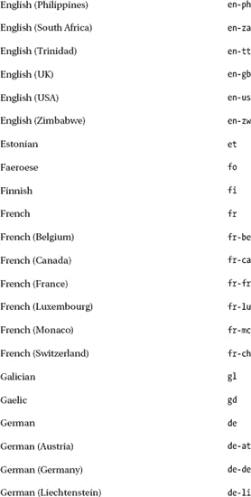
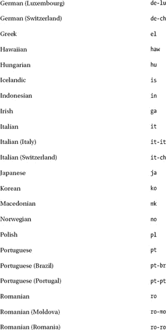
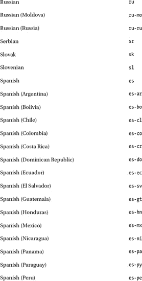
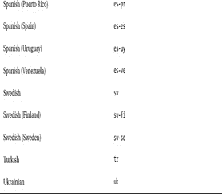

# 八、网络联合

互联网上共享的最新信息量不断增长。Web syndication 提供新闻订阅渠道，以便发布最近更新的网站内容、最新新闻或论坛帖子的摘要。这些 web 提要使用户无需浏览网站就能了解最新信息。此外，相同的提要还可以在多个网站之间共享。尽管两种流行的 web 联合格式(RSS 和 Atom)具有相对简单的词汇表，但是新闻提要通道需要符合严格的标准，首先是 XML。

在本章中，您将学习如何手动创建符合标准的新闻订阅源频道，并在保持符合标准的同时经常更新它们。你将熟悉 RSS 和 Atom 这两个主要竞争对手的优缺点。此外，您将了解用于新闻提要元素的数据格式，以及缺省值和合法属性值。您还将熟悉所需的通道和项目元素，以及为了最大化互操作性而应该提供的元素。

### 新闻提要

*Web syndication* 使网站组件可用于多个站点，而无需登录或下载其他站点的无关组件。这个短语通常指的是*网络新闻源* ( *新闻频道*)，提供最近添加内容的最新摘要和网站的最新变化。最常见的新闻提要用于最新新闻、新闻标题、博客条目和论坛帖子。

web syndication 的第一批技术出现于 1997 年，包括*频道定义格式*  [1 ，*元内容框架*  [2 ，以及*scripting news*[3。Netscape 在 1999 年发布了第一个版本的*Really Simple Syndication*(*RSS*)，后来成为了最广泛使用的 web 提要格式。另一个流行的新闻提要 *Atom* 的规范的第一部分是在 2005 年引入的。

由于订阅源阅读器和聚合器运行在各种软件平台和设备上，包括但不限于 web 浏览器、Windows 新闻订阅源阅读器小工具、Microsoft Outlook 和智能手机上的新闻订阅源阅读器，因此互操作性至关重要。

### 真正简单的联合

真正简单的联合(RSS)是最广泛使用的 web 联合格式。因为 RSS 是一个 XML 应用，所以它可以通过 XML 名称空间进行扩展。除了表示新闻和新闻稿的传统用途之外，RSS 还有一些特殊的应用，比如为银行提供最新的汇率。

RSS 的典型文件扩展名是`.rss`和`.xml`。与 RSS 相关的互联网媒体类型是`application/rss+xml`，它还没有被标准化 6 。

RSS 用属性`title`、`link`、`description`、`channel`和`item`描述轻量级联合频道。

RSS 有以下版本:RSS 0.90、RSS 0.91、RSS 0.92 和 RSS 2.0。在 2000 年，RDF Site Summary 这个名称被使用，它指的是基于 RDF 的模块化的可扩展性。0.91 版本被称为 Rich Site Summary，它放弃了 RDF 结构，并从 Dave Winer 为他的新闻网站“scriptingNews”开发的 Scripting News 联合格式中导入了元素。当前的首字母缩略词是简单联合。RSS 规范的最新版本在 RSS 咨询委员会网站 [8 ]上有一个永久的 URI。最广泛使用和最先进的版本 RSS 2.0.11  [9 ]将在接下来的章节中讨论。

#### 创建 RSS 文件

要创建一个 RSS 文件，首先需要一个 XML 声明和一个`rss`元素。`rss`元素是 RSS 文件的根元素，也是`channel`元素的容器，后者提供关于文件的信息并包含`item`元素(新闻提要条目)。清单 8-1 显示了一个 RSS 文件的一般结构。对于 RSS 2.0.11 来说，`rss`元素上的`version`属性是必需的，其值必须是`2.0`(没有指明 subversion)。

***清单 8-1。**具有最大互操作性的 RSS 文件的一般结构*

`<?xml version="1.0" encoding="utf-8" ?>
<rss version="2.0" 
 xmlns:content="http://purl.org/rss/1.0/modules/content/" 
 xmlns:dc="http://purl.org/dc/elements/1.1/" 
 xmlns:sy="http://purl.org/rss/1.0/modules/syndication/" 
 xmlns:atom="http://www.w3.org/2005/Atom">
   <channel>
    <title>An RSS news feed example</title>
    <link>http://www.example.com</link>
    <pubDate>Mon, 08 Aug 2011 08:03:00 +0200</pubDate>
    <image>
      <url>http://www.example.cimg/logo.png</url>
      <title>An RSS news feed example</title>
      <link>http://www.example.com</link>
    </image>
    <dc:creator>John Smith</dc:creator>
    <description>The news feed of rock star John Smith. Concerts, CDs, and more.</description>
    <language>en</language>
    <sy:updatePeriod>daily</sy:updatePeriod>
    <sy:updateFrequency>1</sy:updateFrequency>
    <atom:link href="http://www.example.com/rss.xml" rel="self" type="application/rss+xml" />` `    <item>
      <title>News item 2</title>
      <link>http://www.news2link.com</link>
      <pubDate>Mon, 08 Aug 2011 08:03:00 +0200</pubDate>
      <dc:creator>John Smith</dc:creator>
      <category>CDs</category>
      <guid>http://www.news2link.com</guid>
      <description>Description of news item 2</description>
      <content:encoded>The full content of News #2.</content:encoded>
    </item>
    <item>
      <title>News item 1</title>
      <link>http://www.news1link.com</link>
      <pubDate>Sun, 07 Aug 2011 08:48:00 +0200</pubDate>
      <dc:creator>John Smith</dc:creator>
      <category>Concerts</category>
      <guid>http://www.news1link.com</guid>
      <description>A bit more about news 1</description>
      <content:encoded><![CDATA The full content of News #1\. In CDATA sections, ![images
       <a href="http://examp.com">markup code</a> can also be included. ]]></content:encoded>
    </item>
  </channel>
</rss>`

自然，RSS 文件通常包含更多的`item`元素。

 **提示**理论上，一个 RSS 频道可以包含任意数量的条目。但是，一些 RSS 阅读器(如 Windows 中的新闻阅读器小工具)不支持大于大约 150KB 或 2，800 行的 RSS 文件，如果您每天更新 RSS 文件，这相当于大约 7 个月。建议您将文件大小保持在此限制之下，以最大化互操作性。

有些元素是必需的，有些是可选的，但强烈建议使用。首先，我们将检查所需的元素。

#### 必需元素

如前一节所示，`rss`元素包含了`channel`元素及其所有内容。RSS 2.0 中`channel`元素的必需元素有`title`、`link`和`description`。

##### 标题元素

`title`元素表示频道的名称。它通常与相关网站的标题相一致。清单 8-2 显示了一个例子。

***清单 8-2。**一个 RSS 频道的标题*

`<title>John Smith Headlines</title>`

##### 链接元素

`link`元素是一个 URI，代表新闻提要所在的域。清单 8-3 显示了一个例子。

***清单 8-3。**RSS 中的一个链接*

`<link>http://example.com/</link>`

##### 描述元素

`description`元素包含一个描述频道的句子或句子片段，如清单 8-4 所示。

***清单 8-4。**RSS 中的一个频道描述*

`<description>The latest news about rock star John Smith.</description>`

#### 可选元素

在 RSS 2.0 新闻源中，`channel`元素有 16 个可选的子元素，包括`category`、`cloud`、`copyright`、`docs`、`generator`、`image`、`language`、`lastBuildDate`、`managingEditor`、`pubDate`、`rating`、`skipDays`、`skipHours`、textInput、`ttl`和`webMaster`。我们将在这里更详细地查看所有这些子元素。

所有提供 URL 的 RSS 2.0 元素的一个共同特点是，它们应该以 IANA  [10 ]定义的 URI 方案开头，例如，`http://`、`https://`、`news://`、`mailto://`或`ftp://`。注意`http://`和`ftp://`方案不能在 RSS 2.0 之前的 RSS 版本中使用。

##### 类别元素

可以为 RSS 频道指定一个或多个类别，用于分类和过滤。例如，致力于语义 web 事件的网站的 RSS 新闻提要可能包含诸如会议、研讨会、规范等类别。另一个例子可能是一个书商，他使用类别来指示最新图书发行的类别，以便潜在客户可以轻松地跟踪某个类别的最新图书(例如，对罗马人感兴趣的人不一定涉及技术书籍)。`category`元素不仅可以用于整个频道，还可以单独用于每个项目。清单 8-5 显示了一个例子。

***清单 8-5。**RSS 中的一个`category`元素*

`<category>Workshops</category>`

元素有一个可选的`domain`属性，它是一个标识分类的 URI(清单 8-6 )。

***清单 8-6。**类别带域*

`<category domain="http://www.example.com/vocab">WS</category>`

为频道声明的`category`元素的值可以被门户用来对 RSS 新闻订阅源频道进行分类，而为 item 元素指定的`category`元素的值被某些新闻订阅源阅读器显示为超链接，可以用作过滤器(例如，在现代浏览器中实现的订阅源阅读器中)。通过点击其中一个链接，订阅源阅读器可以隐藏所有其他类别的新闻条目。

##### 云元素

为了立即得到 RSS 频道更新的通知，可以使用`cloud`元素为 RSS 提要编写一个发布-订阅协议。它指定了一个支持 rssCloud 接口的 web 服务(可以在 HTTP-POST、XML-RPC 或 SOAP 1.1 中实现)。支持两种请求方法:请求通知的客户端到云调用和执行通知的云到客户端调用。一个客户端请求有五个必需的参数，包括发生更新时云调用的远程过程的名称、客户端的 TCP 端口、客户端的远程过程调用路径、字符串`xml-rpc`(如果客户端使用 XML-RPC)或`soap`(如果使用 SOAP)，以及 RSS 文件的 URL。用于通知请求的 IP 地址必须与接收通知的 IP 地址一致。清单 8-7 显示了一个例子。

***清单 8-7。**使用 RSS 中的`cloud`元素*

`<cloud domain="rpc.example.com" port="80" path="/RPC2" registerProcedure="pingMe" 
 protocol="soap"/>`

云发送给客户机的更新通知包含一个参数:发生变化的 RSS 文件的 URL。作为响应，客户端必须返回布尔值`TRUE`。

##### 版权元素

RSS 频道的版权声明可以由`copyright`元素提供。清单 8-8 显示了一个例子。

***清单 8-8。**在 RSS 中提供版权信息*

`<copyright>Copyright © 2011 John Smith. All rights reserved.</copyright>`

##### docs 元素

使用的 RSS 格式文档的超链接可以由`docs`元素提供。典型的元素值是`[`www.rssboard.org/rss-specification`](http://www.rssboard.org/rss-specification)`。

##### 发电机元件

软件工具生成的 RSS 提要可以很容易地从`generator`元素的值中识别出来，生成器软件通常在这里识别自己(清单 8-9 )。

***清单 8-9。**由活字生成的 RSS 新闻源*

`<generator>Movable Type 4.34-en</generator>`

如果元素被省略或者包含一个简单的文本编辑器，通常表明提要是由源代码级别的手工编码人员编写的(正如我们在本章中所做的)。在这种情况下，作者提供一个文本编辑器，如 Notepad++并通常使用都柏林核心词汇表将自己标识为创建者。但是，大多数人应用饲料发电机。

##### 图像元素

`channel`元素的一个可选子元素是`image`，它可以用来为 RSS 提要提供一个图像。它有三个必需的和三个可选的子元素:

*   表示频道的图像的 URL 由`url`子元素表示。图像格式可以是 GIF、JPEG 或 PNG。必选。
*   图像的替代文本由`title`定义。当 RSS 被嵌入到(X)HTML 中时，这个字符串作为`alt`属性的文本被转发。`title`子元素的值应该与通道的`title`元素的值一致。必选。
*   到频道站点的图像超链接由`link`子元素决定。子元素`link`的值应该与通道的`link`元素的值一致。必选。
*   图像宽度可以由`width`子元素以像素为单位确定。默认值为`88`，最大值为`144`。可选。
*   图像高度可以由`width`子元素以像素为单位确定。默认值为`31`，最大值为`400`。可选。
*   包含在(X)HTML 中图像超链接的`title`属性中的图像描述可以由`description`子元素提供。可选。

清单 8-10 显示了一个例子。

***清单 8-10。**为 RSS 文件指定的标志图像*

`<image>
  <url>http://www. bigprofitconsulting.cimg/logo.png</url>
  <title>Big Profit Consulting</title>
  <link>http://www.bigprofitconsulting.com</link>
</image>`

 **注意**为 RSS 文件声明的图像显示在 RSS 阅读器中，例如在浏览器中实现的阅读器，但不被提要阅读器使用，例如 Outlook 中的提要阅读器或 Windows 提要阅读器小工具。

##### 语言元素

新闻提要内容的自然语言可以由`language`元素声明。例如:

`<language>en</language>`

表 8-1 总结了允许值。

除了最初的 Netscape 版本(0.91)不包含代码`et`(爱沙尼亚语)和`haw`(夏威夷语)，所有 RSS 版本都支持这些语言代码。也可以使用 HTML 4.01 规范 [11 ]中定义的 HTML `language`标签中允许的语言代码。W3C 参考 RFC 1766  [12 ]。为 ISO 639  [13 ]语言缩写保留两个字母的主要代码，包括`fr`(法语)、`de`(德语)、`it`(意大利语)、`nl`(荷兰语)、`el`(希腊语)、`es`(西班牙语)、pt(葡萄牙语)、`ar`(阿拉伯语)、`he`(希伯来语)、`ru`(俄语)、`zh`(中文)、`ja`(日语)、`hi`(印地语)、`ur`(乌尔都语)和`sa`(梵语)。两个字母的子码是 ISO 3166 国家代码 [14 ]。

##### managing editor 元素

元素可以用来提供新闻提要编辑器的电子邮件地址。清单 8-11 显示了一个例子。

***清单 8-11。**声明 RSS 编辑器*

`<managingEditor>john@example.com (John Smith)</managingEditor>`

##### pubDate 和 lastBuildDate 元素

频道内容的发布日期可以由`pubDate`元素提供。每次更新新闻提要时，元素值都会发生变化。RSS 应用日期和时间规范 RFC 822  [15 ，除了年份可以用两个或四个字符表示(后者是首选)。应根据格林威治标准时间(GMT)/协调世界时(UTC)的差异提供偏移量。例如，在英国伦敦时间 2010 年 11 月 24 日上午 08:04(换句话说，在 GMT 时区)更新的一个 RSS 频道可以显示在清单 8-12 、中所示的发布日期，而在斐济苏瓦(时区 1200 GMT 或 UTC+12)发布的另一个新闻订阅源同时可以被编写为如清单 8-13 中所示。

***清单 8-12。**GMT 时区的出版日期*

`<pubDate>Wed, 24 Nov 2010 08:04:00 GMT</pubDate>`

***清单 8-13。**UTC+12 时区的发布日期*

`<pubDate>Wed, 24 Nov 2010 08:04:00 +1200</pubDate>`

 **注意**在管辖区实行夏令时(夏令时)的国家，时差一年变化两次。

新闻提要的最后修改日期可以用与`pubDate`相同的格式由`lastBuildDate`元素表示。

##### skip hours 和 skipDays 元素

没有更新的时间段可以由`skipHours`元素提供，天数可以由`skipDays`元素提供。`skipHours`的允许值是介于`0`和`23`(GMT 时间)之间的整数(清单 8-14 )。

***清单 8-14。**一个只在工作时间检查更新的 RSS 频道*

`<skipHours>
  <hour>0</hour>
  <hour>1</hour>
  <hour>2</hour>
  <hour>3</hour>
  <hour>4</hour>
  <hour>5</hour>
  <hour>6</hour>
  <hour>7</hour>
  <hour>17</hour>
  <hour>18</hour>
  <hour>19</hour>
  <hour>20</hour>
  <hour>21</hour>
  <hour>22</hour>
  <hour>23</hour>
</skipHours>`

`skipDays`元素有七个`day`子元素(完整的星期几)。它们可以用来指定新闻订阅频道不更新的日子，因此没有必要检查更新(清单 8-15 )。

***清单 8-15。**周末不更新的 RSS 源*

` <skipDays>
  <day>Saturday</day>
  <day>Sunday</day>
</skipDays>`

 **注**申报的小时或天数仅为提示。RSS 阅读器*可能无法*在列出的时间段内读取频道。

##### 文本输入元素

`channel`元素的另一个可选子元素是文本`Input`，它可以用来指定一个搜索框。它有四个必需的子元素:

*   `Submit`按钮的标签由`title`子元素决定。
*   文本输入区可以由`description`子元素描述。
*   `name`子元素标识文本对象。
*   `link`子元素提供了用于处理请求的 CGI 脚本的 URL。

许多 RSS 阅读器都忽略了 text `Input`元素。

##### TTL 元件

从源刷新之前的缓存持续时间可以用`ttl`元素(代表“生存时间”)以分钟表示。以三个小时为例，它可以写成清单 8-16 。

***清单 8-16。**RSS 中的 180 分钟缓存*

`<ttl>180</ttl>`

###### 站长元素

负责 RSS 频道技术问题的网站管理员的电子邮件地址可以用`webMaster`元素表示。

#### item 元素的子元素

item 元素有十个子元素:`author`、`category`、`comments`、`description`、`enclosure`、`guid`、`link`、`pubDate`、`source`、`title`。所有子元素都是可选的；但是，至少应该为每个**项目**元素提供一个标题或描述。

##### 作者子元素

新闻提要条目作者的电子邮件地址可以由`author`子元素提供。清单 8-17 显示了一个例子。

***清单 8-17。**RSS 作者*

`<author>info@example.com (John Smith)</author>`

##### 类别和发布子元素

`item`元素的`category`和`pubDate`子元素的语法与`channel`元素的相应子元素的语法相同(参见“0”和“0”部分)。

##### 注释子元素

如果有一个与新闻条目(`item`元素)相关的论坛或博客，那么可以通过`item`元素的`comments`子元素提供到该页面的链接。清单 8-18 显示了一个例子。

***清单 8-18。**一个 RSS 条目的评论*

`<comments>http://example.com/blog/14352</comments>`

##### 描述子元素

项目(新闻摘要)的文本由`description`子元素分隔，如清单 8-19 中的所示。

***清单 8-19。**一个 RSS 项目描述*

`<description>
 Reports from workshop sessions
</description>`

##### 外壳子元件

`item`元素的`enclosure`子元素可以用来描述与新闻提要条目相关的文件(通常是音频或视频)。它有三个必需的属性:`url`(文件的 URL)、`length`(以字节为单位的文件大小)和`type`(媒体类型)，如清单 8-20 所示。

***清单 8-20。**一个圈地*

`<enclosure url="http://example.com/download/words.mp3" length="4875577" type="audio/mpeg"/>`

##### guid 子元素

每个 RSS 条目可能有一个唯一标识它的字符串，称为*全局唯一标识符*。`guid`子元素没有特定的语法规则，但是它的内容通常是一个 URL ( 清单 8-21 )。

***清单 8-21。** A `guid`指定与新闻条目*相关的永久链接

`<item>
  <title>New HTML5 and CSS3 tutorials</title>
  <link>http://www.lesliesikos.com/tutorials/</link>
  <pubDate>Mon, 06 Feb 2012 14:22:00 +0930</pubDate>
  <dc:creator>Dr. Leslie Sikos</dc:creator>
  <category>Website</category>
**  <guid isPermaLink="true">http://www.lesliesikos.com/tutorials/</guid>**
  <description>Tutorials on HTML5 video embedding and CSS3 transitions</description>
  <content:encoded>Several tutorials have recently been published on emerging 
   technologies such as HTML5 video embedding and CSS3 transitions.</content:encoded>
</item>`

`guid`子元素有一个可选属性`isPermaLink`，可以设置为`true`或`false`。在第一种情况下(这是默认的)，属性值必须是一个 URL，指向由`item`元素描述的完整文章或故事。很少使用`false`值。事实上，整个`isPermaLink`属性经常被省略。

 **注意**`guid`子元素，如果提供的话，在整个 RSS 文件中应该是唯一的。如果在文件中多次描述了同一网站的频繁更新，则可能很难满足此标准。

RSS 阅读器将`guid`子元素的值视为一个字符串。

 **提示**虽然`guid`子元素是可选的，但是为了最大化互操作性，建议为所有的`item`元素都提供这个子元素。

##### 链接子元素

项目的 URL 可以由`link`子元素提供。清单 8-22 显示了一个例子。

***清单 8-22。**为 RSS 项目声明的链接*

`<link>http://example.com/news</link>`

##### 源子元素

如果条目内容来自外部 RSS 频道，它可以由`source`子元素提供。该值是资源通道的标题。`source`元素有一个必需的属性`url`，它是资源的 URL(清单 8-23 )。

***清单 8-23。**一个 RSS 条目的来源*

`<source url="http://www.example.com/news.xml">John Smith Headlines</source>`

##### 标题子元素

RSS 频道项目的标题可以由`item`元素的`title`子元素声明。清单 8-24 显示了一个例子。

***清单 8-24。**一个 RSS 条目的标题*

`<title>A new W3C standard</title>`

#### 名称空间

RSS 的默认名称空间是`[`purl.org/rss/1.0/`](http://purl.org/rss/1.0/)`，它是 RDF Site Summary (RSS) 1.0 名称空间`[`web.resource.org/rss/1.0/`](http://web.resource.org/rss/1.0/)`的*永久 URL* 形式。名称空间可以以清单 8-25 中的形式提供。

***清单 8-25。**声明 RSS 名称空间*

`<rss version="2.0" xmlns:rss="http://purl.org/rss/1.0/">`

关于频道更新的附加数据可以由 RSS ( `[`purl.org/rss/1.0/modules/syndication/`](http://purl.org/rss/1.0/modules/syndication/)`)的*网络联合命名空间提供。它用三个元素扩展了 RSS 频道:*

*   新闻频道更新的周期可以用`sy:updatePeriod`元素来描述。允许的值有`hourly`、`daily`、`weekly`、`monthly`和`yearly`。如果省略，则假定为`daily`。
*   更新的频率可以用`sy:updateFrequency`元素来表示与更新周期的关系。它的值是一个正整数。
*   为了计算发布时间表，可以通过`sy:updateBase`元素定义一个基准日期。它应该是 W3C 日期和时间格式之一的#PCDATA 日期 [16 ]。

默认情况下，新闻源条目是纯文本内容。然而，新闻聚合器通常支持 XML 中不允许的(X)HTML 标记。实体编码和 CDATA 转义的内容可以通过由`[`purl.org/rss/1.0/modules/content/`](http://purl.org/rss/1.0/modules/content/)`名称空间定义的`content:encoded`元素来提供。如果由`link`元素限定的超链接不够，并且需要额外的超链接(在新闻条目内容中)，那么`content:encoded`元素特别有用。尽管文本格式和其他标记代码也可以用这种方式编写，但它们被许多 RSS 阅读器忽略了。

有一个元素`atom:link`，它可以从另一个联合格式(Atom 1 )中使用，以提供新闻提要频道的自链接。为了应用这个元素，应该声明 Atom 名称空间`[`www.w3.org/2005/Atom`](http://www.w3.org/2005/Atom)`。

高级新闻提要通常至少包含清单 8-26 中的名称空间声明。

***清单 8-26。**RSS 中典型的名称空间声明*

`<rss version="2.0" 
**  xmlns:content="http://purl.org/rss/1.0/modules/content/"** 
**  xmlns:dc="http://purl.org/dc/elements/1.1/"** 
**  xmlns:sy="http://purl.org/rss/1.0/modules/syndication/"** 
**  xmlns:atom="http://www.w3.org/2005/Atom"** 
>`

这样做，可以在`channel`中使用这些名称空间中的元素，如清单 8-27 所示，或者在`item`元素中使用，如清单 8-28 中的示例。

***清单 8-27。**RSS 频道中来自外部名称空间的元素*

`**<dc:creator>**Dr. Leslie Sikos**</dc:creator>**
**<sy:updatePeriod>**daily**</sy:updatePeriod>**
**<sy:updateFrequency>**1**</sy:updateFrequency>**
**<sy:updateBase>**2011-01-01T12:00+00:00**</sy:updateBase>**
**<atom:link** href="http://www.lesliesikos.com/sikos.xml" rel="self" 
 type="application/rss+xml" **/>**`

***清单 8-28。**RSS 项目中来自外部名称空间的元素*

`**<content:encoded>**<
 readers. ]]>**</content:encoded>**`

#### 设计 RSS 源

支持新闻提要的浏览器通常提供基本样式或者根本不提供样式(而是呈现树结构)。对此不满意或者想要确保高级外观(在所有浏览器中也是相似的)的开发人员可以使用 CSS 或 XSLT 格式化 RSS 频道。

在第一种情况下，需要一个 CSS 引用，如清单 8-29 中的所示。

***清单 8-29。**使用 CSS 文件对 RSS 进行样式化*

`<?xml version="1.0" encoding="utf-8" ?>
**<?xml-stylesheet type="text/css" href="css/feed.css" ?>**
<rss version="2.0">`

编写 CSS 规则很简单。例如，主标题的字体大小可以通过清单 8-30 中给出的 CSS 规则来增加。

______________

原子格式将在本章后面描述。

***清单 8-30。**设置 RSS 频道和标题的字体大小*

`**channel title** {
  font-size: 1.4em;
}`

可以设置文档的字体，如清单 8-31 所示。

***清单 8-31。**整个 RSS 文档的 CSS 规则*

`**rss** {
  font-family: Verdana, Helvetica, sans-serif;
}`

类似地，可以为其他 RSS 元素设置更多样式。许多信息不一定相关，可以省略，例如清单 8-32 中的信息。

***清单 8-32。**用 CSS 隐藏 RSS 元素*

`channel link, channel language, channel copyright, channel managingEditor, 
 channel webMaster, channel docs, channel lastBuildDate {
**  display: none;**
}`

第二种方法应用 XSL 转换，这提供了更多的控制。例如，可以激活超链接，可以更改节点顺序。XSL 文件可以被链接，如清单 8-33 所示。

***清单 8-33。**使用 XSLT 对 RSS 进行样式化*

`<?xml version="1.0" encoding="utf-8" ?>
**<?xml-stylesheet type="text/xsl" href="css/feed.xsl" ?>**
<rss version="2.0">`

 **注意**当自定义样式表应用于新闻源时，某些浏览器的内置 RSS 阅读器提供的搜索或类别列表等附加功能将不可用。

### 原子

Atom 新闻提要规范由两个标准组成:Atom 联合格式和 ?? Atom 发布协议。第一种是由 IETF 提议的标准(RFC 4287  [17 ]定义的 XML 语法的 web 提要格式。第二个是基于 HTTP 的协议，可用于创建和更新 web 资源。它也是一个建议标准(RFC 5023  [18 )。本节重点介绍 Atom 联合格式。

Atom 提要的文件扩展名是`.atom`和`.xml`。Atom 的互联网媒体类型是`application/atom+xml`。

Atom 命名空间是`[`www.w3.org/2005/Atom`](http://www.w3.org/2005/Atom)`。

#### 创建原子文件

Atom 文件以 XML 声明开始。Atom 文件的根元素和新闻提要条目的容器(`entry`元素)是`feed`元素。清单 8-34 显示了一个 Atom 文件的一般结构。

***清单 8-34。**原子文件的一般结构*

`<?xml version="1.0" encoding="utf-8"?>
<feed >
  <title>An Atom news feed example</title>
  <link rel="alternate" type="text/html" href="http://www.example.com/" />
  <link rel="self" type="application/atom+xml" href="http://www.example.com/News/atom.xml" />
  <id>tag:www.example.com,2008-09-29://4</id>
  <updated>2011-08-08T08:03:00Z</updated>
  <entry>
    <title>News item 2</title>
    <link rel="alternate" type="text/html" href="http://www.expl.com/2011.html#entry-9167" />
    <id>tag:www.expl.com,2011://4.9167</id>
    <published>2011-08-08T08:03:00Z</published>
    <updated>2011-08-08T08:03:00Z</updated>
    
Summary of news entry 2

    <author>
      <name>John Smith</name>
    </author>
    <category term="Home Page Stories" />
    <category term="Web of Services" />
    <content type="html" xml:lang="en" xml:base="http://www.example.com/">The full content 
     of News #2.</content>
  </entry>
  <entry>
    <title>News item 1</title>
    <link rel="alternate" type="text/html" href="http://www.example.com/news/#entry-9165" />
    <id>tag:www.example.com,2011://4.9165</id>
    <published>2011-08-07T08:48:00Z</published>
    <updated>2011-08-07T08:48:00Z</updated>
    
Summary of news entry 1

    <author>
      <name>John Smith</name>
    </author>
    <category term="Publication" />
    <category term="Web design" />
    <category term="Press releases" />
    <content type="html" xml:lang="en" xml:base="http://www.example.com/">
      <![CDATA The full content of News #1\. In CDATA sections, ![images
       <a href="http://example.com/markup/">markup code</a> can also be included. ]]>
    </content>
</entry>
</feed>`

这些元素和属性将在下面的章节中详细描述。

##### 文本构造

Atom 的文本构造包含语言敏感的、人类可读的文本。文本构造的一个可选属性是`type`属性。如果提供，该属性必须具有下列值之一:`text`、`html`或`xhtml`。如果省略，Atom feed 阅读器会将文本构造视为用默认值`text`指定的。MIME 类型不能声明为`type`属性的属性值。

##### 人称结构

Atom 中有三个 person 构造来描述一个实体，比如一个人或一个公司:`name`、`uri`和 email。

Atom 新闻提要必须恰好包含一个提供作者姓名的`name`元素。元素内容是区分语言的。

`uri`元素是可选的，最多可以提供一个链接到作者网站的元素。元素的内容是一个国际化资源标识符(IRI)，其格式由 RFC 3987  [19 ]定义。

作者的电子邮件地址可以由可选的`email`元素声明，在 Atom 文件中只能使用一个这样的元素。元素的内容应该符合 RFC 2822  [20 ]定义的标准互联网消息格式。

##### 日期结构

日期构造元素的内容应该根据 RFC 3339  [21 ]中定义的日期时间格式进行声明。日期和时间应该用大写的`T`分开，而当省略数字时区偏移量时，应该使用大写的`Z`(清单 8-35 )。

***清单 8-35。**Atom 中的一些有效时间戳*

`<updated>2012-12-13T08:15:01Z</updated>
<updated>2012-12-13T08:15:01.25Z</updated>
<updated>2012-12-13T08:15:01+01:00</updated>
<updated>2012-12-13T08:15:01.25+01:00</updated>`

Atom 新提要的所有日期值都应符合日期和时间表示的 ISO 标准(ISO 8601:2004  [22 ])和 W3C 日期和时间格式 [23 ]规范，以及 W3C 推荐标准“XML Schema Part 2:data types Second Edition”[24]中的 ISO 8601 公约。

#### 容器

Atom 中有三个容器元素:

*   `feed`元素，包含整个提要
*   `entry`元素，包含一个简单的新闻条目
*   `content`元素，包含完整的故事(新闻条目的内容)

接下来的部分将详细描述这些容器。

##### 进给元素

如前所述，Atom feeds 的顶层元素是`feed`；它包含新闻提要元数据和内容(所有其他 Atom 元素)。除了`feed`元素的所有子`entry`元素包含至少一个`author`元素之外，`feed`元素需要一个或多个`author`元素。必须为所有`feed`元素提供一个`id`元素。`feed`元素必须恰好包含一个`updated`元素。所有的`feed`元素只需要一个`title`元素。`feed`元素应该包含一个`link`元素，其`rel`属性值设置为`self`。

任意数量的`category`和`contributor`元素可以包含在`feed`元素中。每个`feed`只允许有一个`generator`。这同样适用于`icon`和`logo`元件。

`feed`元素最多可以包含一个`link`元素，其`rel`属性值设置为`alternate`，并且具有相同的`type`和`hreflang`属性值。除了这些`link`元素之外，额外的`link`元素可以包括在`feed`元素中。

每个`feed`元素只允许有一个`rights`和`subtitle`元素。

所有的原子元素都将在接下来的章节中描述。

##### 条目元素

Atom 新闻可以由`entry`元素提供。它可以是`feed`元素的子元素，也可以是提要中独立的顶级元素。`entry`元素必须至少有一个`author`元素，除非在具有`author`元素的`entry`中提供了一个`source`元素，或者`feed`元素包含一个`author`元素。可选地，`entry`元素具有任意数量的`category`元素。`entry`元素可能最多有一个`content`元素。`entry`元素的另一个可选子元素是`contributor`。可以提供任意数量的贡献者。

`entry`元素必须有一个`id`元素。

没有`content`的`entry`元素必须至少提供一个具有`rel`属性和`alternate`属性值的`link`元素。

`entry`元素不能包含多个具有`rel`属性的`link`元素和具有完全相同类型和`hreflang`属性值的替代属性值。可选地，还可以为`entry`元件提供额外的`link`元件。

`entry`元素最多可以包含一个`published`、`rights`、`source`和`summary`元素。

如果`entry`包含一个具有`src`属性的`content`元素或者`entry`内容是 Base64 编码的，则应该为`entry`元素提供`summary`子元素。 2

条目元素必须恰好包含一个`title`和一个`updated`元素。

##### 内容元素

Atom 新闻内容可以由`content`元素提供。此元素的内容是语言敏感的。元素有两个属性:`type`和`src`。

`content`元素上的`type`属性的值可能是`text`、`html`或`xhtml`。如果省略，`text`将被 Atom 阅读器视为默认值。另一种选择是提供 MIME 媒体类型(但不是复合类型)。

`content`元素有一个可选的`src`属性。该属性的值应该是符合 RFC 3987 的国际化资源标识符。如果提供了`src`属性，`content`必须为空。`type`属性也应该和`src`属性一起提供一个 MIME 类型。

______________

2 尽管`atom:content`元素的`type`属性是一种互联网媒体类型，但它既不是 XML 媒体类型，也不是以文本/开头或以`/xml`或`+xml`结尾。

#### 元数据和内容元素

与 RSS 类似，Atom 中有几个元素用来表示元数据和描述新闻条目的内容，如`author`、`category`、`contributor`、`generator`、`icon`、`id`、`link`、`logo`、`published`、`rights`、`source`、`subtitle`、`summary`、`title`、`updated`。其规范赋予内容意义的元素和具有特殊限制的元素将在以下部分中描述。

##### 作者元素

Atom 提要中的作者可以分为三个级别。如果`author`元素不是作为`entry`元素的子元素提供的，那么作者是从`source`元素的`author`子元素派生的。否则，由`feed`元素的`author`声明的作者被认为是(清单 8-36 )。

***清单 8-36。**声明 Atom 提要的作者*

`<author>
   <name>John Smith</name>
</author>`

##### 类别元素

`category`元素有三个属性:必需的`term`和可选的`scheme`和`label` ( 清单 8-37 )。

***清单 8-37。**Atom 中的类别声明*

`<category term="Publication" />`

属性的值是语言敏感的。属性值中使用的字符实体被视为字符，而不是标记。

##### 贡献者元素

对条目或整个提要做出贡献的个人或公司可以用`contributor`元素来表示(清单 8-38 )。

***清单 8-38。**一个饲料贡献者*

`<contributor>
  <name>Alex Sikos</name>
</contributor>`

##### 发电机元件

如果使用软件工具来生成 Atom 新闻提要，那么可以通过`generator`元素来识别。`generator`元素有两个可选属性。根据 RFC 3987，`uri`属性的值应该是一个国际化的资源标识符。另一个可选属性是代表 Atom 生成器版本的`version`(清单 8-39 )。

***清单 8-39。**在供料中发现了一台原子发生器*

`<generator uri= "http://www.sixapart.com/movabletype/" ver="4.34-en">Movable Type</generator>`

##### 图标元素

类似于`uri`元素的内容和`generator`元素的`uri`属性的内容，`icon`元素的内容也应该是符合 RFC 3987 的 IRI 引用。该元素为 Atom 新闻提要指定一个图像文件。应提供图像分辨率(清单 8-40 )。

***清单 8-40。**Atom Feed 的图标*

`<icon>http://example.cimg/ icon.gif</icon>`

##### id 元素

`id`元素是以小写形式提供的永久标识符(清单 8-41 )。它被用作`feed`元素和`entry`元素的子元素。

***清单 8-41。**一个原子标识符*

`<id>tag:example.org,2003:3</id>`

*百分号编码*，这种使用以百分号(`%`)、 3 开头的字符串对 URI 的某些字符进行编码的机制应该尽可能地消除。4URIs 应避免圆点。国际化资源标识符应该是 NFC 标准化的，或 NFKC 标准化的。应该保留空的片段标识符。`id`元素中的 URIs 区分大小写。在比较`id`实例时，应用百分比转义的标识符被认为不同于不应用百分比转义的标识符。

##### 链接元素

与 Atom 条目或整个提要相关的外部超链接可以由`link`元素提供。这个元素有六个属性:`href`、`rel`、`type`、`hreflang`、`title`和`length`。必需的`href`属性包含链接的国际化资源标识符。根据 RFC 3987 的 *IRI* 或 *isegment-nz-nc* 语法规则，可选的`rel`属性必须有一个非空字符串作为值。允许的值有`alternate`、`related`、`self`、`enclosure`和`via`。可选的属性`type`必须有一个 MIME 媒体类型作为它的值。`hreflang`属性也是可选的。当提供时，它必须有一个 RFC 3066 语言标签。可选的`title`属性是语言敏感的。标题中使用的字符实体被认为是字符而不是标记。关于链接内容的建议长度的提示可以由可选的八位字节的`length`属性提供。清单 8-42 显示了一个典型的`link`元素。

______________

3 百分比编码最广为人知的一个例子是在设计拙劣的 URIs 中代替空格字符出现的`%20`字符串。

4 如果百分比编码是必要的并且无法消除，字母应该是大写字母 A-f。

***清单 8-42。**原子*中的一种`link`元素

`<link rel="self" type="application/atom+xml" href="http://example.net/ atom.xml" />`

##### 标志元素

可以通过`logo`元素(清单 8-43 )提供一个图像来直观地标识您的 Atom 新闻提要。其内容是 IRI 参考(RFC 3987)。徽标图像的纵横比应为 2:1(水平对垂直)。

***清单 8-43。**一个 Atom Feed 的 Logo 图片*

`<logo>http://example.cimg/ icon.gif</logo>`

##### 发布的元素

新闻条目的第一个版本的编写时间可以通过`published`元素的日期结构来指定(清单 8-44 )。

***清单 8-44。**一个`published`元素*

`<published>2011-09-18T16:35:24Z</published>`

这样的时间戳可能与条目中的`updated`元素的内容一致。

##### 权利元素

自定义版权信息可以写成文本结构，并使用`rights`元素添加到 Atom 新闻提要中(清单 8-45 )。

***清单 8-45。**Atom 中的版权信息*

`<rights>Copyright © 2012 John Smith. All rights reserved.</rights>`

##### 源元素

如果一个`entry`来自外部 Atom 新闻提要，那么原始条目的元数据可以有选择地用作`source`元素的子元素。在所有情况下都应该保留元素`author`、`contributor`、`rights`和`category`。

##### 子标题元素

Atom 提要可以用一个字符串来描述，该字符串作为`subtitle`元素的内容提供，它提供了比`title`元素更长的描述(清单 8-46 )。

***清单 8-46。**Atom 新闻提要的描述*

`<title type="text">Steven Johnson News</title>
<subtitle>
 The news feed of poet Steven Johnson. New booklets, press releases, readings, and more.
</subtitle>`

##### 摘要元素

可以用`summary`元素为每个 Atom 条目添加一个简短的描述(清单 8-47 )。

***清单 8-47。**一个原子条目的概要*

`
The latest book of S. Johnson, “My Darling”, has been released.
`

### RSS 还是 Atom？

RSS 和 Atom 在所有主要的消费类阅读器中都得到了广泛的支持。不过，RSS 似乎比 Atom 更受欢迎。然而，从标准的角度来看，RSS 2.0 规范是由哈佛大学版权所有的，并且被认为是最终确定的。尽管该规范已经在知识共享许可下发布，但预计不会有重大变化。相比之下，Atom 1.0 在默认情况下是一种功能更加丰富的联合格式，并且可以扩展。

互联网媒体类型`application/rss+xml`未注册，而`application/atom+xml`由 IANA 注册。

与仅支持 RSS 文档格式的 RSS 2.0 相比，Atom 新闻提要的 Atom 条目文档可以应用任何网络协议。因此，Atom 新闻提要的聚合和提取有了更多的可能性。

尽管 RSS 2.0 的名称空间不是 XML 名称空间，但是它可以选择包含来自外部 XML 名称空间的元素(如前所述)。Atom 1.0 的名称空间本身就是一个 XML 名称空间，也可能包含来自其他 XML 名称空间的元素和属性。这些外部元素和属性的实现由规范指南明确定义。可以得出结论，Atom 比 RSS 更具可扩展性。

RSS 不支持相对 URIs，而 Atom 重用 xml:base 属性，该属性允许相对引用。

RSS 2.0 中没有定义模式。Atom 1.0 应用了 RelaxNG 模式，这是一个非标准化的 ISO 标准 ISO/IEC 19757-2:2008[25]。它可以用来验证 Atom 新闻提要中提供的数据。可选地，可以从 RelaxNG 生成更多的模式。

实际上，大多数新闻提要阅读器都支持这两种格式。正确编写的 RSS 和 Atom 文件是格式良好的 XML 文件，可以用多种方式进行处理，并且可以使用名称空间机制进行扩展。在使用提要阅读器应用时，用户通常不会注意到这两种格式之间的区别。

### 总结

本章向您介绍了 RSS 和 Atom 新提要格式，以及创建符合标准的提要通道和手动维护它们所需的所有背景信息和实践，而不会中断 XML 序列化格式、RSS 或 Atom 格式要求或最高级别的互操作性。

在下一章中，您将学习如何保护网站的布局，如何在 web 上使用高级排版功能，以及如何优化图像文件以最大化用户体验。您还将学习符合标准的跨浏览器视频和多媒体嵌入技术。

### 参考文献

1.  埃勒曼 C (1997)通道定义格式(CDF)。微软公司。[www.w3.org/TR/NOTE-CDFsubmit.html](http://www.w3.org/TR/NOTE-CDFsubmit.html)2010 年 11 月 23 日访问
2.  Guha RV，Bray T (eds) (1997)使用 XML 的元内容框架。[www.w3.org/TR/NOTE-MCF-XML/](http://www.w3.org/TR/NOTE-MCF-XML/)2010 年 11 月 23 日访问
3.  Winer D (1997)用 XML 编写新闻脚本。戴夫·维纳。[`scripting . com/davenet/1997/12/15/scriptingnewsinxml . html`](http://scripting.com/davenet/1997/12/15/scriptingnewsinxml.html)。2010 年 11 月 23 日访问
4.  RAB (2008) RSS 0.90 规范。转自 1999 年出版的 Netscape 原始规范。RSS 咨询委员会。[www.rssboard.org/rss-0-9-0](http://www.rssboard.org/rss-0-9-0)2010 年 11 月 23 日访问
5.  Asman P，Cannon S，Sommo C (2010)扩展 RSS 以满足中央银行的需求。都柏林核心和元数据应用国际会议论文集。匹兹堡都柏林核心元数据倡议
6.  Cadenhead R，Smith G，Hanna J，Kearney B (2006)应用/rss+xml 媒体类型。互联网协会。[www.rssboard.org/rss-mime-type-application.txt](http://www.rssboard.org/rss-mime-type-application.txt)2010 年 11 月 22 日访问
7.  Beged-Dov G、Brickley D、Dornfest R、Davis I、Dodds L、Eisenzopf J、Galbraith D、Guha RV、MacLeod K、Miller E、Swartz A、van der Vlist E 等(2008) RDF 站点摘要(RSS) 1.0。RSS 开发工作组。[`web.resource.org/rss/1.0/spec`](http://web.resource.org/rss/1.0/spec)2010 年 11 月 23 日访问
8.  RAB(2008)RSS 规范的当前版本。RSS 咨询委员会。[www.rssboard.org/rss-specification](http://www.rssboard.org/rss-specification)2010 年 11 月 23 日访问
9.  RAB (2010)规范历史。RSS 咨询委员会。[www.rssboard.org/rss-history](http://www.rssboard.org/rss-history)2011 年 8 月 28 日访问
10.  互联网名称与数字地址分配机构(2010)永久 URI 计划。互联网号码分配机构。[www.iana.org/assignments/uri-schemes.html](http://www.iana.org/assignments/uri-schemes.html)2010 年 11 月 26 日访问
11.  Raggett D，Le Hors A，Jacobs I (eds) (1999)语言代码。在:HTML 4.01 规范。万维网联盟。[www.w3.org/TR/REC-html40/struct/dirlang.html#langcodes](http://www.w3.org/TR/REC-html40/struct/dirlang.html#langcodes)2010 年 11 月 24 日访问
12.  Alvestrand H (1995)用于识别语言的标签。互联网工程任务组。[www.ietf.org/rfc/rfc1766.txt](http://www.ietf.org/rfc/rfc1766.txt)2010 年 11 月 24 日访问
13.  ISO (2002) ISO 639-1:2002。国际标准化组织。[www . iso . org/iso/iso _ catalogue/catalogue _ ics/catalogue _ detail _ ics . htm？csnumber=22109](http://www.iso.org/iso/iso_catalogue/catalogue_ics/catalogue_detail_ics.htm?csnumber=22109) 。2010 年 11 月 24 日访问
14.  ISO (2006) ISO 3166-1:2006。国际标准化组织。[www . iso . org/iso/iso _ catalogue/catalogue _ TC/catalogue _ detail . htm？csnumber=39719](http://www.iso.org/iso/iso_catalogue/catalogue_tc/catalogue_detail.htm?csnumber=39719) 。2010 年 11 月 24 日访问
15.  Crocker DH(ed)(1982)ARPA 互联网文本信息的格式标准。特拉华大学。http://asg.web.cmu.edu/rfc/rfc822.html[。2010 年 11 月 24 日访问](http://asg.web.cmu.edu/rfc/rfc822.html)
16.  Wolf M，Wicksteed C (1997)日期和时间格式。万维网联盟。[www.w3.org/TR/NOTE-datetime](http://www.w3.org/TR/NOTE-datetime)2010 年 11 月 27 日访问
17.  Nottingham M，say re R(eds)(2005)Atom 联合格式。提议的标准。互联网协会。[`tools.ietf.org/html/rfc4287`](http://tools.ietf.org/html/rfc4287)2010 年 11 月 22 日访问
18.  格雷戈里奥 J，德霍拉 B(编辑)(2007)原子出版协议。提议的标准。互联网协会。[`tools.ietf.org/html/rfc5023`](http://tools.ietf.org/html/rfc5023)2010 年 11 月 22 日访问
19.  Duerst M，Suignard M (2005)国际化资源标识符(IRIs)。互联网工程任务组。[`tools.ietf.org/html/rfc3987`](http://tools.ietf.org/html/rfc3987)2010 年 12 月 1 日访问
20.  雷斯尼克 P(编辑)(2001)互联网信息格式。互联网协会。[`tools.ietf.org/html/rfc2822`](http://tools.ietf.org/html/rfc2822)2010 年 12 月 1 日访问
21.  Klyne G，Newman C (2002)互联网上的日期和时间:时间戳。互联网协会。[`tools.ietf.org/html/rfc3339`](http://tools.ietf.org/html/rfc3339)2010 年 12 月 2 日访问
22.  ISO (2004)数据元素和交换格式-信息交换-日期和时间的表示。ISO 8601:2004。国际标准化组织。[www . iso . org/iso/iso _ catalogue/catalogue _ TC/catalogue _ detail . htm？csnumber=40874](http://www.iso.org/iso/iso_catalogue/catalogue_tc/catalogue_detail.htm?csnumber=40874) 。2010 年 12 月 2 日访问
23.  Wolf M，Wicksteed C (1998)日期和时间格式。万维网联盟。[www.w3.org/TR/NOTE-datetime](http://www.w3.org/TR/NOTE-datetime)2010 年 12 月 2 日访问
24.  Biron PV，Malhotra A (eds) (2004 年)ISO 8601 公约。XML 模式第二部分:数据类型第二版。W3C 推荐。万维网联盟。[www.w3.org/TR/xmlschema-2/#isoformats](http://www.w3.org/TR/xmlschema-2/#isoformats)2010 年 12 月 2 日访问
25.  国际标准化组织(2008)国际标准化组织/IEC 19757-2:2008。信息技术-文件模式定义语言(DSDL)-第二部分:基于常规语法的验证 RELAX NG。国际标准化组织。[www . iso . org/iso/iso _ catalogue/catalogue _ TC/catalogue _ detail . htm？csnumber=52348](http://www.iso.org/iso/iso_catalogue/catalogue_tc/catalogue_detail.htm?csnumber=52348) 。2010 年 12 月 7 日访问