# 九、优化的外观

设计一直是网站开发中的一个重要因素，部分原因是外观决定了第一印象。如果一个网站的设计吸引眼球，访问者更有可能成为顾客或客户。Web 排版最近开始吸引注意力，尤其是通过适当的空白处理和 web 字体的引入。作为网站基本组成部分的图像应该针对 web 发布进行优化，以达到合理的质量与文件大小比率，并最大限度地减少下载时间。由于高速互联网连接已经变得普遍，对共享多媒体内容的需求已经大大增加。在 HTML5 中引入新元素之前，通用对象一直用于嵌入音频和视频内容。虽然设计和多媒体非常受欢迎，但基本的可用性原则应该始终牢记在心:功能重于设计。

在这一章中，你将学习如何创建多栏布局和固定菜单，而不用现在已经过时的方法，例如应用表格和框架的方法。这一章还描述了一个 CSS 属性，叫做`z index`，它提供了对一个在另一个之上的层的外观的完全控制。

直到最近，大多数网站使用一个小列表中的一种或多种字体，导致了某种单调。这些年来，有许多方法可以使用更多种类的字体，但是没有一种方法非常令人满意或可靠。现在，您可以通过声明使用字体文件来呈现文本内容来改善文本的外观，这使得使用精心选择的字体以高质量显示网页成为可能。然而，网站不仅可以包含文本。您将学习如何优化用于 web 发布的图像并嵌入多媒体文件，如 Flash 内容、音频和视频。

### 布局

web 内容的布局决定了整体外观，并对功能、可用性、可访问性和设计有很大的影响。Web 布局应该是可靠的，并且独立于浏览器和分辨率。

#### 定位和浮动

一些网页组件被放置在与浏览器窗口的一个角相关的页面上，例如左上角(`0, 0`位置)，而其他组件的位置取决于它们的父元素(*容器*)的位置。有各种选项，包括相对、绝对和固定定位。除了适当的定位，您还必须小心提供独立于浏览器和分辨率的解决方案。

在您的网站上，也许某些组件应该“浮动”在网页上，内容应该出现在正文的旁边，而不是上面或下面。典型的例子是图像，它经常应用`float`属性将文本环绕在图像周围。

##### 绝对和固定位置

根据设计和站点结构，某些页面组件(徽标、菜单、页眉、页脚等)应该是固定的，在页面滚动时不应移动。

CSS 规则`position: fixed;`与`position: absolute;`非常相似，但是第一个规则在用户滚动页面时阻止元素滚动，而第二个规则则不阻止。Internet Explorer 6 或更早版本不支持`position: fixed;`规则，这是多年来网站开发中的一个主要布局问题。为了提供类似的效果，`position: fixed;`没有恢复为`position: absolute;`，而是被认为是`position: static;`，这导致根本没有定位。因此，带有`position: fixed;`的 web 页面底部的一个层(它原本是一个页脚，在用户滚动页面时保持不变)根据旧浏览器中的 DOM 结构出现在页面上，导致不美观甚至不可用的外观。从 IE7 及更高版本或在其他浏览器中不存在该问题。

#### 无表格网页布局

直到最近，相当数量的网站应用表示标记而不是语义代码。(X)HTML 表格已被用于安排网站内容和确保逐像素布局。这种简单快捷的“开发”也受到了 WYSIWYG 开发工具的鼓励。然而，它有许多缺点。布局依赖于表格的网站会浪费带宽，并且需要更长的下载和渲染时间。文档结构不合逻辑，使得语义数据更难或不可能检索。这些网站不可访问且难以维护。

*无表格网页布局*消除了使用表格进行页面布局和网页元素定位的 [1 ]。这并不意味着网页上不允许使用表格，但是表格应该专门用于表格数据。

网页组件的定位和布局可以完全由层控制，这些层在标记中表示为`div`元素。

以下部分描述了两种非常常见的布局类型。当然，开发人员也可以创建其他布局，但关键是任意布局都可以用`div`元素来描述。

##### 多栏布局

典型的网页布局是*浮动分栏*  [2 ]的多栏布局。多栏网站通常在每页的顶部有一个标题。菜单通常在左边(或右边)提供。此外，页脚是每页底部经常使用的组件。通常的列数是一、二或三。图 9-1 显示了一个典型的三列布局。

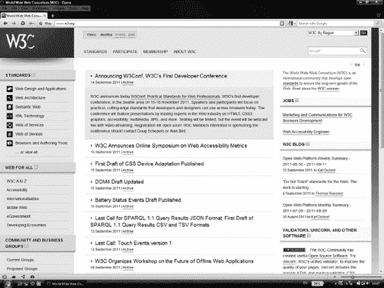

***图 9-1。**三列布局*

你可以在页面顶部看到主菜单。主菜单下面是主要内容。左边有子菜单，而右边有附加功能，如搜索框和博客条目。

##### 集中列布局

另一种典型的排列方式是使用宽度约为 700–900 像素的中央列(??)，理想情况下不超过 800 像素，以确保主要内容在 800×600 (SVGA)的小分辨率下仍然可见。 1 这类网站通常会把标题和主菜单放在最上面。或者，在主列的左侧(或右侧)可能有一个次级或子菜单。如果需要，可以在底部有一个页脚。

______________

1 下一个标准分辨率为 1024×768 (XGA ),比许多具有互联网浏览功能的现代移动设备的屏幕分辨率都要高，例如上网本或具有宽屏显示的小型笔记本电脑。由于典型分辨率不断提高，最新型号可能支持 1024×600 (WSVGA)或更高的分辨率，这为 XGA 优化提供了足够的宽度。智能手机屏幕的分辨率更小，网站可以通过替换样式表为其优化，正如前面在第五章中讨论的。

水平居中页面内容有多种可能性。一种常用的方法是将属性值`auto`应用到容器的左右两边(图 9-2 )。CSS2 规范 [3 ]的勘误表中介绍了这种技术。清单 9-1 显示了一个例子。

***清单 9-1。**自动宽度页边距居中*

`#content {
  width: 720px;
  margin: 0px auto;
}` 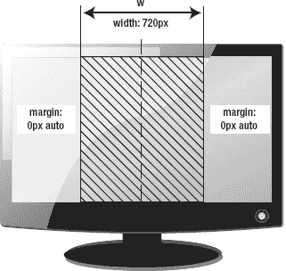

***图 9-2。**自动宽度页边距居中*

该方法适用于所有支持 CSS2 的浏览器。

Simon Coggins 介绍的另一种集中内容的方法是使用偏移量和负边距。在声明了容器元素的宽度之后(类似于前面的方法)，通过绝对定位和 50%的左偏移的组合，它的左边缘在页面内水平居中。由于内容从页面的后半部分开始，因此层的左边距应该设置为层宽度的一半。例如，如果要居中的层的宽度是 780px，左边距应该设置为-390px ( 图 9-3 )。

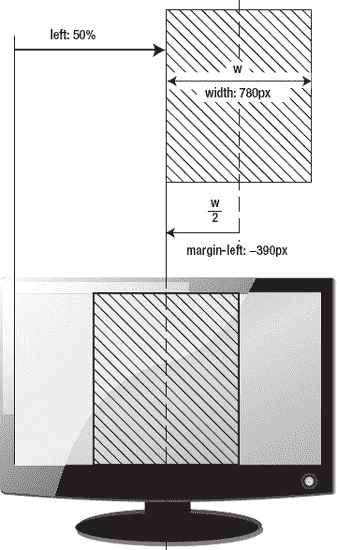

***图 9-3。**负边际集中*

相应的 CSS 规则集可以如清单 9-2 所示编写。

***清单 9-2。**负边际集中*

`#main {
  position:absolute;
  width: 780px;
  left: 50%;
  margin-left: -390px;
}`

##### 对象周围的文本

在许多情况下，网页文本应该“环绕”一个对象或图像。您可以通过使用`float`属性来实现这种效果；换句话说，图像(或者它的容器)应该是浮动的(清单 9-3 )。

***清单 9-3。**浮动图像容器的样式*

`#onleft {
  float: left;
}

#onright {
  float: right;
}`

图 9-4 显示了一个没有样式的图像和两个使用先前规则的浮动图像。如果没有浮动，文本不会环绕图像:只有文本的第一行出现在图像旁边(顶部照片)。第二张图片应用了清单 9-3 的第一条规则，呈现在左边，右边被文本包围。第三张图片使用了清单 9-3 中的第二条规则，因此出现在右边，而文字围绕在图片的左边。

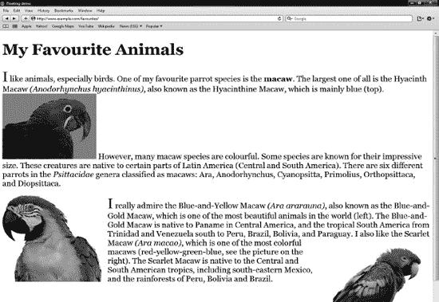

***图 9-4。**漂浮的影像*

由于文本将被呈现在浮动图像的右边，你应该声明边距以得到如清单 9-3 所示的最终结果。如果您想要在右侧显示一个页面的所有图像，您可以在没有标识符或类别的图像上指定`float:right;`规则为`img { float:right; }`。

如果要确保下一个段落显示在浮动图像的下面，可以使用`clear`属性来停止左侧(`clear: right;`)、右侧(`clear: left;`)或图像两侧(`clear:both;`)的浮动。

##### 层层叠叠

网站组件也可以在虚拟空间中考虑，其中组件顺序可以由表示深度(第三维)的 CSS 属性设置。这个属性叫做`z-index`。它经常用于设置层顺序。值越大，元素在堆栈中的顺序越高。具有最大`z-index`的元素出现在页面所有其他元素之上。这个属性只作用于定位的元素(有一个`position`规则的元素)。例如，清单 9-4 和清单 9-5 中的规则集将带有徽标的层放在主要内容之上。

***清单 9-4。**下层(对比清单 9-5 )*

`#main {
**  position:absolute;**
  width: 780px;
  left: 50%;
  margin-left: -390px;
**  z-index: 1;**
}`

***清单 9-5。**上层(对比清单 9-4 )*

`#logo {
**  position: absolute;**
  width: 146px;
  height: 120px;
  margin-top: 20px;
  margin-left: 20px;
**  z-index: 2;**
}`

 **注意** Flash 内容需要一个额外的参数，允许开发人员覆盖默认设置，将 Flash 内容呈现在其他元素前面(参见“在 XHTML 中嵌入 Flash”一节)。

### 排版

文本一直是一个基本的 web 组件。第一个 web 文档主要包含(如果不是全部的话)白底黑字的文本。在接下来的几年里，网络逐渐转变为一个完整的多媒体平台。同时，出现了更复杂的空白处理和字符编码。

与书籍和其他印刷媒体相反，在这些媒体中，正确的字体排列和字体设计总是由排版来保证，直到最近，网络还缺乏这些功能。

在引入 TFT 显示器和为其设计的 ClearType 字体后，字符在屏幕上变得非常清晰。随着网络字体的日益流行，网络上出现了层出不穷的各种字体。

你必须小心，不仅要提供引人注目的字体和类型，还要提供清晰易读的文本。实现这一目标所需的技术被称为*网页排版*，它也应该保证字符和空白的正确外观。

#### 误用字符

根据万维网联盟的说法，你应该注意在网页上使用正确的标点符号，而不是误用的对应符号(表 9-1 )  [4 )。哪些标点符号是印刷正确的取决于网页的自然语言。例如，在英式英语中，单引号通常比双引号更受欢迎，逗号通常位于右引号之外，而不是 ?? 之内。在其他语言中，引号可能会颠倒。在长破折号和短破折号的使用上也存在类似的差异。

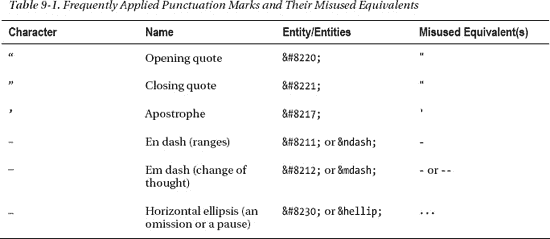

在某些字体中，左引号和右引号看起来是相同的，称为直引号、竖引号或打字机引号，不应在文本流中使用。另一方面，这些字符在标记中用作属性值的分隔符。

 **提示**许多文本编辑器不支持印刷(卷曲)引号，并插入它们误用的对等物。获得正确引号的一个方法是将它们插入到字处理器中(通常通过按 Shift+2)，然后通过剪贴板将字符复制到源代码中。

即使在标记中使用了正确的引号，浏览器也可能会错误地呈现它们。尽管将`q`标签应用于短引语是一个简单明了的想法，但是 2 浏览器会以不同的方式呈现它。Firefox 3.6.6 正确地呈现了左引号和右引号。但是，IE8 错误地应用了字符`„`来开始引用(结束是正确的)。在 Safari 5 和 Opera 10.6 中，被误用的等效物`"`被用于渲染。然而，报价的呈现也依赖于所使用的语言，并且依赖于标记中正确的语言设置。

#### 网页字体

最初，Web 是作为一种基于文本的媒体开发的。最初，可供 web 设计人员选择的字体仅限于所有主要平台上本地安装的字体的交集。1998 年，CSS2 规范引入了字体匹配和下载机制(在 CSS 2.1 中已被丢弃)。在 CSS3 中，可以应用外部字体，如果特定字体无法下载或没有安装在用户的计算机上，可以声明多个(相似)字体作为后备选项。然而，这项技术存在法律和技术两方面的问题。

______________

2 如果报价跨越多行，应该用 blockquote 标签代替。

字体一般是有版权的；因此，他们的字体文件不能在网站上存储和使用。甚至那些被宣传为免费字体的字体在很多情况下也不能用于网站。自从微软在“Web 核心字体”计划下发布了标准字体包，Arial、Georgia 和 Verdana(以及其他字体)已经成为 Web 上事实上的 ?? 字体。

 **注意**各种字体的字符种类千差万别。虽然大多数字体文件都支持英文字母和常用标点符号，但对于用英语以外的自然语言编写的站点来说，受支持字符的列表应该是一个主要问题。多语言网站不应应用不支持所有必需字符的字体文件，这使得不同语言版本可以应用相同的字体。避免不支持的字符的一个方法是应用 Unicode 字体。然而，并不是所有在字体收藏网站上显示为“Unicode 字体”的字体都支持真正广泛的 Unicode 字符。事实上，字体文件的大小通常为 20MB 到 25MB(相比之下，典型的字体文件大小为 50KB 到 300KB)，这对于 web 发布来说是不够的:字体文件在下载时不会出现，这比下载整个页面及其所有组件(包括图像)要花费更多的时间。

从技术角度来说，浏览器对字体嵌入和下载的支持因浏览器而异。然而，由于标准化和实现的日益普及，这种差异正在减少。从版本 4 开始，Internet Explorer 支持字体嵌入。其他浏览器推出了 *TrueType* (TT)和 *OpenType* (OT)字体的字体链接(Firefox 3.5+，Opera 10+，Safari 3.1+，Google Chrome 4.0+)。Internet Explorer 9+也支持 TT/OT 字体，但只支持那些嵌入权限设置为可安装的字体。TT 已经扩展到支持附加元数据和 gzip 压缩，称为 Web 开放字体格式(WOFF)。WOFF 是一种跨浏览器、仅用于 web 的格式，由 W3C[6 标准化，并受 Internet Explorer 9+、Mozilla Firefox 3.6+和 Google Chrome 5+支持。

 **注**出现在某些字母和符号笔画末端的半结构细节在印刷术中被称为*衬线*。使用衬线的字体，如 Times New Roman、Cambria、Garamond 和 Georgia，称为*衬线字体*。没有这些小突出特征的字体是*无衬线字体*、  3  例如，Verdana、Tahoma 和 Helvetica。声明一个通用字体系列(serif、sans-serif、草书、fantasy、monospace)是一个很好的后备机制 [ 7  ]。

______________

*sans* 这个词在法语中是“没有”的意思。

两种不同的字体(或者两种不同格式的同一个字体 4 )可以用回退机制声明，如清单 9-6 所示，也可以如清单 9-7 所示应用。

***清单 9-6。**使用不同格式存储的字体*

`@font-face {
  font-family: "Csuff";
  src: url("http://example.com/fonts/csuff.ttf");
  src: url("http://example.com/fonts/csuff.eot");
}`

***清单 9-7。**应用带有回退机制的网络字体*

`p {
  font-family: "Csuff", "Helvetica", sans-serif;
}`

请注意，还提供了广泛可用的字体，以及始终有效的字体系列声明，以防两种外部字体都无法使用。

 **提示**衬线字体易于阅读  5  适用于在网页上发布的中等或大字体的长文本块，以及打印机样式表。无衬线字体更适合小字体的短文本，例如页脚中的版权信息，通常用 Verdana 或类似的字体书写。像 Courier 和 DejaVu Sans Mono 这样的等宽字体是预格式化文本、计算机代码和打字机效果的理想选择。草书字体，如 Comic Sans MS 和 Brush Script，用于草书笔迹，如签名。幻想字体最适合用于标题和艺术文本(例如，Impact 和 Copperplate)。

字体的普通、粗体和斜体版本，以及粗体和斜体字体通常存储在单独的文件中。因此，需要多个声明来下载和应用所选字样的适当字体样式(清单 9-8 )。否则，标题和`strong`元素的内容将使用普通字体而不是粗体显示，`em`元素将使用普通字体而不是斜体显示，等等。

***清单 9-8。**同一字体的多个声明*

`@font-face {
  font-family: Calluna;
  src: url('fonts/Calluna-Regular.otf');
}

@font-face {
  font-family: Callunab;
  src: url('fonts/Calluna-Bold.otf');
}

@font-face {
  font-family: Callunai;
  src: url('fonts/Calluna-It.otf');
}

body {
  font-family: "Calluna", "Helvetica", serif;
}

h1, h2, h3, strong {
  font-family: "Callunab";
}

em {
  font-family: "Callunai";
}`

______________

虽然有将字体从一种格式转换成另一种格式的工具，但在许多情况下这是法律禁止的。

这就是它们被广泛应用于书籍、报纸和杂志的原因。

网络字体也有一些替代品。一种被称为*图像替换*的技术，被许多人认为是合法的，被一些网页设计师用来使用字体的渲染图像。然而，图像替换阻止了文本选择，具有可搜索性和可访问性问题，并且增加了带宽使用。

另一种方法是应用基于闪存的解决方案*可扩展的因曼闪存替代方案* ( *sIFR* )。它类似于图像替换，但文本是可选的，并呈现为矢量图形。一个很大的缺点是，这种方法依赖于客户端的 Flash 插件。

文字也可以用 SVG 或者 VML 6 (对于 Internet Explorer 到版本 8)用 JavaScript 替换。

在 SVG 1.1 中，可以在 SVG 文档中创建字体。SVG 字体可以改善表示文本的图形(如徽标)的语义。Safari 3+和 Opera 8+部分支持 SVG 字体。

类似于(X)HTML 文档，CSS 也可以应用在 SVG 文档中。因此，`@font-face`规则也可以用于 SVG 文本 [8 ]。清单 9-9 显示了一个例子。

***清单 9-9。**在 SVG* 中使用`@fontface` CSS 规则的例子

`<?xml version="1.0" encoding="UTF-8" standalone="no"?>
<!DOCTYPE svg PUBLIC "-//W3C//DTD SVG 1.1//EN"
 "http://www.w3.org/Graphics/SVG/1.1/DTD/svg11.dtd">
<svg version="1.1">
  <defs>
    
  </defs>
  <text x="20"  y="40" style="**font-family: Calluna,** serif; font-size: 1.2em; stroke: #0f0;
   fill: #0f0;">SVG text with Web Fonts</text>
</svg>`

______________

早期版本的 Internet Explorer 不支持 SVG，而是支持矢量标记语言(VML ),现在已经过时。

### 嵌入外部内容

大多数网站不仅包含格式化文本，还包含图形和多媒体内容、音频和视频剪辑以及 Flash 动画。与文本文件中由标记语言描述的格式化文本内容不同，这种类型的内容是从二进制文件中检索的。尽管它的最佳格式和功能没有针对 web 发布进行标准化，但它的优化对整体外观、观感、文件大小和下载时间有着巨大的影响。

#### 光栅图形

位图图形(也称为光栅图像)是常见的网站组件，它存储在映射的位数组中，代表像素网格。在 web 上，位图文件格式主要用于存储照片和其他非艺术线条的图像。有几个图像文件功能需要针对 Web 发布进行优化，如像素密度、颜色深度和分辨率。您应该根据内容和期望的质量来选择文件格式。

Web 图像处理和润饰的黄金法则是，无论要修改什么，都不要覆盖原始的主文件(即使文件很大)。例如，如果您不保留`.psd`文件，则在 Photoshop 中的多个图层上创建的复合图像中的标题以后将无法修改。同样，如果您没有存储原始文件，经过大量修饰或压缩的照片也无法恢复到原始状态(这在许多情况下可能很有用)。

 **注**以下章节描述了主要特点和可能性；然而，图像处理的详细描述超出了本书的范围。

##### 像素密度

不仅仅是文本内容，图形也可以而且应该针对网络发布进行优化。*空间点密度*的度量是每英寸点数(dpi)，这意味着在 1 英寸(2.54 厘米)的跨度内，一条线上代表的单个点的数量。虽然点密度与图像分辨率相关，但它是间接相关的。然而，代替用于打印的点，计算机屏幕应用像素来构建图像。它们的密度可以用每英寸像素(ppi)来表示。虽然令人困惑，但计算机屏幕的标准化像素密度通常以 dpi 而不是 ppi (72、96 和 120 dpi)表示是不正确的。最低值 72 ppi 来自印刷字体，其中 1 磅被定义为 1/72 英寸(0.0139 英寸或 352.8 米)。在 72 ppi 屏幕上显示的图像与 72 dpi 的打印版本具有相同的物理尺寸；换句话说，纸上的 1 pt 等于屏幕上的 1 px。然而，这只是一种理论方法；并不准确，也失去了意义。由于像素密度不仅影响图像渲染的质量，也影响文本的可读性，较高的值为提供了更好的用户体验。现代操作系统和计算机屏幕通常支持 96–120 PPI。屏幕的像素密度可以通过以像素为单位的对角线分辨率(使用勾股定理)和以英寸为单位的对角线尺寸的比值来计算:

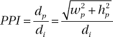

在哪里

*dp以像素为单位的对角线分辨率，*

*wp是以像素为单位的宽度分辨率，*

*hp是以像素为单位的高度分辨率，并且*

*dI是以英寸为单位的对角线尺寸。*

例如，一台配备 WSVGA (1024x600)屏幕的 10.1 英寸上网本提供 117.51 ppi，一台配备 WSXGA+ (1680x1050)屏幕的 20 英寸显示器提供 99.06 ppi，一台 23 英寸高清(1920x1080)显示器提供 95.78 ppi。

智能手机从这方面来说很有竞争力。4.3 英寸的 HTC Evo 4G 拥有 WVGA (800x480)屏幕，对应的像素密度为 216 ppi。2010 年，苹果 iPhone 4 采用了最大分辨率的屏幕，称为*视网膜显示屏* (960x640)，这为 3.5 英寸的屏幕提供了令人难以置信的 326 ppi 7 。截至 2011 年，高端智能手机推出了分辨率为 1280x720 的高清显示屏，典型屏幕尺寸为 4.3 英寸，像素密度甚至更高。

虽然 web 发布的最佳像素密度还没有标准化，但应该考虑到计算机屏幕和设置通常最大支持 120 ppi，平均应用 96 ppi。较大的像素密度会不必要地增加文件大小。

##### 分辨率

在屏幕上，分辨率决定图像大小，而不是一般的质量(打印则相反)。作为一般规则，应该应用提供所需细节的最小图像尺寸。在大多数情况下，现代数码相机拍摄的 8-10 MP 照片应该调整到较小的分辨率，以便在网络上发布。应该记住的是，高分辨率的照片体积很大(根据压缩比和文件格式，可能有几兆字节)，因此下载时间太长。此外，他们有太多的细节，可能会导致法律问题，考虑到背景中的人脸、车牌等等。人脸的高分辨率描绘可以用于欺诈目的，因为它可以很容易地修饰和打印(特别是在护照尺寸上)。

强烈建议在`img`元素上提供`width`和`height`属性，以便更快地呈现网页图像。但是，这些属性不应该用于调整照片的大小。在线画廊和相册应该应用链接到原始或全尺寸版本图像的小缩略图。

______________

在距离人眼 12 英寸的距离，这是人类视网膜能够处理的最大细节量(因此得名)。

##### 走样

调整数字图像的大小会导致失真和质量下降。例如，以较低分辨率呈现的高分辨率图像可能会导致称为*混叠*的失真伪像。*抗锯齿*允许物体的边缘被平滑渲染。在 web 上，抗锯齿通常应用于字体和弯曲的 Web 图形，如圆角。

抗锯齿需要与背景融合的强度逐渐降低的额外颜色(图 9-5 )。

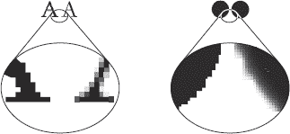

***图 9-5。**锯齿与反锯齿字体和圆圈。上面是原始图像，下面是放大图。注意左边图像的像素化边缘。*

在网络上使用抗锯齿字体有利也有弊。最重要的优势是更平滑的字体，其中许多更容易阅读，因为减少了模糊，与印刷类型相似(取决于所使用的字体)，并且在许多情况下更美观。然而，小字体变得太模糊而无法阅读，而且锐利的边缘也不总是精确的。

 **注意**不同网页字体的可读性差别很大，甚至同样的字体在中等大小时看起来很漂亮，但用小字体时就变得不可读了。这两种状态之间通常会有一个过渡:字体曲线的某些部分会消失，而其他部分仍然可见。而且同样的网页字体在各种浏览器中的渲染也是不一样的。

##### 颜色深度

在位图图像或视频帧缓冲区中表示单个像素的颜色所需的位数通常从 1 到 2 不等 32 ，被称为*色深*。因此，颜色深度越高，文件越大，这是图像优化的一个重要因素。

单色(二进制)图像(如带有黑线的艺术线条)应以 1 位色深存储，换句话说，每个像素有两个可能的值。

完全由 256 种灰度组成的黑白照片应该表示为 8 位灰度图像(2 8 = 256)。

24 位色深(*真彩色*)应用每通道`0`和`255`之间的各种强度值的红色、绿色和蓝色(RGB 颜色模型)，以通过加色混合再现 282828= 224= 16，777，216 种不同的颜色。因为人眼不能区分这些通道的任何两个相邻强度值，所以这个色深足以存储照片。

具有部分透明部分的照片级真实感图像可以用 32 位表示，并带有一个称为 *alpha 通道 8* (即 RGBA 色彩空间)的附加通道。

徽标、象形图和图标的颜色深度会有所不同，这取决于复杂性和图像内容。

##### 压缩

为了减小文件大小，数字位图图像通常被压缩。由于所需带宽较小，压缩图像不仅在存储方面很受欢迎，在网络发布方面也很受欢迎。

图像压缩可以是有损的或无损的。在*有损压缩*的情况下，部分原始信息丢失且无法恢复，可能会影响图像质量。*无损压缩*算法允许从压缩数据中重建原始数据，这是一个很好的功能，但并不总是需要。有损压缩算法产生的文件通常比使用无损压缩的文件小；但是，如果压缩比过高，它们的质量可能会降低。如您所见，JPEG 是最流行的有损图像格式，PNG 是网络上最流行的无损图像格式。

图像处理软件工具通常提供调整压缩程度的选项，使得在存储大小和图像质量之间进行权衡成为可能。例如，Adobe Photoshop 有一个 JPEG 压缩比的标度，其值为`0`–`12`。支持的质量范围有`Low`(`0`–`4`)`Medium`(`5`–`7`)`High`(`8`–`9`)`Maximum`(`10`–`12`)。在文件另存为…对话框中确定文件的名称和目的地后，这些设置才可用(图 9-6 )。

______________

还有其他方法来提供透明度，但对于部分透明的照片，这是常见的解决方案。

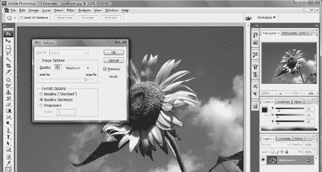

***图 9-6。**文件小质量好*

JPEG 通常可实现 10:1 的压缩，图像质量几乎没有损失。

##### 隔行扫描

某些位图格式(如 GIF 和 PNG)可以在图像完全下载之前提供图像的降级副本。这种方法被称为*交错*。先进的图像处理软件应用支持隔行扫描，并提供将这些文件保存为*隔行扫描*或*非隔行扫描*的选择。通过在*渐进式 JPEG* 文件中应用*频率分解层级*，可以在照片中实现类似的效果。在慢速拨号连接的时代，交错是一个有用的功能，但在高速互联网连接广泛应用后，它失去了大部分的意义。

##### 透明度

部分透明的图像越来越受欢迎。它们不仅可用于设计效果，还可提供可用于不同背景颜色或纹理的图像(图 9-7 )。

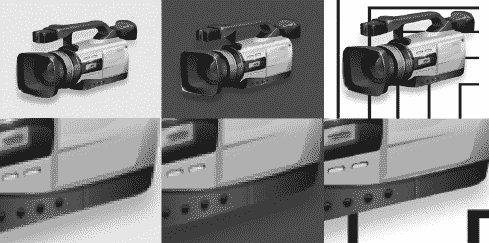

***图 9-7。**三个不同背景上的图像(第一行)。第二行放大到 600%。透明阴影完全适合所有背景*

然而，并不是所有的光栅图像格式都支持透明。对于部分透明的几何形状和卡通风格的图像，GIF 通常是一个好的(有时是最好的)选择，而 PNG 则是更复杂的部分透明图像的理想选择。除了具有相对较大的相同颜色区域的非常简单的形状之外，PNG 是更好的选择。

##### 光栅文件格式

网络上最常见的光栅图像文件格式是 JPEG、GIF 和 PNG。

联合图像专家组(JPEG)是一种常见的数字照片有损压缩格式。第一部分已在 ISO/IEC 10918-1:1994  [9 ]和 ITU-T T.81 (09/92)  [10 ]、ISO/IEC 10918-2:1995[11]和 ITU-T T.83 (11/94)  [12 ]、ISO/IEC 10918-3:1997[13]和 ITU-T T . 84(07/96)[[14]中标准化](#ref14)

图形交换格式的原始版本 GIF87a 于 1987 年 [18 ]推出，支持透明和隔行扫描的增强版本 GIF89a 于 1989 年 [19 ]推出。

可移植网络图形(PNG)格式由 IETF RFC 2083 在 1997 年 [20 ]和 ISO/IEC 15948 在 2004 年 [21 进行标准化。然而，PNG 格式直到最近才获得完全支持。尽管 Internet Explorer 从 4.01b 版开始支持 PNG 图像，但直到 IE9，这种实现既不完整也不正确(例如，IE6 对 alpha 通道透明性的支持有缺陷)。各种浏览器之间的颜色不一致，部分原因是伽玛校正的处理方式不同(例如，在 Windows 下运行的 Safari 上，PNG 图像的颜色显示不正确)。幸运的是，现代浏览器克服了这些问题。

为给定图像选择正确的文件格式，应考虑文件类型和压缩算法的主要特征(表 9-2 )。

例如，与 JPEG 等其他格式相比，简单的图像(如实心圆)可以用两种颜色存储在 GIF 中，文件大小非常小。对于没有复杂内容的图像，可以使用 GIF、TIF 和 PNG 等文件格式的调色板(选定/索引颜色)来降低颜色深度。当然，抗锯齿版本需要更大的颜色深度，从而导致更大的文件大小。尽管 GIF 和 PNG 格式通常比 JPEG 更适合存储图标和徽标，但对于此类内容，应该首选 SVG 矢量格式(参见“矢量图形”一节)。

尽管 JPEG 压缩算法对照片非常有效，但它会向整个图像添加额外的像素，包括实心区域。结果，简单的图像变得比原来更复杂。这就是为什么以 JPEG 格式存储的实心圆，即使压缩率很高，其文件大小也比相同内容的 GIF 文件大几倍的主要原因。此外，如果压缩比高，JPEG 伪像会变得明显，从而导致图像质量降低。另一方面，JPEG 可以完美地处理复杂的图像。如果压缩设置正确，图像质量与文件大小的比率非常好。

##### 文件大小优化

像素密度、分辨率、尺寸、颜色深度、压缩比、图像复杂性和文件格式都对文件大小有很大影响。

______________

有一个叫做动画可移植网络图形(APNG)的扩展支持动画。APNG 由 Firefox 3+，Opera 9.5+和谷歌 Chrome 的插件提供原生支持。

应该通过裁剪图像中无用或不必要的部分来优化宽度和高度。对于扫描的高分辨率图像，这是一项典型的任务，在这种情况下，通常可以删除图像部分而不会丢失信息。

必须使用所需的颜色深度；24 位色深是许多软件工具中的默认设置，在许多情况下可以在不影响图像质量的情况下降低色深。例如，黑白绘图不应存储 1600 万色。

所有图像都必须使用合适的压缩比。

使用 Photoshop 的文件保存为 Web & Devices…功能(图 9-8 )可以有效优化大小质量比。

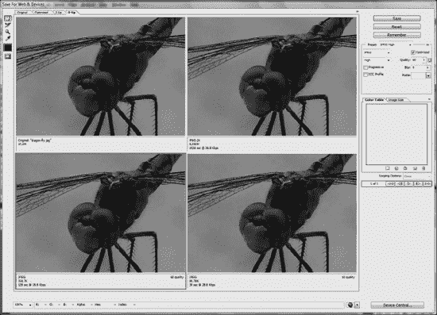

***图 9-8。**Photoshop 中网页发布的文件格式和设置比较*

Photoshop 还提供对所需文件大小的优化，但应该记住，图像内容和复杂性决定了合理的压缩级别。

除了 Photoshop 或 GIMP 中可用的 JPEG 文件的压缩设置之外，一些软件工具(如 JPEG Optimizer  [22 ])能够通过对各种图像区域应用不同的压缩比来优化文件大小与质量的比率。

文件大小优化的主要目的是实现文件大小和图片质量之间的完美平衡。一个包含低质量图片的快速网页是没有意义的。

小的、高度压缩的版本(缩略图)应该提供到在线照片图库和相册中更大的、高质量版本的链接。这种方法允许用户确定图像是否与他们相关，因此，下载更大的版本是合理的，这自然会花费更多的时间。

#### 矢量图形

矢量图像和位图图像有不同的应用领域。位图最适合于照片和照片级真实图像，而矢量图像可以应用于由直线和曲线组成的艺术品和插图。尽管如此，位图仍然在 Web 上广泛用于各种图像，包括应该以矢量格式提供的图像，部分原因是缺乏对所有主流浏览器的单一标准矢量格式的本地支持。在圣文森特和格林纳丁斯的广泛支持下，这种情况已经开始改变。

可缩放矢量图形应优先用于所有需要基本形状的图像，如圆形和多边形、贝塞尔路径和曲线、文本、不透明度、变换(旋转、倾斜、缩放等)、 10 渐变和动画。SVG 内容也可以与位图图形结合，例如与 PNG 文件结合。

和 PNG 类似，为了向后兼容，也要考虑 SVG 的浏览器支持。应该记住，浏览器对 SVG 的支持与内联 SVG 不同，SVG 应该通过`img`或`object`元素嵌入。此外，SVG 有几个版本，对不同版本的支持也各不相同。Gecko 布局引擎自 2005 年以来一直没有完整的 SVG 1.1 支持，自 2006 年以来一直没有完整的 WebKit 支持。Opera 从版本 8 开始支持 SVG 1.1 Tiny，从版本 9 开始支持 SVG 1.1 Basic 和部分 SVG 1.1 Full，从版本 9.5 开始支持部分 SVG Tiny 1.2(包括压缩 SVG)。

#### 闪光

Flash 是在 Web 上发布活动内容的最流行的技术之一。然而，Flash 开发工具提供的标准嵌入代码通常不符合标准，并且存在一些与浏览器相关的问题。此外，如果 Flash 内容由于任何原因无法显示，则应支持自动激活的替代内容。

##### 在 XHTML 中嵌入 Flash

第一个 Flash 实现应用了`embed`元素，该元素在 HTML 4 和 XHTML 中被弃用，取而代之的是`object`元素，但后来又被重新添加到 HTML 5 规范中(见下一节)。因此，在 XHTML 文档中，Flash 内容应该由`object`元素提供。

为了避免特定于浏览器和供应商的代码，已经引入了各种实现方法，包括复制(两次烹饪的方法*)、嵌套对象方法*和*闪存数据格式*。后者，即闪存 Satay，通过包含一个额外的`movie`参数，提供了健壮的、符合标准的闪存实现。W3C 也建议这种方法 [23 ]。清单 9-10 显示了一个例子。**

 **______________

CSS3 也支持类似的效果。

***清单 9-10。**利用 Flash Satay 嵌入 Flash*

`<object type="application/x-shockwave-flash" **data="australia.swf"** width="735" height="677" 
 id="flash">
  <param **name="movie" value="australia.swf"** />
</object>`

注意，同一个 Flash 文件既被指定为`object`元素上的`data`属性值，又被指定为`movie`参数值。同样重要的是要认识到，旧方法使用的`classid`和`codebase`参数已经被取消。如果在修改传统 Flash 嵌入代码时将`codebase`参数留在代码中，它会阻止 Firefox 呈现 Flash 内容，而显示可选提供的替代内容(或者什么也不显示)。

然而，即使这种方法也有一些已知的问题。例如，使用 Flash Satay 方法，某些浏览器(如 Internet Explorer)不会流式播放 Flash 电影。等待整个文件下载完毕，然后开始播放，这种方法只适用于小文件和快速互联网连接。

如果您开发一个网页，各层之间相互重叠，那么默认情况下 Flash 内容会出现在所有其他网站元素的上方，这可能会非常令人沮丧。为了提供在包含 Flash 内容的页面中设置层顺序的可能性，应该设置一个附加参数(`wmode`)(清单 9-11 和 9-12 )。

***清单 9-11。**设置不透明 Flash 内容的`wmode`*

`<param name="wmode" value="opaque" />`

参数值`opaque`表示内容不透明。如果是透明的，属性值应该改为`transparent` ( 清单 9-12 )。

***清单 9-12。**设置透明闪光内容的`wmode`*

`<param name="wmode" value="transparent" />`

虽然 Flash 内容的透明度和 Flash 内容在图层顺序中的堆栈位置之间似乎没有关联，但是应该使用`wmode`参数来设置这两者。在`wmode`参数上使用了`opaque`或`transparent`属性值；Flash 内容可以发送到网页中的任何层之后(或在层顺序中的任何所需位置)。与`wmode`相关的唯一问题是 Flash 内容对于使用屏幕阅读器的用户来说变得不可访问，因此最好尽可能避免。

类似于(X)HTML 标记，Flash 内容应该是可访问的和搜索引擎友好的。应该检测用户安装的 Flash 插件的版本，以确定它是否是最新的。过时的插件可能会遇到只有更高版本的插件才支持的功能。这应该被认为是为了消除破碎和缺失的内容。

至于版本困境，Adobe 提供了 Flash Player 检测套件[24；然而，该套件提供的代码不符合标准。

DOM 脚本可以解决这些问题。一个开放源代码的例子是 Geoff Stearns 等人的 *SWFObject* 。SWFObject 提供了一种跨浏览器的方法，使用非常小的 JavaScript 代码将 SWF 文件嵌入到网页中。这段 JavaScript 代码检测 Flash Player、声明替代内容、改进搜索引擎索引、帮助 Flash Player 下载(如果没有安装的话)、包括 Adobe Express Install 并为 JavaScript 开发人员提供一个 API。然而，使用 JavaScript 的版本检测依赖于脚本，导致更长的代码，并且使 Flash 嵌入过于复杂。作为结论，没有比 Flash Satay 更好的符合标准、跨浏览器的 Flash 嵌入方法了。

##### 在(X)HTML5 中嵌入 Flash

HTML5 有一个`embed`元素，用于需要插件的嵌入内容。它支持 HTML5 的所有标准属性和事件属性。此外，它还具有特定的属性`src`、`type`(指定 MIME 类型)、`height`和`width`。你可以像清单 9-13 中的那样使用它。

***清单 9-13。**嵌入在(X)HTML5 中的基本 Flash】*

`<embed src="australia.swf" />`

`embed`标签还支持 HTML5 的全局和事件属性，这已经在第三章中讨论过了。

#### 音频

在 HTML5 之前，从来没有对在网页上播放音频的原生标记支持。大多数音频内容都是通过 Flash 等插件播放的。这种方法的主要问题是，并非所有的浏览器都有相同的插件。

HTML5 指定了通过`audio`元素包含音频内容的标准方式。它可以用来播放声音文件以及音频流。元素支持三种主要的音频格式:MP3、Ogg Vorbis 和 WAV。然而，浏览器对这些格式的支持各不相同(表 9-3 )。注意在 IE8 和更早的版本中根本不支持`audio`元素。

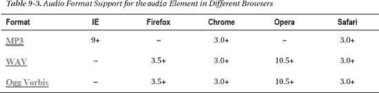

元素的基本用法很简单(清单 9-14 )。

***清单 9-14。**基本音频嵌入(X)HTML5*

`<audio src="valerie.mp3">
</audio>`

除了指定要播放的音频内容的源 URL 的`src`属性之外，还有用于自动播放(`autoplay="autoplay"`)、控制按钮(`controls="controls"`)、重复播放(`loop="loop"`)和在页面加载时加载(`preload="preload"`)的其他属性。如果`autoplay`存在，则最后一个被忽略。

为了实现更高级别的可访问性，应该提供替代内容(清单 9-15 )。

***清单 9-15。**音频替代内容*

`<audio src="valerie.mp3" controls="controls">
  
<a href="valerie.mp3">Valerie by Joy</a>

</audio>`

由于浏览器支持的某些格式不能在另一种浏览器中播放，`audio`元素允许链接到不同音频文件的多个源声明。清单 9-16 显示了一个例子。

***清单 9-16。**不同格式的多源申报*

`<audio controls="controls">
**  <source src="valerie.mp3" type="audio/mpeg" />**
**  <source src="valerie.ogg" type="audio/ogg" />**
  
<a href="valerie.mp3">Valerie by Joy</a>

</audio>`

浏览器可以播放不同音频格式中第一个支持的格式。

#### 视频

多年来，发布视频只能通过通用对象嵌入来实现。由于各种视频和音频编解码器以及不同的浏览器支持，仍然没有在 Web 上发布视频的最终解决方案。

##### 在 XHTML 中嵌入视频

YouTube 或 Google Video 等视频共享服务通过 Flash Player、播放电影，其中的内容可以使用前面讨论过的 Flash Satay 方法嵌入。清单 9-17 显示了一个例子。

***清单 9-17。**使用 Flash Satay 嵌入 Flash Sdeo】*

`<object type="application/x-shockwave-flash" 
 data="http://video.google.com/videoplay?docid=4226784084458819393#" width="400" 
 height="326" id="VideoPlayback">
  <param name="movie" value="http://video.google.com/videoplay?docid=4226784084458819393#" />
  <param name="allowFullScreen" value="true" />
  <param name="allowScriptAccess" value="always" />
</object>`

窗口媒体视频文件(`.wmv`)可以通过使用 MIME 类型`video/x-ms-wmv` ( 清单 9-18 )来嵌入。

______________

Adobe Flash Player 广泛用于在网站上嵌入视频，因为许多浏览器都提供了原生支持。

***清单 9-18。**嵌入 WMV 视频文件*

`<object type="video/x-ms-wmv" 
 data="http://www.example.com/dreamcar.wmv" 
 width="320" height="260">
  <param name="src" value="http://www.example.com/dreamcar.wmv" />
  <param name="autostart" value="true" />
  <param name="controller" value="true" />
</object>`

对于 QuickTime 视频，有专门的 MIME 类型:`video/quicktime`和`application/x-quicktime`。IE 倾向于通过 ActiveX 控件打开这样的视频。为了以独立于浏览器的方式嵌入 QuickTime 视频，你可以使用列表 9-19 中的方法。

***清单 9-19。**嵌入一个 QuickTime 视频文件*

`<object classid="clsid:02BF25D5-8C17-4B23-BC80-D3488ABDDC6B" 
 codebase="http://www.apple.com/qtactivex/qtplugin.cab" width="352" height="288">
  <param name="src" value="http://www.example.com/video/dreamcars.mov" />
  <param name="controller" value="true" />
  <param name="autoplay" value="false" />
  <!--[if !IE]>-->
    <object type="video/quicktime" data="http:// www.example.com/video/dreamcars.mov" 
     width="352" height="288">
    <param name="autoplay" value="false" />
    <param name="controller" value="true" />
  </object>
  <!--<![endif]-->
</object>`

作为 IE 风格的条件注释 12 提供的代码被除了 Internet Explorer 之外的所有浏览器使用，在 Internet Explorer 中它被隐藏并应用外部对象。

##### 在(X)HTML5 中嵌入视频

与使用 XHTML 中的`object`元素嵌入视频的复杂性相反，(X)HTML5 提供了`video`元素，它易于使用，并且对嵌入的视频具有完全的控制权。IE9+、Firefox 3.5+、Chrome 3.0+、Opera 10.5+和 Safari 3.0+都支持`video`元素。但是，其可用性还取决于支持的编解码器。如果你只是从大量的视频文件格式中想到 DivX、Xvid、WMV、FFmpeg、3ivx、索伦森或 Flash Video，web 浏览器的视频编解码器支持无疑还处于初级阶段(表 9-4 )。

______________

这个方法是由拉克伦·亨特提出的。

当然，没有必要最大化 Web 上本地支持的视频格式的数量，但是对最广泛使用的高级格式的可靠支持将是可取的。

 **注意**许多视频文件都是以容器格式存储的，并不局限于一种视频和音频编解码器。因此，对视频容器的完全支持应该包括对该容器格式中允许的所有类型的视频和音频编解码器的支持。例如，如果浏览器供应商希望引入对`.flv` Flash 视频的支持，则需要支持 H.264/MPEG-4 AVC、Sorenson、Screen Video 和 VP6 视频编解码器，以及 AAC、ADPCM、Linear PCM、Nellymoser、MP3 和 Speex 音频编解码器。此外，许多编解码器拥有专有许可证或受到专利的阻碍(这是 Chrome 放弃 H.264 支持的主要原因)。显然，音频和视频编解码器的不同关联以及许可问题使得在 Web 上标准化视频实现变得相当复杂。不同的格式适合不同的用途和应用领域，视频发布没有终极选择:看场景而定。

清单 9-20 显示了`video`元素的基本代码。

***清单 9-20。**基本视频嵌入(X)HTML5*

`<video src="sample.ogv">
</video>`

可以随意添加高度或宽度等特征。在视频无法呈现的情况下，也可以定义表示视频中的一帧的图像。此外，在开始和结束的`video`标签之间也可以给出替换内容(清单 9-21 )。

***清单 9-21。**(X)html 5 视频嵌入的附加属性和替代内容*

`<video src="sample.ogv" width="320" height="240" poster="sample.jpg">
**  
Download the <a href="video.ogv">sample video</a> (OGV, 5.34 MB)
**
</video>`

通过使用`video`元素上的`controls`属性，可以在浏览器中显示或隐藏视频控件(清单 9-22 )。

***清单 9-22。**为(X)HTML5 视频嵌入设置显示的控件*

`<video src="xyz.mov" **controls="controls"**>
</video>`

由于每个浏览器中的视频编解码器支持不同，因此可以以各种格式提供相同的视频，从而避免了下载无法在系统上播放的视频的需要。清单 9-23 显示了一个例子。

***清单 9-23。**不同格式的相同视频*

`<video>
**  <source src="video.mp4" type="video/mp4" />**
**  <source src="video.ogv" type="video/ogg" />**
  
Download the <a href="video.ogv">sample video</a> (OGV)

</video>`

但是，MIME 类型不能反映以容器格式存储的视频的编解码器(例如，MPEG-4 中的 H.264)。它们可以由`codecs`参数提供(清单 9-24 )。

***清单 9-24。**在(X)HTML5 中声明视频编解码器*

`<video controls="controls">
  <source src="video.mp4" **type='video/mp4; codecs="avc1.42E01E, mp4a.40.2"'** />
  <source src="video.ogv" **type='video/ogg; codecs="theora, vorbis"'** />
  
Download the <a href="video.ogv">sample video</a>

</video>`

必须注意对`type`属性值交替使用单引号和双引号。

(X)HTML5 的`video`元素提供回放支持检测，包括`media`元素上的`canPlayType()`方法或`onerror`事件监听器。清单 9-25 是第二种方法的一个例子。

***清单 9-25。**视频背板支持(X)HTML5 中的检测*

`<video controls="controls">
  <source src="video.mp4" type='video/mp4; codecs="avc1.42E01E, mp4a.40.2"' />
  <source src="video.ogv" type='video/ogg; codecs="theora, vorbis"' 
**   onerror="fallback(this.parentNode)**" />
  
Download the <a href="video.ogv">sample video</a> (OGV)

</video>`

主要问题是浏览器中的视频支持还没有标准化。因此，不存在最终的跨浏览器视频嵌入代码。

尽管`video`元素的主要优点之一是避免了`object`元素和插件声明，但它们在某些情况下仍然有用。如果插件优于简单的错误消息，那么可以将`object`元素嵌入到`video`元素中。Flash 支持 MPEG-4/H.264/AAC 播放，所以一个`.mp4`文件通常可以用清单 9-26 中给出的代码播放。

***清单 9-26。** MPEG-4 背板*

`<video controls="controls">
  <source src="video.mp4" type='video/mp4; codecs="avc1.42E01E, mp4a.40.2"' 
   onerror="fallback(this.parentNode)" />
  <object data="videoplayer.swf">
    <param name="flashvars" value="video.mp4" />
    
Download the <a href="video.ogv">sample video</a> (OGV)

  </object>
</video>`

某些浏览器无法播放视频或自动下载整个视频文件，即使播放尚未开始。Firefox 3.6+是一个例外，它只下载确定持续时间和渲染视频帧所需的片段。这个行为可以被`preload`属性覆盖。属性值`none`强制浏览器避免下载。`metadata`属性值暗示应该下载足够的数据来显示一帧并确定持续时间。值`auto`如果可能的话下载整个视频。通过省略仅在用户点击按钮时才提供的属性和源元素，可以在不支持`preload="none"`的浏览器中模拟它的效果(清单 9-27 )。

***清单 9-27。**用户点击*加载视频

`<video controls="controls">
  Video not supported
</video>
<input type="button" value="Load video" 
** onclick="document.getElementsByTagName('video')[0].src = 'video.mp4';"** />`

此外，自定义控件也可以添加到视频嵌入中，因为(X)HTML5 中用于视频的 DOM API 支持几个可以通过 JavaScript 处理的事件。清单 9-28 显示了一个例子。

***清单 9-28。**定制视频控件*

`
<input type="button" value="Play" onclick="video.play()" />
<input type="button" value="Pause" onclick="video.pause()" />`

回放可以通过`video`元素的`autoplay`属性自动开始(清单 9-29 )。

***清单 9-29。**自动开始播放视频*

`<video src="abc.mp4" **autoplay="autoplay"**></video>`

然而，并不是所有的用户都想下载视频，一个`start`按钮通常是首选。此外，如果同一页面上有多个视频，自动播放是不可能的，尤其是如果至少有两个不是静音的。

目前，`video`标签的`src`属性值应该是一个物理文件，这样就无法嵌入你最喜欢的来自 YouTube 的阿斯顿马丁视频。例如，清单 9-30 中的代码不能使用。

***清单 9-30。**使用`video`标签无法播放 YouTube 视频(非法示例)*

`<video src="http://www.youtube.com/watch?v=wKhEpifPTlY"></video>`

(X)HTML5 视频可以使用`drawImage`方法用 JavaScript 在`canvas`上动态绘制，如清单 9-31 所示。

***清单 9-31。**使用 JavaScript 在画布上绘制的视频*

`<video src="video.mp4" controls="controls">
  Video not supported
</video>
<canvas id="canvas">
  Canvas not supported
</canvas>
`

### 总结

在本章中，您学习了如何通过使用标准优化外观来提供高级用户体验。您已经熟悉了许多有助于用户印象并影响网站可用性和功能的网站组件。您知道确保在各种设备上的正确外观是一个真正的挑战，这可以通过创建具有健壮布局的独立于浏览器和分辨率的网站来实现。您很清楚，许多曾经流行的技术已经过时，表格应该用于表示表格数据，而不是用于布局。CSS 提供了对网站组件外观的完全控制，应该使用多列布局来代替框架集文档。您还知道如何为您的网站优化图像，并以独立于浏览器、符合标准的方式嵌入 Flash 和视频文件。

在下一章中，你将学习最大化用户访问你的网站的可访问性技术。通过遵循可访问性指南，您不仅能够支持残障人士和移动用户，还能够支持所有其他人，因为每个人都从高级别的 web 可访问性中受益。

### 参考文献

1.  hazal-Massieux D(2005)无表布局指南。万维网联盟。[www.w3.org/2002/03/csslayout-howto](http://www.w3.org/2002/03/csslayout-howto)2010 年 12 月 7 日访问
2.  Cederholm D (2009) CSS 布局。在:网络标准解决方案，特别 edn。伯克利艾德的朋友
3.  REC-CSS2-19980512 中的 W3C (2003)勘误表。万维网联盟。[www.w3.org/Style/css2-updates/REC-CSS2-19980512-errata.html](http://www.w3.org/Style/css2-updates/REC-CSS2-19980512-errata.html)2010 年 12 月 14 日访问
4.  W3C (2010)英文排版。W3C 备忘单。万维网联盟。www.w3.org/2009/cheatsheet/#typo[。2010 年 12 月 7 日访问](http://www.w3.org/2009/cheatsheet/#typo)
5.  Mason B (2009)当免费字体不再免费时。小批量公司[`blog . type kit . com/2009/06/11/when-free-fonts-arent-free/`](http://blog.typekit.com/2009/06/11/when-free-fonts-arent-free/)。2011 年 1 月 24 日访问
6.  基尤 J，乐铭 T，范布洛克兰德 E (2011) WOFF 文件格式 1.0。万维网联盟。[www.w3.org/TR/WOFF/](http://www.w3.org/TR/WOFF/)2011 年 9 月 7 日访问
7.  博斯 B，切利克 T，希克森 I，李 HW (2011)通用字体系列。在:级联样式表级别 2 修订版 1 (CSS 2.1)规范中。W3C 推荐。万维网联盟。[www.w3.org/TR/CSS2/fonts.html#generic-font-families](http://www.w3.org/TR/CSS2/fonts.html#generic-font-families)2011 年 9 月 8 日访问
8.  Dahl strm E，Dengler P，Grasso A，Lilley C，McCormack C，Schepers D，Watt J，Ferraiolo J，Jun F，Jackson D (eds)的“字体-面”元素。在:可缩放矢量图形(SVG) 1.1(第二版)。W3C 推荐。万维网联盟。[www.w3.org/TR/SVG/fonts.html#FontFaceElement](http://www.w3.org/TR/SVG/fonts.html#FontFaceElement)2011 年 9 月 7 日访问
9.  ISO (1994)信息技术-连续色调静态图像的数字压缩和编码:要求和指南。国际标准化组织/IEC 10918-1:1994。国际标准化组织。[www . iso . org/iso/iso _ catalogue/catalogue _ TC/catalogue _ detail . htm？csnumber=18902](http://www.iso.org/iso/iso_catalogue/catalogue_tc/catalogue_detail.htm?csnumber=18902) 。2011 年 2 月 26 日访问
10.  ITU-T (1992) T.81:信息技术-连续色调静态图像的数字压缩和编码-要求和指南。国际电信联盟。[www.itu.int/rec/T-REC-T.81](http://www.itu.int/rec/T-REC-T.81)2011 年 2 月 26 日访问
11.  ISO (1995) ISO/IEC 10918-2:1995 信息技术-连续色调静态图像的数字压缩和编码:符合性测试。国际标准化组织。[www . iso . org/iso/iso _ catalogue/catalogue _ TC/catalogue _ detail . htm？csnumber=20689](http://www.iso.org/iso/iso_catalogue/catalogue_tc/catalogue_detail.htm?csnumber=20689) 。2011 年 2 月 26 日访问
12.  ITU-T (1994) T.83:信息技术-连续色调静态图像的数字压缩和编码:符合性测试。国际电信联盟。[www.itu.int/rec/T-REC-T.83](http://www.itu.int/rec/T-REC-T.83)2011 年 2 月 26 日访问
13.  ISO (1997) ISO/IEC 10918-3:1997 信息技术-连续色调静态图像的数字压缩和编码:扩展。国际标准化组织。[www . iso . org/iso/iso _ catalogue/catalogue _ TC/catalogue _ detail . htm？csnumber=25037](http://www.iso.org/iso/iso_catalogue/catalogue_tc/catalogue_detail.htm?csnumber=25037) 。2011 年 2 月 26 日访问
14.  ITU-T (1996) T.84:信息技术-连续色调静态图像的数字压缩和编码:扩展。国际电信联盟。[www.itu.int/rec/T-REC-T.84](http://www.itu.int/rec/T-REC-T.84)2011 年 2 月 26 日访问
15.  ISO(1999)ISO/IEC 10918-4:1999 信息技术–连续色调静态图像的数字压缩和编码:JPEG 规范、SPIFF 规范、SPIFF 标签、SPIFF 色彩空间、APPn 标记、SPIFF 压缩类型和注册机构(REGAUT)的注册。国际标准化组织。[www . iso . org/iso/iso _ catalogue/catalogue _ TC/catalogue _ detail . htm？csnumber=25431](http://www.iso.org/iso/iso_catalogue/catalogue_tc/catalogue_detail.htm?csnumber=25431) 。2011 年 2 月 26 日访问
16.  ITU-T (1998) T.86:信息技术-连续色调静态图像的数字压缩和编码:JPEG 规范、SPIFF 规范、SPIFF 标签、SPIFF 色彩空间、APPn 标记、SPIFF 压缩类型和注册机构(REGAUT)的注册。国际电信联盟。[www.itu.int/rec/T-REC-T.86](http://www.itu.int/rec/T-REC-T.86)2011 年 2 月 26 日访问
17.  ISO (2011) ISO/IEC FDIS 10918-5 信息技术–连续色调静态图像的数字压缩和编码:JPEG 文件交换格式(JFIF)。国际标准化组织。[www . iso . org/iso/iso _ catalogue/catalogue _ TC/catalogue _ detail . htm？csnumber=54989](http://www.iso.org/iso/iso_catalogue/catalogue_tc/catalogue_detail.htm?csnumber=54989) 。2011 年 2 月 26 日访问
18.  CompuServe(1987)GIF-图形交换格式。定义基于光栅的图形信息的存储和传输机制的标准。计算机服务公司。www.w3.org/Graphics/GIF/spec-gif87.txt[。2011 年 2 月 26 日访问](http://www.w3.org/Graphics/GIF/spec-gif87.txt)
19.  CompuServe (1990)图形交换格式版本 89a。计算机服务公司。[www.w3.org/Graphics/GIF/spec-gif89a.txt](http://www.w3.org/Graphics/GIF/spec-gif89a.txt)2011 年 2 月 16 日访问
20.  Boutell T 等人(1997) PNG(便携式网络图形)规范 1.0 版。RFC 2083。互联网工程任务组。[`tools.ietf.org/html/rfc2083`](http://tools.ietf.org/html/rfc2083)2011 年 2 月 26 日访问
21.  ISO (2004) ISO/IEC 15948:2004 信息技术-计算机图形和图像处理-便携式网络图形(PNG):功能规范。国际标准化组织。[www.iso.org/iso/catalogue_detail.htm?csnumber=29581](http://www.iso.org/iso/catalogue_detail.htm?csnumber=29581)2011 年 2 月 26 日访问
22.  xat.com(2011)JPEG 优化器:用于 Windows 的 JPEG 图像压缩器。xat.com 互联网技术。[`xat.com/jpegopt/`](http://xat.com/jpegopt/)2011 年 2 月 26 日访问
23.  W3C (2010)如何在有效的(X)HTML 网页中包含 flash？在:标记验证器的帮助和常见问题中。万维网联盟。[`validator.w3.org/docs/help.html#faq-flash`](http://validator.w3.org/docs/help.html#faq-flash)2010 年 12 月 15 日访问
24.  Adobe (2010) Flash Player 检测工具包。Adobe 系统公司。[www.adobe.com/products/flashplayer/download/detection_kit/](http://www.adobe.com/products/flashplayer/download/detection_kit/)2010 年 12 月 7 日访问
25.  谷歌公司(2010) Swfobject。谷歌项目托管。[`code.google.com/p/swfobject/`](http://code.google.com/p/swfobject/)2010 年 12 月 7 日访问**