# 十、可访问性

随着 web 服务和技术的快速发展，互联网用户的数量不断增加。由于许多人遭受各种暂时或永久的残疾和缺陷，先进的 web 开发实践应该应用于提供所有人都可以访问的内容。越来越多的网页设计者和开发者意识到网页可访问性的重要性。W3C 提供了有用的指导方针来确保内容的可访问性。现代软件工具和网站中实现的可访问性支持应该明确指出，以便残障人士能够容易地识别它们。HTML5 标记还通过高级结构化元素、元数据和可访问的富互联网应用(ARIAs)支持可访问性。网页无障碍技术并不局限于视障人士或其他残障人士。事实上，它们还简化了网络内容的移动访问，提高了网页的整体质量。

在这一章中，你将学习可访问网站的标准，以及实现这些标准的技术。你将理解网页可访问性的概念，并熟悉最广泛采用的官方指南。相应的指南为残疾人提供了访问您的网站的途径，并为使用硬件功能有限的设备的人(如移动用户)改善了用户体验。即使关闭了样式表，网站的内容也应该清晰可辨，能够被屏幕阅读器有效地读出，并且能够在基于文本的浏览器(如 Lynx)中呈现。此外，支持可访问性的技术有一个很好的副作用:它们有助于网站的可用性；因此，您可以进一步提高任何网站的整体质量。

### 定义网络无障碍

默认情况下，包含各种组件的网站，尤其是包含非文本内容(如视频)的网站，不能被所有人使用。对于一些人来说，即使是普通的网站组件，比如文本，也很难阅读，有时甚至是不可能的。并非所有用户都能看到颜色或移动鼠标。每个人都知道，当一个网站无法运行或者其功能因为某种原因很难使用时，它是多么令人沮丧。现在想象一下，这种感觉被放大了十倍或一百倍，这就是残疾人在使用不可访问的网站时所遭受的痛苦。沮丧的程度因人而异，因为有些人生活在视觉障碍中，而另一些人生活在移动性、灵活性、听觉或认知障碍中。

越来越多的国家颁布了立法，以满足残疾人无障碍访问网站的需要或不歧视残疾人的要求。例如澳洲的 1992 年残疾歧视法*、爱尔兰的 2005 年**残疾法 2 、英国的 1995 年*残疾歧视法*3 或美国的 1973 年*康复法*第 508 条修正案 4 。*

*网页可访问性*涵盖了那些为每个人(包括残障人士)提供可用网页内容的网站开发实践。W3C 主任蒂姆·伯纳斯·李在 1997 年的 W3C 上宣布成立网页可访问性倡议国际项目办公室(IPO)，他对可访问性的定义如下:“网络的力量在于它的普遍性。无论是否残疾，每个人都能获得是一个重要方面"6。

虽然公共汽车台阶上色彩鲜明的对比色条带为视力受损者提供了更好的可见度，但这种条带对其他人也是有用的(例如，在光线不足的情况下或当有人赶时间时)。许多坡道不仅对坐轮椅的人有用，对带孩子的父母、滑板运动员、直排轮溜冰者或搬运重物的人也有用。同样，改进的网页内容可访问性不仅对残疾人有用，对所有普通用户也有用。例如，网页可访问性有助于提高移动浏览的用户体验，并且每个人都使用移动设备，而不仅仅是残疾人。

残障人士可以使用多种软件工具和硬件设备来浏览网页(以及使用电脑)。这种工具和设备被称为*辅助技术* (AT)。

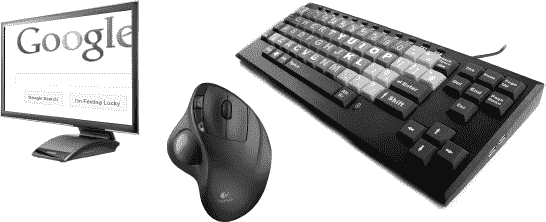

***图 10-1。**辅助技术的例子*

根据 2010 年世界标准日的信息，全世界至少有 6 . 5 亿人受到某种残疾的影响。考虑到随着世界人口老龄化，无障碍环境的需求也在不断增长。此外，无障碍不仅仅是老年人或残疾人的问题。任何人在人生的任何阶段都可能经历暂时性的可及性降低。

与普遍的误解相反，网页可访问性的作者不仅仅关注视觉障碍。许多人有运动、行动、听觉或认知问题。网络对残疾人的重要性不亚于任何人，如果不是更重要的话。原因是网络提供了对服务和/或信息的访问，没有它就不能轻易获得这些服务和/或信息(例如在线订购)。然而，设计糟糕的网站会制造障碍，阻止人们使用网络。

万维网联盟为网页内容( *WCAG* )、创作工具( *ATAG* )  [10 )和用户代理( *UAAG* )  [11 )提供了可访问性指南和技术。可访问性测试结果可以用一种叫做*评估语言*(*EARL*)【12)的特殊语言来表示。

结合 HTML、JavaScript、Ajax 和其他技术开发的动态内容和高级用户界面的可访问性是由 W3C 的 Web Accessibility Initiative (WAI)发布的规范集合定义的。这个集合被称为*可访问的富互联网应用套件*，它包括以下文档 [13 ]:

__________

有时也使用自适应技术这一术语。

*   *WAI-ARIA 技术规范*:针对 web 标准的作者和编辑，以及用户代理和可访问性评估工具的开发者的可访问性提示 [14
*   *WAI-ARIA 初级读本*:WAI-ARIA 的技术方法，详细描述了应用 WAI-ARIA  [15 可以解决的无障碍问题
*   WAI-ARIA 创作实践:关于使用 WAI-ARIA 开发的可访问富互联网应用的实用指南
*   *WAI-ARIA 用户代理实施指南*:用户代理无障碍要求 17

诸如同步多媒体集成语言(SMIL)或定时文本标记语言(TTML)之类的标准也可以用来提高网站的可访问性，同步多媒体集成语言是一种用于描述多媒体演示的 XML 标记，定时文本标记语言提供与视频等媒体同步的文本。

#### WCAG 1.0

网站内容可访问性指南的第一个版本(WCAG 1.0)在 1999 年成为 W3C 的推荐标准，其口号是“如何使网站内容对残疾人来说是可访问的”WCAG 1.0 由 14 条指导原则组成:

1.  必须为听觉和视觉内容提供等效的替代方案。
2.  用颜色表达的信息必须在没有颜色的情况下也是可用的和可感知的。
3.  必须正确应用标记和样式表。
4.  必须声明 web 文档的自然语言。
5.  表必须以一种优雅地转换的方式创建。
6.  应用新技术的页面必须优雅地转变。
7.  必须为对时间敏感的内容更改提供用户控制。
8.  必须确保嵌入式用户界面的直接可访问性。
9.  网站设计必须独立于设备。
10.  必须使用临时解决方案。
11.  必须应用 W3C 技术和指南。
12.  必须提供关于背景和方向的信息。
13.  导航必须易于理解。
14.  文件必须清晰简单。

每个指导方针被细分为检查点，作为检查 WCAG 一致性的基础。他们有 65 个人。每个检查点都有一个优先级，从 1 到 3。正如您将在下一节看到的，它们非常类似于 WCAG 2.0 中引入的一致性级别。三个优先级别如下:

*   *优先级 1 (* 参见*A 级一致性)*:开发者*必须*满足这些要求，否则一个或多个组不能访问内容。
*   *优先级 2 (* 比照*AA 级(双 A 级合格)*:开发商*应*满足这些要求；否则，某些群体将很难访问这些内容。这一水平消除了重大障碍。
*   *优先级 3 (* 参见*AAA 级(AAA 级)一致性)*:开发人员*可能会*处理这些检查点，以便最大化可访问性。

#### WCAG 2.0

网页内容可访问性指南的第二个版本(WCAG 2.0)在 2008 年成为 W3C 的推荐标准。WCAG 2.0 可以概括为遵循四项原则的十二条指导方针 [22 ]:

原则 1:用户界面组件和发布的信息对任何人都是可感知的。

1.对于非文本内容，必须提供替代文本，以便可以将其更改为其他形式。

2.基于时间的媒体必须有替代品。

3.Web 内容必须在不丢失信息或结构的情况下通过不同的表示形式可用。

15.视觉和听觉内容必须易于区分。

原则 2:可操作的用户界面和可用的导航。

16.所有功能都必须可以通过键盘使用。

17.不能强迫用户在时间限制内执行操作。

18.必须避免可能导致癫痫发作的设计。

19.必须为用户浏览网站提供指导和帮助。

原则 3:用户界面的可理解内容和操作。

20.文本内容必须方便阅读，易于理解。

21.内容外观和操作必须是可预测的。

22.必须为用户提供帮助，以避免、发现和纠正错误。

原则 4:具有高互操作性的健壮内容，可以在任何类型的用户代理上可靠地使用，包括辅助技术。

23.必须最大限度地兼容当前和未来的用户代理和辅助技术，包括在有限资源上运行的那些 [23 ]。

这些指南包含 61 个成功标准。WCAG 2.0 的一致性可以通过应用一系列技术来实现 [24 ]。其中一些是必须满足成功标准的(*足够的技术*，而其他的只是可选的(*咨询技术*)。W3C 声称没有一种可访问性技术可以被称为*必需的*或*强制的*  [25 。它们只是推荐性的，开发者可以选择应用它们。

与拥有三个优先级的 WCAG 1.0 相比，WCAG 2.0 的成功标准分为三个*合规级别*。WCAG 2.0 所有级别的*一致性要求*在以下章节中进行了总结。通常，以下部分中的单词*必须*——类似于 W3C 发布的 WCAG 规范中的单词使用——对应于 A 级一致性，这是 WCAG 2.0 中最低级别的可访问性(例如，非文本内容的文本替换)。单词*应该*对应于 AA 级一致性(例如，直播同步媒体的字幕)。单词*可以*和*可以*对应 AAA 级符合性(例如，可选手语翻译)。

可访问性一致性级别越高，应用的要求或限制就越多。例如，准则 1.4 描述了可区分的颜色使用以及区分前景和背景的要求。为了达到 A 级，你不应该仅仅依靠颜色来传达信息。AA 级有更严格的要求，规定最低对比度为 4.5:1(大文本为 3:1)，而 AAA 级要求更高的对比度为 7:1(大文本为 4.5:1)。

请注意，有些要求是一般性的，而有些要求是特定于技术的，仅适用于某种技术，如闪存。有些技术可以单独使用，也可以与类似的技术结合使用，如简短和详细的描述，但关于其应用的相应要求取决于所需的可访问性级别。

重要的是要记住，不建议将 AAA 级一致性作为一般策略，因为由于内容的性质或特殊的技术功能和限制，有些内容类型不能以文档满足所有 AAA 标准的方式发布。换句话说，使用某些内容类型可能会将可访问性的最大可达级别限制为 WCAG 2.0 AA，而如果存在某些内容类型，则无法满足 WCAG 2.0 AAA。例如，章节标题有助于 AAA 一致性；但是，它们不能添加到所有类型的文档中(例如，一封长信 [26 ])。自然，当创建一个可访问的网站或重新设计一个不可访问的网站以使其变得可访问时，应该重新组织、添加或修改网站结构或标记元素，但是内容作者没有理由仅仅为了使网站可访问或更易访问而修改网页的文本内容。另一个例子是 Flash，在 WCAG 规范形成的时候，它就有了可访问性障碍，一般来说，同时提供 Flash 内容和实现 AAA 级一致性是不可行的。

此外，WCAG 一致性可以被限制到一个*符合替代版本*而不是整个网站。例如，如果网站的复杂设计使得满足 WCAG 要求变得不可行，那么仍然可以通过提供备用样式表来访问网站，或者在设计更复杂的情况下，提供网站中每个页面的备用、可访问版本。因此，确定 WCAG 一致性需要深入的站点分析，而不能通过简单地打开主页来判断。

 **注**与带有标签汤和糟糕标记的文档相反，结构良好、内容编写得当、符合标准的网站默认提供基本的可访问性，可以进一步扩展以实现所需的(高级)可访问性。

##### 场地结构要求

所有网页(不仅仅是主页)都必须有由`title`元素提供的描述性标题。在最理想的情况下，标识主题的页面标题是简短的，没有上下文也是合理的和可理解的。此外，它们应该是独一无二的，可以在站点中识别页面。表 10-1 显示了一个例子。

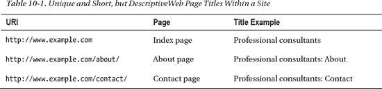

指向主要内容页面的超链接必须提供在站点内每个网页的顶部。

链接到该网站的所有其他网页必须可以直接或间接从主页。当前访问的网页和网站的其他部分之间的关系可以通过适当选择的网站组件和精心编写的元素内容(描述性 URIs、描述性标题、使用`link rel`提供的元数据、面包屑路径、使用标题添加的章节等)清楚地表示出来。

面包屑轨迹可被应用来帮助用户可视化内容结构，简化导航，并标识站点结构内以及当前网页内的当前位置。这可以通过显示路径中的位置或站点结构中当前网页的位置来获得。面包屑痕迹可以提供到以前访问过的网页的链接。它们被放置在每个网页中的相同位置。用于面包屑跟踪的典型分隔符有`▼`、`►`、`>`、`|`、`::`和`/`。例如，可以清楚地指示网络商店用户正在浏览屏幕尺寸等于或大于 22 英寸的 LCD 显示器，因为电子产品>计算机&配件>显示器> LCD > 22 英寸&以上(图 10-2 )。

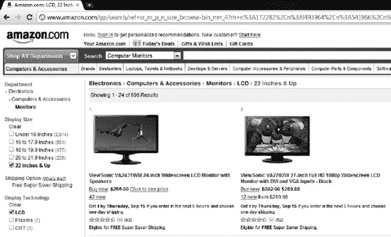

***图 10-2。**面包屑路径方便导航*

当前位置也可以显示在导航栏中。网站所有其他页面的列表以及相关网页的链接也可以简化导航。`link`元素可用于清晰地指示当前网页与网站内其他网页之间的多种关系(用`rel`属性的值，如`Start`、`Next`、`Prev`、`Contents`、`Index`)。清单 10-1 显示了一个例子。

***清单 10-1** 。在文档头中声明网页关系*

`<head>
  <title>Chapter 4</title>
  …
  <base href="http://www.example.com/" />
  **<link rel="prev" href="chapter3/">**
  **<link rel="next" href="chapter5/">**
  …
</head>`

必须在网站上添加一个逻辑标签顺序，让用户可以轻松地浏览链接、对象和表单控件。

***清单 10-2。**为菜单、搜索框和网页 Flash 标题声明的 Tab 键顺序*

`…
  <base href="http://www.example.com/" />
…
<ul>
  <li>
    <a href="http://www.example.com/" title="Home" accesskey="h" **tabindex="1"**>
     Home</a>
  </li>
  <li>
  <a href="about/" title="Introduction" accesskey="a" **tabindex="2"**> 
   About</a>
  </li>
  <li>
    <a href="services/" title="Wedding photography" accesskey="s" **tabindex="3"**>       Services</a>
  </li>
  <li>
    <a href="portfolio/" title="Samples and testimonials" accesskey="p" **tabindex="4"**>

Portfolio</a>
  </li>
  <li>
    <a href="contact/" title="Address, mail, and phone" accesskey="c" **tabindex="5"**> 
Contact</a>
  </li>
</ul>
…
<form method="get" action="http://www.google.com/search">
  <fieldset>
    <label for="q">Search query</label>
    <input type="text" name="q" id="q" size="19" maxlength="255" value="Type to search" 
     **tabindex="6"** />
    <input type="submit" name="btnG" value="Search" **tabindex="7"** />
    <input type="hidden" name="domains" value="http://www.example.com/" />
    <input type="hidden" name="sitesearch" value="http://www.example.com/" />
  </fieldset>
</form>
…
<object type="application/x-shockwave-flash" data="flash/header.swf" width="720" 
height="300" id="flash" **tabindex="8"**>
  <param name="movie" value="flash/header.swf" />
  <param name="wmode" value="transparent" />
  

    
  

</object>`

搜索功能对所有网站都至关重要，因为它可以帮助用户找到内容。为网站提供搜索功能的一种流行方法是创建一个特定于网站的 Google 搜索字段(也显示在前面的示例中)。搜索按钮应该与搜索栏相邻。

内容部分必须以标题元素开始，以提供结构(`h1`–`h6`)。必须提供描述性的标题和标签，允许用户选择与他们相关的信息。用标题可以有效地组织页面。在(X)HTML5 中，文档介绍应该应用`header`元素。

##### 内容要求

源代码中内容的顺序必须与内容的视觉呈现相一致；换句话说，DOM 顺序必须与视觉顺序相匹配。紧接在用于激活动态内容插入的元素之后插入到文档对象模型中的动态内容，通过利用用户代理的默认 tab 顺序，确保了正确的 tab 顺序(以及屏幕阅读器的正确阅读顺序)。网页内容必须按有意义的顺序排列。这也适用于交互元素。页面部分的重新排序必须通过使用 DOM 来执行。重复的组件应该总是以相同的顺序呈现。必须允许用户通过可展开和可折叠的菜单跳过重复的菜单项。闪存内容必须应用`tabIndex`属性，以指定逻辑读取顺序和逻辑 tab 键顺序。

###### 用户协助

网站地图和目录也有助于访问。可以在每个网页上添加帮助链接。可以使用一个专用的帮助页面来收集对经验不足的用户有帮助但在主要内容中被忽略的信息，因为这些信息对大多数用户来说是显而易见的(也许是令人讨厌的)。此外，帮助页面可能会提供有关在 web 上不常见的特殊网站功能的信息。例如，高度可访问的网站的用户可以被告知用键盘按钮控制菜单的选项，这并不是在每个网站上都可用的。帮助也可以以助手的形式提供，他向新访问者介绍网站的功能和内容。这种助手可以是具有数字角色的动画(也称为多媒体化身)或具有真人的视频剪辑，其给出指令或服务概述或解释与公司组合相关的概念(图 10-3 )。

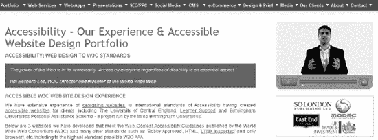

***图 10-3。**助理(真人视频剪辑)【28*

###### 保证了可读性

在最佳情况下，文本易于阅读。复杂的文本内容可以用一种形式概括，这种形式要求阅读能力不如高中教育水平高。例如，对于一些人来说，一篇技术文章可能太复杂而无法阅读，而包含较短句子和更多常用单词的文本摘要可能对他们有所帮助。为了实现 AAA 一致性，即使调整了浏览器窗口的大小，文本行平均也不能超过 80 个字符。

患有某些认知障碍的人在跟踪单倍行距时有困难，他们可能会发现 1.5-2 倍的行距更便于阅读。网页可能有按钮，通过增加行间距和段落间距来提高可读性。

***清单 10-3。**用于操作行距和段落间距的示例按钮*

`…

…

  
  

…

  

    This is the first paragraph of the main content.
  

  

    This is the second paragraph of the main content.
  

`

此外，`letter-spacing` CSS 属性必须用于控制单词之间的间距(字符之间的空白)，这可以进一步增加可读性。最好以相对单位(`%`或`em`)提供字体大小。对于容器(如表格)的文本大小，首选`em`单位，其中基于百分比的字体在调整大小时可能会导致字体过大。由文本格式表示的信息，如字体、字号或文本修饰，也必须无需格式化即可访问。基本文本格式不仅适用于(X)HTML 文档，也适用于纯文本文件。文本文件必须具有代表段落、列表和标题的文本格式。

文本的视觉呈现应该用 CSS 属性来控制，如`font-family`、`font-size`、`font-style`、`font-weight`、`color`、`letter-spacing`、`line-height`、`text-align`、`text-transform`、、`background-image`以及伪类`:first-line`、`:first-letter`、`:before`、`:after`。这些属性和伪类避免了对图像文本的需要。

###### 颜色使用

Web 内容必须是可访问的，而不具备识别位置、形状、大小或声音所需的感官感知能力。

对于有某些认知障碍的人来说，左右两边对齐的对齐文本可能很难阅读。因此，文本向一侧对齐只会提高可访问性。如果由于布局目的而不可行，则可以添加一种机制来根据请求移除完全对齐。

如果允许用户使用浏览器的默认颜色，也就是说，CSS 规则没有指定背景色、文本颜色或文本背景色，有视觉障碍的用户可以覆盖他们看不清的某些颜色。这种技术保证了背景上呈现的文本的可读性。但是可以指定容器布局和边框颜色。

可以应用允许用户改变文本部分的前景和背景颜色的跨浏览器颜色选择器解决方案。

文本-背景对比度应为 4.5:1，以实现 AA 一致性(大文本为 3:1)，而 AAA 一致性(包括文本图像)的最低对比度可能为 7:1(大文本为 4.5)。应该始终提供高对比度控件，允许用户切换到具有足够对比度的演示文稿。通过考虑亮度的差异，可以很容易地计算任意选择的颜色之间的对比度。

WCAG 2.0 规范将相对亮度定义为“色彩空间中任意点的相对亮度，对于最暗的黑色归一化为 0，对于最亮的白色归一化为 1。”在 sRGB 颜色空间的情况下，颜色的相对亮度定义为 L = 0.2126 × R + 0.7152 × G + 0.0722 × B，其中 R、G 和 B 分量定义如下 [29 ]:

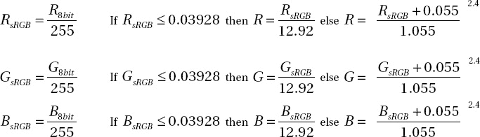

如果你不想计算色彩对比度，有许多有用的工具可以为你检查，例如 WebAIM 色彩对比度检查器 [30 ]，Juicy Studio 的光度色彩对比度分析器 [31 ]，或 WAT-C 的光度对比度分析器 1.1[32。

用颜色表达的信息必须在没有颜色的情况下也是可用的和可感知的。当使用文本颜色差异来传达信息时，必须有额外的视觉提示。每当使用颜色线索来传达信息时，都必须添加语义标记。

添加到页面中的可选多色选择工具可以任意改变前景和背景颜色，允许用户根据个人喜好指定颜色(图 10-4 )。

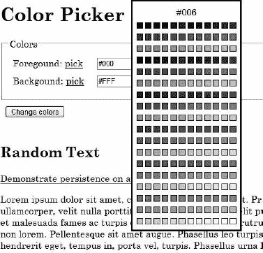

***图 10-4。**W3C 建议的颜色选择器示例 [33 ]*

信息和结构必须与表示分离，以支持不同的表示。可以为网页中主要内容的文本和背景以及组件组提供各种颜色组合。

###### 缩写、定义和外来词

单词的完整形式可以在它们的缩略形式之前。缩写可能有一个内联扩展或解释，当它们第一次出现在网页中时，会与它们相关联。所有缩写的定义可以由`abbr`和`acronym`元素提供。定义的单词可以用`dfn`元素括起来。术语、缩写、首字母缩写和首字母缩略词可以链接到它们的定义，以便提供最高级别的可访问性。作为定义列表项编写的术语和短语最容易理解。它们可以通过一个由`link`元素提供的简单超链接收集到一个术语表页面上。或者，可以嵌入搜索功能，通过外部在线词典提供定义。除了缩写，所有以不寻常的方式或受限制的方式使用的单词或短语都可以通过定义变得更容易理解。

至少在单词第一次出现在网页中时，紧接在该单词之后提供的特殊或外来单词的发音有助于 AAA 一致性。其他实例也可以提供到发音列表的链接。

web 文档的默认语言必须在 HTTP 头中标识，并通过标记中的`html`元素上的`lang`和/或`xml:lang`属性来标识。这对于包含 Flash 内容的网页也很重要，因为嵌入的 Flash 对象继承了由`lang`和/或`xml:lang`属性提供的语言设置。用默认语言之外的语言编写的文档节必须在它们的包含元素上明确标识。

为了确保双向内联内容的文本方向，必须应用 Unicode 从右到左标记(`&rlm;`、`&#x200f;`或`U+200F`)和从左到右标记(`&lrm;`、`&#x200e;`或`U+200E`)。

内联内容的文本方向必须应用`dir`属性来清楚地指示文本方向。

在许多语言中，如阿拉伯语、希伯来语或东亚语言，文本意义很大程度上取决于发音。用这种语言编写的 Web 内容可以应用带有`ruby`、`rt`和`rp`元素的 Ruby 注释，以便提供关于文本片段的发音和含义的信息。

 **注**很久以前，远东的教科书中就引入了红宝石注释，为学生提供有关复杂字符的提示。例如，用汉字音节表(书写系统)书写的日语文本通常包含只有至少高中毕业的日本人才知道的字符。用平假名(所有日本人都熟悉的音节表)书写的拼音文本可以使文本更清晰。类似地，繁体中文文本可以使用拼音注释以简体中文显示。

使用 Ruby，可以在 Ruby 标记(`ruby`元素的内容)中声明一个基本文本，以及相关联的 Ruby 文本(`rt`元素)，还可以选择声明 Ruby 括号(`rp`)，可以为不能正确呈现 Ruby 文本的浏览器声明。例如，可以为教育门户网站上的单词提供发音提示，而外国单词或不常见的名称可以音译成英语(清单 10-4 )或使用国际音标(IPA)表示(清单 10-5 )。

***清单 10-4。**东京的红宝石标注*

`
  <rp> (</rp>
  <rt>Tō kyō</rt>
   <rp>)</rp>
</ruby>` 

对于简单的拼音标记，用户代理应该以大约一半的字体大小在基本文本之上呈现拼音文本。在我们的例子中，结果应该看起来像图 10-5 。

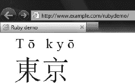

***图 10-5。**IE9 中呈现的单词 Tokyo 的红宝石注释*

 **注意** Ruby 注释在 Internet Explorer 中呈现得最准确。

不支持 Ruby 注释的浏览器会以内联方式呈现之前的代码，而不会中断文本流(图 10-6 )。

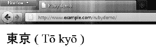

***图 10-6** 。Ruby 注释的回退机制在起作用*

***清单 10-5。**使用拼音注释的东欧名字的国际音标表示法*

`

  Count
  <ruby>
    István Széchenyi
    <rp>(pronounced: </rp>
    <rt>ˈiʃtvaːn ˈseːtʃeːɲi</rt>
    <rp>)</rp>
  </ruby>
  was one of the greatest statesmen of Hungarian history.

`

清单 10-5 在兼容的浏览器中呈现，如图图 10-7 所示。

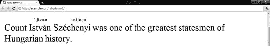

***图 10-7。**红宝石注释提供的发音提示*

在不识别 Ruby 标记的浏览器中，同样的例子会以内联方式呈现(图 10-8 )。

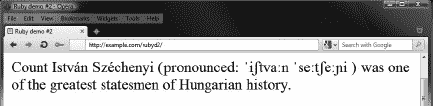

***图 10-8。**在不支持拼音注释的浏览器中内嵌的发音提示*

更复杂的 Ruby 注释不仅可以指定前面显示的默认显示和回退机制，还可以指定位置偏移、对齐、间距和突出。Ruby 注释是作为 XHTML 1.1 模块引入的，也可以在 HTML5 中使用。 2

最易访问的文档应用标准的变音符号，允许用户根据请求打开和关闭它们。

应该应用正确选择的位置和单位，以支持浏览器的缩放和文本大小调整功能。

可访问的网站有控件，允许用户递增地改变所有文本的大小(高达 200%)。在文本容器的尺寸保持不变的情况下，当文本调整大小时，不能有内容或功能的损失。

###### 用户界面

内容必须可以通过备用用户界面访问。必须提供正确编写的标记，以允许辅助技术理解内容、公开表单控件 id 等信息，并通过 API(例如 DOM)控制某些元素。

必须应用标准的 DOM 函数来动态地向网页添加内容，而不是脚本，脚本提供的内容不一定被屏幕阅读器读取。

 **注意**屏幕阅读器可能不会自动读取动态添加的内容。动态添加的新内容的阅读可以通过将焦点设置到新元素或将其添加到用户继续浏览时将遇到的当前位置之下来确保。

所有网站都应该使用液体布局来呈现内容，而不引入不必要的水平滚动条。页面内容应该适应可用的水平空间。布局区域应根据需要使用文本和重排来调整大小，以显示页面部分。高度可访问的网站消除了水平滚动，即使用户调整了浏览器窗口的大小。实现这种简单布局的技术之一是在`%`中指定文本容器的宽度。如果在默认屏幕上不可行，可以提供不需要水平滚动的替代布局。

__________

XHTML 1.1 和 HTML5 的实现是有区别的。截至 2011 年，原始规范的 rb (ruby base)元素不能在 HTML5 中使用，然而，它的重新引入仍然是一个开放的问题。清单中的例子展示了 HTML5 的例子。

内容定位应该基于结构化标记。CSS 可以增强外观，但是内容结构在没有样式表的情况下也必须保持有意义。

如果网页的默认版本的内容不可访问，但符合 WCAG 标准的替代版本可以访问，则该网页必须链接到不符合标准的页面的开头。如果无法从内容中删除不可访问的对象，则必须在这些对象的旁边或与其相关联的位置添加一个链接，该链接将链接到另一个符合 WCAG 标准的版本。用户首选项必须保存在 cookie 中。替换版本的可访问性必须始终通过`.htaccess`或 HTTP referrer 头来确保。必须提供一个风格切换器，以确保与 WCAG 兼容的风格的替代版本。 3 创建风格切换器需要三种不同类型的样式表:

1.*持久 CSS 文件:*用于共享整个站点通用样式的基本样式。`rel`属性被设置为`stylesheet`，而`title`属性被省略(清单 10-6 )。

***清单 10-6。**一个持久的 CSS 文件*

`<link **rel="stylesheet"** type="text/css" href="styles/main.css" />`

24.首选 CSS 文件:加载页面时默认启用的样式。`rel`属性的属性值为`stylesheet`，提供了`title`属性(清单 10-7 )。

***清单 10-7。**首选 CSS 文件*

`<link **rel="stylesheet"** type="text/css" href="styles/main.css" **title="Preferred"** />`

25.替代 CSS 文件:为站点的替代版本设计的 CSS 文件，这些文件重用主样式表文件中声明的样式，但覆盖其中一些样式(例如，将字体大小设置为更大的值，或者修改字体颜色以获得更高的对比度)，或者在重用的样式之上添加新的样式(例如，定义移动设备的最大宽度)。它们不仅可以用于增加可访问性，还可以用于网站的设计或特定媒体版本(正如前面在第三章中暗示的)。替代的 CSS 文件有一个`rel`属性值`alternate stylesheet`而不是`stylesheet`，它们有一个`title`属性来标识它们(清单 10-8 )。

***清单 10-8。**替代样式表*

`<link **rel="alternate stylesheet"** type="text/css" href="styles/large.css" 
  **title="Large"** />
<link **rel="alternate stylesheet"** type="text/css" href="styles/contrast.css" 
  **title="Contrast"** />`

首先，创建三个 CSS 文件，一个用于主样式(清单 10-9 )，两个用于替代样式，分别提供大字体大小(清单 10-10 )或高对比度的大字体大小(清单 10-11 )。

__________

因为不是所有的功能都可以通过 CSS 来提供，一个符合标准的网站替代版本并不总是通过简单地创建额外的样式表来提供。

***清单 10-9。**主 CSS 文件(`main.css` )*

`body {
  background-color:#004c25;
  color: #cff;
  font-family: Garamond, serif;
  font-size: 1.2em;
}

#wrapper {
  width: 800px;
  margin: auto;
}

#wrapper a:link {
  color: #ff0;
}

#wrapper a:hover {
  color: #ffa000;
}

#wrapper a:visited {
  color: #fff;
}

#colorswitch a:link {
  padding: 10px;
}`

***清单 10-10。**CSS 文件为大字体版本(`large.css` )*

`@import ("main.css");

body {
  font-size: 1.8em;
}`

***清单 10-11。**高对比度版本的 CSS 文件(`contrast.css` )*

`@import ("main.css");

body {
  background-color: #000;
  font-size: 2em;  
}

#wrapper a:hover {
  color: #ff2121;
}`

接下来，我们需要一个脚本来设置所选 CSS 文件的样式，并将选择存储在一个 cookie 中，如果用户返回到页面，就可以读取这个 cookie 了(清单 10-12 )。如果没有 cookies，替代样式将仅应用于当前会话的当前页面，这几乎是无用的。如果一个有视觉障碍的用户选择了“高对比度主题”，他或她可能会喜欢用相同的设置来阅读网站的所有页面。

***清单 10-12。**`styleswitcher.js`35*

`function setActiveTheme(title) {
  var i, a, main;
  for (i = 0; (a = document.getElementsByTagName("link")[i]); i++) {
    if (a.getAttribute("rel").indexOf("style") != -1 && a.getAttribute("title")) {
       a.disabled = true;
       if (a.getAttribute("title") == title) a.disabled = false;
    }
  }
}

function getActiveTheme() {
  var i, a;
  for(i = 0; (a = document.getElementsByTagName("link")[i]); i++) {
    if(a.getAttribute("rel").indexOf("style") != -1 && a.getAttribute("title") && 
!a.disabled) return a.getAttribute("title");   }
  return null;
}

function getPreferredTheme() {
  var i, a;
  for (i = 0; (a = document.getElementsByTagName("link")[i]); i++) {
    if (a.getAttribute("rel").indexOf("style") != -1
        && a.getAttribute("rel").indexOf("alt") == -1
        && a.getAttribute("title")
       ) return a.getAttribute("title");
  }
  return null;
}

function createCookie(name,value,days) {
  if (days) {
    var date = new Date();
    date.setTime(date.getTime() + (days*24*60*60*1000));
    var expires = "; expires=" + date.toGMTString();
  }
  else expires = "";
  document.cookie = name + "=" + value + expires + "; path=/";
}

function readCookie(name) {
  var nameEQ = name + "=";
  var ca = document.cookie.split(';');
  for (var i = 0; i < ca.length; i++) {` `     var c = ca[i];
     while (c.charAt(0)==' ') c = c.substring(1, c.length);
     if (c.indexOf(nameEQ) == 0) return c.substring(nameEQ.length, c.length);
  }
  return null;
}

window.onload = function(e) {
  var cookie = readCookie("style");
  var title = cookie ? cookie : getPreferredTheme();
  setActiveTheme(title);
}

window.onunload = function(e) {
  var title = getActiveTheme();
  createCookie("style", title, 365);
}

var cookie = readCookie("style");
var title = cookie ? cookie : getPreferredTheme();
setActiveTheme(title);`

最后，我们把所有的组件放在一起，并在我们的网站上获得样式切换器功能(清单 10-13 )。

***清单 10-13。**以风格切换器为特色的标记代码*

`<!DOCTYPE html>
<html>
  <head>
    <title>Style switcher demo</title>
    <meta charset="UTF-8" />
    <link rel="stylesheet" type="text/css" href="styles/main.css" />
    <link rel="stylesheet" type="text/css" href="styles/main.css" title="Preferred" />
    <link rel="alternate stylesheet" type="text/css" href="styles/large.css" title="Large" />
    <link rel="alternate stylesheet" type="text/css" href="styles/contrast.css" 
title="Contrast" />     
  </head>
  <body>
    

      <h1>Style switcher demo</h1>
      
This is the content.

      

        <a href="javascript:void(0);" onclick="javascript:setActiveTheme('Preferred'); 
return false;" id="default">Default CSS</a>         <a href="javascript:void(0);" onclick="javascript:setActiveTheme('Large'); 
return false;" id="larger">Large fonts</a>         <a href="javascript:void(0);" onclick="javascript:setActiveTheme('Contrast'); 
return false;" id="contrast">High contrast</a>       

    
` `  </body>
</html>`

用脚本滚动的内容，如横幅，必须有暂停或停止滚动的机制。

对 CSS 中的文本片段应用图像替换的网页应该有一个允许用户在两个版本之间切换的界面。

Web 内容结构应该包含适当的语义标记元素。必须根据元素的含义而不是它们的(默认)外观来使用它们。语义上有意义的标记，如`em`或`strong`必须用于强调和特殊的文本。必须对列表和链接组应用`ol`、`ul`和`dl`元素。必须使用`map`元素对链接进行分组。

键盘用户不能被一个只能用鼠标访问的网站阻止。这同样适用于默认情况下不可通过键盘访问的 Flash 对象。

 **注意**同一元素上的重复属性可能会导致辅助技术的关键错误，必须被消除。

接收焦点或被定点设备悬停的元素的外观应该被改变(例如，突出显示)以向用户提供视觉反馈(例如，改变背景或边框颜色)。Flash 内容还应该提供高度可见的焦点指示。

替代文本、标签和名称应该在具有相同功能的组件之间共享。

为使用内容所需的所有信息提供的可选手语版本可以提高聋人或有某些认知障碍的人的可访问性。它可以是使用 Flash 等技术的多媒体化身，也可以是动画或真实手语翻译的视频剪辑(图 10-9 )。

***图 10-9。**一个签约头像 [36 ]*

Web 站点组件，如标记、样式表和 XML 文件，必须经过验证，以保证正式规范、语法、句法和词汇的正确使用。必须根据标记规范使用开始和结束标记。所有网页都必须格式良好。

##### 非文本内容的标记要求

可以应用图像、照片、图形和符号来改善用户体验并帮助用户理解内容。但是，所有非文本内容，如图像、嵌入对象(Flash 内容、小程序、音频、视频等)、 *ASCII 艺术*、*表情符号*和 *leetspeaks* 必须有替代文本。

所有图像都必须有一个`alt`属性。对于那些可以被辅助技术安全忽略的图像，必须省略`title`属性，并将`alt`文本设置为 null ( `alt=""`)。如果一个图像和它的相关文本有相同的链接，为了避免不必要的重复，它们必须被合并。

像 1x1 像素的 GIF 文件这样的间隔图像应该完全去除，以利于 CSS 边距和填充。

对于那些简短描述不够的图像和对象，必须添加详细描述。多年来，`longdesc`属性一直用于这个目的。然而，`longdesc`属性在(X)HTML5 中已经过时，必须使用一个带有描述链接的常规`a`元素来代替。

用颜色表示的非文本内容也必须有不用颜色也能理解的模式。

必须为非文本内容提供替代文本，以标识其目的(即使是需要感官体验的内容)。此外，必须为具有相同目的的非文本内容提供简短和详细的描述，以展示相同的信息。

如果原始的非文本内容太长，或者仅使用文本无法获得相同的信息，则必须编写简短的替代文本，简要概括非文本内容。

专门用于装饰的图像，如背景图像、图像翻转或标签图像，必须使用 CSS 提供。由于没有附加标记，辅助技术可以忽略这些非文本内容。

必须为图像映射中的所有`area`元素编写替代文本。

必须为所有对象提供文本或非文本替代项。替代文本可以直接写在`object`元素的内容中。嵌套对象可以提供非文本替换。

相邻的非文本内容共享信息或功能必须用替代文本描述，以避免不必要的重复。

###### 闪烁和闪烁内容

应该消除由频闪或闪光效应引起的光癫痫发作。一个链接或按钮必须总是被添加到有闪烁内容的网页中，它可以加载没有闪烁内容的等价网页。只有使用提供关闭浏览器闪烁功能选项的技术，网页上才能包含闪烁内容。必须使用脚本将闪烁内容最小化到 5 秒以下，如果可能的话，完全消除。这同样适用于动画 GIF 图像。

闪烁内容也必须最小化。1 秒钟内最多允许闪烁三次。如果因为内容特征而不可行，闪烁区域必须小于 10 度视野的 25%。内容不允许违反一般闪光阈值或红色闪光阈值，避免光敏性癫痫发作。有一些工具，如光敏癫痫分析工具(PEAT)  [37 ]，可以用来评估闪烁内容，以降低癫痫发作的风险。

###### 闪光物体

嵌入 Flash 对象的尺寸可以用相对单位(`em`或`%`)指定。

用`name`属性标记的非文本对象必须在 Flash 中应用，以允许辅助技术访问它们。对于 Flash 中的非文本对象，必须由`description`属性提供长文本替换。必须为用于相同目的的可点击图像热点提供文本替换。多年来，数据网格的可访问性描述一直用于提供屏幕阅读器可读的信息。

如果需要，Flash 图形必须以辅助技术可以忽略的方式进行标记。这可以通过直接利用 Flash 对象的辅助功能或使用 ActionScript 应用文本替代来实现。

如果相邻的文本和图像按钮(图标)具有相同的用途，则必须将它们组合成一个按钮元件实例。

用标记编写的表单优于 Flash 表单。但是，如果您必须在您的网站上使用 Flash 表单，应该考虑以下准则。必须脱离上下文来理解 Flash 控件。为此，可以通过脚本更改控件标签来提供附加信息。类似于它们的标记等价物，Flash 表单的必需字段必须被清楚地指出。相关的 Flash 表单控件必须组合在一起以提供语义含义。Flash 表单必须在客户端进行验证。如果发现错误，必须向包含无效数据的控件添加描述。Flash 表单控件必须有一个关联的文本标签(例如，通过自动标签)。默认情况下，只有`CheckBox`和`RadioButton`组件获得标签。

必须允许用户暂停由脚本控制的滚动 Flash 内容。

Flash 内容的闪烁必须由脚本控制，最多在五秒钟内停止。

##### 链接要求

超链接锚必须始终有一个文本描述，清楚地表明链接的目的。链接必须应用`title`属性来提供额外的链接文本。超链接必须有描述性的替代文本，清楚地表明链接的目的。

使用 CSS 选择器(没有`visibility:hidden`或`display:none`)可以隐藏为高级屏幕阅读器和盲文显示支持添加的附加链接文本。该链接文本也可以与样式切换器结合使用。必须避免重复的内容。

必须在每个网页的顶部添加一个控件，提供带有链接文本的可选页面版本，即使没有上下文也足以确定其目的。

即使没有上下文(应用描述性的链接文本)，链接的目的也必须是清楚的，但是容器上下文(段落、前面的标题、列表项、表格单元格及其关联的表格标题)也必须以进一步提高链接目的的清晰度的方式来书写。

应该确保链接颜色和文本颜色之间的最小对比度为 3:1。此外，必须在链接和控件的焦点上提供额外的视觉提示，仅使用颜色来识别它们。

目地 URIs 通常不具有足够的描述性。例如，链接文本`Read more…`不足以理解链接。但是，如果在同一句话中，描述先于链接，也可以理解。必须使用链接文本和包含句子的文本的组合来确定链接的目的，以确保屏幕阅读器的逻辑文本流。只要合理，就必须提供根据上下文动态变化的链接文本。

应该为所有不支持属性级长描述的网页元素和对象添加链接。链接必须紧挨着非文本内容。长描述的位置必须在短描述中指明(如果适用)。例如，图片的简短描述提供了文本“智能手机操作系统对比——请参见下面的详细信息”,而图片下方的长描述指出“在图 1 中，您可以看到智能手机操作系统的市场份额，包括 Android、BlackBerry OS、iOS、Microsoft Windows Mobile、Symbian 和 webOS。”

如果网页包含重复的内容块，如导航链接或目录，则必须在这些内容块的开头添加一个链接，以允许用户绕过它们。网页的顶部必须包含链接到内容的不同部分。

对话消息必须与设备无关。应尽可能消除弹出窗口。如果不能消除新窗口，可以提供预先警告。为了避免混淆，根据用户请求打开的带有`target`属性的新窗口可能会有一个适当的链接文本，清楚地表明内容将在新窗口中打开。但是，一般来说，链接应该在同一个窗口中打开，而不是在一个新的窗口或标签中打开。虽然这种方法有助于提高可访问性，但它也有缺点，可能会导致访问者的流失(如果他们忘记再次访问您的网站)。

##### 用户输入和表单要求

表单控件和链接必须使用(X)HTML 元素提供，而不是其他技术，如 Flash。

表单的文本输入必须有一个可用于提供上下文相关帮助的`title`属性。

必须应用可访问名称来标记 Flash 表单控件。Flash 按钮必须始终有一个描述链接目的的可访问标签。Flash 图像按钮必须有可访问的名称，提供有关按钮功能的信息，但不描述一般的图像。

必须为`Button`、`CheckBox`和`RadioButton` Flash 表单组件显式设置`label`属性。因此，标签文本会出现在组件旁边，并可供辅助技术使用。

表单控件组必须有一个由`legend`元素提供的描述，并且必须用`fieldset`分组。

按钮必须与`select`元素一起应用才能执行动作。`option`元素必须与`select`元素中的`optgroup`组合在一起。

为了保持比例，当浏览器中的文本大小发生显著变化时，输入框和按钮等文本表单元素应该调整大小。

除了枚举选项之外，表单有时还允许用户定义的值(通常带有文本`other, please specify`),必须为这些值提供文本描述。

必须在表单和字段集的开头添加文本说明，清楚地表明所需的输入。文本输入元素可以有拼写检查器。必填字段必须清楚标明，例如使用星号(`*`)字符。如果输入是禁止值、超出允许的限制或以不支持的格式提供，则必须通过文本描述通知用户。

当使用支持可访问的富互联网应用(WAI-ARIA)的技术时，允许的输入域范围应该用`aria-valuemin`和`aria-valuemax`属性来标识。用户代理通常不允许用户输入指定范围之外的值，如果用户这样做，会生成验证错误。

用示例展示的预期数据格式降低了用户输入不充分的可能性。这同样适用于表单提交前提供的审核和更正选项。应该为 web 应用提供一种机制，以便根据请求恢复错误删除的信息。

多部分表单必须在第一页提供一个复选框，根据请求给用户更多的时间，或者完全取消会话时间限制。

应该通过客户端脚本验证用户输入。如果发现错误，必须使用警告对话框通知用户。也可以通过 DOM 添加错误消息。此外，应该提供一种机制来帮助用户找到输入错误的位置。如果用户提供的信息不充分且不能被接受，应建议正确的文本(如果可用)。

如果应用了验证码，则必须添加描述其用途的替代文本。此外，应根据请求生成另一个验证码。

除了提交按钮之外，还提供了一个复选框，鼓励用户在提交之前检查他们的输入。如果需要确认才能继续选定的操作，则可以最小化或消除表单提交问题。提交后，应提供用户可以更新或取消订单/请求的规定时间段。当数据成功提交时，应始终提供成功反馈。

可以应用`aria-describedby` WAI-ARIA 属性将描述性信息附加到一个或多个元素上。表单控件必须通过`label`元素与文本标签相关联。当`label`元素不可用时，必须应用`title`属性。除了位于字段之后的单选按钮和复选框的标签之外，标签必须紧接在字段之前(考虑文本方向)。清楚表明其用途的表单域和按钮必须相邻。

必须将文本提示添加到彩色表单控件标签中，以便将颜色和文本或字符提示结合起来传达信息。例如，用红色表示的必填字段标签可以被大多数人快速识别，但不是所有人都能看到颜色。然而，他们仍然可以阅读或听文字提示。

描述必须与预先指示上下文变化的表单控件相关联。必须使用一个`submit`按钮，以便允许用户明确地请求改变上下文。`aria-required` WAI-ARIA 属性可用于指示提交前需要用户输入。必须提供文本描述以标识未完成的必填字段。

##### 表格要求

表格信息必须用`table`元素表示。表格标题必须通过使用`caption`元素与表格相关联。数据单元格和标题单元格必须与表格中的`id`、`header`和`scope`属性相关联。在 Flash 中，`DataGrid`组件必须用于将列标题与单元格相关联。这些组件必须有标题文本。必须在`table`元素上应用`summary`属性，以给出表格的概览。

##### 用户控制要求

所有网站的功能必须不仅可以通过鼠标等定点设备访问，还可以通过键盘访问。这也适用于闪存内容(在标准组件上使用`click`事件)。

必须在所有网页上提供一个控件，允许用户停止移动、闪烁或自动更新内容。

必须为所有自动刷新或消失的内容(如横幅或 flash 标题)提供暂停和重新启动选项。指向基于时间的媒体的替代内容的链接必须紧挨着非文本内容放置。不应该强迫用户在时间限制内完成任何活动。如果时间限制即将到期，脚本必须始终警告用户。这也适用于 Flash 内容。

用户必须始终可以选择将时间限制设置为默认值的十倍。延长默认时间限制的选项也适用于 Flash 内容。此外，必须允许用户关闭时间限制。

标记元素(如锚点和表单元素)的操作必须是键盘可访问的。事件处理程序必须独立于设备，不仅允许鼠标，还允许键盘访问全部内容功能(例如，拖放)。这可以通过使用冗余的键盘和鼠标事件处理程序来实现。这同样适用于 Flash 内容以及所有脚本功能。

需要用户认证的网络服务器通常在一段时间没有用户活动后出于安全原因终止会话。如果用户不能足够快地提供输入，会话将在数据提交前超时，需要重新进行身份验证。服务器应该将此类数据存储在临时缓存中，并在用户重新验证成功后保留这些数据，这样用户就可以继续填写表单，而不是重新开始，因为之前输入的所有数据都已恢复。重新授权页面可以隐藏和加密用户数据。

上下文变化必须应用可预测的动作。例如，如果表单的数据条目不能显示在单个页面上，则在用户按下第一页最后一个条目上的 Tab 键后，不应自动加载第二页，因为这会使屏幕阅读器用户感到困惑，这是必须避免的。

应该尽可能消除自动重定向。客户端(`meta refresh`)和服务器端(HTTP 响应)重定向都有易访问性问题，这会让用户感到困惑。

某些用户界面组件在获得焦点时会被某些浏览器突出显示。例如，一个表单输入在 Google Chrome 中被轻微高亮显示，在 Safari 中默认被强烈高亮显示，但在 IE、Firefox 和 Opera 中根本不高亮显示(图 10-10 )。

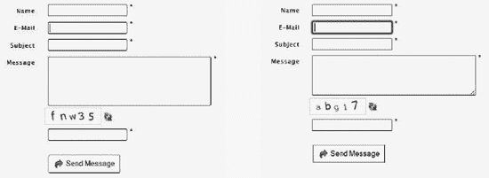

***图 10-10。**Firefox 和 Safari 中相同输入栏的默认浏览器高亮显示(选择第二个文本输入)*

由于突出显示因组件和浏览器而异，web 开发人员应该确保焦点指示器的高可见性。

表单组件、链接和所有属性大于`0`的元素都可以获得焦点。然而，一些平台的默认焦点指示器不是非常明显，并且在某些背景下可能很难看到。应始终确保重点指标的可见性。

不重要的警报是可选的。在理想情况下，用户不会被不必要的模态弹出窗口(要求用户单击 OK 按钮才能消失的对话框)打扰。

基于时间的媒体，如演示文稿，必须始终有一个替代的文本版本或描述。可以消除自动更新的内容，并提供一种推迟自动内容更新的机制。在静态页面部分或窗口中，移动和滚动文本也必须可用。

##### 实时媒体、音频和视频要求

预先录制的同步媒体(如视频剪辑)必须有字幕。声音只能在用户请求时播放。音效必须在三秒钟内自动关闭。此外，一个容易发现的控件必须位于页面的开头附近，用于打开/关闭声音。Flash 内容也必须有一个用于相同目的的控件。

在 Flash 电影中，带有`flash.accessibility.Accessibility.active`属性的屏幕阅读器检测可用于关闭使用辅助技术时自动播放的声音(默认情况下，声音仍可自动播放)。

音频文件中的非语音声音可能比语音音频内容至少低 20 dB。

一个额外的，用户可选择的音轨必须提供音频描述。

文本的语音版本可以显著提高站点的可访问性，因为它比屏幕阅读器的语音更准确、更容易理解。

纯音频直播内容可能有文本替代。这可以通过*实时字幕服务*来实现，该服务由训练有素的操作员来完成，操作员可以以很小的延迟输入文本。请注意，这种服务在实践中很少使用。

可以为跟随有现场音频内容的脚本提供到准备好的声明或脚本的文本抄本的链接。这些脚本可以比现场转录更加准确和完整；但是，必须小心确保正确的同步。

必须为呈现纯音频或纯视频内容的基于时间的媒体提供可访问的替代方案。

必须为纯音频直播和纯视频直播内容提供描述性标签。

视频必须提供完整描述视频内容的扩展音频注释。此外，视频内容的第二个版本必须始终提供音频描述，以最大限度地提高可访问性。这也适用于 Flash 视听材料。对话的间隙必须用使用 SMIL 的扩展音频描述来填充。

盲人和某些视障人士无法访问的纯视频内容必须有普通音频格式的音频替代，如 MP3。视频流的可访问性可以通过同步视频使用手语翻译最大化，同步视频的显示可以由用户选择。

必须为视频内容添加字幕，这些字幕可以根据请求打开或关闭，因为它们可以最大限度地提高可用性。字幕不仅要为听力受损者提供对话信息，还要提供声音描述信息(不同于传统字幕)。

### 从 WCAG 1.0 迁移到 WCAG 2.0

一些项目要求网站从 WCAG 1.0 升级到 WCAG 2.0。几个符合 WCAG 1.0 的站点只需要很少或根本不需要修改就可以满足 WCAG 2.0 的要求。WCAG 2.0 基于 WCAG 1.0；但是，在方法和要求上有一些不同。

默认情况下，符合 WCAG 1.0 标准的网站部分符合 WCAG 2.0 标准。WCAG 的两个版本是兼容的。因此，可以同时满足 WCAG 1.0 和 WCAG 2.0 的要求。然而，由于第二个版本的高级灵活性，符合 WCAG 2.0 的站点不会自动满足 WCAG 1.0 的要求。一些 WCAG 2.0 的成功标准与 WCAG 1.0 的检查点非常相似。另一方面，有一些 WCAG 1.0 的需求在 WCAG 2.0 中是不需要的。WCAG 2.0 的一些要求比 WCAG 1.0  [38 ]中的相关要求更加具体。

WCAG 1.0 是特定于技术的 [39 ]，而 WCAG 2.0 适用于 W3C 和非 W3C 技术，只要它们提供可访问性 [40 。

WCAG 1.0 使用临时解决方案(“直到用户代理……”)，而 WCAG 2.0 成功标准合规性假定用户代理支持。

在 WCAG 1.0 中，JavaScript 被认为是一种存在可访问性问题的技术。事实上，JavaScript 是可以访问的，这取决于所使用的应用和功能(我们将在后面更详细地讨论)。WCAG 2.0 考虑使用屏幕阅读器成功测试脚本技术。

从 WCAG 1.0 迁移到 2.0 的主要步骤可以总结如下 [42 ]:

1.  应该确定一致性参数。
2.  应确定应用的技术。
3.  应分析技术要求的应用潜力。
4.  WCAG 1.0 检查点应根据 WCAG 2.0 的要求进行检查。
5.  应该检查 WCAG 2.0 的成功标准。

最后，虽然听起来很奇怪，但并不是每个人都热衷于最高级别的网络可访问性。虽然从可访问性的角度来看，WCAG 2.0 给人留下了深刻的印象，但由于许多原因，它仍然受到批评。例如，规范非常长且复杂，技术中立的描述对于开发人员来说很难实现，包括非常特殊的需求(特别是 AAA 一致性，如实时字幕服务)，一些定义很难理解，当存在可访问版本时，不可访问的页面版本是可以容忍的，测试非常复杂，并且不是所有的内容都可以以符合最严格要求的方式编写。

#### 美国第 508 条

除了 W3C 标准之外，世界各地还有针对特定国家/地区的 web 可访问性标准和/或法规。在美国，对政府网站的一个基本要求是遵守 508 条款。修正案的子部分 B 描述了技术标准。web 开发者最重要的部分是 1194.22(基于 Web 的内网和互联网信息与应用) [44 。

第五百零八部分定义的基于 web 的技术和信息标准基于 W3C WAI 指南。因此，1194.22 和 WCAG 1.0 检查点是一致的 [45 ]。

对图形或动画的使用没有限制，但它们必须以可访问的形式提供。除了为图形提供的文本标签和描述之外，本节还介绍了样式表、表单、脚本、多媒体内容、图像映射、语言和插件的可用性。

应为所有非文本元素编写替代文本。多媒体演示应该与其等效的替代方案同步。信息不能只用颜色来表达。

信息表示不能完全依赖关联的样式表。

应该为数据表声明行标题和列标题。

数据表的数据单元格和标题单元格应该关联。

客户端图像映射应该优先于服务器端图像映射，除非区域不能用可用的几何形状来定义。

应该为服务器端图像映射的所有活动区域提供冗余文本链接。

框架应该有唯一的标题。

应消除频率为 2–55 赫兹的屏幕闪烁。

一个纯文本页面应该提供相同的信息和功能。

辅助技术必须能够访问脚本提供的内容。

需要第三方软件(如插件)的 Web 内容必须提供指向插件网站的链接。

表单应该提供对辅助技术的访问。

应该允许用户跳过重复的导航链接。

应通知用户定时响应要求，并允许延长时间限制。

### 语义(X)HTML5 元素和 WAI-ARIA

HTML5 规范中引入的新语义标记元素，如`header`、`hgroup`、`footer`、`article`、`section`、`aside`和`nav`，都包含了可访问性潜力。但是，请记住，浏览器对这些元素的支持各不相同，这一点很重要。

对 ARIA 角色的支持也在增加。ARIA 角色可以作为附加标记来应用，以提高可访问性潜力；换句话说，它们的存在不会在没有 ARIA 支持的系统上引起任何问题。ARIA 角色作为属性被添加到诸如`banner`、`complementary`、`contentinfo`、`form`、`main`、`navigation`或`search`的元素中。几个 ARIA 角色描述文档结构，即:`article`、`columnheader`、`definition`、`directory`、`document`、`group`、`heading`、`img`、`list`、`listitem`、`math`、`note`、`presentation`、`region`、`row`、`rowheader`、`separator`和`toolbar`。

结构化元素的角色可以由`role`属性提供。清单 10-14 显示了一个例子。

***清单 10-14。**使用`role`属性*

`<header **role="banner" /**>`

某些角色在一个页面中必须是唯一的。显示的横幅标题代码就是一个很好的例子。虽然开发人员可以使用无限数量的标题，但只有一个标题可以是横幅标题。

### JavaScript 可访问性

脚本提供的隐藏内容、导航和奇怪的用户控制行为会导致混乱和可访问性问题。例如，用于检查用户输入的`onblur`事件可以覆盖用户代理的默认行为，并保持焦点直到给出正确答案，这使得屏幕阅读器在没有输入正确答案的情况下无法访问页面的任何其他部分(包括其他地方提供的反馈文本)。并不是所有的事件处理程序都是独立于设备的，有些依赖于鼠标(`onmouseover`、`onmouseout`、`ondblclick`)或者键盘(比如`onkeydown`、`onkeyup`)，并不能在所有的设备上触发。如果使用了与设备无关的事件处理程序(如`onfocus`、`onblur`、`onselect`或`onchange`)，通过脚本提供的内容和功能是可访问的，提供了完整的键盘控制，并且脚本不会通过修改或覆盖正常的浏览器功能而造成混乱，则脚本是可访问的 [46 ]。当 JavaScript 不能被本地访问时，必须提供一个可访问的替代方案。

下拉菜单和弹出菜单在整个网络中普遍使用。然而，键盘用户不能直接访问`onmouseover`和`onmouseout`事件处理程序。因此，必须提供替代方案。

对于键盘用户来说，触发`onfocus`和`onblur`事件处理程序可能不方便或不可访问。

`onclick`事件处理程序是一个独立于设备的事件处理程序；但是，有些应用依赖鼠标。与链接或表单控件不同，在链接或表单控件中，可以通过按 Enter 键来触发`onclick`事件处理程序，而在使用键盘导航时，纯文本和表格单元格不能获得焦点。因此，键盘用户不能为链接或表单控件以外的元素激活`onclick`事件。如果该事件与表单元素一起使用(例如，用于表单验证)，这不是问题，使用`onclick`事件的提交按钮可以被定点设备和键盘激活。

`ondblclick`事件处理程序一般是依赖于鼠标的，因为它与鼠标的双击相关联，并且在所有输入设备(如键盘)上没有等效的事件。

下拉选择列表如语言选择器通常应用`onchange`事件处理程序。通过单击从列表中选择一个选项直接进入相应的版本，这对于鼠标用户来说非常方便。然而，这些列表对于键盘用户来说是不可访问的，因为他们除了第一个选项外不能选择(在按下键盘上的光标向下键后，第一个选项立即被选择)。该问题的一个可能的解决方案是添加一个按钮作为`onclick`事件处理程序的触发器。但是，在这种情况下，所有用户都应该在选择了触发事件处理程序所需的选项后按下按钮。

也可以以独立于设备的方式应用`onselect`事件处理程序。

某些事件处理程序如`onkeydown`和`onkeyup`可以由键盘专门触发。鼠标无法访问与它们相关联的操作。

动态内容，如`document.write`呈现的当前时间，不能被屏幕阅读器读取。

 **注意**动态网页的一些特性也可以用纯 CSS(尤其是 CSS3)实现；因此，为了支持 CSS，某些 JavaScript 代码可以被删除(例如，过渡效果或转换菜单项)。然而，屏幕阅读器不能很好地处理某些 CSS 特性，例如，被`display: none;`或`visibility: hidden;`隐藏的元素。

### PDF 可访问性

Adobe Acrobat 和 Acrobat Reader 提供辅助功能(图 10-11 )以及屏幕阅读器选项。它们可以在“编辑首选项”下找到，或者直接使用快捷键 Ctrl+K 找到。您可以在“查看”“大声朗读”下找到“屏幕阅读器”选项。

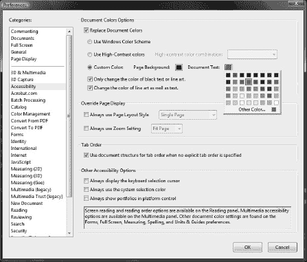

***图 10-11。**Adobe Acrobat/Acrobat Reader 中的辅助功能首选项*

设置助手等特殊功能可在高级辅助功能下设置(图 10-12 )。

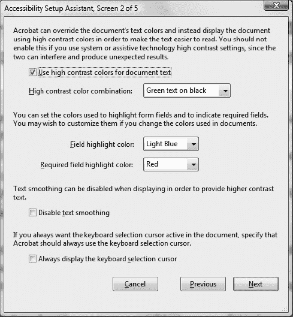

***图 10-12。**辅助功能设置助手*

*通常通过扫描纸质文档创建的纯图像 PDF 文件*存在可访问性问题。无法搜索文本。颜色无法调整。屏幕阅读器不能阅读只有图像的 PDF 文件。作者应该使用 Acrobat 的 OCR 功能以文本形式提供文本文档，同时保留结构。

*非结构化 PDF 文件*的可访问性各不相同。他们的阅读顺序可以改变。它们提供自动标记，作者可以选择使用手动标记。受保护的文件不能保存为可访问的格式。

*结构化 PDF 文件*的文本完全可以访问。超链接是功能性的。图像的替换文本是可访问的(如果存在)。页码是正确的。屏幕阅读器可以正确读取基本数据表。如果提供的话，可选书签可以进一步提高可访问性。也可以访问受保护的文件。然而，即使是结构化的 PDF 文件也有一些已知的可访问性问题。例如，段落不能被完美地定位。字体属性信息不可用。

### Flash 可访问性

虽然易访问性一直是 Flash 技术的一个弱点，但是开发者环境和免费播放器在这方面都得到了改进。Adobe Flash Professional 和 Adobe Flash Player 有几个支持辅助技术的功能 [47 。

Flash 电影的布局和结构可能相当复杂，使得屏幕阅读器很难阅读内容。为整个电影添加的描述可以为屏幕读者提供关于电影结构的提示。

必须为图形元素添加文本等价物，例如图形图标的名称或手势动画的描述。元素组必须有一个等效的文本。

永不停止移动的电影会导致屏幕阅读器频繁刷新。即使在底部包含电影的网页上，屏幕阅读器也可能将 motion 解释为页面更新，并返回顶部重新开始阅读。这种行为可以通过使影片剪辑或整个影片的子对象不可访问来消除 [48 ]。

为了允许用户控制动作，必须在电影中添加 Next 按钮，而不是在有限的时间内显示信息。

Flash 中有几个用户界面组件是可访问的，这些组件自动执行常见的可访问性任务，如标记或提供键盘访问。可访问性对象可以用类`enableAccessibility()`来启用。

FLVPlayback 组件提供了在 Flash 应用中包含视频播放器的选项，以播放下载的 Adobe Flash 视频(FLV)文件和流式 FLV 文件。FLVPlaybackCaptioning 组件可以将字幕与视频相关联。字幕组件支持定时文本标记语言(TTML) W3C 标准，以及多字幕和切换控制。

有多种方法可以控制 Flash 中的读取顺序，例如限制舞台大小、提供额外的线性内容版本或通过 ActionScript 指定读取顺序。

用户控件必须可以通过键盘访问。必须在按钮上添加键盘快捷键。为了考虑屏幕阅读器的限制，脚本必须保持在框架内，并且必须避免将空的电影剪辑用作按钮。

在 Flash Professional CS5 中，引入了一个新的组件来显示包含在定时文本格式(DFXP)中或与 FLV 文件集成在一起作为提示点的音频字幕。Flash Professional CS5 还为可访问的视频播放器外观提供本机支持。

用户控制对于音频回放是必须的，例如播放和暂停按钮。

对于所有控件，在控件发生变化时向用户提供反馈是很重要的。

前面在 WCAG 要求中描述的颜色选择的一般规则也适用于 Flash 内容。

### 数学符号的可访问性

GIF 图像中提供的数学公式对于视力受损的人来说可能难以阅读，如果没有文本描述，屏幕阅读器也无法阅读。

相比之下，MathML 方程更容易理解。MathML 的可访问性潜力由一个用于 Internet Explorer 的免费 MathML 插件的可访问性特性清楚地展示出来，4Design Science math player[49】。该软件为屏幕阅读器提供数学符号的音频或盲文描述。MathPlayer 还具有本地语音功能(从本地菜单中选择`speak expression`)。它允许键盘导航。MathPlayer 2 还包含 MathZoom，允许用户放大单个表达式。匹配算法确保当周围的文本被缩放时，数学符号的字体大小增加。此外，MathPlayer 支持换行符，如果缩放字体大小，这可以提高可读性。它提供了大声朗读的子表达式的同步突出显示，这有助于患有某些学习障碍如阅读障碍或计算障碍的人。

__________

由于 Internet Explorer 从第 9 版开始就支持 MathML，所以只有早期版本才需要 MathML 插件。该公司还提供创建数学符号的工具，如 MathType(参见“MathType”一节)。

### 总结

在本章中，你学习了在标记、样式表、客户端和服务器端脚本以及多媒体内容中应用的可访问性指南。现在，您可以创建任何人都可以使用的具有所需可访问性级别的网站，而不用考虑用户的残疾或浏览设备的限制。

在下一章，你将会学到网络标准化的工具。您将熟悉在选择高级文本编辑器、特定编辑器或标记校正器时需要考虑的要求，它们可以极大地简化您的工作。

### 参考文献

1.  《澳大利亚残疾歧视法》(1992 年)。澳大利亚法律信息研究所。[www.austlii.edu.au/au/legis/cth/consol_act/dda1992264/](http://www.austlii.edu.au/au/legis/cth/consol_act/dda1992264/)2011 年 1 月 6 日访问
2.  众议院办公室(2005 年)《残疾法》。爱尔兰国民议会。[www.oireachtas.ie/documents/bills28/acts/2005/a1405.pdf](http://www.oireachtas.ie/documents/bills28/acts/2005/a1405.pdf)2011 年 1 月 6 日访问
3.  OPSI (1995 年)残疾歧视法。英国成文法数据库。[www.statutelaw.gov.uk/content.aspx?activeTextDocId=3330327](http://www.statutelaw.gov.uk/content.aspx?activeTextDocId=3330327)2011 年 1 月 6 日访问
4.  美国接入委员会(2010)508 条款主页:电子和信息技术。美国准入委员会。[www.access-board.gov/508.htm](http://www.access-board.gov/508.htm)2011 年 1 月 6 日访问
5.  Henry SL (ed) (2011)网络无障碍倡议(WAI)。万维网联盟。[www.w3.org/WAI/](http://www.w3.org/WAI/)2011 年 2 月 4 日访问
6.  W3C (1997)万维网联盟发起了网页可访问性倡议国际项目办公室。万维网联盟。[www.w3.org/Press/IPO-announce](http://www.w3.org/Press/IPO-announce)2010 年 10 月 14 日访问
7.  Régis J，Morrison A，Touré H (2010 年)世界标准日致辞。国际标准化组织。[www.iso.org/iso/wsd2010/wsd2010_message.htm](http://www.iso.org/iso/wsd2010/wsd2010_message.htm)2010 年 10 月 14 日访问
8.  Paciello MG (2000 年)残疾人网络无障碍。劳伦斯 CMP 图书公司
9.  Henry SL，McGee L (eds) (2010)可达性。在:网页设计和应用。万维网联盟。[www.w3.org/standards/webdesign/accessibility](http://www.w3.org/standards/webdesign/accessibility)2010 年 10 月 14 日访问
10.  Richards J，Spellman J，Treviranus J，May M (eds) (2010)创作工具可访问性指南(ATAG) 2.0。万维网联盟。[www.w3.org/TR/ATAG20/](http://www.w3.org/TR/ATAG20/)2011 年 2 月 2 日访问
11.  Allan J，Ford K，Richards J，Spellman J (eds) (2010)用户代理可访问性指南(UAAG) 2.0。万维网联盟。[www.w3.org/TR/UAAG20/](http://www.w3.org/TR/UAAG20/)2011 年 2 月 2 日访问
12.  Abou-Zahra S，Squillace M (eds) (2009)评估和报告语言(EARL) 1.0 模式。万维网联盟。[www.w3.org/TR/EARL10-Schema/](http://www.w3.org/TR/EARL10-Schema/)2011 年 2 月 2 日访问
13.  亨利·SL(编辑)(2011)WAI-ARIA 文件。在:WAI-ARIA 概述。万维网联盟。[www.w3.org/WAI/intro/aria.php#is](http://www.w3.org/WAI/intro/aria.php#is)2011 年 9 月 9 日访问
14.  Craig J，Cooper M，Pappas L，Schwerdtfeger R，Seeman L (2011)可访问的富互联网应用(WAI-ARIA) 1.0。万维网联盟。[www.w3.org/TR/wai-aria/](http://www.w3.org/TR/wai-aria/)2011 年 2 月 2 日访问
15.  Pappas L，Schwerdtfeger R，Cooper M (2010) WAI-ARIA 1.0 初级读本——富互联网应用可访问性挑战和解决方案介绍。[www.w3.org/TR/wai-aria-primer/](http://www.w3.org/TR/wai-aria-primer/.)2011 年 9 月 9 日访问
16.  Scheuhammer J，Cooper M (2010) WAI-ARIA 1.0 创作实践——作者理解和实现可访问富互联网应用的指南。万维网联盟。[www.w3.org/TR/wai-aria-practices/](http://www.w3.org/TR/wai-aria-practices/)2011 年 9 月 9 日访问
17.  Snow-Weaver A，Cooper M (2010) WAI-ARIA 1.0 用户代理实施指南——用户代理开发者理解和实施可访问富互联网应用的指南。万维网联盟。[www.w3.org/TR/wai-aria-implementation/](http://www.w3.org/TR/wai-aria-implementation/)2011 年 9 月 9 日访问
18.  博尔特曼 D，扬森 J，塞萨尔 P，穆兰德 S，海奇 E，德梅利奥 M，金特 J，川村 H，韦克 D，帕涅达 XG，梅伦迪 D，克鲁兹-拉拉 S，汉克里克 M，祖克 DF，米歇尔 T(编辑)(2008)同步多媒体集成语言(SMIL 3.0)。W3C 推荐。万维网联盟。[www.w3.org/TR/SMIL/](http://www.w3.org/TR/SMIL/)2011 年 9 月 13 日访问
19.  Adams G (ed) (2010)时控文本标记语言(TTML) 1.0。W3C 推荐。万维网联盟。[www.w3.org/TR/ttaf1-dfxp/](http://www.w3.org/TR/ttaf1-dfxp/)2011 年 9 月 13 日访问
20.  齐索姆 W，范德黑登 G，雅各布斯 I(编辑)(1999)网页内容无障碍指南 1.0。万维网联盟。[www.w3.org/TR/WAI-WEBCONTENT/](http://www.w3.org/TR/WAI-WEBCONTENT/)2011 年 1 月 24 日访问
21.  考德威尔 B，库珀 M，里德 LG，范德黑登 G，齐索姆 W，斯拉丁 J，怀特 J(编辑)(2008)网页内容无障碍指南(WCAG) 2.0。万维网联盟。[www.w3.org/TR/WCAG20/](http://www.w3.org/TR/WCAG20/)2011 年 1 月 25 日访问
22.  范德黑登 G，里德 LG，考德威尔 B，亨利 SL，莱蒙 G(编辑)(2010)如何迎接 WCAG 2.0。可定制的 Web 内容可访问性指南 2.0 要求(成功标准)和技术的快速参考。万维网联盟。[www.w3.org/WAI/WCAG20/quickref/](http://www.w3.org/WAI/WCAG20/quickref/)2011 年 1 月 14 日访问
23.  范德黑登 G，里德 LG，考德威尔 B，亨利 SL (2008)如何迎接 WCAG 2.0。可定制的 Web 内容可访问性指南 2.0 要求(成功标准)和技术的快速参考。万维网联盟。[www.w3.org/WAI/WCAG20/quickref/20081211/](http://www.w3.org/WAI/WCAG20/quickref/20081211/)2010 年 9 月 23 日访问
24.  库珀 M，里德 LG，范德黑登 G，考德威尔 B，齐索姆 W，斯拉丁 J(编辑)(2010)WCAG 2.0 技术。Web 内容可访问性指南 2.0 的技术和失败。万维网联盟。[www.w3.org/TR/WCAG20-TECHS/](http://www.w3.org/TR/WCAG20-TECHS/)2011 年 1 月 24 日访问
25.  库珀 M，里德 LG，范德黑登 G，考德威尔 B，齐索姆 W，斯拉丁 J(编辑)(2010)附录 a .如何从其他文件中引用 WCAG 2.0。在:了解 WCAG 2.0。理解和实现 Web 内容可访问性指南 2.0 的指南。万维网联盟。www.w3.org/TR/UNDERSTANDING-WCAG20/appendixA.html.于 2011 年 2 月 2 日进入
26.  Cooper M，Reid LG，Vanderheiden G，Caldwell B (eds) (2010)章节标题:理解章节 2.4.10。在:了解 WCAG 2.0。万维网联盟。[www . w3 . org/TR/UNDERSTANDING-wcag 20/navigation-mechanisms-headings . html](http://www.w3.org/TR/UNDERSTANDING-WCAG20/navigation-mechanisms-headings.html)。2011 年 9 月 10 日访问
27.  Abou-Zahra S 等人(编辑)(2005 年)对网站可访问性的一致性评估。万维网联盟。[www.w3.org/WAI/eval/conformance.html](http://www.w3.org/WAI/eval/conformance.html)2011 年 2 月 2 日访问
28.  WebsynergiDesign (2011)可访问性–我们的经验&可访问网站设计组合。网站协同设计有限公司[www . websynergi . com/accessibility/accessibility-bobby-W3C . aspx](http://www.websynergi.com/accessibility/accessibility-bobby-w3c.aspx.)2011 年 9 月 10 日访问
29.  Caldwell B，Cooper M，Reid LG，Vanderheiden G (eds) (2008)相对亮度。在:网页内容无障碍指南(WCAG) 2.0。W3C 推荐。万维网联盟。[www . w3 . org/TR/2008/REC-wcag 20-2008 12 11/# relativeluminancedef](http://www.w3.org/TR/2008/REC-WCAG20-20081211/#relativeluminancedef)。2011 年 9 月 11 日访问
30.  WebAIM (2011)色彩对比检查器。犹他州州立大学。[`webaim.org/resources/contrastchecker/`](http://webaim.org/resources/contrastchecker/)2011 年 9 月 11 日访问
31.  Juicy Studio (2011)光度色彩对比度分析仪。多汁工作室。[`juicystudio.com/services/luminositycontrastratio.php`](http://juicystudio.com/services/luminositycontrastratio.php)2011 年 9 月 11 日访问
32.  WAT-C (2005)光度对比度分析仪 1.1。网络辅助工具联盟。[`www.wat-c.org/tools/CCA/LCRA/index.html`](http://www.wat-c.org/tools/CCA/LCRA/index.html)2011 年 9 月 11 日访问
33.  库珀 M，里德 LG，范德黑登 G，考德威尔 B，齐索姆 W，斯拉丁 J(编辑)(2010)颜色选择器。工作实例。WCAG 2.0 的技术。Web 内容可访问性指南 2.0 的技术和失败。万维网联盟。[www.w3.org/TR/WCAG20-TECHS/working-examples/G175/index.php](http://www.w3.org/TR/WCAG20-TECHS/working-examples/G175/index.php)2011 年 1 月 28 日访问
34.  Ishida R (ed) (2011) CSS3 Ruby 模块。万维网联盟。[www.w3.org/TR/css3-ruby/](http://www.w3.org/TR/css3-ruby/)2011 年 9 月 11 日访问
35.  Sowden P (2001)替代样式:使用替代样式表。一份单独的杂志。[www.alistapart.com/d/alternate/styleswitcher.js](http://www.alistapart.com/d/alternate/styleswitcher.js)2011 年 9 月 12 日访问
36.  W3C (2004)演示了在签名科学项目中使用的签名头像技术。TERC。[www.w3.org/2004/Talks/0628-rdig-sims/vcom3d-signsci.mov](http://www.w3.org/2004/Talks/0628-rdig-sims/vcom3d-signsci.mov)2011 年 9 月 12 日访问
37.  Trace Center (2011)光敏癫痫分析工具(PEAT)。威斯康星大学。[`trace.wisc.edu.peat/`](http://trace.wisc.edu.peat/)2011 年 9 月 11 日访问
38.  WCAG EOWG WG(eds)(2009)WCAG 1.0 检查站与 WCAG 2.0 检查站的比较，按数字顺序排列。万维网联盟。[www.w3.org/WAI/WCAG20/from10/comparison/](http://www.w3.org/WAI/WCAG20/from10/comparison/)2011 年 2 月 3 日访问
39.  齐索姆 W .范德黑登 G .雅各布斯 I(编辑)(1999 年)准则 11。使用 W3C 技术和指南。在:网页内容可访问性指南 1.0。万维网联盟。[www.w3.org/TR/WAI-WEBCONTENT/#gl-use-w3c](http://www.w3.org/TR/WAI-WEBCONTENT/#gl-use-w3c)2011 年 2 月 3 日访问
40.  库珀 M，里德 LG，范德黑登 G，考德威尔 B，齐索姆 W，斯拉丁 J (2008)理解无障碍支持。在:了解 WCAG 2.0。理解和实现 Web 内容可访问性指南 2.0 的指南。万维网联盟。[www . w3 . org/TR/2008/NOTE-UNDERSTANDING-wcag 20-2008 12 11/conformance . html](http://www.w3.org/TR/2008/NOTE-UNDERSTANDING-WCAG20-20081211/conformance.html)# UC-accessibility-support-head。2011 年 2 月 3 日访问
41.  齐索姆 W .范德黑登 G .雅各布斯 I(编辑)(1999 年)准则 6。在:网页内容可访问性指南 1.0。万维网联盟。[www.w3.org/TR/WCAG10/wai-pageauth.html](http://www.w3.org/TR/WCAG10/wai-pageauth.html)#技脚本。2011 年 2 月 3 日访问
42.  如何将你的网站从 WCAG 1.0 升级到 WCAG 2.0。万维网联盟。www.w3.org/WAI/WCAG20/from10/websites.html.于 2011 年 2 月 2 日进入
43.  克拉克 J (2006)让 WCAG2 见鬼去吧。一份名单之外。[www.alistapart.com/articles/tohellwithwcag2](http://www.alistapart.com/articles/tohellwithwcag2)2010 年 9 月 23 日访问
44.  美国政府(2010) 1194.22 基于网络的内联网和互联网信息及应用。在:第五百零八部分标准指南。美国政府。[www . Section 508 . gov/docs/Section % 20508% 20 standards % 20 guide . pdf](http://www.section508.gov/docs/Section%20508%20Standards%20Guide.pdf)。2011 年 2 月 4 日访问
45.  美国政府(2010)第 1194.22 号照会。在:第五百零八部分标准指南。美国政府。[www.section508.gov/index.cfm?fuseAction=stdsdoc](http://www.section508.gov/index.cfm?fuseAction=stdsdoc)2011 年 2 月 4 日访问
46.  WebAIM (2011)创建可访问的 JavaScript。创建可访问的 JavaScript 概述。牢记网页可访问性。[`webaim.org/techniques/javascript/`](http://webaim.org/techniques/javascript/)2011 年 2 月 3 日访问
47.  Adobe (2011) Adobe Flash 可访问性设计指南。Adobe 系统公司。[www . adobe . com/accessibility/products/flash/best _ practices . html](http://www.adobe.com/accessibility/products/flash/best_practices.html)。2011 年 2 月 4 日访问
48.  Adobe (2011)可访问性最佳实践概述。中:Adobe Flash 辅助功能设计指南。Adobe 系统公司[www . adobe . com/accessibility/products/flash/best _ practices . html](http://www.adobe.com/accessibility/products/flash/best_practices.html.)。2011 年 9 月 12 日访问
49.  设计科学(2011) MathPlayer 会说话！MathPlayer:语音指令和示例。设计科学。[www . dessci . com/en/products/math player/tech/accessibility . htm](http://www.dessci.com/en/products/mathplayer/tech/accessibility.htm)。2011 年 2 月 4 日访问