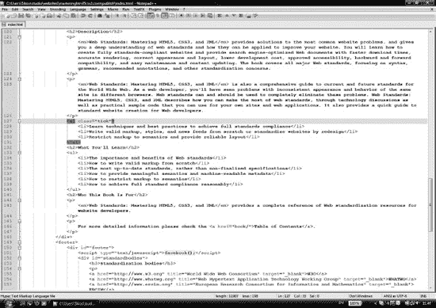
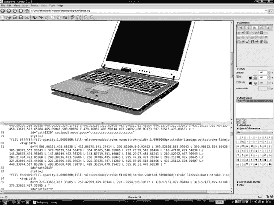
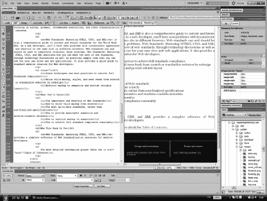
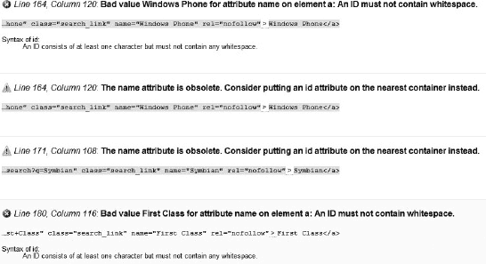
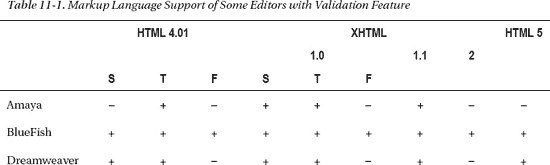
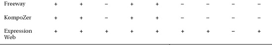
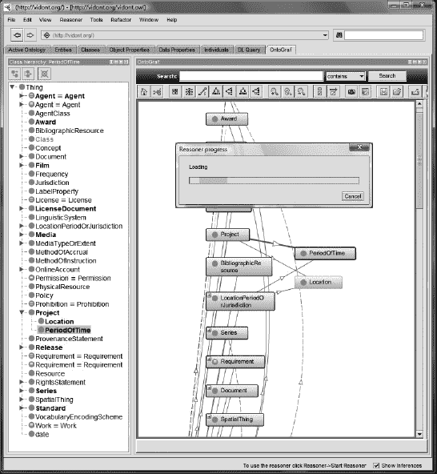
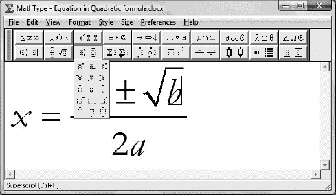
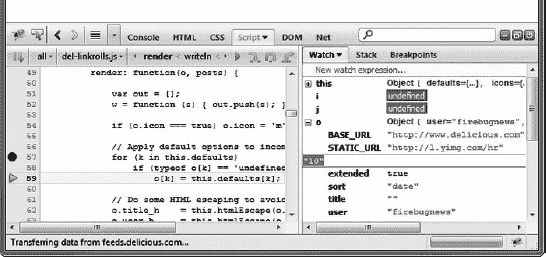
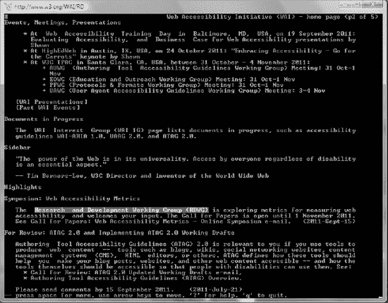

# 十一、开发工具

由于现代标记元素和属性变得越来越复杂，复杂的开发软件被用来生成网页。然而，某些 web 内容(如描述性元数据)可能非常复杂，经常需要人工决策。高级文本编辑器总是在每个网络标准的软件列表中占有最高的优先权。虽然它们可以用于各种任务，但应该应用特定的编辑器，如语义编辑器和标记纠正器。高级文本编辑器也可以与 SFTP 客户端集成。WYSIWYG 编辑器和内容管理系统对快速开发很有用；但是，它们经常产生无效代码。因此，在网站标准化和优化中应该尽量减少它们的应用。

在这一章中，你将学习一些软件工具，它们可以帮助你开发符合标准的网站。您将熟悉那些在选择开发工具、优化器和测试环境时应该考虑的重要特性。

### 功能要求

尽管经验丰富的 web 标准化人员可以在任何文本编辑器中编写有效的代码，但所选择的软件工具应该提供一些高级功能，这些功能对于高效的手工编码至关重要:

*   全面的字符编码支持，包括完整的 Unicode 支持
*   空白字符支持
*   控制字符支持，例如，CR+LF (Windows)、LF only (UNIX)和 Apple (CR only)换行
*   带标签的多文件编辑
*   用于突出显示 (XHTML、CSS、XML、脚本等)的*语法的可定制颜色模式*
*   退回/重做
*   强制自动换行
*   加行号
*   自动缩进
*   标签对和元素嵌套指南
*   操作系统集成(将应用添加到右击菜单)

所选的编辑器应至少与您的一个浏览器集成为默认源代码编辑器，您可以使用该编辑器通过按钮或热键打开当前渲染的 web 文档进行编辑。

文本编辑器还有一些不是很重要但很有用的特性:

*   自定义颜色和字体设置
*   可定制的工具栏
*   拼写检查器
*   模板
*   书签
*   完全支持拖放
*   内置 FTP 客户端或与 FTP 客户端集成
*   转换(大写、小写、颠倒大小写和首字母大写)
*   国际版本(对某些开发人员来说可能比较方便)
*   支持在远东语言中使用的双字节字符系统(DBCS)，如中文或日语(如果需要)
*   浏览器预览 1 (启动默认或选定的网页浏览器进行调试和测试)

### 文字编辑

与微软 word 或 OpenOffice.org Writer 等文字处理器相比，*纯文本编辑器*不能用于文档格式化。不过，这些基本的文本编辑器可以用来创建网页。然而，它们并不方便，而且缺少一些重要的功能。例如，它们中的许多不能正确处理所有的控制和空白字符。最广为人知的例子就是 Windows 下的记事本和 Linux 下的 vi。

写字板等高级文本编辑器提供文本格式和其他附加功能。*源代码编辑器*是高级文本编辑器，带有专门为手工编码者和程序员设计的附加工具。它们最常见的特性是各种标记语言、样式表和编程语言的语法突出显示。这些全功能编辑器是适合手工编写网页的综合工具。以下是一些例子:

Linux 操作系统

*   蓝鱼 [1
*   科莫多编辑  [2 ]

Mac OS 系统

*   bbedit[3 的缩写形式
*   文字包裹器 [4

Windows 操作系统

*   EditPad Lite(有免费版 [5 ]和低价版 [6 )
*   EditPlus  [7
*   NotePad++(免费、开源 [8 ])
*   TextPad(低成本、免费评估 [9 ])

跨平台

*   Arachnophilia(适用于 Windows、Linux、Unix、FreeBSD 和 Mac OS  [10 ])

______________

1 一些开发人员不使用该功能，而是手动打开所需的浏览器。

举个例子，我们来看看 Notepad++的主要特性。这是一个多文件编辑器，具有方便的文件管理器选项。例如，编辑器只需单击一下即可保存多个文件，打开最近编辑过的文件，并为每个打开的文件提供选项卡。它有一个完全可定制的界面，具有高级功能，如线条标记、打开和关闭标签对的指南、折叠或显示当前编辑的 DOM 树级别的结构化指南，以及语法高亮(图 11-1 )。

***图 11-1。**Notepad ++中的语法高亮显示和标签对指南*

语法高亮支持多种编程和 web 开发语言，从 HTML 到 XML，从 PHP 到 Ruby。有几个预定义的颜色主题可供选择，如果需要，您也可以创建并应用新的主题。不同的文档组件(缩进参考线、标记、标记、空白、标签对、活动和非活动标签等)可以单独设置样式。记事本++可以改变文件的文字方向。它还支持各种字符编码，可以添加和删除字节顺序标记，支持大端和小端 Unicode 文件，并将文件从一种编码转换为另一种编码。 2 应用中打开的文档可以在任何安装的浏览器中预览。

Notepad++还提供了高级的文本转换功能，例如转义某些字符、将小写字符转换为大写字符(反之亦然)、搜索匹配字符串、将十进制数字转换为十六进制数字、插入当前日期和时间、对列表进行升序或降序排序、自动将前导空格转换为制表符等等。Notepad++也支持宏，可以多次运行。特性列表可以通过额外的插件来扩展，例如 Base64 编码和解码的 MIME 工具。

### 所见即所得编辑

图形创作工具可能很舒适，但是不能保证在所有情况下都符合标准。它们的功能甚至对高级开发人员也很有用，并且它们提供了一个带有标记窗口、即时预览和高级调试工具的界面。然而，并不是所有的开发人员都应用它们，有些人专门使用高级文本编辑器。图形开发环境通常只需要标记和 CSS 的基础知识(有时不需要任何技术背景)，这是它们非常受欢迎的主要原因。然而，由于大量的功能，可能会有可用性问题。例如，界面可能会让一些用户感到困惑和害怕，尤其是那些没有几年专业知识的用户。尽管有图形界面，有些系统还是很难掌握。此外，所有这些工具都有不同的界面，其中一个工具的专家不一定熟悉其他系统，这是一个限制，特别是如果编辑器只适用于一个平台。相比之下，手工编码者几乎可以在任何环境下工作，因为文本编辑器可用于所有平台，并且它们的主要功能非常相似。

值得注意的是，大多数所见即所得编辑器都有内置的源代码编辑器。因此，WYSIWYG 编辑器也可以作为源代码编辑器使用。此外，图形编辑器的一些特性对任何 web 开发人员都是有用的，比如数据库管理、web 服务器和框架。此外，还有专门用于 web 标准化的 WYSIWYG 编辑器，如 XStandard XHTML 和 W3C Amaya ( 图 11-2 )。

______________

2 此功能可用于某些编码，这些编码可以合理地转换成另一种更高级的编码，而不会牺牲某些字符(例如，ANSI 到 UTF-8)。

***图 11-2。**阿玛亚*的一个 SVG 文件

有许多商业和免费的编辑工具。然而，与高级文本编辑器和源代码编辑器相比，许多商业所见即所得编辑器都很昂贵。另一方面，有几个图形开发者不仅是免费的，而且是开源的。以下是一些例子:

Windows 操作系统

*   微软表情网页 [12 ](商业)
*   微软网站矩阵 [13 ](免费软件)

跨平台

*   适用于 Windows 和 Mac OS 的 Adobe Dreamweaver(商业版) [14
*   W3C Amaya，一个免费的开源 HTML、MathML 和 SVG 编辑器 [15
*   XStandard XHTML，符合标准的 XHTML 编辑器，可用于 Windows 和 Mac OS(免费精简版) [16 ]

业界领先的创作应用 Dreamweaver 的标准合规性在不断发展。然而，web 标准花了几年时间才引起人们的注意。

最新版本支持 HTML、CSS、XSLT、JavaScript、ActionScript、XML、ASP、ColdFusion、JSP 和 PHP。Dreamweaver 中的一些功能和工具不仅对一般开发有用，而且对符合标准的开发也有用。例如，无效代码突出显示、信息栏中显示的语法错误警告、与当前选定元素关联的 CSS 属性列表以及语法突出显示。程序界面具有高度的可定制性，并以不同的模式显示代码、结果或同时显示两者(图 11-3 )。

***图 11-3。**代码和设计可以在 Adobe Dreamweaver 中同时显示。*

### 内容管理系统和博客

内容管理系统(CMSs)是主要为 web 内容创作和博客发布开发的 WYSIWYG 工具。很多都是 PHP 驱动的。最知名的内容管理系统都是跨平台的，比如 Drupal  [17 ]，Joomla！ [18 ，还有 WordPress  [19 ]。除了 web 发布的常见任务之外，它们还提供现代功能，如语义内容支持。然而，CMSs 的标准支持各不相同。毫无疑问，他们是网络上大量无效标记的罪魁祸首。图 11-4 显示了一个典型的例子。

***图 11-4。**CMS 生成的每十行标记中的错误和警告*

因为它们是为快速开发而设计的，不需要源代码编辑，有经验的 web 标准化人员会尽可能避免使用它们。虽然有越来越多的 CMS 声称可以产生符合标准的代码(LiveStoryboard  [20 ]、WebDandy  [21 ]、sNews  [22 ]等等)，但是它们中的大多数都没有提供一个整体的标准实现方法；但是，有些会产生接近最佳的合理标记代码。

#### 网络标准支持

编辑对标准的支持各不相同。几个工具知道某些标记版本或变体，而其他工具只支持部分 CSS(表 11-1 )。不存在最终的解决方案，但是任何综合的工具都可能是手工编码者的好选择。例如，BlueFish 不仅支持所有(X)HTML 版本和变体，还支持 RSS、Atom、MathML、CSS2、frames、JavaScript、Java、XSLT、XForms 和 XPath。

### 具体编辑

除了高级文本编辑器之外，web standardistas 的工具集中还有一些不可错过的特殊工具。这些工具包括语义编辑器、标记纠正器、特殊编辑器、SFTP 客户端和浏览器插件。

#### 语义编辑器和推理器

随着 OWL 的日益流行，越来越多的 OWL 开发工具出现在市场上。Web 本体是机器可处理的，语义推理机(也称为推理引擎或规则引擎)可用于从本体描述的事实或公理中推断逻辑结果。下面描述一些最有用的*语义编辑器*和*推理机*。

*Protégé* 是一个免费的开源框架 [23 ，也是使用最广泛的 OWL 编辑器之一。它是开发和测试本体的有效工具。Protégé支持多种文件格式和语法，包括 OWL、函数语法中的 OWL、曼彻斯特语法中的 OWL、RDF/XML、OBO 平面文件、KRSS2、Latex 和 Turtle。它不仅可以直接打开保存的文件，还可以打开在线本体。

是一个 OWL 推理机，可以用来确定本体的一致性，识别类之间的关系，以及进一步的任务。它可以在命令行、Java 应用中使用，或者作为一个被保护的插件使用(图 11-5 )。

***图 11-5。**运行在门徒中的隐士推理者*

《隐士》是根据 LGPL 许可证 [24 ]发行的。 *TopBraid Composer* 是一款用于数据建模和语义数据处理的图形化开发工具，支持 RDF、OWL 和 SPARQL  [25 ]等标准。 *Pellet* 是用于 Java 的 OWL 2 推理机 [26 ]。 *RacerPro 2.0* 支持 RDF、RDFS、OWL Lite、OWL DL 和 SPARQL 等标准。也可以连接外部软件 [27 ]。FaCT++是兼容 OWL DL 和 OWL 2  [28 ]的描述逻辑推理机。

#### MathType

MathType 是由 Design Science 开发的数学符号高级编辑器。方程式和注释可以通过强大的图形用户界面进行编辑(图 11-6 )。

***图 11-6。**MathType 中的方程式编辑*

该软件适用于 Windows 和 Mac OS  [29 ]。该编辑器通常嵌入到 Microsoft Word 中，以取代方程式编辑器(根据 Word 版本，可以作为新菜单或新功能区)，但它也可以用于其他文字处理器，如 OpenOffice、Google Docs 或 Apple Pages。在 MathType 中编辑的数学注释也可以导出到 MathML 和 LaTeX。事实上，使用 MathType 是生成 MathML 最简单的方法之一。除了 MathType，W3C 浏览器/编辑器 Amaya 也可以用来生成 MathML。

### 标记修正器

尽管复杂的标记组件(如元数据)需要人工决策，但传统的(X)HTML 标记元素和属性可以可靠地自动更正。它们在许多情况下是有用的；然而，标记校正器不能取代手工编码的网络标准。与开发人员相反，软件工具并不总是支持最新的标准；其中一些已经停产，或者将在标准发布日期几年后更新。

#### HTML 整洁

*HTML Tidy* 是一个标记修正器，修复无效的 HTML，改进标记的布局和缩进样式。这个工具是由*戴夫·拉格特*开发的，他是 W3C 的几个标记规范的合著者和编辑。因为它是用 ANSI C 编写的，所以预编译的二进制文件可用于各种平台，并且可以为其他平台编译。HTML Tidy 可以在 W3C 许可下在 Sourceforge.net 获得(既有可下载的二进制代码也有源代码) [30 ，或者作为在线服务在 W3C  [31 ]获得。

该软件可以识别和纠正缺失或不匹配的结束标记、混淆的标记和引号，并根据预定义的样式 [32 ]更改标记布局。

#### 整理为 PHP

PHP 脚本生成的 HTML 标记可以被 PHP 扩展 *Tidy* 检查和纠正。例如，可以编写一些函数，将 HTML 标记片段作为字符串，并通过 HTML Tidy 运行它们。输出是有效的标记。这种方法使得自动页面处理和标准化成为可能。如果代码中有错误，位置(行、列)和错误原因被清楚地指出或自动纠正 [33 ]。

#### 日志验证器

W3C 日志验证器“将服务器日志分析引擎与批量验证、链接检查和其他面向质量的处理结合起来，逐步改进和维护网站质量” 34 。它会查找最常下载的无效文档、断开的链接、其他错误和不一致，并设置修复它们的优先级列表。此功能旨在通过一次只更正一定数量的文档来逐步标准化大型无效网站。最终，整个网站将被修复，但标准化组织可以决定如何安排开发时间和精力。

日志验证器应用处理模块，根据标记和样式表建议验证最新的服务器日志(根据 W3C HTML 和 CSS 验证服务)。SurveyEngine 模块为可能影响网站整体质量的最流行文档创建错误摘要。基本处理模块仅根据流行度生成文档列表。日志验证器支持三种类型的输出:原始、邮件和 HTML。

### 作为开发工具的浏览器

尽管 web 浏览器的主要目的是处理和呈现 web 文档，但是它们也可以用于开发和标准化。通过关闭样式表和非文本内容或者应用基于文本的浏览器，可以有效地评估可访问性。

#### 调试和附加组件

浏览器中有各种内置的调试功能，如 Internet Explorer 中的开发者工具(工具开发者工具或 F12)  [35 ]，Safari 中的开发者工具(编辑首选项在菜单栏中显示开发者菜单) [36 ]，或 Opera 中的开发者模式(查看开发者工具) [37 。

浏览器还可以通过安装开发者插件来扩展附加功能，其中许多插件是免费提供的。

Firefox 有许多对开发人员有用的附加组件。例如，HTML Validator 是一个扩展，它在 Firefox  [39 ]中添加了 HTML 验证。它在浏览时会在状态栏中以图标的形式清楚地指示标记错误的数量。Live HTTP Headers 在浏览 [40 ]时显示页面的 HTTP 标题。FireFTP 是一个免费、安全、跨平台的浏览器 FTP 客户端。用户代理切换器扩展添加了一个菜单和一个工具栏按钮来切换浏览器的用户代理 [42 ]。IE 选项卡扩展支持从 IE6 到 IE9 的 Internet Explorer 呈现，这对于测试目的很有用 [43 ]。web developer 扩展为浏览器添加了各种 Web Developer 工具，例如禁用某些样式或按媒体类型显示 CSS 的选项 [44 ]。Firefox 最全面的开发者插件之一是 Firebug  [45 ]。它将几个开发工具集成到浏览器中，直接编辑、调试和监控 HTML、CSS 和 JavaScript ( 图 11-7 )。

***图 11-7。**萤火虫在行动*

这些火狐工具中的一些也可以在 Chrome 下使用(例如，Firebug  [46 ]，Web Developer  [47 ])，没有 Chrome 版本的工具也有 Chrome 的对等版本(例如 IE Tab  [48 ])。Chrome 49 ]下还有很多其他的开发者工具，比如 W3C html 5&CSS3 Validator[50]，Validity 验证地址栏的标记(或者用热键验证) [51 ]，colorPicker  [52 ]，XML Tree  [53 ]，Resolution Test  [54 ，只是为了

#### 在文本浏览器中测试网页

在 Lynx  [55 ]等文本浏览器中测试网站是检查信息可用性的最佳方法，无需样式和图形 3 以及可访问性。适当设计的网页内容在文本浏览器中仍然是可用的(图 11-8 ),而大部分网站却不是这样。

______________

默认情况下，Lynx 无法显示非文本内容，但可以从 Lynx 启动外部程序，如图像查看器或视频播放器。

***图 11-8。**在 Lynx 中浏览可访问的网站*

#### 查看源代码

Web 浏览器提供了查看当前打开的网页的源代码的选项(通常通过选择查看源代码或页面源代码，从本地菜单中选择类似的菜单项，或者按 Ctrl/Cmd+U 或在 Safari 中按 Ctrl/Cmd+Alt+U)。此功能可用于分析标记和站点的其他组件。尽管向其他开发人员学习非常有用，但重要的是要记住，大量网站不符合标准，不应被视为参考或最佳实践。

网站内容的版权和产生它的标记代码的版权是不同的。一般来说，未经许可从其他网页派生的代码是不允许发布的。

### 总结

在这一章中，你学习了如何选择开发工具，独立于你偏好的平台。到现在为止，你应该知道有效工作所需要的重要特性，比如对控制字符和特殊字符(比如 BOM)的支持。网站标准化最基本的工具是一个高级的文本编辑器，一个精心选择的软件工具组合可以加速你的网站标准化工作，包括重新设计和从头开始的项目。

在你掌握了前几章描述的标准、方法和知识之后，是时候将理论应用于实践了。在下一章中，所有这些都将在逐步指南中一起使用，以提高您的标准化技能。

### 参考文献

1.  Sessink O (2011)蓝鱼。蓝鱼项目组。[`bluefish.openoffice.nl/`](http://bluefish.openoffice.nl/)2011 年 2 月 5 日访问
2.  科莫多软件公司(2011 年)。活动状态软件。[www.activestate.com/komodo-ide](http://www.activestate.com/komodo-ide)2011 年 2 月 5 日访问
3.  裸机软件(2011) BBEdit。裸机软件公司[www.barebones.com/products/bbedit/](http://www.barebones.com/products/bbedit/)。2011 年 2 月 5 日访问
4.  裸机软件(2011) TextWrangler。裸机软件公司[www.barebones.com/products/textwrangler/index.html](http://www.barebones.com/products/textwrangler/index.html)。2011 年 2 月 5 日访问
5.  Goyvaerts J (2011) EditPad Lite。刚伟软件有限公司[www.editpadlite.com](http://www.editpadlite.com)。2011 年 2 月 5 日访问
6.  Goyvaerts J (2011) EditPad Pro。刚伟软件有限公司[www.editpadpro.com](http://www.editpadpro.com)。2011 年 2 月 5 日访问
7.  ES-Computing(2011)EditPlus–文本编辑器、HTML 编辑器、PHP 编辑器和 Java 编辑器 Windows 版。ES-计算。[www.editplus.com](http://www.editplus.com)2011 年 2 月 5 日访问
8.  何 D 等人(2011) Notepad++。唐浩。[`notepad-plus-plus.org`](http://notepad-plus-plus.org)2011 年 2 月 5 日访问
9.  HELIOS (2011) TextPad。Helios 软件解决方案。[www.textpad.com/products/textpad/index.html](http://www.textpad.com/products/textpad/index.html)2011 年 2 月 5 日访问
10.  卢图斯 P (2009)嗜蜘蛛主页。[www.arachnoid.com/arachnophilia/](http://www.arachnoid.com/arachnophilia/)保罗·路特斯。2010 年 10 月 13 日访问
11.  htmlArea (2011)所见即所得编辑器目录。htmlArea。[www.htmlarea.com](http://www.htmlarea.com)2011 年 2 月 5 日访问
12.  微软(2011)微软表情网。微软公司。[www.microsoft.com/expression/products/Web_Overview.aspx](http://www.microsoft.com/expression/products/Web_Overview.aspx)2011 年 2 月 5 日访问
13.  微软(2011)微软公司。[www.microsoft.com/web/webmatrix/](http://www.microsoft.com/web/webmatrix/)2011 年 2 月 5 日访问
14.  Adobe (2011) Adobe Dreamweaver。Adobe 系统公司。[www.adobe.com/products/dreamweaver/](http://www.adobe.com/products/dreamweaver/)2011 年 2 月 5 日访问
15.  金特五世(编辑)(2010 年)。万维网联盟。[www.w3.org/Amaya/](http://www.w3.org/Amaya/)2011 年 2 月 5 日访问
16.  Belus Technology(2011)x standard XHTML(Strict 或 1.1)所见即所得编辑器。符合标准的 XHTML 编辑器。贝卢斯科技公司[`xstandard.com/`](http://xstandard.com/)。2011 年 2 月 5 日访问
17.  Buytaert D (2011) Drupal。德赖斯·布塔尔特。[`drupal.org`](http://drupal.org)2011 年 2 月 5 日访问
18.  Moffatt S 等人(2011) Joomla！www.joomla.org 开放源码公司。2011 年 2 月 5 日访问
19.  Mullenweg M，Boren R，Jaquith M，Ozz A，Westwood P (2011 年)。[`wordpress.org/`](http://wordpress.org/)2011 年 2 月 5 日访问
20.  live story board(2011)live story board web 内容管理。Web 标准节省时间，降低成本，增加灵活性——不要忽视它们。liveSTORYBOARD 公司[www . live story board . com/Benefits/CMS-standards-compliant . html](http://www.livestoryboard.com/Benefits/CMS-standards-compliant.html)。2011 年 9 月 16 日访问
21.  Web Dandy (2011) Web Dandy 内容管理系统-可访问性成为标准。www.webdandy-cms.co.uk/w3c-standards.htm[。2011 年 9 月 16 日访问](http://www.webdandy-cms.co.uk/w3c-standards.htm)
22.  s news(2011)s news——轻量级内容管理系统。[`snewscms.com`](http://snewscms.com)2011 年 9 月 16 日访问
23.  斯坦福大学(2010)的 Protégé Ontology 编辑器和知识获取系统。斯坦福生物医学信息学研究中心。[`protege.stanford.edu/`](http://protege.stanford.edu/)2010 年 10 月 29 日访问
24.  Motik B，Shearer R，Glimm B，Stoilos G，Horrocks I (2011)隐士猫头鹰推理者。牛津大学。[`hermit-reasoner.com/`](http://hermit-reasoner.com/)2011 年 3 月 1 日访问
25.  TopQuadrant (2011) TopBraid 作曲人。TopQuadrant 公司[www.topquadrant.com/products/TB_Composer.html](http://www.topquadrant.com/products/TB_Composer.html)。2011 年 3 月 1 日访问
26.  Parsia (2010) Pellet:开源 OWL 2 推理器。克拉克&帕西亚有限责任公司。[`clarkparsia.com/pellet`](http://clarkparsia.com/pellet)2010 年 10 月 29 日访问
27.  Haarslev V，Hidde K，ml ler R，Wessel M 等人(2011) RacerPro。赛车手系统有限公司&公司[www.racer-systems.com](http://www.racer-systems.com)。2011 年 3 月 1 日访问
28.  Tsarkov D 等人(2011) FaCT++。德米特里·察尔科夫等人[`code.google.com/p/factplusplus/`](http://code.google.com/p/factplusplus/)。2011 年 3 月 1 日访问
29.  设计科学(2011)MathType–方程式编辑器。设计科学。[www.dessci.com/en/products/mathtype/](http://www.dessci.com/en/products/mathtype/)2011 年 3 月 1 日访问
30.  Raggett D，Paehl D，Nelson C，Hennecke C，Teague T (2008) HTML 整洁库项目。SourceForge.net:免费查找、创建和发布开源软件。[`tidy.sourceforge.net`](http://tidy.sourceforge.net)2011 年 9 月 15 日访问
31.  整理你的 HTML。万维网联盟。[`services.w3.org/tidy/tidy`](http://services.w3.org/tidy/tidy)2011 年 9 月 15 日访问
32.  用 HTML TIDY 清理你的网页。戴夫·拉格特。[www.w3.org/People/Raggett/tidy/](http://www.w3.org/People/Raggett/tidy/)2011 年 3 月 1 日访问
33.  PHP 小组(2011)PHP:Tidy-manual。PHP 小组。[`php.net/manual/en/book.tidy.php`](http://php.net/manual/en/book.tidy.php)2011 年 3 月 1 日访问
34.  Thereaux O，Dubost K，Bless T，Skytta V，Cope AS，雷日奇 S 等人(2007) LogValidator。万维网联盟。[www.w3.org/QA/Tools/LogValidator/](http://www.w3.org/QA/Tools/LogValidator/)2011 年 3 月 1 日访问
35.  微软(2010)用开发者工具调试 HTML 和 CSS。微软公司。[`msdn . Microsoft . com/en-us/library/DD 565627(v = vs . 85)。aspx`](http://msdn.microsoft.com/en-us/library/dd565627(v=VS.85).aspx) 。2011 年 3 月 2 日访问
36.  苹果(2011) Safari 开发者工具。苹果公司[`developer . apple . com/technologies/safari/developer-tools . html`](http://developer.apple.com/technologies/safari/developer-tools.html)。2011 年 9 月 16 日访问
37.  Bovens A (2010) Opera 扩展开发人员工作流程。Opera Software ASA。[`dev . opera . com/articles/view/opera-extensions-developer-workflow/`](http://dev.opera.com/articles/view/opera-extensions-developer-workflow/)。2011 年 3 月 2 日访问
38.  Mozilla (2011)网络开发::Firefox 的附加组件。Mozilla 基金会。[`addons . Mozilla . org/en-US/Firefox/extensions/we B- development/`](https://addons.mozilla.org/en-US/firefox/extensions/web-development/)。2011 年 3 月 2 日访问
39.  Gueury M (2011) Html 验证器。Mozilla corp . https://addons . Mozilla . org/en-us/Firefox/addon/html-validator/。2011 年 9 月 16 日访问
40.  Savard D，Coukouma N (2011)实时 HTTP 报头。Mozilla corp . https://addons . Mozilla . org/en-us/Firefox/addon/live-http-headers/。2011 年 9 月 16 日访问
41.  uvalo M (2011 年)FireFTP。Mozilla 公司[`addons.mozilla.org/en-US/firefox/addon/fireftp/`](https://addons.mozilla.org/en-US/firefox/addon/fireftp/)。2011 年 9 月 16 日访问
42.  Pederick C (2011)用户代理切换器。Mozilla corp .[`addons . Mozilla . org/en-US/Firefox/addon/user-agent-switcher/`](https://addons.mozilla.org/en-US/firefox/addon/user-agent-switcher/)。2011 年 9 月 16 日访问
43.  Mozilla (2011) IE 标签 V2。Mozilla corp .[`addons . Mozilla . org/en-US/Firefox/addon/ie-tab-2-ff-36/`](https://addons.mozilla.org/en-US/firefox/addon/ie-tab-2-ff-36/)。2011 年 9 月 16 日访问
44.  Pederick C (2011)网页开发者。Mozilla 公司[`addons . Mozilla . org/en-US/Firefox/addon/we b-developer/`](https://addons.mozilla.org/en-US/firefox/addon/web-developer/)。2011 年 9 月 16 日访问
45.  Hewitt J .和 Odvarko J .等人(2011 年)。Mozilla 公司[`getfirebug.com/`](http://getfirebug.com/)。2011 年 9 月 16 日访问
46.  Simonetti P (2011)为谷歌浏览器开发的 Firebug Lite。Mozilla 公司[`getfirebug.com/releases/lite/chrome/`](http://getfirebug.com/releases/lite/chrome/)。2011 年 9 月 16 日访问
47.  Pederic C (2011)网络开发人员。Mozilla corp .[`chrome . Google . com/web store/detail/bfbameneiokkkgbdmiekhjnmfkcnldhhm`](https://chrome.google.com/webstore/detail/bfbameneiokkgbdmiekhjnmfkcnldhhm)。2011 年 9 月 16 日访问
48.  Blackfish (2011) IE Tab。黑鱼软件。https://chrome . Google . com/web store/detail/hehijbfgiekmjfkfjpbkbammjbdenadd。2011 年 9 月 16 日访问
49.  49 谷歌(2011)谷歌 Chrome 开发者工具页面。谷歌公司[`chrome.google.com/webstore?类别= ext % 2 F11-网络开发`](https://chrome.google.com/webstore?category=ext%2F11-web-development)。2011 年 9 月 16 日访问
50.  cebeci g(2011)W3C html 5&CSS 3 验证器。[`chrome . Google . com/Webster/detail/idfkidbjjecdefblbikogdknfp`](https://chrome.google.com/webstore/detail/idofkioidbjjebcdefblbikkojgdknfp)。2011 年 9 月 16 日加入
51.  Renyard I (2011)有效期。伊恩·伦亚德。[`chrome . Google . com/web store/detail/bbicmjjbohdfglopkidebfccilipgeif`](https://chrome.google.com/webstore/detail/bbicmjjbohdfglopkidebfccilipgeif)。2011 年 9 月 16 日访问
52.  太多 P (2011) colorPicker。彼得·戴特。[`chrome . Google . com/Webster/detail/jeimeildimppbfayellilaedkdo`](https://chrome.google.com/webstore/detail/jegimleidpfmpepbfajjlielaheedkdo)。2011 年 9 月 16 日加入
53.  Stroop A (2011) XML 树。艾伦·斯特鲁普。[`chrome . Google . com/web store/detail/gbambbheopgpmaagmckhpjbfgdfkpadb`](https://chrome.google.com/webstore/detail/gbammbheopgpmaagmckhpjbfgdfkpadb)。2011 年 9 月 16 日访问
54.  Beckford B (2011)分辨率测试。本·贝克福德。[`chrome . Google . com/web store/detail/idhfcdbheobinplaamokffboaccidbal`](https://chrome.google.com/webstore/detail/idhfcdbheobinplaamokffboaccidbal)。2011 年 9 月 16 日访问
55.  Dickey T 等人(2011)猞猁来源分布和百花香。互联网软件联盟。[`lynx.isc.org/`](http://lynx.isc.org/)2011 年 3 月 2 日访问