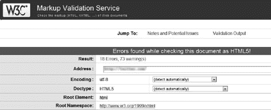

# 十二、把这一切放在一起

熟悉某些技术和标准并不足以标准化无效站点和从零开始开发有效站点。网站标准化总是一项复杂的工程，它同时考虑到各种各样的需求。该列表包括但不限于完全符合标准；最佳码长；互操作性；有意义的、结构化的和可访问的内容；充足的元数据；和适当的设置。通过本章提供的一系列分步指南，可以最有效地学习如何创建有效的代码。

熟悉 web 标准之后，是时候学习如何在文本编辑器中从头开始创建基本的符合标准的 web 站点组件，并为您的 web 页面扩展它们了。您将学习的大多数 XHTML 1.0 Strict 代码片段都可以用作 XHTML 项目和新 HTML 项目的 HTML5 标记的基础。您将看到如何使用缩进来创建清晰、易于维护的标记，并在开始标记之后立即提供结束标记，以避免遗漏标记。本指南还展示了从段落到列表、从表格到表格的结构元素的合理、合乎逻辑的使用。掌握列表、表格、对象和表单的基本结构后，您将能够扩展、修改和标准化相应的标记元素，即使标记相当长且复杂，也不会迷失在细节中。 1

### 选择相关标准

在网站标准化中，没有终极选择。浏览器支持和开发人员的关注点在不断变化。大多数开发人员至少对 W3C 推荐标准有所了解；然而，也有其他标准化组织发布的标准，如 ERCIM、IETF、WaSP 或 WSG(如第一章中所述)。即使开发人员完全掌握了标准，也不一定能恰当地应用它们。

标准的选择对网站标准化的每个过程和未来的可能性都有严重的影响。当考虑各种标记语言及其变体之间的相似性和差异时，应该在设计和开发阶段之前做出选择。

#### 标准之间的切换

这是一个常见的误解，即不惜一切代价立即应用最新技术是开发现代网站的关键。事实上，没有最终规范的最新技术不推荐使用。最新的标准(带有 W3C 状态“推荐”)应该被专有地应用，并且可能被改变的工作草案不应该被使用。例如,没有理由使用有效的 XHTML 标记将网站更新为 XHTML5(更不用说 HTML5 了),除非该规范中引入的新元素在网站上是必需的。主要原因是这些技术的采用和标准化程度不同。此外，应用这些技术的网站不能被验证(或者验证器提供这个特性只是作为一个实验工具)。此类网站的用户可能会面对无法工作的组件，被提示下载未知类型的文件，等等。功能性和可用性比不正确地使用最新的、未定稿的规范更重要(图 12-1 )。

____________

1 本章中的每个分步指南都侧重于某个元素或元素组以及相应的标记元素。当添加额外的内容和属性时，标记的复杂性会急剧增加，但基本结构总是保持不变。

***图 12-1。**现代标记应用不正确。有什么意义？*

另一方面，如果 web 开发人员想要保持竞争力，他们就不应该落后。此外，他们应该让他们的客户或老板相信高质量代码和开发时间的重要性，这通常与直接的商业利益相冲突。

### 逐步发展

使用有效的标记、样式、语义内容和可访问的代码创建符合标准的网站应该是开发网站的首选方式。您可以通过在开发过程中验证标记、样式表和其他组件(如 feed channel)来验证个别技术是否符合标准。然而，整个网站完全符合标准要比这复杂得多。正如本书中所讨论的，完全的标准符合性包括有效的字符编码(最好是有效的 UTF-8)、有效的 HTML 或有效的 XHTML 标记(越严格越好)、有效的 CSS、有效的 RSS 或有效的 Atom 新闻提要、有效的 RDF、有效的元数据、有效的 XML、有效的对象嵌入、有效的脚本嵌入、WCAG 2.0 和 Section 508 一致性、可访问性友好、语义 Web 技术的应用、独立于浏览器和分辨率的代码，以及正确的服务器设置，这只是提到的最重要的几个。

#### 从零开始

通常，从头开始创建网站时，应该执行下列核心任务:

*   确定文档类型。
*   创建`index.html`文件。必须提供所有必需的元素，以及强烈推荐用于结构化的元素。 2 一般来说，html 元素应该被用作所有 HTML 和 XHTML 文档的根元素。标记文档应该包含一个文档头(在`<head>`和`</head>`之间)和一个文档体(由`<body>`和`</body>`分隔)。除了 HTML 4.01 和 XHTML 中使用的通用容器`div`和段落`p`，或者更具体的 HTML5 结构化元素`header`、`article`和`section`，网页内容的内聚部分应该有标题。在(X)HTML 中，有六个级别的标题:`h1`、`h2`、`h3`、`h4`、`h5`、`h6`(从最大到最小)。不应跳过级别(例如，在没有`h3`而只有`h1`和`h2`的文档中应用`h4`)。
*   倍增文件。精心应用的复制和粘贴减少了手工编码人员的开发时间。它提供了整个站点的完整性；但是，如果修改了初始文件，则应该对所有文件进行修改。这种修改在动态站点上通常更容易，因为动态站点通常集中存储相同的部分。
*   使用基本布局、颜色和字体样式的初始设计创建主样式表文件(例如，`main.css`)。应该预先确定主要的设计概念。
*   提供可选元素。哪些可选元素是合理的取决于项目。在大多数情况下，建议使用各种`meta`元素。几个`link`元素也经常被应用，包括但不限于到外部文件的链接，例如 Atom 或 RSS 新闻提要(`atom.xml`、`rss.xml`)、网站图标(`favicon.ico`)或可选元数据(`metadata.rdf`、`foaf.rdf`、`doac.rdf`)。
*   添加有用的扩展。有用和免费的网站扩展和 API 的数量在不断增加。有些是谷歌分析跟踪代码(JavaScript)，互动谷歌地图的联系方式，或类似的社交网络和推特按钮。虽然它们很受欢迎，并被数百万人使用，但大多数都没有标准化。黄金法则是，您必须小心避免第三方软件开发人员提供的无效嵌入代码。

 **注意**这并不意味着你必须牺牲第三方内容，因为许多无效的嵌入代码可以用符合标准的方式重写。

*   根据客户需求完成其他任务。
*   在 web 服务器上设置主机。
*   除了最简单的静态网站，所有的网站都采用服务器端的脚本和应用，并具备必要的技术支持和配置。这些取决于用户需求。
*   上传并安装。
    *   静态文件可以直接上传到 web 服务器。
    *   服务器端应用通常有一些应该上传到服务器的安装文件。可以在服务器上执行这些文件来安装和配置应用。
*   通过域共享网站。

____________

开发工具通常会提供模板和框架文档来开始你的工作。甚至文本编辑器也有插入标记元素的选项，这可能比键入要快。

请注意，这些任务没有固定的顺序，尽管有些任务总是在其他任务之前。此外，这些步骤适用于静态网页。如果站点依赖于服务器端脚本，步骤取决于系统的类型。

遵循下一节中讨论的基本原则是从头开始开发符合标准的代码的良好起点。网站组件列表无论如何都是不完整的。但是，这些示例中的大多数可以应用于各种标记语言和样式表，并且经常应用于网站开发。

 **注意**步骤命令的顺序只是一个建议。

##### XHTML

XHTML 1.0 Strict 文档可以通过以下步骤开发。通过应用所需的文档类型，可以类似地创作其他 XHTML 文档。

1.  创建 XML 声明。`<?xml version="1.0" encoding="UTF-8"?>`
2.  添加文档类型声明。`<?xml version="1.0" encoding="UTF-8"?>
    **<!DOCTYPE html **
    ** PUBLIC "-//W3C//DTD XHTML 1.0 Strict//EN" **
     **"http://www.w3.org/TR/xhtml1/DTD/xhtml1-strict.dtd">**`
3.  添加具有默认命名空间和语言设置的根元素。`<?xml version="1.0" encoding="UTF-8"?>
    <!DOCTYPE html 
     PUBLIC "-//W3C//DTD XHTML 1.0 Strict//EN" 
     "http://www.w3.org/TR/xhtml1/DTD/xhtml1-strict.dtd">
    **<html xml:lang="en" lang="en">**

    **</html>**`
4.  还可以根据请求添加额外的名称空间。
5.  添加文档头和文档体。`<?xml version="1.0" encoding="UTF-8"?>
    <!DOCTYPE html   PUBLIC "-//W3C//DTD XHTML 1.0 Strict//EN"   "http://www.w3.org/TR/xhtml1/DTD/xhtml1-strict.dtd">
    <html xml:lang="en" lang="en">
    **<head>**

    **</head>**
    **<body>**

    **</body>**
    </html>`
6.  添加文档标题。`<?xml version="1.0" encoding="UTF-8"?>
    <!DOCTYPE html 
     PUBLIC "-//W3C//DTD XHTML 1.0 Strict//EN"   "http://www.w3.org/TR/xhtml1/DTD/xhtml1-strict.dtd">
    <html xml:lang="en" lang="en">
    <head>
    **<title>XHTML Document Sample</title>**
    </head>
    <body>

    </body>
    </html>`
7.  添加标题内容，包括元数据、基本 URI、链接和脚本。虽然它们是可选元素，但其中许多是经常使用的。其中最常见的是指向外部 CSS 文件的链接:
    *   用文件路径或 URI 创建一个基本链接。如果使用 XHTML 语法，则需要自结束。`<link href="styles/main.css" />`
    *   设置链接类型。`<link **type="text/css"** href="styles/main.css" />`
    *   确定链接角色。`<link **rel="stylesheet"** type="text/css" href="styles/main.css" />`
    *   设置媒体类型(可选)。`<link rel="stylesheet" type="text/css" **media="all"** href="styles/main.css" />`
8.  标题内容可以根据请求任意扩展，例如使用来自外部词汇表(如 DC)的元数据。具有高度定制内容的典型标题部分如下所示:`<?xml version="1.0" encoding="UTF-8"?>
    <!DOCTYPE html 
     PUBLIC "-//W3C//DTD XHTML 1.0 Strict//EN" 
     "http://www.w3.org/TR/xhtml1/DTD/xhtml1-strict.dtd">
    <html xml:lang="en" lang="en">
     <head>
        <title>XHTML Document Sample</title>
        <meta http-equiv="Content-Type" content="application/xhtml+xml; charset=utf-8" />
        <meta http-equiv="Content-Style-Type" content="text/css" />
        <meta name="robots" content="noindex, nofollow" />
        <meta name="content-language" content="en" />
        <meta name="author" content="Dr. Leslie Sikos" />
        <meta name="keywords" content="Dr. Leslie F. Sikos, networking" />
        <meta name="description" content="Contact data of IT pro Dr. Leslie Sikos.
          Website  standardization, semantic websites, accessability, professional 
          photography, videography, multimedia &amp; more." />
        <base href="http://www.lesliesikos.com/" />
        <link rel="alternate" type="application/rss+xml" title="Dr. Leslie Sikos IT 
          professional" href="http://www.lesliesikos.com/sikos.xml" />
        <link rel="author" href="http://www.lesliesikos.com/" />
        <link rel="shortcut icon" href="favicon.ico" />
        <link rel="stylesheet" type="text/css" media="all" href="styles/sikos.css" 
          title="Default style" />
        <link rel="stylesheet" type="text/css"  media="handheld" href="styles/mobile.css" 
          title="Styles for mobile devices" />
        <link rel="stylesheet" type="text/css"  media="print" href="styles/print.css" 
          title="Styles for printing" />
        
        
      </head>
      <body>

      </body>
    </html>`
9.  添加正文内容。`<?xml version="1.0" encoding="UTF-8"?>
    <!DOCTYPE html 
     PUBLIC "-//W3C//DTD XHTML 1.0 Strict//EN" 
     "http://www.w3.org/TR/xhtml1/DTD/xhtml1-strict.dtd">
    <html xml:lang="en" lang="en">
      <head>
        <title>XHTML Document Sample</title>
        <meta http-equiv="Content-Type" content="application/xhtml+xml; charset=utf-8" />
        <meta http-equiv="Content-Style-Type" content="text/css" />
        <meta name="robots" content="noindex, nofollow" />
        <meta name="content-language" content="en" />
        <meta name="author" content="Dr. Leslie Sikos" />
        <meta name="keywords" content="Dr. Leslie F. Sikos, networking" />`
    

##### (X)HTML5

(X)HTML5 文档可以通过以下步骤开发:

1.  创建文档类型声明。`<!DOCTYPE html>`
2.  添加根元素。`<!DOCTYPE html>
    **<html>**

    **</html>**`
3.  添加文档头和文档体。`<!DOCTYPE html>
    <html>
      **<head>**

      **</head>**
      **<body>**

      **</body>**
    </html>`
4.  添加标题。与上一节中讨论的示例类似，可以任意添加元数据、基本 URI、链接和脚本。`<!DOCTYPE html>
    <html>
      <head>
        **<title>Sample HTML5 document structure</title>**
      </head>
      <body>
      </body>
    </html>`
5.  添加字符编码声明。`<!DOCTYPE html>
    <html>
      <head>
        <title>Sample HTML5 document structure</title>
        **<meta charset="UTF-8" />**
      </head>
      <body>
      </body>
    </html>`
6.  创建带有页眉、节和页脚的结构。`<!DOCTYPE html>
    <html>
      <head>
        <title>Sample HTML5 document structure</title>
        <meta charset="UTF-8" />
      </head>
      <body>
        **<header>**
          **<h1>Document sample</h1>**
        **</header>**
        **<section>**

        **</section>**
        **<footer>**
          **Copyright © 2011 John Smith. All rights reserved.**
        **</footer>**
      </body>
    </html>`
7.  提供内容。`<!DOCTYPE html>
    <html>
      <head>
        <title>Sample HTML5 document</title>
        <meta charset="UTF-8" />
      </head>
      <body>`
    

#### 链接

超链接是网页的基本元素，可以按如下方式开发:

1.  提供基础锚。它可以是外部站点的 URI，如下所示:`<a href=**"http://www.example.com"**>`
    *   或者站点内的路径，如下所示:`<a href=**"gallery/"**>`
    *   超链接也可以指向带有*片段标识符*的文档片段(由`id`属性标识)。这里有一个例子:`<a href="gallery/canada.html**#calgary"**>`
2.  设定目标(如果需要)。外部链接通常会在新窗口中打开。这里有一个例子:`<a href="http://www.example.com" **target="_blank"**>`
3.  添加跳转索引以提高可访问性(可选)。`<a href="http://www.example.com" **tabindex="5"** target="_blank">`
4.  确保外部链接不会影响你网站的页面排名(可选)。`<a href="http://www.example.com" **rel="nofollow"** tabindex="5" target="_blank">`
    *   步骤 2 和 4 仅适用于外部链接。

#### 图像

图像嵌入了`img`元素。如果使用 XHTML 语法，则需要自结束。图像文件的位置由`src`(源)属性决定。

1.  嵌入基本图像。``
2.  提供在图像无法显示的情况下可以呈现的替代内容(可访问性的基础)。``
3.  提供当用户将鼠标移动到图像上时显示的文本(可选)。它可以与替代文本相同，也可以不同。``

#### 列表

有序列表(`ol`)和无序列表(`ul`)的列表项都由`<li>`和`</li>` ( 清单 12-1 )分隔。

***清单 12-1。**有序和无序列表中的列表项结构*

`             <ol>                 <ul>
                **<li></li>**            **<li></li>**
                **<li></li>**            **<li><li>**
                …                    …
                **<li></li>**            **<li></li>**
             </ol>                </ul>`

1.  无序列表可以创建如下:`<ul>

    </ul>`
2.  列表项可以任意添加。`<ul>
    **  <li>Apricot</li>**
    **  <li>Cherry</li>**
    **  <li>Peach</li>**
    </ul>`

定义列表定义了定义术语(`dt`)及其描述(`dd` ) ( 列表 12-2 )。

***清单 12-2。**定义列表示例*

`   <dl>
**     <dt>**
       <label>Web site development</label>
**     </dt>**
     **<dt>**RDF**</dt>**
       **<dd>**A W3C acronym for Resource Description Framework, an XML specification for 
         metadata models.**</dd>**
     **<dt>**RSS**</dt>**
     **<dd>**Really Simple Syndication. An XML format for frequently updated content, e.g., 
       news headlines, blog entries.**</dd>**
   </dl>`

##### 列出可访问性

可以通过添加 accesskey 和 tabindex 等元素来提高列表的可访问性。这里有一个例子:

`  <ul>
    <li>
      <a href="http://www.example.com/" title="Home" **accesskey="h" tabindex="1"**>Home</a>
    </li>                
    <li>
      <a href="about/" title="Introduction" **accesskey="a" tabindex="2"**>About</a>
    </li>
    <li>
      <a href="gallery/" title="Gallery" **accesskey="g" tabindex="4"**>Gallery</a>
    </li>
    <li>
      <a href="shop/" title="Webstore of oil paintings" **accesskey="s" tabindex="6"**>Shop</a>
    </li>
    <li>
      <a href="exhibition/" title="Exhibitions" **accesskey="e" tabindex="7"**>Exhibitions</a>
    </li>
    <li>
      <a href="contact/" title="Address and phone" **accesskey="c" tabindex="7"**>Contact</a>
    </li>
  </ul>`

##### 样式列表

您可以将无序列表用于比简单列表更复杂的目的。它们通常用于创建菜单。 3 典型的水平菜单会覆盖默认的显示样式，如清单 12-3 所示，以便将列表项呈现在彼此旁边而不是下方。

***清单 12-3。**内嵌显示的列表项目样式*

`li {
**  display: inline;**
}`

这种列表项的超链接经常使用的一种简单样式是底部边框。

***清单 12-4。**菜单超链接的底部边框*

`**a:hover {**
  color: #949295;
**  border-bottom: 1px solid #949295;**
}`

自然，这种风格很少在全球范围内应用。相反，它使用列表的标识符或其容器父元素(如`#main a:hover`或`#navtabs li a:hover`)进行扩展。

创建自定义导航效果的常用技术是向列表项添加背景图像。清单 12-5 显示了一个例子。

***清单 12-5。**带背景图片的自定义导航效果*

`li {
**  background: url('img/navbg.png') 5px no-repeat;**
  padding-left: 16px;
}`

如果某些链接，比如第一个、最后一个或当前选择的链接，具有不同于所有其他链接的样式，那么应该为它们提供唯一的标识符(清单 12-6 )。

***清单 12-6。**第一项和最后一项更具体的规则*

`<ul>
  <**li id="first">**
    <a href="http://www.example.com/" title="Home" accesskey="h" tabindex="1">Home</a>
  </li>                
…
  **<li id="last">**
    <a href="contact/" title="Address and phone" accesskey="c" tabindex="7">Contact</a>
  </li>
</ul>`

第一个规则集的样式如清单 12-7 所示。

__________

XHTML 2.0 还为导航列表提供了更具体的元素 nl。

***清单 12-7。**第一个列表项目的特定规则集*

`**li.first {**
  background: none;
  padding-left: 0;
}`

如果项目不仅仅是一个小的网页，这些样式不应该被全局应用，因为这些特定的样式将被应用到整个文档中的所有列表，其中大部分应该被覆盖(将有更多的样式规则被覆盖，而不是继承的规则来满足我们的需要)。相反，应该在列表中添加一个标识符，如清单 12-8 中的所示。

***清单 12-8。**用于导航的无序列表被识别为不同样式*

`**<ul id="navtabs">**
  <li id="first">
    <a href="http://www.example.com/" title="Home" accesskey="h" tabindex="1">Home</a>
  </li>
  …
  <li id="last">
    <a href="contact/" title="Address and phone" accesskey="c" tabindex="7">Contact</a>
  </li>
</ul>`

从现在开始，所有的风格都要以`#navtabs` ( 清单 12-9 )开头。

***清单 12-9。**为无序列表`navtabs`* 的第一个列表项设置样式的特定规则集

`**#navtabs li.first {**
  background: none;
  padding-left: 0;
}`

或者，可以在容器级别声明样式，并使用继承来设置列表的样式。 4 当文档中使用了多个样式相同或略有不同的列表时，这种方法很有用。这种差异很容易被更具体的样式规则覆盖。

可以为访问键和其他功能声明其他样式。例如，清单 12-10 中的标记可以用清单 12-11 中显示的 CSS 规则来样式化。

***清单 12-10。**一个用于样式化访问键的跨度*

`**Si**temap`

***清单 12-11。**访问键的 CSS 规则*

`span.ak {
  color: red;
  background-color: #ffffbb;
  border-bottom: solid navy 1px;
}`

___________

4 注意，在这种情况下，标记中的标识符应该从 id 改为 class，从散列符号(#)改为句点(。)在 CSS 中。

CSS 可以将默认项目符号更改为任意字符或图像。清单 12-12 展示了一个例子，它适用于无序列表，比如清单 12-13 中的列表。

***清单 12-12。**子弹图像*

`ul.tick {
**  list-style-image: url('img/tick.png')**
}`

***清单 12-13。**应用清单 12-12* 中呈现的自定义项目符号样式

`<h1>The major benefits of standard compliance</h1>
<**ul class="tick"**>
<li>Resolution independence</li>
<li>Browser independence</li>
<li>Interoperability</li>
<li>Robust functionality</li>
</ul>`

结果在视觉上比带有普通项目符号的列表更吸引人(也更具体)。

janu 

***图 12-2。**用 CSS 自定义项目符号*

#### 表格

我们假设一个 5x5 的 iPhone 机型对照表需要呈现在一个网页上(表 12-1 )。

1.  所有表格都应该有一个开始和结束标记。`<table>
    </table>`
2.  表格行应该由`<tr>`和`</tr>`分隔。第一行是这样开始的:`<table>
      **<tr>**
      **</tr>**
    </table>`
3.  表头单元格应写在`<th>`和`</th>`之间。由于所需的表格有五列，因此需要五个标题单元格元素:`<table>
      <tr>
        **<th></th><th></th><th></th><th></th><th></th>**
      </tr>
    </table>`
4.  应该为第一行数据单元开始新的一行。`<table>
      <tr>
        <th></th><th></th><th></th><th></th><th></th>
      </tr>
      <tr>
      </tr>
    </table>`
5.  数据单元格应该由`td`标签提供。由于所需的表格有五列，每行需要五个数据单元元素。`<table>
      <tr>
        <th></th><th></th><th></th><th></th><th></th>
      </tr>
      <tr>
        **<td></td><td></td><td></td><td></td><td></td>**
      </tr>
    </table>`
6.  由于行的结构相同，包含五个数据单元格的表格行可以通过简单的复制和粘贴操作复制三次:`<table>
      <tr>
        <th></th><th></th><th></th><th></th><th></th>
      </tr>`
    `  **<tr>**
        **<td></td><td></td><td></td><td></td><td></td>**
      **</tr>**
      <tr>
        <td></td><td></td><td></td><td></td><td></td>
      </tr>
      <tr>
        <td></td><td></td><td></td><td></td><td></td>
      </tr>
      <tr>
        <td></td><td></td><td></td><td></td><td></td>
      </tr>
    </table>`
7.  最后，单元格应该填入数据:`<table>
      <tr>
        <th>Model</th><th>iPhone</th><th>iPhone 3G</th><th>iPhone 3GS</th><th>iPhone 4</th>
      </tr>
      <tr>
        <td>Preinstalled OS</td><td>iPhone OS 1.0</td><td>iPhone OS 2.0</td><td>iPhone 
         OS 3.0</td><td>iOS 4.0</td>
      </tr>
      <tr>
        <td>Display resolution</td><td>480 x 320</td><td>480 x 320</td><td>480 x 320</td> 
         <td>960 x 640</td>
      </tr>
      <tr>
        <td>CPU clockrate</td><td>620 MHz</td><td>620 MHz</td><td>833 MHz</td><td>1 GHz</td>
      </tr>
      <tr>
        <td>Camera</td><td>2 MP</td><td>2 MP</td><td>3 MP</td><td>5 MP (rear), 
         0.3 MP (front)</td>
      </tr>
    </table>`

##### 表格可访问性

您可以进一步改进标记以增加可访问性。对于非可视浏览器来说，处理和理解表格具有挑战性。您可以使用表格标题(th)和标题(caption)标记元素以及 summary 属性来提高表格的可访问性。前两个对于可视化浏览器也很有用，而第三个对于屏幕阅读器很有价值。

表头元素`th`不仅增加了第一行的含义，而且当读取表的每一行时，屏幕阅读器都会重复这个元素。它有助于视障人士理解表格单元格之间的相关性。

虽然由`caption`元素提供的数据通常对于小的、易于理解的表格来说已经足够了，但是更复杂的表格可能会提供一个`summary`属性(清单 12-14 )。然而，`summary` 属性在 HTML5 中被认为是过时的，可以用`details`元素来代替。 5 因此，建议您在表格旁边或包含表格的`figure`元素内的`caption`元素或`figcaption`元素中描述表格结构。或者，也可以在表格周围的常规段落中描述表格。这些方法也可以结合使用。

***清单 12-14。**表格标题*

`<table>
  **<caption>**
    **A comparison table of iPhone models.**
  **</caption>**
  <tr>
    <th>Model</th><th>iPhone</th><th>iPhone 3G</th><th>iPhone 3GS</th><th>iPhone 4</th>
  </tr>
  <tr>
    <td>Preinstalled OS</td><td>iPhone OS 1.0</td><td>iPhone OS 2.0</td><td>iPhone OS 
      3.0</td><td>iOS 4.0</td>
  </tr>
  <tr>
    <td>Display resolution</td><td>480 × 320</td><td>480 × 320</td><td>480 × 320</td> 
     <td>960 × 640</td>
  </tr>
  <tr>
    <td>CPU clockrate</td><td>620 MHz</td><td>620 MHz</td><td>833 MHz </td><td>1 GHz</td>
  </tr>
  <tr>
    <td>Camera</td><td>2 MP</td><td>2 MP</td><td>3 MP</td><td>5 MP (rear), 0.3 MP (front)</td>
  </tr>
</table>`

如果需要，还可以向表格单元格添加访问键。

##### 表格样式

虽然大多数浏览器通常以粗体显示表格标题，但是表格单元格、填充和边框的默认样式在每个呈现引擎中都是不同的，这在许多情况下是不够的。但是，所有的表格功能都可以通过 CSS 规则集任意设置样式。例如，`border-collapse`属性的默认值`separate`可以被覆盖，以便尽可能将边框折叠成一个单独的边框(清单 12-15 )。

***清单 12-15。**设置边框折叠*

`table {
  **border-collapse: collapse;**
}`

___________

5 截至 2011 年，`details`元素还没有被浏览器正确支持；因此，建议等待实现

在这种情况下，`border-spacing`和`empty-cells`属性将被忽略。标题和数据单元格的填充和边框可以如清单 12-16 中的所示进行设置。

***清单 12-16。**表头和数据单元格的填充和边框*

`th, td {
  **padding: 10px;**
  **border: 1px solid #13b141;**
}`

#### 下拉选择列表

选择列表可以提供选项供选择。假设多语言网站需要一个语言选择器。它可以开发如下:

1.  用`select`元素创建一个选择列表。`**<select>**

    **</select>**`
2.  添加默认选项。`<select>
      **<option value="http://www.example.com" selected="selected">English</option>**

    </select>`
3.  添加更多选项。提供每个语言版本的 URIs 作为选项值。`<select>
      <option value="http://www.example.com" selected="selected">English</option>

      **<option value="http://de.example.com">Deutsch</option>**
      **<option value="http://fr.example.com">Français</option>**
      **<option value="http://es.example.com">Español</option>**
      **<option value="http://ja.example.com"></option>**
    </select>`
4.  要加载适当的网页，可以通过事件处理程序将作为选项值提供的子域用作目标 URIs。尽管使用`onchange`事件处理程序是合乎逻辑的，但键盘用户无法访问它。其中一个解决方案是提供一个带有`onclick`事件处理程序的按钮，它是独立于设备的。例如，下面这个功能``
5.  文档头或链接的外部文件中声明的可以由`input`元素上的`onclick`事件处理程序使用，如下:`<form>
      <select id="langsel">
        <option value="http://www.example.com" selected="selected">English</option>
        <option value="http://de.example.com">Deutsch</option>
        <option value="http://fr.example.com">Français</option>
        <option value="http://es.example.com">Español</option>
        <option value="http://ja.example.com"></option>
      </select>
      <input type="button" value="Go!" onclick="goto_URL(this.form.langsel);" />
    </form>`
6.  请注意，也可以应用其他方法，例如服务器端重定向，这消除了对 JavaScript 的需求。

#### 表格

可以通过以下步骤创建基本表单:

1.  创建一个空表单。`**<form>**

    **</form>**`
2.  指定用于处理表单数据的服务器端脚本的位置。`<form **action="register.php"**>

    </form>`
3.  指定用于发送数据的方法。表单数据可以作为 URL 变量(`method="get"`)或 HTTP post ( `method="post"`)发送。
    *   get 方法将表单数据作为名称-值对附加到 URL 上，这使得对表单提交的结果添加书签成为可能。但是，由于 URL 的长度限制，不能保证所有的表单数据都会被传输。此外，get 方法不足以转换密码等敏感信息，因为这些数据在浏览器的地址栏中是可见的。
    *   post 方法将表单数据作为 HTTP post 事务发送。此方法没有大小限制，并且比 get 方法更安全。`<form **method="post"** action="register.php">

        </form>`
4.  为表单元素创建逻辑组。`<form method="post" action="register.php">`
    
5.  添加所需的表单控件，如文本字段(`text`)和复选框(`checkbox`)及其属性。`<form method="post" action="register.php">
      <fieldset>
        **<input type="text" name="firstname" id="firstname" size="15" maxlength="255" />**
    **     <input type="text" name="lastname" id="lastname" size="20" maxlength="255" />**
      </fieldset>
      <fieldset>
        **<input type="checkbox" name="interests" value="1" id="photo" />**
        **<input type="checkbox" name="interests" value="2" id="video" />**
        **<input type="checkbox" name="interests" value="3" id="web" />**
      </fieldset>
    </form>`
6.  提高可访问性。元素给一个表单控件添加一个标签。元素给一个`fieldset`分配一个标题。跳转顺序可以通过`tabindex`属性设置。`<form method="post" action="register.php">
      <fieldset>
        **<legend>Personal data</legend>**
        **<label for="firstname">First name</label> **
        <input type="text" name="firstname" id="firstname" size="15" maxlength="30" 
         **tabindex="12"** /> 
        <**label for="lastname">Last name</label> **
        <input type="text" name="lastname" id="lastname" size="20" maxlength="50" 
          **tabindex="13"** />
      </fieldset>
      <fieldset>
        **<legend>Main interests</legend>**
        <input name="interests" type="checkbox" value="1" id="photo" **tabindex="14"** />
        **<label for="photo">Photography</label>** 
        <input name="interests" type="checkbox" value="2" id="video" **tabindex="15"** />
        **<label for="video">Videography</label>** 
        <input name="interests" type="checkbox" value="3" id="web" **tabindex="16"** />
        **<label for="web">Web</label>**
      </fieldset>
    </form>`

#### 闪现内容

您可以在 XHTML 中嵌入带有通用`object`标签的 Flash 文件，如下所示:

1.  声明一个应用/x-shockwave-flash 对象。`<object type="application/x-shockwave-flash">

    </object>`
2.  添加带有跨浏览器代码的源代码。`<object type="application/x-shockwave-flash" **data="flash/header.swf">**
      **<param name="movie" value="flash/header.swf" />**

    </object>`
3.  提供属性，如尺寸和标识符(如果需要)。`<object type="application/x-shockwave-flash" data="flash/header.swf" **width="610" **
    ** height="224" id="flash"**>
      <param name="movie" value="flash/header.swf" />

    </object>`
4.  如果 Flash 内容具有透明背景，则应该将其声明为可选参数。这也是提供在网页内设置层顺序的可能性所需要的。`<object type="application/x-shockwave-flash" data="flash/header.swf" width="610" 
    height="224" id="flash">
      <param name="movie" value="flash/header.swf" />
      **<param name="wmode" value="transparent" />**

    </object>`
5.  Add alternate content such as a placeholder image and text descriptions to improve accessibility. If a short description is not adequate, a good practice is to add a hyperlink to a resource that describes the object. `<object type="application/x-shockwave-flash" data="flash/header.swf" width="610" 
     height="224" id="flash">
      <param name="movie" value="flash/header.swf" />
      <param name="wmode" value="transparent" />
      ****
    </object>`

    在(X)HTML5 中，应该用`embed`标签代替`object`。

6.  Create an `embed` element. Since the parameters can be provided as attributes of `embed`, the self-closing tag can be applied in XHTML5 as follows: `<embed />`

    显然，在 HTML5 中应该省略简写符号。

7.  添加文件的路径或 URI。这可以通过使用`src`属性而不是应用于`object`元素的`data`来完成。`<embed **src="flash/header.swf"** />`
8.  添加尺寸和可选参数。`<embed src="flash/header.swf" **width="550" height="400" wmode="transparent"** />`

#### RSS 新闻源

创建 RSS 新闻源通常包括以下步骤:

1.  Create the XML declaration. Since RSS 2.0 news feeds should be valid XML documents, the first line is the XML declaration: `<?xml version="1.0" encoding="utf-8"?>`

    字符编码是可选的，但建议使用。

2.  Create the RSS channel. The contents of the RSS channel should be written within the `rss` and `channel` tags as follows: `<rss version="2.0">
    **<channel>**

    **</channel>**
    </rss>`

    如果需要额外的名称空间，应该将它们添加到`rss`元素中。通过提供转义 HTML 标记、带有 Dublin Core 元数据的创建者、由联合命名空间定义的更新周期和频率以及来自 Atom 词汇表的自链接，可以实现最广泛的互操作性。应添加以下名称空间声明:

    `<rss version="2.0" 
     **xmlns:content="http://purl.org/rss/1.0/modules/content/" **
     **xmlns:dc="http://purl.org/dc/elements/1.1/" **
     **xmlns:sy="http://purl.org/rss/1.0/modules/syndication/" **
     **xmlns:atom="http://www.w3.org/2005/Atom"**
    >`
3.  提供 feed 信息，包括必需的`title`、`link`、`description`元素，以及可选元素`lastBuildDate`、`language`。`**<title>**John Smith photography**</title>**
    **<link>**http:// example.com/**</link>**
    **<description>**The news feed of Alaskan photographer John Smith.**</description>**
    **<lastBuildDate>**Fri, 10 Feb 2012 14:47:00 GMT 0900**</lastBuildDate>**
    **<language>**en-US**</language>**`
4.  Provide news items. To create a valid RSS 2.0 feed channel with the highest level of interoperability, each item should have the following elements: `title`, `link`, `description`, `pubDate`, and `guid`. `<item>`
    `  **<title>**Photo exhibition**</title>**
      **<link>**http://example.com/events/**</link>**
      **<pubDate>**Fri, 10 Feb 2012 14:47:00 GMT 0900**</pubDate>**
      <dc:creator>John Smith</dc:creator>
      <category>Events</category>
      **<guid>**http://example.com/events/**</guid>**
      **<description>**Best shots of 2011**</description>**
      <content:encoded><
          Moose Hotel in Anchorage, AK, USA on 17–18 February 2012\. ]]></content:encoded>
    </item>`

    这是可以复制和粘贴的部分，然后在每次订阅源频道更新最新新闻时进行修改。下一个消息应该在最近的一个之前提供，也就是在源代码中更早一些。

5.  验证。
6.  分享。新闻提要通常通过链接到包含它们的 XML 文件来使用 ** 。要使用现代浏览器的内置 RSS 阅读器，应该在(X)HTML 文档的 head 部分提供一个链接。这里有一个例子:`<link rel="alternate" type="application/rss+xml" title="John Smith photography" 
     href="http://www.example.com/rss.xml" />`

这使得浏览器能够识别出当前网页有 RSS 新闻提要。

### 通过重新设计使网站有效

标记越严格，就越容易升级到新版本。然而，在某些情况下，如果不完全重写站点，迁移到另一个标准是不可行的。关于样式表，在大多数情况下，有效的 CSS 2.1 可以很容易地用 CSS3 特性进行扩展。尽管如此，标准化一个现有的网站可能是一项艰巨的任务。

一般有两种可能:从头重写整个网站或者手动逐个规范每个页面。两者似乎都需要比开发人员所能负担的更多的工作。第一种方法通常会导致链接断开。第二种方法需要大量的时间和工作(除非站点非常小),并且只能在少数情况下执行。

万维网联盟提出了一个解决方案:精心挑选的部分应该系统地更新。最常提供的(最流行的)文档可以被日志验证器识别，它还试图在最流行的文档中找到 *n* 个无效文档(如前一章所述)。当然，整个项目受到截止日期和可承受工作量的影响。

### 总结

在这一章中，你看到了一系列一步一步的指南，指导你如何一个字符一个字符地手工创建基本的网站组件。通过学习结构元素的语义用法，您现在能够在后台创建具有逻辑流和完美 DOM 的有意义的标记。XHTML 1.0 Strict 的核心元素可以在大多数项目中使用，自然有或没有自结束标记(取决于您选择的标记语言)。这种精心创建的标记代码提供了高级别的互操作性，几乎可以在任何设备上运行的任何浏览器中呈现，而无需多个站点版本。即使 CSS 样式被禁用，标题、段落、列表和其他站点组件仍然清晰可辨，并且内容不仅可以被最新的浏览器访问，也可以被非常旧的版本和具有有限功能和标准支持的移动浏览器访问。

___________

6 另一个选项是使用脚本检索所需数量的频道项目。如果您希望将最新的新闻作为网页的一部分而不是单独的文件发布，那么您需要一个脚本来打开文件、检索新闻提要条目的内容并生成相应的标记代码。

在下一章中，你将学习广泛使用的符合标准的最佳实践，这些实践可以应用到你的日常工作中。

### 参考文献

1.  使你的网站有效:一步一步的指南。万维网联盟。`[www.w3.org/QA/2002/09/Step-by-step](http://www.w3.org/QA/2002/09/Step-by-step)`。2011 年 1 月 9 日访问