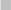
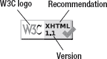

# 十四、验证

网络上使用的各种计算机语言，包括但不限于(X)HTML、CSS、RDF 和 RSS，提供了结构、样式、元数据、语义和其他文档特征。与自然语言相似，它们有自己的语法、词汇和句法需要遵循。然而，就像用自然语言编写的文档中出现的语法、结构或拼写错误一样，web 文档中也可能存在错误。验证是根据 DTD 或模式检查 web 文档源代码的任务。它有助于无错误、干净的代码，并提高整体网页质量。

即使是一个字符也可能影响您精心创建的符合标准的代码，因此定期检查您的文档非常重要。完成必要的例程后，您就能够在源代码级别修改或扩展 web 文档，而不会破坏标准遵从性。在这一章中，你将学习到一些工具，这些工具可以帮助你定位和纠正错误，并保证你的代码没有错误。

### 概念

标记语言语法规则是由文档类型定义(dtd)定义的。在 HTML5/XHTML5 之前，开发人员应该已经提供了与正在使用的文档类型相关联的 DTD 的引用(如第三章中所讨论的)。

Web 文档可以根据这些规则进行验证，这被称为*验证*。用于执行验证的工具被称为*验证器*。成功通过验证的文件被宣称为*有效*；换句话说，它们没有错误，并且不包含不正确使用的元素或属性。然而，验证既不保证结构良好，也不保证元素的正确使用。有效的文档遵循相应 DTD 中概述的语法规则，这使得用户代理能够正确地构造 DOM 并准确地呈现文档。

应用 dtd 中定义的语法规则在*技术规范*中有描述，其中大部分由 W3C 发布。

标准一致性是那些满足所有由适当的 DTD 和规范描述的要求的 web 文档的特征。当一个 web 文档按照包含在相应标记语言的技术规范中的*形式语法*正确编写时，它是有效的，然而一致性涉及整个规范。由于一些一致性需求，比如属性值的正确使用，不能用形式语法来描述，有效性只是一致性的一部分。因此，有效性和一致性可能是相同的，但后者是一个更广泛的术语。

有效的文档是根据所用语言的正式语法编写的。符合标准的文档以推荐的方式应用该技术。

验证不应被视为发布前的最后一步。相反，它应该作为开发的一个重要部分来执行。如果大量使用新的标记元素或属性，而开发人员无法提供 100%的确定性，验证可以帮助识别潜在的错误，并防止无效标记被复制或增加。即使是最有经验的网络标准制定者也可能会发现验证是有用的，并认为它是一种辅助而不是强制性的任务。例如，在向源中插入新的结构元素后，识别大量的——通常是相同的——结束标记(例如四到五个或更多连续的`
`标记)会非常不方便。虽然在包含 100-200 行的文件中找到开始标记-结束标记对非常容易，但对于较大的文件来说，这项任务可能会非常艰巨。 1

无论开发人员多么有经验，或者使用多么复杂的开发工具，错误都是不可避免的。这就是验证器可以帮助开发人员工作的地方。正如您将看到的，验证器提供了错误位置，以及可能原因和潜在解决方案的提示。

由于验证有助于整体网页质量，验证器和高级特定检查器也被称为 *web 质量保证*工具 [2 。

### 标记验证

HTML/XHTML 文档的主要验证器是位于`[`validator.w3.org`](http://validator.w3.org)`的 W3C 标记验证服务。事实上，标记验证服务 1.1 版可用于验证多种类型的标记 [3 ]，包括以下几种:

*   *HTML*:ISO/IEC 15445:2000(“ISO HTML”)，HTML 2.0，HTML 3.2，HTML 4.01 框架集，HTML 4.01 过渡，HTML5
*   *MathML* : MathML 2.0
*   *微笑*微笑 1.0，微笑 2.0
*   *SVG*SVG:1。0，SVG 1。1，SVG 1。1 基本，SVG 1。1 Tiny
*   *XHTML* : XHTML Basic 1.0，XHTML Basic 1.1，XHTML 1.0 Frameset，XHTML 1.0 Strict，XHTML 1.0 Transitional，以及 XHTML 1.1，XHTML Mobile Profile 1.2，和 XHTML Print 1.0
*   *混合命名空间文档*:XHTML+RDFa2T5、XHTML 1.1 + MathML 2.0、XHTML 1.1 + MathML 2.0 + SVG 1.1

W3C 标记验证服务提供了三个选项来验证 web 文档:

*   *直接输入验证*:验证文本框中提供的标记。代码可以直接输入，也可以从高级文本编辑器中复制粘贴。这个适合测试。因为没有要验证的物理文件，所以无论是字符编码还是服务器设置都不能通过直接输入来检查。
*   *上传文件验证*:验证上传到临时文件夹的文件。也可以检查字符编码。有经验的 web 标准化人员不经常使用此选项，因为文件可以通过同样的努力(在静态文件的情况下)上传到主机(最终目的地)。
*   URI 的确认:在网络服务器上确认上传的版本。这是验证标记、字符编码和服务器设置的最终验证。它是最终检查和验证他人开发的网页的理想工具。

____________

1 即使有工具在开始和结束标签对之间用垂直虚线表示层次结构(例如 Notepad++)。

RDFa 符号可以在 XHTML 文档中得到完美的验证。然而，截至 2011 年，验证器仍然不能识别 HTML5 中的 RDFa，并给出错误。

W3C 验证程序支持以下字符编码:UTF-8、UTF-16、ISO-8859-1、ISO-8859-2、ISO-8859-3、ISO-8859-4、ISO-8859-5、ISO-8859-6-i、ISO-8859-7、ISO-8859-8、ISO-8859-8-i、ISO-8859-9 和 ISO-8859-10

自动检测文档类型和字符编码，并相应地用于验证。如果检测是不可能的，验证器假定文档类型和/或字符编码；然而，结果可能不可靠。适当服务的符合标准的 web 文档总是提供这两种数据；因此，验证器准确地执行验证。也可以手动强制验证器使用特定的文档类型和/或字符编码；但是，在一般情况下不应使用该功能。它应该被认为是一个后备机制，而不是一个重要的功能。

如果标记中有错误，则用红色条纹和错误数量清楚地表示出来(图 14-1 )。甚至网页的图标也变成了红色方块。

***图 14-1。**红色条纹以及错误和警告的数量清楚地表明标记是无效的。*

默认情况下，连续错误/潜在错误按顺序列在摘要下，换句话说，按发生的顺序(在标记中的位置)排列。可以重写此行为，以便按错误类型对错误消息进行分组。然而，由于许多错误会导致更多的错误(例如丢失结束标记)，因此在大多数情况下顺序检查就足够了。

 **提示**由于标记错误之间相关性的可能性很高，因此只纠正一些错误(尤其是在文档充满错误的情况下)然后重新验证文档可能更方便。错误的数量可能会呈指数下降。作为直接输入，重新验证对于测试特殊或新标记规范的实现也很有用。

您可以在标准化项目中使用标记验证服务的一些高级设置。可以显示(X)HTML 源代码，错误消息直接链接到相应的行。这对开发人员来说是一个有用的特性。文档标题的树形结构可以通过 outline 选项来可视化，这使得更容易意识到哪个标题被遗漏了(如果有的话)。通过勾选“验证错误页面”复选框，可以验证服务器发送的自定义 404 错误页面除了默认情况下提供的简明报告之外，还可以使用详细输出选项请求更多的解释和更长的建议。W3C 标记验证服务的另一个选项是使用在第十一章中讨论的 HTML Tidy 工具来纠正标记错误。

除了错误位置之外，标记验证服务给出了更正的提示和相应规范和常见问题的链接(图 14-2 )。一些字符可能会被突出显示，这是另一种帮助，有时会使无效字符的检测变得非常容易。

***图 14-2。**W3C 标记验证服务清楚地指出错误位置，并提供有用的更正提示。*

标记验证结果和建议不仅对缺乏经验的开发人员有用，对专家也有用。使用行号，很容易找到错误，这是纠正错误的先决条件，即使对于那些不依赖于纠正提示的人来说也是如此。

在必要的修正和最终的重新验证之后，结果应该看起来像图 14-3 中的。

***图 14-3。**绿色条纹和结果“通过”表示标记有效。*

 **注意**截至 2011 年，验证 HTML5 仍然只是 W3C 标记验证服务的一个实验性功能。因此，验证器会给出一个警告(不是错误！)即使被分析的网页是有效的。验证器不能识别 HTML5 和 XHTML5 文档中的 RDFa 注释。 3 此外，与有效的 XHTML 文档相比，validator 不为有效的 HTML5 文档提供带有超链接的验证徽章。如稍后将讨论的，这种徽章可以从单独的站点下载。

W3C 标记验证器不仅是免费的，而且是开源的，可以在 W3C 软件许可 [4 ]下获得。任何人都可以建立服务的镜像或对其开发做出贡献。

____________

XHTML5 中提供的 XML 声明和所有名称空间声明都会导致错误消息，即使它们是有效的。而且，XHTML5 文档的验证结果陈述的是 HTML5 而不是 XHTML5。

虽然网上还有其他的标记验证器，比如 WDG HTML 验证器 [5 ]，或者离线工具，比如火狐插件 *HTML 验证器*  [6 ]，但是还是推荐使用 W3C 标记验证服务。它是 W3C Unicorn 的一部分，如果还应该检查样式表和提要通道，就可以使用它(参见后面的“W3C Unicorn”一节)。

对于动态网站的开发人员来说，验证标记更加复杂，因为标记验证器通常不能处理 PHP 之类的脚本。检查动态生成的(X)HTML 输出、执行更正和重新验证文档都是真正的挑战。这是动态生成的网页经常无效的主要原因之一。

### 验证 XML

可以验证 XML 文档是否符合 DTD、XML 模式或模式语言 RELAX NG。语法格式良好是一个基本要求，但它不能保证 XML 的有效性，这有几个约束，如正确使用必需和可选的元素和属性，正确的文档结构和语法，以及正确应用的数据类型。

尽管 XML 验证和解析在逻辑上是独立的任务，但两者通常都是由 XML 解析器执行的。考虑到即使一个错误也可能阻止文档被解析或显示其树结构，web 浏览器的 XML 解析器总是可以用作基本的 XML 验证器。

不是所有的 XML 解析器都需要 XML 有效性，但是根据相关模式检查文档的 XML 解析器需要 XML 有效性。

可以通过 Apache Ant  [7 ]的`xmlvalidate`任务对 XML 文件进行批量验证。例如，清单 14-1 中的目标验证由`dir`属性指定的目录中的`.xml`文件。 4

***清单 14-1。**用`xmlvalidate`* 验证 XML

`<target name="validate-xml">
  <xmlvalidate lenient="no">
    <fileset dir="semweb/ont" includes="*.xml" />
    <attribute name="http://xml.org/sax/features/validation" value="true"/>
    <attribute name="http://apache.org/xml/features/validation/schema"  value="true"/>
    <attribute name="http://xml.org/sax/features/namespaces" value="true"/>
  </xmlvalidate>
</target>`

#### 验证 RDF/XML

以 XML 序列化格式(RDF/XML)编写的 RDF 文档可以通过 W3C RDF 验证服务在`[www.w3.org/RDF/Validator](http://www.w3.org/RDF/Validator)`  [8 进行检查。可以通过 URI 或直接输入来执行验证。验证器不仅检查 RDF 代码，还表示 RDF 三元组(图 14-4 )。

____________

4 相对于 Ant 构建文件

***图 14-4。**从一个有效的 RDF 文件中检索到的主谓宾三元组*

可选地，RDF 图可以以各种格式生成，包括嵌入或链接的 PNG、SVG、GIF、PostScript、IsaViz/ZVTM、HPGL 和 HPGL/2。尽管弧线看起来像手绘的曲线，并且经常相互重叠——这并不是视觉上最吸引人的表现方式——但图像输出对于演示或设计是有用的。同样重要的是要记住，在 Web 上很少有类似的服务可以从 RDF 生成图形图像。

***图 14-5。**W3C RDF 验证服务生成的 RDF 图的细节*

 **注意**与光栅(PNG)输出相反，SVG 输出不仅具有无与伦比的质量，而且还包含作为超链接的 URIs。

可选地，三元组可以以 N-三元组格式显示。节点、弧线和文本的颜色，以及字体大小和方向都可以设置为高级选项。

#### 验证新闻源

因为 RSS 和 Atom 新闻提要应该是有效的 XML 文档，所以必须注意提供没有错误的元素和格式良好的 XML 结构。

万维网联盟在`[`validator.w3.org/feed/`](http://validator.w3.org/feed/)`  [9 为 Atom 和 RSS 运行 *W3C 提要验证服务。与其他 W3C 验证器类似，它不仅提供 URI 验证，还提供直接输入验证。成功验证后，该服务会提供一个“有效 RSS”或“有效 Atom”徽标(取决于经过验证的提要)、一个嵌入代码和一个文本链接。*

用于 Atom 和 RSS 的*提要验证器和位于`[`feedvalidator.org`](http://feedvalidator.org)`的 KML* 也可以用于验证 RSS 2.0 和 Atom 1.0 提要 [10 ]。此外，它还验证了`blogChannel`、`dc`、`itunes`、`mod_admin`、`mod_syndication`和`mod_content`、、、、名称空间的元素。

### 验证 CSS

样式表验证应该根据使用的 CSS 级别来执行。虽然有效的 CSS1 样式表也是有效的 CSS 2.1 样式表，但在 CSS 2.1  [11 ]中，一些 CSS1 规则集应该用稍微不同的语义编写。由于在 CSS2.1 中省略了某些 CSS 2 特性，所以并非所有的 CSS 2 样式在 CSS 2.1 中都有效 [12 ]。同样，CSS3 中引入的新属性在早期的 CSS 版本中是无效的。有效的 CSS 样式表必须符合相应版本的语法规则，并且必须只包含该规范中定义的 at 规则、属性和属性值。

尽管标记语言版本和变体的选择范围相对较广，但是由于文档类型声明的原因，在大多数情况下可以自动选择用于标记验证的文档类型。然而，CSS 中没有类似的机制，确定要验证的样式表的版本也不是那么简单。首先，CSS 中没有版本声明，其次，词汇表之间有很大的重叠，使得自动版本检测成为不可能。因此，默认情况下，`[`jigsaw.w3.org/css-validator/`](http://jigsaw.w3.org/css-validator/)`  [13 的 W3C CSS 验证服务根据 CSS 2.1 验证样式表。但是，要应用的配置文件可以作为高级选项手动覆盖。例如，如果你想验证 URI 的 CSS3 文件，你应该构造一个类似于清单 14-2 中所示的 URI 6 。

***清单 14-2。**手动覆盖 CSS3 验证*

`http://jigsaw.w3.org/css-validator/validator?uri=www.example.com/styles/main.css 
** &profile=css3**&usermedium=all&warning=0&lang=en`

____________

5 内容:仅编码

6 当然，您可以从“更多选项”下的下拉列表中选择配置文件“SS level 3”但是，如果您想为 CSS3 按钮提供验证链接，您需要手动构造一个 URI，因为默认代码假定是 CSS 2.1。

与标记验证服务类似，CSS 验证器可以通过 URI、文件上传或直接输入来执行验证。CSS 验证器主要用于验证外部 CSS 文件，但也可以检查内部样式。然而，在后一种情况下，应该首先使用标记验证服务对(X)HTML 文档进行验证。

CSS 验证服务支持 CSS1、CSS2、CSS 2.1 和 CSS3 样式表，以及其他文档配置文件。可以手动选择媒体类型，包括`all`、`aural`、`Braille`、`embossed`、`handheld`、`print`、`projection`、`screen`、`TTY`、`TV`或`presentation`。默认介质类型为`all`。除了错误，验证器可能还会识别警告。由于它们可能是误报或错误的结果，警告可以被隐藏。

验证请求结合基本 URI `[`jigsaw.w3.org/css-validator/validator`](http://jigsaw.w3.org/css-validator/validator)`应用参数。支持的参数如下:

*   `uri`:待验证单据的 URI。它可以是 CSS 或(X)HTML。
*   `text`:要验证的 CSS 文档。
*   `usermedium`:用于验证的媒体类型。
*   `output` : `html` (HTML)、`xhtml` (XHTML，默认)、`soap12` (SOAP 1.2)、`text`(纯文本)。
*   `profile` : `css1`、`css2`、`css21`、`css3`、`svg`、`svgbasic`、`svgtiny`、`mobile`、`atsc tv`、`tv`或`none`。
*   `lang`:报表语言，如`en`(默认)`fr``it``ko``ja``es``zh-cn``nl``de``it`或`pl`。
*   `warning`:可能值为`no`(隐藏警告)、`0`(较少警告)、`1`或`2`(较多警告)的警告级别。`2`是默认值。

W3C CSS 验证服务的输出类似于 W3C 标记验证器的结果页面。绿色条纹表示有效文件，而红色条纹表示 CSS 文件无效。

### 验证 I18N

万维网联盟的国际化活动组运行 W3C 国际化检查器 [14 。I18N 检查器可用于根据以下因素检查网页的*国际化友好性*:

*   *字符编码* : HTTP `Content-Type`，字节序标记，XML 声明，`Content-Type`元数据，HTML5 `meta charset`
*   *语言设置*:`html`元素上的`lang`和`xml:lang`属性，HTTP `Content-Language`，以及`content-language`元数据
*   *文本方向* : `ltr`(默认)或`rtl`
*   *`class`和`id`名称*:非 ASCII 以及非 NFC 类和标识符
*   *请求头* : `Accept-Language`，`Accept-Charset`

### 验证超链接

最令人失望的浏览器体验之一就是断开的超链接(死链接)。位于`[`validator.w3.org/checklink`](http://validator.w3.org/checklink)`的 W3C 链接检查器是一个有用的工具，用于检查 web 文档的内部和外部超链接 [15 ]。链接的文档也可以在最多 150 个文档中递归检查。包含散列标记(如`index.html#about`)的 URI 片段包含在测试中。不检查`robots.txt`文件中声明的*机器人排除规则*禁止的链接(图 14-6 )。

***图 14-6。**链接检查器结果*

超链接验证不仅对于检查入口点非常有用，而且对于重要文件(如样式表文件、脚本或外部 URIs)也非常有用，这些文件可能会被管理员在不通知的情况下随时修改。例如，永久重定向(HTTP 响应状态代码 301)也由链接检查器识别，尽管它们有效，但是这样的链接应该被更新。该结果可用于消除断开的链接和与所分析的网页的链接相关联的可访问性障碍。

### 验证可访问性

与其他网站功能不同，可访问性不能由验证器 100%确定地进行验证。虽然标记错误，如不正确的元素使用、缺少标签或结构错误，可以自动识别，但可访问性太复杂，无法自动验证 [16 ]。许多潜在问题需要人工决策、检查或确认。脚本和`noscript`内容的等效功能、文本描述的充分性、脚本功能和效果、由段落和断行表示的可视列表以及对象中的暂停选项是不能完全确定地自动检查的一些特征。

尽管如此，还是有一些有用的工具可以让易访问性开发人员的工作变得更容易。这种工具应该在网站开发的各个阶段使用，以防止易访问性障碍，修复遇到的障碍，并提高整体网页质量。可访问性工具的主要任务是识别标记中易于访问的元素和属性。此外，某些工具可以帮助开发人员执行那些无法自动验证的检查 [18 ]。可访问性工具根据 W3C Web 可访问性指南(WCAG 1.0 和/或 WCAG 2.0)以及第五百零八部分进行验证。

一个典型的在线易访问性检查工具是加拿大多伦多大学包容性设计研究中心发布的 AChecker ( `[`achecker.ca`](http://achecker.ca)`  [19 )。AChecker 可以测试网站是否符合各种可访问性准则，包括 WCAG 1.0/2.0 A/AA/AAA 级、第五百零八部分、斯坦察法案和 BITV。该接口通过 URL 或文件上传提供可访问性检查。它识别三种类型的错误:已知的、可能的和潜在的问题。已知的问题被认为是可以确定的错误(例如，`img`元素缺少`alt`属性，`input`元素缺少标签)。可能的问题需要人工决策(例如，误用的元素，`select`元素上的`onchange`事件处理程序可能会导致上下文的极端变化)。潜在的问题往往根本不是错误；但是，它们需要人工决策和确认(例如，可能需要`dir`属性来标识文本方向的变化，数据表可能需要`th`元素，脚本用户界面可能无法从键盘获得)。不幸的是，并不是每个建议都有效，其中一些是不正确的(例如，如果文档的自然语言是由`xml:lang`属性标识的，那么在 XHTML+RDFa 中`html`元素上的`lang`属性既不有效也不是必需的) (图 14-7 )。

***图 14-7。** AChecker 提供了好的建议；然而，并不是所有的都是有效的。*

AChecker 也支持 HTML 验证。它提供了错误描述和更正建议。

在线可访问性验证工具 Cynthia 可由 URI 根据 508 条款和 WCAG 1.0 对所有优先级 [20 ]进行验证。还提供了高级选项，如浏览器模拟或线路排除。对于处理易访问性的开发人员来说，报告清晰而有用(图 14-8 )。

***图 14-8。**详细的可访问性报告，包括解释和 W3C 指南的链接*

最全面的辅助工具之一是 WebAIM WAVE  [21 ]。这是一个免费的在线工具，在`[`wave.webaim.org`](http://wave.webaim.org)`呈现带有可访问性错误、警告和信息的网页(图 14-9 )。它可以识别可访问的属性值、不可访问和潜在不可访问的内容(如 Flash 或脚本)以及依赖于设备的内容(如键盘陷阱)。

***图 14-9。**WAVE 呈现的可访问菜单部分*

虽然 WAVE 是一个侧重于标记的通用辅助工具，但还有更多特定的工具。例如，有几个免费的在线工具用于评估文本颜色与背景颜色的对比度，如颜色对比度分析仪 [22 ]、光度颜色对比度分析仪 [23 ]，或者威斯康星大学提供的白色背景下彩色文本的索引 [24 。

重要的是要记住，没有任何可访问性工具能够以任何方式执行完整的评估。

随着 HTML5 中新语义元素的引入，必须注意应用最新的可用检查器。

最终的可访问性测试始终是一个现实生活中的测试，涉及由残疾人进行的评估。

### 验证移动友好性

随着移动浏览的广泛流行，在移动设备上测试你的网站是至关重要的。然而，在各种移动设备上查看网站实际上是不可行的。幸运的是，`[`validator.w3.org/mobile/`](http://validator.w3.org/mobile/)`的 W3C mobileOK Checker 可以帮助你分析你的网页是否适合移动浏览 [25 ]。mobileOK 检查器应用 W3C 推荐标准“W3C mobileOK 基本测试 1.0”26 中定义的测试，对故障进行分类，并给出有用的错误描述(图 14-10)。

***图 14-10。**W3C mobile ok checker 在评估网站是否适合移动浏览时给出了有用的提示。*

更正标记的问题后，网站将满足提供合理的移动浏览体验的基本要求。

### 统一验证器

虽然单个的验证器可以组合使用来验证完整的网站，但是对于大型项目来说，这是不方便的，而且速度很慢。开发人员可以应用统一的验证器轻松有效地执行多重验证。

#### W3C 独角兽

2010 年 7 月 27 日，W3C 发布了 Unicorn，这是一个统一的验证器，可以在`[`validator.w3.org/unicorn/`](http://validator.w3.org/unicorn/)`  [27 买到，口号是“提高网络质量”Unicorn 是最终的标记、CSS、新闻提要验证器和 mobileOK 检查器。验证可以通过 URI、文件上传或直接输入单独或同时进行。高级选项与前面讨论的各个 W3C 验证服务提供的选项相同。独角兽有多种语言版本。

根据所选择的测试，输出提供了关于标记、样式表和新闻提要的有效性，以及网页的移动友好性的信息。

***图 14-11。**web 标准化的天堂:有效的标记、有效的样式表和有效的新闻提要*

类似于单个 W3C 验证器，有效文档用绿色条纹表示，而无效文档用红色条纹表示。通过单击条纹，可以按类别折叠/取消折叠认证测试结果(默认情况下不折叠)。在右侧，您可以在每个条带中看到错误、警告和信息(如果有)的数量。这些数字是超链接，可用于跳转到页面上的相应部分。对于有效的 web 页面，验证器不仅提供可靠的信息，还提供带有评估链接的 W3C 徽章，这些链接可以嵌入到您的有效 web 页面中。换句话说，Unicorn 的输出与独立验证器的输出是相同的。

#### 总验证器

另一个统一验证器是 Total Validator，它曾经是一个在线服务。相比之下，目前的版本只能作为不同平台的桌面软件工具使用 [29 ]。基本版可以免费下载。Total Validator 可用于不同的平台，包括 Windows、OS X 和 Linux。 7 Total Validator 是一个小而强大的工具，它结合了一个标记验证器、一个可访问性验证器、一个拼写检查器和一个链接验证器(图 14-12 )。

***图 14-12。**总验证器配置界面*

该界面仅用于启动流程。在声明了要验证的网页的 URI 和参数后，Total Validator 会打开一个浏览器窗口并显示验证结果。错误和警告显示在标记代码中，并带有超链接，链接到标记代码后相应的详细描述条目(图 14-13 )。

____________

基本工具基于 Java，需要 Java 1.5 或更高版本。

***图 14-13。**带有一段标记代码(顶部)的验证结果和页面底部的详细描述*

除了常见的标记语言，如 XHTML 1.0 Strict、XHTML 1.1 和 HTML5(以及许多旧版本)，Total Validator 还支持 HTML + RDFa 1.1、XHTML + RDFa 1.1、用作多语言的 HTML5，甚至 XHTML5。在 WCAG 的所有级别都可以检查无障碍情况，也可以根据第 508 条进行检查。拼写检查器支持美国和英国英语、法语、意大利语、西班牙语和德语。

Total Validator 提供了在不同浏览器中分析网页外观的截图，包括从 1.5 版开始的各种版本的 Firefox、从 5.5 版开始的 Internet Explorer、Konqueror 3.5、Lynx 2.8、Opera 和 Safari。

一个有趣的选项是，验证结果可以保存为 HTML 格式，下次执行该工具时，只需单击按钮 Last Results 即可打开。

#### 约会网站

一个全面的商业验证器是 SortSite，由 PowerMapper  [30 ]开发。其主要特点可概括如下:

*   *可访问性*:检查是否符合 WCAG 1.0、WCAG 2.0 和 508 条款。
*   *断开的链接*:检查断开的链接和不正确的服务器配置。
*   *兼容性*:检查特定于浏览器的代码、脚本和图像格式。
*   *合规性*:检查是否符合欧盟和美国法律。
*   *标记和样式* : HTML、XHTML 和 CSS 验证。
*   *搜索引擎优化*:查谷歌，雅虎！、和 Bing 内容指南
*   可用性:根据 Usability.gov 指南进行检查。

### 提取语义内容

可以使用 W3C 语义数据提取器 [31 ]来检查网站的语义内容。它可以提取如下语义数据:

*   通用元数据
    *   文档标题中提供的标题、作者和描述
    *   嵌入在文档正文中的 RDFa 元数据(也以 RDF/XML 格式生成)
*   相关资源
    *   链接文件，例如 RSS 或 Atom 新闻源
*   文档标题中提供了术语表、版权和书签
*   文件的大纲
*   引语和引文

菜单点和 URIs 带有超链接。

另一个全面的语义数据提取工具是位于`[`inspector.sindice.com`](http://inspector.sindice.com)`  [32 的 Sindice Web Data Inspector。该工具可用于从 URI 或直接输入提供的标记、RDF/XML、Turtle 或 N3 文档中提取 RDF 三元组。Sindice Web Data Inspector 可以专门用于检索语义数据(Inspect 按钮)或组合语义数据提取和验证(Inspect + Validate 按钮)，以及本体分析和推理(图 14-14 )。

***图 14-14。**Sindice Web Data Inspector 开始屏幕上的综合选项*

因此，该工具提供了从文件中检索到的主谓宾三元组的完整列表(图 14-15 )。输出格式也可以更改为 N-triples 或 RDF/XML。

***图 14-15。**语义数据提取正在进行中*

“适马”选项是机器可读元数据的一个很好的例子。软件工具可以从正确编写的语义文档中提取结构化数据，并任意显示(图 14-16 )。这是语义网的真正本质！

***图 14-16。**从 RDF 中提取个人描述，并以视觉上吸引人的方式显示*

Sindice Web Data Inspector 的一个非常好的特性是可以从语义文档生成一个可伸缩的图(图 14-17 )。该图不仅显示了三元组，还提供了文件中使用的本体和词汇的快速总结。

***图 14-17。**从 RDF 文件生成的可扩展图形*

Sindice Web Data Inspector 还有一个带有两个不同选项的验证功能。第一个称为“RDF 语法验证”，根据 W3C 规范执行 RDF 语法验证。第二个选项是“学究式验证器”，它对提取的三元组进行验证。在有效文档的情况下，两个验证器都给出结果“有效文档”

### 表示有效性

网站的标准一致性可以通过“有效”图标(也称为*有效性徽章*或*有效性标志*)来轻松表达。除了通知读者，如果使用得当，它们还可以用作即时验证链接。在验证 web 文档时，W3C 验证器自己提供的示例代码中列出了预期的超链接(图 14-18 )。

***图 14-18。**带有嵌入代码的 W3C 验证图标*

请注意，这些代码只是建议。例如，`img`元素上的`style`属性可以省略，以支持外部 CSS 规则。XHTML  [33 ]的推荐嵌入代码在清单 14-3 中给出。

***清单 14-3。**嵌入 W3C 验证图标的代码*

`

  <a href="http://validator.w3.org/check/referer">
  
  </a>

`

#### W3C 图标

W3C“有效”图标在左边代表 W3C 标志，在右边代表建议(图 14-19 )。在许多情况下，还会显示版本或建议。

***图 14-19。**传统 W3C 有效性图标的结构*

图标的默认大小为 88 × 31 像素。万维网联盟为每个图标提供了两个版本:金色和蓝色。内容作者可以自由选择使用哪一个。W3C 商标许可以及徽标和图标使用政策适用于所有 W3C 有效性图标。不允许修改图标。

W3C 有效标志只能在通过验证的网页上使用。它们是为验证而设计的。图标必须提供一个超链接，根据相应的 W3C 技术或标准来验证网页。因此，单击正确设置的“有效标记按钮”会将页面的 URI 传递给 W3C 标记验证服务，该服务会给出相同的结果页面，就好像 URI 直接用于验证器网页上的验证一样。CSS 验证按钮也是如此。因此，内容提供商和 web 开发人员也可以使用这些按钮在每次修改页面时重新验证页面。专家可以使用该工具来确保自己对最新修改的了解，而无需加载相应的验证器和手动添加 URI。

万维网联盟不验证网页的有效性；因此，确保一致性和一致性是开发者和 Web 作者的责任。

W3C 质量保证网站 [34 ]上列出了 W3C 验证图标的完整列表，包括以下内容:

*   *标记图标*:“HTML 2.0”、“HTML 3.2”、“HTML 4.0”、“HTML 4.01”、“ISO/IEC 15445 的 ISO-HTML”(遗留缺失)、“XHTML 1.0”、“XHTML 1.1”、“XHTML Basic 1.0”、“XHTML-Print 1.0”、“XHTML+RDFa”
*   *CSS 图标*:一个通用有效的“CSS”图标和更多用于“CSS 1 级”和“CSS 2 级”的特定图标
*   *XML 图标*:“XML 1.0”、“XML 1.1”
*   *【SVG icons】??【SVG 1】。0、“SVG 1”。1、“SVG 1”。2、“SVG Tiny 1”。1 "、" SVG Tiny 1 "。" 2 "*
*   *MathML 图标*:【mathml 2.0】

有效性图标也可以直接从 W3C 图标库获得(和其他图像一起) [35 。

### 代表技术

除了验证之外，还有许多图标可以用来表示网站使用的 web 技术。他们不仅可以表达潜在的技术，还可以表达贡献、网站开发者同意的倡议，或者他们同情的项目和组织。它们还可以用来自豪地展示很少实现但在其他网站上几乎看不到的高级功能。最常用的 W3C 技术图标如下:

*   "HTML5 "
    *   " HTML5 支持 CSS3/Styling "
    *   " HTML5 支持语义"
    *   “HTML5 支持离线和存储”
    *   " HTML5 支持连接/实时"
    *   “HTML5 支持多媒体”
    *   HTML5 支持图形、3D 和效果
    *   " HTML5 支持设备访问"
    *   “HTML5 Powered with Performance & Integration”

        技术名称是可选的，可以组合在一起(通过在最后选择的技术前添加单词“and”)。徽章可以用徽章生成器 5000 在水平和垂直方向上生成。带有或不带有 wordmark 的 HTML5 标记、支持元素、技术类别和贴纸模板可作为单独的 SVG 和 PNG 文件使用。HTML5 徽标也有单色版本。所有徽章都使用知识共享署名 3.0 许可证 [36 ]发布。

*   “用层叠样式表制作”。
*   辅助功能图标:“威-A WCAG 1.0”、“威-AA WCAG 1.0”、“威-AAA WCAG 1.0”37、“威-A WCAG 2.0”、“威-AA WCAG 2.0”、“威-AAA WCAG 2.0”38。
*   语义网技术按钮:“GRDDL”、“OWL”、“POWDER”、“RDF”、“RDFa”、“RIF”、“SKOS”、“SPARQL”39。

然而，W3C 并不是唯一发布技术图标和徽标的机构。以下是一些例子:

*   " Unicode 编码"
*   “此处使用都柏林核心”
*   “Java—立即获取”
*   “HCARD”、“XFN 友好”以及其他微格式的图标和徽标 [40
*   “辛西娅测试”41
*   “搜索引擎友好”
*   没有弹出窗口，没有间谍软件
*   "由 PERL 提供支持"
*   page rank*n*/10—pr checker . info(其中 *n* 是 1 到 10 之间的数字) [42 ]

### 总结

在这一章中，你了解到有强大有效的工具来检查你的 web 文档中的错误。它们可以在开发过程中使用，对于重新设计非常有用。许多这样的验证器都是免费工具，可以在线获得。最常用的是标记验证器和 CSS 验证器，因为标记和样式表是可以自动验证的基本网站组件。验证网站的可访问性是一个真正的挑战，因为 WCAG 的几个方面经常需要人工决策。

最后一章将列举导致无效标记、样式表、新闻订阅频道和可访问性障碍的最常见错误。

### 参考文献

1.  Murphy C，Persson N (2009)有效代码不一定是结构良好的代码。在:HTML 和 CSS 网络标准解决方案-一个网络标准化的方法。伯克利艾德的朋友
2.  Thereaux O，Lacourba V 等人(eds) (2010)网络质量保证工具。[www.w3.org/QA/Tools/](http://www.w3.org/QA/Tools/)2011 年 1 月 7 日访问
3.  W3C(2011)W3C 标记验证服务 1.1 版。万维网联盟。[`validator.w3.org`](http://validator.w3.org)2011 年 1 月 4 日访问
4.  W3C(2011)W3C 标记验证器的源代码可用性。万维网联盟。[`validator.w3.org/source/`](http://validator.w3.org/source/)2011 年 1 月 4 日访问
5.  奎因 L (2007) WDG HTML 验证器。利亚姆.奎恩。[www.htmlhelp.com/tools/validator/](http://www.htmlhelp.com/tools/validator/)2011 年 1 月 4 日访问
6.  Gueury M(2010)Firefox 的 HTML 验证器插件。马克·古里。[`addons.mozilla.org/en-US/firefox/addon/249/`](https://addons.mozilla.org/en-US/firefox/addon/249/)2011 年 1 月 8 日访问
7.  Apache Ant 项目(2010) XMLValidate。阿帕奇软件基金会。[`ant.apache.org/manual/Tasks/xmlvalidate.html`](http://ant.apache.org/manual/Tasks/xmlvalidate.html)2011 年 1 月 26 日访问
8.  Prud'hommeaux E (2007) W3C RDF 验证服务。[www.w3.org/RDF/Validator](http://www.w3.org/RDF/Validator)2011 年 1 月 5 日访问
9.  Thereaux O 等人(2010) W3C 提要验证服务，用于 Atom 和 RSS。万维网联盟。[`validator.w3.org/feed/`](http://validator.w3.org/feed/)2010 年 11 月 30 日访问
10.  Ruby S，Pilgrim M，Walton J，Ringnalda P(2009)Atom、RSS 和 KML 的提要验证器。萨姆·鲁比，马克·皮尔格林，约瑟夫·沃尔顿和菲尔·林纳尔达。[`feedvalidator.org`](http://feedvalidator.org)2010 年 11 月 30 日访问
11.  博斯 B、切利克 T、希克森 I、列 HW(编辑)(2010)CSS 2.1 语法。在:级联样式表级别 2 修订版 1 (CSS 2.1)规范中。W3C 工作草案。万维网联盟。[www.w3.org/TR/CSS/grammar.html](http://www.w3.org/TR/CSS/grammar.html)2011 年 1 月 5 日访问
12.  博斯 B，切利克 T，希克森 I，李 HW(编辑)(2010)符合性:要求和建议。在:级联样式表级别 2 修订版 1 (CSS 2.1)规范中。W3C 工作草案。万维网联盟。[www.w3.org/TR/CSS/conform.html](http://www.w3.org/TR/CSS/conform.html)2011 年 1 月 5 日访问
13.  W3C 质量保证(2011) CSS 验证服务。万维网联盟。[`jigsaw.w3.org/css-validator/`](http://jigsaw.w3.org/css-validator/)2011 年 1 月 5 日访问
14.  W3C I18N 活动组(2010 年)。万维网联盟。[`qa-dev.w3.org/i18n-checker/`](http://qa-dev.w3.org/i18n-checker/)2010 年 9 月 30 日访问
15.  W3C (2010) W3C 链接检查器。万维网联盟。[`validator.w3.org/checklink`](http://validator.w3.org/checklink)2011 年 1 月 5 日访问
16.  Abou-Zahra S (ed) (2010)评估网站的可访问性:概述。万维网联盟。[www.w3.org/WAI/eval/Overview.html](http://www.w3.org/WAI/eval/Overview.html)2011 年 1 月 6 日访问
17.  Abou-Zahra S (ed) (2006)网站可访问性评估工具的完整列表。万维网联盟。[www.w3.org/WAI/ER/tools/complete.html](http://www.w3.org/WAI/ER/tools/complete.html)2011 年 1 月 6 日访问
18.  Abou-Zahra S (ed) (2010)选择网页可及性评估工具。万维网联盟。[www.w3.org/WAI/eval/selectingtools.html](http://www.w3.org/WAI/eval/selectingtools.html)2011 年 1 月 7 日访问
19.  ATRC (2009)阿契克(网页可及性检查者)。多伦多大学。 [`achecker.ca`](http://achecker.ca) 。2011 年 9 月 19 日访问
20.  他的软件(2010)他的软件辛西娅说门户。www.cynthiasays.com/软件公司。2011 年 2 月 4 日访问
21.  Kasday L，Andersen A，Smith J，Hernandez D，Bohman P，Anderson S，Maturi N，Varanasi B，Parija J (2011)波。网页可及性评估工具。牢记网页可访问性。[`wave.webaim.org`](http://wave.webaim.org)2011 年 2 月 3 日访问
22.  Johansson D (2010)色彩对比分析仪。唐纳德·约翰逊。[www.colorsontheweb.com/colorcontrast.asp](http://www.colorsontheweb.com/colorcontrast.asp)2011 年 2 月 3 日访问
23.  柠檬 G (2011)光度色对比度分析仪。多汁工作室。[`juicystudio.com/services/luminositycontrastratio.php`](http://juicystudio.com/services/luminositycontrastratio.php)2011 年 2 月 3 日访问
24.  UoW (2011)颜色对比样本索引。威斯康星大学。[`trace.wisc.edu/contrast-ratio-examples/index.htm`](http://trace.wisc.edu/contrast-ratio-examples/index.htm)2011 年 2 月 3 日访问
25.  W3C (2010) W3C mobileOK 检查器。你的网站对手机友好吗？万维网联盟。[`validator.w3.org/mobile/`](http://validator.w3.org/mobile/)2011 年 9 月 19 日访问
26.  Owen S，Rabin J (eds) (2008) W3C mobileOK 基本测试 1.0。W3C 推荐。万维网联盟。[www.w3.org/TR/mobileOK-basic10-tests/](http://www.w3.org/TR/mobileOK-basic10-tests/)2011 年 9 月 19 日访问
27.  W3C (2011) Unicorn -统一验证器。万维网联盟。[`validator.w3.org/unicorn/`](http://validator.w3.org/unicorn/)2011 年 1 月 7 日访问
28.  W3C (2010)对 Unicorn 的翻译。万维网联盟。[`validator.w3.org/unicorn/translations`](http://validator.w3.org/unicorn/translations)2010 年 9 月 23 日访问
29.  Total Validator(2011)Total Validator。[www.totalvalidator.com](http://www.totalvalidator.com)2011 年 1 月 5 日访问
30.  power mapper(2010)power mapper–网站测试和站点地图工具。Powermapper 软件。[www.powermapper.com/](http://www.powermapper.com/)2011 年 1 月 5 日访问
31.  hazal-Massieux D(ed)(2011)W3C 语义数据提取器。万维网联盟。[www.w3.org/2003/12/semantic-extractor.html](http://www.w3.org/2003/12/semantic-extractor.html)2011 年 1 月 7 日访问
32.  Sindice (2011) Sindice 网络数据检查员。http://inspector.sindice.com 辛迪斯有限公司。2011 年 9 月 20 日访问
33.  W3C (2010)“有效”图标。在:标记验证器的帮助和常见问题中。万维网联盟。[`validator.w3.org/docs/help.html#icon`](http://validator.w3.org/docs/help.html#icon)2010 年 12 月 20 日访问
34.  所有 W3C 验证图标的(2010)列表。万维网联盟。[www.w3.org/QA/Tools/Icons](http://www.w3.org/QA/Tools/Icons)2010 年 12 月 20 日访问
35.  W3C (2011) W3C 图标库。万维网联盟。[www.w3.org/Icons/](http://www.w3.org/Icons/)2011 年 1 月 8 日访问
36.  W3C (2011) W3C HTML5 标志。万维网联盟。[www.w3.org/html/logo/](http://www.w3.org/html/logo/)2011 年 1 月 19 日访问
37.  W3C (2008) W3C 网页内容可访问性指南 1.0 一致性标志。万维网联盟。[www.w3.org/WAI/WCAG1-Conformance](http://www.w3.org/WAI/WCAG1-Conformance)2011 年 1 月 8 日访问
38.  W3C (2010) W3C 网页内容可访问性指南 2.0 一致性标志。万维网联盟。[www.w3.org/WAI/WCAG2-Conformance](http://www.w3.org/WAI/WCAG2-Conformance)2011 年 1 月 8 日访问
39.  Jacobs I (2009) W3C 语义网标志和政策。万维网联盟。[www.w3.org/2007/10/sw-logos.html](http://www.w3.org/2007/10/sw-logos.html)2011 年 1 月 8 日访问
40.  墨西拿 C，巴拉诺夫斯基 D，巴特尔梅 W (2010) Icons。微格式维基。微格式社区。[`microformats.org/wiki/icons`](http://microformats.org/wiki/icons)2011 年 1 月 8 日访问
41.  his software(2010)Cynthia 测试按钮指南——何时、为何以及如何使用。www.cynthiasays.com/org/cynthiatested.htm 软件公司。2011 年 2 月 4 日访问
42.  页面排名检查器(2011)谷歌页面排名检查器。[`prchecker.info/`](http://prchecker.info/)2011 年 1 月 8 日访问