# 三、基本 WinJS 控件

本章概述了 WinJS 库中可用的控件，开发人员可以使用这些控件快速构建他们的 Windows 应用。它探讨了如何向页面添加 WinJS 控件，以及基本的 WinJS 控件，如 ToggleSwitch、Rating、DatePicker、TimePicker、tooltip、text 控件等。

WinJS 中有一些高级控件，可以用来在应用中列出记录、显示菜单或添加工具栏。(第四章介绍了 ListView、工具栏和 AppBar 等高级控件。)

## 3.1 在页面上声明 WinJS 控件

### 问题

您需要在 Windows 应用的页面上添加或声明 WinJS 控件。

### 解决办法

使用`div`标记中的`data-win-control`属性在页面上添加 WinJS 控件。

### 它是如何工作的

Create a new project using the Windows Universal (Blank App) template in Microsoft Visual Studio 2015\. This creates a universal app that can be run on Windows tablets and Windows Mobile powered by Windows 10.   Open the `default.html` page from the project in Visual Studio Solution Explorer.   Declare a WinJS control on a page by using the `data-win-control` attribute. For example, to declare the Rating Control on a page, add the following `div` tag.  

`

`

在这个代码片段中，`div`标记充当 WinJS 控件的占位符。`data-win-control`属性用于指示将要呈现的 WinJS 控件。

HTML 页面将如下所示。

`<!DOCTYPE html>`

`<html>`

`<head>`

`<meta charset="utf-8" />`

`<title>Recipe3.1</title>`

`<!-- WinJS references -->`

`<link href="WinJS/css/ui-light.css" rel="stylesheet" />`

``

``

`<!-- Recipe3.1 references -->`

`<link href="/css/default.css" rel="stylesheet" />`

``

`</head>`

`<body class="win-type-body">`

`

`

`</body>`

`</html>`

在页面上使用 WinJS 控件的主要要求是包含 JavaScript 和 CSS 文件。您应该在 HTML 页面的 head 部分添加以下引用。

`<link href="WinJS/css/ui-light.css" rel="stylesheet" />`

``

``

WinJS 库提供了两个 CSS(层叠样式表)文件:`ui-dark.css`和`ui-light.css`。通过分别切换到`ui-light.css`和`ui-dark.css`，您可以在所有控件的亮主题和暗主题之间切换。

`base.js`和`ui.js`文件是 JavaScript 文件，需要在 HTML 页面中引用以使用 WinJS 控件。WinJS 控件的 JavaScript 源代码在这些 JavaScript 文件之一中定义。

在调用`WinJS.UI.processAll`方法之前，WinJS 控件(在本例中，它是 Rating 控件)不会被呈现。该方法在项目的`js`文件夹下的`default.js`文件中定义。`WinJS.UI.processAll`方法的主要功能是解析 HTML 页面，用`data-win-control`识别属性，并相应地生成控件。

因此，有必要在页面上包含对`default.js`文件的引用。

现在，让我们构建通用应用，并在 Windows 10 和 Windows Mobile 模拟器上运行它。

图 3-1 展示了分级控件在 Windows 平板电脑上的外观。图 3-2 展示了分级控件在 Windows Mobile 上的外观。

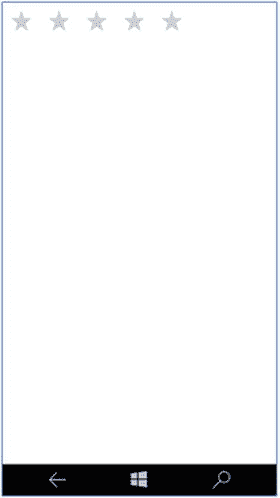

图 3-2。

Rating control on Windows Mobile emulator

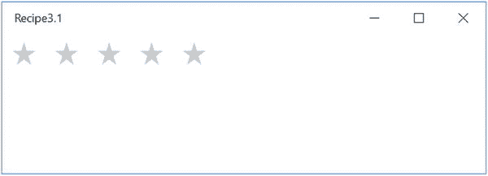

图 3-1。

Rating control on Windows 10

## 3.2 WinJS 控件的设置选项

### 问题

您希望为 HTML 页面上的 WinJS 控件设置附加选项或属性。

### 解决办法

使用`data-win-options`属性为控件设置附加选项或属性。

### 它是如何工作的

大多数 WinJS 控件支持设置 options 属性。例如，在页面上使用分级控件时，您可能希望限制用户可以提供的最高分级。

您可以用`data-win-options`属性来指定这一点。例如，下面的 HTML 代码演示了如何将分级控件的最高分级设置为 4。

`
`

`
`

`data-win-options`采用 JavaScript 选项；它与属性名一起传递，其值用花括号括起来。

在这里，`maxRating`是一个属性。也可以传递多个属性及其值。例如，如果您需要设置`enableClear`属性和`MaxRating`，您可以用`data-win-options`属性来设置它，如下所示。

`
`

`
`

图 3-3 展示了窗口移动仿真器上的屏幕及其显示。

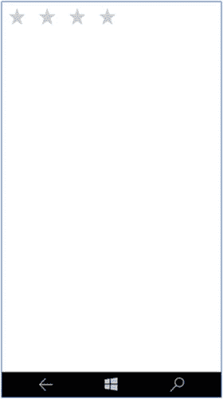

图 3-3。

Rating control with maximum rating of 4

如果`enableClear`属性设置为 true，那么用户可以滑动到控件的左侧来清除评级值。

## 3.3 从 JavaScript 代码添加 WinJS 控件

### 问题

您需要从 JavaScript 代码中添加一个 WinJS 控件，而不是将其添加到 HTML 页面中。

### 解决办法

您可以强制创建控件；即完全使用 JavaScript 来识别`div`元素并动态生成控件并添加到页面中。

### 它是如何工作的

Create a new project using the Windows Universal (Blank App) template in the Visual Studio 2015 Community. This creates a Windows universal app that can be run on Windows tablets or on Windows Mobile running in Windows 10.   Open the project’s `default.html` page from the project in Visual Studio Solution Explorer.   Add a `div` tag in the body section of the page where you want the control to be rendered. `
`     `
`   Right-click the `js` folder within the project in the Solution Explorer. Select Add ➤ New JavaScript File and provide a name for the file. In this example, let’s name the file controldemo.js. This adds the `controldemo.js` file under the `js` folder of the project.   Add the following code to the `controldemo.js` file. This creates a new rating control and adds it to the rating `div` tag. `(function () {`     `"use strict";`     `function AddControl()`     `{`         `var ratingDiv = document.getElementById("rating");`         `var ratingCtrl = new WinJS.UI.Rating(ratingDiv);`     `}`     `document.addEventListener("DOMContentLoaded", AddControl);` `})();` The preceding code creates a new instance of the `WinJS.UI.Rating` JavaScript class. It is created by passing the rating `div` element to the constructor of the Rating class.   Now you need to add a reference to the `controldemo.js` file in the HTML page. Open the `default.html` file and add the following code snippet to the head section of the page. ``  

页面将包含代码，如下所示。

`<!DOCTYPE html>`

`<html>`

`<head>`

`<meta charset="utf-8" />`

`<title>Recipe3.3</title>`

`<!-- WinJS references -->`

`<link href="WinJS/css/ui-light.css" rel="stylesheet" />`

``

``

`<!-- Recipe3.3 references -->`

`<link href="/css/default.css" rel="stylesheet" />`

``

``

`</head>`

`<body class="win-type-body">`

`
`

`
`

`</body>`

`</html>`

让我们在 Windows Mobile 模拟器上运行应用。图 3-4 展示了 Windows Mobile 上的输出页面。

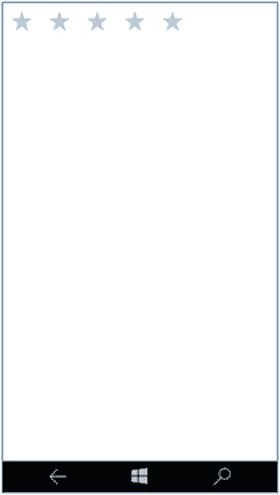

图 3-4。

Rating control added from the JavaScript code

控件的选项或属性也可以通过 JavaScript 代码强制设置。下面展示了如何从 JavaScript 代码中创建 Rating 控件的实例并设置`maximumRating`属性。

`(function () {`

`"use strict";`

`function AddControl()`

`{`

`var ratingDiv = document.getElementById("rating");`

`var ratingCtrl = new WinJS.UI.Rating(ratingDiv);`

`ratingCtrl.maxRating = 4;`

`}`

`document.addEventListener("DOMContentLoaded", AddControl);`

`})();`

这段代码片段展示了如何设置`maxRating`属性，而不在构造函数中设置它。或者，您也可以通过将它传递给第二个参数来设置它，用花括号括起来。

图 3-5 演示了在 Visual Studio 中设置分级控制属性时的智能感知支持。

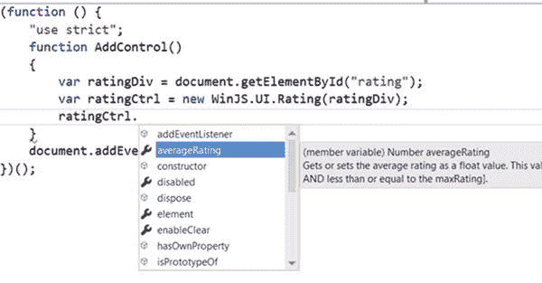

图 3-5。

IntelliSense support in Visual Studio 2015

Intellisense 是 Microsoft Visual Studio 中的一项重要功能，它可以提高开发人员的工作效率，并根据用户在 IDE 中键入的内容向开发人员提供自动建议。

## 3.4 从 HTML 文档中获取 WinJS 控件

### 问题

您希望从 HTML 页面获取控件，并使用 JavaScript 代码设置属性。

### 解决办法

使用`winControl`属性从页面的`DOM`元素获取控件。

### 它是如何工作的

Create a new project using the Windows Universal (Blank App) template in Visual Studio 2015 Community. This creates a Windows universal app that can be run on Windows tablets and Windows Mobile running Windows 10.   Open the `default.html` page from the project in Visual Studio Solution Explorer.   Add the Rating control to the body section of the page. `
`     `
`   Right-click on the `js` folder within the project in the Solution Explorer. Select Add ➤ New JavaScript File and provide a name for the file. In this example, let’s name the file controldemo.js. This adds the `controldemo.js` file under the `js` folder of the project.   Add the following code to the `controldemo.js` file. `(function () {`     `"use strict";`     `function GetControl() {`         `WinJS.UI.processAll().done(function () {`             `var ratingControl = document.getElementById("rating").winControl;`             `ratingControl.userRating = 2;`         `});`     `}`     `document.addEventListener("DOMContentLoaded", GetControl);` `})();`   When you invoke the `document.getElementById` method, you get the `DOM` element. You need to use the `winControl` property to get the associated control.   This needs to be surrounded by the `WinJS.UI.processAll` method, which returns the promise. The reason for surrounding your logic with the `processAll` method is that you have to wait until all the controls are created and parsed in the document before trying to retrieve it.   Once the Rating control is retrieved, you can start setting the values to the properties of the Rating control instance. In this example, you are setting the user rating to 2.   Finally, you need to add the reference of the `controldemo.js` file in the `default.html` page. Open the `default.html` page from Visual Studio Solution Explorer and add the following code to the head tag. ``  

当您在 Windows Mobile 模拟器上运行应用时，您应该会看到如图 3-6 所示的屏幕。

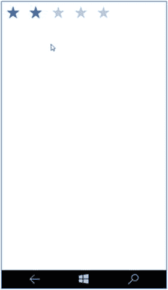

图 3-6。

Windows Mobile emulator displaying the Rating control with value 2

## 3.5 拨动开关控制

### 问题

您需要为用户提供一个在屏幕上执行二进制操作的选项。例如，您需要为用户提供打开或关闭服务的选项。

### 解决办法

使用 WinJS 中的 ToggleSwitch 控件。它类似于标准的复选框控件，但具有更好的触摸支持。您只需用手指滑过 ToggleSwitch 控件即可选中或取消选中该选项。您可以使用 WinJS 在页面上声明 ToggleSwitch 控件。将 UI.ToggleSwitch 值赋给`div`元素的`data-win-control`属性。

### 它是如何工作的

下面演示如何在页面上声明 ToggleSwitch 控件。

`
`

`
`

当在 Windows 平板电脑或 Windows Mobile 模拟器上执行时，前面的代码片段将如图 3-7 所示。

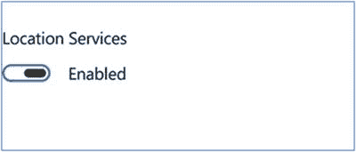

图 3-7。

ToggleSwitch on the Windows Mobile and Windows emulator

`data-win-options`属性用于设置 ToggleSwitch 控件的附加属性。在前面的例子中，像标题、`labelOff`、`labelOn`和`Checked`这样的属性是使用这个属性设置的。

title 为 ToggleSwitch 设置标题内容。`labelOff`和`labelOn`属性根据控件的选中(开)和未选中(关)状态标识需要显示在 ToggleSwitch 旁边的文本。

使用控件的 checked 属性可以找到 ToggleSwitch 的当前状态(选中或未选中)。

让我们向项目的`js`文件夹添加一个新的 JavaScript 文件，并将其命名为 controldemo.js。打开`default.html`页面，添加 ToggleSwitch 控件和一个空的`div`标签，以显示切换开关状态变化的消息。

`default.html`看起来如下。

`<!DOCTYPE html>`

`<html>`

`<head>`

`<meta charset="utf-8" />`

`<title>Recipe3.5</title>`

`<!-- WinJS references -->`

`<link href="WinJS/css/ui-light.css" rel="stylesheet" />`

``

``

`<!-- Recipe3.5 references -->`

`<link href="/css/default.css" rel="stylesheet" />`

``

``

`</head>`

`<body class="win-type-body">`

`
`

`
`

`

`

`</body>`

`</html>`

为了从 JavaScript 代码中识别状态，您需要连接 ToggleSwitch 控件的 change 事件处理程序。当您更改控件的状态时，会触发此事件。

打开`controldemo.js`文件，用下面的代码替换它。

`(function () {`

`"use strict";`

`function GetControl() {`

`WinJS.UI.processAll().done(function () {`

`var toggleButton = document.getElementById("locationServices").winControl;`

`var InfoElement = document.getElementById("info");`

`toggleButton.addEventListener('change', function (args) {`

`if (toggleButton.checked) {`

`InfoElement.innerHTML = "Location Services enabled";`

`}`

`else {`

`InfoElement.innerHTML = "Location Services disabled";`

`}`

`})`

`});`

`}`

`document.addEventListener("DOMContentLoaded", GetControl);`

`})();`

当您在 Windows 10 模拟器和 Windows Mobile 模拟器上运行应用时，您将看到如图 3-8 所示的屏幕。

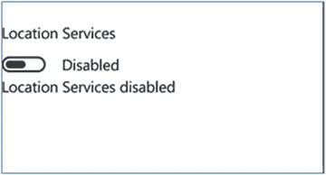

图 3-8。

ToggleSwitch with the change event.

当您切换控件时，适当的消息会显示在`Info div`元素中。

## 3.6 日期选择器控件

### 问题

您希望允许用户从应用页面选择日期。

### 解决办法

使用允许用户选择日期的 WinJS DatePicker 控件。该控件显示三个列表:月、日和年各一个。

### 它是如何工作的

您可以在页面上声明 DatePicker 控件，如下所示。

`
`

`
`

在这个菜谱中，让我们尝试在页面上添加 DatePicker 控件，并在 JavaScript 代码中绑定事件，以在一个`div`元素中显示所选日期。

Create a new project using the Windows Universal App template in Visual Studio 2015.   Open the `default.html` page and replace it with the following. `<!DOCTYPE html>` `<html>` `<head>`     `<meta charset="utf-8" />`     `<title>Recipe3.6</title>`     `<!-- WinJS references -->`     `<link href="WinJS/css/ui-light.css" rel="stylesheet" />`     ``     ``     `<!-- Recipe3.6 references -->`     `<link href="/css/default.css" rel="stylesheet" />`     ``     `` `</head>` `<body class="win-type-body">`     `
`     `
`     `

` `</body>` `</html>` The `default.html` page contains the DatePicker control as well as the `div` tag with the name information to display the selected date. The `controldemo.js` file is referenced, which you create next.   Add a new JavaScript file to the project’s js folder from Visual Studio Solution Explorer and name it controldemo.js. Add the following JavaScript code to the `controldemo.js` file. `(function () {`     `"use strict";`     `function GetControl() {`         `WinJS.UI.processAll().done(function () {`             `var datepick = document.getElementById("Birthday").winControl;`             `var InfoEelement = document.getElementById("info");`             `datepick.addEventListener('change', function (args) {`                 `InfoEelement.innerHTML = "The selected date is " +`                     `datepick.current.toDateString();`             `})`         `});`     `}`     `document.addEventListener("DOMContentLoaded", GetControl);` `})();`  

只要您更改日期、月份或年份，DatePicker 就会引发 change 事件。您可以通过处理该事件来获取当前选定的日期。

在 JavaScript 代码中，`document.getElementById`的`winControl`属性用于从 HTML 页面获取 DatePicker。从 DatePicker 控件调用`addEventListener`方法来订阅变更事件。

使用 DatePicker 的 current 属性检索选定的日期。

在 Windows Mobile 或 Windows 10 上运行应用会显示日期选择器，并显示所选日期，如图 3-9 所示。

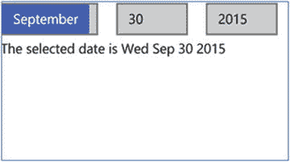

图 3-9。

DatePicker control demo

通过分配格式字符串，可以控制 DatePicker 控件的年、月和日期字段的外观。

例如，可以对 DatePicker 进行格式化，以两位数格式显示缩写的月份和年份以及日期，如下所示。

`
`

`
`

使用`monthPattern`、`datePattern`和`yearPattern`属性设置格式。

`monthPattern`属性定义了月份的显示模式。您可以使用表 3-1 中显示的值之一设置月模式属性。

表 3-1。

Month Pattern for the date picker

<colgroup><col> <col></colgroup> 
| 模式 | 描述 |
| --- | --- |
| 完整月份 | 这将显示月份的全名。 |
| 月份。缩写(n) | 您可以使用带或不带参数的 month .缩写。参数指定一个月的字母数。 |
| month.solo .完整 | 这表示适合独立显示的月份。并且，month . solo . abstracted 可以带参数使用，也可以不带参数使用。 |
| 月.整数(n) | month.integer 用于指定月字段中显示的整数个数。 |

`datePattern`属性用于获取或设置 DatePicker 控件中日期的显示模式。您可以用表 3-2 中显示的值之一设置`datePattern`。

表 3-2。

Date Pattern for the date picker

<colgroup><col> <col></colgroup> 
| 模式 | 描述 |
| --- | --- |
| day .整数(n) | 您可以使用带参数或不带参数的 day.integer。参数指定要包含的前导零；例如，如果值为 day.integer (2 ),则显示 02。 |
| dayofweek .缩写 | 此属性显示一周中的某一天。参数指定要显示的字母数。 |

属性获取或设置年份的显示模式。默认的年模式是 year.full。您可以将其修改为表 3-3 中显示的任一值。

表 3-3。

Year pattern for the date picker

<colgroup><col> <col></colgroup> 
| 模式 | 描述 |
| --- | --- |
| 全年 | 以数字显示完整的年份 |
| 年份。缩写(n) | 用指定的一组数字显示年份。 |

## 3.7 时间选择器控件

### 问题

您希望允许用户从应用页面选择时间。

### 解决办法

使用允许用户选择时间的 WinJS TimePicker 控件。该控件显示三个列表:小时、分钟和时间段(AM/PM)各一个。

### 它是如何工作的

您可以在页面上声明 DatePicker 控件，如下所示。

`
`

`
`

在这个菜谱中，让我们尝试在页面上添加 TimePicker 控件，并在 JavaScript 代码中绑定事件，以在一个`div`元素中显示所选时间。

Create a new project using the Windows Universal App template in Visual Studio 2015.   Open the `default.html` page and replace it with the following. `<!DOCTYPE html>` `<html>` `<head>`     `<meta charset="utf-8" />`     `<title>BasicControls</title>`     `<!-- WinJS references -->`     `<link href="WinJS/css/ui-light.css" rel="stylesheet" />`     ``     ``     `<!-- Recipe3.7 references -->`     `<link href="/css/default.css" rel="stylesheet" />`     ``     `` `</head>` `<body class="win-type-body">`     `
`     `
`     `

` `</body>` `</html>` The `default.html` page contains the TimePicker control as well as the `div` tag with the name information to display the selected time. The `controldemo.js` file is referenced, which you will create in the next step.   Add a new JavaScript file to the project’s `js` folder from the Visual Studio Solution Explorer and name it controldemo.js. Replace the file with the following JavaScript code. `(function () {`     `"use strict";`     `function GetControl() {`         `WinJS.UI.processAll().done(function () {`             `var datepick = document.getElementById("timeSelector").winControl;`             `var InfoEelement = document.getElementById("info");`             `datepick.addEventListener('change', function (args) {`                 `InfoEelement.innerHTML = "The selected time is " +`                     `datepick.current.toTimeString();`             `})`         `});`     `}`     `document.addEventListener("DOMContentLoaded", GetControl);` `})();`  

只要您更改了小时、分钟或时间段，TimePicker 就会引发 change 事件。您可以通过处理该事件来获取当前选定的时间。

在 JavaScript 代码中，`document.getElementById`的`winControl`属性用于从 HTML 页面获取时间选择器。从 TimePicker 控件调用`addEventListener`方法来订阅变更事件。

使用 TimePicker 控件的 current 属性检索选定的时间。

在 Windows Mobile 或 Windows 10 上运行应用会显示时间选择器并显示所选时间，如图 3-10 所示。

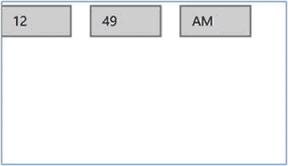

图 3-10。

TimePicker control demo

通过使用`data-win-options`属性设置 clock 属性，可以将 TimePicker 设置为支持 24 小时制，如下所示。

`
`

`
`

可以用`minuteIncrement`属性控制分钟列表的增量值，如下所示。

当您在 Windows 10 或 Windows Mobile 10 上运行该页面时，您会看到如图 3-11 所示的屏幕。

图 3-11。

TimePicker with the 24-hour clock format and timeInterval adjustment

通过分配格式字符串，可以控制 TimePicker 控件的小时、分钟和周期字段的外观。

使用`hourPattern`、`minutePattern`和`periodPattern`属性设置格式。

`hourPattern`属性设置小时的显示模式。`hourPattern`属性的默认值是 hour.integer(2 ),您可以通过更改参数值来修改`hourPattern`属性。属性获取或设置分钟的显示模式。此属性的默认值是 minute.integer (2 ),您可以通过更改参数中的整数数目来修改此模式。`periodPattern`属性获取或设置周期的显示模式；该属性的默认值是 period.abbreviated (2)。您可以通过更改参数值来修改此属性的模式。

表 3-4。

Pattern for hours, minutes and period in timepicker

<colgroup><col> <col></colgroup> 
| 模式 | 描述 |
| --- | --- |
| hour.integer(n) | 这将显示小时的指定位数。 |
| {minute.integer(n)} | 这将显示分钟的指定位数。 |
| {句点.缩写(n)} | 基于作为参数传递的值的期间显示模式。 |

## 3.8 工具提示控件

### 问题

当用户将鼠标悬停在页面上的任何元素上时，您需要显示工具提示。

### 解决办法

使用 WinJS Tooltip 控件在页面上的 HTML 元素上显示工具提示。当您将光标悬停在某个元素上时，工具提示会显示指定的秒数。当用户将光标从元素上移开时，工具提示应该会消失。

### 它是如何工作的

为按钮添加工具提示控件，如下所示:

`<button id="btnSave"`

`data-win-control="WinJS.UI.Tooltip"`

`data-win-options="{`

`innerHTML: 'Saves the <b>Employee</b> record'}">`

`Save`

`</button>`

通过`data-win-options`属性设置`innerHTML`属性，该属性设置工具提示控件的文本。这个文本也可以包含 HTML 标签。

图 3-12 展示了工具提示在 Windows Mobile 10 和 Windows 10 平板电脑上的显示方式。

图 3-12。

Tooltip displayed within the app

您可以通过修改`win-tooltip` CSS 类来自定义工具提示控件的样式。

从 CSS 文件夹中打开`default.css`文件，并将以下代码添加到文件的末尾。

`.win-tooltip`

`{`

`background-color: bisque;`

`border-radius:30px;`

`border-color:red;`

`}`

图 3-13 展示了定义了前面提到的样式后工具提示控件的外观。

图 3-13。

Tooltip with styling

注意，当使用 div 元素作为工具提示的容器时，需要将其 display 属性设置为 inline block，因为 div 元素的显示设置默认为 block。

## 3.9 显示文本

### 问题

您需要在 Windows 应用的页面上显示文本或标签。

### 解决办法

使用传统的 HTML 元素或标签在 Windows 应用的页面上显示文本。这些包括 div、标签、段落、标题等等。

### 它是如何工作的

HTML 元素(如标签、div、段落、标题等)是使用 JavaScript 在 Windows 通用应用上显示只读文本的一些常用控件。

您可以定义一个简单的 label 控件并设置其文本，如下所示。

`<label>Welcome to the Windows 10 App Development World</label>`

`
by Microsoft MVPs
`

可以使用两种方法之一将样式应用于显示文本:inline 或 CSS。

下面的代码片段演示了如何使用 inline style 属性来格式化文本。

`
Welcome to the Windows 10 App Development World
`

`
Welcome to the Windows 10 App Development World
`

图 3-14 展示了使用内嵌样式属性的上述代码的输出。

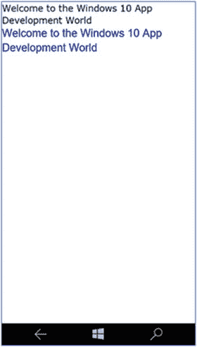

图 3-14。

Styling the read-only text

CSS 允许开发人员在一个地方定义一个样式，然后在多个控件中重复使用。

## 3.10 在应用中编辑文本

### 问题

您需要允许用户在您的 Windows 应用页面上输入文本。

### 解决办法

使用 HTML 元素允许用户在页面上输入文本。这包括文本框、文本区域、密码输入框、富文本框等等。

### 它是如何工作的

使用 JavaScript 的 Windows 通用应用有四种不同类型的文本输入元素。

*   文本框:该控件允许用户在单行中输入或编辑纯文本。
*   文本区域:该控件支持多行，允许用户输入或编辑纯文本。
*   密码输入框:该控件允许用户输入密码。
*   格式文本框:该控件允许用户编辑需要格式化的文本。

这是一个简单的文本框、文本区域和密码输入框的 HTML。

`
<textarea id="textarea1" rows="2"></textarea>
`

`
<input type="text" />
`

`
<input id="password" type="password" placeholder="Enter password" />
`

图 3-15 展示了控件在 Windows Mobile 10 模拟器上的显示方式。

图 3-15。

Editable controls

一旦用户执行了一些动作，比如点击按钮，你就可以从 JavaScript 代码中获取控件的内容，如方法 3-4 所示。