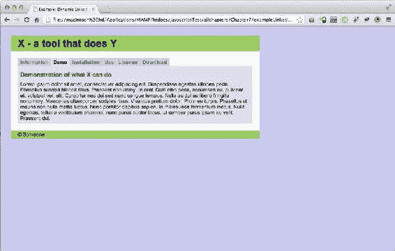
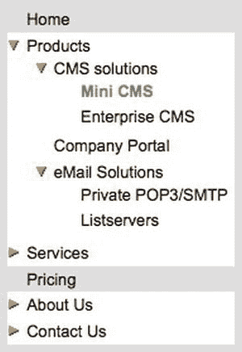
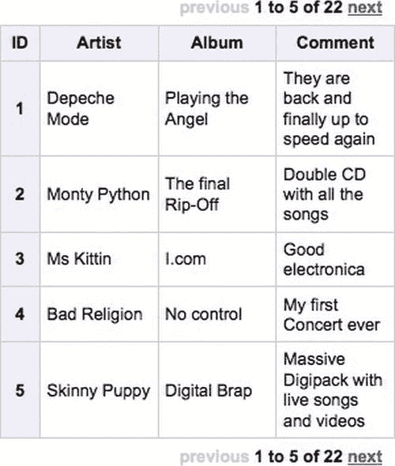
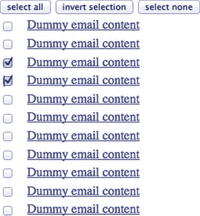
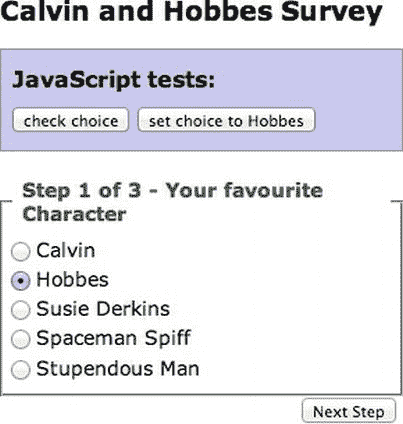
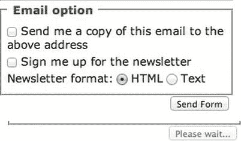
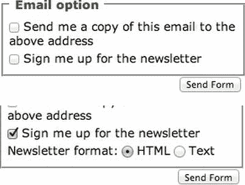
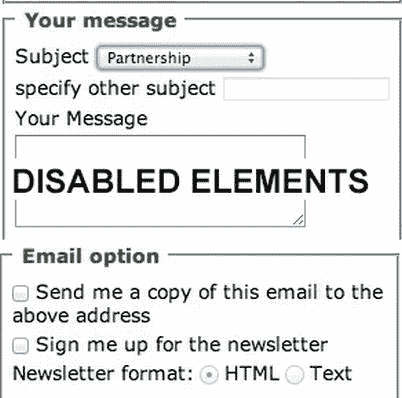

第七章


JavaScript 和用户交互:导航和表单

在这一章中，我将讨论 JavaScript 的两个更常见的用途:导航和表单。两者都涉及大量的用户交互，因此需要深思熟虑地计划和执行。一个网站的成功与否取决于其导航的难易程度，在 web 上没有什么比一个难以使用或无法填写的表单更令人沮丧的了。

 **注意**这一章由大量的代码示例组成，你会被要求在浏览器中打开其中的一些来自己测试功能。因此，如果你还没有去过[http://www.beginningjavascript.com](http://www.beginningjavascript.com)下载这本书的代码示例，现在可能是个好时机。当谈到编码时，我坚定地相信实践培训，当你可以直接体验它或者——更好的是——在你自己的编辑器中摆弄它时，你会更容易理解一些功能。

导航和 JavaScript

自从浏览器开始支持页面元素的外观和感觉的动态变化以来，增加网站导航的趣味一直是 DHTML 的主要任务之一。动画和褪色导航的时代是从 DHTML 开始的。这个想法似乎是，如果网页的导航非常流畅、高科技，并且看起来和操作起来都像星际飞船 *Enterprise* 上的 LCARS 界面，那么这个网站一定很棒。很多时候，访问者不同意，一旦他们厌倦了导航，他们会使用网站搜索选项，假设提供了一个。

这里就不说华而不实的导航了；相反，我将举例说明如何使用 JavaScript 使页面和站点导航更直观、更简单，同时尽可能保持其可访问性。

页面重载的恐惧

对表单和 web 导航进行了大量 JavaScript 增强，以防止访问者在到达他们想要的信息之前必须重新加载页面或加载大量页面。这是一个令人钦佩的想法，可以奇妙地工作；但是，我们不要忘记，只有当整个文档被加载时，JavaScript 才能到达页面的元素，并且它可以处理文档中已经存在的内容(也就是说，除非您使用 Ajax 动态加载其他内容——下一章将详细介绍)。

这意味着您可以用 JavaScript 创建一个光滑的界面，只显示整个页面内容的一部分，但这也意味着没有 JavaScript 的访问者将不得不处理文档中的全部数据。在您完全沉迷于增强页面之前，请不时关闭 JavaScript，看看您是否能够处理文档中的数据量。

只有少量专门信息的较小文档的好处是，您可以使用浏览器提供给用户的整个工具包:前进和后退、书签和打印。当您使用 JavaScript 进行导航或分页时，可能会破坏这个功能。不太理想的效果是，您必须维护更多的文档，访问者必须分别加载每个文档，因此也增加了服务器流量。

用 JavaScript 来增强网站并不邪恶；这完全是一个适度和了解你的观众的问题。

导航和 JavaScript 基础

导航和 JavaScript 最基本的想法是，你不依赖 JavaScript 来让你的导航工作。根据 JavaScript 的不同，页面或网站导航会将没有 JavaScript 的用户拒之门外，也会将搜索引擎拒之门外。

 **提示**如果你必须向一个非技术人员解释为什么一堆 JavaScript:navigate(‘page 2’)链接不是一个好主意，那么后者是一个很好的论据。对于一个甚至不知道如何在浏览器中关闭 JavaScript 的人来说，将禁用 JavaScript 的网站访问者作为一个值得考虑的目标群体是不容易解释的。向他解释“又大又瞎的百万富翁”谷歌不会索引他的网站是一个更容易的卖点。

使用 JavaScript 的一个经典例子是使用选择框来导航，这看起来使导航更容易，但却有可能疏远一大群访问者。选择框很棒，因为它们可以让你在不浪费屏幕空间的情况下提供很多选项。[图 7-1](#Fig1) 为打开的选择框；对于所有这些选项，封闭的只使用了一行。


[图 7-1](#_Fig1) 。使用选择框进行导航

打开演示页面 exampleSelectNavigation.html，并从下拉菜单中选择一个选项。如果您连接到网络并启用了 JavaScript，您将立即被发送到您选择的地址。不幸的是，如果你选择了错误的选项，你没有机会撤销你的选择。如果没有 JavaScript，您可以选择一个选项，但是什么都不会发生。

*examples selectnavigation . html*

```js
<form>
<p>
  <select onchange="window.location = this.options[this.selectedIndex].value">
    <option value="#">Please select</option>
    <option value="http://www.apress.com">The publisher</option>
    <option value="http://wait-till-i.com">The author's blog</option>
    <option value="http://icant.co.uk">The author's other articles</option>
    <option value="http://onlinetools.org">Scripts and tools by the author</option>
  </select>
</p>
</form>
```

键盘访问是另一个问题:你通常使用 Tab 键来访问一个选择框，然后按上下键来选择你想要的选项。在本例中，您将不会有这样的机会，因为一旦您按下向下箭头键，您将被转到第一个选项。解决方法是同时按 Alt 和向下箭头键来展开整个列表。然后，您可以使用向上和向下箭头键选择您的选项，并按 Enter 键选择它。但是你知道吗？

解决这些问题的最简单的方法是永远不要使用 change、mouseover 或 focus 事件将数据发送给服务器或将用户发送到不同的 web 位置。很多游客都无法进入，这可能会导致很多挫折。如果没有迹象表明数据正在发送并且页面将会改变，这是特别令人沮丧的。

相反，提供一个真正的提交按钮、一个在服务器端执行相同重定向的脚本，以及一个提交处理程序，以便在 JavaScript 可用时通过 JavaScript 进行重定向。

*examples saferselectnavigation . html(excerpt)*

```js
<form method="post" action="redir.php">
<p>
  <label for="url">Please select your destination:</label>
  <select id="url" name="url">
    <option value="http://www.apress.com">The publisher</option>
    <option value="http://wait-till-i.com">The author's blog</option>
    <option value="http://icant.co.uk">The author's other articles</option>
    <option value="http://onlinetools.org">Scripts and tools by the author</option>
  </select>
  <input type="submit" value="Make it so!">
</p>
</form>
```

这个脚本非常简单:您将一个事件处理程序应用到提交时触发方法的第一个表单。该方法从 ID 为 url 的选项列表的 selectedIndex 中读取用户所做的选择，并通过 window.location 对象将浏览器重定向到那里。在下一节中，您将读到更多关于 window.location 对象的内容，在本章的“表单和 JavaScript”一节中，您将读到所有关于 selectedIndex 和 form 对象的内容。

*examples saferselectnavigation . js*

```js
send = {
  init : function() {
    DOMhelp.addEvent(document.forms[0], 'submit', send.redirect, false);
  },
  redirect : function(e){
    var t = DOMhelp.getTarget(e);
    var url = t.elements['url'];
    window.location.href = url.options[url.selectedIndex].value;
    DOMhelp.cancelClick(e);
  }
}
DOMhelp.addEvent(window, 'load', send.init, false);
```

将非 JavaScript 用户发送到另一个 URI 的服务器端脚本可以是 PHP 中一个简单的头重定向:

```js
<?php header('Location: ' . $_POST['url']); ?>
```

如果用户启用了 JavaScript，她就不必往返服务器；相反，她会被立即转到另一个网站。这可以通过设置 window.location.href 属性来实现，该属性是内置浏览器导航的一部分。

浏览器导航

浏览器为您提供了几个对象，您可以使用它们来自动重定向或浏览浏览器的历史记录。在上一章中，您已经遇到了 window.back()方法。窗口对象还提供了窗口.位置和窗口.历史等属性

window.location 对象存储当前元素的 URI，并具有以下属性(在括号中，如果 URI 是[http://www.example.com:8080/index.php?，您会看到提供的返回值 s=JavaScript#searchresults](http://www.example.com:8080/index.php?s=JavaScript#searchresults) ):

*   哈希:URI 中锚的名称(#searchresults)
*   主机:www.example.com([)的域名部分](http://www.example.com)
*   主机名:域名，包括子域名和端口号([www.example.com:8080](http://www.example.com:8080))
*   整个 http://www.example.com:8080/index.php?的 URI 弦乐团 s=JavaScript#searchresults
*   pathname:URI(/index . PHP)的路径名
*   港口:URI 的港口(8080)
*   协议:URI 的协议(http:)
*   搜索:搜索参数(？s=JavaScript)

所有这些属性都可以读写。例如，如果您希望将搜索更改为 DOM 脚本，可以通过 window.location.search= '？“DOM 脚本”。浏览器会自动将字符串 URL 编码为 DOM%20scripting。还可以通过更改 window.location.href 属性将用户的浏览器发送到另一个位置。

除了这些属性，window.location 还有两个方法:

*   reload():重新加载当前文档(与单击“重新加载”按钮或同时按 F5 或 Ctrl 和 R 键的效果相同)。
*   replace(URI):将用户发送到 URI，并用另一个替换当前的 URI。当前的 URI 将不再是浏览器历史的一部分。

 **注意**注意这与 String 对象的 replace()方法不同，后者用字符串的一部分替换另一部分。

您可以使用 reload()定期刷新页面，从后端加载新内容，而无需用户单击 Reload 按钮。这种功能在基于 JavaScript 的聊天系统中很常见。

使用 replace()可能非常烦人，因为它破坏了用户的后退按钮功能。当她不喜欢你发给她的页面时，她不能回到当前页面。

用户在到达当前页面之前访问过的页面列表存储在 window.history 对象中。这个对象只有一个属性，叫做 length，它存储已经访问过的页面的数量。它有一些您可以使用的方法(下面列表中的最后两个是作为 HTML5 的一部分添加的):

*   back():在浏览器历史中返回上一页。
*   forward():在浏览器历史记录中前进一页。
*   go(n): Go *n* 根据 *n* 是正还是负，在浏览器历史中向前或向后移动。您也可以通过 history.go(0)重新加载同一页面。
*   pushState (State，title，url):该方法将数据推入会话历史，其中 state 表示一个充满数据的对象，title 表示页面标题，url 表示添加到历史中的 URL。
*   replaceState (state，title，url):该方法的工作方式与 pushState()相同，但它修改数据，而不是向浏览器的历史记录中添加新数据。

历史对象只允许您导航到其他页面，而不能读出它们的 URIs 或更改它们。该规则的例外是当前页面，当您使用 replace()时，它会从浏览器历史记录中删除。

正如上一章已经解释过的，通过 JavaScript 将用户发送到其他页面，可以有效地模拟浏览器功能，这可能是多余的，或者会彻底迷惑用户。

页面内导航

您可以使用 JavaScript 使同一页面内的导航更有趣，占用的屏幕空间更少。在 HTML 中，您可以通过锚和目标提供页面内导航，它们都是用

 **注意**锚的 name 属性在 HTML5 中被弃用，它实际上足以提供一个 ID 来链接锚和目标对。但是，为了确保与旧浏览器的兼容性，在下面的例子中使用它可能是一个好主意。

让我们以一个目录中链接到页面下方不同目标的内部链接列表作为页面内导航的示例:

*exampleLinkedAnchors.html(节选)*

```js
<h1>X - a tool that does Y</h1>
<div id="toolinfo">
  <ul id="toolinfotoc">
    <li><a href="#info">Information</a></li>
    <li><a href="#demo">Demo</a></li>
    <li><a href="#installation">Installation</a></li>
    <li><a href="#use">Use</a></li>
    <li><a href="#license">License</a></li>
    <li><a href="#download">Download</a></li>
  </ul>
  <div class="infoblock">
    <h2><a id="info" name="info">Information about X</a></h2>
    [... content ...]
    <p class="back">
      <a href="#toolinfotoc">Back to <acronym title="Table of Contents">TOC</acronym></a>
    </p>
  </div>
  <div class="infoblock">
    <h2><a id="demo" name="demo">Demonstration of what X can do</a></h2>
    [... content ...]
    <p class="back">
      <a href="#toolinfotoc">Back to <acronym title="Table of Contents">TOC</acronym></a>
    </p>
  </div>
  [.... more sections ...]
</div>
```

您可能会想，具有 infoblock 类的 DIV 元素对于页面内导航来说并不是必需的。这只是部分正确，因为微软的 IE 浏览器在命名锚和键盘导航方面有一个非常烦人的错误。

如果您在 Internet Explorer 中打开演示页面 exampleLinkedAnchors.html，通过按 Tab 键浏览不同的菜单项，并通过按 Enter 键选择您想要的部分，浏览器将被发送到您选择的锚点。但是，Internet Explorer 不会将键盘焦点发送到此锚点。如果您再次按 Tab 键，您不会到达文档中的下一个链接；相反，你会被送回菜单。

您可以通过在具有定义宽度的元素中嵌套锚来解决这个问题。这就是 div 的作用。你可以在 exampleLinkedAnchorsFixed.html 的演示页面上测试一下。实际结果是，您可以将这些元素(在本例中是 div)用于 CSS 样式。

 **提示**默认情况下，辅助功能在不同的浏览器中可能是关闭的。例如，要在 MacOS 上的 Safari 中重新打开它，请前往“偏好设置”、“高级”、“辅助功能”。选择按下标签以高亮显示网页上的每个项目选项。

现在让我们用一个脚本来复制和改进这个功能。脚本应该做的是显示菜单，但隐藏所有部分，只显示您选择的部分，以使页面更短，不至于让人不知所措。逻辑很简单:

*   遍历菜单中的链接，并添加 click 事件处理程序来显示与菜单项相关的部分。
*   在事件侦听器方法中，隐藏前面显示的部分，显示当前部分。
*   初始化页面时，隐藏所有部分并显示第一个部分。

然而，这并没有考虑到页面内导航的另一个方面:页面可能被来自另一个链接的预定义目标所请求。通过在浏览器中向 URI 添加锚点来尝试一下，例如，examplelinkedanchorsfied . html # use。您将自动向下滚动到使用部分。您的脚本应该考虑这个用例。

让我们从定义脚本的框架开始。这个脚本的主要对象被称为 iv，用于*内部导航*——因为 in 是 JavaScript 中的保留字，您希望保持简短。你需要几个属性:

*   一个 CSS 类来定义菜单何时是 JavaScript 增强的
*   突出显示菜单中当前链接的 CSS 类
*   显示当前部分的 CSS 类

 **提示**你不需要通过 JavaScript 隐藏这些部分，但是你可以使用上一章描述的 CSS 父类技巧。

您需要为要添加 CSS 类的父元素定义属性，并为能够遍历链接的菜单定义 ID。

还需要两个属性:一个存储当前显示的部分，另一个存储当前突出显示的链接。

就方法而言，您需要一个 init()方法、一个获取当前部分的事件监听器以及一个隐藏前一部分并显示当前部分的方法。

*内部名称. js(骨架)*

```js
iv = {
  // CSS classes
  dynamicClass : 'dyn',
  currentLinkClass : 'current',
  showClass : 'show',

  // IDs
  parentID : 'toolinfo',
  tocID : 'toolinfotoc',

  // Global properties
  current : null,
  currentLink : null,

  init : function(){ },
  getSection : function(e){ },
  showSection : function(o){ }
DOMhelp.addEvent(window, 'load', iv.init, false);
```

init()方法首先检查 DOM 是否受支持以及所有必要的元素是否可用。只有这样，您才可以通过 CSS 将类添加到父元素中，以自动隐藏所有的 section 元素。

*内部名称. js(except)*

```js
init : function(){
  if(!document.getElementById || !document.createTextNode) {
    return;
  }
  iv.parent = document.getElementById(iv.parentID);
  iv.toc = document.getElementById(iv.tocID);
  if(!iv.parent || !iv.toc) { return; }
  DOMhelp.cssjs('add', iv.parent, iv.dynamicClass);
```

在变量 loc 中存储一个可能的 URL 散列，并开始遍历菜单中的所有链接。替换哈希值中的#使得以后使用它更容易，因为您可以在 getElementById()中使用该名称，而不必删除哈希。

*innerNav.js(续)*

```js
var loc = window.location.hash.replace('#', ' ');
var toclinks = iv.toc.getElementsByTagName('a');
for(var i = 0; i < toclinks.length; i++) {
```

将当前链接的 href 属性与 loc 进行比较，如果相同，则将链接存储在 current link 属性中。这里使用的 string replace()方法从 href 属性中删除除锚点名称之外的任何内容。这是必要的，因为在 Internet Explorer 等一些浏览器中，getAttribute('href ')会返回包括文件路径在内的整个链接位置(这在 IE 8 中已得到修复)，而不仅仅是 HTML href 属性中的内容。

*innerNav.js(续)*

```js
if(toclinks[i].getAttribute('href').replace(/.*#/, ' ') == loc){
  iv.currentLink = toclinks[i];
}
```

接下来，添加一个指向 getSection()的 click 事件。请注意，在这个示例脚本中，您不需要停止默认事件—相反，允许浏览器跳转到该部分也会更改地址栏中的 URI，这反过来允许用户将该部分添加为书签。

*innerNav.js(续)*

```js
 DOMhelp.addEvent(toclinks[i], 'click', iv.getSection, false);
}
```

仅当其中一个链接与 URI 中的散列相同时，才定义 currentLink 属性。这意味着如果 URI 没有散列，或者它有一个指向不存在的锚的散列，则需要将 currentLink 定义为菜单中的第一个锚。init()方法通过调用 showSection()方法以 currentLink 作为参数来结束。

*innerNav.js(续)*

```js
if(!iv.currentLink) {
  iv.currentLink = toclinks[0];
  }
  iv.showSection(iv.currentLink);
},
```

事件侦听器方法 getSection()不需要做太多事情；它需要做的就是确定哪个链接被点击了，并将其作为参数发送给 showSection()。如果不是需要访问 window.location.hash，这两行可能是 showSection()方法的一部分。

*innerNav.js(续)*

```js
getSection : function(e) {
  var t = DOMhelp.getTarget(e);
  iv.showSection(t);
},
```

showSection()方法检索在 init()方法中作为参数 o 单击或定义的 link 对象。第一项任务是读取此链接的 href 属性，并通过正则表达式删除散列符号之前和包括散列符号在内的所有内容来检索锚点名称。然后，通过读取带有锚 ID 的元素并在节点树中向上移动两个节点，检索要显示的部分。

*innerNav.js(续)*

```js
showSection : function(o) {
  var targetName = o.getAttribute('href').replace(/.*#/,'');
  var section = document.getElementById(targetName).parentNode.parentNode;
```

为什么有两个节点？如果您还记得 HTML，您将链接嵌套在标题中，并将标题和部分的其余部分嵌套在 DIV 元素中:

*exampleLinkedAnchors.html(节选)*

```js
<li><a href="#demo">Demo</a></li>
 [... code snipped ...]
 <div class="infoblock">
   <h2><a id="demo" name="demo">Demonstration of what X can do</a></h2>
```

因为 getElementById('demo ')提供了链接，所以一个向上的节点是 H2，另一个向上的节点是 DIV。

然后，您需要检查是否显示了一个旧的部分和一个突出显示的链接，然后通过删除适当的类来删除突出显示并隐藏该部分。然后添加当前链接和当前节的类，并设置属性 current 和 current link，确保下次调用 showSection()时撤销您现在所做的操作。

*innerNav.js(续)*

```js
    if(iv.current != null){
      DOMhelp.cssjs('remove', iv.current, iv.showClass);
      DOMhelp.cssjs('remove', iv.currentLink, iv.currentLinkClass);
    }
    DOMhelp.cssjs('add', section, iv.showClass);
    DOMhelp.cssjs('add', o,iv.currentLinkClass);
    iv.current = section;
    iv.currentLink = o;
  }
}
DOMhelp.addEvent(window, 'load', iv.init, false);
```

如果您将这个脚本应用到演示 HTML 页面并添加一个适当的样式表，当您单击链接时，您会得到一个显示不同部分的更短的页面。通过在浏览器中打开 exampleLinkedAnchorsPanel.html，您可以亲自看到这一点。在 Firefox 17.0.1 的 MacOS 上，页面看起来就像你在[图 7-2](#Fig2) 中看到的那样。


[图 7-2](#_Fig2) 。从锚-目标列表创建的面板界面

简单地应用一个不同的样式表将页面变成一个选项卡式界面，正如你在 exampleLinkedAnchorsTabs.html 和图 7-3 中看到的。



[图 7-3](#_Fig3) 。从锚-目标列表创建的选项卡式界面

对于一个简短的脚本来说，这是非常简洁的；然而，每当用户单击其中一个选项时，清除链接 href 并检索该部分似乎是重复的。

完成相同任务的另一种方法是将链接和部分存储在两个关联数组中，并简单地为 showSection()提供要显示和突出显示的锚的名称。演示 exampleLinkedAnchorsTabsNamed.html 使用了这种技术，并展示了如何同时应用鼠标悬停处理程序来获得相同的效果。

*内联 name . js】t1*

```js
iv = {
  // CSS classes
  dynamicClass : 'dyn',
  currentLinkClass : 'current',
  showClass : 'show',

  // IDs
  parentID : 'toolinfo',
  tocID : 'toolinfotoc',
```

第一个变化是您只需要一个当前属性和两个新的数组属性，称为 sections 和 sectionLinks，它们将在以后存储节和链接。

*innerNavNamed.js(续)*

```js
// Global properties
current : null,
sections : [],
sectionLinks : [],
init : function() {
  var targetName,targetElement;
  if(!document.getElementById || !document.createTextNode){
    return;
  }
  var parent = document.getElementById(iv.parentID);
  var toc = document.getElementById(iv.tocID);
  if(!parent || !toc) { return; }
  DOMhelp.cssjs('add', parent, iv.dynamicClass);
  var toclinks = toc.getElementsByTagName('a');
  for(var i = 0; i < toclinks.length; i++){
```

除了单击之外，还要添加一个 mouseover 处理程序，并将 href 属性存储在菜单中每个链接的一个名为 targetName 的属性中。

*innerNavNamed.js(续)*

```js
DOMhelp.addEvent(toclinks[i], 'click', iv.getSection, false);
DOMhelp.addEvent(toclinks[i], 'mouseover', iv.getSection,false);
targetName = toclinks[i].getAttribute('href').replace(/.*#/,'');
toclinks[i].targetName = targetName;
```

通过将第一个链接存储在 presetLink 变量中，将其定义为当前活动链接，并确定锚是否指向现有元素。如果是，则将元素存储在 sections 数组中，将链接存储在 sectionLinks 数组中。请注意，这会产生一个关联数组，这意味着您可以通过 section['info']到达第一节。

*innerNavNamed.js(续)*

```js
  if(i == 0){ var presetLink = targetName; }
  targetElement = document.getElementById(targetName);
  if(targetElement) {
    iv.sections[targetName] = targetElement.parentNode.parentNode;
    iv.sectionLinks[targetName] = toclinks[i];
  }
}
```

然后，您可以从 URI 散列中获得一个可能的锚名，并使用该锚名或 presetLink 中存储的锚名调用 showSection()。

*innerNavNamed.js(续)*

```js
  var loc = window.location.hash.replace('#', ' ');
  loc = document.getElementById(loc) ? loc : presetLink;
  iv.showSection(loc);
},
```

getSection()事件用链接的 targetName 属性值调用 showSection()。这个属性是在前面的 init()方法中设置的。

*innerNavNamed.js(续)*

```js
getSection:function(e){
  var t = DOMhelp.getTarget(e);
  iv.showSection(t.targetName);
},
```

所有这些都使 showSection()变得轻而易举，因为重置最后一个链接和部分并设置当前链接和部分所需要做的就是使用数组到达正确的元素并添加或删除 CSS 类。当前节存储在一个名为 current 的属性中，而不是存储在节和链接的属性中。

*innerNavNamed.js(续)*

```js
  showSection : function(sectionName){
    if(iv.current != null){
      DOMhelp.cssjs('remove', iv.sections[iv.current], iv.showClass);
      DOMhelp.cssjs('remove', iv.sectionLinks[iv.current], iv.currentLinkClass);
    }
    DOMhelp.cssjs('add', iv.sections[sectionName], iv.showClass);
    DOMhelp.cssjs('add', iv.sectionLinks[sectionName], iv.currentLinkClass);
    iv.current = sectionName;
  }
}
DOMhelp.addEvent(window, 'load', iv.init, false);
```

页面内导航有更多的选项，例如，你可以提供“上一页”和“下一页”链接，而不是“上一页”链接来浏览选项。如果你想看到这样的脚本，并且每页提供几个标签导航，你可以在 http://onlinetools.org/tools/domtabdata/查看 DOMtab。

网站导航

网站导航和页面内部导航完全不同。您现在一定已经厌倦了阅读它，但是对于依赖于 JavaScript 的导航来说，没有什么好的理由。是的，您可以使用 JavaScript 自动将用户发送到其他位置，但这不是一种安全的方法，因为像 Opera 和 Mozilla 这样的浏览器允许用户阻止这一点。(恶意网站过去使用重定向将用户发送到垃圾网站。)此外，作为站点维护者，它剥夺了您使用站点度量软件的机会，该软件计算点击次数并记录您的访问者在站点中的行程，因为不是所有的度量包都计算 JavaScript 重定向。

由于这些原因，站点导航基本上被限制为增强菜单的 HTML 结构的功能，并通过事件处理程序添加功能。用户到其他页面的真正重定向仍然需要通过链接或表单提交来实现。

网站菜单的一个非常合乎逻辑的 HTML 结构是嵌套列表:

*exampleSiteNavigation.html(节选)*

```js
<ul id="nav">
  <li><a href="#">Home</a></li>
  <li><a href="#">Products</a>
    <ul>
      <li><a href="#">CMS solutions</a>
        <ul>
          <li><a href="#">Mini CMS</a></li>
          <li><a href="#">Enterprise CMS</a></li>
        </ul>
      </li>
      <li><a href="#">Company Portal</a></li>
      <li><a href="#">eMail Solutions</a>
        <ul>
          <li><a href="#">Private POP3/SMTP</a></li>
          <li><a href="#">Listservers</a></li>
        </ul>
      </li>
    </ul>
  </li>
  <li><a href="#">Services</a>
    <ul>
      <li><a href="#">Employee Training</a></li>
      <li><a href="#">Auditing</a></li>
      <li><a href="#">Bulk sending/email campaigns</a></li>
    </ul>
  </li>
  <li><a href="#">Pricing</a></li>
  <li><a href="#">About Us</a>
    <ul>
      <li><a href="#">Our offices</a></li>
      <li><a href="#">Our people</a></li>
      <li><a href="#">Jobs</a></li>
      <li><a href="#">Industry Partners</a></li>
    </ul>
  </li>
  <li><a href="#">Contact Us</a>
    <ul>
      <li><a href="#">Postal Addresses</a></li>
      <li><a href="#">Arrange Callback</a></li>
    </ul>
  </li>
</ul>
```

原因是，即使没有任何样式表，导航的结构和层次对访问者来说也是显而易见的。您还可以轻松地设计导航样式，因为所有元素都包含在更高层次的元素中，这允许使用上下文选择器。

 **注意**我们不会在这里讨论在导航中提供网站的每一页是否有意义(因为传统上这是网站地图的工作)。在下一章，我们将再次讨论这个话题，并提供给用户一个选择。

基本的网站可用性和常识决定了当前显示的页面不应该链接到自身。为了防止这种情况发生，用一个强元素替换当前页面链接，这也意味着没有 CSS 的用户知道他们在导航中的位置，并且您有机会在导航中以不同的方式设置当前页面的样式，而不必求助于 CSS 类。使用一个强元素代替一个 SPAN 也意味着没有 CSS 的用户可以得到一个明显的指示，表明哪个项目是当前项目。

例如，在迷你 CMS 页面上，导航如下:

*exampleHighlightedSiteNavigation.html(节选)*

```js
<ul id="nav">
  <li><a href="#">Home</a></li>
  <li><a href="#">Products</a>
    <ul>
      <li><a href="#">CMS solutions</a>
        <ul>
          <li><strong>Mini CMS</strong></li>
          <li><a href="#">Enterprise CMS</a></li>
        </ul>
      </li>
      </ul>
    </li>
```

您必须在服务器端这样做，因为在 JavaScript 中突出显示当前页面是没有意义的(当然，通过将所有 link href 属性与 window.location.href 进行比较，这并不难做到)。

期望这个 HTML 结构允许你创建一个类似资源管理器的展开和折叠菜单。当你点击包含其他项目的菜单项时，它应该显示或隐藏它的子项目。然而，脚本的逻辑可能与您预期的有点不同。首先，您不必遍历菜单的所有链接。相反，您需要执行以下操作:

1.  向隐藏所有嵌套列表的主导航项目添加一个 CSS 类。
2.  循环浏览导航中的所有 UL 项目(因为它们是嵌套的子菜单)。
3.  向每个 UL 的父节点添加一个指示该列表项包含其他列表的 CSS 类。
4.  在父节点内的第一个链接上添加一个 click 事件。
5.  测试父节点是否包含任何强元素，如果有，添加该类以显示 UL，从而防止当前页面所在的子菜单被隐藏。您用一个打开的类替换父类，以显示该部分已经展开。
6.  click 事件侦听器方法需要检查父节点的第一个嵌套 UL 是否有 show 类，如果有，就删除它。它还应该用父类替换开放类。如果没有显示类，它应该做完全相反的事情。

演示文档 exampleDynamicSiteNavigation.html 做到了这一点，用迷你 CMS 页面定义为当前页面来显示效果。图 7-4 显示了这在 MacOS 上的 Firefox 17.0.1 中的样子。



[图 7-4](#_Fig4) 。带有 JavaScript 和 CSS 的树形菜单

剧本的框架相当短；您将所有必需的 CSS 类定义为属性，将导航的 ID 定义为另一个属性，并使用 init()和 changeSection()方法来应用整体功能并相应地展开或折叠各个部分。

*site navigation . js(skeleton)*

```js
sn = {
  dynamicClass : 'dyn',
  showClass : 'show',
  parentClass : 'parent',
  openClass : 'open',
  navID : 'nav',
  init : function() {},
  changeSection : function(e) {}
}
DOMhelp.addEvent(window, 'load', sn.init, false);
```

init()方法定义了一个名为 triggerLink 的变量，并在应用动态类隐藏嵌套元素之前检查 DOM 支持以及必要的导航元素是否可用。

*siteNavigation.js(节选)*

```js
init : function() {
  var triggerLink;
  if(!document.getElementById || !document.createTextNode) {
    return;
  }
  var nav = document.getElementById(sn.navID);
  if(!nav){ return; }
  DOMhelp.cssjs('add', nav, sn.dynamicClass);
```

然后，它遍历所有嵌套的 UL 元素，并将对父节点中第一个链接的引用存储为 triggerLink。它应用调用 changeSection()方法的 click 事件，并将父类添加到父节点。

*siteNavigation.js(续)*

```js
var nested = nav.getElementsByTagName('ul');
for(var i = 0; i < nested.length; i++){
  triggerLink = nested[i].parentNode.getElementsByTagName('a')[0];
  DOMhelp.addEvent(triggerLink, 'click', sn.changeSection, false);
  DOMhelp.cssjs('add', triggerLink.parentNode, sn.parentClass);
  triggerLink.onclick = DOMhelp.safariClickFix;
```

该代码测试父节点是否包含强元素，如果是，则将 show 类添加到 UL，将 open 类添加到父节点。这可以防止当前部分被隐藏。

*siteNavigation.js(续)*

```js
    if(nested[i].parentNode.getElementsByTagName('strong').length > 0){
      DOMhelp.cssjs('add', triggerLink.parentNode, sn.openClass);
      DOMhelp.cssjs('add', nested[i], sn.showClass);
    }
  }
},
```

所有事件侦听器方法 changeSection()需要做的就是获取事件目标，测试父节点的第一个嵌套 UL 是否应用了 show 类，如果是，则移除该 UL。此外，它需要将父节点的 open 类更改为 parent，反之亦然。

*siteNavigation.js(续)*

```js
  changeSection : function(e){
    var t = DOMhelp.getTarget(e);
    var firstList = t.parentNode.getElementsByTagName('ul')[0];
    if(DOMhelp.cssjs('check', firstList, sn.showClass)) {
      DOMhelp.cssjs('remove', firstList, sn.showClass)
      DOMhelp.cssjs('swap', t.parentNode, sn.openClass, sn.parentClass);
    } else {
      DOMhelp.cssjs('add', firstList,sn.showClass)
      DOMhelp.cssjs('swap', t.parentNode, sn.openClass, sn.parentClass);
    }
    DOMhelp.cancelClick(e);
  }
}
DOMhelp.addEvent(window, 'load', sn.init,false);
```

该脚本应用于正确的 HTML，并使用适当的样式表进行样式化，将为您提供展开和折叠导航。CSS 的相关部分如下:

*siteNavigation.css(节选)*

```js
#nav.dyn li ul{
  display:none;
}
#nav.dyn li ul.show{
  display:block;
}
#nav.dyn li{
  padding-left:15px;
}
#nav.dyn li.parent{
  background:url(plus.jpg) 0 5px no-repeat #fff;
}
#nav.dyn li.open{
  background:url(minus.jpg) 0 5px no-repeat #fff;
}
```

通过将嵌套的 UL 元素的显示属性值分别设置为“阻止”和“无”，可以显示和隐藏这些元素。这也使得所包含的链接脱离了正常的跳转顺序:如果键盘用户想要到达同一层次上的下一个元素而不展开该部分，他们不必在嵌套列表中的所有链接中跳转。如果他们先按 Enter 键展开该部分，他们将能够使用 Tab 键浏览子菜单链接。

所有 LI 元素都有一个左填充，以允许指示器图像显示该部分有子链接或者它是打开的。具有 open 类或 parent 类的 LI 元素得到一个背景图像来指示它们的状态。

所有这些都很好，但是如果您想提供一个到嵌套部分的父页面的链接呢？解决方案是在每个父链接之前添加一个新的链接图像，它显示和隐藏链接，并保持链接不变。

演示页面 exampleIndicatorSiteNavigation.html 展示了这是什么样子，它是如何工作的。脚本不需要做太多的修改:

*siteNavigationIndicator.js(节选)*

```js
sn = {
  dynamicClass : 'dyn',
  showClass : 'show',
  parentClass : 'parent',
  openClass : 'open',
```

第一个变化是您需要两个新的属性来提供要添加到嵌套列表的父节点中的图像。这些将通过 innerHTML 添加，以便于维护人员在需要时用其他图像甚至文本替换它们。

*siteNavigationIndicator.js(续)*

```js
parentIndicator : '',
openIndicator: '',
navID : 'nav',
init : function() {
  var parentLI, triggerLink;
  if(!document.getElementById || !document.createTextNode){
    return;
  }
  var nav = document.getElementById(sn.navID);
  if(!nav){ return; }
  DOMhelp.cssjs('add', nav,sn.dynamicClass);
  var nested = nav.getElementsByTagName('ul');
  for(var i = 0; i < nested.length; i++) {
```

您没有将父节点中的第一个链接作为触发链接，而是创建了一个新的 link 元素，将其 href 属性设置为一个简单的 hash，使其可点击，并添加前面定义的父指示器图像作为其内容。然后插入链接的图像作为父节点的第一个子节点。

*siteNavigationIndicator.js(续)*

```js
parentLI = nested[i].parentNode;
triggerLink = document.createElement('a');
triggerLink.setAttribute('href', '#')
triggerLink.innerHTML = sn.parentIndicator;
parentLI.insertBefore(triggerLink, parentLI.firstChild);
```

init()方法的其余部分几乎保持不变，不同之处在于，当父节点包含一个强元素时，您不仅要应用这些类，还要用“打开的”指示器图像替换“父”指示器图像。

*siteNavigationIndicator.js(续)*

```js
    DOMhelp.addEvent(triggerLink, 'click', sn.changeSection, false);
    triggerLink.onclick = DOMhelp.safariClickFix;
    DOMhelp.cssjs('add', parentLI, sn.parentClass);
    if(parentLI.getElementsByTagName('strong').length > 0) {
      DOMhelp.cssjs('add', parentLI, sn.openClass);
      DOMhelp.cssjs('add', nested[i], sn.showClass);
      parentLI.getElementsByTagName('a')[0].innerHTML = sn.openIndicator
    }
  }
},
```

changeSection()方法的不同之处在于，您需要通过将目标的节点名与。

*siteNavigationIndicator.js(续)*

```js
changeSection : function(e){
  var t = DOMhelp.getTarget(e);
  while(t.nodeName.toLowerCase() != 'a') {
    t = t.parentNode;
  }
```

该方法的其余部分保持不变，只有一点不同——除了应用不同的类之外，您还更改了链接的内容。

*siteNavigationIndicator.js(续)*

```js
    var firstList = t.parentNode.getElementsByTagName('ul')[0];
    if(DOMhelp.cssjs('check', firstList, sn.showClass)) {
      DOMhelp.cssjs('remove', firstList, sn.showClass);
      DOMhelp.cssjs('swap', t.parentNode, sn.openClass, sn.parentClass);
      t.innerHTML = sn.parentIndicator;
    } else {
      DOMhelp.cssjs('add', firstList, sn.showClass)
      DOMhelp.cssjs('swap', t.parentNode, sn.openClass, sn.parentClass);
      t.innerHTML = sn.openIndicator;
    }
    DOMhelp.cancelClick(e);
  }
}
DOMhelp.addEvent(window, 'load', sn.init, false);
```

所有这些只是增强站点导航的一个例子，而且可能是最容易使用的一个。例如，让一个多级下拉导航菜单变得可访问，同时也适用于鼠标和键盘用户，这是一个巨大的任务，不在本书的范围之内，因为它是非常高级的 DOM 脚本。

页码

分页意味着你将一大堆数据分成几页。这通常在后端完成，但是您可以使用 JavaScript 来更快地检查一长串元素。

分页的一个演示是 examplePagination.html，它出现在 MacOS 上的 Firefox 19.0.2 中，如图[图 7-5](#Fig5) 所示。



[图 7-5](#_Fig5) 。对大量数据行进行分页

要操作的内容由同一个 HTML 表的一组行组成，该表具有分页的类。

*examplePagination.html(节选)*

```js
<table class="paginated">
<thead>
  <tr>
    <th scope="col">ID</th>
    <th scope="col">Artist</th>
    <th scope="col">Album</th>
    <th scope="col">Comment</th>
  </tr>
</thead>
<tbody>
  <tr>
    <th>1</th>
    <td>Depeche Mode</td>
    <td>Playing the Angel</td>
    <td>They are back and finally up to speed again</td>
  </tr>
  <tr>
    <th>2</th>
    <td>Monty Python</td>
    <td>The final Rip-Off</td>
    <td>Double CD with all the songs</td>
  </tr>
  [... and so on ...]
</tbody>
</table>
```

您在幻灯片演示示例的最后一章中使用了分页，尽管该示例一次显示一个项目。包含几个项目的分页逻辑要复杂得多，但是这个示例应该让您了解可以使用的技巧:

*   你通过 CSS 隐藏所有的表格行。
*   您可以定义每页显示多少行。
*   您显示第一行并生成分页菜单。
*   这个菜单有一个“上一个”链接和一个“下一个”链接，它有一个计数器告诉用户要显示哪一部分数据以及总共有多少项。
*   如果当前切片是第一个，则“前一个”链接应该是不活动的；如果是最后一个，则“下一个”链接应该处于非活动状态。
*   “下一个”链接按定义的量增加切片的起始值，“上一个”链接减少起始值。

在这个示例中，您将使用几个属性和五个方法。对这些属性进行注释是一个好主意，这样将来的维护者就可以更容易地根据他们的需要对它们进行修改。

*分页。js(骨架)*

```js
pn = {
  // CSS classes
  paginationClass : 'paginated',
  dynamicClass : 'dynamic',
  showClass : 'show',
  paginationNavClass : 'paginatedNav',
  // Pagination counter properties
  // Number of elements shown on one page
  Increase : 5,
  // Counter: _x_ will become the current start position
  //          _y_ the current end position and
  //          _z_ the number of all data rows
  Counter : ' _x_ to _y_ of _z_  ',
  // "previous" and "next" links, only text is allowed
  nextLabel : 'next',
  previousLabel : 'previous',
```

使用一种方法初始化脚本，一种方法生成所需的额外链接和元素，一种方法浏览“页面”(即隐藏当前结果集并显示下一个)，一种方法显示当前页面，另一种方法改变分页菜单。

```js
  init : function(){},
  createPaginationNav : function(table){},
  navigate : function(e){},
  showSection : function(table, start){},
  changePaginationNav : function(table, start){}
}
DOMhelp.addEvent(window, 'load', pn.init, false);
```

喝杯咖啡，吃点饼干，因为这是摆在你面前的一个剧本。不过不要担心——大部分都是简单的逻辑。

init()方法检查是否支持 DOM，并开始遍历文档中的所有表格元素。它测试表是否有正确的类(在 pn.paginationClass 属性中定义)以及它的行数是否多于您希望在每个“页面”上显示的行数(在 pn.increase 属性中定义)。如果其中一个不是这种情况，它将跳过该方法的其余部分——实际上不添加任何菜单。

*pagination.js(节选)*

```js
init : function() {
  var tablebody;
  if(!document.getElementById || !document.createTextNode){
    return;
  }
  var ts = document.getElementsByTagName('table');
  for(var i = 0;i < ts.length; i++){
    if(!DOMhelp.cssjs('check', ts[i], pn.paginationClass)){
      continue;
    }
    if(ts[i].getElementsByTagName('tr').length < pn.increase+1){
      continue;
    }
```

因为您想要隐藏的数据行不包括标题行，而只包括那些包含在表体中的数据行，所以您需要告诉其他方法这一点。

最简单的方法是在表的属性中只存储相关的行。获取表中的第一个 TBODY，并将它的所有行存储在 datarows 属性中。您还将所有行数存储在 datarowsize 中，并将当前属性初始化为 null。

这个属性将存储你想要显示的页面的开始。通过将行和行数存储为属性，其他方法可以更容易地从表中检索信息，而不必再次从 DOM 中读取这些信息。

*pagination.js(节选)*

```js
tablebody = ts[i].getElementsByTagName('tbody')[0];
ts[i].datarows = tablebody.getElementsByTagName('tr');
ts[i].datarowsize = ts[i].datarows.length;
ts[i].current = null;
```

将动态类应用于表格，从而隐藏所有表格行。调用 createPaginationNav()方法，将对当前表的引用作为参数来添加“上一个”和“下一个”链接，调用 showSection()，将表引用和 0 作为参数来显示第一个结果集。

*pagination.js(节选)*

```js
    DOMhelp.cssjs('add', ts[i], pn.dynamicClass);
    pn.createPaginationNav(ts[i]);
    pn.showSection(ts[i], 0);
  }
},
```

createPaginationNav()方法不包含任何意外；它所做的只是创建链接和计数器，并添加指向 navigate()方法的事件处理程序。首先创建一个新的段落元素，并向其中添加 pagination menu 类。

*pagination.js(节选)*

```js
createPaginationNav : function(table){
  var navBefore, navAfter;
  navBefore = document.createElement('p');
  DOMhelp.cssjs('add', navBefore, pn.paginationMenuClass);
```

向段落添加一个新链接，将 previousLabel 属性值作为文本内容，并添加一个新的 SPAN 元素，该元素将显示“上一个”和“下一个”链接之间的当前结果集的编号。您将计数器预设为 1 作为初始值，pn.increase 中定义的每页上显示的元素数作为终值，所有数据行数作为总数。添加到新段落的最后一个元素是“下一个”链接。您可以通过 parentNode 和 insertBefore()在表格前添加新段落。

*pagination.js(节选)*

```js
navBefore.appendChild(DOMhelp.createLink('#', pn.previousLabel));
navBefore.appendChild(document.createElement('span'));
counter=pn.counter.replace('_x_', 1);
counter=counter.replace('_y_', pn.increase);
counter=counter.replace('_z_', table.datarowsize-1);
navBefore.getElementsByTagName('span')[0].innerHTML = counter;
navBefore.appendChild(DOMhelp.createLink('#', pn.nextLabel));
table.parentNode.insertBefore(navBefore, table);
```

在桌子下面显示同样的菜单会很好。不需要再次重新创建所有这些元素，只需通过 parentNode、insertBefore()和 nextSibling 克隆段落并将其插入到表格之后即可。然后将每个段落的“上一个”和“下一个”链接存储为它们自己的表格属性，以便于在其他方法中更改它们。

*pagination.js(节选)*

```js
navAfter = navBefore.cloneNode(true);

table.parentNode.insertBefore(navAfter, table.nextSibling);
table.topPrev = navBefore.getElementsByTagName('a')[0];
table.topNext = navBefore.getElementsByTagName('a')[1];
table.bottomPrev = navAfter.getElementsByTagName('a')[0];
table.bottomNext = navAfter.getElementsByTagName('a')[1];
```

您不能更早地应用事件处理程序，因为 cloneNode()不克隆任何处理程序。现在，您可以将所有处理程序和旧版本 Safari 的修复程序应用到每个链接。此方法的最后一个变化是将计数器存储在属性中，以便其他方法更容易更新它们。

*pagination.js(节选)*

```js
    DOMhelp.addEvent(table.topPrev, 'click', pn.navigate, false);
    DOMhelp.addEvent(table.bottomPrev, 'click', pn.navigate, false);
    DOMhelp.addEvent(table.topNext, 'click', pn.navigate, false);
    DOMhelp.addEvent(table.bottomNext, 'click', pn.navigate, false);
    table.bottomNext.onclick = DOMhelp.safariClickFix;
    table.topPrev.onclick = DOMhelp.safariClickFix;
    table.bottomPrev.onclick = DOMhelp.safariClickFix;
    table.topNext.onclick = DOMhelp.safariClickFix;
    table.topCounter = navBefore.getElementsByTagName('span')[0];
    table.bottomCounter = navAfter.getElementsByTagName('span')[0];
},
```

事件监听器方法 navigate()需要检查哪个链接调用了它。第一步是通过 getTarget()检索事件目标，并通过将其节点名称与 a 进行比较来确保它是一个链接(记住，Safari 喜欢将链接内的文本节点作为事件目标发送。)

*pagination.js(节选)*

```js
navigate : function(e){
  var start, table;
  var t = DOMhelp.getTarget(e);
  while(t.nodeName.toLowerCase() != 'a'){
    t = t.parentNode;
  }
```

然后，它需要通过测试链接是否具有 href 属性来检查链接是否是活动的。(稍后，您将通过删除 href 属性来关闭“下一个”或“上一个”链接。)如果没有，那就不应该做什么。下一个任务是从激活的链接中找到表。因为在表的上方和下方都有导航，所以需要检查上一个或下一个兄弟节点是否有 table 的节点名，并相应地定义变量 table。

*pagination.js(节选)*

```js
if(t.getAttribute('href') == null || t.getAttribute('href') == ' '){ return; }
if(t.parentNode.previousSibling && t.parentNode.previousSibling.nodeName.toLowerCase() == 'table') {
  table = t.parentNode.previousSibling;
} else {
  table = t.parentNode.nextSibling;
}
```

然后确定激活的链接是“下一个”链接还是“上一个”链接，并将 start 定义为表的当前属性加上或减去定义的增量。您调用 showSection()，将检索到的表和起始值作为参数。

*pagination.js(节选)*

```js
  if(t == table.topNext || t == table.bottomNext){
    start = table.current + pn.increase;
  } else if (t == table.topPrev || t == table.bottomPrev){
    start = table.current - pn.increase;
  }
  pn.showSection(table, start);
},
```

showSection()方法调用 changePaginationNav()方法来更新链接和计数器，并测试表上是否已经有一个当前参数。如果有，这意味着存在需要删除的数据行。您可以通过遍历存储在 data rows 属性中的数据行部分并删除 showClass()中定义的 CSS 类来消除它们。

*pagination.js(节选)*

```js
showSection : function(table, start){
  var i;
  pn.changePaginationNav(table, start);
  if(table.current != null){
    for(i=table.current; i < table.current+pn.increase; i++){
      if(table.datarows[i]) {
        DOMhelp.cssjs('remove', table.datarows[i], pn.showClass);
      }
    }
  }
```

然后，从开始到开始加上预定义的增量进行循环，并添加 CSS 类以在表中显示这些行。注意，您需要测试这些行是否存在；否则，您可能会尝试找到最后一页上没有的行。(想象一个 22 个元素的列表；点击 16–20 页上的“下一页”链接将尝试显示元素 21 至 25。)为了确保下次调用该方法时显示正确的切片，剩下的工作就是将当前属性定义为起始值。

*pagination.js(节选)*

```js
  for(i = start; i < start + pn.increase; i++){
    if(table.datarows[i]) {
      DOMhelp.cssjs('add', table.datarows[i], pn.showClass);
    }
  }
  table.current = start;
},
```

如前所述，changePaginationNav()方法使第一页上的“上一页”链接和最后一页上的“下一页”链接不活动。让链接出现但不可点击的技巧是移除 href 属性。

在第一页上，起始值减去预定义的增量会得到一个负数，这很容易测试。当数字大于 0 时，再次添加 href 属性。

*pagination.js(节选)*

```js
changePaginationNav : function(table, start){
  if(start - pn.increase < 0) {
    table.bottomPrev.removeAttribute('href');
    table.topPrev.removeAttribute('href');
  } else {
    table.bottomPrev.setAttribute('href', '#');
    table.topPrev.setAttribute('href', '#');
  }
```

如果开始加增加的行数大于，就需要去掉"下一个"链接；否则，您需要激活它。

*pagination.js(节选)*

```js
if(start + pn.increase > table.rowsize - 2) {
  table.bottomNext.removeAttribute('href');
  table.topNext.removeAttribute('href');
} else {
  table.bottomNext.setAttribute('href', '#');
  table.topNext.setAttribute('href', '#');
}
```

用适当的值更新计数器。(请记住，start 需要加 1，以便人类更容易理解，并且您需要测试最后一个值不大于现有行数)。至此，您已经从一个普通的数据表创建了一个分页的接口。

*pagination.js(节选)*

```js
    var counter = pn.counter.replace('_x_', start+1);
    var last = start + pn.increase;
    if(last > table.datarowsize){ last = table.datarowsize; }
    counter = counter.replace('_y_', last)
    counter = counter.replace('_z_', table.datarowsize)
    table.topCounter.innerHTML = counter;
    table.bottomCounter.innerHTML = counter;
  }
}
DOMhelp.addEvent(window, 'load', pn.init, false);
```

分页的逻辑保持不变，即使您决定显示和隐藏列表项或其他 HTML 结构。您可以通过在“上一个”和“下一个”链接之间显示编号的步骤而不是计数器来使它变得更加复杂，但是我让您自己去尝试一下。

JavaScript 导航概述

用 JavaScript 为站点导航提供动力是对您技能的一种非常诱人的使用，因为它“就在那里”,并且对于拥有花哨界面的客户来说仍然非常令人惊叹。要记住的主要一点是，你应该时不时地关掉 JavaScript，看看你的界面是否还能工作。这同样适用于不使用鼠标，而是尝试键盘。

您可以使用 JavaScript 使大量数据(如深度嵌套的导航菜单)更容易掌握，并以小块的形式呈现给用户。然而，不要忘记，有些用户将获得所有的导航，而不需要你的脚本将它分割成更小的服务。让使用整个站点地图作为数据源的菜单界面成为可选的而不是给定的，这可能是一个好主意。我们将在下一章看看如何做到这一点。

关于 JavaScript 导航，您需要记住的是:

*   在用户没有单击或激活界面元素的情况下，不要将用户发送到另一个位置或发送表单数据。与其说它有帮助，不如说它令人困惑，甚至可能被认为是一种安全威胁。(如果你能做到这一点，其他任何人也可以将用户发送到一个站点。)
*   隐藏数据不会让它消失。尽管你可以用一个漂亮的界面让大量数据变得容易消化，但一些用户仍然会在一次服务中获得全部数据，所有用户——包括那些慢速连接的用户——都必须下载所有数据。
*   利用现有的网络导航模式比发明新的模式要安全得多。例如，使用链接和锚点，很容易就可以将页面内导航变成选项卡式界面。通过 JavaScript 创建所有必要的选项卡会更加麻烦。

表单和 JavaScript

在接下来的页面中，您将学习如何访问、阅读和更改表单及其元素。我不会在这里讨论验证表单的细节，因为我在第 9 章中专门讨论了数据验证的主题。

然而，我将触及基本的表单可用性，以及一些不好的做法和为什么应该避免它们。首先，让我们看看本章和本书后面的一些例子中使用的形式:

*exampleForm.html(节选)*

```js
<form method="post" action="send.php">
<fieldset>
  <legend>About You</legend>
  <p><label for="Name">Your Name</label></p>
  <p><input type="text" id="Name" name="Name" /></p>
  <p><label for="Surname">Your Surname</label></p>
  <p><input type="text" id="Surname" name="Surname" /></p>
  <p><label for="email">Your email</label></p>
  <p><input type="email" id="email" value="you@example.com" name="email"></p>
</fieldset>
<fieldset>
  <legend>Your message</legend>
  <p><label for="subject">Subject</label>
  <select id="subject" name="subject">
    <option value="generalEnquiry" selected="selected">General question</option>
    <option value="Webdesign">Webdesign</option>
    <option value="Hosting">Hosting</option>
    <option value="Training">Training</option>
    <option value="Partnership">Partnership</option>
    <option value="other">Other</option>
  </select></p>
  <p><label for="otherSubject">specify other subject</label>
  <input type="text" id="otherSubject" name="otherSubject" /></p>
  <p><label for="Message">Your Message</label></p>
  <p><textarea id="Message" name="Message" cols="20" rows="5"></textarea></p>
</fieldset>
<fieldset>
  <legend>Email options</legend>
  <p><input type="checkbox" name="copyMeIn" id="copyMeIn">
  <label for="copyMeIn">Send me a copy of this email to the above address</label></p>
  <p><input type="checkbox" name="newsletter" value="yes" id="newsletter">
  <label for="newsletter">Sign me up for the newsletter</label></p>
  <p>Newsletter format:
  <input type="radio" name="newsletterFormat" id="newsHtml" value="html" checked="checked">
  <label for="newsHTML">HTML</label>
  <input type="radio" name="newsletterFormat" id="newsPlain" value="plain">
  <label for="newsPlain">Text</label></p>
  <p class="submit"><input type="submit" value="Send Form"></p>
</fieldset>
</form>
```

 **注意**正如你所看到的，这是一个 HTML 4 STRICT 文档的有效形式，如果你想这样做，所有的元素都被关闭以符合 XHTML。还要注意，在符合 XML 的 HTML 中，您需要分别编写单个属性，如 selected 和 checked，分别为 selected="selected "和 checked="checked "。

该表单具有用于将元素分组为逻辑单元的字段集，以及用于将解释文本与特定表单元素相连接的标签。这对表单的可访问性很有帮助，因为它提供了逻辑组织并避免了歧义。

JavaScript 表单基础

在 JavaScript 中达到和改变表单可以通过几种方式实现。和往常一样，DOM 脚本可以通过 getElementsByTagName()和 getElementById()访问表单及其元素，但也有一个名为 forms 的对象包含当前文档中的所有表单。

该对象允许您以三种方式访问文档中的表单:

*   在索引为整数的数组中，例如，第三个表单为 document.forms[2]。
*   通过在 name 属性中定义为对象的名称，例如 document.forms.myForm。
*   同样的表单数组也可以作为关联数组或散列来访问，例如 document.forms['myForm']。当名称包含特殊字符或空格，并且您不能将其标记为对象时，这是必要的。

表单属性

forms 对象本身只有一个属性 length，它存储文档中表单的数量。

但是，每种形式都有更多可以使用的属性，所有这些属性都可以读取和更改:

*   动作:提交表单时表单数据发送到的脚本
*   编码:表单元素的 enctype 属性中定义的表单编码
*   方法:表单的提交方法 POST 或 GET
*   name:在 name 属性中定义的表单名称(不是在 id！)
*   target:表单数据应该发送到的目标(如果使用框架或多个窗口，这一点很重要)

表单方法

表单对象只有两种方法:

*   reset():将表单重置为初始状态，这意味着用户所做的所有输入和选择都将被撤消，表单将显示在单个元素的 value、selected 或 checked 属性中定义的初始值。请注意不同之处——reset()并不清除表单，而是将其恢复到初始状态。这与用户激活表单中的重置按钮时获得的效果相同。
*   submit():提交表单。

这两种方法都模拟了浏览器的功能——即激活重置或提交按钮——并且您应该确保不要使用它们来剥夺用户必要的交互性。当用户单击提交按钮或按下键盘上的 Enter 键时，表单会被提交，这是一个很好的理由——这是最容易访问的方式，如果您劫持了这个功能并在用户与其他元素交互时提交表单，您可能会迫使他们过早地提交表单。

表单元素

forms 集合中的每个表单都有一个名为 elements，的属性，它实质上是这个表单中所有表单元素的数组(与所有 HTML 元素相反)。您可以像最初访问表单一样访问元素，通过索引号、对象名或关联数组:

*   var elm = document.forms[0]。元素[2]；
*   var elm = document . forms . my form . elements . my element；
*   var elm = document . forms . my form . elements[' my element ']；

正如您在前面的例子中看到的，您可以混合和匹配符号。您也可以使用变量来代替括号中的索引号或字符串。

elements 集合本身有一个名为 length 的只读属性。例如，您可以使用该属性遍历表单中的所有元素，并读出它们的类型:

```js
var myForm = document.forms[0];
var formElements = myForm.elements;
var all = formElements.length;
for(var i = 0; i < all; i++) {
  alert(formElements[i].type);
}
```

集合中的每个元素都有几个属性；支持哪些类型取决于元素的类型。我现在将列出所有属性，并在括号中列出支持该属性的元素。我们将在本章后面详细讨论不同的元素:

*   checked:布尔值，表示元素是否被选中(按钮、复选框、单选按钮)
*   defaultChecked:布尔值，表示元素最初是否被选中(复选框、单选按钮)
*   value:value 属性中定义的元素值(除选择框外的所有元素)
*   defaultValue:元素(文本框、文本区域)的初始值
*   表单:元素所在的表单(只读-所有元素)
*   名称:元素的名称(所有元素)
*   类型:元素的类型(只读-所有元素)

一种特殊的元素类型是选择框，它自带一个集合，一个名为 options 的属性——稍后将详细介绍。每个元素都有一系列方法，这些方法也取决于元素的类型。这些方法都不需要任何参数。

*   blur():将用户代理的焦点从元素(所有元素)上移开
*   focus():将用户代理的焦点放在元素上(所有元素)
*   click():模拟用户单击元素(按钮、复选框、文件上传字段、重置和提交按钮)
*   select():选择并突出显示元素的文本内容(密码字段、文本字段和文本区域)

 **注意**注意 click()乍一看似乎有点奇怪，但是如果你在 web 应用上工作，并且你的开发环境的中间层处理表单的提交过程，比如 Java Spring 和。NET do。不过，这不是 JS 初学者的环境，所以它超出了本书的范围。

元素集合中不包含的 HTML 属性

除了使用 elements 集合的属性之外，一旦通过 forms 和 elements 集合访问到相关元素，还可以读取和设置(当然，浏览器设置允许)该元素的属性。例如，您可以通过更改文本字段的 cols 和 rows 属性来更改其大小:

```js
var myTextBox = document.forms[0].elements[2];
if (myTextBox.type == 'textarea'){
  myTextBox.rows = 10;
  myTextBox.cols = 30;
}
```

 **提示**在试图设置元素的属性之前，最好检查一下你正在操作的元素的类型，以防它们对这个元素不可用。例如，SELECT 元素没有 cols 或 rows 属性。

全局支持的属性

所有表单元素最初都支持类型、名称、表单和值属性。最近的一个变化是，文件上传字段不再支持设置值，因为当受感染计算机上的用户上传某些内容时，这将允许恶意脚本程序注入她自己的文件以上传到您的服务器。

当您通过 DOM 方法直接访问元素时，使用 form 可以非常方便地到达父表单。例如，通过 DOM: 访问示例表单中的电子邮件字段

```js
var mail = document.getElementById('email');
```

您可以通过 mail.form 或 mail . parent node . parent node . parent node . parent node 来访问表单以更改其属性或提交表单。

*exampleForm.html(节选)*

```js
<form method="post" action="send.php">
<fieldset>
  [... code snipped ...]
  <p><input type="text" id="email" value="you@example.com" name="email"></p>
</fieldset>
  [... code snipped ...]
</form>
```

根据元素在表单中的嵌套深度，使用 form 可以在计算节点数时省去很多麻烦，并且实际上使脚本更容易维护，因为您独立于 HTML。如果您想专门使用节点遍历，也可以使用递归循环来检查父节点的 nodeName，以实现与 HTML 标记相同的独立性:

```js
var mail = document.getElementById('email');
parentForm = mail.parentNode;
while(parentForm.nodeName.toLowerCase() != 'form') {
  parentForm = parentForm.parentNode;
}
```

使用模糊()和聚焦()

您可以使用 blur()将用户代理的焦点从元素上移开，或者使用 focus()来设置它。这样做的危险在于，blur()并不接受它应该将焦点设置到的任何目标，这意味着用户代理可能会关注下一个元素、浏览器的地址栏或任何他们喜欢的东西。对于使用鼠标的视力正常的用户来说，这不是什么大问题；但是，依赖辅助技术的盲人用户或键盘用户将很难再次找到文档。

当您浏览一些网站的代码时，可能会遇到类似这样的情况:

```js
<a href="#" onclick="dothings();" onfocus="this.blur()">Home</a>
```

开发人员过去这样做是为了阻止浏览器在当前链接周围显示蓝框或虚线边框。这是一个非常糟糕的想法，因为键盘用户不知道当按下 Enter 键时她当前能够到达哪个元素。

使用 focus()有一些合理的理由；然而，在大多数情况下，改变表单输入的自动顺序并不是一个好主意。不是每个用户都可以看到表单，甚至可以看到表单的用户也可能不会看表单。

特别是对于需要输入大量不同数据的较长表单，您会发现人们不看屏幕，而是在阅读打印输出或信用卡、护照等数据时触摸输入。检查中间的表单并意识到您没有填写正确的字段，或者您仍然停留在先前弹出的错误消息中，这是非常令人沮丧的。

文本字段、文本区域、隐藏字段和密码字段

文本字段、文本区域、隐藏字段和密码字段可能是您必须处理的最常见的字段，因为它们是用户输入文本内容的字段。

除了支持全局表单元素属性，它们还支持元素属性 value 和 defaultValue。不同之处在于，如果用户更改元素的内容，它会更改 value 属性，但不会更改 defaultValue。这也意味着当您更改字段的值时，更改是可见的，但当您更改 defaultValue 时，更改是不可见的。如果您想要更改元素的默认值并使其可见，您需要在之后立即调用 reset()方法。在示例文档中，电子邮件字段有一个默认值:

```js
<p><input type="text" id="email" value="you@example.com"  name="email"></p>
```

您可以像这样读取值和默认值:

```js
var mail= document.getElementById('email');
alert(mail.defaultValue);
alert(mail.value);
```

当用户没有在字段上做任何改变时，两个值都是[you@example.com](mailto:you@example.com)。但是，如果用户在字段中输入 me@otherexample.com 的，这两个值就会不同。

很难找到一个 defaultValue 的例子，它不需要您用 JavaScript 做一些应该是后端工作的事情。一个例子是测试当前域是否是德国的，并将默认的电子邮件字段更改为德国的电子邮件地址。文档加载后，应执行以下代码:

```js
var mail = document.getElementById('email');
if(window.location.host.indexOf('.de') != -1) {
  mail.defaultValue = 'email@adresse.de';
  mail.form.reset();
}
```

请注意，您需要调用 reset()来使更改可见。你可以看到 exampleFormGermanPreset.html 正在发生的变化。(我在那里作弊，通过排除主机测试使其可见。)

 **注意**对于 TEXTAREA 元素，您可以像对任何其他表单文本元素一样读写值和 defaultValue。但是，HTML 标记没有 value 属性—初始值和更改后的值是包含在开始和结束标记之间的文本。

文本元素允许使用名为 select()的方法，该方法突出显示元素中的所有文本，以便于复制和粘贴文本示例。这通常被视为网络杂志或在线文档系统的一个特征。

检查框

复选框是提供明确的“是”或“否”选择的好方法。它们很容易在服务器端读出。(如果有复选框，表单发送带有复选框值的名称，如果没有复选框，表单使用“on ”,当用户没有选中复选框时，表单根本不发送名称。)例如，它比单选按钮组或带有“是”和“否”选项的选择框更容易使用。

除了具有前面描述的全局元素属性之外，复选框还具有 checked 和 defaultChecked 属性，这两个属性都是布尔值，指示是否选择了该选项。您可以读取和写入这两个属性，但是您需要重置窗体以使对 defaultChecked 的更改可见。

JavaScript 与复选框相关的一个常见用途是为用户提供选择所有复选框或撤销在许多复选框中所做选择的机会——一个例子是它们在基于 web 的电子邮件系统中的使用，如图 7-6 所示。这些函数的逻辑非常简单:遍历所有元素，测试每个元素的类型，并相应地更改检查的属性。你可以在 exampleFormCheckboxes.html 看到这样的演示。



[图 7-6](#_Fig6) 。通过 JavaScript 批量更改复选框

示例中有三个按钮，当用户单击它们时，它们调用同一个函数—change box()。每个按钮为函数的唯一参数提供不同的数值—1 表示全选，1 表示反转，0 表示不选。

*exampleFormCheckboxes.html(节选)*

```js
<input type="button" onclick="changeBoxes(1)" value="select all">
<input type="button" onclick="changeBoxes(-1)" value="invert selection">
<input type="button" onclick="changeBoxes(0)" value="select none">
```

这允许你保持简单的改变复选框的功能。只需遍历页面中第一个表单中的所有元素。如果元素类型不是 checkbox，则继续循环而不执行其余部分。

如果元素是复选框，则确定 action 是否小于 0，并通过在 checked 为 true 时将 checked 更改为 false 来反转复选框状态，反之亦然。如果 action 等于或大于 0，只需将 checked 属性设置为 action 的值。

*exampleFormCheckboxes.js(节选)*

```js
function changeBoxes(action) {
  var f = document.forms[0];
  var elms = f.elements;
  for(var i = 0; i < elms.length; i++) {
    if(elms[i].type != 'checkbox'){ continue; }
    if(action < 0){
      elms[i].checked = elms[i].checked ? 0 : 1;
    } else {
      elms[i].checked = action;
    }
  }
}
```

如果这令人困惑，请记住 checked 属性是一个布尔值。这意味着当它为 true 或 1 时，复选框被选中，当它为 false 或 0 时，复选框不被选中。如果只使用 true 或 false 关键字，则必须在 else 条件中添加另一个 case(在本例中通过三元符号):

```js
function changeBoxes(action) {
  var f = document.forms[0];
  var elms = f.elements;
  for(var i = 0; i < elms.length; i++){
    if(elms[i].type != 'checkbox'){ continue; }
    if(action < 0){
      elms[i].checked = elms[i].checked ? false : true;
    } else {
      elms[i].checked = action == 1 ? true : false;
    }
  }
}
```

使用三元运算符，您甚至可以将脚本的整个复选框逻辑部分缩减为一行:

```js
function changeBoxes(action) {
  var f = document.forms[0];
  var elms = f.elements;
  for(var i = 0; i < elms.length; i++){
    if(elms[i].type != 'checkbox'){ continue; }
    elms[i].checked = action < 0 ? (elms[i].checked ? 0 : 1) :action;
  }
}
```

因为许多复杂的表单代码不一定是由面向客户端的开发人员创建的，所以您很有可能会遇到这种类型的构造，这也是我在这里向您展示它的原因。

单选按钮

如果你想知道的话，单选按钮之所以这么叫是因为它们看起来像老式收音机上的转盘。它们就像复选框一样，不同之处在于它们属于一个同名的组，用户只能选择一个。对于鼠标和键盘用户来说，单选按钮非常容易使用，如果您在使用选择框时遇到问题，它们是短选择框的很好的替代品。

它们与复选框具有相同的布尔 Checked 和 defaultChecked 属性，但是当您设置一个复选框时，它们会自动将其他选项的 checked 属性设置为 false。同样，您可以读写 checked 和 defaultChecked，并且您需要重置表单以使对 defaultChecked 的更改直观地出现。因为示例 HTML 只有两个选项的单选按钮组，所以让我们使用一个不同的示例:

*exampleFormRadioGroup.html(节选)*

```js
<form method="post" action="send.php">
  <fieldset>
    <legend>Step 1 of 3 - Your favourite Character </legend>
     <p>
       <input type="radio" name="character" id="charC" value="Calvin" checked="checked">
       <label for="charC">Calvin</label>
     </p>
     <p>
       <input type="radio" name="character" id="charH" value="Hobbes">
       <label for="charH">Hobbes</label>
   </p>
   <p>
      <input type="radio" name="character" id="charSd" value="Susie Derkins">
      <label for="charSd">Susie Derkins</label>
   </p>
   <p>
     <input type="radio" name="character" id="charS" value="Spaceman Spiff">
     <label for="charS">Spaceman Spiff</label>
   </p>
   <p>
     <input type="radio" name="character" id="charSm" value="Stupendous Man">
     <label for="charSm">Stupendous Man</label>
   </p>
  </fieldset>
  <p class="submit"><input type="submit" value="Next Step"></p>
</form>
```

 **注意**这也是展示姓名和 id 区别的好机会。尽管一组单选按钮都有相同的名称(在本例中是 character)，但是它们每个都必须有一个惟一的 id，这样标签才能与它们连接起来。标签不仅对于屏幕阅读器这样的辅助技术来说很方便，而且它们还使表单更容易使用，因为用户可以单击复选框旁边的名称来选择它们。

演示 HTML 包括一些显示 JavaScript 输出的按钮；您可以通过在浏览器中打开它来测试它。该脚本展示了如何处理单选按钮:

*formRadioGroup.js*

```js
function setChoice(n) {
  var f = document.forms[0];
  f.character[n].checked = true;
}
function getChoice() {
  var f = document.forms[0];
  var choices = f.elements.character;
  for(var i = 0; i < choices.length; i++){
    if(choices[i].checked){ break; }
  }
  alert('Favourite Character is: ' + choices[i].value);
}
```

您可以将单选按钮组作为具有共享名称(在本例中为 character)的数组来访问。设置单选按钮组的选项非常简单:setChoice()函数将一个数字作为参数(n)，读取第一个表单(forms[0])，并将第 n 个字符项的 checked 属性设置为 true。

*formRadioGroup.js(节选)*

```js
function setChoice(n) {
  var f = document.forms[0];
  f.character[n].checked = true;
}
```

如果你点击例子中的 Set Choice To Hobbes 按钮，你会看到高亮显示的单选按钮发生变化，如图[图 7-7](#Fig7) 所示。



[图 7-7](#_Fig7) 。更改单选按钮组中的选定选项

读取当前选中的选项也很简单:选择第一种形式，将字符列表存储在一个名为 choices 的新变量中，然后遍历它。然后测试数组中每个元素的 checked 属性，当找到一个返回 true 的元素时，中断循环。这是当前选定的单选按钮:在任何同名的单选按钮组中只能选择一个。

*formRadioGroup.js(续)*

```js
function getChoice() {
  var f = document.forms[0];
  var choices = f.elements.character;
  for(var i = 0; i < choices.length; i++) {
    if(choices[i].checked){ break; }
  }
  alert('Favourite Character is: ' + choices[i].value);
}
```

小跟班

HTML 中有三种按钮:两种不需要脚本就能工作，一种包含在规范中，只与脚本一起工作。

> *作者可以创建三种类型的按钮:*
> 
> 提交按钮:当被激活时，提交按钮提交一个表单。一个表单可以包含多个提交按钮。
> 
> *复位按钮:当被激活时，复位按钮将所有控件复位到初始值。*
> 
> *按钮* : *按钮没有默认行为。每个按钮可能有与元素的事件属性相关联的客户端脚本。当事件发生时(例如，用户按下按钮、释放按钮等)。)，关联的脚本被触发。*
> 
> —[http://www.w3.org/TR/REC-html40/interact/forms.html#buttons](http://www.w3.org/TR/REC-html40/interact/forms.html#buttons)

这个使得“按钮”——既可以是输入类型的按钮，也可以是按钮元素——成为纯 JavaScript 功能的完美触发元素。

另一方面，重置和提交按钮是表单中非常重要的部分，除非你有充分的理由，否则不应该被篡改。一个重复出现的请求是在提交表单时更改提交按钮的值或状态，以防止不耐烦的用户两次单击按钮。您可以通过点击处理程序来实现这一点；但是，更好的选择是在表单上使用提交处理程序，因为当通过 Enter 键提交表单时，这也会触发更改。图 7-8 显示了这可能是什么样子。



[图 7-8](#_Fig8) 。发送表单时更改提交按钮的样式和文本内容

要实现这一功能，您只需为窗口分配一个事件处理程序，在提交表单时调用 init()函数和另一个调用 change()函数。

这个函数遍历所有的表单元素(通过 getTarget()检索表单后)，并检查元素是图像还是提交按钮。如果是这种情况，它通过 disabled 属性禁用按钮，并将按钮值更改为 Please wait:

*examplechangesmitbutton . js*

```js
submitChange = {
  init : function() {
    DOMhelp.addEvent(document.forms[0], 'submit', submitChange.change,false);
  },
  change : function(e){
    var t = DOMhelp.getTarget(e);
    for(var i = 0; i < t.elements.length; i++){
      if(!/submit|image/.test(t.elements[i].type)) { continue; }
        t.elements[i].disabled = true;
        t.elements[i].value = 'Please wait... ';
     }
  }
}
DOMhelp.addEvent(window, 'load', submitChange.init ,false);
```

通过<input type="image">定义的图像按钮的行为类似于提交按钮，唯一的区别是它没有向后端提交其名称，而是提交两组名称-值对，由原始名称和后面的。x 和。y 和用户单击的坐标作为值。这样，您可以根据按钮被单击的位置执行不同的操作。这些信息不能通过 JavaScript 读取，只能在后端读取。

从 JavaScript 的角度来看，除了可以为图像输入提供翻转状态之外，您对图像输入没有什么可做的了。

选择框

选择框可能是最复杂和最通用的表单元素。设计师喜欢它们，因为它们可以使用选择框在一个小屏幕空间中存储大量选项供用户选择。

每个选择框都有一个名为 options 的列表对象，该对象有几个属性:

*   长度:该选择框中所有选项的数量。
*   selected:如果用户选择了该选项，则为布尔值。
*   selectedIndex:所选元素的索引号。如果没有选择任何元素，则返回–1(这实际上是 SELECT 元素的一个属性，但适合在这里提及)。
*   文本:选项的文本内容。
*   值:选项的值。

 **注意**注意文本和值是包含在选择框中的每个选项的属性；您不能通过读取选择框对象本身的 value 属性来读出所选的值，因为根本没有这样的东西。

有两种选择框:单选选择框允许一个独占选择，多选选择框允许用户通过按住 Ctrl 并突出显示所需选项来选择多个选项。

 **注意**对于使用辅助技术或键盘的用户来说，多选选择框是一场噩梦，这就是为什么你可能要考虑使用复选框列表的原因。这也将使在服务器端读出选择变得更加容易。

读出单项选择框是相当容易的。例如，以演示表单中的选择框为例:

*exampleSelectChoice.html(节选)*

```js
<p>
  <label for="subject">Subject</label>
  <select id="subject" name="subject">
    <option value="generalEnquiry" selected="selected">General question</option>
    <option value="Webdesign">Webdesign</option>
    <option value="Hosting">Hosting</option>
    <option value="Training">Training</option>
    <option value="Partnership">Partnership</option>
    <option value="other">Other</option>
  </select>
</p>
```

到达选择框的最快方法是使用元素的名称而不是索引。原因是选择框的元素类型可以是单选或多选，这取决于是否设置了 multiple 属性。一旦找到正确的对象，就可以使用它的 selectedIndex 属性来读取所选的选项，并通过将 selectedIndex 用作列表计数器来显示选项的值或文本:

*考试选择题. js (excerpt)*

```js
function checkSingle() {
  var f = document.forms[0];
  var selectBox = f.elements['subject'];
  var choice = selectBox.selectedIndex;
  alert('You chose ' + selectBox.options[choice].text)
}
```

对于多选选择框，这还不够，因为用户可能选择了多个选项(selectedIndex 将只返回第一个选项)。

不使用 selectedIndex，您必须遍历所有选项并测试每个选项的 selected 属性:

*考试选择题. js (excerpt)*

```js
function checkMultiple() {
  var f = document.forms[0];
  var selectBox = f.elements['multisubject'];
  var choices=[];
  for(var i = 0; i < selectBox.options.length; i++) {
    if(selectBox.options[i].selected == 1) {
      choices.push(selectBox.options[i].text);
    }
  }
  alert(choices.join(', '));
}
```

您可以通过 elements 集合中选择框的名称来访问它，并创建一个名为 choices 的新数组。([]是新数组()的快捷表示法。)遍历选择框的每个选项，并检查其 selected 属性是否为 true。在这种情况下，将选项的文本值作为新的数组项推入 choices。然后使用数组的 join()方法将数组转换为字符串并显示它。

这种读取值的方式也适用于单选选择框；然而，根据可用选项的数量，这可能是多余的。根据元素的类型，通过读出选项，可以将这两种方法放在一个更通用的函数中:

*考试选择题. js (excerpt)*

```js
function getSelectValue(fieldName) {
  var f = document.forms[0];
  var selectBox = f.elements[fieldName];
  if(selectBox.type == 'select-one') {
    var choice = selectBox.selectedIndex;
    alert('You chose ' + selectBox.options[choice].text);
  } else {
    var choices = [];
    for(var i = 0;i < selectBox.options.length; i++){
      if(selectBox.options[i].selected == 1) {
        choices.push(selectBox.options[i].text);
      }
    }
    choices.join(', ');
    alert(choices);
  }
}
```

在选择框中添加选项

就表单元素而言，选择框是唯一的，因为您可以使用它们以编程方式添加或删除选项。通过使用选项构造函数并将其包含在选项列表中，可以添加新选项:

```js
extraOption = new Option(value, text, defaultSelected, selected);
```

例如，如果您想将“DOM scripting”作为一个主题添加到列表中，您可以这样做:

*考试选择题. js (excerpt)*

```js
function addOption(fieldName) {
  var f = document.forms[0];
  var selectBox = f.elements[fieldName];
  var extraOption = new Option('DOM scripting', 'domscripting', 0, 0);
  selectBox.options[ selectBox.options.length ] = extraOption;
}
```

删除和替换选择框中的选项

您可以通过将选项设置为空来删除它:

*考试选择题. js (excerpt)*

```js
function removeOption(fieldName,i) {
  var f = document.forms[0];
  var selectBox = f.elements[fieldName];
  selectBox.options[i] = null;
}
```

替换选项也一样容易；只需将旧选项设置为新选项:

*考试选择题. js (excerpt)*

```js
function replaceOption(fieldName, i) {
  var f = document.forms[0];
  var selectBox = f.elements[fieldName];
  var extraOption = new Option('DOM scripting', 'domscripting', 0 ,0);
  selectBox.options[i] = extraOption;
}
```

在另一个选项之前插入一个选项会有一些问题，因为在重写 options 集合之前需要复制所有的选项。函数 insertBeforeOption()接受两个参数:表单元素的名称和要在前面插入新选项的选项的索引。首先定义两个循环计数器 I 和 j，以及一个空白数组 opts，然后找到选择框并创建新选项。

*考试选择题. js (excerpt)*

```js
function insertBeforeOption(fieldName, n) {
  var i = 0, j = 0, opts = [],
  var f = document.forms[0];
  var selectBox = f.elements[fieldName];
  var extraOption = new Option('DOM scripting', 'domscripting', 0,0);
```

然后将选择框中的选项存储在一个名为 old 的变量中，并遍历它们，为每个选项创建一个新选项，并将它们的属性分配给新选项。

*示例 SelectChoice.js(续)*

```js
var old = selectBox.options;
for(i = 0; i < old.length; i++) {
  opts[i] = new Option(old[i].text, old[i].value, old[i].defaultSelected, old[i].selected);
}
```

新列表将增加一个元素，这就是为什么在遍历新列表之前增加 length 属性的原因。您测试循环计数器是否与发送给函数的参数相同，如果相同，则插入新选项。

*示例 SelectChoice.js(续)*

```js
old.length++;
for(i = 0; i < old.length; i++) {
  if(i == n) {
    old[i] = extraOption;
```

否则，将选项设置为旧选项，并增加 j 计数器变量。注意这里需要第二个计数器，因为在循环过程中不能改变变量 I。因为新的选项列表将增加一项，所以您需要使用 j 来获取存储在 opts 数组中的值。

*示例 SelectChoice.js(续)*

```js
    } else {
      old[i] = opts[j];
      j++;
    }
  }
}
```

根据选择框中选项的数量，这可能会成为一个相当慢且要求很高的脚本。通过使用 DOM，您可以用更少的代码更快地达到同样的效果:

*考试选择题. js (excerpt)*

```js
function insertBeforeOptionDOM(fieldName, i) {
  var selectBox = document.getElementById(fieldName);
  if(!selectBox){ return false; }
  var opt = selectBox.getElementsByTagName('option');
  var extraOption = document.createElement('option');
  extraOption.setAttribute('value', 'domscripting');
  extraOption.appendChild(document.createTextNode('DOM Scripting'));
  selectBox.insertBefore(extraOption, selectBox.options[i]);
}
```

选择框是 web 应用程序开发的重要组成部分，传统上是通过来回移动元素来排序两个列表的界面。

交互式表单:隐藏和显示依赖元素

JavaScript 和表单的一个很酷的地方是，你可以让表单比开箱即用时更吸引人，更有活力。让所有东西都相互交互并立即发送一个表单，而不需要用户点击提交按钮或按回车键，这很有诱惑力。这样做的危险不仅在于你牺牲了对除可视代理之外的用户代理的支持，而且用户可能会过早地发送数据。

当要简单地改变界面或表单中显示的选项数量时，使用更改处理程序是相当安全的。让我们以演示表单为例。您可能已经注意到，有些字段有逻辑联系:“other subject”文本字段只有在选择了 other 选项时才有意义，只有当用户选择订阅时事通讯时，选择接收 HTML 或纯文本形式的时事通讯才起作用。

*exampleDynamicForm.html(节选)*

```js
<form method="post" action="send.php">
  [... code snipped ...]
  <p><label for="subject">Subject</label>
  <select id="subject" name="subject">
    <option value="generalEnquiry" selected="selected">General question</option>
    <option value="Webdesign">Webdesign</option>
    <option value="Hosting">Hosting</option>
    <option value="Training">Training</option>
    <option value="Partnership">Partnership</option>
    <option value="other">Other</option>
  </select></p>
  <p><label for="otherSubject">specify other subject</label>
  <input type="text" id="otherSubject" name="otherSubject"></p>
  [... code snipped ...]
  <p><input type="checkbox" name="newsletter" value="yes" id="newsletter">
  <label for="newsletter">Sign me up for the newsletter</label></p>
  <p>Newsletter format:
  <input type="radio" name="newsletterFormat" id="newsHtml" value="html" checked="checked">
  <label for="newsHTML">HTML</label>
  <input type="radio" name="newsletterFormat" id="newsPlain"  value="plain">
  <label for="newsPlain">Text</label></p>
```

使用脚本，您可以隐藏这些选项，并使它们仅在用户选择适当的选项时才显示。图 7-9 显示了它在浏览器中的样子。



[图 7-9](#_Fig9) 。基于用户选择显示和隐藏表单元素

您可以定义一个类，应用于您想要隐藏的元素和两个动态元素的 id，作为名为 df 的主对象的属性。

dynamic form . js

```js
df = {
  hideClass : 'hide',
  letterOption : 'newsletter',
  subjectOption : 'subject',
```

init()方法检查 DOM 支持以及必要的元素是否可用。

*dynamicForm.js(续)*

```js
init : function() {
  if(!document.getElementById || !document.createTextNode){
   return;
  }
  df.news = document.getElementById(df.letterOption);
  df.subject = document.getElementById(df.subjectOption);
  if(!df.subject || !df.news){ return; }
```

接下来，您需要找到要隐藏的元素。通过使用 DOMhelp 方法 closestSibling()，您可以确保不要试图隐藏换行符，而是隐藏您实际想要到达的元素。将元素存储在主对象的属性中，以便事件处理程序方法可以访问它们。

您可以通过向元素添加 hiding 类来隐藏元素，并向名为 letterChange()的复选框分配 click 事件处理程序，向名为 subject Change()dynamic form . js 的选择框分配 change 处理程序(续)

```js
  df.newsOpt = DOMhelp.closestSibling(df.news.parentNode, 1);
  df.subjectOpt = DOMhelp.closestSibling(df.subject.parentNode, 1);
  DOMhelp.cssjs('add', df.newsOpt, df.hideClass);
  DOMhelp.cssjs('add', df.subjectOpt, df.hideClass);
  DOMhelp.addEvent(df.news, 'click', df.letterChange, false);
  DOMhelp.addEvent(df.subject, 'change', df.subjectChange, false);
},
```

在测试复选框的 checked 属性之前，通过 letterChange()方法中的 getTarget()检索复选框。如果选中该属性，则移除隐藏类；否则，你添加它。

*dynamicForm.js(续)*

```js
letterChange : function(e){
  var t = DOMhelp.getTarget(e);
  var action = t.checked ? 'remove' : 'add';
  DOMhelp.cssjs(action, df.newsOpt, df.hideClass);
},
```

subjectChange()方法的工作方式相同:检索目标并检查第五个选项是否是选中的选项(即 selectedIndex 是否等于 4)。如果是，就从可选元素中移除隐藏类；否则，您添加它。另外，该方法将浏览器的焦点设置为新显示的元素，以便用户可以立即开始键入。

*dynamicForm.js(续)*

```js
  subjectChange : function(e) {
    var t = DOMhelp.getTarget(e);
    var action = t.selectedIndex == 5 ? 'remove' : 'add';
    DOMhelp.cssjs(action, df.subjectOpt, df.hideClass);
    if(action == 'remove') {
      df.subjectOpt.getElementsByTagName('input')[0].focus();
    }
  }
}
DOMhelp.addEvent(window, 'load', df.init, false);
```

显示和隐藏连接的元素是将部分表单连接到其他选项的一种方式。另一种方法是保持它们可见，但添加一个禁用的属性。这使得用户无法对它们进行更改，并且浏览器将它们显示为灰色。

这比隐藏元素的功能要弱一些，因为 disabled 属性只适用于 input、textarea、select、option、optgroup 和 button。[图 7-10](#Fig10) 显示了在 Windows 上的 Firefox 中禁用元素后的表单外观。



[图 7-10](#_Fig10) 。禁用元素而不是隐藏它们

该脚本的主要区别在于，您必须针对每个想要单独禁用的输入元素。在单选按钮的情况下，这意味着您必须经历一个循环。脚本中的更改以粗体突出显示，应该是不言自明的:

*dynamicFormDisable.js*

```js
df = {
  hideClass : 'hide',
  letterOption : 'newsletter',
  subjectOption : 'subject',
  init : function() {
    if(!document.getElementById || !document.createTextNode){
     return;
    }
    df.news = document.getElementById(df.letterOption);
    df.subject = document.getElementById(df.subjectOption);
    if(!df.subject || !df.news){ return; }
    df.newsOpt = DOMhelp.closestSibling(df.news.parentNode, 1);
    df.newsOpt = df.newsOpt.getElementsByTagName('input');
    for(var i = 0; i < df.newsOpt.length; i++){
      df.newsOpt[i].disabled = 1;
    }
    df.subjectOpt = DOMhelp.closestSibling(df.subject.parentNode, 1);
    df.subjectOpt = df.subjectOpt.getElementsByTagName('input')[0];
    df.subjectOpt.disabled = 1;
    DOMhelp.addEvent(df.news, 'click', df.letterChange, false);
    DOMhelp.addEvent(df.subject, 'change', df.subjectChange, false);
  },
  letterChange : function(e){
    var i;
    var t = DOMhelp.getTarget(e);
    var disable = t.checked ? false: true ;
    for(i = 0; i < df.newsOpt.length; i++) {
      df.newsOpt[i].disabled = disable;
    }
  },
  subjectChange : function(e){
    var t = DOMhelp.getTarget(e);
    if(t.selectedIndex == 5) {
      df.subjectOpt.disabled = null;
      df.subjectOpt.focus();
    } else {
      df.subjectOpt.disabled = 1;
    }
  }
}
DOMhelp.addEvent(window, 'load', df.init, false);
```

使用 disabled 的实际结果是，这些元素也不能再通过 tab 键来访问——这对于隐藏的元素仍然是可能的(除非您通过将 display 设置为 none 来隐藏它们，如前面的站点导航部分所示)。

自定义表单元素

如果有足够的技能和测试时间，您可以使用 JavaScript 来扩展浏览器提供的常规表单控件，从而为用户提供您自己的自定义控件，甚至使它们可以通过键盘访问。特别是在 web 应用程序开发中，这可能是一个真正的必要性。

HTML5 增加了新的输入类型，赋予表单更多的功能。其中一些类型包括电话、搜索和电子邮件。对于 input、select 和 textarea 标签的 required 属性等选项，验证也变得更好了。

表单和 JavaScript 概述

我希望这一章能让你对表单和 JavaScript 有所了解。您了解了表单本身的不同属性和方法，以及它们各自的属性和方法可能包含的每个元素。您详细了解了如何处理选择框，以及如何通过隐藏依赖于其他元素的元素并仅在其他元素被激活或具有正确值时才显示它们，来使表单更加动态。

关于表单和 JavaScript，需要记住的主要内容是:

*   尽量不要过度使用表单。一旦你完成了调整，看看这个表单是否还能用键盘。特别是，更长的表单更有可能通过从一个字段跳到另一个字段来填写，而不是单击不同的元素然后编辑它们。
*   不要使用事件处理程序自动提交表单，可以通过让用户单击提交按钮或按 Enter 键来提交表单。不要剥夺用户的这些选择。
*   虽然旧的表单集合表单和元素不是最新的 DOM 脚本技术(因为它们依赖于 HTML，而所有其他 DOM 方法也可以应用于 XML 字符串)，但它们可能是在通用或生成的表单上使用的更容易的选项，因为您无法控制 id 或元素的数量。遍历一个元素列表比遍历一个表单的所有子元素并将它们与可能的元素名称进行比较，或者逐个遍历 input、textarea 和 select 元素集合要容易得多。

摘要

您现在应该能够处理 JavaScript 的最常见用法了。当你需要回忆如何处理图像、窗口、导航和表单时，你可以回到本章和上一章。

在下一章，我们将离开浏览器和客户端脚本的世界，专注于如何让 JavaScript 与后端和服务器端脚本对话。这也将使您能够了解 Ajax。