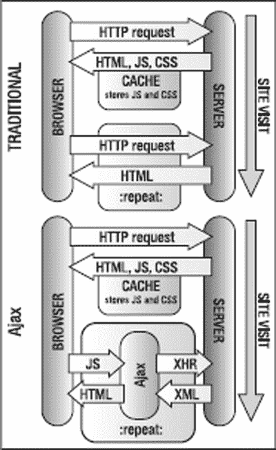

# 八、Ajax 和 Node.js 的后端交互

你终于读到了我谈论 Ajax 的那一章。好消息是，您可以使用 Ajax 创建非常漂亮的界面，并且可以将 JavaScript 的应用范围扩展到浏览器和当前显示的文档之外。

不太好的消息是，Ajax 依赖于 XMLHTTPRequest 对象(或简称为 XHR)或其微软对等物，并且它被“HTTP”所覆盖。这意味着没有服务器就不能使用任何 Ajax 示例。此外，要使用 Ajax，您需要一些服务器端脚本的基础知识(除非您使用现成的软件包——在本章的“概述”一节中有更多介绍)。

这也意味着使用 Ajax 剥夺了 JavaScript 的一项优势:创建可以在计算机的文件系统上，甚至从 CD 或记忆棒上离线工作的界面的能力。然而，Ajax 的好处弥补了这一点。

本章的另一部分是对 *Node.js* 或 *Node* 的介绍。Node 使 JavaScript 开发人员能够在服务器端编写代码。与 Ruby 或 PHP 类似，Node 允许您与数据库对话，并向应用程序的客户端发送信息。在本章的例子中，您将完全用 JavaScript 创建一个 HTTP 服务器。

首先，您需要设置一个本地服务器，因为 Ajax 示例使用 PHP 作为它们的服务器端语言。这并不像看起来那么难，因为有很多预打包的服务器可用。

我最喜欢的是 http://www.apachefriends.org/可以下载的《XAMPP》。你可以找一个安装程序，按照说明在几分钟内安装并运行你自己的服务器。

XAMPP 安装 Apache 2、MySQL、PHP 和所有你需要的附加软件，并且可以在许多平台上使用。它还配备了一个 FTP 和电子邮件服务器、一个统计软件包和许多其他选项，并且由 Apache Friends([http://www.apachefriends.org](http://www.apachefriends.org))的维护者不断更新。哦，是的，当然是免费的。

 **提示**同样，为了避免在阅读本章其余部分时遇到挫折，您应该亲自尝试一下本章中的许多代码示例，看看我在说什么。与其他章节的不同之处在于，代码示例不能在文件系统的本地计算机上运行；它们需要服务器，因为 Ajax 需要 HTTP 协议才能工作。如果你不想安装服务器，但是你已经在线了，你可以去本书的主页[http://www.beginningjavascript.com/](http://www.beginningjavascript.com/)，在那里你可以看到所有运行中的代码示例。

当您安装 xamp 时，您可以将章节示例解压缩到服务器安装的 htdocs 目录中的一个目录中，例如，名为 jsbook 的目录，该目录可能是 c:\ xamp \ htdocs \。要查看示例，请打开浏览器并键入*[http://localhost/jsbook/](http://localhost/jsbook/)*作为位置。

 **提示**除了在[http://www.apachefriends.org/en/faq-xampp.html](http://www.apachefriends.org/en/faq-xampp.html)阅读官方帮助常见问题外，Mac 用户还可以使用 MAMP，它也做同样的事情。你可以在 [http://www.mamp.info](http://www.mamp.info) 下载 MAMP。

家用清洁液，足球俱乐部，还是飞侠哥顿的飞船:什么是 Ajax？

Ajax 最初代表*异步 JavaScript 和 XML* ，这个术语是 Jesse James Garrett 在 2005 年 2 月的 Adaptive Path 上创造的([http://www . Adaptive Path . com/publications/essays/archives/000385 . PHP](http://www.adaptivepath.com/publications/essays/archives/000385.php))。它描述了一种不同于传统的开发 web 应用程序的方法。

正如文章中所解释的，传统的 web 应用程序和网站是同步工作的——每当你点击一个链接或提交一个表单时，浏览器将数据发送给服务器，服务器(希望如此)做出响应，然后整个页面被刷新。

Ajax 应用程序异步工作*，这意味着您可以在用户代理和服务器之间来回发送数据，而无需重新加载整个页面。您只替换页面中发生变化的部分。您还可以发送几个请求，继续滚动和使用页面，而其他部分在后台加载。*

 *一个很好的比喻是，Ajax 之于传统网页，就像即时消息之于电子邮件一样:即时反馈，没有很长的等待时间，有更多的交流选择。[图 8-1](#Fig1) 显示了与传统网站和网络应用程序相比，Ajax 应用程序的流程。



[图 8-1](#_Fig1) 。Ajax 与传统的请求

乍一看，这似乎给整个事情增加了一层额外的复杂性。然而，真正酷的是 Ajax 引擎和浏览器之间的通信是通过 JavaScript 触发的，而不是通过页面重载。

实际上，最终用户等待页面加载和呈现的时间更少，与页面的交互也更容易，因为她可以请求数据，并且仍然可以阅读文本或查看页面上的其他内容。这使得界面更加光滑，因为你可以在不改变整个网站的情况下在登录表单上给出反馈，同时能够在服务器或数据库中测试正确的条目。

让我们看一个简单的例子。演示文件 exampleXHR.html 使用 Ajax(没有 X，因为不涉及 XML)在用户点击链接时从服务器加载并显示文件，如图 8-2 所示。


[图 8-2](#_Fig2) 。通过 Ajax 加载外部文件

这一切背后的魔棒是我之前介绍的一个名为 XMLHttpRequest 的对象。这是一个非标准对象，因为它不是万维网联盟(W3C)网站上官方标准的一部分。(目前是工作草案；更多详情见[http://www.w3.org/TR/XMLHttpRequest/](http://www.w3.org/TR/XMLHttpRequest/)。)但是，所有现代浏览器都支持它。如果你需要支持 Internet Explorer 6，你应该寻找能做同样事情的 ActiveX object:ActiveX object(“微软。XMLHTTP”)。

 **警告**这样做的问题是，当用户在 Microsoft Internet Explorer 中启用了 JavaScript 但禁用了 ActiveX 时，他将无法体验到您的 Ajax 努力。如果您创建 Ajax 解决方案并获得用户错误报告，请记住这一点。

让我们一步一步地看这个例子，这样你就可以看到不同的部分是做什么的。HTML 包含指向文本文件的链接，并使用两个参数调用 simplexhr.doxhr 方法:文本要发送到的 HTML 元素的 ID 和文本的 URL。

*exampleXHR.html(节选)*

```js
<li>
    <a href="perfect_day.txt"
       onclick="simplexhr.doxhr('txtcontainer1', this.href ); return false;">Perfect Day</a>
</li>
<li>
    <a href="great_adventure.txt"
       onclick="simplexhr.doxhr('txtcontainer1', this.href ); return false;">Great Adventure</a>
</li>
```

 **注意**这些链接并非完全不引人注目，符合本书中其余代码示例的标准，但至少它们在没有 JavaScript 的情况下也能工作——当脚本不可用时，浏览器将简单地显示文本文件。创建依赖于脚本的链接是非常诱人的，尤其是在使用现成的 Ajax 库时。无论这项技术有多酷，这都不是一个好主意。

*simpleXHR.js*

```js
simplexhr = {
  doxhr : function( container, url ) {
   if( !document.getElementById || !document.createTextNode) {
     return;
   }
   simplexhr.outputContainer = document.getElementById( container );
   if( !simplexhr.outputContainer ){ return; }
```

脚本首先检查 DOM，并检查您想要写入内容的元素是否可用。如果元素可用，它将被存储在名为 outputContainer 的属性中，以便脚本中的所有其他方法都可以使用它。

*simpleXHR.js(续)*

```js
var request;
try{
  request = new XMLHttpRequest();
} catch ( error ) {
  try {
    request = new ActiveXObject("Microsoft.XMLHTTP" );
  } catch ( error ) {
    return true;
  }
}
```

定义一个名为 request 的新变量，并使用 try 和 catch 构造来查看支持哪个 XHR 版本。尝试分配一个新的 XMLHttpRequest。如果不支持这种情况，则会发生错误，触发 catch 语句。(你可以在本书的附录中了解更多关于 try and catch()的知识。)这个尝试分配 Microsoft ActiveX 对象。如果这也不可用，该方法返回 true，这意味着浏览器将只跟随链接并在浏览器中显示文本。

如果赋值成功，您就拥有了一个新的 XMLHttpRequest 对象。

 **注意**要获得 XMLHttpRequest 对象的方法、处理程序和属性的完整列表，您可以参考 W3C 站点的文档:[http://www.w3.org/TR/XMLHttpRequest/](http://www.w3.org/TR/XMLHttpRequest/)。你也可以参考 Mozilla 开发者网络的[https://developer.mozilla.org/en-US/docs/DOM/XMLHttprequest](https://developer.mozilla.org/en-US/docs/DOM/XMLHttprequest)或者微软网站的[http://msdn . Microsoft . com/en-us/library/ms 53587428v = vs . 8529 . aspx](http://msdn.microsoft.com/en-us/library/ms53587428v=vs.8529.aspx)。

第一步是调用 open()方法启动与服务器的连接，并检索或发送数据。open()方法有五个参数，其中三个是可选的:

request = open(requestMethod，url[，sync，[name，[password]])；

*   requestMethod 参数(以及其他一些超出本章范围的选项)可以是 GET 或 POST，对应于 HTTP 方法。
*   url 参数是文件在服务器上的位置。

 **注意** XMLHttpRequest 不允许你从其他服务器加载内容，因为那会是一个很大的安全问题。想象一下，电子邮件或网站中嵌入的 JavaScript 能够从您的计算机发送任何数据，或者从服务器检索更多代码。这个问题有解决办法。一种是通过在服务器上使用代理脚本来加载第三方内容。另一种方法是在服务器上启用跨源资源共享(CORS)。关于 CORS 的信息可以在 http://www.w3.org/TR/cors/的 W3C 网站上找到。

*   sync 参数是可选的，它是一个布尔值，定义请求应该异步发送还是同步发送。它被硬连接为 true——这意味着请求将被异步发送。同步请求会锁定浏览器。
*   name 和 password 参数是可选的，只有当您尝试调用的文件需要用户身份验证时才是必需的。

在这种情况下，您将只从服务器检索文件。为此，您使用 GET 作为请求方法，使用文件的位置作为 url 参数，省略可选参数。

*simpleXHR.js(续)*

```js
request.open('get', url );
```

请求对象的 readyState 属性包含一个数值，它描述了请求发生了什么。它在整个请求和响应过程中递增。readyState 的不同可能值及其对应的请求状态如下:

*   **0:** 对象已创建，但尚未调用 open 方法。
*   **1:** 发送方法尚未被调用。
*   发送方法被调用，但是数据还不可用。
*   **3:** 服务器正在发送数据。
*   **4:** 连接完成—数据已发送并已检索。

每当状态改变时，XHR 触发 readystatechange 事件。您可以使用相应的 onreadystatechange 事件处理程序来调用一个函数，在该函数中，您可以根据 readyState 的可能值进行测试，并采取适当的操作。

*simpleXHR.js(续)*

```js
request.onreadystatechange = function() {
  if( request.readyState == 1 ) {
    simplexhr.outputContainer.innerHTML = 'loading... ';
  }
```

一旦请求被初始化(readyState 等于 1)，给用户一些反馈是一个非常好的主意，即后台正在发生一些事情。在本例中，脚本显示“正在加载...”HTML 输出元素内的消息，如图[图 8-3](#Fig3) 所示。


[图 8-3](#_Fig3) 。通知用户请求已经发送并且正在进行中

其他状态不能跨浏览器安全地读取，这就是为什么您跳过 2 和 3 并通过比较 readyState 和 4 来检查请求是否完成。

*simpleXHR.js(续)*

```js
if( request.readyState == 4 ) {
  if ( /200|304/.test( request.status ) ) {
    simplexhr.retrieved(request);
  } else {
    simplexhr.failed(request);
  }
}
```

当请求完成时，检查另一个名为 status 的属性，它存储请求的状态。状态是响应的标准 HTTP 响应状态代码。当无法建立连接时，在其他错误条件下，或者当请求已被取消时，它为 0，当找不到文件时，它为 404。

 **注**关于标准 HTTP 响应状态码的完整列表，参见[http://www.w3.org/Protocols/rfc2616-sec10.html](http://www.w3.org/Protocols/rfc2616-sec10.html)。

如果状态为 200(一切正常)或 304(未修改)，则文件已被检索到，您可以对其进行操作。在这个演示脚本中，您调用 retrieved()方法。如果状态是任何其他值，则调用 failed()。

*simpleXHR.js(续)*

```js
  }
  request.send( null );
  return false;
},
```

send()方法将您的请求发送到服务器，并可以将请求参数发送到被调用的服务器端脚本。如果您没有任何要发送的参数，那么将其设置为 null 是最安全的。(Internet Explorer 接受不带任何参数的 send()，但这可能会在较旧的 Mozilla 浏览器中导致问题。)最后，将方法的返回值设置为 false 会阻止链接被跟踪。

*simpleXHR.js(续)*

```js
failed : function( requester ) {
  alert('The XMLHttpRequest failed. Status: ' + requester.status );
  return true;
},
```

如果请求没有成功，failed()方法会显示一个 alert()对话框，告诉用户这个问题。(这不是很聪明也不漂亮，但目前应该可以了。)在用户单击对话框的 OK 按钮后返回 true 会导致链接被跟随。您可以通过在浏览器中本地打开文件 exampleXHR.html(没有 [http://protocol](http://protocol) )并点击链接来测试这一点。因为没有 HTTP 传输，任何请求都会失败，代码为 0，如图[图 8-4](#Fig4) 所示。


[图 8-4](#_Fig4) 。通知用户 XMLHttpRequest 失败

但是，如果请求一切顺利，那么 retrieved()方法将接管。

*simpleXHR.js(续)*

```js
  retrieved : function( requester ) {
    var data = requester.responseText;
    data = data.replace( /\n/g, '<br>' );
    simplexhr.outputContainer.innerHTML = data;
    return false;
  }
}
```

这个方法使您能够获取和使用从 XMLHttpRequest 返回的数据。数据可以根据 responseType 以几种不同的格式读出。两种基于文本的格式是 responseText 和 responseXML。两者的区别在于输出的类型——responseText 返回一个字符串，而 responseXML 返回一个 XML 对象。可以在 responseText 上使用所有常用的字符串属性和方法，比如 length、indexof()、replace()等等，也可以在 responseXML 上使用所有的 DOM 方法，比如 getElementsByTagName()、getAttribute()等等。除了返回基于文本的响应，还可以使用 returnType blob 或 arrayBuffer 接收二进制数据。

在此示例中，您仅检索文本并使用 String.replace()方法将所有换行符转换为 BR 元素。然后，您可以将更改后的字符串作为 innerHTML 写出到 outputContainer，并返回 false 以停止正常的链接行为。

在许多情况下，使用 responseText 并通过 innerHTML 写出数据就足够了。与使用 XML 和 DOM 将对象转换回 HTML 相比，对于用户的浏览器和 CPU 来说，这也要快得多，工作量也少得多。

 **注意**Ajax 这个缩写并不真正适用于这些例子，因为这个过程缺少 XML 组件。出于这个原因，这种方法被称为*异步 HTML 和 HTTP (AHAH)* ，并被定义为*微格式*，在[http://microformats.org/wiki/rest/ahah](http://microformats.org/wiki/rest/ahah)有代码示例。

你呢？

通常，浏览器缓存是你的朋友。浏览器在其中存储下载的文件，这意味着用户不必一遍又一遍地下载你的脚本。然而，在 Ajax 的情况下，缓存会导致问题。

Safari 是罪魁祸首，因为它缓存了响应状态()，不再触发更改。(请记住，状态返回 HTTP 代码 200、304 或 404。)然而，避免缓存问题非常简单:在调用 send()方法之前，向请求添加另一个头。这个标题告诉浏览器测试自某个日期以来数据是否发生了变化。你设定的日期并不重要，只要它是在过去——例如，在本文写作时是这样写的:

```js
request.setRequestHeader( ‘If-Modified-Since’, ‘Mon, 12 Jan 2013 00:00:00 GMT’ );
request.send( null );
```

将 X 放回 Ajax 中

如果使用 responseXML，可以使用 DOM 方法将接收到的 XML 转换成 HTML。演示 exampleXMLxhr.html 就是这样做的。作为数据源，以 XML 格式的上一章分页示例中使用的相册集合为例。

*albums.xml(节选)*

```js
<?xml version="1.0" encoding="utf-8"?>
<albums>
  <album>
    <id>1</id>
    <artist>Depeche Mode</artist>
    <title>Playing the Angel</title>
    <comment>They are back and finally up to speed again</comment>
  </album>
  <album>
    <id>2</id>
    <artist>Monty Python</artist>
    <title>The final Rip-Off</title>
    <comment>Double CD with all the songs</comment>
  </album>
  [... more albums snipped ...]
</albums>
```

您希望通过 XHR 检索这些数据，并在页面中以表格的形式显示出来。[图 8-5](#Fig5) 显示了请求的不同阶段。


[图 8-5](#_Fig5) 。以表格形式检索和显示 XML 数据

剧本的主要部分不必改变。

*simplexmlxmhr . js】的缩写*

```js
simplexhr = {
  doxhr : function( container, url ) {
    if( !document.getElementById || !document.createTextNode ){
      return;
    }
    simplexhr.outputContainer = document.getElementById( container );
    if( !simplexhr.outputContainer ) { return; }
    var request;
    try {
      request = new XMLHttpRequest();
    } catch( error ) {
      try {
        request = new ActiveXObject("Microsoft.XMLHTTP" );
      } catch ( error ) {
        return true;
      }
    }
    request.open('get', url,true );
    request.onreadystatechange = function() {
      if(request.readyState == 1) {
        simplexhr.outputContainer.innerHTML = 'loading... ';
      }
      if(request.readyState == 4) {
        if( request.status && /200|304/.test( request.status ) ) {
          simplexhr.retrieved( request );
        } else {
          simplexhr.failed( request );
        }
      }
    }
    request.setRequestHeader('If-Modified-Since', 'Mon, 12 Jan 2013 00:00:00 GMT');
    request.send( null );
    return false;
  },
```

不同之处在于 retrieved()方法，该方法通过 responseXML 读取数据，并使用 XML 作为内容源写出数据表。移除加载消息，并使用 DOM createElement()和 createTextNode()方法创建主表。

*simpleXMLxhr.js(续)*

```js
retrieved : function( requester ) {
  var data = requester.responseXML;
  simplexhr.outputContainer.removeChild(simplexhr.outputContainer.firstChild);
  var i, albumId, artist, albumTitle, comment, td, tr, th;
  var table = document.createElement('table' );
  var tablehead = document.createElement('thead');
  table.appendChild( tablehead );
  tr = document.createElement('tr');
  th = document.createElement('th');
  th.appendChild( document.createTextNode('ID'));
  tr.appendChild( th );
  th=document.createElement('th');
  th.appendChild( document.createTextNode('Artist'));
  tr.appendChild( th );
  th = document.createElement('th');
  th.appendChild( document.createTextNode('Title'));
  tr.appendChild( th );
  th=document.createElement('th');
  th.appendChild( document.createTextNode('Comment'));
  tr.appendChild( th );
  tablehead.appendChild( tr );
  var tablebody = document.createElement('tbody');
  table.appendChild( tablebody );
```

请注意，当您动态创建表格时，Internet Explorer 不会显示它们，除非您将行和单元格嵌套在 TBODY 元素中。火狐不会介意的。

接下来，循环检索数据的所有相册元素。

*simpleXMLxhr.js(续)*

```js
var albums = data.getElementsByTagName('album');

for( i = 0 ; i < albums.length; i++ ) {
```

对于每个相册，通过标记名读取 XML 节点的内容，并通过 firstChild.nodeValue 检索它们的文本内容。

*simpleXMLxhr.js(续)*

```js
tr = document.createElement('tr');
albumId = data.getElementsByTagName('id')[i].firstChild.nodeValue;
artist = data.getElementsByTagName('artist')[i].firstChild.nodeValue;
albumTitle = data.getElementsByTagName('title')[i].firstChild.nodeValue;
comment = data.getElementsByTagName('comment')[i].firstChild.nodeValue;
```

通过 createElement()、createTextNode()和 appendChild()使用这些信息将数据单元格添加到表中。

*simpleXMLxhr.js(续)*

```js
  td = document.createElement('th');
  td.appendChild( document.createTextNode( albumId ) );
  tr.appendChild( td );
  td = document.createElement('td');
  td.appendChild( document.createTextNode( artist ) );
  tr.appendChild( td );
  td = document.createElement('td');
  td.appendChild( document.createTextNode( albumTitle ) );
  tr.appendChild( td );
  td = document.createElement('td');
  td.appendChild( document.createTextNode( comment ) );
  tr.appendChild( td );
  tablebody.appendChild( tr );
}
```

将结果表作为新的子元素添加到输出容器中，并返回 false 以阻止链接将 XML 作为新文档加载。失败的()方法保持不变。

*simpleXMLxhr.js(续)*

```js
    simplexhr.outputContainer.appendChild( table );
    return false;
  },
  failed : function( requester ) {
    alert('The XMLHttpRequest failed. Status: ' + requester.status );
    return true;
  }
}
```

您可以看到，通过在 DOM 脚本方面做“正确的事情”，脚本会变得相当复杂。您可以通过使用工具方法创建表行来减少代码量，但是这意味着更多的处理，因为这些方法必须在一个循环中调用。

如果像本例中那样了解 XML 结构，使用 innerHTML 和 string 方法转换数据可能会更快更容易。演示 exampleXHRxmlCheat.html 正是这样做的。大部分脚本保持不变，但是 retrieved()方法要短得多。

*simplexmlxhrchet . js(节选)*

```js
retrieved : function( requester ){
  var data = requester.responseText;
  simplexhr.outputContainer.removeChild(simplexhr.outputContainer.firstChild);
  var headrow = '<tr><th>ID</th><th>Artist</th><th>Title</th><th>Comment</th></tr>';
  data = data.replace( /<\?.*\?>/g, ' ' )
  data = data.replace( /<(\/*)id>/g, '<$1th>' )
  data = data.replace( /<(\/*)(artist|title|comment)>/g, '<$1td>' )
  data = data.replace( /<(\/*)albums>/g, '<$1table>' )
  data = data.replace( /<(\/*)album>/g, '<$1tr>' );
  data = data.replace( /<table>/g, '<table>' + headrow );
  simplexhr.outputContainer.innerHTML = data;
  return false;
},
```

您以 responseText 的形式检索数据，删除“加载。。."消息，然后创建一个标题表行作为字符串，并将其存储在变量 headrow 中。因为 responseText 是一个字符串，所以可以使用 String.replace()方法来更改 XML 元素。

首先通过删除任何以 and ending with ?>开头的内容来删除 XML 序言。

 **注意**这个例子使用了正则表达式，你可能还不知道，但我们将在下一章详细讨论。只要说正则表达式用斜线分隔并匹配某种文本模式就够了。如果斜线内有括号，这些字符串将存储在以$开头的变量中；这些可以在替换字符串中用来代替匹配模式的子字符串。例如，正则表达式 pattern / < (\/*)id > /g 匹配以<开头、后跟可选/(如果找到，则存储为$1)、后跟字符串 id 和结束字符>的所有内容。第二个参数<$ 1>，写出第<个>或第</第>个，这取决于原始 id 标签是开始标签还是结束标签。您可以执行简单的字符串替换，而不是使用正则表达式:

```js
data = data.replace('<id>', '<th>');
data = data.replace('</id>', '</th>');
```

按照这个模式替换其他元素:每个相册元素变成一个表，每个相册变成一个 tr，每个 id 变成一个 th；艺术家、标题和评论各成为一个 td。将 headrow 字符串追加到中，并使用 innerHTML 将最终结果存储在 outputContainer 元素中。

用 JSON 替换 XML

尽管 XML 是一种流行的数据传输格式——它是基于文本的，您可以确保有效性，并且系统能够通过 dtd、XML Schemata 或 RELAX NG 相互通信。Ajax 爱好者已经越来越意识到将 XML 转换成 JavaScript 对象是一件非常麻烦的事情。

与其将 XML 文件作为 XML 读取并通过 DOM 解析它，或者作为文本读取并使用正则表达式，不如将数据转换成 JavaScript 可以直接使用的格式，这样会容易得多，对系统的压力也小得多。这种格式被称为**JSON**(【http://json.org/】T2)。它允许数据集用对象文字符号表示。演示 exampleJSONxhr.html 使用前面例子中的 XML 作为 JSON:

```js
<albums>
  <album>
    <id>1</id>
    <artist>Depeche Mode</artist>
    <title>Playing the Angel</title>
    <comment>They are back and finally up to speed again</comment>
 </album>
  <album>
    <id>2</id>
    <artist>Monty Python</artist>
    <title>The final Rip-Off</title>
    <comment>Double CD with all the songs</comment>
  </album>
  <album>
    <id>3</id>
    <artist>Ms Kittin</artist>
    <title>I.com</title>
    <comment>Good electronica</comment>
  </album>
</albums>
```

转换成 JSON，如下所示:

*专辑。json*

```js
{
  "album":
   [
    {
      "id" : "1",
      "artist" : "Depeche Mode",
      "title" : "Playing the Angel",
      "comment" : "They are back and finally up to speed again"
    },
    {
      "id" : "2",
      "artist" : "Monty Python",
      "title" : "The final Rip-Off",
      "comment" : "Double CD wiid all the songs"
    },
    {
      "id" : "3",
      "artist" : "Ms Kittin",
      "title" : "I.com",
      "comment" : "Good electronica"
    }
  ]
}
```

好处是数据已经是 JavaScript 可以理解的格式。要将其转换为要显示的对象，只需对字符串使用 eval 方法。

*examplejsonxhr . js(excerpt)*

```js
retrieved : function( requester ) {
  var content = '<table><thead>';
  content += '<tr><th>ID</th><th>Artist</th>';
  content += '<th>Title</th><th>Comment</th>';
  content += '</tr></thead><tbody>';
  var data = JSON.parse(' (' + requester.responseText + ') ' );
```

这为您提供了作为对象的所有内容，您可以通过属性表示法或关联数组表示法(后者在 id 示例中显示，前者在所有其他示例中显示):

*examplejsonxhr . js(excerpt)*

```js
  var albums = data.album;
  for( var i = 0; i < albums.length; i++ ) {
    content += '<tr><td>' + albums[i]['id'] + '</td>';
    content += '<td>' + albums[i].artist + '</td>';
    content += '<td>' + albums[i].title + '</td>';
    content += '<td>' + albums[i].comment + '</td></tr>';
  }
  Content += '</tbody></table>';
  simplexhr.outputContainer.innerHTML = content;
  return false;
},
```

对于您自己服务器上的文件，使用 JSON 而不是 XML 要快得多。(在测试中，它被证明快了十倍。)但是，如果从第三方服务器使用 JSON，使用 eval()可能会很危险，因为它会执行任何 JavaScript 代码，而不仅仅是 JSON 数据。

您可以通过使用一个解析器来避免这种危险，该解析器确保只有数据被转换成对象，而恶意代码不会被执行。http://www.json.org/js.html 有一个开源版本。我们会在[第 11 章](11.html)回到 JSON。

使用服务器端脚本访问第三方内容

如前所述，出于安全原因，很难使用 XHR 从其他服务器加载内容。例如，如果您想从其他服务器检索 RSS 提要，您可以使用一个服务器端脚本来为您加载这些提要，或者连接到一个支持 CORS 的服务器。

 **注意**这是一个关于 Ajax 的常见神话:它并不取代服务器端代码，而是由服务器端代码提供支持，并为它提供一个更光滑的接口。XHR 本身只能从同一个服务器检索数据，或者向服务器端脚本发送信息。例如，您不能用 JavaScript 访问数据库——除非您使用名为 JSONP(带填充的 JSON)的方法，数据库提供者以 JavaScript 的形式提供输出，并且您将它包含在它自己的脚本标记中。在第十一章中有一个这样的例子。

服务器端组件是一个传递或代理脚本，它获取一个 URL，加载文档内容，然后将其发送回 XHR。该脚本需要设置正确的头来告诉 XHR 它返回的数据是 XML。如果找不到该文件，脚本将返回一个 XML 错误字符串。以下示例使用 PHP，但是任何服务器端语言都可以执行相同的任务。

*loadrss.php*

```js
<?php
// Set the XML header
header('Content-type: text/xml');
// Define an error message in case the feed cannot be found
$error='<?xml version="1.0"?><error>Cannot find feed</error>';
// Clear the contents
$contents = '';
// Read the url variable from the GET request
$rssurl = $_GET['url'];
// Test if the url starts with http to prevent surfers
// from calling and displaying local files
if( preg_match('/^http:/', $rssurl ) ) {
  // Open the remove file, and store its contents
  $handle = @fopen( $rssurl, "rb" );
    if( $handle == true ){
      while ( !feof($handle ) ) {
        $contents .= fread( $handle, 8192 );
      }
      fclose( $handle );
   }
}
// If the file has no channel element, delete contents
if( !preg_match('/<channel/', $contents ) ){ $contents = ''; }
// Return either the contents or the error
echo $contents == '' ? $error : $contents;
?>
```

演示 exampleExternalRSS.html 使用这个脚本从 Yahoo 网站上检索 RSS 格式的最新标题。

HTML 中的相关部分是调用 doxhr()方法的链接，该方法带有输出新闻的元素和作为参数的 RSS URI。

*examples external RSS . html(excerpt)*

```js
<p>
  <a href="http://rss.news.yahoo.com/rss/topstories"
     onclick="return readrss.doxhr('newsContainer',this.href)">
     Get Yahoo news
  </a>
</p>
<div id="newsContainer"></div>
```

 **注意** RSS 是真正简单聚合的缩写。本质上，它是一个 XML，其中包含您想要与世界共享的内容，通常是新闻标题。RSS 的规范可以在[http://blogs.law.harvard.edu/tech/rss](http://blogs.law.harvard.edu/tech/rss)找到，你可以在维基百科上读到更多关于它的好处:[http://en.wikipedia.org/wiki/RSS](http://en.wikipedia.org/wiki/RSS)。

本例中的重要细节是，RSS 是一种标准化格式，并且您知道 XML 结构——即使您是从第三方网站获得的。每个有效的 RSS 文档都包含一个 items 元素以及嵌套的 item 元素。每一个都至少包含一个描述完整信息的标题和一个指向完整信息的链接。你可以使用这些来显示一个可点击的标题列表，将用户带到雅虎网站，在那里她可以阅读完整的新闻文章，如图 8-6 所示。


[图 8-6](#_Fig6) 。检索和显示 RSS 源数据

这个剧本又是一个简单的 XHR。不同之处在于，您不是直接链接到 URL，而是将它作为 GET 参数传递给 PHP 脚本:

外部 RSS.js

```js
readrss = {
  doxhr:function( container, url ) {
    [... code snipped as it is the same as in the last example ...]
    request.open('get', 'loadrss.php?url=' + encodeURI( url ) );
    request.setRequestHeader('If-Modified-Since', 'Mon, 12 Jan 2013 00:00:00 GMT' );
    request.send( null );
    return false;
  },
```

检索到的()函数需要更改。首先，它删除了“加载。。."消息，并使用 responseXML 检索 XML 格式的数据。因为 PHP 脚本返回 XML 格式的错误消息，所以您需要测试返回的 XML 是否包含错误元素。如果是这种情况，读取第一个错误元素的第一个子元素的节点值，并将其写入由段落标记包围的 outputContainer。

*externalRSS.js(续)*

```js
retrieved : function( requester ) {
  readrss.outputContainer.innerHTML = '';
  var data = requester.responseXML;
  if( data.getElementsByTagName('error').length > 0 ) {
    var error = data.getElementsByTagName(‘error’)[0].firstChild.nodeValue;
    readrss.outputContainer.innerHTML = '<p>' + error + '</p>';
```

如果没有错误元素，则检索返回的 XML 中包含的所有 item 元素，并检查结果列表的长度。如果少于一项，则从方法返回，并允许链接在浏览器中加载 XML 文档。这是确保返回的 RSS 有效的必要步骤——因为您没有在服务器端脚本中检查这一点。

*externalRSS.js(续)*

```js
} else {
var items = data.getElementsByTagName('item');
var end = items.length;
if( end < 1 ){ return; }
```

如果有要显示的项目，您可以定义必要的变量并遍历它们。因为有些 RSS 提要有很多条目，所以限制显示多少条目是有意义的；在这种情况下，您选择 5。您阅读了每个条目的链接和标题，并添加了一个新的列表条目，其中嵌入了一个链接，该链接分别作为它的 href 属性和文本内容。注意，这个例子只是简单地组装了一个 HTML 字符串；当然，您可以走“更干净”的路，创建元素并应用文本节点。

*externalRSS.js(续)*

```js
var item, feedlink, name, description, content = '';
for( var i = 0; i < 5; i++ ) {
  feedlink = items[i].getElementsByTagName('link').item(0).firstChild.nodeValue;
  name = items[i].getElementsByTagName('title').item(0).firstChild.nodeValue;
  item = '<li><a href="' + feedlink+'">' + name + '</a></li>';
  content += item;
}
```

将最后的内容字符串插入到 outputContainer 的 UL 标签中，这样就有了可点击的新闻标题。

*externalRSS.js(续)*

```js
  readrss.outputContainer.innerHTML = '<ul>' + content + '</ul>';
  return false;
}
```

脚本的其余部分保持不变；failed()方法仅在 XHR 不成功时显示警告。

*externalRSS.js(续)*

```js
  },
  failed : function( requester ) {
    alert('The XMLHttpRequest failed. Status: ' + requester.status );
    return true;
  }
}
```

XHR 的慢速连接

可能出现的一个问题是，XHR 的连接可能需要很长时间，用户会看到加载消息，但什么也没有发生。您可以通过使用 window.timeout()在一定时间后停止执行来避免此问题。演示 exampleXHRtimeout.html 展示了一个使用这种技术的例子。除了使用窗口对象之外，XHR 级别 2 还包括一个超时属性和一个 ontimeout 事件。目前，Chrome 和 Safari 不支持 XHR 超时，而 Opera、Firefox 和 Internet Explorer 10 支持。

该请求的默认设置是 10 毫秒，这会导致超时，如[图 8-7](#Fig7) 所示。您可以使用示例中的第二个链接将超时设置为 10 秒并重试，如果您的连接不是非常慢或者 Yahoo 没有停机，您将会获得头条新闻。


[图 8-7](#_Fig7) 。允许 XHR 连接超时

该脚本的不同之处在于，您需要一个属性来定义在触发超时之前要等待多长时间，一个属性来存储 window.timeout，还有一个布尔属性来定义是否有超时。Boolean 必须在 doxhr()方法中，因为每次调用 doxhr()时都需要初始化它。

xhrtimeout . js

```js
readrss = {
  timeOutDuration : 10,
  toolong : false,
  doxhr : function( container, url ) {
    readrss.timedout = false;
    if( !document.getElementById || !document.createTextNode ){
      return;
    }
    readrss.outputContainer = document.getElementById( container );
    if( !readrss.outputContainer ){ return; }
    var request;
    try {
      request = new XMLHttpRequest();
    } catch( error ) {
      try {
        request = new ActiveXObject("Microsoft.XMLHTTP");
      } catch( error ) {
        return true;
      }
    }
```

在 onreadystatechange 事件侦听器中，添加超时并将其分配给主对象的 toolong 属性。在超时内，定义一个匿名函数来检查 readystate 并将其与 1 进行比较。这是一个场景，当定义的时间过去了，请求仍然在第一个阶段，而不是第四个也是最后一个阶段。发生这种情况时，调用请求的 abort()方法，将 timedout 属性设置为 true，并向显示元素写出一条消息，说明请求花费的时间太长。

*XHRtimeout.js(续)*T2】

```js
request.onreadystatechange = function() {
  if( request.readyState == 1) {
      readrss.toolong = window.setTimeout( function(){
        if( request.readyState == 1 ) {
          readrss.timedout = true;
          request.abort(); // Stop
          readrss.outputContainer.innerHTML = 'The request took too long';
         }
        },
       readrss.timeOutDuration
      );
    readrss.outputContainer.innerHTML = 'loading... ';
  }
```

当请求成功结束并且没有任何超时(存储在 timedout 属性中)时，清除超时。

*XHRtimeout.js(续)*

```js
    if( request.readyState == 4 && !readrss.timedout ) {
    window.clearTimeout( readrss.toolong );
    if( /200|304/.test( request.status ) ) {
        readrss.retrieved( request );
      } else {
        readrss.failed( request );
      }
    }
  }
  request.open('get', 'loadrss.php?url='+encodeURI( url ) );
  request.setRequestHeader('If-Modified-Since', 'Mon, 12 Jan 2013 00:00:00 GMT' );
  request.send( null );
  return false;
},
```

脚本的其余部分保持不变。

一个更大的 Ajax 例子:连接的选择框

让我们来看一个更大的 Ajax 例子——我称它为 Ajax，尽管您不会使用 XML。连接的选择框是一个经典的例子，它展示了 JavaScript 可以如何让界面变得更快。它们的一个常见用途是航班报价网站，在这里您在选择框中选择一个机场，页面会立即在第二个选择框中显示从该机场出发的目的地机场。传统上，这是通过将所有 airport 连接数据保存在 JavaScript 数组中并操纵 select 元素的 options 数组来实现的。更改第一个机场选择框会自动将第二个机场选择框更改为可用目的地。

当你有鼠标和可用的 JavaScript 时，这是非常好的；然而，当两者中的一个缺失时，这可能是非常令人沮丧的，或者当两者都不可用时，这甚至是不可能的。这个例子将展示如何创建相互依赖的选择框，这些选择框在没有鼠标和 JavaScript 的情况下也能工作，并且在 JavaScript 可用时不会重新加载整个页面。

诀窍是让功能在服务器端工作，然后添加 JavaScript 和 XHR 技巧来阻止整个页面重新加载。因为你不知道用户是否真的能应付这个，你甚至可以让它可选而不是给定。

 **注意**这种 Ajax 方法比原来的方法更具有可访问性。原因是你不想再一次犯 DHTML 最大的错误——使用一种技术而不考虑那些不能处理它的人。Jeremy Keith 在他的 DOM 脚本书中创造了这种方法 *HIJAX* ，但是到目前为止，它还没有像 Ajax 这个术语一样得到公众的广泛关注。

第一步是创建一个执行所有功能的服务器端脚本。因为这不是一本关于 PHP 的书，这里就不赘述了。只要说主文档 exampleSelectBoxes.php 包含一个更小的 PHP 脚本 selectBoxes.php 就够了。后者以数组的形式包含所有的机场数据(但也可以很容易地进入数据库来检索这些数据)，并根据用户的选择和发送表单写出界面的不同状态，如图 8-8 所示。


[图 8-8](#_Fig8) 。连接的选择框

主页展示了带有 DIV 的表单，DIV 的 id 可用于 XHR 输出。

*exampleSelectBoxes.php(节选)*

```js
<form action="exampleSelectBoxes.php" method="post">
  <div id="formOutput">
   <?php include('selectBoxes.php');?>
  </div>
  <p class="submit"><input type="submit" name="select" id="select" value="Choose" /></p>
</form>
```

 **注意**这个例子使用 POST 作为发送数据的方法。

PHP 脚本返回了一个 HTML 界面，您可以在这个过程的每个阶段进入这个界面:

*   如果还没有发送任何表单数据，它会显示一个 ID 为 airport 的选择框，列出数据集中的所有机场。
*   如果选择了一个机场并发送给服务器，脚本会将选择的机场显示在一个强元素中，并显示为一个隐藏的表单字段。它还将此选择的可能目的地机场显示为一个 ID 为 destination 的选择框。此外，它还创建了一个指向主文档的链接，用 ID 开始一个新的选择。
*   如果用户选择一个机场和一个目的地，并将它们发送回服务器，脚本只是暗示更多的功能，因为在这个例子中不需要更多的功能。但是，它提供了返回初始页面的链接。

如果 JavaScript 可用，该脚本应该执行以下操作:

*   在表单中创建一个新的复选框，允许用户打开 Ajax 功能——在本例中，只需重新加载由 selectBoxes.php 创建的表单部分。
*   如果选中了该复选框，脚本应该用事件处理程序调用的函数覆盖表单的正常提交过程。作为一个加载指示器，它应该将 Submit 按钮的文本改为“loading”
*   它还应该向返回第一阶段的链接添加一个搜索参数，以确保当用户单击该链接时，他不必再次选择复选框。

先说剧本的骨架。您需要一个复选框的标签、一个包含它的段落的类(实际上不是必需的，但是它允许样式化)、表单元素容器的 id 和返回到流程开始的链接。

作为方法，您需要一个 init()方法，带有检索和失败处理程序的主 XHR 方法，以及用于事件处理的 cancelClick()和 addEvent()。

*select boxes . js(skeleton)*

```js
dynSelect = {
  AJAXlabel : 'Reload only the results, not the whole page',
  AJAXofferClass : 'ajax',
  containerID : 'formOutput',
  backlinkID : 'back',
  init : function(){},
  doxhr : function( e ){},
  retrieved : function( requester, e ){},
  failed : function( requester ){},
  cancelClick : function( e ){},
  addEvent : function(elm, evType, fn, useCapture ){}
}
dynSelect.addEvent( window, 'load', dynSelect.init, false );
```

现在开始充实骨架。

*selectBoxes.js*

```js
dynSelect = {
  AJAXlabel : 'Only reload the results, not the whole page',
  AJAXofferClass : 'ajax',
  containerID : 'formOutput',
  backlinkID : 'back',
```

init()方法测试 W3C DOM 是否受支持，检索第一个表单，并将 ID 为 select 的 Submit 按钮存储在一个属性中——这是在最后一步中删除按钮所必需的。然后，它创建一个新段落，并为前面定义的 Ajax 触发器应用该类。

*selectBoxes.js(续)*

```js
init : function(){
  if( !document.getElementById || !document.createTextNode ){
   return;
  }
  var f = document.getElementsByTagName('form')[0];
  dynSelect.selectButton = document.getElementById('select');
  var p = document.createElement('p');
  p.className = dynSelect.AJAXofferClass;
```

议程上的下一步是提供打开 Ajax 选项的复选框。将复选框的名称和 ID 设置为 xhr，并确定当前 URI 是否已经具有？ajax 搜索字符串。如果有，将复选框预设为已选中。(这是必要的，以确保返回第一步的链接不会阻止 Ajax 增强的工作。)

*selectBoxes.js(续)*

```js
dynSelect.cb = document.createElement('input');
dynSelect.cb.setAttribute('type', 'checkbox');
dynSelect.cb.setAttribute('name', 'xhr');
dynSelect.cb.setAttribute('id', 'xhr');
if( window.location.search != '' ) {
  dynSelect.cb.setAttribute('defaultChecked', 'checked' );
  dynSelect.cb.setAttribute('checked', 'checked');
}
```

将复选框添加到新段落中，并在其后添加一个带有适当文本的标签。新段落成为表单的第一个子节点，当表单被提交时，您应用一个触发 dohxhr()方法的事件处理程序。

*selectBoxes.js(续)*

```js
  p.appendChild( dynSelect.cb );
  var lbl = document.createElement('label');
  lbl.htmlFor = 'xhr';
  lbl.appendChild( document.createTextNode( dynSelect.AJAXlabel ) );
  p.appendChild( lbl );
  f.insertBefore( p, f.firstChild );
  dynSelect.addEvent(f, 'submit', dynSelect.doxhr, false );
},
```

dohxr()方法测试复选框是否被选中，如果没有，则简单地返回。如果是，您为当前机场和当前目的地定义两个变量，并将输出元素存储在一个属性中。测试输出容器是否存在，如果不存在则返回。

*selectBoxes.js(续)*

```js
doxhr : function( e ) {
  if( !dynSelect.cb.checked ){ return; }
  var airportValue, destinationValue;
  dynSelect.outputContainer = document.getElementById(dynSelect.containerID );
  if( !dynSelect.outputContainer ){ return; }
```

下面是 XHR 代码，它定义了正确的对象并设置 onreadystatechange 事件侦听器。

*selectBoxes.js(续)*

```js
var request;
try {
  request = new XMLHttpRequest();
} catch( error ) {
  try {
    request = new ActiveXObject("Microsoft.XMLHTTP");
  } catch( error ) {
    return true;
  }
}
request.onreadystatechange = function() {
  if( request.readyState == 1 ) {
    dynSelect.selectButton.value = 'loading... ';
  }
  if( request.readyState == 4 ) {
    if( request.status && /200|304/.test( request.status ) ) {
      dynSelect.retrieved( request );
    } else{
      dynSelect.failed( request );
    }
  }
}
```

确定文档是否包含机场和目的地选择框；如果是，将它们的当前状态存储在变量 airportValue 和 destinationValue 中。请注意，您需要在航班选择过程的第二阶段检查 airport 字段的类型，因为它是一个隐藏字段。

*selectBoxes.js(续)*

```js
var airport = document.getElementById('airport');
if( airport != undefined ) {
  if( airport.nodeName.toLowerCase() == 'select' ) {
    airportValue = airport.options[airport.selectedIndex].value;
  } else {
    airportValue = airport.value;
  }
}
var destination = document.getElementById('destination');
if( destination ) {
  destinationValue = destination.options[destination.selectedIndex].value;
}
```

因为表单是使用 POST 而不是 GET 发送的，所以您需要稍微不同地定义请求。首先，您需要将请求参数组装成一个字符串。(这是当 send 方法为 GET 时，URI 上变量的轨迹——例如，[http://www.example.com/index.php?search](http://www.example.com/index.php?search)+DOM&values = 20&start = 10。)

*selectBoxes.js(续)*T2】

```js
var parameters = 'airport=' + airportValue;
if( destinationValue != undefined ) {
  parameters += '&destination=' + destinationValue;
}
```

接下来，打开请求。除了使用修改后的头防止缓存，还需要告诉服务器内容类型是 application/x-www-form-urlencoded；然后，您将所有请求参数的长度作为伴随 Content-length 的值进行传输。您还需要告诉服务器在检索完所有数据后关闭连接。与 GET 请求不同，send()在发布时需要一个参数，这是 URI 编码的参数。

*selectBoxes.js(续)*T2】

```js
request.open('POST', 'selectBoxes.php');
request.setRequestHeader('If-Modified-Since', 'Mon, 12 Jan 2013 00:00:00 GMT');
request.setRequestHeader('Content-type', 'application/x-www-form-urlencoded');
request.setRequestHeader('Content-length', parameters.length );
request.setRequestHeader('Connection', 'close');
request.send( encodeURI( parameters ) );
```

 **注意**如果你不知道这里发生的一切，不要自责；毕竟是服务器和 HTTP 代码，你才刚刚开始用 JavaScript。只要你这样使用它，你可能永远也不会真正理解它的含义。

如果您在最后一个页面之前，并且机场和目的地都可用，请移除提交按钮以防止出错。

 **注意**这是这个例子的修饰步骤。一个真正的应用程序也应该完成下面的步骤，但是你现在不需要走那么远。

最后，调用 cancelClick()来阻止正常的表单提交。

*selectBoxes.js(续)*T2】

```js
  if( airport && destination ) {
    var sendButton = document.getElementById('select');
    sendButton.parentNode.removeChild( sendButton );
  }
  dynSelect.cancelClick( e );
},
```

retrieved()方法与其他示例没有太大区别。在检索请求的 responseText 并用新的表单元素替换旧的表单元素之前，通过将 Submit 按钮的值改回 Select 来撤销上一步中所做的操作。补充？指向第一步的链接的 href 的 ajax，以确保激活该链接不会关闭之前选择的功能。(现在，您知道用户想要 Ajax 界面。)

*selectBoxes.js(续)*

```js
retrieved : function( requester, e ) {
  dynSelect.selectButton.value = 'Select';
  var content = requester.responseText;
  dynSelect.outputContainer.innerHTML = content;
  var backlink = document.getElementById( dynSelect.backlinkID );
  if( backlink ) {
    var url = backlink.getAttribute('href');
    backlink.setAttribute('href', url+'?ajax');
  }
  dynSelect.cancelClick( e );
},
```

脚本的其余部分由熟悉的 failed()、cancelClick()和 addEvent()实用程序方法组成。

*selectBoxes.js(续)*

```js
  failed : function( requester ){
    alert('The XMLHttpRequest failed. Status: ' + requester.status);
    return true;
  },
  cancelClick : function( e ){
    [... code snipped ...]
  },
  addEvent: function( elm, evType, fn, useCapture ){
    [... code snipped ...]
  }
}
dynSelect.addEvent( window, 'load', dynSelect.init, false );
```

这个例子表明 Ajax 非常依赖于服务器代码。如果你知道你会得到什么，就很容易创建一个有用的和有吸引力的界面。

您还可以以一种不引人注目和可选的方式使用 Ajax 方法，使旧的效果更引人注目，并更好地针对那些想要它们的人。

Node.js

本书大部分时间我们都在讨论如何在客户端使用 JavaScript，以及如何用它来增强您的 web 应用程序。这将是一个简短的介绍，介绍如何使用您新获得的技能来开发将在服务器上运行的应用程序。因为这不是在您的浏览器中运行，所以首先解释一下正在发生的事情并进行设置会有所帮助。

Node.js 建立在谷歌的 Chrome JavaScript 引擎 V8 之上。正因为如此，Node 让您只需使用 JavaScript 就可以创建一个 web 服务器，而不需要安装任何其他服务器软件。

由 Ryan Dahl 创建的目标是制作一个类似 Gmail 的 web 应用程序，Node 是一个开源项目，可以在多种环境下运行，可以由 Heroku、亚马逊的 AWS、Nodejitsu 和 Joynet 等公司托管，Joynet 也是该项目的赞助商。最著名的是 LinkedIn 将 Node 用于其移动应用。

安装 Node.js 并开始使用

进入[http://www.nodejs.org/download](http://www.nodejs.org/download)，然后在你的系统上下载并安装 Node，你就可以快速上手了。之后，你应该准备做一些快速的例子。

我们将立即投入工作，确保一切正常。首先，让我们确保节点已安装，并检查当前版本。在撰写本文时，我使用的是版本 0.10.2。您可以通过在命令行中键入 node-version 来亲自尝试一下。

此时，您应该已经安装了节点，可以开始工作了。让我们跳过“Hello World”的例子，直接进入你将在每个节点教程中看到的另一个例子:如何制作 web 服务器。

*httpServer.js*

```js
var http = require('http');

var server = http.createServer(function (request, response){
      response.writeHead(200,{"Content-Type": "text/plain"});
      response.end("It's the information age!");
});
server.listen(8080);
```

从纯代码的角度来看，它看起来像普通的 JavaScript。那么这怎么能创建一个 web 服务器呢？让我们深入细节。

首先，您需要 HTTP 模块。模块为您的应用程序增加了功能。HTTP 模块内置在节点中；但是，有一个节点包管理器(npm)允许您安装其他模块。下一个创建的变量叫做 server，它是 http object 上调用 createServer 返回的 HttpServer *，*的一个实例。createServer 方法接受匿名函数，该函数可以接受两个参数:请求和响应。

在我们讨论这两行代码之前，让我们先讨论一下代码中的最后一行:

```js
server.listen(8080);
```

这告诉服务器监听端口 8080。这意味着，如果你在浏览器中输入“localhost:8080”，它会将你导向当前正在运行的服务器。当这种情况发生时，服务器必须做出响应。每次向服务器发出请求时都会调用这个函数。它被传递一个请求对象，其中包含请求的细节，还有一个响应对象，用于在处理程序处理请求时做出响应。在这种情况下，请求处理程序无条件地用状态代码 200(“OK”状态代码，表示成功)和包含字符串的响应正文来响应每个请求。

模块

我们谈到了让您能够向基于节点的应用程序添加功能的模块。它们还能让你保持自己的文件井然有序。让我们把当前的文件做成一个模块。

*http 服务器模块. js*

```js
var http = require('http');

function startUp(){
   function onRequest(request, response){
      response.writeHead(200,{"Content-Type": "text/plain"});
      response.end("It's the information age!");
  }
      http.createServer(onRequest).listen(8080);
}
exports.startup = startUp;
```

现在让我们创建一个 index.js 文件来启动它。

*index.js*

```js
var server = require("./httpServerModule");
server.startup();
```

可以看到模块大部分都是一样的。主要要注意的是最后一行:

```js
exports.startup = startUp;
```

这里，您将属性 startUp 添加到对象导出中。任何使用 require()访问模块的人都可以使用该对象。模块范围内没有添加到导出中的变量对于模块来说仍然是私有的。

另一个文件 Index.js 类似于我们最初的项目。您需要加载该模块。那个。/告诉 Node 查找相对于包含当前文件的目录的模块。如果没有找到，Node 首先在核心模块中搜索，然后在其他文件夹中寻找匹配。可以在节点站点上找到完整的描述([http://nodejs . org/API/modules . html # loading _ from _ Node _ modules _ Folders](http://nodejs.org/api/modules.html#loading_from_node_modules_Folders))。第二行只是调用你的启动函数，模块完成工作。如果您愿意，也可以从命令行使用 REPL (Read-Eval-Print-Loop)来运行它。在命令行中，只需键入**节点**，然后就可以像在索引文件中一样运行每一行。然后检查你的浏览器。

在概念上，它类似于创建对象来保存您的功能。这样，在全局名称空间中就不会有太多的变量。

回调

在前面的例子中，您有匿名函数来处理您的请求的结果。这很好，但是如果有很多事情在进行，就很难阅读。回调让你以一种易于阅读的方式分离一些函数。下一个示例展示了如何使用 Node 向 web 服务器发出请求，并使用回调在命令行中显示结果。

在这里，您将创建一个与之前创建的模块相似的模块。这一次，在发出 HTTP 请求时，您分配了两件事情。第一个选项描述您感兴趣的主机服务器和该服务器上的路径。接下来是回调函数。该函数接收从服务器返回的响应，并为该响应分配了两个事件。

http request . js

```js
var http = require('http');

var options = {
      host: 'www.apress.com',
      path: '/9781430250920'
  };
    callback = function(response) {
      var str = ''
        response.on('data', function (chunk) {
        str += chunk;
   });

   response.on('end', function () {
      console.log(str);
   });
}

function client (){
     var req = http.request(options, callback);
           req.end();
}

exports.client = client;
```

这类似于常规 JavaScript 中的事件侦听器。您寻找“数据”事件并获取从服务器返回的数据。在本例中，您将它附加到 str 变量。

第二个事件 end 让您知道来自服务器的数据流已经结束。命令行的结果是一个长字符串，由您刚刚请求的网页内容组成。

因为这是一个模块，您可以从这里访问它。

*服务器请求索引.js*

```js
var server = require("./httpRequest");
server.client ();
```

调试

Node 简介的最后一部分是谈论如何调试你的应用。运行调试器的最快方法是在命令行节点 debug filename.js。在您的代码中，您可以在想要检查代码的位置添加调试器命令。这可能不是调试应用程序最直观的方式。像 Eclipse、JetBrain 的 IntelliJ Idea 和 WebStorm 产品这样的 ide 都有调试选项，在这些选项中，您可以设置断点，并像使用其他服务器端语言一样使用 Node.js。你可以在 gitHub 上找到 Eclipse 的详细说明:[https://gitHub . com/joyent/Node/wiki/Using-Eclipse-as-Node-Applications-Debugger](https://github.com/joyent/node/wiki/Using-Eclipse-as-Node-Applications-Debugger)。你可以在这里找到 JetBrain 产品的详细信息:[http://www . jetbrains . com/idea/web help/running-and-debugging-node-js . html](http://www.jetbrains.com/idea/webhelp/running-and-debugging-node-js.html)。

使用 Node 的另一种方法是安装节点检查器。请注意，在撰写本文时，它不再被维护。但是，如果您想尝试一下，请转到命令行并键入**NPM install–g node-inspector**。–g 标志将确保它是一个全局安装。

安装后，您将需要两个命令行窗口来完成这项工作。在第一个窗口中，可以输入**节点*****–debug filename . js***或者**节点*****–debug-brk filename . js****。*第二个选项告诉调试器在程序开始时使用断点。

在第二个窗口中，键入**节点检查器**。你会得到消息“访问 [http://0.0.0.0:8080/debug？port=5858](http://0.0.0.0:8080/debug?port=5858) 。"将它复制并粘贴到 Chrome 中，您将获得带有断点的 Chrome 调试器。(参见[图 8-9](#Fig9) 。)如果您没有得到，而是得到“connect ECONNREFUSED”，请确保您没有在端口 5858 上运行任何其他程序。您可能需要关闭任何打开端口的应用程序。

[图 8-10](#Fig10) 显示了 JetBrain 的 IntelliJIdea 中的编辑功能。


[图 8-9](#_Fig9) 。用于调试 Node.js 应用程序的 Chrome 调试器


[图 8-10](#_Fig10) 。JetBrain 的 IntelliJIdea 具有 Node.js 编辑和调试功能

摘要

我希望这让您了解了使用 JavaScript 和 XMLHttpRequest 可以在后端和浏览器之间创建动态连接，而无需重新加载页面。另外，我希望这一章能帮助你理解如何通过 Node.js 将你的 JavaScript 技能带到服务器端。

尽管 Ajax 很酷，但有一些事情需要记住:

*   最初，Ajax 是作为开发 web 应用程序的方法而发明的，而不是网站。将每一个小表单和菜单“Ajax 化”可能有些过头了。
*   Ajax 是客户端脚本和后端之间的连接器；它的功能取决于后端脚本或信息。
*   Ajax 可以用来连接到与使用它的脚本相同的服务器上的数据源。您还可以使用服务器上的脚本来连接到不同的服务器，或者您可以拥有以 JSON 格式提供数据的第三方服务。最后，如果服务器支持 CORS，您可以连接到其他服务器上的数据。
*   创建一个看起来令人印象深刻但很突兀的 Ajax 应用程序是非常诱人和容易的——依赖于鼠标和可用的 JavaScript。创建一个可访问的 Ajax 界面是一项非常困难的任务。

Ajax 非常有用，许多有天赋的开发人员正在开发框架和库，它们可以帮助您快速创建 Ajax 应用程序，而无需了解它的所有细节——使用它们甚至可以防止您重复这些开发人员过去犯过的错误。可用的库的数量是惊人的，并且很难说哪一个是适合手头任务的。

Node.js 本身并不是一个框架，就像 Rails 对于 Ruby 一样。它确实为您提供了使用 JavaScript 开发任何类型的应用程序的低级权限。有一些框架可以帮助你组织你的代码和构建像 express([http://expressjs.com/](http://expressjs.com/))这样的大规模应用程序。

在下一章中，我们将最终仔细研究正则表达式以及如何使用它们来验证数据。您将学习如何创建一个联系人表单作为示例应用程序，并可能重用这里实现的一些 XHR 功能，使其比一般的联系人表单更加光滑。*