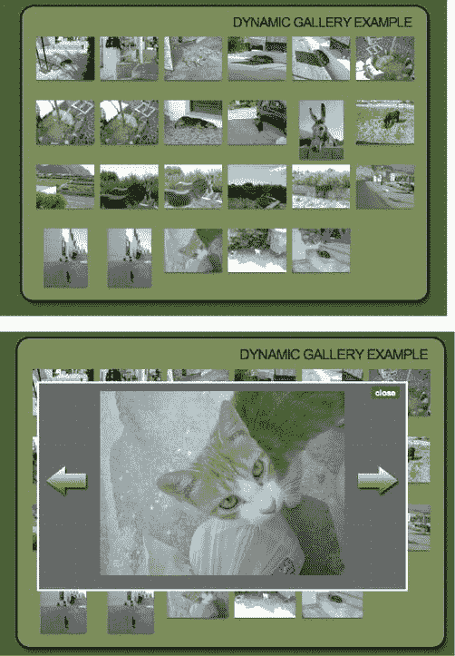
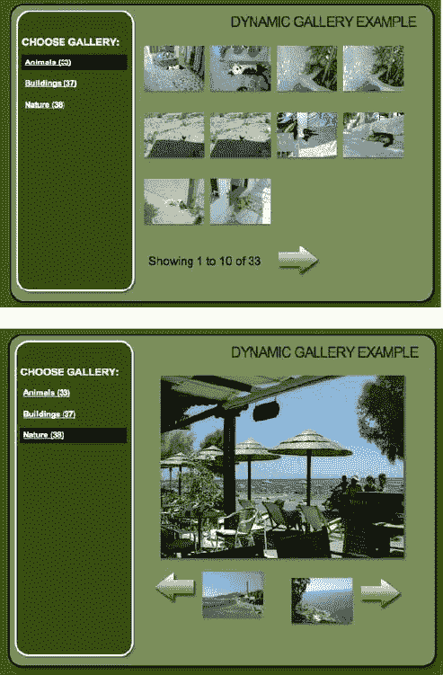
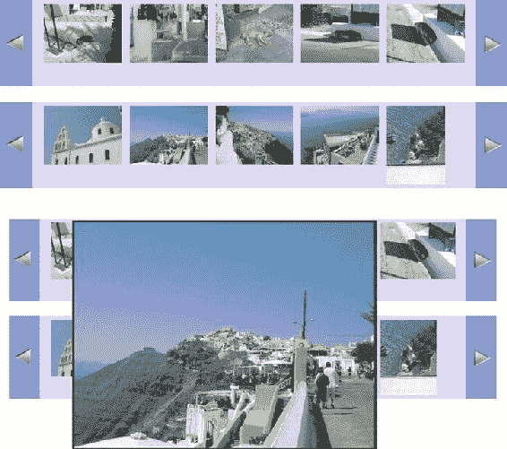

第十章


现代 JavaScript 案例研究:动态图库

在本章中，你将学习如何开发一个由 PHP 脚本支持的 JavaScript 增强的缩略图库。您将从学习与静态图库相关的技术以及如何增强它们开始。然后，您将继续学习使用 PHP 和 Ajax 从服务器动态获取图像的图库。

 **注**你可以在[http://www.beginningjavascript.com](http://www.beginningjavascript.com)下载本章演示代码或者在线查看结果。因为这一章包含了图片库，所以下载在较大的一边，但是它允许你在本地服务器上看到所有的代码——包括服务器端的 PHP。

缩略图基本知识

让我们从基础开始，计划我们的缩略图画廊。我考虑了很长时间是否应该在这本书里包含一个，因为 JavaScript 和 CSS 书籍有图库作为例子几乎已经成为陈词滥调。然而，我写这一章是为了举例说明如何用现代脚本和 CSS 来丰富一个非常普通的解决方案，比如缩略图画廊，并且独立于它们。许多例子——尤其是只有 CSS 的图库——看起来很棒，在现代浏览器中也能工作；然而，它们不能很好地降解，也不能真正提供缩略图画廊应该提供的东西。

什么是缩略图画廊，它应该做什么？

缩略图画廊的想法可以追溯到浏览器开始支持图像的时代，当时网络连接速度可以用千比特来衡量。这种图库的工作过去是，现在仍然是，通过提供图库中每个图像的较小预览，给出可用图像的概述。“更小”意味着尺寸更小，但也是最重要的是文件大小更小。这意味着只对您图库中的一张图片感兴趣的访问者无需下载所有图片，只需下载他感兴趣的那张即可，既节省了他的时间，也节省了您的服务器流量。许多纯 CSS 或 JavaScript/HTML 缩略图画廊没有做到这一点，并假设每个用户都想下载一张图片。你可以提供所有图片的下载，但这应该是一个选项，而不是一个要求。最差的缩略图画廊通过 HTML 属性或 CSS 将照片调整为缩略图，从而迫使访问者下载大图像，以看到质量差的缩略图。通过改变图像在 CSS 中的尺寸、通过 JavaScript 或使用 HTML 属性来调整图像的大小不会产生高质量的缩略图；这简直是懒惰和一个坏主意。

如果你想提供缩略图画廊在他们原来的意义上，你需要为你想显示的大图像生成较小的缩略图。您可以在上传图库之前进行批处理，也可以在服务器上通过脚本运行。

 **提示**有很多缩略图生成和批量生成工具可用。好的——最重要的是，免费的——是谷歌的 Picasa(在 http://picasa.google.com/的[有售)和 IrfanView(在 http://www.irfanview.com/](http://picasa.google.com/)的[有售)。使用 PHP 和 GD 库可以很容易地在服务器上生成缩略图。我已经写了一篇关于如何做到这一点的文章，可以在](http://www.irfanview.com/)[http://icant.co.uk/articles/phpthumbnails/](http://icant.co.uk/articles/phpthumbnails/)获得，在[http://phpthumb.sourceforge.net/](http://phpthumb.sourceforge.net/)可以获得一个很棒的预制 PHP 类 phpThumb()。因为这是一本关于 JavaScript 的书，所以我不会深入讨论通过 PHP 生成图像的细节，尽管它对于在线画廊来说非常方便。

静态缩略图库

传统的缩略图画廊提供表格或列表中的小缩略图。每个缩略图链接到一个带有大图像的页面，反过来，链接回缩略图画廊或提供上一个和下一个图像链接。

如果有很多图像，缩略图页面可以分页，一次显示一定数量的缩略图，并提供整个集合的向前和向后导航。对于纯静态图库，这意味着您必须生成所有缩略图页面，每张照片一个缩略图页面，这在开始时需要做大量工作，并且在图库每次更新时需要向服务器传输大量文件。

用 JavaScript 伪造动态图库

通过对所有缩略图应用事件处理程序，您可以使用 JavaScript 将静态缩略图画廊转变为看似动态的画廊。当一个缩略图被点击时，你用一个包含大图像的新元素覆盖缩略图。通过将缩略图链接到大图并简单地在浏览器中显示，保持非 JavaScript 用户可以访问图库:

*exampleFakeDynamic.html(节选)*

```js
<ul id="thumbs">
  <li>
    <a href="galleries/animals/dog2.jpg">
      
    </a>
  </li>
  <li>
    <a href="galleries/animals/dog3.jpg">
      
    </a>
  </li>
  <li>
    <a href="galleries/animals/dog4.jpg">
      
    </a>
  </li>
  [... more thumbnails ...]
</ul>
```

 **提示**你也可以使用表格或定义列表作为缩略图库，因为表格会降级得更好，因为即使在非 CSS 浏览器中它们仍然是多列结构，而且定义列表在语义上也是正确的。对于本章中的例子，我使用了一个简单的列表来保持简单，并允许缩略图占据屏幕上尽可能多的空间。

您可以通过打开演示 exampleFakeDynamic.html 来测试效果。让我们从脚本的框架开始，一步一步地了解功能:

*fakeDynamic.js (skeleton)*

```js
fakegal = {
  // IDs
  thumbsListID : 'thumbs',
  largeContainerID : 'photo',
  // CSS classes
  closeClass : 'close',
  nextClass : 'next',
  prevClass : 'prev',
  hideClass : 'hide',
  showClass : 'show',
  // Labels
  closeLabel : 'close',
  prevContent : '',
  nextContent : '',

  init : function(){  },
  createContainer : function(){},
  showPic : function(e){  },
  setPic : function(pic){ },
  navPic : function(e){  }
DOMhelp.addEvent(window, 'load', fakegal.init, false);
```

你需要

*   包含所有缩略图的元素的 ID
*   分配给大图片容器的 ID
*   CSS 类，用于移除大图片的链接
*   浏览大图的链接
*   显示和隐藏元素的类
*   告诉用户链接隐藏了大图的标签
*   下一个和上一个图片链接的标签

在方法方面，你需要

*   一种初始化功能的方法
*   最初创建图像容器的实用程序方法
*   一种显示图片的方法
*   设置要显示的图片的方法
*   导航到下一张或上一张图片的方法

设置要显示的图片的方法 setPic()是必需的，因为显示方法 showPic()和导航方法 navPic()都会更改容器中的图像。

*fakeDynamic.js*

```js
fakegal = {
  // IDs
  thumbsListID : 'thumbs',
  largeContainerID : 'photo',
  // CSS classes
  closeClass : 'close',
  nextClass : 'next',
  prevClass : 'prev',
  hideClass : 'hide',
  showClass : 'show',
  // Labels
  closeLabel : 'close',
  prevContent : '',
  nextContent : '',
  init:function() {
    if(!document.getElementById || !document.createTextNode) {
      return;
    }
    fakegal.tlist = document.getElementById(fakegal.thumbsListID);
    if(!fakegal.tlist){ return; }
    var thumbsLinks = fakegal.tlist.getElementsByTagName('a');
    fakegal.all = thumbsLinks.length;
    for(var i = 0 ; i < thumbsLinks.length; i++) {
      DOMhelp.addEvent(thumbsLinks[i], 'click', fakegal.showPic, false);
      thumbsLinks[i].onclick = DOMhelp.safariClickFix;
      thumbsLinks[i].i = i;
    }
    fakegal.createContainer();
  },
```

init()方法测试 DOM 是否受支持，并检索包含缩略图的元素。然后，在将所有链接的数量存储在一个名为 all 的属性中之后，它遍历所有链接。(这在后面是必要的，以避免最后一个图像上的下一个链接。)它将指向 showPic()的事件处理程序应用于缩略图列表中的每个链接，并在调用 createContainer()将必要的图像容器元素添加到文档之前，将其索引号存储在名为 I 的新属性中。

*fakeDynamic.js(续)*

```js
createContainer : function() {
  fakegal.c = document.createElement('div');
  fakegal.c.id = fakegal.largeContainerID;
```

通过创建一个新的 DIV 元素，将它存储在一个名为 c 的属性中，并为它分配一个大的图像容器 ID，来启动 createContainer()方法。

*fakeDynamic.js(续)*

```js
var p = document.createElement('p');
var cl = DOMhelp.createLink('#', fakegal.closeLabel);
cl.className = fakegal.closeClass;
p.appendChild(cl);
DOMhelp.addEvent(cl, 'click', fakegal.setPic, false);
cl.onclick = DOMhelp.safariClickFix;
fakegal.c.appendChild(p);
```

创建一个新段落，并在其中插入一个链接，将 closeLabel 作为文本内容。将指向 setPic()的事件处理程序分配给链接，应用 Safari 修复，并将段落添加到容器元素。

*fakeDynamic.js(续)*

```js
var il = DOMhelp.createLink('#', ' ');
DOMhelp.addEvent(il, 'click', fakegal.setPic, false);
il.onclick = DOMhelp.safariClickFix;
fakegal.c.appendChild(il);
```

现在，使用调用 setPic()的事件处理程序向容器添加另一个空链接。这个链接以后会围绕在大图的周围，使它可以点击，这样键盘用户就可以去掉它。

*fakeDynamic.js(续)*

```js
fakegal.next = DOMhelp.createLink('#', ' ');
fakegal.next.innerHTML = fakegal.nextContent;
fakegal.next.className = fakegal.nextClass;
DOMhelp.addEvent(fakegal.next, 'click', fakegal.navPic, false);
fakegal.next.onclick = DOMhelp.safariClickFix;
fakegal.c.appendChild(fakegal.next);

fakegal.prev = DOMhelp.createLink('#', ' ');
fakegal.prev.innerHTML = fakegal.prevContent;
fakegal.prev.className = fakegal.prevClass;
DOMhelp.addEvent(fakegal.prev, 'click', fakegal.navPic, false);
fakegal.prev.onclick = DOMhelp.safariClickFix;
fakegal.c.appendChild(fakegal.prev);
```

还需要添加两个链接来分别显示前一个和下一个图像，两个链接的事件处理程序都指向 navPic()。

*fakeDynamic.js(续)*

```js
  fakegal.tlist.parentNode.appendChild(fakegal.c);
}
```

将新容器添加到缩略图列表的父节点，然后就可以开始展示了。

*fakeDynamic.js(续)*

```js
showPic : function(e) {
  var t = DOMhelp.getTarget(e);
  if(t.nodeName.toLowerCase() != 'a') {
    t = t.parentNode;
  }
  fakegal.current = t.i;
  var largePic = t.getAttribute('href');
  fakegal.setPic(largePic);
  DOMhelp.cancelClick(e);
},
```

在事件侦听器方法 showPic()中，检索目标并通过测试节点名来确定它是否真的是一个链接。然后将分配给 init()方法中每个缩略图链接的 I 属性存储为主对象的新属性 current 的值，以告知所有其他方法当前显示的是哪张图片。在通过 cancelClick()停止浏览器跟踪链接之前，检索链接的 href 属性，并使用 href 作为参数调用 setPic()方法。

*fakeDynamic.js(续)*

```js
setPic : function(pic) {
  var a;
  var picLink = fakegal.c.getElementsByTagName('a')[1];
  picLink.innerHTML = ' ';
```

setPic()方法获取图像容器中的第二个链接(结束链接之后的链接)，并通过将其 innerHTML 属性设置为空字符串来删除该链接可能包含的任何内容。这是必要的，以避免有一个以上的图片显示在同一时间。

*fakeDynamic.js(续)*

```js
if(typeof pic == 'string') {
   fakegal.c.className = fakegal.showClass;
   var i = document.createElement('img');
   i.setAttribute('src' , pic);
   picLink.appendChild(i);
```

您将参数 pic 的类型与 string 进行比较，因为该方法可以使用 URL 作为参数来调用，也可以不使用 URL。如果有一个参数是有效的字符串，您可以将 show 类添加到容器中，以便向用户显示它，并添加一个新的图像，将 pic 参数作为它的源。

*fakeDynamic.js(续)*

```js
} else {
  fakegal.c.className = ' ';
}
```

如果没有 string 类型的参数，则从图片容器中移除任何类，从而隐藏它。

*fakeDynamic.js(续)*

```js
a = fakegal.current == 0 ? 'add' : 'remove';
  DOMhelp.cssjs(a, fakegal.prev, fakegal.hideClass);
  a = fakegal.current == fakegal.all-1 ? 'add' : 'remove';
  DOMhelp.cssjs(a, fakegal.next, fakegal.hideClass);
},
```

测试主对象的当前属性是否等于 0，如果是，则隐藏上一个图片链接。对下一个图片链接做同样的操作，并将当前的与所有缩略图的数量(存储在 all 中)进行比较。通过添加或删除 Hide 类来隐藏或显示每个链接。

*fakeDynamic.js(续)*

```js
  navPic : function(e) {
    var t = DOMhelp.getTarget(e);
    if(t.nodeName.toLowerCase() != 'a') {
      t = t.parentNode;
    }
    var c = fakegal.current;
    if(t == fakegal.prev) {
      c -= 1;
    } else {
      c += 1;
    }
    fakegal.current = c;
    var pic = fakegal.tlist.getElementsByTagName('a')[c];
    fakegal.setPic(pic.getAttribute('href'));
    DOMhelp.cancelClick(e);
  }
}
DOMhelp.addEvent(window, 'load', fakegal.init, false);
```

检索对所单击链接的引用(通过 DOMhelp 的 getTarget()获取事件目标，并确保 nodeName 是 A)，并通过将此节点与 prev 属性中存储的节点进行比较来确定该链接是否是上一个链接。根据激活的链路增加或减少电流。然后用新的当前链接的 href 属性调用 setPic()，通过调用 cancelClick()阻止浏览器跟随激活的链接。

剩下的就是添加一个样式表；结果可能如[图 10-1](#Fig1) 所示。



[图 10-1](#_Fig1) 。使用 JavaScript 模拟服务器控制的动态图库

显示字幕

缩略图画廊是视觉构造，但考虑替代文本和图像标题仍然是一个好主意。这不仅可以让盲人用户访问你的图库，还可以通过搜索引擎搜索缩略图数据并建立索引。

许多工具，如谷歌的 Picasa，允许动态字幕和添加替代文本。您可以使用 XHR 创建类似的东西，但是因为这是一本关于 JavaScript 的书，并且如何在服务器上存储输入的数据需要一些解释，所以这不是一个相关的例子。相反，让我们修改“假”画廊，使其显示标题。

您将使用图像的标题属性作为图像的标题；这意味着静态 HTML 需要适当的替代文本和标题数据。

*examplefakedyname . html(excerpt)*

```js
<ul id="thumbs">
  <li>
    <a href="galleries/animals/dog2.jpg">
      
    </a>
  </li>
  <li>
    <a href="galleries/animals/dog3.jpg">
      
    </a>
  </li>
  [... More thumbnails ...]
</ul>
```

剧本本身没必要改动太多；它所需要的只是在生成的图像容器中添加一个额外的段落，并修改将标题和可选文本数据发送到大图像容器的方法。

*fakeddynamically . js*

```js
fakegal = {
  // IDs
  thumbsListID : 'thumbs',
  largeContainerID : 'photo',
  // CSS classes
  closeClass : 'close',
  nextClass : 'next',
  prevClass : 'prev',
  hideClass : 'hide',
  closeLabel : 'close',
  captionClass : 'caption',
  // Labels
  showClass : 'show',
  prevContent : '',
  nextContent : '',
```

第一个变化是修饰性的:您添加了一个将应用于标题的新 CSS 类。

*fakeDynamicAlt.js(续)*

```js
init : function() {
  if(!document.getElementById || !document.createTextNode) {
    return;
  }
  fakegal.tlist = document.getElementById(fakegal.thumbsListID);
  if(!fakegal.tlist) { return; }
  var thumbsLinks = fakegal.tlist.getElementsByTagName('a');
  fakegal.all = thumbsLinks.length;
  for(var i = 0; i < thumbsLinks.length; i++) {
    DOMhelp.addEvent(thumbsLinks[i], 'click', fakegal.showPic, false);
    thumbsLinks[i].onclick = DOMhelp.safariClickFix;
    thumbsLinks[i].i = i;
  }
  fakegal.createContainer();
},
showPic : function(e) {
  var t = DOMhelp.getTarget(e);
  if(t.nodeName.toLowerCase() != 'a') {
    t = t.parentNode;
  }
  fakegal.current = t.i;
  var largePic = t.getAttribute('href');
  var img = t.getElementsByTagName('img')[0];
  var alternative = img.getAttribute('alt');
  var caption = img.getAttribute('title');
  fakegal.setPic(largePic, caption, alternative);
  DOMhelp.cancelClick(e);
},
```

init()方法保持不变，但是 showPic()方法需要读取图像的可选文本和 title 属性，以及链接的 href 属性，并将这三个属性作为参数发送给 setPic()。

*fakeDynamicAlt.js(续)*

```js
setPic : function(pic, caption, alternative) {
  var a;
  var picLink = fakegal.c.getElementsByTagName('a')[1];
  picLink.innerHTML = ' ';
  fakegal.caption.innerHTML = ' ';
  if(typeof pic == 'string') {
    fakegal.c.className = fakegal.showClass;
    var i = document.createElement('img');
    i.setAttribute('src', pic);
    i.setAttribute('alt' ,alternative);
    picLink.appendChild(I);
  } else {
    fakegal.c.className = ' ';
  }
  a = fakegal.current == 0 ? 'add' : 'remove';
  DOMhelp.cssjs(a, fakegal.prev, fakegal.hideClass);
  a = fakegal.current == fakegal.all-1 ? 'add' : 'remove';
  DOMhelp.cssjs(a, fakegal.next, fakegal.hideClass);
  if(caption != ' ') {
   var ctext = document.createTextNode(caption);
    fakegal.caption.appendChild(ctext);
  }
},
```

setPic()方法现在接受三个参数，而不是一个——大图片的来源、标题和可选文本。该方法需要删除任何可能已经可见的标题，设置大图片的可选文本属性，并显示新标题。

*fakeDynamicAlt.js(续)*

```js
navPic : function(e) {
  var t = DOMhelp.getTarget(e);
  if(t.nodeName.toLowerCase() != 'a') {
    t = t.parentNode;
  }
  var c = fakegal.current;
  if(t == fakegal.prev) {
    c -= 1;
  } else {
    C += 1;
  }
  fakegal.current = c;
  var pic = fakegal.tlist.getElementsByTagName('a')[c];
  var img = pic.getElementsByTagName('img')[0];
  var caption = img.getAttribute('title');
  var alternative = img.getAttribute('alt');
  fakegal.setPic(pic.getAttribute('href'), caption, alternative);
  DOMhelp.cancelClick(e);
},
```

navPic()方法与 init()方法一样，需要检索大图片的可选文本、标题和来源，并将它们发送给 setPic()。

*fakeDynamicAlt.js(续)*

```js
createContainer : function() {
  fakegal.c = document.createElement('div');
  fakegal.c.id = fakegal.largeContainerID;

  var p = document.createElement('p');
  var cl = DOMhelp.createLink('#', fakegal.closeLabel);
  cl.className = fakegal.closeClass;
  p.appendChild(cl);
  DOMhelp.addEvent(cl, 'click', fakegal.setPic, false);
  cl.onclick = DOMhelp.safariClickFix;
  fakegal.c.appendChild(p);

  var il = DOMhelp.createLink('#', ' ');
  DOMhelp.addEvent(il, 'click', fakegal.setPic, false);
  il.onclick = DOMhelp.safariClickFix;
  fakegal.c.appendChild(il);

  fakegal.next = DOMhelp.createLink('#', ' ');
  fakegal.next.innerHTML = fakegal.nextContent;
  fakegal.next.className = fakegal.nextClass;
  DOMhelp.addEvent(fakegal.next, 'click', fakegal.navPic, false);
  fakegal.next.onclick = DOMhelp.safariClickFix;
  fakegal.c.appendChild(fakegal.next);

  fakegal.prev = DOMhelp.createLink('#', ' ');
  fakegal.prev.innerHTML = fakegal.prevContent;
  fakegal.prev.className = fakegal.prevClass;
  DOMhelp.addEvent(fakegal.prev, 'click', fakegal.navPic, false);
  fakegal.prev.onclick = DOMhelp.safariClickFix;
  fakegal.c.appendChild(fakegal.prev);

  fakegal.caption = document.createElement('p');
  fakegal.caption.className = fakegal.captionClass;
  fakegal.c.appendChild(fakegal.caption);

  fakegal.tlist.parentNode.appendChild(fakegal.c);
}
}
DOMhelp.addEvent(window, 'load', fakegal.init, false);
```

createContainer()方法只需要一个小改动，即在容器中创建一个新段落来存放标题。

如您所见，用 JavaScript 创建动态图库意味着生成大量 HTML 元素，并读写大量属性。这是由你来决定是否值得争论。当您想要提供缩略图分页时，情况会变得更糟。

不要用 JavaScript 做所有这些，你可以在后端做(例如，用 PHP 或 Ruby on Rails 或 Node.js ),为所有用户提供一个全功能的图库，并且只通过 XHR 和 JavaScript 改进它。

动态缩略图画廊

真正的动态缩略图画廊使用 URL 参数，而不是大量的静态页面，并根据这些参数创建分页和显示缩略图或大图像。

演示 examplePHPgallery.php 就是这样工作的，图 10-2 显示了它可能的样子。



[图 10-2](#_Fig2) 。一个动态的 PHP 驱动的缩略图库示例，具有缩略图分页和大图片页面上的上一张和下一张图像预览

这个图库功能齐全，无需 JavaScript 即可访问，但是您可能不希望每次用户单击缩略图时都重新加载整个页面。使用 XHR，你可以两者兼得。您没有使用原始的 PHP 文档，而是使用了一个精简版本，只生成您需要的内容——在本例中是 gallerytools.php。我不会深入 PHP 脚本的细节；可以说它为您做了以下事情:

*   它读取主菜单中的链接指向的文件夹的内容，检查它是否有图像，并一次返回 10 个 HTML 列表，缩略图链接到大图像。
*   它增加了一个分页菜单，显示总共显示了多少张图片中的哪十张，并提供了上一页和下一页的链接。
*   如果单击任何缩略图，它会返回大图像的 HTML 和显示下一个和上一个缩略图的菜单。

您使用这个输出来覆盖原始 PHP 脚本的 HTML 输出，如演示 examplePHPXHRgallery.php 中所示。没有 JavaScript，它做的和 examplePHPgallery.php 一样；但是，当 JavaScript 可用时，它不会重新加载整个文档，而只会刷新图库本身。您可以通过将内容部分的链接替换为 gallerytools.php 和 XHR 电话的链接来实现这一点，而不是重新加载整个页面。

*dyngal_xhr.js*

```js
dyngal = {
  contentID : 'content',
  originalPHP : 'examplePHPXHRgallery.php',
  dynamicPHP : 'gallerytools.php',
   init : function() {
     if(!document.getElementById || !document.createTextNode) {
       return;
     }
     dyngal.assignHandlers(dyngal.contentID);
   },
```

首先定义您的属性:

*   元素的 ID，该元素包含应该用从 gallerytools.php 返回的 HTML 替换的内容
*   原始脚本的文件名
*   返回通过 XHR 调用的数据的脚本的文件名

init()方法测试 DOM 支持，并使用内容元素 ID 作为参数调用 assignHandlers()方法。

 **注意**在这种情况下，你只替换一个内容元素；但是，因为可能会出现需要替换页面的许多部分的情况，所以为这样的任务创建单独的方法是一个好主意。

*dyngal_xhr.js(续)*

```js
assignHandlers : function(o) {
  if(!document.getElementById(o)){ return; }
  o = document.getElementById(o);
  var gLinks = o.getElementsByTagName('a');
  for(var i = 0; i < gLinks.length; i++) {
    DOMhelp.addEvent(gLinks[i], 'click', dyngal.load, false);
    gLinks[i].onclick = DOMhelp.safariClickFix;
  }
},
```

方法测试 ID 作为参数发送的元素是否存在，然后遍历元素中的所有链接。接下来，它添加一个指向 load 方法的事件处理程序，并应用 Safari 修复程序来阻止浏览器跟踪原始链接。(记住 cancelClick()中使用的 preventDefault()方法是 Safari 支持的，但是由于 Safari 中的一个 bug，它并不能阻止链接被关注。)

*dyngal_xhr.js(续)*

```js
load : function(e) {
  var t = DOMhelp.getTarget(e);
  if(t.nodeName.toLowerCase() != 'a') {
    t = t.parentNode;
  }
  var h = t.getAttribute('href');
  h = h.replace(dyngal.originalPHP, dyngal.dynamicPHP);
  dyngal.doxhr(h, dyngal.contentID);
  DOMhelp.cancelClick(e);
},
```

在 load 方法中，检索事件目标并确保它是一个链接。然后读取链接的 href 属性，用只返回所需内容的动态名称替换原来的 PHP 脚本名称。使用 href 值和内容元素 ID 作为参数调用 doxhr()方法，并通过调用 cancelClick()停止链接传播。

*dyngal_xhr.js(续)*

```js
  doxhr : function(url, container) {
    var request;
    try{
      request = new XMLHttpRequest();
    } catch(error) {
      try {
        request = new ActiveXObject("Microsoft.XMLHTTP");
      } catch (error) {
        return true;
      }
    }
    request.open('get', url, true);
    request.onreadystatechange = function() {
      if(request.readyState == 1) {
        container.innerHTML = 'Loading... ';
      }
      if(request.readyState == 4) {
        if(request.status && /200|304/.test(request.status)) {
          dyngal.retrieved(request, container);
        } else {
          dyngal.failed(request);
        }
      }
    }
    request.setRequestHeader('If-Modified-Since', 'Wed, 05 Apr 2013 00:00:00 GMT');
    request.send(null);
    return false;
  },
  retrieved : function(request, container) {
    var data = request.responseText;
    document.getElementById(container).innerHTML = data;
    dyngal.assignHandlers(container);
  },
  failed : function(request) {
    alert('The XMLHttpRequest failed. Status: ' + requester.status);
    return true;
  }
}
DOMhelp.addEvent(window, 'load', dyngal.init, false);
```

XHR 方法与你在第 8 章中使用的方法相同。唯一的区别是您需要再次调用 assignHandlers()方法，因为您替换了原始内容，结果丢失了链接上的事件处理程序。

 **注意**拥有服务器端语言和 JavaScript 是一个强大的组合。一旦掌握了 JavaScript，学习 PHP 或 Node.js 之类的语言可能是个好主意，因为不了解服务器端语言 Ajax 就没什么意思了。服务器端语言可以做 JavaScript 做不到的事情，比如访问服务器上的文件并读取它们的名称和属性，甚至可以访问来自第三方服务器的内容。PHP 的语法在某些方面与 JavaScript 相似，Node.js 就是 JavaScript。

从文件夹创建图像徽章

在下一章查看一些现成的第三方代码和在线服务之前，让我们先来看看另一个使用 PHP 和 JavaScript/XHR 的小型图库示例。

这个练习将允许用户通过上一个和下一个链接浏览缩略图，并通过单击缩略图显示大照片。演示 exampleBadge.html 做到了这一点，图 10-3 显示了它在两个徽章图库中的样子。



[图 10-3](#_Fig3) 。两个图像文件夹作为徽章图库

当创建这样的脚本时，尽可能使 HTML 简单是一个好主意。你对维护者的期望越低，人们就越有可能使用你的脚本。在这种情况下，维护人员要向 HTML 文档中添加徽章库，只需添加一个元素，该元素包含类徽章和一个指向包含图像的文件夹的链接:

*exampleBadge.html(节选)*

```js
<p class="badge"><a href="galleries/animals/">Animals</a></p>
<p class="badge"><a href="galleries/buildings/">Buildings</a></p>
```

因为 JavaScript 无法检查服务器上的文件夹中的文件，所以您需要一个 PHP 脚本来完成这项工作。文件 badge.php 会这样做，并将缩略图作为列表项返回。

 **注**以下是 PHP 脚本的快速解释。这不是 JavaScript，但是我希望您能够理解即将到来的 badge 脚本所使用的工具的工作原理。

*徽章. php*

```js
<?php
$c = preg_match('/\d+/', $_GET['c']) ? $_GET['c'] : 5;
$s = preg_match('/\d+/', $_GET['s']) ? $_GET['s'] : 0;
$cd = is_dir($_GET['cd']) ? $_GET['cd'] : ' ';
```

你定义三个变量:$c，存储要显示的缩略图数量；$s，它是所有缩略图列表中当前第一个缩略图的索引；和$cd，它是服务器上的文件夹 URL。PHP 的$_GET 数组存储了 URL 的所有参数，这意味着如果 URL 是 badge.php？c = 3&s = 0&CD =动物，$_GET['c']会是 3，$_GET['s']会是 0，$_GET['cd']会是动物。您可以使用正则表达式来确保$c 和$s 是整数，并分别预设为 5 和 0，并使用 PHP 的 is_dir()函数来确保$cd 确实是一个可用的文件夹。

*badge.php(续)*

```js
if($cd != ' ') {
  $handle = opendir($cd);
   if(preg_match('/^tn_.*(jpg|jpe|jpeg)$/i', $file)) {
      $images[] = $file;
    }
  }
  closedir($handle);
```

如果文件夹是可用的，您开始使用 opendir()方法读出文件夹中的每个文件，并通过将文件名与模式^tn_.进行匹配来测试该文件是否是缩略图*(jpg|jpe|jpeg)$(以 tn_ 开头，以 jpg、jpe 或 jpeg 结尾)。如果文件是缩略图，将其添加到图像数组中。当文件夹中没有文件时，通过调用 closedir()方法关闭文件夹。

*badge.php(续)*

```js
$imgs = array_slice($images, $s, $c);
if($s > 0) {
  echo '<li class="badgeprev"> ';
  echo '<a href="badge.php?c='.$c;
  echo '&amp;s=' . ($s-$c) . '&amp;cd='.$cd. ' ">';
  echo 'previous</a></li>';
} else {
  echo '<li class="badgeprev"><span>previous</span></li>';
}
```

您使用 PHP 的 array_slice()方法将数组缩减到选定的图像(从$s 开始的 c 图像)并测试$s 是否大于 0。如果是，用 badgeprev 类写出一个列表元素，它在链接的 href 属性中有正确的参数。如果不是，在列表项中写一个 SPAN，而不是一个链接。

*badge.php(续)*

```js
for($i=0; $i<sizeof($imgs); $i++) {
  echo '<li><a href="'.str_replace('tn_', ' ',$cd.$imgs[$i]). ' "> '.
  '</a></li>';
}
```

遍历图像，并在指向每个数组项的大图像的链接中显示一个 IMG 元素。通过用 str_replace()移除数组元素值的 tn_ string，可以检索到大图像的链接。

*badge.php(续)*

```js
  if(($c+$s) <= sizeof($images)) {
    echo '<li class="badgenext">';
    echo '<a href="badge.php?c=' . $c . '&amp;s=' . ($s + $c);
    echo '&amp;cd=' . $cd . '">next</a></li>';
  } else {
    echo '<li class="badgenext"><span>next</span></li>';
  }
}
?>
```

测试$c 和$s 的总和是否小于文件夹中所有图像的数量，如果是，则显示一个链接，否则显示一个 SPAN。

如您所见，JavaScript 和 PHP 的编程语法和逻辑非常相似，这也是 PHP 成功的原因之一。现在让我们创建 JavaScript，它使用这个 PHP 脚本将链接转换成图像标记。

*badge.js*

```js
badge = {
  badgeClass : 'badge',
  containerID : 'badgecontainer',
```

您可以定义用于指定徽章链接的 CSS 类和显示大图片的图像容器的 ID，作为主对象徽章的属性。

*badge.js(续)*

```js
init : function() {
  var newUL, parent, dir, loc;
  if(!document.getElementById || !document.createTextNode) {
    return;
  }
  var links = document.getElementsByTagName('a');
  for(var i = 0; i < links.length; i++) {
    parent = links[i].parentNode;
    if(!DOMhelp.cssjs('check', parent, badge.badgeClass)) {
      continue;
    }
```

测试 DOM 支持并遍历文档中的所有链接，测试特定链接的父节点是否分配了 badge 类。如果没有，你跳过这个链接。

*badge.js(续)*

```js
  newUL = document.createElement('ul');
  newUL.className = badge.badgeClass;
  dir=links[i].getAttribute('href');
  loc = window.location.toString().match(/(^.*\/)/g);
  dir = dir.replace(loc, ' ');
  badge.doxhr('badge.php?cd=' + dir, newUL);
  parent.parentNode.insertBefore(newUL, parent);
  parent.parentNode.removeChild(parent);
  i--;
}
```

您创建了一个新的列表元素，并向其中添加了 badge 类。检索链接的 href 属性，读取窗口位置，并从 href 属性值中删除 window.location 中最后一个/之前的任何内容。

您使用正确的 URL 和新创建的列表作为参数调用 doxhr()方法，并将列表添加到当前链接的父元素之前。然后用 DOM 方法 removeChild()删除链接的父元素，并将循环计数器减 1。(你循环遍历文档的所有链接，这意味着当你移除其中一个链接时，计数器需要递减，以阻止循环跳过下一个链接。)

*badge.js(续)*

```js
  badge.container = document.createElement('div');
  badge.container.id = badge.containerID;
  document.body.appendChild(badge.container);
},
```

创建一个新的 DIV 作为大图像的容器，设置它的 ID，并将其添加到文档的主体。

*badge.js(续)*

```js
doxhr : function(url, container) {
  var request;
  try {
    request = new XMLHttpRequest();
  } catch (error) {
    try {
      request = new ActiveXObject("Microsoft.XMLHTTP");
    } catch (error) {
      return true;
    }
  }
  request.open('get', url, true);
  request.onreadystatechange = function() {
    if(request.readyState == 1) {
  }
  if(request.readyState == 4) {
      if(request.status && /200|304/.test(request.status)) {
        badge.retrieved(request, container);
      } else{
        badge.failed(request);
      }
    }
  }
  request.setRequestHeader('If-Modified-Since', 'Wed, 02 Jan 2013 00:00:00 GMT');
  request.send(null);
  return false;
},
retrieved : function(request, container) {
  var data = request.responseText;
  container.innerHTML = data;
  badge.assignHandlers(container);
},
failed : function(requester) {
  alert('The XMLHttpRequest failed. Status: ' + requester.status);
  return true;
},

```

Ajax/XHR 方法在很大程度上保持不变，唯一的区别是当数据被成功检索时，调用 assignHandlers()方法，并将列表项作为参数。

*badge.js(续)*

```js
assignHandlers : function(o) {
  var links = o.getElementsByTagName('a');
  for(var i = 0; i < links.length; i++) {
    links[i].parent = o;
    if(/badgeprev|badgenext/.test(links[i].parentNode.className)) {
      DOMhelp.addEvent(links[i], 'click', badge.load, false);
    } else {
      DOMhelp.addEvent(links[i], 'click', badge.show, false);
    }
  }
},
```

assignHandlers()方法遍历作为参数 o 发送的元素中的所有链接。它将该元素存储为每个名为 parent 的链接中的新属性，并测试该链接是否具有 badgeprev 或 badgenext 类，您可能还记得，这两个类是由 badge.php 添加到上一个和下一个链接中的。如果 CSS 类在那里，assignHandlers()添加一个指向 load 方法的事件处理程序；否则，它会添加一个指向 show 方法的事件处理程序，因为有些链接需要浏览缩略图，而其他链接需要显示大图像。

*badge.js(续)*

```js
load : function(e) {
  var t = DOMhelp.getTarget(e);
  if(t.nodeName.toLowerCase() != 'a') {
    t = t.parentNode;
  }
  var dir = t.getAttribute('href');
  var loc = window.location.toString().match(/(^.*\/)/g);
  dir = dir.replace(loc, ' ');
  badge.doxhr('badge.php?cd=' + dir, t.parent);
  DOMhelp.cancelClick(e);
},
```

load 方法检索事件目标并确保它是一个链接。它检索事件目标的 href 属性值，并在调用 doxhr 方法之前对其进行清理，并将链接的 parent 属性中存储的元素作为输出容器。通过调用 DOMhelp 的 cancelClick()来阻止链接被跟踪。

*badge.js(续)*

```js
show : function(e) {
  var t = DOMhelp.getTarget(e);
  if(t.nodeName.toLowerCase() != 'a') {
    t = t.parentNode;
  }
  var y = 0;
  if(self.pageYOffset) {
    y = self.pageYOffset;
  } else if (document.documentElement && document.documentElement.scrollTop) {
    y = document.documentElement.scrollTop;
  } else if(document.body) {
    y = document.body.scrollTop;
  }
  badge.container.style.top = y + 'px';
  badge.container.style.left = 0 + 'px';
```

在 show 方法中，您再次检索事件目标并测试它是否是一个链接。然后将大图像容器放在屏幕上。因为您不知道徽章在文档中的位置，所以显示图像最安全的方法是读出文档的滚动位置。为了实现这一点，你需要为不同的浏览器做一些对象检测。

 **注意**当前的垂直滚动位置是一个名为 pageYOffset 的窗口对象的属性。这在除 Internet Explorer(IE)9 版之前的所有浏览器中都受支持。如果文档中没有指定 HTML DOCTYPE，则 scrollTop 属性位于 IE、Firefox Opera、Chrome 和 Safari 中文档对象的 body 元素中。

您测试所有这些可能性，并通过设置其样式属性集合的 left 和 top 属性来相应地定位图像容器。这样，您可以始终确保大图像在用户的浏览器窗口中可见。

*badge.js(续)*

```js
  var source = t.getAttribute('href');
  var newImg = document.createElement('img');
  badge.deletePic();
  newImg.setAttribute('src', source);
  badge.container.appendChild(newImg);
  DOMhelp.addEvent(badge.container, 'click', badge.deletePic, false);
  DOMhelp.cancelClick(e);
},
```

您读取了链接的 href 属性并创建了一个新的 IMG 元素。通过调用 deletePic()方法删除任何可能已经显示的大图像，并将新图像的 src 属性设置为链接的 href。将新图像作为子节点添加到图像容器中，应用一个在用户单击图像时调用 deletePic()的事件处理程序，并通过调用 cancelClick()阻止链接被跟踪。

*badge.js(续)*

```js
  deletePic : function() {
    badge.container.innerHTML = ' ';
  }
}
DOMhelp.addEvent(window, 'load', badge.init, false);
```

deletePic 方法需要做的就是将容器元素的 innerHTML 属性设置为空字符串，从而移除大图像。

摘要

在本章中，您了解了如何使用 JavaScript 增强现有的 HTML 结构或缩略图库的动态服务器端脚本，使其变得动态，或者在用户选择另一个图像或缩略图子集时，通过不加载整个文档来使其看起来更加动态。

创建画廊总是很有趣，为他们想出新的更炫的解决方案也是令人愉快的。我希望通过学习本章介绍的一些技巧，你能自信地运用它们，并想出自己的画廊创意。