# 二、JavaScript 和开发工具

如果您是开发 JavaScript 应用的新手，有很多东西需要考虑。一个经常被问到的问题是“我从哪里开始？”这就是本章的目的，帮助你找到可以帮助你用 JavaScript 开发应用的资源和工具。我还将介绍这些工具的一些基本用法。这一章的目的不是作为一个明确的指南或产品定位，但它应该给你指出正确的方向。

这一章我将介绍几个主题:

*   教程和资源

*   集成开发环境(ide)

*   Node.js 和 npm 快速介绍

*   Git 和 GitHub

## 教程和资源

有很多网站可以用来收集关于 JavaScript、HTML 和 CSS 的信息。以下是一些更有用的网站:

*   [`https://developer.mozilla.org/en-US/docs/Web/JavaScript`](https://developer.mozilla.org/en-US/docs/Web/JavaScript) 的 MDN web 文档

*   [`www.freecodecamp.org/`](http://www.freecodecamp.org/) 免费代码营

*   [`www.khanacademy.org/computing/computer-programming/html-css-js`](http://www.khanacademy.org/computing/computer-programming/html-css-js) 可汗学院

*   Atlassian 在 [`www.atlassian.com/git/tutorials`](http://www.atlassian.com/git/tutorials) 关于 Git 的教程

*   Node.js 和 Express 框架在 [`https://developer.mozilla.org/en-US/docs/Learn/Server-side/Express_Nodejs`](https://developer.mozilla.org/en-US/docs/Learn/Server-side/Express_Nodejs)

选择这些网站是因为它们提供好的信息并且是免费的。还有其他网站提供了极好的信息。Egghead.io ( [`https://egghead.io/`](https://egghead.io/) )提供一些免费教程和订阅服务。我也推荐网站前端大师( [`https://frontendmasters.com/`](https://frontendmasters.com/) )和复数视线( [`www.pluralsight.com`](http://www.pluralsight.com) )。

### 集成开发环境

IDE 是用来编辑代码的软件。一些编辑器通过使用扩展来处理任何语言。其他的是为了优化一种语言的体验。和浏览器一样，有很多编辑器可以选择。

一个流行且免费的选择是 Visual Studio 代码( [`https://code.visualstudio.com/`](https://code.visualstudio.com/) )。它提供了编辑 HTML、JavaScript 和 CSS 以及其他语言所需的一切。

其他编辑器包括

*   web form([`www.jetbrains.com/webstorm`](http://www.jetbrains.com/webstorm)

*   括号( [`https://brackets.io/`](https://brackets.io/) )

*   崇高的文字( [`www.sublimetext.com/`](http://www.sublimetext.com/) )

这些工具将帮助您开发任何类型的软件应用。它们通常具有的特征是

*   自动完成(Autocomplete): IDE 指出如何完成你正在编写的代码行。

*   调试工具:你可以在 ide 中观察变量的值。

*   **内联命令行接口**:IDE 让你在命令行上执行操作。这对于处理节点模块和版本控制系统(如 Git)非常有用。

*   可扩展的:他们能够添加一些特性，让你可以用除了基本的 HTML、CSS 或 JavaScript 之外的语言进行编辑。

如果您已经安装了 Visual Studio 代码(图 [2-1](#Fig1) ，您可以制作一个简单的 HTML 页面，用于本练习的其余部分。

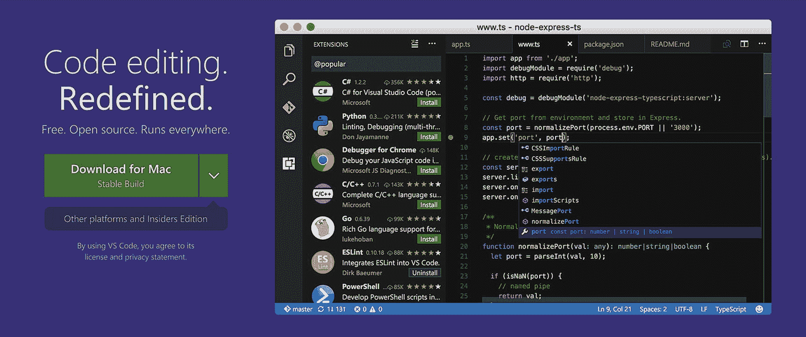

图 2-1

Visual Studio 代码是一个运行在 Windows、MacOS 和 Linux 上的源代码编辑器

在计算机上的任意位置创建一个文件夹，然后在编辑器中打开该文件夹。你将制作你的第一个 HTML 页面。在学习本章中的示例时，您将把该文件夹设置为本地 web 服务器。

我不会深入 HTML 如何工作的所有细节；对于这个练习，我会给你一个快速模板。这应该足够让你开始了。

Control-N(如果您使用的是 MacOS，则为 Command-N)将打开一个新文件。将以下代码添加到您的文档中:

```js
<!DOCKTYPE html>
    <html lan="en">
        <head>
               <meta charset="utf-8">
               <title>Chapter 2</title>
                <body>
       <p>Hello World</p>
               </body>
        </head>
    </html>

```

另存为`index.html`。这是你的第一页。此时，您可以将它拖放到您的浏览器中。这和你从网上得到的服务是不一样的。没关系，因为您将在下一节中解决这个问题。

### Node.js

这将是对 Node.js 的一个非常高层次的介绍，在以后的章节中，你将会看到一些展示这个工具强大功能的用例。

Node 是一个开源的 JavaScript 环境，允许您在服务器端执行 JavaScript。这使您能够使用相同的语言在客户端和服务器上运行代码。

节点使用模块集合。模块构成了 Node 的核心功能，允许你使用文件系统、网络协议(HTTP、DNS 等)等。)、二进制数据以及与数据库对话的能力。

获得节点的最快方法是直接从网站( [`https://nodejs.org/`](https://nodejs.org/) )。在网站上，下载被描述为“推荐给大多数用户”的版本(在撰写本文时，它是 8.11.3)。安装完成后，您距离将上一个示例中的文件夹设置为 web 服务器又近了一步。

节点没有图形用户界面。要使用它，您需要习惯使用命令行。这个例子中没有很多命令。以下是你要做的事情:

*   下载一个名为 http-server 的模块，它可以让你像从一个 web 服务器上下载文件一样为你的文件夹提供服务。

*   导航到包含源代码的文件夹，使用该模块启动您的站点并在浏览器中查看它。

大多数 ide 都有内置的终端模拟器。如果您使用的是 Visual Studio 代码，请转到“视图”,然后选择“集成终端”。这将是您项目的命令行界面。

您要做的第一件事是确保该节点已经安装。在提示符下，键入

```js
node -v

```

这应该会返回节点的版本号，如图 [2-2](#Fig2) 所示。如果这不起作用，请确保安装了该节点。

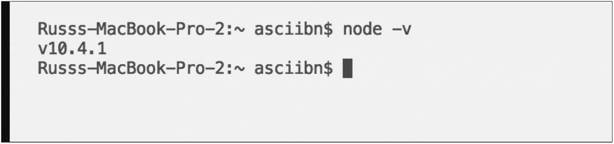

图 2-2

Visual Studio 代码有一个内置的终端，允许您执行命令

如果一切正常，安装模块，如图 [2-3](#Fig3) 所示。这是使用节点包管理器。包管理器是一种组织代码库的方式。它可能包含像这样的实用程序或像 Angular 这样的其他库来帮助构建您的项目。

图 [2-3](#Fig3) 显示加载节点模块的结果。让我们来看一下第一行，因为这是你需要做的事情。节点包管理器命令以`npm`开始。要安装一个模块，告诉`npm`你想安装的模块的名字。如果你想让那个模块在你电脑的任何地方都能工作，就加上`-g`。

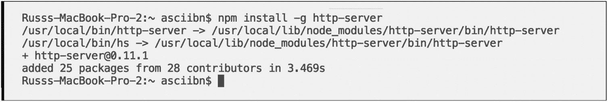

图 2-3

安装 http-server 模块。它允许你使用硬盘上的任何文件夹作为本地服务器。

将命令行界面内置到 IDE 中的一个好处是，它确切地知道您正在哪个文件夹中工作。所以现在您可以让您的模块将文件夹转换成本地 web 服务器。键入以下命令:

```js
http-server

```

您应该会看到类似图 [2-4](#Fig4) 的内容。

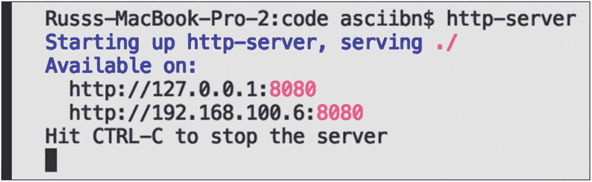

图 2-4

运行 http-server 模块，使硬盘上的任何文件夹成为本地 web 服务器

只需几个简单的步骤，您现在就可以让硬盘上的文件夹显示 HTML 页面了。你看到的两个数字是你文件夹的 IP 地址。第一个永远是你的机器。第二个数字是您网络上的地址。如果你网络上的任何人想看你在做什么，这是很有用的。

冒号后面是一组数字。在图 [2-4](#Fig4) 中，它是 8080，这是网络上的端口，通过它提供 HTML 页面。数据可以通过不同的端口发送或接收到服务器。这个号码，8080，经常被使用。未来的例子将显示从不同的端口提供 HTML 数据。

您可以按住 control 键并单击任一地址，您的浏览器将会打开并显示如图 [2-5](#Fig5) 所示的页面。

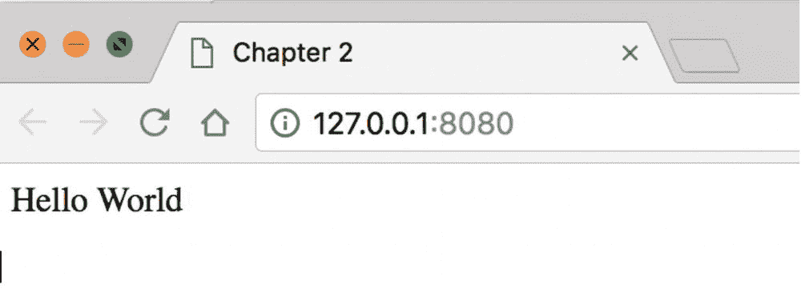

图 2-5

在浏览器中查看运行 http-server 模块的结果。你可以提供 HTML 页面。

有了新的设置，您现在可以创建和编辑 HTML、JavaScript 和 CSS 了。使用 Node，您可以将硬盘上的任何项目文件夹转换成本地服务器。这为现代前端开发人员工作流提供了一些重要的工具。

现在就出现了跟踪代码的问题。当您对网站进行更新并添加更多文件时，记录您所做的更改是一个很好的习惯。如果你有问题，这不仅仅是做一个“撤销”。想象一下，您向站点添加了一些功能，然后意识到您需要将它备份到以前的状态。版本控制对于项目来说非常重要，尤其是当不止一个人参与项目时。

在下一节中，我将讨论 Git 以及 GitHub 和 Bitbucket 之类的网站。

### 版本控制系统

使用任何类型的版本控制系统都是一个好主意。项目会随着时间的推移而增长和变化，获得项目的“快照”是很好的。Git 已经成为实现这一点的流行方式。在本节中，您将

*   安装 Git。

*   使用 Git 来跟踪您的文件。

*   创建一个 GitHub 帐户。

*   将您的项目上传到 GitHub。

Git 很容易安装。前往 [`https://git-scm.com/`](https://git-scm.com/) 。您可以为您正在使用的任何操作系统安装它。该网站提供了学习 Git 如何工作的资源。免费电子书可以在 [`https://git-scm.com/book/en/v2`](https://git-scm.com/book/en/v2) 找到，其他教程可以在 [`https://try.github.io/`](https://try.github.io/) 找到。

这是另一个没有 UI 的工具。与 Node 类似，您可以使用命令行来移动。你可以使用一些工具来解决这个问题。Sourcetree 是一个免费的工具，可以帮助你使用 Git ( [`www.sourcetreeapp.com/`](http://www.sourcetreeapp.com/) )。本章中的示例将继续使用命令行。

### 注意

如果你运行的是 Windows，安装 Git 之后你可能会额外安装一个叫 Git Bash 的东西。该工具模拟 Unix 或 MacOS 上的命令类型。和集成编辑器真的是一回事。唯一的区别是它是一个独立的应用。现在，只需使用您的集成终端。

如果您打开了 IDE，请返回终端。首先要做的是确保已经安装了 Git。一个快速的方法是查看安装的版本。在终端内，键入

```js
git –version

```

类似于检查 Node 的版本，这将返回当前安装的 Git 版本。

一旦您确认 Git 已经安装并运行，您就可以初始化该文件夹来使用 Git。你这样做:

```js
git init

```

这将设置您的文件夹使用 Git。通过创建一个名为`.git`的不可见文件夹(你可以改变你的文件夹设置来看到它)，Git 将不仅能够跟踪文件，而且能够随着时间的推移跟踪文件的内容。

现在您可以检查文件的状态，看看它们是否被跟踪。在命令行中，键入

```js
git status

```

这应该会输出项目的状态(图 [2-6](#Fig6) )。

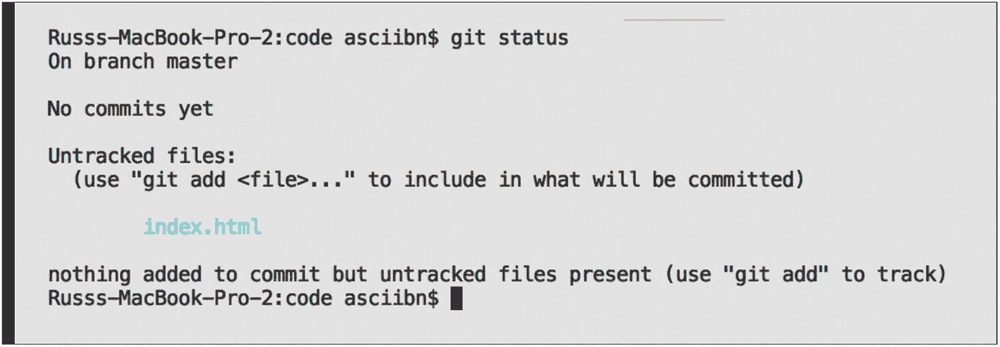

图 2-6

Git 使用分支模型。当前分支是 master。在这个例子中，index.html 没有被 Git 跟踪。有关 Git 的完整教程，请参考“教程和资源”一节。

此时，Git 没有跟踪您的文件。如果您想更改它，请键入

```js
git add index.html

```

参见图 [2-7](#Fig7) 。

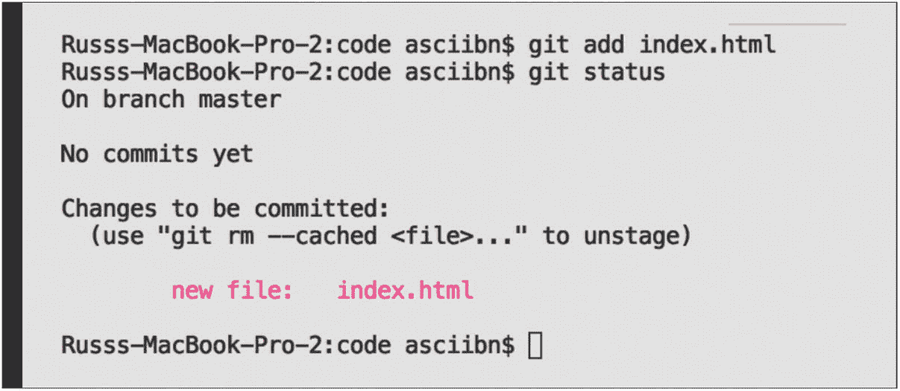

图 2-7

Git 现在知道它需要跟踪 index.html。

这告诉 Git 跟踪这个文件，所以如果文件的内容有任何变化，Git 都会知道。确保 Git 知道跟踪什么非常重要。同样重要的是提交。你可以把它们看作是你的文件在任何时候的快照。

在命令行中，键入

```js
git commit -m "my first commit"

```

看一下图 [2-8](#Fig8) 。您要求 Git 执行提交并添加了`-m`标志。这允许您添加一条关于您将要进行的提交的消息。

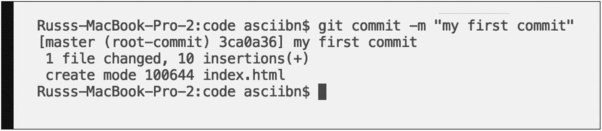

图 2-8

使用 git commit 命令创建文件的快照

所有这些都是本地的。Git 知道文件正在被修改。如果您对当前文档进行了任何更改，例如，如果您更改了消息，Git 将会知道。进行更改，保存文件，然后再次检查状态。参见图 [2-9](#Fig9) 。


图 2-9

Git 识别出文件的内容已经更新

现在文件不同了，您可以再次添加文件并进行新的提交。所有这些提交都保存在一个日志中。如果您想查看提交的历史，请键入

```js
git log

```

图 [2-10](#Fig10) 显示了该分支的历史。每次提交都带有一个散列值、作者和提交的日期/时间。

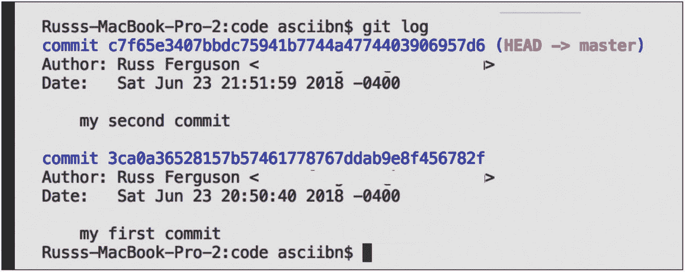

图 2-10

Git 日志将显示所有以前的提交

在图 [2-10](#Fig10) 中，您可以看到，在向您的提交添加消息时，您确实应该比这里看到的更具描述性。该消息可以让您很好地了解正在发生的事情，而无需查看代码。

此时，您可以在 Git 中创建一个存储库。添加要跟踪的文件，并制作该文件的多个快照。如前所述，所有这些都是本地的，如果您自己工作的话，这是没问题的。如果你和其他人一起工作呢？然后，您需要一个服务器，不仅可以托管您的代码，还可以跟踪更改。这就是 GitHub 和 Bitbucket 等网站的用武之地。

对于你的目的，这些网站做同样的事情。它们是存放代码的地方。您创建的存储库可以是公共的，也可以是私有的。

顾名思义，公共存储库可供任何人查看、下载或克隆。人们也可以通过发送变更和错误修复来为项目做出贡献。

GitHub(在撰写本文时最近被微软收购)允许免费使用公共、私有和开源的存储库。Bitbucket 为小团队(最多五个用户)免费提供无限的私有存储库。

你可以注册这两个网站。本节的截图将使用 GitHub。登录后，您可以创建新的存储库。这将是一次公开回购。你可以看到它附在你的账户上(图 [2-11](#Fig11) )。

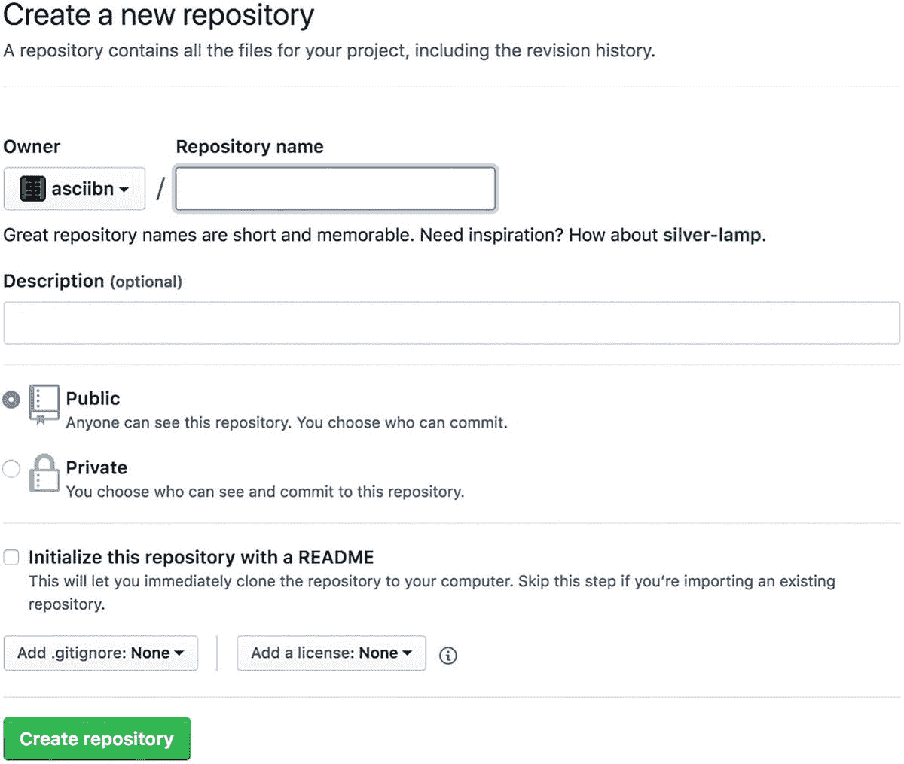

图 2-11

在 GitHub 上创建新的存储库

一旦创建了 repo，您将获得关于如何将本地机器连接到 repo 的说明。将这个例子命名为 MyFirstProject(图 [2-12](#Fig12) )。

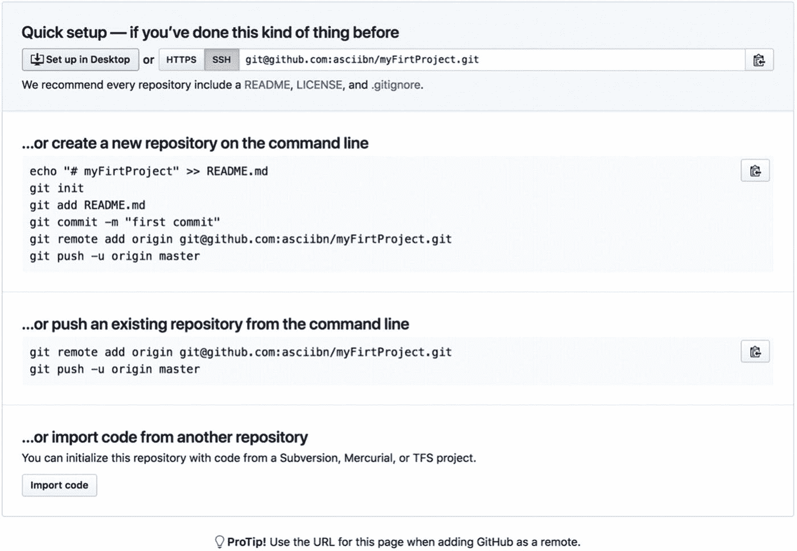

图 2-12

关于如何将本地 repo 连接到 github 的说明

当你想让来回购的人知道这个项目是关于什么的时候，你可以更新这个文件。当您第一次开始一个项目时，关于它是如何制作的、如何安装以及使用了什么技术的任何注释通常都在自述文件中。

如果您阅读了关于 Git 的部分，这些命令应该很熟悉。项目的初始化和添加 README 文件应该在那一节中已经熟悉了。这里的新功能是增加了远程功能。

Git 使用了一个叫做 *remotes* 的概念；这些遥控器是服务器上文件的副本。这将允许您将文件推(或上传)到远程源。

您可能会注意到示例中的`-u`。它设置远程分支的默认位置。将来，当您尝试使用`git pull`时，这将从远程服务器获取(或下载)任何更新版本的代码。

一旦告诉本地 Git 实例远程位置，下一个命令就是将文件推送到服务器。

如果安装了 IDE 或 GitBash，所有这些命令都可以在终端窗口中执行。

推送到远程回购的代码并没有给你一个功能性的网站。请记住，这些服务是用于跟踪代码随时间的变化，并不显示您的网站所做的结果。

一旦你把你的代码推送到回购，你就可以检查站点了(图 [2-13](#Fig13) )。

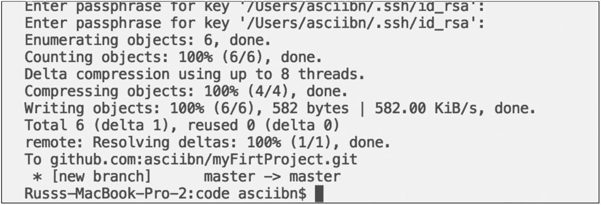

图 2-13

使用命令行将当前本地项目推送到 GitHub

### 注意

当尝试将您的代码推送到服务器时，可能会要求您输入密码。这是您刚刚创建的帐户的密码。一旦进入，一切都会起作用。

如果你厌倦了每次添加密码，你可以设置 Git 记住你的密码。进入 [`https://help.github.com/articles/caching-your-github-password-in-git/`](https://help.github.com/articles/caching-your-github-password-in-git/) 为你正在使用的操作系统设置 Git。

如图 [2-14](#Fig14) 所示，GitHub 会显示你的项目的所有已知信息。如果您决定拥有一个开源项目，这将为您提供一个可视化的参考和控制更新的方法。如果您创建了一个私有存储库，您也可以获得所有相同的信息。

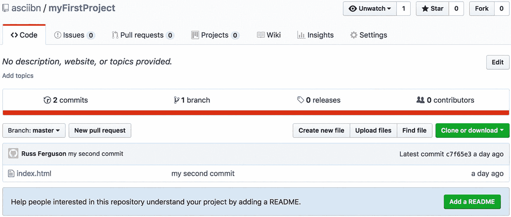

图 2-14

github 上一个有效的公共存储库

## 摘要

在这一章中你做了很多工作。到目前为止，您已经选择了一个 IDE，设置了版本控制，甚至创建了一个远程存储库。唯一缺少的是一个你可以向人们展示的现场。第 [13](13.html) 章是你将构建一个可以部署到实时服务器上的工作站点的地方。

现在，安装并设置好所有的开发工具后，您就可以深入研究这种语言并让浏览器为您服务了。下一章将介绍 JavaScript 如何处理数据类型。