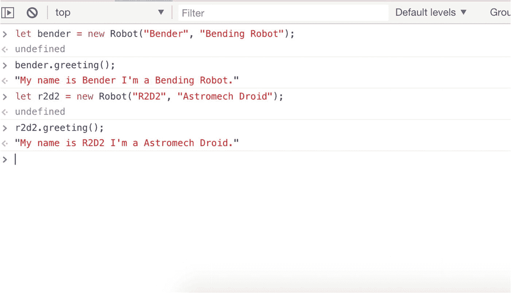
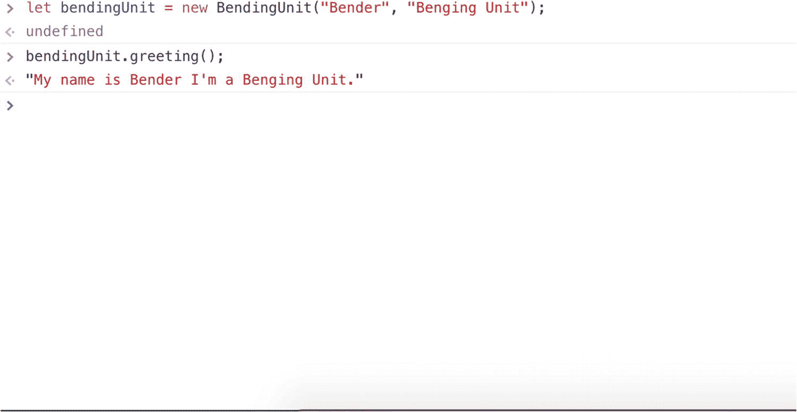

# 七、JavaScript 和编程范式

在这一章中，我将解释一些不同的 JavaScript 编程范式。我所说的编程范式是指编写 JavaScript 代码的不同方式或“风格”。

JavaScript 是一种灵活的语言。本章将涵盖两种主要的编程范式:面向对象编程(OOP)和函数式编程。在面试中，你可能会被要求解释这两种范式之间的区别。此外，您可能会发现由其他开发人员编写的代码可能属于这两个类别中的一个或两个。

### 面试问题

举出两种不同的 JavaScript 编程范式。

## 用 JavaScript 进行面向对象编程

物体可以被认为是可以为你工作的东西。数组可以保存一组(或一堆)数据。`Math`对象可以为您执行计算。在任何可以运行 JavaScript 的环境中，都有一长串可以使用的对象。

面向对象编程是一种范式，在这种范式中，您既可以创建自己的对象来为您执行特定的操作，也可以使用环境中可用的对象。

当以这种方式谈论物体时，它们经常被比作现实生活中的事物。教程经常使用人作为例子来解释一个对象是如何工作的。你可以让一群人在一个房间里。他们有相似的特征，如身高、发色、名和姓。

即使有这些相似之处，他们仍然是个体。这给了你一个机会，把你知道的相似的东西分组，并把它们抽象成所谓的*类* *。*

一个类通常被认为是一个蓝图。在这个蓝图里面是处理你所知道的关于一个人的所有事情的代码，没有任何细节。

在下一个例子中，您将使用 ES6 `class`关键字。还有其他方法可以做到这一点，但为了清楚起见，您将使用最新的语法。一旦您习惯了这一点，您将学习用 JavaScript 创建类的其他方法。

如果你想给你的对象添加细节，你可以创建这个类的一个*实例*。实例是从类实例化的对象。该实例具有在该类中定义的所有方法和属性。如果一个类是蓝图，那么实例可以被认为是根据蓝图构建的东西。

在深入之前，您应该在代码中看到这一点，所以请查看清单 [7-1](#PC1) 。

```js
7-1.js

class Robot {
   constructor(name, type){
        this.name = name;
        this.type = type;
        this.greeting = function(){
        return "I'm " + this.name + " I'm a " + this.type + ".";
        }
    }
}

Listing 7-1Creating a Robot Class

```

创建一个指向 JavaScript 文件的 HTML 页面，其中包含以下代码。在浏览器中加载 HTML 页面。这将把类加载到浏览器的内存中。现在，您可以使用浏览器控制台创建实例。开发人员工具打开后，您可以执行从 JavaScript 页面加载的代码。

在这个例子中，您正在基于`Robot`类创建一个对象。要创建一个实例，首先要创建一个变量，然后给它分配一个`Robot`类的新实例的值。

创建实例时，传递两个参数供类使用。就像向函数传递数据一样，这个类将消耗参数并在内部使用它们。

您可以通过调用属于该类的方法`greeting`来查看结果。图 7-1 展示了一个基于同一个类创建两个实例的例子。

在图 [7-1](#Fig1) 中，你可以看到同一个`Robot`类的两个不同实例。每个实例持有自己的数据。



图 7-1

创建机器人类的两个实例

看`Robot`类，可以参考关于对象的章节。使用关键字`this`可以让您将属性`name`和`type`的值保存在对象内部。

你可能会注意到这个课程以一个大写字母开始。这是用 JavaScript 创建类的惯例。

创建类实例时，使用关键字`new` *。*这将创建一个包含该类中定义的所有属性和方法的对象。根据类的定义方式，每个实例可以有唯一的值。这使您能够实例化或创建该类的多个实例，每个实例包含不同的属性。

类中的构造函数获取创建实例时传递的属性，并将它们分配给实例。

至此，您已经抽象出了机器人的一些更通用的属性。有时，您可能希望将通用属性与所讨论的机器人的特定属性结合起来。

### 原子的孩子

在上一节中，您抽象了机器人的一些通用属性，并能够使用该蓝图作为实例化`Robot`类的单个实例的方法。现在让这些机器人根据它们的类型执行一些特定的任务。这意味着您需要使*子*类从*父*类中*继承*属性。清单 [7-2](#PC2) 探索了扩展父类的概念。

```js
7-2.js

class BendingUnit extends Robot {
   constructor(name, type){
        super(name, type);
        }
    }
}

Listing 7-2Inheriating from a Parent Class Using the ES6 extends Keyword

```

这段代码使用`extends`关键字告诉环境，除了当前类中的特性之外，它还想使用来自*父类*的所有可用特性。

因为您知道您想要使用*父*类的一些属性和方法，所以您使用关键字`super`将父类需要的所有东西传递给函数属性，在您的例子中是相同的两个属性。

此时，您没有向`BendingUnit`类添加任何新的东西，但是如果您从这个类创建一个对象并从父类运行相同的方法，您将得到相同的结果。

创建这个对象与上一个示例中的相同。因为这是父对象的子对象，所以您不需要做任何特殊的事情。该类的内部函数将负责这一部分。图 [7-2](#Fig2) 在这一点上看起来应该非常相似。



图 7-2

创建从父类扩展函数的类

您可以看到，尽管这个类中不存在`name`属性和`greeting`方法，但是它们是可用的，因为您是从`Robot`类扩展而来的。通过使用`extends`关键字，您可以继承这些属性和方法。

既然您已经能够重用父类中的函数，那么您也可以为子类创建独特的函数。参见清单 [7-3](#PC3) 。

```js
7-3.js

class BendingUnit extends Robot {
   constructor(name, type){
        super(name, type);
        }
       primaryFunction(){
       cosole.log(this.name + " bends things");
       }
    }

let bendingUnit = new BendingUnit("Bender", "Bending Robot");
bendingUnit.primaryFunction(); //returns Bender bends things.

Listing 7-3Creating Unique Methods for the Robot Subclass

```

在这个例子中，您有一个方法，它对于当前类是唯一的，并且不依赖于父类。该方法仍然可以利用父类的属性来执行其独特的功能。

像上一个例子一样创建一个对象，并将其命名为`primaryFunction`。结果应该如清单 [7-3](#PC3) 所示。

这就是继承的工作方式。您可以将属性和函数抽象到一个类中，然后为了获得更多的细节，您可以创建一个子类，该子类可以利用父类的优势，同时添加自己独特的功能。

使用`extends`关键字给你从另一个类继承的能力。JavaScript 只允许你继承一个父类。

因为您在您的类中使用 ES6 语法，所以在幕后有很多事情要做。下一节将为您提供一个深入探索的机会。

### JavaScript 类和原型继承

在上一节中，您使用关键字`extends`开始了对继承主题的探索。其思想是一个对象可以获得另一个类的属性和方法。这另一个类被认为是它的*超级*或*父类。*

其他语言有所谓的基于类的继承。这意味着一个对象可以从其他类继承它的属性和方法。

然而，JavaScript 是基于*原型的*，这意味着如果属性或方法在当前对象中不存在，它将查看对象的*原型*属性，并移动到其父对象以查看该属性是否存在。这通常被称为沿着*原型链*向上移动。

在前面的示例中，您使用了 ES6 语法来创建对象。你用的一个关键词是`constructor`。函数构造器实际上只是一个创建函数对象的函数。

为了进行适当的比较，让我们使用函数构造函数重新创建`robot`类。参见清单 [7-4](#PC4) 。

```js
7-4.js

const Robot = function(name, type) {
      this.name = name;
      this.type = type;
    }

Robot.prototype.greeting = function(){
        return "I'm " + this.name + " I'm a " + this.type + ".";
}

let bender = new Robot ("Bender", "Bending Robot");
bender.greeting() // "My name is Bender I'm a Bending Robot."

Listing 7-4Creating the Robot Object Using Function Contructors

```

在这里，您创建一个常数，并为其分配一个函数。这个函数接受两个属性，并将值赋给它的内部对象。

下一行是您开始了解 JavaScript 中的继承是如何工作的地方。您访问对象的`prototype`属性并创建一个名为`greeting` *的函数。*这就像使用类语法创建函数一样。

属性和方法被添加到对象的原型中。这意味着如果有任何类可以从这个类继承，JavaScript 会将*原型链*从子对象移动到其父对象以访问属性。

清单 [7-5](#PC5) 展示了如何创建一个从另一个对象继承方法和属性的对象。

```js
7-5.js

const Robot = function(name, type) {
      this.name = name;
      this.type = type;
    }

Robot.prototype.greeting = function(){
        return "I'm " + this.name + " I'm a " + this.type + ".";
}

const BendingUnit = function(){
     Robot.apply(this, arguments);
}

BendingUnit.prototype = Object.create(Robot.prototype);
BendingUnit.prototype.constructor = BendingUnit;

let bender = new BendingUnit("Bender", "Bending Unit");
bender.greeting() // "My name is Bender I'm a Bending Unit."

Listing 7-5Creating Inheritance Without Using the ES6 Syntax

```

这里的一个关键区别是函数`BendingUnit`调用原始的`Robot`类并使用`apply`方法。

`apply`方法告诉浏览器`BendingUnit`类可以作为访问`Robot`类属性的起点。

下一行告诉环境更新`BendingUnit`类的原型对象，并将`Robot`原型的值赋给它。

既然原型已经更新，构造函数认为它是`Robot`类的副本，而不是自己的`BendingUnit`类。

要解决这个问题，将 contractor 函数分配给`BendingUnit`函数，这样它将知道即使它从`Robot`类继承了函数，它本身也不是*机器人*。

本例中最后两行的功能与使用 ES6 语法时相同。您可以看到，使用 ES5 语法使您更接近 JavaScript 的实际工作方式，但是可能会使解释继承的概念更加困难。

总的来说，继承对于重用代码而不必重写代码是有用的。还有一种模式叫*构图。*使用复合*，*你在类内部创建对象，直接使用它们，不需要继承。这不是 JavaScript 语言的特性，而是重用代码以赋予对象更多能力的一种方式。

对继承的批评之一是，你不仅继承了你想要的特性，还继承了你不需要的特性。这是因为它们是父类或父类的一部分。

在下一节中，我将讨论另一种范式:用 JavaScript 进行函数式编程。

### JavaScript 函数式编程

如前所述，JavaScript 是一种非常灵活的语言。经常使用的两种范式是面向对象编程和函数式编程。

以前，您使用包含关键字`class`的 ES6 语法和依赖于您对原型继承的理解的 ES5 语法在 JavaScript 中创建了对象。

使用 JavaScript 时，理解原型继承非常重要。然而，函数式编程不依赖于原型。

函数式编程有几个概念需要解释，以便充分理解它与面向对象编程的区别。

我将介绍的一些概念是

*   纯函数

*   副作用/共享状态

*   不变

*   命令式代码之上的声明式代码

### 纯函数

它的纯粹之处在于，无论你调用函数多少次，结果总是一样的。如果你有一个函数，取一个数，乘以 2(x * 2)，然后返回结果，无论你传递给函数什么数，结果都是一致的。清单 7-6 显示了一个纯函数的例子。

```js
7-6.js

const timesTwo = (x) =>  x * 2;

timesTwo(2) //returns 4
timesTwo(3) //returns 6

Listing 7-6Creating a Pure Function

```

这给了你的函数一种叫做*引用透明性的东西。这意味着你可以用它返回的值来替换函数本身，而应用的行为不会改变。如果不是这样，它被称为*不透明*。*

使一个函数不纯的原因是，尽管传递了相同的值，但函数返回不同的结果。例如，开发人员有时希望每次都调用具有唯一属性的服务，以防止浏览器缓存结果。为此，他们将当前时间添加到 URL 中。因为在 24 小时内你只能得到一次准确的时间，所以这不是一个纯粹的函数。任何使函数产生不一致的结果或者除了返回值之外还必须做任何事情的事情都会使函数不纯。

### 副作用/共享状态

纯函数的另一个特点是它们不会产生副作用，也就是说它们不会改变或者变异在函数之外可以访问的对象。

因为 JavaScript 将对象属性作为*引用*传递，所以当对象或数组的属性发生变化时，它会改变该对象的状态。同样的对象可以在函数之外访问。纯函数不得改变外部状态。

### 小费

赋给非原始值(一个对象)的 JavaScript 变量被赋予该值的引用。引用是指对象在计算机内存中的位置。变量本身不包含值。

### 不变

不变性是函数式编程的一个重要概念。对象不变或*突变*的想法使得调试之类的事情变得更简单，因为每个状态都是恒定的。

提醒一下，使用关键字`const`将保持变量不变，但不会阻止对象被更新。

经常发生的一件事是，你有一种情况，你通常会改变数据，例如一个数组。如果您正在以函数方式编程，您不希望改变数据。你如何解决这个问题？

在这种情况下，您可以制作数据的副本，然后将副本发送回来。这可以防止原始对象发生突变，并提供您需要的结果。

要向数组中添加项目，大多数人会使用`push`方法。这会将一个项目添加到数组的末尾。但是，这也会使数组发生变异。要解决这个问题，您可以使用内置的`Object`数据类型并使用`assign`方法。为了更清楚，请看清单 [7-7](#PC7) 。

```js
7-7.js

const twoArray = ["One", "Two"];
const threeArray = Object.assign([...twoArray], {2:"Three"});
console,log(threeArray); //returns (3) ["One", "Two", "Three"]

Listing 7-7Returning a Copy of an Array So Data Is Not Mutated

```

在本例中，第一行创建了一个数组。第二行使用了`assign`方法。此方法接收两个参数。第一个是原数组。您不用遍历整个数组来获取所有元素，而是使用 spread 操作符来传递 iterable 对象(在本例中为数组)的所有属性。第二个参数是要添加到数组中的对象。这将创建一个新的数组，而不会改变原始对象。

### 命令式代码之上的声明式代码

声明性代码和命令性代码的主要区别在于，命令性代码描述了如何实现预期结果的步骤。虽然声明性代码关注的是应该对数据做什么，但是它应该如何工作的细节却被抽象掉了。清单 [7-8](#PC8) 展示了一个基于现有数组创建新数组的例子。

```js
7-8.js

const threeArray = ["One", "Two", "Three"];
//Imperative code describing how a program operates
for(let i = 0; threeArray.length > i; i++){
      console.log(threeArray[i]); //returns One, Two, Three
}

//Declarative code showing how a program should work
 threeArray.map((value, index, arr) => {
      console.log(value); //returns One, Two, Three
});

Listing 7-8Imperative Code vs. Declarative Code

```

第一个实例展示了一种基于数组长度遍历数据的方法。在`for`循环中有检查来判断你能走多远。

第二个实例利用了内置的`map`方法。此方法将函数作为参数。该函数接收数组中的每一项，而不需要知道数组的长度。

这里的主要区别是，您不需要描述如何浏览数据。重点只在于你对数据做了什么。

如果您在函数式编程环境中工作，这些是需要理解的重要概念。JavaScript 中的函数可以作为函数的属性传递。它们也可以是从其他函数返回的值。

链接函数的能力是你会经常看到的。使用`fetch`方法从远程数据源检索数据需要链接方法，然后*和*处理从服务器返回的结果。这里有一个例子:

```js
fetch('https://swapi.co/api/people/1').then(results => results.json()).then(json => console.log(json));

//results
//{name: "Luke Skywalker", height: "172", mass: "77", hair_color: "blond", skin_color: "fair", ...}

```

这里使用`fetch`方法从星球大战 API ( [`https://swapi.co`](https://swapi.co) )中检索数据。这个方法返回所谓的*承诺*。它将一直等到请求被解决或失败。

当请求被解析时，`then`方法被链接到它。您可以在这里处理结果。第一个`then`方法获取结果并将它们转换成一个 JSON 对象。使用箭头函数时，如果没有花括号，只有一行代码，结果会自动返回。

这被发送到第二个`then`方法，在那里第一个方法的结果变成一个名为`json`的参数，并被打印在浏览器控制台中。

## 摘要

在这一章中，你探索了两种不同的编程风格或范式。第一种是面向对象的编程，在这种编程中，你可以创建代表你想要建模的事物的对象。

记住 JavaScript 使用原型来创建继承是很重要的。当前对象中不存在的属性和方法将沿着原型链向上移动到对象的父类。

第二种是函数式编程，纯函数变得极其重要。如果相同的参数传递给函数，这些函数总是返回相同的结果。它们也不会产生副作用，因为它们不仅仅是返回一个一致的值。

您还学习了不变性的概念。对象不直接更新；这会使物体变异。相反，会制作一个副本，并将更改添加到该副本中，然后发送回应用。

最后一节介绍了声明性代码和命令性代码之间的区别。声明性代码使用代码来确定如何在数据中导航，命令性代码允许代码自己确定它应该如何呈现自己，并让您专注于您想要用它做什么。该示例使用了数组的`map`方法；它允许您遍历数组中的每一项，而无需提前知道长度。

下一章将介绍如何使用浏览器中的工具来帮助调试应用。随着您的应用变得越来越复杂，了解这些工具的工作原理将非常有帮助。