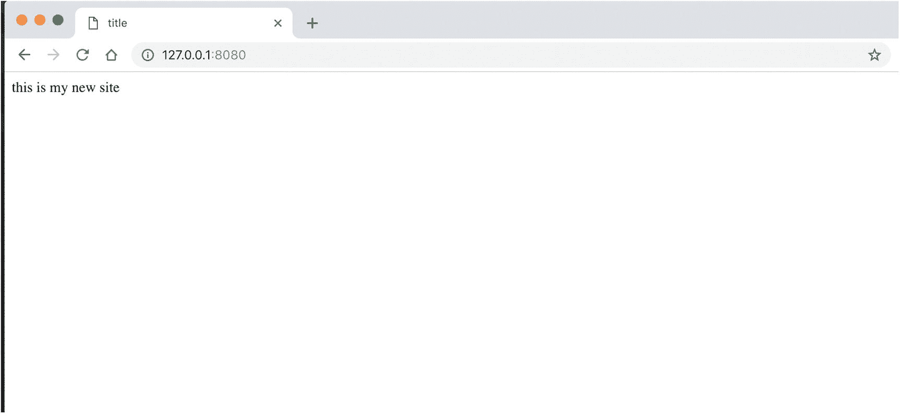
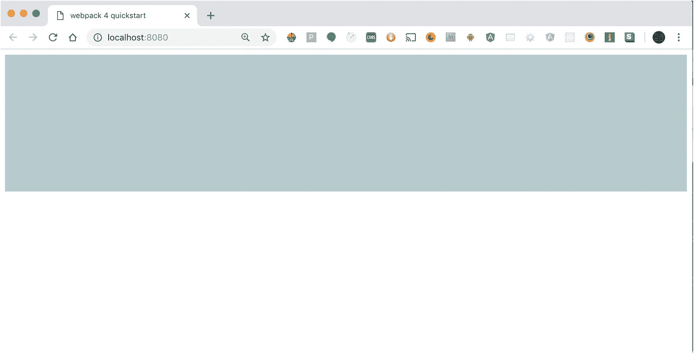

# 9.JavaScript 和客户端开发

在前面的章节中，您安装了 NodeJS 并学习了如何运行本地服务器。之后，您花了大量时间使用浏览器并探索 JavaScript 在其中的工作方式。在这一章中，我将介绍由 NodeJS 支持的工具，它们将增强客户端开发。

即使您决定不在服务器端工作，NodeJS 也是您应该知道的。它已经成为任何使用 JavaScript 的开发者的生态系统的一部分。像节点包管理器(NPM)这样的工具已经成为前端开发人员生活中重要的一部分。

本章将详细介绍 NodeJS(通常称为 Node)是什么，以及作为前端开发人员如何利用它。

## node.js 到底是什么

为了理解当前的 JavaScript 框架如何能够执行像创建文件和文件夹这样的操作，重要的是后退一步，讨论 NodeJS 到底是什么，以及为什么它是 JavaScript 开发人员工具箱的重要组成部分。

关于节点的讨论将分为两部分。第一部分，我将在本章中介绍，将展示节点对于客户端开发的重要性。

下一章将介绍如何使用 JavaScript 和服务器端框架(如 Express)来组装 web 服务器。

## 客户端的节点

安装 Node 后，您就可以使用 Angular、React 或 Vue 等当前框架了。包是可以在任何项目中使用的 JavaScript 代码库。它们是通过一个叫做 NPM 的系统分发的。

NPM 有一个可供开发者使用的 JavaScript 库数据库。如果您想在项目中添加某种类型的功能，可以使用命令行并将其添加到项目中。

要使用 NPM，首先需要安装节点。如果您尚未安装 Node，请转到 [`NodeJS.org`](http://nodejs.org) 并安装最新的稳定版本。

我将涉及的一些内容与前几章相似，但作为一个提醒，还是值得一读的。

当您安装了 Node 后，使用 Node 的一种常见方式是使用命令行工具。如果您运行的是 Windows，有一个名为 Cmder 的控制台模拟器。这个工具可以在 [`cmder.net`](http://cmder.net) 下载。安装了它和 Git(可以在 [`https://git-scm.com/`](https://git-scm.com/) 找到)你就可以使用所有的命令行选项，界面就像使用 Unix 或 MacOS 一样。

如果您运行的是 Windows 并且已经安装了 Git，那么您也可以使用 Git bash 作为替代。

在 Mac 或 Linux 端，可以使用内置的终端窗口。如果你用的是 MacOS，有一个叫 iTerm 的应用，如果你不想用内置的终端可以用。

安装了 Node 后，您可以使用 JavaScript 来完成在浏览器中无法完成的任务。例如，您可以访问文件系统；您还可以执行网络和数据功能。

对于前端开发人员，您可以使用 NPM 作为一种快速组装应用程序的方式。使用 NPM 时，需要创建一个名为`package.json`的文件；该文件跟踪您在项目中使用的所有库和相应的版本号。

可以发布您的包，以便其他人可以使用它。在你的情况下，你不会这样做，但知道你有什么选择是很好的。

## 在项目中使用 package.json

要在命令行创建这个文件，请键入`npm init`。这将启动该过程，并询问您有关您将要创建的项目的问题。您不打算发布此包；但是，命令行界面会像您一样向您提问。这就是为什么理解它试图做什么很重要。

您必须回答的第一个问题是项目的名称。当你给你的包起一个名字的时候，这里有一些事情需要记住(你可以在 [`https://docs.npmjs.com/files/package.json`](https://docs.npmjs.com/files/package.json) 找到所有的细节):

*   包名不能超过 214 个字符。

*   名字不能以点(。)或下划线(_)。

*   新包不能有大写字母。

如果您不打算发布包，这并不重要。如果你打算发布，为了更好地了解如何命名你的包，看看 [`www.npmjs.org`](http://www.npmjs.org) 的注册表。

下一个问题是版本号。发布时需要名称和版本号。如果您对软件包进行了更改，那么您应该对版本号进行更改。

所有版本号都应该能够被 node-semver 解析。Semver，或语义版本化，是一种帮助跟踪项目版本的标准。以下是一些规则:

*   当更改与以前的更改不兼容时，使用主版本号。

*   当添加向后兼容的功能时，使用次要编号。

*   添加向后兼容的错误修复时使用补丁号。

使用这种格式，所有版本号看起来都类似于 1.0.0(主版本号、次版本号和补丁号)。

若要继续，请按回车键；这将为您留下默认版本。

接下来，应用程序将询问项目的描述。这有助于人们在搜索时发现该包。您可以按下 Return 键继续。

入口点是当您使用`import`或`require`关键字时将会用到的文件。使用这两个关键字中的任何一个都会将该库的功能添加到您的项目中。默认是`index.js`。

在 test command 选项中，您可以添加命令来对应用程序运行任何类型的测试。这可能包括单元测试和集成测试。例如，您可以在持续集成环境中键入`npm run tests`,并确保在将代码发送到服务器上运行之前通过应用程序测试。

### 面试问题

单元测试和集成测试的区别是什么？回答:单元测试检查一小段代码，以确保它做了它应该做的事情。集成测试检查这些单元是否能一起工作。

添加 Git 存储库有助于人们了解项目的位置。如果您对项目进行开源并希望人们做出贡献，这也很有帮助。

如果您计划公开项目，关键字会很有帮助。当有人使用“npm 搜索”时，它们会有所帮助关键字是字符串数组。在您的案例中，这是一个本地项目。您可以按下 Return 键并移动到下一个项目。

这种情况下的作者是你。如果您想要添加贡献者，请使用包含其他人的数组。这个数组可以包含名称、电子邮件和 URL。输入您的姓名，然后按回车键，或者直接按回车键。

如果这是一个公开的项目，你可以把它放在像麻省理工学院或知识共享这样的开源许可下。许可证的完整列表可在 [`https://spdx.org/licenses/`](https://spdx.org/licenses/) 找到；在你的情况下，它不是开放的，所以你可以继续前进。

有了这些问题的答案，您就可以预览一下`package.json`文件将会是什么样子。你需要做的最后一件事就是批准它。

NPM 已经创建了一个文件，你可以用它来跟踪将成为你的应用程序的一部分的库。它的核心只是一个 JSON 文件，但是在你要使用它的上下文中，它不仅知道你正在使用什么库，而且还跟踪你未来的应用程序工作所需的版本和任何依赖库。

下一节将向您展示如何将包添加到项目中。

## 向 package.json 添加库

现在您有了一个`package.json`文件来跟踪您想要使用的库以及这些库在您的项目中的版本。使用这个文件，您还可以运行本地服务器来查看应用程序的工作情况。您还可以运行脚本来帮助您进行站点的开发、测试和生产。

向项目中添加库时，您可以返回命令行并直接请求它。NPM 将找到 Git 库并将其添加到您的项目中。对于这个例子，让我们将 jQuery 添加到您的项目中，并探索如何使用它。

回到命令行，你应该和`package.json`文件在同一个文件夹中；输入`npm install jquery`。

这段代码找到装有最新版本 jQuery 的 Git 存储库，并将其下载到您的机器上。它还在该文件夹中创建一个名为`node_modules`的文件夹，这是一个包含您刚才请求的库的`jquery`文件夹。

该过程创建的最后一个文件是一个`package-lock.json`文件。该文件有助于确保每次都安装了您正在使用的所有库的准确版本。

### 面试问题

你应该投入到你的项目中吗？回答:是的。这将确保团队中的每个人都安装了项目中使用的所有库的相同版本。

到目前为止，您已经创建了一个`package.json`文件，并向其中添加了一个库。此时，你还没有一个完整的工作网站。接下来的几个例子将展示如何使用 NPM 来组织一个项目。

在前面的一章中，您添加了一个名为`http-server`的包；这为您创建了一个将当前文件夹用作 web 服务器的零配置方式。

让我们将这个包添加到您的项目中。在命令行中，确保您位于项目的根目录，并通过键入`"npm install --save http-server"`来安装`http-server`。

安装了这个库之后，您可以更新您的脚本，这样您就可以让`package.json`告诉服务器它应该何时运行。因为这只是一个 JSON 文件，所以您可以在任何编辑器中打开它，并对其进行一些修改。

在任何编辑器中打开文件。要更新脚本部分，您需要添加一个脚本来启动服务器。在 scripts 部分下，添加一个名为`start`的脚本。清单 [9-1](#PC1) 有代码。

```js
 "scripts":{
 "test":"echo\ "Error: no test specified\" && exit 1",
  "start": "http-server"
}

Listing 9-1Updating the package.json File so the Start Script Will Run a Local Server

```

现在，当在命令行时，你只需要键入`npm start`，这将启动本地 web 服务器。要停止服务器运行，可以键入 Control + C。

您已经使用 NPM 下载了两个库，但是您还没有任何 HTML 文件可以显示。

要解决这个问题，您需要返回命令行并创建一个文件。键入`touch index.html`，这将创建一个名为`index.html`的空白文件。

新创建的 HTML 文件中没有任何内容。你可以通过使用一个名为 [`htmlshell.com`](http://htmlshell.com) 的网站生成的代码来解决这个问题。在默认设置下，它会给你一个 HTML 站点的基本结构，现在这就是你所需要的。

将 HTML 添加到索引文件后，您可以再次启动项目，并查看本地 web 服务器加载的新创建的 HTML 页面。

要做到这一点，在命令行输入`npm start`，这将再次启动服务器。

打开浏览器，输入`127.0.0.1:8080`。这将告诉浏览器查看本地机器(8080 是默认端口号；其他项目可能使用不同的号码在本地机器上提供网页)。

当前页面为空白，如图 [9-1](#Fig1) 所示。如果您愿意，您可以在文档正文中键入内容，以确认该页面已被提供。



图 9-1

显示来自本地服务器的新 HTML 页面

现在有了启动本地服务器并为您提供 HTML 页面的`package.json`文件。您需要将 JavaScript 添加到项目中。如果您仍然打开命令行工具，创建一个`scripts`文件夹来添加一些 JavaScript 到项目中。

在命令行，停止服务器，键入`mkdir scripts`；这将创建一个文件夹，您可以在其中添加 JavaScript。现在，您可以进入该文件夹并创建新文件。

键入`cd scripts`更改目录，将您放入`scripts`文件夹。一旦进入，使用相同的`touch`命令并创建一个新的 JavaScript 文件。

在`scripts`文件夹中输入`touch app.js`。这将创建一个新的空白文件，您可以在其中添加 JavaScript 命令。

在开始编写 JavaScript 之前，您需要确保 HTML 页面知道有 JavaScript 可以使用。

在你的代码编辑器中，打开 HTML 页面(如果它还没有打开的话),添加一个指向`scripts`文件夹和你新创建的`app.js`文件的`script`标签。代码应该如清单 [9-2](#PC2) 所示。

```js
/* index.hml*/

 <body>

<script src="scripts/app.js"></script>
</body>

//app.js

document.addEventListener('DOMContentLoaded', () => {
    console.log('Document Loaded');
});

Listing 9-2Connecting Your HTML Page to the JavaScript File

```

您在结束的`body`标签之前添加了`script`标签，以便在浏览器开始呈现任何 JavaScript 之前呈现页面的其余部分。

准备好之后，添加一些 JavaScript 进行检查，确保您知道您的本地服务器正在工作。您可能需要刷新浏览器或再次启动服务器才能看到此工作。但是，当您打开开发人员工具并查看控制台面板时，您应该会在控制台中看到消息“Document Loaded”。

这段代码查看`document`对象并监听一个名为`DOMContentLoaded`的事件监听器。当该事件发生时，会触发一个匿名函数，向您提供一条消息。

到目前为止，您已经有了一个正在运行的本地服务器和 JavaScript。但是，您还不能将 jQuery 库连接到您的项目。

为了让它工作，您需要添加一个模块构建器。下一节将解释这是如何工作的，以及为什么它很重要。

## 模块捆扎机介绍(网络包)

到目前为止，您已经使用命令行做了很多工作。您创建了一个`package.json`文件，帮助您为将来的项目加载多个库。您还将添加到该文件的脚本部分，以便以后可以使用命令行来运行本地文件服务器。这种能力让你知道你发布的网站会是什么样子。

到目前为止，您还没有使用之前安装在项目中的 jQuery 库。如果您还记得，在安装 jQuery 时，它创建了一个名为`node_modules`的文件夹，其中包含您的库。

浏览器理解模块的概念。模块是拥有一些 JavaScript 代码的能力，这些代码将提供一些特定的功能。这个单独的代码可以导入到更大的项目中。

随着您的项目开始变得越来越复杂，您将需要一些不同的模块来使一切正常工作。如果能添加这些模块，而不是为您想要使用的每个模块在文档中添加一长串的`script`标签，那就太好了。

Webpack 是一个工具，您可以使用它来帮助导入您在项目中使用的任何库，并确保代码与一些旧的浏览器兼容。

要让 Webpack 工作，您需要在命令行上花更多的时间。如果您当前正在运行应用程序，请停止运行它，并安装 Webpack 应用程序。

在命令行中，键入

```js
npm install webpack webpack-cli –-save-dev

```

这将把 Webpack 库添加到您的项目中。额外的标志`-–save-dev`用于将库添加到您的项目中，但不是在您开发前端代码时使用的。

当查看`package.json`文件时，您可以看到这个库已经被添加到一个名为 devDependencies 的新部分。这一节只针对那些帮助你*使用*应用程序的实用程序，而不是帮助你*开发*应用程序。在这一节中，可以结束的一些东西是帮助您运行单元测试或其他开发工具的库。

现在您已经将 Webpack 作为开发工具的一部分，您将使用它来创建您的应用程序。

返回到您的`package.json`文件，向脚本部分添加一个新选项。创建一个名为`dev`的脚本，并赋予它`webpack`的值。

它应该是这样的:

```js
"dev":"webpack"

```

编辑该文件后，在命令行中键入

```js
npm run dev

```

这将抛出一个错误，如图 [9-2](#Fig2) 所示。


图 9-2

将 Webpack 添加到项目后运行脚本

有时得到一个错误是令人失望的，但在这种情况下，它是好的。你知道 Webpack 已经安装，它只是需要进一步的指导如何工作属性。

没有足够多的人做的事情之一是阅读错误消息。在尝试解决问题时，理解问题非常重要。

这个错误告诉你，你需要添加更多的信息到你的脚本中。现在，它默认为生产模式，这不是你现在需要的。

返回到`dev`脚本并更新它:

```js
"dev":"webpack  --mode development"

```

Webpack 有一些缺省值，您需要遵守这些缺省值才能让您的示例正常工作。如果再次运行该脚本，仍然会出现错误。

上一个示例中的文件和文件夹的结构不符合 Webpack 需要的默认结构，因此您需要调整您的文件以使用 Webpack。

Webpack 希望`index.js`文件位于`src`(源)文件夹中。如果您使用的是前面例子中的代码，将`scripts`文件夹重命名为`src`，将`app.js`文件重命名为`index.js`。

如果您再次运行该脚本，您应该不会遇到同样的错误。

当脚本执行完毕时，它会创建一个`dist`文件夹。这是存放所有编译代码的文件夹。

当使用像 Webpack 这样的工具时，所有被处理的代码都在`dist`文件夹中结束。除了 JavaScript 文件之外，这还包括 HTML 文件和 CSS 文件。

当刷新浏览器时，HTML 文件不识别在`dist`文件夹中发生的事情，因为`script`标签没有指向该文件夹中的 JavaScript。

您需要更新 HTML 文件以指向`dist`文件夹中的 JavaScript 文件。

使用 Webpack 的一个好处是，您不需要在 HTML 文档中为每个要使用的库设置多个脚本标记。

回到 HTML 页面，更新`script`标签，指向`dist`文件夹和其中包含的`main.js`文件。

只是为了确保一切都按您期望的方式运行，通过返回命令行并再次键入`npm run dev`来重新编译应用程序。

您在`package.json`文件中编写的第一个脚本是`start`脚本。当运行这个脚本时，你可以使用当前文件夹作为 web 服务器和服务器的`index.html`文件。

为了使本练习生效，您需要打开终端窗口的两个实例，一个用于查看服务器运行，另一个用于使用 Webpack。

在一个窗口中，运行名为`npm start`的脚本。它启动服务器，并告诉您将哪个本地地址放入您的浏览器，以查看网站的运行情况。

在另一个窗口中，您可以继续更新 Webpack 脚本。

此时，您应该能够看到更新后的脚本在本地 web 服务器上运行。在浏览器的开发工具打开的情况下，您仍然会在控制台面板中看到相同的“Document Loaded”消息。

所有这些设置现在都让您能够利用 NPM。

在本课一开始，您将 jQuery 加载到了您的`package.json`文件中。现在，您可以将该库添加到项目中，而无需将其添加到 HTML 页面中。

在`index.js`文件中，在顶部添加这一行:

```js
import $ from 'jquery'

```

然后在当前代码的上方添加一些代码行，确保 jQuery 正常工作。完成的代码看起来应该如清单 [9-3](#PC8) 所示。

```js
import $ from 'jquery';

$(document).ready(()=> {
 console.log('hello from jquery');
});
document.addEventListener('DOMContentListener', ()=>{
  console.log('Document Loaded');
});

Listing 9-3Importing jQuery into Your JavaScript Project

```

再次运行`npm run dev`命令，然后刷新浏览器。查看控制台面板，您应该会看到两条消息。

如果您正在使用 Chrome，并且在重新编译应用程序后没有看到这两条消息，请单击并按住刷新按钮，然后选择清空缓存和硬重新加载选项。只要开发工具是打开的，这应该会给你想要的结果。

您的应用程序现在可以利用其他库，而无需添加到 HTML 文件中。您可以将它们直接导入到当前文档中，并使用 Webpack 之类的工具将它们打包到 JavaScript 文件中。

你可以把你的 HTML 文件和`dist`文件夹的内容上传到一个实时的网络服务器，它应该完全一样。

然而，对于发展来说，你有一些迫在眉睫的问题。首先，应用程序不知道何时应该重新编译代码。如果您进行了更改，您应该不必手动告诉 Webpack 该做什么。

另一个问题是，如果你想在你的项目中添加 Sass(语法上很棒的样式表), Webpack 应该能够使用它。

第三个问题是，如果你想使用最新版本的 JavaScript。更新的代码库将包括旧浏览器可能不支持的语法更新。

下一节将讨论这些问题的解决方案。

## 添加 webpack-dev-server

在这里，您将看到上一节中讨论的一些问题。

您知道当您的任何源代码更新时，您需要手动重新编译您的代码。这是不可接受的情况，你需要解决它。您可以通过使用 Webpack webserver 来解决这个问题。这将替换您以前使用的服务器。

如果服务器当前正在运行，请将其停止。返回命令行并安装 Webpack 服务器。类型

```js
npm install webpack-dev-server –save-dev

```

安装完成后，您可以看到`package.json`文件已经更新。

现在它已经更新了，您可以更新您原来的`start`脚本，告诉它使用 Webpack dev 服务器而不是 http-server 服务器。

回到您的开发环境，通过键入以下命令更新`start`脚本

```js
webpack-dev-server –mode development -–open

```

在这里，您将指导您的脚本使用 webpack 服务器并添加标志`-—open`。此标志将打开默认浏览器并加载索引页面。

这样做的额外好处是，当您对文件进行更改时，它会自动更新和刷新页面。这将在您每次编辑时为您提供页面的更新版本。

为了测试这一点，对 JavaScript 页面进行更改并保存文件。您应该看到终端窗口更新，浏览器刷新页面。

现在，您已经有了 Webpack 工作的默认配置。您的开发服务器正在运行，它将识别您的应用程序中的文件何时被更新。当文件更改时，Webpack 将重新编译代码并刷新浏览器，这样您就可以看到网站的最新版本，就好像它是由服务器提供的一样。

JavaScript 是一种不断变化的语言。伴随这一变化而来的问题是，并非所有的浏览器都跟上了这一变化。根据项目的不同，您可能需要支持没有您想要的功能的旧浏览器。

下一节将介绍 Babel.js 作为解决这个问题的方法。它允许您编写最新的 JavaScript，但仍然具有您在项目需求中工作所需的向后兼容性。

## 添加 Babel.js

Babel(位于 [`https://babeljs.io/`](https://babeljs.io/) )是一个工具，当你想使用 JavaScript 的最高级特性，并且仍然支持可能还不支持这些特性的浏览器时，你可以使用它。

很容易将这个特性添加到您的项目中。既然已经有了 Webpack，您只需要添加一些配置文件，这样 Webpack 就知道它应该通过 Babel 处理所有的 JavaScript。

您需要做的第一件事是返回命令行，将 Babel 添加到您的项目中。在命令行中，键入

```js
npm install @babel/core babel-loader @babel/preset-env –save-dev

```

这一行将安装巴别塔的三个部分:

*   巴别塔核心

*   巴比伦装载器

*   Babel 预置环境，在这里你可以将 ES6 代码编译成旧版本的 JavaScript

下一步是配置 Babel。配置 Babel 的方法是使用`.babelrc`文件。如果您以前使用过 Git，您可能对此很熟悉。当文件名前面有一个点时，该文件对操作系统是隐藏的。您可能需要更改操作系统的设置才能看到这些文件。

如果您在命令行，您可以通过键入`"touch .babelrc"`来创建一个同名的空白文件。该文件通常位于用户目录的根目录下。

您可能需要更新操作系统设置才能看到这些文件。打开`.bablerc`文件，添加清单 [9-4](#PC12) 中的代码。

```js
{
      "presets":[
       "@babel/preset-env"
      ]

}

Listing 9-4Configuring the .babelrc File

```

这在巴别塔内部建立了一个预设。它允许您使用最新版本的 JavaScript，而不需要在每次语言更新时都更新这个文件。它还将代码转换成一种能在大多数浏览器中工作的方式。

现在，您已经设置了 Webpack 和 Babel。你需要一种方法让这两个部分一起工作。

当运行在`package.json`文件中定义的脚本时，您的目标是让 Webpack 使用 Babel 来编译您的 JavaScript。为此，您现在需要为 Webpack 添加一个配置文件。这将把两个库联系在一起。

到目前为止，您已经使用了默认设置，它们为您提供了大量现成的功能。由于 Babel 不是 Webpack 的一部分，您需要使用一个简单的 JavaScript 文件来指导它。

创建一个名为`webpack.config.js`的文件。默认情况下，Webpack 会查找该文件。与另一个练习类似，转到命令行并键入`"touch webpack.config.js"`。结果将是一个空白的 JavaScript 文件，您可以使用它来配置 Webpack。该文件通常位于项目的根目录下。

这个配置文件为您想与 Webpack 一起使用的每个库设置配置设置。在这个实例中，您导出了一个包含 Babel 所有设置的模块。

将清单 [9-5](#PC13) 中的代码添加到您的配置文件中，然后您就可以查看细节了。

```js
module.exports = {
       module:{
         rules:[{
             test:/\.js$/,
             exclude: /node_modules/,
             use:{
                  loader:"babel-loader"
         }
}]
         }
}

Listing 9-5Configuring the webpack.config.js File

```

该文件导出 Babel 的配置选项。此时此刻，巴别塔是你唯一的配置设置。将来，这可能会被更新，以允许 Webpack 处理 CSS 文件、TypeScript 文件和包括图像在内的其他文件类型。

您的配置设置在`module`对象中。这个对象有一个名为`rules`的数组。该数组包含规定加载程序如何工作的规则。第一行是`test`，这个规则使用了一个*正则表达式*。正则表达式告诉加载器应该处理哪种类型的文件。在这种情况下，它只适用于 JavaScript 文件。

下一项是可选的。它告诉 Webpack 不要查看某些文件夹。这里您排除了`node_modules`文件夹。忽略这个文件夹是有意义的，因为它不是应用程序代码的一部分。

您的示例中的最后一个选项称为`use`。该选项下的一个必选项是`loader`。加载程序必须始终是字符串。你的加载器是连接 Babel 和 Webpack 的纽带。现在，它将查看项目中的所有 JavaScript 文件，并参考 Babel 配置文件，以便知道如何处理这些文件。

Webpack 处理 JavaScript 时，您会在`dist`文件夹中找到结果。

目前，您的 HTML 页面还没有被处理。你可以在 Webpack 中添加一个插件，确保你的 HTML 文件得到优化，并保存在你的`dist`文件夹中。

下一节将详述您在这里所做的工作，并展示如何使用 Webpack 来优化您的 HTML 和 CSS 文件。

## 添加 HTML 和 CSS 加载器

为了让第一部分工作，您需要添加 HTML Webpack 插件。除了添加这个插件，您还必须添加加载器，它将负责加载 HTML 文件进行处理。

使用命令行，您可以通过键入以下内容来添加 Webpack 插件和加载程序:

```js
npm install html-webpack-plugin html-loader –save-dev

```

当这一行被执行时，`package.json`文件被更新。这使您能够更新您的配置文件，以使用插件和加载程序。

您需要做的第一件事是`require`HtmlWebpackPlugin 来使用 Webpack。使用`require`类似于导入。使用它，您可以将特性添加到配置文件中，以便与 Webpack 一起工作。

一旦建立了这种关系，您就可以更新角色，以了解加载程序将如何工作。规则告诉 Webpack 它需要加载所有 HTML 文件并优化它们。

你需要做的最后一件事是添加一个*插件*部分。插件部分中的数组的第一个元素是 HtmlWebpackPlugin。

传递给该函数的对象包含两个属性:HTML 模板(这是您在`src`文件夹中的原始文件)和确定 HTML 文件的路径和文件名的属性。现在，保留默认值，继续称它为`index.html`。这将处理后的 HTML 文件添加到`dist`文件夹中。

此时，您的文件应该如清单 [9-6](#PC15) 所示。

```js
const HtmlWebpackPlugin = require("html-webpack-plugin");
module.exports = {
      module:{
         rules:[{
            test:/\.js$/,
            exclude: /node_modules/,
            use:{
                  loader:"babel-loader"
         }
            }]
},
{
 test:/\.html$/,
use:[
     loader:"html-loader",
      options:{minimize:true}
   ]
}
},
 plugins:[
new HtmlWebpackPlugin({
     template:"./index.html",
     filename: "./index.html"
     })
    ]
}};

Listing 9-6Adding the HtmlWebpackPlugin to webpack.config.js

```

现在，运行构建脚本会将`index.html`文件添加到`dist`文件夹中。

现在 Webpack 可以处理 HTML 和 JavaScript 文件了。优化确保了输出可以在尽可能多的浏览器中工作。

你缺少的一件东西是 CSS。CSS 本身并不是一种编程语言，但是通过使用 Sass 之类的东西，你可以使用类似于编程语言的特性。

例如，如果您想在多个地方重用一种颜色，Sass 会帮助您创建一个保存当前颜色值的变量。一旦萨斯或 SCSS 文件被编译，它们只是浏览器理解的 CSS 文件，可以在你的项目中使用。

为了在您的项目中使用 Sass，您需要向 Webpack 添加一些加载器，以便它可以将 Sass 转换为 CSS。

在命令行中，键入以下内容:

```js
npm install –-save-dev style-loader css-loader node-sass mini-css-extract-plugin sass-loader

```

应该用已经下载的库的引用来更新`package.json`文件。下一步是配置 Webpack 以利用这些新的更新。

随着这些新功能添加到您的项目中，您现在可以更新 Webpack 来利用它们。您需要更新`webpack.config.js`文件，以便您的 JavaScript 文件可以导入 SCSS 文件并应用样式。

要完成这项工作，格式与其他示例完全相同。您向对象数组中添加了一个*测试*和一个*使用*部分，这将负责您如何处理 SCSS 文件。您的`webpack.config.js`文件应该如清单 [9-7](#PC17) 所示。

```js
const HtmlWebPackPlugin = require("html-webpack-plugin");
const MiniCssExtractPlugin = require("mini-css-extract-plugin");
modules.export = {
      module:{
         rules:[
            test:/\.js$/,
            exclude: /node_modules/,
            use:{
                  loader:"babel-loader"
         }
            ]
      },
      {
      test:/\.html$/,
      use:[
           loader:"html-loader",
           options:{minimize:true}
         ]
      },
      {
      test:/\/scss$/,
     use:[
         "style-loader",
         "css-loader",
         "sass-loader"
      ]
}
},
 plugins:[
new HtmlWepPackPlugin({
     template:"./index.html",
     filename: "./index.html"
     }),
new MiniCSSExtractPlugin({
      filename: "[name].css",
      chunkfile: "[id].css"
})
    ]
}};

Listing 9-7Adding the Sass Features to webpack.config.js

```

设置好更新后的配置文件后，现在可以创建一个 Sass 文件，并将其导入到 JavaScript 文件中。

您可以通过创建一个保存颜色值的变量来利用 Sass，然后在声明元素的颜色时使用该变量。您的 Sass 文件应该如下所示:

```js
//_sass/main.scss
$header-color: #b7cbcb;

.header{
    background-color: $header-color;
    width:100%;
    height: 200px;
}

```

首先用一个值定义变量`background-color`，在本例中是一个十六进制颜色。下一次使用该变量是在定义名为`header`的 CSS 类时。

既然已经创建了`.scss`文件，您需要将它导入到您的 JavaScript 文件中，以便应用程序可以使用它。

回到最初的`index.js`文件，您可以在顶部添加这一行:

```js
import './_scss/main.scss';

```

你有大部分的工作；最后一部分是将它绑定到 HTML 元素。

打开`index.html`文件，添加一个`div`标签，在添加`class`属性时，给它赋值`header` *。*应该是这样的:

```js
<div id="app" class="header"></div>

```

还好`div`里面什么都没有。您只想看看在您的应用程序中使用 Sass 的效果。

完成所有这些后，您可以返回到命令行。如果您没有运行本地服务器，请键入

```js
npm start

```

这应该运行本地 Webpack 服务器，编译所有代码，包括`.scss`文件，并将其转换成 CSS。

浏览器应该如图 [9-3](#Fig3) 所示。



图 9-3

编译的 Sass 在浏览器中呈现为 CSS

## 摘要

您的项目现在能够导入外部库，在文件发生变化时自动更新，并输出可以在尽可能多的浏览器上工作的 JavaScript，尽管是使用最新的 JavaScript 开发技术编写的。

您还使用了 Sass，这意味着您的样式可以在尽可能多的浏览器中工作。您获得这些特性是因为您使用 NodeJS 作为基础。Webpack 使用 Node 给你一个本地服务器来使用。您的脚本告诉服务器监视这些文件，这样页面就会随着变化而刷新。

这只是如何在客户端使用 Node 的开始。节点是大量客户端工具的构建块。例如，使用最新版本的 Angular，您可以使用命令行来构建一个基本的应用程序。

React 有一个类似的工具叫做`create-react-app`。这两种工具都可以为您完成大量工作，因为 Node 可以访问文件系统，并且可以为您创建文件和文件夹。

这还不是你能用 Node 做的所有事情的结束。你可以探索一个全新的领域。Node 还使您能够使用 JavaScript 运行应用服务器。下一章将探讨 Express 框架，以及如何使用它不仅服务于网页，还能访问数据库中的数据。