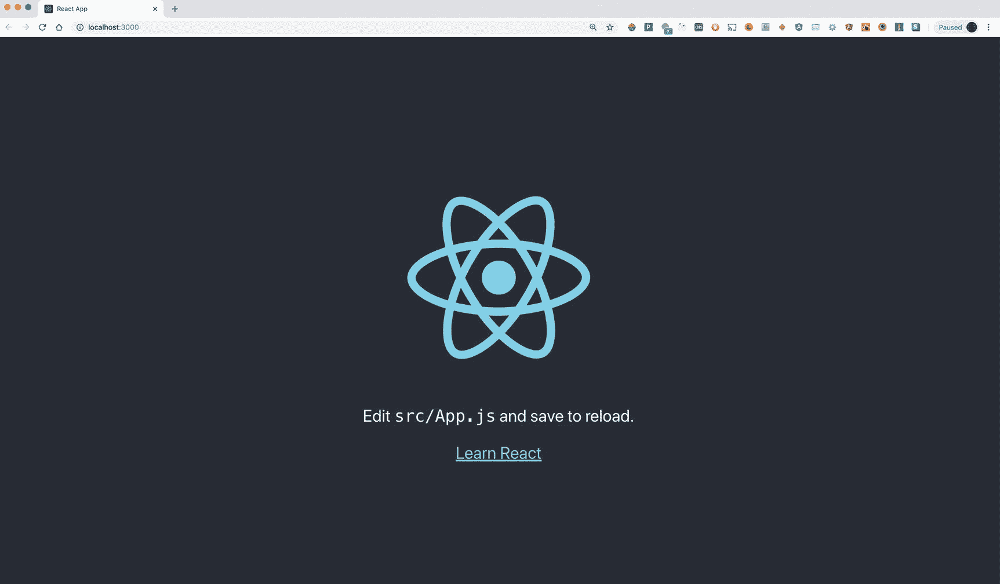
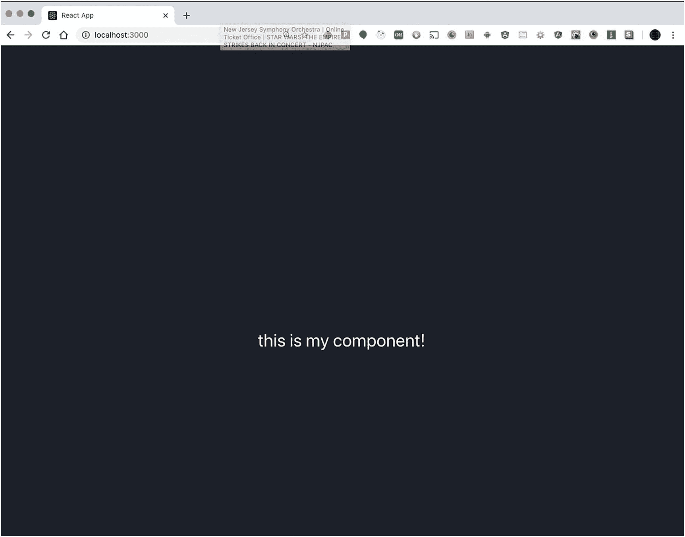
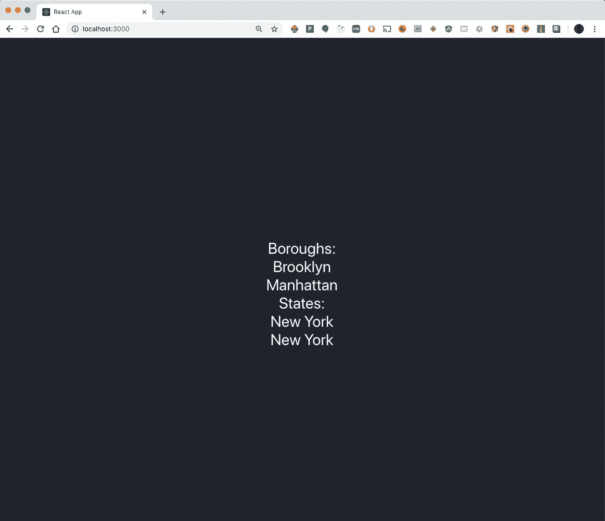
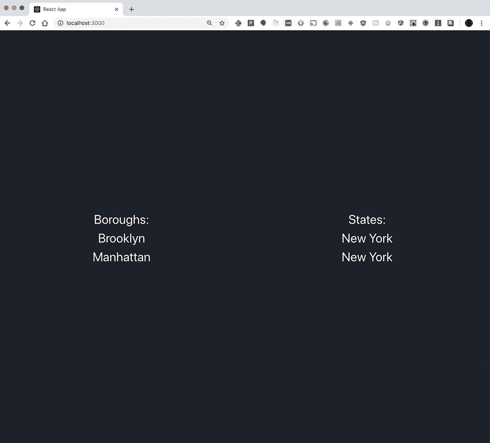
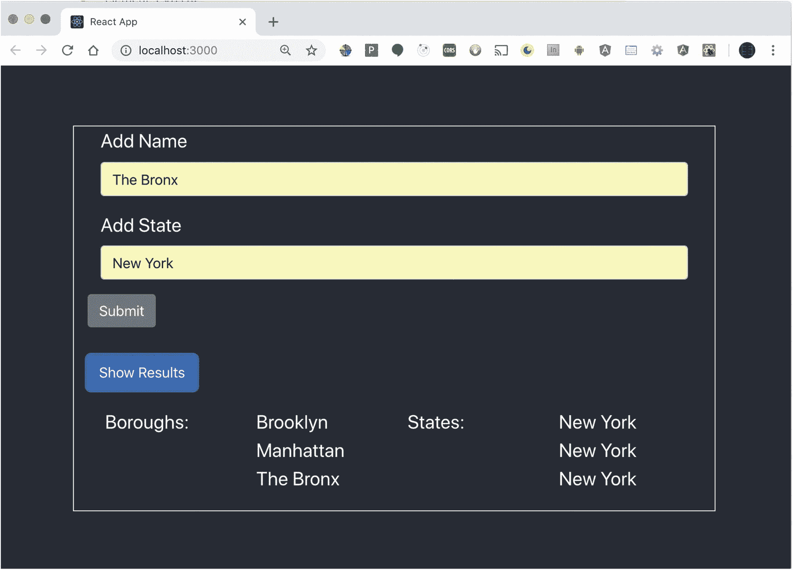

# 十二、JavaScript 和应用框架：React

在上一章中，你能够创建一个 Angular 应用，并通过使用一个代理连接到一个可以访问 MySQL 数据库的节点服务器。通过这种设置，您能够检索数据并将其显示在屏幕上。您还更新了代码，以便可以使用 REST 谓词`POST`将数据从表单发送到服务器，然后在数据库更新后查看结果。

这一章将涵盖一些相同的基础，但你将使用反应，而不是角度。这样做的目的是展示不同的框架如何以不同的方式解决问题。React 让开发人员可以自由选择他们认为能够解决他们所面临的挑战的库。

因为 React 有这个选项，所以很多开发人员喜欢自己把所有东西放在一起。

脸书创造了一种快速组装 React 应用的方法。它类似于 CLI 的角度使用。然而，重要的是要注意，这个工具只是启动一个应用，并不包含像 Angular 那样添加新文件的命令。

与 Angular 类似，如果你想在任何你喜欢的文件夹中创建一个 React 应用，你首先需要安装这个应用。

在命令行中，键入

```js
npm install -g create-react-app

```

这使您能够在任何您喜欢的文件夹中创建 React 应用。

要创建一个全新的 React 应用，请在命令行中键入

```js
npx create-react-app my-app

```

### 面试问题

npm 和 npx 有什么区别？答:npx 允许您执行 npm 注册表中的软件包，而不需要安装它们，而 npm 帮助您管理全局或本地安装在您机器上的软件包。

这个命令为一个基本的 React 应用创建所有的文件和文件夹。要启动该应用，您可以键入

```js
cd my-app
npm start

```

这段代码以与 Angular 应用相同的方式启动应用。浏览器应该如图 [12-1](#Fig1) 所示。



图 12-1

使用 create-react-app 时的默认屏幕

现在，您已经在本地机器上运行了 React，您可以创建组件来调用 API 并在屏幕上显示数据。

React 将自己描述为一个高效的、声明性的 JavaScript 库，用于构建用户界面。记住这一点，您将使用 React 构建一个组件，该组件将从您的 web 服务中检索数据。

由于 React 不能在命令行创建文件，所以您必须手动创建您需要的文件。

所以创建一个名为`components`的文件夹。在该文件夹中，创建另一个名为`boroughs`的文件夹和一个名为`boroughs.js`的文件。这是您创建 React 组件的地方。

为了确保您的新组件将由更大的应用呈现，您需要做一些更改。

在`boroughs.js`文件中，您将导入确保这个 JavaScript 类将与 React 一起工作的代码。该组件看起来应该如清单 [12-1](#PC4) 所示。

```js
import { Component } from 'react';
export class Boroughs extends Component {
     render() {
                   return "this is my component!"
              }
}

Listing 12-1Basic React Component

```

React 组件的语法非常类似于 JavaScript 类。为了让这个类与 React 一起工作，首先要导入`Component`类，并确保当前类扩展了它。

这个类还包含一个名为`render`的方法。它返回所有需要在浏览器中显示的 HTML 代码的结果。

创建好组件后，您需要一种在屏幕上显示它的方式。要加载这个组件，您需要更新`App.js`文件。

每个组件都被视为一个 HTML 标签。您可以导入您创建的类，并让 React 在应用中呈现它。

打开`App.js`并导入新创建的组件。组件的名称是应用中使用的 HTML 标记。更新后的文件应该如清单 [12-2](#PC5) 所示。

```js
import React, { Component } from 'react';
import logo from './logo.svg';
import '.App.css';
import { Boroughs } from '../components/boroughs/boroughs';

export class App extends Component {
     render() {
       return(
               <div className="App">
                   <header className="App-header">
                      <Boroughs/>
                    </header>
               </div>
               );
}
}

Listing 12-2
Updating App.js

```

既然文件已经更新，浏览器应该有更新的版本。你的浏览器应该如图 [12-2](#Fig2) 所示。



图 12-2

呈现基本组件的默认屏幕

React 不像 Angular 那样有服务的概念。但是，React 确实有生命周期方法的概念，就像 Angular 一样。

记住这一点，您将创建一个调用 API 的函数，并在浏览器控制台中显示结果。

## 添加代理和检索数据

就像上一章中的 Angular 应用一样，您需要一个代理将这个应用连接到单独的节点应用。

使用 Create React App 建立代理连接非常简单。在`package.json`文件中，您需要添加一个代理部分。这将指向您的节点应用。

打开`package.json`并添加这一行:

```js
"proxy": "http://localhost:3001",

```

您可能会注意到，在其他示例中，节点应用指向端口 3000。默认情况下，React 和 Node 运行在同一个端口上，所以这将产生冲突。您必须更改节点的端口。这是对节点应用中的`App.js`文件的简单更新。

第 10 章有一个设置 Express 服务器的例子，你可以设置节点监听的端口。如果需要如何更新节点端口的说明，请参考第 [10](10.html) 章。

打开节点应用的文件，将端口号更改为 3001。更新后的变量应该如下所示:

```js
CONST port = 3001;

```

在这两种情况下，您都需要重新启动应用以确保更改生效。您可以更新组件，以便从数据库中检索结果。

React 拥有生命周期事件，可以让您了解组件的当前状态。

这里您将使用`componentDidMount`功能。这将在组件呈现在屏幕上时执行。关于生命周期方法及其工作方式的更详细列表，请查看 React 官方网站上的文档( [`https://reactjs.org/docs/react-component.html`](https://reactjs.org/docs/react-component.html) )。

在这个函数中，您将使用一个名为`fetch`的函数。它不是 React 的一部分；它是 JavaScript 语言的一部分( [`https://developer.mozilla.org/en-US/docs/Web/API/Fetch_API/Using_Fetch`](https://developer.mozilla.org/en-US/docs/Web/API/Fetch_API/Using_Fetch) )。这将使您对服务器的 HTTP 调用通过您的代理路由到节点应用。它将返回所谓的 T4 承诺。

承诺是表示某种事件完成的对象。在本例中，您正在发出一个 HTTP 请求，并期望得到一个回答。该承诺将解决要么完成该请求，在那里你得到一个结果，或失败的请求。

此示例从服务器返回数据。在`then`方法中使用的函数获取结果，将它们转换成 JSON 对象，并将它们返回给`fetch`。第二个`then`方法获取 JSON 对象，并将其转换为要在浏览器控制台中显示的字符串。

现在您已经有了 API 调用的结果，并且知道您有查看结果的方法，本节的最后一部分将介绍如何在屏幕上显示结果。

React 有一个概念叫做*状态*。你可以把状态想象成应用此刻正在做的事情。您可以通过在`constructor`函数中创建一个`state`对象来设置组件的状态。

下一节将展示如何创建默认的`state`，更新`state`，并显示当前在`state`对象中的值。

## 在 React 组件中创建、更新和显示状态

上一节展示了如何在本地机器上使用代理并检索数据。不属于 React 的`fetch`方法用于向服务器发出`GET`请求，并将结果返回给组件。

你现在面临的挑战是将结果显示在屏幕上。

React 中的每个组件都有一个状态概念。在`constructor`函数中，你将创建一个`state`对象。该对象将具有您将创建并赋值的属性。

这两个属性将被称为`boroughs`和`states`。每个属性将保存在一个数组中，你将在一会儿设置这个数组的值*。*

在这个例子中，您将获得 API 的结果，并使用内置的`setState`方法来更新您创建的状态。您的组件应该看起来如清单 [12-3](#PC8) 所示。

```js
import React, { Component } from 'react';

export class Boroughs extends Component {
constructor(props){
           super(props);
           this.state = {
           boroughs: [],
           states:[]
}
}

componentDidMount(){
   let boroughArray = [];
   let stateArray = [];
   fetch('/boroughs').then( (results) => {
      return results.json();
   }).then ( (resultJson) => {
      resultJson.map( (value, index) => {
            boroughArray.push(value.name);

            stateArray.push(value.state);
          });
      this.setState({
          boroughs: boroughsArray,
        state: stateArray
       });
   });
}

  createList(list){
  if (list.length !== 0) {
      const stateList = list.map( (value, index) => {
           return (<div> {value} </div>)
        });
       return stateList
    }
};
     render() {
       return(
              <div>
                  <div>
              <div>Boroughs:</div>
              <div> { this.createList(this.state.boroughs)} </div>;
                  </div>
                  <div>
              <div>States:</div>
              <div> { this.createList(this.state.states)} </div>;
                  </div>

              </div>
                    }
}

Listing 12-3boroughs.js Making an API Call and Displaying the Results on the Screen

```

您导入 React 和`component`类的方式与使用 ES6 导入类的方式相同。React 组件具有与 ES6 类相同的格式。您扩展了`component`类，为这个类提供了框架提供的额外能力。

在这个类中，您使用了`constructor`函数。这个函数在组件被挂载之前被调用。您调用的第一个函数是`super`方法。这样做的原因是，万一你想做的事情，如绑定一个事件处理方法到当前的类。

您还可以访问名为`state` *的属性。*这是你让 React 跟踪变量或对象的地方。这个框架甚至可以让你知道当它被更新时以前的值是什么。

现在，您创建这些属性，并将它们分配给一个空数组，稍后您将对其进行更新。

接下来，你看看你的生命周期方法`componentDidMount`。当组件被插入到 DOM 树中时，就会执行这个操作。这种方法是开始处理任何类型的外部数据的好地方。

您创建两个本地数组，然后使用`fetch`方法。它会让你打电话到远程服务器。由于您的代理，对`/boroughs`的调用将被重定向到您的节点服务器，就像在 Angular 应用中一样。

`fetch`方法允许您链接一个`then`方法，在这里您可以调用一个函数来处理 API 调用的结果。在该函数中，您获取结果并将其作为 JSON 对象返回。随着一个新对象的返回，你链接第二个`then`方法并调用另一个函数。该函数用于使用`map`方法循环数据。当调用`map`中的一个函数时，你遍历每个值，并根据名字或状态将它们添加到本地数组中。

一旦循环结束，您就可以获取两个数组并更新应用的状态。使用内置的`setState`方法，将数组分配给`state`属性。

我们暂且跳过下一个函数，来说说`render`函数。这里是 React 开始处理要在屏幕上显示的 HTML 的地方。花括号让 React 接受变量，并将它们显示为有效的 HTML 标记。从这里，您调用`createList`方法并传递来自您的`state`对象的每个属性。

这就把你带到了`createList`方法。它接受一个名为`list`的参数，这实际上是 React 应用中`boroughs`或`states`状态的替代。

该方法做的第一件事是确保传递的数组长度不为零，这意味着它不能是空数组。确定之后，使用`map`遍历数组并返回一个包含数组中值的 HTML `div`元素列表。这个列表被返回给`render`方法以显示结果。

在`render`方法中调用的函数现在将在浏览器中生成 HTML。见图 [12-3](#Fig3) 。



图 12-3

从节点 API 在屏幕上显示结果

现在 React 已经在屏幕上显示了您的结果，您可以使用 CSS 来显示它们。在下一节中，您将添加 Bootstrap 并更新应用的布局。

## 添加 Bootstrap 以进行反应

就像 Angular 一样，有几种方法可以将 Bootstrap 添加到 React 应用中。添加 Bootstrap 的方法是使用一个名为 reactstrap 的项目。

在 install reactstrap 中，您需要返回到应用底部的命令行，并使用 NPM 来安装库。在命令行中，键入

```js
npm install bootstrap –save
npm install –save  reactstrap react react-dom

```

这将在您的应用中安装 Twitter Bootstrap 和 reactstrap。现在，您可以使用相同的 CSS 类来布局应用。为了让您的应用利用作为应用一部分的 Bootstrap，将其导入到`index.js`文件中，如下所示:

```js
import 'bootstrap/dist/css/bootstrap.min.css'

```

现在，无需更改任何 JavaScript，您就可以更新 React 应用的 HTML 部分。参见清单 [12-4](#PC11) 。

```js
<div className='container-fluid'>
    <div className="row">
           <div className="col">Boroughs:</div>
           <div className='col>States:</div>
    </div>
    <div className="row">
           <div className="col"> { this.createList(this.state.boroughs)} </div>;
           <div className="col"> { this.createList(this.state.states)} </div>;
    </div>
</div>

Listing 12-4Using reactstrap to Lay Out the Content of Your Component

```

如果您再次启动应用，屏幕应该如图 [12-4](#Fig4) 所示。



图 12-4

使用 reactstrap 获得与 Bootstrap 相同的 CSS 类

您的应用现在拥有从数据库返回的信息，并使用 Bootstrap 进行格式化。本章的最后一节将介绍如何创建一个表单，并通过 web 服务将信息发送到数据库。

## 从 React 应用发布数据

您可以从数据库中检索数据，并使用 Bootstrap 将结果格式化为类似表格的布局。现在，您将通过添加一个 HTML 表单来更改这种布局，这样您就可以向数据库中提交新数据，并且在向数据库中添加新信息后，有一个单独的按钮来检索所有结果。

您在前面的示例中使用的一些函数在本练习中仍然有效。但是，该组件将负责调用服务器，然后在浏览器中呈现结果。

现在您已经将 reactstrap 添加到项目中，您可以使用它来使您的表单成形。通过从 reactstrap 库中导入组件，它们将使用 Bootstrap 提供的格式在浏览器中呈现。

你将从把组件作为一个整体来看开始，然后分解所有的单个部分。参见清单 [12-5](#PC12) 。

```js
import React, { Component } from 'react';
import { Container, Col, Form, FormGroup, Label, Input, Button } from 'reactstrap';
import './css/boroughs.css';

export class Boroughs extends Component {
      constructor(props)} {
         super(props);
         this.state = {
           boroughs: [],
           states: [],
           boroughInput: '',
           stateInput: ''
         }
      };

      componentDidMount(){}

      createList = (list) => {
           if(list.length !== 0) {
              const itemList = list.map( (value, index ) => {
                     return (<div> {value} </div>)
                });
              return itemList;
           }
      }

      onSubmitForm = (e) => {
           e,prventDefault();
           fetch( '/boroughs', {method: "POST",
      headers:{'Accept': 'application/json', 'Content-type': 'application/json'},
      body: JSON.stringify({boroughName: this.state.boroughInput, state: this.state.stateInput}) }).then((result) => {
        console.log(result);
           });

    } )
      }

      onBoroughsUpdate = (event) => {
         this.setState({boroughInput: event.target.value});
      }

      onStatusUpdate = (event) => {
         this.setState({stateInput: event.target.valiue});
      }

      showResults = () => {
        let boroughArray = [];
        let stateArray = [];
         fetch('/boroughs').then( (results) => {
           return results.json();
         }).then( (resultJson) => {
          resultJson.map( (value, index ) => {
           boroughArray.push(value.name);
           stateArray.push(vaue.state);
          });
          this.setState({
                boroughs: this.createList(broughsArray),

                states: this.createList(stateArray)
           });
        });

      }

      render(){
            return(
                  <Container className="borough-container">
                         <Form className="form" onSubmit={this.onSubmitform}>
                           <Col>
                               <FormGroup>
                               <Label>Add Name</Label>
                               <Input type="text" value={this.state.boroughInput} onChange={this.onBoroughUpdate) onBlur={this.onBoroughUpdate}/>
                               </FormGroup>
                           </Col>
                           <Col>
                               <FormGroup>
                               <Label>Add State</Label>
                               <Input type="text" value={this.state.stateInput} onChange={this.onStateUpdte}

onBlur={this.onStateUpdate}/>
                               </FormGroup>
                           </Col>
                             <Button>Submit</Button>
                         </Form>
                         <br/>
                  <div>
                   <div className="row">
                         <div className="col">
                               <button className="btn btn-primary" onClick={this.showResults}>Show Results</button>
                         </div>
                   </div>
                   <div className="row resultsPadding">
                      <div className="col">
                         Boroughs:
                   </div>

                   <div className="col">
                        {this.state.boroughs}
                   </div>

                   <div className="col">
                        States:
                   </div>
                   <div className="col">
                     {this.state.states}
                   </div>
                </div>

        </div>
          </Container>
          )
      }
}

Listing 12-5boroughs.js Using reactstrap for Formatting Both Sending and Receiving Data from a Database

```

这个类做了很多工作。好好看看并理解它正在做的一切是有帮助的。让我们从顶部开始，进入所有的细节。

在最顶层，您导入帮助组成您的界面的组件。您以前遇到过 React 组件。其他成分来自反应堆。这些组件使您可以构建看起来相同的表单、列表和按钮，就像您手动为它们分配了引导 CSS 类一样。

第三行允许您导入将在该组件内部使用的 CSS。

在`constructor`函数中，你为你的`state`对象创建一些属性。前两个是数组，后两个是字符串。

您可能会注意到，在本例中没有使用生命周期事件。在这种情况下，请将它们留空。

`createList`函数的工作方式与上一个例子完全相同。它根据传递给它的数组生成一个`div`元素列表。有一点需要注意，因为您正在动态创建新的`div`元素:React 有一个名为`key` *的属性。这就像给 React 渲染的元素一个唯一的 id。更多信息，看一下官方文档( [`https://reactjs.org/docs/lists-and-keys.html`](https://reactjs.org/docs/lists-and-keys.html) )。*

`onSubmitForm`函数首先通过`preventDefault`函数阻止浏览器刷新。然后，它将输入到表单域中的值发送到数据库。

使用`fetch`方法，首先定义端点，然后创建一个对象，通知`fetch`应该如何将数据传递给服务器。

该对象包含一些属性。第一个是您希望`fetch`进行的 REST 跟注类型。在这种情况下，您正在创建一个`POST`,以便更新数据库。第二个属性定义了将要发送到服务器的头。这让服务器知道您将向它发送一些 JSON 数据。

第三个属性是数据本身。它作为发送到服务器的消息正文的一部分发送出去。

数据将由服务器拾取，而不需要对角度示例进行任何更改，并将向数据库添加新记录。

功能`onBoroughsUpdate`和`onStatesUpdate`执行相同类型的动作。在这两种情况下，当有人在输入域中输入时，结果被保存在`state`对象中。当用户点击文本字段之外的内容时，就会执行`onBlur`事件。它将获取文本字段的当前值，并将其分配给`state`对象。

`showResults`函数的执行方式与之前的`componentDidMount`函数相同。这里唯一的区别是，当使用`setState`方法时，你分配`createList`方法的结果。

一旦你使用了`render`方法，当浏览器使你的 UI 可见时，你就进入了你看到的大多数 HTML 元素。例如，您可以看到按钮响应类似于`onClick`的事件，并调用组件中定义的函数。

当运行应用和服务器时，如果您向数据库中添加新的内容，您的屏幕应该看起来如图 [12-5](#Fig5) 所示。



图 12-5

使用 reactstrap 构建表单并从数据库中检索结果

## 向 React 应用添加强类型

React 不像 Agular 那样使用 TypeScript 强制强类型。您可以开发一个 React 应用，并且永远不需要在 JavaScript 中强制类型。

然而，对于大型应用来说，类型安全和 JavaScript 强制数据类型可能会有所帮助。

在 React 应用中使用 Flow ( [`https://flow.org/en/`](https://flow.org/en/) )是可选的，但是它使您能够让编译器检查数据类型，就像 TypeScript 或 Java 等其他语言强制类型一样。同样需要注意的是，如果你喜欢的话，可以使用 React with TypeScript([`https://facebook.github.io/create-react-app/docs/adding-typescript`](https://facebook.github.io/create-react-app/docs/adding-typescript))。

在前面使用 React 的例子中，您使用了`create-react-app`来构建您的应用。记住这一点，您可以快速地向您的应用添加流。在命令行中，键入

```js
npm install –-save-dev flow-bin

```

如果您使用纱线，请键入

```js
yarn add flow-bin

```

安装后，将这一行添加到`package.json`文件的脚本部分:

```js
"scripts":{
  "flow":flow
}

```

现在在命令行中，通过键入以下命令创建一个名为`.flowconfig`的文件

```js
npm run flow init

```

如果您使用纱线，请键入

```js
yarn flow init

```

安装好所有东西后，你现在可以添加`//@flow`或`/* @flow */`到你希望编译器开始检查类型的文件中。要检查您的文件并了解您需要在命令行添加类型的位置，您可以键入

```js
npm run flow check

```

这将寻找每个添加了`//@Flow`的文件。命令行将显示每个文件以及类型的预期位置。

您现在需要了解如何在代码中添加类型。在下一节中，您将看到如何做到这一点。

## 向 React 代码添加类型

每个 React 组件都有自己的内部状态。`state`对象跟踪您希望组件一直知道的值。分配给`state`对象的所有属性都可以被分配强类型。您可以在定义类之前定义这些类型。它应该是这样的:

```js
type State = {
  boroughs: Array<string>,
  states: Array<string>,
  boroughInput: string,
  stateInput: string
}

```

此示例定义了数据类型。您学习了数组是如何工作的；在这里，您定义了数据类型将是一个数组，但是您也定义了在该数组中使用什么类型的数据。在这种情况下，`boroughs`和`states`都将保存一个数组。这里的主要区别是，它将是一个以字符串为值的数组。

如果您向该数组添加不同的数据类型，编译器将会抛出一个错误，因为这里您已经确切地告诉了它将会发生什么。

另外两个属性表示用于向数据库添加新数据的文本字段。在这种情况下，它们都被类型化为字符串。

React 还允许您以同样的方式设置属性的数据类型。一旦设置了类型，您就可以将它们应用到组件:

```js
export class Boroughs extends Component<Props, State>{ }

```

现在如果你把一个数字赋给一个已经被赋了字符串的东西，编译器会抛出一个错误。

使用函数时，语法就像 TypeScript 一样。参数可以设置类型，因此当您将数据传递给函数时，它们必须是该类型。这里有一个例子:

```js
 function doMath(num1: number, num2: number){
      return num1 + num2;
  }
 doMath(5,2);

```

您还可以为变量分配类型:

```js
let username: string = "Hack One";
const accountNumbber: number = 11220;
var currentTime: string = "Time to make the donuts";

```

虽然这只是一个概述，但它让您深入了解了如何确保在处理数据时使用正确的类型。Flow 是可选的，但是很容易将它一次一个文件地添加到现有代码中，或者在开发新项目时对每个文件添加类型检查。

## 摘要

本章探讨了 React 库的一些基础知识。虽然您可以自己将所有部分组合在一起，但 React 有一个命令行界面，可以让您快速地将应用组合在一起。

React 和 Angular share 的一个想法是生命周期事件的概念。这些事件内置于框架中，让您知道组件当前处于哪个阶段。

第一个例子使用了`componentDidMount`事件。当这个事件被触发时，它调用数据库。

另一个例子引入了 Bootstrap 进行布局，并能够设计按钮和表单等样式。

最后一个例子使用了一个向数据库发送`POST`并添加新信息的表单。您还添加了一个按钮，该按钮发出一个`GET`请求并显示来自数据库的所有更新信息。

虽然 Angular 和 React 之间有一些差异，但围绕生命周期事件等概念也有一些非常相似的想法。

Flow 类似于 TypeScript，因为您可以在 JavaScript 应用中实施类型安全。虽然 TypeScript 作为一种语言是 JavaScript 的超集，但 Flow 允许您使用当前的 JavaScript 并对其应用类型。

使用 Flow 的一个好处是可以在编译时发现错误。此外，您可以确保您的函数接收和返回正确类型的数据，以便它们能够正确执行。一个很好的例子就是当你想要更新一个字符串或者计算一个值的时候。

通过利用框架和 JavaScript 知识，您已经能够在本地计算机上开发应用。下一章将向您展示如何将一个应用部署到一个实时服务器上，供其他人查看。