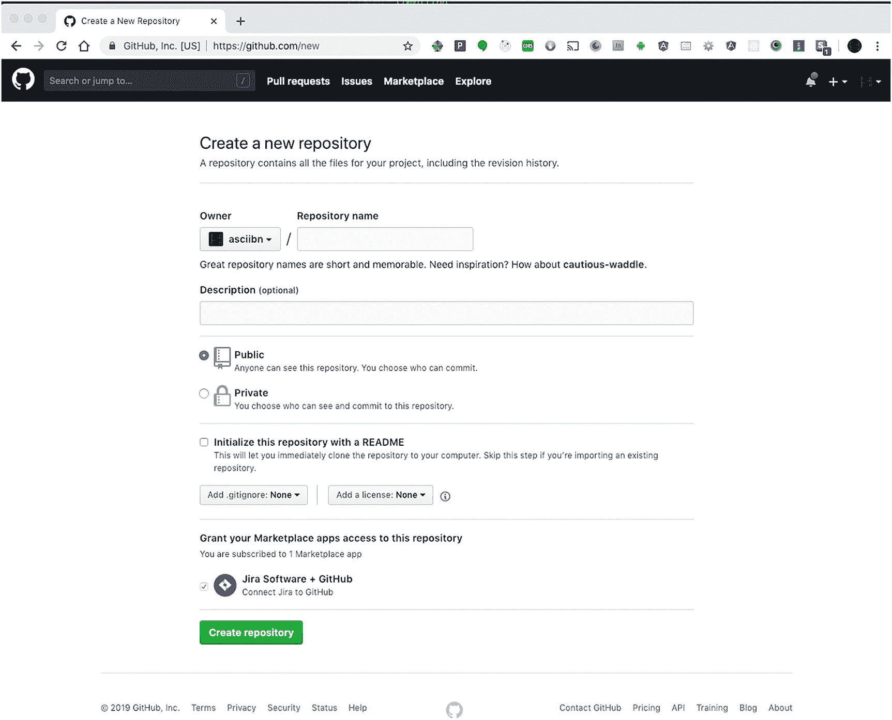
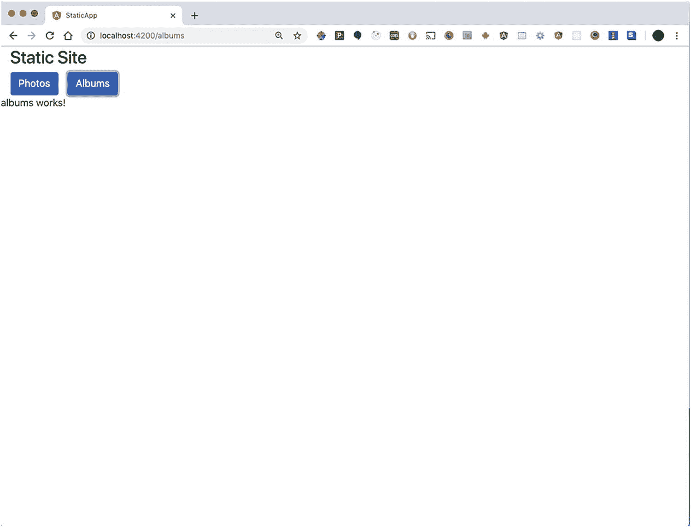
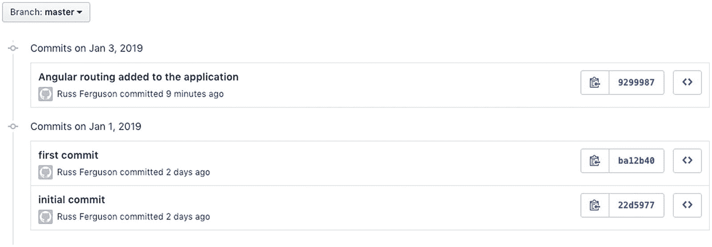
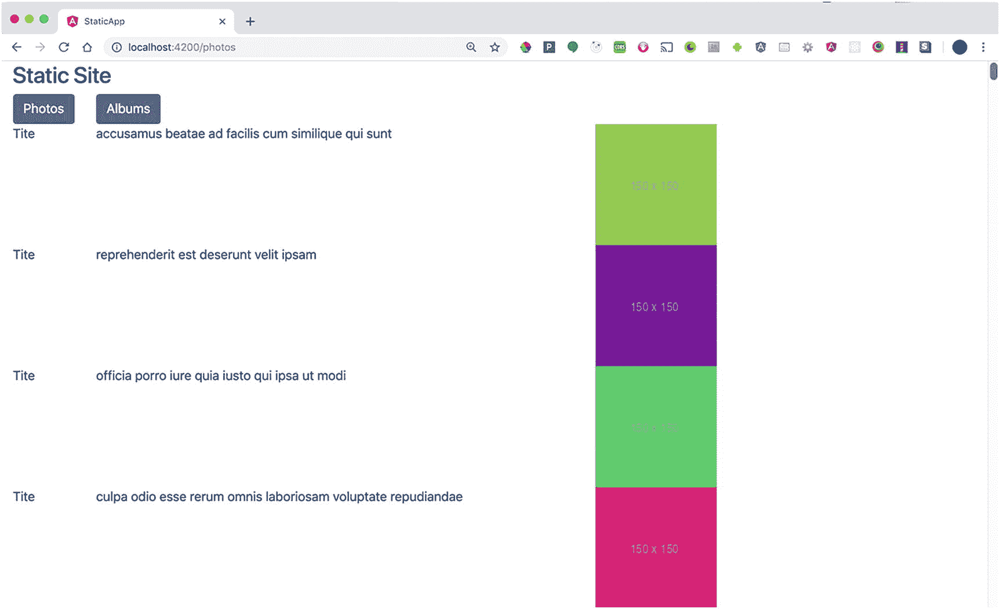
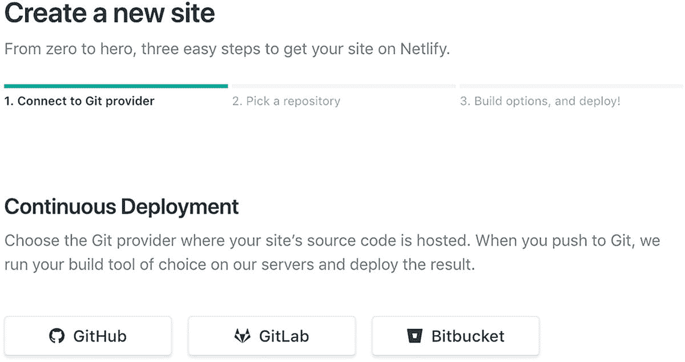
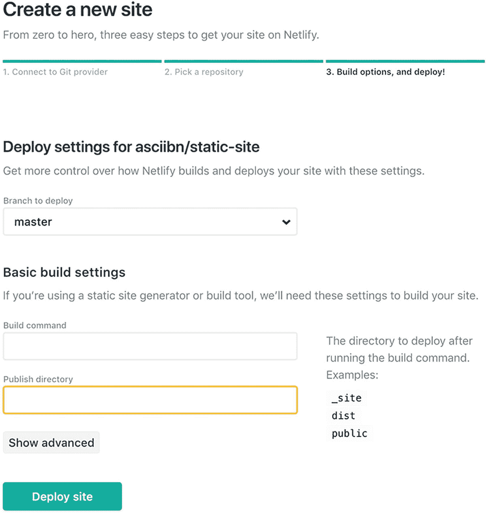

# 十三、JavaScript 和静态部署

您已经在本地机器上进行了大量开发工作，直接在浏览器中使用 JavaScript，然后使用 Angular 和 React 等框架开发依赖于服务器数据的应用。既然您已经了解了使用大型应用是什么样子，那么您可以将这些应用从您的笔记本电脑移动到服务器上，让每个人都可以看到。

对于这个示例，您将使用 JSONPlaceholder 作为您的数据源，并专注于前端开发。

在本书的前几章中，我讨论了如何使用 Git 作为一种跟踪应用随时间推移而发生的所有变化的方式。虽然这很重要，但是 Git 并不能让其他人将网站视为成品。

您需要的是一种将您的代码自动部署到远程服务器的方法，这样访问者就可以看到您所有的努力工作。

本章将首先描述什么是静态站点，以及如何使用 Netlify 这样的服务将你的代码从 GitHub 这样的服务转移到一个动态服务器上。

## 开发 Angular 应用并将其连接到 GitHub

静态网站实际上是使前端工作的所有部分。在这种情况下，它是 HTML、JavaScript、CSS、图像和任何其他媒体，您需要将网站交付给浏览器。

与数据库的所有交互将由一个不同的服务器来处理，该服务器将响应所有的 API 调用。

对于此示例，您将进行基本的角度应用。这就像你的另一个例子。

确保在项目中添加角度路由器。在命令行中，键入

```js
 ng new static-app

```

这段代码把你的裸露的角度应用放在一起。创建好应用后，现在创建一个照片组件和一个相册组件:

```js
cd static-app
ng generate module media
ng generate component media/photos
ng generate component media/albums

```

最后，创建一个将为这两个组件检索数据的服务:

```js
ng generate service /media/services/service

```

一旦所有这些组件和服务都被添加到项目中，您就可以添加 Bootstrap 了，但是方式与过去不同。这里您将使用一个名为 ng-bootstrap ( [`https://ng-bootstrap.github.io`](https://ng-bootstrap.github.io) )的项目。它将为您提供 Bootstrap 的所有功能，而无需安装 jQuery 之类的库。

在命令行中，安装 ng-bootstrap:

```js
npm install  --save bootstrap
npm install -–save @ng-bootstrap/ng-bootstrap

```

添加 Bootstrap 后，您需要确保 Angular 应用可以利用它。有两种方法可以做到这一点。一种是将主模块安装到应用的根目录中。另一种方法是为每个模块只添加您需要的模块，以使该模块工作。

为了让您的应用简单，请打开`app.module.ts`。在这里您可以将 NgbModule 导入到应用中，并将其添加到`imports`数组中。

完成后，打开`angular.json`文件。在 styles 部分中，添加以下代码行，以获取所有内置到 Bootstrap 中的 CSS，以便在您的应用中工作:

```js
"styles": [
  "src/styles.sass",
 "node_modules/bootstrap/dist/css/bootstrap.min.css",
"node-modules/font-awesome/css/font-awesome.min.css"
 ]

```

您的应用现在正处于备份的良好阶段。如果你有一个像 GitHub 或 BitBucket 这样的网站的帐户，你可以为你的代码创建一个新的存储库。

以 GitHub 为例，开源项目可以免费托管。单击 Create repository 按钮，将项目命名为`static-site`。见图 [13-1](#Fig1) 。



图 13-1

使用 GitHub 创建公共存储库

一旦创建了存储库，您将获得将您计算机上的文件连接到远程服务器的指令。

当您使用 CLI 创建站点时，Angular 在您的机器上创建了一个本地存储库。这对于跟踪代码中的变化非常有用，但是如果你想和其他人一起做这个项目，这就没什么帮助了。将代码放在远程服务器上的另一个好处是便于自动部署。你可以抓取网站的最新版本，将编译好的代码转移到一个实时服务器上。

当使用命令行连接 GitHub 时，您可能需要配置一个 SSH 密钥。这将允许您登录 GitHub 并控制您的远程存储库。有关如何设置的信息，请参考 GitHub 的 [`https://help.github.com/articles/adding-a-new-ssh-key-to-your-github-account/`](https://help.github.com/articles/adding-a-new-ssh-key-to-your-github-account/) 。

在命令行中，添加连接到远程服务器的功能:

```js
git add .
git commit -m "first commit"
git remote add origin git@github.com:USER-NAME/static-site.git

```

下一行将文件复制或“推”到服务器:

```js
git push -u origin master

```

现在，您应该在远程服务器上有了站点的副本。这也将为您提供一个可视化的参考，让您了解随着时间的推移文件所发生的变化。

Git 作为工作流工具有一个`branches`的概念。分支只是整个项目的副本。这允许您对项目进行单独的更改。这些更改可以合并到主分支中。

本章并不是 Git 工作流的完整教程；在 [`www.atlassian.com/git/tutorials/comparing-workflows/gitflow-workflow`](http://www.atlassian.com/git/tutorials/comparing-workflows/gitflow-workflow) 可以找到一个很好的带有视觉参考的解释。

现在您已经将应用和存储库放在一起了，下一节将让您使用 Angular router 和 Bootstrap 来创建站点的两个部分。

## 使用角度路由器

上一节让您创建一个添加了路由器的全新 Angular 应用。然后添加引导组件，并将整个项目连接到 GitHub 上的公共存储库。

这一节将向你展示如何使用角度路由器为网站创建一个菜单。当您进行更新时，您将使用 Git 跟踪它们。

这个例子将展示一个非常快速的使用角度路由器的方法。更详细的解释可以在 [`https://angular.io/guide/router`](https://angular.io/guide/router) 找到。

要创建简单的路由函数，向`app.module.ts`添加一些代码。首先，从@ `angular/router`路径导入两个项目。进口`RouteModule`和`Routes`。该行应该如下所示:

```js
import { RouterModule, Routes } from '@angular/router';

```

您还需要导入您的两个可视化组件，`PotosComponent`和`AlbumsComponent:`

```js
import { PotosComponent } from '../media/photos/photos.component';
import { AlbumsComponent } from '../media/albums/albums.component';

```

记住获取这些新导入的组件，并将它们添加到`app.module.ts`文件中的`declarations`数组中:

```js
@NgModule ({
declarations: [
    AppComponent ,
    PhotosComponent,
    AlbumsComponent
  ]
})

```

之后，制作一个对象数组来代表你的路线。这个数组的数据类型为`Routes`，并被分配给一个名为`appRoutes`的变量。路由对象具有预定的属性。这些属性告诉 Angular 路线应该如何工作。

一些属性是

*   `path`:匹配 URL 的路径

*   `patchMatch`:匹配 URL 的正则表达式

*   `component`:当路线被解析时，您希望看到的组件

*   `redirectTo`:找到路径后需要重定向的地方

*   `data`:需要分配给该路线的任何数据

*   `children`:任何子程序，例如`/borough/id`

您的示例将利用这些属性中的两个，`path`和`component` *。*

您的路线将如下所示:

```js
const appRoutes: Routes = [
       {path: 'photos', components: PhotoComponent}.
       {path: 'albums', components: AlbumsComponent}
]

```

制定这些路线很重要。你可以让他们变得更复杂，让他们处理一些问题，比如如果有人没有 Angular 应用可以识别的 URL。您可以设置默认路线。

设置好数组后，您可以将它传递给`imports`数组中的`RouterModule`:

```js
imports: [
 RouterModule.forRoot(appRoutes)
]

```

为了确保您的更新有效，您可以在应用中添加一些按钮，当单击这些按钮时，它们将更新路线。

打开`app.component.html`文件。这里有您构建应用时生成的默认欢迎页面。您需要删除所有这些代码，并添加一些新的内容。

在前面的例子中，您使用 Bootstrap 来布局页面。这个例子将使用相同的技巧。从一个容器开始，然后定义组成页面的行和列。然后，您需要添加一个由 Angular 定义的定制元素来处理您的路线。

清单 [13-1](#PC13) 显示了更新后的页面应该是什么样子。

```js
<div class="container-fluid">
   <div class="row">
     <div class="col-12">
         <h3>Static Site</h3>
     </div>
   </div>

   <div class="row">
       <div class="col-1">
         <button class="btn btn-primary" routerLink='/photos'>Photos</button>
       </div>
       <div class="col-1">
         <button class="btn btn-primary" routerLink='/albums'>Albums</button>
       </div>

   </div>
</div>
<router-outlet></router-outlet>

Listing 13-1The Updated Page

```

这与您在其他示例中使用的布局类型相同。一个很大的区别是你如何使用按钮。该按钮添加了一个名为`routerLink`的属性。该值被传递给路由器，当发现匹配时，在页面上的`router-outlet`元素所在的区域对组件进行角度加载。见图 [13-2](#Fig2) 。



图 13-2

Angular Router 允许您在单页应用中导航

保存文件后，浏览器应该更新，您的按钮应该处于活动状态，能够更改浏览器中的位置并加载适当的组件。

随着文件更新和您的站点提供新功能，现在是保存文件的当前状态并将其保存在存储库中的好时机。

要查看哪些文件已更改，请在命令行中键入

```js
git status

```

你可以看到到目前为止你所处理的文件列表。下一步是告诉 Git 将这些文件添加到 Git 认为的临时区域中:

```js
git add angular.json
git add package-lock.json
git add package.json
git add src/app/app.component.html
git add src/app/app.module.ts
git add src/app/media/media.module.ts

```

现在，您已经有了暂存的文件，是时候进行提交了。这是 Git 保存更改的地方，所以它现在有一种方法来比较文件过去的样子和现在的样子。除了提交之外，您还可以添加一条消息来描述此阶段的更改。

要提交，请键入

```js
git commit -m "Angular routing added to the application"

```

这一行中的`-m`告诉 Git 您想在提交中添加一条消息。它后面是用引号括起来的消息。

您已提交，但所有更改都保存在本地计算机上。您需要做的是将这些更改保存在远程服务器上。这是通过使用`push`命令与 GitHub 上的远程存储库共享更新来实现的:

```js
git push

```

可能会要求您输入 GitHub 密码。然后，更新将被发送到您的存储库中，现在在网站上可以看到这些更改。见图 [13-3](#Fig3) 。



图 13-3

随着时间的推移对应用的更改

您已经能够将导航添加到您的应用中，并随时跟踪您的更改。现在您可以在本地和 GitHub 存储库中看到这些变化。

下一节将向您展示如何使用角度服务提取每个部分的数据。

## 使用角度服务

Angular 中的服务允许您将相同的代码注入或使用到多个组件中。这为您提供了工作分离，组件可以接收并显示数据，服务可以发出远程服务的请求并解析结果。

为了让服务能够调用远程服务，主应用需要将`HttpClientModule`导入并添加到`imports`数组中。打开`app.module.ts`文件，导入模块:

```js
import { HttpClientModule } from '@angular/common/http';

```

现在，您可以指导您的服务进行远程调用。打开`service.service.ts` *。*在这里，您可以导入`HttpClient`库进行调用:

```js
import _{ HttpClient } from '@angular/common/http';

```

使用`constructor`函数，您创建了您的`http`实例:

```js
constructor ( private http: HttpClient ) { }

```

最后，添加两个方法，一个获取所有照片，另一个获取所有相册:

```js
getAlbums() {
   return this.http.get('https://jsonplaceholder.typicode.com/albums ');
}

getPhotos() {
   return this.http.get('https://jsonplaceholder.typicode.com/photos ');
}

```

服务的一个好处是可以在多个组件中使用它们。在下一个示例中，您将服务注入到组件中。这两个组件的工作方式相同。每个组件都需要导入服务，并在构造函数中创建一个实例。

下一个例子展示了如何使用这个服务在`PhotosComponent`中检索照片。该服务也可以以同样的方式在`AlbumsComponent`内部使用。

在构造函数中已经创建了`service`对象。当组件运行生命周期方法`ngOnInit`时，服务将运行方法`getPhotos`并将结果返回给组件。在`AlbumsComponent`的情况下，它将运行方法`getAlbums`。

部分`PhotosComponent`代码应该是这样的:

```js
constructor (private: service: ServiceService) {}
ngOnInit() {
   this.service.getPhotos().subscribe( (results) => {
      this.photoResults = results;
    });
}

```

现在可以用 web 服务的结果更新 HTML 模板了。使用`*ngFor`指令遍历结果数组，显示从服务返回的标题和缩略图。见清单 [13-2](#PC23) 。

```js
<div class="container-fluid">
     <div *ngFor="let photo of photosResult" class="row">
          <div class="col-1">
               <p>Title</p>
          </div>
          <div class="class=col-6">
               <p>{{photo.title}}</p>
          </div>
          <div class="col-2">
               
          </div>
      </div>

</div>

Listing 13-2The HTML Template

```

这个例子展示了如何在结果中创建一个`for`循环并获取细节。这些细节将生成创建所需的所有行和列所需的所有 HTML。需要指出的重要一点是图像的生成。因为 URL 是由 web 服务调用的结果生成的，所以您可以将该值应用于图像的来源，并且该图像将在浏览器中呈现。见图 [13-4](#Fig4) 。



图 13-4

调用 photos API 的渲染结果

您的站点现在有一些路线，您可以通过使用按钮或键入 URL 来直接访问。这些路由呈现使用相同服务类的组件，以调用您的数据源并在屏幕上呈现结果。

您对一些文件进行了更新以使其工作。现在是记录这些变化的好时机。回到命令行，使用相同的 git 命令保存应用的当前状态。

首先，检查已更改文件的状态:

```js
git status

```

如果所有已更改的文件都在同一个文件夹中，例如`src`文件夹，您可以使用快捷方式转移它们:

```js
git add src

```

如果更新的文件在其他文件夹中，您必须添加这些文件的路径。如果你愿意，你可以再次检查状态，看看是否所有的文件现在都在隐藏中。

接下来，您提交:

```js
git commit -m "Routing and Service added"

```

最后，您将更改推送到服务器:

```js
git push

```

像前面的例子一样，这会将所有文件从您的本地机器复制到 GitHub 服务器，并记录对这些文件所做的所有更改。

现在，您既有了一个工作站点，又有了站点工作所需文件的备份。有了 GitHub 上的源代码，您现在可以将它连接到一个服务，该服务将部署您的应用，并使它对全世界可用。

下一节将讨论如何连接到 Netlify，这是一种旨在提供应用前端的服务，也称为静态站点。

## 将静态站点部署到网络

Netlify ( [对于在个人网站上工作的人来说，有一个免费层。一旦注册，开发者可以使用他们已经拥有的由该服务开发的域名，或者购买一个他们可以通过该服务自行管理的域名。](http://www.netlify.com/)

部署一个站点使你能够指向你自己的当前在 GitHub 中的源代码。让服务复制文件，构建项目，并将最终结果推送到一个具有公共地址的服务器上，在那里每个人都可以看到您的站点。

浏览器窗口的右上角是一个名为“来自 Git 的新站点”的按钮。点击它。下一个屏幕询问源代码的位置。这就是为什么把它从本地机器转移到像 GitHub 这样的服务上是很重要的。选择您正在使用的服务。Netlify 将请求您允许访问您在其他服务上的帐户。一旦授予了权限，您就可以指向您创建的用来保存静态站点的存储库。见图 [13-5](#Fig5) 。



图 13-5

创建新站点时，您需要指向代码存储库

当选择包含所有代码的存储库时，Netlify 会询问您想要部署哪个分支。在这种情况下，您只有一个分支，所以它是*主*。它还会询问应该运行什么命令来编译应用。在本例中，您使用的是 Angular，所以命令是`ng build`。请记住，您需要构建网站，以便所有代码都可以转换为浏览器可以理解的 JavaScript。它需要知道的最后一件事是在哪里找到完成的站点。这个在`dist/static-app`文件夹里。见图 [13-6](#Fig6) 。



图 13-6

将 Netlify 引导到构建站点，并指出在哪里可以找到完成的文件

给它几分钟，Netlify 会给你一个网址，你可以在那里看到你的生活网站。然后，您可以在浏览器中查看该 URL，甚至可以将该 URL 发送给朋友，他们可以在那里看到您网站的实时版本。

现在您的帐户和项目已经运行，您可以使用该服务提供的一些其他功能，如设置自定义域或为您的站点添加安全性的能力。

## 摘要

这一章在一个非常基础的层面上讲述了构建一个 web 应用的生产过程。开发人员在本地机器上工作，从远程数据源检索数据，并显示结果。组成项目的文件保存在一个存储库中，其中包含一段时间内的更改历史。最后，文件被转移到一个服务中进行编译，最终版本被发布到网站现在所在的服务器上。

您的 Angular 应用使用 routes 来更新浏览器中的 URL，并按需显示某些组件。您还创建了一个服务，它负责向 web 服务发出请求，并将结果发送回组件，以便组件可以在浏览器中呈现结果。

随着时间的推移，保存文件的当前状态是一个好主意。这是通过 Git 这样的版本控制软件完成的。使用 Git 这样的工具不仅可以让您了解文件是如何随时间变化的，而且当项目在公共存储库中时，您还可以与其他人共享这些文件。当你在你的项目中工作时，当你觉得你处于一个好的位置时，这是一个用 Git 保存文件当前状态的好时机。 [`www.atlassian.com/git/tutorials`](http://www.atlassian.com/git/tutorials) 有非常好的教程。

在开发项目并跟踪源代码之后，是时候部署应用了。在本章中，您使用了一个名为 Netlify 的服务。还有其他方法来部署你的站点，但是本章的重点是展示如何获取源代码并自动将完成的版本部署到服务器上。