## 第二章

## 【PhoneGap 入门

PhoneGap 是一个 HTML5 应用程序框架，用于通过 web 技术开发本地应用程序。这意味着开发人员可以利用他们现有的 HTML、CSS 和 JavaScript 知识开发智能手机和平板电脑应用程序。有了 PhoneGap，开发人员就不必为 iPhone 学习像 Objective-C 这样的语言了。

使用 PhoneGap 开发的应用程序是混合应用程序。这些应用程序不完全基于 HTML/JavaScript，也不是本地的。应用程序的各个部分，主要是 UI、应用程序逻辑和与服务器的通信，都是基于 HTML/JavaScript 的。与设备(手机或平板电脑)进行通信和控制的应用程序的另一部分基于该平台的本地语言。PhoneGap 提供了从 JavaScript 世界到平台本地世界的桥梁，允许 JavaScript API 访问和控制设备(手机或平板电脑)。

PhoneGap 本质上为 JavaScript API 提供了对设备(手机或平板电脑)功能的访问，如摄像头、GPS、设备信息等。这些 API 将在第 4 章中详细介绍。

本章首先为您提供理解 PhoneGap 整体架构的适当信息。然后，我们将在 PhoneGap 示例中应用这些信息。在本章的最后，我们将使用 PhoneGap 编写一个小的 Hello World 应用程序。

**注:** PhoneGap 是一个框架；它没有为编码提供任何 ide 或特殊的开发环境。您将需要使用 Eclipse 和 Android SDK 来为 Android 开发 PhoneGap 应用程序；您需要使用 Xcode 为 IPhone 开发 PhoneGap 应用程序。

### PhoneGap 架构

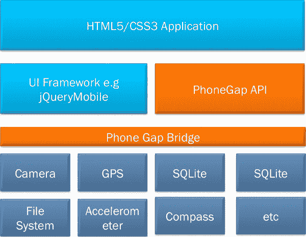

**图 2–1。** *PhoneGap 应用架构*

PhoneGap 框架主要是一个 JavaScript 库，允许 HTML/JavaScript 应用程序访问设备功能。PhoneGap 框架也有一个本地组件，它在幕后工作，并在设备(手机或平板电脑)上完成实际工作。

请参考[图 2–1](#fig_2_1)了解 PhoneGap 的整体架构。使用 PhoneGap 构建的应用程序主要由两部分组成:

1.  JavaScript 业务逻辑部分，驱动 UI 及其功能。
2.  JavaScript 部分，用于访问和控制设备(手机或平板电脑)。

考虑一个脸书应用程序。该应用程序的主要部分将是登录页面，并下载照片库。现在你想添加一个你可以拍照并上传到脸书的模块。为了做到这一点，您可以调用 PhoneGap 的相机 API 来访问手机的相机，拍摄照片，并获取图片文件。下一步是对脸书服务器的 AJAX 调用，以便上传图片。另一个可以应用的例子是使用 PhoneGap 在数据库中存储朋友列表，这样我们就可以搜索当地的朋友。

前面的描述给人的印象是，在 PhoneGap 中开发移动应用程序需要编写更多的业务逻辑和 UI，而很少访问设备的功能，这是正确的。这本书不仅解释了 PhoneGap APIs，也是创建基于 HTML5/CSS3 的移动应用程序的指南。

### 在 Android 上设置环境

创建 PhoneGap 应用程序的第一步是设置一个移动开发环境。我们将从 Android 开始，因为 Android 应用程序是用 Java 开发的，Java 基于 Eclipse，支持 PhoneGap 的几乎所有功能。

您需要下载并安装 Android 的以下必备软件:

1.  JDK 1.6 以上
2.  Eclipse 3.4 到 3.6
3.  采用 Android 2.2 平台的 Android SDK
4.  Eclipse 的 Android ADT 插件
5.  Android 2.2 版的 Android AVD
6.  Android 版 PhoneGap SDK 1.1.0

由于 Android 是用 Java 编程的，所以我们需要 JDK 1.6+和 Eclipse 3.4+。然后我们将安装 Android SDK。Android SDK 是一个通用的 SDK，不支持任何平台。一个平台就是一个操作系统版本，例如 2.2 版的 Froyo、2.3 版的津嘉·布雷德和 3.0 版的蜂巢。为了创建、构建和运行 Android 项目，需要下载这些平台。这个插件叫做 Android ADT 插件。

一旦 Eclipse、Android SDK 和 Android ADT (Eclipse 插件)都设置好了，我们就需要为 Android 创建一个模拟器环境。这被称为准备 Android AVD (Android 虚拟设备)。如果我们正在为 Android 开发一个针对 2.2 Froyo 的 PhoneGap 应用程序，我们需要一个相同 Android 平台的 AVD。

以下步骤将解释如何创建一个 Android 项目并将 PhoneGap 库注入到 Android 中。

#### PhoneGap Android 项目的必需安装

1.  安装 Eclipse 的 3.4 版本。
2.  安装 Android SDK。
3.  为 Eclipse 安装 Android ADT 插件。
4.  为模拟器创建 AVD。
5.  安装 PhoneGap 库。

##### 第一步:安装 Eclipse

这一步假设您已经安装了 Java SDK 1.6。安装完成后，从`[www.eclipse.org/downloads/](http://www.eclipse.org/downloads/)`下载 Eclipse。参见[图 2–2](#fig_2_2)查看 eclipse 下载页面。我们需要一个支持 JDT (Java 开发环境)的 Eclipse IDE 版本 3.4+。您应该为 Java 开发人员安装 Eclipse IDE。

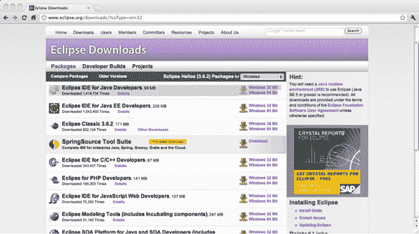

**图 2–2。** *月食下载页面*

##### 第二步:安装 Android SDK

设置 Android 开发环境的一些步骤是依赖于平台的。为了避免任何混淆，我们将解释如何以特定于平台的方式执行每个步骤。

从`[http://developer.android.com/sdk/index.html](http://developer.android.com/sdk/index.html)`开始下载 Android SDK(参见[图 2–3](#fig_2_3))。

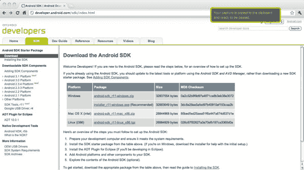

**图 2–3。** *Android SDK 下载页面*

###### 针对 Windows 的说明

使用 Android 安装程序，安装程序 r11-windows.exe 安装 Android SDK。这是推荐的 Windows 安装技术。另一种方法是下载 android-sdk r11-windows.zip 文件，并将其解压缩到一个文件夹中。我们假设 Android SDK 被提取到 c:\android_sdk。

###### 【Linux 操作说明

下载 Archie Android-dk _ r11-Linux _ x86 . tgz 归档文件并解压到一个文件夹中。

###### Mac OSX 英特尔指令

下载存档 android-sdk_r11-mac_x86.zip 文件，并将其解压缩到文件夹中。

这个 Android SDK 可以支持目前已经发布的所有 Android 平台。这些平台包括 Android 1.1 平台到最近的 Android 3.0(蜂巢)平台。由于没有人需要所有的平台，Android SDK 没有预装任何平台。

对于本书，我们将只关注 SDK 平台:Android 2.2、API 8 和 revision 3。

由于没有预装平台，下一步是安装您感兴趣的平台。转到 Android SDK 位置(在我们的例子中是 c:\android_sdk)，在 tools 文件夹中打开一个名为 Android 的可执行文件。如果您有带宽限制，不要下载所有平台，只下载 Android 2.2 平台(SDK 平台 Android 2.2、API 8 和修订版 3)。

这将打开在[图 2–4](#fig_2_4)中看到的以下屏幕。选择可用的包选项，检查 Android 存储库，然后单击 Install。

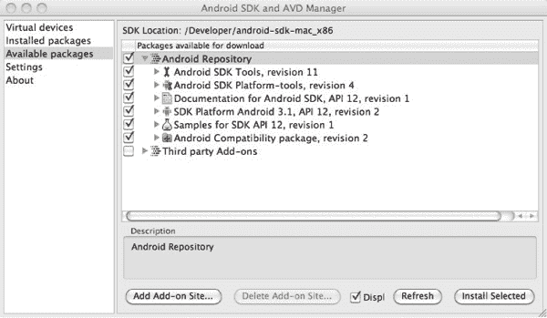

**图 2–4。** *可以安装的可用平台包*

既然您已经下载了平台，那么您就拥有了为目前已经发布的所有 Android 版本创建应用程序的必要工具。

建议您安装所有可用的包，这样您就可以有工具为已经发布的任何 Android 平台创建 Android 项目。

如果你想开发一个适用于 Froyo (Android 2.2)的移动应用，你需要有 Froyo (Android 2.2。)列在已安装的软件包中。

##### 步骤 3:为 Eclipse 安装 Android ADT 插件

1.  启动 Eclipse 并点击 Help->Install New Software 打开可用软件对话框。
2.  在“使用”文本框中，输入 URL `[https://dl-ssl.google.com/android/eclipse](https://dl-ssl.google.com/android/eclipse)`，如[图 2–5](#fig_2_5)所示。
3.  当您看到安装开发人员工具的选项时，单击它，选中开发人员工具复选框中的所有复选框，然后单击下一步。

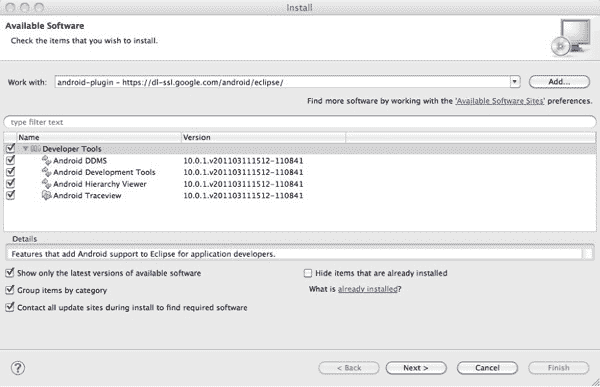

**图 2–5。** *为 Eclipse 安装 Android ADT 插件*

1.  用之前安装的 Android SDK 的位置配置 Android ADT 插件。通过单击 Windows-> Windows 的首选项和 Eclipse-> Mac 的首选项打开 Eclipse 的首选项。如果您收到未签名内容警告对话框，您可以安全地忽略它。
2.  In the Preferences pane, click and expand the Android option. You will see Android Preferences pane as shown in [Figure 2–6](#fig_2_6). In the Android Preferences pane, put in the location of the Android SDK in the SDK Location text box, and hit Apply.

    如果 Android SDK 的位置是正确的，您应该在 Target Name 下看到许多选项，包括 Android 2.2。

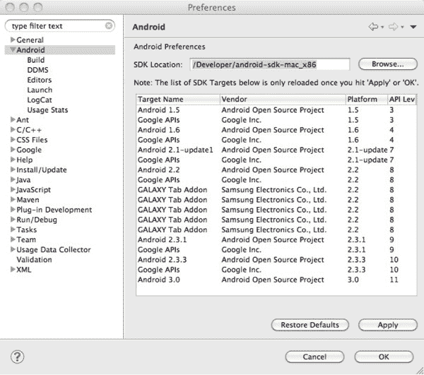

**图 2–6。** *在 Android 首选项屏幕中设置 Android SDK 的位置。*

##### 步骤 3:为 Android 2.2 平台创建 Android AVD

1.  Open Eclipse and create a workspace for the Android PhoneGap. The next step is to create an emulator for Android. Since Android comes with many platform versions, we have to create an Android Virtual Device (AVD) for each platform that is targeted. In [Figure 2–7](#fig_2_7), you will see your eclipse as depicted in the screen.

    请注意，Android 模拟器运行的是 Android 虚拟设备(AVD)。

    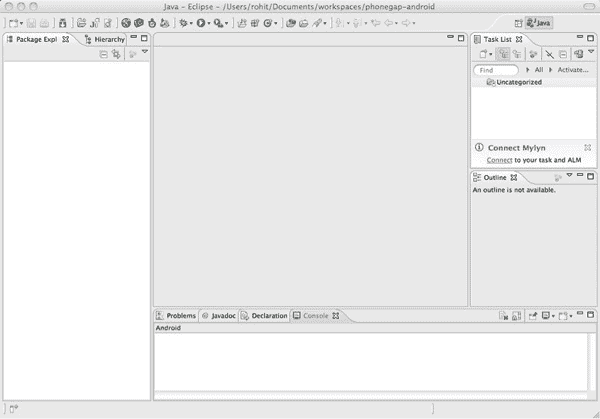

    **图 2–7。** *带 ADT 插件的 Eclipse。*

2.  Click on the  button on the toolbar to open the Android SDK and the AVD Manager. Choose the Virtual Devices option as depicted in [Figure 2–8](#fig_2_8). 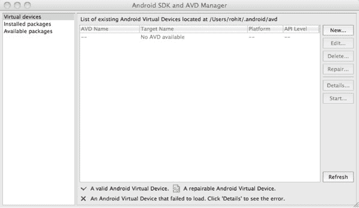

    **图 2–8。***Android SDK 和 AVD 管理器*

3.  点击新建按钮创建一个新的 AVD。选择 Android 2.2 平台，也就是 Froyo。选择 128 MB 的 SD 卡大小，并选择皮肤内置为 HVGA。填写完所有内容后，单击 Create AVD。参见[图 2–9](#fig_2_9)查看“AVD 屏幕”的样子。

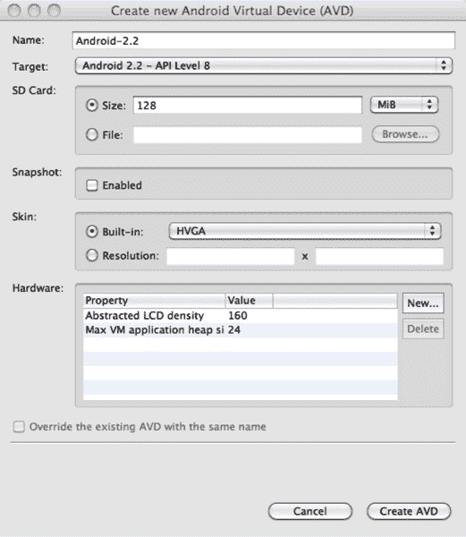

**图 2–9。** *创建一个新的 Android 虚拟设备(AVD)在 Android 模拟器中运行*

您将看到创建的 AVD，如[图 2–10](#fig_2_10)所示。

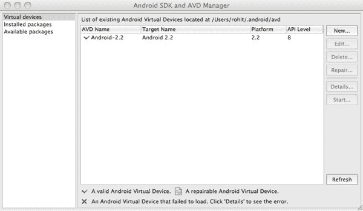

**图 2–10。** *安卓 2.2 平台的 AVD(Froyo)*

##### 步骤 4:安装 PhoneGap SDK

1.  Download the PhoneGap SDK 1.1.0 from the following link, `[http://phonegap.googlecode.com/files/phonegap-1.1.0.zip](http://phonegap.googlecode.com/files/phonegap-1.1.0.zip)`. After this zip is extracted you should see a directory structure, as seen in [Figure 2–11](#fig_2_11). 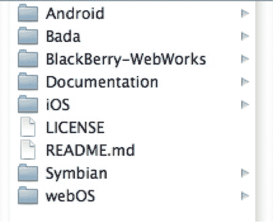

    **图 2–11。** *PhoneGap SDK 1.1.0 目录结构*

2.  选择 Android 目录，你会看到 phonegap-1.1.0.jar 和 phonegap-1.1.0.js 文件(见[图 2–12](#fig_2_12))。

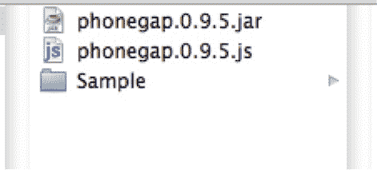

**图 2–12。***PhoneGap SDK 内的 Android 文件夹。*

这就完成了 Android PhoneGap 的设置。

#### 创建新项目

本书中的第一个应用程序是 Hello World 应用程序。加载 PhoneGap 框架后，Hello World PhoneGap 移动应用程序会在屏幕上显示 Hello World。

##### 第一步:创建一个 Android 项目

打开 Eclipse，点击文件->新建项目->Android 项目。这将打开一个 Android 项目对话框，如[图 2–13](#fig_2_13)和[图 2–14](#fig_2_14)所示。这显示在以下步骤中:

1.  将 PhoneGap-helloworld 作为项目名称。
2.  确保您已经选择了 Android 2.2 作为构建目标。
3.  输入 Helloworld 作为应用程序名称。这是应用程序的可读名称。
4.  输入`org.examples.phonegap.sample`作为包名。Android market 中的一个应用程序是由包名唯一标识的。Android market 上不能有两个具有相同包名的 Android 应用程序。
5.  选中“创建活动”复选框，并输入 helloworld 作为活动名称。Android 中的活动是一个屏幕。并且活动名也是活动的类名。
6.  在 min SDK 版本中放 7。这意味着您将允许所有 Android 2.1 设备平台(也称为 clair Android 手机)搜索和安装该应用程序。

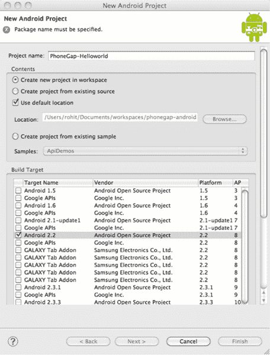

**图 2–13。** *安卓项目创建*

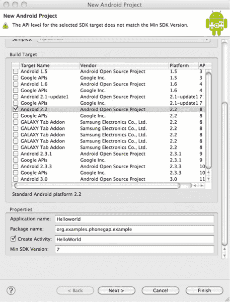

**图 2–14。** *Android 项目创建。*

##### 步骤 2:将 PhoneGap 库添加到项目中

一旦创建了 Android 项目，就该将 PhoneGap 框架注入到 Android 项目中了。正如我们之前提到的，PhoneGap 有三个主要组件:原生组件、XML 插件和 JavaScript 文件。

1.  要在 Android 中安装原生组件，在项目中创建一个名为 lib 的目录，并将 PhoneGap jar 复制到其中。您可以将`phonegap-1.1.0.jar`拖放到 lib 文件夹中，也可以将其复制并粘贴到 Eclipse IDE 的 lib 文件夹中。接下来，通过右键单击 Build Path - > Add to Build Path，将 PhoneGap jar 添加到类路径中。这在[图 2–15](#fig_2_15)中突出显示。
2.  Copy the XML directory from the PhoneGap’s Android Directory into the res folder. 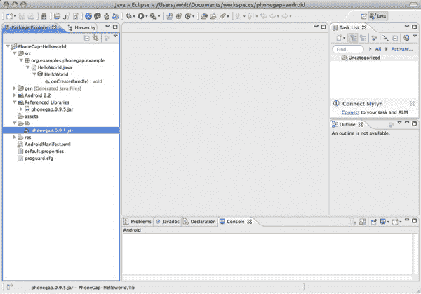

    **图 2–15。** *突出显示 Android 项目中 PhoneGap jar 的位置*

3.  一旦 PhoneGap Jar 被添加到 Android 项目中，就该将 PhoneGap 的 JavaScript 文件注入到项目中了。我们将在 Android 项目的 Assets 文件夹下创建一个 www 文件夹。Assets 文件夹类似于 Android 应用程序的 media 文件夹。在我们的例子中，我们将把基于浏览器的应用程序的所有文件放在 www 文件夹中。首先，将 PhoneGap JavaScript 文件添加到 www 文件夹中，该文件夹位于 Assets 文件夹中。这在[图 2–16](#fig_2_16)中突出显示。

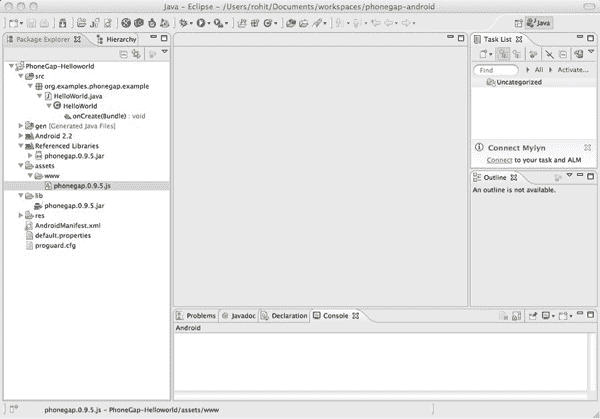

**图 2–16。** *突出显示 PhoneGap JavaScript 文件在 Android 项目中的位置*

##### 第三步:修改 Android 权限

在 Android 应用程序中，主文件是 Android 清单文件。在这个文件中有许多特定的东西，比如包名，它们唯一地标识了市场上的应用程序。主文件包含一个名为 permissions 的部分。Android 使用这一部分来通知用户应用程序将使用手机的某些功能。假设一个应用程序打算使用互联网获取数据；需要获得许可才能安装应用程序。当用户安装应用程序时，Android market 会向他显示该应用程序将被允许使用互联网。

对于 PhoneGap，需要添加以下权限:

1.  向 Android 清单 XML 添加以下权限:`<uses-permission android:name=*"android.permission.CAMERA"* />
               <uses-permission android:name=*"android.permission.VIBRATE"* />
               <uses-permission android:name=*"android.permission.ACCESS_COARSE_LOCATION"* />
               <uses-permission android:name=*"android.permission.ACCESS_FINE_LOCATION"* />
               <uses-permission
    android:name=*"android.permission.ACCESS_LOCATION_EXTRA_COMMANDS"* />
               <uses-permission android:name=*"android.permission.READ_PHONE_STATE"* />
               <uses-permission android:name=*"android.permission.INTERNET"* />
               <uses-permission android:name=*"android.permission.RECEIVE_SMS"* />
               <uses-permission android:name=*"android.permission.RECORD_AUDIO"* />
               <uses-permission android:name=*"android.permission.MODIFY_AUDIO_SETTINGS"* />
               <uses-permission android:name=*"android.permission.READ_CONTACTS"* />` `           <uses-permission android:name=*"android.permission.WRITE_CONTACTS"* />
               <uses-permission android:name=*"android.permission.WRITE_EXTERNAL_STORAGE"* />
               <uses-permission android:name=*"android.permission.ACCESS_NETWORK_STATE"* />`
2.  我们还需要在清单文件中添加 supports-screen 选项，如下所示:`<supports-screens
          android:largeScreens=*"true"*
          android:normalScreens=*"true"*
          android:smallScreens=*"true"*
          android:resizeable=*"true"*     
         android:anyDensity=*"true"* />`
3.  将`android:configChanges=orignetation|keyboardHidden`添加到 Android 清单中的活动。这告诉 Android 当用户翻转手机，屏幕从纵向切换到横向时，不要取消和重新创建活动，反之亦然。
4.  通过应用以下 XML 片段，在前一个活动之后添加第二个活动:

`<activity android:name="com.phonegap.DroidGap" android:label="@string/app_name" android:configChanges="orientation|keyboardHidden">
        <intent-filter> </intent-filter>
</activity>`

一旦您按照前面的说明修改了 Android Manifest，就会出现一个 Android Manifest XML。将会看到如下内容:

`<?xml version=*"1.0"* encoding=*"utf-8"*?>
<manifest xmlns:android=*"http://schemas.android.com/apk/res/android"*
     package=*"org.examples.phonegap.helloworld"* android:versionCode=*"1"*
     android:versionName=*"1.0"*>
     <supports-screens android:largeScreens=*"true"*
          android:normalScreens=*"true"* android:smallScreens=*"true"*
          android:resizeable=*"true"* android:anyDensity=*"true"* />
     <uses-permission android:name=*"android.permission.CAMERA"* />
     <uses-permission android:name=*"android.permission.VIBRATE"* />
     <uses-permission android:name=*"android.permission.ACCESS_COARSE_LOCATION"* />
     <uses-permission android:name=*"android.permission.ACCESS_FINE_LOCATION"* />
     <uses-permission android:name=*"android.permission.ACCESS_LOCATION_EXTRA_COMMANDS"* />
     <uses-permission android:name=*"android.permission.READ_PHONE_STATE"* />
     <uses-permission android:name=*"android.permission.INTERNET"* />
     <uses-permission android:name=*"android.permission.RECEIVE_SMS"* />
     <uses-permission android:name=*"android.permission.RECORD_AUDIO"* />
     <uses-permission android:name=*"android.permission.MODIFY_AUDIO_SETTINGS"* />
     <uses-permission android:name=*"android.permission.READ_CONTACTS"* />
     <uses-permission android:name=*"android.permission.WRITE_CONTACTS"* />
     <uses-permission android:name=*"android.permission.WRITE_EXTERNAL_STORAGE"* />
     <uses-permission android:name=*"android.permission.ACCESS_NETWORK_STATE"* />
     <uses-sdk android:minSdkVersion=*"7"* />

     <application android:icon=*"@drawable/icon"* android:label=*"@string/app_name"*>
          <activity android:name=*"HelloWorld"* android:label=*"@string/app_name"*
               android:configChanges=*"orientation|keyboardHidden"*>` `               <intent-filter>
                    <action android:name=*"android.intent.action.MAIN"* />
                    <category android:name=*"android.intent.category.LAUNCHER"* />
               </intent-filter>
          </activity>
          <activity android:name=*"com.phonegap.DroidGap"* android:label=*"@string/app_name"*
               android:configChanges=*"orientation|keyboardHidden"*>
               <intent-filter>
               </intent-filter>
          </activity>
     </application>
*</manifest>*`

##### 第 4 步:修改主活动

在 Android 中，一个名为 activity 的类代表一个屏幕。为了让我们在 Android 中使用 PhoneGap，我们将把屏幕从活动更改为 DroidGap。DroidGap 是一个特殊的活动，它允许我们显示 HTML 页面。该类如 HelloWorld 类的[图 2–17](#fig_2_17)所示。

**注意:**我们告诉 DroidGap 在 Android 资产中加载 index.html 文件。

`package org.examples.phonegap.helloworld;

import android.os.Bundle;

import com.phonegap.DroidGap;

public class HelloWorld extends DroidGap {
     /** Called when the activity is first created. */
     @Override
     public void onCreate(Bundle savedInstanceState) {
          super.onCreate(savedInstanceState);
          super.loadUrl("file:///android_asset/www/index.html");
     }
}` 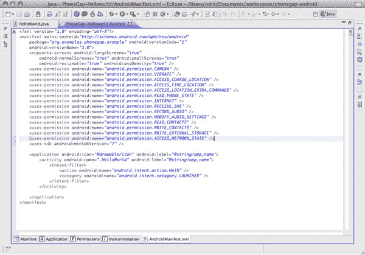

**图 2–17。** *扩展 DroidGap 类的活动*

#### 编写 HelloWorld 应用程序

PhoneGap 应用程序是一个 HTML/JavaScript 应用程序。参见[图 2–18](#fig_2_18)。下面是 index.html。

1.  在 HTML 页面中包含 PhoneGap JavaScript 库版本 1.1.0。
2.  用主体的 onload 事件注册`init()`方法。
3.  在`init()`函数中，用 DeviceReady 事件注册 JavaScript 回调函数 onDeviceReady。
4.  在 onDeviceReady 回调函数中，将 ID 为“helloworld”的`h1`元素的内容更改为文本“hello World！已加载 PhoneGap 框架！”

这里列出了完整的源代码:

`<!DOCTYPE HTML>
<ins><html></ins>
  <head>

    <title>PhoneGap</title>

    ` `    
  </head>
  <body onLoad="<ins>init</ins>()">

    <h1 id="<ins>helloworld</ins>">...</h1>

  </body>
</html>` 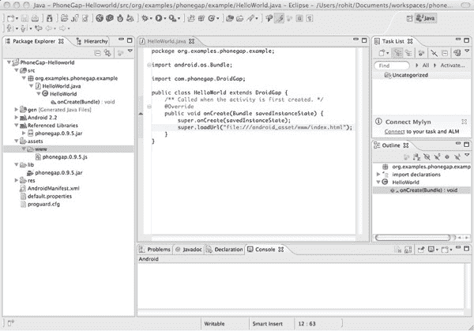

**图 2–18。PhoneGap 项目的 Index.html**T2

你可以从`[https://bitbucket.org/rohitghatol/apress-phonegap/src/67848b004644/android/PhoneGap-Helloworld](https://bitbucket.org/rohitghatol/apress-phonegap/src/67848b004644/android/PhoneGap-Helloworld)`下载本章的完整源代码

#### 部署到模拟器

为了运行 Android 应用程序，右键单击 PhoneGap-helloworld 项目，选择 Run As，然后选择 Android 应用程序。

这将启动带有我们之前创建的 AVD 的模拟器。当应用程序加载时，您将看到以下屏幕。随着应用程序的启动，您将在屏幕上看到…,如图[图 2–19](#fig_2_19)所示。

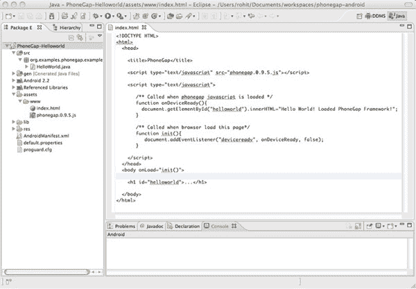

**图 2–19。***PhoneGap 应用程序加载了…几秒钟。*

加载 PhoneGap 框架后，您会看到应用程序显示一条消息，如图[Figure 2–20](#fig_2_20)所示。

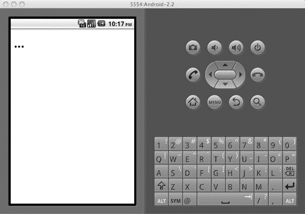

**图 2–20。***PhoneGap 框架加载部署到设备应用程序后，PhoneGap 应用程序显示一条消息。*

到目前为止，我们已经看到了如何在模拟器上测试应用程序。但是，有些功能不能在模拟器上测试。为了测试 GPS、相机、加速度计、罗盘和实际用户感知，需要测试实际设备。

#### 部署到设备

将 Android 应用程序部署到设备需要两个步骤:

##### 第一步:准备好设备。

1.  Unlock your device and press the Menu key. This will give you a view that looks like [Figure 2–21](#fig_2_21). 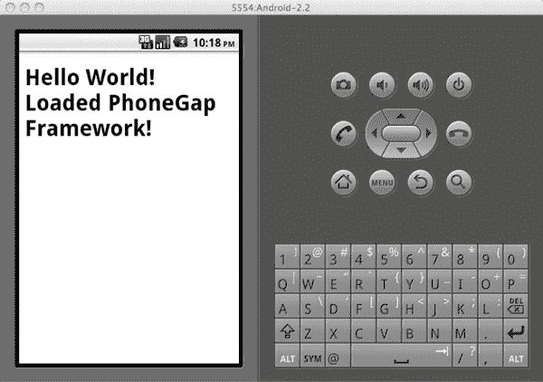

    **图 2–21。** *进入安卓手机的设置*

2.  Click on the Settings and the screen in [Figure 2–22](#fig_2_22) will appear. Choose the Applications option. 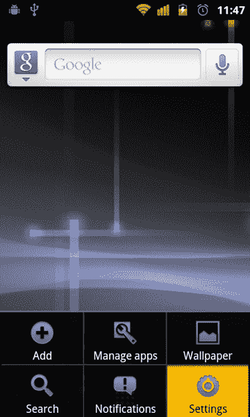

    **图 2–22。** *进入应用程序设置*

3.  Now we must ensure that we can deploy non-Market applications on our device. This is done by clicking the Unknown sources, seen in [Figure 2–23](#fig_2_23). 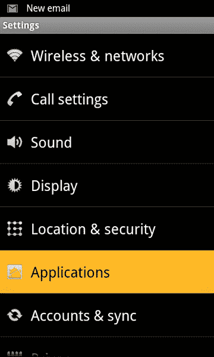

    **图 2–23。** *点击未知来源，我们可以添加非市场应用*

4.  下一步是进入开发选项(见[图 2–24](#fig_2_24))并启用 USB 调试(见[图 2–25](#fig_2_25))。这允许你将 USB 线的一端插入你的 Android 设备，另一端插入你的 PC 或 Mac。使用 Eclipse 调试设备上运行的应用程序。

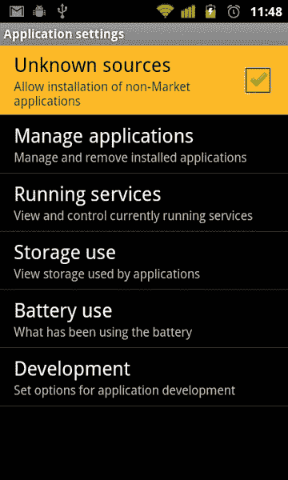

**图 2–24。** *进入开发选项*

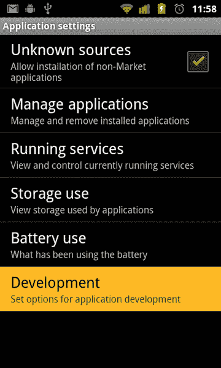

**图 2–25。**T3】启用 USB 调试

现在，您的设备已经准备好部署应用程序。

Android ADT 插件为 Android 提供了一个 Dalvik 调试监控服务器(DDMS)。DDMS 有许多功能，例如列出当前可用于部署和调试 Android 应用程序的设备/仿真器，允许用户查看部署在设备/仿真器上的应用程序的日志消息，以及浏览设备/仿真器的文件系统。

##### 步骤 2:在应用程序启动类型中，提供我们打算部署到设备的信息。

1.  Plug the USB cable into your device, and plug the USB end into your development machines. Now open Eclipse and go into the DDMS perspective (Go to Eclipse->Windows->Open Perspective->DDMS). You will see a screen like [Figure 2–26](#fig_2_26). This screen depicts that we have an Android emulator running, and that we also have an Android device plugged into the machine’s USB input. 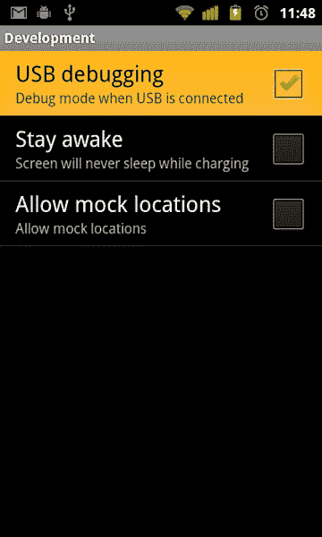

    **图 2–26。***DDMS 显示我们有一个仿真器在运行，一个设备插入了 USB。*

2.  当您点击您的 Android 项目的任何 Android 应用程序的 Run As 时，您将看到图 2–27 中的屏幕。您看到这个屏幕是因为您有一个仿真器和一个可用的设备。这里 Eclipse 会询问您将应用程序部署到哪里。如果你只有一个设备插入，没有模拟器运行，这个屏幕将不会出现。

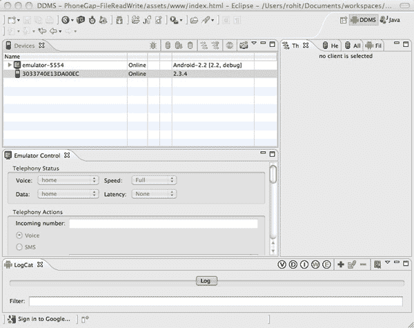

**图 2–27。** *如果有多个设备或仿真器，DDMS 会提示用户选择部署应用的位置。*

### 探索 PhoneGap 功能

本节将探索 PhoneGap 的更多特性。

下面是 PhoneGap 支持的功能的简短总结:

1.  PhoneGap 的加速计 API 使应用程序能够感知设备方向的变化，因此，它能够相应地采取行动。这在创建具有气泡水平仪的应用程序时很有用(确保手机与地面水平对齐)。可以选择读取一次器件方向的变化读数，或者连续接收器件方向的变化。
2.  PhoneGap 的相机 API 允许应用程序从相机中检索图片(这对脸书和 Picasa 应用程序非常有用),或者从现有的照片库中获取图像。
3.  PhoneGap 的 compass API 帮助应用程序了解手机的方位。这被证明对于地图和导航应用是有用的，因为地图随着用户改变电话的方位而旋转，存在获取设备航向变化的一个读数或连续接收设备航向变化的选项。
4.  PhoneGap 的联系人 API 是应用程序读写联系人的一种方式。许多社交应用可以从同步手机联系人和社交频道上的联系人中受益。
5.  PhoneGap 的文件 API 允许应用程序读取、写入和列出目录和文件系统。如果应用程序计划更改手机文件系统中的文件内容，这将非常方便。这个 API 也可以帮助编写文件浏览器应用程序。
6.  地理位置 API 有助于检索设备的地理位置。这对许多应用程序都有好处，包括基于地图的应用程序，以及像 foursquare 这样的应用程序，用户可以通过使用他们的 GPS 位置来签到。可以选择读取一次设备地理位置的变化，或者连续接收设备地理位置的变化。
7.  媒体 API 允许应用控制设备上的媒体传感器和应用。这个 API 允许应用程序记录和回放音频和视频记录。
8.  PhoneGap 的网络 API 为应用程序提供了查看网络状态的能力。这种状态不只是在线和离线，而是告诉应用程序设备是在 2G/3G/4G 网络上还是在 Wi-Fi 网络上。这些信息通常有助于应用程序决定何时检索某些类型的信息。
9.  通知 API 允许应用程序通过发出哔哔声、振动或提供可视警报来通知用户发生了什么事情。
10.  PhoneGap 的存储 API 为应用程序提供了一个内置的 SQL 数据库。应用程序可以通过 SQL 语句插入、检索、更新和删除数据。应用程序可以查询数据库中的数据，并在本地存储的电子邮件列表中搜索特定的电子邮件。

### PhoneGap 教程

并非所有的 PhoneGap 教程都可以在 Android 模拟器上完成，因此我们将解释以下检查教程的方法:

*   可以在 Android 模拟器上完成的教程。
*   需要安卓手机才能工作的教程。

#### 仿真器示例

##### 获取设备信息

PhoneGap 允许以编程方式读取设备信息。为此，您需要确保 PhoneGap 框架已经加载。一旦加载了框架，就可以使用 JavaScript 提取设备信息。设备信息的所有属性在[表 2–1](#tab_2_1)中列出。

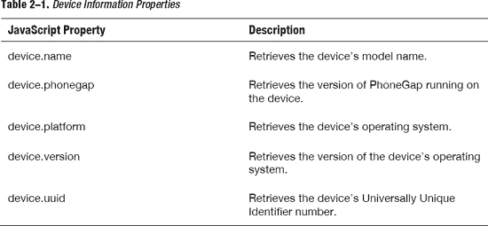

下面的代码将让您访问设备的信息。同样参见[图 2–28](#fig_2_28)。

`<!DOCTYPE HTML>
<ins><html></ins>
  <head>

    <title>PhoneGap</title>

    

    
  </head>
  <body onLoad="<ins>init</ins>()">
    <h1>Device Info</h1>
    <table border="1">
      <tr>  
        <td>Device Name</td>
        <td id="deviceName"></td>              
      </tr>
      <tr>  
        <td>PhoneGap Version</td>
        <td id="version"></td>                   
      </tr>
      <tr>  
        <td><ins>Mobile</ins> Platform</td>
        <td id="mobilePlatform"></td>      
      </tr>
      <tr>  
        <td>Platform Version</td>
        <td id="platformVersion"></td>     
      </tr>
      <tr>  
        <td>UUID</td>
        <td id="<ins>uuid</ins>"></td>                        
      </tr>
    </table>
  </body>
</html>` 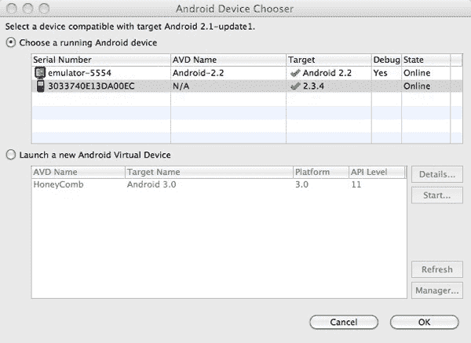

**图 2–28。**T3【PhoneGap 设备信息】HTML 源代码

运行这段代码时，图 2–29 中的屏幕应该出现在您的 Android 模拟器上。

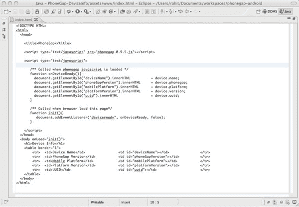

**图 2–29**。*在模拟器上运行 PhoneGap 的设备信息*

您可以从`[https://bitbucket.org/rohitghatol/apress-phonegap/src/67848b004644/android/PhoneGap-DeviceInfo](https://bitbucket.org/rohitghatol/apress-phonegap/src/67848b004644/android/PhoneGap-DeviceInfo)`下载这个例子的完整源代码。

可以参考`[http://docs.phonegap.com/en/1.1.0/phonegap_device_device.md.html#Device](http://docs.phonegap.com/en/1.1.0/phonegap_device_device.md.html#Device)`的设备 API 官方文档。

##### 抓取设备的联系人

我们将使用 PhoneGap 来获取设备的地址簿联系号码。在我们在 Android 模拟器上做这些之前，我们需要用一些联系信息来设置 Android 模拟器。

1.  Click on the dialer application icon  seen in [Figure 2–30](#fig_2_30). 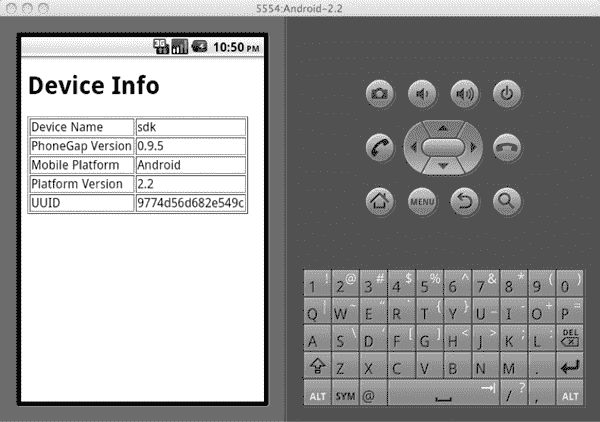

    **图 2–30。** *点击 Android 模拟器上的 PhoneGap 应用程序。*

2.  This will open up the dialer application. Click on the Contacts tab, seen in [Figure 2–31](#fig_2_31). 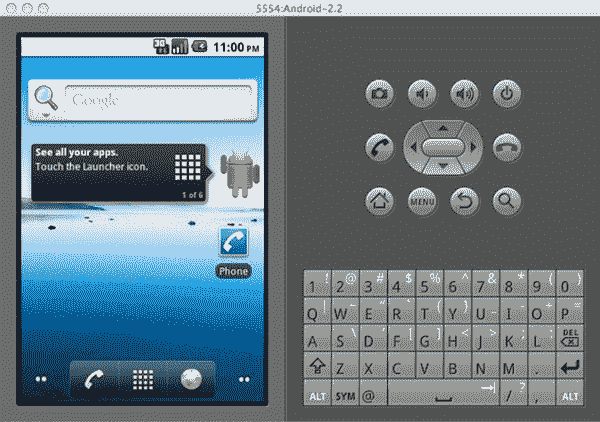

    **图 2–31。** *在手机应用程序中添加联系人*

3.  Click Menu and choose New Contact. In the new contact add the first name, last name, and phone number. Refer to [Figures 2–32](#fig_2_32) and [2–33](#fig_2_33). 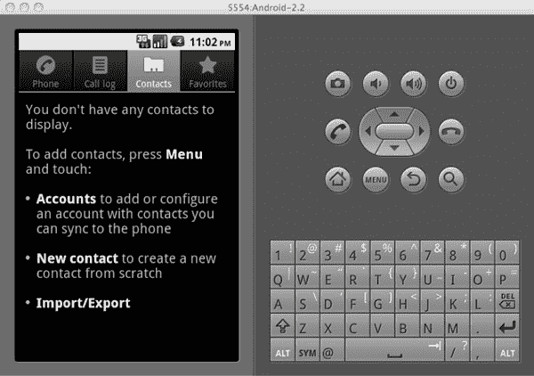

    **图 2–32。点击菜单中的**和*点击新增联系人*

    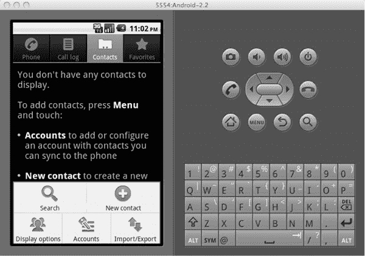

    **图 2–33。** *添加联系人，点击完成。*

4.  输入所需的值后，点击完成，您应该会在联系人列表中看到一个联系人(如图[Figure 2–34](#fig_2_34)所示)。

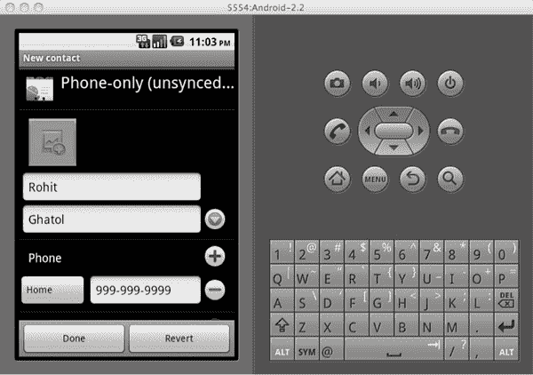

**图 2–34。** *联系人列表*

为了使用 PhoneGap 访问联系人列表，我们需要使用以下 API:

`navigator.service.contacts.find(contactFields, contactSuccess, contactError, contactfindOptions);`

[Table 2–2](#tab_2_2)提供了每个参数的描述。

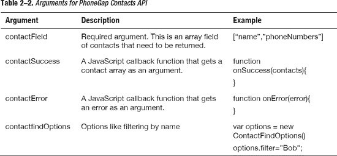

下面提供了生成获取联系人的完整代码的步骤:

1.  创建 ContactFindOptions 对象。通过使 options.filter 等于""，我们说我们想要获取所有联系人。如果 options.filter 是 Bob，这意味着我们希望过滤我们的搜索，以便所有结果都必须在 contact 字段的某个位置包含关键字 Bob。`<ins>var</ins> options = new ContactFindOptions();
    options.filter="";`
2.  我们需要定义想要获取的联系人字段。当我们搜索联系人时，会出现一个联系人列表。接触本身是接触字段的关联数组。这意味着，如果我们指定只获取姓名和电话号码联系人字段中的联系人，我们将只获取这些信息。`var fields = [“name”,”phoneNumbers”];`
3.  定义成功和失败的回叫方法。当我们调用方法
    navigator . service . contacts . find()时，我们需要提供两个回调。这是因为 find()方法是一个异步方法。`function onSuccess(contacts) {
        for(<ins>var</ins> index=0;index<contacts.length;index++){
            <ins>var</ins> contact= contacts[index];
            var contactName = contact.name.formatted;
        }
    }
    function onError(error) {
    }
    navigator.service.contacts.find(fields, onSuccess, onError, options);`
4.  Use Android Linkify to allow us to dial numbers. While we list the contacts in the address book as a part of the HTML list (as seen in the following code), `<ul>
    <li>Rohit Ghatol</li>
    </ul>
    we can make the listing more useful by using a link for the contact. This is depicted as follows:
    <ul>
    <li>
    <a href=”tel://999-999-9999”>Rohit Ghatol</a>
    </li>
    </ul>`

    当用户点击链接 Rohit Ghatol 时，Android 会读取要成为 tel 的 URL，并打开拨号器拨打该号码。

    这在[图 2–36](#fig_2_36)和[图 2–37](#fig_2_37)中有所描述，它们显示了应用程序在 Android 模拟器上的外观。

    使用下面的代码来应用我们到目前为止所学的内容。参考[图 2–35](#fig_2_35)获取 index.html 源代码。

`<!DOCTYPE HTML>
<ins><html></ins>
  <head>
    <title>PhoneGap</title>
    
    
  </head>
  <body onLoad="<ins>init</ins>()">
    <h1>Contacts</h1>
    <ul id="list">
    </ul>
  </body>
</html>` 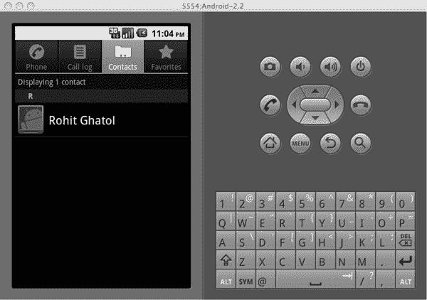

**图 2–35。** *PhoneGap 联系人应用 HTML/JavaScript 源代码*

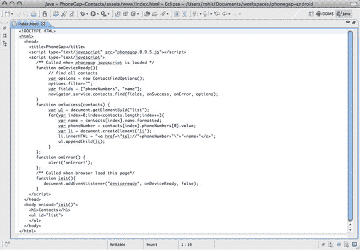

**图 2–36。** *清单联系人*

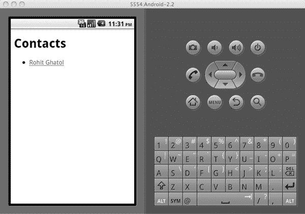

**图 2–37。** *点击联系人打开电话拨号器。*

您可以从`[https://bitbucket.org/rohitghatol/apress-phonegap/src/67848b004644/android/PhoneGap-Contacts](https://bitbucket.org/rohitghatol/apress-phonegap/src/67848b004644/android/PhoneGap-Contacts).`下载这个例子的完整源代码

可以参考`[http://docs.phonegap.com/en/1.1.0/phonegap_contacts_contacts.md.html#Contacts](http://docs.phonegap.com/en/1.1.0/phonegap_contacts_contacts.md.html#Contacts)`的 Contacts API 官方文档。

##### 获取 SD 卡列表

本节将解释如何列出 Android 设备的 SD 卡。本节结合使用了 W3C 标准和 PhoneGap API。

列出 Android 设备的 SD 卡有两个步骤。这些步骤如下:

1.  我们解析目录`file:///sdcard`并获得对目录条目的访问权。
2.  当我们访问 directoryentry 时，我们可以从 directoryentry 创建一个 directoryreader，并获取目录(SD 卡)的内容。

在步骤 1 中，我们调用以下函数:

`window.resolveLocalFileSystemURI("file:///<ins>sdcard</ins>", onResolveSuccess, onError);`

为了响应前面的函数，onResolveSuccess 回调将被激活。onResolveSuccess 回调可以在下面的代码中看到。一旦我们获得了对 fileEntry 的访问权，我们就从它创建一个 directoryReader，并在这个 directoryReader 上调用 readEntries。

`function onResolveSuccess(fileEntry){

<ins>var</ins> directoryReader = fileEntry.createReader();

directoryReader.readEntries(onSuccess,onError);
}`

当路径`file:///sdcard`被成功解析时，onSuccess 方法被调用。onSuccess 方法如下:

`function onSuccess(entries){
document.getElementById("loading").innerHTML="";
<ins>var</ins> <ins>ul</ins> = document.getElementById("file-listing");
for(<ins>var</ins> index=0;index<entries.length;index++){
<ins>var</ins> <ins>li</ins> = document.createElement('<ins>li</ins>');
li.innerHTML = entries[index].name;
ul.appendChild(<ins>li</ins>);
      }`

###### 部署到模拟器

以下代码提供了如何部署到模拟器的完整示例:

`<!DOCTYPE HTML>
<html>

    <head>` `        <title>
            PhoneGap
        </title>
        
        
    </head>

    <body onLoad="init()">
        <h1>
            List SDCard Contents
        </h1>
        <ul id="file-listing">
        </ul>
        

            Loading ..
        

    </body>

</html>`

该代码如[图 2–38](#fig_2_38)所示。

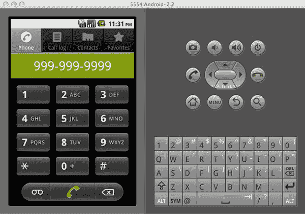

**图 2–38。***sd 卡上的清单文件*

您可以从`[https://bitbucket.org/rohitghatol/apress-phonegap/src/67848b004644/android/PhoneGap-DirectoryListing](https://bitbucket.org/rohitghatol/apress-phonegap/src/67848b004644/android/PhoneGap-DirectoryListing)`下载本章的完整源代码。

可以参考`[http://docs.phonegap.com/en/1.1.0/phonegap_file_file.md.html#File](http://docs.phonegap.com/en/1.1.0/phonegap_file_file.md.html#File)`的 File API 官方文档。

##### 写入和读取文件

这一节将向您展示如何使用 PhoneGap APIs 来操作文件系统。

**注意:** PhoneGap 实际上正在实现和支持在`[http://www.w3.org/TR/file-system-api/](http://www.w3.org/TR/file-system-api/)`提到的 W3C 的文件系统规范。

让我们熟悉一下文件系统 API 中的一些关键概念。这些关键概念是:

1.  本地文件系统
2.  文件系统
3.  文件入口
4.  目录项

###### 本地文件系统

LocalFileSystem 为我们提供了对本地文件系统及其文件和目录的访问。有两种类型的文件系统:

1.  本地文件系统。PERSISTENT :在没有用户明确授权的情况下，除了响应删除 API 调用之外，存储在持久性文件系统中的数据不应被 UA 删除。
2.  本地文件系统。临时:UA 可以自行删除临时文件系统中存储的数据，无需应用程序或用户干预。

localFileSystem 方法是从 window 对象中访问的。这是通过以下方式完成的:

1.  window . request file system()–用于获得对根文件系统的访问权限。
2.  window . resolvelocalfilesystemuri()–用于直接访问 FileEntry 或 DirectoryEntry 对象，前提是 URI 可用于该目录或文件。

###### 文件系统

文件系统代表文件系统。它有两个主要属性:

1.  名称–在两个选项“永久”或“临时”之间选择。如果您希望文件即使在应用程序被终止时也能持久保存，请选择“持久保存”。
2.  Root—文件系统的根目录(DirectoryEntry)。

您需要使用以下 API 来访问文件系统:

`void requestFileSystem (
       short type,  // LocalFileSystem.PERSISTENT or
                      //LocalFileSystem.TEMPORARY
       long long size, //Size for TEMPORARY FS
       FileSystemCallback successCallback,  //Success Callback
       optional ErrorCallback errorCallback);  // Failure Callback` 

获得文件系统访问权限的代码片段如下:

`window.requestFileSystem(LocalFileSystem.PERSISTENT
              ,0 //size
              ,function(fileSystem){ // success callbac
                     alert(“Got FileSystem “+fileSystem);
              },
              function(err){ //failure callback
                     alert(“Got Error requesting FileSystem”);
              }
       );` 

您需要使用以下 API 来访问 fileEntry 或 directoryEntry 对象(代表文件或目录的对象):

`void resolveLocalFileSystemURL (
              DOMString url,  //url of file or directory on
                                        //filesystem
              EntryCallback successCallback,  //Success Callback
              optional ErrorCallback errorCallback); //FailureCallback` 

###### 档案输入

为了操作一个文件，你需要一个 fileEntry 对象。有许多方法可以获得 fileEntry，但是假设您知道文件的 URI，您可以如下获得该对象:

`window.resolveLocalFileSystemURL(
              “file:///sdcard/read-write.txt”,
              function(fileEntry){
              },
              function(err){
              }
              );` 

为了查找 fileEntry 的所有属性和方法，您需要访问 fileEntry 的附录。有两种方法可以获得这种访问权限:

1.  createWriter():创建可用于写入文件的 FileWriter 对象。
2.  file():创建一个包含文件属性的 File 对象，包括读取其内容。

###### 导演

为了列出目录中的文件，您需要一个 directoryEntry 对象。有许多方法可以获得 directoryEntry，但是假设您知道目录的 URI，您可以如下获得该对象:

`window.resolveLocalFileSystemURL(
              “file:///sdcard/mydir/”,
              function(directoryEntry){
              },
              function(err){
              }
              );`

为了查找 directoryEntry 的所有属性和方法，您需要访问 directoryEntry 的附录。有一种方法可以获得这种访问:getFile():在给定目录中创建文件，或者从给定目录中获取文件。

###### 程序布局

我们的文件读写程序很简单。它包含一个文本区域，我们可以在这里读取文件内容，也可以将文本区域的内容写入文件。我们使用两个按钮 Read 和 Write 来读/写一个名为 read-write.txt 的文件。

下面是程序的代码。

`<!DOCTYPE HTML>
<html>
    <head>
        <title>PhoneGap</title>
        
        
    </head>
    <body onLoad="init()">
        <h1>Read Write File</h1>
        <table>
            <tr>
                <td colspan="2">
                    /sdcard/read-write.txt
                </td>
            </tr>
            <tr>
                <td colspan="2">
                    <textarea id="textarea" rows="10" cols="30">
                    </textarea>
                </td>
            </tr>` `<tr>
                <td>
                    <button id="read">
                        Read
                    </button>
                </td>
                <td>
                    <button id="write">
                        Write
                    </button>
                </td>
            </tr>
        </table>
    </body>
</html>` 

运行时的该代码在[图 2–39](#fig_2_39)中说明。

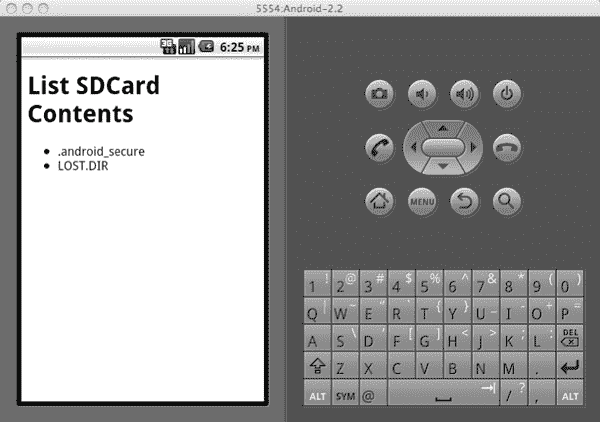

**图 2–39。** *读写文件。*

现在，让我们实现 readFile()方法来读取文件并在 TextArea 中显示其内容。步骤非常简单:

第一步:解析网址`file:///sdcard/read-write.txt`。

**步骤 2:** 如果解决了，使用 fileEntry.file()方法创建一个读取器。

**步骤 3:** 如果没有解决，向用户显示一条消息，告诉用户他需要先写文件，然后才能读取它..参见[图 2–40](#fig_2_40)。

`function readFile(){

       window.resolveLocalFileSystemURI(    //filename to be read
              filePath,    //success <ins>callback</ins>
              function(fileEntry){
                     fileEntry.file(
                            function(file){
                                   var fileReader = new FileReader();
                                   fileReader.onloadend =
                                   function(evt){
                                   document.getElementById("textarea").value
                                = evt.target.result;
                                   };
                                   fileReader.readAsText(file);
                                          },
                                          function(error){
                                                 alert("Got error while reading "+filePath);
                                          })
                },    //error <ins>callback</ins>
                function(error){
                    alert(filename + " not present, please add content and click
                        Save first");
                }
        );

}` 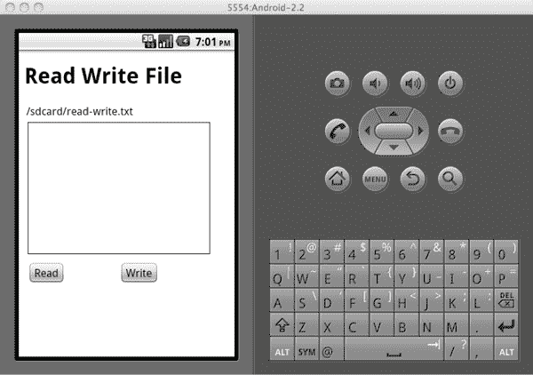

**图 2–40。** *由于没有写入文件，无法读取。*

让我们实现 writeFile()方法读取 TextArea 中的文本，并将其写入`file:///sdcard/read-write.txt`。

**步骤 1:** 访问文件系统根目录。

**步骤 2:** 从文件系统根目录 Entry 创建文件 read-write.txt，如果它还不存在的话。

**第三步:**创建 fileWriter，将 TextArea 的内容写入文件。这显示在以下代码中:

`function saveFile() {

    window.requestFileSystem(
    LocalFileSystem.PERSISTENT, 0,
    //Success Callback

    function (fileSystem) {
        var sdcardEntry = fileSystem.root;
        sdcardEntry.getFile(
        filename,
        //Flag telling create file
        {
            create: true
        },
        //Success callbacks

        function (fileEntry) {
            fileEntry.createWriter(

            function (fileWriter) {
                fileWriter.onwrite = function (evt) {
                    alert("Write was successful!");
                    document.getElementById("textarea").value = "";
                };
                fileWriter.write(document.getElementById("textarea").value);
            },
            //Error callback      

            function (error) {
                alert("Failed to get a file writer for " + filename);
            });

        },
        //Error Callback

        function (error) {
            alert("Got error while reading " + filename + " " + error);
        });

    }, function (error) {
        alert("Got Error while gaining access to file system");
    });

}` 

当用户在文本区域中键入文本并点击 Write 时，内容被写入文件并显示一条警告消息，提示 Write 成功。你会注意到当你点击 Write 时，程序会清空文本区。参见[图 2–41](#fig_2_41)查看文件写入成功时的信息。

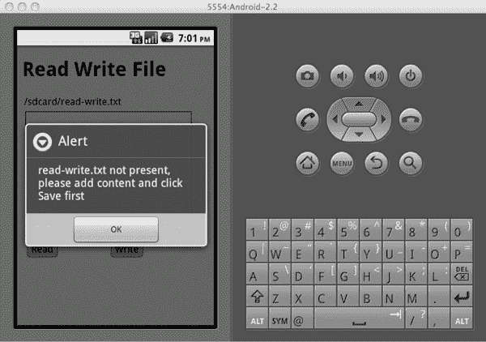

**图 2–41。** *写成功了*

现在，点击 read 按钮，尝试读取您写入文件的内容。你写的内容应该出现在文本区。参考[图 2–42](#fig_2_42)查看当读取成功时，文本区域是如何填充的。

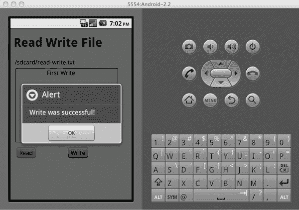

**图 2–42。** *阅读成功*

您可以从`[https://bitbucket.org/rohitghatol/apress-phonegap/src/62c45e339662/android/PhoneGap-FileReadWrite](https://bitbucket.org/rohitghatol/apress-phonegap/src/62c45e339662/android/PhoneGap-FileReadWrite)`下载这个例子的完整源代码。

可以参考`[http://docs.phonegap.com/en/1.1.0/phonegap_file_file.md.html#File](http://docs.phonegap.com/en/1.1.0/phonegap_file_file.md.html#File)`的 File API 官方文档。

##### 写入和读取数据库

本节将解释如何读取、存储和操作数据库。我们将使用在数据库中存储联系人列表(名字和姓氏)的例子，然后读取它，并删除条目。

有三个表:一个用于标题列，一个用于内容，还有一个允许用户向联系人列表添加条目。

以下是从数据库中读取和写入的 index.html 代码:

`<!DOCTYPE HTML>
<html>
    <head>
        <title>PhoneGap DB</title>
        
        
        
    </head>
    <body onLoad="init()">
        <h3>Read Write DB</h3>
        <table border="1">
            <tr>
                <td>
                    <b>First Name</b>
                </td>
                <td>
                    <b>Last Name</b>
                </td>
                <td>
                    <b>Action</b>
                </td>
            </tr>
        </table>
        <table id="data-table">
        </table>
        <table>
            <tr>
                <td>
                    <input id="firstName" type="text">
                    </input>
                </td>
                <td>
                    <input id="lastName" type="text">
                    </input>
                </td>
                <td>
                    <button id="add">
                        Add
                    </button>
                </td>
            </tr>` `        </table>
    </body>
</html>`

如果运行该程序，您应该会看到类似于[图 2–43](#fig_2_43)所示的布局

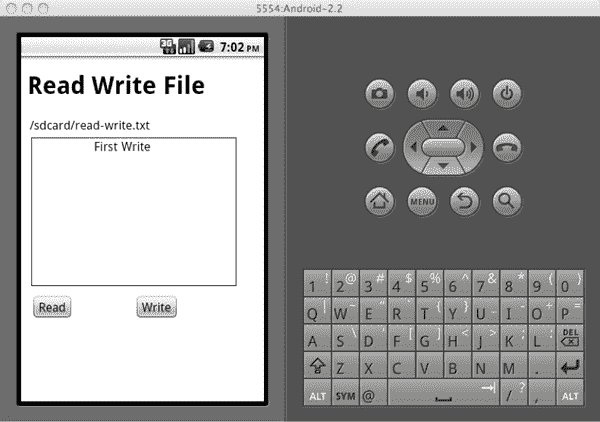

**图 2–43。** *读写数据库*

现在，让我们添加一些代码来读取、写入和删除数据库中的联系人条目。第一步是访问数据库对象。这是按如下方式完成的:

`var firstNameBox = null;
var lastNameBox = null;
var db = null;
var dataTable = null;
/** Called when <ins>phonegap</ins> <ins>javascript</ins> is loaded */
function onDeviceReady(){
       var addButton = document.getElementById("add");
       firstNameBox = document.getElementById("firstName");
       lastNameBox = document.getElementById("lastName");
       dataTable = document.getElementById("data-table");

       **db = window.openDatabase("contactDB", "1.0", "Contact**
**                  Database", 1000000);**
                  //name,version,display name, size

}`

让我们把重点放在创建数据库对象的 API 上。这是按如下方式完成的:

`         window.openDatabase(
                  databaseName,
                  versionNumber,
                  displayName,
                  sizeInBytes);`

现在让我们看一下代码(参考下面的 addButton.addEventListener ),它解释了单击 Add 按钮并向数据库中的 contacts 表添加条目的过程。

为了向 contacts 表添加条目，我们将在数据库对象上使用 transaction()方法。下面是这个方法的 API:

`db.transaction(
       function(tx){   //Function to execute the sql statements
              //Use tx to execute sql statements
       },
       function(err){  // Error callback
              //Use err.code and err.message to understand the error
       },
       function(){  //Success callback
              // Update the UI, log a message
       }
       );`

我们希望在用户点击按钮时添加新条目。因此，我们的添加功能位于添加按钮的 click 事件侦听器中。这可以在下面的代码中看到:

`addButton.addEventListener(
       "click",
       function(){

              db.transaction(
                     //function <ins>sql</ins> statements
                     function (tx){
                            ensureTableExists(tx);
                            var firstName = firstNameBox.value;
                            var lastName = lastNameBox.value;

                            var sql = 'INSERT INTO Contacts  
                         ( firstName, lastName ) VALUES
                         ("' + firstName + '","' + lastName + '")';

                             tx.executeSql(sql);

                      },
                      //error <ins>callback</ins>
                      function (err){
                             alert("error callback "+err.code);

                      },
                      //success <ins>callback</ins>
                      function (){
                             loadFromDB();
                      }` `              );

       },false);

function ensureTableExists(tx){
       tx.executeSql('CREATE TABLE IF NOT EXISTS Contacts (id
                     INTEGER PRIMARY KEY, firstName,lastName)');

}`

我们使用一个名为 ensureTableExists(tx)的方法，它确保我们在数据库中执行 DB CRUD 操作之前拥有数据库表。

我们在数据库事务的 SQL 函数中使用 SQL insert 语句，以便在数据库中创建一个条目。

**注意:**默认情况下，SQLite 中的主键是自动递增的，因此，我们只写名字和姓氏，数据库实际上是递增 ID。

一旦数据库成功添加了操作，我们就调用 loadFromDB()方法从数据库表中填充 HTML 表。

请参考[Figure 2–44](#fig_2_44)查看添加联系人功能的 UI 屏幕。

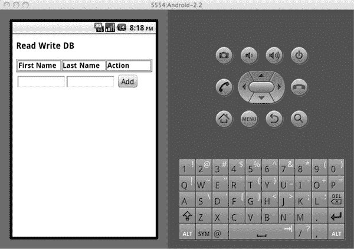

**图 2–44。** *添加条目*

现在，让我们来看看 loadFromDB()方法。这里我们使用相同的 tx.executeSql，但是在这种情况下，我们期望得到一些不同的结果，所以我们使用下面版本的 tx.executeSql:

`tx.executeSql(
       sqlStatement,
       options,
       successCallbackWithResultSet,
       errorCallback);`

successCallbackWithResultSet 是一个接收两个内容的函数:

1.  税
2.  结果集

`function loadFromDB(){

db.transaction(
       //function <ins>sql</ins> statements
       function (tx){
              ensureTableExists(tx);
              tx.executeSql('SELECT * FROM Contacts',
                        [],
                        //success callback
                                       function(tx, results){
                                        var htmlStr="";
                                                    for(var index=0;index<results.rows.length;index++){
                                                        var item =
results.rows.item(index);

                            htmlStr = htmlStr +"<tr><td>"+
                                   item.firstName+"</td><td>"
                                   +item.lastName
                                   +"</td><td><button
                                   onclick=\"deleteEntry('"
                                   +item.id+
                                   "');\">X</button></td></tr>";

                                }

                                dataTable.innerHTML=htmlStr;
                        },
                        //error callback
                        function(err){
                                alert("Unable to fetch result from Contacts
                                       Table");
                        }
                );

        },
        //error <ins>callback</ins>
        function (err){
                alert("error callback "+err.code+" "+err.message);

        },
        //success <ins>callback</ins>` `        function (){
               firstNameBox.value="";
               lastNameBox.value="";
        });

}`

当我们现在运行代码时，我们可以在 HTML 表中看到之前添加的条目。

参考[图 2–45](#fig_2_45)，它显示了之前在 html 表格中添加的行。

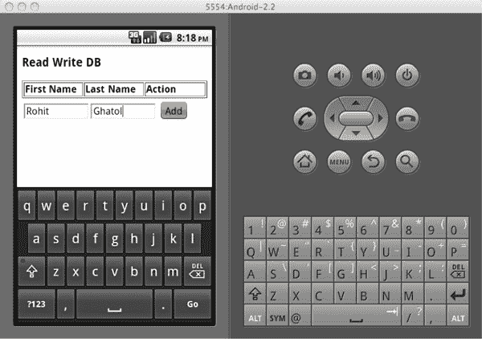

**图 2–45。** *从数据库中读取所有条目*

最后要做的事情是当用户单击 X 按钮时删除条目。当我们填充 HTML 表时，我们在 HTML 中定义按钮如下:

`<button onclick="deleteEntry(‘”+item.id+"’);’>X</button>`

参考[Figure 2–46](#fig_2_46)查看这在 HTML 中的样子。

当用户单击 X 按钮时，调用 deleteEntry 函数，传递要删除的条目的主键。这里，我们使用 Delete SQL 语句删除主键。

`function deleteEntry(id){
       db.transaction(
              //function <ins>sql</ins> statements
              function (tx){` `                ensureTableExists(tx);

                     tx.executeSql('Delete FROM Contacts where id='+id);

              },
              //error <ins>callback</ins>
              function (err){
                     alert("error callback "+err.code+" "+err.message);

              },
              //success <ins>callback</ins>
              function (err){
                     loadFromDB();
              }
       );

}` 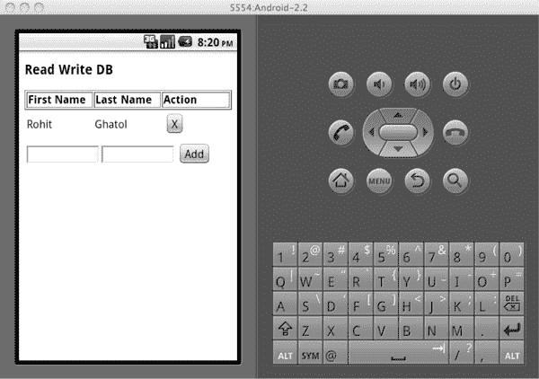

**图 2–46。** *从数据库中删除条目*

现在，当用户单击 X 按钮时，条目被删除，并调用 loadFromDB()，从数据库表刷新 HTML 表。

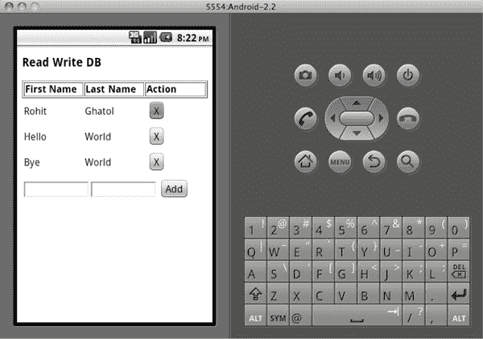

**图 2–47。** *删除条目被反映*

完整的 index.html 资料如下:

`<!DOCTYPE HTML>
<html>

    <head>
        <title>
            PhoneGap DB
        </title>
        
        
        
    </head>

    <body onLoad="init()">
        <h3>
            Read Write DB
        </h3>
        <table border="1">
            <tr>
                <td>
                    <b>
                        First Name
                    </b>
                </td>
                <td>
                    <b>
                        Last Name
                    </b>
                </td>
                <td>
                    <b>
                        Action
                    </b>
                </td>
            </tr>
        </table>
        <table id="data-table">
        </table>
        <table>
            <tr>
                <td>
                    <input id="firstName" type="text">
                    </input>
                </td>
                <td>
                    <input id="lastName" type="text">
                    </input>
                </td>
                <td>
                    <button id="add">
                        Add
                    </button>
                </td>
            </tr>
        </table>
    </body>

</html>` 

您可以从`[https://bitbucket.org/rohitghatol/apress-phonegap/src/62c45e339662/android/PhoneGap-DB](https://bitbucket.org/rohitghatol/apress-phonegap/src/62c45e339662/android/PhoneGap-DB)`下载这个例子的完整源代码。

可以参考`[http://docs.phonegap.com/en/1.1.0/phonegap_storage_storage.md.html#Storage](http://docs.phonegap.com/en/1.1.0/phonegap_storage_storage.md.html#Storage)`的存储 API 官方文档。

##### 获取手机或无线网络的详细信息

通常，移动应用程序需要连接到某个服务器，以便获取某些数据。现代智能手机可能会使用 3G/4G 网络或 Wi-FI 网络下载数据。一个好的应用程序会尊重这种区别，在 3G/4G 网络上下载某些类型的数据，只有在智能手机在 Wi-Fi 网络上时才下载大量数据。

本节将解释如何使用 PhoneGap 来找出智能手机正在使用哪种网络。

我们将需要使用以下 API:

`      navigator.network.connection.type`

这将返回连接的类型。不同连接类型的值如下所述:

`Connection.UNKNOWN = "unknown";
Connection.ETHERNET = "ethernet";
Connection.WIFI = "wifi";
Connection.CELL_2G = "2g";
Connection.CELL_3G = "3g";
Connection.CELL_4G = "4g";
Connection.NONE = "none";` 

下面列出了 index.html 的完整源代码:

`<!DOCTYPE HTML>
<ins><html></ins>
    <head>
        <title>PhoneGap DB</title>
        
        
    </head>
    <body onLoad="<ins>init</ins>()">
        <h3>Phone Network Info</h3>
        

        <ins>
</ins>
    </body>

</html>`

当该源运行时，它将显示网络信息，如[图 2–48](#fig_2_48)所示。

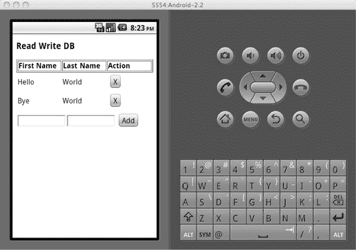

**图 2–48。** *PhoneGap 网络信息显示网络连接属于 3G 类型*

您可以从`[https://bitbucket.org/rohitghatol/apress-phonegap/src/67848b004644/android/PhoneGap-Network](https://bitbucket.org/rohitghatol/apress-phonegap/src/67848b004644/android/PhoneGap-Network)`下载这个例子的完整源代码。

可以参考`[http://docs.phonegap.com/en/1.1.0/phonegap_connection_connection.md.html#Connection](http://docs.phonegap.com/en/1.1.0/phonegap_connection_connection.md.html#Connection)`的连接 API 官方文档。

#### 设备示例

鉴于这些特性的性质，以下示例只能在真实的 Android 设备上运行。Android 模拟器不支持以下功能。

##### 获取地理位置

在本例中，我们将尝试获取设备的地理位置。为此，我们将使用 navigator.geolocation API。这个 API 是一个异步 API，这意味着一旦我们请求地理定位的 API，API 将通知被调用的程序，并使用向 API 注册的两个回调中的一个。

调用的 API 如下:

`navigator.geolocation.getCurrentPosition(onSuccessCallback, onErrorCallback);`

当 API 能够获取 GPS 坐标时，API 调用 onSuccessCallback 函数。当获取 GPS 坐标出现问题时，API 将调用 onErrorCallback。

onSuccessCallback 将获得一个名为 position 的参数。该位置将包含有关地理位置的详细信息，如[表 2–3](#tab_2_3)所示。

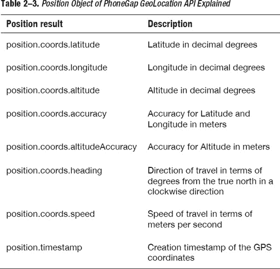

完整的代码示例如下所示:

`<!DOCTYPE HTML>
<ins><html></ins>
  <head>
    <title>PhoneGap</title>
    
    
  </head>
  <body onLoad="<ins>init</ins>()">
    <h1>GeoLocation</h1>
    <table border="1">
      <tr>  <td><ins>Latitue</ins></td>        <td id="latitude"></td>     <tr>
      <tr>  <td>Longitude</td>      <td id="longitude"></td>    <tr>
      <tr>  <td>Altitude</td>       <td id="altitude"></td>     <tr>
      <tr>  <td><ins>Timestamp</ins></td>      <td id="<ins>timestamp</ins>"></td>    <tr>
    </table>
    </ul>
  </body>
</html>` 

该代码如[图 2–49](#fig_2_49)所示。

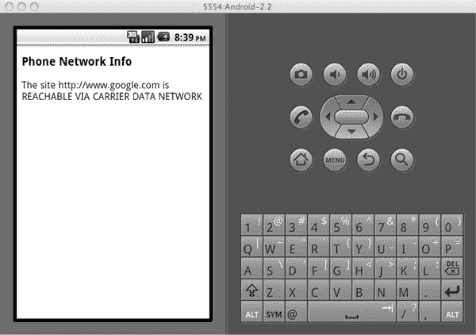

**图 2–49。***PhoneGap 地理位置运行示例*

您可以从`[https://bitbucket.org/rohitghatol/apress-phonegap/src/67848b004644/android/PhoneGap-GeoLocation](https://bitbucket.org/rohitghatol/apress-phonegap/src/67848b004644/android/PhoneGap-GeoLocation)`下载这个例子的完整源代码。

可以参考`[http://docs.phonegap.com/en/1.1.0/phonegap_geolocation_geolocation.md.html#Geolocation](http://docs.phonegap.com/en/1.1.0/phonegap_geolocation_geolocation.md.html#Geolocation)`的地理定位 API 官方文档。

##### 获取加速度计

在本例中，我们将尝试观察设备的加速度计读数。现代智能手机中的加速度计功能为用户提供了 x、y 和 z 坐标中的运动方向。

调用的 API 如下:

`navigator.accelerometer.watchAcceleration(onSuccessCallback,
onErrorCallback,accelerometerOptions);`

该 API 将持续监控加速度计读数，并以预定义的时间间隔调用 onSuccessCallback，直到调用 navigator . accelerator . clear watch()为止。通过以{"frequency":"3000"}的形式提供值，在 accelerometerOptions 中定义间隔。间隔的单位是毫秒。如果 accelerometerOptions 不提供默认的间隔 1000，则使用毫秒。

正如前面的例子中提到的，当获取 GPS 坐标出现问题时，API 将调用 onErrorCallback。

onSuccessCallback 将获得一个名为 acceleration 的参数。加速度将包含设备运动的详细信息，如[表 2–4](#tab_2_4)所示。

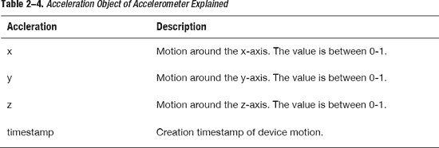

完整的代码示例如下:

`<!DOCTYPE HTML>
<ins><html></ins>
  <head>
    <title>PhoneGap</title>
    
    
  </head>
  <body onLoad="<ins>init</ins>()">
    <h1>Accelerometer</h1>
    <table border="1">
      <tr>  <td>X</td>           <td id="x"></td>            <tr>
      <tr>  <td>Y</td>           <td id="y"></td>            <tr>
      <tr>  <td>Z</td>           <td id="z"></td>            <tr>
      <tr>  <td><ins>Timestamp</ins></td>   <td id="<ins>timestamp</ins>"></td>    <tr>
    </table>
    </ul>
  </body>
</html>` 

该代码如[图 2–50](#fig_2_50)所示。

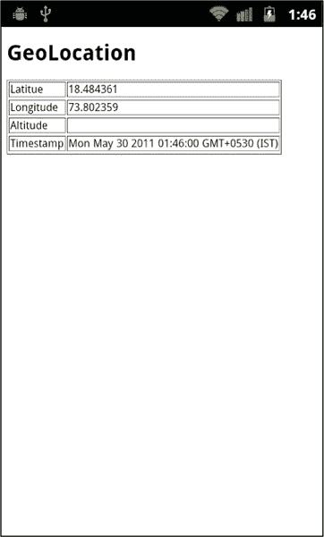

**图 2–50。** *PhoneGap 加速计示例*

在[图 2–51](#fig_2_51)中可以找到相同加速度计的图示版本。通过将手机平放在某个表面上，加速度计可用于检查该表面的水平。

你可以在`[http://code.google.com/p/beginingphonegap/downloads/list](http://code.google.com/p/beginingphonegap/downloads/list)`找到这个例子的图形。

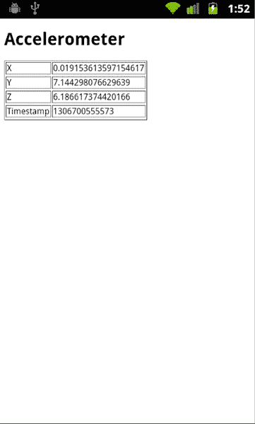

**图 2–51。** *使用 PhoneGap 加速计 API 构建气泡应用*

在前一个例子中使用了四个图像。这些图像从圆形气泡变化到椭圆形气泡。完整的代码示例如下所示:

`<!DOCTYPE HTML>
<ins><html></ins>
  <head>
    <title>PhoneGap</title>
    
    
  </head>
  <body onLoad="<ins>init</ins>()">
    <h1>Accelerometer</h1>

    

      src</ins>="accelerometer-circle-bubble.png"
        style="position:absolute"><ins></img></ins>
      src</ins>="x-y-accelerator-base.png"><ins></img></ins>
    <ins>
</ins>

    

      src</ins>="z-accelerator-base.png"><ins></img></ins>
      src</ins>="accelerometer-circle-oval.png"
        style="position:absolute;left:0px"><ins></img></ins>
    <ins>
</ins>

  </body>
</html>` 

您可以从`[https://bitbucket.org/rohitghatol/apress-phonegap/src/67848b004644/android/PhoneGap-Accelerometer-Image](https://bitbucket.org/rohitghatol/apress-phonegap/src/67848b004644/android/PhoneGap-Accelerometer-Image)`下载这个例子的完整源代码。

可以参考`[http://docs.phonegap.com/en/1.1.0/phonegap_accelerometer_accelerometer.md.html#Accelerometer](http://docs.phonegap.com/en/1.1.0/phonegap_accelerometer_accelerometer.md.html#Accelerometer).`的加速度计 API 官方文档

##### 获取罗盘方位

让我们来看一个与加速度计功能相似的应用。一个指南针。像加速度计一样，指南针提供设备在 x、y 和 z 轴上的运动。指南针提供设备在顺时针方向上相对于正北方向以度为单位方向。

你可以在`[http://code.google.com/p/beginingphonegap/](http://code.google.com/p/beginingphonegap/)`找到这个例子的图形。

调用的 API 如下:

`navigator.compass.watchHeading (onSuccessCallback, onErrorCallback,compassOptions);`

这个 API 将持续监视指南针前进的方向，并以预定义的间隔调用 onSuccessCallback，直到 navigator.compass.clearwatch()被调用。间隔在 compassOptions 中定义，并以{"frequency":"3000"}的形式提供一个值。间隔的单位是毫秒。如果未提供 compassOptions，则使用默认的时间间隔 1000 毫秒。

正如前面的例子中提到的，当获取 GPS 坐标出现问题时，API 将调用 onErrorCallback。

onSuccessCallback 将获得一个名为 heading 的参数。航向是 0 度到 360 度之间的度数，从正北开始顺时针方向测量。

完整的示例如下。这个例子使用 CSS3 直观地显示一个指南针。为了做到这一点，我们使用了指南针指针图像。该图像如[图 2–52](#fig_2_52)所示。

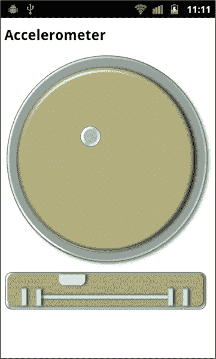

**图 2–52。***PhoneGap 示例中使用的指南针图像*

首先，我们用 navigator.compass.watchHeading()方法注册 onSuccess 方法。当我们的 onsuccess 方法被调用时，我们使用 css3 旋转变换来改变指南针图像指向的方向。这是一个视觉罗盘应用程序。

此处提到了该应用的完整 index.html:

`<!DOCTYPE HTML>
<ins><html></ins>
  <head>
    <title>PhoneGap</title>
    
    
  </head>
  <body onLoad="<ins>init</ins>()">
    <h1>Compass</h1>
    <table>
        <tr>
                <td>Compass Heading</td>
                <td>
                        
....<ins>
</ins>                 </td>
                <td>Degrees</td>
        </tr>
    </table>

    src</ins>="compass.png"
        style="width:400px;height:400px;margin-left:auto;margin-
        right:auto;auto;display:block"><ins></img></ins>

  </body>
</html>`

该代码如[图 2–53](#fig_2_53)所示。

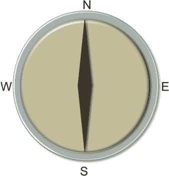

**图 2–53。** *PhoneGap 视觉罗盘应用*

[2–53](#fig_2_53)中的图可以从这个网址下载- `[http://beginingphonegap.googlecode.com/files/compass.png](http://beginingphonegap.googlecode.com/files/compass.png)`。

您可以从`[https://bitbucket.org/rohitghatol/apress-phonegap/src/67848b004644/android/PhoneGap-Compass](https://bitbucket.org/rohitghatol/apress-phonegap/src/67848b004644/android/PhoneGap-Compass)`下载这个例子的完整源代码。

可以参考`[http://docs.phonegap.com/en/1.1.0/phonegap_compass_compass.md.html#Compass](http://docs.phonegap.com/en/1.1.0/phonegap_compass_compass.md.html#Compass.).`的 Compass API 官方文档

##### 从相机中捕捉图像

本章的最后一节是关于从相机中捕捉图像。这是一个很酷的特性，它确实为基于 HTML 的应用程序增加了很多价值。让我们看看如何使用这个特性。

调用的 API 如下:

`navigator.camera.getPicture (onSuccessCallback, onErrorCallback,cameraOptions);`

虽然在 cameraOptions 中有许多选项，但我们只关注一个名为 quality 的属性。cameraOption 看起来会像{"quality":75}。

使用上面的 camera 选项，onSuccess()方法将获得一个 base64 编码的二进制图像。

相机应用的完整示例如下:

`<!DOCTYPE HTML>
<ins><html></ins>
  <head>
    <title>PhoneGap</title>
    
    
  </head>
  <body onLoad="<ins>init</ins>()">
    <h1>Camera</h1>
    <button id="capture" >Capture Image</button>

    <ins></img></ins>

  </body>
</html>` 

该代码如图[图 2–54](#fig_2_54)和[图 2–55](#fig_2_55)所示。

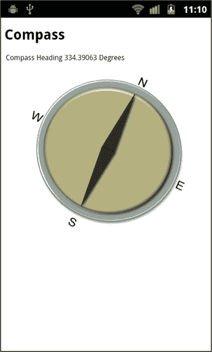

**图 2–54。** *PhoneGap 相机应用显示按钮捕捉图像*

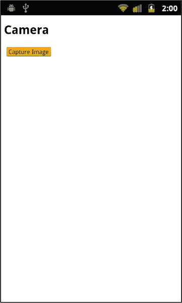

**图 2–55。** *拍摄图像后应用 PhoneGap 相机*

您可以从`[https://bitbucket.org/rohitghatol/apress-phonegap/src/67848b004644/android/PhoneGap-Camera](https://bitbucket.org/rohitghatol/apress-phonegap/src/67848b004644/android/PhoneGap-Camera)`下载这个例子的完整源代码。

可以参考`[http://docs.phonegap.com/en/1.1.0/phonegap_camera_camera.md.html#Camera](http://docs.phonegap.com/en/1.1.0/phonegap_camera_camera.md.html#Camera)`的相机 API 官方文档。