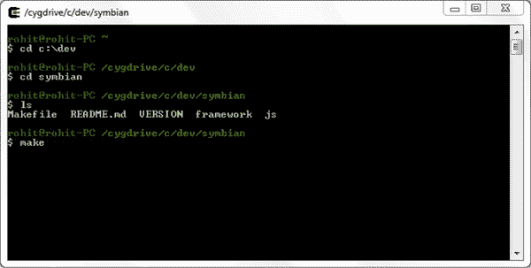
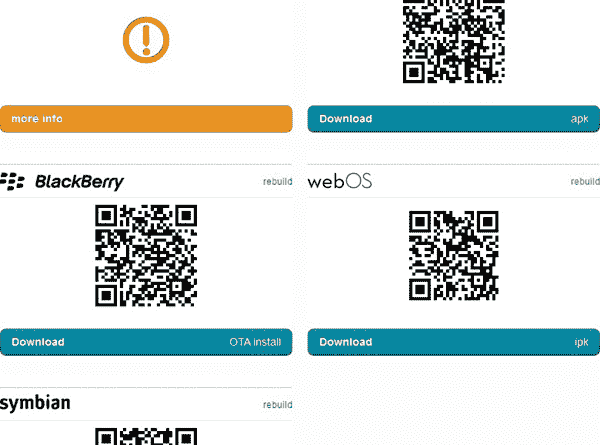

## 第三章

## 设置环境

PhoneGap 环境可以通过以下两种方式建立:

*   您机器上的本地开发环境
*   PhoneGap Build 上的云构建环境

本地开发环境设置包括开发人员为其想要启动 PhoneGap 应用的每个移动平台设置环境。本章详细介绍了本地环境设置，希望读者不需要任何其他文档就可以在每个平台模拟器上运行 PhoneGap 应用。

为了在特定平台的设备上运行 PhoneGap 应用，用户需要查看特定平台的文档。本章提供了该文档的参考资料。

另一方面，称为“PhoneGap Build”的云构建环境允许您在不需要本地开发环境的情况下构建 PhoneGap 应用。这意味着开发人员将只编写应用的 PhoneGap 部分，这需要 HTML、JavaScript 和 CSS。这段代码将被提供给 PhoneGap 构建服务。PhoneGap 构建服务将为每个平台构建所需的二进制文件，开发者可以下载这些文件。我们将在本章中更详细地研究这一过程。

### 当地发展环境

本地开发环境很像我们在[第二章](02.html#ch2)中为 Android 所做的。在本章中，我们将了解如何在您的开发机器上为以下平台设置 PhoneGap 环境:

1.  ios
2.  黑莓
3.  智能移动终端操作系统
4.  操作系统

需要注意的是，iOS 只能在使用 Xcode 的 Mac 上运行，而黑莓的首选操作系统是 Windows。

### 先决步骤

在我们继续之前，我们将预先完成所有平台的通用步骤。第一步是下载 PhoneGap。

#### 下载语音间隙

可以从`[www.phonegap.com](http://www.phonegap.com)`下载 PhoneGap sdk。这本书采用了 PhoneGap 1 . 1 . 0 版本，这是当时的最新版本。

下载 PhoneGap sdk 并解压缩后，您会看到如图[图 3–1](#fig_3_1)所示的文件夹结构。

**图 3–1。** *PhoneGap SDK 目录结构*

PhoneGap 支持的每个平台都有一个单独的目录。每个目录包含每个平台的库、工具和源代码，以帮助设置本地开发环境。

#### 使用 Xcode 4 为 iOS 设置环境

为了使用 iOS，你需要一台基于英特尔的电脑，安装 Mac OS X 雪豹(10.6)。

为了在设备上测试 PhoneGap 应用，您还需要以下内容:

1.  像 iPhone、iPad 或 iPod Touch 这样的苹果设备
2.  iOS 开发者帐户和证书

接下来，您需要执行以下安装步骤:

1.  安装 Xcode 和 PhoneGap。Xcode 安装程序可以从苹果开发者门户网站`[http://developer.apple.com/xcode/index.php](http://developer.apple.com/xcode/index.php)`下载。请注意，你需要一个苹果开发者账户。或者，你可以从 iTunes 上购买并下载 Xcode 4，价格约为 5 美元。
2.  导航到您提取 PhoneGap sdk 的 iOS 目录。运行 PhoneGap 安装程序，直到完成。
3.  Create a new PhoneGap project. Open Xcode and create a new project. This will present the following dialog box. Select the “PhoneGap Based Application” option and select the Next button (see [Figure 3-2](#fig_3_2)). 

    **图 3-2。** *创建新的 iOS PhoneGap 项目*

4.  On the next screen (shown in [Figure 3–3](#fig_3_3)), provide the product name and company identifier to the project creation wizard. Click next. 

    **图 3–3。** *创建一个新的 iOS PhoneGap 项目*

5.  Select the appropriate directory for the project and click the Create button.

    Xcode 提供了一个为项目创建 git 存储库的选项。点击[图 3–4](#fig_3_4)中所示的源控制复选框，可启用或禁用该功能。

**图 3–4。** *创建一个新的 iOS PhoneGap 项目*

现在你应该看到 Xcode 中的 HelloWorld 项目了。

1.  Input PhoneGap's HTML and JavaScript

    请注意，我们的项目中没有 www 文件夹。要创建一个 www 文件夹，点击 Xcode 左上角的运行按钮。它将构建项目并在模拟器中启动它。不要担心您的模拟器中显示“index.html 未找到”的错误。这是意料之中的，因为我们还没有把我们的 HTML 放到文件中。

2.  Open the project in Finder (see [Figure 3–5](#fig_3_5)). 

    **图 3–5。** *为 PhoneGap 定制 iOS 项目*

您将在项目文件夹旁边看到一个 www 文件夹。我们需要将这个文件夹复制到 Xcode 项目中。

1.  Drag and drop the www folder into Xcode. Xcode will now prompt with a few options. Select Create Folder References for any added folders and click the Finish button. Now you should see the project structure shown in [Figure 3–6](#fig_3_6) in Xcode. 

    **图 3–6。***iOS 项目中的 PhoneGap WWW 文件夹*

2.  Write PhoneGap Application

    您可以通过修改 index.html 文件来编写 PhoneGap 应用。为了打开 index.html，打开 www 文件夹并在编辑器中打开 index.html 页面。在 index.html 文件中键入您的内容。您还可以在 index.html 页面上指定关联的 Javascript 和 CSS 文件。

3.  部署到模拟器。确保在左上角的菜单中选择模拟器版本作为活动 SDK。
4.  Click the Run button in the Xcode project header to build the project and launch the application in the Simulator (see [Figure 3–7](#fig_3_7)). 

    **图 3–7。** *运行在 iOS 上的 PhoneGap 示例应用*

5.  Deploy to Device

    您可以在开发人员设备上启动 PhoneGap 应用。为了在设备上运行应用，打开 HelloWorld-info.plist 并更改 **BundleIdentifier** 。如果你有开发者许可证，你可以从苹果获得 BundleIdentifier。

6.  确保在左上角的菜单中选择 Device-version 作为 Active SDK，然后点按 Xcode 项目标题中的“运行”按钮。它将在设备中构建项目并启动应用。

#### 为黑莓手机设置环境

您需要一台基于英特尔的计算机，运行 Windows XP (32 位)或 Windows 7 (32 位和 64 位)来运行 BlackBerry。您需要在您的电脑上安装以下软件:

1.  Java se 6 jdk 32 位
2.  阿帕奇人 ant
3.  BlackBerry webworks sdk v2.0+版
4.  任何 Java IDE 环境
5.  BlackBerry 开发者专区帐户
6.  安装 j2sdk 6 (32 位)

你可以从`[http://www.oracle.com/technetwork/java/javasebusiness/downloads/java-archive-downloads-javase6-419409.html](http://www.oracle.com/technetwork/java/javasebusiness/downloads/java-archive-downloads-javase6-419409.html)`下载 J2SDK。运行 J2SDK 安装程序，直到完成。在 PATH 环境变量中添加 Installation _ directory/J2SDK/bin。

接下来，您需要执行以下安装步骤:

1.  Install Apache ant

    你可以从`[http://ant.apache.org/bindownload.cgi](http://ant.apache.org/bindownload.cgi)`下载 Apache ant 包。Apache ant 包是一个 zip 文件。提取 ant zip 文件并将 **`Extracted–directory/apache-ant-1.8.2/bin`** 放在 PATH 环境变量中。

2.  Install BlackBerry SDK

    从`[https://bdsc.webapps.blackberry.com/html5/download/sdk](https://bdsc.webapps.blackberry.com/html5/download/sdk)`网站下载用于智能手机的 BlackBerry Webworks SDK。运行 BlackBerry 安装程序，直到完成。通常，BlackBerry Webwork SDK 安装程序会将文件安装在 C:\BBWP 文件夹中。如果您将其更改为其他目录，请记住安装路径，因为您将需要在后面的步骤中使用它。我们建议使用路径“`c:\BBWP`”，因为我们在本章的其余部分将使用该路径。

3.  Create New PhoneGap project

    为了创建 BlackBerry PhoneGap 应用，PhoneGap 框架提供了一个 ant 脚本。

    *   导航到 PhoneGap BlackBerry 目录
    *   在命令提示符下运行“ant create–d project . path = C:\ Dev \ Sample”命令

    请注意，如果您无法运行上述命令，请尝试从`[https://github.com/callback/callback-blackberry/downloads](https://github.com/callback/callback-blackberry/downloads)`下载 PhoneGap 的 BlackBerry 回调，并将其解压缩到 PhoneGap 的 BlackBerry-WebWorks 目录中。

    

    **图 3–8。** *创建黑莓 PhoneGap 项目*

    这将创建项目文件夹，如[图 3–9](#fig_3_9)所示。请注意 www 文件夹。该文件夹包含 html 文件和 PhoneGap JavaScript 文件。

    

    **图 3–9。** *黑莓 PhoneGap 项目目录结构*

    您必须将 **project.properties** 文件中的 **bbwp.dir** 属性的值更改为`C:\\BBWP`。如果您在安装期间更改了 BlackBerry 安装目录，如步骤 3 所述，请确保您为 **bbwp.dir** 属性键入了相同的目录(参见[图 3–10](#fig_3_10))。

    

    **图 3–10。** *配置 project.properties 指向 BlackBerry Works SDK 目录*

4.  Write a PhoneGap Application

    编写 PhoneGap 应用就像修改 index.html 文件一样简单。要打开 index.html，请打开 www 文件夹，并在您喜欢的编辑器中打开 index.html 页面。在 index.html 文件中包含您的 CSS 和 JavaScript 文件。

5.  Deploy to Simulator

    在 BlackBerry 模拟器上部署需要以下步骤。

    *   启动 BlackBerry 模拟器，运行 ant 目标，如下所示。这将启动黑莓模拟器
        `C:\Dev\Sample>ant load-simulator`
    *   选择模拟器上的 BlackBerry 按钮
    *   选择下载文件夹

    在那里，您将看到 PhoneGap 示例应用。选择它将其打开(参见[图 3-11](#fig_3_11) )。

    

    **图 3–11。** *从黑莓模拟器下载运行 PhoneGap 应用*

6.  Deploy to Device

    为了在 BlackBerry 设备上部署 PhoneGap 应用，您需要来自 RIM 的签名密钥。您可以使用以下网站获取您的签名密钥`[https://www.blackberry.com/SignedKeys](https://www.blackberry.com/SignedKeys)`。

    导航到项目目录，并在命令提示符下运行以下 ant 命令:

    `C:\Dev\Sample>ant load-device`

#### 为 Symbian 设置环境

为了使用 Symbian，您需要一台基于 Intel 的计算机，并安装 Windows 操作系统。虽然 PhoneGap 的官方文档声称 Symbian 应用可以在所有操作系统上开发，但我们还是建议在 Windows 上使用诺基亚 Symbian s60 sdk 在 Symbian 仿真器上测试 PhoneGap 应用。

接下来，您需要执行以下安装步骤:

1.  Install Cygwin

    为了设置 Symbian 的环境，我们需要在 Windows 上安装 Cygwin。从`[http://cygwin.com/install.html](http://cygwin.com/install.html)`下载 Cygwin.exe 文件，开始安装直到完成。请注意，在安装 Cygwin 时，您必须选择两个包，即 zip 包和 make 包。

2.  Install the Symbian s60 sdk

    从`[http://www.forum.nokia.com/info/sw.nokia.com/id/ec866fab-4b76-49f6-b5a5-af0631419e9c/S60_All_in_One_SDKs.html](http://www.forum.nokia.com/info/sw.nokia.com/id/ec866fab-4b76-49f6-b5a5-af0631419e9c/S60_All_in_One_SDKs.html)`下载 Symbian s60 sdk。请注意，这个 sdk 大约 800+ mb，安装需要大约 3+ gb 的空间。安装大约需要 30 多分钟。

3.  Create a New PhoneGap project

    PhoneGap 目录里面有一个名为 Symbian 的文件夹；该目录是一个模板项目。为了创建一个新的 Symbian PhoneGap 项目，只需复制这个目录并粘贴到您希望创建新的 Symbian PhoneGap 项目的位置。该目录的内容如[图 3–12](#fig_3_12)所示。

    

    **图 3-12。** *创建新的 PhoneGap 项目*

4.  Write PhoneGap Application

    打开 www 文件夹，在您喜欢的编辑器中打开 index.html。编辑 HTML 内容，并根据需要包含 CSS 和 JavaScript。

5.  Deploy to Simulator

    Symbian PhoneGap 使用 makefile 来构建项目。在 Mac 或 Linux 机器上，只需在终端中运行 make 就可以构建它们。在 Windows 中，您将需要 Cygwin 来构建。只需在 terminal/Cygwin 中运行“make ”, Symbian 项目就构建好了,“wgz”文件也创建好了。这些步骤如[图 3–13](#fig_3_13)所示。

    

    **图 3–13。**T3】打造 Symbian 项目

    

    **图 3–14。** *打造塞班项目*

    app.wgz 文件需要加载到 Symbian 模拟器中。使用仿真程序的文件选项导入。wgz 文件。这将提示您安装应用。选择“是”安装应用。

    一旦应用安装完毕，我们需要点击 Symbian 模拟器中间底部的按钮来查看所有已经安装的应用。从这个屏幕启动我们的应用。一旦你启动了这个应用，你将会得到提示，关于运行这个应用所需要的权限。允许应用使用所需的功能。

6.  Deploy to Device

    您需要使用蓝牙或电子邮件将 Symbian PhoneGap 项目部署到设备上。使用蓝牙或电子邮件将 app.wgz 加载到设备中，然后启动应用。

#### 为 webOS 设置环境

您可以在 Windows、Mac 和 Linux 上开发 webOS 应用。您需要在开发箱上安装以下软件:

1.  Java se 6 jdk 32 位
2.  虚拟机版本 3.0 到 3.2
3.  webOS sdk 版本 3.0.4

接下来，您需要执行以下安装步骤:

1.  Install java se 6 jdk 32-bit

    你可以从`[www.oracle.com/technetwork/java/javasebusiness/downloads/java-archive-downloads-javase6-419409.html](http://www.oracle.com/technetwork/java/javasebusiness/downloads/java-archive-downloads-javase6-419409.html)`下载 J2SDK。运行 J2SDK 安装程序，直到完成。在 PATH 环境变量中添加 Installation _ directory/J2SDK/bin。

2.  Install Virtual Box

    从`[www.virtualbox.org/wiki/Download_Old_Builds_4_0](http://www.virtualbox.org/wiki/Download_Old_Builds_4_0)`下载虚拟盒子 3.0–3.2。开始安装，直到完成。

3.  Install webOS SDK

    从`[https://developer.palm.com/content/resources/develop/sdk_pdk_download.html](https://developer.palm.com/content/resources/develop/sdk_pdk_download.html)`下载 webOS sdk。开始安装，直到完成。

4.  Install Cygwin for Windows only

    如果您使用的是 Windows，您必须安装 Cygwin 来构建和部署用于 webOS 的 PhoneGap 应用。请看 Symbian 安装的第一步。

5.  Create new PhoneGap project

    PhoneGap 目录包含一个名为 webOS 的目录。这是 PhoneGap webOS 的模板项目。为了创建 PhoneGap webOS 项目，请将此目录复制到您的项目区域。

6.  Write PhoneGap application

    打开 www 文件夹，在你最喜欢的编辑器中打开 index.html。编辑 HTML 内容，并根据您的需要包含 CSS 和 JavaScript。

7.  Deploy to Simulator

    在部署项目之前，请确保 webOS 模拟器正在运行。从应用文件夹/开始菜单运行 palm-emulator。

    在项目文件夹中运行“make”。这将创建最终的 javaScript 文件。将项目打包到 webOS 移动应用包中，并将其安装在 webOS 模拟器中。

8.  Deploy to Device

    为了在 webOS 设备中部署 PhoneGap 项目，您必须启用“开发人员模式”并将其插入。在 Cygwin 终端的项目文件夹中运行“make”。

### 使用 PhoneGap Build 构建云环境

到目前为止，我们认为在不同的移动平台上构建 PhoneGap 应用很乏味。虽然 PhoneGap 开发减轻了跨平台移动应用开发的痛苦，但对于开发人员来说，在每个移动平台上构建 PhoneGap 仍然是乏味的。

为了缓解这种痛苦，PhoneGap 推出了 PhoneGap Build。PhoneGap Build 是一个云构建服务。开发人员将他们的 PhoneGap 应用代码提交给 PhoneGap Build，PhoneGap Build 根据以下内容开发应用:

1.  ios
2.  机器人
3.  黑莓
4.  操作系统
5.  智能移动终端操作系统

在本节中，我们将了解如何在 PhoneGap 上建立一个帐户，并在其上构建应用。

#### 向 PhoneGap Build 注册

1.  第一步是获得 PhoneGap beta 的帐户。转到`[http://build.phonegap.com](http://build.phonegap.com)`并提供您的详细信息。
2.  提交您的详细信息后，您将收到 PhoneGap 的电子邮件。在这封电子邮件中，PhoneGap 将提供测试代码。您需要在 PhoneGap 的注册页面提供测试代码。

虽然 PhoneGap Build 会为您构建应用，但您需要拥有这些应用。这是必要的，因为您将在 Appstore、Android Market 和 BlackBerry market 上发布从 PhoneGap Build 获得的版本。

让我们试着理解拥有你的应用意味着什么。一个应用需要被某些证书签名，在应用上印上你的所有权。对于 iOS 这样的平台，你需要获得一个开发者账号，并从苹果获得证书。

PhoneGap 需要您提供这些证书来构建以下应用:

1.  ios
2.  机器人
3.  黑莓

以下部分将演示如何生成这些证书并将其提供给 PhoneGap Build。

#### 向 PhoneGap Build 注册您的应用

构建 PhoneGap 的第一步是向 PhoneGap Build 注册您的应用。有三种方法可以注册 PhoneGap Build。

1.  在 PhoneGap 服务器上创建一个新的 git 存储库，并将代码推送到那里。
2.  从现有的 git 存储库中提取代码。
3.  上传你的 PhoneGap 应用的档案。

为了简单起见，我们将采用第二种选择，即从 PhoneGap git 存储库中提取 starter PhoneGap 项目(如[图 3–15](#fig_3_15)所示)。

**注意:** PhoneGap Build 需要访问您的源代码，因为它是一个构建工具。这意味着你需要与 PhoneGap Build 共享你的源代码。这就像说我们想在他们的 git 存储库中构建 PhoneGap 提供的 PhoneGap 样本代码。这样，我们不需要提供任何源代码，我们将使用示例源代码进行练习。

**图 3–15。** *从 PhoneGap 存储库中取出 PhoneGap 启动代码*

现在，您可以看到您的应用列在“您的应用”部分。注意，对于每个平台，都有一个下载图标(如图[图 3–16](#fig_3_16)所示)。单击 download 按钮允许您下载特定于平台的二进制文件。所有这些二进制文件都构建在 PhoneGap Build server 上，因此不需要您为 iOS、Android、BlackBerry、Symbian 和 webOS 设置环境。

**图 3–16。** *PhoneGap Starter 项目构建下载屏幕*

请注意[图 3–16](#fig_3_16)中 iOS 版本的橙色警告。对于 iOS，构建需要由开发者证书和预置描述文件签名。预置描述文件链接到 Apple 开发者帐户。如果开发人员希望在 iOS 设备上测试应用，该设备需要使用此预置描述文件进行注册。

现在，在上面列出的 5 个平台中，我们需要为 3 个平台的 PhoneGap Build 提供某种开发者私钥。这是获得特定于平台的版本所必需的，这些版本可以是:

1.  安装在设备上。
2.  上传到各自的应用商店。

这些平台是:

1.  机器人
2.  ios
3.  黑莓

#### 设置 Android 构建环境

Android 应用在发布到 Android 市场之前由自签名密钥库进行签名。Android 不需要一个中央机构来认证开发者的应用。但是，如果应用的版本 1 是用 xyz 开发人员密钥库签名的，那么应用的下一个版本必须用相同的开发人员密钥库签名。如果不这样做，将导致下一个版本的应用被 Android Market 拒绝。

以下是配置 PhoneGap Build 的步骤，以生成可以在 Android Market 上部署的正确的 Android build:

1.  创建私有密钥库
2.  将私有密钥库上传到 PhoneGap Build
3.  运行 PhoneGap 构建

##### 1。创建私有密钥库

首先要理解在`[http://developer.android.com/guide/publishing/app-signing.html#cert](http://developer.android.com/guide/publishing/app-signing.html#cert)`列出的 Android 应用发布指南。在本节中，我们将引导您完成创建私有密钥库所需的步骤。

创建私有密钥库的要求是您需要在您的机器上安装 java jdk 1.6 和更高版本。通过打开终端/命令提示符并键入以下命令来确认这一点:

`$> keytool`

如果这给了你某种帮助，那么你就可以走了。如果这告诉您没有名为 keytool 的工具，请确保您的 java bin 目录在 path 中。

现在，要实际创建您的私有密钥库，请遵循下面提供的步骤:

`$> keytool -genkey -v -keystore my-release-key.keystore`

系统将提示您输入密码。输入密码，并写下来。

`$>Enter keystore password: welcome`

您将被要求重新输入密码。

`$>Re-enter new password: welcome`

接下来，将会询问您一些问题，以便在私有密钥库中记录您的身份。请回答这些问题。

$ >您的名和姓是什么？

`  [Unknown]:  Rohit Ghatol
$>What is the name of your organizational unit?
  [Unknown]:  Engineering

$>What is the name of your organization?
  [Unknown]:  QuickOffice
$>What is the name of your City or Locality?
  [Unknown]:  Pune
$>What is the name of your State or Province?
  [Unknown]:  Maharahstra
$>What is the two-letter country code for this unit?
  [Unknown]:  IN`

现在将要求您确认到目前为止您输入的数据是否正确。

`$>Is CN=Rohit Ghatol, OU=Engineering, O=QuickOffice, L=Pune, ST=Maharahstra, C=IN
correct?
  [no]:  yes`

**注意:**工具将询问您创建自签名证书的密码。要保持这个密码与之前的密码相同，只需按 enter 键。

`$>Generating 1,024 bit DSA key pair and self-signed certificate (SHA1withDSA) with a
validity of 90 days
        for: CN=Rohit Ghatol, OU=Engineering, O=QuickOffice, L=Pune, ST=Maharahstra,
C=IN
$>Enter key password for <mykey>
        (RETURN if same as keystore password):
[Storing my-release-key.keystore]`

现在创建了名为“my-release-key.keystore”的私有密钥库文件，并保存在同一个目录中。

##### 2。将私有密钥库上传到 PhoneGap Build

在 PhoneGap Build 上导航到您的应用，点击编辑按钮，您将看到如图[图 3–17](#fig_3_17)所示的屏幕。

**图 3–17。** *PhoneGap 构建编辑应用屏幕*

导航到签名部分，并在该屏幕上上传 Android 密钥库信息(如[图 3–18](#fig_3_18)所示)

**图 3–18。**T3】进入安卓发布密钥库详情

在此为您的密钥库提供一个标题。在 PhoneGap Build 上，您可以提供多个密钥库，并选择使用哪个来构建您应用。标题是在浏览 PhoneGap Build 上上传的各种密钥库时识别密钥库。

接下来上传密钥库文件并提供任何别名。在密码字段(两者)中，您需要输入用于创建密钥库和私有证书的密码(在我们的例子中是“welcome”)。

##### 3。运行 PhoneGap 构建

最后，点击 create 和 PhoneGap Build 将代表您存储这个密钥库。

现在，您应该会看到一个类似于[Figure 3–19](#fig_3_19)的屏幕，告诉您“我的发布密钥”密钥库用于构建 Android 版本。

**图 3–19。***PhoneGap app 注册的安卓密钥库*

#### 设置 iOS 构建环境

在我们开始之前，让我们注意一下在 PhoneGap 上构建 iOS 的先决条件列表。

1.  苹果开发者计划(`[http://developer.apple.com/programs/ios/ 0](http://developer.apple.com/programs/ios/0)`)或苹果企业开发者计划(`[http://developer.apple.com/programs/ios/enterprise/](http://developer.apple.com/programs/ios/enterprise/)`)的苹果开发者账户。选择最符合您要求的一个。
2.  带有 Xcode 的 Mac 计算机，用于提取开发者证书和预置描述文件。提取这些信息后，开发人员可以在任何操作系统上使用 PhoneGap Build。

接下来的步骤如下:

> 1.  Get iOS key
> 2.  Provide iOS key to PhoneGap build

##### 1。获取 iOS 密钥

关于如何使用 iOS 开发者帐户配置 Xcode 的完整信息在`[http://tiny.cc/appleprov](http://tiny.cc/appleprov)`中有详细描述。

遵循上述步骤，并确保您能够在模拟器上构建和安装示例 iPhone 应用，最好是在 iOS 设备上(已经添加到您的预置描述文件中)。

现在下一步是从 Xcode 中导出开发者证书和预置描述文件，并将它们放入 PhoneGap Build 中。

##### 2。为 PhoneGap Build 提供 iOS 密钥

在正确设置了 iOS 开发环境之后，我们需要提取开发者证书和移动配置文件，并将它们上传到 PhoneGap Build。

第一步是从 Mac 的钥匙串访问中提取开发者证书。打开“钥匙串访问”,找到开发者证书并将其导出。导出时，会要求您输入文件夹和密码。记下该密码，因为当您在 PhoneGap Build 网站上上传开发者证书时将需要该密码。

之后，我们将继续提取配置文件。预置描述文件在 Xcode 内部。打开 Xcode，进入窗口->管理器，启动它。从这里，导出“团队配置文件”。请注意，预置描述文件是您告诉 Apple 您已将 iPhone/iPod/iPad 注册为开发人员设备来测试您的应用的地方。PhoneGap Build 需要此配置文件来签署您的应用(ipa)。

我们现在已经在名为 ios-Keys 的目录中提取了开发人员证书和移动配置文件。

**图 3–20。** *包含开发者证书和预置描述文件的目录*

我们需要在 PhoneGap Build 上上传这些密钥。再次访问应用的编辑屏幕，导航到签名部分，对于 iOS，单击添加密钥(下面的选择密钥下拉列表)。

**图 3–21。** *iOS 添加键屏幕*

这将打开 iOS 证书和预配描述文件对屏幕。上传所需的密钥和用于导出开发者证书的密码。

**图 3–22。** *为 PhoneGap Build 提供开发者证书和配置文件*

一旦你启动 PhoneGap Build，你应该注意到 iOS ipa build 上的橙色警告消失了，Build 变成了绿色。点击 ipa 按钮将为您带来 iOS ipa。

#### 设置 BlackBerry 构建环境

设置 BlackBerry 构建环境所需的主要操作如下:

1.  去拿黑莓钥匙
2.  向 PhoneGap Build 提供 BlackBerry 密钥

##### 1。获取 BlackBerry 密钥

PhoneGap Build 为构建 BlackBerry 应用提供现成的支持，这些应用可以安装在您的设备上。然而，为了上传这些应用进行分发，您需要 rim 提供密钥。为了获得这些密钥，您需要使用此网站- `[https://www.blackberry.com/SignedKeys/](https://www.blackberry.com/SignedKeys/)`向 rim 注册。

注册后，你会收到 rim 发来的电子邮件，其中提到了在黑莓开发环境中安装这些密钥的步骤。由于法律禁止共享这些指令，我们无法详细说明这些指令。

##### 2。向 PhoneGap Build 提供 BlackBerry 键

下一步是从 BlackBerry 开发环境中提取密钥。可以使用 eclipse 或独立的 BlackBerry web works 来设置 BlackBerry 开发环境。BlackBerry 密钥位于 BlackBerry 的 sdk 目录中。

第一个任务是定位 sdk 目录。

如果 BlackBerry 开发环境是使用 eclipse 安装的，您应该可以在`<<eclipse location>>\plugins\ net.rim.ejde.componentpackX.X.X_X.X.X.X \components`找到 BlackBerry sdk 目录。这方面的一个例子是 d:\ work soft \ eclipse-Helios \ net . rim . ejde . component pack 5 . 0 . 0 _ 5 . 0 . 0 . 25 \ components。

如果 BlackBerry 开发环境是使用 BlackBerry Widget/web works Packager Standalone SDK 安装的(就像我们在本章前面部分展示的那样)，安装目录就是 SDK 目录。这在本章前面部分显示为“`c:\BBWP`”目录。

代码签名文件/密钥位于 sdk 目录中。

`<<webworks_sdk_dir>\bin\sigtool.csk

<<webworks_sdk_dir>\bin\sigtool.db`

现在，我们已经获得了访问 BlackBerry 密钥的权限，请进入 PhoneGap Build 上的应用，单击编辑，然后转到签名部分。从下拉菜单中，为 BlackBerry 选择“添加密钥”选项。

**图 3–23。** *iOS 添加键屏幕*

在如下所示的对话框中上传 BlackBerry 密钥。使用您按照说明创建的相同密码，该密码是从 BlackBerry 的电子邮件中获得的。这为 PhoneGap Build 提供了构建 BlackBerry 应用所需的所有信息，这些应用可以在 BlackBerry 分发渠道上分发。

**图 3–24。** *黑莓钥匙文件上传*

#### 启动 PhoneGap 构建

PhoneGap 构建可以通过两种方式启动:

1.  手动点击 PhoneGap Build 上的“重建全部”,如下图所示。这将在 PhoneGap 构建服务器上对构建进行排队。
2.  第二种方法是使用 PhoneGap Build restful api 来创建应用、更新代码和启动构建。您可以使 PhoneGap 构建成为您的 cit 构建的一部分(从 bamboo 或 jerkins 或任何 cit 系统)。让 cit 构建脚本调用 PhoneGap Build restful api。PhoneGap 构建 api 的细节可以在`[https://build.phonegap.com/docs/api](https://build.phonegap.com/docs/api)`找到。

### 结论

随着云在托管 web 服务和应用方面越来越受欢迎，许多公司都在寻求基于云的 saas 服务来帮助他们的开发周期。

像 pivotal tracker 这样的公司用于敏捷规划，bitcode 用于托管源代码，甚至还有在线 cit 构建(例如 jira studio)。PhoneGap Build 的出现并不令人惊讶。

不仅仅为了 cit 而购买额外的 Windows 和 Mac 电脑，从而节省基础设施成本是有意义的。保持低成本和租用基础设施(就像我们支付电费一样)正成为当今的趋势。

PhoneGap Build 适合中小型公司的需求，这些公司希望摆脱基础设施负担，使用基于云的 saas 服务来构建 PhoneGap 应用。