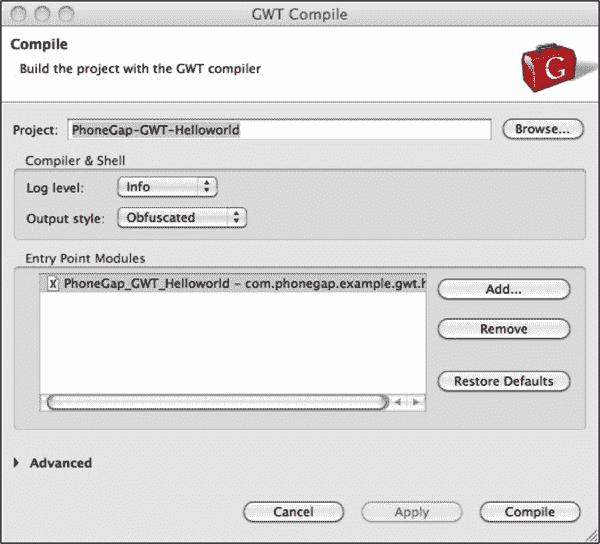

## 第六章

## 在 GWT 使用 PhoneGap

Google Web toolkit (GWT)是 Google 提供的一个框架，可以用来开发基于浏览器的应用程序。GWT 允许开发人员用 Java 编写代码并生成基于 JavaScript 的应用程序。

GWT 应用程序本质上是跨浏览器兼容的，它们是最小和最快的基于浏览器的应用程序。

本章将重点介绍如何使用 PhoneGap 为手机开发一个 GWT 应用程序。这些步骤基于 Daniel Kurka 开发的 GWT PhoneGap 库。你可以从`[http://code.google.com/p/gwt-phonegap/](http://code.google.com/p/gwt-phonegap/).`下载这个库

如何开发基于 GWT 的应用程序的知识是必不可少的。如果你是 GWT 应用的新手，你可以访问`[http://code.google.com/webtoolkit/doc/latest/tutorial/index.html](http://code.google.com/webtoolkit/doc/latest/tutorial/index.html)`来了解更多关于 GWT 的信息。

### 为什么使用 GWT 进行用户界面开发？

在我们开始讨论如何一起使用 GWT 和 PhoneGap 之前，让我们首先考虑一下为什么 GWT 是用户界面开发的最佳选择:

*   GWT 允许开发人员编写基于浏览器的应用程序，而不必担心跨浏览器问题、JavaScript 中的内存泄漏以及 JavaScript 语言本身。
*   GWT 允许开发人员用 Java 编写代码，并将用 Java 编写的用户界面和业务逻辑编译成 JavaScript。
*   GWT 还允许您使用诸如*延迟绑定*之类的概念(这就像 JavaScript 世界的运行时多态性)。这种方法允许开发人员创建一个应用程序，该应用程序可以使用不同的类为移动浏览器提供服务，并使用另一组类为桌面浏览器提供服务。
*   GWT 确保您可以创建最小和最快的 JavaScripts。
*   GWT 是一项被许多公司和大部分开发者社区广泛接受的技术。GWT 正在成为大型、复杂的基于 Ajax 的应用程序的事实上的选择。

除了上述优势，许多轻量级、现成的小部件对于 GWT 来说都是现成的。此外，还有专业的 GWT 库，像 EXT-GWT 和 Smart-GWT，它们使用户界面看起来非常专业和完美。想象一下，您的 Java 开发人员使用他们现有的 Java 技能，按照最佳设计实践轻松编写基于浏览器的应用程序。GWT 消除了编写基于浏览器的应用程序的痛苦，同时提供了最好的浏览器应用程序。

### 了解 GWT PhoneGap

GWT 提供了一个名为 JavaScript Native Interface (JSNI)的机制，它允许 GWT 包装现有的 JavaScript 库。这种能力允许开发人员用 Java 编写代码，而不必担心底层 JavaScript 函数是如何被调用的。

GWT PhoneGap 是 PhoneGap 库的 GWT 包装器。下一节将演示如何使用 GWT PhoneGap 编写一个 helloworld 应用程序。

### 构建 PhoneGap GWT 应用程序

构建 GWT PhoneGap 应用程序有两个主要步骤。第一步是建立一个 GWT 项目。一旦您构建了 GWT 项目，开发人员将编译 GWT 项目来创建一个 web 应用程序(一组 HTMLs 和 JavaScripts)。

第二步是构建一个 Android PhoneGap 应用程序(使用 PhoneGap 的 0.9.4 版本),并将 GWT web 应用程序嵌入 PhoneGap 应用程序中。

#### 构建 GWT 应用程序

在构建 GWT 应用程序之前，您需要以下工具:

*   JDK 1.6 以上
*   日蚀 3.6 太阳神
*   Eclipse Google 插件
*   PhoneGap 0.9.4 库
*   GWT PhoneGap 0.8 版本库
*   用于测试的 Chrome 浏览器 12+版本

创建一个新的 web 应用程序项目(Google web application ),并在向导中填入如图[图 6–1](#fig_6_1)所示的值。您需要选中“使用谷歌网络工具包”，取消选中“使用谷歌应用引擎”

**图 6–1。** *创建 GWT 项目*

为项目创建一个名为“lib”的文件夹。从`[http://code.google.com/p/gwt-phonegap/downloads/detail?name=gwt-phonegap-0.8.jar](http://code.google.com/p/gwt-phonegap/downloads/detail?name=gwt-phonegap-0.8.jar)`下载 GWT-PhoneGap 库，并将其复制到应用程序的 lib 文件夹中。将 gwt-phonegap-0.8.jar 添加到类路径中，方法是右键单击 jar，然后单击“构建路径”——>“添加到构建路径”

现在打开 PhoneGap _ GWT _ hello world . gwt . XML 文件。在该文件中，添加以下条目:

`<inherits name='de.kurka.phonegap.PhoneGap' />
<set-property name="user.agent" value="safari" />` 

请注意，通过将 user.agent 的 set-property 添加到 safari，GWT 将只为基于 webkit 的浏览器生成 JavaScript。Chrome 浏览器将专门用于这种情况下的测试。

您的 PhoneGap _ GWT _ hello world . gwt . XML 文件现在应该如下所示:

`<?xml version="1.0" encoding="UTF-8"?>
<module rename-to='phonegap_gwt_helloworld'>
  <!-- Inherit the core Web Toolkit stuff.                        -->
  <inherits name='com.google.gwt.user.User'/>
  <!-- Inherit the default GWT style sheet.  You can change       -->
  <!-- the theme of your GWT application by uncommenting          -->
  <!-- any one of the following lines.                            -->
  <inherits name='com.google.gwt.user.theme.clean.Clean'/>
  <!-- <inherits name='com.google.gwt.user.theme.standard.Standard'/> -->
  <!-- <inherits name='com.google.gwt.user.theme.chrome.Chrome'/> -->
  <!-- <inherits name='com.google.gwt.user.theme.dark.Dark'/>     -->

  <!-- Other module inherits                                      -->
  <inherits name='de.kurka.phonegap.PhoneGap' />
   <set-property name="user.agent" value="safari" />

  <!-- Specify the app entry point class.                         -->
  <entry-point class='com.phonegap.example.gwt.helloworld.client.PhoneGap_GWT_Helloworld'/>
  <!-- Specify the paths for translatable code                    -->
  <source path='client'/>
  <source path='shared'/>

</module>`

现在打开 PhoneGap_GWT_Helloworld.html，位于项目的 war 文件夹中，并进行以下更改:

`<!doctype html>
<!-- The DOCTYPE declaration above will set the    -->
<!-- browser's rendering engine into               -->
<!-- "Standards Mode". Replacing this declaration  -->
<!-- with a "Quirks Mode" doctype may lead to some -->
<!-- differences in layout.                        -->

<html>
  <head>
    <meta http-equiv="content-type" content="text/html; charset=UTF-8">

    <!--                                                               -->
    <!-- Consider inlining CSS to reduce the number of requested files -->
    <!--                                                               -->
    <link type="text/css" rel="stylesheet" href="PhoneGap_GWT_Helloworld.css">` `    <!--                                           -->
    <!-- Any title is fine                         -->
    <!--                                           -->
    <title>Gwt PhoneGap Demo</title>

    <!--                                           -->
    <!-- This script loads your compiled module.   -->
    <!-- If you add any GWT meta tags, they must   -->
    <!-- be added before this line.                -->
    <!--                                           -->
    
  </head>

  <!--                                           -->
  <!-- The body can have arbitrary html, or      -->
  <!-- you can leave the body empty if you want  -->
  <!-- to create a completely dynamic UI.        -->
  <!--                                           -->
  <body>

  </body>
</html>`

如果您计划在 Android 上运行这个示例，您应该在 phonegap _ gwt _ hello world/phonegap _ gwt _ hello world . no cache . js 标记之后添加以下内容:

``

现在，打开 src 文件夹中的 PhoneGap_GWT_Helloworld.java，并进行以下更改:

`package com.phonegap.example.gwt.helloworld.client;
import com.google.gwt.core.client.EntryPoint;
import com.google.gwt.user.client.ui.Label;
import com.google.gwt.user.client.ui.RootPanel;

/**
 * Entry point classes define <code>onModuleLoad()</code>.
 */
public class PhoneGap_GWT_Helloworld implements EntryPoint {

        /**
         * This is the entry point method.
         */
        public void onModuleLoad() {
                RootPanel.get().add(new Label("GWT PhoneGap Demo"));
        }
}`

默认创建的 GWT 项目有一个用于客户端服务器通信的 RPC 组件，这个应用程序不需要它。因此，您可以从项目中移除以下条目:

*   客户包里的 GreetingService.java 和 GreetingServiceAsync.java
*   共享包和服务器包
*   web.xml 中的任何 servlets

现在，运行 GWT 项目(运行方式-> Web 应用程序)，您应该会看到如图[图 6–2](#fig_6_2)所示的屏幕。请注意，这个示例将在浏览器中运行，以确保您的 GWT 项目设置正确。

**图 6–2。** *在 Chrome 浏览器中运行 GWT 项目*

下一步是实际利用 PhoneGap API 将 GWT 项目编译成一个 web 应用程序。

PhoneGap GWT 库的一个好处是，当作为 GWT web 应用程序启动时，它模仿 PhoneGap 库。该库根据以下指令提供替代功能:

1.  如果在 Android 或 iPhone 上运行，请使用 PhoneGap JavaScript。
2.  否则，使用内部模拟类并给出虚拟值。

首先使用延迟绑定创建 PhoneGap 的对象:

`PhoneGap PhoneGap = (PhoneGap)GWT.create(PhoneGap.class);` 

下一步是在 PhoneGap 框架中注册以下回调:

*   *phonegavailablehandler:*当一切正常并且 PhoneGap 被正确初始化时，这个回调就会发生。总之，这是一次成功的回调。
*   *Phonegaptimeouthandler:* 当 PhoneGap 没有在给定的时间限制内初始化时，会发生这个回调，可能是由于未能初始化 PhoneGap 框架。简而言之，这是一次失败回调。

最后，您必须通过调用`PhoneGap.initializePhoneGap().`来初始化 PhoneGap 框架。调用这个 API 将导致上面的一个回调。

主代码将被写成`PhoneGapAvailableHandler`回调，如下所示。使用 PhoneGap 变量是安全的，因为 PhoneGap 已经被正确初始化。在下面的代码中，您从 PhoneGap 获得设备的处理程序，然后在一个网格(2 列 5 行的表格)中打印设备信息值:

`Device device = phoneGap.getDevice();
Grid grid = new Grid(5, 2);
//Add a row mentioning Name Property of Device
grid.setWidget(0, 0, new Label("Name"));
grid.setWidget(0, 1, new Label(device.getName()));

//Add a row mentioning Platform Property of Device
grid.setWidget(1, 0, new Label("Platform"));
grid.setWidget(1, 1, new Label(device.getPlatform()));

//Add a row mentioning Version Property of Device
grid.setWidget(2, 0, new Label("Version"));
grid.setWidget(2, 1, new Label(device.getVersion()));

//Add a row mentioning Name Property of Device
grid.setWidget(3, 0, new Label("PhoneGapVersion"));
grid.setWidget(3, 1, new Label(device.getPhoneGapVersion()));

//Add a row mentioning Name Property of Device
grid.setWidget(4, 0, new Label("UUID"));
grid.setWidget(4, 1, new Label(device.getUuid()));

grid.setBorderWidth(1);
RootPanel.get().add(grid);`

以下是完整的示例:

`package com.phonegap.example.gwt.helloworld.client;
import com.google.gwt.core.client.EntryPoint;
import com.google.gwt.core.client.GWT;
import com.google.gwt.user.client.Window;
import com.google.gwt.user.client.ui.Grid;
import com.google.gwt.user.client.ui.Label;
import com.google.gwt.user.client.ui.RootPanel;

import de.kurka.phonegap.client.PhoneGap;
import de.kurka.phonegap.client.PhoneGapAvailableEvent;
import de.kurka.phonegap.client.PhoneGapAvailableHandler;
import de.kurka.phonegap.client.PhoneGapTimeoutEvent;` `import de.kurka.phonegap.client.PhoneGapTimeoutHandler;
import de.kurka.phonegap.client.device.Device;

/**
 * Entry point classes define <code>onModuleLoad()</code>.
 */
public class PhoneGap_GWT_Helloworld implements EntryPoint {

    /**
     * This is the entry point method.
     */
    public void onModuleLoad() {
        final PhoneGap phoneGap = GWT.create(PhoneGap.class);
        phoneGap.addHandler(new PhoneGapAvailableHandler() {

            public void onPhoneGapAvailable(PhoneGapAvailableEvent event) {
                Device device = phoneGap.getDevice();

                Grid grid = new Grid(5, 2);
                //Add a row mentioning Name Property of Device
                grid.setWidget(0, 0, new Label("Name"));
                grid.setWidget(0, 1, new Label(device.getName()));
                //Add a row mentioning Platform Property of Device
                grid.setWidget(1, 0, new Label("Platform"));
                grid.setWidget(1, 1, new Label(device.getPlatform()));
                //Add a row mentioning Version Property of Device
                grid.setWidget(2, 0, new Label("Version"));
                grid.setWidget(2, 1, new Label(device.getVersion()));
                //Add a row mentioning Name Property of Device
                grid.setWidget(3, 0, new Label("PhoneGapVersion"));
                grid.setWidget(3, 1, new Label(device.getPhoneGapVersion()));
                //Add a row mentioning Name Property of Device
                grid.setWidget(4, 0, new Label("UUID"));
                grid.setWidget(4, 1, new Label(device.getUuid()));
                grid.setBorderWidth(1);
                RootPanel.get().add(grid);

            }
        });

        phoneGap.addHandler(new PhoneGapTimeoutHandler() {
            public void onPhoneGapTimeout(PhoneGapTimeoutEvent event) {
                Window.alert("can not load phonegap");
            }
        });

        phoneGap.initializePhoneGap();    
    }
}`

您可以使用“run as -> web application”从 Eclipse 运行这个示例，并在浏览器中查找代码。

您将看到[图 6–3](#fig_6_3)中所示的表格。如上所述，当在浏览器中运行代码时，模拟值由 GWT PhoneGap 显示，而不是在 Android 或 iPhone 上。

**图 6–3。** *在 Chrome 浏览器中运行 GWT PhoneGap 项目*

最后一步是将这个项目编译成 web 应用程序。右键单击项目，选择 Google 选项，然后单击名为“GWT 编译”的菜单选项您将看到如图[图 6–4](#fig_6_4)所示的对话框。单击编译。

**图 6–4。** *GWT 编译屏幕*

编译完成后，在 Eclipse 中刷新您的项目，您应该会看到如图[Figure 6–5](#fig_6_5)所示的目录结构。在 war 文件夹中，您应该会看到一个 phonegap_gwt_helloworld 文件夹，其中包含许多 HTML 和 JavaScript 文件，如下所示。

**图 6–5。** *GWT 战争目录结构 GWT 编译后*

#### 构建 PhoneGap Android 应用程序

构建 PhoneGap GWT 应用程序的最后一步是创建一个 Android PhoneGap 项目，如[图 6–6](#fig_6_6)和[图 6–7](#fig_6_7)所示，然后将 GWT 生成的 web 应用程序复制到 assets/www 文件夹中。

第一步是创建一个 Android 项目。

**图 6–6。** *Android 创建项目屏幕*

**图 6–7。** *Android 创建项目屏幕*

现在，将 PhoneGap 0.9.4 库注入 Android 项目。

从`[http://phonegap.googlecode.com/files/phonegap-0.9.4.zip](http://phonegap.googlecode.com/files/phonegap-0.9.4.zip)`下载 PhoneGap 0.9.4 库。撤消 zip 文件，您将看到如图[图 6–8](#fig_6_8)所示的文件夹结构。

**图 6–8。** *PhoneGap 0.9.4 目录结构*

在 Android 项目文件夹中创建一个 lib 文件夹，在 lib 文件夹中复制 PhoneGap.0.9.4.jar 文件，然后将其添加到 Eclipse 类路径中。(右键单击 jar 文件，转到“构建路径”，然后单击“添加到构建路径”)

下一步是在 assets 文件夹中创建一个 www 文件夹，并将 PhoneGap.0.9.4.js 文件复制到 www 文件夹中。然后，您需要将 GWT 项目中的以下文件复制到同一文件夹中:

*   PhoneGap_GWT_Helloworld.html
*   PhoneGap_Gwt_Helloworld.css
*   phonegap_gwt_helloworld 文件夹

您的文件夹结构现在应该类似于[图 6–9](#fig_6_9)中的示例。编译项目时会生成名为“gwt”的文件夹中的文件。

**图 6–9。** *使用 Android 的 GWT PhoneGap 项目目录结构*

现在您需要修改以下文件:

*   HelloWorld.java 文件
*   PhoneGap_GWT_Helloworld.html

此外，您需要检查 HelloWorld.java 文件是否类似于以下内容:

`package com.phonegap.gwt.helloworld;
import android.os.Bundle;
import com.phonegap.DroidGap;
public class HelloWorld extends DroidGap {
    /** Called when the activity is first created. */
    @Override
    public void onCreate(Bundle savedInstanceState) {
        super.onCreate(savedInstanceState);
        super.loadUrl("file:///android_asset/www/PhoneGap_GWT_Helloworld.html");
    }
}`

在 PhoneGap_GWT_Helloworld.html 文件夹中，您需要进行一些代码更改。

首先添加 Android 版 PhoneGap JavaScript 库 0.9.4 版本，如下:

`` 

接下来，侦听 deviceready 事件，以确定 PhoneGap 库是否可以使用:

``

在此将 PhoneGap.available 变量显式设置为 true。这是 Android 平台的必经步骤。

以下是 PhoneGap_gWT_Helloworld.html 的完整源代码:

`<!doctype html>
<!-- The DOCTYPE declaration above will set the -->
<!-- browser's rendering engine into -->
<!-- "Standards Mode". Replacing this declaration -->
<!-- with a "Quirks Mode" doctype may lead to some -->
<!-- differences in layout. -->
<html>

    <head>
        <meta http-equiv="content-type" content="text/html; charset=UTF-8">
        <!-- -->
        <!-- Consider inlining CSS to reduce the number of requested files -->
        <!-- -->
        <link type="text/css" rel="stylesheet" href="PhoneGap_GWT_Helloworld.css">
        <!-- -->
        <!-- Any title is fine -->
        <!-- -->
        <title>
            Gwt PhoneGap Demo
        </title>
        <!-- -->
        <!-- This script loads your compiled module. -->
        <!-- If you add any GWT meta tags, they must -->
        <!-- be added before this line. -->
        <!-- -->
        
        
        
    </head>
    <!-- -->
    <!-- The body can have arbitrary html, or -->
    <!-- you can leave the body empty if you want -->
    <!-- to create a completely dynamic UI. -->
    <!-- -->

    <body>
    </body>

</html>` 

运行此代码后，仿真器上的屏幕应显示为[图 6–10](#fig_6_10)中的示例。

**图 6–10。***GWT PhoneGap 应用程序显示设备信息*

与上面的代码一样，您可以编写代码来访问其他 PhoneGap APIs，也可以编写一个通过 PhoneGap 访问本地电话功能的 GWT 应用程序。

#### GWT PhoneGap 参考

下面列出了 GWT PhoneGap 项目中使用的文档和源代码的链接。丹尼尔·库尔卡是这个图书馆的作者。

主页—`[http://code.google.com/p/gwt-phonegap/](http://code.google.com/p/gwt-phonegap/)`

入门—`[http://code.google.com/p/gwt-phonegap/wiki/GettingStarted](http://code.google.com/p/gwt-phonegap/wiki/GettingStarted)`

下载 jar-`[http://gwt-phonegap.googlecode.com/files/gwt-phonegap-0.8.jar](http://gwt-phonegap.googlecode.com/files/gwt-phonegap-0.8.jar)`

下载 Javadocs—`[http://gwt-phonegap.googlecode.com/files/gwt-phonegap-0.8-javadoc.jar](http://gwt-phonegap.googlecode.com/files/gwt-phonegap-0.8-javadoc.jar)`

源代码—`[http://code.google.com/p/gwt-phonegap/source/browse/](http://code.google.com/p/gwt-phonegap/source/browse/)`

当前功能-`[http://code.google.com/p/gwt-phonegap/wiki/Features](http://code.google.com/p/gwt-phonegap/wiki/Features)`