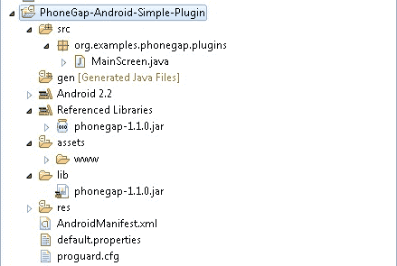
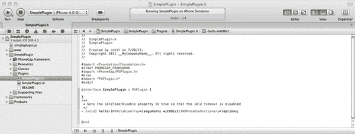

## 第九章

## 扩展 PhoneGap

到目前为止，我们已经看到 PhoneGap 有两个部分

1.  我们从 PhoneGap 应用程序中调用的 JavaScript 部分
2.  我们在 PhoneGap 项目中包含的一个本机部分，用于公开本机电话功能。

这两个部分适用于我们希望访问常见电话功能的情况，包括以下内容:

1.  照相机
2.  加速计
3.  文件系统
4.  地理位置
5.  存储服务

然而，我们经常需要超越这些特性。

### JavaScript 限制

我们已经看到 JavaScript 在过去十年中性能有所提高；它比五年前快了 100 倍。然而，即使这是真的，有时应用程序需要做大量的照明，在后台做事情，或者做复杂的操作。出于性能原因，这些最好在本机代码中完成。

例如，如果我们想下载一个多部分文件，它涉及到并行下载文件的不同部分，然后检查其校验和。这一部分最好用 Java 为 Android 编写，用 Objective-C 为 iPhone 编写。

### 解

如果你还记得第一章的话，我们说过 PhoneGap 是 JavaScript 世界和本地世界之间的桥梁。整个 PhoneGap 框架是基于插件架构的。这意味着 PhoneGap 提供了一种将 JavaScript 函数(以及参数、返回类型和回调)映射到本机代码的机制。

我们可以向 PhoneGap 应用程序添加本机代码，并使用 JavaScript 轻松公开代码。为此，我们需要两部分

1.  完成繁重工作的本机代码
2.  公开此本机代码的 JavaScript 代码

两者都被 PhoneGap 框架粘合在一起。

### 建筑

PhoneGap 架构如[图 9–1](#fig_9_1)所示。正如我们所观察到的，PhoneGap 有两个部分:PhoneGap JavaScript 引擎和 PhoneGap 原生引擎。我们将本机代码作为插件添加到 PhoneGap 本机引擎，并将 JavaScript 代码作为插件添加到 PhoneGap JavaScript 引擎。

**图 9–1。** *PhoneGap 架构*

### 范围

本章重点介绍如何扩展 PhoneGap 功能，以暴露更多的本机代码。

但是，请注意，即使您编写了 PhoneGap 插件，注入插件的唯一方法是将插件源代码添加到您的项目中。目前还没有办法将插件构建到包中，并将包添加到 PhoneGap 项目中。当您使用 PhoneGap build 时，这会阻止您使用自定义插件。

对于这一章，让我们保持插件的本质非常简单。我们称之为 helloworld 插件。我们向插件传递一个名称，然后我们得到一个字符串“Hello <name>！现在的时间是<current time="">”。</current></name>

这样，我们主要关注插件的桥方面。

### 为 Android 扩展 PhoneGap

首先，我们将插件创建为 Android PhoneGap 应用程序的一部分，然后将插件提取出来。这是必需的，因为

1.  该插件需要 PhoneGap jar。
2.  我们需要测试插件。

一个插件有两个部分，PhoneGap 框架(桥)的两边各有一个。我们有一个原生部分(一个类扩展插件)和一个使用 PhoneGap 的 JavaScript 框架的 JavaScript 文件。

在我们开始之前，让我们创建一个 Android PhoneGap 项目(参见[图 9-2](#fig_9_2))。[第二章](02.html#ch2)中有说明。

**图 9–2。** *新安卓项目*

然后我们需要为 PhoneGap 配置基本的 Android 项目。

1.  更改 MainScreen 类以扩展 DroidGap。
2.  将 PhoneGap jar 添加到类路径中。
3.  将 PhoneGap JavaScript 库添加到 assets/www 文件夹。

Android 项目看起来如[图 9–3](#fig_9_3)所示。

**图 9–3。** *安卓项目结构*

#### 声明插件的本机部分

现在我们为插件添加一个合适的包，比如“`org.examples.phonegap..plugins.simpleplugin`”然后我们声明一个名为 Simple Plug-in 的类，它扩展了 PhoneGap 的 com.phonegap.api.Plugin 类，如图[Figure 9–4](#fig_9_4)所示。

**图 9–4。** *声明插件的原生部分*

一旦你点击“完成”按钮，你将得到如下所示的代码

`package org.examples.phonegap.plugins.simpleplugin;

import org.json.JSONArray;

import com.phonegap.api.Plugin;
import com.phonegap.api.PluginResult;

/**
 * @author rohit
 *
 */
public class SimplePlugin extends Plugin {

        /* (non-Javadoc)` `         * @see com.phonegap.api.Plugin#execute(java.lang.String, org.json.JSONArray,
java.lang.String)
         */
        @Override
        public PluginResult execute(String action, JSONArray data, String callbackId) {
                // TODO Auto-generated method stub
                return null;
        }

}`

当我们扩展`com.phonegap.api.Plugin`类时，我们必须实现 execute 方法。execute 方法的参数是

1.  *动作*:要执行的动作。例如，对于基于文件的插件，可以是打开、关闭、读取、写入等。
2.  *数据*:插件 JavaScript 端传过来的数据。这是从 PhoneGap 的 JavaScript 应用程序传递到本机代码的数据。例如，对于基于文件的插件，可以是文件名、数据等。
3.  *CallbackId* :回调 JavaScript 函数时使用。

execute 方法的返回类型是 PluginResult。PluginResult 通常接受一个状态枚举和一个描述原因或更多信息的其他参数。

例如，新的 PluginResult(状态。OK)；

状态枚举有许多值；所有这些都描述如下(名称不言自明)

1.  没有结果
2.  好
3.  类未找到异常
4.  非法访问异常
5.  实例化 _ 异常
6.  格式错误 _URL_EXCEPTION
7.  io _ exception(io _ 异常错误)
8.  无效 _ 操作
9.  JSON _ exception(JSON _ 异常)
10.  错误

下面是 hello 插件的实现，它接受一个名称并返回“Hello <name>！时间是<time>文本。</time></name>

`package org.examples.phonegap.plugins.simpleplugin;

import java.util.Date;

import org.json.JSONArray;
import org.json.JSONException;

import com.phonegap.api.Plugin;
import com.phonegap.api.PluginResult;
import com.phonegap.api.PluginResult.Status;

/**
 * @author rohit
 *
 */
public class SimplePlugin extends Plugin {

        public static String ACTION_HELLO="hello";

        /*
         * (non-Javadoc)
         *
         * @see com.phonegap.api.Plugin#execute(java.lang.String,
         * org.json.JSONArray, java.lang.String)
         */
        @Override
        public PluginResult execute(String action, JSONArray data, String callbackId) {
                 PluginResult pluginResult = null;
                 if (ACTION_HELLO.equals(action)) {

                         String name = null;
                         try {
                                 name = data.getString(0);

                                 String result = "Hello " + name + "! The time is "
                                                 + (new Date()).toString();

                                 pluginResult = new PluginResult(Status.OK, result);

                                 return pluginResult;
                         } catch (JSONException e) {
                                 pluginResult = new PluginResult(Status.JSON_EXCEPTION,
 "missing argument name");
                         }
                 } else {
                         pluginResult = new PluginResult(Status.INVALID_
                        ACTION,
                                          "Allowed actions is hello");
                 }
                 return pluginResult;
        }
}`

您可以在上面的代码中看到，在处理请求之前，我们显式地检查了一个操作。如果动作不是由插件处理的，我们返回`Status.INVALID_ACTION`。第二个检查是针对参数的。如果我们在获取第一个字符串参数时得到任何 JSON 异常，我们返回`Status.INVALID_JSON`。当动作和参数正确时，我们创建一个字符串“Hello < name >！时间是<时间>，用`Status.OK`返回。

请注意，您不必从这个方法中产生任何线程。您的整个方法可以是同步的。这将不会传递调用该代码的 JavaScript 插件调用。这是由 PhoneGap 内部处理的，这就是为什么我们在 JavaScript 中有成功和失败回调(您将在下一节看到)。

#### 声明插件的 JavaScript 部分

这个插件的 JavaScript 部分是在一个名为 simpleplugin.js 的文件中声明的。

1.  Plug-in Registration

    在 PhoneGap 插件的 JavaScript 部分，事情是从调用在 PhoneGap 中添加插件开始的。

    `PhoneGap.addConstructor(**function**() {
                    // Register the <ins>Javascript plug-in</ins> with PhoneGap
                    PhoneGap.addPlugin('SimplePlugin', **new** SimplePlugin());
    });`

    插件在/res/xml/plugins.xml 文件中注册。将以下 XML 元素添加为 plugins.xml 文件中“plugins”元素的子元素:

    `<plugin name="SimplePlugin"
    value="org.examples.phonegap.plugins.simpleplugin.SimplePlugin" />`

    注意:这里我们做了两件事

    1.  将 JavaScript 对象注册为名为“SimplePlugin”的插件
    2.  将 PhoneGap Java 类注册为名为“SimplePlugin”的服务您可以将此视为类名`“org.examples.phonegap.plugins.simpleplugin.Simple Plugin.”`的别名
2.  Create the JavaScript object SimplePlugin.

    这是通过声明一个 JavaScript 函数来完成的。

    `var SimplePlugin = function() {
    }`
3.  Add a plug-in function.

    在这一步中，我们将添加插件函数，我们的 JavaScript 将调用该函数。在下面的函数中，我们实际上将调用委托给本机 PhoneGap 桥，要求它实际调用“`SimplePlugin`”服务，即`“org.examples.phonegap.plugins.simpleplugin.SimplePlugin”`类。此外，我们注册了两个回调:一个是调用成功时的回调，另一个是调用失败时的回调。然后我们声明我们想要调用的动作。您可能还记得，我们的插件类中有处理“hello”服务的代码。最后，记住我们插件类的执行方法需要一个参数`JSONArray`；在这里，我们将其作为[name]传递。

`SimplePlugin.prototype.hello = **function**(name, successCallback, failureCallback) {

        PhoneGap.exec(
successCallback, // Success <ins>Callback</ins>
<ins>failureCallback, // Failure Callback</ins>
<ins>‘</ins>SimplePlugin<ins>’,  // Registered plug-in name</ins>
<ins>‘hello’, // Action</ins>
<ins>[name] //Argument passed in</ins>
<ins>);</ins>
<ins>     };</ins>`

完整的 JavaScript 文件 simpleplugin.js 如下所示:

`/**
 *
 * **@return** Instance of SimplePlugin
 * /
**var** SimplePlugin = **function**() {

}

/**
 * **@param** name
 *              The name passed in
 * **@param**successCallback
 *            The <ins>callback</ins> that will be called when simple <ins>plugin</ins> runs
 *            successfully
 * **@param**failureCallback
 *            The <ins>callback</ins> that will be called when simple <ins>plugin</ins>
 *            fails
 */
SimplePlugin.prototype.hello = **function**(name, successCallback, failureCallback) {
  PhoneGap.exec(successCallback, // Success <ins>Callback</ins>
               failureCallback, // Failure <ins>Callback</ins>
               'SimplePlugin',  // Registered <ins>Plug-in</ins> name
               'hello',                   // Action
               [ name ]);        // Argument passed in
};

/**
 * <ul>
 * <li>Register the Simple Listing <ins>Javascript plugin</ins>.</li>
* </ul>
 */
PhoneGap.addConstructor(**function**() {
        // Register the <ins>Javascript plug-in</ins> with PhoneGap
        PhoneGap.addPlugin('SimplePlugin', **new** SimplePlugin());
});`

#### 调用插件

是时候测试我们的插件了。为此，我们需要以下内容:

1.  HTML 文件
2.  PhoneGap js 文件
3.  插件 js 文件
4.  插件 Java 文件

您的 Android 项目应该如[Figure 9–5](#fig_9_5)所示。

**图 9–5。** *Android PhoneGap 插件项目结构*

您的 index.html 文件应该如下所示:

`<!DOCTYPE HTML>
<html>

    <head>
        <title>PhoneGap</title>
        
        script type="text/javascript" charset="utf-8" src="simpleplugin.js"></script>
        
    </head>

    <body>
        <h1>
            Simple Plugin Demo
        </h1>
        <table border="1">
            <tr>
                <td>
                    Enter Name
                </td>
                <td>
                    <input type="text" name="name" id="name">
                    </input>
                </td>
            </tr>
            <tr>
                <td>
                    <b>
                        Output:
                    </b>
                </td>
                <td>
                    

                    

                </td>
            </tr>
            <tr>
                <td colspan="2">
                    <button id="hello">
                        Say Hello
                    </button>
                </td>
            </tr>
        </table>
    </body>

</html>`

在这里，您应该注意到插件的调用如下。我们首先传递包含名称的文本，然后注册一个成功的回调和一个失败的回调。

`window.plugins.SimplePlugin.hello(
    text,
    //success callback
    function (result) {
        output.innerHTML = result;
    },
    //failure callback
    function (err) {
        output.innerHTML = "Failed to invoke simple plugin";
    }
);`

最后，当我们运行这个 Android 项目时，我们会看到下面的输出，如[Figure 9–6](#fig_9_6)所示。

**图 9–6。***Android 上的 PhoneGap 插件输出*

#### 分享 Android PhoneGap 插件

就 PhoneGap framework 1 . 1 . 0 版(写这本书时的版本)而言，没有办法打包和共享你的插件。

共享插件的唯一方式是通过

1.  共享 Java 源文件
2.  共享 JavaScript 源文件
3.  自述文件，说明如何使用插件

PhoneGap 插件通常在`[https://github.com/phonegap/phonegap-plugins](https://github.com/phonegap/phonegap-plugins).`上传。如果您希望贡献您的工作，您可以与 PhoneGap 团队合作，将您的插件添加到这个存储库中。

### 为 iPhone 扩展 PhoneGap

PhoneGap 为 XCode 提供插件，用于创建基于 PhoneGap 的应用程序。在写这本书的时候，PhoneGap 从 0.9.5 版本升级到了 1.1.0 版本。iPhone-PhoneGap 插件框架有一些变化。本章重点介绍 1.1.0 插件开发。

安装 1.1.0 XCode 扩展的步骤:

1.  下载 PhoneGap 1.1.0 zip 并解压。
2.  转到 iOS 文件夹，安装 PhoneGapInstaller.pkg。

安装 PhoneGap 的 1.1.0 XCode 插件后，从 XCode 创建一个基于 PhoneGap 的应用程序，如图[图 9–7](#fig_9_7)和[图 9–8](#fig_9_8)所示。

**图 9–7。** *创建新的 iOS PhoneGap 项目*

**图 9–8。** *创建一个新的 iOS PhoneGap 项目*

按照第 3 章中的步骤将 www 文件夹添加到项目中。现在运行项目，并确保您能够看到基于 iPhone PhoneGap 的应用程序。

#### 声明插件的本机部分

PhoneGap 1.1.0 插件的本机部分需要添加到插件文件夹中。这在[图 9–9](#fig_9_9)中进行了描述。

**图 9–9。** *iPhone 插件原生部分*

在插件文件夹中创建一个 Objective-C 类。让我们把这个类命名为 SimplePlugin。SimplePlugin 扩展了 PGPlugin。SimplePlugin.h 文件如下所示。

`#import <Foundation/Foundation.h>
#ifdef PHONEGAP_FRAMEWORK
#import <PhoneGap/PGPlugin.h>
#else
#import "PGPlugin.h"
#endif

@interface SimplePlugin :PGPlugin {

}
/**
 * Sets the idleTimerDisable property to true so that the idle timeout is disabled
 */
- (void) hello:(NSMutableArray*)arguments withDict:(NSMutableDictionary*)options;

@end`

这里我们声明一个函数名“hello”，它有如下签名:

`- (void) hello:(NSMutableArray*)arguments withDict:(NSMutableDictionary*)options;`

这个函数不返回任何东西。相反，它需要两个参数

1.  争论
2.  选择

插件或输入(在我们的例子中是名称)的任何参数都使用“参数”传递

现在让我们实现 SimplePlugin 的 hello 函数。在第一个版本中，我们将从插件返回一个字符串“hello world”。此外，我们将解释如何访问传递的参数，以及如何调用成功和失败的回调。

注意插件是从 JavaScript 调用的，如下所示:

`window.plugins.SimplePlugin.hello(
        “Bob”,
//success callback
function(result){
                alert(“plugin returned “+result);
},
//failure callback,
function(err){
                alert(“got error when invoking the plugin”);
        }
);`

下面是插件方法的框架代码。

插件可以访问输入参数，在我们的例子中是“Bob”，从 arguments 对象中提取它。注意，arguments 数组中的第一个对象总是 callbackId，用于回调 JavaScript 回调函数。我们可以从索引 1 开始提取实际参数(在我们的例子中，只有“Bob”)。

`NSString * name = [arguments objectAtIndex:1];`

如果我们有另一个参数，我们将在索引 2 处访问它。

现在让我们关注如何调用成功或失败的 JavaScript 回调函数。这从 PluginResult 对象的声明开始。接下来声明另外两个对象，一个用于 callbackId(帮助我们调用回调函数),另一个是一个字符串，JavaScript 字符串，我们将把它嵌入到 HTML 页面中以实际调用回调。

`NSString* jsString = nil;
NSString* callbackId = [arguments objectAtIndex:0];`

现在让我们来看一下成功和失败条件的代码流。这显示在下面的代码中。

如果一切顺利，我们创建一个状态为 PGCommandStatus_OK 的结果对象。然后我们从结果中创建 jsString 对象，传递 callbackId。最后，我们编写 JavaScript，通过调用[self writeJavascript:jsString]来实际调用成功回调。

在失败的情况下，我们创建一个状态不是 PGCommandStatus_OK 的 PluginResult 对象，并为错误/失败回调创建 jsString。最后，我们使用[self:write JavaScript:jsString]调用错误/失败回调:

`PluginResult* result=nil;
NSString* jsString=nil;
NSString* callbackId=[argumentsobjectAtIndex:0];

if(**success**){
result=[PluginResultresultWithStatus:PGCommandStatus_OK];
   jsString=[resulttoSuccessCallbackString:callbackId];
}
else{
result=[PluginResultresultWithStatus:PGCommandStatus_ILLEGAL_ACCESS_EXCEPTION];
   jsString=[resulttoErrorCallbackString:callbackId];
}

[selfwriteJavascript:jsString];`

如果我们希望在调用成功或失败回调时传递数据，我们可以通过在创建 PluginResult 对象时传递一个附加参数来实现。这里我们通过调用 PluginResult 的 resultWithStatus:messageAsString 函数来传递一个字符串。

`result = [PluginResultresultWithStatus:PGCommandStatus_OK messageAsString:@”Hello World”];`

完整的 SimplePlugin 如下所示。注意，这里我们没有负路径，因此，我们只为成功回调创建 jsString。

`#import "SimplePlugin.h"

@implementation SimplePlugin
- (void) hello:(NSMutableArray*)arguments withDict:(NSMutableDictionary*)options`
`{
    PluginResult* result = nil;
    NSString* jsString = nil;
    NSString* callbackId = [arguments objectAtIndex:0];
    NSString* name = [arguments objectAtIndex:1];
    NSDate* date = [NSDate date];
    NSDateFormatter* formatter = [[[NSDateFormatteralloc] init] autorelease];

    //Set the required date format

    [formatter setDateFormat:@"yyyy-MM-ddhh:mm:ss"];

    //Get the string date

    NSString* dateStr = [formatterstringFromDate:date];

    NSString* returnStr = [NSStringstringWithFormat:@"Hello %@.The time is  %@!",
name,dateStr];

    result = [PluginResultresultWithStatus:PGCommandStatus_OK
messageAsString:returnStr];
    jsString = [result toSuccessCallbackString:callbackId ];

    [selfwriteJavascript:jsString];
}
@end`

只是创造了。h 和。m 文件并将文件放在插件文件夹中是不够的。我们需要向 PhoneGap 框架注册我们的 SimplePlugin。在 Supporting Files 文件夹中的 PhoneGap.plist 文件中添加一个条目就可以做到这一点。

这显示在[图 9–10](#fig_9_10)中。

**图 9-10。** *注册 PhoneGap 插件*

#### 声明插件的 JavaScript 部分

iPhone 插件的 JavaScript 部分和你见过的 Android 不同。

这主要分两步完成

1.  声明一个名为 SimplePlugin 的 JavaScript 类，并向其添加一个方法，在我们的示例中为“hello”。在 hello 函数中，我们将 JavaScript 参数映射到目标插件类和方法。
2.  第二部分是为 SimplePlugin 创建一个方法 install，通过调用 phonegap . add constructor(simple plugin . install)注册 JavaScript 插件；

我们先来关注一下插件的 hello 功能。注意，我们在插件内部调用 PhoneGap.exec 函数。

继 PhoneGap.exec 的签名之后

`PhoneGap.exec(<<successCallback>>,<<failureCallback>>,<<Plugin Name>>,<<Action
Name>>,<<Arguments Array>>)`

注意我们如何将 hello 函数的第一个参数“name”作为参数数组的一部分传递。successCallback 和 errorCallback 作为 PhoneGap.exec 函数的第一个和第二个参数。插件类和方法名作为第三和第四个参数。

`SimplePlugin.prototype.hello = function(name,successCallback, errorCallback) {
    PhoneGap.exec(
        successCallback,
        errorCallback,` `"SimplePlugin",
        "hello",
        [name]);
};` 

JavaScript 部分的完整代码如下所示。

`if (!PhoneGap.hasResource("simpleplugin")) {
    PhoneGap.addResource("simpleplugin");

    /**
     * @returns instance of powermanagement
     */

    function SimplePlugin() {};

    /**
     *
     * @param name Given the name, successCallBack gets the string "Hello <name>! The
time is <time>."
     * @paramsuccessCallback function to be called when the wake-lock was acquired
successfully
     * @paramerrorCallback function to be called when there was a problem with acquiring
the wake-lock
     */
    SimplePlugin.prototype.hello = function (name, successCallback, errorCallback) {
        PhoneGap.exec(successCallback, errorCallback, "SimplePlugin", "hello", [name]);
    };

    /**
     * Register the plug-in with PhoneGap
     */
    SimplePlugin.install = function () {
        if (!window.plugins) window.plugins = {};

        window.plugins.SimplePlugin = new SimplePlugin();

        return window.plugins.SimplePlugin;
    };

    PhoneGap.addConstructor(SimplePlugin.install);
}`

#### 调用插件

为了测试插件，我们将创建一个 PhoneGap 应用程序，并从那里调用插件。这部分和安卓的一模一样。

你需要遵循这些步骤

1.  包括 PhoneGap 1.1.0 js 文件。
2.  包括 simpleplugin.js 文件。
3.  注册按钮点击调用插件。
4.  注册成功和失败回调以显示结果。

index.html 的完整源代码如下:

`<!DOCTYPE HTML>
<html>

    <head>
        <title>PhoneGap</title>
        
        
        
    </head>

    <body>
        <h1>
            Simple Plugin Demo
        </h1>
        <table border="1">
            <tr>
                <td>
                    Enter Name
                </td>
                 <td>
                    <input type="text" name="name" id="name">
                    </input>
                </td>
            </tr>` `            <tr>
                <td>
                    <b>
                        Output:
                    </b>
                </td>
                <td>
                    

                    

                </td>
            </tr>
            <tr>
                <td colspan="2">
                    <button id="hello">
                        Say Hello
                    </button>
                </td>
            </tr>
        </table>
    </body>

</html>`

当您运行 PhoneGap 示例时，您将看到如图[Figure 9–11](#fig_9_11)所示的应用程序。

**图 9–11。**T3【PhoneGap】插件输出

#### 共享 iPhone PhoneGap 插件

您需要共享以下文件来共享插件。

1.  SimplePlugin.h
2.  简单插头.m
3.  简单插头.js

将上述文件列表添加到插件文档中。还要记录如何从 JavaScript 调用插件。

### 为 BlackBerry 扩展 PhoneGap

与 Android 类似，PhoneGap 针对 BlackBerry 的插件有两个部分，分别位于 PhoneGap 框架(桥)的两侧。我们有一个原生部分(一个类扩展 PhoneGap 的插件)和一个使用 PhoneGap 的 JavaScript 框架的 JavaScript 文件。

我们假设您使用的是高于 1.5 版的 BlackBerry WebWorks SDK 版本。

我们假设 BlackBerry WebWorks SDK 安装在 C:\BBWP 上，我们安装了 Java 1.6 SDK 和 Ant，并且在 path 中。我们还假设我们的开发目录是 D:\PhoneGap-Plugin，我们在 D:\ PhoneGap-Plugin \ PhoneGap-1 . 1 . 0 目录中有 PhoneGap SDK。参考[第 3 章](03.html#ch3)回忆 BlackBerry PhoneGap 开发的系统要求。

创建和测试 BlackBerry 插件的步骤如下:

1.  创建插件 Java 文件，并将其转储到 PhoneGap SDK 的框架中。
2.  创建 BlackBerry PhoneGap 项目来测试插件。
3.  然后编译 BlackBerry PhoneGap 项目来编译插件 Java，您将它转储到 PhoneGap SDK 的框架文件夹中。如果出现编译错误，您需要删除您在步骤 2 中创建的项目，修复 Java 文件，并从步骤 2 开始重复。
4.  当插件 Java 文件编译无误时，您就可以转储 JavaScript 插件文件并编写 HTML 页面来使用该插件。

#### 声明插件的本机部分

BlackBerry 插件类与 Android 插件类非常相似。唯一不同的是 BlackBerry 插件类使用 PhoneGap 1.1.0 框架；因此，有几个不同之处。

以下是 BlackBerry 插件类的框架:

`package com.phonegap.plugins;

import com.phonegap.api.Plugin;
import com.phonegap.api.PluginResult;

import java.util.Date;
import com.phonegap.json4j.JSONArray;

public class HelloWorldPlugin extends Plugin {

    private static final String ACTION_HELLO="hello";

    /**
     * Executes the requested action and returns a PluginResult.` `     *
     * @param action     The action to execute.
     * @paramcallbackIdThe callback ID to be invoked upon action completion.
     * @paramargsJSONArry of arguments for the action.
     * @return           A PluginResult object with a status and message.
     */
    public PluginResult execute(String action, JSONArray data, String callbackId) {
                return null;
    }

    /**
     * Called when the plug-in is paused.
     */
    public void onPause() {

    }

    /**
     * Called when the plug-in is resumed.
     */
    public void onResume() {

    }

    /**
     * Called when the plug-in is destroyed.
     */
    public void onDestroy() {

    }
}`

注意，我们不是将这个插件类转储到我们的项目区域，而是转储到 PhoneGap SDK 区域。[Figure 9–12](#fig_9_12)中的屏幕截图显示了我们复制这个插件类的位置。您可能需要创建插件文件夹。

**图 9–12。**T3 插件的原生部分

这里的主要问题是，在继续之前，您需要在上面的目录中有一个适当的 Java 插件类(它可以编译)。我们会引导你度过这一关。

下一步是创建 BlackBerry WebWorks PhoneGap 项目。

`$>D:
$>cd d:\PhoneGap-plugin\phonegap-1.1.0
$>ant create -Dproject.path=D:\PhoneGap-Plugin\BB-Plugin-Test` 

这将向您显示图 9–13 中所示的目录。

**图 9–13。** *PhoneGap 黑莓项目结构*

现在让我们确保我们的插件类是否编译。

`$>cd D:\PhoneGap-Plugin\BB-Plugin-Test
$>ant build` 

如果上述步骤在 HelloWorldPlugin 中显示了一些编译错误，您需要

1.  修复那些编译错误。
2.  删除位于 D:\ PhoneGap-Plugin \ b B- Plugin-Test 的项目。
3.  使用 Ant create-D project . path = D:\ PhoneGap-Plugin \ b B- Plugin-Test 重新创建项目。
4.  使用“ant build”检查编译。

现在，您已经解决了编译空白 Java 插件类的问题，让我们在其中放一些代码。

下面是插件类的完整代码(这与 Android 插件非常相似)。我们公开一个名为“hello”的动作，并期望一个名为“name”的参数假设有人用“Rohit”这个名字叫出了“hello”这个动作，我们会返回“Hello Rohit！时间是<current time="">。”</current>

`package com.phonegap.plugins;

import com.phonegap.api.Plugin;
import com.phonegap.api.PluginResult;

import java.util.Date;
import com.phonegap.json4j.JSONArray;

public class HelloWorldPlugin extends Plugin {

         private static final String ACTION_HELLO="hello";

    /**
     * Executes the requested action and returns a PluginResult.
     *
     * @param action     The action to execute.
     * @paramcallbackIdThe callback ID to be invoked upon action completion.
     * @paramargsJSONArry of arguments for the action.
     * @return           A PluginResult object with a status and message.
     */
public PluginResult execute(String action, JSONArray data, String callbackId) {
        PluginResult pluginResult=null;
    if (ACTION_HELLO.equals(action)) {

                 String name;
                         try {
                                name = data.getString(0);
                                String result = "Hello " + name
                                            + "! The time is "
                                          + (new Date()).toString();
                                pluginResult =
                                           new PluginResult(PluginResult.Status.OK,
result);
                                returnpluginResult;
                        } catch (Exception e) {
                                pluginResult =` `                                            new
PluginResult(PluginResult.Status.JSONEXCEPTION,  
                                                "missing argument name");
                        }

            } else {
                        pluginResult =
                              new PluginResult(PluginResult.Status.INVALIDACTION,
                                                "Allowed actions is hello");
            }
        return pluginResult;
    }

    /**
     * Called when the plug-in is paused.
     */
    public void onPause() {

    }

    /**
     * Called when the plug-in is resumed.
     */
    public void onResume() {

    }

    /**
     * Called when the plug-in is destroyed.
     */
    public void onDestroy() {

    }
}`

请注意，您必须在 PhoneGap 的框架中再次转储修改后的 HelloWorldPlugin.java，如[图 9–13](#fig_9_13)所示。您还必须使用 Ant create-D project . path = D:\ PhoneGap-Plugin \ b B- Plugin-Test 删除并重新创建项目，以测试插件。

#### 声明插件的 JavaScript 部分

同样，插件的 JavaScript 部分与插件的 Android JavaScript 部分非常相似。在这种情况下，我们在函数声明中声明所有内容，并调用它。

`(function () {
    var HelloWorld = function () {
            return {
                hello: function (message, successCallback, errorCallback) {
                    PhoneGap.exec(successCallback, errorCallback, 'HelloWorldPlugin', 'hello', [message]);
                }
            }
        };` `    PhoneGap.addConstructor(function () {
        // add the plug-in to window.plugins
        PhoneGap.addPlugin('simpleplugin', new HelloWorld());

        // register the plug-in on the native side
        phonegap.PluginManager.addPlugin('HelloWorldPlugin', 'com.phonegap.plugins.HelloWorldPlugin');
    });
})();`

第一步是创建一个名为 HelloWorld 的 JavaScript 对象，并在其中声明一个名为“hello”的函数。该函数在内部调用 PhoneGap 注册的服务，该服务又调用实际的本地类。

现在我们有了这个对象，它将从我们的 HTML 中被调用，我们需要将这个对象注册为 PhoneGap JavaScript 插件。我们还需要将服务名“helloworldplugin”映射到类“com . phonegap . plugins . hello world plugin”，所有这些都是在 PhoneGap.addConstructor()调用中完成的。

我们使用 PhoneGap.addPlugin()将“simpleplugin”名称映射到 JavaScript 插件对象。这将插件公开为 windows.plugins.simpleplugin。

然后我们用 phonegap。PluginManager.addPlugin()将服务名映射到实际的 Java 类。

这就完成了我们创建插件的 JavaScript 部分。我们将把这个 JavaScript 放在项目的 www 目录中。

#### 调用插件

为了调用插件，我们修改了项目 www 目录中的 index.html 文件。

这与我们之前为 Android 和 iPhone 所做的非常相似。

下面是用于调用我们的插件的代码片段:

`window.plugins.simpleplugin.hello(
    document.getElementById("name").value,
    //success callback
    function (message) {
        document.getElementById("output").innerHTML = message;
    },
    //failure callback
    function () {
        log("Call to plugin failed");
    }
);`

正如我们前面所做的，我们提供名称；在这种情况下，名称来自输入类型文本元素。然后我们提供一个成功回调和一个失败回调。在成功回调中，我们在 id 为“output”的 div 中设置返回值。

以下是 index.html 页面的完整代码:

`<!DOCTYPE html PUBLIC "-//W3C//DTD HTML 4.01 Transitional//EN" "http://www.w3.org/TR/html4/loose.dtd">
<html>

    <head>
        <meta http-equiv="Content-Type" content="text/html; charset=UTF-8">
        <meta name="viewport" id="viewport" content="initial-scale=1.0,user-scalable=no">
        
        
        
        
    </head>

    <body onload="init()">
        <h1>
            Simple Plugin Demo` `</h1>
        <table border="1">
            <tr>
                <td>
                    Enter Name
                </td>
                <td>
                    <input type="text" name="name" id="name">
                    </input>
                </td>
            </tr>
            <tr>
                <td>
                    <b>
                        Output:
                    </b>
                </td>
                <td>
                    

                    

                </td>
            </tr>
            <tr>
                <td colspan="2">
                    <button id="hello" onclick="sayHello();">
                        Say Hello
                    </button>
                </td>
            </tr>
        </table>
        

            ...
        

    </body>

</html>` 

最后一步是运行 WebWorks BlackBerry 项目。转到命令提示符，转到项目目录，并运行以下命令:

`$>ant build load-simulator`

这将打开黑莓模拟器，你可以看到我们的应用程序在里面运行。在文本框中输入一个值，然后点击按钮。您将看到如图[图 9–14](#fig_9_14)所示的结果。

**图 9–14。**T3【PhoneGap】插件输出

#### 共享 BlackBerry PhoneGap 插件

要共享插件，您需要发布两个文件

1.  helloworldplugin.java
2.  helloworld.js

将上述内容添加到关于如何从 JavaScript 调用插件的文档中。

### 结论

虽然 JavaScript 对于开发跨移动应用程序来说是一种快速而灵活的语言，但在实现复杂的处理和后台工作时，JavaScript 有某些固有的局限性。有时有必要使用本机代码来执行繁重的工作。

PhoneGap 的架构允许我们扩展其插件，为我们的 PhoneGap 应用程序引入本机代码。