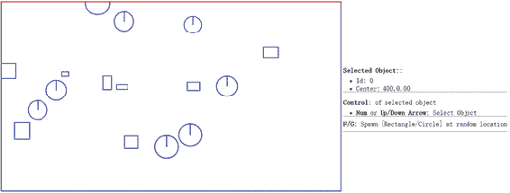
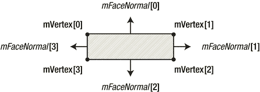
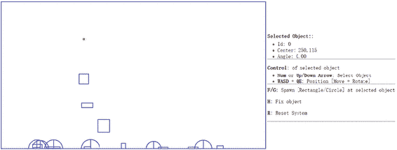

迈克尔·塔纳亚、陈华明、杰贝迪亚·帕夫利斯和凯尔文·宋 2017

迈克尔·塔纳亚、陈华明、杰贝迪亚·帕夫利斯和凯尔文·宋，《构建 2D 游戏物理引擎》，10.1007/978-1-4842-2583-7_2

# 2.实现 2D 物理引擎核心

迈克尔·塔纳亚 <sup class="calibre4">1</sup> ，陈华明 <sup class="calibre4">1</sup> ，杰贝迪亚·帕夫莱斯 <sup class="calibre4">2</sup> 和凯尔文·桑 <sup class="calibre4">3</sup>

(1)美国华盛顿州博瑟尔

(2)美国华盛顿州肯莫尔

(3)美国华盛顿伍德维尔

在上一章中，您实现了支持基本绘图操作的功能。绘图是构建物理引擎的第一步，因为它允许您观察输出，同时继续扩展引擎的功能。在本章中，2D 物理模拟的两个关键组件，核心引擎循环和刚性形状类，将被检查并添加到引擎中。核心引擎循环，或称引擎循环，允许引擎控制和处理游戏对象的实时交互，而刚性形状类抽象并隐藏了未来物理计算所需的位置和旋转角度等详细信息。

本章首先简要介绍一个简单的向量计算库。假设您具有 2D 空间中基本向量运算的背景，因此提供了所需的代码，而没有广泛的概念解释。本章然后向您介绍一个刚体形状类，这是一个关键的抽象，它将封装物理模拟中所需的对象的所有信息，例如(将在下一章中介绍)宽度、高度、中心位置、质量、惯性和摩擦力等信息。通过刚性形状类呈现的这些信息将在引擎发展成为一个全功能的 2D 游戏物理库的过程中被利用。在这一章中，你将从创建刚体形状类开始，它只包含在画布上绘制物体的信息。最后，将向您介绍物理引擎的一个更重要的组件，核心引擎循环。

完成本章后，您将能够:

*   基于用户键盘输入控制对象的位置和旋转。

*   模拟影响场景中所有对象的重力，以及打开和关闭重力的能力。

*   选择并显示特定对象的属性。

*   重置场景。

## 向量计算库

物理模拟需要一个矢量库来表示对象的位置和方向，并支持改变这些量的模拟中所涉及的计算。2D 物理模拟中涉及的计算是基本的矢量运算，包括加、减、缩放、叉积等。因此，您将创建一个简单的 Vec2 矢量数学库，以包含在所有后续项目中。

### 创建库

在此步骤中，您将在新的库文件夹中创建一个新文件，以支持所有必需的计算。

1.  通过右键单击并创建一个新文件夹，在 SiteRoot(或 public_html)文件夹中创建一个新的文件夹名 Lib。

2.  右键单击 Lib 文件夹，在 Library 文件夹中创建一个新的 JavaScript 文件。将文件命名为 Vec2.js。

3.  打开新的 Vec2.js 文件进行编辑。

4.  添加 Vec2 构造函数。

    ```js
    var Vec2 = function (x, y) {
        this.x = x;
        this.y = y;
    };
    ```

5.  添加所有支持基本向量运算的函数。

    ```js
    Vec2.prototype.length = function () {
        return Math.sqrt(this.x * this.x + this.y * this.y);
    };

    Vec2.prototype.add = function (vec) {
        return new Vec2(vec.x + this.x, vec.y + this.y);
    };

    Vec2.prototype.subtract = function (vec) {
        return new Vec2(this.x - vec.x, this.y - vec.y);
    };

    Vec2.prototype.scale = function (n) {
        return new Vec2(this.x * n, this.y * n);
    };

    Vec2.prototype.dot = function (vec) {
        return (this.x * vec.x + this.y * vec.y);
    };

    Vec2.prototype.cross = function (vec) {
        return (this.x * vec.y - this.y * vec.x);
    };

    Vec2.prototype.rotate = function (center, angle) {
        //rotate in counterclockwise
        var r = [];
        var x = this.x - center.x;
        var y = this.y - center.y;
        r[0] = x * Math.cos(angle) - y * Math.sin(angle);
        r[1] = x * Math.sin(angle) + y * Math.cos(angle);
        r[0] += center.x;
        r[1] += center.y;
        return new Vec2(r[0], r[1]);
    };

    Vec2.prototype.normalize = function () {
        var len = this.length();
        if (len > 0) {
            len = 1 / len;
        }
        return new Vec2(this.x * len, this.y * len);
    };

    Vec2.prototype.distance = function (vec) {
        var x = this.x - vec.x;
        var y = this.y - vec.y;
        return Math.sqrt(x * x + y * y);
    };
    ```

定义了这些函数后，现在就可以对向量进行操作，以计算和操纵画布上绘制的对象的位置、大小和方向。我们期望你理解这些初等运算符。不要忘记通过使用

```js
<script type="text/javascript" src="Lib/Vec2.js"></script>
```

## 物理引擎和刚性形状

这本书关注的是在物理交互过程中不改变形状的原始物体，或者是刚性物体。例如，一个掉落的乐高积木从你的桌子上弹起，落在硬木地板上，这被认为是刚性物体之间的相互作用。这种类型的模拟称为刚体物理模拟，或者更简单地称为刚体模拟。

模拟任意刚性形状之间的相互作用所涉及的计算在算法上是复杂的，并且计算成本很高。由于这些原因，刚体模拟通常基于一组有限的简单几何图形，例如，刚性圆和矩形。在典型的游戏引擎中，这些简单的刚性形状可以*附加*到几何复杂的游戏对象上，以近似它们的物理模拟，例如，在宇宙飞船上附加刚性圆，并使用刚性圆的刚体物理模拟来近似宇宙飞船之间的物理交互。

您将构建的物理引擎基于模拟刚性圆和矩形之间的相互作用。该模拟包括四个基本步骤:

1.  执行动作

2.  检测碰撞

3.  解决冲突

4.  驱动对碰撞的响应

本章的其余部分将引导你构建基础结构来表示简单的刚性圆和矩形。以下章节介绍了碰撞检测、运动近似、碰撞解决和碰撞响应的复杂细节。

### 刚性形状项目

这个项目演示了如何实现基本的基础设施来封装刚体的特征。你可以在图 [2-1](#Fig1) 中看到这个项目运行的例子。



###### 图 2-1。运行刚性形状项目

该项目的源代码是在刚性形状项目文件夹中定义的。

项目目标:

*   定义所有刚性形状对象的基类。

*   为建立刚体物理模拟器打下基础。

*   了解刚性形状类别和引擎核心功能之间的关系。

*   定义测试您的工具的初始场景。

#### 引擎核心中的列表对象

您将从定义一个列表对象 mAllObjects 开始，以跟踪所有已定义的刚性形状。正如您将在下一章中看到的，mAllObjects 列表允许模拟所有已定义的刚性形状之间的物理交互。为了方便地支持模拟计算，在 gEngine 中定义了 mAllObjects 列表。核心组件。

1.  编辑 Core.js 并在 gEngine.Core 中添加以下行。这将创建一个列表来跟踪所有定义的刚性形状。

    ```js
    var mAllObjects = [];
    ```

2.  更新 Core.js 中的 mPublic 变量，以允许访问新定义的 list 对象。这在下面的代码片段中完成。

    ```js
    var mPublic = {
        mAllObjects: mAllObjects,
        mWidth: mWidth,
        mHeight: mHeight,
        mContext: mContext
    };
    ```

#### 刚性形状基类

现在，您可以为矩形和圆形对象定义一个基类。该基类将封装这两个形状共有的所有功能。

1.  首先在 SiteRoot(或 public_html)文件夹下创建一个名为 RigidBody 的新子文件夹。在 RigidBody 文件夹中，创建一个新文件，并将其命名为 RigidShape.js

2.  编辑 RigidShape.js 以定义构造函数。目前，构造函数只接收一个表示对象中心的向量参数。刚性形状的旋转角度的默认值为 0。然后将创建的对象推入全局对象列表 mAllObjects。

    ```js
    function RigidShape(center) {
        this.mCenter = center;
        this.mAngle = 0;
        gEngine.Core.mAllObjects.push(this);
    }
    ```

#### 刚性矩形类

定义了刚性形状的基本抽象类后，现在可以创建第一个具体的刚性形状，即刚性矩形。

1.  在 RigidBody 文件夹下，创建一个新文件，命名为 Rectangle.js。

2.  编辑此文件以创建一个接收中心、宽度和高度属性的构造函数。在构造函数中，将刚体的类型定义为 Rectangle，分配一个数组来存储矩形的顶点位置，并分配一个单独的数组来存储面法线向量(稍后将讨论)。

    ```js
    var Rectangle = function (center, width, height) {
        RigidShape.call(this, center);
        this.mType = "Rectangle";
        this.mWidth = width;
        this.mHeight = height;
        this.mVertex = [];
        this.mFaceNormal = [];
    };
    ```

3.  在构造函数中，使用中心、宽度和高度信息计算矩形的顶点位置。

    ```js
    //0--TopLeft;1--TopRight;2--BottomRight;3--BottomLeft
    this.mVertex[0] = new Vec2(center.x - width / 2, center.y - height / 2);
    this.mVertex[1] = new Vec2(center.x + width / 2, center.y - height / 2);
    this.mVertex[2] = new Vec2(center.x + width / 2, center.y + height / 2);
    this.mVertex[3] = new Vec2(center.x - width / 2, center.y + height / 2);
    ```

4.  接下来，计算人脸法向量。如图 [2-2](#Fig2) 所示，面法线是垂直于边并指向远离矩形中心的向量。请注意，面法线向量被归一化为长度 1。此外，请注意矩形顶点和相应面法线之间的关系。面法线索引-0 与从顶点 2 到 1 的向量方向相同。该方向垂直于由顶点 0 和 1 形成的边。这样，面法线索引-0 是指远离与第一条边垂直的矩形的方向，依此类推。面法向量将在以后用于确定碰撞。

    

    ###### 图 2-2。矩形的面法线

    ```js
    //0--Top;1--Right;2--Bottom;3--Left
    //mFaceNormal is normal of face toward outside of rectangle
    this.mFaceNormal[0] = this.mVertex[1].subtract(this.mVertex[2]);
    this.mFaceNormal[0] = this.mFaceNormal[0].normalize();
    this.mFaceNormal[1] = this.mVertex[2].subtract(this.mVertex[3]);
    this.mFaceNormal[1] = this.mFaceNormal[1].normalize();
    this.mFaceNormal[2] = this.mVertex[3].subtract(this.mVertex[0]);
    this.mFaceNormal[2] = this.mFaceNormal[2].normalize();
    this.mFaceNormal[3] = this.mVertex[0].subtract(this.mVertex[1]);
    this.mFaceNormal[3] = this.mFaceNormal[3].normalize();
    ```

5.  通过在构造函数后包含以下代码，确保新定义的 Rectangle 类正确地继承了 RigidShape 基类。

    ```js
    var prototype = Object.create(RigidShape.prototype);
    prototype.constructor = Rectangle;
    Rectangle.prototype = prototype;
    ```

6.  现在，您可以为矩形对象创建 draw 函数。调用上下文的 strokeRect 函数(对画布的引用)来完成这一任务。必须定义相应的平移和旋转，以便在正确的位置和方向绘制矩形。实现如下所示。

    ```js
    Rectangle.prototype.draw = function (context) {
        context.save();
        context.translate(this.mVertex[0].x, this.mVertex[0].y);
        context.rotate(this.mAngle);
        context.strokeRect(0, 0, this.mWidth, this.mHeight);
        context.restore();
    };
    ```

#### 刚性圆类

现在，您可以基于与刚性矩形相似的整体结构来实现刚性圆形对象。

1.  在 RigidBody 文件夹下，创建一个新文件，命名为 Circle.js。

2.  编辑此文件以创建一个构造函数，该构造函数初始化圆的半径、刚体类型(如 circle)和 mStartpoint 位置，以便绘制一条参考线来可视化圆的旋转角度。最初，在没有旋转的情况下，参考线是垂直的，将圆心连接到圆周的顶部。改变圆的旋转角度将导致这条线被旋转。

    ```js
    var Circle = function (center, radius) {
        RigidShape.call(this, center);
        this.mType = "Circle";
        this.mRadius = radius;
        // The start point of line in circle
        this.mStartpoint = new Vec2(center.x, center.y - radius);
    };
    ```

3.  与 Rectangle 类类似，您必须包含以下代码，以确保 Circle 类正确地从 RigidShape 基类继承。

    ```js
    var prototype = Object.create(RigidShape.prototype);
    prototype.constructor = Circle;
    Circle.prototype = prototype;
    ```

4.  与矩形不同，上下文的 arc 函数用于在画布上绘制圆形。此外，您需要从圆心到圆的顶部 mStartpoint 绘制旋转参考线。

    ```js
    Circle.prototype.draw = function (context) {
        context.beginPath();
        //draw a circle
        context.arc(this.mCenter.x, this.mCenter.y, this.mRadius, 0, Math.PI *  2, true);
        //draw a line from start point toward center
        context.moveTo(this.mStartpoint.x, this.mStartpoint.y);
        context.lineTo(this.mCenter.x, this.mCenter.y);
        context.closePath();
        context.stroke();
    };
    ```

#### 修改用户控制脚本

您将修改 UserControl.js 文件来测试新功能。

1.  编辑 SiteRoot(或 public_html)文件夹中的 UserControl.js 文件。

2.  添加 gObjectNum 变量，该变量是代表当前选定对象的 mAllObjects 数组的索引。注意，这个变量是在定义 userControl 函数之前定义的，并且是一个全局变量。

    ```js
    var gObjectNum = 0;
    ```

3.  在 userControl 函数中，使用 F 和 G 键定义对创建随机矩形和圆形的支持。

    ```js
    if (keycode === 70) {    // f
        var r1 = new Rectangle(new Vec2(Math.random()*width*0.8, Math.random()*height*0.8),
                             Math.random() * 30+10, Math.random() * 30+10);
    }
    if (keycode === 71) { //g
        var r1 = new Circle(new Vec2(Math.random()*width*0.8, Math.random()*height*0.8),
                         Math.random() * 10 + 20);
    }
    ```

4.  在用户控制功能中，定义基于上/下箭头和 0 到 9 键选择对象索引的支持。

    ```js
    if (keycode >= 48 && keycode <= 57) {  //number
        if (keycode - 48 < gEngine.Core.mAllObjects.length)
            gObjectNum = keycode - 48;
    }
    if (keycode === 38) {   //up arrow
        if (gObjectNum > 0)
            gObjectNum--;
    }
    if (keycode === 40) {   // down arrow
        if (gObjectNum < gEngine.Core.mAllObjects.length-1)
            gObjectNum++;
    }
    ```

#### 融入核心

现在可以修改 Core.js 文件来集成和测试新定义的功能。您的修改将调用所有创建的刚性形状的绘图，并更新用户界面(UI)以正确反映应用的状态。现在，绘图将通过调用适当的绘图函数的简单而连续的循环，或者引擎循环来完成。在本章的下一节，你将实现一个更高级的引擎循环来处理物理引擎的计算。

1.  打开 Engine Core 文件夹中的 Core.js 进行编辑。

2.  创建新的 runGameLoop 函数。在 runGameLoop 中，调用 windows.requestAnimationFrame 来指定下一帧重绘的函数。此外，调用另外两个函数，draw 和 updateUIEcho 函数，以绘制所有已定义的刚性形状并接收用户键盘输入。

    ```js
    var runGameLoop = function () {
        requestAnimationFrame(function () {
            runGameLoop();
        })
        updateUIEcho();
        draw();
    };
    ```

3.  定义 updateUIEcho 函数来更新 HTML 以显示应用的正确状态。

    ```js
    var updateUIEcho = function () {
        document.getElementById("uiEchoString").innerHTML = "<p><b>Selected Object:</b>:</p>" +
            "<ul style=\"margin:-10px\">" +
            "<li>Id: " + gObjectNum + "</li>" +
            "<li>Center: " + mAllObjects[gObjectNum].mCenter.x.toPrecision(3) + "," +
            mAllObjects[gObjectNum].mCenter.y.toPrecision(3) + "</li>" +
            "</ul> <hr>" + "<p><b>Control</b>: of selected object</p>" +
            "<ul style=\"margin:-10px\">" +
            "<li><b>Num</b> or <b>Up/Down Arrow</b>: SelectObject</li>" +
            "</ul> <hr>" +
            "<b>F/G</b>: Spawn [Rectangle/Circle] at random location" + "<hr>";
    };
    ```

4.  添加 draw 函数来迭代并调用 mAllObjects 列表中刚性形状的相应 draw 函数。strokeStyle 属性被设置为只有当前选定的对象被绘制为红色，而其他对象被绘制为蓝色。

    ```js
    var draw = function () {
        mContext.clearRect(0, 0, mWidth, mHeight);
        var i;
        for (i = 0; i < mAllObjects.length; i++) {
            mContext.strokeStyle = 'blue';
            if (i === gObjectNum)
                mContext.strokeStyle = 'red';
            mAllObjects[i].draw(mContext);
        }
    };
    ```

5.  定义在脚本首次运行时初始化引擎循环的支持。

    ```js
    var initializeEngineCore = function () {
        runGameLoop();
    };
    ```

6.  通过将 initializeEngineCore 函数包含在 mPublic 变量中，允许公共访问该函数。

    ```js
    var mPublic = {
        initializeEngineCore: initializeEngineCore,
        mAllObjects: mAllObjects,
        mWidth: mWidth,
        mHeight: mHeight,
        mContext: mContext
    };
    ```

#### 定义初始场景

现在，您可以定义一个有界的空环境来测试新功能。

1.  在 SiteRoot(或者 public_html)文件夹下新建一个文件，命名为 MyGame.js。

2.  通过创建一个名为 MyGame 的新函数来编辑这个文件。在此函数中，使用您刚刚实现的新刚性形状对象来创建定义未来物理模拟边界的四个边界。

    ```js
        function MyGame() {
            var width = gEngine.Core.mWidth;
            var height = gEngine.Core.mHeight;
            var up = new Rectangle(new Vec2(width / 2, 0), width, 3);
            var down = new Rectangle(new Vec2(width / 2, height), width, 3);
            var left = new Rectangle(new Vec2(0, height / 2), 3, height);
            var right = new Rectangle(new Vec2(width, height / 2), 3, height);
        }
    ```

请注意，您可以通过编辑此功能来修改初始场景。当您想要测试物理模拟的性能时，这在后面的章节中会变得很方便。

#### 修改 index.html 文件

为了包含新的功能，您需要始终记住在 index.html 文件中包含和调用它们。

1.  打开 index.html 文件进行编辑。

2.  修改 body 标记以支持键盘事件的处理，通过实例化一个新的 MyGame 对象来定义初始测试环境，并通过调用 initializeEngineCore 来初始化引擎循环。

    ```js
    <body onkeydown="return userControl(event);"
        onload="var game = new MyGame();
        gEngine.Core.initializeEngineCore()">
    ```

3.  添加一个新的表行来回显应用状态。

    ```js
    <table style="padding: 2px">
        <tr>
            <td>
                <div><canvas id="canvas"></canvas></div>
            </td>
            <td>
                <div id=”uiEchoString”> </div>
            </td>
        </tr>
    </table>
    ```

4.  记得包括所有带有

    ```js
    <script type="text/javascript" src="RigidBody/RigidShape.js"></script>
    <script type="text/javascript" src="RigidBody/Circle.js"></script>
    <script type="text/javascript" src="RigidBody/Rectangle.js">

    </script><script type="text/javascript" src="EngineCore/Core.js"></script>

    <script type="text/javascript" src="MyGame.js"></script>
    <script type="text/javascript" src="UserControl.js"></script>
    ```

您现在可以运行项目并测试您的实现。它看起来应该如图 [2-1](#Fig1) 所示。

### 观察

现在，您可以运行项目来测试您的实现。请注意四个边界和右边的文本输出，它为用户打印指令并回显应用状态，其中包括所选对象的索引。按 F 或 G 键会在随机位置生成一个随机大小的矩形或圆形。这个绘图模拟似乎与之前的项目非常相似。主要区别在于对象抽象和绘制机制——rigid shape 类定义和引擎循环监视用户输入和所有已定义对象的绘制。在下一个项目中，您将改进引擎循环，以支持刚体形状状态的更改，包括允许用户更改场景中每个刚体形状的属性，以及简单模拟下落物体。

## 核心引擎回路

任何物理引擎最重要的特征之一是支持对象和图形模拟元素之间看似直观和连续的交互。实际上，这些交互被实现为一个连续运行的循环，它接收和处理计算，更新对象状态，并呈现对象。这个持续运行的循环被称为*发动机循环*。

为了传达适当的直观感，引擎循环的每个周期必须在正常人的反应时间内完成。这通常被称为*实时*，这是人类视觉上无法察觉的太短的时间量。通常，当发动机回路以高于每秒 40 至 60 个循环的速率运行时，可以实现实时。由于在每个循环周期中通常有一个绘图操作，循环周期的速率也可以表示为每秒帧数(FPS)，或*帧速率*。FPS 为 60 是一个很好的性能目标。也就是说，您的引擎必须在 1/60 秒内处理计算、更新对象状态，然后绘制画布！

循环本身，包括实现细节，是引擎最基本的控制结构。由于主要目标是保持实时性能，引擎循环操作的细节与物理引擎的其余部分无关。因此，引擎循环的实现应该紧密封装在引擎的核心中，其详细的操作对其他元素是隐藏的。

### 引擎循环实现

引擎循环是一种连续执行逻辑和绘图的机制。一个简单的引擎循环由处理输入、更新对象状态和绘制这些对象组成，如下面的伪代码所示:

```js
initialize();
while(game running) {
    input();
    update();
    draw();
}
```

如前所述，60 或更高的 FPS 是保持实时交互性的理想选择。当游戏复杂性增加时，可能出现的一个问题是，有时一个循环可能需要 1/60 秒以上的时间才能完成，导致游戏以降低的帧速率运行。当这种情况发生时，整个游戏将会变慢。一个常见的解决方案是确定哪些操作需要强调，哪些操作需要跳过。由于引擎需要正确的输入和更新才能按设计运行，因此在必要时通常会跳过绘制操作。这被称为*跳帧*，下面的伪代码说明了一个这样的实现:

```js
elapsedTime = now;
previousLoop = now;
while(game running) {
    elapsedTime += now - previousLoop;
    previousLoop = now;

    input();
    while( elapsedTime >= UPDATE_TIME_RATE ) {
        update();
        elapsedTime -= UPDATE_TIME_RATE;
    }
    draw();
}
```

在前面的伪代码清单中，UPDATE_TIME_RATE 是所需的实时更新速率。当引擎循环周期之间的经过时间大于 UPDATE_TIME_RATE 时，将调用更新函数，直到它被赶上。这意味着当引擎循环运行太慢时，绘制操作基本上被跳过。当这种情况发生时，整个游戏看起来运行缓慢，游戏输入响应滞后，并且会跳过一些帧。但是，游戏逻辑会继续正确。

请注意，包含更新函数调用的 while 循环模拟了 UPDATE_TIME_RATE 的固定更新时间步长。这种固定的时间步长更新允许在维持确定性游戏状态中的直接实现。

### 核心引擎循环项目

这个项目演示了如何将一个循环合并到你的引擎中，并通过相应地更新和绘制对象来支持实时模拟。你可以在图 [2-3](#Fig3) 中看到这个项目运行的例子。该项目的源代码在核心引擎循环项目文件夹中定义。



###### 图 2-3。运行核心引擎循环项目

该项目的目标如下:

*   理解引擎循环的内部操作。

*   实现和封装引擎循环的操作。

*   获得不断更新和绘制模拟动画的经验。

#### 实现引擎循环组件

引擎循环组件是一个核心引擎功能，因此应该作为 gEngine.Core 的一个属性来实现。

1.  编辑 Core.js 文件。

2.  添加必要的变量来确定回路频率。

    ```js
    var mCurrentTime, mElapsedTime, mPreviousTime = Date.now(), mLagTime = 0;
    var kFPS = 60;          // Frames per second
    var kFrameTime = 1 / kFPS;
    var mUpdateIntervalInSeconds = kFrameTime;
    var kMPF = 1000 * kFrameTime; // Milliseconds per frame.
    ```

3.  更新 runGameLoop 函数以跟踪帧之间经过的时间，并确保以帧速率频率调用更新函数。

    ```js
    var runGameLoop = function () {
        requestAnimationFrame(function () {
        runGameLoop();
        });
        //compute how much time has elapsed since the last RunLoop
        mCurrentTime = Date.now();
        mElapsedTime = mCurrentTime - mPreviousTime;
        mPreviousTime = mCurrentTime;
        mLagTime += mElapsedTime;
        //Update the game the appropriate number of times.
        //Update only every Milliseconds per frame.
        //If lag larger then update frames, update until caught up.
        while (mLagTime >= kMPF) {
            mLagTime -= kMPF;
            update();
        }
        updateUIEcho();
        draw();
    };
    ```

4.  修改 updateUIEcho 函数以打印出附加的相关应用状态信息，比如如何旋转和移动选定的刚性形状。粗体代码是对该函数的唯一补充。

    ```js
    var updateUIEcho = function () {
        document.getElementById("uiEchoString").innerHTML =
        // ... identical to previous project
        mAllObjects[gObjectNum].mCenter.y.toPrecision(3) + "</li>"  +
    **"<li>Angle: " + mAllObjects[gObjectNum].mAngle.toPrecision(3) + "</li>"  +** 
        "</ul> <hr>" +
        "<p><b>Control</b>: of selected object</p>" +
        "<ul style=\"margin:-10px\">" +
            "<li><b>Num</b> or <b>Up/Down Arrow</b>: SelectObject</li>" +
    **"<li><b>WASD</b> + <b>QE</b>: Position [Move + Rotate]</li>" +** 
        "</ul> <hr>" +
        "<b>F/G</b>: Spawn [Rectangle/Circle] at selected object" +
    **"<p><b>H</b>: Fix object</p>" +** 
    **"<p><b>R</b>: Reset System</p>" +** 
        "<hr>";
    };
    ```

5.  创建一个名为 update 的新函数，它将调用定义的每个刚性形状的 update 函数。

    ```js
    var update = function () {
        var i;
        for (i = 0; i < mAllObjects.length; i++) {
            mAllObjects[i].update(mContext);
        }
    };
    ```

#### 扩展刚性形状类

您将修改 rigid shape 基类，以及 Rectangle 和 Circle 类，以支持简单行为的实现。虽然 update 函数是在游戏引擎循环调用的刚性形状基类中定义的，但 update 的详细实现必须是特定于子类的。例如，圆形对象通过更改其中心的值来实现移动行为，而矩形对象必须更改顶点和面法线数组中的所有值来模拟相同的移动行为。

##### 刚性形状基类

1.  编辑 RigidShape.js 文件。

2.  定义引擎循环要调用的更新函数，并通过用一个恒定的 y 方向向量改变中心位置来实现简单的下降行为。请注意，自由落体行为仅在形状位于画布的垂直边界内时应用。

    ```js
    RigidShape.prototype.update = function () {
        if (this.mCenter.y < gEngine.Core.mHeight && this.mFix !== 0)
            this.move(new Vec2(0, 1));
    };
    ```

子类负责定义 mFix 变量和 move 函数，以控制形状是否固定在不应该跟随下落行为的位置，并实现形状的移动。应该强调的是，此处包含的刚体运动行为仅用于测试目的，将在下一个项目中删除。第 [4](4.html) 章将介绍和讨论基于物理的刚体运动和相关的物理量(包括速度和加速度)。

请注意，默认情况下，画布坐标定义原点(0，0)位于左上角，正 y 方向向下。出于这个原因，为了模拟重力，您将在正 y 方向上移动所有对象。

##### 圆形类

Circle 类被修改以实现移动。

1.  编辑 Circle.js 文件。

2.  定义 mFix 实例变量以启用或禁用坠落行为。

    ```js
    var Circle = function (center, radius, fix) {
        // ... code similar to previous project
        this.mFix = fix;
        // ... code similar to previous project
    ```

3.  添加移动函数以定义向量如何移动圆-将移动向量添加到圆心和 mStartpoint。

    ```js
    Circle.prototype.move = function (s) {
        this.mStartpoint = this.mStartpoint.add(s);
        this.mCenter = this.mCenter.add(s);
           return this;
    };
    ```

4.  增加旋转功能，实现圆的旋转。请注意，因为圆是无限对称的，所以旋转后的圆看起来与原始形状相同。mStartpoint 位置允许绘制旋转的参考线，以指示圆的旋转角度。

    ```js
    // rotate angle in counterclockwise
    Circle.prototype.rotate = function (angle) {
        this.mAngle += angle;
        this.mStartpoint = this.mStartpoint.rotate(this.mCenter, angle);
        return this;
    };
    ```

##### 矩形类

与 circle 类类似，Rectangle 类也必须修改以支持新功能。

1.  编辑 Rectangle.js 文件。

2.  定义 mFix 实例变量以启用或禁用坠落行为。

    ```js
    var Rectangle = function (center, width, height, fix) {
        // ... code similar to previous project
        this.mFix = fix;
        // ... code similar to previous project
    ```

3.  通过更改所有顶点和中心的值来定义移动函数。

    ```js
    Rectangle.prototype.move = function (v) {
        var i;
        for (i = 0; i < this.mVertex.length; i++) {
            this.mVertex[i] = this.mVertex[i].add(v);
        }
        this.mCenter = this.mCenter.add(v);
        return this;
    };
    ```

4.  通过旋转所有顶点并重新计算面法线来定义旋转函数。

    ```js
    Rectangle.prototype.rotate = function (angle) {
        this.mAngle += angle;
        var i;
        for (i = 0; i < this.mVertex.length; i++) {
            this.mVertex[i] = this.mVertex[i].rotate(this.mCenter, angle);
        }
        this.mFaceNormal[0] = this.mVertex[1].subtract(this.mVertex[2]);
        this.mFaceNormal[0] = this.mFaceNormal[0].normalize();
        this.mFaceNormal[1] = this.mVertex[2].subtract(this.mVertex[3]);
        this.mFaceNormal[1] = this.mFaceNormal[1].normalize();
        this.mFaceNormal[2] = this.mVertex[3].subtract(this.mVertex[0]);
        this.mFaceNormal[2] = this.mFaceNormal[2].normalize();
        this.mFaceNormal[3] = this.mVertex[0].subtract(this.mVertex[1]);
        this.mFaceNormal[3] = this.mFaceNormal[3].normalize();
        return this;
    };
    ```

#### 修改用户控制脚本

您需要扩展 UserControl.js 文件中定义的 userControl 函数，以支持移动、旋转、禁用/启用重力以及重置整个场景。

1.  编辑 UserControl.js 文件。

2.  添加语句以支持在选定对象上移动、旋转和切换重力。

    ```js
    // move with WASD keys
    if (keycode === 87) { //W
        gEngine.Core.mAllObjects[gObjectNum].move(new Vec2(0, -10));
    }
    if (keycode === 83) { // S
        gEngine.Core.mAllObjects[gObjectNum].move(new Vec2(0, +10));
    }
    if (keycode === 65) { //A
        gEngine.Core.mAllObject[gObjectNum].move(new Vec2(-10, 0));
    }
    if (keycode === 68) { //D
        gEngine.Core.mAllObjects[gObjectNum].move(new Vec2(10, 0));
    }

    // Rotate with QE keys
    if (keycode === 81) { //Q
        gEngine.Core.mAllObjects[gObjectNum].rotate(-0.1);
    }
    if (keycode === 69) { //E
        gEngine.Core.mAllObjects[gObjectNum].rotate(0.1);
    }

    // Toggle gravity with the H key
    if (keycode === 72) { //H
        if(gEngine.Core.mAllObjects[gObjectNum].mFix === 0)
            gEngine.Core.mAllObjects[gObjectNum].mFix = 1;
        else gEngine.Core.mAllObjects[gObjectNum].mFix = 0;
    }
    ```

3.  添加一个重置场景的语句。

    ```js
    if (keycode === 82) { //R
        gEngine.Core.mAllObjects.splice(5, gEngine.Core.mAllObjects.length);
        gObjectNum = 0;
    }
    ```

4.  修改 G 和 F 键的对象创建语句，以便在当前选定对象的位置而不是随机位置创建新对象。

    ```js
    if (keycode === 70) { //f
        var r1 = new Rectangle(new Vec2(gEngine.Core.mAllObjects[gObjectNum].mCenter.x,
        gEngine.Core.mAllObjects[gObjectNum].mCenter.y),
        Math.random() * 30 + 10, Math.random() * 30 + 10);
    }
    if (keycode === 71) { //g
        var r1 = new Circle(new Vec2(gEngine.Core.mAllObjects[gObjectNum].mCenter.x,
        gEngine.Core.mAllObjects[gObjectNum].mCenter.y),
        Math.random() * 10 + 20);
    }
    ```

#### 更新场景

要测试已实现的引擎循环和对象移动，您将为场景创建一个初始选定对象。这个初始对象将作为生成创建的刚性形状的光标位置。这可以通过编辑 MyGame.js 文件并创建一个初始对象来完成。

```js
function MyGame() {
    var width = gEngine.Core.mWidth;
    var height = gEngine.Core.mHeight;
    var r1 = new Rectangle(new Vec2(width / 2, height / 2), 3, 3, 0);

    var up = new Rectangle(new Vec2(width / 2, 0), width, 3, 0);
    var down = new Rectangle(new Vec2(width / 2, height), width, 3, 0);
    var left = new Rectangle(new Vec2(0, height / 2), 3, height, 0);
    var right = new Rectangle(new Vec2(width, height / 2), 3, height, 0);
}
```

### 观察

运行项目以测试您的实现。你会看到场景和之前的项目几乎一样，除了小的初始光标对象。请注意，您可以使用 0 到 9 或上下箭头键来更改所选对象，从而更改光标对象。键入 F 和 G 键以查看在光标对象位置创建的新对象，它们始终遵循下落行为。这种实时平滑的下降行为表明发动机循环已经成功实现。您可以使用 WASD、QE 和 H 键来调整选定的形状位置；以及移动、旋转和切换选定对象的重力。您可能还会注意到，在光标对象没有移动的情况下，新创建的对象会聚集在一起，这可能会令人困惑。这是因为物理模拟还没有被定义。在下一章中，您将了解并实现碰撞检测，作为解决集群对象问题的第一步。

## 摘要

在本章中，您已经实现了基本的刚性形状类。尽管只支持简单的位置、方向和绘图，但这些类代表了定义良好的抽象，隐藏了实现细节，因此支持未来的复杂性集成。在接下来的章节中，你将学习其他物理量，包括质量、惯性、摩擦力和恢复力。engine loop 项目向您介绍了连续更新循环的基础知识，该循环支持实时的每形状计算，并支持视觉上吸引人的物理模拟。在下一章中，您将通过首先详细检查刚性形状之间的碰撞来开始学习物理模拟。