迈克尔·塔纳亚、陈华明、杰贝迪亚·帕夫利斯和凯尔文·宋 2017

迈克尔·塔纳亚、陈华明、杰贝迪亚·帕夫利斯和凯尔文·宋，《构建 2D 游戏物理引擎》，10.1007/978-1-4842-2583-7_3

# 3.包含碰撞检测

迈克尔·塔纳亚 <sup class="calibre4">1</sup> ，陈华明 <sup class="calibre4">1</sup> ，杰贝迪亚·帕夫莱斯 <sup class="calibre4">2</sup> 和凯尔文·桑 <sup class="calibre4">3</sup>

(1)美国华盛顿州博瑟尔

(2)美国华盛顿州肯莫尔

(3)美国华盛顿伍德维尔

在 2D 电子游戏的背景下，物理模拟的基础包括刚性形状的运动、运动形状的碰撞以及碰撞后的反应。在前一章中，您定义了刚性形状类和核心引擎循环，以支持基本的绘制、更新操作和刚性形状的简单移动。在本章中，您将学习和实现刚体形状碰撞的检测，并计算必要的信息，以便在下一章中，您可以开始解决和实现对碰撞的响应。基于这些概念的适当实现使得当对象在模拟世界中彼此物理交互时能够产生可信的场景。

本章着重于检测碰撞的基础，包括如何近似检测，在任何方向上精确检测碰撞矩形和圆形的理论，以及在检测到碰撞后要捕获的基本信息，以支持相互渗透的解决方案和对碰撞的正确响应。你将以一步一步的方式实现这个系统，从简单的宽相位碰撞检测方法，到更精确和计算成本更高的分离轴定理(SAT)。这样，在每一步，冲突检测将变得更加准确，并适用于更一般的情况，直到您的解决方案准备好在下一章中用于解决和响应冲突。本章的最终结果将是一个碰撞检测系统，它可以检测任意大小的刚性矩形和圆形之间的碰撞，并且可以计算和获得解决和响应碰撞所需的信息。

完成本章后，您将能够:

*   意识到检测物体碰撞的巨大计算成本。

*   使用宽相位碰撞优化对象碰撞检测，以避免不必要的计算。

*   请理解，在计算机模拟中，刚体可以在碰撞过程中相互穿透，并且这种相互穿透必须得到解决。

*   学习并使用分离轴定理(SAT)来检测刚体碰撞。

*   计算必要的信息以支持有效的位置校正。在下一章中，您将学习使用这些计算信息来有效解决刚体相互穿透。

*   实现一个基于 SAT 的高效碰撞检测算法。

*   准确检测刚性矩形和圆形之间的碰撞。

## 碰撞物体的相互穿透

如图 [3-1](#Fig1) 所示，上一章介绍的固定更新时间步长意味着连续运动中的物体位置由一组离散的位置来近似。这些近似法最显著的结果是探测碰撞。

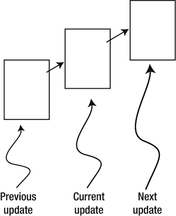

###### 图 3-1。连续运动的刚性正方形

在图 [3-1](#Fig1) 中可以看到一个这样的问题；想象一下，在当前更新和下一次更新之间有一堵薄薄的墙。你会期望在下一次更新中物体会碰撞并停在墙边。然而，如果这堵墙足够薄，物体从一个位置跳到下一个位置时，基本上会直接穿过它。这是很多游戏引擎面临的普遍问题。这类问题的一般解决方案在算法上可能很复杂，而且计算量很大。游戏设计者的工作通常是用设计良好的(例如，适当的尺寸)和行为良好的(例如，适当的行进速度)游戏对象来减轻和避免这个问题。

图 [3-2](#Fig2) 显示两个物体在一个时间步长后发生碰撞。在时间步长之前，对象不接触。但是，在时间步长之后，运动模拟的结果会将两个对象重叠放置。

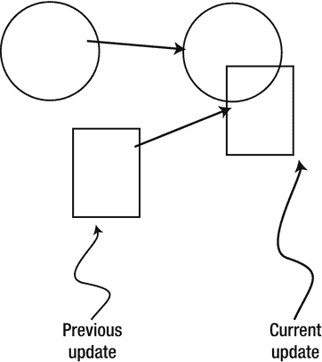

###### 图 3-2。碰撞物体的相互渗透

这是具有离散间隔的固定更新时间步长的另一个衍生示例。在现实世界中，假设物体是固体，这两者永远不会相互渗透。在这种情况下，必须计算碰撞的细节，以便可以正确地解决相互渗透的情况。

## 冲突检出

碰撞检测是一项至关重要的物理模拟，可能会对性能产生重大影响。例如，如果您想要检测五个对象之间的碰撞，在最坏的情况下，您必须对第一个对象执行四次检测计算，然后对第二个对象执行三次计算，对第三个对象执行两次，对第四个对象执行一次。一般来说，如果没有专门的优化，在最坏的情况下你必须执行 *O* ( *N* <sup class="calibre4">2</sup> )操作来检测 *N* 对象之间的冲突。

除了报告是否发生了冲突之外，冲突检测算法还应该支持用于解决和响应冲突的信息的计算。该信息可以包括穿透深度和穿透的法向矢量。重要的是精确地计算该信息，以便能够有效地解决碰撞，并且正确地计算响应以模拟真实世界。请记住，现实世界中不会发生物体相互穿透，因此计算出的信息只是物理定律的近似值。

## 宽相位法

详细的碰撞检测算法涉及密集的计算。这是因为必须计算精确的结果，以支持有效的穿透解析和真实的碰撞响应模拟。宽相位方法通过利用对象的邻近性来优化该计算:详细且计算密集的算法仅被部署用于物理上彼此接近的对象。

一种流行的宽相位方法使用边界框/圆来近似所有对象之间的碰撞。边界框是一个 x/y 轴对齐的矩形框，完全包围给定对象。术语 x/y 轴对齐是指边界框的四个边平行于水平 x 轴和垂直 y 轴。类似地，边界圆是以一个对象为中心并完全包围该对象的圆。通过执行简单的边界框/圆相交计算，可以将详细碰撞检测操作的候选对象缩小到只有那些具有碰撞边界的对象。

还有其他广泛的阶段方法，这些方法使用空间结构(如统一网格或四叉树)或相干组(如边界碰撞器的层次)来组织对象。来自宽相位方法的结果通常被输入到中间相位和最后的窄相位碰撞检测方法中。每个阶段都缩小了最终碰撞计算的候选范围，并且每个后续阶段都越来越精确，越来越昂贵。

本章仅向您介绍边界圆宽相位碰撞方法，随后是基于分离轴定理(SAT)的窄相位算法。

### 广泛阶段方法项目

这个项目演示了如何使用边界圆实现一个广泛的相位碰撞检测方法。你可以在图 [3-3](#Fig3) 中看到这个项目运行的例子。这个项目的源代码是在广泛阶段方法项目文件夹中定义的。

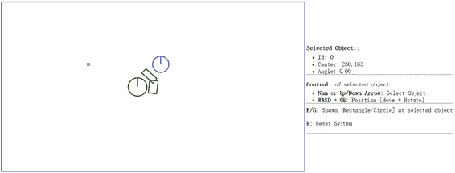

###### 图 3-3。运行广泛阶段方法项目

项目目标:

*   理解包围圆碰撞检测的实现。

*   理解宽相位碰撞检测的优点和缺点。

*   为构建窄相位碰撞检测算法奠定基础。

#### 定义物理引擎组件

现在可以定义物理引擎组件来支持碰撞检测计算。首先，请遵循定义引擎组件的步骤。

1.  在 SiteRoot/EngineCore(或 public_html/EngineCore)文件夹中，创建一个新文件，并将其命名为 Physics.js，该文件将实现物理引擎组件。记得在 index.html 加载这个新的源文件。

2.  以与定义 gEngine 相似的方式定义物理组件。核心:

    ```js
    var gEngine = gEngine || { };
    gEngine.Physics = (function () {
        var mPublic = {
        };
        return mPublic;
    }());
    ```

3.  在 gEngine 中创建一个碰撞函数。测试 mAllObjects 列表中所有对象之间的边界圆的交集。请注意嵌套循环，这些循环测试每个对象之间的碰撞，并且碰撞的对象用绿色绘制。

    ```js
    var collision = function () {
        var i, j;
        for (i = 5; i < gEngine.Core.mAllObjects.length; i++) {
            for (j = i + 1; j < gEngine.Core.mAllObjects.length; j++){
                If (gEngine.Core.mAllObjects[i].boundTest(gEngine.Core.mAllObjects[j])) {
                    gEngine.Core.mContext.strokeStyle = 'green';
                    gEngine.Core.mAllObjects[i].draw(gEngine.Core.mContext);
                    gEngine.Core.mAllObjects[j].draw(gEngine.Core.mContext);
                }
            }
        }
    };
    ```

4.  在 mPublic 中添加公共变量以允许访问碰撞函数。

    ```js
    var mPublic = {
        collision: collision
    };
    ```

#### 调用物理碰撞并更新用户界面

编辑 SiteRoot/EngineCore(或 public_html/EngineCore)文件夹中的 Core.js 文件。

1.  从核心引擎循环中的 runGameLoop 函数调用碰撞计算。

    ```js
    //....identical to previous project
    while (mLagTime >= kMPF) {
        mLagTime -= kMPF;
        gEngine.Physics.collision();
        update();
    }
    //....identical to previous project
    ```

2.  修改 updateUIEcho 函数以移除对 H 按钮的支持。不再需要重力开/关功能。

    ```js
    //...identical to previous project
    "<b>F/G</b>: Spawn [Rectangle/Circle] at selected object" +
    **"<p><b>H</b>: Fix object</p>" + // remove this line** 
    "<p><b>R</b>: Reset System</p>" +
    ```

#### 修改刚性形状类

现在，您可以修改“刚性形状”文件夹中的所有文件，以支持广泛阶段碰撞检测方法的边界圆测试。

1.  您需要修改刚性形状基类。打开 SiteRoot/RigidBody(或 public_html/RigidBody)文件夹下的 RigidShape.js。

2.  将 mBoundRadius 变量添加到 RigidShape 构造函数中。这是刚性形状的边界圆的半径。

    ```js
    this.mBoundRadius = 0;
    ```

3.  定义一个新的原型函数，并将其命名为 boundTest，该函数将测试两个边界圆是否发生碰撞。检测两个圆之间碰撞的最直接的方法是确定两个圆心之间的距离是否小于半径之和。该场景如图 [3-4](#Fig4) 所示。

    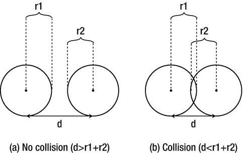

    ###### 图 3-4。圆碰撞检测:(a)没有碰撞(b)检测到碰撞

    ```js
    RigidShape.prototype.boundTest = function (otherShape) {
        var vFrom1to2 = otherShape.mCenter.subtract(this.mCenter);
        var rSum = this.mBoundRadius + otherShape.mBoundRadius;
        var dist = vFrom1to2.length();
        if (dist > rSum) {
            return false;  //not overlapping
        }
        return true;
    };
    ```

4.  您还需要删除被定义为 RigidShape 基类的更新函数的运动测试代码。

    ```js
    RigidShape.prototype.update = function () { };
    ```

5.  接下来，修改同一文件夹中的 Circle.js 文件，以初始化构造函数中 mBoundRadius 变量的值。刚性圆形状的边界圆与刚性形状的半径相同。记得删除 mFix 变量。

    ```js
    this.mBoundRadius = radius;
    **this.mFix = fix;** //remove this line
    ```

6.  出于类似的目的，修改 Rectangle.js 文件，在构造函数中初始化 mBoundRadius 变量。在这种情况下，矩形刚性形状的边界圆定义为矩形对角线距离的一半。再次提醒，记得删除未使用的 mFix 变量。

    ```js
    this.mBoundRadius = Math.sqrt(width*width + height*height)/2;
    ```

### 观察

运行项目以测试您的实现。请注意，默认情况下，对象在同一位置创建，具有重叠的边界圆，因此以绿色绘制。您可以选择一个对象并移动/旋转它，以观察当相应的边界圆没有重叠时，绿色变回黑色。现在，创建一个矩形和一个圆形，并把它们分开。旋转矩形，并将其移近圆形，但不要实际接触圆形。您可能会注意到，这两个形状没有接触，但都是用绿色绘制的。这是因为矩形的碰撞边界是一个圆，这高估了对象的边界，如图 [3-5](#Fig5) 所示。这是这种宽相位方法的最大缺点:虽然有效，但不准确。这个问题将由后面一节介绍的 SAT 算法来解决。

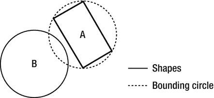

###### 图 3-5。矩形 A 和圆 B 之间的假阳性碰撞

## 碰撞信息

实施宽相位碰撞方法后，现在可以开始定义窄相位方法来检测不同刚性形状之间的碰撞。如前所述，必须计算有关冲突细节的信息，以支持正确解决相互渗透和响应。如图 [3-6](#Fig6) 所示，碰撞的基本信息包括:碰撞深度、法线、开始和结束。碰撞深度是对象相互穿透的最小量，其中碰撞法线是测量碰撞深度的方向。起点和终点是为了方便将贯穿绘制为线段而定义的贯穿的起点和终点位置。任何穿透都可以通过将碰撞对象沿碰撞法线移动从起点到终点位置的碰撞深度距离来解决。

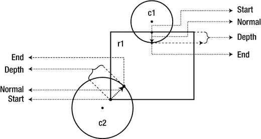

###### 图 3-6。碰撞信息

本节将引导您开发基于刚性圆形状之间的碰撞来计算和处理碰撞信息的基础结构，这是对上一个项目的直接扩展。在本节之后，通过对存储和访问碰撞信息的适当支持，将介绍和实现分离轴定理(SAT)。

### 圆形碰撞检测项目

该项目构建了计算和处理基于圆之间碰撞的碰撞信息的基础设施。正如将要讨论的，冲突信息记录了冲突的具体细节，用于解决相互渗透和生成响应。请注意，基于边界圆的宽相位碰撞检测方法为刚性圆形状计算精确的碰撞检测解决方案。由于这个原因，这个项目可以利用以前的项目，并专注于计算和处理碰撞信息。你可以在图 [3-7](#Fig7) 中看到这个项目运行的例子。这个项目的源代码是在圆形碰撞检测项目文件夹中定义的。

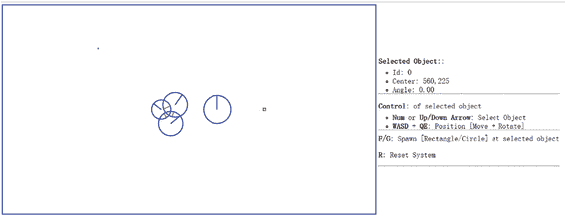

###### 图 3-7。运行圆形碰撞检测项目

项目目标:

*   定义碰撞信息。

*   构建计算和处理碰撞信息的基础设施。

*   计算和显示圆的碰撞信息。

#### 定义碰撞信息对象

必须定义一个新的类来支持冲突信息的存储。

1.  在 SiteRoot/Lib(或 public_html/Lib)文件夹下，创建一个新文件，并将其命名为 CollisionInfo.js，记住要在 index.html 加载这个新的源文件。

2.  定义对象的构造函数以包含碰撞深度、碰撞法线以及开始和结束位置。这些是碰撞穿透的开始和结束位置。

    ```js
    function CollisionInfo() {
        this.mDepth = 0;
        this.mNormal = new Vec2(0, 0);
        this.mStart = new Vec2(0, 0);
        this.mEnd = new Vec2(0, 0);
    }
    ```

3.  定义对象的 getter 和 setter。

    ```js
    CollisionInfo.prototype.setNormal = function (s) {   this.mNormal = s;
    };
    CollisionInfo.prototype.getDepth = function () {   return this.mDepth;
    };
    CollisionInfo.prototype.getNormal = function () {   return this.mNormal;
    };
    CollisionInfo.prototype.setInfo = function (d, n, s) {
        this.mDepth = d;
        this.mNormal = n;
        this.mStart = s;
        this.mEnd = s.add(n.scale(d));
    };
    ```

4.  创建一个函数来改变法线的方向。该功能将用于确保法线始终从主对象指向正在进行碰撞测试的对象。

    ```js
    CollisionInfo.prototype.changeDir = function () {
        this.mNormal = this.mNormal.scale(-1);
        var n = this.mStart;
        this.mStart = this.mEnd;
        this.mEnd = n;
    };
    ```

#### 计算两个圆之间的碰撞信息

在前一个项目中，您实现了检测两个圆之间碰撞的功能。在下文中，您将修改碰撞信息的计算，以包括从圆碰撞中获得的信息。

1.  在 SiteRoot/RigidBody(或者 public_html/RigidBody)文件夹下新建一个文件，命名为 Circle_collision.js，这个文件将包含一个刚性圆形状与其他刚性形状碰撞的实现。

2.  定义 collisionTest 函数以使一个刚性圆形与另一个 RigidShape 对象发生碰撞。请注意，实际的碰撞测试函数是特定于形状的。目前，一个圆只知道如何与一个圆碰撞，对于任何其他形状，它总是返回 false。

    ```js
    Circle.prototype.collisionTest = function (otherShape, collisionInfo) {
        var status = false;
        if (otherShape.mType === "Circle")
            status = this.collidedCircCirc(this, otherShape, collisionInfo);
        else
            status = false;
        return status;
    };
    ```

3.  定义 collideCircCirc 函数来检测两个圆之间的碰撞，并在检测到碰撞时计算相应的碰撞信息。碰撞检测有三种情况:没有碰撞，两个圆的中心位于不同的位置和完全相同的位置。下面的代码显示了无冲突检测。细节如图 [3-8](#Fig8) 所示；vFrom1to2 是从 c1 的中心指向 c2 的中心的向量，rSum 是半径的总和，dist 是两个圆的中心之间的距离。

    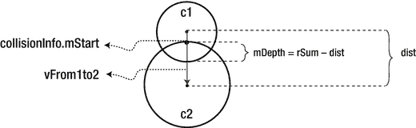

    ###### 图 3-8。圆-圆碰撞的细节

    ```js
    Circle.prototype.collidedCircCirc = function (c1, c2, collisionInfo) {
        var vFrom1to2 = c2.mCenter.subtract(c1.mCenter);
        var rSum = c1.mRadius + c2.mRadius;
        var dist = vFrom1to2.length();
        if (dist > Math.sqrt(rSum * rSum)) {
            return false; //not overlapping
        }
        // ... details in the following steps
    };
    ```

4.  当 dist(两个圆的中心之间的距离)小于半径之和时，检测到碰撞。在这种情况下，如果两个圆没有位于完全相同位置的中心，则可以计算碰撞深度和法线。如图 [3-8](#Fig8) 所示，由于 c2 是另一个刚体形状的参考，所以碰撞法线是从 c1 指向 c2 的矢量，或者与 vFrom1to2 的方向相同。碰撞深度是 rSum 和 dist 之间的差值，c1 的开始位置是 c2 沿法线从 2 到 1 方向距离 c2 中心的简单半径距离。

    ```js
    //... continue from the previous step
    if (dist !== 0) {
        // overlapping but not same position
        var normalFrom2to1 = vFrom1to2.scale(-1).normalize();
        var radiusC2 = normalFrom2to1.scale(c2.mRadius);
        collisionInfo.setInfo(rSum - dist, vFrom1to2.normalize(), c2.mCenter.add(radiusC2));
    }
    //... details in the next step
    ```

5.  两个碰撞圆的最后一种情况是两个圆的中心位于完全相同的位置。在这种情况下，如以下代码所示，碰撞法线被定义为负 y 方向，碰撞深度只是两个半径中较大的一个。

    ```js
    //...continue from the previous step
    if (dist !== 0) {
        //...identical to previous step
    } else {
        //same position
        if (c1.mRadius > c2.mRadius)
            collisionInfo.setInfo(rSum, new Vec2(0, -1),
                            c1.mCenter.add(new Vec2(0, c1.mRadius)));
        else
            collisionInfo.setInfo(rSum, new Vec2(0, -1),
                            c2.mCenter.add(new Vec2(0, c2.mRadius)));
    }
    ```

#### 与矩形碰撞的情况

矩形的碰撞计算将在本章后面介绍。现在，将定义一个空结构来避免运行时错误。

1.  在 SiteRoot/RigidBody(或者 public_html/RigidBody)文件夹下新建一个文件，命名为 Rectangle_collision.js。

2.  将以下代码添加到该文件中，以暂时为矩形刚体形状的所有碰撞返回一个 false 条件。

    ```js
    Rectangle.prototype.collisionTest = function (otherShape, collisionInfo) {
        var status = false;
        if (otherShape.mType === "Circle")
            status = false;
        else
            status = false;
        return status;
    };
    ```

#### 修改物理引擎组件

现在，在计算圆到圆碰撞时，可以修改物理组件以支持碰撞信息的计算。

1.  编辑 EngineCore/Physics.js，支持绘制碰撞信息，调用新定义的刚体形状 collisionTest 函数。

2.  出于调试和测试的目的，定义 drawCollisionInfo 函数，将碰撞深度和法线绘制为刚性形状上的橙色线。

    ```js
    var drawCollisionInfo = function (collisionInfo, context) {
        context.beginPath();
        context.moveTo(collisionInfo.mStart.x, collisionInfo.mStart.y);
        context.lineTo(collisionInfo.mEnd.x, collisionInfo.mEnd.y);
        context.closePath();
        context.strokeStyle = "orange";
        context.stroke();
    };
    ```

3.  在碰撞函数中，首先创建一个 collisionInfo 对象来记录碰撞的细节。在 broad phase boundTest 返回 true 之后，必须通过调用您刚刚定义的刚体形状碰撞测试函数来确定碰撞的详细信息。

    ```js
    //....identical to previous project
    var collisionInfo = new CollisionInfo();
    for (i = 0; i < gEngine.Core.mAllObjects.length; i++) {
        for (j = i + 1; j < gEngine.Core.mAllObjects.length; j++) {
            if (gEngine.Core.mAllObjects[i].boundTest(gEngine.Core.mAllObjects[j])) {
                if (gEngine.Core.mAllObjects[i].collisionTest(gEngine.Core.mAllObjects[j], collisionInfo)) {
                    // ... details in the next step
                }
            }
        //....identical to previous project
    ```

4.  当碰撞被认为有效时，重要的是确保碰撞法线总是朝着被测试物体的方向。如以下代码所示，这可以通过碰撞法线和由碰撞对象的中心定义的向量之间的点积的符号来确定。调用 drawCollisionInfo 函数绘制相应的碰撞信息。

    ```js
    //... continue from the previous step
    if (gEngine.Core.mAllObjects[i].collisionTest(gEngine.Core.mAllObjects[j], collisionInfo)) {  
    **//make sure the normal is always from object[i] to object[j]** 
        if (collisionInfo.getNormal().dot(
            gEngine.Core.mAllObjects[j].mCenter.subtract({
            gEngine.Core.mAllObject[i].mCenter)) < 0) {
              collisionInfo.changeDir();
              }
        //draw collision info (a black line that shows normal)
        drawCollisionInfo(collisionInfo, gEngine.Core.mContext);
    **}** 
    //... identical to previous project
    ```

### 观察

运行项目以测试您的实现。请注意，当您创建两个圆时，它们的碰撞不再由颜色的变化来指示。相反，在碰撞圆内绘制橙色线来指示相应的碰撞深度和法线。您可以创建并观察绘制在所有碰撞圆上的碰撞信息。碰撞信息将用于解决碰撞穿插。最后，观察刚性矩形中缺少碰撞信息。这是因为您尚未实现该功能，并且相应的 collisionTest 函数始终返回 false。接下来的两个项目将指导你实现刚性矩形形状之间的碰撞计算。

## 分离轴定理

分离轴定理(SAT)是 2D 用于检测一般凸形之间碰撞的最流行算法之一的基础。由于推导出的算法对于实时系统来说计算量可能过大，因此通常会先进行宽相位法的初始处理，如前一节所述。沙特德士古公司表示:

> 如果存在一条线(或轴)垂直于两个多边形的给定边之一，且当两个多边形的所有边都投影到该轴上时，投影边不会重叠，则两个凸多边形不会碰撞。

换句话说，给定 2D 空间中的两个凸形，您可以遍历凸形的所有边，一次一条。对于每条边，计算一条垂直于该边的线(或轴)，将两个凸形的所有边投影到这条线上，并计算投影边的重叠部分。如果您可以找到一条没有投影边重叠的垂直线，那么这两个凸形就不会碰撞。

图 [3-9](#Fig9) 使用两个轴对齐的矩形说明了该描述。在这种情况下，有两条直线垂直于两个给定的形状，即 X 轴和 Y 轴。

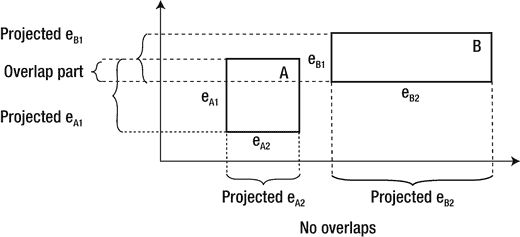

###### 图 3-9。存在不重叠的投影

将所有形状边缘投影到这两条线上时，请注意 Y 轴上的投影结果重叠，而 X 轴上没有重叠。由于存在一条垂直于矩形边之一的线，在该线处投影的边不重叠，SAT 断定两个给定的矩形不冲突。

源自 SAT 的算法的主要优点是，对于非碰撞形状，它具有早期退出能力。一旦检测到没有重叠投影边的轴，算法就可以报告没有碰撞，并且不需要继续对其他轴进行测试。在图 [3-9](#Fig9) 的情况下，如果算法从处理 X 轴开始，则不需要执行 Y 轴的计算。

### 一种简单的 SAT 算法

基于 SAT 导出的算法通常包括四个步骤:

*   **第一步计算** **面法线**:计算垂直轴，或投影边缘的面法线。如图 [3-10](#Fig10) 所示，矩形有四条边，每条边都有一条对应的垂直轴。例如，A1 是的对应轴，因此垂直于边 e <sub class="calibre29">A1</sub> 。请注意，在您的刚性矩形实现中，mFaceNormal 或面法线是垂直轴 A1、A2、A3 和 A4。

    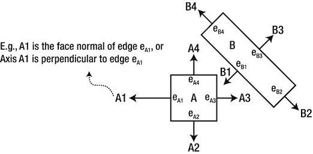

    ###### 图 3-10。矩形边和面法线

*   **步骤 2 投影顶点**:将两个凸形的顶点投影到面法线上。图 [3-11](#Fig11) 展示了图 [3-10](#Fig10) 中所有顶点在 A1 轴上的投影。

    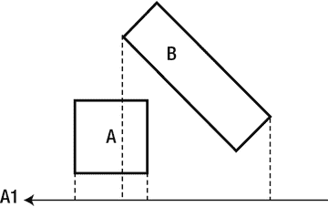

    ###### 图 3-11。将每个顶点投影到面法线上(示例显示 A1)

*   **步骤 3 确定边界**:确定每个凸形投影顶点的最小和最大边界。继续前面的矩形示例。图 [3-12](#Fig12) 显示了识别两个矩形的最小和最大位置。请注意，最小/最大位置是相对于给定轴的方向定义的。

    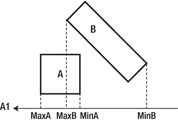

    ###### 图 3-12。确定每个矩形的最小和最大边界位置

*   **步骤 4 确定重叠**:确定两个最小/最大边界是否重叠。图 [3-13](#Fig13) 显示两个投影边界确实重叠。在这种情况下，算法不能结束，必须继续处理下一个面法线。请注意，如图 [3-10](#Fig10) 右图所示，面法线 B1 的过程将导致无碰撞的确定性结论。

    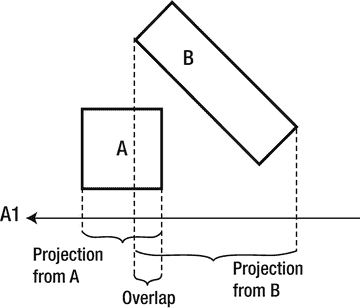

    ###### 图 3-13。测试每个投影轴的重叠(使用 A1 的示例)

给定的算法能够在没有附加信息的情况下确定是否发生了碰撞。回想一下，在检测到碰撞后，物理引擎还必须解决潜在的相互渗透，并为碰撞的形状获得响应。这两种计算都需要额外的信息——图 [3-6](#Fig6) 中介绍的碰撞信息。下一节将介绍一种有效的基于 SAT 的算法，该算法计算支持点，以告知碰撞检测的真/假结果，并作为导出碰撞信息的基础。

### 一种有效的 SAT 算法:支持点

形状-A 的面法线的支撑点定义为形状-B 上的顶点位置，在该位置，顶点与形状-A 的相应边的距离为负。图 [3-14](#Fig14) 显示了形状-A 的面法线 A1。当沿 A1 方向测量时，形状-B 上的顶点 S <sub class="calibre29">A1</sub> 与边 e <sub class="calibre29">A1</sub> 的距离为负，因此 S <sub class="calibre29">A1</sub> 是面法线 A1 的支撑点。负距离表示测量是有方向的，并且支持点必须与面法线方向相反。

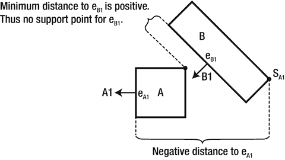

###### 图 3-14。面法线的支持点

一般来说，给定面法线的支持点在每个更新周期中可能不同，因此必须在每次碰撞调用中重新计算。此外，非常重要的是，面法线完全可能没有定义的支持点。

#### 面法线可能不存在支持点

仅当沿面法线测量的距离为负值时，才定义支持点。例如，图 [3-14](#Fig14) 中形状 B 的面法线 B1 在形状 A 上没有对应的支持点。这是因为当沿着 B1 测量时，形状 A 上的所有顶点距离对应的边 e <sub xmlns:xsi="http://www.w3.org/2001/XMLSchema-instance" class="calibre29">B1</sub> 都是正距离。正距离表示形状 A 的所有顶点都在边 e <sub xmlns:xsi="http://www.w3.org/2001/XMLSchema-instance" class="calibre29">B1</sub> 的前面*。换句话说，整个形状 A 在形状 B 的边 e <sub xmlns:xsi="http://www.w3.org/2001/XMLSchema-instance" class="calibre29">B1</sub> 的前面，因此这两个形状没有物理接触，因此它们没有碰撞。*

因此，当计算两个形状之间的碰撞时，如果任何一个面法线都没有相应的支撑点，那么这两个形状就没有碰撞。同样，早期退出能力是一个重要的优势——一旦检测到第一个未定义的支持点，算法就可以返回一个决定。

为了讨论和实现的方便，支持点和相应边缘之间的距离被称为支持点距离，并且该距离被计算为正数。这样，支撑点距离实际上是沿着负面法线方向测量的。这将是本书其余讨论中遵循的惯例。

#### 最少穿透和碰撞信息的轴

当为凸形的所有面法线定义支持点时，最小支持点距离的面法线是导致最小贯穿的轴。图 [3-15](#Fig15) 显示了两个形状之间的碰撞，其中定义了形状 B 的所有面法线的支撑点:形状 A 上的顶点 S <sub class="calibre29">B1</sub> 是面法线 B1 的相应支撑点，S <sub class="calibre29">B2</sub> 是面法线 B2 的支撑点，以此类推。在这种情况下，S <sub class="calibre29">B1</sub> 具有最小的对应支持点距离，因此面法线 B1 是导致最小贯穿的轴。图 [3-15](#Fig15) 右图显示，在这种情况下，支撑点距离为碰撞深度，面法线 B1 为碰撞法线，支撑点 S <sub class="calibre29">B1</sub> 为碰撞的起点，碰撞的终点很容易计算；简单来说就是 S <sub class="calibre29">B1</sub> 在碰撞法线方向偏移碰撞深度。

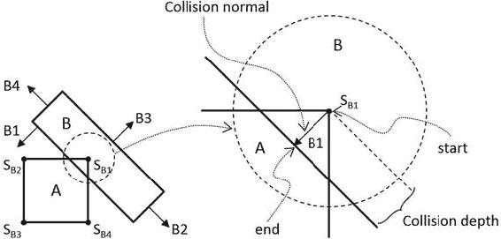

###### 图 3-15。最小穿透轴和相应的碰撞信息

#### 该算法

根据背景描述，计算两个凸形 A 和 B 之间的碰撞的有效的基于 SAT 的算法可以概括为:

*   计算形状 a 上所有面法线的支撑点。

    *   如果没有定义任何支持点，则不存在碰撞。

    *   如果定义了所有支撑点，计算最小穿透轴。

*   计算形状 b 上所有面法线的支撑点。

    *   如果没有定义任何支持点，则不存在碰撞。

    *   如果定义了所有支撑点，计算最小穿透轴。

碰撞信息只是上述两个结果中较小的碰撞深度。您现在已经准备好实现支持点 SAT 算法了。

### 矩形碰撞项目

这个项目将指导你实现支撑点 SAT 算法。你可以在图 [3-16](#Fig16) 中看到这个项目运行的例子。该项目的源代码是在矩形碰撞项目文件夹中定义的。

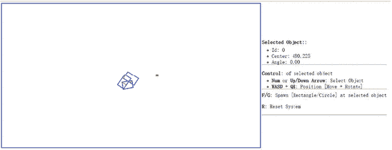

###### 图 3-16。运行矩形碰撞项目

项目目标:

*   深入了解并实现支持点 SAT 算法。

#### 修改矩形碰撞

首先修改 Rectangle_collision.js 文件来实现矩形之间的碰撞检测。

1.  编辑 RigidBody 文件夹中的 Rectangle_collision.js 文件。

2.  创建一个新函数 findSupportPointto，根据 dir(反向面法线方向)和 ptOnEdge(给定边上的一个位置，如顶点)计算一个支持点。下面的代码遍历所有顶点；计算从顶点到顶点的向量 vToEdge 将该矢量投影到输入方向，并记录最大的正投影距离。回想一下，dir 是否定的面法线方向，因此最大的正距离对应于最远的顶点位置。此外，所有投影距离都为负也是完全可能的。在这种情况下，所有顶点都在输入方向的前面，给定边不存在支持点，因此两个矩形不会冲突。

    ```js
    Rectangle.prototype.findSupportPoint = function (dir, ptOnEdge) {
        //the longest project length
        var vToEdge;
        var projection;
        // initialize the computed results
        tmpSupport.mSupportPointDist = -9999999;
        tmpSupport.mSupportPoint = null;
        //check each vector of other object
        for (var i = 0; i < this.mVertex.length; i++) {
            vToEdge = this.mVertex[i].subtract(ptOnEdge);
            projection = vToEdge.dot(dir);
            //find the longest distance with certain edge
            //dir is -n direction, so the distance should be positive
            if ((projection > 0) && (projection > tmpSupport.mSupportPointDist)) {
                tmpSupport.mSupportPoint = this.mVertex[i];
                tmpSupport.mSupportPointDist = projection;
            }
        }
    };
    ```

3.  有了定位任何面法线的支持点的能力，下一步就是通过实现 findAxisLeastPenetration 函数找到穿透最少的轴。回想一下，最少穿透的轴是基于距离支持点最近的支持点得出的。以下代码循环遍历四个面法线，找到相应的支持点和支持点距离，并记录最短距离。while 循环表示，如果没有为任何面法线定义支持点，那么这两个矩形不会发生冲突。

    ```js
    Rectangle.prototype.findAxisLeastPenetration = function (otherRect, collisionInfo) {
        var n;
        var supportPoint;    
        var bestDistance = 999999;
        var bestIndex = null;
        var hasSupport = true;
        var i = 0;
        while ((hasSupport) && (i < this.mFaceNormal.length)) {
            // Retrieve a face normal from A
            n = this.mFaceNormal[i];
            // use -n as direction and // the vectex on edge i as point on edge
            var dir = n.scale(-1);
            var ptOnEdge = this.mVertex[i];
            // find the support on B
            // the point has longest distance with edge i
            otherRect.findSupportPoint(dir, ptOnEdge);
            hasSupport = (tmpSupport.mSupportPoint !== null);
            //get the shortest support point depth
            if ((hasSupport) && (tmpSupport.mSupportPointDist < bestDistance)) {
                bestDistance = tmpSupport.mSupportPointDist;
                bestIndex = i;
                supportPoint = tmpSupport.mSupportPoint;
            }
            i = i + 1;
        }
        if (hasSupport) {
            //all four directions have support point
            var bestVec = this.mFaceNormal[bestIndex].scale(bestDistance);
            collisionInfo.setInfo(bestDistance, this.mFaceNormal[bestIndex], supportPoint.add(bestVec));
        }
        return hasSupport;
    };
    ```

4.  现在，您可以通过计算两个矩形中每个矩形的最小穿透轴并选择两个结果中较小的一个来实现 collidedRectRect 函数。

    ```js
    Rectangle.prototype.collidedRectRect = function (r1, r2, collisionInfo) {
        var status1 = false;
        var status2 = false;
        //find Axis of Separation for both rectangle
        status1 = r1.findAxisLeastPenetration(r2, collisionInfoR1);
        if (status1) {
            status2 = r2.findAxisLeastPenetration(r1, collisionInfoR2);
            if (status2) {
                //choose the shorter normal as the normal
                if (collisionInfoR1.getDepth() < collisionInfoR2.getDepth()) {
                    var depthVec = collisionInfoR1.getNormal().scale(collisionInfoR1.getDepth());
                    collisionInfo.setInfo(collisionInfoR1.getDepth(),
                                    collisionInfoR1.getNormal(),
                                    collisionInfoR1.mStart.subtract(depthVec));
                } else {
                    collisionInfo.setInfo(collisionInfoR2.getDepth(),
                                    collisionInfoR2.getNormal().scale(-1),
                                    collisionInfoR2.mStart);
                }
            }
        }    
        return status1 && status2;
    };
    ```

5.  通过修改 collisionTest 函数来完成实现，以调用新定义的 collidedRectRect 函数来计算两个矩形之间的冲突。

    ```js
    Rectangle.prototype.collisionTest = function (otherShape, collisionInfo) {
        var status = false;
        if (otherShape.mType === "Circle") {
            status = false;
        } else {
    status = this.collidedRectRect(this, otherShape, collisionInfo);
        }
        return status;
    };
    ```

### 观察

现在，您可以运行项目来测试您的实现。尝试用 F 键创建多个矩形。当两个或多个矩形发生碰撞时，可以看到一条橙色线表示碰撞信息(碰撞深度，在碰撞法线方向，从开始到结束)。请记住，这条线显示了解决碰撞所需的最少量的位置校正。使用向上和向下箭头选择和旋转矩形，并观察碰撞信息如何相应变化。在这个阶段，您已经实现了圆和圆之间以及矩形和另一个矩形之间的碰撞检测。如果您尝试碰撞一个矩形和一个圆形，不会生成碰撞信息，因为您没有实现对这种类型碰撞的支持。这将在下一个项目中解决。

## 矩形和圆形之间的碰撞

计算碰撞检测的支持点方法不适用于圆，因为圆没有可识别的顶点位置。相反，您将实现一个算法，根据圆心相对于矩形的相对位置来检测矩形和圆形之间的冲突。

在讨论实际算法之前，如图 [3-17](#Fig17) 所示，通过延伸连接边，可以很方便地将矩形边外的区域分为三个不同的区域。在这种情况下，虚线将给定边缘之外的区域分成:R1，左侧/顶部的区域；R2，右边/底部的区域；和 R3，紧接在给定边缘之外的区域。

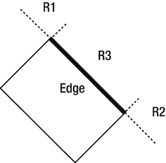

###### 图 3-17。矩形给定边外的三个区域

在这种背景下，矩形和圆形之间的碰撞可以检测如下:

*   **步骤 A** : Edge =计算最近的边(矩形上最靠近圆心的边)。

*   **步骤 B** :如果圆心在外面

    *   **步骤 B1** :如果在 R1 区域:圆心和左上顶点到边的距离决定是否发生碰撞。

    *   **步 B2** :如果在 R2 区域:圆心与边的右/下顶点之间的距离决定是否发生碰撞。

    *   **步 B3** :如果在 R3 区域:中心与边缘的垂直距离决定是否发生碰撞。

*   **步骤 C** :如果圆心在矩形内:检测到碰撞。

### 矩形圆形碰撞项目

这个项目指导你实现所描述的矩形-圆形碰撞检测算法，并对每个步骤进行详细的讨论。你可以在图 [3-18](#Fig18) 中看到这个项目运行的例子。该项目的源代码是在矩形圆碰撞项目文件夹中定义的。

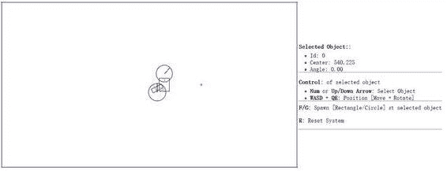

###### 图 3-18。运行矩形圆碰撞项目

项目目标:

*   理解并实现矩形圆碰撞检测算法。

#### 修改矩形碰撞

您将在 Rectangle_collision.js 文件中实现所描述的算法。

1.  编辑 RigidBody 文件夹中的 Rectangle_collision.js 文件。

2.  创建一个新函数，collidedRectCirc，来检测矩形和圆形之间的冲突。因此，这一职能将有五个主要步骤。下面的清单折叠了所有的步骤，详细信息将在本节的剩余部分中填写。

    ```js
    Rectangle.prototype.collidedRectCirc = function (otherCir, collisionInfo) {
        // **Step A**: Compute the nearest edge
        if (!inside) {
            // **Step B1**: If center is in Region R1
            // **Step B2**: If center is in Region R2
            // **Step B3**: If center is in Region R3
        } else {
            // **Step C**: If center is inside
        }
        return true;
    };
    ```

3.  **步骤 A** :计算最近的边。最近的边可以通过计算圆心到矩形每条边的垂直距离来计算。这个距离就是每个顶点和圆心之间的矢量在相应面法线上的投影。以下代码显示了遍历所有顶点，计算从顶点到圆心的向量，并将计算的向量投影到相应的面法线。

    ```js
    // **Step A**: Compute the nearest edge
    for (i = 0; i < 4; ++i) {
        //find the nearest face for center of circle
        circ2Pos = otherCir.mCenter;
        v = circ2Pos.subtract(this.mVertex[i]);
        projection = v.dot(this.mFaceNormal[i]);
        if (projection > 0) {
            //if the center of circle is outside of rectangle
            bestDistance = projection;
            nearestEdge = i;
            inside = false;
            break;
        }
        if (projection > bestDistance) {
            bestDistance = projection;
            nearestEdge = i;
        }
    }
    ```

    如图 [3-19](#Fig19) 所示，一个有趣的观察结果是，当圆心在矩形内时，所有顶点到中心的矢量将与它们对应的面法线方向相反，因此将导致负投影长度。这与中心在矩形之外的情况相反；那么，至少一个投影长度是正的。因此，“最近的投影距离”是负值最小的距离，因此实际上是最大的数值。

    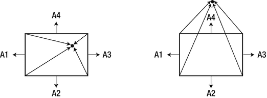

    ###### 图 3-19。(a)矩形内的中心将导致所有负投影长度;( b)矩形外的中心将导致至少一个正投影长度

4.  **步骤 B1** :如果中心在矩形外，在 R1 区域内。如图 [3-20](#Fig20) -a 所示，当中心和边缘顶点之间的矢量与边缘的方向相反时，可以检测到区域 R1。也就是说，当这两个向量的点积为负时，圆心在 R1 区域。图 [3-20](#Fig20) -b 显示当矢量的长度小于圆的半径时会发生碰撞，在这种情况下，碰撞法线简单地沿着矢量，碰撞深度是半径与矢量长度 dist 之差

    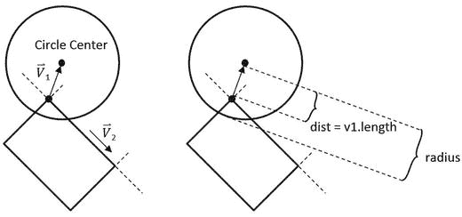

    ###### 图 3-20。(a)当中心在 R1 区域时的条件,( b)相应的碰撞信息

    ```js
    // **Step A**: Compute the nearest edge (*details discussed*)
    if (!inside)  { //the center of circle is outside of rectangle
        // **Step B1**: if ceter is in Region R1
        //v1 is from left vertex of face to center of circle
        //v2 is from left vertex of face to right vertex of face
        var v1 = circ2Pos.subtract(this.mVertex[nearestEdge]);
        var v2 = this.mVertex[(nearestEdge + 1) % 4].subtract(this.mVertex[nearestEdge]);
        var dot = v1.dot(v2);
        if (dot < 0) {  // Region R1
            //the center of circle is in corner region of mVertex[nearestEdge]
            var dis = v1.length();
            //compare the distance with radium to decide collision
            if (dis > otherCir.mRadius)
                return false;
            var normal = v1.normalize();
            var radiusVec = normal.scale(-otherCir.mRadius);
            collisionInfo.setInfo(otherCir.mRadius - dis, normal, circ2Pos.add(radiusVec));
        } else {  // Not in Region R1
            // ... *details to follow* ...
            // **Step B2**: If center is in Region B2
            if (...) { // in Region R2
                // ... *details to follow* ...
            } else {  // not in Region R2
                // **Step B3**: If center is in Region B3
                // ... *details to follow* ...
            }
        }
    } else {  // *else of (!inside)* 
        // **Step C**: If center is inside the rectangle
        // ... *details to follow* ...
    }
    ```

5.  **步进 B2** :如果中心在矩形之外且在 R2 区域内。下面的代码补充了步骤 B1 的代码，唯一的区别是向量沿着边缘的方向。在这种情况下，与使用区域 R1 相比，沿边缘的向量方向相反。

    ```js
    // **Step A**: Compute the nearest edge (*details discussed*)
    if (!inside) {
        // **Step B1**: If center is in Region R1 (*detailed discussed*)
    } else {
        // **Step B2**: If center is in Region R2
        //the center of circle is in corner region of mVertex[nearestEdge+1]
        //v1 is from right vertex of face to center of circle
        //v2 is from right vertex of face to left vertex of face
        var v1 = circ2Pos.subtract(this.mVertex[(nearestEdge + 1) % 4]);
        var v2 = v2.scale(-1);
        var dot = v1.dot(v2);
        if (dot < 0) {
            var dis = v1.length();
            //compare the distance with radium to decide collision
            if (dis > otherCir.mRadius)
                return false;
            var normal = v1.normalize();
            var radiusVec = normal.scale(-otherCir.mRadius);
            collisionInfo.setInfo(otherCir.mRadius - dis, normal, circ2Pos.add(radiusVec));
        } else {
            // **Step B3**: If center is in Region B3
            // ... *details to follow* ...
        }        
    ```

6.  **步进 B3** :如果中心在 R3 区域。圆心可能位于的最后一个区域是紧接在最近边缘外面的区域。在这种情况下，先前在**步骤 A** 中计算的最佳距离是距离；如果这个距离小于圆的半径，那么就发生了碰撞。

    ```js
    // **Step B3**: If center is in Region B3
    //the center of circle is in face region of face[nearestEdge]
    if (bestDistance < otherCir.mRadius) {
        var radiusVec = this.mFaceNormal[nearestEdge].scale(otherCir.mRadius);
        collisionInfo.setInfo(otherCir.mRadius - bestDistance,
                        this.mFaceNormal[nearestEdge], circ2Pos.subtract(radiusVec));
    } else {
        return false;
    }    
    ```

7.  **步骤 C** :如果圆心在矩形内，则检测到碰撞，计算并返回相应的碰撞信息。

    ```js
            if (!inside) {
    //... *conditions for Region R1, R2, and R3 as discussed* 
            } else {
                //the center of circle is inside of rectangle
                var radiusVec = this.mFaceNormal[nearestEdge].scale(otherCir.mRadius);
                collisionInfo.setInfo(otherCir.mRadius - bestDistance,
                   this.mFaceNormal[nearestEdge], circ2Pos.subtract(radiusVec));
        }
        return true;
    };
    ```

8.  最后一步是修改 collisionTest 函数，以相应地调用新定义的碰撞函数。

    ```js
    Rectangle.prototype.collisionTest = function (otherShape, collisionInfo) {
        var status = false;
        if (otherShape.mType === "Circle") {
            status = this.collidedRectCirc(otherShape, collisionInfo);
        } else {
            status = this.collidedRectRect(this, otherShape, collisionInfo);
        }
        return status;
    };
    ```

### 观察

现在，您可以运行项目来测试您的实现。您可以创建矩形和圆形，移动和旋转它们以观察用橙色线表示的相应碰撞信息。旋转碰撞矩形以观察碰撞信息，适应形状的旋转。这是因为计算的碰撞信息依赖于矩形的顶点和面法线的位置。但是，当旋转碰撞圆时，碰撞信息不会改变。这是因为计算出的碰撞信息仅取决于圆的中心位置及其半径。因此，圆的旋转不会改变其碰撞信息。

## 摘要

在此阶段，物理引擎模拟能够准确检测碰撞，并在刚性形状碰撞时计算适当的碰撞信息。已经向您介绍了宽相位法、分离轴定理和有效检测凸形碰撞的支撑点。您已经实现了基于这些概念的算法，这些算法成功地检测到冲突，并计算出解决任何潜在渗透所需的相关信息。下一章将向你介绍一些关于运动的基本物理学，以及如何使用计算出的碰撞信息，通过正确地解决碰撞来模拟 2D 空间中真实世界的物理相互作用。