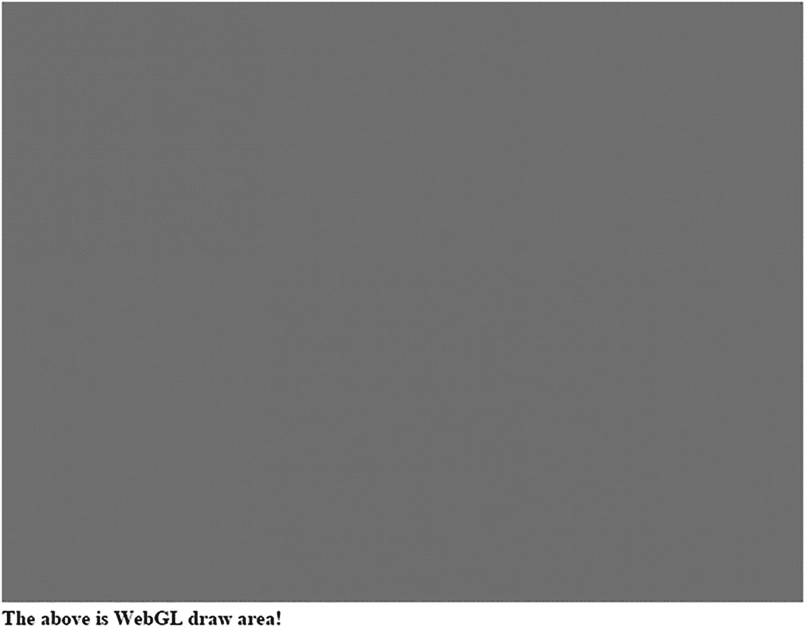
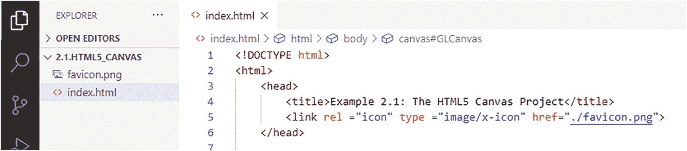
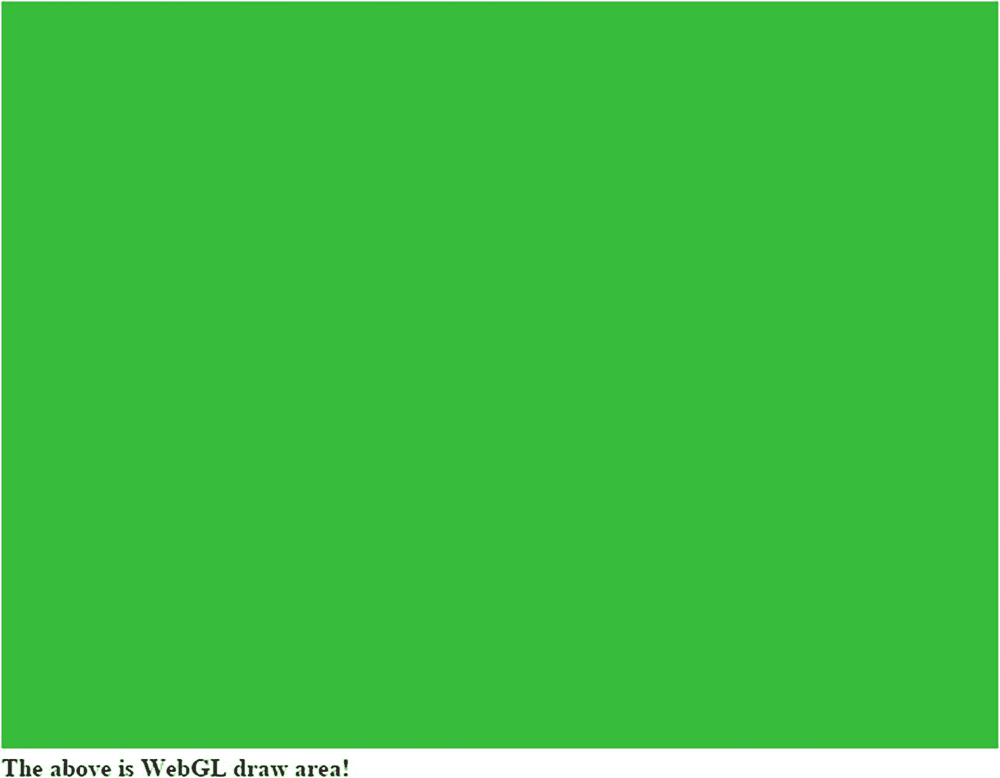
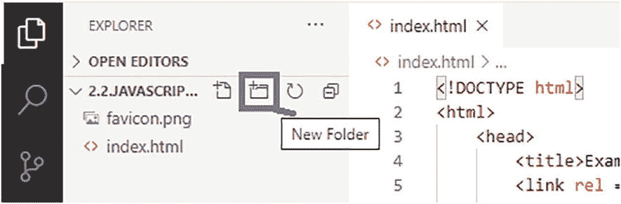
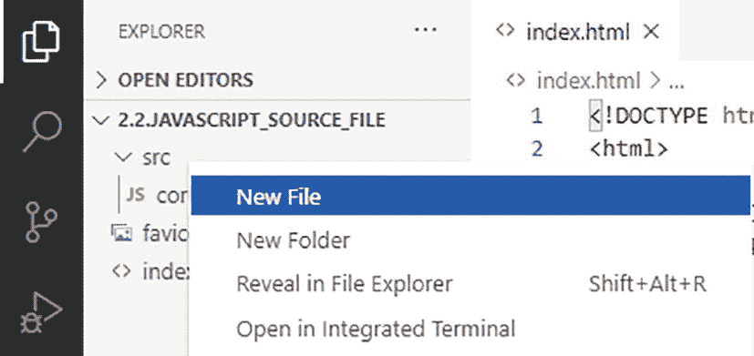
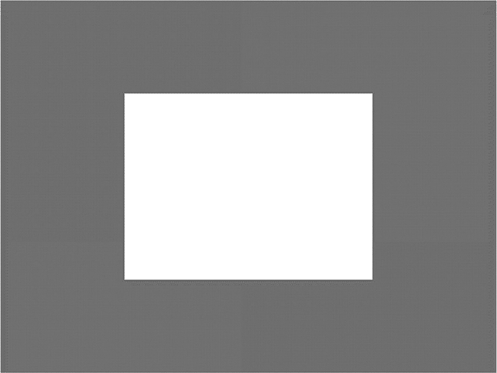
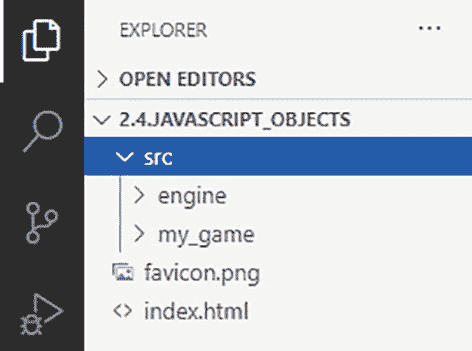
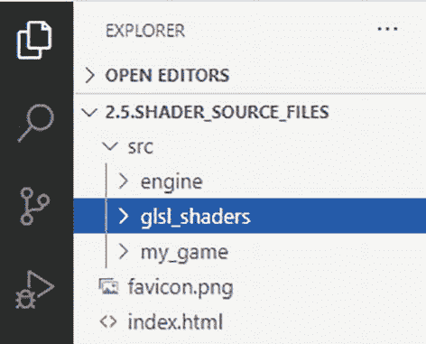
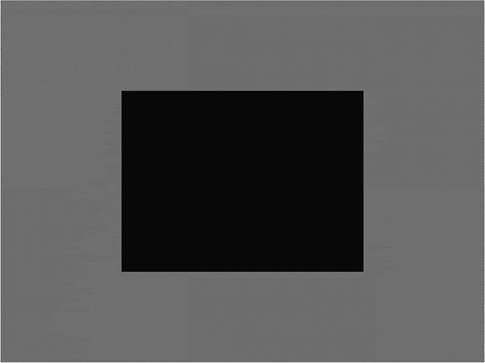

# 2.使用 HTML5 和 WebGL

完成本章后，您将能够

*   为您的简单游戏引擎创建一个新的 JavaScript 源代码文件

*   用 WebGL 画一个简单的恒色正方形

*   定义 JavaScript 模块和类来封装和实现核心游戏引擎功能

*   理解抽象和组织源代码结构对支持复杂性增长的重要性

## 介绍

绘画是所有视频游戏最基本的功能之一。一个游戏引擎应该为它的绘图系统提供一个灵活且对程序员友好的界面。这样，在构建游戏时，设计者和开发者可以专注于游戏本身的重要方面，如机械、逻辑和美学。

WebGL 是一个现代的 JavaScript 图形应用编程接口(API ),专为基于 web 浏览器的应用设计，通过直接访问图形硬件来提高质量和效率。由于这些原因，WebGL 作为一个极好的基础来支持游戏引擎中的绘图，特别是对于那些被设计成在互联网上玩的视频游戏。

本章研究了使用 WebGL 绘图的基础，设计了封装无关细节的抽象以方便编程，并构建了组织复杂源代码系统的基础设施以支持未来的扩展。

Note

您将在本书中开发的游戏引擎基于最新版本的 WebGL 规范:2.0 版。为了简洁起见，术语 WebGL 将用于指代这个 API。

## 绘画用画布

要进行绘制，您必须首先在网页中定义并指定一个区域。通过使用 HTML `canvas`元素为 WebGL 绘图定义一个区域，可以很容易地实现这一点。`canvas`元素是一个绘图容器，可以用 JavaScript 访问和操作。

### HTML5 画布项目

这个项目演示了如何在网页上创建和清除一个`canvas`元素。图 [2-1](#Fig1) 显示了一个运行该项目的例子，该项目在`chapter2/2.1.html5_canvas`文件夹中定义。



图 2-1

运行 HTML5 画布项目

该项目的目标如下:

*   学习如何设置 HTML `canvas`元素

*   学习如何从 HTML 文档中检索用于 JavaScript 的`canvas`元素

*   学习如何从检索到的`canvas`元素创建 WebGL 的引用上下文，并通过 WebGL 上下文操纵画布

#### 创建和清除 HTML 画布

在第一个项目中，您将创建一个空的 HTML5 画布，并使用 WebGL:

1.  创建一个新项目，在你选择的目录下创建一个名为`html5_canvas`的新文件夹，复制并粘贴你在第 [1](01.html) 章的前一个项目中创建的`index.html`文件。

Note

从这一点开始，当要求您创建一个新项目时，您应该遵循前面描述的过程。也就是说，用项目的名称创建一个新文件夹，并复制/粘贴以前项目的文件。这样，您的新项目可以在旧项目的基础上进行扩展，同时保留原有的功能。



图 2-2

编辑项目中的`index.html`文件

1.  在编辑器中打开`html5_canvas`文件夹，根据需要将其展开，点击`index.html`文件，打开`index.html`文件，如图 [2-2](#Fig2) 所示。

1.  通过在`body`元素内的`index.html`文件中添加以下行来创建用于绘图的 HTML `canvas`:

```js
<canvas id="GLCanvas" width="640" height="480">
Your browser does not support the HTML5 canvas.
</canvas>

```

代码用指定的`width`和`height`属性定义了一个名为`GLCanvas`的`canvas`元素。正如您稍后将体验到的，您将检索对`GLCanvas`的引用以绘制到该区域中。如果您的浏览器不支持使用`WebGL`绘图，将显示元素内的文本。

Note

标签`<body>`和`</body>`之间的线被称为“在`body`元素内”对于本书的其余部分，“在`AnyTag`元素内”将用于指代元素的开始(`<AnyTag>`)和结束(`</AnyTag>`)之间的任何行。

1.  创建一个包含 JavaScript 编程代码的`script`元素，同样在`body`元素中:

```js
<script type="text/javascript">
    // JavaScript code goes here.
</script>

```

这负责这个项目的 HTML 部分。现在，您将为示例的剩余部分编写 JavaScript 代码:

1.  通过在`script`元素中添加以下代码行，在 JavaScript 代码中检索对`GLCanvas`的引用:

```js
"use strict";
let canvas = document.getElementById("GLCanvas");

```

Note

JavaScript 关键字定义了变量。

第一行“use strict”是一个 JavaScript 指令，表示代码应该在“严格模式”下执行，其中使用未声明的变量是一个运行时错误。第二行创建一个名为`canvas`的新变量，并将该变量引用到`GLCanvas`绘图区域。

Note

所有局部变量名称都以小写字母开头，如`canvas`。

1.  通过添加以下代码，检索对 WebGL 上下文的引用并将其绑定到绘图区域:

```js
let gl = canvas.getContext("webgl2") ||
         canvas.getContext("experimental-webgl2");

```

如代码所示，检索到的 WebGL 版本 2 上下文的引用存储在名为`gl`的局部变量中。通过这个变量，您可以访问 WebGL 2.0 的所有功能。同样，在本书的其余部分，术语 WebGL 将用于指代 web GL 2.0 版 API。

1.  通过添加以下内容，通过 WebGL 将画布绘图区域清除为您喜欢的颜色:

```js
if (gl !== null) {
    gl.clearColor(0.0, 0.8, 0.0, 1.0);
    gl.clear(gl.COLOR_BUFFER_BIT);
}

```

此代码检查以确保正确检索 WebGL 上下文，设置清除颜色，并清除绘图区域。请注意，清除颜色以 RGBA 格式给出，浮点值范围从 0.0 到 1.0。RGBA 格式中的第四个数字是 alpha 通道。在后面的章节中你会学到更多关于阿尔法通道的知识。目前，始终将 1.0 指定给 alpha 通道。指定的颜色`(0.0, 0.8, 0.0, 1.0)`，红色和蓝色通道的值为零，绿色通道的强度为 0.8，即 80%。因此，画布区域被清除为浅绿色。

1.  通过插入以下代码行，向`document`添加一个简单的`write`命令来识别`canvas`:

```js
document.write("<br><b>The above is WebGL draw area!</b>");

```

可以参考`chapter2/2.1.html5_canvas`项目中的`index.html`文件中的最终源代码。运行这个项目，你应该在你的浏览器窗口上看到一个浅绿色的区域，如图 [2-1](#Fig1) 所示。这是您定义的 640×480 的画布绘制区域。

您可以通过将`gl.clearColor()`的 RGBA 设置为 1 来尝试将清除的颜色更改为白色，或者通过将颜色设置为 0 并保留 alpha 值为 1 来尝试将清除的颜色更改为黑色。请注意，如果将 alpha 通道设置为 0，画布颜色将会消失。这是因为 alpha 通道中的 0 值表示完全透明，因此，您将“看穿”画布并观察网页的背景颜色。您也可以尝试通过将 640×480 值更改为您喜欢的任何数字来改变画布的分辨率。请注意，这两个数字指的是像素数，因此必须始终是整数。

## 分离 HTML 和 JavaScript

在前一个项目中，您创建了一个 HTML `canvas`元素，并使用 WebGL 清除了画布定义的区域。注意，所有的功能都聚集在`index.html`文件中。随着项目复杂性的增加，这种功能的聚集会很快变得难以管理，并对系统的可编程性产生负面影响。由于这个原因，在本书的整个开发过程中，引入一个概念后，将努力把相关的源代码分成定义良好的源代码文件或面向对象编程风格的类。为了开始这个过程，来自前一个项目的 HTML 和 JavaScript 源代码将被分离到不同的源代码文件中。

### JavaScript 源文件项目

这个项目演示了如何在逻辑上将源代码分成适当的文件。您可以通过创建一个名为`core.js`的单独的 JavaScript 源代码文件来实现这一点，该文件实现了`index.html`文件中的相应功能。网页将按照`index.html`文件中代码的指示加载 JavaScript 源代码。如图 [2-3](#Fig3) 所示，该项目运行时看起来与上一个项目相同。这个项目的源代码位于`chapter2/2.2.javascript_source_file`文件夹中。



图 2-3

运行 JavaScript 源文件项目

该项目的目标如下:

*   了解如何将源代码分成不同的文件

*   以逻辑结构组织代码

#### 单独的 JavaScript 源代码文件

本节详细介绍了如何创建和编辑新的 JavaScript 源代码文件。您应该熟悉这个过程，因为您将在本书中创建大量的源代码文件。



图 2-4

创建新的源代码文件夹

1.  创建一个名为`javascript_source_file`的新 HTML5 项目。回想一下，一个新项目是通过创建一个具有适当名称的文件夹，从以前的项目中复制文件，并编辑`index.html`的`<Title>`元素来反映新项目而创建的。

2.  鼠标悬停在项目文件夹上，点击新建文件夹图标，在项目文件夹内新建一个名为`src`的文件夹，如图 [2-4](#Fig4) 所示。该文件夹将包含您的所有源代码。



图 2-5

添加新的 JavaScript 源代码文件

1.  右键单击`src`文件夹，在`src`文件夹下新建一个源代码文件，如图 [2-5](#Fig5) 所示。将新的源文件命名为`core.js`。

Note

在 VS 代码中，您可以使用资源管理器窗口中的右键菜单来创建/复制/重命名文件夹和文件。

1.  打开新的`core.js`源文件进行编辑。

2.  定义引用 WebGL 上下文的变量，并添加允许您访问该变量的函数:

```js
"use strict";
let mGL = null;
function getGL() { return mGL; }

```

Note

在整个文件或模块中可访问的变量的名字以小写字母“m”开头，如`mGL`。

1.  定义`initWebGL()`函数，通过将适当的画布`id`作为参数传入来检索`GLCanvas`，将绘图区域绑定到 WebGL 上下文，将结果存储在定义的`mGL`变量中，并清除绘图区域:

```js
function initWebGL(htmlCanvasID) {
    let canvas = document.getElementById(htmlCanvasID);

    mGL = canvas.getContext("webgl2") ||
          canvas.getContext("experimental-webgl2");

    if (mGL === null) {
        document.write("<br><b>WebGL 2 is not supported!</b>");
        return;
    }
    mGL.clearColor(0.0, 0.8, 0.0, 1.0);
}

```

注意，这个函数类似于您在前一个项目中键入的 JavaScript 源代码。这是因为在这种情况下，您所做的一切都是不同的，将 JavaScript 源代码与 HTML 代码分开。

Note

所有函数名都以小写字母开头，如`initWebGL()`。

1.  定义`clearCanvas()`函数调用 WebGL 上下文来清空画布绘图区域:

1.  定义一个函数，在 web 浏览器加载完`index.html`文件后，对画布区域进行初始化和清除；

```js
function clearCanvas() {
    mGL.clear(mGL.COLOR_BUFFER_BIT);
}

```

```js
window.onload = function() {
    initWebGL("GLCanvas");
    clearCanvas();
}

```

#### 从 index.html 加载并运行 JavaScript 源代码

有了在`core.js`文件中定义的所有 JavaScript 功能，您现在需要通过`index.html`文件加载这个文件来操作您的 web 页面:

1.  打开`index.html`文件进行编辑。

2.  像前面的项目一样，创建 HTML 画布`GLCanvas`。

3.  通过在`head`元素中包含以下代码来加载`core.js`源代码:

```js
<script type="module" src="./src/core.js"></script>

```

使用这段代码，`core.js`文件将作为`index.html`定义的网页的一部分被加载。回想一下，您已经为`window.onload`定义了一个函数，当`index.html`的加载完成时，该函数将被调用。

可以参考`chapter2/2.2.javascript_source_file`项目文件夹下的`core.js`和`index.html`文件中的最终源代码。虽然这个项目的输出与上一个项目的输出相同，但是您的代码组织将允许您在继续添加新功能时扩展、调试和理解游戏引擎。

Note

回想一下，要运行一个项目，单击 VS 代码窗口右下角的“Go Live”按钮，或者键入 Alt+L Alt+O 键，同时在编辑器窗口中打开相关的`index.html`文件。在这种情况下，当`core.js`文件在编辑器窗口中打开时，如果您单击“Go Live”按钮，项目将不会运行。

### 观察

仔细检查您的`index.html`文件，并将其内容与之前项目中的相同文件进行比较。您会注意到，前一个项目中的`index.html`文件包含两种类型的信息(HTML 和 JavaScript 代码)，这个项目中的同一个文件只包含前者，所有的 JavaScript 代码都被提取到`core.js`。这种清晰的信息分离便于理解源代码，并提高了对更复杂系统的支持。从现在开始，所有的 JavaScript 源代码都将被添加到单独的源代码文件中。

## 使用 WebGL 的基本绘图

一般来说，绘图包括几何数据和处理数据的指令。在 WebGL 的情况下，用于处理数据的指令在 OpenGL 着色语言(GLSL)中指定，并且被称为着色器。为了使用 WebGL 绘图，程序员必须在 CPU 中定义几何数据和 GLSL 着色器，并将其加载到绘图硬件或图形处理单元(GPU)中。这个过程涉及到大量的 WebGL 函数调用。本节详细介绍了 WebGL 绘制步骤。

重要的是集中精力学习这些基本步骤，避免被不太重要的 WebGL 配置细微差别分散注意力，以便您可以继续学习构建游戏引擎时涉及的整体概念。

在下面的项目中，您将通过关注最基本的操作来学习使用 WebGL 绘图。这包括将简单的正方形几何图形从 CPU 加载到 GPU，创建恒定颜色着色器，以及绘制带有两个三角形的简单正方形的基本说明。

### 绘制一个正方形项目

这个项目引导你完成在画布上画一个正方形所需的步骤。图 [2-6](#Fig6) 显示了一个运行这个项目的例子，它被定义在`chapter2/2.3.draw_one_square`文件夹中。



图 2-6

运行绘制一个正方形项目

该项目的目标如下:

*   了解如何将几何数据加载到 GPU

*   了解用于使用 WebGL 绘图的简单 GLSL 着色器

*   了解如何编译着色器并将其加载到 GPU

*   了解使用 WebGL 绘图所需的步骤

*   演示基于简单源代码文件的类似单例的 JavaScript 模块的实现

#### 设置并加载原始几何数据

为了使用 WebGL 高效地绘制，与要绘制的几何图形相关联的数据(如正方形的顶点位置)应该存储在 GPU 硬件中。在下面的步骤中，您将在 GPU 中创建一个连续的缓冲区，将单位正方形的顶点位置加载到缓冲区中，并将对 GPU 缓冲区的引用存储在一个变量中。借鉴前面的项目，相应的 JavaScript 代码将存储在一个新的源代码文件中，`vertex_buffer.js`。

Note

单位正方形是以原点为中心的 1×1 正方形。

1.  在`src`文件夹中创建一个新的 JavaScript 源文件，并将其命名为`vertex_buffer.js`。

2.  使用 JavaScript `import`语句将所有从`core.js`文件导出的功能作为`core`导入:

```js
"use strict";
import * as core from "./core.js";

```

Note

有了 JavaScript `import`和即将出现的`export`，文件中定义的语句、特性和功能可以被方便地封装和访问。在这种情况下，从`core.js`导出的功能被导入到`vertex_buffer.js`中，并可通过模块标识符`core`访问。例如，正如您将看到的，在这个项目中，`core.js`定义并导出了一个`getGL()`函数。使用给定的`import`语句，可以在`vertex_buffer.js`文件中以`core.getGL()`的形式访问该函数。

1.  声明变量`mGLVertexBuffer`来存储对 WebGL 缓冲区位置的引用。记得定义一个函数来访问这个变量。

1.  定义变量`mVerticesOfSquare`并用单位正方形的顶点初始化它:

```js
let mGLVertexBuffer = null;
function get() { return mGLVertexBuffer; }

```

```js
let mVerticesOfSquare = [
    0.5, 0.5, 0.0,
    -0.5, 0.5, 0.0,
    0.5, -0.5, 0.0,
    -0.5, -0.5, 0.0
];

```

在所示的代码中，每行三个数字是顶点的 x、y 和 z 坐标位置。请注意，z 维度设置为 0.0，因为您正在构建一个 2D 游戏引擎。还要注意，这里使用了 0.5，所以我们在 2D 空间中定义了一个正方形，它的边长等于 1，并且以原点或单位正方形为中心。

1.  定义`init()`函数，通过`gl`上下文在 GPU 中分配一个缓冲区，并将顶点加载到 GPU 中分配的缓冲区:

```js
function init() {
    let gl = core.getGL();

    // Step A: Create a buffer on the gl context for our vertex positions
    mGLVertexBuffer = gl.createBuffer();

    // Step B: Activate vertexBuffer
    gl.bindBuffer(gl.ARRAY_BUFFER, mGLVertexBuffer);

    // Step C: Loads mVerticesOfSquare into the vertexBuffer
    gl.bufferData(gl.ARRAY_BUFFER,
              new Float32Array(mVerticesOfSquare), gl.STATIC_DRAW);
}

```

这段代码首先通过`core.getGL()`函数访问 WebGL 绘图上下文。之后，步骤 A 在 GPU 上创建一个缓冲区，用于存储正方形的顶点位置，并将对 GPU 缓冲区的引用存储在变量`mGLVertexBuffer`中。步骤 B 激活新创建的缓冲区，步骤 C 将正方形的顶点位置加载到 GPU 上激活的缓冲区中。关键字`STATIC_DRAW`通知绘图硬件这个缓冲区的内容不会被改变。

Tip

记住通过`getGL()`函数访问的`mGL`变量是在`core.js`文件中定义的，并由`initWebGL()`函数初始化。您将在`core.js`文件中定义一个`export`语句，以便在接下来的步骤中提供对该函数的访问。

1.  通过使用以下代码导出`init()`和`get()`函数，为引擎的其余部分提供对它们的访问:

```js
export {init, get}

```

定义了加载顶点位置的功能后，现在就可以定义和加载 GLSL 着色器了。

#### 设置 GLSL 着色器

术语着色器指的是运行在 GPU 上的程序或指令集合。在游戏引擎的上下文中，着色器必须总是成对定义，由顶点着色器和相应的片段着色器组成。GPU 将对每个图元顶点执行一次顶点着色器，对图元覆盖的每个像素执行一次片段着色器。例如，您可以定义一个具有四个顶点的正方形，并显示该正方形以覆盖 100×100 像素的区域。为了绘制这个正方形，WebGL 将调用顶点着色器 4 次(每个顶点一次)，并执行片段着色器 10，000 次(每个 100×100 像素一次)！

在 WebGL 的情况下，顶点和片段着色器都是用 OpenGL 着色语言(GLSL)实现的。GLSL 是一种语法类似于 C 编程语言的语言，专门为处理和显示图形元素而设计。你将学到足够的 GLSL 来支持游戏引擎的绘图。

在以下步骤中，您将把顶点着色器和片段着色器的源代码加载到 GPU 内存中，编译并链接到单个着色器程序中，并将链接的程序加载到 GPU 内存中进行绘制。在这个项目中，着色器源代码在`index.html`文件中定义，而着色器的加载、编译和链接在`shader_support.js`源文件中定义。

Note

WebGL 上下文可以被视为 GPU 硬件的抽象。为了提高可读性，WebGL 和 GPU 这两个术语有时可以互换使用。

##### 定义顶点和片段着色器

GLSL 着色器是由 GLSL 指令组成的简单程序:

1.  通过打开`index.html`文件定义顶点着色器，并在`head`元素中添加以下代码:

```js
<script type="x-shader/x-vertex" id="VertexShader">
    // this is the vertex shader
    attribute vec3 aVertexPosition;  // Expects one vertex position
        // naming convention, attributes always begin with "a"
    void main(void) {
        // Convert the vec3 into vec4 for scan conversion and
        // assign to gl_Position to pass vertex to the fragment shader
        gl_Position = vec4(aVertexPosition, 1.0);
    }
    // End of vertex shader
</script>

```

Note

着色器属性变量的名称以小写字母“a”开头，如`aVertexPosition`。

`script`元素类型被设置为`x-shader/x-vertex`,因为这是着色器的通用约定。正如你将看到的，值为`VertexShader`的`id`字段允许你识别并加载这个顶点着色器到内存中。

GLSL `attribute`关键字标识将被传递到 GPU 中的顶点着色器的逐顶点数据。在这种情况下，`aVertexPosition`属性的数据类型是`vec3`或者三个浮点数的数组。正如您将在后面的步骤中看到的，`aVertexPosition`将被设置为引用单位正方形的顶点位置。

`gl_Position`是一个 GLSL 内置变量，特别是一个包含顶点位置的四个浮点数的数组。在这种情况下，数组的第四个位置将始终是 1.0。代码显示着色器将`aVertexPosition`转换为`vec4`，并将信息传递给 WebGL。

1.  通过在`head`元素中添加以下代码，在`index.html`中定义片段着色器:

```js
<script type="x-shader/x-fragment" id="FragmentShader">
    // this is the fragment (or pixel) shader
    void main(void) {
        // for every pixel called (within the square) sets
        // constant color white with alpha-channel value of 1.0
        gl_FragColor = vec4(1.0, 1.0, 1.0, 1.0);
    }
    // End of fragment/pixel shader
</script>

```

注意不同的`type`和`id`字段。回想一下，每个像素调用一次片段着色器。变量`gl_FragColor`是决定像素颜色的内置变量。在这种情况下，返回颜色`(1,1,1,1)`，即白色。这意味着所有被覆盖的像素将被阴影化为恒定的白色。

有了在`index.html`文件中定义的顶点和片段着色器，您现在就可以实现编译、链接和加载结果着色器程序到 GPU 的功能了。

##### 编译、链接和加载顶点和片段着色器

为了在逻辑分离的源文件中维护源代码，您将在新的源代码文件`shader_support.js`中创建着色器支持功能。

1.  创建一个新的 JavaScript 文件`shader_support.js`。

2.  从`core.js`和`vertex_buffer.js`文件导入功能:

1.  定义两个变量`mCompiledShader`和`mVertexPositionRef`，用于引用着色器程序和 GPU 中的顶点位置属性:

```js
"use strict";  // Variables must be declared before used!
import * as core from "./core.js";  // access as core module
import * as vertexBuffer from "./vertex_buffer.js"; //vertexBuffer module

```

1.  创建一个函数来加载和编译您在`index.html`中定义的着色器:

```js
let mCompiledShader = null;
let mVertexPositionRef = null;

```

```js
function loadAndCompileShader(id, shaderType) {
    let shaderSource = null, compiledShader = null;

    // Step A: Get the shader source from index.html
    let shaderText = document.getElementById(id);
    shaderSource = shaderText.firstChild.textContent;

    let gl = core.getGL();
    // Step B: Create shader based on type: vertex or fragment
    compiledShader = gl.createShader(shaderType);

    // Step C: Compile the created shader
    gl.shaderSource(compiledShader, shaderSource);
    gl.compileShader(compiledShader);

    // Step D: check for errors and return results (null if error)
    // The log info is how shader compilation errors are displayed.
    // This is useful for debugging the shaders.
    if (!gl.getShaderParameter(compiledShader, gl.COMPILE_STATUS)) {
        throw new Error("A shader compiling error occurred: " +
                      gl.getShaderInfoLog(compiledShader));
    }

    return compiledShader;
}

```

代码的步骤 A 使用您在定义着色器时指定的`id`字段在`index.html`文件中查找着色器源代码，该字段可以是`VertexShader`或`FragmentShader`。步骤 B 在 GPU 中创建指定的着色器(顶点或片段)。步骤 C 指定源代码并编译着色器。最后，步骤 D 检查并返回对已编译着色器的引用，如果着色器编译不成功，则抛出错误。

1.  现在，您可以通过定义`init()`函数来创建、编译和链接着色器程序了:

```js
function init(vertexShaderID, fragmentShaderID) {
    let gl = core.getGL();

    // Step A: load and compile vertex and fragment shaders
    let vertexShader = loadAndCompileShader(vertexShaderID,
                                            gl.VERTEX_SHADER);
    let fragmentShader = loadAndCompileShader(fragmentShaderID,
                                              gl.FRAGMENT_SHADER);

    // Step B: Create and link the shaders into a program.
    mCompiledShader = gl.createProgram();
    gl.attachShader(mCompiledShader, vertexShader);
    gl.attachShader(mCompiledShader, fragmentShader);
    gl.linkProgram(mCompiledShader);

    // Step C: check for error
    if (!gl.getProgramParameter(mCompiledShader, gl.LINK_STATUS)) {
        throw new Error("Error linking shader");
        return null;
    }

    // Step D: Gets reference to aVertexPosition attribute in the shader
    mVertexPositionRef = gl.getAttribLocation(mCompiledShader,
                                              "aVertexPosition");
}

```

步骤 A 通过调用带有相应参数的`loadAndCompileShader()`函数，加载并编译您在`index.html`中定义的着色器代码。步骤 B 附加已编译的着色器，并将两个着色器链接到一个程序中。对该程序的引用存储在变量`mCompiledShader`中。在步骤 C 中的错误检查之后，步骤 D 定位并存储对顶点着色器中定义的`aVertexPosition`属性的引用。

1.  定义一个允许激活着色器的函数，以便它可以用于绘制正方形:

```js
function activate() {
    // Step A: access to the webgl context
    let gl = core.getGL();

    // Step B: identify the compiled shader to use
    gl.useProgram(mCompiledShader);

    // Step C: bind vertex buffer to attribute defined in vertex shader
    gl.bindBuffer(gl.ARRAY_BUFFER, vertexBuffer.get());
    gl.vertexAttribPointer(this.mVertexPositionRef,
        3,            // each element is a 3-float (x,y.z)
        gl.FLOAT,      // data type is FLOAT
        false,         // if the content is normalized vectors
        0,           // number of bytes to skip in between elements
        0);          // offsets to the first element
    gl.enableVertexAttribArray(this.mVertexPositionRef);
}

```

在所示的代码中，步骤 A 通过`core`模块将`gl`变量设置为 WebGL 上下文。步骤 B 将编译后的着色器程序加载到 GPU 内存中，而步骤 C 将在`vertex_buffer.js`中创建的顶点缓冲区绑定到顶点着色器中定义的`aVertexPosition`属性。`gl.vertexAttribPointer()`函数捕捉到顶点缓冲区装载了一个单位正方形的顶点，每个顶点位置包含三个浮点值。

1.  最后，通过使用`export`语句导出`init()`和`activate()`函数，为游戏引擎的其余部分提供对它们的访问:

```js
export { init, activate }

```

Note

注意，`loadAndCompileShader()`函数被排除在`export`语句之外。其他地方不需要这个函数，因此，遵循隐藏本地实现细节的良好开发实践，这个函数应该对这个文件保持私有。

现在已经定义了着色器加载和编译功能。现在，您可以利用并激活这些函数来使用 WebGL 绘图。

#### 使用 WebGL 设置绘图

定义了顶点数据和着色器功能后，现在可以执行以下步骤来使用 WebGL 进行绘制。回想一下之前的项目，初始化和绘图代码是在`core.js`文件中定义的。现在打开这个文件进行编辑。

1.  从`vertex_buffer.js`和`shader_support.js`文件导入定义的功能:

1.  修改`initWebGL()`函数以包含顶点缓冲区和着色器程序的初始化:

```js
import * as vertexBuffer from "./vertex_buffer.js";
import * as simpleShader from "./shader_support.js";

```

```js
function initWebGL(htmlCanvasID) {
    let canvas = document.getElementById(htmlCanvasID);

    // Get standard or experimental webgl and bind to the Canvas area
    // store the results to the instance variable mGL
    mGL = canvas.getContext("webgl2") ||
          canvas.getContext("experimental-webgl2");

    if (mGL === null) {
        document.write("<br><b>WebGL 2 is not supported!</b>");
        return;
    }
    mGL.clearColor(0.0, 0.8, 0.0, 1.0);  // set the color to be cleared

    // 1\. initialize buffer with vertex positions for the unit square
    vertexBuffer.init(); // function defined in the vertex_buffer.js

    // 2\. now load and compile the vertex and fragment shaders
    simpleShader.init("VertexShader", "FragmentShader");
        // the two shaders are defined in the index.html file
        // init() function is defined in shader_support.js file
}

```

如代码所示，成功获取对 WebGL 上下文的引用并设置清除颜色后，首先要调用`vertex_buffer.js`中定义的`init()`函数，用单位正方形顶点初始化 GPU 顶点缓冲区，然后调用`shader_support.js`中定义的`init()`函数，加载并编译顶点和片段着色器。

1.  添加一个`drawSquare()`函数，用于绘制定义好的正方形:

```js
function drawSquare() {
    // Step A: Activate the shader
    simpleShader.activate();

    // Step B. draw with the above settings
    mGL.drawArrays(mGL.TRIANGLE_STRIP, 0, 4);
}

```

这段代码展示了用 WebGL 绘图的步骤。步骤 A 激活着色器程序来使用。步骤 B 发出 WebGL draw 命令。在这种情况下，您发出一个命令，将四个顶点绘制为两个相连的三角形，形成一个正方形。

1.  现在你只需要修改`window.onload`函数来调用新定义的`drawSquare()`函数:

1.  最后，通过导出`getGL()`函数，向引擎的其余部分提供对 WebGL 上下文的访问。记住，这个函数是导入的，并且已经被调用来访问`vertex_buffer.js`和`simple_shader.js`中的 WebGL 上下文。

```js
window.onload = function() {
    initWebGL("GLCanvas");  // Binds mGL context to WebGL functionality
    clearCanvas();          // Clears the GL area
    drawSquare();           // Draws one square
}

```

```js
export {getGL}

```

回想一下，绑定到`window.onload`的函数将在 web 浏览器加载了`indexl.html`之后被调用。出于这个原因，WebGL 将被初始化，画布被清除为浅绿色，并将绘制一个白色正方形。您可以参考`chapter2/2.3.draw_one_square`项目中的源代码来了解所描述的整个系统。

### 观察

运行该项目，您将在绿色画布上看到一个白色矩形。广场怎么了？请记住，1×1 正方形的顶点位置是在位置(0.5，0.5)处定义的。现在观察项目输出:白色矩形位于绿色画布的中间，正好覆盖了画布宽度和高度的一半。事实证明，WebGL 将 1.0 范围内的顶点绘制到整个定义的绘图区域上。在这种情况下，x 维度中的 1.0 映射到 640 像素，而 y 维度中的 1.0 映射到 480 像素(创建的画布维度为 640×480)。1x1 正方形被绘制到 640x480 的区域上，或者长宽比为 4:3 的区域上。由于正方形的 1:1 纵横比与显示区域的 4:3 纵横比不匹配，因此正方形显示为 4:3 矩形。这个问题将在下一章中解决。

您可以尝试在`index.html`中编辑片段着色器，通过改变`gl_FragColor`函数中的颜色设置来改变白色方块的颜色。请注意，alpha 通道中小于 1 的值不会导致白色正方形变得透明。绘制图元的透明度将在后面的章节中讨论。

最后，注意这个项目定义了三个独立的文件，并用 JavaScript 导入/导出语句隐藏了信息。用相应的导入和导出语句在这些文件中定义的功能被称为 JavaScript 模块。一个模块可以被认为是一个全局的单例对象，并且非常适合隐藏实现细节。`shader_support`模块中的`loadAndCompileShader()`函数是这个概念的一个很好的例子。然而，模块不太适合支持抽象和专门化。在接下来的部分中，您将开始使用 JavaScript 类来进一步封装这个示例的各个部分，从而形成游戏引擎框架的基础。

## JavaScript 类的抽象

前一个项目将正方形的绘制分解成逻辑模块，并将这些模块实现为包含全局函数的文件。在软件工程中，这个过程被称为功能分解，实现被称为过程化编程。过程化编程通常会产生结构良好且易于理解的解决方案。这就是为什么功能分解和过程化编程经常被用于原型概念或学习新技术。

该项目通过面向对象的分析和编程来引入数据抽象，从而增强了 Draw One Square 项目。随着额外概念的引入和游戏引擎复杂性的增长，适当的数据抽象通过继承支持简单的设计、行为专门化和代码重用。

### JavaScript 对象项目

这个项目演示了如何将“画一个正方形”项目中的全局函数抽象成 JavaScript 类和对象。这种面向对象的抽象将产生一个为后续项目提供可管理性和可扩展性的框架。如图 [2-7](#Fig7) 所示，当运行时，该项目在绿色画布中显示一个白色矩形，与“绘制一个正方形”项目中的矩形相同。这个项目的源代码可以在`chapter2/2.4.javascript_objects`文件夹中找到。


图 2-7

运行 JavaScript 对象项目

该项目的目标如下:

*   为了将游戏引擎的代码与游戏逻辑的代码分开

*   理解如何用 JavaScript 类和对象构建抽象

创建该项目的步骤如下:

1.  创建单独的文件夹来组织游戏引擎的源代码和游戏的逻辑。

2.  定义一个 JavaScript 类来抽象`simple_shader`并使用这个类的一个实例。

3.  定义一个 JavaScript 类来实现一个正方形的绘制，这是目前简单游戏的逻辑。

#### 源代码组织

通过新建一个文件夹，添加一个名为`src`的源代码文件夹，用 VS 代码新建一个 HTML5 项目。在`src`内，创建`engine`和`my_game`为子文件夹，如图 [2-8](#Fig8) 所示。



图 2-8

在`src`文件夹下创建`engine`和`my_game`

`src/engine`文件夹将包含游戏引擎的所有源代码，而`src/my_game`文件夹将包含游戏逻辑的源代码。勤奋地组织源代码是很重要的，因为随着更多概念的引入，系统的复杂性和文件的数量会迅速增加。组织良好的源代码结构有助于理解和扩展。

Tip

`my_game`文件夹中的源代码依靠`engine`文件夹中定义的游戏引擎提供的功能来实现游戏。正因如此，在本书中，`my_game`文件夹中的源代码通常被称为游戏引擎的*客户端*。

#### 抽象游戏引擎

一个完整的游戏引擎将包括许多独立的子系统来完成不同的职责。例如，您可能熟悉或听说过用于管理要绘制的几何图形的几何子系统、用于管理图像和音频剪辑的资源管理子系统、用于管理对象交互的物理子系统等等。在大多数情况下，游戏引擎会包含每个子系统的一个唯一实例，即几何子系统、资源管理子系统、物理子系统等等的一个实例。

这些子系统将在本书后面的章节中介绍。这一节重点关注基于您在之前的项目中使用的 JavaScript 模块，建立实现这种单实例或类似单例的功能的机制和组织。

Note

所有模块和实例变量名都以“m”开头，后跟一个大写字母，如`mVariable`所示。尽管 JavaScript 没有强制要求，但是您永远不应该从模块/类外部访问模块或实例变量。比如，千万不要直接访问`core.mGL`；相反，调用`core.getGL()`函数来访问变量。

##### 着色器类

尽管前一个项目中的`shader_support.js`文件中的代码正确地实现了所需的功能，但是变量和函数并不适合行为专门化和代码重用。例如，在需要不同类型的着色器的情况下，在实现行为和代码重用的同时修改实现可能具有挑战性。本节遵循面向对象的设计原则，并定义了一个`SimpleShader`类来抽象行为并隐藏着色器的内部表示。除了创建`SimpleShader`对象的多个实例的能力之外，基本功能基本上保持不变。

Note

模块标识符以小写字母开头，例如`core`或`vertexBuffer`。类名以大写字母开头，例如，`SimpleShader`或`MyGame`。

1.  在`src/engine`文件夹中创建一个新的源文件，并将该文件命名为`simple_shader.js`以实现`SimpleShader`类。

2.  导入`core`和`vertex_buffer`模块:

1.  将`SimpleShader`声明为一个 JavaScript 类:

```js
import * as core from "./core.js";
import * as vertexBuffer from "./vertex_buffer.js";

```

1.  在`SimpleShader`类中定义`constructor`,以加载、编译和链接顶点和片段着色器到程序中，并创建对顶点着色器中`aVertexPosition`属性的引用，用于从 WebGL 顶点缓冲区加载正方形顶点位置以进行绘制:

```js
class SimpleShader {
    ... implementation to follow ...
}

```

```js
constructor(vertexShaderID, fragmentShaderID) {
    // instance variables
    // Convention: all instance variables: mVariables
    this.mCompiledShader = null;  // ref to compiled shader in webgl
    this.mVertexPositionRef = null; // ref to VertexPosition in shader

    let gl = core.getGL();
    // Step A: load and compile vertex and fragment shaders
    this.mVertexShader = loadAndCompileShader(vertexShaderID,
                                              gl.VERTEX_SHADER);
    this.mFragmentShader = loadAndCompileShader(fragmentShaderID,
                                                gl.FRAGMENT_SHADER);

    // Step B: Create and link the shaders into a program.
    this.mCompiledShader = gl.createProgram();
    gl.attachShader(this.mCompiledShader, this.mVertexShader);
    gl.attachShader(this.mCompiledShader, this.mFragmentShader);
    gl.linkProgram(this.mCompiledShader);

    // Step C: check for error
    if (!gl.getProgramParameter(this.mCompiledShader, gl.LINK_STATUS)) {
        throw new Error("Error linking shader");
        return null;
    }

    // Step D: reference to aVertexPosition attribute in the shaders
    this.mVertexPositionRef = gl.getAttribLocation(
                                this.mCompiledShader, "aVertexPosition");
}

```

注意，这个构造函数本质上与上一个项目中的`shader_support.js`模块中的`init()`函数相同。

Note

JavaScript `constructor`关键字定义了一个类的构造函数。

1.  向`SimpleShader`类添加一个方法，以`activate`着色器进行绘制。再一次，类似于你之前项目中`shader_support.js`的`activate()`功能。

1.  通过在`SimpleShader`类之外创建一个函数来执行实际的加载和编译功能，添加一个私有方法，该方法不能从`simple_shader.js`文件之外访问:

```js
activate() {
    let gl = core.getGL();
    gl.useProgram(this.mCompiledShader);

    // bind vertex buffer
    gl.bindBuffer(gl.ARRAY_BUFFER, vertexBuffer.get());
    gl.vertexAttribPointer(this.mVertexPositionRef,
        3,            // each element is a 3-float (x,y.z)
        gl.FLOAT,     // data type is FLOAT
        false,        // if the content is normalized vectors
        0,            // number of bytes to skip in between elements
        0);           // offsets to the first element
    gl.enableVertexAttribArray(this.mVertexPositionRef);
}

```

```js
function loadAndCompileShader(id, shaderType) {
    let shaderSource = null, compiledShader = null;
    let gl = core.getGL();

    // Step A: Get the shader source from index.html
    let shaderText = document.getElementById(id);
    shaderSource = shaderText.firstChild.textContent;

    // Step B: Create shader based on type: vertex or fragment
    compiledShader = gl.createShader(shaderType);

    // Step C: Compile the created shader
    gl.shaderSource(compiledShader, shaderSource);
    gl.compileShader(compiledShader);

    // Step D: check for errors and return results (null if error)
    // The log info is how shader compilation errors are displayed
    // This is useful for debugging the shaders.
    if (!gl.getShaderParameter(compiledShader, gl.COMPILE_STATUS)) {
        throw new Error("A shader compiling error occurred: " +
                     gl.getShaderInfoLog(compiledShader));
    }

    return compiledShader;
}

```

注意，这个函数与您在`shader_support.js`中创建的函数相同。

Note

本书中没有使用定义私有成员的 JavaScript #前缀，因为缺少子类的可见性使得继承中行为的专门化变得复杂。

1.  最后，为`SimpleShader`类添加一个导出，这样它就可以在这个文件之外被访问和实例化:

```js
export default SimpleShader;

```

Note

关键字`default`表示名称`SimpleShader`不能被`import`语句改变。

##### 游戏引擎的核心:core.js

核心包含整个游戏引擎共享的通用功能。这可以包括 WebGL(或 GPU)、共享资源、实用函数等的一次性初始化。

1.  在新文件夹`src/engine`下创建一个`core.js`的副本。

2.  定义一个函数来创建`SimpleShader`对象的新实例:

1.  修改`initWebGL()`函数，仅关注 WebGL 的初始化，如下所示:

```js
// The shader
let mShader = null;
function createShader() {
    mShader = new SimpleShader(
        "VertexShader",     // IDs of the script tag in the index.html
        "FragmentShader");  //
}

```

1.  创建一个`init()`函数来执行引擎范围的系统初始化，包括初始化 WebGL 和顶点缓冲区，并创建一个简单着色器的实例:

```js
// initialize the WebGL
function initWebGL(htmlCanvasID) {
    let canvas = document.getElementById(htmlCanvasID);

    // Get standard or experimental webgl and binds to the Canvas area
    // store the results to the instance variable mGL
    mGL = canvas.getContext("webgl2") ||
          canvas.getContext("experimental-webgl2");

    if (mGL === null) {
        document.write("<br><b>WebGL 2 is not supported!</b>");
        return;
    }
}

```

1.  修改 clear canvas 函数，将要清除的颜色参数化为:

```js
function init(htmlCanvasID) {
    initWebGL(htmlCanvasID);  // setup mGL
    vertexBuffer.init();      // setup mGLVertexBuffer
    createShader();           // create the shader
}

```

1.  导出相关函数供游戏引擎的其余部分访问:

```js
function clearCanvas(color) {
    mGL.clearColor(color[0], color[1], color[2], color[3]);
    mGL.clear(mGL.COLOR_BUFFER_BIT); // clear to the color set
}

```

1.  最后，删除`window.onload`函数，因为实际游戏的行为应该由游戏引擎的客户端定义，或者在本例中，由`MyGame`类定义。

```js
export { getGL, init, clearCanvas, drawSquare }

```

`src/engine`文件夹现在包含了整个游戏引擎的基本源代码。由于对您的源代码进行了这些结构上的更改，游戏引擎现在可以作为一个简单的库，提供创建游戏或简单应用编程接口(API)的功能。目前，您的游戏引擎由三个支持 WebGL 初始化和绘制单位正方形的文件组成:`core`模块、`vertex_buffer`模块和`SimpleShader`类。在剩余的项目中，新的源文件和功能将继续添加到该文件夹中。最终，这个文件夹将包含一个完整而复杂的游戏引擎。然而，这里定义的类似核心库的框架将继续存在。

#### 客户端源代码

`src/my_game`文件夹将包含游戏的实际源代码。如上所述，这个文件夹中的代码将被称为游戏引擎的*客户端*。现在，`my_game`文件夹中的源代码将专注于通过利用您定义的简单游戏引擎的功能来绘制一个简单的正方形。

1.  在`src/my_game`文件夹或者*客户端*文件夹中新建一个源文件，命名为`my_game.js`。

2.  按如下方式导入`core`模块:

1.  将`MyGame`定义为一个 JavaScript 类并添加一个`constructor`来初始化游戏`engine`，清除`canvas,`并绘制正方形:

```js
import * as engine from "../engine/core.js";

```

1.  将`MyGame`对象的`new`实例的创建绑定到`window.onload`函数:

```js
class MyGame {
    constructor(htmlCanvasID) {
        // Step A: Initialize the game engine
        engine.init(htmlCanvasID);

        // Step B: Clear the canvas
        engine.clearCanvas([0, 0.8, 0, 1]);

        // Step C: Draw the square
        engine.drawSquare();
    }
}

```

1.  最后，修改`index.html`来加载游戏客户端，而不是在`head`元素中加载引擎`core.js`:

```js
window.onload = function() {
    new MyGame('GLCanvas');
}

```

```js
<script type="module" src="./src/my_game/my_game.js"></script>

```

### 观察

虽然你完成的任务与前一个项目相同，但在这个项目中，你已经创建了一个支持游戏引擎后续修改和扩展的基础设施。您已经将源代码组织到单独的逻辑文件夹中，组织了类似单例的模块来实现引擎的核心功能，并获得了抽象支持未来设计和代码重用的`SimpleShader`类的经验。现在，引擎由定义良好的模块和对象组成，具有清晰的接口方法，您现在可以专注于学习新概念、抽象概念以及将新的实现源代码集成到引擎中。

## 从 HTML 中分离出 GLSL

到目前为止，在你的项目中，GLSL 着色器代码嵌入在`index.html`的 HTML 源代码中。这种组织意味着必须通过编辑`index.html`文件来添加新的着色器。从逻辑上讲，GLSL 着色器应该与 HTML 源文件分开组织；从逻辑上来说，不断添加到`index.html`将导致一个混乱和难以管理的文件，这将变得难以处理。由于这些原因，GLSL 着色器应该存储在单独的源文件中。

### 着色器源文件项目

这个项目演示了如何将 GLSL 着色器分离到单独的文件中。如图 [2-9](#Fig9) 所示，当运行这个项目时，一个白色的矩形显示在绿色的画布上，与之前的项目相同。这个项目的源代码在`chapter2/2.5.shader_source_files`文件夹中定义。


图 2-9

运行着色器源文件项目

该项目的目标如下:

*   从 HTML 源代码中分离出 GLSL 着色器

*   演示如何在运行时加载着色器源代码文件

#### 在简单着色器中加载着色器

不是将 GLSL 着色器作为 HTML 文档的一部分加载，而是可以修改`SimpleShader`中的`loadAndCompileShader()`来将 GLSL 着色器作为单独的文件加载:

1.  继续上一个项目，打开`simple_shader.js`文件，编辑`loadAndCompileShader()`函数，接收文件路径而不是 HTML ID:

1.  在`loadAndCompileShader()`函数中，用下面的`XMLHttpRequest`替换步骤 A 中的 HTML 元素检索代码，以加载文件:

```js
function loadAndCompileShader(filePath, shaderType)

```

```js
let xmlReq, shaderSource = null, compiledShader = null;
let gl = core.getGL();

// Step A: Request the text from the given file location.
xmlReq = new XMLHttpRequest();
xmlReq.open('GET', filePath, false);
try {
    xmlReq.send();
} catch (error) {
    throw new Error("Failed to load shader: "
          + filePath
          + " [Hint: you cannot double click to run this project. "
          + "The index.html file must be loaded by a web-server.]");
    return null;
}
shaderSource = xmlReq.responseText;

if (shaderSource === null) {
    throw new Error("WARNING: Loading of:" + filePath + " Failed!");
    return null;
}

```

请注意，文件加载将同步发生，web 浏览器将实际停止并等待`xmlReq.open()`函数完成，返回打开文件的内容。如果文件丢失，打开操作将失败，响应文本将为空。

用于完成`xmlReq.open()`功能的同步“停止和等待”是低效的，并且可能导致网页加载缓慢。当你了解到游戏资源的异步加载时，这个缺点将在第 4 章中得到解决。

Note

`XMLHttpRequest()`对象需要一个正在运行的 web 服务器来完成 HTTP get 请求。这意味着您将能够在安装了“上线”扩展的 VS 代码中测试这个项目。但是，除非您的机器上运行着 web 服务器，否则您将无法通过直接双击`index.html`文件来运行这个项目。这是因为没有服务器来满足 HTTP get 请求，GLSL 着色器加载将失败。

经过这次修改，`SimpleShader`构造函数现在可以被修改为接收和转发文件路径到`loadAndCompileShader()`函数，而不是 HTML 元素 id。

#### 将着色器提取到它们自己的文件中

以下步骤从`index.html`文件中检索顶点和片段着色器的源代码，并创建单独的文件来存储它们:



图 2-10

创建 glsl_shaders 文件夹

1.  在`src`文件夹中新建一个包含所有 GLSL 着色器源代码文件的文件夹，命名为`glsl_shaders`，如图 [2-10](#Fig10) 所示。

1.  在`glsl_shaders`文件夹中创建两个新的文本文件，分别命名为`simple_vs.glsl`和`white_fs.glsl`，用于简单顶点着色器和白色片段着色器。

Note

所有 GLSL 着色器源代码文件都将以扩展名`.glsl`结尾。着色器文件名中的`vs`表示该文件包含顶点着色器，而`fs`表示片段着色器。

1.  通过编辑`simple_vs.glsl`并粘贴前一项目的`index.html`文件中的顶点着色器代码，创建 GLSL 顶点着色器源代码:

1.  通过编辑`white_fs.glsl`并将片段着色器代码粘贴到上一个项目的`index.html`文件中，创建 GLSL 片段着色器源代码:

```js
attribute vec3 aVertexPosition;  // Vertex shader expects one position
void main(void) {
    // Convert the vec3 into vec4 for scan conversion and
    // assign to gl_Position to pass the vertex to the fragment shader
    gl_Position = vec4(aVertexPosition, 1.0);
}

```

```js
precision mediump float; // precision for float computation
void main(void) {
    // for every pixel called (within the square) sets
    // constant color white with alpha-channel value of 1.0
    gl_FragColor = vec4(1.0, 1.0, 1.0, 1.0);
}

```

#### 清理 HTML 代码

由于顶点和片段着色器存储在单独的文件中，现在可以清理`index.html`文件，使其仅包含 HTML 代码:

1.  从`index.html`中删除所有的 GLSL 着色器代码，这样这个文件变成如下:

```js
<!DOCTYPE html>
<html>
    <head>
        <title>Example 2.5: The Shader Source File Project</title>
        <link rel ="icon" type ="image/x-icon" href="./favicon.png">
        <!-- there are javascript source code contained in
             the external source files
        -->
        <!-- Client game code -->
        <script type="module" src="./src/my_game/my_game.js"></script>
    </head>

    <body>
        <canvas id="GLCanvas" width="640" height="480">
            <!-- GLCanvas is the area we will draw in: a 640x480 area -->
            Your browser does not support the HTML5 canvas.
            <!-- this message will show only if WebGL clearing failed -->
        </canvas>
    </body>
</html>

```

注意`index.html`不再包含任何 GLSL 着色器代码，只包含一个对 JavaScript 代码的引用。有了这种组织，`index.html`文件可以被适当地认为是表示网页，在该网页中，从现在开始，您不需要编辑该文件来修改着色器。

1.  修改`core.js`中的`createShader()`函数以加载着色器文件，而不是 HTML 元素 id:

```js
function createShader() {
    mShader = new SimpleShader(
        "src/glsl_shaders/simple_vs.glsl", // Path to VertexShader
        "src/glsl_shaders/white_fs.glsl"); // Path to FragmentShader
}

```

### 源代码组织

引擎源代码中逻辑组件的分离已经发展到以下状态:

*   这是一个包含 HTML 代码的文件，它定义了游戏网页上的画布，并加载了游戏的源代码。

*   这个文件夹包含了所有绘制游戏元素的 GLSL 着色器源代码文件。

*   这是包含所有游戏引擎源代码文件的文件夹。

*   这是包含实际游戏源代码的客户端文件夹。

## 更改着色器和控制颜色

由于 GLSL 着色器存储在单独的源代码文件中，现在可以编辑或替换着色器，只需对其余源代码进行相对较小的更改。下一个项目演示了这种便利性，它用一个可以参数化为任何颜色的着色器来替换限制性的恒定白色片段着色器`white_fs.glsl`。

### 参数化片段着色器项目

这个项目用一个支持任何颜色绘图的`simple_fs.glsl`替换了`white_fs.glsl`。图 [2-11](#Fig11) 显示了运行参数化片段着色器项目的输出；请注意，红色方块取代了先前项目中的白色方块。这个项目的源代码在`chapter2/2.6.parameterized_fragment_shader`文件夹中定义。



图 2-11

运行参数化片段着色器项目

该项目的目标如下:

*   获取在源代码结构中创建 GLSL 着色器的经验

*   了解`uniform`变量并使用颜色参数定义片段着色器

#### 定义 simple_fs.glsl 片段着色器

需要创建一个新的片段着色器来支持为每个绘制操作更改像素颜色。这可以通过在`src/glsl_shaders`文件夹中创建一个新的 GLSL 片段着色器并命名为`simple_fs.glsl`来完成。编辑该文件以添加以下内容:

```js
precision mediump float; // precision for float computation
// Color of pixel
uniform vec4 uPixelColor;
void main(void) {
    // for every pixel called sets to the user specified color
    gl_FragColor = uPixelColor;
}

```

回想一下，GLSL `attribute`关键字标识了针对每个顶点位置而变化的数据。在这种情况下，`uniform`关键字表示变量对于所有顶点都是常数。可以通过 JavaScript 设置`uPixelColor`变量来控制最终的像素颜色。`precision mediump`关键字定义了计算的浮点精度。

Note

浮点精度以计算的准确性换取性能。有关 WebGL 的更多信息，请参阅第 [1](01.html) 章中的参考资料。

#### 修改 SimpleShader 以支持颜色参数

现在可以修改`SimpleShader`类来访问新的`uPixelColor`变量:

1.  编辑`simple_shader.js`并添加一个新的实例变量，用于引用构造函数中的`uPixelColor`:

1.  将代码添加到构造函数的末尾，以创建对`uPixelColor`的引用:

```js
this.mPixelColorRef = null; // pixelColor uniform in fragment shader

```

1.  修改着色器激活以允许通过`uniform4fv()`功能设置像素颜色:

```js
// Step E: Gets uniform variable uPixelColor in fragment shader
this.mPixelColorRef = gl.getUniformLocation(
                         this.mCompiledShader, "uPixelColor");

```

```js
activate(pixelColor) {
    let gl = core.getGL();
    gl.useProgram(this.mCompiledShader);

    // bind vertex buffer
    gl.bindBuffer(gl.ARRAY_BUFFER, vertexBuffer.get());
    gl.vertexAttribPointer(this.mVertexPositionRef,
        3,            // each element is a 3-float (x,y.z)
        gl.FLOAT,     // data type is FLOAT
        false,        // if the content is normalized vectors
        0,            // number of bytes to skip in between elements
        0);           // offsets to the first element
    gl.enableVertexAttribArray(this.mVertexPositionRef);

    // load uniforms
    gl.uniform4fv(this.mPixelColorRef, pixelColor);
}

```

`gl.uniform4fv()`函数将四个浮点值从`pixelColor`浮点数组复制到由`mPixelColorRef`或`simple_fs.glsl`片段着色器中的`uPixelColor`引用的 WebGL 位置。

#### 使用新着色器进行绘制

要测试`simple_fs.glsl`，请修改`core.js`模块，使用新的`simple_fs`创建一个简单着色器，并在使用新着色器绘制时使用参数化的颜色:

```js
function createShader() {
    mShader = new SimpleShader(
        "src/glsl_shaders/simple_vs.glsl", // Path to the VertexShader
        "src/glsl_shaders/simple_fs.glsl"); // Path to the FragmentShader
}

function drawSquare(color) {
    // Step A: Activate the shader
    mShader.activate(color);

    // Step B: Draw with currently activated geometry and shader
    mGL.drawArrays(mGL.TRIANGLE_STRIP, 0, 4);
}

```

最后，编辑`MyGame`类的`constructor`以在绘制正方形时包含一种颜色，在本例中是红色:

```js
// Step C: Draw the square in red
engine.drawSquare([1, 0, 0, 1]);

```

请注意，新的`simple_fs.glsl`(而不是`white_fs`)着色器现在需要一个颜色值，即四个浮点数的数组，并且在激活着色器时传递绘图颜色很重要。有了新的`simple_fs`，你现在可以尝试用任何想要的颜色画正方形。

正如您在本项目中所体验到的，当游戏引擎被扩展或修改时，源代码结构支持简单和本地化的更改。在这种情况下，只需要对`simple_shader.js`文件进行修改，并对`core.js`和`my_game.js`进行微小的修改。这展示了正确封装和源代码组织的好处。

## 摘要

至此，游戏引擎很简单，只支持 WebGL 的初始化和一个彩色方块的绘制。然而，通过本章中的项目，你已经获得了为游戏引擎建立良好基础所需的技术经验。您还构建了源代码，通过对现有代码基础的有限修改来支持进一步的复杂性，并且您现在准备进一步封装游戏引擎的功能，以促进附加功能。下一章将关注于在游戏引擎中建立一个合适的框架来支持更灵活和可配置的绘图。