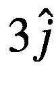
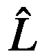

# 6.定义行为和检测碰撞

完成本章后，您将能够

*   实现自主行为，如锁定目标追逐和逐步转向

*   精确碰撞纹理物体

*   了解像素精确碰撞的效率问题

*   有效且高效地使用像素精确碰撞编程

## 介绍

至此，您的游戏引擎能够在方便的坐标系中实现游戏，并呈现和动画化视觉上吸引人的对象。然而，缺乏对对象行为的抽象支持。你可以在之前所有项目中的`MyGame`对象的`init()`和`update()`函数中看到这一缺点的直接结果:`init()`函数经常挤满了平凡的每游戏对象设置，而`update()`函数经常挤满了控制对象的条件语句，例如检查移动英雄的按键。

一个设计良好的系统应该用适当的面向对象的抽象或类来隐藏单个对象的初始化和控制。应该引入一个抽象的`GameObject`类来封装和隐藏其初始化和行为的细节。这种方法有两个主要优点。首先，游戏级别的`init()`和`update()`功能可以专注于管理单个游戏对象和这些对象的交互，而不与特定于不同类型对象的细节聚集在一起。第二，正如你已经体验过的`Renderable`和`SimpleShader`类的层次结构一样，适当的面向对象抽象创建了一个标准化的接口，并促进了代码的共享和重用。

当你从单纯的绘制对象(换句话说，`Renderable`)过渡到对对象的行为进行编程(换句话说，`GameObject`)时，你会立即注意到，为了让游戏变得有趣，对象需要进行交互。物体有趣的行为，比如面对或躲避敌人，往往需要知道游戏中其他物体的相对位置。一般来说，解析 2D 世界中所有物体的相对位置并不简单。幸运的是，典型的视频游戏只需要知道那些彼此非常接近或者将要碰撞或者已经碰撞的物体。

检测碰撞的一种有效但有些粗糙的近似方法是计算对象的边界，并基于碰撞边界框来近似对象碰撞。在最简单的情况下，边界框是边缘与 x/y 轴对齐的矩形框。这些被称为轴对齐边界框或 AABBs。由于轴对齐，检测两个 AABBs 何时重叠或何时将要发生碰撞在计算上是有效的。

许多 2D 游戏引擎还可以通过比较两个对象的像素位置并检测至少一个不透明像素重叠的情况，来检测两个纹理对象之间的实际碰撞。这种计算密集型过程称为逐像素精确碰撞检测、逐像素精确碰撞或逐像素碰撞。

本章首先介绍了`GameObject`类，它提供了一个抽象游戏对象行为的平台。然后将`GameObject`类一般化，引入常见的行为属性，包括速度、运动方向和锁定目标的追逐。本章的其余部分集中在派生一个有效的每像素精确碰撞实现，支持纹理和动画精灵对象。

## 游戏对象

如上所述，应该引入封装典型游戏对象的内在行为的抽象，以最小化游戏级别的`init()`和`update()`函数中的代码集群，并促进重用。本节介绍了简单的`GameObject`类，以说明干净整洁的`init()`和`update()`函数如何清晰地反映游戏中的逻辑，并演示抽象对象行为的基本平台如何促进设计和代码重用。

### 游戏对象项目

这个项目将简单的`GameObject`类定义为构建抽象的第一步，用游戏中的行为来表示实际的对象。你可以在图 [6-1](#Fig1) 中看到这个项目运行的例子。请注意，许多奴才从右向左冲锋，并在到达左边界时绕回。这个项目引导您创建基础设施来支持许多奴才，同时保持`MyGame`级别的逻辑简单。这个项目的源代码在`chapter6/6.1.game_objects`文件夹中定义。


图 6-1

运行游戏对象项目

该项目的控制措施如下:

*   **WASD 键**:上下左右移动英雄

该项目的目标如下:

*   开始定义`GameObject`类来封装游戏中的对象行为

*   演示如何创建`GameObject`类的子类以保持`MyGame`级`update()`函数的简单性

*   引入`GameObjectSet`类，展示对一组具有相同接口的同质对象的支持

您可以在`assets`文件夹中找到以下外部资源文件:`minion_sprite.png`；你还会找到包含默认系统字体的`fonts`文件夹。注意，如图 [6-2](#Fig2) 所示，`minion_sprite.png`图像文件已经从之前的项目更新为包含两个额外的 sprite 元素:`DyePack`和`Brain` minion。


图 6-2

`minion_sprite.png`图像的新 sprite 元素

#### 定义游戏对象类

目标是定义一个逻辑抽象来封装游戏中典型对象的所有相关行为特征，包括控制位置、绘图等的能力。就像前一章中的`Scene`对象一样，主要结果是提供了一个定义良好的接口来管理子类实现的功能。更复杂的行为将在下一节介绍。这个例子仅仅展示了定义了最少行为的`GameObject`类的潜力。

1.  添加一个新的文件夹`src/engine/game_objects`，用于存储与`GameObject`相关的文件。

2.  在该文件夹中创建一个新文件，将其命名为`game_object.js`，并添加以下代码:

```js
class GameObject {
    constructor(renderable) {
        this.mRenderComponent = renderable;
    }

    getXform() { return this.mRenderComponent.getXform(); }

    getRenderable() { return this.mRenderComponent; }

    update() {  }

    draw(aCamera) {
        this.mRenderComponent.draw(aCamera);
    }
}

export default GameObject;

```

定义了`Renderable`和`Transform`对象的评估者后，所有的`GameObject`实例都可以被绘制出来，并具有定义的位置和大小。请注意，`update()`函数是为子类设计的，可以覆盖特定于对象的行为，因此，它是空的。

#### 管理集合中的游戏对象

因为大多数游戏由许多交互对象组成，所以定义一个实用程序类来支持使用一组`GameObject`实例是很有用的:

1.  在`src/engine/game_objects`文件夹中创建一个新文件，并将其命名为`game_object_set.js`。定义`GameObjectSet`类和构造函数来初始化保存`GameObject`实例的数组。

1.  定义用于管理集合成员资格的函数:

```js
class GameObjectSet {
    constructor() {
        this.mSet = [];
    }

... implementation to follow ...

export default GameObjectSet;

```

1.  定义函数来更新和绘制集合中的每个`GameObject`实例:

```js
size() { return this.mSet.length; }
getObjectAt(index) { return this.mSet[index]; }
addToSet(obj) { this.mSet.push(obj); }
removeFromSet(obj) {
    let index = this.mSet.indexOf(obj);
    if (index > -1)
        this.mSet.splice(index, 1);
}

```

```js
update() {
    let i;
    for (i = 0; i < this.mSet.length; i++) {
        this.mSet[i].update();
    }
}

draw(aCamera) {
    let i;
    for (i = 0; i < this.mSet.length; i++) {
        this.mSet[i].draw(aCamera);
    }
}

```

#### 将类导出到客户端

将任何新功能集成到引擎中的最后一步涉及修改引擎访问文件`index.js`。编辑`index.js`并添加以下导入和导出语句，以授予客户端对`GameObject`和`GameObjectSet`类的访问权限:

```js
... identical to previous code ...

// game objects
import GameObject from "./game_objects/game_object.js";
import GameObjectSet from "./game_objects/game_object_set.js";

... identical to previous code ...

export default {
    ... identical to previous code ...

    // Game Objects
    GameObject, GameObjectSet,

    ... identical to previous code ...
}

```

Note

对于每个新定义的功能，必须重复通过引擎访问文件`index.js`导入/导出类的过程。从今以后，将只提供一个提醒，简单的代码更改将不再显示。

#### 测试游戏对象和游戏对象集

这个项目的目标是确保新的`GameObject`类的正常运行，演示单个对象类型的行为定制，并观察一个更清晰的`MyGame`实现，清楚地反映游戏中的逻辑。为了实现这些目标，定义了三种对象类型:`DyePack`、`Hero`和`Minion`。在开始研究这些对象的详细实现之前，遵循良好的源代码组织实践，创建一个新文件夹`src/my_game/objects`来存储新的对象类型。

##### 迪埃帕克游戏对象

`DyePack`类从`GameObject`类派生而来，演示了最基本的`GameObject`的例子:一个没有任何行为的对象，它只是被绘制到屏幕上。

在`src/my_game/objects`文件夹中创建一个新文件，并将其命名为`dye_pack.js`。从引擎访问文件`index.js`导入，获得游戏引擎的所有访问功能。将`DyePack`定义为`GameObject`的子类，并如下实现构造函数:

```js
import engine from "../../engine/index.js";
class DyePack extends engine.GameObject {
    constructor(spriteTexture) {
        super(null);
        this.kRefWidth = 80;
        this.kRefHeight = 130;
        this.mRenderComponent =
                             new engine.SpriteRenderable(spriteTexture);
        this.mRenderComponent.setColor([1, 1, 1, 0.1]);
        this.mRenderComponent.getXform().setPosition(50, 33);
        this.mRenderComponent.getXform().setSize(
                             this.kRefWidth / 50, this.kRefHeight / 50);
        this.mRenderComponent.setElementPixelPositions(510,595,23,153);
    }
}
export default DyePack;

```

注意，即使没有特定的行为，`DyePack`也在实现曾经在`MyGame`级别的`init()`函数中找到的代码。这样，`DyePack`对象隐藏了特定的几何信息，简化了`MyGame`层次。

Note

从引擎访问文件`index.js`导入的需要，几乎适用于所有的客户端源代码文件，在此不再赘述。

##### 英雄游戏对象

`Hero`类支持直接的用户键盘控制。这个对象演示了从`MyGame`的`update()`函数中隐藏游戏对象控制逻辑。

1.  在`src/my_game/objects`文件夹中创建一个新文件，并将其命名为`hero.js`。将`Hero`定义为`GameObject`的子类，并实现构造函数来初始化 sprite UV 值、大小和位置。请确保导出并共享此类。

1.  添加一个函数来支持通过用户键盘控制来更新这个对象。`Hero`对象根据键盘的 WASD 输入以`kDelta`速率移动。

```js
class Hero extends engine.GameObject {
    constructor(spriteTexture) {
        super(null);
        this.kDelta = 0.3;

        this.mRenderComponent =
                            new engine.SpriteRenderable(spriteTexture);
        this.mRenderComponent.setColor([1, 1, 1, 0]);
        this.mRenderComponent.getXform().setPosition(35, 50);
        this.mRenderComponent.getXform().setSize(9, 12);
        this.mRenderComponent.setElementPixelPositions(0, 120, 0, 180);
}

... implementation to follow ...

export default Hero;

```

```js
update() {
    // control by WASD
    let xform = this.getXform();
    if (engine.input.isKeyPressed(engine.input.keys.W)) {
        xform.incYPosBy(this.kDelta);
    }
    if (engine.input.isKeyPressed(engine.input.keys.S)) {
        xform.incYPosBy(-this.kDelta);
    }
    if (engine.input.isKeyPressed(engine.input.keys.A)) {
        xform.incXPosBy(-this.kDelta);
    }
    if (engine.input.isKeyPressed(engine.input.keys.D)) {
            xform.incXPosBy(this.kDelta);
    }
}

```

##### 迷你游戏对象

`Minion`类演示了简单的自主行为也可以被隐藏:

1.  在`src/my_game/objects`文件夹中创建一个新文件，并将其命名为`minion.js`。将`Minion`定义为`GameObject`的子类，并实现构造函数来初始化精灵 UV 值、精灵动画参数、大小和位置，如下所示:

1.  添加一个函数来更新 sprite 动画，支持简单的从右向左移动，并提供包装功能:

```js
class Minion extends engine.GameObject {
    constructor(spriteTexture, atY) {
        super(null);
        this.kDelta = 0.2;

        this.mRenderComponent =
                      new engine.SpriteAnimateRenderable(spriteTexture);

        this.mRenderComponent.setColor([1, 1, 1, 0]);
        this.mRenderComponent.getXform().setPosition(
                                              Math.random() * 100, atY);
        this.mRenderComponent.getXform().setSize(12, 9.6);
        // first element pixel position: top-left 512 is top of image
        // 0 is left of the image
        this.mRenderComponent.setSpriteSequence(512, 0,
            204, 164,   // width x height in pixels
            5,          // number of elements in this sequence
            0);         // horizontal padding in between
        this.mRenderComponent.setAnimationType(
                                          engine.eAnimationType.eSwing);
        this.mRenderComponent.setAnimationSpeed(15);
        // show each element for mAnimSpeed updates
    }

    ... implementation to follow ...

}
export default Minion;

```

```js
update() {
    // remember to update this.mRenderComponent's animation
    this.mRenderComponent.updateAnimation();

    // move towards the left and wraps
    let xform = this.getXform();
    xform.incXPosBy(-this.kDelta);

    // if fly off to the left, re-appear at the right
    if (xform.getXPos() < 0) {
        xform.setXPos(100);
        xform.setYPos(65 * Math.random());
    }
}

```

##### 我的游戏场景

和所有情况一样，`MyGame`级别在`my_game.js`文件中实现。定义了三个特定的`GameObject`子类后，按照以下步骤操作:

1.  除了引擎访问文件`index.js`，为了访问新定义的对象，必须导入相应的源代码:

```js
import engine from "../engine/index.js";

// user stuff
import DyePack from "./objects/dye_pack.js";
import Minion from "./objects/minion.js";
import Hero from "./objects/hero.js";

```

Note

与其他导入/导出报表的情况一样，除非有其他特定原因，否则不会再次显示此提醒。

1.  构造函数和`load()`、`unload()`以及`draw()`函数与前面项目中的类似，所以这里不显示细节。

2.  编辑`init()`函数并添加以下代码:

```js
init() {
    ... identical to previous code ...

    // Step B: The dye pack: simply another GameObject
    this.mDyePack = new DyePack(this.kMinionSprite);

    // Step C: A set of Minions
    this.mMinionset = new engine.GameObjectSet();
    let i = 0, randomY, aMinion;
    // create 5 minions at random Y values
    for (i = 0; i < 5; i++) {
        randomY = Math.random() * 65;
        aMinion = new Minion(this.kMinionSprite, randomY);
        this.mMinionset.addToSet(aMinion);
    }

    // Step D: Create the hero object
    this.mHero = new Hero(this.kMinionSprite);

    // Step E: Create and initialize message output
    this.mMsg = new engine.FontRenderable("Status Message");
    this.mMsg.setColor([0, 0, 0, 1]);
    this.mMsg.getXform().setPosition(1, 2);
    this.mMsg.setTextHeight(3);
}

```

步骤 A 的细节，即相机的创建和背景色的初始化，没有显示出来，因为它们与前面的项目相同。步骤 B、C 和 D 显示了三种对象类型的实例化，步骤 C 显示了从右向左移动的`Minion`对象的创建和插入到`mMinionset`中，这是`GameObjectSet`类的一个实例。请注意，`init()`函数不需要设置每个对象的纹理、几何图形等。

1.  编辑`update()`功能更新游戏状态:

```js
update() {
    this.mHero.update();
    this.mMinionset.update();
    this.mDyePack.update();
}

```

抽象出每个对象类型的明确定义的行为后，clean `update()`函数清楚地显示出游戏由三个不交互的对象组成。

#### 观察

现在你可以运行这个项目了，你会注意到六个小喽啰稍微复杂一点的动作是用更加简洁的`init()`和`update()`函数完成的。`init()`功能仅包括在游戏世界中放置创建的对象的逻辑和控制，不包括不同对象类型的任何特定设置。随着`Minion`对象在它自己的`update()`函数中定义它的运动行为，`MyGame update()`函数中的逻辑可以关注关卡的细节。注意，这个函数的结构清楚地表明，这三个对象是独立更新的，彼此之间没有交互。

Note

在本书中，几乎在所有情况下，`MyGame`类都是为了展示引擎功能而设计的。因此，大多数`MyGame`类中的源代码组织可能并不代表实现游戏的最佳实践。

## 创建追逐行为

对前一个项目的进一步研究表明，尽管有相当多的小黄人在屏幕上移动，但他们的动作简单而乏味。即使在速度和方向上有变化，这些动作也没有目的，也不知道场景中的其他游戏对象。为了支持更复杂或有趣的运动，`GameObject`需要知道其他物体的位置，并根据这些信息确定运动。

追逐行为就是这样一个例子。追逐对象的目标通常是抓住它所瞄准的游戏对象。这需要对追踪者的前方方向和速度进行程序化的操作，这样它就能锁定目标。然而，通常重要的是避免实现一个具有完美目标并且总是击中目标的追逐者——因为如果玩家无法避免被击中，游戏将变得不可能的困难。尽管如此，这并不意味着如果你的游戏设计需要的话，你不应该实现一个完美的追逐者。您将在下一个项目中实现一个追赶器。

向量和相关操作是实现对象运动和行为的基础。在用向量编程之前，先快速回顾一下。与矩阵和变换运算符的情况一样，下面的讨论并不意味着对向量的全面覆盖。相反，重点是应用与游戏引擎实现相关的少量概念。这不是对数学背后的理论的研究。如果你对向量的细节以及它们与游戏的关系感兴趣，请参考第 [1](01.html) 章中的讨论，在那里你可以通过钻研线性代数和游戏的相关书籍来深入了解这些主题。

### 媒介评论

向量被用于许多研究领域，包括数学、物理、计算机科学和工程。它们在游戏中特别重要；几乎每个游戏都以这样或那样的方式使用向量。因为它们被广泛使用，这一节将致力于理解和利用游戏中的向量。

Note

对于向量的介绍和全面覆盖，可以参考 [`www.storyofmathematics.com/vectors`](http://www.storyofmathematics.com/vectors) 。关于游戏中矢量应用的更详细报道，可以参考【Unity 3D 游戏开发的基础数学:数学基础初学者指南，Apress，2019。

向量最常见的用途之一是表示物体的位移和方向或速度。这很容易做到，因为向量是由其大小和方向定义的。仅使用这少量信息，您就可以表示物体的速度或加速度等属性。如果你有一个物体的位置、方向和速度，那么你就有足够的信息在游戏世界中移动它，而不需要用户输入。

在进一步讨论之前，回顾一下向量的概念是很重要的，从如何定义向量开始。可以使用两点来指定向量。例如给定任意位置*P*<sub>*a*</sub>=(*x*<sub>*a*</sub>，*y**a*)和*P*<sub>*b*</sub>=(*x*<sub>*b*</sub>， *y 可以将从 *P* <sub>*a*</sub> 到 *P* <sub>*b*</sub> 或的向量定义为*P*<sub>*b*</sub>—*P*<sub>*a*</sub>。 你可以在下面的等式和图 [6-3](#Fig3) 中看到这一点:*


图 6-3

由两点定义的向量

*   *P*<sub>T3a</sub>=(*x*<sub>*a*</sub>， *y* <sub>*a*</sub> )

*   *P*<sub>T3】bT5】=(*x*<sub>*b*</sub>， *y* <sub>*b*</sub> )</sub>

*   

现在您有了一个向量，您可以很容易地确定它的长度(或大小)和方向。向量的长度等于创建它的两点之间的距离。在这个例子中，的长度等于 *P* <sub>* a *</sub> 和 *P* <sub>* b *</sub> 之间的距离，而的方向则是从 *P* <sub>* a *</sub> 朝向 *P* <sub>* b *</sub> 。

Note

向量的大小通常被称为其长度或*大小*。

在`gl-matrix`库中，`vec2`对象实现了 2D 向量的功能。方便的是，你也可以使用`vec2`物体来代表空间中的 2D 点或位置。在前面的例子中， *P* <sub>*a*</sub> ， *P* <sub>*b*</sub> ，都可以实现为`vec2`对象的实例。然而，是数学上唯一定义的向量。 *P* <sub>* a *</sub> 和 *P* <sub>* b *</sub> 代表用来创建矢量的位置或点。

回想一下，向量也可以归一化。一个*归一化的*向量(也称为*单位向量*)的大小总是为 1。通过下面的函数可以看到一个归一化的矢量，如图 [6-4](#Fig4) 所示。注意，常规向量的数学符号是，归一化向量的数学符号是:


图 6-4

被标准化的向量

*   :归一化矢量，并将结果存储到`vec2`对象

到一个位置的向量也可以旋转。例如，如果矢量表示从原点到位置的方向( *x* <sub>* v *</sub> ， *y* <sub>* v *</sub> )，你想把它旋转θ，那么，如图 [6-5](#Fig5) 所示，你可以用下面的等式导出 *x* <sub>* r *</sub> 和*y*

 *

图 6-5

从原点到位置( *x* <sub>*v*</sub> ， *y* <sub>*v*</sub> )旋转角度θ的向量

*   *x*<sub>【r】</sub>=*<sub>*【v】*</sub>*【θ】t13】**

*   *和*<sub>【r】</sub>=*<sub>*【v】*</sub>【sin】*

*Note

JavaScript 三角函数，包括`Math.sin()`和`Math.cos()`函数，假设输入是弧度而不是角度。回想一下，1 度等于弧度。

记住向量是由它们的方向和大小定义的，这一点很重要。换句话说，两个向量可以彼此相等，而与向量的位置无关。图 [6-6](#Fig6) 显示了两个矢量和，它们位于不同的位置，但方向和大小相同，因此相等。相比之下，矢量并不相同，因为它的方向和大小与其他矢量不同。


图 6-6

2D 空间中的三个向量，其中两个向量相等

#### 点积

两个归一化向量的点积为您提供了一种方法，可以找到这两个向量之间的角度。例如，假设如下:

*   

*   

那么下面是真的:

*   。

此外，如果向量和都被归一化，则

*   

图 [6-7](#Fig7) 描绘了和向量之间有一个角度 *θ* 的例子。同样重要的是要认识到，如果，那么这两个向量是垂直的。


图 6-7

两个向量之间的角度，可以通过点积找到

Note

如果需要复习或刷新点积的概念，请参考 [`www.mathsisfun.com/algebra/vectors-dot-product.html`](http://www.mathsisfun.com/algebra/vectors-dot-product.html) 。

#### 叉积

两个向量的叉积产生一个与两个原始向量*正交*的向量。在 2D 游戏中，2D 维度平放在屏幕上，叉积的结果是一个指向内(朝向屏幕)或外(远离屏幕)的向量。这可能看起来很奇怪，因为在 2D 或 x/y 平面上交叉两个向量会产生一个位于第三维或沿 z 轴的向量，这并不直观。然而，在第三维空间中产生的矢量携带着重要的信息。例如，这个向量在第三维中的方向可以用来确定游戏对象需要顺时针还是逆时针方向旋转。仔细看看以下内容:

*   

*   

鉴于上述情况，以下情况属实:

*   是垂直于和的向量。

此外，您知道 x/y 平面上两个向量的叉积会产生 z 方向的向量。当时，你知道是从顺时针方向，同样，当时，你知道是逆时针方向。图 [6-8](#Fig8) 应该有助于澄清这个概念。


图 6-8

两个向量的叉积

Note

如果需要回顾或刷新交叉产品的概念，请参考 [`www.mathsisfun.com/algebra/vectors-cross-product.html`](http://www.mathsisfun.com/algebra/vectors-cross-product.html) 。

### 前沿与追逐项目

这个项目实现了更有趣、更复杂的行为，这些行为基于已经被回顾过的向量概念。你将体验定义和改变一个对象的正面方向，并引导一个对象在场景中追逐另一个对象的过程，而不是恒定和无目的的运动。你可以在图 [6-9](#Fig9) 中看到这个项目运行的例子。这个项目的源代码在`chapter6/6.2.front_and_chase`文件夹中定义。


图 6-9

运行前端和追踪项目

该项目的控制措施如下:

*   **WASD 键**:移动`Hero`对象

*   **左/右箭头键**:在用户控制下改变`Brain`对象的前方方向

*   **上下箭头键**:增加/减少`Brain`物体的速度

*   **H 键**:将`Brain`对象切换到用户箭头键控制下

*   **J 键**:切换`Brain`对象始终指向并向当前`Hero`对象位置移动

*   **K 键**:切换`Brain`物体转向并逐渐向当前`Hero`物体位置移动

该项目的目标如下:

*   体验工作的速度和方向

*   练习沿着预先定义的方向行进

*   用矢量点积和叉积实现算法

*   检查和实施追逐行为

您可以在`assets`文件夹中找到与上一个项目相同的外部资源文件。

#### 将矢量旋转添加到 gl 矩阵库中

`gl-matrix`库不支持旋转 2D 空间中的位置。这可以通过将以下代码添加到`lib`文件夹中的`gl-matrix.js`文件来纠正:

```js
vec2.rotate = function(out, a, c){
    var r=[];
    // perform rotation
    r[0] = a[0]*Math.cos(c) - a[1]*Math.sin(c);
    r[1] = a[0]*Math.sin(c) + a[1]*Math.cos(c);
    out[0] = r[0];
    out[1] = r[1];
    return r;
};

```

Note

从现在开始，对`gl-matrix`库的修改必须出现在所有项目中。

#### 修改游戏对象以支持有趣的行为

`GameObject`类抽象并实现所需的新对象行为:

1.  编辑`game_object.js`文件并修改`GameObject`构造函数以定义可见度、前方方向和速度:

1.  为实例变量添加评估器和设置器函数:

```js
constructor(renderable) {
    this.mRenderComponent = renderable;
    this.mVisible = true;
    this.mCurrentFrontDir = vec2.fromValues(0, 1); // front direction
    this.mSpeed = 0;
}

```

1.  执行一个功能，将前方旋转到一个位置，`p`:

```js
getXform() { return this.mRenderComponent.getXform(); }

setVisibility(f) { this.mVisible = f; }
isVisible() { return this.mVisible; }

setSpeed(s) { this.mSpeed = s; }
getSpeed() { return this.mSpeed; }
incSpeedBy(delta) { this.mSpeed += delta; }

setCurrentFrontDir(f) { vec2.normalize(this.mCurrentFrontDir, f); }
getCurrentFrontDir() { return this.mCurrentFrontDir; }

getRenderable() { return this.mRenderComponent; }

```

```js
rotateObjPointTo(p, rate) {
    // Step A: determine if reached the destination position p
    let dir = [];
    vec2.sub(dir, p, this.getXform().getPosition());
    let len = vec2.length(dir);
    if (len < Number.MIN_VALUE) {
        return; // we are there.
    }
    vec2.scale(dir, dir, 1 / len);

    // Step B: compute the angle to rotate
    let fdir = this.getCurrentFrontDir();
    let cosTheta = vec2.dot(dir, fdir);

    if (cosTheta > 0.999999) { // almost exactly the same direction
        return;
    }

    // Step C: clamp the cosTheta to -1 to 1
    // in a perfect world, this would never happen! BUT ...
    if (cosTheta > 1) {
        cosTheta = 1;
    } else {
        if (cosTheta < -1) {
            cosTheta = -1;
        }
    }

    // Step D: compute whether to rotate clockwise, or counterclockwise
    let dir3d = vec3.fromValues(dir[0], dir[1], 0);
    let f3d = vec3.fromValues(fdir[0], fdir[1], 0);
    let r3d = [];
    vec3.cross(r3d, f3d, dir3d);

    let rad = Math.acos(cosTheta);  // radian to roate
    if (r3d[2] < 0) {
        rad = -rad;
    }

    // Step E: rotate the facing direction with the angle and rate
    rad *= rate;  // actual angle need to rotate from Obj's front
    vec2.rotate(this.getCurrentFrontDir(),this.getCurrentFrontDir(),rad);
    this.getXform().incRotationByRad(rad);
}

```

`rotateObjPointTo()`功能以参数`rate`指定的速率旋转`mCurrentFrontDir`指向目的位置`p`。以下是每个操作的详细信息:


图 6-10

一个游戏对象(`Brain`)追逐一个目标(`Hero`)

1.  步骤 A 计算当前对象和目的位置`p`之间的距离。如果该值很小，则意味着当前对象和目标位置很接近。函数返回，不做进一步处理。

2.  步骤 B，如图 [6-10](#Fig10) 所示，计算点积，确定物体当前前方方向(`fdir`)与朝向目的位置方向`p` ( `dir`)之间的角度θ。如果这两个向量指向相同的方向(cosθ几乎为 1 或θ几乎为零)，则函数返回。

1.  添加一个函数，用物体的方向和速度更新物体的位置。注意，如果`mCurrentFrontDir`被`rotateObjPointTo()`函数修改，那么这个`update()`函数将把对象移向目标位置`p`，对象将表现得好像在追逐目标。

1.  步骤 C 检查`cosTheta`的范围。由于 JavaScript 中浮点运算的不准确性，这是必须执行的步骤。

2.  步骤 D 使用叉积的结果来确定当前的`GameObject`应该顺时针还是逆时针转动以朝向目的位置`p`。

3.  步骤 E 旋转`mCurrentFrontDir`并在`Renderable`对象的`Transform`中设置旋转。识别两个独立的对象旋转控件非常重要。`Transform`控制被画物体的旋转，`mCurrentFrontDir`控制行进方向。在这种情况下，两者是同步的，因此必须同时用新值更新。

1.  添加一个基于可见性设置绘制对象的函数:

```js
update() {
    // simple default behavior
    let pos = this.getXform().getPosition();
    vec2.scaleAndAdd(pos, pos,this.getCurrentFrontDir(),this.getSpeed());
}

```

```js
draw(aCamera) {
    if (this.isVisible()) {
        this.mRenderComponent.draw(aCamera);
    }
}

```

#### 测试追踪功能

这个测试用例的策略和目标是创建一个可操纵的`Brain`对象来演示沿着预定义的前方方向行进，并引导`Brain`去追逐`Hero`来演示追逐功能。

##### 定义大脑游戏对象

`Brain`对象将在用户左/右箭头键的控制下沿其前方方向移动，以进行转向:

1.  在`src/my_game/objects`文件夹中创建一个新文件，并将其命名为`brain.js`。将`Brain`定义为`GameObject`的子类，实现构造函数初始化外观和行为参数。

1.  超越`update()`功能，支持用户转向和控制速度。注意，必须调用`GameObject`中默认的`update()`函数，以支持物体根据其速度沿前方的基本移动。

```js
class Brain extends engine.GameObject {
    constructor(spriteTexture) {
        super(null);
        this.kDeltaDegree = 1;
        this.kDeltaRad = Math.PI * this.kDeltaDegree / 180;
        this.kDeltaSpeed = 0.01;
        this.mRenderComponent =
                              new engine.SpriteRenderable(spriteTexture);
        this.mRenderComponent.setColor([1, 1, 1, 0]);
        this.mRenderComponent.getXform().setPosition(50, 10);
        this.mRenderComponent.getXform().setSize(3, 5.4);
        this.mRenderComponent.setElementPixelPositions(600, 700, 0, 180);

        this.setSpeed(0.05);
    }

    ... implementation to follow ...
}
export default Brain;

```

```js
update() {
    super.update();
    let xf = this.getXform();
    let fdir = this.getCurrentFrontDir();
    if (engine.input.isKeyPressed(engine.input.keys.Left)) {
        xf.incRotationByDegree(this.kDeltaDegree);
        vec2.rotate(fdir, fdir, this.kDeltaRad);
    }
    if (engine.input.isKeyPressed(engine.input.keys.Right)) {
        xf.incRotationByRad(-this.kDeltaRad);
        vec2.rotate(fdir, fdir, -this.kDeltaRad);
    }
    if (engine.input.isKeyClicked(engine.input.keys.Up)) {
        this.incSpeedBy(this.kDeltaSpeed);
    }
    if (engine.input.isKeyClicked(engine.input.keys.Down)) {
        this.incSpeedBy(-this.kDeltaSpeed);
    }
}

```

##### 我的游戏场景

修改`MyGame`场景来测试`Brain`物体的移动。在这种情况下，除了`update()`函数之外，`my_game.js`中的其余源代码与之前的项目类似。因此，只显示了`update()`功能的细节:

```js
update() {
    let msg = "Brain [H:keys J:imm K:gradual]: ";
    let rate = 1;

    this.mHero.update();

    switch (this.mMode) {
        case 'H':
            this.mBrain.update();  // player steers with arrow keys
            break;
        case 'K':
            rate = 0.02;    // gradual rate
            // In gradual mode, the following should also be executed
        case 'J':
            this.mBrain.rotateObjPointTo(
                this.mHero.getXform().getPosition(), rate);

            // the default GameObject: only move forward
            engine.GameObject.prototype.update.call(this.mBrain);
            break;
        }

    if (engine.input.isKeyClicked(engine.input.keys.H)) {
        this.mMode = 'H';
    }
    if (engine.input.isKeyClicked(engine.input.keys.J)) {
        this.mMode = 'J';
    }
    if (engine.input.isKeyClicked(engine.input.keys.K)) {
        this.mMode = 'K';
    }
    this.mMsg.setText(msg + this.mMode);
}

```

在`update()`函数中，`switch`语句使用`mMode`来决定如何更新`Brain`对象。在`J`和`K`模式下，`Brain`对象通过`rotateObjPointTo()`函数调用转向`Hero`对象位置。在`H`模式下，调用`Brain`对象的`update()`函数，让用户用箭头键操纵对象。最后三个`if`语句只是根据用户输入设置`mMode`变量。

注意在`J`和`K`模式下，为了绕过`rotateObjPointTo()`后的用户控制逻辑，被调用的`update()`函数是由`GameObject`定义的函数，而不是由`Brain`定义的函数。

Note

JavaScript 语法`ClassName.prototype.FunctionName.call(anObj)`调用由`ClassName`定义的`FunctionName`，其中`anObj`是`ClassName`的子类。

#### 观察

您现在可以尝试运行该项目。最初，`Brain`对象处于用户的控制之下。您可以使用左箭头键和右箭头键来改变`Brain`对象的前方方向，并体验操纵该对象。按下`J`键会导致`Brain`对象立即指向并移向`Hero`对象。这是默认转弯`rate`值为 1.0 的结果。`K`键导致更自然的行为，其中`Brain`对象继续向前移动，并逐渐转向向`Hero`对象移动。随意更改`rate`变量的值或修改`Brain`对象的控制值。例如，更改`kDeltaRad`或`kDeltaSpeed`来试验不同的行为设置。

## 游戏对象之间的碰撞

在之前的项目中，`Brain`物体永远不会停止移动。注意在`J`和`K`模式下，`Brain`物体到达目标位置时会绕轨道运行或快速翻转方向。`Brain`物体失去了检测到它与`Hero`物体相撞的关键能力，因此，它永远不会停止移动。本节描述了轴对齐包围盒(AABBs)，它是用于近似物体碰撞的最直接的工具之一，并演示了基于 AABB 的碰撞检测的实现。

### 轴对齐的边界框(AABB)

AABB 是一个 x/y 轴对齐的矩形框，它限定了给定对象的边界。术语 *x/y 轴对齐*是指 AABB 的四条边平行于水平 x 轴或垂直 y 轴。图 [6-11](#Fig11) 显示了一个用左下角(`mLL`)、宽度和高度表示`Hero`对象边界的例子。这是表示 AABB 的一种相当常见的方式，因为它仅使用一个位置和两个浮点数来表示维度。


图 6-11

对象边界的左下角和大小

有趣的是，除了表示对象的边界，边界框还可以用来表示任何给定矩形区域的边界。例如，回想一下通过`Camera`可见的 WC 是一个矩形区域，相机的位置位于中心，WC 的宽度/高度由游戏开发者定义。可以定义一个 AABB 来表示可见的 WC 矩形区域或 WC 窗口，并用于检测 WC 窗口和游戏世界中的`GameObject`实例之间的碰撞。

Note

在本书中，AABB 和“边界框”可以互换使用。

### 边界框和碰撞项目

这个项目演示了如何为一个`GameObject`实例定义一个边界框，并根据它们的边界框检测两个`GameObject`实例之间的冲突。重要的是要记住，边界框是轴对齐的，因此，本节介绍的解决方案不支持旋转对象之间的碰撞检测。你可以在图 [6-12](#Fig12) 中看到这个项目运行的例子。这个项目的源代码在`chapter6/6.3.bbox_and_collisions`文件夹中定义。


图 6-12

运行边界框和碰撞项目

该项目的控件与之前的项目相同:

*   **WASD 键**:移动`Hero`对象

*   **左/右箭头键**:在用户控制下改变`Brain`对象的前方方向

*   **上下箭头键**:增加/减少`Brain`物体的速度

*   **H 键**:将`Brain`对象切换到用户箭头键控制下

*   **J 键**:切换`Brain`对象始终指向并向当前`Hero`对象位置移动

*   **K 键**:切换`Brain`物体转向并逐渐向当前`Hero`物体位置移动

该项目的目标如下:

*   理解边界框类的实现

*   体验使用`GameObject`实例的边界框

*   计算并使用`Camera` WC 窗口的边界

*   使用对象碰撞和对象与摄影机 WC 窗口碰撞进行编程

您可以在`assets`文件夹中找到与上一个项目相同的外部资源文件。

#### 定义一个边界框类

定义一个`BoundingBox`类来表示矩形区域的边界:

1.  在`src/engine`文件夹中新建一个文件；命名为`bounding_box.js`。首先，定义一个枚举数据类型，其值标识边界框的冲突边。

```js
const eBoundCollideStatus = Object.freeze({
    eCollideLeft: 1,
    eCollideRight: 2,
    eCollideTop: 4,
    eCollideBottom: 8,
    eInside: 16,
    eOutside: 0
});

```

注意，每个枚举值只有一个非零位。这允许枚举值与按位“或”操作符组合来表示多边冲突。例如，如果一个对象同时与一个边界框的顶部和左侧发生碰撞，碰撞状态将为`eCollideLeft | eCollideTop = 1 | 4 = 5`。

1.  现在，用实例变量定义`BoundingBox`类和构造函数来表示一个边界，如图 [6-11](#Fig11) 所示。注意，`eBoundCollideStatus`也必须被导出，这样引擎的其他部分，包括客户端，也可以访问。

1.  `setBounds()`函数计算并设置边界框的实例变量:

```js
class BoundingBox {
    constructor(centerPos, w, h) {
        this.mLL = vec2.fromValues(0, 0);
        this.setBounds(centerPos, w, h);
    }

    ... implementation to follow ...
}

export {eBoundCollideStatus}
export default BoundingBox;

```

1.  定义一个函数来确定给定位置(x，y)是否在框的边界内:

```js
setBounds(centerPos, w, h) {
    this.mWidth = w;
    this.mHeight = h;
    this.mLL[0] = centerPos[0] - (w / 2);
    this.mLL[1] = centerPos[1] - (h / 2);
}

```

1.  定义一个函数来确定给定边界是否与当前边界相交:

```js
containsPoint(x, y) {
    return ((x > this.minX()) && (x < this.maxX()) &&
        (y > this.minY()) && (y < this.maxY()));
}

```

1.  定义一个函数来计算给定边界和当前边界之间的相交状态:

```js
intersectsBound(otherBound) {
    return ((this.minX() < otherBound.maxX()) &&
        (this.maxX() > otherBound.minX()) &&
        (this.minY() < otherBound.maxY()) &&
        (this.maxY() > otherBound.minY()));
}

```

```js
boundCollideStatus(otherBound) {
    let status = eBoundCollideStatus.eOutside;

    if (this.intersectsBound(otherBound)) {
        if (otherBound.minX() < this.minX()) {
            status |= eBoundCollideStatus.eCollideLeft;
        }
        if (otherBound.maxX() > this.maxX()) {
            status |= eBoundCollideStatus.eCollideRight;
        }
        if (otherBound.minY() < this.minY()) {
            status |= eBoundCollideStatus.eCollideBottom;
        }
        if (otherBound.maxY() > this.maxY()) {
            status |= eBoundCollideStatus.eCollideTop;
        }

        // if the bounds intersects and yet none of the sides overlaps
        // otherBound is completely inside thisBound
        if (status === eBoundCollideStatus.eOutside) {
            status = eBoundCollideStatus.eInside;
        }
    }
    return status;
}

```

请注意`intersectsBound()`和`boundCollideStatus()`函数之间微妙而重要的区别，前者只能返回一个`true`或`false`条件，而后者在返回的`status`中对冲突双方进行编码。

1.  实现将 X/Y 值返回到边界框的最小和最大边界的函数:

```js
minX() { return this.mLL[0]; }
maxX() { return this.mLL[0] + this.mWidth; }
minY() { return this.mLL[1]; }
maxY() { return this.mLL[1] + this.mHeight; }

```

最后，记得更新引擎访问文件`index.js`，以便将新定义的功能转发给客户端。

#### 使用引擎中的边界框

新定义的功能将用于检测对象之间以及对象和 WC 边界之间的碰撞。为了实现这一点，必须修改`GameObject`和`Camera`类。

1.  编辑`game_object.js`以导入新定义的功能并修改`GameObject`类；实现`getBBox()`函数返回未旋转的`Renderable`对象的边界框:

1.  编辑`camera.js`从边界框导入，修改`Camera`类计算`Transform`对象(通常在`Renderable`对象中定义)边界和 WC 窗口边界之间的碰撞状态:

```js
import BoundingBox from "../bounding_box.js";
class GameObject {
    ... identical to previous code ...
    getBBox() {
        let xform = this.getXform();
        let b = new BoundingBox(
                            xform.getPosition(),
                            xform.getWidth(),
                            xform.getHeight());
        return b;
    }
    ... identical to previous code ...
}

```

```js
import BoundingBox from "./bounding_box.js";
class Camera {
    ... identical to previous code ...
    collideWCBound(aXform, zone) {
        let bbox = new BoundingBox(
                            aXform.getPosition(),
                            aXform.getWidth(),
                            aXform.getHeight());
        let w = zone * this.getWCWidth();
        let h = zone * this.getWCHeight();
        let cameraBound = new BoundingBox(this.getWCCenter(), w, h);
        return cameraBound.boundCollideStatus(bbox);
    }
}

```

请注意，`zone`参数定义了应该在碰撞计算中使用的 WC 的相对大小。例如，`zone`值为 0.8 意味着根据当前 WC 窗口大小的 80%计算交叉点状态。图 [6-13](#Fig13) 显示了相机如何与物体碰撞。


图 6-13

`Camera` WC 边界与定义一个`Transform`对象的边界冲突

#### 用我的游戏测试边界框

这个测试用例的目标是验证在检测对象-对象和对象-摄像机相交时边界框实现的正确性。同样，除了`update()`函数之外，`my_game.js`文件中的大部分代码与前面的项目相似，这里不再重复。`update()`函数是对之前项目的修改，用来测试边界框的交叉点。

```js
update() {
    ... identical to previous code ...

    switch (this.mMode) {
        case 'H':
            this.mBrain.update();  // player steers with arrow keys
            break;
        case 'K':
            rate = 0.02;    // gradual rate
            // no break here on purpose
        case 'J':
            // stop the brain when it touches hero bound
            if (!hBbox.intersectsBound(bBbox)) {
                this.mBrain.rotateObjPointTo(
                        this.mHero.getXform().getPosition(), rate);
                // the default GameObject: only move forward
                engine.GameObject.prototype.update.call(this.mBrain);
            }
            break;
    }

    // Check for hero going outside 80% of the WC Window bound
    let status = this.mCamera.collideWCBound(this.mHero.getXform(), 0.8);

    ... identical to previous code ...

    this.mMsg.setText(msg + this.mMode + " [Hero bound=" + status + "]");
}

```

在`switch`语句的`J`和`K`情况下，在调用`Brain.rotateObjPointTo()`和`update()`导致追逐行为之前，修改测试`Brain`和`Hero`对象之间的包围盒碰撞。这样，`Brain`对象一碰到`Hero`对象的边界就会停止移动。此外，计算并显示`Hero`对象和 80%的摄像机 WC 窗口之间的碰撞结果。

#### 观察

现在，您可以运行项目并观察到`Brain`对象在自主模式(J 或 K 键)下，一接触到`Hero`对象就停止移动。当你四处移动`Hero`对象时，在`Hero`对象实际接触 WC 窗口边界之前，观察到`Hero bound`输出消息开始回应 WC 窗口碰撞。这是传递给`mCamera.collideWCBound()`函数的参数 0.8 或 80%的结果，将碰撞计算配置为当前 WC 窗口大小的 80%。当`Hero`对象完全在 WC 窗口边界的 80%以内时，输出`Hero` `bound`值为 16 或`eboundcollideStatus.eInside`的值。试着移动`Hero`物体接触窗口边界的顶部 20 %,观察`Hero bound`值 4 或`eboundcollideStatus.eCollideTop`值。现在将`Hero`对象移向窗口的左上角，观察`Hero bound`值 5 或`eboundcollideStatus.eCollideTop | eboundcollideStatus.eCollideLeft`。这样，碰撞状态是所有碰撞边界的按位或结果。

## 每像素碰撞

在前面的示例中，您看到了边界框碰撞近似的结果。也就是说，`Brain`对象的运动一与`Hero`对象的边界重叠就停止。这比最初的情况有了很大的改进，在最初的情况下，`Brain`物体永远不会停止移动。然而，如图 [6-14](#Fig14) 所示，基于边界框的碰撞有两个严重的限制。


图 6-14

基于边界框的碰撞限制

1.  在前一个例子中引入的`BoundingBox`对象不考虑旋转。这是 AABB 的一个众所周知的限制:尽管这种方法计算效率高，但它不支持旋转的对象。

2.  这两个物体实际上没有碰撞。两个物体的边界重叠的事实并不自动等同于两个物体的碰撞。

在本项目中，您将实现逐像素精确碰撞检测、逐像素精确碰撞检测或逐像素碰撞检测，以检测两个碰撞对象的不透明像素的重叠。然而，请记住，这是*而不是*一个终极解决方案。虽然每像素碰撞检测是精确的，但代价是潜在的性能成本。随着图像变得越来越大和越来越复杂，它也有更多的像素需要进行碰撞检查。这与包围盒碰撞检测所需的恒定计算成本形成对比。

### 每像素碰撞项目

这个项目演示了如何检测一个大的纹理对象，即`Collector` minion 和一个小的纹理对象，即`Portal` minion 之间的碰撞。这两种纹理都包含透明和不透明区域。只有当不透明像素重叠时，才会发生碰撞。在这个项目中，当碰撞发生时，一个黄色的`DyePack`出现在碰撞点。你可以在图 [6-15](#Fig15) 中看到这个项目运行的例子。这个项目的源代码在`chapter6/6.4.per_pixel_collisions`文件夹中定义。


图 6-15

运行逐像素碰撞项目

该项目的控制措施如下:

*   **箭头键:**移动小纹理对象，`Portal`宠臣

*   **WASD 键:**移动大型纹理对象，`Collector`爪牙

该项目的目标如下:

*   演示如何检测不透明像素重叠

*   为了理解使用逐像素精确碰撞检测的优点和缺点

Note

“透明”像素是一个你可以完全看透的像素，在这个引擎中，它的 alpha 值为 0。“不透明”像素的 alpha 值大于 0，或者该像素没有完全遮挡其后面的内容；它可能闭塞也可能不闭塞。“不透明”像素会遮挡其后面的内容，是“不透明的”，alpha 值为 1。例如，请注意您可以“透视”到`Portal`对象的顶部区域。这些像素是不透明的，但也不是不透明的，当根据项目定义的参数发生重叠时，应该会导致冲突。

您可以在`assets`文件夹中找到以下外部资源:包含默认系统字体的`fonts`文件夹、`minion_collector.png`、`minion_portal.png`和`minion_sprite.png`。注意`minion_collector.png`是大的，1024x1024 的图像，而`minion_portal.png`是小的，64x64 的图像；`minion_sprite.png`定义`DyePack` sprite 元素。

#### 逐像素碰撞算法概述

在继续之前，确定检测两个纹理对象之间的碰撞的要求很重要。最重要的是，纹理本身需要包含一个透明区域，以便这种类型的碰撞检测能够提高精确度。如果纹理中没有透明度，您可以并且应该使用简单的边界框碰撞检测。如果一个或两个纹理包含透明区域，那么你需要处理两种碰撞情况。第一种情况是检查两个对象的边界是否冲突。你可以在图 [6-16](#Fig16) 中看到这一点。请注意对象的边界是如何重叠的，然而没有一个不透明的彩色像素相接触。


图 6-16

没有实际碰撞的重叠边界框

下一种情况是检查纹理的不透明像素是否重叠。看一下图 [6-17](#Fig17) 。来自`Collector`和`Portal`对象纹理的不透明像素清楚地彼此接触。


图 6-17

大纹理和小纹理之间发生像素冲突

既然问题已经明确定义，下面是每像素精确碰撞检测的逻辑或伪代码:

```js
Given two images, Image-A and Image-B
If the bounds of the two collide then
    For each Pixel-A in Image-A
        If Pixel-A is not completely transparent
            pixelCameraSpace = Pixel-A position in camera space
            Transform pixelCameraSpace to Image-B space
            Read Pixel-B from Image-B
            If Pixel-B is not completely transparent then
                A collision has occurred

```

需要从`pixelCameraSpace`到 Image-B 空间的逐像素转换，因为碰撞检查必须在相同的坐标空间内进行。

请注意，在算法中，图像 A 和图像 B 是可交换的。也就是说，当测试两个图像之间的冲突时，哪个图像是图像 A 还是图像 b 并不重要。冲突结果将是相同的。这两幅图像要么重叠，要么不重叠。另外，注意这个算法的运行时间。必须处理图像 A 中的每个像素；因此，运行时间是 O(N)，其中 N 是 Image-A 或 Image-A 的分辨率中的像素数。出于这个原因，出于性能原因，选择两个图像中较小的一个(本例中为`Portal` minion)作为 Image-A 是很重要的。

此时，您可能会明白为什么像素精确碰撞检测的性能令人担忧。在每次更新许多高分辨率纹理时检查这些碰撞会很快降低性能。现在，您可以检查每像素精确碰撞的实现了。

#### 修改纹理以颜色数组的形式加载纹理

回想一下,`Texture`组件从服务器文件系统读取图像文件，将图像加载到 GPU 内存，并将图像处理成 WebGL 纹理。通过这种方式，纹理图像存储在 GPU 上，并且不能被运行在 CPU 上的游戏引擎访问。为了支持逐像素碰撞检测，必须从 GPU 中检索颜色信息，并将其存储在 CPU 中。可以修改`Texture`组件来支持这个需求。

1.  在`texture.js`文件中，扩展`TextureInfo`对象以包含一个新变量，用于存储文件纹理的颜色数组:

1.  定义并导出从 GPU 内存中检索颜色数组的函数:

```js
class TextureInfo {
    constructor(w, h, id) {
        this.mWidth = w;
        this.mHeight = h;
        this.mGLTexID = id;
        this.mColorArray = null;
    }
}

```

```js
function getColorArray(textureName) {
    let gl = glSys.get();
    let texInfo = get(textureName);
    if (texInfo.mColorArray === null) {
        // create framebuffer bind to texture and read the color content
        let fb = gl.createFramebuffer();
        gl.bindFramebuffer(gl.FRAMEBUFFER, fb);
        gl.framebufferTexture2D(gl.FRAMEBUFFER,
                          gl.COLOR_ATTACHMENT0,
                          gl.TEXTURE_2D, texInfo.mGLTexID, 0);
        if (gl.checkFramebufferStatus(gl.FRAMEBUFFER) ===
            gl.FRAMEBUFFER_COMPLETE) {
            let pixels = new Uint8Array(
                          texInfo.mWidth * texInfo.mHeight * 4);
            gl.readPixels(0, 0, texInfo.mWidth, texInfo.mHeight,
                gl.RGBA, gl.UNSIGNED_BYTE, pixels);
            texInfo.mColorArray = pixels;
        } else {
            throw new Error("...");
            return null;
        }
        gl.bindFramebuffer(gl.FRAMEBUFFER, null);
        gl.deleteFramebuffer(fb);
    }
    return texInfo.mColorArray;
}

export {has, get, load, unload,

    TextureInfo,

    activate, deactivate,

    getColorArray
}

```

`getColorArray()`函数创建一个 WebGL `FRAMEBUFFER`，用所需的纹理填充缓冲区，并将缓冲区内容检索到由`texInfo.mColorArray`引用的 CPU 内存中。

#### 修改 TextureRenderable 以支持逐像素冲突

`TextureRenderable`是最适合实现逐像素碰撞功能的类。这是因为`TextureRenderable`是所有渲染纹理的类的基类。在这个基类中实现意味着所有子类都可以继承这个功能，只需做很少的额外修改。

随着`TextureRenderable`类功能的增加，实现源代码的复杂性和规模也会增加。为了可读性和可扩展性，保持源代码文件的大小很重要。一种有效的方法是根据功能将一个类的源代码分成多个文件。

##### 组织源代码

在下面的步骤中，`TextureRenderable`类将被分成三个源代码文件:`texture_renderable_main.js`用于实现以前项目的基本功能，`texture_renderable_pixel_collision.js`用于实现新引入的每像素精确碰撞，`texture_renderable.js`用作类访问点。

1.  重命名`texture_renderable.js`。到`texture_renderable_main.js`。这个文件定义了`TextureRenderable`类的基本功能。

2.  在`src/engine/renderables`中创建一个新文件，命名为`texture_renderable_pixel_collision.js`。这个文件将用于扩展`TextureRenderable`类的功能，以支持每像素精确的碰撞。添加以下代码，从`Texture`模块和基本的`TextureRenderable`类导入，并重新导出`TextureRenderable`类。目前，这个文件没有任何用途；您将在下面的小节中添加适当的扩展函数。

1.  通过添加以下代码，创建一个新的`texture_renderable.js`文件作为`TextureRenderable`访问点:

```js
"use strict";
import TextureRenderable from "./texture_renderable_main.js";
import * as texture from "../resources/texture.js";

... implementation to follow ...

export default TextureRenderable;

```

```js
"use strict";
import TextureRenderable from "./ texture_renderable_pixel_collision.js";
export default TextureRenderable;

```

有了这个结构，`texture_renderable_main.js`文件实现了所有的基本功能，并导出到`texture_renderable_pixel_collision.js`，后者将附加的功能添加到`TextureRenderable`类中。最后，`texture_renderable.js`从`texture_renderable_pixel_collision.js`导入扩展功能。`TextureRenderable`类的用户可以简单地从`texture_renderable.js`导入，并且可以访问所有已定义的功能。

这样，从游戏开发者的角度来看，`texture_renderable.js`充当了`TextureRenderable`类的访问点，隐藏了实现源代码结构的细节。同时，从引擎开发人员的角度来看，复杂的实现被分离到源代码文件中，这些文件的名称表明了实现每个单独文件可读性的内容。

##### 定义对纹理颜色数组的访问

回想一下，您通过首先编辑`Texture`模块从 GPU 到 CPU 检索表示纹理的颜色数组来开始这个项目。您现在必须编辑`TextureRenderable`才能访问该颜色数组。

1.  编辑`texture_renderable_main.js`文件，并修改构造函数以添加实例变量来保存纹理信息，包括对检索到的颜色数组的引用，以支持每像素碰撞检测和以后的子类覆盖:

1.  修改`setTexture()`函数以相应地初始化实例变量:

```js
class TextureRenderable extends Renderable {
    constructor(myTexture) {
        super();
        // Alpha of 0: switch off tinting of texture
        super.setColor([1, 1, 1, 0]);
        super._setShader(shaderResources.getTextureShader());

        this.mTexture = null;
        // these two instance variables are to cache texture information
        // for supporting per-pixel accurate collision
        this.mTextureInfo = null;
        this.mColorArray = null;
        // defined for subclass to override
        this.mElmWidthPixels = 0;
        this.mElmHeightPixels = 0;
        this.mElmLeftIndex = 0;
        this.mElmBottomIndex = 0;

        // texture for this object, cannot be a "null"
        this.setTexture(myTexture);
    }

```

```js
setTexture(newTexture) {
    this.mTexture = newTexture;
    // these two instance variables are to cache texture information
    // for supporting per-pixel accurate collision
    this.mTextureInfo = texture.get(newTexture);
    this.mColorArray = null;
    // defined for one sprite element for subclass to override
    // For texture_renderable, one sprite element is the entire texture
    this.mElmWidthPixels = this.mTextureInfo.mWidth;
    this.mElmHeightPixels = this.mTextureInfo.mHeight;
    this.mElmLeftIndex = 0;
    this.mElmBottomIndex = 0;
}

```

注意，默认情况下，`mColorArry`被初始化为`null`。对于 CPU 内存优化，仅对于参与逐像素碰撞的纹理，从 GPU 获取颜色数组。`mElmWidthPixels`和`mElmHeightPixels`变量是纹理的宽度和高度。这些变量是为以后的子类覆盖定义的，这样算法可以支持 sprite 元素的冲突。

##### 实现逐像素碰撞

现在，您可以在新创建的`texture_renderable_pixel_collision.js`文件中实现逐像素碰撞算法了。

1.  编辑`texture_renderable_pixel_collision.js`文件，为`TextureRenderable`类定义一个新函数来设置`mColorArray`:

```js
TextureRenderable.prototype.setColorArray = function() {
    if (this.mColorArray === null) {
        this.mColorArray = texture.getColorArray(this.mTexture);
    }
}

```

Note

JavaScript 类是基于原型链实现的。在类构造之后，实例方法可以通过类的原型或`aClass.prototype.method`来访问和定义。关于 JavaScript 类和原型的更多信息，请参考 [`https://developer.mozilla.org/en-US/docs/Web/JavaScript/Inheritance_and_the_prototype_chain`](https://developer.mozilla.org/en-US/docs/Web/JavaScript/Inheritance_and_the_prototype_chain) 。

1.  定义一个新函数来返回任何给定像素`(x`、`y)`的 alpha 值或透明度:

```js
TextureRenderable.prototype._pixelAlphaValue = function(x, y) {
    x = x * 4;
    y = y * 4;
    return this.mColorArray[(y * this.mTextureInfo.mWidth) + x + 3];
}

```

注意`mColorArray`是一个 1D 数组，其中像素的颜色存储为四个浮点数，并按行组织。

1.  定义一个函数来计算给定像素`(i, j)`的 WC 位置(`returnWCPos`):

1.  现在，实现前面函数的逆函数，并使用 WC 位置(`wcPos`)来计算纹理像素索引(`returnIndex`):

```js
TextureRenderable.prototype._indexToWCPosition =
function(returnWCPos, i, j) {
    let x = i * this.mXform.getWidth() / this.mElmWidthPixels;
    let y = j * this.mXform.getHeight() / this.mElmHeightPixels;
    returnWCPos[0] = this.mXform.getXPos() +
                     (x - (this.mXform.getWidth() * 0.5));
    returnWCPos[1] = this.mXform.getYPos() +
                     (y - (this.mXform.getHeight() * 0.5));
}

```

1.  现在可以实现概述的逐像素碰撞算法了:

```js
TextureRenderable.prototype._wcPositionToIndex =
function(returnIndex, wcPos) {
    // use wcPos to compute the corresponding returnIndex[0 and 1]
    let delta = [];
    vec2.sub(delta, wcPos, this.mXform.getPosition());
    returnIndex[0] = this.mElmWidthPixels *
                     (delta[0] / this.mXform.getWidth());
    returnIndex[1] = this.mElmHeightPixels *
                     (delta[1] / this.mXform.getHeight());

    // recall that xForm.getPosition() returns center, yet
    // Texture origin is at lower-left corner!
    returnIndex[0] += this.mElmWidthPixels / 2;
    returnIndex[1] += this.mElmHeightPixels / 2;

    returnIndex[0] = Math.floor(returnIndex[0]);
    returnIndex[1] = Math.floor(returnIndex[1]);
}

```

```js
TextureRenderable.prototype.pixelTouches = function(other, wcTouchPos) {
    let pixelTouch = false;
    let xIndex = 0, yIndex;
    let otherIndex = [0, 0];

    while ((!pixelTouch) && (xIndex < this.mElmWidthPixels)) {
        yIndex = 0;
        while ((!pixelTouch) && (yIndex < this.mElmHeightPixels)) {
            if (this._pixelAlphaValue(xIndex, yIndex) > 0) {
                this._indexToWCPosition(wcTouchPos, xIndex, yIndex);
                other._wcPositionToIndex(otherIndex, wcTouchPos);
                if ((otherIndex[0] >= 0) &&
                    (otherIndex[0] < other.mElmWidthPixels) &&
                    (otherIndex[1] >= 0) &&
                    (otherIndex[1] < other.mElmHeightPixels)) {
                    pixelTouch = other._pixelAlphaValue(
                                       otherIndex[0], otherIndex[1]) > 0;
                }
            }
            yIndex++;
        }
        xIndex++;
    }
    return pixelTouch;
}

```

参数`other`是对正在进行碰撞测试的另一个`TextureRenderable`对象的引用。如果像素在对象之间重叠，那么`wcTouchPos`的返回值是 WC 空间中第一个检测到的碰撞位置。请注意，一旦检测到一个像素重叠或当`pixelTouch`变为真时，嵌套循环就会终止。这是效率问题的一个重要特征。然而，这也意味着返回的`wcTouchPos`只是许多潜在碰撞点中的一个。

#### 支持游戏对象中的逐像素碰撞

编辑`game_object.js`文件，将`pixelTouches()`函数添加到`GameObject`类中:

```js
pixelTouches(otherObj, wcTouchPos) {
    // only continue if both objects have getColorArray defined
    // if defined, should have other texture intersection support!
    let pixelTouch = false;
    let myRen = this.getRenderable();
    let otherRen = otherObj.getRenderable();

    if ((typeof myRen.pixelTouches === "function") &&
        (typeof otherRen.pixelTouches === "function")) {
        let otherBbox = otherObj.getBBox();
        if (otherBbox.intersectsBound(this.getBBox())) {
            myRen.setColorArray();
            otherRen.setColorArray();
            pixelTouch = myRen.pixelTouches(otherRen, wcTouchPos);
        }
        return pixelTouch;
    }
}

```

该函数检查以确保对象发生碰撞，并将实际的每像素碰撞委托给`TextureRenderable`对象。在调用潜在昂贵的`TextureRenderable.pixelTouches()`函数之前，注意用于边界框相交检查的`intersectsBound()`函数。

#### 在我的游戏中测试每像素碰撞

如图 [6-15](#Fig15) 所示，每像素碰撞的测试相当简单，包括三个`GameObject`实例:大的`Collector`小的`Portal`小的`DyePack`。`Collector`和`Portal`爪牙分别由箭头键和 WASD 键控制。`MyGame`的实现细节与前面的项目类似，不再赘述。

值得注意的代码片段是`update()`函数中的冲突测试，如下所示:

```js
update() {
    let msg = "No Collision";

    this.mCollector.update(engine.input.keys.W, engine.input.keys.S,
            engine.input.keys.A, engine.input.keys.D);
    this.mPortal.update(engine.input.keys.Up, engine.input.keys.Down,
            engine.input.keys.Left, engine.input.keys.Right);

    let h = [];

    // Portal's resolution is 1/16 x 1/16 that of Collector!
    // VERY EXPENSIVE!!
    // if (this.mCollector.pixelTouches(this.mPortal, h)) {

    if (this.mPortal.pixelTouches(this.mCollector, h)) {
            msg = "Collided!: (" + h[0].toPrecision(4) + " " +
                  h[1].toPrecision(4) + ")";
        this.mDyePack.setVisibility(true);
        this.mDyePack.getXform().setXPos(h[0]);
        this.mDyePack.getXform().setYPos(h[1]);
    } else {
        this.mDyePack.setVisibility(false);
    }
    this.mMsg.setText(msg);

}

```

#### 观察

现在，您可以通过移动两个小东西并使它们在不同位置相交(例如，顶部与底部碰撞，左侧与右侧碰撞)或移动它们以使它们有较大的重叠区域来测试碰撞准确性。注意，预测实际报告的交叉点位置(`DyePack`的位置)即使不是不可能，也是相当困难的。重要的是要记住，每像素碰撞函数主要是返回指示是否有碰撞的`true`或`false`的函数。你不能依靠这个函数来计算实际的碰撞位置。

最后，尝试切换到调用`Collector.pixelTouches()`函数来检测冲突。请注意不到实时的性能！在这种情况下，`Collector.pixelTouches()`函数的计算成本是`Portal.pixelTouches()`函数的 16×16=256 倍。

## 广义的每像素碰撞

在上一节中，您看到了实现每像素精确碰撞检测所需的基本操作。然而，你可能已经注意到，只有当纹理沿 x/y 轴对齐时，前面的项目才适用。这意味着您的实现不支持旋转对象之间的碰撞。

本节解释当对象旋转时，如何实现每像素精确的碰撞检测。这个项目的基本概念与前一个项目相同；然而，这个版本涉及到向量分解，快速回顾会有所帮助。

### 向量回顾:组件和分解

回想一下，可以用两个垂直方向将一个矢量分解成相应的分量。例如，图 [6-18](#Fig18) 包含两个归一化向量，或者分量向量，可以用来分解向量:归一化分量向量和将向量分解成分量和。


图 6-18

向量的分解

一般情况下，如图 [6-19](#Fig19) 所示，给定归一化垂直分量矢量和以及任意矢量，以下公式始终成立:


图 6-19

用两个归一化分量向量分解一个向量

由于旋转的图像轴，矢量分解与本项目相关。在没有旋转的情况下，图像可以由沿着默认 x 轴()和 y 轴()的熟悉的归一化垂直向量集来参考。你在之前的项目中处理过这个案子。你可以在图 [6-20](#Fig20) 中看到这样的例子。


图 6-20

轴对齐的纹理

然而，图像旋转后，参考向量集不再沿 x/y 轴。因此，碰撞计算必须考虑新旋转的轴和，如图 [6-21](#Fig21) 所示。


图 6-21

旋转纹理及其分量向量

### 通用像素碰撞项目

这个项目演示了如何以每像素的精度检测两个旋转的`TextureRenderable`对象之间的碰撞。与之前的项目类似，在检测到的碰撞位置会显示一个黄色的`DyePack`物体(作为测试确认)。你可以在图 [6-22](#Fig22) 中看到这个项目运行的例子。这个项目的源代码在`chapter6/6.5.general_pixel_collisions`文件夹中定义。


图 6-22

运行通用像素碰撞项目

该项目的控制措施如下:

*   **箭头键**:移动小的纹理物体，即`Portal`小精灵

*   **P 键**:旋转小的纹理物体，即`Portal`小精灵

*   **WASD 键**:移动大型纹理物体，`Collector`爪牙

*   **E 键**:旋转大的纹理物体，即`Collector`小精灵

该项目的目标如下:

*   通过矢量分解访问旋转图像的像素

*   为了支持两个旋转纹理对象之间的每像素精确碰撞检测

您可以在`assets`文件夹中找到与上一个项目相同的外部资源文件。

#### 修改像素碰撞以支持旋转

1.  编辑`texture_renderable_pixel_collision.js`文件，修改`_indexToWCPosition()`功能:

```js
TextureRenderable.prototype._indexToWCPosition =
function (returnWCPos, i, j, xDir, yDir) {
    let x = i * this.mXform.getWidth() / this.mElmWidthPixels;
    let y = j * this.mXform.getHeight() / this.mElmHeightPixels;
    let xDisp = x - (this.mXform.getWidth() * 0.5);
    let yDisp = y - (this.mXform.getHeight() * 0.5);
    let xDirDisp = [];
    let yDirDisp = [];

    vec2.scale(xDirDisp, xDir, xDisp);
    vec2.scale(yDirDisp, yDir, yDisp);
    vec2.add(returnWCPos, this.mXform.getPosition(), xDirDisp);
    vec2.add(returnWCPos, returnWCPos, yDirDisp);
}

```

在列出的代码中，`xDir`和`yDir`是和归一化分量向量。变量`xDisp`和`yDisp`分别是沿`xDir`和`yDir`偏移的位移。`returnWCPos`的返回值是沿着`xDirDisp`和`yDirDisp`向量从对象中心位置的简单位移。注意`xDirDisp`和`yDirDisp`是缩放后的`xDir`和`yDir`向量。

1.  以类似的方式，修改`_wcPositionToIndex()`函数以支持旋转的归一化矢量分量:

1.  需要修改`pixelTouches()`函数来计算旋转的归一化分量向量:

```js
TextureRenderable.prototype._wcPositionToIndex =
function (returnIndex, wcPos, xDir, yDir) {
    // use wcPos to compute the corresponding returnIndex[0 and 1]
    let delta = [];
    vec2.sub(delta, wcPos, this.mXform.getPosition());
    let xDisp = vec2.dot(delta, xDir);
    let yDisp = vec2.dot(delta, yDir);
    returnIndex[0] = this.mElmWidthPixels *
                     (xDisp / this.mXform.getWidth());
    returnIndex[1] = this.mElmHeightPixels *
                     (yDisp / this.mXform.getHeight());

    // recall that xForm.getPosition() returns center, yet
    // Texture origin is at lower-left corner!
    returnIndex[0] += this.mElmWidthPixels / 2;
    returnIndex[1] += this.mElmHeightPixels / 2;

    returnIndex[0] = Math.floor(returnIndex[0]);
    returnIndex[1] = Math.floor(returnIndex[1]);
}

```

```js
TextureRenderable.prototype.pixelTouches = function (other, wcTouchPos) {
    let pixelTouch = false;
    let xIndex = 0, yIndex;
    let otherIndex = [0, 0];

    let xDir = [1, 0];
    let yDir = [0, 1];
    let otherXDir = [1, 0];
    let otherYDir = [0, 1];
    vec2.rotate(xDir, xDir, this.mXform.getRotationInRad());
    vec2.rotate(yDir, yDir, this.mXform.getRotationInRad());
    vec2.rotate(otherXDir, otherXDir, other.mXform.getRotationInRad());
    vec2.rotate(otherYDir, otherYDir, other.mXform.getRotationInRad());

    while ((!pixelTouch) && (xIndex < this.mElmWidthPixels)) {
        yIndex = 0;
        while ((!pixelTouch) && (yIndex < this.mElmHeightPixels)) {
            if (this._pixelAlphaValue(xIndex, yIndex) > 0) {
                this._indexToWCPosition(wcTouchPos,
                                        xIndex, yIndex, xDir, yDir);
                other._wcPositionToIndex(otherIndex, wcTouchPos,
                                         otherXDir, otherYDir);
                if ((otherIndex[0] >= 0) &&
                    (otherIndex[0] < other.mElmWidthPixels) &&
                    (otherIndex[1] >= 0) &&
                    (otherIndex[1] < other.mElmHeightPixels)) {
                    pixelTouch = other._pixelAlphaValue(
                                 otherIndex[0], otherIndex[1]) > 0;
                }
            }
            yIndex++;
        }
        xIndex++;
    }
    return pixelTouch;
}

```

变量`xDir`和`yDir`是这个`TextureRenderable`物体旋转后的归一化分量向量和，而`otherXDir`和`otherYDir`是碰撞物体的归一化分量向量。这些向量被用作计算从纹理索引到 WC 和从 WC 到纹理索引的变换的参考。

#### 修改游戏对象以支持旋转

回想一下，`GameObject`类首先测试两个对象之间的边界框碰撞，然后才真正调用昂贵得多的每像素碰撞计算。如图 [6-14](#Fig14) 所示，`BoundingBox`对象不能正确支持对象旋转，下面的代码弥补了这个缺陷:

```js
pixelTouches(otherObj, wcTouchPos) {
    // only continue if both objects have getColorArray defined
    // if defined, should have other texture intersection support!
    let pixelTouch = false;
    let myRen = this.getRenderable();
    let otherRen = otherObj.getRenderable();

    if ((typeof myRen.pixelTouches === "function") &&
        (typeof otherRen.pixelTouches === "function")) {
        if ((myRen.getXform().getRotationInRad() === 0) &&
            (otherRen.getXform().getRotationInRad() === 0)) {
            // no rotation, we can use bbox ...
            let otherBbox = otherObj.getBBox();
            if (otherBbox.intersectsBound(this.getBBox())) {
                myRen.setColorArray();
                otherRen.setColorArray();
                pixelTouch = myRen.pixelTouches(otherRen, wcTouchPos);
            }
        } else {
            // One or both are rotated, compute an encompassing circle
            // by using the hypotenuse as radius
            let mySize = myRen.getXform().getSize();
            let otherSize = otherRen.getXform().getSize();
            let myR = Math.sqrt(0.5*mySize[0]*0.5*mySize[0] +
                                0.5*mySize[1]*0.5*mySize[1]);
            let otherR = Math.sqrt(0.5*otherSize[0]*0.5*otherSize[0] +
                                   0.5*otherSize[1]*0.5*otherSize[1]);
            let d = [];
            vec2.sub(d, myRen.getXform().getPosition(),
                        otherRen.getXform().getPosition());
            if (vec2.length(d) < (myR + otherR)) {
                myRen.setColorArray();
                otherRen.setColorArray();
                pixelTouch = myRen.pixelTouches(otherRen, wcTouchPos);
            }
        }
    }
    return pixelTouch;
}

```

列出的代码显示，如果旋转了任何一个碰撞对象，那么将使用两个包含的圆来确定对象是否足够接近，以进行昂贵的每像素碰撞计算。这两个圆的半径等于相应`TextureRenderable`对象的 x/y 尺寸的斜边。仅当这两个圆之间的距离小于半径之和时，才会调用逐像素碰撞检测。

#### 测试广义的每像素碰撞

测试旋转后的`TextureRenderable`对象的代码与上一个项目中的代码基本相同，只是增加了两个旋转控件。没有示出实现的细节。现在可以运行项目，旋转两个对象，并观察精确的碰撞结果。

## 精灵的逐像素碰撞

之前的项目隐含地假设`Renderable`对象被整个纹理贴图覆盖。这种假设意味着逐像素碰撞实现不支持精灵或动画精灵对象。在本节中，您将弥补这一不足。

### 精灵像素碰撞项目

这个项目演示了如何在屏幕上移动一个动画 sprite 对象，并执行与其他对象的逐像素碰撞检测。该项目测试`TextureRenderable`、`SpriteRenderable`和`SpriteAnimateRenderable`对象碰撞的正确性。你可以在图 [6-23](#Fig23) 中看到这个项目运行的例子。这个项目的源代码在`chapter6/6.6.sprite_pixel_collisions`文件夹中定义。


图 6-23

运行精灵像素碰撞项目

该项目的控制措施如下:

*   **箭头和 P 键**:移动和旋转`Portal`小工具

*   **WASD 键**:移动`Hero`

*   **L、R、H、B 键**:选择与`Portal`小精灵碰撞的目标

该项目的目标如下:

*   推广 sprite 和动画 sprite 对象的逐像素碰撞实现

您可以在`assets`文件夹中找到以下外部资源文件:包含默认系统字体的`fonts`文件夹、`minion_sprite.png`和`minion_portal.png`。

#### 为 SpriteRenderable 实现逐像素碰撞

编辑`sprite_renderable.js`以实现对`SpriteRenderable`对象的每像素特定支持:

1.  修改`SpriteRenderable`构造函数调用`_setTexInfo()`函数初始化逐像素碰撞参数；该功能将在下一步中定义:

1.  定义`_setTexInfo()`函数来覆盖在`TextureRenderable`超类中定义的实例变量。实例变量现在标识当前活动的 sprite 元素，而不是整个纹理图像。

```js
constructor(myTexture) {
    super(myTexture);
    super._setShader(shaderResources.getSpriteShader());
    // sprite coordinate
    // bounds of texture coordinate (0 is left, 1 is right)
    this.mElmLeft = 0.0;
    this.mElmRight = 1.0;
    this.mElmTop = 1.0;    //   1 is top and 0 is bottom of image
    this.mElmBottom = 0.0; //

    // sets info to support per-pixel collision
    this._setTexInfo();
}

```

```js
_setTexInfo() {
    let imageW = this.mTextureInfo.mWidth;
    let imageH = this.mTextureInfo.mHeight;

    this.mElmLeftIndex = this.mElmLeft * imageW;
    this.mElmBottomIndex = this.mElmBottom * imageH;

    this.mElmWidthPixels = ((this.mElmRight - this.mElmLeft)*imageW)+1;
    this.mElmHeightPixels = ((this.mElmTop - this.mElmBottom)*imageH)+1;
}

```

注意，`mElmWidthPixel`和`mElmHeightPixel`现在包含的像素值对应于 sprite 表中单个 sprite 元素的尺寸，而不是整个纹理贴图的尺寸。

1.  当当前 sprite 元素在`setElementUVCoordinate()`和`setElementPixelPositions()`函数中更新时，记得调用`_setTexInfo()`函数:

```js
setElementUVCoordinate(left, right, bottom, top) {
    this.mElmLeft = left;
    this.mElmRight = right;
    this.mElmBottom = bottom;
    this.mElmTop = top;
    this._setTexInfo();
}

setElementPixelPositions(left, right, bottom, top) {
    // entire image width, height
    let imageW = this.mTextureInfo.mWidth;
    let imageH = this.mTextureInfo.mHeight;

    this.mElmLeft = left / imageW;
    this.mElmRight = right / imageW;
    this.mElmBottom = bottom / imageH;
    this.mElmTop = top / imageH;
    this._setTexInfo();
}

```

#### 支持在 TextureRenderable 中访问 Sprite 像素

编辑`texture_renderable_pixel_collision.js`文件，并修改`_pixelAlphaValue()`函数以支持使用 sprite 元素索引偏移量的像素访问:

```js
TextureRenderable.prototype._pixelAlphaValue = function (x, y) {
    y += this.mElmBottomIndex;
    x += this.mElmLeftIndex;
    x = x * 4;
    y = y * 4;
    return this.mColorArray[(y * this.mTextureInfo.mWidth) + x + 3];
}

```

#### 测试 MyGame 中精灵的每像素碰撞

测试这个项目的代码是对以前项目的简单修改，细节没有列出。请务必注意场景中不同的对象类型。

*   `Portal` **宠臣**:一个简单的`TextureRenderable`对象

*   `Hero` **和** `Brain` : `SpriteRenderable`对象，其中几何体上显示的纹理是在`minion_sprite.png` sprite 表中定义的 sprite 元素

*   **左右爪牙** : `SpriteAnimateRenderable`在`minion_sprite.png`动画精灵表的上两行定义了精灵元素的对象

#### 观察

现在，您可以运行该项目，并观察不同对象类型碰撞的正确结果:

1.  试着移动`Hero`物体，观察`Brain`物体如何不断寻找并与它碰撞。这就是两个`SpriteRenderable`物体碰撞的情况。

2.  按下 L/R 键，然后用 WASD 键移动`Portal`小兵，与左右小兵相撞。请记住，您可以使用 P 键旋转`Portal`小工具。这就是`TextureRenderable`和`SpriteAnimatedRenderable`物体碰撞的情况。

3.  按下 H 键，然后移动`Portal`小人与`Hero`物体碰撞。这就是`TextureRenderable`和`SpriteRenderable`物体碰撞的情况。

4.  按下 B 键，然后移动`Portal`小人与`Brain`物体碰撞。这是旋转的`TextureRenderable`和`SpriteRenderable`物体之间碰撞的情况。

## 摘要

本章向您展示了如何封装游戏中对象的常见行为，并展示了在客户端的`MyGame`测试级别中以更简单、更有组织的控制逻辑的形式进行封装的好处。你复习了 2D 空间中的向量。矢量由其方向和大小来定义。矢量便于描述位移(速度)。您回顾了一些基本的向量运算，包括向量的归一化以及如何计算点积和叉积。您与这些操作符一起实现了面向前方的方向功能，并创建了简单的自主行为，如指向特定对象和追逐。

随着物体的行为越来越复杂，检测物体碰撞的需要就成了一个突出的遗漏。轴对齐边界框，或 AABBs，是作为一种粗略的，但计算有效的解决方案，用于近似物体碰撞。您了解了每像素精确碰撞检测的算法，以及它的精确性是以牺牲性能为代价的。现在，您已经了解了如何通过两种方式降低计算成本。首先，只有当对象彼此足够接近时，例如当它们的边界框碰撞时，才调用像素精确过程。第二，基于较低分辨率的纹理调用像素迭代过程。

当实现像素精确碰撞时，您从处理轴对齐纹理的基本情况开始。实现之后，您返回并添加了对旋转纹理之间的碰撞检测的支持。最后，您将实现一般化以支持 sprite 元素之间的冲突。首先解决最简单的情况，让您测试和观察结果，并帮助定义更高级的问题(在这种情况下，旋转和纹理的子区域)可能需要什么。

在这一章的开始，你的游戏引擎支持有趣的复杂绘图，包括定义 WC 空间，用`Camera`对象查看 WC 空间，以及在对象上绘制视觉上令人愉悦的纹理和动画。然而，没有支持对象行为的基础设施。这个缺点导致了客户端实现中初始化和控制逻辑的聚集。通过本章介绍和实现的对象行为抽象、数学和碰撞算法，你的游戏引擎功能现在得到了更好的平衡。游戏引擎的客户端现在有了封装特定行为和检测碰撞的工具。下一章重新检查并增强了`Camera`对象的功能。你将学会控制和操纵`Camera`物体，并在同一个游戏中处理多个`Camera`物体。

### 游戏设计注意事项

第[1](01.html)–[5](05.html)章介绍了在屏幕上绘制、移动和动画显示对象的基础技术。第 [4](04.html) 章的*场景对象*项目描述了一个简单的交互行为，并向您展示了如何根据矩形的位置来改变游戏屏幕:回想一下，将矩形移动到左边界会导致级别在视觉上发生变化，而*音频支持*项目添加了上下文声音来加强整体的现场感。虽然只使用第 [1](01.html) 到第 [5](05.html) 章中的元素可以构建一个有趣(尽管简单)的益智游戏，但当你可以集成物体检测和碰撞触发时，事情会变得有趣得多；这些行为构成了许多常见游戏机制的基础，并为设计各种有趣的游戏场景提供了机会。

从*游戏对象*项目开始，你可以看到屏幕元素如何开始协同工作来传达游戏设定；即使这个项目中的互动仅限于角色的移动，场景也开始转变为传达一种场所感的东西。主人公似乎正在一个由许多机械化机器人组成的移动场景中飞行，在屏幕中央有一个小物体，你可能会认为它可能会成为某种特殊的拾取器。

即使在这个开发的基础阶段，头脑风暴游戏机制也是可能的，它有可能成为一个完整游戏的基础。如果你仅仅基于*游戏对象*项目中的屏幕元素设计一个简单的游戏机制，你会选择什么样的行为，你会要求玩家执行什么样的动作？作为一个例子，想象英雄角色必须避免与飞行机器人相撞，并且也许一些机器人会探测并追逐英雄以试图阻止玩家前进；也许英雄在某种程度上也受到了惩罚，如果他们与机器人接触的话。想象一下，屏幕中央的小物体可以让英雄在一段固定的时间内不可战胜，我们设计的关卡需要暂时不可战胜才能达到目标，因此创建了一个更复杂、更有趣的游戏循环(例如，避免追逐机器人到达电源，激活电源并成为暂时不可战胜，使用不可战胜来达到目标)。有了这些基本的互动，我们就有机会探索许多不同种类的游戏中感觉非常熟悉的机制和关卡设计，所有这些都包含了第 [6](06.html) 章中涉及的物体探测、追逐和碰撞行为。使用*游戏对象*项目中显示的元素亲自尝试这个设计练习:你可以设计什么样的简单条件和行为来使你的体验独一无二？你能想到多少种方法来使用屏幕中央的小物体？第 [12](12.html) 章的最终设计项目将更详细地探讨这些主题。

这也是一个很好的机会来头脑风暴第 [1](01.html) 章中讨论的游戏设计的其他九个元素。如果游戏不是以机器人为背景在太空中会怎样？也许背景是在森林里，或者在水下，甚至是完全抽象的东西。你如何加入音频来增强现场感并强化游戏设置？你可能会对你想出的各种各样的设置和场景感到惊讶。将自己限制在第 [6](06.html) 章涵盖的元素和交互上实际上是一个有益的练习，因为设计约束通常通过塑造和引导你的想法来帮助创作过程。即使是最先进的视频游戏通常也有一套相当基本的核心游戏循环作为基础。

从游戏机制和存在的角度来看, *Vectors: Front and Chase* 项目都很有趣。当然，许多游戏需要游戏世界中的物体来检测英雄角色，并且会追逐或试图避开玩家(或者两者都有，如果物体有多个状态的话)。该项目还演示了两种不同的追逐行为方法，即时和平滑的追逐，游戏设置通常会影响你选择实施的行为。在即时和平稳追求之间的选择是微妙行为的一个很好的例子，它可以显著地影响存在感。例如，如果你正在设计一个游戏，其中船只在海洋上互动，你可能会希望他们的追逐行为考虑到现实世界的惯性和动量，因为船只不能立即转向并对运动中的变化做出反应；相反，它们平稳而渐进地移动，在对移动目标的反应速度上表现出明显的延迟。物理世界中的大多数对象将在某种程度上显示相同的惯性和动量约束，但也有一些情况下，您可能希望游戏对象直接响应路径变化(或者，您可能希望故意无视现实世界的物理，并创建一个不是基于物理对象限制的行为)。关键是要对你的设计选择有意识，并且要记住几乎没有实现细节小到玩家不会注意到。

*边界框和碰撞*项目将检测的关键元素引入到你的设计武器库中，允许你开始包含更强大的因果机制，这些机制构成了许多游戏交互的基础。第 [6](06.html) 章讨论了在精度较低但性能更高的包围盒碰撞检测方法和精度较高但资源密集型的逐像素检测方法之间进行取舍。在许多情况下，边界框方法是足够的，但是如果玩家认为碰撞是任意的，因为边界框与实际的视觉对象相差太大，这会对临场感产生负面影响。当结合每像素碰撞项目的结果时，检测和碰撞甚至是更强大的设计工具。虽然本例中的染料包用于指示第一个碰撞点，但您可以想象围绕两个对象碰撞产生的新对象建立有趣的因果链(例如，玩家追逐对象，玩家与对象碰撞，对象“放弃”新对象，使玩家能够做他们以前不能做的事情)。当然，在游戏屏幕上移动的游戏对象通常是动画，所以*精灵像素碰撞*项目描述了当对象边界不固定时如何实现碰撞检测。

随着第 6 章中技术的加入，你现在有了一个临界质量的行为，可以组合起来创建真正有趣的游戏机制，涵盖从动作游戏到谜题。当然，游戏机械行为只是游戏设计的九个元素之一，通常它们本身不足以创造一个神奇的游戏体验:设置、视觉风格、元游戏元素等等都有重要的贡献。好消息是，创造一个令人难忘的游戏体验不需要像你通常认为的那样复杂，伟大的游戏将继续基于第[1](01.html)—[6](06.html)章所涵盖的行为和技术的相对基本的组合而产生。最耀眼的游戏并不总是最复杂的，相反，在这些游戏中，九个设计元素的每一个方面都是精心设计的，并且和谐地协同工作。如果你对游戏设计的各个方面都给予了适当的关注和重视，无论你是独自工作还是作为一个大团队的一员，你都有可能创造出伟大的东西。**