# 7.操纵摄像机

完成本章后，您将能够

*   实现在操作照相机时通常采用的操作

*   在新旧值之间插值以创建平滑过渡

*   理解如何用简单的数学公式描述一些运动或行为

*   使用多个摄像机视图构建游戏

*   将位置从鼠标单击的像素转换到世界坐标(WC)位置

*   在具有多个摄像机的游戏环境中使用鼠标输入的程序

## 介绍

您的游戏引擎现在能够表示和绘制对象。有了上一章介绍的基本抽象机制，引擎也可以支持这些对象的交互和行为。本章将注意力重新集中在控制和与`Camera`对象的交互上，该对象抽象并促进了游戏对象在画布上的呈现。通过这种方式，你的游戏引擎将能够控制和操纵具有良好结构行为的视觉上吸引人的游戏对象的呈现。

图 [7-1](#Fig1) 简要回顾了在第 [3](03.html) 章中介绍的`Camera`对象抽象。`Camera`对象允许游戏程序员定义游戏世界的世界坐标(WC)窗口，显示在 HTML 画布上的视口中。WC 窗口是由 WC 中心和尺寸*W*<sub>*WC*</sub>×*H*<sub>*WC*</sub>定义的边界。viewport 是 HTML 画布上的一个矩形区域，左下角位于( *V* <sub>*x*</sub> ， *V* <sub>*y*</sub> )，尺寸为*W*<sub>*V*</sub>×*H*<sub>*V*</sub>。`Camera`对象的`setViewAndCameraMatrix()`函数封装了细节，并使 WC 窗口边界内所有游戏对象的图形能够显示在相应的视窗中。

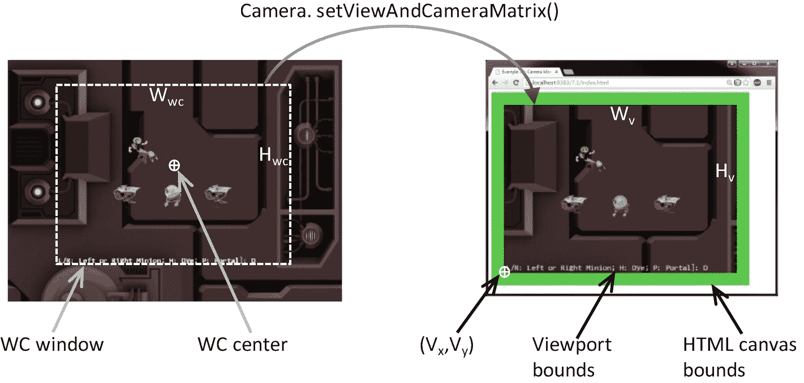

图 7-1

查看定义相机对象的 WC 参数

Note

在本书中，WC 窗口或 WC 边界用于指代 WC 窗口边界。

`Camera`对象抽象允许游戏程序员忽略 WC 边界和 HTML 画布的细节，专注于设计有趣的游戏体验。在游戏等级中用一个`Camera`对象编程应该反映真实世界中物理摄像机的使用。例如，您可能希望平移摄像机以向观众展示环境，您可能希望将摄像机安装在女演员身上并与观众分享她的旅程，或者您可能希望扮演导演的角色并指导场景中的演员保持在摄像机的可视范围内。这些例子的独特特征，比如平移或者跟随角色的视角，是高级功能规范。请注意，在现实世界中，您不需要指定窗口的坐标位置或边界。

本章介绍了一些最常见的相机操作，包括夹紧、平移和缩放。将推导出插值形式的解决方案，以减轻由相机操作导致的恼人或混乱的突然转变。您还将了解如何在同一游戏关卡中支持多个摄像头视图，以及如何使用鼠标输入。

## 相机操作

在 2D 世界中，您可能希望将对象的移动限制在相机的范围内，平移或移动相机，或者将相机缩放到特定区域或远离特定区域。这些高级别的功能规范可以通过策略性地改变`Camera`对象的参数来实现:wc 中心和 WC 窗口的*W*<sub>*WC*</sub>×*H*<sub>*WC*</sub>。关键是为游戏开发人员创建方便的函数，以便在游戏环境中操作这些值。例如，可以为程序员定义缩放功能，而不是增加/减少 WC 窗口的宽度/高度。

### 相机操作项目

这个项目演示了如何通过使用`Camera`对象的 WC 中心、宽度和高度来实现直观的摄像机操作。你可以在图 [7-2](#Fig2) 中看到这个项目运行的例子。这个项目的源代码在`chapter7/7.1.camera_manipulations`文件夹中定义。

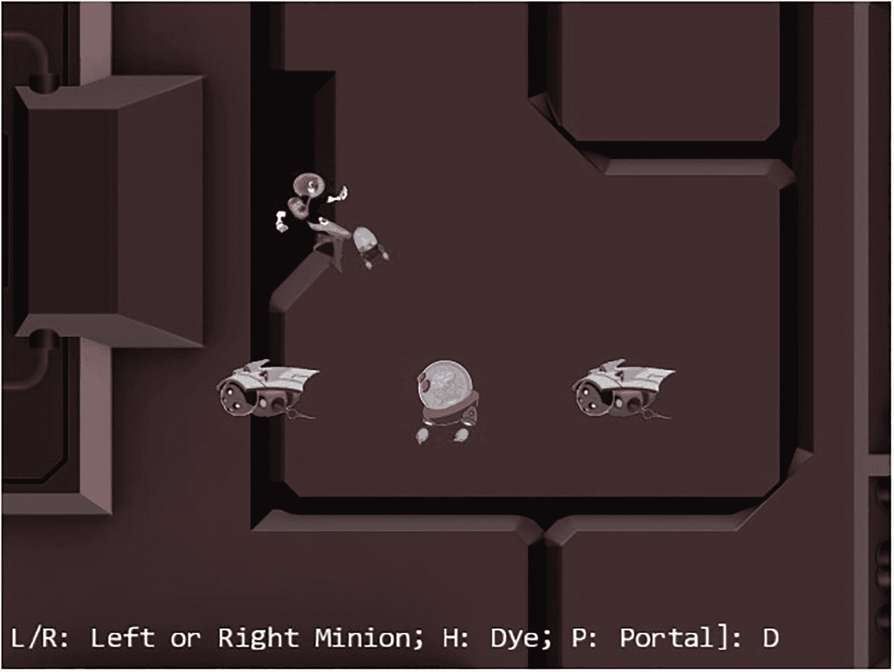

图 7-2

运行相机操作项目

该项目的控制措施如下:

*   **WASD 键**:移动`Dye`角色(`Hero`对象)。请注意，当`Hero`对象试图移动超过 WC 边界的 90%时，相机 WC 窗口会随之更新。

*   **箭头键**:移动`Portal`对象。注意`Portal`对象不能移动超过 WC 边界的 80%。

*   **L/R/P/H 键**:选择`Left` minion、`Right` minion、`Portal` object 或`Hero` object 作为焦点对象；L/R 键还将相机设置在`Left`或`Right`迷你按钮的中心。

*   **N/M 键**:放大或缩小相机中心。

*   **J/K 键**:放大或缩小，同时保证当前焦点物体的相对位置不变。换句话说，当相机缩放时，除了焦点对准的对象之外，所有对象的位置都将改变。

该项目的目标如下:

*   体验一些常见的相机操作

*   为了理解从操纵操作到必须改变的相应相机参数值的映射

*   为了实现相机操纵操作

您可以在`assets`文件夹中找到以下外部资源:`fonts`文件夹，包含默认的系统字体和三个纹理图像(`minion_portal.png`、`minion_sprite.png`和`bg.png`)。第一个纹理图像表示`Portal`对象，其余对象为`minion_sprite.png`的 sprite 元素，背景为用`bg.png`映射的大`TextureRenderable`对象纹理。

#### 组织源代码

为了适应功能的增加和`Camera`类的复杂性，您将创建一个单独的文件夹来存储相关的源代码文件。类似于将`TextureRenderable`复杂的源代码分成多个文件的情况，在这个项目中`Camera`类的实现将被分成三个文件。

*   `camera_main.js`用于实现以前项目的基本功能

*   `camera_manipulation.js`用于支持新引入的操纵操作

*   `camera.js`用作班级接入点

实施步骤如下:

1.  在`src/engine`中新建一个名为`cameras`的文件夹。将`camera.js`文件移入该文件夹，并重命名为`camera_main.js`。

2.  在`src/engine/cameras`中创建一个新文件，命名为`camera_manipulation.js`。该文件将用于扩展`Camera`类的功能以支持操作。添加以下代码来导入和导出基本的`Camera`类功能。目前，这个文件不包含任何有用的源代码，因此没有任何用途。您将在下面的小节中定义适当的扩展函数。

1.  通过添加以下代码，创建一个新的`camera.js`作为`Camera`访问点:

```js
import Camera from "./camera_main.js";

// new functionality to be defined here in the next subsection

export default Camera;

```

```js
import Camera from "./camera_manipulation.js";
export default Camera;

```

有了源代码文件的这种结构，`camera_main.js`实现了所有的基本功能，并导出到`camera_manipulation.js`，后者为`Camera`类定义了附加功能。最后，`camera.js`从`camera_manipulation.js`导入扩展功能。`Camera`类的用户可以简单地从`camera.js`导入，并且可以访问所有已定义的功能。这允许`camera.js`作为`Camera`类的访问点，同时隐藏实现源代码结构的细节。

#### 支持夹紧到摄像机 WC 边界

编辑`camera_main.js`到`import`边界框功能，并定义一个函数，将与`Transform`对象相关的边界固定到摄像机 WC 边界:

```js
import * as glSys from "../core/gl.js";
import BoundingBox from "../bounding_box.js";
import { eBoundCollideStatus } from "../bounding_box.js";

... identical to previous code ...

clampAtBoundary(aXform, zone) {
    let status = this.collideWCBound(aXform, zone);
    if (status !== eBoundCollideStatus.eInside) {
        let pos = aXform.getPosition();
        if ((status & eBoundCollideStatus.eCollideTop) !== 0) {
            pos[1] = (this.getWCCenter())[1] +
                     (zone * this.getWCHeight() / 2) –
                     (aXform.getHeight() / 2);
        }
        if ((status & eBoundCollideStatus.eCollideBottom) !== 0) {
            pos[1] = (this.getWCCenter())[1] –
                     (zone * this.getWCHeight() / 2) +
                     (aXform.getHeight() / 2);
        }

        if ((status & eBoundCollideStatus.eCollideRight) !== 0) {
            pos[0] = (this.getWCCenter())[0] +
                     (zone * this.getWCWidth() / 2) –
                     (aXform.getWidth() / 2);
        }
        if ((status & eBoundCollideStatus.eCollideLeft) !== 0) {
            pos[0] = (this.getWCCenter())[0] –
                     (zone * this.getWCWidth() / 2) +
                     (aXform.getWidth() / 2);
        }
    }
    return status;
}

```

`aXform`对象可以是`GameObject`或`Renderable`对象的`Transform`。`clampAtBoundary()`功能通过夹紧`aXform`位置确保`aXform`的边界保持在摄像机的 WC 边界内。`zone`变量定义了 WC 边界的夹紧百分比。例如，1.0 表示钳制到精确的 WC 边界，而 0.9 表示钳制到当前 WC 窗口大小的 90%的边界。值得注意的是，`clampAtBoundary()`功能仅在与摄像机 WC 边界冲突的边界上运行。例如，如果`aXform`对象的边界完全在摄像机 WC 边界之外，它将保持在外部。

#### 在 camera_manipulation.js 文件中定义相机操纵操作

回想一下，您已经创建了一个空的`camera_manipulation.js`源代码文件。现在您已经准备好编辑这个文件，并在`Camera`类上定义额外的函数来操作摄像机。

1.  编辑`camera_manipulate.js`。确保在`Camera`类功能的初始导入和最终导出之间添加代码。

2.  导入边界框碰撞状态，并定义`panWidth()`函数根据`Transform`对象的边界平移摄像机。该功能是对`clampAtBoundary()`功能的补充，它不是改变`aXform`位置，而是移动摄像机以确保正确包含`aXform`边界。与`clampAtBoundary()`功能的情况一样，如果`aXform`边界完全在测试的 WC 边界区域之外，则不会改变摄像机。

1.  通过添加到`Camera`类原型来定义摄像机平移功能`panBy()`和`panTo()`。这两个函数通过增加一个增量或者移动它到一个新的位置来改变摄像机的 WC 中心。

```js
import { eBoundCollideStatus } from "../bounding_box.js";

Camera.prototype.panWith = function (aXform, zone) {
    let status = this.collideWCBound(aXform, zone);
    if (status !== eBoundCollideStatus.eInside) {
        let pos = aXform.getPosition();
        let newC = this.getWCCenter();

        if ((status & eBoundCollideStatus.eCollideTop) !== 0) {
            newC[1] = pos[1]+(aXform.getHeight() / 2) –
                      (zone * this.getWCHeight() / 2);
        }
        if ((status & eBoundCollideStatus.eCollideBottom) !== 0) {
            newC[1] = pos[1] - (aXform.getHeight() / 2) +
                      (zone * this.getWCHeight() / 2);
        }
        if ((status & eBoundCollideStatus.eCollideRight) !== 0) {
            newC[0] = pos[0] + (aXform.getWidth() / 2) –
                      (zone * this.getWCWidth() / 2);
        }
        if ((status & eBoundCollideStatus.eCollideLeft) !== 0) {
            newC[0] = pos[0] - (aXform.getWidth() / 2) +
                      (zone * this.getWCWidth() / 2);
        }
    }
}

```

1.  定义相对于中心或目标位置缩放摄像机的功能:

```js
Camera.prototype.panBy = function (dx, dy) {
    this.mWCCenter[0] += dx;
    this.mWCCenter[1] += dy;
}

Camera.prototype.panTo = function (cx, cy) {
    this.setWCCenter(cx, cy);
}

```

```js
Camera.prototype.zoomBy = function (zoom) {
    if (zoom > 0) {
        this.setWCWidth(this.getWCWidth() * zoom);
    }
}

Camera.prototype.zoomTowards = function (pos, zoom) {
    let delta = [];
    vec2.sub(delta, pos, this.mWCCenter);
    vec2.scale(delta, delta, zoom - 1);
    vec2.sub(this.mWCCenter, this.mWCCenter, delta);
    this.zoomBy(zoom);
}

```

`zoomBy()`功能相对于摄像机的中心进行缩放，而`zoomTowards()`功能相对于世界坐标位置进行缩放。如果`zoom`变量大于 1，WC 窗口变得更大，你会在我们直观地称为缩小的过程中看到更多的世界。小于 1 的`zoom`值放大。图 [7-3](#Fig3) 显示了`zoom=0.5`相对于 WC 中心和`Hero`物体位置的缩放结果。

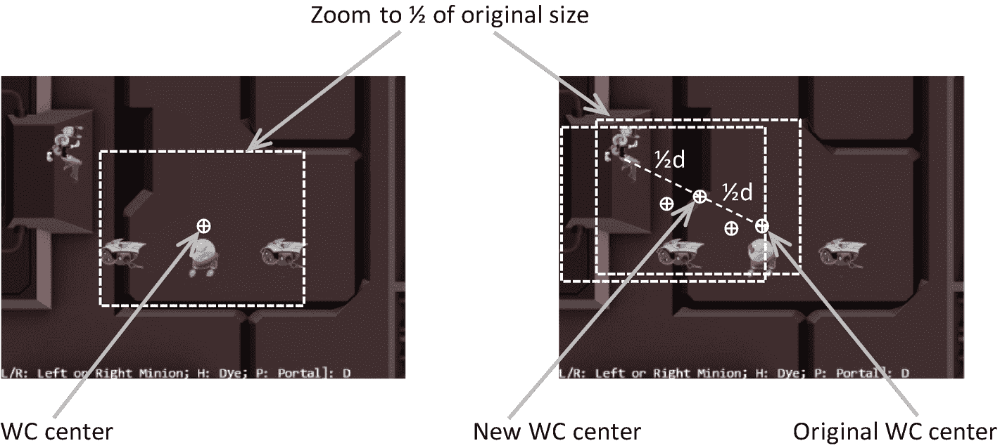

图 7-3

向 WC 中心和目标位置缩放

#### 在我的游戏中操纵摄像机

有两个重要的功能需要测试:平移和缩放。对`MyGame`类唯一值得注意的变化是在`update()`函数中。`init()`、`load()`、`unload()`和`draw()`功能与之前的项目类似，可以在项目源代码中找到。

```js
update() {
    let zoomDelta = 0.05;
    let msg = "L/R: Left or Right Minion; H: Dye; P: Portal]: ";

    // ... code to update each object not shown

    // Brain chasing the hero
    let h = [];
    if (!this.mHero.pixelTouches(this.mBrain, h)) {
        this.mBrain.rotateObjPointTo(
                    this.mHero.getXform().getPosition(), 0.01);
        engine.GameObject.prototype.update.call(this.mBrain);
    }

    // Pan camera to object
    if (engine.input.isKeyClicked(engine.input.keys.L)) {
        this.mFocusObj = this.mLMinion;
        this.mChoice = 'L';
        this.mCamera.panTo(this.mLMinion.getXform().getXPos(),
                           this.mLMinion.getXform().getYPos());
    }
    if (engine.input.isKeyClicked(engine.input.keys.R)) {
        this.mFocusObj = this.mRMinion;
        this.mChoice = 'R';
        this.mCamera.panTo(this.mRMinion.getXform().getXPos(),
                           this.mRMinion.getXform().getYPos());
    }
    if (engine.input.isKeyClicked(engine.input.keys.P)) {
        this.mFocusObj = this.mPortal;
        this.mChoice = 'P';
    }
    if (engine.input.isKeyClicked(engine.input.keys.H)) {
        this.mFocusObj = this.mHero;
        this.mChoice = 'H';
    }

    // zoom
    if (engine.input.isKeyClicked(engine.input.keys.N)) {
        this.mCamera.zoomBy(1 - zoomDelta);
    }
    if (engine.input.isKeyClicked(engine.input.keys.M)) {
        this.mCamera.zoomBy(1 + zoomDelta);
    }
    if (engine.input.isKeyClicked(engine.input.keys.J)) {
        this.mCamera.zoomTowards(
                         this.mFocusObj.getXform().getPosition(),
                         1 - zoomDelta);
    }
    if (engine.input.isKeyClicked(engine.input.keys.K)) {
        this.mCamera.zoomTowards(
                         this.mFocusObj.getXform().getPosition(),
                         1 + zoomDelta);
    }

    // interaction with the WC bound
    this.mCamera.clampAtBoundary(this.mBrain.getXform(), 0.9);
    this.mCamera.clampAtBoundary(this.mPortal.getXform(), 0.8);
    this.mCamera.panWith(this.mHero.getXform(), 0.9);

    this.mMsg.setText(msg + this.mChoice);
}

```

在列出的代码中，前四个`if`语句选择焦点对准的对象，其中 L 和 R 键还通过调用具有适当 WC 位置的`panTo()`函数来重新定位相机。第二组四个`if`语句控制`zoom`，要么朝向 WC 中心，要么朝向当前聚焦对象。然后，该功能将`Brain`和`Portal`对象分别限制在 WC 边界的 90%和 80%以内。基于`Hero`对象的变换(或位置)平移摄像机，该功能最终结束。

现在，您可以运行项目并使用 WASD 键移动`Hero`对象。向厕所边界移动`Hero`对象，观察被推动的摄像机。用`Hero`物体继续推动相机；请注意，由于`clampAtBoundary()`函数的调用，`Portal`对象将依次被推动，使其永远不会离开摄像机的 WC 边界。现在按下 L/R 键，观察相机中心切换到`Left`或`Right`迷你按钮的中心。N/M 键演示了相对于中心的直接缩放。要体验相对于目标的缩放，将`Hero`对象移向画布的左上方，然后按 H 键选择它作为`zoom`焦点。现在，鼠标指针指向英雄对象的头部，可以先按 K 键缩小，然后按 J 键放大。请注意，当您`zoom`时，场景中的所有对象都会改变位置，除了`Hero`对象周围的区域。对于有许多应用的游戏开发者来说，放大到世界的一个期望区域是一个有用的特性。您可以体验在放大/缩小时移动`Hero`对象。

## 插入文字

现在可以根据高级功能(如平移或缩放)来操纵摄像机。然而，结果通常是渲染图像的突然或视觉上不连贯的变化，这可能导致烦恼或混乱。例如，在之前的项目中，L 或 R 键通过简单分配新的 WC 中心值来使摄像机重新居中。摄像机位置的突然改变导致一个看似新的游戏世界的突然出现。这不仅会在视觉上分散注意力，还会让玩家搞不清发生了什么。

当摄像机参数的新值可用时，不是分配它们并导致突然的变化，而是希望随着时间的推移将值从旧值逐渐变形为新值，或者对值进行*插值*。例如，如图 [7-4](#Fig4) 所示，在时间*t*T6】1 处，一个具有旧值的参数将被赋予一个新值。在这种情况下，插值不是突然更新值，而是随着时间的推移逐渐改变值。它将计算具有递减值的中间结果，并在稍后完成对新值的更改*t*T10】2。

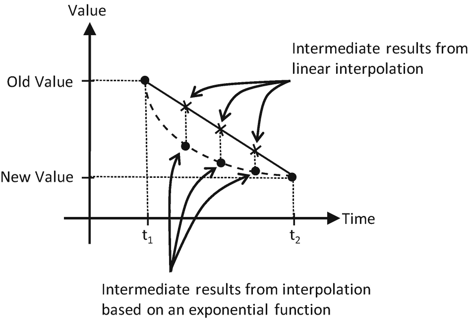

图 7-4

基于线性和指数函数的插值

图 [7-4](#Fig4) 显示了随着时间推移有多种插值方式。例如，线性插值根据新旧值连线的斜率计算中间结果。相反，指数函数可以根据以前值的百分比计算中间结果。这样，利用线性插值，摄像机位置将以恒定速度从旧位置移动到新位置，类似于以某个恒定速度移动(或摇摄)摄像机。相比之下，基于给定指数函数的插值将首先快速移动相机位置，然后随着时间的推移快速减慢，给人一种移动相机并将相机聚焦在新目标上的感觉。

人类的动作和运动通常遵循指数插值函数。例如，试着把你的头从正面转向右边或者移动你的手去拿你桌子上的一个物体。注意，在这两种情况下，你都是以相对较快的速度开始运动，当目的地很近的时候，你的速度明显慢了下来。也就是说，你可能开始时快速转动你的头，然后随着你的视线接近你的右侧而快速减速，很可能你的手开始快速向物体移动，当手快要到达物体时明显减速。在这两个例子中，你的位移遵循指数插值函数，如图 [7-4](#Fig4) 所示，随着目的地的接近，快速变化之后是快速减速。这是您将在游戏引擎中实现的功能，因为它模仿人类的运动，并且对人类玩家来说似乎很自然。

Note

线性插值通常被称为 *LERP* 或 *lerp* 。lerp 的结果是初始值和最终值的线性组合。在本章中，几乎在所有情况下，图 [7-4](#Fig4) 中描绘的指数插值都是通过重复应用 lerp 函数来近似的，其中在每次调用中，初始值都是前一次 lerp 调用的结果。这样，指数函数就用分段线性函数来近似了。

本节介绍了`Lerp`和`LerpVec2`实用程序类，以支持相机操纵操作产生的平滑和渐进的相机移动。

### 相机插值项目

这个项目展示了更平滑和视觉上更吸引人的相机操作插值结果。你可以在图 [7-5](#Fig5) 中看到这个项目运行的例子。这个项目的源代码在`chapter7/7.2.camera_interpolations`文件夹中定义。

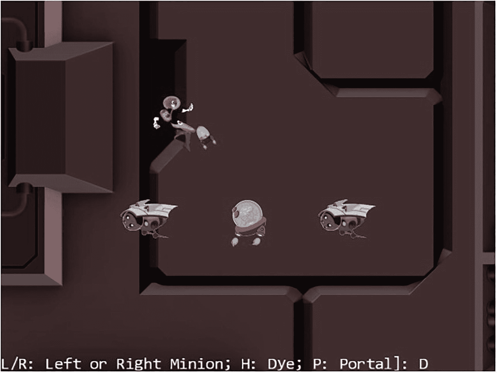

图 7-5

运行相机插值项目

该项目的控件与之前的项目相同:

*   **WASD 键**:移动`Dye`角色(`Hero`对象)。请注意，当`Hero`对象试图移动超过 WC 边界的 90%时，相机 WC 窗口会随之更新。

*   **箭头键**:移动`Portal`对象。注意`Portal`对象不能移动超过 WC 边界的 80%。

*   **L/R/P/H 键**:选择`Left` minion、`Right` minion、`Portal` object 或`Hero` object 成为焦点对象。L/R 键还将相机设置为聚焦在`Left`或`Right`小按钮上。

*   **N/M 键**:放大或缩小相机中心。

*   **J/K 键**:放大或缩小，同时保证当前焦点物体的相对位置不变。换句话说，当相机缩放时，除了焦点对准的对象之外，所有对象的位置都将改变。

该项目的目标如下:

*   为了理解给定值之间插值的概念

*   为了实现支持相机参数逐渐变化的插值

*   体验相机参数的插值变化

与前面的项目一样，您可以在`assets`文件夹中找到外部资源文件。

#### 插值作为一种工具

类似于支持转换功能的`Transform`类和支持冲突检测的`BoundingBox`类，可以定义一个`Lerp`类来支持值的插值。为了保持源代码有条理，应该定义一个新的文件夹来存储这些实用程序。

创建`src/engine/utils`文件夹，并将`transform.js`和`bounding_box.js`文件移动到该文件夹中。

##### Lerp 类

定义`Lerp`类来计算两个值之间的插值:

1.  在`src/engine/utils`文件夹中创建一个新文件，命名为`lerp.js`，并定义构造函数。该类设计用于在`mCycles`的持续时间内从`mCurrentValue`到`mFinalValue`插值。在每次更新期间，基于`mCurrentValue`和`mFinalValue`之差的`mRate`增量计算中间结果，如下所示。

1.  定义计算中间结果的函数:

```js
class Lerp {
    constructor(value, cycles, rate) {
        this.mCurrentValue = value;    // begin value of interpolation
        this.mFinalValue = value;      // final value of interpolation
        this.mCycles = cycles;
        this.mRate = rate;

        // Number of cycles left for interpolation
        this.mCyclesLeft = 0;
    }

    ... implementation to follow ...
}

```

```js
// subclass should override this function for non-scalar values
_interpolateValue() {
    this.mCurrentValue = this.mCurrentValue + this.mRate *
                         (this.mFinalValue - this.mCurrentValue);
}

```

注意，`_interpolateValue()`函数计算出在`mCurrentValue`和`mFinalValue`之间线性插值的结果。通过这种方式，`mCurrentValue`将在每次迭代逼近指数曲线时被设置为中间值，因为它接近`mFinalValue`的值。

1.  定义一个函数来配置插值。`mRate`变量定义插值结果接近最终值的速度。0.0 的`mRate`将导致完全没有变化，其中 1.0 导致瞬时变化。`mCycle`变量定义了插值过程的持续时间。

1.  定义相关的 getter 和 setter 函数。注意，`setFinal()`函数既设置最终值，又触发新一轮插值计算。

```js
config(stiffness, duration) {
    this.mRate = stiffness;
    this.mCycles = duration;
}

```

1.  定义函数来触发每个中间结果的计算:

```js
get() { return this.mCurrentValue; }

setFinal(v) {
    this.mFinalValue = v;
    this.mCyclesLeft = this.mCycles;     // will trigger interpolation
}

```

1.  最后，确保导出已定义的类:

```js
update() {
    if (this.mCyclesLeft <= 0) { return; }

    this.mCyclesLeft--;
    if (this.mCyclesLeft === 0) {
        this.mCurrentValue = this.mFinalValue;
    } else {
        this._interpolateValue();
    }
}

```

```js
export default Lerp

;

```

##### LerpVec2 类

由于许多摄像机参数是`vec2`对象(例如，厕所中心位置)，因此重要的是要泛化`Lerp`类以支持`vec2`对象的插值:

1.  在`src/engine/utils`文件夹中新建一个文件，命名为`lerp_vec2.js`，并定义其构造函数:

1.  覆盖`_interpolateValue()`函数以计算`vec2`的中间结果:

```js
class LerpVec2 extends Lerp {
    constructor(value, cycle, rate) {
        super(value, cycle, rate);
    }

    ... implementation to follow ...
}

```

```js
_interpolateValue() {
    vec2.lerp(this.mCurrentValue, this.mCurrentValue,
                                  this.mFinalValue, this.mRate);
}

```

在`gl-matrix.js`文件中定义的`vec2.lerp()`函数计算 x 和 y 的`vec2`分量。涉及的计算与`Lerp`类中的`_interpolateValue()`函数相同。

最后，记得更新引擎访问文件`index.js`，以便将新定义的`Lerp`和`LerpVec2`功能转发给客户端。

#### 用 CameraState 表示插值中间结果

必须将`Camera`对象的状态一般化，以支持插值中间结果的渐变。引入`CameraState`类就是为了实现这个目的。

1.  在`src/engine/cameras`文件夹中新建一个文件，命名为`camera_state.js`，导入定义好的`Lerp`功能，定义构造函数:

```js
import Lerp from "../utils/lerp.js";
import LerpVec2 from "../utils/lerp_vec2.js";

class CameraState {
    constructor(center, width) {
        this.kCycles = 300;  // cycles to complete the transition
        this.kRate = 0.1;    // rate of change for each cycle
        this.mCenter = new LerpVec2(center, this.kCycles, this.kRate);
        this.mWidth = new Lerp(width, this.kCycles, this.kRate);
    }

    ... implementation to follow ...
}

export default CameraState;

```

注意`mCenter`和`mWidth`是支持摄像机平移(`mCenter`的改变)和变焦(`mWidth`的改变)所需的唯一变量。这两个变量都是相应的`Lerp`类的实例，能够插值和计算中间结果以实现渐变。

1.  定义 getter 和 setter 函数:

1.  定义更新函数以触发插值计算:

```js
getCenter() { return this.mCenter.get(); }
getWidth() { return this.mWidth.get(); }

setCenter(c) { this.mCenter.setFinal(c); }
setWidth(w) { this.mWidth.setFinal(w); }

```

1.  定义一个函数来配置插值:

```js
update() {
    this.mCenter.update();
    this.mWidth.update();
}

```

```js
config(stiffness, duration) {
    this.mCenter.config(stiffness, duration);
    this.mWidth.config(stiffness, duration);
}

```

`stiffness`变量是`Lerp`的`mRate`。它定义了插值中间结果收敛到最终值的速度。正如在`Lerp`类定义中所讨论的，这是一个介于 0 和 1 之间的数，其中 0 表示永远不会收敛，1 表示瞬时收敛。`duration`变量是`Lerp`的`mCycle`。它定义了结果收敛所需的更新周期数。这必须是正整数值。

请注意，随着引擎复杂性的增加，支持代码的复杂性也在增加。在这种情况下，您已经设计了一个内部实用程序类`CameraState`，用于存储一个`Camera`对象的内部状态以支持插值。这是一个内部发动机操作。游戏程序员没有理由访问这个类，因此，引擎访问文件`index.js`不应该被修改来转发定义。

#### 将插值集成到相机操作中

必须修改`camera_main.js`中的`Camera`类，以使用新定义的`CameraState`来表示 WC 中心和宽度:

1.  编辑`camera_main.js`文件并导入新定义的`CameraState`类:

1.  修改`Camera`构造函数，用`CameraState`的实例替换 center 和 width 变量:

```js
import CameraState from "./camera_state.js";

```

1.  现在，编辑`camera_manipulation.js`文件以定义函数来更新和配置`CameraState`对象的插值功能:

```js
constructor(wcCenter, wcWidth, viewportArray) {
    this.mCameraState = new CameraState(wcCenter, wcWidth);

    ... identical to previous code ...
}

```

1.  修改`panBy()`相机操作功能，以支持`CameraState`对象，如下所示:

```js
Camera.prototype.update = function () {
    this.mCameraState.update();
}

// For LERP function configuration
Camera.prototype.configLerp = function (stiffness, duration) {
    this.mCameraState.config(stiffness, duration);
}

```

1.  更新`panWith()`和`zoomTowards()`函数接收并设置 WC 中心到新定义的`CameraState`对象:

```js
Camera.prototype.panBy = function (dx, dy) {
    let newC = vec2.clone(this.getWCCenter());
    newC[0] += dx;
    newC[1] += dy;
    this.mCameraState.setCenter(newC);
}

```

```js
Camera.prototype.panWith = function (aXform, zone) {
    let status = this.collideWCBound(aXform, zone);
    if (status !== eBoundCollideStatus.eInside) {
        let pos = aXform.getPosition();
        let newC = vec2.clone(this.getWCCenter());
        if ((status & eBoundCollideStatus.eCollideTop) !== 0)

        ... identical to previous code ...

        this.mCameraState.setCenter(newC);
    }
}

Camera.prototype.zoomTowards = function (pos, zoom) {
    ... identical to previous code ...
    this.zoomBy(zoom);
    this.mCameraState.setCenter(newC);
}

```

#### 在 MyGame 中测试插值

回想一下，这个项目的用户控件与上一个项目的用户控件是相同的。唯一的区别是，在这个项目中，你可以期待不同相机设置之间的渐进和平滑的过渡。为了观察正确的插值结果，必须在每次游戏场景更新时调用 camera `update()`功能。

```js
update() {
    let zoomDelta = 0.05;
    let msg = "L/R: Left or Right Minion; H: Dye; P: Portal]: ";

    this.mCamera.update();  // for smoother camera movements

    ... identical to previous code ...
}

```

更新摄像机以计算插值中间结果的调用是`my_game.js`文件中唯一的变化。现在，您可以运行该项目，并试验由相机操纵操作产生的平滑和渐变。请注意，插值结果不会突然更改渲染图像，从而保持了操纵命令前后的空间连续性。您可以尝试更改`stiffness`和`duration`变量，以更好地了解不同的插值收敛速度。

## 相机抖动和物体振动效果

在视频游戏中，摇动相机可以方便地表达事件的重要性或强烈程度，例如敌人首领的出现或大型物体之间的碰撞。类似于值的插值，相机抖动运动也可以通过简单的数学公式来建模。

考虑在现实生活中相机抖动是如何发生的。例如，在用摄像机拍摄时，说你被某人或某物撞到你而感到惊讶或震惊。你的反应可能是轻微的迷失方向，然后迅速重新聚焦于原来的目标。从相机的角度来看，这种反应可以描述为从原始相机中心的初始大位移，随后是快速调整以使相机重新居中。数学上，如图 [7-6](#Fig6) 所示，阻尼简谐运动可以用三角函数的阻尼来表示，可以用来描述这些类型的位移。

注意，直接的数学公式是精确的，具有完美的可预测性。这种公式适用于描述规则的、正常的或预期的行为，例如球的弹跳或钟摆的摆动。抖动效果应该包含轻微的混乱和不可预测的随机性，例如，在意外碰撞后端着咖啡的手的稳定，或者像前面的例子一样，在受到惊吓后摄像机的稳定。按照这个推理，在本节中，您将定义一个通用的阻尼振荡函数，然后注入伪随机性来模拟轻微的混沌，以实现抖动效果。

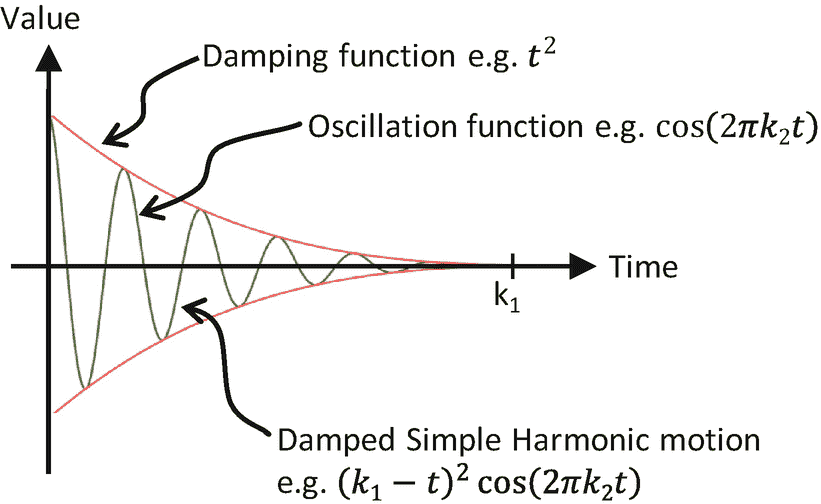

图 7-6

阻尼简谐运动的位移

### 相机抖动和物体振荡投影

这个项目演示了如何实现阻尼简谐运动来模拟物体振荡，以及如何注入伪随机性来创建相机抖动效果。你可以在图 [7-7](#Fig7) 中看到这个项目运行的例子。这个项目与上一个项目相同，除了一个创建物体摆动和相机抖动效果的附加命令。这个项目的源代码在`chapter7/7.3.camera_shake_and_object_oscillate`文件夹中定义。

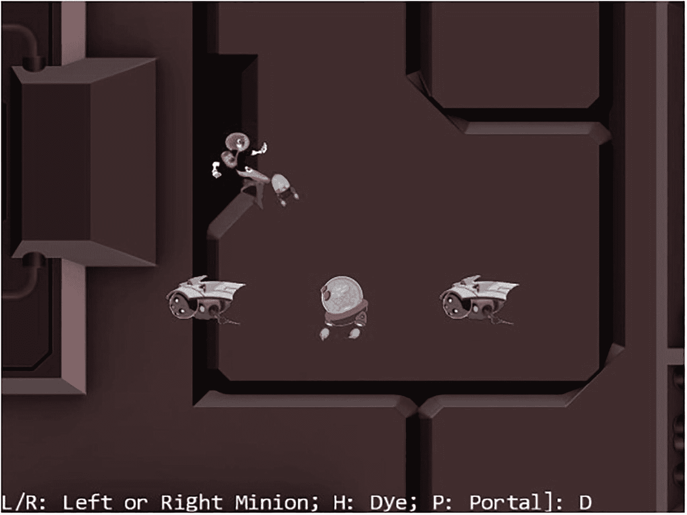

图 7-7

运行相机抖动和对象振荡项目

以下是该项目的新控件:

*   **Q 键**:启动染料角色的位置摆动和相机抖动效果。

以下控件与之前的项目相同:

*   **WASD 键**:移动`Dye`角色(`Hero`对象)。请注意，当`Hero`对象试图移动超过 WC 边界的 90%时，相机 WC 窗口会随之更新。

*   **箭头键**:移动`Portal`对象。注意`Portal`对象不能移动超过 WC 边界的 80%。

*   **L/R/P/H 键**:选择`Left` minion、`Right` minion、`Portal` object 或`Hero` object 成为焦点对象。L/R 键还将相机设置为聚焦在`Left`或`Right`小按钮上。

*   **N/M 键**:放大或缩小相机中心。

*   **J/K 键**:放大或缩小，同时保证当前焦点物体的相对位置不变。换句话说，当相机缩放时，除了焦点对准的对象之外，所有对象的位置都将改变。

该项目的目标如下:

*   为了深入了解用简单的数学函数模拟位移

*   要体验对象的振荡效果

*   体验相机的抖动效果

*   将振荡实现为阻尼简谐运动，并引入伪随机性以产生相机抖动效果

与前面的项目一样，您可以在`assets`文件夹中找到外部资源文件。

#### 抽象摇动行为

在许多游戏中，摇动相机是一种常见的动态行为。但是，重要的是要认识到抖动行为不仅可以应用于摄像机。也就是说，抖动效果可以被抽象为诸如尺寸、点或位置的数值的扰动(抖动)。在相机抖动的情况下，恰好被抖动的数值代表相机的 x 和 y 位置。由于这个原因，抖动和相关的支持应该是游戏引擎的一般效用函数，以便游戏开发者可以将它们应用于任何数值。以下是将要定义的新实用程序:

*   `Oscillate`:实现一个值随时间的简谐振荡的基类

*   `Shake`:对`Oscillate`类的一个扩展，它将随机性引入到振荡的幅度中，以模拟对一个值的抖动效果的轻微混乱

*   `ShakeVec2`:对`Shake`类的扩展，将`Shake`行为扩展为两个值，比如一个位置

##### 创建振荡类来模拟简谐运动

因为所有描述的行为都依赖于简单振荡，所以应该首先实现这一点；

1.  在`src/engine/utils`文件夹中创建一个新文件，并将其命名为`oscillate.js`。定义一个名为`Oscillate`的类，并添加以下代码来构建该对象:

```js
class Oscillate {
    constructor(delta, frequency, duration) {
        this.mMag = delta;

        this.mCycles = duration; // cycles to complete the transition
        this.mOmega = frequency * 2 * Math.PI; // Converts to radians
        this.mNumCyclesLeft = duration;
    }

    ... implementation to follow ...
}

export default Oscillate;

```

`delta`变量代表 WC 空间中阻尼前的初始位移。`frequency`参数指定值为 1 代表余弦函数的一个完整周期时的振荡幅度。`duration`参数定义了以游戏循环更新为单位振荡多长时间。

1.  定义阻尼简谐运动:

```js
_nextDampedHarmonic() {
    // computes (Cycles) * cos(Omega * t)
    let frac = this.mNumCyclesLeft / this.mCycles;
    return frac * frac * Math.cos((1 - frac) * this.mOmega);
}

```

参见图 [7-8](#Fig8) 。`mNumCyclesLeft`是振荡中剩余的周期数，即`k-t`，`frac`变量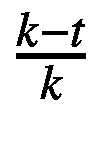是阻尼因子。该函数返回一个介于-1 和 1 之间的值，可以根据需要进行缩放。

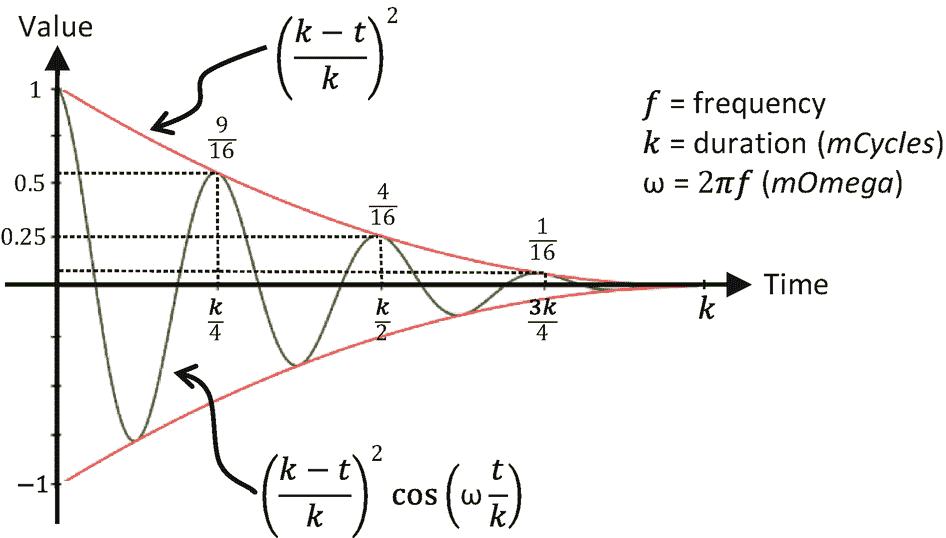

图 7-8

指定值振荡的阻尼简谐振动

1.  定义一个受保护的函数来检索下一个阻尼谐波运动的值。这个功能可能看起来微不足道，没有必要。然而，正如您将在下一小节中看到的，这个函数允许 shake 子类覆盖和注入随机性。

1.  定义检查振荡结束和重启振荡的功能:

```js
// local/protected methods

_nextValue() {
    return (this._nextDampedHarmonic());
}

```

1.  最后，定义一个公共函数来触发振荡的计算。请注意，计算的振荡结果必须按所需幅度`mMag`进行缩放:

```js
done() { return (this.mNumCyclesLeft <= 0); }
reStart() { this.mNumCyclesLeft = this.mCycles; }

```

```js
getNext() {
    this.mNumCyclesLeft--;
    let v = 0;
    if (!this.done()) {
        v = this._nextValue();
    }
    return (v * this.mMag);
}

```

##### 创建 Shake 类来随机化振荡

现在，您可以通过在效果中引入伪随机性来扩展振荡行为，以传达震动感。

1.  在`src/engine/utils`文件夹中创建一个新文件`shake.js`。定义`Shake`类来扩展`Oscillate`，并添加以下代码来构造对象:

1.  覆盖`_nextValue()`以随机化振荡结果的符号，如下所示。回想一下，从公共的`getNext()`函数调用`_nextValue()`函数来检索振荡值。虽然来自阻尼简谐振动的结果在幅度上连续地和可预测地减小，但是值的相关符号被随机化，导致突然的和意外的不连续，传达了来自摇动结果的混乱感。

```js
import Oscillate from "./oscillate.js";

class Shake extends Oscillate {
    constructor(delta, frequency, duration) {
        super(delta, frequency, duration);
    }

    ... implementation to follow ...
}

export default Shake;

```

```js
_nextValue() {
    let v = this._nextDampedHarmonic();
    let fx = (Math.random() > 0.5) ? -v : v;
    return fx;
}

```

##### 创建 ShakeVec2 类来模拟 Vec2 或位置的晃动

现在，您可以推广 shake 效果，以同时支持两个值的摇动。这是一个有用的工具，因为 2D 游戏中的位置是两个值的实体，位置是震动效果的方便目标。比如这个项目中，相机位置的抖动，一个二值实体，模拟相机抖动效果。

`ShakeVec2`类扩展了`Shake`类以支持`vec2`对象的摇动，摇动 x 和 y 维度上的值。x 维度的摇动通过`Shake`对象的实例来支持，而 y 维度则通过超类中定义的`Shake`类功能来支持。

1.  在`src/engine/utils`文件夹中创建一个新文件`shake_vec2.js`。定义`ShakeVec2`类来扩展`Shake`类。类似于`Shake`超类的构造函数参数，`deltas`和`freqs`参数是 2D，或`vec2`，在 x 和 y 维度上振动的幅度和频率的版本。在构造函数中，`xShake`实例变量跟踪 x 维度上的震动效果。注意在`super()`构造函数调用中的 y 组件参数，数组索引为 1。`Shake`超类跟踪 y 维度上的抖动效果。

1.  扩展`reStart()`和`getNext()`函数以支持第二维度:

```js
class ShakeVec2 extends Shake {
    constructor(deltas, freqs, duration) {
        super(deltas[1], freqs[1], duration);  // super in y-direction
        this.xShake = new Shake(deltas[0], freqs[0], duration);
    }

    ... implementation to follow ...
}

export default ShakeVec2;

```

```js
reStart() {
    super.reStart();
    this.xShake.reStart();
}

getNext() {
    let x = this.xShake.getNext();
    let y = super.getNext();
    return [x, y];
}

```

最后，记得更新引擎访问文件`index.js`，以便将新定义的`Oscillate`、`Shake`和`ShakeVec2`功能转发给客户端。

#### 定义 CameraShake 类来抽象相机抖动效果

通过定义的`ShakeVec2`类，可以方便地将伪随机阻尼简谐运动的位移应用于`Camera`的位置。然而，`Camera`对象需要一个额外的抽象层。

1.  在`src/engine/cameras`文件夹下创建一个新文件`camera_shake.js`，定义接收相机状态、`state`参数和震动配置的构造函数:`deltas`、`freqs`和`shakeDuration`。参数`state`的数据类型为`CameraState`，由摄像机中心位置和宽度组成。

1.  定义触发位移计算的函数，以实现摇动效果。请注意，抖动结果是从原始位置偏移的。给定的代码将此偏移添加到原始摄像机中心位置。

```js
import ShakeVec2 from "../utils/shake_vec2.js";

class CameraShake {
    // state is the CameraState to be shaken
    constructor(state, deltas, freqs, shakeDuration) {
        this.mOrgCenter = vec2.clone(state.getCenter());
        this.mShakeCenter = vec2.clone(this.mOrgCenter);
        this.mShake = new ShakeVec2(deltas, freqs, shakeDuration);
    }

    ... implementation to follow ...
}
export default CameraShake;

```

1.  定义实用函数:查询摇动是否完成，重启摇动，以及 getter/setter 函数。

```js
update() {
    let delta = this.mShake.getNext();
    vec2.add(this.mShakeCenter, this.mOrgCenter, delta);
}

```

```js
done() { return this.mShake.done(); }
reShake() {this.mShake.reStart();}
getCenter() { return this.mShakeCenter; }
setRefCenter(c) {
    this.mOrgCenter[0] = c[0];
    this.mOrgCenter[1] = c[1];
}

```

与`CameraState`类似，`CameraShake`也是游戏引擎内部实用程序，不应该导出给客户端游戏程序员。不应更新引擎访问文件`index.js`来导出此类。

#### 修改相机以支持抖动效果

通过适当的`CameraShake`抽象，支持相机的抖动仅仅意味着启动和更新抖动效果:

1.  修改`camera_main.js`和`camera_manipulation.js`导入`camera_shake.js`，如图所示:

1.  在`camera_main.js`中，修改`Camera`构造函数初始化一个`CameraShake`对象:

```js
import CameraShake from "./camera_shake.js";

```

1.  修改`setViewAndCameraMatrix()`函数的步骤 B，使用`CameraShake`对象的中心(如果已定义):

```js
constructor(wcCenter, wcWidth, viewportArray) {
    this.mCameraState = new CameraState(wcCenter, wcWidth);
    this.mCameraShake = null;

    ... identical to previous code ...
}

```

1.  修改`camera_manipulation.js`文件，添加对启动和重启摇动效果的支持:

```js
setViewAndCameraMatrix() {
    ... identical to previous code ...

    // Step B: Compute the Camera Matrix
    let center = [];
    if (this.mCameraShake !== null) {
        center = this.mCameraShake.getCenter();
    } else {
        center = this.getWCCenter();
    }

    ... identical to previous code ...
}

```

1.  继续使用`camera_manipulation.js`文件，并修改`update()`函数以触发相机抖动更新(如果定义了一个的话):

```js
Camera.prototype.shake = function (deltas, freqs, duration) {
    this.mCameraShake = new CameraShake(this.mCameraState,
                                        deltas, freqs, duration);
}

// Restart the shake
Camera.prototype.reShake = function () {
    let success = (this.mCameraShake !== null);
    if (success)
        this.mCameraShake.reShake();
    return success;
}

```

```js
Camera.prototype.update = function () {
    if (this.mCameraShake !== null) {
        if (this.mCameraShake.done()) {
            this.mCameraShake = null;
        } else {
            this.mCameraShake.setRefCenter(this.getWCCenter());
            this.mCameraShake.update();
        }
    }
    this.mCameraState.update();
}

```

#### 在 MyGame 中测试相机抖动和振荡效果

在`init()`和`update()`功能中只需要对`my_game.js`文件稍加修改，就可以支持用 Q 键触发振荡和相机抖动效果；

1.  为在`Dye`角色上创建振动或弹跳效果定义一个新的实例变量:

1.  修改`update()`功能，用 Q 键触发弹跳和相机抖动效果。在下面的代码中，请注意设计良好的抽象的优势。例如，相机抖动效果是不透明的，程序员需要指定的唯一信息是实际的抖动行为，即抖动幅度、频率和持续时间。相比之下，`Dye`角色位置的振荡或弹跳效果是通过明确查询和使用`mBounce`结果来实现的。

```js
init() {
    ... identical to previous code ...

    // create an Oscillate object to simulate motion
    this.mBounce = new engine.Oscillate(2, 6, 120);
                                     // delta, freq, duration
}

```

```js
update() {
    ... identical to previous code ...

    if (engine.input.isKeyClicked(engine.input.keys.Q)) {
        if (!this.mCamera.reShake())
            this.mCamera.shake([6, 1], [10, 3], 60);

            // also re-start bouncing effect
            this.mBounce.reStart();
    }

    if (!this.mBounce.done()) {
        let d = this.mBounce.getNext();
        this.mHero.getXform().incXPosBy(d);
    }

    this.mMsg.setText(msg + this.mChoice);
}

```

您现在可以运行该项目，体验模拟相机抖动效果的伪随机阻尼简谐运动。还可以观察`Dye`人物 x 位置的摆动。请注意，相机中心位置的位移将进行插值，从而产生更平滑的最终抖动效果。你可以在创建`mBounce`对象时或者调用`mCamera.shake()`函数时尝试改变参数，以试验不同的振荡和摇动配置。回想一下，在这两种情况下，前两个参数控制初始位移和`frequency`(余弦周期数)，第三个参数是影响应该持续多长时间的`duration`。

## 多个摄像头

视频游戏通常向玩家呈现游戏世界的多个视图，以传达重要或有趣的游戏信息，例如显示小地图来帮助玩家导航世界，或者提供敌人老板的视图来警告玩家将要发生什么。

在您的游戏引擎中，`Camera`类根据绘图的源区域和目的区域抽象出游戏世界的图形表示。绘图的源区域是游戏世界的 WC 窗口，目的区域是画布上的视口区域。这种抽象已经用多个`Camera`实例有效地封装和支持了多视图思想。游戏中的每一个视图都可以用一个单独的`Camera`对象实例来处理，这个对象有不同的 WC 窗口和视口配置。

### 多摄像机项目

这个项目演示了如何用多个`Camera`对象来表示游戏世界中的多个视图。你可以在图 [7-9](#Fig9) 中看到这个项目运行的例子。这个项目的源代码在`chapter7/7.4.multiple_cameras`文件夹中定义。

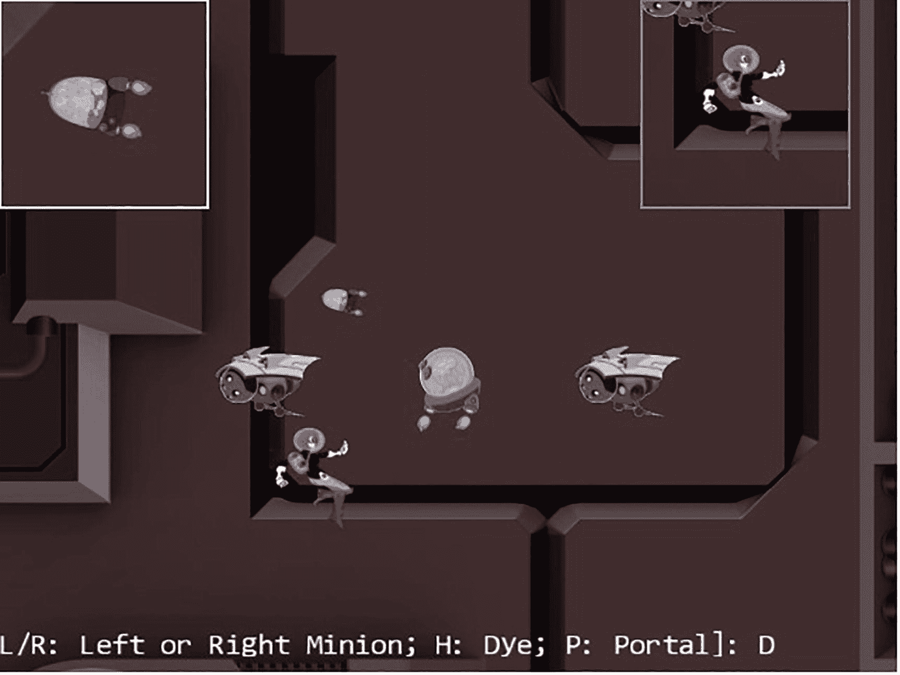

图 7-9

运行多摄像机项目

该项目的控件与之前的项目相同:

*   **Q 键**:启动`Dye`角色的位置摆动和相机抖动效果。

*   **WASD 键**:移动`Dye`角色(`Hero`对象)。请注意，当`Hero`对象试图移动超过 WC 边界的 90%时，相机 WC 窗口会随之更新。

*   **箭头键**:移动`Portal`对象。注意`Portal`对象不能移动超过 WC 边界的 80%。

*   **L/R/P/H 键**:选择`Left` minion、`Right` minion、`Portal` object 或`Hero` object 成为焦点对象。L/R 键还将相机设置为聚焦在`Left`或`Right`小按钮上。

*   **N/M 键**:放大或缩小相机中心。

*   **J/K 键**:放大或缩小，同时保证当前焦点物体的相对位置不变。换句话说，当相机缩放时，除了焦点对准的对象之外，所有对象的位置都将改变。

该项目的目标如下:

*   理解将视图呈现到游戏世界的摄像机抽象

*   体验在同一个游戏关卡中使用多台摄像机

*   为了理解插值配置对于具有特定目的的相机的重要性

与前面的项目一样，您可以在`assets`文件夹中找到外部资源文件。

#### 改装相机

相机对象将被稍微修改，以允许绘制带有边界的视口。这将允许在画布上轻松区分相机视图。

1.  编辑`camera_main.js`并修改`Camera`构造函数，允许程序员定义一个`bound`数量的像素来包围摄像机的视口:

```js
constructor(wcCenter, wcWidth, viewportArray, bound) {
    this.mCameraState = new CameraState(wcCenter, wcWidth);
    this.mCameraShake = null;

    this.mViewport = [];  // [x, y, width, height]
    this.mViewportBound = 0;
    if (bound !== undefined) {
        this.mViewportBound = bound;
    }
    this.mScissorBound = [];  // use for bounds
    this.setViewport(viewportArray, this.mViewportBound);

    // Camera transform operator
    this.mCameraMatrix = mat4.create();

    // background color
    this.mBGColor = [0.8, 0.8, 0.8, 1]; // RGB and Alpha
}

```

请参考下面的`setViewport()`功能。默认情况下，`bound`被假设为零，相机会绘制到整个`mViewport`。当非零时，`mViewport`周围的`bound`个像素将作为背景色，从而允许在画布上轻松区分多个视口。

1.  定义`setViewport()`功能:

```js
setViewport(viewportArray, bound) {
    if (bound === undefined) {
        bound = this.mViewportBound;
    }
    // [x, y, width, height]
    this.mViewport[0] = viewportArray[0] + bound;
    this.mViewport[1] = viewportArray[1] + bound;
    this.mViewport[2] = viewportArray[2] - (2 * bound);
    this.mViewport[3] = viewportArray[3] - (2 * bound);
    this.mScissorBound[0] = viewportArray[0];
    this.mScissorBound[1] = viewportArray[1];
    this.mScissorBound[2] = viewportArray[2];
    this.mScissorBound[3] = viewportArray[3];
}

```

回想一下，当设置相机视口时，调用`gl.scissor()`函数来定义要清除的区域，调用`gl.viewport()`函数来标识要绘制的目标区域。以前，剪刀和视口边界是相同的，而在这种情况下，请注意实际的`mViewport`边界是比`mScissorBound`小的`bound`个像素。这些设置允许`mScissorBound`标识将被清除为背景色的区域，而`mViewport`边界定义用于绘制的实际画布区域。这样，视窗周围的`bound`数量的像素将保持背景色。

1.  定义`getViewport()`函数来返回为该摄像机保留的实际边界。在这种情况下，它是`mScissorBound`,而不是可能更小的视口边界。

1.  修改`setViewAndCameraMatrix()`函数，用`mScissorBound`绑定剪刀边界，而不是视口边界:

```js
getViewport() {
    let out = [];
    out[0] = this.mScissorBound[0];
    out[1] = this.mScissorBound[1];
    out[2] = this.mScissorBound[2];
    out[3] = this.mScissorBound[3];
    return out;
}

```

```js
setViewAndCameraMatrix() {
    let gl = glSys.get();
    ... identical to previous code ...
    // Step A2: set up corresponding scissor area to limit clear area
    gl.scissor(this.mScissorBound[0], // x of bottom-left corner
        this.mScissorBound[1], // y position of bottom-left corner
        this.mScissorBound[2], // width of the area to be drawn
        this.mScissorBound[3]);// height of the area to be drawn

    ... identical to previous code ...
}

```

#### 在我的游戏中测试多个摄像头

`MyGame`关卡必须创建多个摄像头，对其进行适当配置，并独立绘制每个摄像头。为了便于演示，将创建两个新的`Camera`对象，一个聚焦于`Hero`对象，另一个聚焦于追逐的`Brain`对象。和前面的例子一样，`MyGame`级别的实现基本上是相同的。在这个例子中，`init()`、`draw()`和`update()`功能的一些部分被修改以处理多个`Camera`对象，并且被突出显示。

1.  修改`init()`函数来定义三个`Camera`对象。`mHeroCam`和`mBrainCam`都为它们的视窗定义了一个两像素的边界，其中`mHeroCam`的边界被定义为灰色(背景色)，而`mBrainCam`为白色。注意`mBrainCam`对象的刚性插值设置通知相机插值在十个周期内收敛到新值。

1.  定义一个辅助函数来绘制三台摄像机共有的世界:

```js
init() {
    // Step A: set up the cameras
    this.mCamera = new engine.Camera(
       vec2.fromValues(50, 36), // position of the camera
       100,                     // width of camera
       [0, 0, 640, 480]         // viewport (orgX, orgY, width, height)
    );
    this.mCamera.setBackgroundColor([0.8, 0.8, 0.8, 1]);
    // sets the background to gray

    this.mHeroCam = new engine.Camera(
        vec2.fromValues(50, 30), // update each cycle to point to hero
        20,
        [490, 330, 150, 150],
        2                           // viewport bounds
     );
    this.mHeroCam.setBackgroundColor([0.5, 0.5, 0.5, 1]);

    this.mBrainCam = new engine.Camera(
        vec2.fromValues(50, 30),  // update each cycle to point to brain
        10,
        [0, 330, 150, 150],
        2                           // viewport bounds
    );
    this.mBrainCam.setBackgroundColor([1, 1, 1, 1]);
    this.mBrainCam.configLerp(0.7, 10);

    ... identical to previous code ...
}

```

1.  修改`MyGame`对象`draw()`函数来绘制所有三个摄像机。注意到`mMsg`物体只被吸引到主摄像机`mCamera`。因此，回声消息将只出现在主摄像机的视窗中。

```js
_drawCamera(camera) {
    camera.setViewAndCameraMatrix();
    this.mBg.draw(camera);
    this.mHero.draw(camera);
    this.mBrain.draw(camera);
    this.mPortal.draw(camera);
    this.mLMinion.draw(camera);
    this.mRMinion.draw(camera);
}

```

1.  修改`update()`函数，用相应的对象平移`mHeroCam`和`mBrainCam`，并连续移动`mHeroCam`视口；

```js
draw() {
    // Step A: clear the canvas
    engine.clearCanvas([0.9, 0.9, 0.9, 1.0]); // clear to light gray

    // Step  B: Draw with all three cameras
    this._drawCamera(this.mCamera);
    this.mMsg.draw(this.mCamera);   // only draw status in main camera
    this._drawCamera(this.mHeroCam);
    this._drawCamera(this.mBrainCam);

}

```

Note

在游戏过程中，视窗通常不会改变它们的位置。出于测试目的，以下代码在画布中从左到右连续移动`mHeroCam`视口。

```js
update() {
    let zoomDelta = 0.05;
    let msg = "L/R: Left or Right Minion; H: Dye; P: Portal]: ";

    this.mCamera.update();  // for smoother camera movements
    this.mHeroCam.update();
    this.mBrainCam.update();

    ... identical to previous code ...

    // set the hero and brain cams
    this.mHeroCam.panTo(this.mHero.getXform().getXPos(),
                        this.mHero.getXform().getYPos());
    this.mBrainCam.panTo(this.mBrain.getXform().getXPos(),
                         this.mBrain.getXform().getYPos());

    // Move the hero cam viewport just to show it is possible
    let v = this.mHeroCam.getViewport();
    v[0] += 1;
    if (v[0] > 500) {
        v[0] = 0;
    }
    this.mHeroCam.setViewport(v);

    this.mMsg.setText(msg + this.mChoice);
}

```

现在，您可以运行项目，并注意 HTML 画布上显示的三个不同的视口。围绕`mHeroCam`和`mBrainCam`视口的两个像素宽的边界允许对三个视图进行简单的视觉解析。注意到`mBrainCam`视口被绘制在`mHeroCam`的顶部。这是因为在`MyGame.draw()`功能中，`mBrainCam`是最后绘制的。最后绘制的对象总是出现在顶部。您可以移动`Hero`对象来观察`mHeroCam`跟随英雄，并体验平移相机的平滑插值结果。

现在尝试更改`mBrainCam.configLerp()`函数的参数以生成更平滑的插值结果，例如将刚度设置为 0.1，持续时间设置为 100 次循环。请注意，似乎摄像机一直在试图捕捉`Brain`物体。在这种情况下，相机需要一个硬插值设置，以确保主对象保持在相机视图的中心。为了获得更激烈和有趣的效果，你可以尝试设置`mBrainCam`以获得更平滑的插值结果，例如刚度值为 0.01，持续时间为 200 个周期。有了这些值，摄像机永远也追不上`Brain`物体，看起来就像在游戏世界里漫无目的地游荡。

## 通过相机的鼠标输入

鼠标是一种指示输入设备，它报告画布坐标空间中的位置信息。回想一下第 [3](03.html) 章的讨论，画布坐标空间只是相对于画布左下角沿 x/y 轴的像素偏移的度量。请记住，游戏引擎定义并使用 WC 空间，其中所有对象和度量都在 WC 中指定。为了让游戏引擎使用报告的鼠标位置，这个位置必须从画布坐标空间转换到 WC。

图 [7-10](#Fig10) 左侧的图显示了一个鼠标位置位于画布上`(mouseX, mouseY)`的例子。图 [7-10](#Fig10) 右侧的图显示，当左下角的视口位于( *V* <sub>*x*</sub> ， *V* <sub>*y*</sub> )且尺寸为*W*<sub>T22】V</sub>×*H*<sub>*V*时</sub>

*   mousecx = mouex-*v*<sub>*x*</sub>

*   mouseDCY = mouseY*V*<sub>T3】yT5】</sub>

这样，`(mouseDCX, mouseDCY)`就是从( *V* <sub>*x*</sub> ， *V* <sub>*y*</sub> )开始的偏移量，视口的左下角。

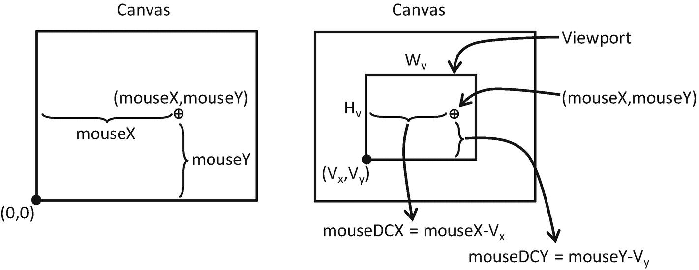

图 7-10

鼠标在画布和视窗上的位置

图 [7-11](#Fig11) 中的左图显示了设备坐标(DC)空间定义了视口内的像素位置，其偏移量是相对于视口的左下角测量的。为此，DC 空间也被称为像素空间。计算出的`(mouseDCX, mouseDCY)`位置是 DC 空间中位置的一个例子。图 [7-11](#Fig11) 中的右图显示，根据这些公式，该位置可以转化为左下角位于`(minWCX, minWCY)`且尺寸为*W*<sub>*WC*×H*<sub>*WC*</sub>的 WC 空间:*</sub>

 *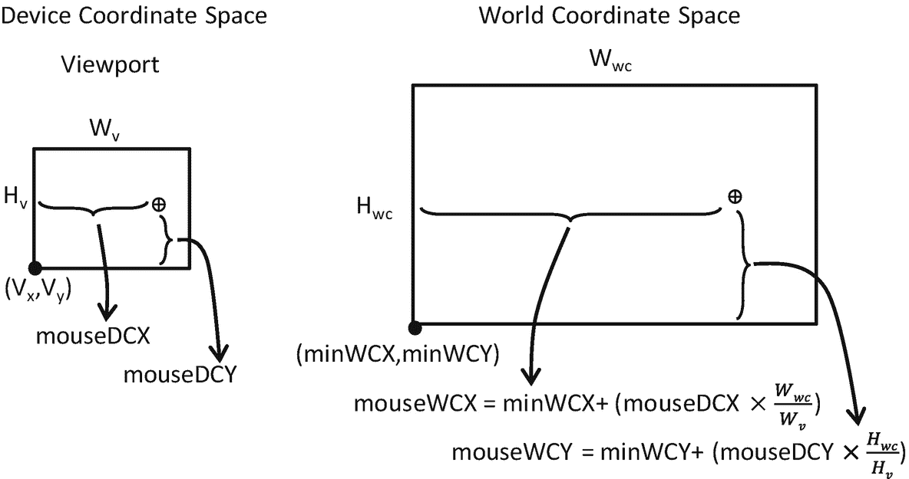

图 7-11

视口 DC 空间和厕所空间中的鼠标位置

*   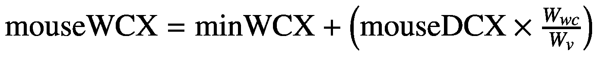

*   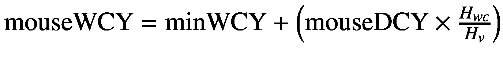

了解了如何将位置从画布坐标空间转换到 WC 空间后，现在就可以在游戏引擎中实现鼠标输入支持了。

### 鼠标输入项目

这个项目演示了游戏引擎中的鼠标输入支持。你可以在图 [7-12](#Fig12) 中看到这个项目运行的例子。这个项目的源代码在`chapter7/7.5.mouse_input`文件夹中定义。

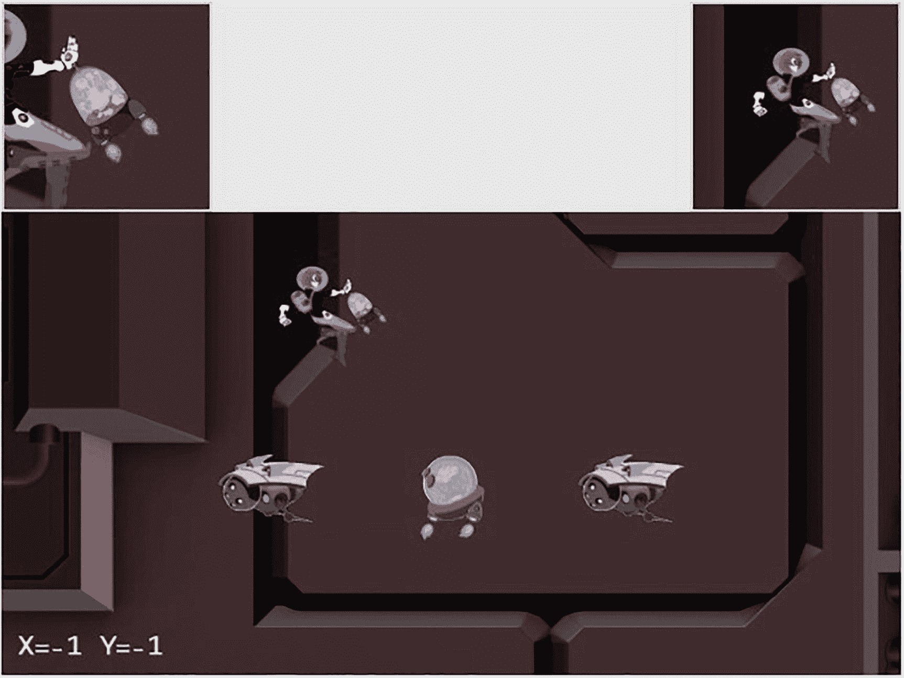

图 7-12

运行鼠标输入项目

该项目的新控件如下:

*   **在主** `Camera` **视图**中点击鼠标左键:拖动`Portal`对象

*   **在** `HeroCam` **视图**中点击鼠标中键:拖动`Hero`对象

*   **在任何视图中点击鼠标右键/中键**:隐藏/显示`Portal`对象

以下控件与之前的项目相同:

*   **Q 键**:启动`Dye`角色的位置摆动和相机抖动效果

*   **WASD 键**:移动`Dye`角色(`Hero`对象)并推动摄像机 WC 边界

*   **箭头键**:移动`Portal`对象

*   **L/R/P/H 键**:用 L/R 键选择焦点对准的物体，将相机重新聚焦到`Left`或`Right`迷你

*   **N/M 和 J/K 键**:放大或缩小相机中心或对焦对象

该项目的目标如下:

*   理解画布坐标空间到 WC 空间的转换

*   为了理解区分鼠标事件的视口的重要性

*   实现坐标空间之间的转换

*   支持和体验使用鼠标输入

与前面的项目一样，您可以在`assets`文件夹中找到外部资源文件。

#### 修改 index.js 以将画布 ID 传递给输入组件

为了接收鼠标输入信息，`input`组件需要访问 HTML 画布。编辑`index.js`并修改`init()`函数，以便在初始化时将`htmlCamvasID`传递给`input`组件。

```js
... identical to previous code ...

// general engine utilities
function init(htmlCanvasID) {
    glSys.init(htmlCanvasID);
    vertexBuffer.init();
    input.init(htmlCanvasID);
    audio.init();
    shaderResources.init();
    defaultResources.init();
}

... identical to previous code ...

```

#### 在 input.js 中实现鼠标支持

与键盘输入类似，您应该通过编辑`input.js`为输入模块添加鼠标支持:

1.  编辑`input.js`并定义代表三个鼠标按钮的常量:

1.  定义支持鼠标输入的变量。与键盘输入类似，鼠标按钮状态是三个布尔元素的数组，每个元素代表三个鼠标按钮的状态。

```js
// mouse button enums
const eMouseButton = Object.freeze({
    eLeft: 0,
    eMiddle: 1,
    eRight: 2
});

```

1.  定义鼠标移动事件处理程序:

```js
let mCanvas = null;
let mButtonPreviousState = [];
let mIsButtonPressed = [];
let mIsButtonClicked = [];
let mMousePosX = -1;
let mMousePosY = -1;

```

```js
function onMouseMove(event) {
    let inside = false;
    let bBox = mCanvas.getBoundingClientRect();
    // In Canvas Space now. Convert via ratio from canvas to client.
    let x = Math.round((event.clientX - bBox.left) *
                       (mCanvas.width / bBox.width));
    let y = Math.round((event.clientY - bBox.top) *
                       (mCanvas.height / bBox.height));

    if ((x >= 0) && (x < mCanvas.width) &&
        (y >= 0) && (y < mCanvas.height)) {
        mMousePosX = x;
        mMousePosY = mCanvas.height - 1 - y;
        inside = true;
    }
    return inside;
}

```

请注意，鼠标事件处理程序将原始像素位置转换到画布坐标空间，首先检查该位置是否在画布的边界内，然后翻转 y 位置，以便相对于左下角测量位移。

1.  定义鼠标按钮单击处理程序来记录按钮事件:

1.  定义鼠标按钮释放处理程序，以便于检测鼠标按钮单击事件。回想一下第 [4](04.html) 章中关于键盘输入的讨论，为了检测按钮弹起事件，你应该测试之前被释放并且当前被点击的按钮状态。`mouseUp()`处理程序记录鼠标按钮的释放状态。

```js
function onMouseDown(event) {
    if (onMouseMove(event)) {
        mIsButtonPressed[event.button] = true;
    }
}

```

1.  修改`init()`函数以接收`canvasID`参数并初始化鼠标事件处理程序:

```js
function onMouseUp(event) {
    onMouseMove(event);
    mIsButtonPressed[event.button] = false;
}

```

1.  修改`update()`函数，以类似于键盘的方式处理鼠标按钮的状态变化。请注意鼠标单击条件，即以前没有单击的按钮现在被单击了。

```js
function init(canvasID) {
    let i;

    // keyboard support
    ... identical to previous code ...

    // Mouse support
    for (i = 0; i < 3; i++) {
        mButtonPreviousState[i] = false;
        mIsButtonPressed[i] = false;
        mIsButtonClicked[i] = false;
    }
    window.addEventListener('mousedown', onMouseDown);
    window.addEventListener('mouseup', onMouseUp);
    window.addEventListener('mousemove', onMouseMove);
    mCanvas = document.getElementById(canvasID);
}

```

1.  定义检索鼠标位置和鼠标按钮状态的函数:

```js
function update() {
    let i;
    // update keyboard input state
    ... identical to previous code ...

    // update mouse input state
    for (i = 0; i < 3; i++) {
        mIsButtonClicked[i] = (!mButtonPreviousState[i]) &&
                              mIsButtonPressed[i];
        mButtonPreviousState[i] = mIsButtonPressed[i];
    }
}

```

1.  最后，记住导出新定义的功能:

```js
function isButtonPressed(button) { return mIsButtonPressed[button]; }
function isButtonClicked(button) { return mIsButtonClicked[button]; }

function getMousePosX() { return mMousePosX; }
function getMousePosY() { return mMousePosY; }

```

```js
export {
    keys, eMouseButton,

    init, cleanUp, update,

    // keyboard
    isKeyClicked, isKeyPressed,

    // mouse
    isButtonClicked, isButtonPressed, getMousePosX, getMousePosY
}

```

#### 修改相机以支持视口到 WC 空间的转换

`Camera`类封装了 WC 窗口和视口，因此应该负责转换鼠标位置。回想一下，为了保持可读性，`Camera`类的源代码文件是根据功能进行分离的。该类的基本功能在`camera_main.js`中定义。`camera_manipulate.js`文件从`camera_main.js`导入并定义额外的操作功能。最后，`camera.js`文件从`camera_manipulate.js`导入以包含所有已定义的函数，并导出`Camera`类以供外部访问。

对于`Camera`类，这种从后续源代码文件导入以定义额外函数的链接将继续，其中`camera_input.js`定义输入功能:

1.  在`src/engine/cameras`文件夹中创建一个新文件，并将其命名为`camera_input.js`。这个文件将通过定义鼠标输入支持函数来扩展`Camera`类。导入以下文件:
    *   `camera_manipulation.js`为`Camera`类定义的所有函数

    *   `eViewport`用于访问视窗阵列的常数

    *   `input`访问鼠标相关功能的模块

1.  定义函数将鼠标位置从画布坐标空间转换到 DC 空间，如图 [7-10](#Fig10) 所示:

```js
import Camera from "./camera_manipulation.js";
import { eViewport } from "./camera_main.js";
import * as input from "../input.js";

... implementation to follow ...

export default Camera;

```

1.  定义一个函数来确定给定的鼠标位置是否在摄像机的视口边界内:

```js
Camera.prototype._mouseDCX = function () {
    return input.getMousePosX() - this.mViewport[eViewport.eOrgX];
}

Camera.prototype._mouseDCY = function() {
    return input.getMousePosY() - this.mViewport[eViewport.eOrgY];
}

```

1.  定义将鼠标位置转换到 WC 空间的函数，如图 7-11 所示:

```js
Camera.prototype.isMouseInViewport = function () {
    let dcX = this._mouseDCX();
    let dcY = this._mouseDCY();
    return ((dcX >= 0) && (dcX < this.mViewport[eViewport.eWidth]) &&
            (dcY >= 0) && (dcY < this.mViewport[eViewport.eHeight]));
}

```

```js
Camera.prototype.mouseWCX = function () {
    let minWCX = this.getWCCenter()[0] - this.getWCWidth() / 2;
    return minWCX + (this._mouseDCX() *
           (this.getWCWidth() / this.mViewport[eViewport.eWidth]));
}

Camera.prototype.mouseWCY = function () {
    let minWCY = this.getWCCenter()[1] - this.getWCHeight() / 2;
    return minWCY + (this._mouseDCY() *
           (this.getWCHeight() / this.mViewport[eViewport.eHeight]));
}

```

最后，更新`Camera`类访问文件以正确导出新定义的输入功能。这是通过编辑`camera.js`文件并用`camera_input.js`替换从`camera_manipulate.js`的导入来完成的:

```js
import Camera from "./camera_input.js";
export default Camera;

```

#### 在 MyGame 中测试鼠标输入

要测试的主要功能包括检测哪个视图应该接收鼠标输入、对鼠标按钮状态变化做出反应以及将鼠标单击像素位置转换到 WC 空间的能力。和前面的例子一样，`my_game.js`的实现和前面的项目很相似。在这种情况下，只有`update()`函数包含与新的鼠标输入功能一起工作的值得注意的变化。

```js
update() {
    ... identical to previous code ...

    msg = "";
    // testing the mouse input
    if (engine.input.isButtonPressed(engine.input.eMouseButton.eLeft)) {
        msg += "[L Down]";
        if (this.mCamera.isMouseInViewport()) {
            this.mPortal.getXform().setXPos(this.mCamera.mouseWCX());
            this.mPortal.getXform().setYPos(this.mCamera.mouseWCY());
        }
    }

    if (engine.input.isButtonPressed(engine.input.eMouseButton.eMiddle)){
        if (this.mHeroCam.isMouseInViewport()) {
            this.mHero.getXform().setXPos(this.mHeroCam.mouseWCX());
            this.mHero.getXform().setYPos(this.mHeroCam.mouseWCY());
        }
    }
    if (engine.input.isButtonClicked(engine.input.eMouseButton.eRight)) {
        this.mPortal.setVisibility(false);
    }

    if (engine.input.isButtonClicked(engine.input.eMouseButton.eMiddle)){
        this.mPortal.setVisibility(true);
    }

    msg += " X=" + engine.input.getMousePosX() +
           " Y=" + engine.input.getMousePosY();
    this.mMsg.setText(msg);
}

```

当视口环境很重要时，检查`camera.isMouseInViewport()`条件，如在主摄像机视图中单击鼠标左键或在`mHeroCam`视图中单击鼠标中键。这与点击鼠标右键或中键来设置`Portal`对象的可见性形成对比。无论鼠标位置在哪里，这两次鼠标点击都会导致执行。

您现在可以运行项目并验证到 WC 空间的转换的正确性。在主视图中点击并拖动鼠标左键，或在`mHeroCam`视图中点击并拖动鼠标中键，观察相应对象随着鼠标位置变化的准确移动。在错误视图中的鼠标左键或中键拖动操作对相应的对象没有影响。例如，在`mHeroCam`或`mBrainCam`视图中拖动鼠标左键对`Portal`对象没有影响。但是，请注意，鼠标右键或鼠标中键点击控制`Portal`对象的可见性，与鼠标指针的位置无关。请注意，浏览器会将鼠标右键单击映射到默认的弹出菜单。因此，你应该避免在游戏中点击鼠标右键。

## 摘要

这一章是关于控制和交互`Camera`对象的。您已经了解了最常见的相机操作，包括夹紧、平移和缩放。这些操作在游戏引擎中实现，具有将高级规范映射到实际 WC 窗口边界参数的效用函数。插值的引入缓解了相机操作带来的突然、通常令人讨厌且可能令人困惑的移动。通过实现相机抖动效果，您已经发现一些运动可以通过简单的数学公式来建模。您还体验了有效的`Camera`对象抽象在支持多个摄像机视图中的重要性。最后一节指导您完成了将鼠标位置从画布坐标空间转换到 WC 空间的实现。

在第 [5](05.html) 章中，您了解了如何用视觉上吸引人的图像来表示和绘制一个对象，以及如何控制这个对象的动画。在第 6 章[中，你会读到如何定义一个抽象来封装一个对象的行为，以及检测对象间冲突所需的基本支持。这一章是关于这些对象的“指导”:什么应该是可见的，焦点应该在哪里，要显示多少世界，如何确保焦点之间的平滑过渡，以及如何从鼠标接收输入。有了这些功能，您现在就有了一个全面的游戏引擎框架，可以表示和绘制对象，建模和管理对象的行为，并控制如何、在哪里以及显示什么对象。](06.html)

接下来的章节将继续在更高级的水平上检查对象的外观和行为，包括在 2D 世界中创建灯光和照明效果，并基于简单的经典力学模拟和集成行为。

### 游戏设计注意事项

您已经学习了对象交互的基础知识，现在是开始考虑创建您的第一个简单游戏机制并尝试构成良好游戏体验的逻辑条件和规则的好时机。许多设计师自上而下地进行游戏创作(这意味着他们从实现特定类型的想法开始，如实时策略、塔防或角色扮演游戏)，这可能是我们在视频游戏等行业中所期望的，在视频游戏行业中，创作者通常会花相当多的时间作为内容消费者，然后转变为内容制作者。游戏工作室经常强化这种自上而下的设计方法，指派新员工在经验丰富的领导下工作，以学习特定工作室工作的任何类型的最佳实践。事实证明，这对于训练能够胜任地重复已知风格的设计师是有效的，但这并不总是培养能够从头开始设计全新系统和机制的全面创作者的最佳途径。

前面提到的可能会让我们问，“是什么让游戏性形成的很好？”从根本上来说，游戏是一种互动的体验，在这种体验中，必须学习并应用规则来达到特定的结果；所有游戏都必须满足这一最低标准，包括卡牌、棋盘、实体、视频和其他游戏类型。更进一步说，一个好的游戏是一种互动的体验，人们喜欢学习和应用规则，以达到他们觉得投入的结果。当然，在这个简短的定义中有相当多的东西要解开，但作为一个一般规则，当规则是可发现的，一致的，有逻辑意义的，并且当结果感觉像是对掌握这些规则的满意奖励时，玩家会更喜欢游戏。这个定义适用于单个游戏机制和整个游戏体验。用一个比喻来说，把游戏设计想象成由字母(交互)组成的单词(机制)组成的句子(层次)最终形成可读的内容(类型)是很有帮助的。大多数新设计师试图在他们知道字母表之前写小说，每个人都玩过这样的游戏，其中的机制和水平充其量感觉像是用糟糕的语法写的句子，最糟糕的感觉像是令人不满意的、随机混杂的不知所云的字母。

在接下来的几章中，你将了解到 2D 游戏引擎中更多的高级特性，包括照明和物理行为的模拟。您还将了解一套设计技术，使您能够交付一个完整且结构良好的游戏关卡，整合这些技术，并有意识地利用第 [4](04.html) 章中讨论的游戏设计的九个元素，从头开始提供统一的体验。在设计探索的早期阶段，只关注创建和提炼基本的游戏机制和交互模型通常是有帮助的；在这个阶段，尽量避免考虑设定、元游戏、系统设计之类的东西(随着设计的进展，这些会被合并到设计中)。

我们将探索的第一个设计技巧是一个简单的练习，它允许你开始学习游戏设计字母表:一个“逃离房间”的场景，其中有一个简单的机械装置，你必须完成一个任务才能打开一扇门并获得奖励。这个练习将帮助您深入了解如何创建可发现且一致的格式良好的逻辑规则，当任务被划分为基本的交互时，这将更容易完成。你已经在早期的项目中探索了潜在的基于规则的场景的开端:回想一下第 4 章中的键盘支持项目，它建议你可以让玩家将一个较小的方块完全移动到一个较大方块的边界，以触发某种行为。那种单一的互动(或“游戏字母表的字母”)如何结合起来形成一种有意义的游戏机制(或“单词”)？图 [7-13](#Fig13) 为上锁的房间拼图搭建舞台。

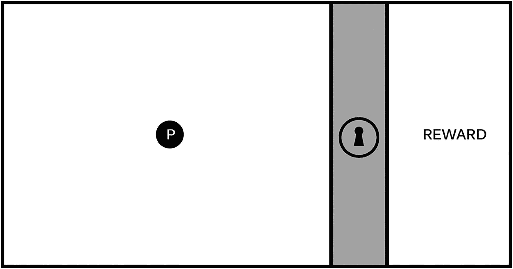

图 7-13

该图像表示一个分成三个区域的游戏屏幕。左边是一个可玩的区域，有一个英雄人物(标有 P 的圆圈)，一个标有锁图标的不可逾越的障碍，右边是一个奖励区

图 [7-13](#Fig13) 所示的屏幕是探索新机制的有用起点。这个练习的目标是创建一个玩家必须完成的逻辑挑战，以解锁障碍并获得奖励。任务的具体性质可以基于广泛的基础力学:它可能涉及跳跃或射击、解谜、叙事情境等。关键是保持第一次迭代的简单(第一次挑战应该有有限数量的组成部分有助于解决问题)和可发现性(玩家必须能够试验和学习参与规则，以便他们能够有意识地解决挑战)。在以后的迭代中，您将为这个机制增加复杂性和趣味性，并且您将看到基本机制如何发展以支持多种类型的游戏。

图 [7-14](#Fig14) 为逻辑关系机制搭建了舞台，玩家必须与环境中的物体互动以学习规则。

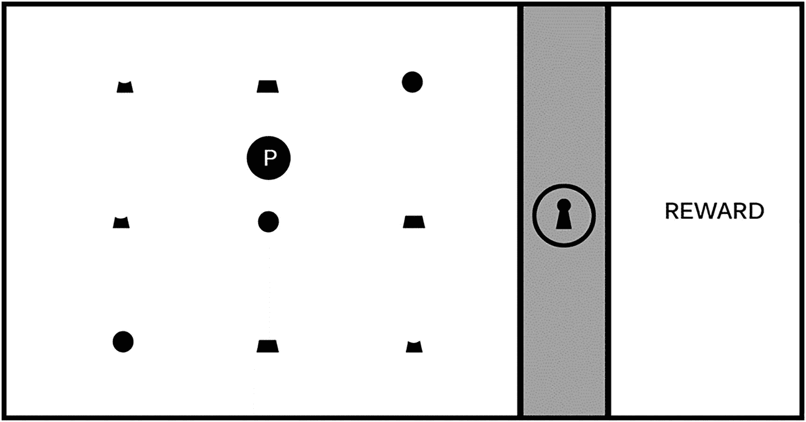

图 7-14

游戏屏幕上有各种各样的单个对象

仅仅看着图 [7-14](#Fig14) 并不能立即看出玩家需要做什么来解锁障碍，因此他们必须进行实验以了解游戏世界的运行规则；正是这种实验形成了游戏机制的核心元素，推动玩家在关卡中前进，而基于其规则的可发现性和逻辑一致性，该机制或多或少会令人满意。在这个例子中，想象一下，当玩家在游戏屏幕上四处移动时，他们注意到当英雄人物与一个物体交互时，它总是以高亮的方式“激活”，如图 [7-15](#Fig15) 所示，有时会导致锁图标的一部分和锁图标周围三分之一的圆环发光。然而，有些形状在激活时不会使锁和环发光，如图 [7-16](#Fig16) 所示。

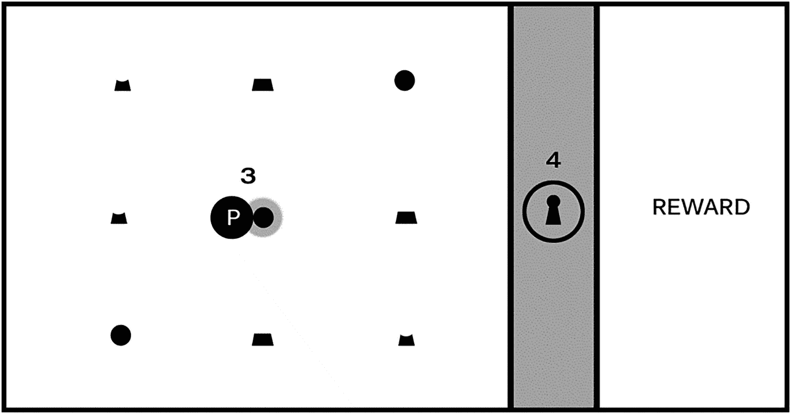

图 7-16

激活某些形状(#3)不会导致锁和环发光(#4)

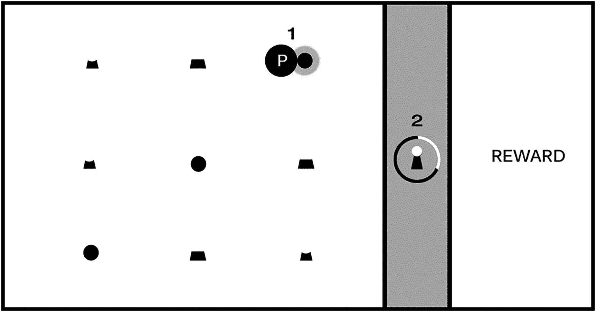

图 7-15

当玩家在游戏屏幕上移动英雄角色时，这些形状会高亮显示(# 1)；激活某些形状会使锁的一部分和周围环的三分之一发光(#2)

精明的玩家会很快学会这个谜题的规则。仅从图 [7-15](#Fig15) 和 [7-16](#Fig16) 中你能猜出它们可能是什么吗？如果你觉得卡住了，图 [7-17](#Fig17) 应该提供足够的信息来解决这个难题。

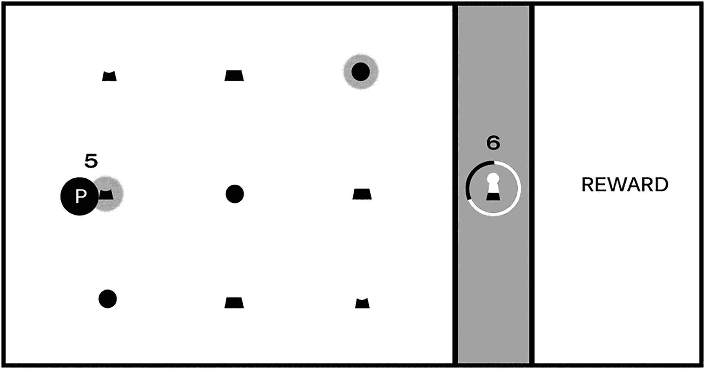

图 7-17

如图 [7-15](#Fig15) 所示，激活第一个物体(右上角的圆圈)并使锁的顶部和环的前三分之一发光后，正确序列中的第二个物体(#5)使锁的中部和环的前三分之二发光(#6)

你(和玩家)现在应该有所有需要的线索来学习这个机制的规则和解决这个难题。玩家可以与三种形状进行交互，每一行中每种形状只有一个实例；这些形状分别代表锁图标的顶部、中部和底部，如图 [7-15](#Fig15) 所示，激活圆形会使锁的相应部分发光。然而，图 [7-16](#Fig16) 并没有使锁的相应部分发光，不同之处在于这种机制的“挂钩”:锁的各个部分必须在正确的相对位置被激活:顶在顶行的顶部，中间在中间行，底部在底部(你也可以选择要求玩家从顶部开始以正确的顺序激活它们，尽管这一要求仅从图 [7-15](#Fig15) 到 [7-17](#Fig17) 中看不出)。

恭喜你，你现在已经创建了一个格式良好且逻辑一致(如果简单)的谜题，具备了构建更大、更有野心的关卡所需的所有元素！这种解锁序列是一种没有叙事背景的游戏机制:在设计的这个阶段，游戏屏幕故意没有游戏设置、视觉风格或流派排列，因为我们不想让任何先入为主的预期给我们的探索带来负担。作为一名设计师，在添加更高层次的游戏元素(如叙事和流派)之前，花时间探索最纯粹的游戏机制会让你受益匪浅，你可能会对意想不到的方向感到惊讶，这些简单的机制将带你构建它们。

像这个例子中的简单机制可以被描述为“以正确的顺序完成一个多阶段的任务以达到一个目标”,并且在许多种类的游戏中有特色；例如，任何需要玩家收集一个物体的各个部分并把它们组合成一个清单来完成挑战的游戏，都利用了这种机制。单独的机制也可以与其他机制和游戏功能相结合，形成复合元素，为您的游戏体验增加复杂性和风味。

这一章中的相机练习提供了很好的例子，告诉你如何增加一个机械师的兴趣；例如，简单的相机操作项目演示了一种推进游戏动作的方法。想象一下，在前面的例子中，当一个玩家获得解锁屏障的奖励后，他们将英雄对象移动到屏幕的右侧，并前进到一个新的“房间”或区域。现在想象一下，当关卡开始时，如果相机以固定的速度推进屏幕，游戏将会发生怎样的变化；自动滚动的加入极大地改变了这种机制，因为玩家必须在前进的障碍将玩家推出屏幕之前解决难题并解锁障碍。第一个实例创建了一个悠闲的解谜游戏体验，而后者通过给玩家有限的时间来完成每个屏幕，大大增加了紧张感。在自动滚动实现中，你如何安排游戏屏幕以确保玩家有足够的时间学习规则和解决难题？

多摄像机项目作为一个小地图特别有用，它提供了游戏世界中当前没有显示在游戏屏幕上的地方的信息；在前面的练习中，假设锁定的关卡出现在游戏世界中除了玩家当前屏幕之外的其他地方，并且充当小地图的辅助相机显示整个游戏世界地图的缩小视图。作为游戏设计者，您可能希望让玩家知道他们何时完成了允许他们前进的任务，并提供关于他们下一步需要去哪里的信息，因此在这种情况下，您可以在小地图上闪烁一个信号灯，以引起对刚刚解锁的关卡的注意，并向玩家显示去哪里。在我们“游戏设计就像一种书面语言”的比喻中，添加额外的元素，如相机行为，以增强或扩展一个简单的机制，是开始形成“形容词”的一种方式，这些“形容词”增加了我们从游戏设计字母表中的字母创建的基本名词和动词的兴趣。

游戏设计师的主要挑战通常是创建需要巧妙实验的场景，同时保持逻辑一致性；通过创造需要创造性解决问题的曲折场景来挫败玩家是完全可以的(我们称之为“好的”挫败感)，但是通过创造逻辑上不一致的场景来挫败玩家，让玩家觉得他们在挑战中成功只是靠随机运气(“坏的”挫败感)，通常被认为是糟糕的设计。回想一下你玩过的导致糟糕挫败感的游戏:它们哪里出错了，设计者可以做些什么来改善体验？

上锁的房间场景是一个有用的设计工具，因为它迫使您构建基本的机制，但您可能会惊讶于此练习可以产生的各种场景。尝试一些不同的方法来解决上锁房间的难题，看看设计过程会把你带到哪里，但要保持简单。现在，保持专注于单步项目，以打开只需要玩家学习一个规则的空间。在下一章中，你将重温这个练习，并开始创建更有挑战性的机制。*