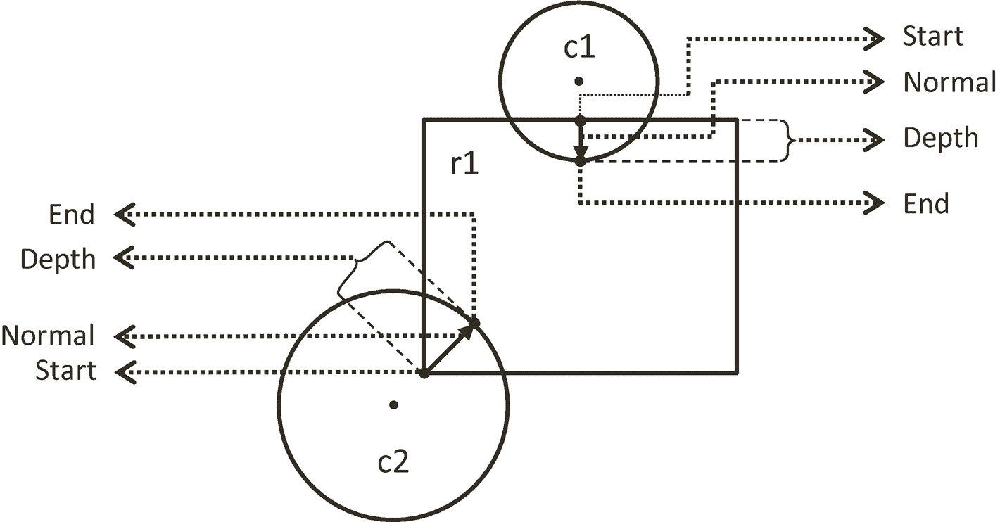
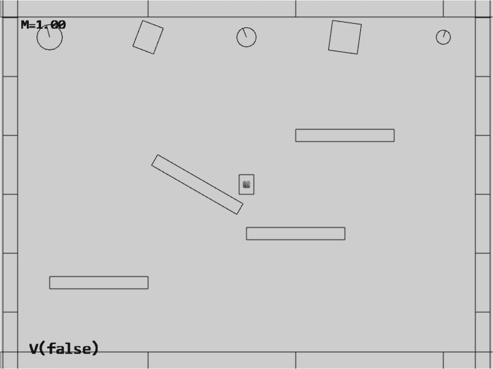

# 9.用刚性形状模拟世界

完成本章后，您将能够

*   认识到模拟真实世界物理交互的巨大计算复杂性和成本

*   了解典型的游戏引擎物理组件基于简单的几何图形(如圆形和矩形)来近似物理交互

*   实现圆形和矩形几何图形的精确碰撞

*   辛欧拉积分的近似牛顿运动公式

*   基于数值稳定松弛方法解决互穿碰撞

*   计算并实现对碰撞的响应，类似于真实世界中刚体的行为

## 介绍

在游戏引擎中，模拟能量转移的功能通常被称为物理、物理系统、物理组件或物理引擎。游戏引擎物理组件在许多类型的游戏中扮演着重要的角色。游戏物理学的主题范围很广，包括但不限于刚体、软体、流体动力学和车辆物理学。可信的物理行为和游戏对象的交互已经成为许多现代 PC 和主机游戏以及最近的浏览器和智能手机游戏的关键元素，例如，球的弹跳、果冻块的摆动、湖面的波纹或汽车的打滑。对这些进行适当的模拟和现实的再现正成为普遍的期望。

不幸的是，真实世界的精确模拟可能涉及大量的细节，需要深入的学科知识，其中潜在的数学模型可能很复杂，相关的计算成本高得令人望而却步。例如，汽车的打滑取决于其速度、轮胎特性等。；湖面上的波纹取决于它的成因、湖面的大小等等。；果冻块的摆动取决于其密度、初始变形等。即使在非常简单的情况下，球的反弹也取决于它的材料、膨胀状态，理论上甚至取决于周围空气的粒子浓度。现代游戏引擎物理组件通过限制物理交互的类型和简化模拟计算的要求来解决这些复杂性。

物理引擎通常限制和模拟孤立类型的物理交互，并且不支持交互类型的一般组合。例如，球反弹(刚体)的正确模拟通常不会支持球碰撞和抖动果冻块(柔体)，也不会精确模拟球与流体交互(流体动力学)所导致的涟漪效果。也就是说，通常刚体物理引擎不支持与柔体对象、流体或车辆的交互。同样，柔体物理引擎通常不允许与刚体或其他类型的物理对象进行交互。

此外，物理引擎通常近似一个大大简化的交互模型，同时主要关注于获得视觉上令人信服的结果。这种简化通常是以对物体几何形状和物理属性的假设的形式，并且将限制性交互规则应用于游戏世界中的选择性子集。例如，刚体物理引擎通常以下列方式简化对象的交互:

*   假设对象是质量均匀分布的连续几何形状，其中质心位于几何形状的中心

*   用简单的弹性和摩擦力来近似物体的材质属性

*   表明物体在交互过程中不会改变形状

*   将模拟限制在游戏场景中选定的对象子集

基于这一组假设，刚体物理模拟或刚体模拟能够捕捉和再现许多熟悉的现实世界物理交互，如物体反弹、下落和碰撞，例如，一个完全充气的弹跳球或一个简单的 *Lego* 积木从桌子上反弹并落在硬木地板上。只要在碰撞过程中不发生变形，这些类型的刚体物理相互作用可以可靠地实时模拟。

具有均匀分布质量且在交互过程中不改变形状的物体可以应用于游戏中的许多重要且有用的场景。一般来说，刚体物理引擎非常适合模拟相互接触的移动对象，如保龄球与球瓶碰撞或炮弹击中装甲板。但是，重要的是要认识到，对于给定的一组假设，刚体物理模拟不支持以下内容:

*   由多个几何部分组成的对象，例如箭头

*   具有重要材料属性的物体，例如磁性

*   质量分布不均匀的物体，例如棒球棒

*   在碰撞过程中改变形状的物体，例如橡胶球

在所有真实世界的物理对象交互类型中，刚体交互是最容易理解的，最容易获得近似解决方案，实现起来也最简单。本章仅关注刚体模拟。

### 章节概述

与照明功能类似，游戏引擎的物理组件也是游戏引擎设计、架构和实现的一个大而复杂的领域。记住这一点，你将开发刚体物理组件的基础上，所有以前的游戏引擎组件相同的方法。也就是分析、理解和实现各个步骤，以逐步实现组件的核心功能。在物理组件的情况下，包含刚体模拟的主要思想包括以下内容:

*   **刚性形状和边界**:定义`RigidShape`类，通过对独立和简单的几何图形而不是潜在复杂的`Renderable`对象执行计算来支持优化模拟。这个主题将会被第一个专题，刚性形状和边界专题所涵盖。

*   **碰撞检测**:检查并执行数学运算以准确碰撞圆形和矩形`RigidShape`物体。一个重要的概念是，在数字世界中，刚性形状可以并且经常重叠，在`CollisionInfo`对象中保留这种重叠事件的细节是至关重要的。碰撞检测所涵盖的主题将由三个独立的项目讨论，每个项目侧重于一个独特的碰撞相互作用。它们包括
    *   圆形之间的碰撞:圆形碰撞和 CollisionInfo 项目

    *   矩形形状之间的碰撞:矩形碰撞项目

    *   矩形和圆形之间的碰撞:矩形和圆形碰撞项目

*   **运动**:在一个以固定间隔更新的世界中，近似描述运动的积分。关于运动的主题将包含在刚体运动项目中。

*   **碰撞物体的相互渗透**:用数值稳定的解决方案来解决碰撞刚性形状之间的相互渗透，从而逐步纠正这种情况。本课题在碰撞位置修正项目中提出。

*   **碰撞解决**:用脉冲法模拟碰撞响应。冲量法将包含在两个项目中，首先是在碰撞解决项目中没有旋转的简单情况，最后是在碰撞角度解决项目中考虑旋转。

## 严格的形状和界限

模拟任意刚性形状之间的相互作用所涉及的计算在算法上是复杂的，并且计算成本很高。由于这些原因，刚体模拟通常基于一组有限的简单几何图形，例如，刚性圆和矩形。在典型的游戏引擎中，可以将这些简单的刚性形状附加到几何复杂的游戏对象上，以近似模拟这些游戏对象之间的物理交互，例如，在宇宙飞船上附加刚性圆，并在刚性圆上执行刚体物理模拟，以近似模拟宇宙飞船之间的物理交互。

根据现实世界的经验，您知道简单的刚性形状只有在发生物理接触时才能相互作用。从算法上来说，这种观察转化为检测刚性形状之间的碰撞。为了进行正确的模拟，必须测试每个图形与其他图形的碰撞。这样，碰撞测试就是一个 O(n <sup>2</sup> 运算，其中 n 是参与模拟的形状数量。作为对这种高成本操作的优化，刚性形状通常由简单的几何图形(例如，圆)来界定，其中潜在的高成本碰撞计算仅在形状的边界重叠时调用。

### 刚性形状和边界项目

这个项目引入了具有简单循环边界的`RigidShape`类，用于碰撞优化。定义的`RigidShape`类将被集成到游戏引擎中，其中每个`GameObject`对象都将引用一个`Renderable`和一个`RigidShape`对象。将绘制`Renderable`对象，向玩家展示视觉上令人愉悦的游戏元素，而`RigidShape`将在近似`GameObject`对象行为的刚性形状模拟中进行处理。你可以在图 [9-1](#Fig1) 中看到这个项目运行的例子。该项目的源代码在`chapter9/9.1.rigid_shapes_and_bounds`中定义。


图 9-1

运行刚性形状和边界项目

该项目的控制措施如下:

*   **行为控制**:
    *   **G 键**:随机创建一个新的刚性圆或矩形

*   **绘制控件**:
    *   **T 键**:切换所有对象的纹理

    *   **R 键**:切换`RigidShape`的绘制

    *   **B 键**:切换各`RigidShape`上的装订绘图

*   **对象控件**:
    *   **左/右箭头键**:依次选择一个对象

    *   **WASD 键**:移动选中的对象。

    *   **Z/X 键**:旋转选中的对象。

    *   **Y/U 键**:增大/减小所选对象的`RigidShape`尺寸；这不会改变相应的`Renderable`对象的大小。

该项目的目标如下:

*   定义`RigidShape`类并与`GameObject`集成

*   证明一个`RigidShape`代表同一`GameObject`上的一个相应的`Renderable`几何图形

*   为建立刚体物理模拟器奠定基础

*   定义测试物理组件的初始场景

除了系统`font`文件夹，您还可以在`assets`文件夹中找到以下外部资源文件:

*   `minion_sprite.png`是为宠臣和英雄对象准备的。

*   `platform.png`和`wall.png`是测试场景中的水平和垂直边界对象。

*   `target.png`显示在当前选择的对象上。

#### 设置实施支持

您将通过首先设置实现支持来开始构建这个项目。首先，用新文件夹组织引擎源代码结构，以应对复杂性的增加。其次，定义用于可视化和正确性验证的调试工具。第三，扩展库对旋转刚性形状的支持。

##### 组织引擎源代码

在新组件的预期中，在`src/engine`文件夹中，创建`components`文件夹，并将`input.js`组件源代码文件移动到该文件夹中。这个文件夹将包含物理和其他组件的源代码，这些将在后面的章节中介绍。您必须编辑`camera_input.js`、`loop.js`和`index.js`来更新`input.js`的源代码文件位置变化。

##### 支持调试绘图

值得注意的是，只有一个`Renderable`对象，通常由一个`GameObject`引用，在游戏世界中实际上是可见的。刚性的形状在游戏世界中实际上是不存在的；它们被定义为近似模拟相应的`Renderable`物体的物理相互作用。为了支持正确的调试和正确性验证，能够绘制和可视化刚性形状是很重要的。

1.  在`src/core`文件夹中，创建`debug_draw.js`，从`LineRenderable`导入，定义支持的常量和变量，用于绘制简单形状为线段:

1.  定义`init()`函数来初始化绘图对象。`mUnitCirclePos`是单位圆圆周上的位置，`mLine`变量是将用于绘图的线对象。

```js
import LineRenderable from "../renderables/line_renderable.js";

let kDrawNumCircleSides = 16;    // approx circumference as line segments
let mUnitCirclePos = [];
let mLine = null;

```

1.  定义`drawLine()`、`drawCrossMarker()`、`drawRectangle()`、`drawCircle()`函数，根据定义的`mLine`对象绘制相应的形状。这些函数的源代码与物理模拟无关，因此没有显示。有关详细信息，请参考项目源代码文件夹。

2.  记住导出定义的函数:

```js
function init() {
    mLine = new LineRenderable();
    mLine.setPointSize(5);  // make sure when shown, its visible
    let deltaTheta = (Math.PI * 2.0) / kDrawNumCircleSides;
    let theta = deltaTheta;
    let i, x, y;
    for (i = 1; i <= kDrawNumCircleSides; i++) {
        let x = Math.cos(theta);
        let y = Math.sin(theta);
        mUnitCirclePos.push([x, y]);
        theta = theta + deltaTheta;
    }
}

```

```js
export {
    init,
    drawLine, drawCrossMarker, drawCircle, drawRectangle
}

```

###### 启动调试绘图功能

编辑`loop.js`，从`debug_draw.js`导入，在`start()`完成所有异步加载承诺后，调用`init()`函数:

```js
import * as debugDraw from "./debug_draw.js";

... identical to previous code ...

async function start(scene) {
    ... identical to previous code ...

    // Wait for any async requests before game-load
    await map.waitOnPromises();

    // With all resources loaded, it is now possible to initialize
    // system internal functions that depend on shaders, etc.
    debugDraw.init();  // drawing support for rigid shapes, etc.

    ... identical to previous code ...
}

```

Note

创建所有着色器后，初始化调试绘图的有效替代方法是在`shader_resources`模块的`createShaders()`函数中。然而，从`shader_resources.js`中的`debug_draw.js`导入会创建一个循环导入:`debug_draw`从`LineRenderable`导入，试图从`shader_resources`导入。

##### 更新总帐矩阵库

`gl-matrix`库通过`vec2`加法支持顶点平移，通过`vec2`标量乘法支持顶点缩放，但不支持顶点旋转。编辑`src/lib/gl-matrix.js`文件，定义`vec2.rotateWRT()`函数，支持`angle`相对于`ref`位置旋转顶点位置`pt`。按照`gl-matrix`的约定，函数的第一个参数`out`返回运算结果。

```js
vec2.rotateWRT = function(out, pt, angle, ref) {
    var r=[];

    vec2.subtract(r, pt, ref);
    vec2.rotate(r, r, angle);
    vec2.add(r, r, ref);
    out[0] = r[0];
    out[1] = r[1];

    return r;
};

```

#### 定义 RigidShape 基类

现在，您已经准备好将`RigidShape`定义为矩形和圆形刚性形状的基类。该基类将封装这两个形状共有的所有功能。

1.  首先在`src/engine`中创建一个新的子文件夹`rigid_shapes`。在这个文件夹中，创建`rigid_shape.js`，从`debug_draw`导入，定义绘图颜色和`RigidShape`类。

1.  定义构造函数以包含所有子类共享的实例变量。`xf`参数通常是对由这个`RigidShape`表示的`Renderable`的`Transform`的引用。`mType`变量将由子类初始化，以区分形状类型，例如圆形和矩形。`mBoundRadius`是碰撞优化的圆形边界的半径，`mDrawBounds`表示是否应该绘制圆形边界。

```js
import * as debugDraw from "../core/debug_draw.js";

let kShapeColor = [0, 0, 0, 1];
let kBoundColor = [1, 1, 1, 1];

class RigidShape {

    ... implementation to follow ...

}

export default RigidShape;

```

1.  为实例变量定义适当的 getter 和 setter 函数:

```js
constructor(xf) {
    this.mXform = xf;
    this.mType = "";

    this.mBoundRadius = 0;
    this.mDrawBounds = false;
}

```

1.  定义`boundTest()`函数来确定两个形状的圆形边界是否重叠。如图 [9-2](#Fig2) 所示，两个圆之间的碰撞可以通过比较两个半径之和`rSum`和圆心之间的距离`dist`来确定。同样，这是一个相对高效的操作，旨在进行两个形状之间代价更高的精确碰撞计算。

```js
getType() { return this.mType; }

getCenter() { return this.mXform.getPosition(); }
getBoundRadius() { return this.mBoundRadius; }

toggleDrawBound() { this.mDrawBounds = !this.mDrawBounds; }
setBoundRadius(r) { this.mBoundRadius = r; }

setTransform(xf) { this.mXform = xf; }
setPosition(x, y) { this.mXform.setPosition(x, y); }
adjustPositionBy(v, delta) {
    let p = this.mXform.getPosition();
    vec2.scaleAndAdd(p, p, v, delta);
}

_shapeColor() { return kShapeColor; }
_boundColor() { return kBoundColor; }

```


图 9-2

圆形碰撞检测:(a)无碰撞。(b)检测到碰撞

```js
boundTest(otherShape) {
    let vFrom1to2 = [0, 0];
    vec2.subtract(vFrom1to2, otherShape.mXform.getPosition(),
                  this.mXform.getPosition());
    let rSum = this.mBoundRadius + otherShape.mBoundRadius;
    let dist = vec2.length(vFrom1to2);
    if (dist > rSum) {
        // not overlapping
        return false;
    }
    return true;
}

```

1.  定义`update()`和`draw()`功能。目前，`update()`是空的。启用后，`draw()`功能会绘制圆形边界，并在边界中心绘制一个“X”标记。

```js
update() {  // nothing for now  }

draw(aCamera) {
    if (!this.mDrawBounds)
        return;
    debugDraw.drawCircle(aCamera, this.mXform.getPosition(),
                         this.mBoundRadius, this._boundColor());
    debugDraw.drawCrossMarker(aCamera, this.mXform.getPosition(),
                         this.mBoundRadius * 0.2, this._boundColor());
}

```

#### 定义 RigidRectangle 类

`Renderable`对象根据应用于单位正方形的`Transform`操作符对形状的几何信息进行编码。例如，旋转的矩形被编码为缩放和旋转的单位正方形。正如您所经历的，这种表示(其中单位正方形的顶点保持不变)以及来自 GLSL 顶点着色器的矩阵变换支持对于支持变换形状的绘制是有效且高效的。

`RigidShape` s 是为交互设计的`Renderable`对象，其中底层表示必须支持大量的数学计算。在这种情况下，显式表示和更新基础几何形状的顶点会更有效。例如，可以明确地计算和存储矩形的顶点位置，而不是缩放和旋转的正方形。这样，实际的顶点位置总是很容易用于数学计算。由于这个原因，`RigidRectangle`将明确定义和维护矩形的顶点。

定义了刚性形状的抽象基类之后，现在可以创建第一个具体的刚性形状，即`RigidRectangle`类。考虑到复杂的碰撞函数，实现源代码将被分成多个文件。现在，创建`rigid_rectangle.js`作为访问文件，并从将实现核心`RigidRectangle`功能的`rigid_rectangle_main.js`导入。

1.  在`src/rigid_shapes`文件夹中，创建`rigid_rectangle.js`以从`rigid_rectangle_main.js`导入并导出`RigidRectangle`类。这是`RigidRectangle`类访问文件，这个类的用户应该从这里导入。

1.  现在，在`src/rigid_shapes`文件夹中创建`rigid_rectangle_main.js`来导入`RigidShape`和`debugDraw`，并将`RigidRectangle`定义为`RigidShape`的子类。

```js
import RigidRectangle from "./rigid_rectangle_main.js";
export default RigidRectangle;

```

1.  定义构造函数初始化矩形维度，`mWidth` by `mHeight`，和`mType`。重要的是要认识到刚性矩形的顶点位置是由`mXform`引用的`Transform`控制的。相反，宽度和高度尺寸由`mWidth`和`mHeight`独立定义。这种尺寸分离允许设计者确定`RigidRectangle`应该多紧地包裹相应的`Renderable`。注意，形状的实际顶点和面法线是在`setVertices()`和`computeFaceNormals()`函数中计算的。面法线的定义将在以下步骤中详述:

```js
import RigidShape from "./rigid_shape.js";
import * as debugDraw from "../core/debug_draw.js";

class RigidRectangle extends RigidShape {

    ... implementation to follow ...

}
export default RigidRectangle

;

```

1.  定义`setVertices()`函数，根据`mXform`定义的尺寸设置顶点位置。如图 [9-3](#Fig3) 所示，矩形上的顶点定义为索引 0 为左上角，1 为右上角，2 为右下角，索引 3 对应左下角的顶点位置。

```js
constructor(xf, width, height) {
    super(xf);
    this.mType = "RigidRectangle";
    this.mWidth = width;
    this.mHeight = height;
    this.mBoundRadius = 0;
    this.mVertex = [];
    this.mFaceNormal = [];

    this.setVertices();
    this.computeFaceNormals();
}

```


图 9-3

矩形的顶点和面法线

```js
setVertices() {
    this.mBoundRadius = Math.sqrt(this.mWidth * this.mWidth +
                                        this.mHeight * this.mHeight) / 2;
    let center = this.mXform.getPosition();
    let hw = this.mWidth / 2;
    let hh = this.mHeight / 2;
    // 0--TopLeft;1--TopRight;2--BottomRight;3--BottomLeft
    this.mVertex[0] = vec2.fromValues(center[0] - hw, center[1] - hh);
    this.mVertex[1] = vec2.fromValues(center[0] + hw, center[1] - hh);
    this.mVertex[2] = vec2.fromValues(center[0] + hw, center[1] + hh);
    this.mVertex[3] = vec2.fromValues(center[0] - hw, center[1] + hh);
}

```

1.  定义`computeFaceNormals()`功能。图 [9-3](#Fig3) 显示了矩形的面法线是垂直于边并指向远离矩形中心的向量。此外，请注意面法线和相应顶点的索引之间的关系。面法线索引 0 指向与从顶点 2 到 1 的向量相同的方向。该方向垂直于由顶点 0 和 1 形成的边。这样，索引为 0 的面法线垂直于第一条边，依此类推。请注意，面法线向量的长度被归一化为 1。面法向量将在以后用于确定碰撞。

1.  定义尺寸和位置操作功能。在所有情况下，顶点和面法线都必须重新计算(`rotateVertices()`调用`computeFaceNormals()`)，确保顶点位置和`mXform`的状态一致是至关重要的。

```js
computeFaceNormals() {
    // 0--Top;1--Right;2--Bottom;3--Left
    // mFaceNormal is normal of face toward outside of rectangle
    for (let i = 0; i < 4; i++) {
        let v = (i + 1) % 4;
        let nv = (i + 2) % 4;
        this.mFaceNormal[i] = vec2.clone(this.mVertex[v]);
        vec2.subtract(this.mFaceNormal[i],
                      this.mFaceNormal[i], this.mVertex[nv]);
        vec2.normalize(this.mFaceNormal[i], this.mFaceNormal[i]);
    }
}

```

1.  现在，定义`draw()`函数将矩形的边画成线段，定义`update()`函数更新矩形的顶点。顶点和面法线必须重新计算，因为，正如你可能从`RigidShape`基类构造函数的讨论中回忆的那样，`mXfrom`是对`Renderable`对象的`Transform`的引用；游戏可能操纵了`Transform`的位置或旋转。为了确保`RigidRectangle`始终反映潜在的`Transform`变化，顶点和面法线必须在每次更新时重新计算。

```js
incShapeSizeBy(dt) {
    this.mHeight += dt;
    this.mWidth += dt;
    this.setVertices();
    this.rotateVertices();
}

setPosition(x, y) {
    super.setPosition(x, y);
    this.setVertices();
    this.rotateVertices();
}

adjustPositionBy(v, delta) {
    super.adjustPositionBy(v, delta);
    this.setVertices();
    this.rotateVertices();
}

setTransform(xf) {
    super.setTransform(xf);
    this.setVertices();
    this.rotateVertices();
}

rotateVertices() {
    let center = this.mXform.getPosition();
    let r = this.mXform.getRotationInRad();
    for (let i = 0; i < 4; i++) {
        vec2.rotateWRT(this.mVertex[i], this.mVertex[i], r, center);
    }
    this.computeFaceNormals();
}

```

```js
draw(aCamera) {
    super.draw(aCamera);  // the cross marker at the center
    debugDraw.drawRectangle(aCamera, this.mVertex, this._shapeColor());
}

update() {
    super.update();
    this.setVertices();
    this.rotateVertices();
}

```

最后，记得更新引擎访问文件`index.js`，以便将新定义的功能转发给客户端。

#### 定义 RigidCircle 类

您现在可以用与`RigidRectangle`相似的整体结构实现`RigidCircle`类:

1.  在`src/rigid_shapes`文件夹中，创建`rigid_circle.js`以从`rigid_circle_main.js`导入并导出`RigidCircle`类。这是`RigidCircle`类访问文件，这个类的用户应该从这里导入。

1.  现在，在`src/rigid_shapes`文件夹中创建`rigid_circle_main.js`来导入`RigidShape`和`debugDraw`，并将`RigidCircle`定义为`RigidShape`的子类:

```js
import RigidCircle from "./rigid_circle_main.js";
export default RigidCircle;

```

1.  定义初始化圆半径、`mRadius`和`mType`的构造函数。类似于`RigidRectangle`的尺寸，`RigidCircle`的半径由`mRadius`定义，与`mXfrom`定义的尺寸无关。注意`RigidCircle`、`mRadius`和圆形边界`mBoundRadius`的半径是分开定义的。这是为了确保未来的替代品能够将两者分开。

```js
import RigidShape from "./rigid_shape.js";
import * as debugDraw from "../core/debug_draw.js";

class RigidCircle extends RigidShape {

    ... implementation to follow ...

}
export default RigidCircle;

```

1.  定义维度的 getter 和 setter:

```js
constructor(xf, radius) {
    super(xf);
    this.mType = "RigidCircle";
    this.mRadius = radius;
    this.mBoundRadius = radius;
}

```

1.  定义将圆绘制为沿圆周的线段集合的函数。为了正确地显示圆的旋转，从中心到旋转的垂直圆周位置画一条线。

```js
getRadius() { return this.mRadius; }

incShapeSizeBy(dt) {
    this.mRadius += dt;
    this.mBoundRadius = this.mRadius;
}

```

```js
draw(aCamera) {
    let p = this.mXform.getPosition();
    debugDraw.drawCircle(aCamera, p, this.mRadius,
                         this._shapeColor());

    let u = [p[0], p[1] + this.mBoundRadius];
    // angular motion
    vec2.rotateWRT(u, u, this.mXform.getRotationInRad(), p);
    debugDraw.drawLine(aCamera, p, u,
                       false, this._shapeColor()); // show rotation

    super.draw(aCamera);  // draw last to be on top
}

```

最后，记得更新引擎访问文件`index.js`，以便将新定义的功能转发给客户端。

#### 修改游戏对象类来整合 RightShape

回想一下第 [6](06.html) 章的讨论，`GameObject`类被设计用来封装游戏场景中对象的视觉外观和行为。被引用的`Renderable`对象定义了`GameObject`的视觉外观。到目前为止，`GameObject`的行为已经被定义和实现为`GameObject`类的一部分，以特定的移动速度`mSpeed`和简单的自主行为`rotateObjPointTo()`的形式。现在，您可以用即将推出的系统物理组件支持来替换这些特殊参数。

1.  编辑`GameObject.js`删除对速度的支持，`mSpeed`，以及相应的 setter 和 getter 函数和`rotateObjPointTo()`函数。通过本章其余部分的更改，游戏对象行为将得到刚体物理模拟的支持。确保不去管其他变量和函数；它们被定义为支持外观和检测纹理重叠，`pixelTouches()`。

2.  在构造函数中，定义新的实例变量来引用一个`RigidShape`并提供绘图选项:

1.  定义`mRigidBody`的 getter 和 setter 以及切换绘图选项的函数:

```js
class GameObject {
    constructor(renderable) {
        this.mRenderComponent = renderable;
        this.mVisible = true;
        this.mCurrentFrontDir = vec2.fromValues(0, 1); // front direction
        this.mRigidBody = null;
        this.mDrawRenderable = true;
        this.mDrawRigidShape = false;
    }
    ... implementation to follow ...
}

```

1.  细化`draw()`和`update()`函数以尊重绘图选项，并将`GameObject`行为更新委托给`RigidShape`类:

```js
getRigidBody() { return this.mRigidBody; }
setRigidBody(r) { this.mRigidBody = r; }

toggleDrawRenderable() { this.mDrawRenderable = !this.mDrawRenderable; }
toggleDrawRigidShape() { this.mDrawRigidShape = !this.mDrawRigidShape; }

```

1.  编辑`game_object_set.js`文件来修改`GameObjectSet`类，以支持整个集合的不同绘图选项的切换:

```js
draw(aCamera) {
    if (this.isVisible()) {
        if (this.mDrawRenderable)
            this.mRenderComponent.draw(aCamera);
        if ((this.mRigidBody !== null) && (this.mDrawRigidShape))
            this.mRigidBody.draw(aCamera);
    }
}

update() {
    // simple default behavior
    if (this.mRigidBody !== null)
        this.mRigidBody.update();
}

```

```js
... identical to previous code ...

    toggleDrawRenderable() {
        let i;
        for (i = 0; i < this.mSet.length; i++) {
            this.mSet[i].toggleDrawRenderable();
        }
    }

    toggleDrawRigidShape() {
        let i;
        for (i = 0; i < this.mSet.length; i++) {
            this.mSet[i].toggleDrawRigidShape();
        }
    }

    toggleDrawBound() {
        let i;
        for (i = 0; i < this.mSet.length; i++) {
            let r = this.mSet[i].getRigidBody()
            if (r !== null)
                r.toggleDrawBound();
        }
    }

```

#### RigidShape 功能的测试

`RigidShape`被设计为近似并代表一个`Renderable`对象参与刚性形状模拟。因此，创建和测试`RigidShape`类型的不同组合是必要的，包括圆形和矩形，以及`Renderable`类型的所有组合，更具体地说，`TextureRenderable`、`SpriteRenderable`和`SpriteAnimateRenderable`。这些组合的正确运行可以证明`RigidShape`实现的正确性，并允许您直观地检查用简单的圆形和矩形近似`Renderable`对象的适用性和局限性。

测试程序`MyGame`的整体结构很大程度上类似于以前的项目，在这些项目中，源代码的细节可能会令人分心，因此这里不列出。相反，下面描述了被测试的对象以及这些对象如何满足指定的需求。和往常一样，源代码文件位于`src/my_game`文件夹，支持对象类位于`src/my_game/objects`文件夹。

测试即将发生的碰撞需要操纵每个物体的位置和旋转。在`wasd_obj.js`中实现的`WASDObj`类定义了`GameObject`的 WASD 键移动和 Z/X 键旋转控制。在`hero.js`中实现的`WASDObj`的子类`Hero`类是一个带有`SpriteRenderable`和`RigidRectangle`的`GameObject`。`Minion`类，也是`minion.js`中`WASDObj`的子类，是一个带有`SpriteAnimateRenderable`的`GameObject`，由`RigidCircle`或`RigidRectangle`包装。基于这些支持类，创建的`Hero`和`Minion`对象包含了`Renderable`和`RigidShape`类型的不同组合，允许您直观地检查用不同的`RigidShape`表示复杂纹理的准确性。

游戏场景中的垂直和水平边界是由`my_game_bounds.js`文件中定义的`wallAt()`和`platformAt()`函数创建的带有`TextureRenderable`和`RigidRectangle`的`GameObject`实例。`constructor`、`init()`、`draw()`、`update()`等。在`my_game_main.js`文件中定义了`MyGame`的，其功能与之前的测试项目基本相同。

#### 观察

您现在可以运行项目并观察创建的`RigidShape`对象。注意，默认情况下，只绘制了`RigidShape`对象。您可以通过按 T 键来切换`Renderable`对象的图形来验证这一点。注意`Renderable`对象的纹理是如何被相应的`RigidShape`实例绑定的。您可以键入 R 键来关闭`RigidShape`对象的绘制。通常，这是游戏玩家会观察到的，只有`Renderable`而没有`RigidShape`对象被绘制。由于本章的重点是刚性形状及其相互作用的模拟，默认显示的是`RigidShape`而不是`Renderable`对象。

现在再次键入 T 和 R 键，切换回`RigidShape`对象的绘制。B 键显示形状的圆形边界。在接下来的几节中将要讨论的更精确和更昂贵的碰撞计算只会在这些边界重叠时在对象之间发生。

你可以尝试使用 WASD 键移动当前选中的对象，默认情况下`Hero`在中间。Z/X 和 Y/U 键允许您旋转和改变`Hero`的尺寸。用 T 键切换纹理，以验证旋转和移动同时应用于`Renderable`及其对应的`RigidShape`，并且 Y/U 键仅改变`RigidShape`的尺寸。这允许设计者控制用相应的`RigidShape`包裹`Renderable`的紧密程度。您可以键入左/右箭头键来选择和处理场景中的任何对象。最后，G 键用`RigidCircle`或`RigidRectangle`创建新的`Minion`对象。

最后，请注意，您可以将任何选定的对象移动到任何位置，包括与另一个`RigidShape`对象重叠。在现实世界中，刚性形状对象的重叠或相互渗透永远不会发生，而在模拟的数字世界中，这是一个必须解决的问题。验证了`RigidShape`类的功能后，现在可以检查如何计算这些形状之间的碰撞。

## 冲突检出

为了模拟刚性形状的相互作用，您必须首先检测哪些形状彼此发生了物理接触，或者哪些形状发生了碰撞。一般来说，在处理刚性形状碰撞时，有两个重要问题需要解决:计算成本和形状重叠或相互渗透的情况。在下文中，宽相位法和窄相位法被解释为一种减轻计算成本的方法，并且引入碰撞信息来记录互穿条件，使得它们可以被解决。这一小节和接下来的两小节详细介绍了圆-圆、矩形-矩形和圆-矩形碰撞的碰撞检测算法和实现。

### 宽和窄相位方法

正如在介绍`RigidShape`对象的圆形边界时所讨论的，一般来说，每个对象都必须测试是否与游戏场景中的其他对象发生碰撞。例如，如果要检测五个对象 A、B、C、D 和 E 之间的碰撞，则必须针对第一个对象 A、对象 B、C、D 和 E 执行四次检测计算。在计算出 A 和 B 的结果后，接下来必须针对对象 C、D 和 E 在第二个对象 B 之间执行三次碰撞检测；接着是第三个物体 C 的两次碰撞；最后，第四个对象 d 有一个，第五个对象 E 已经和其他四个对象进行了对比测试。这个测试过程虽然彻底，但也有缺点。如果没有专门的优化，你必须执行 O(n <sup>2</sup> 运算来检测 n 个对象之间的冲突。

在刚性形状模拟中，需要涉及密集计算的详细碰撞检测算法。这是因为必须计算精确的结果，以支持有效的穿透解析和真实的碰撞响应模拟。宽相位方法通过利用物体的接近度来排除那些物理上彼此远离从而显然不可能碰撞的物体，从而优化了这种计算。这允许详细且计算密集的算法或窄相位方法被部署用于物理上彼此接近的对象。

一种流行的宽相位方法使用轴对齐边界框(AABBs)或边界圆来近似物体的接近度。如第 [6](06.html) 章所述，AABBs 非常适合逼近与主轴对齐的对象，但在对象旋转时有所限制。正如您在键入 B 键的情况下运行上一个项目时所观察到的，边界圆是以对象为中心并完全包围对象的圆。通过执行简单的边界框/圆相交计算，可以只关注具有重叠边界的对象，作为窄相位碰撞检测操作的候选对象。

还有其他广泛的阶段方法，这些方法使用空间结构(如统一网格或四叉树)或相关组(如边界碰撞器的层次)来组织对象。来自宽相位方法的结果通常被输入到中间相位和最后的窄相位碰撞检测方法中。每个阶段都缩小了最终碰撞计算的候选范围，并且每个后续阶段都越来越精确，越来越昂贵。

### 碰撞信息

除了报告物体是否发生碰撞，碰撞检测算法还应该计算并返回可用于解决和响应碰撞的信息。正如你在测试之前的项目时所观察到的，物体有可能在空间上重叠，或者互相渗透。由于现实世界中的刚性物体不能相互穿透，记录细节和解决`RigidShape`重叠是至关重要的。

如图 [9-4](#Fig4) 所示，碰撞和穿插的基本信息包括碰撞深度、法线、起点和终点。碰撞深度是对象相互穿透的最小量，其中碰撞法线是测量碰撞深度的方向。起点和终点是为了方便将贯穿绘制为线段而定义的贯穿的起点和终点位置。始终正确的是，通过将碰撞对象沿碰撞法线移动碰撞深度大小或从起点到终点位置的距离，可以解决凸对象的任何穿插。



图 9-4

碰撞信息

### 圆环碰撞和碰撞信息项目

该项目构建了计算和处理基于圆之间碰撞的碰撞信息的基础设施。你可以在图 [9-5](#Fig5) 中看到这个项目运行的例子。该项目的源代码在`chapter9/9.2.circle_collisions_and_colllision_info`中定义。


图 9-5

运行 CollisionInfo 和圆形碰撞项目

项目的控制与上一个项目相同，只是在绘图控制中增加了一个 C 键盘命令:

*   **行为控制**:
    *   **G 键**:随机创建一个新的刚性圆或矩形

*   **绘制控件**:
    *   **C 键**:切换所有`CollisionInfo`的绘制

    *   **T 键**:切换所有对象的纹理

    *   **R 键**:切换`RigidShape`的绘制

    *   **B 键**:切换各`RigidShape`上的装订绘图

*   **对象控件**:
    *   **左/右箭头键**:依次选择一个对象。

    *   **WASD 键**:移动选中的对象。

    *   **Z/X 键**:旋转选中的对象。

    *   **Y/U 键**:增大/减小所选对象的`RigidShape`尺寸；这不会改变相应的`Renderable`对象的大小。

该项目的目标如下:

*   为了理解宽相位碰撞检测的优点和缺点

*   来建立计算圈间碰撞的基础设施

*   通过`CollisionInfo`类定义和处理碰撞条件

*   理解并实现圆形碰撞检测算法

#### 定义 CollisionInfo 类

必须定义一个新的类来记录`RigidShape`穿插情况，如图 [9-4](#Fig4) 所示:

1.  在`src/engine/rigid_shape`文件夹中，创建`collision_info.js`文件，从`debugDraw`导入，声明绘图颜色为洋红色，定义`CollisionInfo`类:

1.  使用与图 [9-4](#Fig4) 中所示的实例变量相对应的实例变量定义构造函数，用于碰撞深度、法线以及开始和结束位置:

```js
import * as debugDraw from "../core/debug_draw.js";

let kInfoColor = [1, 0, 1, 1]; // draw the info in magenta

class CollisionInfo {
    ... implementation to follow ...
}

export default CollisionInfo;

```

1.  为变量定义 getter 和 setter:

```js
constructor() {
    this.mDepth = 0;
    this.mNormal = vec2.fromValues(0, 0);
    this.mStart = vec2.fromValues(0, 0);
    this.mEnd = vec2.fromValues(0, 0);
}

```

1.  创建一个函数来翻转碰撞法线的方向。该功能将用于确保法线始终指向正在进行碰撞测试的对象。

```js
getDepth() { return this.mDepth; }
setDepth(s) { this.mDepth = s; }

getNormal() { return this.mNormal; }
setNormal(s) { this.mNormal = s; }

getStart() { return this.mStart; }
getEnd() { return this.mEnd; }

setInfo(d, n, s) {
    this.mDepth = d;
    this.mNormal[0] = n[0];
    this.mNormal[1] = n[1];
    this.mStart[0] = s[0];
    this.mStart[1] = s[1];
    vec2.scaleAndAdd(this.mEnd, s, n, d);
}

```

1.  定义一个`draw()`函数，以洋红色显示开始、结束和碰撞法线:

```js
changeDir() {
    vec2.scale(this.mNormal, this.mNormal, -1);
    let n = this.mStart;
    this.mStart = this.mEnd;
    this.mEnd = n;
}

```

```js
draw(aCamera) {
   debugDraw.drawLine(aCamera, this.mStart, this.mEnd, true, kInfoColor);
}

```

最后，记得更新引擎访问文件`index.js`，以便将新定义的功能转发给客户端。

#### 修改 RigidShape 类

必须更新类以支持冲突。由于抽象基础形状`RigidShape`不包含实际的几何信息，实际的碰撞函数必须在 rectangle 和 circle 类中实现。

##### 修改 RigidRectangle 类

为了可读性，冲突支持将在单独的源代码文件中实现，`rigid_rectangle_collision.js`:

1.  修改`rigid_rectangle.js`以从新的源代码文件导入:

1.  在`src/engine/rigid_shapes`文件夹中，创建`rigid_rectangle_collision.js`文件，导入`CollisionInfo`和`RigidRectangle`，定义`collisionTest()`函数总是返回碰撞失败状态。与`RigidRectangle`形状的碰撞将总是失败，直到下一个分段。

```js
import RigidRectangle from "./rigid_rectangle_collision.js";
export default RigidRectangle;

```

1.  记住为客户端导出扩展的`RigidRectangle`类:

```js
RigidRectangle.prototype.collisionTest =
function (otherShape, collisionInfo) {
    let status = false;
    if (otherShape.mType === "RigidCircle") {
        status = false;
    } else {
        status = false;
    }
    return status;
}

```

```js
export default RigidRectangle;

```

##### 修改 RigidCircle 类

修改`RigidCircle`源代码文件的方式与`RigidRectangle`完全相同:编辑`rigid_circle.js`从`rigid_circle_collision.js`导入。现在，您已经准备好实现圆-圆碰撞检测了。

1.  在`src/engine/rigid_shape`文件夹中，创建`rigid_circle_collision.js`文件，导入`RigidCircle`，定义`collisionTest()`函数，如果`otherShape`不是`RigidCircle`，则总是返回碰撞失败状态；否则，调用并返回`collideCircCirc()`的状态。目前，一辆`RigidCircle`还不知道如何与一辆`RigidRectangle`相撞。

1.  定义`collideCircCirc()`函数来检测两个圆之间的碰撞，并在检测到碰撞时计算相应的碰撞信息。碰撞检测有三种情况:没有碰撞(步骤 1)，与位于不同位置的两个圆的中心碰撞(步骤 2)，以及与位于完全相同位置的两个中心碰撞(步骤 3)。下面的代码显示了步骤 1，无冲突检测；注意，该代码也对应于图 [9-2](#Fig2) 所示的情况。

```js
import RigidCircle from "./rigid_circle_main.js";

RigidCircle.prototype.collisionTest =
function (otherShape, collisionInfo) {
    let status = false;
    if (otherShape.mType === "RigidCircle") {
        status = this.collideCircCirc(this, otherShape, collisionInfo);
    } else {
        status = false;
    }
    return status;
}

```


图 9-6

圆-圆碰撞的细节

1.  当检测到碰撞时，如果两个圆心位于不同的位置(步骤 2)，可以计算碰撞深度和法向，如图 [9-6](#Fig6) 所示。由于`c2`是另一个`RigidShape`的参考，碰撞法线是一个从`c1`指向`c2`或与`vFrom1to2`方向相同的向量。碰撞深度为`rSum`与`dist`之差，`c1`的起始位置简单来说就是`c2`-负`mFrom1to2`方向距离`c2`中心的半径距离。

```js
RigidCircle.prototype.collideCircCirc= function (c1, c2, collisionInfo) {
    let vFrom1to2 = [0, 0];
    // Step 1: Determine if the circles overlap
    vec2.subtract(vFrom1to2, c2.getCenter(), c1.getCenter());
    let rSum = c1.mRadius + c2.mRadius;
    let dist = vec2.length(vFrom1to2);
    if (dist > Math.sqrt(rSum * rSum)) {
        // not overlapping
        return false;
    }
    ... implementation of Steps 2 and 3 to follow ...
}

```

1.  两个碰撞圆的最后一种情况是当两个圆心位于完全相同的位置时(步骤 3)。在这种情况下，碰撞法线被定义为负 y 方向，碰撞深度只是两个半径中较大的一个。

```js
// Step 1: refer to previous step
if (dist !== 0) {
    // Step 2: Colliding circle centers are at different positions
    vec2.normalize(vFrom1to2, vFrom1to2);
    let vToC2 = [0, 0];
    vec2.scale(vToC2, vFrom1to2, -c2.mRadius);
    vec2.add(vToC2, c2.getCenter(), vToC2);
    collisionInfo.setInfo(rSum - dist, vFrom1to2, vToC2);
}
... implementation of Step 3 to follow ...

```

```js
// Step 1: refer to previous step
if (dist !== 0) {
    // Step 2: refer to previous step
} else {
    let n = [0, -1];
    // Step 3: Colliding circle centers are at exactly the same position
    if (c1.mRadius > c2.mRadius) {
        let pC1 = c1.getCenter();
        let ptOnC1 = [pC1[0], pC1[1] + c1.mRadius];
        collisionInfo.setInfo(rSum, n, ptOnC1);
    } else {
        let pC2 = c2.getCenter();
        let ptOnC2 = [pC2[0], pC2[1]+ c2.mRadius];
        collisionInfo.setInfo(rSum, n, ptOnC2);
    }
}

```

#### 定义物理组件

现在，您可以定义物理组件来触发碰撞检测计算:

1.  在`src/engine/components`文件夹中，创建`physics.js`文件，导入`CollisionInfo`并声明变量以支持该文件本地的计算。

2.  定义`collideShape()`函数来触发碰撞检测计算。注意在实际调用形状`collisionTest()`之前的两个测试。首先，检查以确保两个形状实际上不是同一个对象。第二，调用宽相位`boundTest()`方法来确定形状的接近度。注意，最后一个参数`infoSet`在定义时将包含所有成功碰撞的所有`CollisionInfo`对象。这被定义为支持可视化`CollisionInfo`对象用于验证和调试目的。

1.  定义支持游戏开发者的效用函数:`processSet()`在同一`GameObjectSet`中的所有对象之间执行碰撞判定，`processObjToSet()`在给定的`GameObject`和`GameObjectSet`的对象之间进行检查，`processSetToSet()`在两个不同的`GameObjectSet`中的所有对象之间进行检查

```js
function collideShape(s1, s2, infoSet = null) {
    let hasCollision = false;
    if (s1 !== s2) {
        if (s1.boundTest(s2)) {
            hasCollision = s1.collisionTest(s2, mCInfo);
            if (hasCollision) {
                // make sure mCInfo is always from s1 towards s2
                vec2.subtract(mS1toS2, s2.getCenter(), s1.getCenter());
                if (vec2.dot(mS1toS2, mCInfo.getNormal()) < 0)
                    mCInfo.changeDir();
                // for showing off collision mCInfo!
                if (infoSet !== null) {
                    infoSet.push(mCInfo);
                    mCInfo = new CollisionInfo();
                }
            }
        }
    }
    return hasCollision;
}

```

1.  现在，导出所有已定义的功能:

```js
// collide all objects in the GameObjectSet with themselves
function processSet(set, infoSet = null) {
    let i = 0, j = 0;
    let hasCollision = false;

    for (i = 0; i < set.size(); i++) {
        let s1 = set.getObjectAt(i).getRigidBody();
        for (j = i + 1; j < set.size(); j++) {
            let s2 = set.getObjectAt(j).getRigidBody();
            hasCollision = collideShape(s1, s2, infoSet) || hasCollision;
        }
    }
    return hasCollision;
}

// collide a given GameObject with a GameObjectSet
function processObjToSet(obj, set, infoSet = null) {
    let j = 0;
    let hasCollision = false;
    let s1 = obj.getRigidBody();
    for (j = 0; j < set.size(); j++) {
        let s2 = set.getObjectAt(j).getRigidBody();
        hasCollision = collideShape(s1, s2, infoSet) || hasCollision;
    }
    return hasCollision;
}

// collide between all objects in two different GameObjectSets
function processSetToSet(set1, set2, infoSet = null){
    let i = 0, j = 0;
    let hasCollision = false;
    for (i = 0; i < set1.size(); i++) {
        let s1 = set1.getObjectAt(i).getRigidBody();
        for (j = 0; j < set2.size(); j++) {
            let s2 = set2.getObjectAt(j).getRigidBody();
            hasCollision = collideShape(s1, s2, infoSet) || hasCollision;
        }
    }
    return hasCollision;
}

```

```js
export {
    // collide two shapes
    collideShape,

    // Collide
    processSet, processObjToSet, processSetToSet
}

```

最后，记得更新引擎访问文件`index.js`，以便将新定义的功能转发给客户端。

#### 修改我的游戏来测试圆圈碰撞

测试新定义的碰撞功能所需的修改相当简单:

1.  编辑 my _ game _ main.js 在构造函数中，定义用于存储`CollisionInfo`的数组和一个新标志，该标志指示是否应该绘制`CollisionInfo`:

1.  修改`update()`函数以触发碰撞测试:

```js
constructor() {
    super();
    ... identical to previous code ...
    this.mCollisionInfos = [];
    ... identical to previous code ...

    // Draw controls
    this.mDrawCollisionInfo = true;  // showing of collision info
    ... identical to previous code ...
}

```

1.  修改`draw()`函数，在定义时绘制创建的`CollisionInfo`数组:

```js
update() {
    ... identical to previous code ...
    if (this.mDrawCollisionInfo)
        this.mCollisionInfos = [];
    else
        this.mCollisionInfos = null;
    engine.physics.processObjToSet(this.mHero,
                 this.mPlatforms, this.mCollisionInfos);
    engine.physics.processSetToSet(this.mAllObjs,
                 this.mPlatforms, this.mCollisionInfos);
    engine.physics.processSet(this.mAllObjs, this.mCollisionInfos);
}

```

1.  记得更新`drawControlUpdate()`函数以支持 C 键切换`CollisionInfo`对象的绘制:

```js
draw() {
    ... identical to previous code ...

    if (this.mCollisionInfos !== null) {
        for (let i = 0; i < this.mCollisionInfos.length; i++)
            this.mCollisionInfos[i].draw(this.mCamera);
        this.mCollisionInfos = [];
    }
    ... identical to previous code ...
}

```

```js
drawControlUpdate() {
    let i;
    if (engine.input.isKeyClicked(engine.input.keys.C)) {
        this.mDrawCollisionInfo = !this.mDrawCollisionInfo;
    }
    ... identical to previous code ...
}

```

#### 观察

现在，您可以运行该项目，以结果`CollisionInfo`对象的形式检查您在`RigidCircle`形状之间的碰撞实现。请记住，您只实现了圈-圈碰撞。现在，使用左/右箭头键选择并操作一个`RigidCircle`对象。使用 WASD 键移动该对象，观察当它与另一个`RigidCircle`重叠时代表碰撞法线和深度的洋红色线段。尝试键入 Y/U 键来验证不同半径形状的`CollisionInfo`的正确性。现在，键入 G 键来创建更多的`RigidCircle`对象。尝试移动所选对象并增加其大小，使其同时与多个`RigidCircle`对象碰撞，并观察是否为每个碰撞计算了适当的`CollisionInfo`。最后，注意你可以用 C 键切换`CollisionInfo`的图形。

现在，您已经实现了循环碰撞检测，构建了支持碰撞所需的引擎基础设施，并验证了系统的正确性。现在，您已经准备好学习分离轴定理(SAT ),并实现一个派生的算法来检测矩形之间的冲突。

### 分离轴定理

分离轴定理(SAT)是 2D 用于检测一般凸形之间碰撞的最流行算法之一的基础。由于推导出的算法可能是计算密集型的，因此通常在宽相位方法的初始阶段之前。SAT 声明:如果存在一条垂直于两个多边形的给定边之一的线(或轴),当将两个多边形的所有边投影到该轴上时，投影的边不会重叠，则两个凸多边形不会碰撞。

换句话说，给定 2D 空间中的两个凸形，迭代通过凸形的所有边，一次一个。对于每条边，导出一条垂直于该边的线(或轴)，将两个凸形的所有边投影到这条线上，并计算投影边的重叠部分。如果您可以找到一条没有投影边重叠的垂直线，那么这两个凸形就不会碰撞。

图 [9-7](#Fig7) 使用两个轴对齐的矩形说明了该描述。在这种情况下，有两条直线垂直于两个给定形状的边，即 X 轴和 Y 轴。


图 9-7

投影边缘不重叠的线

将形状的所有边缘投影到这两条直线/轴上时，请注意 Y 轴上的投影结果重叠，而 X 轴上没有重叠。由于存在一条垂直于矩形边之一的线，在该线处投影的边不重叠，SAT 断定两个给定的矩形不冲突。

源自 SAT 的算法的主要优势在于，对于非碰撞形状，它具有早期退出能力。一旦检测到没有重叠投影边缘的轴，算法就可以报告没有碰撞，并且不需要继续对其他轴进行测试。在图 [9-7](#Fig7) 的情况下，如果算法从处理 X 轴开始，则不需要执行 Y 轴的计算。

#### 一种简单的 SAT 算法

基于 SAT 导出的算法通常由四个步骤组成。注意，该算法适用于检测任何凸形之间的碰撞。为了清楚起见，在下面的解释中，每个步骤都附有一个由两个矩形组成的简单示例:


图 9-8

矩形边和面法线

*   **第一步。** **计算面法线**:计算投影边的垂直轴或面法线。以矩形为例，图 [9-8](#Fig8) 显示有四条边，每条边都有相应的垂直轴。例如，A1 是的对应轴，因此垂直于边 e <sub>A1</sub> 。请注意，在您的`RigidRectangle`类中，`mFaceNormal`或面法线是垂直轴 A1、A2、A3 和 A4。


图 9-9

将每个顶点投影到面法线上(显示 A1)

*   **第二步。** **投影顶点**:将两个凸形的顶点投影到面法线上。对于给定的矩形示例，图 [9-9](#Fig9) 显示了将所有顶点从图 [9-8](#Fig8) 投影到 A1 轴上。


图 9-10

确定每个矩形的最小和最大边界位置

*   **第三步。** **识别边界**:识别每个凸形投影顶点的最小和最大边界。继续矩形的例子；图 [9-10](#Fig10) 显示了两个矩形的最小和最大位置。请注意，最小/最大位置是相对于给定轴的方向定义的。


图 9-11

测试投影边的重叠(显示 A1)

*   **第四步。确定** **重叠**:确定两个最小/最大边界是否重叠。图 [9-11](#Fig11) 显示两个投影边界确实重叠。在这种情况下，算法不能结束，必须继续处理下一个面法线。注意，如图 [9-8](#Fig8) 所示，面法线 B1 或 B3 的处理将导致无碰撞的确定性结论。

给定的算法能够在没有附加信息的情况下确定是否发生了碰撞。回想一下，在检测到碰撞后，物理引擎还必须解决潜在的相互渗透，并为碰撞的形状获得响应。这两种计算都需要额外的信息——图 [9-4](#Fig4) 中介绍的碰撞信息。下一节将介绍一种有效的基于 SAT 的算法，该算法计算支持点，以告知碰撞检测的真/假结果，并作为导出碰撞信息的基础。

#### 一种有效的 SAT 算法:支持点

如图 [9-12](#Fig12) 所示，形状 A 的面法线的支撑点被定义为形状 B 上的顶点位置，该顶点距离形状 A 的相应边的负距离最大。当沿 A1 方向测量时，形状 B 上的顶点 S <sub>A1</sub> 距离边 e <sub>A1</sub> 的负距离最大，因此，S <sub>A1</sub> 是面法线 A1 的支撑点。负距离表示测量是有方向的，并且支持点必须与面法线方向相反。


图 9-12

面法线的支持点

一般来说，给定面法线的支持点在每个更新周期中可能不同，因此必须在每次碰撞调用中重新计算。此外，非常重要的是，面法线完全可能没有定义的支持点。

##### 面法线可能不存在支持点

仅当沿面法线测量的距离为负值时，才定义支持点。例如，在图 [9-12](#Fig12) 中，形状 B 的面法线 B1 在形状 A 上没有对应的支撑点。这是因为当沿着 B1 测量时，形状 A 上的所有顶点都与对应的边 e <sub>B1</sub> 相距正距离。正距离表示形状 A 的所有顶点都在边 e <sub>B1</sub> 的前面。换句话说，整个形状 A 在形状 B 的边 e <sub>B1</sub> 的前面；因此，这两个形状没有物理接触；因此，它们没有碰撞。

因此，当计算两个形状之间的碰撞时，如果任何一个面法线都没有相应的支撑点，那么这两个形状就没有碰撞。同样，早期退出能力是一个重要的优势——一旦检测到第一个未定义的支持点，算法就可以返回一个决定。

为了讨论和实现的方便，支持点和相应边缘之间的距离被称为支持点距离，并且该距离被计算为正数。这样，支撑点距离实际上是沿着负面法线方向测量的。这将是本书其余讨论中遵循的惯例。

##### 最少穿透和碰撞信息的轴

当为凸形的所有面法线定义支持点时，最小支持点距离的面法线是导致最小贯穿的轴。图 [9-13](#Fig13) 显示了两个形状之间的碰撞，其中定义了形状 B 的所有面法线的支撑点:形状 A 上的顶点 S <sub>B1</sub> 是面法线 B1 的对应支撑点，S <sub>B2</sub> 是面法线 B2 的对应支撑点，以此类推。在这种情况下，S <sub>B1</sub> 具有最小的对应支撑点距离，因此，面法线 B1 是导致最小贯穿的轴。图 [9-13](#Fig13) 右图显示，在这种情况下，支撑点距离为碰撞深度，面法线 B1 为碰撞法线，支撑点 S <sub>B1</sub> 为碰撞的起点，碰撞的终点很容易计算；简单来说就是 S <sub>B1</sub> 在碰撞法线方向偏移碰撞深度。


图 9-13

最小穿透轴和相应的碰撞信息

##### 该算法

根据背景描述，计算两个凸形 A 和 B 之间的碰撞的有效的基于 SAT 的算法可以概括为

```js
Compute the support points for all the face normals on shape-A
    If any of the support points is not defined, there is no collision
    If all support points defined, compute the axis of least penetration
Compute the support points for all the face normals on shape-B
    If any of the support points is not defined, there is no collision
    If all support points defined, compute the axis of least penetration

```

碰撞信息只是前两个结果中较小的碰撞深度。您现在已经准备好实现支持点 SAT 算法了。

### 矩形碰撞项目

这个项目将指导你实现支持点 SAT 算法。你可以在图 [9-14](#Fig14) 中看到这个项目运行的例子。该项目的源代码在`chapter9/9.3.rectangle_collisions`中定义。


图 9-14

运行矩形碰撞项目

该项目的控件与之前的项目相同:

*   **行为控制**:
    *   **G 键**:随机创建一个新的刚性圆或矩形

*   **绘制控件**:
    *   **C 键**:切换所有`CollisionInfo`的绘制

    *   **T 键**:切换所有对象的纹理

    *   **R 键**:切换`RigidShape`的绘制

    *   **B 键**:切换各`RigidShape`上的装订绘图

*   **对象控件**:
    *   **左/右箭头键**:依次选择一个对象。

    *   **WASD 键**:移动选中的对象。

    *   **Z/X 键**:旋转选中的对象。

    *   **Y/U 键**:增大/减小所选对象的`RigidShape`尺寸；这不会改变相应的`Renderable`对象的大小。

该项目的目标如下:

*   深入了解并实施支持点 SAT 算法

*   以继续完成窄相位冲突检测实现。

在这个项目之后，你的游戏引擎将能够在圆形和矩形之间碰撞，但仍然不支持圆形和矩形之间的碰撞。这将离完成刚性形状的窄相位碰撞检测更近一步。其余的功能，检测圆-矩形碰撞，将在下一小节中介绍。

#### 实施支持点 SAT

前一个项目中的碰撞检测基础设施已经完成，唯一需要的修改是向`RigidRectangle`类添加新的功能。回想一下，源代码文件`rigid_rectangle_collision.js`是为了实现矩形碰撞而创建的。

1.  在`src/engine/rigid_shapes`文件夹中，编辑`rigid_rectangle_collision.js`以定义局部变量。这些是计算期间的临时存储；它们是静态分配和重用的，以避免每次调用期间重复动态分配的成本。

1.  创建一个新函数`findSupportPoint()`，根据`dir`、反向面法线方向`ptOnEdge`、给定边上的位置(如顶点)计算支持点。列出的代码遍历所有顶点；计算`vToEdge`，顶点到`ptOnEdge`的向量；将这个向量投影到输入端`dir`；并记录最大的正投影距离。回想一下`dir`是否定的面法线方向，因此，最大的正距离对应最远的顶点位置。请注意，所有的投影距离都有可能是负的。在这种情况下，所有顶点都在输入方向的前面，给定边不存在支撑点，因此，两个矩形不会碰撞。

```js
class SupportStruct {
    constructor() {
        this.mSupportPoint = null;
        this.mSupportPointDist = 0;
    }
}

// temp work area to save memory allocations
let mTmpSupport = new SupportStruct();
let mCollisionInfoR1 = new CollisionInfo();
let mCollisionInfoR2 = new CollisionInfo();

```

1.  有了定位任何面法线的支持点的能力，下一步就是用`findAxisLeastPenetration()`功能找到最小穿透轴。回想一下，穿透最少的轴是距离支撑点最近的支撑点。列出的代码在四个面法线上循环，找到相应的支持点和支持点距离，并记录最短距离。while 循环表示，如果没有为任何面法线定义支持点，那么这两个矩形不会发生碰撞。

```js
RigidRectangle.prototype.findSupportPoint = function (dir, ptOnEdge) {
    // the longest project length
    let vToEdge = [0, 0];
    let projection;

    mTmpSupport.mSupportPointDist = -Number.MAX_VALUE;
    mTmpSupport.mSupportPoint = null;
    // check each vector of other object
    for (let i = 0; i < this.mVertex.length; i++) {
        vec2.subtract(vToEdge, this.mVertex[i], ptOnEdge);
        projection = vec2.dot(vToEdge, dir);

        // find the longest distance with certain edge
        // dir is -n direction, so the distance should be positive
        if ((projection > 0) &&
            (projection > mTmpSupport.mSupportPointDist)) {
            mTmpSupport.mSupportPoint = this.mVertex[i];
            mTmpSupport.mSupportPointDist = projection;
        }
    }
}

```

1.  您现在可以通过计算两个矩形的最小穿透轴并选择两个结果中较小的一个来实现`collideRectRect()`功能:

```js
RigidRectangle.prototype.findAxisLeastPenetration = function (otherRect, collisionInfo) {
    let n;
    let supportPoint;

    let bestDistance = Number.MAX_VALUE;
    let bestIndex = null;

    let hasSupport = true;
    let i = 0;

    let dir = [0, 0];
    while ((hasSupport) && (i < this.mFaceNormal.length)) {
        // Retrieve a face normal from A
        n = this.mFaceNormal[i];

        // use -n as direction and the vertex on edge i as point on edge
        vec2.scale(dir, n, -1);
        let ptOnEdge = this.mVertex[i];
        // find the support on B
        // the point has longest distance with edge i
        otherRect.findSupportPoint(dir, ptOnEdge);
        hasSupport = (mTmpSupport.mSupportPoint !== null);

        // get the shortest support point depth
        if ((hasSupport) && (mTmpSupport.mSupportPointDist < bestDistance)) {
            bestDistance = mTmpSupport.mSupportPointDist;
            bestIndex = i;
            supportPoint = mTmpSupport.mSupportPoint;
        }
        i = i + 1;
    }
    if (hasSupport) {
        // all four directions have support point
        let bestVec = [0, 0];
        vec2.scale(bestVec, this.mFaceNormal[bestIndex], bestDistance);
        let atPos = [0, 0];
        vec2.add(atPos, supportPoint, bestVec);
        collisionInfo.setInfo(bestDistance, this.mFaceNormal[bestIndex], atPos);
    }
    return hasSupport;
}

```

1.  通过修改`collisionTest()`函数来调用新定义的`collideRectRect()`函数来计算两个矩形之间的冲突，从而完成实现:

```js
Rectangle.prototype.collideRectRect = function (r1, r2, collisionInfo) {
    var status1 = false;
    var status2 = false;
    // find Axis of Separation for both rectangle
    status1 = r1.findAxisLeastPenetration(r2, collisionInfoR1);
    if (status1) {
        status2 = r2.findAxisLeastPenetration(r1, collisionInfoR2);
        if (status2) {
            // if rectangles overlap, the shorter normal is the normal
            if (collisionInfoR1.getDepth()<collisionInfoR2.getDepth()) {
                var depthVec = collisionInfoR1.getNormal().scale(
                                             collisionInfoR1.getDepth());
                collisionInfo.setInfo(collisionInfoR1.getDepth(),
                             collisionInfoR1.getNormal(),
                             collisionInfoR1.mStart.subtract(depthVec));
            } else {
                collisionInfo.setInfo(collisionInfoR2.getDepth(),
                                collisionInfoR2.getNormal().scale(-1),
                                collisionInfoR2.mStart);
            }
        }
    }
    return status1 && status2;
}

```

```js
RigidRectangle.prototype.collisionTest =
function (otherShape, collisionInfo) {
    let status = false;
    if (otherShape.mType === "RigidCircle") {
        status = false;
    } else {
        status = this.collideRectRect(this, otherShape, collisionInfo);
    }
    return status;
}

```

#### 观察

现在，您可以运行项目来测试您的实现。您可以使用左/右箭头键选择任何刚性形状，并使用 WASD 键移动选定的对象。同样，您可以观察到重叠矩形或重叠圆形之间的洋红色碰撞信息。请记住，这条线显示了确保形状之间没有重叠所需的最少量的位置校正。键入 Z/X 键以旋转，键入 Y/U 键以更改选定对象的大小，并观察碰撞信息如何相应地变化。

此时，仅支持圆-圆和矩形-矩形碰撞，因此当圆和矩形重叠时，不会显示碰撞信息。这将在下一个项目中解决。

### 矩形和圆形之间的碰撞

支持点算法不适用于圆，因为圆没有可识别的顶点位置。相反，您将实现一个算法，根据圆心相对于矩形的相对位置来检测矩形和圆形之间的冲突。

在讨论实际算法之前，如图 [9-15](#Fig15) 所示，通过延伸连接边，可以很方便地将矩形边外的区域分为三个不同的区域。在这种情况下，虚线将给定边缘外的区域分成`RG1`，左边/顶部的区域；`RG2`，该区域向右/下；以及`RG3`，紧接在给定边缘之外的区域。

在这种背景下，矩形和圆形之间的碰撞可以检测如下:


图 9-15

矩形给定边外的三个区域

*   **步骤 A** :计算矩形上最接近圆心的边。

*   **步骤 B** :如果圆心在矩形内，检测到碰撞。

*   **步骤 C** :如果圆心在外面
    *   **步 C1** :如果在区域`RG1`，圆心和顶点之间的距离决定是否发生碰撞。

    *   **步 C2** :如果在区域`RG2`，圆心和底部顶点之间的距离决定是否发生碰撞。

    *   **步 C3** :如果在区域`RG3`，中心和边缘之间的垂直距离决定是否发生碰撞。

### 矩形和圆形碰撞项目

这个项目指导你实现所描述的矩形-圆形碰撞检测算法。你可以在图 [9-16](#Fig16) 中看到这个项目运行的例子。该项目的源代码在`chapter9/9.4.rectangle_and_circle_collisions`中定义。


图 9-16

运行矩形和圆形碰撞项目

该项目的控件与之前的项目相同:

*   **行为控制**:
    *   **G 键**:随机创建一个新的刚性圆或矩形

*   **绘制控件**:
    *   **C 键**:切换所有`CollisionInfo`的绘制

    *   **T 键**:切换所有对象的纹理

    *   **R 键**:切换`RigidShape`的绘制

    *   **B 键**:切换各`RigidShape`上的装订绘图

*   **对象控件**:
    *   **左/右箭头键**:依次选择一个对象。

    *   **WASD 键**:移动选中的对象。

    *   **Z/X 键**:旋转选中的对象。

    *   **Y/U 键**:增大/减小所选对象的`RigidShape`尺寸；这不会改变相应的`Renderable`对象的大小。

该项目的目标如下:

*   理解和实现矩形圆碰撞检测算法

*   为了完成圆形和矩形的窄相位碰撞检测实现

#### 定义矩形-圆形碰撞

同样，有了完整的冲突检测基础设施，唯一需要的修改是添加新的功能。这将在`RigidRectangle`类中实现。为了使相当复杂的算法具有可读性，将为实现创建一个新的源代码文件`rigid_rectangle_circle_collision.js`。

1.  更新`RigidRectangle` access 文件，从最新的源代码文件导入。在`src/engine/rigid_shapes`文件夹中，编辑`rigid_rectangle.js`以替换从最新源代码文件导入的内容。

1.  在同一个文件夹中，创建从`rigid_rectangle_collision.js`导入的`rigid_rectangle_circle_collision.js`文件，这样就可以将新的碰撞函数追加到类中:

```js
import RigidRectangle from "./rigid_rectangle_circle_collision.js";
export default RigidRectangle;

```

1.  定义一个新函数`checkCircRectVertex()`，来处理区域`RG1`和`RG2`。如图 [9-17](#Fig17) 左图所示，参数`v1`是顶点位置到圆心的矢量。图 [9-17](#Fig17) 右图显示当`v1`的长度`dist`小于`r`的半径时发生碰撞。在这种情况下，碰撞深度就是`r`和`dist`之差。

```js
import RigidRectangle from "./rigid_rectangle_collision.js";

```


图 9-17

左:中心位于区域 RG1 时的情况。右图:相应的碰撞信息

```js
RigidRectangle.prototype.checkCircRectVertex =
function(v1, cirCenter, r, info) {
    // the center of circle is in corner region of mVertex[nearestEdge]
    let dist = vec2.length(v1);
    // compare the distance with radius to decide collision
    if (dist > r)
        return false;
    let radiusVec = [0, 0];
    let ptAtCirc = [0, 0];
    vec2.scale(v1, v1, 1/dist); // normalize
    vec2.scale(radiusVec, v1, -r);
    vec2.add(ptAtCirc, cirCenter, radiusVec);
    info.setInfo(r - dist, v1, ptAtCirc);
    return true;
}

```

1.  定义`collideRectCirc()`函数来检测矩形和圆形之间的碰撞。下面的代码显示了局部变量的声明和必须执行的五个主要步骤，从 A 到 C3。本小节的其余部分将讨论每个步骤的详细信息。

1.  步骤 A，计算最近边。通过计算圆心和矩形每条边之间的垂直距离，可以找到最近的边。这个距离就是从每个顶点到圆心的向量在相应面法线上的投影。列出的代码遍历所有顶点，计算从顶点到圆心的向量，并将计算的向量投影到相应的面法线。

```js
RigidRectangle.prototype.collideRectCirc =
function (otherCir, collisionInfo) {
    let outside = false;
    let bestDistance = -Number.MAX_VALUE;
    let nearestEdge = 0;
    let vToC = [0, 0];
    let projection = 0;
    let i = 0;
    let cirCenter = otherCir.getCenter();

    ... Step A: Compute nearest edge, handle if center is inside ...
    if (!outside) {
        ... Step B: Circle center is inside rectangle ...
        return;
    }
    ... Steps C1 to C3: Circle center is outside rectangle ...
    return true;
};

```

```js
// Step A: Compute the nearest edge
while ((!outside) && (i<4)) {
    // find the nearest face for center of circle
    vec2.subtract(vToC, cirCenter, this.mVertex[i]);
    projection = vec2.dot(vToC, this.mFaceNormal[i]);
    if (projection > bestDistance) {
        outside = (projection > 0); // if projection < 0, inside
        bestDistance = projection;
        nearestEdge = i;
    }
    i++;
}

```

如图 [9-18](#Fig18) 的左图所示，当圆心在矩形内时，所有顶点到中心的矢量将与它们对应的面法线方向相反，因此将导致负投影长度。这与图 [9-18](#Fig18) 的右图相反，图中的中心在矩形之外。在这种情况下，至少有一个投影长度为正。因此，“最近的投影距离”是负值最小的距离，因此实际上是最大的数值。


图 9-18

左:矩形内的中心将导致所有负投影长度。右:矩形外的中心将导致至少一个正投影长度

1.  步骤 B，如果圆心在矩形内，则检测到碰撞，计算并返回相应的碰撞信息:

1.  步骤 C1，判断并处理圆心是否在`RG1`区域。如图 [9-17](#Fig17) 左图所示，当中心与顶点之间的矢量`v1`与边缘方向`v2`相反时，可以检测到区域`RG1`。该条件在下面列出的代码中进行计算:

```js
if (!outside) { // inside
    // Step B: The center of circle is inside of rectangle
    vec2.scale(radiusVec,this.mFaceNormal[nearestEdge],otherCir.mRadius);
    dist = otherCir.mRadius - bestDistance; // bestDist is -ve
    vec2.subtract(ptAtCirc, cirCenter, radiusVec);
    collisionInfo.setInfo(dist, this.mFaceNormal[nearestEdge], ptAtCirc);
    return true;
}

```

1.  步骤 C2 和 C3，区分和处理区域`RG2`和`RG3`。列出的代码为区域`RG2`的同一矩形边上的另一个顶点执行互补计算。圆心要位于的最后一个区域将是紧邻最近边缘之外的区域。在这种情况下，先前在步骤 A 中计算的`bestDistance`是圆心和给定边缘之间的距离。如果这个距离小于圆的半径，那么就发生了碰撞。

```js
let v1 = [0, 0], v2 = [0, 0];
vec2.subtract(v1, cirCenter, this.mVertex[nearestEdge]);
vec2.subtract(v2, this.mVertex[(nearestEdge + 1) % 4],
                        this.mVertex[nearestEdge]);
let dot = vec2.dot(v1, v2);

if (dot < 0) {
    // Step C1: In Region RG1
    return this.checkCircRectVertex(v1, cirCenter,
                                    otherCir.mRadius, collisionInfo);
} else {
    ... implementation of Steps C2 and C3 to follow ...
}

```

```js
if (dot < 0) {
    // Step C1: In Region RG1
    ... identical to previous code ...
} else {
    // Either in Region RG2 or RG3
    // v1 is from right vertex of face to center of circle
    // v2 is from right vertex of face to left vertex of face
    vec2.subtract(v1, cirCenter, this.mVertex[(nearestEdge + 1) % 4]);
    vec2.scale(v2, v2, -1);
    dot = vec2.dot(v1, v2);
    if (dot < 0) {
        // Step C2: In Region RG2
        return this.checkCircRectVertex(v1, cirCenter,
                          otherCir.mRadius, collisionInfo);
    } else {
        // Step C3: In Region RG3
        if (bestDistance < otherCir.mRadius) {
            vec2.scale(radiusVec,
                     this.mFaceNormal[nearestEdge], otherCir.mRadius);
            dist = otherCir.mRadius - bestDistance;
            vec2.subtract(ptAtCirc, cirCenter, radiusVec);
            collisionInfo.setInfo(dist,
                             this.mFaceNormal[nearestEdge], ptAtCirc);
            return true;
        } else {
            return false;
        }
    }
}

```

##### 调用新定义的函数

最后一步是调用新定义的函数。注意，当一个圆接触到一个矩形时，以及当一个矩形接触到一个圆时，都应该调用碰撞函数。因此，您必须修改`rigid_rectangle_collision.js`中的`RigidRectangle`类和`rigid_circle_collision.js`中的`RigidCircle`类。

1.  在`src/engine/rigid_shapes`文件夹中，编辑`rigid_rectangle_collision.js`，修改`collisionTest()`函数，当参数为圆形时，调用新定义的`collideRectCirc()`:

1.  在同一个文件夹中，编辑`rigid_circle_collision.js`，修改`collisionTest()`函数，当参数为矩形时，调用新定义的`collideRectCirc()`:

```js
RigidRectangle.prototype.collisionTest =
function (otherShape, collisionInfo) {
    let status = false;
    if (otherShape.mType === "RigidCircle") {
        status = this.collideRectCirc(otherShape, collisionInfo); 
    } else {
        status = this.collideRectRect(this, otherShape, collisionInfo);
    }
    return status;
}

```

```js
RigidCircle.prototype.collisionTest =
function (otherShape, collisionInfo) {
    let status = false;
    if (otherShape.mType === "RigidCircle") {
        status = this.collideCircCirc(this, otherShape, collisionInfo);
    } else {
        status = otherShape.collideRectCirc(this, collisionInfo);
    }
    return status;
}

```

#### 观察

现在，您可以运行项目来测试您的实现。您可以创建新的矩形和圆形，移动和旋转它们以观察相应的碰撞信息。

您终于完成了窄阶段碰撞检测实现，可以开始检查这些刚性形状的运动了。

## 活动

运动是对模拟世界中物体位置如何变化的描述。从数学上讲，运动可以用多种方式来表达。在第 [6](06.html) 章中，你体验了与运动一起工作，在运动中你不断地积累到一个物体位置的位移。如下式和图 [9-19](#Fig19) 所示，你一直在描述基于恒定位移的运动。


图 9-19

基于恒定位移的运动

*   p <sub>新</sub> = p <sub>当前</sub> +位移

当需要随时间改变位移量时，由恒定位移公式控制的运动变得受限。牛顿力学通过在运动公式中考虑时间来解决这一限制，如以下等式所示:

*   v <sub>新</sub> = v <sub>当前</sub> + ∫ a(t)dt

*   p <sub>新</sub> = p <sub>当前</sub> + ∫ v(t)dt

这两个方程表示基于牛顿的运动，其中 v(t)是描述位置随时间变化的速度，a(t)是描述速度随时间变化的加速度。

注意，速度和加速度都是矢量，对大小和方向进行编码。速度向量的大小定义了速度，而归一化的速度向量标识了对象行进的方向。加速度矢量让你知道一个物体是加速还是减速，以及物体运动方向的变化。加速度因作用在物体上的力而改变。例如，如果你将一个球抛向空中，重力会随着时间的推移影响物体的加速度，这反过来会改变物体的速度。

### 显式欧拉积分

欧拉方法，或显式欧拉积分，基于初始值近似积分。这是积分最直接的近似方法之一。如下面两个等式所示，在牛顿运动公式的情况下，物体的新速度 v <sub>new</sub> 可以近似为当前速度 v <sub>current</sub> 加上当前加速度 a <sub>current</sub> 乘以经过的时间。类似地，对象的新位置 p <sub>new</sub> 可以通过对象的当前位置 p <sub>current</sub> 加上当前速度 v <sub>current</sub> 乘以经过的时间来近似。

*   v <sub>新</sub> = v <sub>电流</sub> + a <sub>电流</sub>∫dt

*   p <sub>新</sub> = p <sub>电流</sub> + v <sub>电流</sub>∫dt

图 [9-20](#Fig20) 的左图说明了一个用显式欧拉积分近似运动的简单例子。注意，新位置 p <sub>new</sub> 是基于当前速度 v <sub>current</sub> 计算的，而新速度 v <sub>new</sub> 是为下一个更新周期移动位置而计算的。


图 9-20

显式(左)和辛(右)欧拉积分

### 辛欧拉积分

你将实现半隐式欧拉积分或辛欧拉积分。通过辛欧拉积分，在随后的近似中使用中间结果而不是当前结果，从而更好地模拟实际运动。下面的方程显示了辛欧拉积分。注意，除了在计算新位置 p <sub>new</sub> 时使用新速度 v <sub>new</sub> 之外，它几乎与欧拉方法相同。这实质上意味着下一帧的速度被用来计算该帧的位置。

*   v <sub>新</sub> = v <sub>电流</sub> + a <sub>电流</sub>∫dt

*   p <sub>新</sub> = p <sub>当前</sub> + v <sub>新</sub>∫dt

图 [9-20](#Fig20) 的右图说明了利用辛欧拉积分，基于新计算的速度 v <sub>new</sub> 计算新的位置 p <sub>new</sub> 。

### 刚性形状运动项目

你现在准备好实施辛欧拉积分来近似运动。固定时间步长 dt 公式方便地允许每个更新周期评估一次积分。这个项目将指导你使用`RigidShape`类来支持辛欧拉积分的运动近似。你可以在图 [9-21](#Fig21) 中看到这个项目运行的例子。这个项目的源代码在`chapter9/9.5.rigid_shape_movements`中定义。



图 9-21

运行刚性形状运动项目

项目的控件与之前的控件相同，只是添加了一些命令来控制选定对象的行为和质量:

*   **行为控制**:
    *   **V 键**:切换所有对象的运动

    *   **H 键**:给所有物体注入随机速度

    *   **G 键**:随机创建一个新的刚性圆或矩形

*   **绘制控件**:
    *   **C 键**:切换所有`CollisionInfo`的绘制

    *   **T 键**:切换所有对象的纹理

    *   **R 键**:切换`RigidShape`的绘制

    *   **B 键**:切换各`RigidShape`上的装订绘图

*   **对象控件**:
    *   **左/右箭头键**:依次选择一个对象。

    *   **WASD 键**:移动选中的对象。

    *   **Z/X 键**:旋转选中的对象。

    *   **Y/U 键**:增大/减小所选对象的`RigidShape`尺寸；这不会改变相应的`Renderable`对象的大小。

    *   **上下箭头键+ M** :增加/减少所选对象的质量。

该项目的目标如下:

*   完成`RigidShape`类的实现，以包含相关的物理属性

*   基于辛欧拉积分实现运动逼近

除了实现辛欧拉积分，这个项目还指导你定义碰撞模拟和响应所需的属性，如质量、惯性、摩擦力等。正如将要解释的，这些属性中的每一个都将在对象碰撞响应的模拟中起作用。这里提供的简单信息是为了避免分散对后续项目中涉及的更复杂概念的讨论。

在本节的剩余部分，您将首先定义相关的物理属性来完成`RigidShape`实现。之后，您将专注于构建对近似运动的辛欧拉积分支持。

#### 完成 RigidShape 实现

如前所述，为了在后面的章节中集中讨论更复杂的概念，在这个项目中引入了支持碰撞的属性和相应的支持功能。这些属性在刚性形状类中定义。

##### 修改 RigidShape 类

编辑`src/engine/rigid_shape`文件夹中的`rigid_shape.js`:

1.  在`RigidShape`类的构造函数中，定义代表加速度、速度、角速度、质量、转动惯量、恢复力(弹性)和摩擦力的变量。注意，质量值的倒数实际上是为了计算效率而存储的(通过在每次更新期间避免额外的除法)。此外，请注意，零质量用于表示静止物体。

1.  定义`setMass()`函数来设置物体的质量。同样，为了提高计算效率，存储质量的倒数。将物体的质量设置为零或负值是一个信号，表明该物体是静止的，加速度为零，不会参与任何运动计算。注意，当一个物体的质量改变时，你需要调用`updateInertia()`来更新它的转动惯量，`mInertial`。转动惯量是几何形状特定的，而`updateIntertia()`的实现是子类特定的。

```js
class RigidShape {
    constructor(xf) {
        this.mXform = xf;
        this.mAcceleration = physics.getSystemAcceleration();
        this.mVelocity = vec2.fromValues(0, 0);
        this.mType = "";

        this.mInvMass = 1;
        this.mInertia = 0;

        this.mFriction = 0.8;
        this.mRestitution = 0.2;

        this.mAngularVelocity = 0;

        this.mBoundRadius = 0;

        this.mDrawBounds = false;
    }

```

1.  为所有其他相应的变量定义 getter 和 setter 函数。这些函数很简单，这里没有列出。

2.  为了便于调试，定义一个函数`getCurrentState()`以文本形式检索变量值，定义一个函数`userSetsState()`以允许变量的交互操作:

```js
setMass(m) {
    if (m > 0) {
        this.mInvMass = 1 / m;
        this.mAcceleration = physics.getSystemAcceleration();
    } else {
        this.mInvMass = 0;
        this.mAcceleration = [0, 0];  // to ensure object does not move
    }
    this.updateInertia();
}

```

```js
getCurrentState() {
    let m = this.mInvMass;
    if (m !== 0)
        m = 1 / m;

    return "M=" + m.toFixed(kPrintPrecision) +
        "(I=" + this.mInertia.toFixed(kPrintPrecision) + ")" +
        " F=" + this.mFriction.toFixed(kPrintPrecision) +
        " R=" + this.mRestitution.toFixed(kPrintPrecision);
}

userSetsState() {
    // keyboard control
    let delta = 0;

    if (input.isKeyPressed(input.keys.Up)) {
        delta = kRigidShapeUIDelta;
    }
    if (input.isKeyPressed(input.keys.Down)) {
        delta = -kRigidShapeUIDelta;
    }
    if (delta !== 0) {
        if (input.isKeyPressed(input.keys.M)) {
            let m = 0;
            if (this.mInvMass > 0)
                m = 1 / this.mInvMass;
            this.setMass(m + delta * 10);
        }
        if (input.isKeyPressed(input.keys.F)) {
            this.mFriction += delta;
            if (this.mFriction < 0)
                this.mFriction = 0;
            if (this.mFriction > 1)
                this.mFriction = 1;
        }
        if (input.isKeyPressed(input.keys.R)) {
            this.mRestitution += delta;
            if (this.mRestitution < 0)
                this.mRestitution = 0;
            if (this.mRestitution > 1)
                this.mRestitution = 1;
        }
    }
}

```

##### 修改 RigidCircle 类

如上所述，转动惯量`mInertial`特定于几何形状，必须通过相应的类别进行修改:

1.  编辑`src/engine/rigid_shapes`文件夹中的`rigid_circle_main.js`，修改`RigidCircle`类，定义`updateInertia()`函数。该函数计算质量变化时圆的转动惯量。

1.  更新`RigidCircle`构造函数和`incShapeSize()`函数来调用`updateInertia()`函数:

```js
updateInertia() {
    if (this.mInvMass === 0) {
        this.mInertia = 0;
    } else {
        // this.mInvMass is inverted!!
        // Inertia=mass * radius^2
        this.mInertia = (1 / this.mInvMass) *
                        (this.mRadius * this.mRadius) / 12;
    }
};

```

```js
constructor(xf, radius) {
    super(xf);
    ... identical to previous code ...
    this.updateInertia();
}

incShapeSizeBy(dt) {
    ... identical to previous code ...
    this.updateInertia();
}

```

##### 修改 RigidRectangle 类

必须为`RigidRectangle`类定义类似于`RigidCircle`类的修改:

1.  编辑`src/engine/rigid_shapes`文件夹中的`rigid_rectangle_main.js`，定义`updateInertia()`功能:

1.  类似于`RigidCircle`类，更新构造函数和`incShapeSize()`函数来调用`updateInertia()`函数:

```js
updateInertia() {
    // Expect this.mInvMass to be already inverted!
    if (this.mInvMass === 0)
        this.mInertia = 0;
    else {
        // inertia=mass*width^2+height^2
        this.mInertia = (1 / this.mInvMass) *
                        (this.mWidth * this.mWidth +
                         this.mHeight * this.mHeight) / 12;
        this.mInertia = 1 / this.mInertia;
    }
}

```

```js
constructor(xf, width, height) {
    super(xf);
    ... identical to previous code ...
    this.updateInertia();
}

incShapeSizeBy(dt) {
    ... identical to previous code ...
    this.updateInertia();
}

```

#### 定义系统加速和运动控制

完成`RigidShape`实现后，您现在可以定义对运动近似的支持了。

通过向`src/engine/components`文件夹中的`physics.js`添加适当的变量和访问函数，定义系统范围的加速度和运动控制。记得导出新定义的功能。

```js
let mSystemAcceleration = [0, -20];   // system-wide default acceleration
let mHasMotion = true;

// getters and setters
function getSystemAcceleration() {
    return vec2.clone(mSystemAcceleration);
}
function setSystemAcceleration(x, y) {
    mSystemAcceleration[0] = x;
    mSystemAcceleration[1] = y;
}

function getHasMotion() { return mHasMotion; }
function toggleHasMotion() { mHasMotion = !mHasMotion; }

... identical to previous code ...

export {
    // Physics system attributes
    getSystemAcceleration, setSystemAcceleration,

    getHasMotion, toggleHasMotion,

    ... identical to previous code ...
}

```

#### 访问固定时间间隔

在您的游戏引擎中，固定的时间步长 dt 就是调用游戏循环组件中的`loopOnce()`函数之间的时间间隔。现在，编辑`src/engine/core`文件夹中的`loop.js`，定义并导出更新时间间隔。

```js
const kUPS = 60; // Updates per second
const kMPF = 1000 / kUPS; // Milliseconds per update.
const kSPU = 1/kUPS; // seconds per update

... identical to previous code ...

function getUpdateIntervalInSeconds() { return kSPU; }

... identical to previous code ...

export {getUpdateIntervalInSeconds}

```

#### 在 RigidShape 类中实现辛欧拉积分

现在，您可以在刚性形状类中实现辛欧拉积分运动近似。因为这种移动行为对于所有类型的刚性形状都是常见的，所以实现应该位于基类`RigidShape`中。

1.  在`src/engine/rigid_shapes`文件夹中，编辑`rigid_shape.js`定义`travel()`函数，实现运动的辛欧拉积分。请注意，该实现是如何紧密遵循所列出的等式的，其中更新的速度用于计算新位置。此外，请注意线性运动和角运动之间的相似性，其中位置(位置或角度)是通过从速度和时间步长导出的位移来更新的。旋转将在本章的最后一节详细讨论。

1.  修改`update()`函数，当对象不静止时调用`travel()`，`mInvMass`为 0，当物理组件的运动打开时:

```js
travel() {
    let dt = loop.getUpdateIntervalInSeconds();

    // update velocity by acceleration
    vec2.scaleAndAdd(this.mVelocity,
                     this.mVelocity, this.mAcceleration, dt);
    // p  = p + v*dt  with new velocity
    let p = this.mXform.getPosition();
    vec2.scaleAndAdd(p, p, this.mVelocity, dt);

    this.mXform.incRotationByRad(this.mAngularVelocity * dt);
}

```

```js
update() {
    if (this.mInvMass === 0)
        return;

    if (physics.getHasMotion())
        this.travel();
}

```

#### 修改我的游戏来测试动作

对`MyGame`类的修改包括支持新的用户命令，用于切换系统范围的运动，注入随机速度，以及将场景静止边界对象设置为零质量的刚性形状。随机速度的注入由`my_game_bounds.js`文件中定义的`randomizeVelocity()`函数实现。

对`MyGame`类的所有更新都很简单。为了避免不必要的干扰，细节没有显示。与往常一样，您可以参考`src/my_game`文件夹中的源代码文件来了解实现细节。

#### 观察

现在，您可以运行项目来测试您的实现。为了正确地观察和跟踪物体的运动，最初运动被关闭。准备好之后，您可以键入 V 键来启用动作。打开“运动”时，您可以观察到所有对象自然的自由落体运动。您可以键入 G 来创建更多对象，并观察所创建对象的类似自由落体运动。

请注意，当对象低于较低的平台时，它们会在场景的中心区域以随机的初始向上速度重新生成。观察物体向上移动，直到速度的 y 分量为零，然后它们开始由于重力加速度而向下下落。按 H 键会给所有对象注入新的随机向上速度，导致对象在向上移动时减速。

当对象重叠或相互穿透时，尝试键入 C 键来观察计算的碰撞信息。请注意，当对象在场景中穿行时，会经常发生穿插。现在，您已经准备好在下一节中检查和实现如何解决对象渗透。

## 碰撞物体的相互穿透

上一个项目中引入的固定更新时间步长意味着连续运动中的对象的实际位置由一组离散的位置来近似。如图 [9-22](#Fig22) 所示，通过在三个更新周期内将对象放置在三个不同的位置，来近似矩形对象的移动。这种近似的最显著的衍生物是在确定物体之间的碰撞时的挑战。


图 9-22

连续运动的刚性矩形

你可以在图 [9-22](#Fig22) 中看到这样一个挑战。想象一下，在当前更新和下一次更新之间有一堵薄薄的墙。你会期望在下一次更新中物体会碰撞并停在墙边。然而，如果墙壁足够薄，当物体从一个位置跳到下一个位置时，它看起来会直接穿过墙壁。这是很多游戏引擎面临的普遍问题。这类问题的一般解决方案在算法上可能很复杂，而且计算量很大。游戏设计者的工作通常是用设计良好的(例如，适当的大小)和行为良好的(例如，适当的行进速度)游戏对象来减轻和避免这个问题。

图 [9-23](#Fig23) 显示了由固定更新时间步长产生的另一个更重要的冲突相关挑战。在这种情况下，在时间步长之前，对象没有接触。在时间步长之后，运动近似的结果将两个对象放置在它们部分重叠的地方。在现实世界中，如果两个对象是刚性的形状或固体，那么重叠或相互渗透就永远不会发生。因此，这种情况必须在刚体物理模拟中得到妥善解决。这就是必须计算碰撞细节的地方，这样就可以正确地解决类似这样的交叉情况。


图 9-23

碰撞物体的相互渗透

### 碰撞位置校正

在游戏引擎的上下文中，冲突解决指的是在冲突后确定对象响应的过程，包括解决可能已经发生的潜在渗透情况的策略。请注意，在现实世界中，刚性对象的相互渗透永远不会发生，因为碰撞严格受物理定律的约束。因此，相互渗透的分辨率仅在模拟的虚拟世界中相关，在该虚拟世界中，运动是近似的，并且可能发生不可能的情况。这些情况必须通过算法来解决，其中计算成本和结果视觉外观都应该是可接受的。

一般来说，有三种常见的方法来响应互穿碰撞。第一种是简单地通过穿透深度使物体彼此移位。这就是所谓的投影方法，因为您只需移动对象的位置，使它们不再重叠。虽然这很容易计算和实现，但是当许多对象彼此接近和重叠时，它缺乏稳定性。在这种情况下，一对相互渗透的对象的简单解析可以导致与其他附近对象的新渗透。但是，投影方法仍然经常在具有简单对象交互规则的简单引擎或游戏中实现。例如，在一场乒乓球比赛中，球永远不会停留在球拍或墙上，而是通过反弹任何与它碰撞的物体来保持连续运动。投影方法非常适合解决这些类型的简单对象交互的碰撞。

第二种方法是脉冲法，使用物体速度来计算并应用脉冲，以使物体在碰撞点向相反方向移动。这种方法倾向于快速减慢碰撞物体的速度，并收敛到相对稳定的解。这是因为冲量是根据动量转移计算的，而动量转移又对碰撞物体的速度产生阻尼效应。

第三种方法是罚函数法，将对象穿透的深度建模为弹簧的压缩程度，并近似为加速度，以施加力来分离对象。最后一种方法最复杂，也最难实现。

对于您的引擎，您将结合投影和脉冲方法的优势。投影方法将用于分离相互渗透的对象，而脉冲方法将用于计算脉冲，以降低导致相互渗透的方向上的对象速度。如上所述，简单的投影方法会导致系统不稳定，例如堆叠时物体会相互陷入。您将通过实现一个松弛循环来克服这种不稳定性，在该循环中，通过重复应用投影方法，在单个更新周期中逐渐分离相互穿透的对象。

对于松弛循环，投影方法的每次应用都被称为松弛迭代。在每次松弛迭代期间，投影方法以总渗透深度的固定百分比递增地减少渗透。例如，默认情况下，引擎将松弛迭代次数设置为 15，每次松弛迭代减少 80%的渗透。这意味着在一次更新函数调用中，在运动积分近似之后，碰撞检测和解决过程将被执行 15 次。虽然成本高，但重复的增量分离确保了系统的稳定。

### 碰撞位置校正项目

这个项目将指导你通过松弛迭代的实现来逐步解决物体间的相互渗透。您将使用从上一个项目中计算的碰撞信息来校正碰撞对象的位置。你可以在图 [9-24](#Fig24) 中看到这个项目运行的例子。该项目的源代码在`chapter9/9.6.collision_position_correction`中定义。


图 9-24

运行碰撞位置校正项目

项目的控制与上一个项目相同，只是在“行为控制”中增加了一个 P 键盘命令:

*   **行为控制**:
    *   **P 键**:切换所有物体的穿透分辨率

    *   **V 键**:切换所有对象的运动

    *   **H 键**:给所有物体注入随机速度

    *   **G 键**:随机创建一个新的刚性圆或矩形

*   **绘制控件**:
    *   **C 键**:切换所有`CollisionInfo`的绘制

    *   **T 键**:切换所有对象的纹理

    *   **R 键**:切换`RigidShape`的绘制

    *   **B 键**:切换各`RigidShape`上的装订绘图

*   **对象控件**:
    *   **左/右箭头键**:依次选择一个对象。

    *   **WASD 键**:移动选中的对象。

    *   **Z/X 键**:旋转选中的对象。

    *   **Y/U 键**:增大/减小所选对象的`RigidShape`尺寸；这不会改变相应的`Renderable`对象的大小。

    *   **上下箭头键+ M** :增加/减少所选对象的质量。

该项目的目标如下:

*   用松弛迭代实现位置校正

*   使用计算出的碰撞信息并意识到其重要性

*   理解并体验实现互穿解决方案

#### 更新物理组件

之前的项目已经建立了所需的模拟基础设施，包括`RigidShape`实施的完成。您现在可以关注位置校正逻辑的细节，它被本地化并隐藏在`src/engine/components`文件夹的`physics.js`文件的物理组件的核心中。

1.  编辑`physics.js`为位置校正率、松弛循环计数和切换位置校正计算定义变量和相关的获取器和设置器。确保导出新定义的函数。

1.  定义`positionalCorrection()`功能，以预定义的速率`mPosCorrectionRate`移动和减少对象之间的重叠。为了在模拟中正确支持对象动量，每个对象的移动量与其质量成反比。也就是说，在碰撞时，质量较大的物体移动的量小于质量较小的物体。请注意，移动方向是沿着碰撞法线，由`collisionInfo`对象定义。

```js
let mPosCorrectionRate = 0.8;  // % separation to project objects
let mRelaxationCount = 15;       // number of relaxation iterations

let mCorrectPosition = true;

function getPositionalCorrection() { return mCorrectPosition; }
function togglePositionalCorrection() {
    mCorrectPosition = !mCorrectPosition;
}

function getRelaxationCount() { return mRelaxationCount; }
function incRelaxationCount(dc) { mRelaxationCount += dc; }

... identical to previous code ...

export {
    ... identical to previous code ...

    togglePositionalCorrection,
    getPositionalCorrection,

    getRelaxationCount,
    incRelaxationCount
}

```

1.  修改`collideShape()`功能，以在检测到碰撞时执行位置修正。请注意，仅当至少一个对象的质量不为零时，才会执行碰撞检测。

```js
function positionalCorrection(s1, s2, collisionInfo) {
    if (!mCorrectPosition)
        return;

    let s1InvMass = s1.getInvMass();
    let s2InvMass = s2.getInvMass();

    let num = collisionInfo.getDepth() /
                (s1InvMass + s2InvMass) * mPosCorrectionRate;
    let correctionAmount = [0, 0];
    vec2.scale(correctionAmount, collisionInfo.getNormal(), num);
    s1.adjustPositionBy(correctionAmount, -s1InvMass);
    s2.adjustPositionBy(correctionAmount, s2InvMass);
}

```

1.  在所有三个效用函数`processObjToSet()`、`processSetToSet()`和`processSet()`中集成一个循环，以在执行位置修正时执行松弛迭代:

```js
function collideShape(s1, s2, infoSet = null) {
    ... identical to previous code ...
    if ((s1 !== s2) &&
        ((s1.getInvMass() !== 0) || (s2.getInvMass() !== 0))) {
        if (s1.boundTest(s2)) {
            hasCollision = s1.collisionTest(s2, mCInfo);
            if (hasCollision) {
                vec2.subtract(mS1toS2, s2.getCenter(), s1.getCenter());
                if (vec2.dot(mS1toS2, mCInfo.getNormal()) < 0)
                    mCInfo.changeDir();
                positionalCorrection(s1, s2, mCInfo);

                ... identical to previous code ...
    }
    return hasCollision;
}

```

```js
function processObjToSet(obj, set, infoSet = null) {
    let j = 0, r = 0;
    let hasCollision = false;
    let s1 = obj.getRigidBody();
    for (r = 0; r < mRelaxationCount; r++) {
        for (j = 0; j < set.size(); j++) {
            let s2 = set.getObjectAt(j).getRigidBody();
            hasCollision = collideShape(s1, s2, infoSet) || hasCollision;
        }
    }
    return hasCollision;
}
function processSetToSet(set1, set2, infoSet = null) {
    let i = 0, j = 0, r = 0;
    let hasCollision = false;
    for (r = 0; r < mRelaxationCount; r++) {
        ... identical to previous code ...
    }
    return hasCollision;
}

// collide all objects in the GameObjectSet with themselves
function processSet(set, infoSet = null) {
    let i = 0, j = 0, r = 0;
    let hasCollision = false;
    for (r = 0; r < mRelaxationCount; r++) {
        ... identical to previous code ...
    }
    return hasCollision;
}

```

#### 在我的游戏中测试位置修正

必须修改`MyGame`类以支持新的 P 键命令，关闭初始运动、位置修正，并在游戏场景的中心区域生成初始对象以保证初始碰撞。这些修改很简单，细节没有显示。与往常一样，您可以参考`src/my_game`文件夹中的源代码文件来了解实现细节。

#### 观察

现在，您可以运行项目来测试您的实现。请注意，默认情况下，运动处于禁用状态，位置校正处于禁用状态，碰撞信息显示处于启用状态。由于这些原因，您将观察到创建的刚性形状聚集在游戏场景的中心区域，带有许多关联的洋红色碰撞信息。

现在，键入 P 键，观察所有的形状被推开，所有的重叠都解决了。您可以键入 G 键来创建其他形状，并观察这些形状不断相互推开以确保没有重叠。一个有趣的实验是关闭位置校正，然后按 G 键创建大量重叠的形状，然后按 P 键观察形状相互推开。

如果你用 V 键打开运动，你将首先观察到所有物体在重力作用下自由落体。这些物体最终会停在一个固定的平台上。接下来，您将观察到洋红色碰撞深度在垂直方向上不断增加。这种尺寸的增加是由于重力加速度的下降而导致的下降速度不断增加的结果。最终，向下的速度将变得如此之大，以至于在一次更新中，物体将移动过去，并看起来正好穿过平台。你观察到的正是图 [9-22](#Fig22) 中讨论的情况。下一小节将讨论对碰撞的反应，并解决这个不断增加的速度。

最后，注意在物理组件中定义的效用函数，`processSet()`、`processObjToSet()`和`processSetToSet()`，这些都是设计来检测和解决碰撞的。虽然这些函数很有用，但它们并不是设计用来报告是否发生了碰撞——这是典型物理引擎支持的常见操作。为了避免分散对刚性形状模拟讨论的注意力，没有呈现支持简单碰撞检测而没有响应的功能。此时，您已经具备了定义这些函数的必要知识，这是留给您来完成的一个练习。

## 冲突解决

有了适当的位置校正系统，您现在可以开始实现碰撞解决并支持类似真实世界情况的行为。为了将重点放在碰撞解决系统的核心功能上，包括理解和实施脉冲方法以及确保系统稳定性，您将从检查无旋转的碰撞响应开始。在完全理解并实现简单脉冲分辨率背后的机制之后，我们将在下一部分讨论与角度脉冲分辨率相关的复杂因素。

在下面的讨论中，矩形和圆形不会因碰撞而旋转。然而，所描述的概念和实现可以以直接的方式被推广以支持旋转碰撞响应。这个项目旨在帮助你理解基于脉冲的碰撞解决的基本概念。

### 脉冲法

你将通过首先回顾在一个完美的世界中，一个圆是如何从一面墙和其他圆上反弹回来，来制定脉冲法的解决方案。这将随后用于导出适当碰撞响应的近似值。注意，下面的讨论集中在推导冲量法的公式上，并不试图给出牛顿力学的综述。以下是一些相关术语的简要回顾:

*   **质量**:是一个物体中物质的数量或者说一个物体的密度有多大。

*   **力**:施加在物体上的任何相互作用或能量都会改变该物体的运动。

*   **相对速度**:两个行进形状之间的速度差。

*   **恢复系数**:碰撞前后的相对速度之比。这是对一个物体被另一个物体反弹后剩余的动能或反弹力的测量。

*   **摩擦系数**:两个物体之间摩擦力的比值。在你非常简单的实现中，摩擦力被直接用来减缓线性运动或旋转。

*   **冲量**:一段时间内积累的力，可以引起速度的变化。例如由碰撞造成的。

Note

物体的旋转由它们的角速度来描述，将在下一节中讨论。在本节的其余部分，速度一词是指物体的运动或其线速度。

#### 碰撞中的速度分量

图 [9-25](#Fig25) 显示了三个不同阶段的圆 A。在第一阶段，圆圈以速度向右边的墙移动。在阶段 2，圆圈与墙壁碰撞，在阶段 3，圆圈被反射并以速度离开墙壁。


图 9-25

完美世界中圆与墙的碰撞

在数学上，这种碰撞和响应可以通过将初始速度分解成垂直于和平行于碰撞壁的分量来描述。一般来说，碰撞的垂直方向称为碰撞法线，与碰撞位置相切的方向称为碰撞切线。这种分解可以在下面的等式中看到:

*   

在没有摩擦和动能损失的完美世界中，碰撞不会影响切线方向上的分量，而法向分量将简单地反转。这样，反射向量可以表示为的法向分量和切向分量的线性组合，如下所示:

*   

注意组件前面的负号。你可以在图 [9-25](#Fig25) 中看到，由于碰撞，矢量的分量指向与相反的方向。此外，注意在切线方向，继续指向相同的方向。这是因为切线分量平行于壁，不受碰撞的影响。这个分析通常适用于没有摩擦和动能损失的完美世界中的任何碰撞。

#### 碰撞形状的相对速度

将向量分解为碰撞的法线方向和切线方向也可以应用于两个碰撞形状都在运动的一般情况。例如，图 [9-26](#Fig26) 显示了两个行驶圆形状 A 和 B 发生碰撞。


图 9-26

两个旅游圈之间的碰撞

在图 [9-26](#Fig26) 的情况下，碰撞前，物体 A 以速度行进，而物体 B 以速度行进。碰撞的法线方向被定义为两个圆心之间的矢量，而碰撞的切线方向是在碰撞点与两个圆相切的矢量。为了解决这个碰撞，必须计算碰撞后物体 A 和 B 的速度和。

基于两个形状之间的相对速度来确定碰撞后的速度。形状 A 和 B 之间的相对速度定义如下:

*   

碰撞矢量分解现在可以应用于相对速度的法线和切线方向，其中碰撞后的相对速度为:

*   **【①】**

*    ** (2)**

恢复系数 e 和摩擦系数 f 模拟了真实世界的情况，在碰撞过程中，一些动能转变为其他形式的能量。等式(1)的负号表示碰撞后，物体将沿与初始碰撞法线方向相反的方向行进。等式(2)表明，碰撞后，摩擦力的大小将缩小，此时物体将继续以较低的速度沿相同的切线方向运动。请注意，等式(1)和(2)右侧的所有变量都已定义，因为它们在碰撞时是已知的。记住这一点很重要

*   

其中目标是导出和的解，即碰撞后碰撞物体的各自速度。现在，您已经准备好为近似和的解决方案建模了。

Note

恢复系数`e`描述了碰撞后保留的反弹力或速度比例。恢复值为 1.0 意味着碰撞前后的速度相同。相比之下，摩擦与碰撞后的比例损失或减速有着直观的联系。例如，1.0 的摩擦系数意味着无限摩擦，而零速度是由碰撞产生的。为了公式的一致性，等式(2)中的系数`f`实际上是 1 减去直观的摩擦系数。

#### 冲动

准确描述碰撞涉及复杂的考虑因素，包括能量变化形式或不同材料属性产生的摩擦等因素。如果不考虑这些高级问题，对发生在一个形状上的碰撞的简单描述是一个恒定质量的物体在与另一个物体接触后，其速度从变为。方便的是，这就是脉冲的定义，如下所示:

*   

或者在求解时

*    ** (3)**

记住，同样的冲量也会引起物体 B 的速度变化，只是方向相反:

*   

或者在求解时

*    ** (4)**

从数学上退一步，想想这个公式说明了什么。直觉上讲得通。这个等式表明速度的变化与物体的质量成反比。换句话说，一个物体的质量越大，它在碰撞后的速度变化就越小。脉冲法实现了这种观察。

回想一下，等式(1)和(2)独立地根据碰撞法向和切线方向描述了碰撞后的相对速度。作为向量的冲量也可以表示为碰撞法向和切向分量的线性组合，j <sub>N</sub> 和 j <sub>T</sub> :

*   

将该表达式代入等式(3)和(4)得到如下结果:

*    ** (5)**

*    ** (6)**

注意，j <sub>N</sub> 和 j <sub>T</sub> 是这两个方程中仅有的未知数，其中其余项或者由用户定义，或者可以基于几何形状来计算。即数量、、m <sub>A</sub> 和 m <sub>B</sub> 由用户定义，并且可以计算和。

Note

和向量被归一化并且彼此垂直。由于这个原因，向量用自己点号时的值为 1，用彼此点号时的值为 0。

##### 脉冲的正常分量

脉冲的法向分量 j <sub>N</sub> 可以通过用等式(5)和(6)两边的向量进行点积来求解:

*   

*   

减去前面的两个等式得到以下结果:

*   

回想一下就是，而就是，这个等式简化为:

*   

将等式(1)代入左侧，得出以下等式:

*   

收集各项并求解 j <sub>N</sub> ，法向冲量，结果如下:

*    ** (7)**

##### 脉冲的正切分量

脉冲的正切分量 j <sub>T</sub> 可以通过用等式(5)和(6)两边的向量进行点积来求解:

*   

*   

遵循与法向分量的情况类似的步骤，减去等式，并识别出是并且是，推导出以下等式:

*   

现在，将等式(2)代入左侧，得到如下结果:

*   

最后，收集各项并求解 j <sub>T</sub> 或切线方向上的冲量，结果如下:

*    ** (8)**

### 冲突解决项目

这个项目将指导你通过计算冲量和更新碰撞物体的速度来解决碰撞。你可以在图 [9-27](#Fig27) 中看到这个项目运行的例子。该项目的源代码在`chapter9/9.7.collision_resolution`中定义。


图 9-27

运行冲突解决项目

该项目的控制与之前的项目相同，但增加了对恢复力和摩擦系数的控制:

*   **行为控制**:
    *   **P 键**:切换所有物体的穿透分辨率

    *   **V 键**:切换所有对象的运动

    *   **H 键**:给所有物体注入随机速度

    *   **G 键**:随机创建一个新的刚性圆或矩形

*   **绘制控件**:
    *   **C 键**:切换所有`CollisionInfo`的绘制

    *   **T 键**:切换所有对象的纹理

    *   **R 键**:切换`RigidShape`的绘制

    *   **B 键**:切换各`RigidShape`上的装订绘图

*   **对象控件**:
    *   **左/右箭头键**:依次选择一个对象。

    *   **WASD 键**:移动选中的对象。

    *   **Z/X 键**:旋转选中的对象。

    *   **Y/U 键**:增大/减小所选对象的`RigidShape`尺寸；这不会改变相应的`Renderable`对象的大小。

    *   **上下箭头键+ M/N/F** :增加/减少所选对象的质量/恢复力/摩擦力。

该项目的目标如下:

*   为了理解脉冲方法的细节

*   为了在解决冲突中实现脉冲方法

#### 更新物理组件

为了正确支持碰撞解决，您只需关注物理组件并修改`src/engine/components`文件夹中的`physics.js`文件:

1.  编辑`physics.js`并定义`resolveCollision()`函数来解决`RigidShape`对象、`a`和`b`之间的碰撞，碰撞信息记录在`collisionInfo`对象中:

```js
function resolveCollision(b, a, collisionInfo) {
    let n = collisionInfo.getNormal();

    // Step A: Compute relative velocity
    let va = a.getVelocity();
    let vb = b.getVelocity();
    let relativeVelocity = [0, 0];
    vec2.subtract(relativeVelocity, va, vb);

    // Step B: Determine relative velocity in normal direction
    let rVelocityInNormal = vec2.dot(relativeVelocity, n);

    // if objects moving apart ignore
    if (rVelocityInNormal > 0) {
        return;
    }

    // Step C: Compute collision tangent direction
    let tangent = [0, 0];
    vec2.scale(tangent, n, rVelocityInNormal);
    vec2.subtract(tangent, tangent, relativeVelocity);
    vec2.normalize(tangent, tangent);
    // Relative velocity in tangent direction
    let rVelocityInTangent = vec2.dot(relativeVelocity, tangent);

    // Step D: Determine the effective coefficients
    let newRestituion = (a.getRestitution() + b.getRestitution()) * 0.5;
    let newFriction = 1 - ((a.getFriction() + b.getFriction()) * 0.5);

    // Step E: Impulse in the normal and tangent directions
    let jN = -(1 + newRestituion) * rVelocityInNormal;
    jN = jN / (a.getInvMass() + b.getInvMass());

    let jT = (newFriction - 1) * rVelocityInTangent;
    jT = jT / (a.getInvMass() + b.getInvMass());

    // Step F: Update velocity in both normal and tangent directions
    vec2.scaleAndAdd(va, va, n, (jN * a.getInvMass()));
    vec2.scaleAndAdd(va, va, tangent, (jT * a.getInvMass()));

    vec2.scaleAndAdd(vb, vb, n, -(jN * b.getInvMass()));
    vec2.scaleAndAdd(vb, vb, tangent, -(jT * b.getInvMass()));
}

```

列出的代码严格遵循解决方案推导过程:

1.  编辑`collideShape()`以在检测到碰撞并纠正位置时调用`resolveCollision()`功能:

1.  **步骤 A 和 B** :计算相对速度及其法向分量。当该法向分量为正时，它表示两个对象正在远离彼此移动，因此不需要冲突解决。

2.  **步骤 C** :计算碰撞切线方向和相对速度的切线分量。

3.  **步骤 D** :使用系数的平均值进行脉冲推导。注意在计算`newFriction`时减去 1，以保持与等式(2)的一致性。

4.  **步骤 E** :按照列出的等式(7)和(8)计算脉冲的法向和切向分量。

5.  **步骤 F** :通过以下等式(5)和(6)求解得到的速度。

```js
function collideShape(s1, s2, infoSet = null) {
    let hasCollision = false;
    if ((s1 !== s2) &&
        ((s1.getInvMass() !== 0) || (s2.getInvMass() !== 0))) {
        if (s1.boundTest(s2)) {
            hasCollision = s1.collisionTest(s2, mCInfo);
            if (hasCollision) {
                ... identical to previous code ...

                positionalCorrection(s1, s2, mCInfo);
                resolveCollision(s1, s2, mCInfo);

    ... identical to previous code ...

};

```

#### 更新我的游戏以测试冲突解决

对`MyGame`类的修改是微不足道的，主要是在默认情况下将运动和位置校正切换为活动状态。此外，创建的`RigidShape`对象的初始随机旋转被禁用，因为此时碰撞响应不支持旋转。与往常一样，您可以参考`src/my_game`文件夹中的源代码文件来了解实现细节。

#### 观察

您应该用三种方式测试您的实现。首先，确保移动的形状碰撞和行为自然。第二，尝试改变物体的物理属性。第三，观察运动中的形状和具有无限质量的静止形状(周围的墙壁和静止的平台)之间的碰撞分辨率。记住，只考虑线速度，碰撞不会产生旋转。

现在，运行该项目，并注意到形状逐渐下降到平台和地板上，它们的运动在轻微反弹后停止。这清楚地表明欧拉积分、碰撞检测、位置校正和分辨率的基本情况都按预期运行。按 H 键激活所有形状，按 C 键显示碰撞信息。请注意游离的形状和墙壁/平台适当地相互作用，有柔和的反弹，没有明显的相互渗透。

使用左/右箭头选择一个对象，并使用 N/F 和上/下箭头键调整其恢复/摩擦系数。例如，将“恢复”调整为 1，将“摩擦力”调整为 0。现在用 H 键注入速度。请注意，该物体看起来特别有弹性，并且摩擦系数为 0，看起来沿着平台/地板滑动。可以尝试不同的系数设置，观察相应的弹跳度和滑溜度。

可以通过使用 G 键增加场景中的形状数量来测试系统的稳定性。在每次迭代期间，松弛循环计数为 15 会不断递增地将互穿的形状推开。例如，您可以使用 V 和 P 键关闭移动和位置校正，并创建多个(例如 10 到 20 个)重叠的形状。现在打开运动和位置修正，观察一个正常运行的系统。

在下一个项目中，您将改进分辨率解决方案，以考虑碰撞导致的角速度变化。

## 碰撞响应的角度分量

既然您已经有了具体的理解，并且已经成功地实现了线性速度碰撞响应的脉冲方法，那么是时候集成对更一般的旋转情况的支持了。在讨论细节之前，把牛顿线性力学的对应关系和旋转力学的对应关系联系起来是有帮助的。也就是说，线性位移对应于旋转，速度对应于角速度，力对应于扭矩，质量对应于转动惯量或角质量。转动惯量决定了围绕旋转轴的期望角加速度所需的扭矩。

下面的讨论集中于在冲量方法公式中整合旋转，并不试图呈现关于旋转的牛顿力学的评论。方便地，将适当的旋转整合到脉冲方法中不涉及任何新算法的推导。所需要的只是适当考虑旋转属性的脉冲响应公式。

### 考虑旋转的碰撞

将旋转整合到脉冲方法公式中的关键是认识到这样一个事实，即你一直在处理的线速度，例如，物体 A 的速度，实际上是该形状在其中心位置的速度。在没有旋转的情况下，该速度在整个物体中是恒定的，并且可以应用于任何位置。然而，如图 [9-28](#Fig28) 所示，当物体的运动包含角速度时，其在位置 P的线速度，实际上是该点与形状旋转中心的相对位置或位置矢量的函数。


图 9-28

存在旋转时某一位置的线速度

*   

Note

角速度是一个垂直于线速度的矢量。在这种情况下，由于线速度定义在 X/Y 平面上，是 z 方向上的矢量。回想一下本章“简介”部分的讨论，第一个假设是刚性物体是质量均匀分布的连续几何体，质心位于几何体的中心。这个质心就是旋转轴的位置。为了简单起见，在您的实现中，将被存储为一个简单的标量，表示矢量的 z 分量幅度。

图 [9-29](#Fig29) 显示了一个物体 B 以和的线速度和角速度在位置 P 与物体 A 碰撞，现在你知道两个物体碰撞前在 P 点的线速度如下:


图 9-29

有角速度的碰撞形状

*    ** (9)**

*    ** (10)**

碰撞后，碰撞位置的线速度可表示如下:

*    ** (11)**

*    ** (12)**

其中和，以及和是物体 A 和 B 在碰撞后的线速度和角速度，推导这些量的解正是本节的目标。

### 旋转的相对速度

回想一下上一节，物体 A 和 B 碰撞前后的相对速度定义如下:

*   

*   

这些速度基于方程(1)和(2)中的碰撞法向和切线方向的分量进行分析，并且为了方便起见，在下文中重新列出:

*   **【①】**

*    ** (2)**

这些方程是在不考虑旋转的情况下推导出来的，公式假设速度在整个形状上是恒定的。为了支持旋转，这些方程必须推广，并在碰撞点 p 求解。

*    ** (13)**

*    ** (14)**

在这种情况下，和是碰撞前后在碰撞位置 P 的相对速度。仍然正确的是，这些向量是由物体 A 和 B 在每个物体上的碰撞位置 P 处的碰撞之前、和以及之后、和的速度差来定义的。

*    ** (15)**

*    ** (16)**

现在，您已经准备好推广冲量法来支持旋转，并推导出近似线速度和角速度的解决方案:、、和

### 旋转脉冲法

继续前面章节中关于冲量法的讨论，在物体 A 和 B 发生碰撞后，冲量法通过冲量来描述它们的线速度变化，冲量通过它们相应质量的倒数来缩放，m <sub>A</sub> 和 m <sub>B</sub> 。这种线速度的变化在等式(3)和(4)中描述，重新列出如下:

*    ** (3)**

*    ** (4)**

一般来说，旋转是碰撞的内在结果，同样的冲量必须恰当地描述碰撞前后角速度的变化。记住惯性，或转动惯性，是转动质量。与线速度和质量类似，碰撞中角速度的变化与转动惯量成反比。如图 [9-29](#Fig29) 所示，对于转动惯量为 I <sub>A</sub> 和 I <sub>B</sub> 的物体 A 和 B，碰撞后的角速度和可描述如下，其中和为各物体的位置矢量:

*    ** (17)**

*    ** (18)**

回想上一节，将冲量表示为碰撞法向和切向分量的线性组合和比较方便，或者如图所示:

*   

将该表达式代入等式(17)得到以下结果:

*   ![$$ {\overrightarrow{\upomega}}_{\mathrm{A}2}={\overrightarrow{\upomega}}_{\mathrm{A}1}+\left({\overrightarrow{\mathrm{R}}}_{AP}\times \frac{{\mathrm{j}}_{\mathrm{N}}\hat{\mathrm{N}}+{\mathrm{j}}_{\mathrm{T}}\hat{\mathrm{T}}}{{\mathrm{I}}_{\mathrm{A}}}\right)={\overrightarrow{\upomega}}_{\mathrm{A}1}+\frac{{\mathrm{j}}_{\mathrm{N}}}{{\mathrm{I}}_{\mathrm{A}}}\left({\overrightarrow{\mathrm{R}}}_{AP}\times \hat{\mathrm{N}}\right)+\frac{{\mathrm{j}}_{\mathrm{T}}}{{\mathrm{I}}_{\mathrm{A}}}\left({\overrightarrow{\mathrm{R}}}_{AP}\times \hat{\mathrm{T}}\right) $$](img/334805_2_En_9_Chapter_TeX_IEq116.png)

这样，等式(17)和(18)可以扩展为描述由脉冲的法向和切向分量引起的角速度变化，如下所示:

*    ** (19)**

*    ** (20)**

描述线性速度变化的相应方程，方程(5)和(6)重新列出如下:

*    ** (5)**

*    ** (6)**

现在，您可以将等式(5)和(19)代入等式(11)，将等式(6)和(20)代入等式(12):

*   ![$$ {\overrightarrow{\mathrm{V}}}_{AP2}=\left({\overrightarrow{\mathrm{V}}}_{\mathrm{A}1}+\frac{{\mathrm{j}}_{\mathrm{N}}}{{\mathrm{m}}_{\mathrm{A}}}\hat{\mathrm{N}}+\frac{{\mathrm{j}}_{\mathrm{T}}}{{\mathrm{m}}_{\mathrm{A}}}\hat{\mathrm{T}}\right)+\left({\overrightarrow{\upomega}}_{\mathrm{A}1}+\frac{{\mathrm{j}}_{\mathrm{N}}}{{\mathrm{I}}_{\mathrm{A}}}\left({\overrightarrow{\mathrm{R}}}_{AP}\times \hat{\mathrm{N}}\right)+\frac{{\mathrm{j}}_{\mathrm{T}}}{{\mathrm{I}}_{\mathrm{A}}}\left({\overrightarrow{\mathrm{R}}}_{AP}\times \hat{\mathrm{T}}\right)\right)\times {\overrightarrow{\mathrm{R}}}_{AP} $$](img/334805_2_En_9_Chapter_TeX_IEq121.png) ** (21)**

*   ![$$ {\overrightarrow{\mathrm{V}}}_{BP2}=\left({\overrightarrow{\mathrm{V}}}_{\mathrm{B}1}-\frac{{\mathrm{j}}_{\mathrm{N}}}{{\mathrm{m}}_{\mathrm{B}}}\hat{\mathrm{N}}-\frac{\mathrm{j}}{{\mathrm{m}}_{\mathrm{B}}}\hat{\mathrm{T}}\right)+\left({\overrightarrow{\upomega}}_{\mathrm{B}1}-\frac{{\mathrm{j}}_{\mathrm{N}}}{{\mathrm{I}}_{\mathrm{B}}}\left({\overrightarrow{\mathrm{R}}}_{BP}\times \hat{\mathrm{N}}\right)-\frac{{\mathrm{j}}_{\mathrm{T}}}{{\mathrm{I}}_{\mathrm{B}}}\left({\overrightarrow{\mathrm{R}}}_{BP}\times \hat{\mathrm{T}}\right)\right)\times {\overrightarrow{\mathrm{R}}}_{BP} $$](img/334805_2_En_9_Chapter_TeX_IEq122.png) ** (22)**

重要的是要重申，线速度和角速度的变化是由同一个脉冲描述的。换句话说，方程(21)和(22)中的法向和切向脉冲分量 j <sub>N</sub> 和 j <sub>T</sub> 是相同的量，并且这两个是这些方程中仅有的未知数，其中其余项是由用户定义的值或者可以基于几何形状计算的值。即数量、、m <sub>A</sub> 、m <sub>B</sub> 、、、I <sub>A</sub> 和 I <sub>B</sub> 由用户定义，并且可以计算、、和。现在你已经准备好推导 j <sub>N</sub> 和 j <sub>T</sub> 的解了。

Note

在下面的推导中，记住三重标积恒等式的定义是很重要的；这个恒等式表明，给定向量，，，，下列等式总是成立:

T2】

#### 脉冲的正常分量

脉冲的法向分量 j <sub>N</sub> 可以通过假设角速度正切分量的贡献最小并且可以忽略不计，并且从等式(21)和(22)中分离出法向分量来近似计算。为清楚起见，您将一次处理一个方程，并从对象 a 的方程(21)开始。

现在，忽略角速度的切向分量，用等式(21)两边的向量进行点积，以分离法向分量:

*   ![$$ {\overrightarrow{\mathrm{V}}}_{AP2}\bullet \hat{\mathrm{N}}=\left\{\left({\overrightarrow{\mathrm{V}}}_{\mathrm{A}1}+\frac{{\mathrm{j}}_{\mathrm{N}}}{{\mathrm{m}}_{\mathrm{A}}}\hat{\mathrm{N}}+\frac{{\mathrm{j}}_{\mathrm{T}}}{{\mathrm{m}}_{\mathrm{A}}}\hat{\mathrm{T}}\right)+\left({\overrightarrow{\upomega}}_{\mathrm{A}1}+\frac{{\mathrm{j}}_{\mathrm{N}}}{{\mathrm{I}}_{\mathrm{A}}}\left({\overrightarrow{\mathrm{R}}}_{AP}\times \hat{\mathrm{N}}\right)\right)\times {\overrightarrow{\mathrm{R}}}_{AP}\right\}\bullet \hat{\mathrm{N}} $$](img/334805_2_En_9_Chapter_TeX_IEq136.png)

进行右手边的点积，认识到是单位矢量，与垂直，设；那么，这个等式可以改写如下:

*    ** (23)**

等式(23)中最右边一项的向量运算可以通过应用三重标量积恒等式来简化，并且记住:

*    = 

通过这种操作和用点积收集各项，等式(23)变成如下:

*   

根据等式(9)，在右侧，具有点积的项就是:

*    ** (24)**

方程(22)可以通过相同的代数操作步骤来处理，即忽略角速度的正切分量，并在方程的两侧执行与向量的点积；可以得出以下结论:

*    ** (25)**

从(24)中减去等式(25)得到如下结果:

*   ![$$ \left({\overrightarrow{\mathrm{V}}}_{AP2}-{\overrightarrow{\mathrm{V}}}_{BP2}\right)\bullet \hat{\mathrm{N}}=\left({\overrightarrow{\mathrm{V}}}_{AP1}-{\overrightarrow{\mathrm{V}}}_{BP1}\right)\bullet \hat{\mathrm{N}}+{\mathrm{j}}_{\mathrm{N}}\left(\frac{1}{{\mathrm{m}}_{\mathrm{A}}}+\frac{1}{{\mathrm{m}}_{\mathrm{b}}}+\frac{{\left\Vert {\overrightarrow{\mathrm{R}}}_{AP}\times \hat{\mathrm{N}}\right\Vert}^2}{{\mathrm{I}}_{\mathrm{A}}}+\frac{{\left\Vert {\overrightarrow{\mathrm{R}}}_{BP}\times \hat{\mathrm{N}}\right\Vert}^2}{{\mathrm{I}}_{\mathrm{B}}}\right) $$](img/334805_2_En_9_Chapter_TeX_IEq149.png)

将等式(16)代入左侧的等式(13)和右侧的等式(15)，可以得到以下结果:

*   

最后，收集术语并求解 j <sub>N</sub> :

*    ** (26)**

#### 脉冲的正切分量

脉冲的正切分量 j <sub>T</sub> 可以通过假设角速度法向分量的贡献最小并且可以忽略不计，并且通过对等式两边的向量执行点积来分离等式(21)和(22)的正切分量来近似计算:

*   ![$$ {\overrightarrow{\mathrm{V}}}_{AP2}\bullet \hat{\mathrm{T}}=\left\{\left({\overrightarrow{\mathrm{V}}}_{\mathrm{A}1}+\frac{{\mathrm{j}}_{\mathrm{N}}}{{\mathrm{m}}_{\mathrm{A}}}\hat{\mathrm{N}}+\frac{{\mathrm{j}}_{\mathrm{T}}}{{\mathrm{m}}_{\mathrm{A}}}\hat{\mathrm{T}}\right)+\left({\overrightarrow{\upomega}}_{\mathrm{A}1}+\frac{{\mathrm{j}}_{\mathrm{T}}}{{\mathrm{I}}_{\mathrm{A}}}\left({\overrightarrow{\mathrm{R}}}_{AP}\times \hat{\mathrm{T}}\right)\right)\times {\overrightarrow{\mathrm{R}}}_{AP}\right\}\bullet \hat{\mathrm{T}} $$](img/334805_2_En_9_Chapter_TeX_IEq153.png)

*   ![$$ {\overrightarrow{\mathrm{V}}}_{BP2}\bullet \hat{\mathrm{T}}=\left\{\left({\overrightarrow{\mathrm{V}}}_{\mathrm{B}1}-\frac{{\mathrm{j}}_{\mathrm{N}}}{{\mathrm{m}}_{\mathrm{B}}}\hat{\mathrm{N}}-\frac{{\mathrm{j}}_{\mathrm{T}}}{{\mathrm{m}}_{\mathrm{B}}}\hat{\mathrm{T}}\right)+\left({\overrightarrow{\upomega}}_{\mathrm{B}1}-\frac{{\mathrm{j}}_{\mathrm{T}}}{{\mathrm{I}}_{\mathrm{B}}}\left({\overrightarrow{\mathrm{R}}}_{BP}\times \hat{\mathrm{T}}\right)\right)\times {\overrightarrow{\mathrm{R}}}_{BP}\right\}\bullet \hat{\mathrm{T}} $$](img/334805_2_En_9_Chapter_TeX_IEq154.png)

现在，按照精确的代数操作步骤，当使用法向分量时，切线方向上的冲量 j <sub>T</sub> 可以推导并表示如下:

*    ** (27)**

### 碰撞角分辨率项目

这个项目将指导你实现支持旋转的通用碰撞脉冲响应。你可以在图 [9-30](#Fig30) 中看到这个项目运行的例子。该项目的源代码在`chapter9/9.8.collision_angular_resolution`中定义。


图 9-30

运行碰撞角度分辨率项目

该项目的控件与之前的项目相同:

*   **行为控制**:
    *   **P 键**:切换所有物体的穿透分辨率

    *   **V 键**:切换所有对象的运动

    *   **H 键**:给所有物体注入随机速度

    *   **G 键**:随机创建一个新的刚性圆或矩形

*   **绘制控件**:
    *   **C 键**:切换所有`CollisionInfo`的绘制

    *   **T 键**:切换所有对象的纹理

    *   **R 键**:切换`RigidShape`的绘制

    *   **B 键**:切换各`RigidShape`上的装订绘图

*   **对象控件**:
    *   **左/右箭头键**:依次选择一个对象。

    *   **WASD 键**:移动选中的对象。

    *   **Z/X 键**:旋转选中的对象。

    *   **Y/U 键**:增大/减小所选对象的`RigidShape`尺寸；这不会改变相应的`Renderable`对象的大小。

    *   **上下箭头键+ M/N/F** :增加/减少所选对象的质量/恢复力/摩擦力。

该项目的目标如下:

*   为了理解角冲量的细节

*   将旋转整合到碰撞解决方案中

*   完成物理部分

Note

x-y 平面上的线速度和沿 z 轴的角速度、的叉积是 x-y 平面上的矢量。

#### 更新物理组件

要正确整合角脉冲，只需替换`src/engine/components`文件夹的`physics.js`文件中的`resolveCollision()`函数即可。虽然实现过程严格遵循代数推导步骤，但它相当漫长和复杂。为了便于理解和清楚起见，下面详细描述了实施步骤:

1.  **步骤 A** :计算相对速度。如图 [9-29](#Fig29) 和等式(9)和(10)所示，在存在角速度的情况下，确定碰撞位置(步骤 A1)和计算碰撞位置处的线速度和是很重要的(步骤 A2)。

```js
function resolveCollision(b, a, collisionInfo) {
    let n = collisionInfo.getNormal();

    // Step A: Compute relative velocity
    ... implementation to follow ...

    // Step B: Determine relative velocity in normal direction
    ... implementation to follow ...

    // Step C: Compute collision tangent direction
    ... implementation to follow ...

    // Step D: Determine the effective coefficients
    ... implementation to follow ...

    // Step E: Impulse in the normal and tangent directions
    ... implementation to follow ...

    // Step F: Update velocity in both normal and tangent directions
    ... implementation to follow ...
}

```

1.  **步骤 B** :确定法线方向的相对速度。正法线方向分量表示对象正在分开，碰撞已解决。

```js
// Step A: Compute relative velocity

let va = a.getVelocity();
let vb = b.getVelocity();

// Step A1: Compute the intersection position p
// the direction of collisionInfo is always from b to a
// but the Mass is inverse, so start scale with a and end scale with b
let invSum = 1 / (b.getInvMass() + a.getInvMass());
let start = [0, 0], end = [0, 0], p = [0, 0];
vec2.scale(start, collisionInfo.getStart(), a.getInvMass() * invSum);
vec2.scale(end, collisionInfo.getEnd(), b.getInvMass() * invSum);
vec2.add(p, start, end);

// Step A2: Compute relative velocity with rotation components
//    Vectors from center to P
//    r is vector from center of object to collision point
let rBP = [0, 0], rAP = [0, 0];
vec2.subtract(rAP, p, a.getCenter());
vec2.subtract(rBP, p, b.getCenter());

// newV = V + mAngularVelocity cross R
let vAP1 = [-1 * a.getAngularVelocity() * rAP[1],
            a.getAngularVelocity() * rAP[0]];
vec2.add(vAP1, vAP1, va);

let vBP1 = [-1 * b.getAngularVelocity() * rBP[1],
            b.getAngularVelocity() * rBP[0]];
vec2.add(vBP1, vBP1, vb);

let relativeVelocity = [0, 0];
vec2.subtract(relativeVelocity, vAP1, vBP1);

```

1.  **步骤 C** :计算碰撞切线方向和相对速度的切线方向分量。

```js
// Step B: Determine relative velocity in normal direction
let rVelocityInNormal = vec2.dot(relativeVelocity, n);

// if objects moving apart ignore
if (rVelocityInNormal > 0) {
    return;
}

```

1.  **步骤 D** :使用碰撞物体的平均值确定有效系数。和前面的项目一样，为了一致性，摩擦系数是 1 减去来自`RigidShape`对象的值。

```js
// Step C: Compute collision tangent direction
let tangent = [0, 0];
vec2.scale(tangent, n, rVelocityInNormal);
vec2.subtract(tangent, tangent, relativeVelocity);
vec2.normalize(tangent, tangent);
// Relative velocity in tangent direction
let rVelocityInTangent = vec2.dot(relativeVelocity, tangent);

```

1.  **步骤 E** :法向和切线方向的冲量，这些通过精确地遵循等式(26)和(27)来计算。

```js
// Step D: Determine the effective coefficients
let newRestituion = (a.getRestitution() + b.getRestitution()) * 0.5;
let newFriction = 1 - ((a.getFriction() + b.getFriction()) * 0.5);

```

1.  **步骤 F** :更新线速度和角速度。这些更新完全遵循等式(5)、(6)、(19)和(20)。

```js
// Step E: Impulse in the normal and tangent directions
// R cross N
let rBPcrossN = rBP[0] * n[1] - rBP[1] * n[0]; // rBP cross n
let rAPcrossN = rAP[0] * n[1] - rAP[1] * n[0]; // rAP cross n
// Calc impulse scalar, formula of jN
// can be found in http://www.myphysicslab.com/collision.html
let jN = -(1 + newRestituion) * rVelocityInNormal;
jN = jN / (b.getInvMass() + a.getInvMass() +
           rBPcrossN * rBPcrossN * b.getInertia() +
           rAPcrossN * rAPcrossN * a.getInertia());

let rBPcrossT = rBP[0] * tangent[1] - rBP[1] * tangent[0];
let rAPcrossT = rAP[0] * tangent[1] - rAP[1] * tangent[0];
let jT = (newFriction - 1) * rVelocityInTangent;
jT = jT / (b.getInvMass() + a.getInvMass() +
           rBPcrossT * rBPcrossT * b.getInertia() +
           rAPcrossT * rAPcrossT * a.getInertia());

```

```js
// Update linear and angular velocities
vec2.scaleAndAdd(va, va, n, (jN * a.getInvMass()));
vec2.scaleAndAdd(va, va, tangent, (jT * a.getInvMass()));
setAngularVelocityDelta((rAPcrossN * jN * a.getInertia() +
                         rAPcrossT * jT * a.getInertia()));

vec2.scaleAndAdd(vb, vb, n, -(jN * b.getInvMass()));
vec2.scaleAndAdd(vb, vb, tangent, -(jT * b.getInvMass()));
b.setAngularVelocityDelta(-(rBPcrossN * jN * b.getInertia() +
                            rBPcrossT * jT * b.getInertia()));

```

### 观察

运行项目以测试您的实现。现在，您插入到场景中的形状会以类似于真实世界的方式旋转、碰撞和响应。当其他形状与圆形碰撞时，圆形会滚动，而矩形在碰撞时会自然旋转。形状之间的相互渗透在正常情况下应该是不可见的。然而，两种情况仍然可能导致可观察到的相互渗透:首先，一个小的松弛迭代，或者第二，你的 CPU 正在与形状的数量作斗争。在第一种情况下，您可以尝试增加松弛迭代来防止任何渗透。

使用旋转支持，现在可以检查碰撞中质量差异的影响。由于它们滚动的能力，圆之间的碰撞是最容易观察到的。等待所有对象静止，使用箭头键选择一个已创建的圆；键入带有向上箭头的 M 键，将其质量增加到一个较大的值，例如 20。现在选择另一个物体，使用 WASD 键移动并放下选中的物体到大质量圆上。请注意，大质量圈在碰撞中没有太大的运动。例如，一次碰撞很可能甚至不会导致大质量圈滚动。现在，键入 H 键将随机速度注入所有对象，并观察碰撞。请注意，与大质量圈的碰撞几乎就像与静止的墙壁/平台的碰撞。用冲量法模拟的反演质量和转动惯量能够成功地捕捉不同质量物体的碰撞效应。

现在，您的 2D 物理引擎实现已经完成。您可以通过创建额外的形状来继续测试，以观察您的 CPU 何时开始努力保持实时性能。

## 摘要

这一章已经引导你理解了物理引擎背后的基础。通过仅关注刚体交互或刚体形状模拟，现实世界中对象的复杂物理交互被大大简化。模拟过程假设对象是质量均匀分布的连续几何体，它们的形状在碰撞过程中不会改变。计算成本高的模拟仅在由简单的圆形和矩形近似的对象的选定子集上执行。

一步一步的推导出相关的模拟公式，然后是一个详细的指导，以建立一个功能系统。您已经学会了提取形状之间的碰撞信息，基于分离轴定理制定和计算形状碰撞，使用辛欧拉积分近似牛顿运动积分，基于数值稳定的渐进松弛解决碰撞对象的相互渗透，以及基于脉冲方法推导和实现碰撞解决。

现在您已经完成了您的物理引擎，您可以仔细检查系统，并确定优化和进一步抽象的潜力。对物理引擎的许多改进仍然是可能的。从用新定义的强大功能支持游戏开发者的角度来看，尤其如此。例如，大多数物理引擎也支持没有任何响应的直接碰撞检测。这是你的物理组件中缺失的一个重要功能。虽然您的引擎能够模拟碰撞结果，但该引擎不支持对简单且计算成本低得多的对象是否碰撞的问题做出响应。如上所述，这可能是一个很好的练习。

虽然简单，但缺少一些方便的界面功能，您的物理组件在功能上是完整的，能够模拟刚性形状的交互，具有视觉上令人愉快和真实的结果。您的系统支持直观的参数，包括对象质量、加速度、速度、恢复力和摩擦力，这些参数可能与现实世界中对象的行为相关。尽管计算要求很高，但您的系统能够支持大量的刚性形状交互。如果游戏类型只需要一个或一小组，例如，英雄和友好角色，与其余的对象(例如，道具、平台和敌人)交互，情况尤其如此。

### 游戏设计注意事项

到目前为止，示例中的难题级别完全集中在创建一个可理解且一致的逻辑挑战上；我们已经避免了任何视觉设计、叙事或虚构场景(传统上与增强玩家存在感相关的设计元素)给练习带来负担，以确保我们只考虑游戏规则，而不会引入干扰。然而，当你创建核心游戏机制时，重要的是理解游戏的某些元素是如何直接影响临场感的；核心游戏机制的逻辑规则和要求通常对临场感的影响有限，除非它们与交互模型、声音和视觉设计以及设置相匹配。正如在第 [8](08.html) 章中所讨论的，照明是增强临场感的视觉设计元素的一个例子，它也可以直接用作游戏的核心机制，将物理引入游戏世界的物体也是一种增强临场感的技术，甚至可能更经常地与游戏直接相关。

我们在现实世界中的经验受物理学支配，因此在游戏中引入类似的行为有望增强存在感，这是显而易见的。增强临场感但不一定有助于游戏机制的对象物理的一个例子可以是对游戏性没有直接影响的可破坏环境:例如，在第一人称射击游戏中，如果玩家射击板条箱和其他游戏对象，这些对象在受到冲击时会真实地爆炸，或者如果他们在游戏世界中投掷一个球，该球在物理世界中的反弹方式与球在物理世界中的反弹方式相当近似，这些是纯粹用于增强临场感但不一定有助于游戏性的物理的例子。然而，如果一名玩家正在玩一款类似*愤怒的小鸟*的游戏，并从弹弓中将其中一只小鸟发射到游戏空间，他们需要根据小鸟发射时遵循的物理模型抛物线来计时射击(如图 [9-31](#Fig31) 所示)，这是一个物理被用作游戏性的核心元素同时也增强临场感的例子。事实上，任何涉及在模拟重力环境中跳跃角色或其他游戏对象的游戏都是物理对在场和核心机制做出贡献的例子，因此许多平台游戏利用物理作为核心机制和增强在场的设计元素。


图 9-31

Rovio 的《愤怒的小鸟》要求玩家在虚拟世界中从弹弓中发射射弹，该虚拟世界对重力、质量、动量和物体碰撞检测进行建模。游戏物理是游戏机制的基本组成部分，它通过赋予虚拟物体物理世界的特征来增强临场感

第 [9](09.html) 章中的项目向你介绍了物理学将玩家带入游戏世界的强大能力。玩家现在可以体验模拟的惯性、动量和重力，而不是简单地像移动屏幕光标一样移动英雄角色，这需要在操纵物理世界中的对象时对瞄准、时机和前进轨迹进行同样的预测评估，并且游戏对象现在能够以我们熟悉的物理世界体验的方式碰撞。即使特定值可能在模拟游戏空间中偏离真实世界(例如，较低或较高的重力、或多或少的惯性等)，只要关系是一致的并且合理地模拟我们的物理体验，当这些效果被添加到游戏对象时，存在感通常会增加。想象一下，例如，在一个游戏关卡中，主角需要在指定的时间限制内将所有的机器人推到一个特定的区域，同时避免被射弹击中。想象一下没有物理的相同水平，这当然会是一种非常不同的体验。

我们在第 8 章中留下了关卡设计，其中有一个有趣的两阶段机制，几乎完全专注于抽象的逻辑规则，还没有加入将增加体验的存在并将玩家带入游戏世界的元素。回忆图 [9-32](#Fig32) 中的当前水平状态。


图 9-32

目前的关卡包括两步拼图，首先要求玩家移动手电筒并显示隐藏的符号；然后，玩家必须按正确的顺序激活图形，以解锁关卡并获得奖励

当然，当前关卡设计传达了一些存在感:阻止玩家获得奖励的屏障是“不可穿透的”,由一堵虚拟墙表示，手电筒对象“照射”虚拟光束，以某种方式揭示隐藏的线索，也许现实世界中的紫外光可以揭示特殊的墨水。坦白地说，在开发的这个阶段，存在感是很弱的，然而，因为我们还没有将游戏体验放在一个环境中，有意设计的通用形状并没有提供多少帮助玩家建立他们自己的内部叙事。我们当前的原型使用类似手电筒的游戏对象来显示隐藏的符号，但现在可以将游戏机制的逻辑规则从当前的实现中分离出来，并将核心游戏机制描述为“玩家必须探索环境，以找到以正确顺序组装序列所需的工具。”

在我们游戏的下一次迭代中，让我们重新审视交互模型，把它从纯粹的逻辑谜题进化成一个更加活跃的利用物体物理的东西。图 [9-33](#Fig33) 改变游戏画面以包括跳跃组件。


图 9-33

游戏屏幕现在只显示锁的每个部分(顶部、中部、底部)的一个实例，主角以传统的跳跃 2D 平台玩家的方式移动。左右六个平台是静止的，中间的平台上下移动，让玩家可以提升到更高的层次。(这张图片假设玩家能够在同一层的平台之间“跳跃”英雄角色，但是如果不使用移动的平台就无法到达更高的层。)

我们现在正在发展游戏，以包括灵活性挑战——在这种情况下，对跳跃进行计时——但它保留了早期迭代中相同的逻辑规则:形状必须以正确的顺序激活，以解锁阻止奖励的障碍。想象玩家第一次体验这个屏幕；他们将开始探索屏幕，以了解该关卡的参与规则，包括交互模型(用于移动和跳跃英雄角色的按键和/或鼠标按钮)，错过一次跳跃是否会导致惩罚(例如，如果英雄角色错过一次跳跃并从游戏屏幕上掉下，将失去一条“生命”)，以及“激活”一个形状并开始解锁障碍的序列意味着什么。

游戏现在有了一个有趣的(虽然仍然是基本的)平台谜题的开始，但与我们早期的迭代相比，我们现在也简化了解决方案，平台跳跃组件并不特别具有挑战性，如图 [9-33](#Fig33) 所示。回想一下在第 8 章[中添加手电筒是如何通过增加第二种挑战来增加原始机械师的逻辑挑战的，这种挑战要求玩家识别并使用环境中的一个物体作为工具；我们可以给平台玩家组件添加一个类似的第二个挑战，如图](08.html) [9-34](#Fig34) 所示。


图 9-34

引入力场阻止上层平台(#1)的进入会显著增加平台组件的挑战。在这个设计中，玩家必须激活开关(在#2 中用灯泡表示)来禁用力场并到达第一个和第三个形状

力场的引入开启了各种有趣的可能性来增加挑战。玩家必须在击中力场之前计算从移动平台跳到开关的时间，并且必须按顺序激活形状(要求玩家首先激活右上，然后右下，然后左上)。想象一下，当开关被扳动时，停用被设置了一个时间限制，并且如果在力场被重新激活之前所有的形状没有被激活，拼图将被重置。

我们现在已经采用了基于逻辑顺序的基本机制，并对其进行了修改以支持动作平台玩家体验。在这个发展阶段，这个机制变得越来越有趣，开始感觉更像一个可玩的关卡，但它仍然缺乏设定和背景；这是一个很好的机会来探索我们可能想用这个游戏来讲述的故事。我们对科幻冒险感兴趣吗，也许是生存恐怖经历，也许是一系列没有关联叙事的谜题关卡？该设置不仅有助于传达游戏的视觉特征，还可以指导我们为玩家创造的各种挑战的决策(例如，游戏中的“敌人”是否对玩家不利，游戏是否会继续专注于解决逻辑难题，或者两者兼而有之？).练习将游戏机制与一个场景联系起来的一个很好的练习是选择一个地方(例如，一艘宇宙飞船的内部),开始探索这个虚拟空间中的游戏，并以一种对场景有意义的方式定义挑战的元素。对于一个宇宙飞船上的游戏来说，可能会出现一些问题，玩家必须从飞船的一端走到另一端，同时通过巧妙利用环境物体来抵消安全激光。尝试将飞船设置应用于当前的游戏机制，并调整关卡中的元素以适应该主题:激光只是一个选项，但你能想到我们的游戏机制的其他用途，而不涉及解锁序列吗？尝试将游戏机制应用到一系列不同的环境中，开始将抽象的游戏应用到特定的环境中。

还要记住，在关卡设计中包含物体物理并不总是创造一个伟大游戏的必要条件；有时候你可能想要颠覆或者完全忽略你创造的游戏世界中的物理定律。你的游戏体验的最终质量是你如何有效地协调和平衡游戏设计的九个元素的结果；它不是关于任何一个设计选项的强制实现。你的游戏可能是完全抽象的，涉及的形状和形式在空间中以一种与物理世界无关的方式变化，但你对颜色、音频和叙事的使用可能仍然会结合起来，为玩家创造一种强烈的体验。然而，如果你发现自己在一个游戏环境中，试图通过利用人们将在物理世界中发现的事物联系起来的物体来传达一种物理感，那么探索物体物理学如何增强这种体验是值得的。