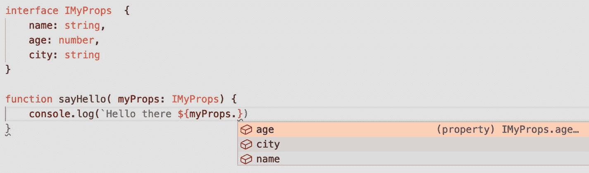

# 2.打字稿简介

鉴于 TypeScript 是 Deno 的创建者选择的语言，并且他利用了这是一个全新项目的事实来添加对它的原生支持，我认为有一个完整的章节专门讨论它是很方便的。如果您是 TypeScript 的新手，在这里您将学习它的基础知识，理解接下来章节中的代码示例所需的一切。另一方面，如果你已经精通这门语言，那么也许可以直接跳到第 [3](3.html) 章，或者通读这一章，在继续之前快速复习一下关键概念。

## 什么是 TypeScript？

JavaScript 是一种动态语言，这意味着变量没有类型。我知道你要说什么，你确实有一些基本类型，比如数字，对象，或者字符串，但是在任何给定的时间都没有静态类型检查发生；您可以完美地编写清单 [2-1](#PC1) 中的代码，而不会出现任何问题。

```js
let myVar = "this is a string"
myVar = 2
console.log(myVar + 2)

Listing 2-1Dynamically typed code in JavaScript

```

类型化语言会抱怨你把一个整数赋给一个字符串变量(例如，`myVar`)；然而，JavaScript 的情况并非如此。正因为如此，语言本身或解释器没有办法帮助你在编译期间检查错误，而是等待在运行时发现错误。当然，这并不是说清单 [2-1](#PC1) 中的代码会在运行时失败，但是下面的代码片段会失败:

```js
let myObj = {}
myObj.print()

```

这是一个有效的 JavaScript 代码，但是如果您执行它，您会得到一个运行时错误，或者称为一个不可控制的异常。对于没有强大类型系统的语言来说，这是正常的，甚至是意料之中的行为。如果你一直在用 JavaScript 编码(无论是在前端还是后端)，你很可能会看到类似清单 [2-2](#PC3) 的错误。

```js
myObj.print()
     ^

TypeError: myObj.print is not a function
     at Object.<anonymous> (/Users/fernandodoglio/workspace/personal/deno/runtime-error.js:3:7)
     at Module._compile (internal/modules/cjs/loader.js:1144:30)
     at Object.Module._extensions..js (internal/modules/cjs/loader.js:1164:10)
     at Module.load (internal/modules/cjs/loader.js:993:32)
     at Function.Module._load (internal/modules/cjs/loader.js:892:14)
     at Function.executeUserEntryPoint [as runMain] (internal/modules/run_main.js:71:12)
     at internal/main/run_main_module.js:17:47

Listing 2-2Unheld TypeError exception

```

这就是打字稿发挥作用的地方；您实际上是在编写 JavaScript 代码，增加了一个层，为您提供静态类型检查和改进的开发体验，这要归功于代码编辑器可以获取类型定义，并为您提供完整的智能感知。

到目前为止，您使用 TypeScript 的方式是使用一些自动化工具建立一个构建过程，例如 webpack <sup>[1](#Fn1)</sup> 或者回到过去，Gulp <sup>[2](#Fn2)</sup> 或者 Grunt。无论哪种方式，这个工具都可以让你创建一个进程，在代码被执行之前转换你的代码(换句话说，转换成 JavaScript)。这是一项非常常见的任务，当您开始一个新项目时，已经有一些工具可以自动为您配置该过程。比如拿 create-react-app<sup>[4](#Fn4)</sup>应用来说，旨在帮助你创建一个新的 React 项目；如果您选择将它与 TypeScript 一起使用，它将为您设置翻译步骤。

## 类型的快速概述

正如我之前提到的，TypeScript 试图将 JavaScript 中的类型概念扩展到更具体的内容中，就像在 C 或 C#等语言中得到的一样；这就是为什么在为变量选择正确的类型时，了解 TypeScript 所能提供的全部内容非常重要。

### 你已经知道的类型

您可以使用的一些类型来自 JavaScript 毕竟，如果它们已经被定义了，那重新发明轮子又有什么意义呢？

我说的是字符串、数字、数组、布尔甚至对象等类型。如果我们尝试使用如下代码片段中的 TypeScript 符号重写前面的示例，您会得到一个错误:

```js
let myVar: string = "Hello typed world!"
myVar = 2

console.log(myVar)

```

并运行前面的示例，如下所示:

```js
$ deno run sample.ts

```

注意`.ts`扩展，如果你想让 Deno 理解它需要将代码编译成 JavaScript，这是必须的。

```js
error: TS2322 [ERROR]: Type '2' is not assignable to type 'string'.
myVar = 2
~~~~~
     at file:///Users/fernandodoglio/workspace/personal/deno/sample.ts:2:1

```

当然，您不能执行该脚本中的代码。TypeScript 不让你把它编译成 JS 还有意义；你实际上为你的变量指定了一个类型，然后给它赋了另一个类型的值。

#### 声明数组

在 TypeScript 中声明数组很简单；其实你有两种方法，两种情况都很直观。一方面，您可以指定后跟数组符号的类型:

```js
let variable : number[] = [1,2,34,45]

```

代码明确声明了一个数字数组，如果你试图添加任何不是数字的东西，你将无法编译它。

声明数组的另一种方法是使用泛型类型，如下所示:

```js
let variable : Array<number>  = [1,2,3,4]

```

最后的结果都是一样的，用哪一个真的由你自己决定。

声明任何其他类型都很简单，真的没有什么太复杂的，所以让我们来看看好的方面:由于 TS，您得到了新的类型。

### 新类型

除了从 JavaScript 继承的基本的和已知的类型之外，TypeScript 还提供了其他更有趣的类型，比如元组、枚举、任何类型(我们将在稍后讨论)和 void。

这些额外的类型，加上我们马上会看到的其他构造，有助于为开发人员提供更好的体验，并为您的代码提供更健壮的结构。

#### 使用元组

我们已经讨论过数组，元组非常相似，但与数组不同，数组可以添加无限数量的相同类型的元素，元组允许您预定义有限数量的元素，但您可以选择它们的类型。

就其本身而言，元组可能看起来非常基本，如清单 [2-3](#PC9) 所示。

```js
let myTuple: [string, string] = ["hello", "world!"]

console.log(myTuple[0]) //hello
console.log(myTuple[2]) //Error: Tuple type '[string, string]' of length '2' has no element at index '2'.ts(2493)

Listing 2-3Declaring tuples in TypeScript

```

如您所知，使用清单 [2-3](#PC9) 中的定义，您只能访问数组的前两个元素；之后，一切都超出了范围。事实上，即使在作用域内，编译器也会检查你对那些索引做了什么；看看清单 [2-4](#PC10) 。

```js
let myTuple: [string, number] = ["hello", 1]

console.log(myTuple[0].toUpperCase()) //HELLO
console.log(myTuple[1].toUpperCase()) //Error: Property 'toUpperCase' does not exist on type 'number'.ts(2339)

Listing 2-4Error while trying to access a nonexisting method

```

这就是 TypeScript 的闪光点，因为它在您不太想检查的地方提供了检查。

但是，元组最好的部分是，您可以将它们用作数组索引。因此，现在您可以看到如何混合新旧类型，并且仍然拥有 ts 带来的好处。

```js
let myList: [number, string][] = [[1, "Steve"], [2, "Bill"], [3, "Jeff"]]

```

然后，您可以继续使用带有`myList`的普通数组方法，并继续添加新条目，如下面的代码片段所示:

```js
myList.push([4, "New Name"])

```

#### 枚举数

虽然元组是旧概念(即数组)的翻版，但枚举对 JavaScript 来说是一个全新的概念。尽管您可以使用普通的 JS 代码创建它们，但是 TypeScript 现在为您提供了一个额外的构造，您可以使用它来定义它们。

清单 [2-5](#PC13) 是它们如何工作的一个基本例子。

```js
enum Direction {
    Up = "UP",
    Down = "DOWN",
    Left = "LEFT",
    Right = "RIGHT",
}

Listing 2-5Declaring an enum

```

本质上，枚举是一种创建一组常数的方法，这没什么大不了的，但是这是一种很好的方法，可以通过自定义的构造赋予常数更多的意义，而不是简单地做一些类似于清单 [2-6](#PC14) 的事情。

```js
const Direction = {
  Up: "UP",
  Down: "DOWN",
  Left: "LEFT",
  Right: "RIGHT"
}

Listing 2-6Using a constant object to group constant values

```

虽然这是真的，但 TypeScript 简化了声明枚举的任务，允许您跳过它们的值并自动为它们赋值(这是您实际上不需要担心的)。因此，您可以利用这一点来定义枚举，如清单 [2-7](#PC15) 所示。

```js
enum Direction {
  Up,
  Down,
  Left,
  Right
}

Listing 2-7Declaring enums with an auto-assign value

```

现在您可以看到 TS 如何帮助您编写有意义的代码，并使用更少的关键字。基本上，这里的`Direction.Up`的值为“0”，`Direction.Down`的值为“1”，其余的一直向上加 1。

正如您所看到的，TypeScript 会自动为您的常量赋值，所以除非您的逻辑需要，否则对它们强制使用自定义值是没有意义的。

现在，当谈到利用枚举时，您会注意到，由于 TypeScript 的类型系统，您还可以指定枚举类型的变量，这意味着您可以通过引用您的枚举的名称来指定哪些值可以赋给变量；查看清单 [2-8](#PC16) 了解如何做到这一点。

```js
enum Direction {
   Up,
   Down,
   Left,
   Right
 }
 let myEnumVar: Direction = Direction.Down

myEnumVar = "hello" // Type '"hello"' is not assignable to type 'Direction'

Listing 2-8Using enums as types

```

您可以看到，一旦变量被定义为 enum 类型，您就只能将该 enum 的一个值赋给它；否则，您将得到类似前面看到的错误。

使用枚举的最后一个好处是，TypeScript 将足够智能地检查您的`IF`语句中的某些条件，以确保您没有在不应该的时候使用它们。让我解释一下，但是首先，看看清单 [2-9](#PC17) 中的代码。

```js
enum E {
    Foo,
    Bar,
}

function f(x: E) {
    if (x !== E.Foo || x !== E.Bar) {
        // Error! This condition will always return 'true' since the types 'E.Foo' and 'E.Bar' have no overlap.
    }
}

Listing 2-9TS smart checking thanks to the use of enums

```

您会得到这样的错误，因为 TS 编译器注意到您的`IF`语句覆盖了变量`x`值的所有可能选项(这是因为它被定义为 enum，所以它有可用的信息)。

#### 利用任何类型

TypeScript 添加到语言中的主要内容之一是静态类型检查以及几个增强开发人员体验的新类型。到目前为止，我已经展示了如何定义一个特定类型的变量。当你能控制的时候，这是很棒的；当您确切知道将要处理的数据类型时，定义类型会有很大帮助。

这种方法的问题是什么？对于固有的动态语言，你并不总是知道你必须处理的数据类型，数组就是一个例子。默认情况下，JavaScript 允许您定义一个动态大小的数组，您可以在其中添加您需要的任何内容。这是一个非常强大的工具。然而，TypeScript 强迫我们声明我们定义的每个数组的元素类型，那么我们如何混合这两个世界呢？

这就是`any`型发挥作用的地方。您可以告诉代码期待“任何”类型，而不是强制代码期待一种特定的类型。查看以下代码片段，了解如何使用它:

```js
let myListOfThings: any[] = [1,2, "Three", { four: 4} ]
myListOfThings.forEach( i => console.log(i))

```

下面是用 Deno 运行它得到的输出:

```js
1
2
Three
{ four: 4 }

```

这种类型很棒，但是你必须小心使用它，因为如果你滥用它，你就忽略了这种语言的一个好处:**静态类型检查**。当您想要使用`any`类型时，两个主要的用例之一是当您混合使用 JavaScript 和 TypeScript 时，因为它允许您利用后者的一些好处，而不必重写整个 JS 代码(或者潜在地，它背后的逻辑)。另一个用例是，在访问数据之前，你真的不知道你将使用什么类型的数据；否则，建议您实际声明该类型，并让 TypeScript 为您检查。

### 关于可空类型和联合类型的注记

到目前为止，我提到的所有类型都不允许您将`null`作为有效值赋给它们——当然，这是指除任何类型之外的所有类型；这个可以让你给变量赋值。

那么，如何告诉 TypeScript 让您也给变量赋值 null 呢？(换句话说，如何使它们可为空？)答案是通过使用联合类型。

从本质上讲，联合类型是一种从几个其他类型的联合中创建新类型的方法，因为这里 null 是 TypeScript 的类型，所以您可以将`null`与任何其他类型连接，从而允许我们所寻找的类型(参见下面的示例片段)。

```js
let myvar:number | null = null  // OK
let var2:string = null //invalid
let var3:string | null = null // OK

```

前面的代码展示了如何通过使用|字符来实现类型的联合。对于“数字或空值”或“字符串或空值”这样的类型，您也可以将它作为“或”运算符来读取

union 操作符不仅对创建可空类型有用，而且还可以用来允许在变量上分配多个不同的类型；查看清单 [2-10](#PC21) 中的示例。

```js
type stringFn = () => string

function print(x: string | stringFn) {
   if(typeof x == "string") return console.log(x)
   console.log(x())
}

Listing 2-10Joining several types into a single variable using the union operator

```

第一行是为类型声明一个别名，允许我们以后引用它，在函数声明期间，你可以看到我们是如何允许一个字符串作为参数传递或者一个函数返回一个字符串。查看清单 [2-11](#PC22) ，看看当我们尝试传入不同类型的函数时会发生什么。

```js
print("hello world!")

print( () => {
   return "bye bye!"
})

/*
Argument of type '() => number' is not assignable to parameter of type 'string | stringFn'.
 Type '() => number' is not assignable to type 'stringFn'.
   Type 'number' is not assignable to type 'string'.
*/
print( () => {
   return 2
})

/*
Argument of type '(name: string) => string' is not assignable to parameter of type 'string | stringFn'.
 Type '(name: string) => string' is not assignable to type 'stringFn'.
*/
print( (name:string) => {
   return name
})

Listing 2-11Type checking on the print function

```

如果你返回的不是字符串，或者你有额外的参数，类型定义是严格的，所以它们会失败。

您甚至可以使用 union 操作符来创建一个文字枚举，因此除了使用我在清单 [2-7](#PC15) 中展示的语法之外，您还可以这样做:

```js
type validStrings = "hello" | "world" | "it's me"

```

这意味着您可以将该类型别名赋给一个变量，而该变量只能赋这三个值中的一个。这是一个字面枚举，意味着你可以像那样使用它们，但是你不能像使用正确的枚举那样引用它的成员。

## 类和接口

有了基本的类型，我们可以进入其他新的构造，这将使我们的开发体验变得轻而易举。在这种情况下，我们将讨论类和接口。

值得注意的是，通过添加我们即将看到的概念，TypeScript 提出了一个更明确、更成熟的面向对象范例版本，vanilla JS 遵循了这一范例。也就是说，没有任何地方写着说你在使用 TS 时也应该遵循它；毕竟，这只是 JavaScript 的另一种风格，因此您也可以利用其固有的函数式编程能力。

### 接口

与类型类似，接口允许我们定义我喜欢称之为“对象类型”的东西当然，这只是这个概念的一行定义，它忽略了许多其他重要的东西。

也就是说，使用 TypeScript 中的接口，您可以定义对象的形状，而无需实现任何东西，这就是 ts 用来检查和验证赋值的东西。

接口的一个经典用例是定义方法或函数的参数应该具有的结构；你可以在图 [2-1](#Fig1) 中看到它是如何工作的。



图 2-1

由于定义了接口，自动完成对函数参数的处理

事实上，图 2-1 显示了拥有接口的一个额外的好处:智能感知完全知道你的对象的形状，而不需要实现它们的类(人们会认为，这需要你也实现方法逻辑)。

在处理模块时，无论是内部使用还是公共使用，除了导出相关的数据结构，您还可以导出接口，为开发人员提供有关参数和方法返回类型的形状信息，而不必过度共享可能被修改和篡改的敏感数据结构。

但这并不是接口能做的全部；事实上，这仅仅是个开始。

#### 可选属性

TypeScript 中的接口允许您定义的一个非常有趣的行为是，对象上的一些属性总是需要存在，而其他属性可能是可选的。

这是一个非常 JavaScript 的事情，因为我们从来没有真正关心我们的对象的结构，因为它是完全动态的。事实上，这是这门语言的美妙之处之一，TS 不能真的忽视它，所以相反，它为我们提供了一种方法，让我们给混乱以结构。

现在，当你定义接口时，你知道有些属性可能并不总是存在，你所要做的就是在它们后面加上一个问号，如清单 [2-12](#PC24) 所示。

```js
interface IMyProps {
   name: string,
   age: number,
   city?: string
}

Listing 2-12Defining an interface with optional properties

```

这将告诉 TS 的编译器，每当将一个对象赋给一个声明为`IMyProps`的变量时，如果`city`属性丢失，就不会出错。

事实上，您可以将 TS 的可选属性与 ES6 的可选链接(顺便说一句，Deno 已经实现了这一点)混合使用，以编写在预期缺失的属性有时实际上不存在时不会失败的代码。

```js
interface IMyProps  {
   name: string
   age: number
   city?: string

   findCityCoordinates?(): number
}

function sayHello( myProps: IMyProps) {
   console.log(`Hello there ${myProps.name}, you're ${myProps.age} years old and live in ${myProps.city?.toUpperCase()}`)
}

sayHello({
   name: "Fernando",
   age: 37
})

sayHello({
   name: "Fernando",
   age: 37,
   city: "Madrid"
})

Listing 2-13Mixing optional attributes with optional chaining

```

清单 [2-13](#PC25) 中的例子展示了我们如何访问字符串属性`city`(可选)的方法`toUpperCase`，由于可选的链接语法，我们不必检查它是否存在。当然，执行的输出并不理想，但是它不会像通常那样抛出错误；查看列表 [2-14](#PC26) 。

```js
Hello there Fernando, you're 37 years old and live in undefined
Hello there Fernando, you're 37 years old and live in MADRID

Listing 2-14Output from Listing 2-13 using optional chaining

```

#### 只读属性

您可以添加到属性中的另一个有趣的定义是，它们是只读的；就像对变量使用`const`一样，现在只要需要，就可以拥有只读属性。

你所要做的就是在适当的地方使用关键字“`readonly`”(参见清单 [2-15](#PC27) 中的例子)。

```js
interface IPerson {
   readonly name: string,
   age: number
}
let Person: IPerson = { name: "Fernando", age: 37}
Person.name = "Diego" /// Cannot assign to 'name' because it is a read-only property

Listing 2-15Using readonly properties on interfaces

```

前面的例子向您展示了，如果属性被标记为“readonly”，那么一旦初始化，您就无法真正修改这些属性

#### 函数的接口

它也被称为函数契约。接口不仅允许你定义一个对象的形状，还可以用来定义一个函数需要遵循的契约。

这在处理回调函数时特别有用，您需要确保传递了带有正确参数和正确返回类型的正确函数。

查看清单 [2-16](#PC28) 中如何使用函数接口的例子。

```js
interface Greeter {
   (name: string, age: number, city: string): void
}

const greeterFn: Greeter = function(n: string, a: number, city: string) {
   console.log(`Hello there ${n}, you're ${a} years old and live in ${city.toUpperCase()}`)
}

function asyncOp(callback: Greeter) {
   ///do async stuff here...
   callback("Fernando", 37, "Madrid")
}

Listing 2-16Defining an interface for functions

```

请注意`asyncOp`函数只能接受一个欢迎函数作为参数；您无法传递不符合接口指定的契约的有效回调。

### 使用类

自从 ES6 获得批准以来，JavaScript 已经将类的概念融入到语言中，尽管它们并不完全是标准的 OOP 类，包含方法覆盖、私有和公共属性、抽象构造等等。相反，JavaScript 中类的当前状态只允许您将属性和函数分组到一个实体(类)中，您可以在以后实例化它。与其说它是一种真正的处理和使用对象的新方法，不如说它是一种好的旧的原型继承模型的语法糖。

然而，TypeScript 将这一点带入了下一个层次，试图为您提供一个更健壮的模型，用它来实际构建一个面向对象的体系结构。

尽管语法(至少对于基本操作来说)在两种情况下是相同的(当然减去类型定义)，正如你在清单 [2-17](#PC29) 中看到的。

```js
class Person {

   f_name: string
   l_name: string

   constructor(fn: string, ln: string) {
       this.f_name = fn
       this.l_name = ln
   }

   fullName(): string {
       return this.f_name + " " + this.l_name
   }
}

Listing 2-17Class syntax

for TypeScript

```

现在，由于有了 TS，我们可以做更多有趣的事情，比如声明私有属性或私有方法、实现接口等等；让我展示给你看。

#### 可见性修改器

像许多基于 OOP 的语言一样，TypeScript 为类属性和方法提供了三种不同的可见性修饰符。让我们在这里快速回顾一下如何实现这些。

##### 私有修饰符

这是一个经典的例子，每个人都要求 JavaScript 提供这个例子，而 ES6 在包含类时没有提供这个例子，因为在这一点上，语言中没有可见性修饰符(当然，这是在当前发布的 JavaScript 版本上，但是下一个版本的提议已经被批准)。

然而，TypeScript 实现了两个版本，一个遵循经典标准，使用了`private`关键字，另一个遵循 ECMAScript 下一版本中的实现方式，使用了`#`字符。

由于 Deno 的内部编译器使用的是最新版本的 TypeScript，所以使用这两种语法都没问题(如清单 [2-18](#PC30) 所示)。

```js
class Square {
   side: number
   private area: number
   #perimeter: number

   constructor(s: number) {
       this.side = s
       this.area = this.side * this.side
       this.#perimeter = this.side * 4
   }
}

let oSquare = new Square(2)

console.log(oSquare.#perimeter)
console.log(oSquare.area)

Listing 2-18Using both private fields syntax

```

前面的代码有效；它在 Deno 中编译，但在 Deno 中失败，因为毕竟我试图从类定义之外直接访问这两个私有属性。清单 [2-19](#PC31) 中显示了执行该代码所得到的错误。

```js
error: TS18013 [ERROR]: Property '#perimeter' is not accessible outside class 'Square' because it has a private identifier.
console.log(oSquare.#perimeter)
                    ~~~~~~~~~~
    at file:///Users/fernandodoglio/workspace/personal/deno/classes/sample2.ts:17:21

TS2341 [ERROR]: Property 'area' is private and only accessible within class 'Square'.
console.log(oSquare.area)
                    ~~~~
    at file:///Users/fernandodoglio/workspace/personal/deno/classes/sample2.ts:18:21

Found 2 errors.

Listing 2-19Error output from trying to access a private variable

```

再次重申，私有属性只能从定义它们的类中访问。这当然意味着你不能像清单 [2-19](#PC31) 中所示的那样使用实例化的对象直接访问它(注意尽管错误消息不一样，但它们是一样的)，而且你也不能使用从其他类继承的类的私有属性或方法。父类不与其子类共享私有属性和方法。

```js
class Geometry {
   private area: number
   private perimeter: number

   constructor() {
       this.area = 0
       this.perimeter = 0
   }
}

class Square extends Geometry{
   side: number

   constructor(s: number) {
       super()
       this.side = s
       this.area = this.side * this.side
       this.perimeter = this.side * 4
   }
}
let oSquare = new Square(2)

Listing 2-20Using private variables inside derived classes

```

通过使用类似于清单 [2-20](#PC32) 中所示的代码，您可以看到清单 [2-21](#PC33) 中的错误类型。

```js
error: TS2341 [ERROR]: Property 'area' is private and only accessible within class 'Geometry'.
        this.area = this.side * this.side
             ~~~~
    at file:///Users/fernandodoglio/workspace/personal/deno/classes/sample3.ts:18:14

TS2341 [ERROR]: Property 'perimeter' is private and only accessible within class 'Geometry'.
        this.perimeter = this.side * 4
             ~~~~~~~~~
    at file:///Users/fernandodoglio/workspace/personal/deno/classes/sample3.ts:19:14

Found 2 errors.

Listing 2-21Error while trying to access a private property from a derived class

```

如果你真的在寻找那种行为，那么你必须使用受保护的属性。

##### 受保护的修饰符

protected 修饰符允许您对外界隐藏属性和方法，就像前面的一样，但是您仍然可以从派生类中访问它们。

因此，如果你想继承一些私有属性，可以考虑使用`protected`关键字，参见清单 [2-22](#PC34) 中的例子。

```js
class Geometry {
   protected area: number
   protected perimeter: number

   constructor() {
       this.area = 0
       this.perimeter = 0
   }
}

class Square extends Geometry{
   side: number

   constructor(s: number) {
       super()
       this.side = s
       this.area = this.side * this.side
       this.perimeter = this.side * 4
   }

   getArea(): number {
       return this.area
   }
}

let oSquare = new Square(2)
console.log(oSquare.getArea())

Listing 2-22Correct use of the protected keyword

```

前面的代码是有效的，您可以在不同的类之间共享属性，而不需要将它们公开，任何人都可以访问。

##### 定义访问者

您还可以添加一种称为“访问器”的特殊属性，它允许您将属性包装在函数周围，并为赋值和检索操作定义不同的行为。在其他语言中，这些访问器也称为 getters 和 setters。

本质上，这些方法使您能够使用它们，就好像它们是它们正在包装的实际属性一样。您总是可以创建一两个方法来做同样的事情，但是您需要像普通方法一样处理它们。

让我向你展示我所说的清单 [2-23](#PC35) 的含义。

```js
class Geometry {
   protected area: number
   protected perimeter: number

   constructor() {
       this.area = 0
       this.perimeter = 0
   }
}

class Square extends Geometry{

   private side: number

   constructor(s: number) {
       super()
       this.side = s
       this.area = this.side * this.side
       this.perimeter = this.side * 4
   }

   set Side(value: number) {
       this.side = value
       this.area = this.side * this.side
   }

   get Side() {
       return this.side
   }

   get Area() {
       return this.area
   }
}

let oSquare = new Square(2)
console.log("Side: ",oSquare.Side,  " - area: ", oSquare.Area)
oSquare.Side = 10
console.log("Side: ", oSquare.Side, " - area: ", oSquare.Area)

Listing 2-23Defining accessors

```

请注意我是如何围绕`side`属性的赋值添加额外的逻辑的；现在，我不仅给属性赋值，还更新了`area`的值。这是使用访问器的主要好处；在围绕动作添加额外逻辑的同时，保持了语法的整洁。这些对于在赋值或副作用上添加验证逻辑非常有用，就像我刚刚展示给你的。对于检索操作，您还可以添加默认行为，例如，如果您的数字属性尚未设置，则返回 0。想象力是极限；只要确保你利用了他们。

##### 静态和抽象类

我想介绍的关于类的最后一点是这两个:修饰符`static`和`abstract`。如果你已经熟悉了来自 OOP 世界的这些概念，这两个就是你所期望的，但是以防万一，我们将在这里对它们做一个快速的概述。

静态成员也被称为*类成员*，这意味着它们不属于它的任何特定实例；相反，它们属于类本身。从本质上说，这意味着您可以通过在类名前面加上关键字来访问它们，而不是通过关键字`this`。事实上，`this`关键字不能用于静态成员，因为它引用了实例，而实例并不存在于静态上下文中。这个关键字对于声明类的所有实例都感兴趣的属性和方法很有用(参见清单 [2-24](#PC36) 中的例子)。

```js
type Point = {
   x: number,
   y: number
}

class Grid {
   static origin: Point = {x: 0, y: 0};
   calculateDistanceFromOrigin(point: Point) {
       let xDist = (point.x - Grid.origin.x);
       let yDist = (point.y - Grid.origin.y);
       return Math.sqrt(xDist * xDist + yDist * yDist) / this.scale;
   }
   constructor (public scale: number) { }
}

let grid1 = new Grid(1.0);  // 1x scale
let grid2 = new Grid(5.0);  // 5x scale

console.log(grid1.calculateDistanceFromOrigin({x: 10, y: 10}));
console.log(grid2.calculateDistanceFromOrigin({x: 10, y: 10}));

Listing 2-24Using the static keyword

```

注意这里如何使用 origin 属性；因为所有实例的原点都是相同的，所以每次实例化一个新对象时都创建同一属性的不同实例是没有意义的。因此，相反，通过将其声明为 static，您可以确保该属性只存在一个版本。唯一的问题是你需要使用类名来引用它；仅此而已。

同样的推理也适用于静态方法；它们包含了类的所有实例都感兴趣的逻辑，但是这里的问题是你不能从里面访问关键字`this`，因为没有实例可以引用。

然而，抽象类是一种完全不同的动物；它们用于定义必须由其他类继承但不能直接实例化的行为。这实际上非常接近于接口的定义，尽管这些接口仅限于定义所有方法的签名，而抽象类实际上提供了可以继承和使用的实现。

那么什么时候创建一个抽象类呢？简单，让我们回到几何/正方形的例子，我写了两个类，一个继承另一个。我们可以重构代码来使用抽象类，如清单 [2-25](#PC37) 所示。

```js
abstract class Geometry {
   protected area: number
   protected perimeter: number

   constructor() {
       this.area = 0
       this.perimeter = 0
   }
}

class Square extends Geometry{

   private side: number

   constructor(s: number) {
       super()
       this.side = s
       this.calculateAreaAndPerimeter()
   }

   private calculateAreaAndPerimeter() {
       this.perimeter = this.side * 4
       this.area = this.side * this.side
   }

   set Side(value: number) {
       this.side = value
       this.calculateAreaAndPerimeter()
   }

   get Side() {
       return this.side
   }

   get Area() {
       return this.area
   }
}

Listing 2-25Using the abstract keyword

```

这种实现无疑表明，如果您在项目中使用它，您不能真正依赖于直接实例化几何图形；相反，你要么依赖 Square 类，要么自己创建并扩展几何图形。

这些都是可选的结构；当然，你可以很容易地依赖类，用默认的可见性修饰符(即 public)做任何事情，但是如果你要利用 TS 提供的所有这些工具，你就要增加额外的安全层，以确保编译器强制你或其他人按照最初的意图使用你的代码。

作为一个关于 TypeScript 的高级主题，我想介绍的最后一件事是 mixins，如果你已经决定一路深入 OOP rabbithole，它可能会派上用场。

## 类型脚本混合

当涉及到类继承时，TypeScript 强加的限制之一是一次只能扩展一个类。在大多数情况下，这不是一个问题，但是如果您正在处理一个足够复杂的架构，您可能会发现自己受到语言的限制。

让我们看一个例子:假设你需要将两种不同的行为封装到两个不同的抽象类中，`Callable`和`Activable`。

因为我们在这一点上只是虚构的，假设它们都向派生类添加了一个方法，允许您调用或激活该对象(无论这对您意味着什么)。记住，这些是抽象类，因为添加的行为完全独立于派生类。正常的做法应该是类似清单 [2-26](#PC38) 中的例子。

```js
abstract class Callable {
   call() {
       console.log("Call!")
   }
}

abstract class Activable {
   active: boolean = false
   activate() {
       this.active = true
       console.log("Activating...")
   }

   deactive() {
       this.active = false
       console.log("Deactivating...")
   }
}

class MyClass extends Callable, Activable{

   constructor() {
       super()
   }
}

Listing 2-26Trying to extend several classes at the same time

```

当然，就像我之前说的，TypeScript 不允许我们这么做；查看清单 [2-27](#PC39) 以查看我们将得到的错误。

```js
error: TS1174 [ERROR]: Classes can only extend a single class.
class MyClass extends Callable, Activable{
                                ~~~~~~~~~
    at file:///Users/fernandodoglio/workspace/personal/deno/classes/sample8.ts:21:33

Listing 2-27Error while trying to extend a class from several parent classes

```

为了解决这个问题，我们可以做一个简单的(也非常糟糕的)变通方法，就是链接继承。或者换句话说，让`Callable`延长`Activable`，让`MyClass`延长`Callable`。这肯定会解决我们的小问题，但同时，它会迫使`Callable`总是延长`Activable`。这是一个非常糟糕的设计模式，你应该不惜一切代价避免；你想把这两种行为分开是有原因的，所以像那样把它们强迫在一起是没有意义的。

### 混血儿来救援了！

那么我们能做什么呢？这就是混音发挥作用的地方。现在，mixins 不是 TypeScript 提供的特殊构造；相反，它们更像是一种利用语言的两个不同方面的技术:

*   **声明合并**:这是一个你需要注意的非常奇怪和隐含的行为

*   **接口类扩展**:这意味着 TS 中的*接口*可以同时扩展几个*类*，不像类本身

基本上，实现这一点的步骤是

1.  将父类中的方法签名添加到我们的派生类中。

2.  迭代父类的方法，对于父类和派生类都有的每个方法，手动将它们链接在一起。

我知道这听起来很复杂，但实际上并不难；你所要记住的是如何实现这两点，你就大功告成了。

为了理解发生了什么，让我们先从第二点开始:

TypeScript 的官方文档 <sup>[5](#Fn5)</sup> 站点已经提供了该功能供我们使用，我们就不在这里真的尝试多此一举了；该功能的代码见清单 [2-28](#PC40) 。

```js
function applyMixins(derivedCtor: any, baseCtors: any[]) {
   baseCtors.forEach(baseCtor => {
       Object.getOwnPropertyNames(baseCtor.prototype).forEach(name => {
           let descriptor = Object.getOwnPropertyDescriptor(baseCtor.prototype, name)
           Object.defineProperty(derivedCtor.prototype, name, <PropertyDescriptor & ThisType<any>>descriptor);
       });
   });
}

Listing 2-28Function to join two or more class declarations

```

前面的函数只是遍历父类，对于每个父类，遍历其属性列表并将这些属性定义到派生类中。本质上，我们手动将所有方法和属性从父节点链接到子节点。

An interesting side note

注意当我们必须处理类的内部工作时，我们实际上是直接引用原型链。这是一个明显的迹象，表明 JavaScript 的新类模型，就像我之前提到的，比其他任何东西都更有语法吸引力。

这样一来，如果我们试图使用它，我们就会遇到清单 [2-29](#PC41) 中所示的问题；这是因为尽管我们已经完成了我们的工作，并且我们已经将缺少的方法添加到了子类中，但是我们仍然在处理 TypeScript，它主动检查我们对象的形状以确保我们调用了正确的方法，尽管我们*添加了*方法，但是我们并没有真正改变`MyClass`的*形状*(也就是说，我们并没有真正声明正确的关系)。

```js
error: TS2339 [ERROR]: Property 'call' does not exist on type 'MyClass'.
o.call()
  ~~~~
    at file:///Users/fernandodoglio/workspace/personal/deno/classes/sample9.ts:41:3

TS2339 [ERROR]: Property 'activate' does not exist on type 'MyClass'.
o.activate()
  ~~~~~~~~
    at file:///Users/fernandodoglio/workspace/personal/deno/classes/sample9.ts:42:3

Found 2 errors.

Listing 2-29Methods haven’t been added to the shape of MyClass

```

这就是声明合并和接口类扩展的地方。

```js
abstract class Callable {
   call() {
       console.log("Call!")
   }
}

abstract class Activable {
   active: boolean = false

   activate() {
       this.active = true
       console.log("Activating...")
   }

   deactive() {
       this.active = false
       console.log("Deactivating...")
   }
}

class MyClass {

   constructor() {
   }
}
interface MyClass extends Callable, Activable {}

Listing 2-30Adding declaration merging to complete the mixin

```

就是这样！清单 [2-30](#PC42) 中的代码是所有奇迹发生的地方。不过我先解释一下，因为我自己也是试了几次才明白的。

1.  `MyClass`定义现在只是一个单一的类定义，并没有真正扩展任何东西。

2.  我添加了一个新的接口定义，其名称**与我们正在创建的类的名称**完全相同。这是至关重要的，因为这个接口扩展了两个抽象类，从而将它们的方法定义合并到一个构造(接口)中，同时，这个构造也合并到类定义中，因为它们具有相同的名称(即声明合并， <sup>[6](#Fn6)</sup> 意味着接口可以合并到类和其他构造中，如果它们具有相同的名称)。

现在，MyClass 的定义有了我们需要的方法签名和正确的*形状*；因此，我们现在可以自由地在我们的类中使用`applyMixins`函数，并适当地调用新添加的方法，如清单 [2-31](#PC43) 所示。

```js
applyMixins(MyClass, [Callable, Activable])

let o = new MyClass()

o.call()
o.activate()

Listing 2-31Calling the applyMixins function to join the classes into one

```

这段代码将产生我们预期的输出。记住，现在你已经经历了理解 mixins 如何工作的过程，我已经给了你一个完全可重复的公式，你可以在你所有的类中使用。只需复制并粘贴函数，并记住正确声明接口就可以了！

## 结论

这就是我在本书中停止谈论 TypeScript 的地方。为了继续学习 Deno，我已经介绍了您需要了解的所有内容。如果您喜欢 TypeScript 并想了解更多，我鼓励您查看他们的官方文档。毕竟，这种语言有一些方面我没有提到，不是因为它们真的没有用，而是因为这一章只是对这种语言的介绍，而不是完整的指南。

了解了 TS 的类型和 OOP 模型是如何工作的，你就可以继续阅读，而不用担心理解不了我将要讲的内容。

下一章将介绍 Deno 上的安全性是如何工作的，以及为什么要花这么多精力让开发人员担心这个问题。下一页见！

<aside aria-label="Footnotes" class="FootnoteSection" epub:type="footnotes">Footnotes [1](#Fn1_source)

[T2`https://webpack.js.org/`](https://webpack.js.org/)

  [2](#Fn2_source)

[T2`https://gulpjs.com/`](https://gulpjs.com/)

  [3](#Fn3_source)

[T2`https://gruntjs.com/`](https://gruntjs.com/)

  [4](#Fn4_source)

[T2`https://github.com/facebook/create-react-app`](https://github.com/facebook/create-react-app)

  [5](#Fn5_source)

[T2`www.typescriptlang.org/docs/handbook/mixins.html`](http://www.typescriptlang.org/docs/handbook/mixins.html)

  [6](#Fn6_source)

[T2`www.typescriptlang.org/docs/handbook/declaration-merging.html`](http://www.typescriptlang.org/docs/handbook/declaration-merging.html)

 </aside>