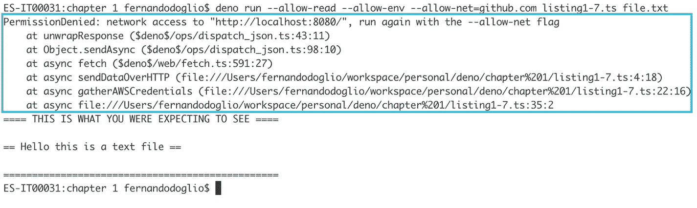
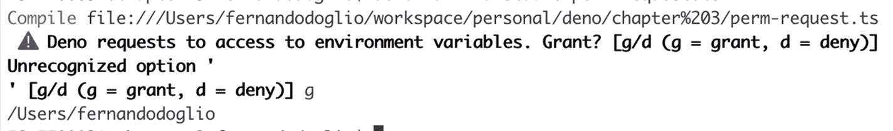

# 三、过着安全的生活

现在是时候谈谈 Deno 引入的一个新功能了，Node.js 从未试图解决这个问题，它本来可以防止 npm 遇到的一些主要问题:安全性。

尽管这些问题并不多，但我们已经看到 npm 在过去几年中出现了一些安全问题，其中大多数都与这样一个事实有关，即任何使用节点运行时执行的代码都自动拥有与执行脚本的用户相同的安全权限。

在这一章中，我们将看到 Deno 如何试图通过强制用户指定添加哪些权限来解决这个问题。

## 加强安全性

Deno 没有让操作系统来负责正在执行的脚本的安全性，而是强迫用户直接指定他们希望自己的脚本拥有哪些权限。

这不是新的做法；事实上，如果你有一部手机，你可能会在第一次安装或执行一个新的应用时看到一个警告，要求你允许访问你的联系人或相机或系统的其他部分。这样做的目的是为了让你，作为一个用户，确切地知道应用正在试图做什么，这让你决定你是否希望它访问它。

这里 Deno 做的完全一样，强行要求你允许(或者拒绝)访问不同的特性(比如从磁盘读取或者访问网络接口)。

目前，您可以允许或拒绝 Deno 脚本访问七个子系统，从允许它们从磁盘读取数据或允许访问网络接口以发送传出请求到其他更复杂的功能，如获得高分辨率的时间测量。

作为一名后端开发人员，我想我已经听到你们中的一些人在问:“等等，我真的需要记住允许我的后端服务访问网络接口吗？这时候那不是基本的吗？”

老实说，是也不是。诚然，如果您像使用 Node 一样使用 Deno，开发后端服务将是您工作的一大部分，但您也可能将 Deno 用于其他任务，这就是 Ryan 及其团队决定选择安全性而不是开发人员舒适性的原因。

不要误解我，我不是用不好的方式说的。对我来说，这个代价很小；你所要做的，作为一个微服务的开发者(这里举个例子)，就是记得在你的脚本的启动行添加某个标志。但是，作为回报，您完全知道您添加了该权限，因为您需要该访问权限。无论是谁在其他地方执行相同的服务，都会看到这个标志，并自动知道它需要网络访问。

现在，举一个同样的例子，但是想想其他人可能已经发布的简单自动化脚本——可能是 Grunt <sup>[1](#Fn1)</sup> 或 webpack <sup>[2](#Fn2)</sup> 会做的事情。但是现在您注意到，为了执行它们，您还需要为它们提供对您的网络接口的访问；那不是会在你脑海中升起一面旗帜吗？如果它们是专门在本地磁盘上工作的工具，为什么它们需要这种访问呢？这正是 Deno 试图让您自问的问题类型，以避免可以轻松避免的安全问题。请将这些标志视为安全的类型系统。就像 TypeScript 能够简单地通过强制您始终使用正确的类型来防止许多错误一样，这些标志将有助于在将来避免许多安全问题。

它们是最终的安全解决方案吗？当然不是，就像 TypeScript 不是消除 bug 的终极工具一样。但是它们都有助于避免可能导致大问题的简单错误。

### 安全标志

现在是时候仔细看看这些有问题的标志，了解它们各自的作用，以及何时应该或不应该使用它们。虽然，就像我之前说的，有七个子系统你可以限制或允许访问，但事实上，有八个标志供你使用，我马上会解释为什么。

#### “一切都允许”标志

我要介绍的第一个是我提到的额外旗帜。这个标志的目的不是允许访问一个特定的子系统，而是基本上禁用所有的安全措施。

Note

正如你可能猜到的那样，这不是你应该使用的标志，除非你确切地知道你想要做什么。将标志添加到脚本的执行行并不是一项昂贵或耗时的任务，所以在决定使用这种方法之前要考虑权衡。

这样一来，这是目前唯一一个具有缩写形式的标志，所以您可以使用`-A`形式，或者更明确地说，使用`--allow-all`形式(注意第一个形式只有一个破折号字符，而第二个有两个)。查看以下代码片段，以准确理解如何在 CLI 中使用该标志:

```js
$ deno run --allow-all your-script.ts

```

这将有效地禁用运行时提供的每一点安全性，或者回到我的 TypeScript 类比，这就像到处使用`any`类型。只要确保如果你正在使用它，你有一个非常好的理由。

#### 访问环境变量

使用 Deno 访问环境变量相对简单；您所要做的就是使用 Deno 名称空间并访问 env 属性(查看下面的示例以了解如何操作)。

```js
console.log(Deno.env.get("HOME")) //should print your HOME directory path

```

这里的问题是，几乎任何有权访问系统的人都可以设置环境变量，并且那里存储了大量可能被误用的信息。例如，AWS CLI 工具期望几个环境变量指向包含敏感数据的文件夹，例如`AWS_SHARED_CREDENTIALS_FILE`，它应该指示您的秘密 AWS 凭证存储在哪里。现在，想想攻击者通过添加一点代码来访问这些变量并读取文件(或它们包含的数据)将能够做些什么。这绝对是你不想让其他人知道的信息，除非他们不得不知道，这就是为什么 Deno 限制对它的访问。

回到我们的例子，如果您将前面的代码片段复制到一个文件中，并尝试运行它，您会得到下面的错误消息:

```js
error: Uncaught PermissionDenied: access to environment variables, run again with the --allow-env flag

```

为了能够访问我们系统的这个特定部分，我们需要`--allow-env`标志。因此，再次获取您的文件并如下执行它:

```js
$ deno run --allow-env script.ts

```

这个标志将允许你的脚本读取*和*写入环境变量，所以确保你给你信任的代码这种访问。

#### 高分辨率时间测量

高分辨率时间测量实际上可以用于几种类型的攻击，尤其是那些为了获得有关安全目标的信息而处理密码术的攻击。

但同时，在调试甚至试图优化代码时，它是一个很好的工具，尤其是在性能是一个大问题的关键系统中。这就是为什么你需要考虑这个标志，特别是因为它的效果和其他的不完全一样；让我解释一下。

对于其他标志，如果不允许某个特定的特性，就会得到一个 UnheldException，执行结束。这是一个非常明显的信号，表明你要么需要给你的脚本添加权限，要么你正在执行的脚本正在做一些你没有意识到的事情。

然而，使用高分辨率时间，您不会得到这种警告。事实上，你使用的方法仍然有效；只缺少高分辨率部分。让我们看一下清单 [3-1](#PC5) 中的例子来理解发生了什么。

```js
const start = performance.now()

await Deno.readFile("./listing35.ts")
const end = performance.now()

console.log("Reading this file took: ", end - start, " ms")

Listing 3-1Calculating the time it takes to perform an action

```

现在，如果在没有合适的高分辨率标志的情况下执行清单 [3-1](#PC5) ，您将得到类似于`"Reading this file took: 10 ms";`的结果，但是，如果您添加了`--allow-hrtime`标志，结果将变为`"Reading this file took: 10.551857 ms".`

区别是相当大的，只有当你需要高层次的细节；否则，您可以使用默认行为。

#### 允许访问网络接口

这是一个大问题，主要是因为访问网络接口既是一个经常需要的功能，也是一个非常开放的安全漏洞。有了发送请求的权限，恶意脚本就可以在您毫不知情的情况下发送信息，而且，如果您不能发送和接收 HTTP 请求，您能创建什么样的微服务呢？

别担心，有一种方法可以解决这个难题:允许列表。

到目前为止，我给你们展示的标志都是直接布尔标志；你用它们来允许或不允许某事。然而，一些仍然待定的标志(包括这个)也允许您提供一个列表作为 allow 标志的一部分。该特性为您允许特定特性的元素创建一个白名单，任何超出白名单的元素都会被自动拒绝。

当然，您可以在没有列表的情况下使用这些标志，但是考虑到其中一些标志是多么基本的资源，您很可能会发现自己几乎总是不得不允许使用它们。

有问题的标志是`--allow-net`，您可以给它分配一个逗号分隔的域列表，如下所示:

```js
$ deno run --allow-net=github.com,gitlab.com myscript.ts

```

如果您要从第 [1](1.html) 章的清单 [1-5](https://doi.org/10.1007/978-1-4842-6197-2_1-5) 中获取代码，并使用之前的代码行(以及`--allow-read`和`--allow-env`)执行它，您将获得图 [3-1](#Fig1) 的输出。



图 3-1

使用向非白名单域发送信息的脚本时出错

如果没有为标志创建白名单，执行脚本可能会以看似正常的执行结束，但我们都知道这句话实际上有多正确，所以请记住，如果可能的话，请始终将您的域列入白名单。

#### 允许使用插件

虽然是一个实验性的功能，插件允许用户使用 Rust 扩展 Deno 的接口。现在，因为这还不是一个完整的特性，界面一直在变化，这也是为什么没有很多文档可用的原因。插件现在绝对是一个非常高级的话题，而且只对那些对实验性特性感兴趣的开发者有意义。

然而，如果，万一，你是那些试图玩插件的开发者之一，你将需要一个特殊的标志:`--allow-plugin`。

没有它，你的代码将不能使用外部插件，所以记住它！事实上，默认情况下你不能真正弄乱语言也是一个好处；这意味着你不会被第三方的恶意扩展所欺骗，在你不知情的情况下导入一个不需要的插件。

#### 允许从磁盘读取和向其写入

没错，您可以在代码中执行的两个最基本的操作是读取一个文件和写入一个文件，正如您可能已经从到目前为止展示的示例中收集到的那样，默认情况下，您是不允许这样做的。

而且想想也有道理；如果将从主机磁盘读取与其他权限结合在一起，比如读取环境变量(就像我已经展示过的)，那么从主机磁盘读取可能是一个危险的操作。而写入它的磁盘就更糟糕了；如果你不受限制，你几乎可以做任何事情。你可以覆盖重要文件，把你的部分恶意代码留在电脑内部，等等；你的想象力真的是极限了。

但是，问题是，由于允许您的脚本执行或不执行这些操作之一的权限太大，您可以提供一个白名单来允许读取和写入，但只能从预定义的文件夹(甚至文件)列表中读取和写入。

例如，如果您的代码从配置文件中读取配置选项，这是一个特别有用的功能。在这种情况下，您可以授予对该文件的特定读取权限，而不授予其他权限，这为任何需要使用您的代码的人提供了额外的安慰，因为它不会读取任何不应该读取的内容。

查看下面一行，了解如何配置白名单的示例:

```js
$ deno run --allow-read=/etc/ yourscript.ts

```

尽管您的执行行可能会变得有点笨拙，但是您可以根据需要提供尽可能多的细节，如下面的示例行所示，在这里您可以看到您是如何提供日志将被写入的确切文件夹和配置将被读取的确切文件的。

```js
$ deno run --allow-write=/your-app-folder/logs --allow-read=/your-app-folder/config/default.ini,/your-app-folder/config/credentials.ini yourscript.ts

```

如果您，作为一个外部用户，看到这个执行行，您可以放心，无论脚本在做什么，它都不会在您的系统上做任何有趣的事情。

#### 允许您的脚本生成新的子流程

如果您打算做诸如与其他 OS 命令交互之类的事情，那么生成子进程是一项有用的任务；但问题是，从安全角度来看，这个概念本身是非常危险的。

这是因为以有限权限运行但能够启动子流程的脚本可能会以更多权限启动自身。查看清单 [3-2](#PC9) 以了解如何做到这一点。

```js
let readStatus = await Deno.permissions.query({name: "read"})

if(readStatus.state !== "granted") {
  const sp = Deno.run({
    cmd: [
      "deno",
      "run",
      "--unstable",
      "--allow-all",
      "reader.ts"
    ]
  })
  sp.status()
} else {
  const decoder = new TextDecoder('UTF-8')
  const fileContent = await Deno.readFile("./secret.txt")
  console.log(decoder.decode(fileContent))
}

Listing 3-2A script that calls itself with extra privileges

```

为了运行清单 [3-2](#PC9) 中的代码，您需要使用`--unstable`标志，因为 Deno 名称空间上的`permissions`属性还不够稳定，不足以成为默认版本的一部分。请参见以下示例，了解如何运行该脚本:

```js
$ deno run --unstable --allow-run reader.ts

```

清单 [3-2](#PC9) 中的脚本证明您需要小心使用 allow-run 标志；否则，您可能会在不知情的情况下允许在您的计算机中发生权限提升事件。

## 正在检查可用权限

在回顾了为了让您的脚本正常工作您可以并且需要使用的所有安全标志之后，可以看到后端的一个潜在的新模式:检查可用的权限，或者我喜欢称之为 CAP。

CAP 的要点是，如果您继续像目前为止为后端项目所做的那样工作，一旦有人试图在没有足够权限的情况下执行您的代码，整个应用就会崩溃。除了 HRTime 之外，Deno 并没有优雅地贬低您没有足够的权限访问其他特性之一的事实，而是直接抛出类型为`PermissionDenied`的异常。

如果您的代码能够在尝试执行需要权限的代码之前检查您是否确实被授予了权限，而不仅仅是爆炸，会怎么样？当然，在有些情况下，如果没有它们，您将不能做任何事情，并且您将不得不停止执行，但是在其他情况下，您可能能够优雅地将逻辑降级为仍然能够运行的东西。例如，也许您没有被授予写权限，所以您的日志模块只是将所有内容输出到`STDOUT`中。也许没有提供`ENV`访问，但是您可以尝试从默认的配置位置读取这些值。

按照目前的情况，这种模式工作所需的代码是实验性的，在未来的更新中可能会有变化，所以您必须使用`--unstable`标志来执行它。我指的当然是`Deno.permissions`内部的 API，我已经在清单 [3-2](#PC9) 中简单展示过了。

回到清单 [3-2](#PC9) ，我展示了在`Deno.permissions`路径下目前可用的三种方法中最简单的一种:`query`。它还可以用来确保您不仅被授予了特定的权限，而且可以访问特定的位置(就像白名单一样)。例如，清单 [3-3](#PC11) 向您展示了如何检查您是否拥有对某个特定文件夹的读取权限。

```js
const status = await Deno.permissions.query({ name: "read", path: "/etc" });
if (status.state === "granted") {
  data = await Deno.readFile("/etc/passwd");
}

Listing 3-3Checking for permissions before trying to make use of them

```

如果您不想将自己局限于检查某个特定的权限，而是请求一个，因为毕竟您需要它，那么您也可以使用`request`方法。这个方法的工作方式与`query`类似，但是它不是解析权限的当前状态，而是首先提示用户提供答案，然后*和*将解析用户选择的任何内容。

```js
const status = await Deno.permissions.request({ name: "env" });
if (status.state === "granted") {
   console.log(Deno.env.get("HOME"));
} else {
   console.log("'env' permission is denied.");
}

Listing 3-4Requesting permission from the user

```

清单 [3-4](#PC12) 显示，实际上，查询和请求权限的代码是完全一样的(当然减去方法名)，虽然输出有点不同；查看图 [3-2](#Fig2) ，看看使用请求方法会得到什么。



图 3-2

请求用户的许可

您甚至可以添加额外的参数来验证该组中的特定位置或资源是否可访问。记住，我们已经看到当前支持白名单的权限是读、写和净。

对于前两个，可以使用对象的 path 属性请求对特定路径(文件或文件夹)的权限。对于网络资源，您可以使用 URL 属性。请看清单 [3-5](#PC13) 中的例子。

```js
const status = await Deno.permissions.request({ name: "write", path: "/etc/passwd" });
//...
const readingStatus = await Deno.permissions.request({ name: "read", path: "./secret.txt" });
//...
const netStatus = await Deno.permissions.request({ name: "net", url: "http://github.com" });
//...

Listing 3-5Requesting for specific access to resources

```

在所有这三种情况下，显示给用户的消息都将被更新，以指定您想要访问的资源的路径或 URL(参见清单 [3-6](#PC14) 中关于用户如何看待它的示例)。

```js
   ⚠  Deno requests write access to "/etc/passwd". Grant? [g/d (g = grant, d = deny)]
   ⚠  Deno requests read access to "./secret.txt". Grant? [g/d (g = grant, d = deny)]
   ⚠  Deno requests network access to "http://github.com,http://www.google.com". Grant? [g/d (g = grant, d = deny)]

Listing 3-6Requesting permissions to specific resources from the user POV

```

Note

虽然–allow-net 标志不要求您在将域列入白名单时指定 URL 的协议部分，但是为了请求访问它们，您必须提供完整的 URL；否则，你会得到一个错误。

清单 [3-6](#PC14) 的最后一行显示，实际上您可以在任何给定时间请求访问多个资源，只要它们属于同一类型。清单 [3-7](#PC15) 显示您可以稍后单独查询这些权限，没有任何问题。

```js
const netStatus = await Deno.permissions.request({ name: "net", url: "http://github.com,http://www.google.com" });

//...
const githubAccess = await Deno.permissions.request({ name: "net", url: "http://github.com" });
console.log("Github: ", githubAccess.state)

const googleAccess = await Deno.permissions.request({ name: "net", url: "http://www.google.com" });
console.log("Google: ", googleAccess.state)

Listing 3-7Requesting grouped permissions and querying individually

```

无论您在第一个问题中回答了什么，稍后都将返回这两个资源。

最后，permissions API 让您做的最后一件事是撤销您自己对特定资源的访问。

同一个对象可以作为一个参数提供，就像其他两个方法一样，结果是取消了对您本可以访问的资源的访问。虽然有点矛盾，但如果您正在构建一些需要对配置更改做出反应的自动化代码，或者可能是某种需要提供和撤销对不同服务的权限的流程管理系统，甚至是覆盖脚本从命令行获得的任何权限，那么它可能是有用的。

Note

最后一部分很重要，因为 request 和 revoke 方法都会覆盖执行过程中使用的任何标志。

因此，如果您试图确保您的脚本(或其他人的脚本)不会被授予不应该拥有的资源的额外权限，这种方法会非常方便。参见清单 [3-8](#PC16) 中的示例。

```js
const envStatus= await Deno.permissions.revoke({ name: "env" });
if (envStatus.state === "granted") {
   console.log(Deno.env.get("HOME"));
} else {
   console.log("'env' permission is denied.");
}

Listing 3-8Revoking access to ENV permanently

```

当从清单 [3-8](#PC16) 中调用脚本时，如果您使用了`--allow-env`标志，这并不重要；你不能访问那个环境变量。

## 结论

在构建其他人会使用的软件时，安全性无疑是一个大问题，以便为他们提供额外的一层“安心”,如果你在围栏的另一边，使用其他人构建的软件。

虽然安全标志机制对于以前从未担心过这个问题的后端开发人员来说可能有点笨拙或尴尬，但它们提供了一种经过尝试和测试的方法，与 CAP(哦，是的，我在这里使用我的名字)相结合，提供了相当好的用户体验。

在下一章中，我们将看到 Deno 如何通过简单地摆脱一切并回到基础来改变依赖管理的游戏，所以下一章见！

<aside aria-label="Footnotes" class="FootnoteSection" epub:type="footnotes">Footnotes [1](#Fn1_source)

[T2`https://gruntjs.com/`](https://gruntjs.com/)

  [2](#Fn2_source)

[T2`https://webpack.js.org/`](https://webpack.js.org/)

 </aside>