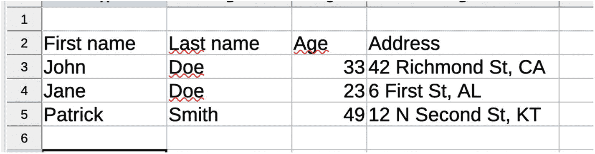

# 5.现有模块

到目前为止，我们已经介绍了 Deno 引入 JavaScript 生态系统的每一个重大变化，现在是时候回顾一下您已经可以用它做的事情了。

不要误会我；你可以用它做任何你想用 Node.js 做的事情。你可能知道，NPM 有几乎同样多的用户发布的数百万个模块，虽然这些代码是 JavaScript，但它并不是 100%与 Deno 兼容，所以我们不能像 11 年前一样重复使用这些工作。

也就是说，Deno 的标准库已经很强大了，从第一天开始，就已经有用户将模块从 Node 移植到 Deno，以使它们兼容，所以我们有很多工具可以使用。

在这一章中，我将介绍其中的一些，以便向您展示虽然这个新的运行时还不到一年，但是您可以用它来做一些非常有趣的项目。

## Deno 标准:标准库

让我们从安装 Deno:标准库的第一天就提供给我们的模块开始。这实际上非常重要，因为对 Ryan 来说，Node.js 有一个非常糟糕的标准库，并且缺少任何人开始做相关事情所需的大多数基本工具。作为在 2012 年左右开始在 0.10 版本上使用 Node 的人，我可以确认，在存在 3 年之后，Node.js 没有真正的标准库。它的重点是为后端开发人员提供异步 I/O，但仅此而已；整个开发人员的体验并不好，尤其是与今天的标准相比。

不过这不是问题，因为 Node 越受欢迎，就有越多的用户将他们可用的基本构建模块编译成更有用的库，并开始通过 NPM 共享。尽管 Deno 已经有了相当多的社区，并且他们开始编写新的库或者将现有的库移植到这边，但是这些数字还不能比较，至少现在还不能。

现在回到性病，因为这是我们在这里要讨论的。正如我在第 [1](1.html) 章中提到的，这种最初的功能分组部分受到了 Go 及其标准库的启发，所以如果在 Deno 的未来更新中，他们继续从那里移植更多的想法，我不会感到惊讶。但是到目前为止，Deno 的标准库包含 21 个稳定的模块，一个实验性的模块，以及一些已经可供您查看的示例。

表 5-1

Deno 标准库包含的所有模块的列表

<colgroup><col class="tcol1 align-left"> <col class="tcol2 align-left"></colgroup> 
| 

组件

 | 

描述

 |
| --- | --- |
| 档案馆 | 归档功能，在撰写本书时，它为您提供了归档和解压缩文件的能力。 |
| 异步ˌ非同步(asynchronous) | 处理异步行为的工具集。我不是在谈论承诺或异步/等待；这些是语言本身的一部分。这里有一些东西，比如选择代码执行延迟时间的延迟函数，或者将 resolve 和 reject 函数作为方法添加到 promise 中。 |
| 字节 | 操作字节的低级函数集。如果你不这样对待二进制对象，它们将需要更多的工作；这些功能将帮助您简化这项任务。 |
| 日期时间 | 一些辅助函数和一些字符串解析函数，帮助您在字符串和日期对象之间架起一座桥梁。 |
| 编码 | 非常有用的模块来处理外部数据结构。还记得 JSON 结构是如何获得 JSON 全局对象的吗？嗯，在这里您可以添加对 YAML，CSV 和其他几个的支持。 |
| 旗帜 | 命令行参数分析器。如果您正在构建一个 CLI 工具，就不再需要导入一个模块来完成这项工作；你已经有了。这显示了一个经过深思熟虑的标准库的威力。 |
| 滤波多音 | 文本格式化功能。如果`console.log`对你来说还不够，这个模块有你所需要的一切来增加你的控制台消息的活力。 |
| 满量程 | 额外文件系统功能。我们不是在谈论只是读写一个文件；这可以直接从 Deno 名称空间完成。我们正在讨论使用通配符作为路径的一部分，复制文件和文件夹，移动它们，等等。**注意**:在撰写本文时，这个模块被标记为不稳定，所以你需要`--unstable`标志来访问它。 |
| 混杂 | 该库增加了对创建和处理 10 多种用于创建散列的算法的支持。 |
| 超文本传送协议（Hyper Text Transport Protocol 的缩写） | HTTP 相关的函数。如果你试图创建一个 web 服务器(例如，在一个微服务上工作，一个单一的 web 应用，或者介于两者之间的东西)，在这里你可以得到你所需要的一切。 |
| 木卫一 | 这是 Deno 处理流的模块，当然包括标准输入的模块。这意味着，如果您希望从用户那里请求输入(当然，除了其他事情之外)，这就是您要使用的模块。 |
| 原木 | 这个模块是 Deno 拥有非常完整的标准库的证明。有多少次你不得不在 Node 中实现你自己的记录器？或者为你的项目寻找最好的伐木工？相反，Deno 已经有一个非常完整和灵活的供您使用，而不必出去寻找任何东西。 |
| 哑剧 | 一组专用于处理多部分表单数据的函数，包括读取和写入。 |
| 结节 | 这是一个与 Node.js 的标准库兼容的模块。它为一些最常见的节点功能(如 require 或 events)提供了聚合填充。如果你想把代码从节点移植到节点，这是一个你想回顾的模块；不然真的没什么用。 |
| 小路 | 用来处理路径的一组经典函数，例如从路径中获取文件夹名，或者提取一组不同路径的公共路径等等。 |
| 许可 | 一个小模块，用来授予你的脚本权限。它要求使用`--unstable`标志。它与上一章描述的`Deno.permissions` API 非常相似。 |
| 信号 | 提供一个 API 来处理进程信号。这是一个相当低级的 API，但它允许您处理 SIGINT 和 SIGTSTP 之类的信号。 |
| 测试 | 就像日志模块一样，这次 Deno 也为您提供了创建测试套件所需的一切。 |
| 全局唯一识别 | 以前需要创建一个唯一的 ID 吗？本模块将帮助您使用 UUID 标准支持的不同版本(1、3、4 和 5)之一创建一个。 |
| 艾德 | WebAssembly 系统接口(WASI)的实现，可用于编译 WASM 代码。 |
| 《华盛顿明星报》 | 我们在列表中遗漏了一样东西:WebSocket 支持。 |

表 [5-1](#Tab1) 对标准模块进行了快速概述；它们都在不断发展，但同时，由于它们作为 Deno 生态系统的一部分发挥着至关重要的作用，它们由核心团队直接审查。就像任何开源项目一样，您可以发送您的贡献；只要明白他们不能有任何外部依赖。

## 外部模块

正如我已经提到的，Deno 的用户定制模块生态系统还不能与 Node 的相比，因为它已经存在了很长时间。也就是说，机构群体正在做大量工作来弥合这一差距。

毕竟，现有的每个节点模块都是用 JavaScript 编写的，只是风格略有不同，所以翻译是可行的。这只是需要时间，尤其是当你要翻译的模块有依赖项时，因为你也必须翻译那些依赖项。

自 Deno 发布以来，已经部署了一些解决方案，以便通过某种形式的单一位置浏览和查找模块(阿拉 NPM 网站)，或者通过跟踪 URL 或者直接存储所有内容。

我将快速介绍最近部署的两个主要存储库，您可以使用它们来了解已经有哪些可供您使用的存储库。

### 官方名单

Deno 的网站( [`http://deno.land`](http://deno.land) )提供免费的 URL 重写服务，你可以贡献你的链接到列表中。基本上，他们会在他们的网站上列出你的模块(目前，已经有超过 700 个模块被显示)并重定向到它们。这个注册中心的数据库目前是一个 JSON 文件，您必须对其进行编辑并发送一个 Pull 请求。

就个人而言，我不认为这是非常可扩展的，所以我假设在不久的将来他们会提供另一种方式来更新列表并向其中添加您自己的模块。

但是现在，创建这个列表的方法是向这个存储库发送一个 Pull 请求: [`https://github.com/denoland/deno_website2`](https://github.com/denoland/deno_website2) ，具体来说是对名为`database.json`的文件的修改，这个文件可以直接在那个 repo 的根文件夹中找到。

文件的格式见清单[5-1](#PC1)；如您所知，没有太多的字段可以提供，尽管没有关于它的官方文档，但您可以看到它足够简单。

```js
{
//...
"a0": {
"type": "github",
"owner": "being-curious",
"repo": "a0",
"desc": "A command line utility to manage `text/number/email/password/address/note` with Alias to easy recall & copy to clipboard.",
"default_version": "master"
//...
}

Listing 5-1Sample section of the database.json file

```

在`deno.land/x`可以看到储存库，看起来像图[5-1](#Fig1)；本质上，你得到一个基本的搜索框，可以过滤超过 700 个已发布的模块。


图 5-1

Deno 的官方模块库

如果您将分支机构名称作为 URL 的一部分添加，该重定向规则也会考虑到它的创建方式。如果这样做，它会向该分支发送流量；否则，它会认为你的目标是主分支。作为我在第 4 章中提到的使用标签的替代方法，你也可以使用分支名称作为你的版本号，由于这个有用的重定向，这也可能对你有利。有了它，你可以写一些类似 [`http://deno.land/x/your-module@1.4/`](http://deno.land/x/your-module%25401.4/) 的东西，这将把流量重定向到你在 GitHub 的账户(假设这是我们正在谈论的你的模块)，在它里面，到那个模块的文件夹，在它里面，特定的分支称为 1.4。

最酷的是，您可以使用这个方法从代码中导入模块。记住，这只是一个重定向服务；实际的文件存储在你放的任何地方，在这种情况下，它将是 GitHub 自己的服务器。

同样，这不是集中式存储库的替代品，而仅仅是一个搜索将不断增长的分散模块海洋的伟大工具。

### 凭借区块链的力量

第二个，也是最有希望找到 Deno 模块的平台是 nest.land。虽然与之前的服务不同，这个平台也存储你的代码，但它没有使用常规平台，而是使用区块链网络。

这是正确的；通过使用区块链的力量，这个平台不仅为你的模块创建了一个分布式存储，而且是一个永久的存储。通过这个平台和发布你的模块，你将它们储存在 Arweave perma web<sup>[1](#Fn1)</sup>中，从技术上讲，它们将永远存在于此。所以移除模块是不可能的，这在发布模块时已经提供了比任何其他选项更大的优势，因为模块可能被意外移除的事实是依赖外部包的最大风险之一。

这个平台的缺点是它还没有前一个平台受欢迎，所以没有很多包在那里发布。图 [5-2](#Fig2) 展示了他们主页的样子。


图 5-2

图库，列出已发布的模块

为了导入存储在该平台中的模块，您将从网站获得一个 URL，您可以从您的代码中使用它，它们都遵循相同的模式: [`https://x.nest.land/`](https://x.nest.land/) `<module-name>@<module-version>/mod.ts`

例如，模块 Drash， <sup>[2](#Fn2)</sup> 是一个 HTTP 微框架，可以使用以下 URL 导入: [`https://x.nest.land/deno-drash@1.0.7/mod.ts`](https://x.nest.land/deno-drash%25401.0.7/mod.ts) 。

另一方面，如果您希望在这个平台上发布您的模块，那么您必须安装他们的 CLI 工具(称为 egg)。为了做到这一点，您至少需要 Deno 的 1.1.0 版本，使用下面的命令，您应该能够安装它:

```js
deno install -A -f --unstable -n eggs https://x.nest.land/eggs@0.1.8/mod.ts

```

请注意，您提供了所有特权(使用-A 标志),并且还通过使用`--unstable`标志授予了使用不稳定特性的权限。

一旦安装完毕，您就必须使用`eggs link --key [your key]`链接您的 API 密钥(您应该在注册后获取、下载并存储在您的本地存储中)。

通用安装说明到此结束；之后，你必须进入你的模块的文件夹，并使用`egg init`初始化它(就像你用`npm init`一样)。

在初始化过程中，您会被问到几个关于项目的问题，比如名称，如果是模块的不稳定版本的描述，要发布的文件列表，以及配置文件的格式(JSON 或 YAML)。

配置文件的格式类似于清单 [5-2](#PC3) 中的格式。

```js
{
    "name": "module-name",
    "description": "Your brief module description",
    "version": "0.0.1",
    "entry": "./src/main.ts",
    "stable": true,
    "unlisted": false,
    "fmt": true,
    "repository": "https://github.com/your_name/your_project",
    "files": [
        "./mod.ts",
        "./src/**/*",
        "./README.md"
    ]
}

Listing 5-2Sample configuration file for nest

```

尽管这看起来像是 Node 中受人喜爱的`package.json`的一个副本，但事实上并非如此。这个文件是简化显示信息和管理包的任务所必需的，但是它不包括额外的信息，例如依赖项列表，也不包括项目范围的配置或命令。因此，尽管它仍然添加了一个配置文件，但您并没有将所有内容都集中到一个充满不相关内容的文件中。

有了这个文件，剩下要做的就是发布你的模块，你可以用命令`egg publish. A`来完成，之后，你就可以在库中看到你的模块，它将永远存在(或者至少直到 permaweb 被关闭)。

## 要查看的有趣模块

为了结束这一章，我想介绍一些你可能感兴趣的模块，这取决于你想用 Deno 实现什么。

当然，没有什么可以阻止你使用其他模块，但至少它会给你一个起点。

### API 开发

可能与后端异步 I/O 运行时相关的最常见任务之一是开发 API 或任何基于 web 的项目。这就是 Node.js 在微服务项目上获得如此多关注的原因。

对于 Deno，已经有一些非常有趣的框架可用。

#### 德雷什

使用这个模块，您可以创建一个直接的 API 或 web 应用；您可以根据自己选择的生成器脚本来决定使用哪一个。本质上，Drash 为您提供了一个生成器脚本，让您能够创建所需的所有基本样板代码。

最酷的是，由于像 Deno 提供的远程导入和执行远程文件的能力，您可以使用生成器，而不必在您的计算机上安装任何东西。下面一行显示了您需要执行的确切命令:

```js
$ deno run --allow-run --allow-read --allow-write --allow-net https://deno.land/x/drash/create_app.ts --api

```

现在，您应该能够完全理解这个命令在做什么。基本上，您正在执行`create_app.ts`脚本，为了确保它能够工作，您允许它运行子进程，在您的硬盘上读写，并建立网络连接，可能是为了下载所需的文件。


图 5-3

执行 Drash 生成器后的项目结构

项目结构非常简单，如图 [5-3](#Fig3) 所示；注意`deps.ts`文件，它遵循我在第 [4 章](4.html)中介绍的相同模式。目前，它只导出两个依赖项，如您在清单 [5-3](#PC5) 中看到的，但是您将使用这个文件导出您将来可能添加的任何其他内容。

```js
export { Drash } from "https://deno.land/x/drash@v1.0.0/mod.ts";
export { assertEquals } from "https://deno.land/std@v0.52.0/testing/asserts.ts";

Listing 5-3Default exports added by Drash

```

在 resources 文件夹中，您可以看到这个框架试图使用面向对象的方法，通过扩展`Drash.Http.Resource`来声明资源。清单 [5-4](#PC6) 展示了自动生成的资源，这反过来清楚地说明了用这种方法实现一个基于 REST 的 API 是多么容易。

```js
export default class HomeResource extends Drash.Http.Resource {
  static paths = ["/"];

  public GET() {
   this.response.body = JSON.stringify(
    { success: true, message: "GET request received."    },
   );
   return this.response;
  }

  public POST() {
    this.response.body = JSON.stringify({ message: "Not implemented" });
    return this.response;
  }

  public DELETE() {
    this.response.body = JSON.stringify({ message: "Not implemented" });
    return this.response;
  }

  public PUT() {
    this.response.body = JSON.stringify({ message: "Not implemented" });
    return this.response;
  }
}

Listing 5-4Autogenerated resource class by Drash

```

至于它的文档，他们的网站 <sup>[3](#Fn3)</sup> 包含一组非常详细的例子，带你从最基本的用例到最复杂的用例。作为一名来自 Express <sup>[4](#Fn4)</sup> 或 Restify、 <sup>[5](#Fn5)</sup> 等框架的开发人员，Drash 采用的方法是新鲜而有趣的，考虑到它主要侧重于 TypeScript 和我们在第 [2](2.html) 章中介绍的几个特性。

如果您希望快速完成一些工作，并使用 Deno 设置一个 API，可以考虑看看这个新的尝试，而不是使用迁移的节点模块。

### 数据库访问

无论您正在开发哪种应用，您都很可能需要使用数据库。无论是基于 SQL 的还是 NoSQL 的，如果你需要，Deno 都能满足你。

#### 结构化查询语言

如果你正在考虑使用 SQL(特别是 SQLite、MySQL 或 Postgre)，那么 Cotton <sup>[6](#Fn6)</sup> 是你的首选；类似于 sequelize <sup>[7](#Fn7)</sup> 为 Node 所做的，这个模块试图为开发者提供一个数据库无关的方法。您担心使用正确的方法，它会为您编写查询。最好的部分是，如果你需要，你也可以写你自己的原始查询，当然，这将打破 ORM 模式，但它也给你最复杂的用例所需的灵活性。

你可以直接从 Deno 的模块库中导入这个模块，换句话说，从你的代码中使用 [`https://deno.land/x/cotton/mod.ts`](https://deno.land/x/cotton/mod.ts) 。然后使用清单 [5-5](#PC7) 中的代码连接到数据库。

```js
import { connect } from "https://deno.land/x/cotton/mod.ts";

const db = await connect({
  type: "sqlite", // available type: 'mysql', 'postgres', and 'sqlite'
  database: "db.sqlite",
  // other...
});

Listing 5-5Connecting to your favorite SQL database

```

然后，您可以通过直接编写 SQL 来查询您的表，如清单 [5-6](#PC8) 所示，或者使用清单 [5-7](#PC9) 所示的数据库模型(遵循 ORM 模式)。

```js
const users = await db.query("SELECT * FROM users;");

for (const user of users) {
  console.log(user.email);
}

Listing 5-6Raw query getting the list of users

```

请注意，结果是如何将用户直接转换为具有正确属性的对象，而不是必须使用自定义方法来获取正确的属性，或者甚至为每个记录创建一个值数组。

```js
import { Model } from "https://deno.land/x/cotton/mod.ts";

class User extends Model {
  static tableName = "users";

  @Field()
  email!: string;

  @Field()
  age!: number;

  @Field()
  created_at!: Date;
}
//and now query your data...
const user = await User.findOne(1); // find user by id
console.log(user instanceof User); // true

Listing 5-7Using the ORM pattern to query the database

```

当然，如果您想走这条路，您必须更改 TypeScript 编译器上的默认配置；不然就不行了。你可以在你的项目文件夹中有一个类似于清单 [5-8](#PC10) 的`tsconfig.json`文件。

```js
{
  "compilerOptions": {
    "experimentalDecorators": true,
    "emitDecoratorMetadata": true
  }
}

Listing 5-8Required configuration to make decorators work

```

然后用下面一行执行您的代码:

```js
$ deno run -c tsconfig.json main.ts

```

#### NoSQL

另一方面，如果您希望与 NoSQL 数据库进行交互，推荐一个模块的任务会变得有点复杂，因为由于 NoSQL 数据库的性质，您很难找到一个适用于所有数据库的模块。

相反，您必须寻找专门为您的数据库设计的东西。在这里，我将为 MongoDB 和 Redis 推荐一些东西，因为它们是两个主要的 NoSQL 数据库。

##### MongoDB

基于文档的数据库是 NoSQL 的经典选择，尤其是 MongoDB，考虑到它与 JavaScript 的集成，非常适合我们最喜欢的运行时。

DenoDB <sup>[8](#Fn8)</sup> 是除 deno_mongo <sup>[9](#Fn9)</sup> 之外为数不多的为 mongoDB 提供支持的模块，deno _ Mongo[9](#Fn9)是用 Rust 编写的 Mongo 驱动程序之上的直接包装器。有趣的是，这个模块还支持一些主要的基于 SQL 的数据库，所以它涵盖了所有的基础知识。

连接 Mongo 很容易；您只需要确保您指定了清单 [5-9](#PC12) 中所示的正确选项，定义您的模型就像扩展模块导出的模型类一样简单(参见清单 [5-10](#PC13) 中的示例)。

```js
class Flight extends Model {
  static fields = {
    _id: {
      primaryKey: true,
    },
  };
}
const flight = new Flight();
flight.departure = 'Dublin';
flight.destination = 'Paris';
flight.flightDuration = 3;
await flight.save()

Listing 5-10Using models to interact with the collections

```

```js
import { Database } from 'https://deno.land/x/denodb/mod.ts';

const db = new Database('mongo', {
  uri: 'mongodb://127.0.0.1:27017',
  database: 'test',
});

Listing 5-9Connecting to Mongo

```

这个模块唯一的缺点是明显缺乏对原始查询的支持。因此，如果你发现自己需要模块的 API 没有给你的操作，请记住，它只是使用 deno_mongo 来处理连接，所以你可以通过`getConnector`方法直接访问该对象。

##### 使用心得

Redis 是一种完全不同类型的数据库，因为它处理的是键-值对，而不是实际的类似文档的记录，所以遵循相同的基于 ORM 的方法没有什么意义。

因此，我们将使用 Deno 的 Redis 驱动程序的直接端口，可以访问所有经典的 Redis 方法。如果您来自 Node 并且以前使用过 Redis 包，这应该感觉非常相似。

```js
import { connect } from "https://denopkg.com/keroxp/deno-redis/mod.ts";

const redis = await connect({
  hostname: "127.0.0.1",
  port: 6379
});

const ok = await redis.set("hoge", "fuga");
const fuga = await redis.get("hoge");

Listing 5-11Connecting to Redis from Deno

```

清单 [5-11](#PC14) 显示了取自文档的一个基本例子，但是你可以在那里看到正在使用的`set`和`get`方法。还支持 Pub/Sub API 和一个非常有趣的特性:原始请求(参见下面的示例片段)。

```js
await redis.executor.exec("SET", "redis", "nice"); // => ["status", "OK"]
await redis.executor.exec("GET", "redis"); // => ["bulk", "nice"]

```

当然，您通常希望使用 API 提供的方法，但是这允许您访问尚不属于稳定 API 的特性。仅在极端情况下使用此选项；否则，坚持使用标准方法。

Tip

为了让您的代码与这个模块一起工作，您需要使用`--allow-net`标志提供网络特权。

### 命令行界面

作为 Deno 等运行时的另一个经典用例，考虑到 JavaScript 的动态性，很容易将其用于开发工具，这就是 CLI 工具的用武之地。

尽管 Deno 作为其标准库的一部分已经提供了一个非常全面的参数解析模块，但是在创建命令行工具时还需要注意其他事情。

为此，模块 Cliffy <sup>[10](#Fn10)</sup> 提供了一套完整的软件包，处理创建这些工具所涉及的所有方面。

作为该模块的一部分，有六个集中了不同功能的包，允许您只导入您需要的部分，而没有单一的巨大依赖。

*   **ansi-escape**:<sup>[11](#Fn11)</sup>允许您在需要时通过四处移动或隐藏光标来与 CLI 光标进行交互。

*   **命令**:<sup>T3】12T5】你可以使用这个模块为你的 CLI 工具创建命令。它提供了一个非常易于使用的 API，可以自动生成帮助消息并帮助您解析 CLI 参数。</sup>

*   **flags** : <sup>[13](#Fn13)</sup> 把这个模块想象成 Deno 的 flag 解析包上了类固醇。它允许您为您的标志提供一个非常详细的模式，指定诸如别名、它们是否是强制的、与其他标志的依赖性等等。它帮助您将 CLI 工具从基础版本升级为经过充分思考和专业设计的工具。

*   **keycode**:<sup>[14](#Fn14)</sup>如果你试图请求用户输入普通文本以外的内容(例如，按下 CTRL 键)，这个模块将帮助你解析那些信号。

*   **提示** : <sup>[15](#Fn15)</sup> 请求用户输入可以简单到使用一个带有消息的 console.log，然后依赖 Deno 的 Stdin 阅读器，或者您可以使用这个包给用户一个很好的体验。除了请求自由文本输入，您还可以提供下拉框、复选框、数字输入等等。

*   **表格** : <sup>[16](#Fn16)</sup> 如果您需要在终端上显示表格数据，这个模块就是您的首选。它允许您设置格式选项，如填充、边框宽度、最大单元格宽度等。

作为这个库可以做什么的一个例子，我将向您展示如何使用我刚才提到的最后一个模块在一个格式良好的表格上显示 CSV 文件的内容。

文件内容见图 [5-4](#Fig4) 。你会发现它没有什么特别之处，只是你的普通电子表格，我会把它保存为普通的 CSV 文件，并使用清单 [5-12](#PC16) 中的代码，我会加载并显示它。在图 [5-5](#Fig5) 中，你会看到最终结果显示在我的终端上。



图 5-4

基本 CSV 文件

```js
import { parse } from "https://deno.land/std/encoding/csv.ts";
import { BufReader } from "https://deno.land/std/io/bufio.ts";
import { Table } from 'https://deno.land/x/cliffy/table.ts';

const f = await Deno.open("./data.csv");
const reader = new BufReader(f)

const records:[string[]] = <[string[]]>(await parse(reader))

f.close();

Table.from( records )
.maxCellWidth( 20 )
.padding( 1 )
.indent( 2 )
.border( true )
.render();

Listing 5-12Deno code to display the content of our CSV in table format on the terminal

```

注意如何解析 CSV。我实际上使用的是 Deno 的标准库，table 模块期望得到与`parse`方法返回的格式相同的格式，所以我们在这里实际上不必做太多。输出本身正如我们所期望的那样，是我们终端上的一个表格。


图 5-5

显示表中数据的脚本输出

现在已经有很多其他的模块可以让你开始用 Deno 编写高质量的软件了。社区不断地发布和移植来自 Node 或 Go 的包，或者只是抓住机会给这个新的生态系统带来新鲜的想法，所以开始浏览和测试那些看起来更有趣的包真的取决于你。

## 结论

本章的目的是让您了解 Deno 的生态系统已经有多成熟，正如您所看到的，社区不仅对缺乏提供浏览和可靠存储代码的方式的包管理器做出了回应，而且他们还一直在制作内容，就像没有明天一样。

如果您想知道这个新的运行时是否有足够的用户群来实际用于生产，考虑到在发布后的几个月内已经发布的所有内容，本章应该会给你答案。

事情才刚刚开始，所以在下一章，也是最后一章，我将展示几个例子，说明如何使用本章中的一些模块和一些新的模块来创建成熟的应用。

<aside aria-label="Footnotes" class="FootnoteSection" epub:type="footnotes">Footnotes [1](#Fn1_source)

[T2`www.arweave.org/`](http://www.arweave.org/)

  [2](#Fn2_source)

[T2`https://nest.land/package/deno-drash`](https://nest.land/package/deno-drash)

  [3](#Fn3_source)

[T2`https://drash.land`](https://drash.land)

  [4](#Fn4_source)

[T2`https://expressjs.com/`](https://expressjs.com/)

  [5](#Fn5_source)

[T2`http://restify.com/`](http://restify.com/)

  [6](#Fn6_source)

[T2`https://rahmanfadhil.github.io/cotton/`](https://rahmanfadhil.github.io/cotton/)

  [7](#Fn7_source)

[T2`https://sequelize.org/`](https://sequelize.org/)

  [8](#Fn8_source)

[T2`https://eveningkid.github.io/denodb-docs/`](https://eveningkid.github.io/denodb-docs/)

  [9](#Fn9_source)

[T2`https://deno.land/x/mongo`](https://deno.land/x/mongo)

  [10](#Fn10_source)

[T2`https://github.com/c4spar/deno-cliffy/`](https://github.com/c4spar/deno-cliffy/)

  [11](#Fn11_source)

[T2`https://github.com/c4spar/deno-cliffy/tree/master/packages/ansi-escape`](https://github.com/c4spar/deno-cliffy/tree/master/packages/ansi-escape)

  [12](#Fn12_source)

[T2`https://github.com/c4spar/deno-cliffy/tree/master/packages/command`](https://github.com/c4spar/deno-cliffy/tree/master/packages/command)

  [13](#Fn13_source)

[T2`https://github.com/c4spar/deno-cliffy/tree/master/packages/flags`](https://github.com/c4spar/deno-cliffy/tree/master/packages/flags)

  [14](#Fn14_source)

[T2`https://github.com/c4spar/deno-cliffy/tree/master/packages/keycode`](https://github.com/c4spar/deno-cliffy/tree/master/packages/keycode)

  [15](#Fn15_source)

[T2`https://github.com/c4spar/deno-cliffy/tree/master/packages/prompt`](https://github.com/c4spar/deno-cliffy/tree/master/packages/prompt)

  [16](#Fn16_source)

[T2`https://github.com/c4spar/deno-cliffy/tree/master/packages/table`](https://github.com/c4spar/deno-cliffy/tree/master/packages/table)

 </aside>