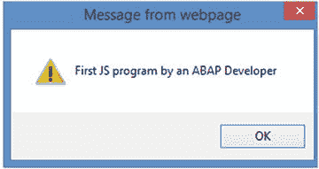
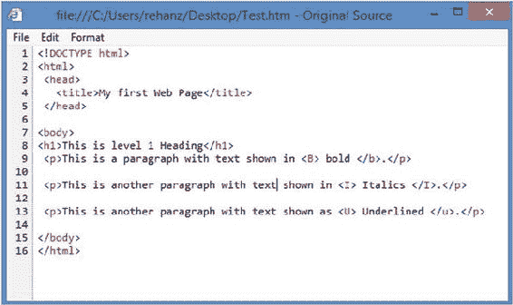
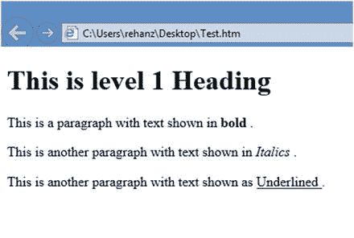
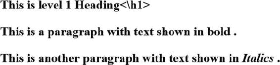
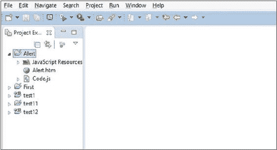
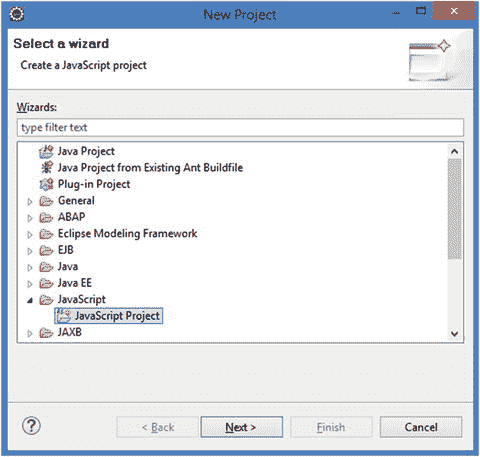
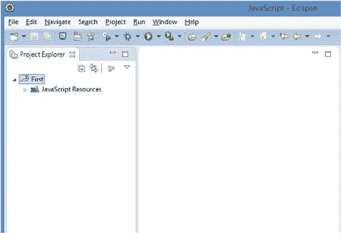
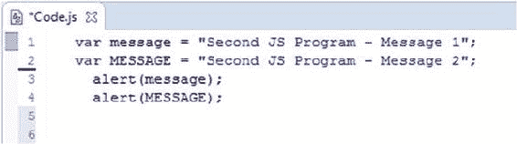
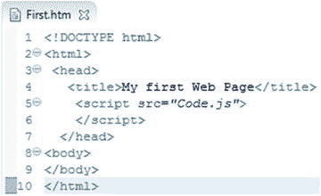
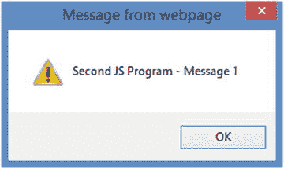

Rehan Zaidi，面向 SAP ABAP 开发人员的 JavaScript 基础知识，10.1007/978-1-4842-2220-1_1

# 1.JavaScript 简介

雷汉扎伊迪 <sup class="calibre6">1</sup>

①巴基斯坦卡拉奇

本章为 ABAP 开发者提供了 JavaScript 的介绍。我们先从学习 JavaScript 的必备知识开始。然后，我们将介绍 JavaScript 的基础知识，以及 ABAP 和 JavaScript 之间的一些差异。接下来，我们将看一个非常简单的程序和你自己创建它的必要步骤。

## 简单的 JavaScript 背景

JavaScript 是 ECMAScript 语言规范中标准化的高级、动态、非类型化语言。与超文本标记语言(HTML)和级联样式表(CSS)一起，JavaScript 是另一项最初推动 Web 应用架构的重要技术。所有现代 web 浏览器都支持 JavaScript (JS ),并且今天大多数网站和 web 应用都在使用它。一开始，使用 JavaScript 的典型例子包括在网页上创建交互效果和在网站上进行表单数据验证。从那以后，许多库都是用 JS 编写的，比如 jQuery。

###### 注意

有一种常见的误解，认为 JavaScript 和 Java 是相似的。它们是不相关的，并且具有不同的语义。JavaScript 的语法源自 C 编程语言。

此外，JS 语言在服务器端编程中用作几种不同浏览器引擎的运行时引擎，如 V8 (Google Chrome)和 SpiderMonkey (Firefox)。最广为人知和使用的 JS 运行时环境之一叫做 NodeJS。

JavaScript 与 C 语言在语法上有一些相似之处，比如 switch 和 if 语句以及 while 和 do while 循环。在 JavaScript 中，类型与值链接，而不是与变量链接。例如，一个名为 myvar 的变量可以先被赋予一个字符串，然后被反弹为一个数字。

JavaScript 是一种区分大小写的语言，这意味着任何语言关键字、变量名和函数名都必须用一致的大写字母书写。例如，关键字 case 必须写成“case”，而不是“CASE”或“Case”

JavaScript 是一种*多参数*语言，允许命令式编程、面向对象编程和函数式编程。它允许你处理文本、数字、日期和数组。JavaScript 中还提供了正则表达式处理功能。然而，JS 不提供任何网络或图形功能。JavaScript 支持使用类进行继承的原型(与许多其他面向对象的语言不同，如 ABAP)。许多基于类的特性可以使用 JavaScript 中的原型来编程。

## 在 JavaScript 程序内部

本节详细介绍 JavaScript 程序的各种不同的代码元素。

JavaScript 程序由许多语句组成。每条语句都以分号(；).JavaScript 区分表达式和语句。语句可以由文字、变量和表达式组成。给定的 JS 语句可能跨越多行。此外，在一行中可以写多条语句。

注释是任何代码的重要组成部分。JavaScript 忽略了它们，但它们是程序员记录代码目的的重要工具，供以后审查。有两种类型的注释可以添加到 JavaScript 程序中。首先，您可以添加单行注释，如下所示:

```js
var num = 1; // from here comments start
```

如您所见，单行注释以双斜线(//)开始。该行中所有后续代码/文本都被视为注释文本。标记单行注释的结尾不需要结尾标点；这条线的尽头就是为了这个目的。

JavaScript 还允许您指定多行注释。这些行可以包含在/*和*/之间，并且可以包含一行或多行。在多行注释中，嵌套是不可能的。试图嵌套多行注释会产生语法错误。清单 [1-1](#PC2) 显示了一个在 JS 中不可接受的例子。

###### 清单 1-1。错误嵌套的注释

```js
/*  this is comment 1
/*  this is comment 2  */
*/
```

正如你所看到的，这个例子试图在注释 1 中嵌套注释 2，这是不允许的，并且会产生语法错误。

在 JavaScript 程序中，语句是逐行执行的(即顺序执行)。一组语句可以组合在一起形成一个块。块的开始和结束用花括号({ })表示。这些块可能包括函数中的代码(函数类似于 ABAP 中的子例程)或 if 语句或 switch 语句中的代码。

一个 JS 程序可能包含许多文字。在 JS 中使用文字来表示程序中使用的固定值(与变量相反)。这些文字的一些例子是整数和字符串文字。

在 JavaScript 中，字符串包含在一组双引号("")或一组单引号('')中，而 ABAP 字符串只包含在单引号中。其他类型的文字有数组文字、布尔文字和对象文字。

## 创建一个简单的 JS 程序

现在您已经对 JavaScript 有了一些基本的了解，本节将向您展示如何制作一个简单的程序，然后解释它的各个部分。

您将创建一个小程序，在弹出对话框中显示“我的第一个 JS 程序”的消息。JS 中有一个内置的函数 alert，可以让您向用户显示一条消息。这个函数可以接受文字或变量形式的数字或字符串作为输入。

这个程序的代码如清单 [1-2](#PC3) 所示。

###### 清单 1-2。在弹出对话框中显示文本的程序

```js
<html>
   <body>
      <script>
             alert("First JS program by an ABAP Developer");
      </script>
    </body>
</html>
```

如您所见，该程序使用一个字符串文字(在双引号内)向用户显示消息。运行此示例会在弹出的对话框中显示一条消息，如图 [1-1](#Fig1) 所示。



###### 图 1-1。程序输出

## 快速浏览 HTML

JavaScript 代码不能单独执行。它依赖于运行时环境来包含/导入脚本(例如，HTML 

HTML 是用来创建网页的语言。在网页源代码文本中，有许多标签。简单来说，*标签*是 HTML 文档中的代码，以符号<开始，以>结束。标签通常成对出现，一对标签指示浏览器如何处理标签对中出现的文本。

每个标签都有特殊的含义，有自己的效果。标签由浏览器读取并相应地解释。浏览器不会显示标签。然后，浏览器向查看者呈现并显示网页。

###### 注意

HTML 不是区分大小写的语言:、、都有同样的效果。但是，您必须确保结束标记，比如，包含一个正斜杠，而不是反斜杠。写会出问题。

在这个阶段，您只需要知道 HTML 的细节，这些细节将帮助您运行将要编写的 JS 代码。HTML 文档中存在许多元素，它们被表示为标签:

*   HTML 标签和标记了 HTML 文档的开始和结束。浏览器根据 HTML 标记中包含的信息呈现页面。确保没有代码写在标志 HTML 文档结束的

*   HEAD 标签包含与文档相关的一般信息，例如页面的使用以及与其他文档和资源的链接。例如，一对标签可能包含与网页相关的 JS 文件和 CSS 代码的信息。标题中是 TITLE 标签，用于指定文档的标题。标题显示在浏览器窗口的顶部。TITLE 标签还包含关于文档的元数据。

*   和包含关于页面主体的信息——浏览器加载页面时呈现的实际内容。这对标记中包含的一些元素是页眉和页脚。在正文中，您可以显示许多文本行、表格、表单和图形。您可能有许多标题，如<heading1>、<heading2>等等。使用</heading2></heading1>

    标签，你也可以指定一个新段落的开始位置。浏览器读取正文中的各种元素，并相应地呈现页面。

现在你已经准备好看看如何编写你的第一个 HTML 代码。图 [1-2](#Fig2) 显示了一个简单的 HTML 程序，其中没有任何 JavaScript。



###### 图 1-2。HTML 无 JavaScript 代码

图 [1-2](#Fig2) 的代码输出如图 [1-3](#Fig3) 所示。



###### 图 1-3。HTML 代码输出

如果 HTML 代码中有语法错误，浏览器仍然会产生输出。但是，您可能得不到想要的结果。例如，考虑图 [1-2](#Fig2) 中所示的相同代码，其中主体中的< /H1 >标签被错误地写成< \H1 >(即带有反斜杠)。在这种情况下，整组文本行以标题样式显示，如图 [1-4](#Fig4) 所示。



###### 图 1-4。HTML 页面的错误输出

## 将 JavaScript 放入 HTML 代码中

本节向您展示如何将本章前面的 JavaScript 代码添加到上一节的简单 HTML 页面中。您可以选择几种方法中的任何一种来实现这一点。最简单的方法是将整个 JS 代码写在 HTML 页面的头部或主体中。也可以将 JS 代码编写为一个单独的文件，并将文件名包含在 HTML 代码中。让我们逐一考虑这些方法。请注意，它们都在浏览器显示中产生相同的输出。

### 在和标签中编写 JS 代码

第一种方法是在 HEAD 元素中包含整个 JavaScript 代码。例如，您可以将您在清单 [1-2](#PC3) 中编写的 JS 代码嵌入到上一节创建的 HTML 代码中(如图 [1-2](#Fig2) 所示)。包含 JavaScript 的 HTML 代码如清单 [1-3](#PC4) 所示。

###### 清单 1-3。头部带有 JS 代码的 HTML 代码

```js
<!DOCTYPE html>
<html>
 <head>
   <title>My first Web Page</title>
    <script>
      alert("First JS program by an ABAP Developer");
    </script>
  </head>
<body>
</body>
</html>
```

如您所见，单行 JS 脚本是在 HEAD 标记中编写的。当浏览器到达标签之后的剩余 HTML 代码。

### 在和标签中编写 JS 代码

另一种方法是将 JavaScript 代码包含在 BODY 元素中，在

###### 清单 1-4。在 HTML 主体中添加 JavaScript

```js
<!DOCTYPE html>
<html>
 <head>
   <title>My first Web Page</title>
 </head>
<body>
<script>
      alert("First JS program by an ABAP Developer");
</script>
</body>
</html>
```

与前面的方法一样，当浏览器到达标记后的剩余 HTML 代码。

### 在单独的文件中创建 JS 代码

另一种常用的方法是将 JS 代码包含在与 HTML 代码分开的文件中，并在 HTML 代码中包含指向 JS 文件的链接。这种方法有几个优点:它使 HTML 代码和 JavaScript 代码都更容易理解和维护。清单 [1-5](#PC6) 展示了如何在 HTML 代码中链接到一个 JS 文件。

###### 注意

当将外部 JS 文件链接到 HTML 代码时，请确保 JS 文件的名称以正确的大小写书写。例如，不要将 Code.js 写成 code.js 或 CODE.JS。

###### 清单 1-5。用 HTML 代码处理 JS 文件

```js
<!DOCTYPE html>
<html>
 <head>
   <title>My first Web Page</title>
    <script src="Code.js">   // JS file name
    </script>
  </head>
<body>
</body>
</html>
```

这个例子假设 JavaScript 代码包含在一个单独的文件中，在 HTML 代码所在的目录中。如您所见，包含 JS 代码的文件名(在本例中是 Code.js)是在 HEAD 元素中指定的。您必须确保以正确的大小写书写文件名。

同样，一旦到达标签之后的剩余 HTML 代码。

## JavaScript 中的变量声明

变量声明是任何编程语言的重要组成部分。声明变量使您能够为程序中使用的值指定符号名。JavaScript 变量名必须以下列之一开头:

*   一个字母(包括大写字符 *A* 到 *Z* 和小写字符 *a* 到 *z*

*   下划线(_)

*   美元符号($)

名称不能以数字(0-9)开头，但后面的字符可以是数字。允许的变量名包括 Nu_hits、Mytemp13 和 _myname。

JavaScript 中定义的变量要么是具有全局执行上下文的*全局变量*，要么是特定于特定函数的*局部变量*(我们将在本书的后面部分讨论这一点)。局部变量只在定义它的函数内可见/可访问，在函数外不可见/可访问。全局变量对整个 JS 程序是可见的/可访问的。

JavaScript 中的变量是使用 var 关键字声明的。下面是语法:

```js
var num; 
```

也可以在同一行代码中声明变量并初始化它:

```js
var num = 1;
```

您也可以在一行中链接两个变量声明(使用逗号将它们链接在一起):

```js
var num1, num2;
```

也可以在一行代码中初始化一个或两个变量:

```js
var num1, num2 = 1;
```

您不需要指定变量的类型。声明从分配给它的值中获取类型。

###### 注意

与 ABAP 不同，JavaScript 允许你声明变量，然后改变它们的类型。

您也可以使用相同的 var 语句声明一个变量并用一个值初始化它，然后将该变量及其值赋给另一个变量:

```js
var num1 = 10;
var num2 = num1;
```

如您所见，变量 num1 是用值 10 声明和初始化的。在第二条语句之后，num2 变量被声明为一个数字，并被赋值为 10。在语句之后，两个变量的值都是 10。

也可以在以后更改变量的类型。例如，如果变量 num1 是一个数字，以后可以将其更改为字符串，如下例所示:

```js
var num1 = 10;
num1 = "my string";
```

在 JavaScript 中，你也可以在变量被使用后声明它。换句话说，你甚至可以在声明变量之前使用它。考虑下面这段简短的代码:

```js
num1 =  10;
var num1; 
```

在这种情况下，我们有一个名为 num1 的变量，其值为 10。代码的后面是使用 var 关键字定义变量。JS 的这个特点被称为*变吊*。当加载和执行 JS 程序时，首先处理所有声明变量的 var 语句(即，在程序代码的其余部分之前)。

如前所述，JavaScript 是一种区分大小写的语言。这意味着你可以用相同的字母创建不同大小写的变量。例如，考虑下面的例子:

```js
var message = "Second JS Program - Message 1";
var MESSAGE = "Second JS Program - Message 2";
```

这段代码定义了两个独立的变量 message 和 MESSAGE，每个变量都被赋予了不同的字符串值。不鼓励这种做法，以避免混淆。

## 使用 Eclipse

创建 JavaScript 程序没有单一的编辑器。您有多种选择，例如

*   笔记本

*   SAP Web IDE

*   便笺本

*   记事本++

在这一部分和整本书中，我将演示如何使用我选择的编辑器 Eclipse IDE 创建 JavaScript 程序。向您展示整个 Eclipse 安装过程超出了本章的范围。你应该可以通过 www.eclipse.org 的在线说明很容易地安装它，你也可以在那里下载 Eclipse。

成功安装 Eclipse 后，双击桌面上的快捷方式，如图 [1-5](#Fig5) 所示。


###### 图 1-5。Eclipse 快捷方式

###### 注意

所有的例子和截图都是在 Windows 中测试的。

或者，如果您使用的是 Windows，您可以使用程序菜单打开 Eclipse。这两个选项都将您带到 Eclipse 编辑器的开始屏幕，如图 [1-6](#Fig6) 所示。



###### 图 1-6。Eclipse 编辑器

现在您需要创建一个 Eclipse JavaScript 项目。选择菜单路径文件➤新➤项目。出现新建项目对话框，如图 [1-7](#Fig7) 所示。展开 JavaScript 文件夹，选择 JavaScript 项目节点，然后单击 Next 按钮。



###### 图 1-7。创建 JavaScript 项目

在出现的向导屏幕上，输入项目的名称(在本例中，首先输入**)。不要更改屏幕上的任何其他值，并单击 Finish 按钮。现在屏幕出现如图 [1-8](#Fig8) 所示。**

**

###### 图 1-8。项目“第一”

在左侧面板中，您可以看到名为 First 的项目最初没有 HTML 或 JavaScript 文件。现在，您将把 JavaScript 和 HTML 文件添加到这个项目中。要添加 JavaScript 代码，只需右键单击第一个项目节点，然后选择“新建➤ JavaScript 源文件”。在出现的对话框中，输入文件的名称。对于这个例子，输入 **Code.js** 。然后，单击“完成”按钮。

左窗格将出现如图 [1-9](#Fig9) 所示。


###### 图 1-9。添加了 Code.js 节点

如您所见，第一个项目文件夹中添加了一个新的 Code.js 节点。要向 Code.js 文件添加代码，只需双击该节点。右窗格变化如图 [1-10](#Fig10) 所示。



###### 图 1-10。JavaScript 编辑器

只需在程序中添加如图 [1-10](#Fig10) 所示的代码，并使用组合键 CTRL+S 保存代码，如您所见，本例使用了两个名称相似但大小写不同的变量(message 和 MESSAGE)。它还使用两个警告语句向用户输出值。

接下来，您需要向项目中添加一个 HTML 文件。首先右键单击文件夹，然后选择“新建➤文件”。在出现的对话框中，输入带有 html 扩展名的文件名(在本例中为**First.html**)。在右侧面板的 html 编辑器中输入 HTML 的代码(参见图 [1-11](#Fig11) )。



###### 图 1-11。HTML 编辑器

正如您所看到的，这个例子使用了

接下来，保存您的项目。现在您可以在 Eclipse 中测试您的代码了。为此，右键单击 HTML 文件节点，然后选择“运行➤浏览器”。

您将在右侧面板中看到输出。因为你在程序中写了两条 alert 语句，第一条 alert 语句的输出显示在一个对话框中，如图 [1-12](#Fig12) 所示。



###### 图 1-12。显示警告的 JavaScript 编辑器

单击第一个对话框的确定按钮将显示第二个对话框。

您已经在 Eclipse 中成功地创建了一个 JavaScript 程序，为后续章节的构建奠定了基础。

## 摘要

这本书的第一章介绍了 JavaScript 的基础知识。您看到了如何在程序中定义和使用变量，以及如何创建一个简单的 JS 程序。此外，您还了解了用于创建 JavaScript 程序和 HTML 代码的 Eclipse IDE。在下一章中，您将更详细地探索这种语言，包括 JavaScript 语言支持的数据类型。**