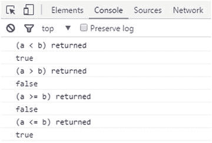
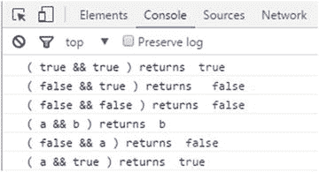
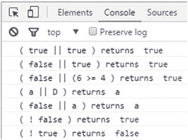
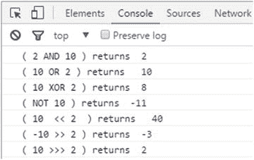

Rehan Zaidi，面向 SAP ABAP 开发人员的 JavaScript 基础知识，10.1007/978-1-4842-2220-1_3

# 3.JavaScript 中的运算符

雷汉扎伊迪 <sup class="calibre6">1</sup>

①巴基斯坦卡拉奇

本章详细解释了 JavaScript 操作符。它从算术运算符开始，然后着眼于比较运算符和逻辑运算符，这些运算符用于在 JS 程序中制定条件检查。本章的最后一节介绍了赋值运算符和按位运算符。

## 算术运算符

算术运算符将文字或变量形式的值作为操作数，并返回单个值。JavaScript 支持的标准算术运算符在表 [3-1](#Tab1) 中列出。在接下来的小节中，将依次介绍每种方法。

###### 表 3-1。算术运算符

<colgroup class="calibre23"><col class="calibre24"> <col class="calibre24"></colgroup> 
| 

操作员描述

 | 

操作员

 |
| --- | --- |
| 添加 | + |
| 减法 | - |
| 增加 | * |
| 分开 | / |
| 余数(模或模数) | % |
| 指数运算 | ** |
| 增量 | ++ |
| 减量 | - |
| 一元否定 | - |

### 加法算子

加法运算符(+)产生数字操作数的加法(和)。对于字符串，加法运算会导致字符串串联。其语法如下所示:

```js
A + B
```

以下是加法运算符的几个应用示例:

```js
2 + 4                 //    6     addition performed
10 + "text"           //   10text concatenation
"text" +  "string"    //   "textstring"
2 + true              //    results  in value 3
1 + false             //    1
```

### 减法运算符

减法运算符(-)对两个操作数执行算术减法。语法是

```js
x - y
```

对于数值操作数，返回 x 和 y 之间的差值。如果是字符串，则返回值 NaN(不是数字)。以下是减法运算符的一些示例:

```js
10 - 6  // 4
6 - 10 // -4
"text" - 2 // NaN
```

### 乘法运算符

乘法运算符(*)确定所提供的操作数的乘积。语法是

```js
A * B
```

乘法运算符的示例包括:

```js
52 * 2 // results in 104
-22 * 2 // -44
Infinity * Infinity // Infinity
"abc" * 3 // NaN
```

### 除法算符

除法运算符(/)得出所提供的操作数的商。语法是

```js
A / B
```

这里，左操作数(A)是被除数，右操作数(B)是除数。该运算符的一些示例包括

```js
1 / 2      // returns 0.5 in JavaScript
3 / 0      // returns Infinity in JavaScript
3.0 / -0.0 // returns -Infinity in JavaScript
```

### 余数运算符

余数(或模)运算符(%)用于确定第一个操作数除以第二个操作数时的余数(余数)。余数总是有被除数的符号。语法是

```js
 A % B
```

reminder 操作符的数学不太简单，所以这里提供了几个使用它的例子:

```js
            result = ( 13 %  4 );  //    1
            result = ( -1 %  3 );  //   -1
            result = (  1 %  -3 ); //    1
            result = ( 1 % 3  );   //    1
            result = ( 2 % 6  );   //    2
            result = ( -6 % 2  );  //   -0
            result = ( 6.5 % 2) ;  //    0.5
```

### 指数运算符

取幂运算符(**)用于对第一个操作数进行第二次幂运算。语法是

```js
A ** B
```

以下是取幂运算符的一些示例:

```js
2 ** 4 // 16
4 ** 4 // 256
10 ** -2 // 0.01
```

### 增量运算符

递增运算符(++)将相关操作数的值加 1。增量运算符可以有两种形式，后缀或前缀。

后缀形式的语法是

```js
A++
```

在这种形式中，变量 A 首先被返回，然后递增。

前缀形式的语法是

```js
++A
```

在前缀形式中，变量 A 在返回之前首先递增。

以下是增量运算符两种形式的示例:

```js
// Postfix
var A = 6;
B = A++; // after this, B = 6, A = 7

// Prefix
var A = 6;
B = ++A; // after this, A = 6, B = 6
```

### 减量运算符

减量运算符(-)将其操作数值减 1(即从值中减去 1)。像递增运算符一样，递减运算符可以有两种形式:后缀或前缀。

后缀形式的语法是

```js
A--
```

在后缀形式中，首先返回变量 A，然后递减。

前缀形式的语法是

```js
--A
```

在前缀形式中，变量 A 在返回之前首先递减。

以下是减量运算符两种形式的示例:

```js
// Postfix
var A = 6;
var B = A--; // B = 6, A = 5

// Prefix
var A = 6;
var B = --A; // A = 5, B = 5
```

### 一元否定运算符

一元求反运算符(-)位于所讨论的操作数之前，当在表达式中使用时，对其值求反。考虑以下示例:

```js
// unary negation
var A = 6;
B = -A; // B = -6         A = 6
```

在这个例子中，在语句执行之后，变量 B 包含值-6，而 A 的值仍然是 6。

## 比较运算符

JavaScript 支持各种比较运算符，所有这些都将在下面的小节中解释。

### 大于运算符

大于(>)运算符检查左操作数的值是否大于右操作数的值。如果是，条件返回 true。否则，它返回 false。语法是

```js
A > B
```

### 小于运算符

顾名思义，小于运算符(

```js
A < B
```

### 大于或等于运算符

当左边操作数的值大于或等于右边操作数的值时，使用大于或等于运算符(> =)的条件为真。否则就是假的。语法是

```js
A >= B
```

###### 注意

字符串根据字典顺序进行比较。

### 小于或等于运算符

当左边操作数的值大于或等于右边操作数的值时，使用小于或等于运算符(< =)的条件为真。否则就是假的。语法是

```js
A <= B
```

清单 [3-1](#PC24) 展示了如何使用到目前为止讨论过的 JS 比较操作符。

###### 清单 3-1。运算符用法示例 1

```js
<html>
   <body>

      <script >

            var a = 20;
            var b = 30;
            var result;

            console.log("(a < b) returned ");
            result = (a < b);
            console.log(result);

            console.log("(a > b) returned  ");
            result = (a > b);
            console.log(result);

            console.log ("(a >= b) returned ");
            result = (a >= b);
            console.log (result);

            console.log ("(a <= b) returned ");
            result = (a <= b);
            console.log (result);

      </script>
    </body>
</html>
```

执行上述程序时，浏览器控制台的输出如图 [3-1](#Fig1) 所示。



###### 图 3-1。程序输出

变量 a 和 b 分别被赋值为 20 和 30。条件的输出在变量 result 中返回。

### 等式和不等式运算符

本节讨论与测试相等和不相等相关的四个可用的比较运算符。它还提供了代码示例来帮助您更好地理解它们的用法。

###### 注意

JavaScript 支持严格比较和类型转换比较。

#### 等式运算符

如果涉及的两个操作数相等，相等运算符(==)将返回 true。在比较之前，如果两个操作数不属于同一类型，运算符将应用操作数转换。

```js
 6   ==  6          // true
 "6"  ==  6         // true
 0   == false       // true
 0   == null        // false
 null  == undefined // true
 true ==  1         // true
```

#### 不等式算子

不等式运算符(！=)如果涉及的两个操作数不相等，则返回 true。在比较之前，如果两个操作数不属于同一类型，运算符将应用操作数转换。

```js
 6 !=   6     //  false
 6 !=  "6"    // false
 0 !=  false  // false
```

#### 严格相等(恒等)运算符

如果所讨论的两个操作数在没有任何类型转换的情况下结构相等，则严格相等运算符(===)返回 true。语法是

```js
A === B
```

当使用该运算符比较两个字符串时，只有当它们具有相同的字符序列和相同的长度时，才返回 true 值。

对于两个数字的比较，当它们具有相同的数值时===运算符成功。如果两个布尔值都为真或都为假，则两个布尔值严格相等。

```js
 8 === 8   // true
 8 === '8' // false
 'Abc'  === 'Abc'  // true
```

#### 非同一性/严格不等式算子

非标识运算符(！==)在下列任一情况下返回 true:

*   这两个操作数不相等。

*   这两个操作数不属于同一类型。

非标识运算符的语法是

```js
A !== B
```

考虑以下非标识运算符的示例:

```js
 6 !== '6' // true
 6 !== 3   // true
```

## 逻辑运算符

像许多其他编程语言一样，JavaScript 支持几种逻辑运算符。逻辑运算符用在表达式中来表示条件。在评估之后，它们返回 true 或 false 值。但是，当与非布尔值一起使用时，它们可能会返回非布尔值。表 [3-2](#Tab2) 显示了 JS 中支持的三种逻辑运算符。

###### 表 3-2。逻辑运算符

<colgroup class="calibre23"><col class="calibre24"> <col class="calibre24"> <col class="calibre24"></colgroup> 
| 

操作员

 | 

例子

 | 

影响

 |
| --- | --- | --- |
| [和](https://developer.mozilla.org/en-US/docs/Web/JavaScript/Reference/Operators/Logical_Operators#Logical_AND) ( & &) | ex1 和 ex2 | 与布尔值一起使用时，如果操作数 ex1 和 ex2 都为真，则&返回 true。 |
| [或](https://developer.mozilla.org/en-US/docs/Web/JavaScript/Reference/Operators/Logical_Operators#Logical_OR) (&#124;&#124;) | 例 1 &#124;&#124;例 2 | 与布尔值一起使用时，如果至少有一个操作数为 true，则&#124;&#124;返回 true。如果 ex1 和 ex2 都为 false，&#124;&#124;运算符将返回 false。 |
| [不是](https://developer.mozilla.org/en-US/docs/Web/JavaScript/Reference/Operators/Logical_Operators#Logical_NOT)(!) | ！ex1 | 当所讨论的操作数可转换为 true 时，这会导致 false 否则，表达式返回 true。 |

现在您已经对三种可用的逻辑操作符有了一个概念，让我们来看几个成熟的工作示例。考虑清单 [3-2](#PC31) 中使用& &操作符的代码。

###### 清单 3-2。逻辑运算符的示例

```js
var result;

result = (true && true);
console.log("( true && true ) returns ", result);

result = ( false && true);
console.log("( false && true ) returns  ", result);

result = (false && false );
console.log ("( false && false ) returns ", result);

result = ( 'a' && 'b');
console.log ("( a && b ) returns ", result);

result = ( false && 'a' );
console.log ("( false && a ) returns ", result);

result = 'a' && true;
console.log ("( a && true ) returns ", result);
```

这个例子在许多操作数上使用&&运算符，包括布尔和非布尔。web 浏览器控制台中清单 [3-2](#PC31) 的输出如图 [3-2](#Fig2) 所示。



###### 图 3-2。程序输出

如您所见，当涉及到布尔值时，结果总是布尔值。然而，非布尔操作数会产生奇怪的结果。清单 [3-3](#PC32) 展示了一个涉及逻辑 OR 和 NOT 操作符的例子。

###### 清单 3-3。逻辑 AND 和 NOT 运算符的用法

```js
var result;

result = (true || true);
console.log("( true || true ) returns ", result);
result = (false || true);
console.log("( false || true ) returns ", result);
result = (false || (6 >= 4 ) );
console.log("( false || (6 >= 4 ) ) returns ", result);
result = ( 'a' || D );
console.log("( a || D ) returns ", result);
result = ( false || 'a' );
console.log("( false || a ) returns ", result);
result = ( ! false );
console.log("( ! false ) returns ", result);
result = ( ! true );
console.log("( ! true ) returns ", result);
```

列表 [3-3](#PC32) 的输出如图 [3-3](#Fig3) 所示。



###### 图 3-3。显示 AND 和 NOT 运算符的输出

此示例使用了带有运算符的布尔值和非布尔值。在非布尔值的情况下，非布尔值是运算符使用的结果。

逻辑表达式从左到右计算。当一个为真的表达式与任何其他表达式进行“或”运算时，JS 会将整个表达式评估为真，而不执行任何后续评估:

```js
true || *any_expression          evaluated as     true* 
```

另一方面，当 false 表达式与任意数量的表达式进行“与”运算时，逻辑运算将返回 false:

```js
false && *any_expression       evaluated as*     false
```

这就是所谓的*短路评估*(或者麦卡锡评估)。

## 按位运算符

JavaScript 还支持许多位操作符。按位运算符将其操作数视为带符号的 32 位序列，采用二进制补码，由 1 和 0 组成(即二进制表示)，而不是小数或十六进制数。但是，一旦执行了 operator 函数，就会返回 JS 数字值。各种按位运算符如表 [3-3](#Tab3) 所示。

###### 表 3-3。按位运算符

<colgroup class="calibre23"><col class="calibre24"> <col class="calibre24"></colgroup> 
| 

操作员描述

 | 

操作员

 |
| --- | --- |
| 和 | & |
| 运筹学 | &#124; |
| 异或 | ^ |
| 不 | 你是谁 |
| 左移位 | << |
| 有符号右移(符号传播右移) | >> |
| 无符号右移(零填充右移) | >>> |

为了使用这些操作符，你必须理解操作数是如何存储和解释的。对于表 [3-3](#Tab3) 中的所有运算符，操作数被视为 32 位二进制数，然后各自的运算应用于一个或多个操作数。在这种格式中，最左边的位是符号位。该位为 1 或 0。0 表示正数，而 1 表示负数。

让我们检查两个例子，一个正的和一个负的，以及它们是如何被表示为 32 位二进制数值的。首先，让我们看看一个正数是如何存储的。例如，数字+10 表示为

```js
00000000 00000000 00000000 00001010
```

另一方面，数字+2 显示为

```js
00000000 00000000 00000000 00000010
```

现在让我们看看负数是如何存储的。数字-11 存储如下:

```js
11111111 11111111 11111111 11110101               =    -11
```

### 按位 AND

按位 AND 运算符(&)对两个操作数(即它们的 32 位表示)的每一位执行 AND 运算。如果两个操作数的对应位等于 1，则结果的对应位为 1。否则，结果位被设置为 0。

语法是

```js
A & B;
```

在下面的例子中，两个数字(2 和 10)进行 and 运算:

```js
var num = 2 & 10 ;  // result is number 2
```

让我们看看这是如何工作的。下面显示了数字 2 和 10 的 32 位二进制表示形式，以及按位 and 运算后的结果数字:

```js
00000000 00000000 00000000 00000010               =     2
00000000 00000000 00000000 00001010               =     10
--------------------------------------------------------------
00000000 00000000 00000000 00000010               =     2    =  2 & 10
```

正如您所看到的，两个操作数最右边的位等于 0，因此结果在相应的位置也包含 0。因为两个操作数在倒数第二位位置都包含 1，所以在 AND 运算后，结果位被设置为 1。

### 按位或

按位 or 运算符(|)对两个 32 位数字等效操作数的每一位执行 OR 运算。如果发现至少有一位为 1，则结果的相应位为 1。否则，结果位被设置为 0。语法是

```js
A | B;
```

以下是按位 OR 运算符的一个示例:

```js
var num = 2 | 10 ;  //  result is 10
```

下面显示了数字的 32 位二进制表示形式，以及按位“或”运算后的结果数字:

```js
00000000 00000000 00000000 00000010               =     2
00000000 00000000 00000000 00001010               =     10
--------------------------------------------------------------
00000000 00000000 00000000 00001010               =     10    =  2 | 10
```

正如您所看到的，两个操作数最右边的位等于 0，因此结果在相应的位置也包含 0。因为两个操作数在倒数第二位都包含 1，所以在 OR 运算后，结果位被设置为 1。至少有一位(在第一个或第二个操作数中)等于 1 的位置，其结果位也设置为 1。

### 按位异或

按位异或(XOR)运算符(^)有点类似于 OR 运算符。只有当操作数中的一位为 1，另一位为 0 时，结果数中的位才会设置为 1。当发现只有一位为 1 时，结果的相应位为 0。在所有其他情况下，结果位设置为 0。语法是

```js
A ^ B;
```

以下是 XOR 运算符的一个示例:

```js
var num = 2 ^ 10 ;
```

让我们看看这是如何工作的。下面显示了数字 2 和 10 的 32 位二进制表示，以及按位异或运算后的结果数字:

```js
00000000 00000000 00000000 00000010               =     2
00000000 00000000 00000000 00001010               =     10
--------------------------------------------------------------
00000000 00000000 00000000 00001000               =     8    =  2 ^ 10
```

正如您所看到的，两个操作数最右边的位等于 0，因此结果在相应的位置也包含 0。因为两个操作数在倒数第二位位置都包含 1，所以在异或运算后，结果位被设置为 0。

### 按位非

按位 NOT 运算符(∾)是一元运算符，这意味着它只涉及一个操作数。它只是对操作数中的位求反。每个 0 位变成 1，反之亦然。语法是

```js
∼ A
```

以下是按位非运算符的一个示例:

```js
var num = ∼ 10;
```

下面显示了数字 3 的 32 位二进制表示，以及 NOT 运算后的结果数字:

```js
00000000 00000000 00000000 00001010               =     10

--------------------------------------------------------------
11111111 11111111 11111111 11110101               =    -11   =  ∼ 10
```

正如您所看到的，NOT 运算反转了操作数的所有位，包括符号位。这导致值为-11。

为了总结到目前为止所讨论的内容，表 [3-4](#Tab4) 给出了一个真值表，显示了各种按位运算符。

###### 表 3-4。AND、or 和 XOR 运算符的真值表

<colgroup class="calibre23"><col class="calibre24"> <col class="calibre24"> <col class="calibre24"> <col class="calibre24"> <col class="calibre24"></colgroup> 
| 

操作数 A 中的位

 | 

操作数 B 中的位

 | 

AND 之后的结果位

 | 

OR 之后的结果位

 | 

异或运算后的结果位

 |
| --- | --- | --- | --- | --- |
| Zero | Zero | Zero | Zero | Zero |
| Zero | one | Zero | one | one |
| one | Zero | Zero | one | one |
| one | one | one | one | Zero |

### 按位左移

顾名思义，按位左移运算符(<

```js
A << B
```

考虑以下示例:

```js
var result = ( 10  << 2  ); // left shift by two places
```

在这种情况下，移位前的数字 10 显示为

```js
00000000 00000000 00000000 00001010
```

向左移动两个位置后，二进制表示如下所示:

```js
00000000 00000000 00000000 00101000
```

左边加了两个零。这个结果现在是十进制数 40。

### 按位无符号右移

按位无符号右移位运算符(>>>)也称为零填充右移位。不管操作数的符号是什么，它总是产生一个非负值。语法是

```js
A >>> B ;
```

它将操作数 A 的位移动 B 指定的位数，右移的位会丢失，这些位等于 B)。在左侧，添加的零等于移位的位数(即 B)。在操作之后，最左边的位总是等于零(即，导致非负值)。考虑以下示例:

```js
var result = ( 10  >>> 2  ); // right shift by two places
```

在这种情况下，移位前的数字 10 如下所示:

```js
00000000 00000000 00000000 00001010
```

向右移动两个位置后，二进制表示如下所示:

```js
00000000 00000000 00000000 00000010
```

在左边，添加了两个零。这个结果现在是十进制数 2。

### 按位带符号右移

按位有符号右移运算符(>>)，也称为符号传播右移，将位向右移动。然而，数字的符号也被保留。向右移动的位数由符号位填充，无论是 0 还是 1。语法是

```js
A >> B ;
```

考虑以下示例:

```js
var result = ( -10 >> 2 ); //  signed right shift  result  = -3
```

在这段代码中，在执行语句后，结果变量包含值-3。

### 编码示例

既然您已经熟悉了各种位操作符，清单 [3-4](#PC60) 展示了一个完整的编码示例。

###### 清单 3-4。按位运算符示例

```js
var result;
result = ( 2 & 10 );  //  AND
console.log("( 2 AND 10 ) returns ", result);

result = ( 10 | 2 ); // OR
console.log("( 10 OR 2 ) returns  ", result);

result = ( 10 ^ 2 ); // XOR
console.log ("( 10 XOR 2 ) returns ", result);

result = ( ∼ 10 );  // NOT
console.log ("( NOT 10 ) returns ", result);

result = ( 10  << 2  ); // left shift by two
console.log("( 10  << 2  ) returns  ", result);

result = ( -10 >> 2 ); //  signed right shift
console.log ("( -10 >> 2 ) returns ", result);

result = ( 10 >>> 2 );  // unsigned right shift
console.log ("( 10 >>> 2 ) returns ", result);
```

该程序的输出如图 [3-4](#Fig4) 所示。



###### 图 3-4。程序输出

## 赋值运算符

JavaScript 还支持许多赋值操作符。*赋值运算符*可以简单地定义为考虑到右操作数的值而将值“赋值”给左操作数的运算符。

各种赋值运算符如表 [3-5](#Tab5) 所示。

###### 表 3-5。赋值运算符

<colgroup class="calibre23"><col class="calibre24"> <col class="calibre24"> <col class="calibre24"></colgroup> 
| 

操作员

 | 

运算符用法/速记

 | 

实际效果

 |
| --- | --- | --- |
| [分配](https://developer.mozilla.org/en-US/docs/Web/JavaScript/Reference/Operators/Assignment_Operators#Assignment)(基本分配) | x = y | x = y |
| [加法赋值](https://developer.mozilla.org/en-US/docs/Web/JavaScript/Reference/Operators/Assignment_Operators#Addition_assignment) | x += y | x = x + y |
| 减法赋值 | x -= y | x = x - y |
| 乘法赋值 | x *= y | x = x * y |
| 分部分配 | x /= y | x = x / y |
| 余数分配 | x %= y | x = x % y |
| 指数赋值 | x **= y | x = x ** y |
| 左移赋值 | x <<= y | x = x << y |
| 右移位赋值 | x >>= y | x = x >> y |
| 无符号右移位赋值 | x >>>= y | x = x >>> y |
| 按位 AND 赋值 | x &= y | x = x & y |
| 按位异或赋值 | x ^= y | x = x ^ y |
| 按位 OR 赋值 | x &#124;= y | x = x &#124; y |

如您所知，基本的赋值操作符(=)将右边操作数的值赋给左边的操作数。其余的操作符是本章到目前为止讨论的各种操作符的简写。例如，考虑以下情况:

```js
x &= y
```

这段代码只是以下代码的简写形式:

```js
x = x & y
```

考虑下面的代码块:

```js
var result = 2;
result  &=  10;
```

此代码与相同

```js
var result = 2 & 10;
```

但是，要确保赋值操作符中没有空格，在本例中为&=。将它写成& =会产生语法错误。

## 字符串运算符

到目前为止，在这一章中，你已经看到运算符+被用作算术运算符。但是，当与字符串一起使用时，+运算符的作用相当于提供串联功能的字符串运算符。在第 [2](02.html) 章中，你看到了许多这种用于数字和/或字符串的例子。

## 摘要

本章首先详细解释了 JavaScript 提供的算术运算符。然后介绍了比较运算符和逻辑运算符的用法，接着详细解释了按位运算符。最后，您看到了各种赋值操作符，它们被用作 JavaScript 支持的各种位、逻辑和算术操作符的简写。JavaScript 的学习之旅还在继续，在下一章中，你将看到 JS 领域中主要使用的控制结构的细节。