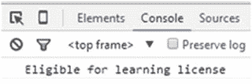

Rehan Zaidi，面向 SAP ABAP 开发人员的 JavaScript 基础知识，10.1007/978-1-4842-2220-1_4

# 4.JavaScript 中的控制结构

雷汉扎伊迪 <sup class="calibre6">1</sup>

①巴基斯坦卡拉奇

本章描述了 JS 语言中的各种控制结构，并演示了如何使用它们来满足需求。本章首先概述了 JavaScript 支持的块语句。接下来，如果...详细介绍了 else 和 switch 语句。然后将向您介绍 JavaScript 支持的各种类型的循环，包括 for 和 while 循环，并给出展示如何执行它们的演示程序。本章最后简要介绍了标签声明。

## 块语句

块用于对一组语句进行分组。一个块用一对大括号{}括起来。基本语法是

```js
{
  st_1;
  st_2;
}
```

Block 语句用在各种控制结构中。这些包括 if 语句和 while 和 for 循环(将在本章的后半部分介绍)。考虑以下示例:

```js
var abc = 0;
while ( abc < 122) {
  abc = abc + 2;
}
```

在这段代码中，{ ABC = ABC+2；}是 block 语句。

考虑另一个块的例子:

```js
var abc = 150;
{
  var abc = 100 + 2;
}
alert(abc); // outputs 102
```

此代码输出 102，因为第二个 var 语句(在花括号内)与该块之前的 var 语句位于相同的范围内。

清单 [4-1](#PC4) 展示了在一个块中使用复合语句的例子。

###### 清单 4-1。块示例

```js
<html>
   <body>
      <script>
         {
         var x = 5;
          x++;
          }
          console.log(x);
      </script>
   </body>
</html>
```

程序的输出如图 [4-1](#Fig1) 所示。


###### 图 4-1。字块输出

## 条件语句

JavaScript 提供了两种条件语句:

*   如果...其他

*   转换

这些语句允许您在发现给定条件为真时执行代码块。或者，在 if 语句的情况下，当发现条件为假时，可能会执行语句块。

### 如果...else 语句

当发现逻辑条件为真时，if 语句执行一组语句。可选的 else 子句用于在条件被确定为假时执行语句。关于简单 if 语句的流程图如图 [4-2](#Fig2) 所示。


###### 图 4-2。if 语句流程图

if 语句的语法是

```js
if (eval_of_condition) {
  first_block;
} else {
  second_block;
}
```

任何导致 true 或 false 的表达式都可以用来表示条件。如果发现条件为真，则执行 first _ block 否则，执行 second_block。该块可以包含任意数量的语句，包括更多的 if 语句。

还可以使用 if 和 else if 来指定多个要逐个检查的条件，以便按顺序测试多个条件，如下所示:

```js
if (eval_cond1) {
  block_1;
} else if (eval_cond2) {
  block_2;
} else if (eval_cond3) {
  block_3;
} else {
  last_block;
}
```

当指定多个条件时，将执行与评估为真的第一个条件相关的代码。如果发现第一个条件为假，则检查由 else if 指定的下一个条件，然后检查下一个 else if，依此类推。如果三个条件都为假，则执行 last_block 代码。

###### 注意

值 false、null、undefined 和 0 在计算时总是产生“false”值。

清单 [4-2](#PC7) 展示了如何使用 if 语句创建一个短程序。

###### 清单 4-2。使用 if 语句的驾驶执照程序

```js
<html>
   <body>
      <script>
         var age = 20;
         if( age > 18 )
          {
               console.log("Eligible for Driving license");
            }
      </script>
   </body>
</html>
```

该示例显示了一个简单的 if 语句。声明了值为 20 的变量 age。if 语句中的条件声明，如果 age 大于 18，则应该执行代码块。该程序的输出如图 [4-3](#Fig3) 所示。


###### 图 4-3。程序输出

清单 [4-3](#PC8) 通过修改示例添加了一个 else 子句，使事情变得有点复杂。

###### 清单 4-3。带 else 子句的驾驶执照计划

```js
<html>
   <body>
      <script>
            var age = 18;
            if( age > 18 ){
               console.log("Eligible for Driving license");
            }
            else if( age == 18 ){
                console.log("Eligible for learning license");
            }
            else{
                console.log("Not eligible for Driving license");
            }
      </script>
   </body>
<html>
```

在这种情况下，执行与满足的条件相关的代码块，并通过 console.log 语句打印相应的输出。在本例中，else if 条件(即年龄== 18)得到满足，因此输出将有资格获得学习许可，如图 [4-4](#Fig4) 所示。



###### 图 4-4。程序输出

### 交换语句

switch 语句使您能够计算一个表达式，然后使用许多 case 标签匹配它的值。当发现匹配时，执行相关的代码块。

在开关控制结构中使用了 break 语句。break 语句确保一旦表达式匹配，程序就脱离 switch。

开关控制结构的流程图如图 [4-5](#Fig5) 所示。


###### 图 4-5。开关控制结构流程图

交换机控制结构的语法是

```js
switch (expression) {
  case value1:
    //Statements executed when the result of expression matches value1
    [break;]
  case value2:
    //Statements executed when the result of expression matches value2
    [break;]
  ...
  default:
    //Statements executed when none of the values match the value of the expression
    [break;]
}
```

表达式的结果值与每个大小写值相匹配。如果没有一个大小写值与表达式的大小写值匹配，则执行默认的块代码。

清单 [4-4](#PC10) 提供了驾驶执照程序中 switch 语句的一个例子。

###### 清单 4-4。switch 语句示例

```js
<html>
<body>
<script>
var age = "16";
switch (age) {
    case "18":
        console.log("Eligible for learning license")
        break;
    case "20":
        console.log("Eligible for two wheeler license")
        break;
    case "23":
        console.log("Eligible for four wheeler license")
        break;
    default:
    console.log("Not eligible for license");
}
</script>
</body>
</html>
```

可变年龄声明为 16 岁。不同的 case 子句包含在各自的编码中。清单 [4-4](#PC10) 还包括一个默认子句，指定如果没有匹配的值(通过 case 子句指定)程序应该做什么。因为年龄是 16 岁，所以执行默认代码。程序输出如图 [4-6](#Fig6) 所示。


###### 图 4-6。Switch 语句输出

如前所述，正确执行开关控制结构需要 break 语句。清单 [4-5](#PC11) 显示了一个没有 break 语句的开关控制结构的例子。

###### 清单 4-5。不正确的开关控制结构示例

```js
<!DOCTYPE html>
<html>
<body>
<script>
var color = "Green";
switch (color) {
    case "Red":
        console.log("Sign for Danger");
    case "Green":
        console.log("Sign for Growth");
    case "White":
        console.log("Sign for Peace");
    default:
    console.log("No sign");
}
</script>
</body>
</html>
```

由于清单 [4-5](#PC11) 中省略了 break 语句，输出显示不正确，如图 [4-7](#Fig7) 所示。


###### 图 4-7。错误输出

提供给开关表达式的值为绿色。这与第二个 case 子句相匹配，因此在控制台日志中应该只显示增长符号。但是，因为没有包含 break 语句，所以在执行匹配的语句后，还会执行两个后续的 case 子句。

## JavaScript 中的循环

循环有助于多次或重复执行代码块，直到给定的条件为真。JS 支持各种类型的循环:

*   while 循环

*   做...while 循环

*   for 循环

*   为...在回路中

### while 循环

这是一个条件循环。while 循环执行一个代码块，直到指定的条件评估为 true。一旦条件失败，循环就会停止。while 循环的流程图如图 [4-8](#Fig8) 所示。


###### 图 4-8。while 循环流程图

while 循环的一般语法是

```js
while (condition)
{
    Statements to be executed if condition is true
}
```

清单 [4-6](#PC13) 提供了一个 while 循环的完整工作示例。

###### 清单 4-6。while 循环示例

```js
<html>
   <body>
      <script>
            var n = 0;
            console.log("Starting Loop ");
          while (n < 3)
        {
            console.log("Current Count : " + n + " ");
            n++;
         }
      console.log("Loop stopped!");
      </script>
   </body>
</html>
```

清单 [4-6](#PC13) 声明了变量 n 并给它赋值 0。while 循环条件规定变量 n 应该小于 3。在循环中，n 递增 1。因此，循环继续三次；也就是说，对于 n 等于 0，1 和 2。一旦 n 的值等于 3(即满足条件)，循环就停止。

程序的输出如图 [4-9](#Fig9) 所示。


###### 图 4-9。while 循环的输出

### 做...while 循环

do...while 循环重复进行，直到指定的条件被评估为 false。首先指定代码块，然后执行相关条件。这意味着循环将总是至少执行一次，即使条件为假。流程图如图 [4-10](#Fig10) 所示。


###### 图 4-10。do 流程图...while 循环

do 的语法...while 循环是

```js
do
{
  //Statements;
}
while (condition);
```

do 的一个例子...while 循环如清单 [4-7](#PC15) 所示。

###### 清单 4-7。做...while 示例

```js
<html>
   <body>
      <script>
            var n = 0;
            console.log("Starting Loop ");
          do
        {
            console.log("Current Count : " + n + "");
            n++;
         }
      while (n < 4)
      console.log("Loop stopped!");
      </script>
   </body>
</html>
```

在这个例子中，变量 n 的值被设置为 0。在每次循环迭代中，n 的值增加 1。while 循环重复，直到 n 的值不再小于 4(即，n 等于 4)。

列表 [4-7](#PC15) 的输出如图 [4-11](#Fig11) 所示。


###### 图 4-11。do 输出...while 循环

### for 循环

for 循环是一个条件循环，它会一直持续到指定的条件计算结果为 false 为止。通用语法是

```js
for ([initialization]; [test condition]; [expression])
{
   Statement
}
```

在初始化部分，将循环计数器初始化为一个初始值。对于测试条件，您指定必须检查的条件，以确定循环是否应该继续。表达式是增加或减少计数器或值的部分。

清单 [4-8](#PC17) 展示了一个在程序中使用 for 循环的例子。

###### 清单 4-8。对于循环示例

```js
<html>
   <body>
      <script>
            var count;
            console.log("Starting Loop" + "");
            for(count = 0; count < 10; count++){
               console.log("Current Count : " + count );
            }
            console.log("Loop stopped!");
      </script>
   </body>
</html>
```

此示例声明变量 count，然后在 for 循环中将 count 的值初始化为 0。然后，循环条件检查计数值是否小于 10。如果是，计数器加 1。

在循环迭代中，显示 count 的当前值。每次循环迭代后，计数值增加 1，并根据指定的条件检查其值。

该循环运行十次(计数等于 0 到 9)。当 count 的值等于 10 时，条件评估为 false，循环停止。

程序的输出如图 [4-12](#Fig12) 所示。


###### 图 4-12。程序输出

前面的例子向您展示了如何使用 for 循环来增加计数器值。清单 [4-9](#PC18) 展示了另一个 for 循环示例，展示了如何递减计数器值。

###### 清单 4-9。反向 for 循环

```js
<html>
   <body>
      <script>
            var count;
            console.log("Starting Loop" + "");
            for(count = 10 ; count > 0; count--){
               console.log("Current Count : " + count );
            }
            console.log("Loop stopped!");
      </script>
   </body>
</html>
```

此示例显示反向循环计数。它首先将计数值初始化为 10。该条件检查 count 的值是否大于 0。每循环一次，count 的值就减 1。该程序的输出如图 [4-13](#Fig13) 所示。


###### 图 4-13。程序输出

如您所见，打印的第一个值是 10，因为 count 的初始值是 10。只要 count 的值大于 0，循环中的代码就会运行(因此最后打印的值是 1)。

在 for 循环代码块中，还可以包含 if 结构。假设您需要打印从 0 到 19 的所有偶数。您可以通过使用 for 循环和 if 语句的组合来实现这一点，如清单 [4-10](#PC19) 所示。

###### 清单 4-10。带有 if 语句的 for 循环

```js
<html>
   <body>
      <script>
           var i;
            for(i = 0; i < 20; i++)
            {
               if((i % 2) == 0)
             {
               console.log("Number is divisible by 2 : " + i );
               continue;
              }
            }
      </script>
   </body>
</html>
```

此示例在 for 循环中使用 if 语句来检查变量 I 是否能被 2 整除。在 I 的值能被 2 整除的每种情况下，程序都会打印出该值。程序的输出如图 [4-14](#Fig14) 所示。


###### 图 4-14。程序输出

您也可以嵌套 for 循环，这意味着您可以在 for 循环中包含一个 for 循环。在讨论 for 之后，您将看到一个与 label 关键字结合使用的示例...在循环中。

###### 注意

break 语句也可以在 for 循环中使用，以退出循环。

### 为...在回路中

森林...in 循环是一种特殊类型的循环，在对象的属性上运行。森林...in 循环在一个对象的所有属性上迭代指定的变量。

森林...在语法上是

```js
for (variable in object) {
  statements
}
```

清单 [4-11](#PC21) 提供了 for 的示例...程序中使用的 in 循环。

###### 清单 4-11。为...在示例中

```js
<html>
   <body>
      <script>
         var obj = {a:"alto", b:"scorpio", c:"zen"};
          for(var string=" " in obj) {
               console.log(obj[string]);
          }
      </script>
   </body>
</html>
```

清单 [4-11](#PC21) 介绍了一个具有三个属性 a、b 和 c 的对象 obj，这三个属性分别被赋值为 alto、scorpio 和 zen。森林...然后使用 in obj 循环来处理对象的每个属性。在每次迭代中，object 的一个属性被赋给变量名，循环继续，直到 object 的所有属性都被读取。console.log 方法用于在 web 浏览器控制台上显示属性内容。

程序的输出如图 [4-15](#Fig15) 所示。


###### 图 4-15。打印对象的属性

## 标签语句

label 语句使您能够为语句块定义唯一的标识符。语法是

```js
label:
  statements
```

标签名称后面跟一个冒号，标签下面是与标签名称链接的语句块(或由给定标签定义的语句块)。为了澄清，考虑清单 [4-12](#PC23) 中的例子。

###### 清单 4-12。标签示例

```js
<html>
   <body>
      <script>
         var i, j;
       Outerloop:
           for (i = 0; i < 5; i++) {
           for (j = 0; j < 5; j++) {
                 if (i === 1 && j === 1) {
                         break Outerloop;
      }
      console.log("i = " + i + ", j = " + j);
   }
}
      </script>

   </body>
</html>
```

清单 [4-12](#PC23) 为外部 for 循环定义了一个标签 Outerloop。外循环的每次迭代还有一次内循环运行。为了在计数器 I 和 j 的值都等于 1 时退出外部循环，break 语句与先前定义的标签 outer loop 一起使用，以表示外部 for 循环。列表 [4-12](#PC23) 的输出如图 [4-16](#Fig16) 所示。


###### 图 4-16。程序输出

## 摘要

本章涵盖了 JS 语言中的各种控制结构，并描述了如何使用它们来满足需求。它从 JavaScript 支持的块语句开始。接下来，它讨论了如果...else 和 switch 语句。最后，演示程序向您展示了如何执行 JavaScript 中支持的各种类型的循环，包括 for 和 while 循环，以及 LABEL 语句。

第 [5](05.html) 章讨论了 JavaScript 中的另一个重要话题:正则表达式和字符串方法。