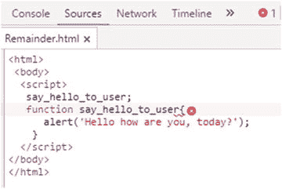
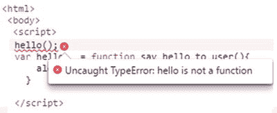
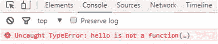
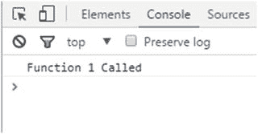
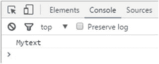
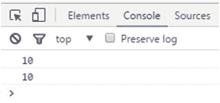
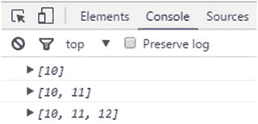
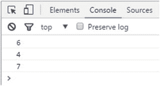

© 雷汉 更多 2017

Rehan Zaidi，面向 SAP ABAP 开发人员的 JavaScript 基础知识，10.1007/978-1-4842-2220-1_7

# 7.利用函数做更多事情

雷汉扎伊迪 <sup class="calibre6">1</sup>

①巴基斯坦卡拉奇

第 6 章向你介绍了函数的基础知识，以及它们如何使复杂的数学代码变得容易执行。您了解了函数是如何创建的，以及每次调用它们时它们是如何执行任务的。您还看到了使用函数、参数和实参的不同方式。本章涵盖了与函数相关的更高级的主题。您将看到提升如何应用于函数，并了解为什么函数被称为“一等公民”您还将学习如何声明嵌套函数，如何对函数应用闭包，以及如何声明递归函数。

## 功能环境中的提升

如第 [1](01.html) 章所述，*变量提升*是指在变量被实际声明之前使用它。在函数的上下文中也完全支持提升。这意味着您甚至可以在声明函数之前调用它。

考虑清单 [7-1](#PC1) 中函数提升的例子。

###### 清单 7-1。功能提升

```js
<html>
 <body>
  <script>
   say_hello_to_user();

   function say_hello_to_user(){
      alert('Hello how are you, today?');
    }
  </script>
</body>
</html>
```

这段代码运行良好，不会产生任何语法错误。脚本中的第一行是对 say_hello_to_user 函数的调用。这个函数的声明实际上在后面。JavaScript 将函数的声明移动到作用域的开始。这相当于清单 [7-2](#PC2) 中所示的例子。

###### 清单 7-2。等效 JS 代码

```js
<script>

 function say_hello_to_user(){
    alert('Hello how are you, today?');
  }
 say_hello_to_user();
</script>
```

两个清单的输出如图 [7-1](#Fig1) 所示。


###### 图 7-1。程序输出

###### 注意

变量声明没有完全提升。

值得注意的是，如果函数体或函数代码之前的代码中有任何语法错误，将首先检查函数体的语法，并突出显示任何语法错误。如图 [7-2](#Fig2) 所示。



###### 图 7-2。功能代码中的语法错误

试图将变量声明与函数表达式一起使用会导致语法错误。考虑清单 [7-3](#PC3) 中所示的例子。

###### 清单 7-3。错误代码示例

```js
<script>

hello();
var hello   = function say_hello_to_user(){
    alert('Hello how are you, today?');
  }

</script>
```

这段代码产生了一个语法错误，如图 [7-3](#Fig3) 所示。



###### 图 7-3。语法错误

考虑清单 [7-4](#PC4) 中错误代码的另一个例子。

###### 清单 7-4。第二个不正确的代码示例

```js
<script>

var hello;
hello();
hello   = function say_hello_to_user(){
    alert('Hello how are you, today?');
  }

</script>
```

这个程序也会产生一个语法错误。在这里我们尝试一个变量 hello。JS 不接受将变量 hello 用作函数的尝试，语法错误导致程序如图 [7-4](#Fig4) 所示。



###### 图 7-4。语法错误

## 一等公民

在 JavaScript 中，函数被视为一等公民。他们可能是

*   赋给变量

*   作为参数传递给函数

*   函数的返回值

为了便于比较，清单 [7-5](#PC5) 展示了一个简单的函数示例。

###### 清单 7-5。简单函数示例

```js
<!DOCTYPE html>
<html>
   <body>
      <script>
         var myMessage = function()
         {
         console.log("Good To See You....!");
        };
      myMessage();
      </script>
   </body>
</html>
```

在这个简单的函数示例中，myMessage 没有列出任何参数名(即函数为空)。要在脚本中调用该函数，只需编写该函数的名称，如代码所示。这将调用消息并显示消息。

列表 [7-5](#PC5) 的输出如图 [7-5](#Fig5) 所示。


###### 图 7-5。输出

清单 [7-6](#PC6) 展示了如何将一个函数作为输入传递给另一个函数并从函数本身返回。

###### 清单 7-6。一等公民的例子

```js
<html>
<body>
<script>

var function1 = function() {
  console.log("Function 1 Called");
};

var function2 = function(input) {
  return input;
};

function2(function1)();

</script>
</body>
</html>
```

这里，该函数输出在浏览器控制台中调用的函数 1。该函数通过赋值被赋给变量 function1。接下来，另一个匿名函数将名为 input 的参数作为输入，并返回它。该功能被分配给变量 function2。最后，调用 function2 并将 function1 作为参数传递。因为 function2 将传递给它的任何值作为返回值返回，所以下面两个表达式是相等的:

*   功能 2(功能 1)

*   功能 1

要调用 function1，您必须包括括号()，如图所示。否则，会导致语法错误。程序的输出如图 [7-6](#Fig6) 所示。



###### 图 7-6。程序输出

## 嵌套函数

嵌套函数也称为内部函数，是在另一个函数中定义的函数。包含内部函数的函数称为外部函数。内部函数可能有也可能没有 return 语句。每次调用外部函数时，都会创建嵌套函数的一个实例。

考虑清单 [7-7](#PC7) 中的嵌套函数的例子。

###### 清单 7-7。嵌套函数示例

```js
<html>
 <body>
  <script>

     function myfunction(d1, d2) {
       function doDivision(d1, d2) {
           return d1 / d2;
       }

     return doDivision(d1, d2);
     }

    var div = myfunction(4, 2);
    console.log(div);
 </script>
</body>
</html>
```

这个例子展示了两个数的除法。外部的主函数名为 myfunction，内部定义了 doDivision 函数。这个内部函数是通过提供值 4 和 2 来调用的，它的值存储在变量 div 中，稍后会显示在浏览器控制台中。在调用外部函数 myfunction 时，会创建内部函数 doDivision 的一个实例。

还要注意，参数 d1 和 d2 是为两个函数指定的。这在 JavaScript 中是允许的，不会导致任何问题。程序的输出如图 [7-7](#Fig7) 所示。


###### 图 7-7。程序输出

当处理嵌套函数时，重要的是要注意内部函数可以访问主外部函数的范围。换句话说，函数 doDivision 可以使用外部函数 myfunction 的参数和变量。在清单 [7-7](#PC7) 中，myfunction 的 d1 和 d2 参数分别作为参数 d1 和 d2 提供给内部函数 doDivision。这是不必要的，因为 doDivision 可能会访问外部函数 myfunction 的 d1 和 d2。清单 [7-8](#PC8) 展示了清单 [7-7](#PC7) 中的代码是如何通过依赖 doDivision 可以访问 myfunction 的 d1 和 d2 来简化的。

###### 清单 7-8。第二个嵌套函数示例

```js
<html>
 <body>
  <script>
     function myfunction(d1, d2) {
       function doDivision() {
           return d1 / d2;
       }
       return doDivision();
     }
    var div = myfunction(4, 2);
    console.log(div);
  </script>
</body>
</html>
```

这是嵌套 division 示例的更好形式，因为它从 doDivision 函数中删除了多余的参数。在 doDivision 主体内部，清单 [7-8](#PC8) 返回 d1 / d2 的除法值(参数 d1 和 d2 提供给 myfunction)。

该程序的输出如图 [7-8](#Fig8) 所示，与之前显示的输出相同。


###### 图 7-8。程序输出

也可以匿名声明嵌套函数。清单 [7-9](#PC9) 中显示的例子试图解决前面两个清单中相同的除法问题，但是方式有点不同，也更复杂。

###### 清单 7-9。匿名嵌套函数示例

```js
<html>
<body>
<script>
            function doDivision(d2) {
             return function(d1) {
             return d1/d2;
             };
           }

           var div = doDivision(2);
           console.log(div(6));
</script>
</body>
</html>
```

在这种形式的嵌套函数中，return 语句使用了两次。内部函数使用外部函数的参数 d2。此外，内部函数返回对一个函数的引用，该函数将被除的数作为输入。第一个返回语句用于调用 d1 的其他函数，第二个返回语句返回 d1/d2 除法的结果。

清单 [7-9](#PC9) 的输出如图 [7-9](#Fig9) 所示。


###### 图 7-9。程序输出

让我们看看嵌套函数的另一种形式。也可以在外部函数本身的代码体中调用内部函数(在外部函数中声明)。考虑清单 [7-10](#PC10) 中的例子。

###### 清单 7-10。调用内部函数

```js
function myFunction() {
  var mytext = "Mytext";

  function showtext() {
       console.log(mytext);
  }
       showtext();
}
myFunction();
```

这里，外部函数和内部函数分别是 myFunction 和 showtext。变量 mytext 在 myFunction 中定义。内部函数 showtext 是在 myFunction 中声明的。然后调用 showtext 函数。当调用函数 myFunction 时，控制台的输出如图 [7-10](#Fig10) 所示。



###### 图 7-10。程序输出

## 词法范围

在函数的上下文中，*词法范围*意味着变量的范围是由变量在 JavaScript 源代码中的位置决定的。在函数外部声明的任何变量对于整个 JS 程序都是可访问和可见的(即全局变量)。另一方面，在给定函数中声明的变量只对该函数的代码块可见和可访问。这就是所谓的*功能范围*。在嵌套函数的情况下，内部函数可以访问外部函数中声明的变量。在内部函数中声明的任何变量都不能在外部访问。

考虑清单 [7-11](#PC11) 中词法范围的例子。

###### 清单 7-11。词法范围示例

```js
function myFunction() {
  var mytext = "Mytext";

  function showtext() {
       console.log(mytext);
  }
       showtext();
}
```

函数 myFunction 声明了一个局部变量 mytext 和一个函数 show text——在 myFunction()内部定义的内部函数，该函数仅在 myFunction 的主体中可用。这里，showtext 没有局部变量，但是它可以访问它的外部函数，在本例中是 myFunction。在 myFunction 主体中，调用 showtext 函数以显示变量 mytext 中包含的文本。

让我们考虑清单 [7-12](#PC12) 中词法范围的另一个例子。

###### 清单 7-12。第二个词法范围示例

```js
<html>
<body>
<script>
     var function1  = function(){
     var text1 = "Text1";
     function f2() {
             if(true){
                var text2  = "Text 2";
                console.log(text2);
              }

              if(true){
                console.log(text2);
              }
     }
     f2();
     console.log(text2) ; // gives error – ERROR
}
function1();

</script>
</body>
</html>
```

在这个例子中，变量 function1 被分配给一个函数。在这个(外部)函数中有一个变量 text1 和一个内部函数 f2。在内部函数中有两个 if 语句和两个块(显示在花括号中)。

变量 text2 在函数 f2 中的任何地方都是可访问的，与声明它的代码块无关。然而，text2 在函数 f2 之外是不可访问的。因此，最后一条 console.log 语句会导致错误。通过外部函数可以访问 text1 变量。

## 关闭

在正常情况下，函数中的局部变量只在函数执行期间存在。函数执行后，通常不能访问局部变量。然而，通过使用 closure，在函数执行之后，可以保持局部变量。

在 JavaScript 中，您可以创建被称为*闭包*的特殊函数，这些函数会记住创建它们的环境(状态)。这些包括函数中的独立局部变量。所以，换句话说，一个闭包由

*   一项功能

*   函数的环境

*环境*在这个上下文中是指闭包创建时的局部变量。考虑清单 [7-13](#PC13) 中产生语法错误的非闭包例子。

###### 清单 7-13。句法误差

```js
function myFunction() {
   var num = 10;
  }
 console.log(num);
```

这将产生一个语法错误，因为 num 对于外部世界是不可访问的。但是，通过使用闭包，可以访问 num。考虑清单 [7-14](#PC14) 中的例子。

###### 清单 7-14。关闭示例

```js
function Func() {
  var num = 10;
  function returnnumber() {
    return num;
  }
  return returnnumber;
}

var closure1 = Func();
console.log(closure1());
```

执行该代码时，输出如图 [7-11](#Fig11) 所示。


###### 图 7-11。程序输出

该号码将显示在浏览器的控制台中。内部 returnnumber 函数在执行前从外部函数 Func 返回。Func 已经成为一个封闭。在这种情况下，Func 是一个闭包，它包含函数和在闭包创建时就存在的 num 值 10。

清单 [7-15](#PC15) 展示了一个更有用的例子。

###### 清单 7-15。使用闭包的除法

```js
<html>
<body>
<script>

function divisionfactory(divisor) {
  return function performdivision(number) {
    return number / divisor ;
  }
}

var divideby10 = divisionfactory(10);
var divideby20 = divisionfactory(20);

console.log(divideby10(100));
console.log(divideby20(200));

</script>
</body>
</html>
```

此示例定义了一个函数 divisionfactory，它将参数除数作为输入，并返回对另一个函数的引用。内部函数被称为 performdivision(尽管您也可以将其命名为匿名)。内部函数只有一个参数 number，并返回除数/除数的结果。顾名思义，外部函数 divisionfactory 用于创建将输入的数字除以特定值的函数。

出于示例的目的，清单 [7-15](#PC15) 创建了两个函数，divideby10 和 divideby20，分别将它们的参数除以 10 和 20。这两个新函数是具有相似主体但独立环境的闭包。对于 divideby20，除数的值是 10，而对于 divideby10，除法的值是 20。

列表 [7-15](#PC15) 的输出如图 [7-12](#Fig12) 所示。



###### 图 7-12。除法输出

考虑清单 [7-16](#PC16) 中另一个有趣的闭包例子。

###### 清单 7-16。另一个闭包例子

```js
var add_element = (function() {
    var total_elements = 0;
    var array = [];
    return function addition(element) {
              array[total_elements] = element;
              console.log(array);
              total_elements = total_elements + 1;

 }
})();

add_element(10);
add_element(11);
add_element(12);
```

这个例子定义了一个函数，并把它赋给变量 add_element。在代码中，变量 total_elements 和 array 分别用初始值 0 和[ ]声明。属性元素被分配到数组的末尾。此外，每向数组中插入一个元素，total_elements 计数器就加 1。此函数返回一个函数加法，将传递给它的新元素添加到数组中，并增加数组中元素的计数。

清单 [7-16](#PC16) 中的例子调用 add_element 三次，分别提供值 10、11 和 12。列表 [7-16](#PC16) 的输出如图 [7-13](#Fig13) 所示。



###### 图 7-13。显示数组元素的程序输出

add_element 是一个包含函数加法的闭包。但是，因为清单 [7-16](#PC16) 使用了自调用函数，所以初始化语句(将 array 设置为[]并将 total_elements 设置为 0)只执行一次。正如您将看到的，每个函数闭包都记得它被创建时的状态。其中包括变量 array 和 total_elements。

## 递归函数

正如在第 6 章中已经提到的，一个函数有可能调用它自己——也就是说，一个根据它自己定义的函数。这样的函数被称为*递归函数*。使用递归可以解决的典型问题包括斐波那契数列问题和著名的汉诺塔问题。递归为开发人员提供了一些优势，比如开发简洁代码的能力，同时也有助于开发人员避免循环。

定义递归函数时，指定一个终止条件是很重要的。如果没有指定这样的条件，可能会发生无限的“函数”调用。在通常情况下，递归函数被声明为命名函数。但是，也可以将匿名函数定义为递归函数。

现在让我们来看一个 JavaScript 中递归函数的完整工作示例。假设我们需要输入一个数字，然后分别拼写每个数字。例如，如果数字 647 作为输入传递，那么数字 6、4 和 7 必须以正确的顺序分别显示。

清单 [7-17](#PC17) 中显示了与该示例相关的代码。

###### 清单 7-17。递归示例

```js
<html>
<body>
<script>
 function spell_number( num ) {
            if ( num < 10 ) {
               console.log(num);
             }
            else {
               spell_number( Math.floor(num / 10) ) ;
               console.log( num % 10 );
        }
   }
 spell_number(647);
</script>
</body>
</html>
```

给定问题的基本解决方案是，要按数字拼写的数字是

*   数字本身，如果数字小于 10

*   商的拼写位数(通过除以 10 获得)，后跟数字除以 10 的余数

清单 [7-17](#PC17) 声明了一个名为 spell_number 的函数，它将参数 num 作为输入。在代码中，该函数检查提供的数字是否小于 10。终止条件是当作为输入传递的数字小于 10 时。在这种情况下，函数应该返回数字本身，而不是调用递归函数。数字直接输出到控制台，不递归调用 spell_number。

如果数字大于或等于 10，清单 [7-17](#PC17) 递归调用函数并提供 num 除以 10 的商。接下来，num 除以 10 的余数在控制台中输出。因为我们需要按照从左到右的正确顺序打印数字，所以我们首先调用递归函数，然后打印余数。

对于输入的数字 647，函数 spell_number 的调用顺序如下所示:

*   函数 spell_number(647)用输入 647 调用的函数

*   函数 spell_number(64) //用输入 64 调用的函数

*   函数 spell_number(6)用输入 6 调用的函数

程序的输出如图 [7-14](#Fig14) 所示。



###### 图 7-14。程序输出

也可以使用匿名函数和变量表达式重写相同的问题。清单 [7-18](#PC18) 显示了如何实现这一点。

###### 清单 7-18。匿名递归函数

```js
<html>
<body>
<script>
  var spell_number = function( num ) {
            if ( num < 10 ) {
               console.log(num);
             }
            else {
               spell_number( Math.floor( num / 10) ) ;
               console.log( num % 10 );
        }
   }
 spell_number(647);

</script>
</body>
</html>
```

如您所见，大部分代码与清单 [7-17](#PC17) 中的相同。唯一的区别是清单 [7-18](#PC18) 定义了没有名字的函数，并指定了一个变量 spell_number，函数声明被赋给这个变量。对递归函数的调用是通过变量 spell_number 完成的。程序的输出是一样的。

## 摘要

在本章中，您首先看到了提升是如何应用于函数的，然后您发现了为什么函数被称为一等公民。您还了解了如何声明嵌套函数，以及闭包的含义。最后，您学习了如何声明递归函数。

第 [8](08.html) 章将向你展示如何在 JS 中实现面向对象。