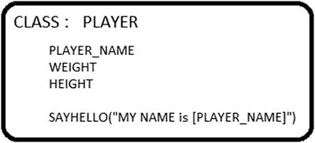
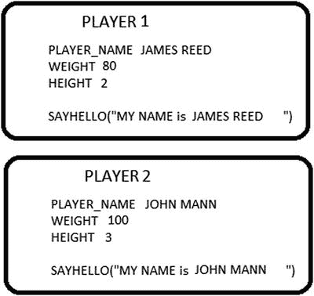
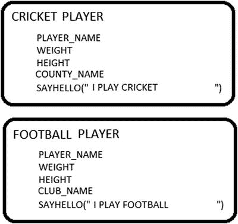
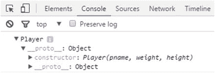
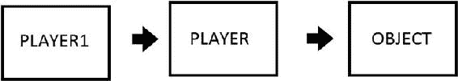
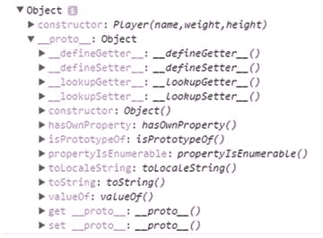
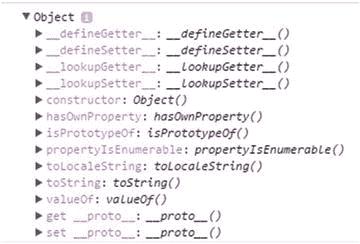
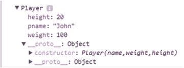
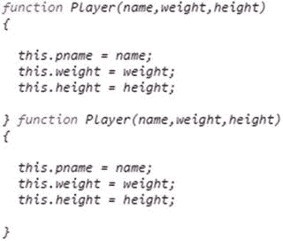

© 雷汉 更多 2017

Rehan Zaidi，面向 SAP ABAP 开发人员的 JavaScript 基础知识，10.1007/978-1-4842-2220-1_8

# 8.JavaScript 中的面向对象编程

雷汉扎伊迪 <sup class="calibre6">1</sup>

①巴基斯坦卡拉奇

和 ABAP 一样，JavaScript 允许你创建对象。然而，这两种语言中关于对象创建的概念是不一样的。本章涵盖了 JS 中的对象创建、实例化和继承。从面向对象编程(OOP)的概述开始，本章的其余部分展示了 OOP 是如何在 JS 中实现的，以及相关的语法。它详细介绍了 this 操作符，然后介绍了创建对象的各种方法，接着是使用 new 关键字的实例化步骤。一旦你对对象有了一个基本的理解，这一章就转移到使用原型在 JS 中实现的继承。本章介绍了对象和子对象的真实例子，以及用 JavaScript 实现它们的示例代码清单。

为了简洁起见，本章只展示了 JS 代码。到目前为止，您已经完全意识到这段代码需要 HTML 标记才能在浏览器中执行。

## 一般面向对象编程

要理解 JavaScript 中的面向对象编程，您需要从总体上理解面向对象编程。

在 OOP 中，你使用对象的概念来模拟程序中真实的对象。概念对象可能包含与您已经建模的真实对象相关的数据和代码，或者开发人员希望对象展示的特性(行为)。例如，你可以有一个 Player 类，它包含许多属性(attributes)和一个函数 sayhello()方法，如图 [8-1](#Fig1) 所示。



###### 图 8-1。职业选手

这个对象表示被称为一个*类*。(然而，在 JS 中，使用了一种不同的机制，稍后将对此进行描述。)一个类可以被认为是一个模板，它指定了源自它的对象必须具有的属性。

您可以创建一个类的多个实例。这些对象包括类定义中指定的数据和特征。例如，对于 Player 类，可以创建任意数量的玩家，如图 [8-2](#Fig2) 所示。创建对象时，执行类的构造函数以创建新的对象实例。这被称为*实例化*。



###### 图 8-2。玩家的实例

图 [8-2](#Fig2) 中显示的 Player 类有两个实例，player1 和 player2，每个都有自己的 player_name、weight 和 height 属性，以及 sayhello()方法中不同的文本字符串。

进一步看这个例子，假设你不想允许创建普通玩家，这意味着没有人可以只是一个“玩家”每个人必须选择成为一个特定类型的球员，如板球运动员或足球运动员。在 OOP 领域中，可以从现有的类中创建新的类。被称为子类的新类然后可以继承驻留在它们的父类(即，从其继承的类)中的数据和代码。这允许重用父类中的现有功能(包括其子类之间共有的数据和代码)，而不是在许多单独的类中复制该功能。如果需要，您还可以向派生的子类添加额外的功能。

为了更好地理解继承的概念，考虑图 [8-3](#Fig3) 所示的例子。



###### 图 8-3。板球运动员和足球运动员儿童班

Cricket Player 和 Football Player 类有许多共同的属性，例如 player_name、weight 和 age，因此在父类 Player 中定义所有这些属性并创建 Cricket Player 和 Football Player 作为继承这些属性的子类更容易。

也可以在这些类中不同地指定给定的特性。例如，板球运动员子类的 sayhello()文本可能是“我是板球运动员”，而足球运动员子类的 sayhello()文本可能是“我是足球运动员”。在不同的对象类型中不同地实现相同特性的能力被称为*多态性*。

现在可以从这些子类创建实例，如 CricketPlayer1、CricketPlayer2、FootballPlayer1 等。

## 对象实例和构造函数

JavaScript 不是典型的面向对象编程语言。其他的 OOP 语言有一个 class 语句(定义)来定义类。使用这些类，可以创建包含类中包含的属性和方法的对象。相比之下，JS 使用称为*构造函数*的特殊函数来定义对象属性和方法。一个构造函数可以用来创建任意数量的对象，并可以选择添加额外的函数和数据。

如果使用构造函数创建一个新的实例，构造函数中可用的特性通过原型链链接起来。(这与其他 OOP 语言不同，在其他 OOP 语言中，所有功能都是从类中复制到新的实例化对象中。)

本节将向您展示在 JS 中模拟对象创建的四种不同方法(使用 Player 对象作为真实的例子):

*   使用对象文字

*   使用构造函数

*   使用 Object()构造函数

*   使用 create()方法

### 方法 1:使用 O [对象](https://developer.mozilla.org/en-US/docs/Learn/JavaScript/Objects/Basics#Object_basics)文字

第一种方法是使用一个使用对象文字的函数。清单 [8-1](#PC1) 中显示了一个处理播放器示例的函数。

###### 清单 8-1。使用对象文字

```js
function defineaPlayer(pname,weight, height) {
  var myobj = {};
  myobj.name = pname;
  myobj.weight = weight;
  myobj.height = height;
  myobj.sayhello = function() {
    alert('Hi, my name is ' + this.pname + '.');
  };
  return myobj;
}
```

这里，函数 myPlayer 将 pname、weight 和 height 作为输入。在 myPlayer 函数中定义了一个对象 myobj，然后添加了名称、重量和高度等属性。清单 [8-1](#PC1) 还定义了一个 sayhello 方法。最后，该函数返回 myobj 对象。

然后，您可以通过调用此函数来创建新的播放器:

```js
var player =  defineaPlayer('James Watson', 100,50);
console.log(player.pname);
console.log(player.sayhello());
```

虽然这种安排是可行的，但是它很冗长，而且不必要地声明一个空对象并返回它。

### 方法 2:使用构造函数

JavaScript 提供了另一种使用构造函数创建对象的简单方法。您可以为播放器示例定义一个构造函数，如清单 [8-2](#PC3) 所示。

###### 清单 8-2。播放器构造函数

```js
function Player(pname,weight, height) {
  this.name = pname;
  this.weight = weight;
  this.height = height;
  this.sayhello = function() {
    alert('Hi, my name is ' + this.pname + '.');
  };
```

###### 注意

JavaScript 中的构造函数类似于其他 OOP 语言中的类(保留字类)。

构造函数定义了与对象相关的方法和属性。this 关键字用于为正在创建的对象的属性赋值。方法 1(使用 o[object](https://developer.mozilla.org/en-US/docs/Learn/JavaScript/Objects/Basics#Object_basics)literal)和方法 2 的主要区别在于后者使用了 this 关键字。这意味着每当使用构造函数创建对象时，所标识的各种属性将等于通过构造函数调用传递的相应参数。

考虑以下示例:

```js
var player1 = new Player('James', 100, 20);
var player2 = new Player('John', 120, 60);
```

下面的语句将会起作用:

```js
player1.pname
player2.pname
```

这个例子创建了两个对象，玩家 1 和玩家 2。它们有属性 pname 和方法 sayhello，但是它们是分开存储的，不会相互冲突。在每种情况下，new 关键字用于创建一个新的对象实例，后跟括号中的各种参数。每个对象实例都是使用 Player 创建的，如清单 [8-3](#PC6) 所示。

###### 清单 8-3。玩家示例

```js
function Player(pname,weight, height) {
  this.name = pname;
  this.weight = weight;
  this.height = height;
  this.sayhello = function() {
    alert('Hi, my name is ' + this.pname + '.');
  };
}
```

创建新对象后，player1 和 player2(实际效果)包含以下内容:

```js
{
  name : James;
  weight : 100;
  height : 20;
  sayhello : function() {
    alert('Hi, my name is ' + this.pname + '.');
  };
}

{
  name : John;
  weight : 120;
  height : 60;
  sayhello : function() {
    alert('Hi, my name is ' + this.pname + '.');
  };
}
```

### 方法 3:使用 Object()构造函数

创建对象的第三种方法是使用 Object()构造函数。考虑以下代码:

```js
var player1  = new Object();
```

这有一个在 player1 变量下创建的空对象。完成后，您可以向对象添加方法和属性。为此，您可以使用括号或点号，如下所示:

```js
player1.pname = 'John';
player1.weight = 100;
player1['height'] = 30;
player1.sayhello = function() {
 alert('My name is ' + this.pname) ;
};
```

也可以在调用 Object()构造函数时传递文本，并指定属性和方法。这更加简洁易懂，如清单 [8-4](#PC10) 所示。

###### 清单 8-4。使用 Object()构造函数

```js
var player1 = new Object({
  pname: 'John',
  height: 100,
  weight: 20,
  sayhello: function() {
    alert('My name is' + this.pname + '.');
  }
});

player1.sayhello();
```

如您所见，清单 [8-4](#PC10) 中的一条语句调用 Object()构造函数并指定属性和方法的值。该语句与前面的代码块具有相同的效果。代码的输出如图 [8-4](#Fig4) 所示。


###### 图 8-4。使用 Object()构造函数的程序输出

### 方法 4:使用 create()方法

JS 语言有一个名为 create()的方法，允许您从现有对象创建对象实例。此处显示了一个代码示例:

```js
var player2 = Object.create(player1);
```

这里，现有对象是 player1。Object 的 create 方法用于创建一个完全相同的对象 player2(即，它具有 player1 中可用的相同属性和方法)。一旦执行了前面的语句，如果用于 player1，下面的语句将起作用并提供相同的输出:

```js
console.log(player2.pname);
player2.sayhello();
```

这种方法非常有用，使开发人员能够基于另一个实例创建新的实例。

## JavaScript:一种基于原型的语言

正如本章前面提到的，在传统的 OOP 中，类是被定义的。当从类实例化对象时，驻留在类中的属性和方法被复制到新创建的实例中。然而，在 JavaScript 中并非如此。JS 使用*原型*的机制来实现面向对象。

与其他 OOP 语言相比，JavaScript 对象继承了不同的特性。本节演示这种差异，描述原型链如何工作，并展示如何使用 prototype 属性向现有构造函数添加方法。

JavaScript 是一种基于原型的语言。这意味着每个对象，比如说 A，都有一个名为 prototype 的对象，该对象从这个对象派生属性和方法。同样，对象 A 的原型对象也可能有一个原型对象，依此类推。这就是所谓的原型链。在 JavaScript 中，方法和属性驻留在对象的构造函数中。在对象的实例和构造函数之间创建一个连接。

为了更好地理解原型概念，考虑下面的例子，它有一个简单的播放器函数:

```js
function Player(pname,weight,height)
{
}
```

接下来，创建一个对象实例 player1:

```js
var player1 = new Player('James', 100 , 20);
```

在 web 浏览器控制台中显示 player1 的内容会产生如图 [8-5](#Fig5) 所示的输出。



###### 图 8-5。播放器 1 的控制台输出

如您所见，player1 原型对象中的成员是 pname、weight 和 height。Thes e 驻留在播放器构造器的原型对象上，也就是[对象](https://developer.mozilla.org/en-US/docs/Web/JavaScript/Reference/Global_Objects/Object)。见图 [8-6](#Fig6) 。



###### 图 8-6。玩家 1、玩家和对象

假设您使用驻留在 Object 中的 player1 调用一个方法，比如 valueOf。在这种情况下，JS 首先检查 Player1 对象是否具有方法 valueOf。因为这不是真的，JS 接下来在 Player 对象中搜索 valueOf 方法。该方法也不存在于 Player 对象中。所以 JS 再去搜索 Player 的构造器的原型对象。(这是 Object。)对象包含您正在搜索的给定方法。

为了更好地理解属性的继承，请看一下 console.log 中的 Object。

对象中存在大量属性。但是，所有这些在 player1 对象中都不可用。继承的属性驻留在 Object 的 prototype 属性上。(即，它们不是简单地从 Object 开始，而是从 Object.prototype 开始)。“原型”的属性的“值”实际上是一个对象，它包含一组可以沿着继承(原型)链继承的属性和方法。例如，Object.prototype.valueOf()方法存在于从 Object 继承的任何对象中。另一方面，从 Object 继承的对象不会继承 Object.key 方法。

回到前面的例子，播放器的原型如图 [8-7](#Fig7) 所示。



###### 图 8-7。玩家原型

图 [8-7](#Fig7) 中没有太多东西，因为在播放器构造函数中没有定义任何方法。

接下来，看看使用 Chrome 控制台显示的 Object.prototype，如图 [8-8](#Fig8) 所示。



###### 图 8-8。对象.原型

假设您添加了以下语句:

```js
var another_player  = Object.create(player1);
```

Object 的 create 方法从原型对象创建一个新对象。

如您所见，player2 是使用 player1 创建的。假设您输入以下内容:

```js
console.log(another_player.__proto__);
```

该语句的输出如图 [8-9](#Fig9) 所示。



###### 图 8-9。__proto__ of

每个对象都有一个名为 constructor 的属性，该属性链接到构造函数(用于创建实例)。player1.constructor 和 player2.constructor 的输出如图 [8-10](#Fig10) 所示。



###### 图 8-10。Player1 和 Player2 构造函数

如您所见，这两个函数都返回了播放器构造函数。

还可以使用构造函数属性(以及必要的参数)创建一个新的实例。考虑这个例子:

```js
var player3 =  new player1.constructor('John Mann', 100, 11);
```

此示例将 constructor 属性用作一个函数，包括括号和 new 关键字。

当您输出新对象 player3 的内容时，如下所示，它正常工作:

```js
player3.pname
player3.weight
person3.height
```

构造函数属性还可以以另一种方式使用。您可以修改构造函数的 prototype 属性，将新方法添加到构造函数的原型中:

```js
Player.prototype.hello = function(){
   alert('I am Player');
}
Player1.hello();
```

运行 hello 方法将显示一条警告消息，提示我是玩家。值得注意的是，整个继承链可能会在运行时改变，从而使 hello()方法在所有从 constructor Player 派生的实例上都可用。

为了更好地理解，请考虑以下代码:

```js
function Player(pname, weight, height) {
 this.pname = pname;  this.height = height; this.weight = weight;
};
var player1 = new Player('James', 32,100);
Player.prototype.hello = function() {
  alert('I am' + this.pname);
}
player1.hello();
```

这个例子从一个构造函数 Player 开始，然后使用 Player 的 prototype 属性定义了一个新方法 hello。该方法在 player1 对象实例上可用。该功能已自动更新。如前所述，这证实了原型链。JS 首先在对象实例中寻找方法，然后在原型链上向上移动。

定义属性的另一种方法是使用 prototype 属性。例如，您可以向 Player 对象添加一个城市属性:

```js
Player.prototype.city = 'New York';
```

然而，这并不常见。更常见的方法是在构造函数中指定属性，而各种方法使用原型。在这种情况下，代码很容易理解，因为所有属性都驻留在构造函数中，而方法在后面的不同块中定义:

```js
function Player(a, b, c, d) {
  // property definitions
};

Player.prototype.func1 = function() { ... }
Player.prototype.func2 = function() { ... }
```

## 原型遗传

既然您对继承和工作原型有了一些概念，那么您就可以看到这些概念的实际应用了。如前所述，JavaScript 使用基于原型的继承。这涉及到使用原型链链接继承的对象。本节将向您展示一种在 JavaScript 中实现继承概念的技术。

从前面创建的 Player 构造函数开始，记住在 Player 中只指定了属性 pname、weight 和 height:

```js
function Player(pname, weight, height) {
  this.pname = pname;
  this.weight = weight;
  this.height = height;
};
```

现在，在构造函数的 prototype 属性上定义一个方法 tellname:

```js
Player.prototype.tellname = function() {
   alert('My name is ' + this.pname + ' and I am a Player' );
};
```

tellname 函数将在一个警告框中显示玩家的名字。

接下来，假设您想要创建一个名为 CricketPlayer 的构造函数，它继承前面定义的 Player 的所有成员。此外，您希望它包含一个名为 cricketcounty 的新属性和一个名为 tellme 的更新方法。

首先，创建一个 CricketPlayer 构造函数，如下所示:

```js
function CricketPlayer(pname, weight, height, cricketcounty) {
  Player.call(this, pname, weight, height);
  this.cricketcounty = cricketcounty;
}
```

###### 注意

不建议有很多层次的继承。过多的级别可能会导致很多混乱，也会在调试时带来很多困难。正如您将看到的，call()方法使您能够调用位于构造函数之外但在同一上下文中的函数。

call 方法用于链接构造函数。在这种情况下，它调用 Player 的构造函数。第一个参数 this 指向当前函数，其余参数用于为被调用的函数(即播放器构造函数)参数提供值。

最后是 cricketcounty 属性，它不在 Player 中，但只特定于 CricketPlayer 函数。实际上，您正在 CricketPlayer 构造函数中执行 Player 构造函数。

这与下面的代码块相同:

```js
function CricketPlayer(pname, weight, height, cricketcounty) {
  this.pname = pname ;
  this.weight = weight ;
  this.height = height;
  this.cricketcounty = cricketcounty;
}
```

但是，这不包括可重用性特性，所以您不应该使用它。

现在您已经有了一个构造函数，该构造函数具有指向构造函数的 prototype 属性，添加下面一行，以便 CricketPlayer()函数继承播放器的 prototype 属性中定义的方法:

```js
CricketPlayer.prototype = Object.create(Player.prototype);
```

在这里，create 方法用于根据 Player.prototype 指向的值创建一个新对象。新对象被分配给 CricketPlayer.prototype，以便 CricketPlayer.prototype 继承 Player.prototype 中的方法。在此之前，CricketPlayer.prototype 等于 Player()(因为 CricketPlayer.prototype 被分配给一个作为 Player.prototype 对象的对象)。这可能会有问题，因此您需要在末尾添加以下语句:

```js
CricketPlayer.prototype.constructor = CricketPlayer;
CricketPlayer.prototype.tellname = function() {
   alert('My name is ' + this.pname + 'and I am a cricket Player of' + this.cricketcounty + '.' );
};
```

最后，您可以添加以下语句:

```js
var cper = new CricketPlayer('Jon Reed', 100, 190, ' Surrey County');
cper.tellname();
```

完整的继承代码如清单 [8-5](#PC30) 所示。

###### 清单 8-5。完整的继承代码

```js
<html>
   <body>
      <script>

function Player(pname, weight, height) {
  this.pname = pname;
  this.weight = weight;
  this.height = height;
};

function CricketPlayer(pname, weight, height, cricketcounty) {
  Player.call(this, pname, weight, height);
  this.cricketcounty = cricketcounty;
}

Player.prototype.tellname = function() {
   alert('My name is ' + this.pname + ' and I am a Player' );
};

CricketPlayer.prototype = Object.create(Player.prototype);
CricketPlayer.prototype.constructor = CricketPlayer;

CricketPlayer.prototype.tellname = function() {
   alert('My name is ' + this.pname + ' and I am a cricket Player of' + this.cricketcounty + '.' );
};

var per = new Player('James Wood', 120,20);
var cper = new CricketPlayer('Jon Reed', 100, 190, ' Surrey County');
per.tellname();
cper.tellname();

     </script>
  </body>
</html>
```

此时，per 和 cper 内容如图 [8-11](#Fig11) 所示。


###### 图 8-11。console.log 中 per 和 cper 的内容

前三个成员 pname、height 和 weight 是从 Player 继承的，而 cricketcounty 是在 CricketPlayer 级别定义的。方法 tellname 在板球运动员级别被重新定义。

在清单 [8-5](#PC30) 的最后，使用 new 关键字定义了两个对象 per 和 cper，然后为对象 per 和 cper 调用 tellname 方法。这每次都会调用不同的方法。结果出现两种不同的警告框，如图 [8-12](#Fig12) 和 [8-13](#Fig13) 所示。


###### 图 8-12。方法 tellname 类播放器的输出


###### 图 8-13。方法 tellname 类板球运动员的输出

如您所见，这两种方法的输出完全是不同的格式。这是多态性的一个演示。

## 摘要

本章首先提供了面向对象编程的概述，然后向您展示了 OOP 是如何在 JS 中实现的，以及相关的语法。它讨论了 this 操作符，然后讨论了创建对象的各种方法，接着是使用 new 关键字的实例化步骤。本章最后介绍了使用原型在 JS 中实现的继承。

在第 [9](09.html) 章中，你将详细看到 JS 的许多内置对象，以及它们提供的属性和方法，JS 开发者可以使用这些属性和方法来减少他们的编程时间和工作量。