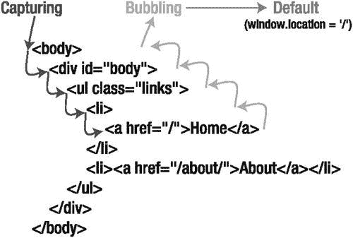

第六章


事件

这是最好的时代；那是最糟糕的时代。那是网景的时代；那是互联网浏览器的时代。我们面前的新事件处理者使它成为希望的春天。浏览器以不同方式实现事件处理的事实让我们陷入了绝望的冬天。但是最近几年，阳光变得清晰明亮，事件处理 API 已经跨浏览器实现了标准化(至少是 API 的大部分方面)。编写可用的 JavaScript 代码的最终目标一直是拥有一个能为用户工作的网页，不管他们使用什么浏览器或在什么平台上。长期以来，这意味着编写管理两种不同事件处理模型的事件处理代码。但是随着现代浏览器的出现，我们开发人员再也不用担心这个问题了。

多年来，JavaScript 中的事件概念已经发展到了我们现在所处的可靠、可用的平台。一旦 Internet Explorer 在版本 8 中实现了事件处理的 W3C 模型，我们就可以停止编写用于管理浏览器之间差异的库，而是专注于用事件做有趣和令人惊奇的事情。最终，这将我们引向 JavaScript 强大的模型-视图-控制器(MVC)模型，我们将在后面的章节中讨论。

在这一章中，我们将首先介绍 JavaScript 中的事件是如何工作的。根据这个理论的实际应用，我们将看看如何将事件绑定到元素。然后，我们将研究事件模型提供的信息，以及如何最好地控制它。当然，我们还需要涵盖我们可用的事件类型。我们以事件委托和一些关于事件和最佳实践的建议结束。

JavaScript 事件简介

如果你观察任何 JavaScript 代码的核心，你会发现事件是把所有东西粘在一起的粘合剂。无论是使用完整的基于 MVC 的单页面应用，还是简单地使用 JavaScript 为一两个页面添加一些功能，事件处理程序都是用户与我们的代码进行通信的方式。我们的数据将被绑定在 JavaScript 中，可能作为对象文字。我们将在 DOM 中表示这些数据，将其用作我们的视图。事件由 DOM 引发，由 JavaScript 代码处理，捕捉用户交互并指导应用的流程。结合使用 DOM 和 JavaScript 事件是使所有现代 web 应用成为可能的基本结合。

堆栈、队列和事件循环

在包括 JavaScript 在内的许多编程语言中，都有描述控制流、内存元素和下一步计划的隐喻。我们运行的代码，无论是从全局上下文，直接作为一个函数，还是作为一个从(或内部)调用的函数！)另一个功能，被称为*栈*。如果你正在运行一个函数`foo`，它调用一个函数`bar`，那么堆栈是三个*帧*深(全局，`foo`，然后`bar`)。这段代码运行后会发生什么？这是*队列*的职责，它管理当前堆栈解析后运行的下一组代码。每当堆栈清空时，它会进入队列并获取一段新的代码来运行。这些是我们理解事件的关键因素。不过，还有第三个元素:堆。这是变量、函数和其他命名对象存在的地方。当 JavaScript 需要访问一个对象、一个函数或一个变量时，它会进入堆来访问信息。对我们来说，堆不太重要，因为它在事件处理中的作用不如堆栈和队列大。

堆栈和队列是如何影响事件处理的？要回答这个问题，我们需要引入事件循环。这是浏览器中两个线程之间的协作:事件跟踪线程和 JavaScript 线程。

 **注意**记住，除了 web 工作者，JavaScript 是单线程的。

这些线程协同工作来捕获用户事件，然后根据我们注册了事件处理程序的事件对它们进行排序。这个过程统称为事件循环。每次运行时，都会检查用户事件，看是否有针对它们注册的事件处理程序。如果不是，那么什么都不会发生。如果有事件处理程序，循环会将它们推到 JavaScript 队列的顶部，以便在 JavaScript 最方便的时候执行处理程序。

困难就在这里。队列管理“最早方便”的概念通常，这意味着在当前堆栈被解析之后。这可能给事件处理一种异步的感觉，特别是如果堆栈有许多帧深或者包含长时间运行的代码。事件被允许跳到队列的头部，但是它们不能中断堆栈。大多数情况下，这种区别对于开发人员来说并不重要，因为从事件触发、堆栈帧解析到事件处理代码运行之间的持续时间可能是人类无法察觉的。尽管如此，对我们来说重要的是理解事件循环只将事件跳到行的前面；它不会将当前运行的代码推开。

我们现在了解了浏览器、队列和堆栈是如何一起决定事件处理程序何时运行的。很快，我们将研究将事件绑定到事件处理程序的机制。但是有一个架构问题我们需要首先解决。考虑一下:如果你点击了 HTML 文档主体中某个段落的无序列表中的列表项的链接，那么这些元素中的哪一个会处理这个事件呢？一个以上的元素可以处理这个事件吗？如果是，哪个元素先获得事件？要回答这个问题，我们需要看看事件阶段。

事件阶段

JavaScript 事件分两个阶段执行，称为*捕获*和*冒泡* 。这意味着当一个事件被一个元素触发时(例如，用户点击一个链接，导致`click`事件被触发)，被允许处理它的元素以及处理的顺序是不同的。你可以在[图 6-1](#Fig1) 中看到执行顺序的例子。它显示了每当用户单击页面上的第一个`<a>`元素时，触发了哪些事件处理程序以及触发的顺序。


[图 6-1](#_Fig1) 。事件处理的两个阶段

看看这个简单的例子，有人点击了一个链接，你可以看到一个事件的执行顺序。假设用户点击了`<a>`元素；首先触发文档的 click 处理程序，然后是`<body>`的处理程序，然后是`<div>`的处理程序，依此类推，直到`<a>`元素，这个循环称为捕获阶段。一旦完成，它再次沿着树向上移动，并且`<li>`、`<ul>`、`<div>`、`<body>`和文档事件处理程序都被依次触发。

事件处理以这种方式构建有非常具体的历史原因。当 Netscape 引入事件处理时，它决定应该使用事件捕获。当 Internet Explorer 赶上它自己的事件处理版本时，它也随之出现了事件冒泡。那是浏览器战争的时代，像这样截然相反的架构选择是司空见惯的。多年来，它们阻碍了 JavaScript 的开发，因为程序员不得不浪费时间来维护规范事件处理的库(以及一些 DOM、Ajax 和其他一些东西！).

好消息是我们现在生活在未来。现代浏览器允许用户选择在哪个阶段捕捉事件。事实上，如果您愿意，可以在两个阶段都分配事件处理程序。这是一个勇敢的新世界。

不管在哪个阶段绑定事件，有两件事应该是显而易见的。首先，我们讨论了在列表项中点击锚标记的想法。这难道不应该把你送到链接的`href`属性指向的任何地方吗？也许有某种方法可以克服这种行为。此外，考虑事件阶段的一般前提:无论是捕获还是冒泡，事件都是通过 DOM 层次结构进行通信的。如果我们不希望该事件被传播呢？我们能防止一个事件被向上(或向下)传递吗？

但是我们太超前了。我们甚至还没有讨论如何绑定事件监听器！让我们现在就解决这个问题。

绑定事件侦听器

将事件处理程序绑定到元素的最佳方式一直是 JavaScript 中不断发展的探索。它始于浏览器强迫用户在 HTML 文档中内联编写事件处理程序代码。第一次努力被认为是草案或阿尔法代码是有原因的！后来，当我们想要遵循既定的最佳实践时，比如将逻辑与表示分离，使用内联事件处理程序是次优的。好吧，这是个严重的问题。试着想象管理一个代码库，其中一半的关键路径依赖于嵌入在表示层中的代码。这不是专业 JavaScript 程序员想做的事情！幸运的是，随着浏览器 API 和最佳实践标准的发展，这种技术已经被淘汰了。

当 Netscape 和 Internet Explorer 相互竞争时，它们各自开发了独立但非常相似的事件注册模型。最终，网景的模型被修改成了 W3C 标准，而 Internet Explorer 的模型保持不变。直到 Internet Explorer 9，也就是微软最终屈服并实现了通常所说的 W3C 事件处理。事实上，它走得更远，不再支持旧的事件处理 API。这对开发人员来说是一个福音，因为现在我们不再需要编写和维护库来处理浏览器之间的争论。

今天，有两种可靠地登记事件的方法。传统的方法是附加事件处理程序的旧的内联方式的分支，但是它是可靠的并且一致地工作，甚至在旧的浏览器上。另一种方法是使用 W3C 标准来注册事件。当然，我们会两者都看，因为你很可能两者都会遇到。

传统绑定

绑定事件的传统方式是最简单的绑定事件处理程序的方式。这利用了事件处理程序是 DOM 元素的属性这一事实。要使用这个方法，您需要将一个函数作为属性附加到您希望观察的 DOM 元素上。用`document.getElementById`检索一个元素(或者我们在第 5 章的[中讨论过的任何其他元素检索函数)。让我们假设您想要观察`click`事件。只需为检索到的元素的`onclick`属性分配一个函数。搞定了。](05.html)

对于本章中的例子，我们将使用一个带有许多可定位元素的标准 HTML 页面。页面的内容显示在清单 6-1 的[中。](#list1)

[***清单 6-1***](#_list1) 。用于事件处理的示例 HTML 代码

```js
<!DOCTYPE html>
<html>
<head lang="en">
  <meta charset="UTF-8">
  <title>Event Handling</title>
  <link rel="stylesheet" href="school.css"/>
</head>
<body>

<div id="main">
  <nav id="navbar">
    <ul>
      <li>Students
        <ul>
          <li id="Academics">Academics</li>
          <li id="Athletics">Athletics</li>
          <li id="Extracurriculars">Extracurriculars</li>
        </ul>
      </li>
      <li>Faculty
        <ul>
          <li id="Frank Walsh">Frank Walsh</li>
          <li id="Diane Walsh">Diane Walsh</li>
          <li id="John Mullin">John Mullin</li>
          <li id="Lou Garaventa">Lou Garaventa</li>
          <li id="Dan Tully">Dan Tully</li>
         <li id="Emily Su">Emily Su</li>
        </ul>
      </li>
    </ul>
  </nav>
  <div id="welcome">
    <h1>Welcome to the School of JavaScript</h1>
    <h3 id="welcome-header">Click here for a welcome message!</h3>
    <p id="welcome-content">Welcome to the School of JavaScript. Here, you will find many
<a href="/examples" id="examples-link">examples</a> of JavaScript,
      taught by our most esteemed <a href="/faculty">faculty</a>.
<span id="disclaimer">Please note that these are only examples, and are not
      necessarily <a href="/production-ready">production-ready code</a>.</span></p>
  </div>
  <hr/>
  <div id="form-container">
    <h2>Contact Form</h2>

    <p>Thank you for your interest in the School of JavaScript. Please fill out the form
below so we can send you evenmore materials!</p>

    <form id="main-form">
      <ul>
        <li><label for="firstName">First Name: </label><input id="firstName" type="text"/></li>
        <li><label for="lastName">Last Name: </label><input id="lastName" type="text"/></li>
        <li><label for="city">City: </label><input id="city" type="text"/></li>
        <li><label for="state">State: </label><input id="state" type="text"/></li>
        <li><label for="postCode">Postal Code: </label><input id="postCode" type="text"/></li>
        <li><label for="comments">Comments: </label><br/>
          <textarea name="" id="comments" cols="30" rows="10"></textarea>
        </li>
        <li><input type="submit"/> <input type="reset"/></li>
      </ul>
    </form>
  </div>
</div>

</body>
</html>
```

正如你所看到的，首页上有很多我们想象中的 JavaScript 学校的元素。navbar 最终会有适当的事件处理来作为一个菜单，我们将为简单的验证添加事件处理(更复杂的验证将在第 8 章中介绍)，我们还计划在欢迎消息中增加一些交互性。

现在，让我们做一些简单的事情。当我们点击进入`firstName`字段时，让我们在控制台上记录下来，然后为我们的元素设置一个黄色背景。很明显，我们计划很快做更多的事情，但是先从小事做起！让我们将这个事件与传统的事件处理结合起来([清单 6-2](#list2) )。

[***清单 6-2***](#_list2) 。以传统方式绑定点击事件

```js
// Retrieve the firstName element
var firstName = document.getElementById('firstName');

// Attach the event handler
firstName.onclick = function() {
    console.log('You clicked in the first name field!');
    firstName.style.background = 'yellow';
};
```

太棒了。有效。但它缺少某种东西。那就是灵活性。在这种情况下，我们必须为每个表单字段编写单独的事件处理函数。繁琐！有没有一种方法可以获得触发事件的元素的引用？

其实有两个办法！第一，也是最直接的，是在你的事件处理函数中提供一个参数，如清单 6-3 所示。这个参数是 event 对象，它包含关于刚刚触发的事件的信息。我们将很快更详细地查看事件对象。现在，我们知道事件对象的`target`属性指的是最初发出事件的 DOM 元素。

[***清单 6-3***](#_list3) 。带参数的事件绑定

```js
// Retrieve the firstName element
var firstName = document.getElementById('firstName');

// Attach the event handler
firstName.onclick = function(e) {
    console.log('You clicked in the ' + e.target.id + ' field!');
    e.target.style.background = 'yellow';
};
```

由于`e.target`指向`firstName`字段，并且实际上是对`firstName`字段的 DOM 元素的引用，我们可以检查它的`id`属性来查看我们点击了哪个字段。更重要的是，我们还可以改变它的样式属性！这意味着我们可以扩展这个事件处理程序来处理表单中的任何文本字段。

除了显式使用`event`对象，还有一种替代方法。我们也可以在函数中使用关键字`this`，如清单 6-4 中的[所示。在事件处理函数的上下文中，`this`指的是事件的发出者。换句话说，`event.target`和`this`是同义词，或者，至少，它们指向同一个事物。](#list4)

[***清单 6-4***](#_list4) 。使用`this`关键字的事件绑定

```js
// Retrieve the firstName element
var firstName = document.getElementById('firstName');

// Attach the event handler
firstName.onclick = function() {
    console.log('You clicked in the ' + this.id + ' field!');
    this.style.background = 'yellow';
};
```

你应该使用哪一个？`event`对象为您提供了所需的所有信息，而`this`对象有所限制，因为它只指向发出事件的 DOM 元素。使用其中一个而不是另一个是没有成本的，所以，一般来说，我们推荐使用`event`对象，因为您总是可以立即获得事件的所有细节。然而，有些情况下`this`对象仍然有用。目标总是指向发出事件的最近的元素。看看清单 6-1 中 ID 为`welcome`的`<div>`。假设我们添加了一个`mouseover`事件处理程序，用于在鼠标悬停在元素上时更改背景颜色，并添加了一个`mouseout`事件处理程序，用于在鼠标离开`<div>`时将背景颜色改回来。如果您在`e.target`上进行样式更改，事件将为每个子元素(`welcome-header`、`welcome-content`等等)触发！另一方面，如果您在`this`上进行样式更改，则更改仅在欢迎`<div>`上进行。当我们讨论事件委托时，我们将更详细地讨论这种差异。

传统装订的优势

传统装订有以下优点:

*   使用传统方法的最大优势是它非常简单和一致，因为你可以保证无论你在什么浏览器中使用它都是一样的。
*   当处理一个事件时，`this`关键字引用当前元素，这可能是有用的(如[清单 6-4](#list4) 所示)。

传统装订的缺点

然而，它也有一些缺点:

*   传统方法不允许控制事件捕获或冒泡。所有的事件都会冒泡，并且不可能改变为事件捕获。
*   It’s only possible to bind one event handler to an element at a time. This has the potential to cause confusing results when working with the popular `window.onload` property (effectively overwriting other pieces of code that have used the same method of binding events). An example of this problem is shown in [Listing 6-5](#list5), where an event handler overwrites an earlier event handler.

    [***清单 6-5***](#_list5) 。事件处理程序相互覆盖

    ```js
    // Bind your initial load handler
    window.onload = myFirstHandler;

    // somewhere, in another library that you’ve included,
    // your first handler is overwritten
    // only 'mySecondHandler' is called when the page finishes loading
    window.onload = mySecondHandler;

    ```

*   在 Internet Explorer 8 和更早版本中，`event`对象参数不可用。相反，你必须使用`window.event`。

知道有可能盲目地覆盖其他事件，您可能应该选择仅在简单的情况下使用传统的事件绑定方法，在这种情况下，您可以信任与您的代码一起运行的所有其他代码。然而，避免这种麻烦的一种方法是使用现代浏览器实现的 W3C 事件绑定方法。

DOM 绑定:W3C

W3C 将事件处理程序绑定到 DOM 元素的方法是唯一真正标准化的方法。考虑到这一点，所有现代浏览器都支持这种附加事件的方式。Internet Explorer 8 和更老的版本没有，但旧版本的 Internet Explorer 几乎不是现代浏览器。如果你必须为这些设计，考虑使用传统的绑定。

附加新处理函数的代码很简单。它作为一个函数存在于每个 DOM 元素中。该函数名为`addEventListener`,带三个参数:事件的名称(如`click`；注意缺少前缀`on`、处理事件的函数以及启用或禁用事件捕获的布尔标志。清单 6-6 中的[显示了一个使用中的`addEventListener`示例。](#list6)

[***清单 6-6***](#_list6) 。示例代码使用 W3C 方式绑定事件处理程序

```js
// Retrieve the firstName element
var firstName = document.getElementById( 'firstName' );

// Attach the event handler
firstName.addEventListener( 'click', function ( e ) {
  console.log( 'You clicked in the ' + e.target.id + ' field!' );
  e.target.style.background = 'yellow';
} );
```

注意，在这个例子中，我们没有向`addEventListener`传递第三个参数。在这种情况下，第三个参数默认为 false，这意味着将使用事件冒泡。如果我们想使用事件捕获，我们可以显式地传递一个真值。

W3C 绑定的优势

W3C 事件绑定方法的优势如下:

*   此方法支持事件处理的捕获和冒泡阶段。通过将`addEventListener`的最后一个参数设置为 false(默认值，用于冒泡)或 true(用于捕捉)来切换事件阶段。
*   在事件处理函数内部，`this`关键字引用当前元素，就像在传统事件处理中一样。
*   `event`对象在处理函数的第一个参数中总是可用的。
*   您可以将任意数量的事件绑定到一个元素，而不会覆盖先前绑定的处理程序。JavaScript 在内部堆叠处理程序，并按照它们注册的顺序运行。

W3C 绑定的缺点

W3C 事件绑定方法只有一个缺点:

*   它在 Internet Explorer 8 和更低版本中不工作。IE 使用类似语法的`attachEvent`。

取消绑定事件

既然我们已经绑定了事件，那么如果我们想解除事件的绑定呢？也许我们绑定了一个`click`事件处理程序的按钮现在被禁用了。或者我们不再需要在悬停时高亮显示该 div。断开事件及其处理程序的连接相对简单。

对于传统的事件处理，只需为事件处理程序分配一个空字符串或 null，如下所示:

```js
document.getElementById('welcome-content').onclick = null;
```

不太难吧？

W3C 事件处理的情况稍微复杂一些。相关功能是`removeEventListener`。它的三个参数是相同的:要移除的事件的类型、关联的处理程序以及捕获或冒泡模式的 true/false 值。不过，有一个问题。首先也是最重要的，这个函数必须是对同一个被分配了`addEventListener` 的函数的引用。不只是相同的代码行，而是相同的引用。所以如果你用`addEventListener`指定了一个匿名的内嵌函数，你就不能删除它。

 **提示**如果你认为你以后可能需要移除事件处理程序，你应该总是为它使用一个命名函数。

同样，如果您在最初调用`addEventListener`时设置了第三个参数，那么您必须在`removeEventListener`中再次设置它。如果你不考虑这个参数，或者给它一个错误的值，`removeEventListener`就会无声无息地失败。[清单 6-7](#list7) 有一个解除绑定事件处理程序的例子。

[***清单 6-7***](#_list7) 。解除事件处理程序的绑定

```js
// Assume we have two buttons 'foo' and 'bar'
var foo = document.getElementById( 'foo' );
var bar = document.getElementById( 'bar' );

// When we click on foo, we want to log to the console "Clicked on foo!"
function fooHandler() {
  console.log( 'Clicked on the foo button!' );
}

foo.addEventListener( 'click', fooHandler );

// When we click on bar, we want to _remove_ the event handler for foo.
function barHandler() {
  console.log( 'Removing event handler for foo....' );
  foo.removeEventListener( 'click', fooHandler );
}

bar.addEventListener( 'click', barHandler );
```

常见事件特征

JavaScript 事件有许多相对一致的特性，在开发时给你更多的能力和控制。最简单也是最古老的概念是`event`对象，它为您提供了一组元数据和上下文函数，因此您可以处理诸如鼠标事件和按键之类的事情。此外，还有一些函数可用于修改事件的正常捕获/冒泡流程。从里到外了解这些特性可以让你的生活简单很多。

事件对象

事件处理程序的一个标准特性是以某种方式访问`event`对象，该对象包含有关当前 eventEvent 对象的上下文信息。这个对象对于某些事件来说是一个非常有价值的资源。例如，在处理键按下时，您可以访问对象的`keyCode`属性以获取被按下的特定键。`event`对象之间存在一些微妙的差异，但我们将在本章后面讨论这些。现在，让我们解决两个悬而未决的问题:事件传播和默认行为。

取消事件冒泡

您知道事件捕获/冒泡是如何工作的，所以让我们来探索如何控制它。前一个例子中提到的重要一点是，如果您希望一个事件只发生在它的目标上，而不发生在它的父元素上，您没有办法阻止它。停止事件气泡的流动将导致类似于图 6-2 中[所示的情况，其中事件的结果被第一个`<a>`元素捕获，随后的](#Fig2)气泡被取消。


[图 6-2](#_Fig2) 。第一个`<a>`元素捕获事件的结果

停止事件的冒泡(或捕获)在复杂的应用中非常有用。而且实现起来很简单。调用`event`对象的`stopPropagation` 方法，防止事件在层次结构中进一步向上(或向下)遍历。[清单 6-8](#list8) 显示了一个例子。

[***清单 6-8***](#_list8) 。停止事件冒泡的示例

```js
document.getElementById( 'disclaimer' ).addEventListener( 'click', function ( e ) {

  // When clicking on the disclaimer, highlight it by making it bold
  e.target.style.fontWeight = 'bold';

  // The parent element wants to hide itself if this element is clicked on. We need to prevent that behavior
  e.stopPropagation();
} );

document.getElementById( 'welcome-content' ).addEventListener( 'click', function ( e ) {
  e.target.style.visibility = 'hidden';
} );
```

[清单 6-9](#list9) 显示了一个简短的代码片段，它在用户悬停的元素周围添加了一个红色边框。您可以通过向每个 DOM 元素添加一个`mouseover`和一个`mouseout`事件处理程序来实现这一点。如果您不停止事件冒泡，每次鼠标移动到一个元素上时，该元素及其所有父元素都会有红色边框，这不是您想要的。

[***清单 6-9***](#_list9) 。使用`stopPropagation`防止所有元素改变颜色

```js
// Event handling functions
function mouseOverHandler( e ) {
  e.target.style.border = '1px solid red';
  e.stopPropagation();
}

function mouseOutHandler( e ) {
  this.style.border = '0px';
  e.stopPropagation();
}

// Locate, and traverse, all the elements in the DOM
var all = document.getElementsByTagName( '*' );
for ( var i = 0; i < all.length; i++ ) {

  // Watch for when the user moves the mouse over the element
  // and add a red border around the element
  all[i].addEventListener( 'mouseover', mouseOverHandler );

  // Watch for when the user moves back out of the element
  // and remove the border that we added
  all[i].addEventListener( 'mouseout', mouseOutHandler );

}
```

有了阻止事件冒泡的能力，您现在可以完全控制哪些元素可以看到和处理事件。这是探索动态 web 应用开发所必需的基本工具。最后一个方面是取消浏览器的默认操作，允许您完全覆盖浏览器的功能并实现新的功能。

覆盖浏览器的默认操作

对于大多数发生的事件，浏览器都有一些默认的总是会发生的动作。例如，点击一个`<a>`元素将把你带到它的相关网页；这是浏览器中的默认操作。这个动作总是发生在捕获和冒泡事件阶段之后，如图 6-3 中的[所示，它展示了用户点击网页中的`<a>`元素的结果。事件从捕获和冒泡阶段遍历 DOM 开始(如前所述)。但是，一旦事件完成遍历，浏览器就会尝试执行该事件和元素的默认操作。在本例中，它访问/ web 页面。](#Fig3)



[图 6-3](#_Fig3) 。一个事件的整个生命周期

默认动作可以概括为浏览器做的任何你没有明确告诉它去做的事情。下面是发生的不同类型的默认操作的示例，以及在什么事件上发生的示例:

*   单击一个`<a>`元素会将您重定向到其`href`属性中提供的 URL。
*   使用您的键盘并按下 Ctrl+S，浏览器将尝试保存站点的物理表示。
*   提交 HTML `<form>`会将查询数据提交到指定的 URL，并将浏览器重定向到该位置。
*   将鼠标移动到带有`alt`或`title`属性的``上(取决于浏览器)会出现一个工具提示，提供属性的值。

即使您停止了事件冒泡，或者您根本没有绑定事件处理程序，浏览器也会执行前面的所有操作。这可能会导致脚本中出现重大问题。如果您希望提交的表单有不同的表现，该怎么办？或者，如果您希望`<a>`元素的行为与其预期目的不同，该怎么办？因为取消事件冒泡不足以阻止默认操作，所以您需要一些特定的代码来直接处理它。W3C 事件处理 API 通过`event`对象的`preventDefault`方法提供了这一功能([清单 6-10](#list10) )。对于许多浏览器来说，你可以选择简单地从你的事件处理器返回 false 作为替代，你可以在一些例子和库中看到这种行为编码。使用`preventDefault` 是首选，因为它是自文档化的——不像偶尔从事件处理程序返回 false 的晦涩技术。

[***清单 6-10***](#_list10) 。防止默认浏览器动作发生的通用函数

```js
document.getElementById('examples-link').addEventListener('click', function(e) {
  e.preventDefault();
   console.log("examples-link clicked");
});
```

使用`preventDefault`功能，您现在可以停止浏览器显示的任何默认动作。例如，这允许您利用链接的`mouseover`事件，而不用担心用户意外点击链接并把浏览器发送到其他地方。您可以覆盖在状态栏中显示链接位置的默认行为。或者考虑一个用来启动表单验证的 Submit 按钮。如果验证失败，您现在可以推迟提交表单(默认行为)。

事件委托

我们已经有了几乎所有操作事件处理程序的工具。一个挥之不去的问题是技术问题。假设我们有一个包含 20 个条目的无序列表。我们希望为每个列表项添加一个事件处理程序。更准确地说，我们希望能够不同地处理每个列表项的点击。我们可以用`document.querySelectorAll`获取所有元素，迭代结果，并附加单独的事件处理程序。无论是作为一个过程还是在浏览器中，这都是低效的。我们设置了 20 个事件处理程序(即使它们都指向同一个处理函数)，而我们只能设置一个。

所有列表项都包含在一个无序列表标签中，那么为什么不利用我们可以在`<ul>`级别捕获点击事件的事实呢？我们唯一需要的是区分不同列表项的方法。回到传统事件绑定的部分，当我们讨论`this`对象时，我们注意到`this`指的是捕获事件的元素，而`event.target`指的是实际发出事件的元素。显然，我们可以使用`this`和`event.target`的组合。但是事件处理规范提供了`event.currentTarget`属性来解决这个问题。

在我们的列表项场景中，我们将一个`click`事件处理程序附加到无序列表。在事件处理程序中，`<ul>`是`event.currentTarget`。每个列表项都将是`event.target`属性。因此，我们可以检查`event.target`来查看哪个列表项被点击并被分派到适当的函数。清单 6-11 展示了一个事件委托的例子。

[***清单 6-11***](#_list11) 。事件委托

```js
function clickHandler(e) {
  console.log( 'Handled at ' + e.currentTarget.id );
  console.log( 'Emitted by ' + e.target.id );
}

var navbar = document.getElementById('navbar');
navbar.addEventListener( 'click', clickHandler );
```

`clickHandler`函数处理`<nav>`级别的事件，但是它接收从`<nav>`元素下的各种列表项发出的事件。

事件对象

在每个事件处理函数中，都提供了或者可以使用`event`对象。一般来说，`event`对象的属性涵盖了您可能想知道的关于某个事件的细节:它是什么类型的事件，它来自哪里，点击了什么坐标，或者可能按了什么键。不过，不同浏览器交流这些信息的方式有一些细微的差别。

常规属性

对于每种被捕获的事件类型，`event`对象上都有许多属性。所有这些`event`对象属性都与事件本身直接相关，没有什么是特定于浏览器的。下面是所有`event`对象属性的列表，并附有解释和示例代码。

类型

该属性包含当前被触发的事件的名称(如`click`或`mouseover`)。它可以用来提供一个通用的事件处理函数，然后确定性地执行相关代码。[清单 6-12](#list12) 展示了一个使用这个属性使一个处理程序根据事件类型产生不同效果的例子。

[***清单 6-12***](#_list12) 。使用`type`属性为元素提供类似悬停的功能

```js
function mouseHandler(e){
  // Toggle the background color of the <div>, depending on the
  // type of mouse event that occurred
  this.style.background = (e.type === 'mouseover') ? '#EEE' : '#FFF';
}

// Locate the <div> that we want to hover over
var div = document.getElementById('welcome');

// Bind a single function to both the mouseover and mouseout events
div.addEventListener( 'mouseover', mouseHandler );
div.addEventListener( 'mouseout', mouseHandler );
```

目标

此属性包含对触发事件的元素的引用。例如，将一个点击处理程序绑定到一个`<a>`元素会有一个等于`<a>`元素本身的目标属性。

停止传播

`stopPropagation`方法停止事件冒泡(或捕获)过程，使当前元素成为最后一个接收特定事件的元素。

prevent default/return value = false

调用`preventDefault`方法会阻止浏览器的默认动作在所有现代 W3C 兼容浏览器中发生。

鼠标属性

只有当鼠标相关的事件被启动时，鼠标属性才会存在于`event`对象中(如`click`、`mousedown`、`mouseup`、`mouseover`、`mousemove`、`mouseout`、`mouseenter`、`mouseleave`)。在其他任何时候，您都可以假设返回的值不存在或不可靠。本节列出了鼠标事件期间存在于`event`对象上的所有属性。

pageX 和 pageY

这些属性包含鼠标光标相对于浏览器窗口绝对左上角的 x 和 y 坐标。无论如何滚动，它们都是一样的。

clientxand 客户〔t0〕

这些属性包含鼠标光标相对于浏览器窗口的 x 和 y 坐标。因此，如果您向下(或横向)滚动文档，这些数字是相对于浏览器窗口的边缘的。当您在文档中滚动时，这些数字会发生变化。

layerX/layerY 和 offsetX/offsetY

这些属性应该包含鼠标光标相对于事件目标元素的 x 和 y 坐标。这些属性在 Chrome 和 IE 中有效，但在 Firefox 中无效。火狐支持 l `ayerX`和`layerY`，但是它们包含的信息不一样。相反，`layer*`属性似乎等同于适当的`page*`属性。

按钮

该属性仅在`click`、`mousedown`和`mouseup`事件上可用，是一个代表当前被点击的鼠标按钮的数字。左键点击为 0(零)，中键点击为 1，右键点击为 2。

relatedTarget

此事件属性包含对鼠标刚刚离开的元素的引用。通常情况下，`relatedTarget`用于需要使用`mouseover` / `mouseout`的情况，但是你也需要知道鼠标刚刚在哪里，或者它要去哪里。[清单 6-13](#list13) 显示了一个树形菜单的变体(`<ol>`元素包含其他`<ol>`元素)，其中子树只在用户第一次将鼠标移动到`<li>`子元素上时显示。

[***清单 6-13***](#_list13) 。使用`relatedTarget`属性创建一个可导航的树

```js
// When DOMContent is ready, get the references to the elements.
document.addEventListener('DOMContentLoaded', init);
function init(){
    var top = document.getElementById("top");
    var bottom = document.getElementById("bottom");

    top.addEventListener("mouseover", onMouseOver);
    top.addEventListener("mouseout", onMouseOut);
    bottom.addEventListener("mouseover", onMouseOver);
    bottom.addEventListener("mouseout", onMouseOut);
}

function onMouseOut(event) {
  console.log("exited " + event.target.id + " for " + event.relatedTarget.id);
}

function onMouseOver(event) {
  console.log("entered " + event.target.id + " from " + event.relatedTarget.id);
}

// Sample HTML:
<style>
div > div {
  height: 128px;
  width: 128px;
}
#top    { background-color: red; }
#bottom { background-color: blue; }
</style>
<title>Untitled Document</title>
</head>

<body>

<div id="outer">
  <div id="top"></div>
  <div id="bottom"></div>
</div>
```

键盘属性

键盘属性一般只在键盘相关事件被启动时存在于`event`对象中(如`keydown`、`keyup`和`keypress`)。这个规则的例外是`ctrlKey`和`shiftKey`属性，它们在鼠标事件期间可用(允许用户按住 Ctrl 键并单击一个元素)。在其他任何时候，您都可以假设属性中包含的值不存在或不可靠。

ctrl ley

此属性返回一个布尔值，该值表示键盘 Ctrl 键是否被按住。`ctrlKey`属性可用于键盘和鼠标事件。

键码

这个属性包含一个对应于键盘上不同键的数字。某些键(如 PageUp 和 Home)的可用性可能会有所不同，但一般来说，所有其他键都工作可靠。[表 6-1](#Tab1) 是所有常用键盘键及其相关键码的参考。

[表 6-1](#_Tab1) 。常用键码

| 

钥匙

 | 

键码

 |
| --- | --- |
| 退格 | eight |
| 标签 | nine |
| 进入 | Thirteen |
| 空间 | Thirty-two |
| 向左箭头 | Thirty-seven |
| 向上箭头 | Thirty-eight |
| 向右箭头 | Thirty-nine |
| 下箭头键 | Forty |
| 0–9 | 48–57 |
| 阿塞拜疆（Azerbaijan 的缩写） | 65–90 |

shiftKey 键

该属性返回一个布尔值，该值表示键盘上的 Shift 键是否被按住。`shiftKey`属性可用于键盘和鼠标事件。

事件的类型

常见的 JavaScript 事件可以分为几类。可能最常用的类别是鼠标交互，紧随其后的是键盘和表单事件。下面的列表概括介绍了 web 应用中存在并可以处理的不同事件类别。

*   **加载和错误** **事件:**该类的事件与页面本身相关，观察其加载状态。它们发生在用户第一次加载页面时(`load`事件)和用户最终离开页面时(`unload`和`beforeunload`事件)。此外，使用`error`事件跟踪 JavaScript 错误，使您能够单独处理错误。
*   **UI 事件** **:** 这些用于跟踪用户何时与页面的一个方面而不是另一个方面进行交互。例如，使用这些工具，您可以可靠地知道用户何时开始输入表单元素。用于跟踪这一点的两个事件是`focus`和`blur`(当对象失去焦点时)。
*   **鼠标** **事件:**分为两类:跟踪鼠标当前所在位置的事件(`mouseover`、`mouseout`)，以及跟踪鼠标点击位置的事件(`mouseup`、`mousedown`、`click`)。
*   **键盘** **事件:**这些事件负责跟踪键盘键何时被按下以及在什么上下文中被按下——例如，跟踪表单元素内的击键，而不是整个页面内发生的击键。与鼠标一样，三种事件类型用于跟踪键盘:`keyup`、`keydown`和`keypress`。
*   **表单** **事件:**这些事件直接关系到只与表单和表单输入元素发生的交互。`submit`事件用于跟踪表单提交的时间；`change`事件观察用户对元素的输入；当一个`<select>`元素被更新时，就会触发`select`事件。

页面事件

所有页面事件专门处理整个页面的功能和状态。大多数事件类型处理页面的加载和卸载(每当用户访问页面然后再次离开时)。

负荷

一旦页面完全完成加载，就会触发`load`事件；此事件包括所有图像、外部 JavaScript 文件和外部 CSS 文件。它也适用于大多数具有`src`属性的元素(`img`、`script`、`audio`、`video`等等)。加载事件不会冒泡。

卸载前

这个活动有点奇怪，因为它完全不规范，但却得到了广泛的支持。它的行为与`unload`事件非常相似，但有一个重要的区别。在您的`beforeunload` 事件的事件处理程序中，如果您返回一个字符串，该字符串将显示在一条确认消息中，询问用户是否希望离开当前页面。如果他们拒绝，他们将能够停留在当前页面。Gmail 等动态 web 应用利用这一点来防止用户丢失任何未保存的数据。

错误

每当 JavaScript 代码中出现错误时，就会触发`error`事件。它可以作为捕获错误消息并优雅地显示或处理它们的一种方式。该事件处理程序的行为不同于其他事件处理程序，因为它没有传入一个`event`对象，而是包含一条解释所发生的特定错误的消息。

调整大小

页面事件:`resize`事件在每次用户调整浏览器窗口大小时发生。当用户调整浏览器窗口大小时，`resize`事件只会在调整完成后触发，而不是在整个过程中的每一步。

卷起

当用户在浏览器窗口中移动文档的位置时，`scroll`事件发生。这可以通过按键盘(如使用箭头键、上/下翻页或空格键)或使用滚动条来实现。

卸载

每当用户离开当前页面(例如，通过单击链接、点击“后退”按钮，甚至关闭浏览器窗口)时，都会触发此事件。阻止默认动作对这个事件不起作用(下一个最好的事情是`beforeunload`事件)。

UI 事件

用户界面事件处理用户如何与浏览器或页面元素交互。UI 事件可以帮助您确定用户当前正在与页面上的哪些元素进行交互，并为它们提供更多的上下文(比如突出显示或帮助菜单)。

集中

`focus`事件是确定页面光标当前位置的一种方式。默认情况下，焦点在整个文档中；但是，每当使用键盘单击或切换到某个链接或表单输入元素时，它就会转到那个位置。(该事件的一个例子如[清单 6-14](#list14) 所示)。

虚化

当用户将焦点从一个元素转移到另一个元素时，就会发生`blur`事件(在链接、输入元素或页面本身的上下文中)。(该事件的一个例子如[清单 6-14](#list14) 所示)。

鼠标事件

当用户移动鼠标指针或单击鼠标按钮时，就会发生鼠标事件。

点击

当用户在一个元素上按下鼠标左键(参见`mousedown`事件)并在同一元素上释放鼠标键(参见`mouseup`事件)时，就会发生`click`事件。

dblclick(数据库点击)

`dblclick`事件发生在用户快速连续完成两个`click`事件之后。双击的速度取决于操作系统的设置。

老鼠洞

当用户按下鼠标按钮时，`mousedown`事件发生。与`keydown`事件不同，这个事件只会在鼠标按下时触发一次。

老鼠！老鼠

当用户释放被按下的鼠标按钮时，`mouseup`事件发生。如果在按钮被按下的同一元素上释放按钮，也会发生一个`click`事件。

摩门教徒

每当用户将鼠标指针在页面上移动至少一个像素时，就会发生一个`mousemove`事件。触发的`mousemove`事件的数量(对于鼠标的完整移动)取决于用户移动鼠标的速度以及浏览器能够跟上更新的速度。

鼠标悬停

每当用户将鼠标从一个元素移到另一个元素时，就会发生`mouseover`事件。要查找用户来自哪个元素，请使用`relatedTarget`属性。此事件是资源密集型的，因为它可以为经过的每个像素或子元素触发一次。更喜欢`mouseenter`，描述简短。

鼠标移出

每当用户将鼠标移出一个元素时，`mouseout`事件就会发生。这包括将鼠标从一个父元素移动到一个子元素(乍一看可能不直观)。要找到用户要去的元素，使用`relatedTarget`属性。这个事件是资源密集型的，因为与`mouseover`配对，它可以触发很多很多次。偏爱`mouseleave`，简述。

鼠标输入

功能类似于`mouseover`，但是智能地注意它在元素中的位置。不会再次触发，直到它离开元素的盒子。

moueleve〔t0〕

功能类似于`mouseout`，但是智能地注意它何时离开一个元素。

清单 6-14 展示了一个将事件对附加到元素上的例子，以允许键盘访问(和鼠标访问)网页。每当用户将鼠标移动到链接上或使用键盘导航到该链接时，该链接将会得到一些额外的颜色突出显示。

[***清单 6-14***](#_list14) 。通过使用`mouseover`和`mouseout`事件创建悬停效果

```js
// mouseEnter handler
function mouseEnterHandler() {
  this.style.backgroundColor = 'blue';
}

// mouseLeave handler
function mouseLeaveHandler() {
  this.style.backgroundColor = 'white';
}

// Find all the <a> elements, to attach the event handlers to them
var a = document.getElementsByTagName('a');
for ( var i = 0; i < a.length; i++ ) {

  // Attach a mouseover and focus event handler to the <a> element,
  // which changes the <a>s background to blue when the user either
  // mouses over the link, or focuses on it (using the keyboard)
  a[i].addEventListener('mouseenter', mouseEnterHandler);
  a[i].addEventListener('focus', mouseEnterHandler);

  // Attach a mouseout and blur event handler to the <a> element
  // which changes the <a>s background back to its default white
  // when the user moves away from the link
  a[i].addEventListener('mouseleave', mouseLeaveHandler);
  a[i].addEventListener('blur', mouseLeaveHandler);

}
```

键盘事件

键盘事件处理用户在键盘上按键的所有实例，无论是在文本输入区域内部还是外部。

击键/按键

`keydown`事件是按键时发生的第一个键盘事件。如果用户继续按住键，`keydown`事件将继续触发。`keypress`事件是`keydown`事件的常见同义词；它们的行为实际上是一样的，只有一个例外:如果你想阻止一个按键被按下的默认动作，你必须在`keypress`事件上这样做。

好好享受吧

`keyup`事件是发生的最后一个键盘事件(在`keydown`事件之后)。与`keydown`事件不同，这个事件在释放时只会触发一次(因为你不能长时间释放一个键)。

表单事件

表单事件主要处理 HTML 表单的主要元素`<form>`、`<input>`、`<select>`、`<button>`和`<textarea>`。

挑选

每当用户使用鼠标在输入区域中选择不同的文本块时，就会触发`select` 事件。通过该事件，您可以重新定义用户与表单交互的方式。

变化

当用户修改输入元素(包括`<select>`和`<textarea>`元素)的值时，会发生`change`和事件。该事件仅在用户已经离开元素，使其失去焦点后触发。

使服从

`submit` 事件只在表单中发生，并且只在用户点击提交按钮(位于表单中)或点击输入元素之一中的 Enter/Return 时发生。通过将绑定到表单的提交处理程序，而不是绑定到提交按钮的点击处理程序，可以确保捕捉到用户提交表单的所有尝试。

重置

`reset` 事件仅在用户单击表单内的重置按钮时发生(与提交按钮相反，提交按钮可以通过按回车键来复制)。

事件可访问性

在开发一个完全不引人注目的 web 应用时，要考虑的最后一点是确保即使不使用鼠标，您的事件也能工作。通过这样做，你帮助了两类人:需要辅助功能的人(视力受损的用户)和不喜欢使用鼠标的人。(有一天坐下来，断开鼠标和电脑的连接，学习如何只用键盘浏览网页。真是大开眼界的经历)。

为了让您的 JavaScript 事件更容易访问，无论何时使用`click`、`mouseover`和`mouseout`事件，您都应该考虑提供替代的非鼠标绑定。幸运的是，有一些简单的方法可以快速补救这种情况:

*   **`click`**事件** **:** 浏览器开发人员的一个聪明举措是让`click`事件在每次按下回车键时都能工作。这完全消除了为该事件提供替代的需要。然而，需要注意的一点是，一些开发人员喜欢绑定点击处理程序来提交表单中的按钮，以便在用户提交网页时进行监视。开发人员应该绑定到表单对象上的`submit`事件，而不是使用该事件，这是一个可靠的智能替代方法。**
***   **`mouseover`**事件** **:** 使用键盘浏览网页时，你实际上是在将焦点转移到不同的元素上。通过将事件处理程序附加到`mouseover`和`focus`事件，可以确保为键盘和鼠标用户提供相同的解决方案。*****   **`mouseout`**事件** **:** 与`mouseover`事件的`the focus`事件一样，`blur`事件在用户的焦点从某个元素移开时发生。然后你可以使用`blur`事件来模拟键盘上的`mouseout`事件。******

 ****实际上，除了典型的鼠标事件之外，添加处理键盘事件的能力完全是微不足道的。如果没有别的，这样做可以帮助依赖键盘的用户更好地使用你的网站，这对每个人来说都是一个巨大的胜利。

摘要

在这一章中，我们首先介绍了 JavaScript 中的事件是如何工作的，并将它们与其他语言中的事件模型进行了比较。然后，您看到了事件模型提供了什么信息，以及如何最好地控制它。然后，我们探讨了将事件绑定到 DOM 元素，以及可用的不同类型的事件。我们最后讨论了`event`对象属性、事件类型以及如何为可访问性编码。****