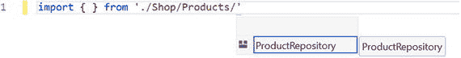
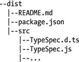

# 2.代码组织

不是语言让程序看起来简单。是程序员让语言显得简单！——罗伯特·C·马丁

本章讨论代码组织。该主题涉及名称空间、模块、模块加载和打包。本章最关心的是帮助你把你的程序分割成易于查找、维护和使用的块。

自从 TypeScript 首次公开以来，术语发生了一些变化，因此为了澄清术语，下面是对主要元素的描述:

*   命名空间(以前称为内部模块)为标识符创建上下文，减少程序中的命名冲突，并提供一种将代码组织到逻辑方案中的机制。命名空间仅向全局范围添加一项；这个项目提供了一个层次化的机制来访问命名空间中公开的所有内容。
*   模块(以前称为外部模块)是一个完全隔离的上下文，它不向全局范围添加任何项。模块可以导入其他模块，并导出可以在模块外部使用的成员。模块由模块加载器支持，有各种选项可用于在浏览器中加载模块，并且有运行 Node 的 web 服务器上的 CommonJS 加载器。
*   包是一种机制，用于交付大量代码文件以供另一个程序使用。大多数包管理器都有一个包含代码和元数据的结构化归档文件夹。这个包既可以在公共存储库(许多开源项目都是这样)上可用，也可以在私有存储库(比如公司范围的包存储库)上可用。

一个命名空间可以分成许多文件，每个文件为命名空间贡献额外的成员。一个模块完全等同于单个文件。我在这一章的目标之一是说服你更喜欢模块而不是名称空间，因为当你的程序增长时，它们会立即提供一些好处。

名称空间是一种简单的机制，非常适合捆绑。当您将代码输出到单个文件时，例如，通过使用`--outFile`编译器标志编译您的 TypeScript 代码。随着您引入更多的名称空间，全局范围内的项目数量也会增加。当程序发展到一定规模时，跟踪组件之间的依赖关系变得很困难，输出文件也变得难以处理。虽然您可以异步加载一个大文件，但整个程序必须在运行前加载。名称空间可能是一个危险的陷阱，因为当您第一次开始编写 TypeScript 程序时，它们可能感觉没有摩擦；但从长远来看，它们会成为你后悔的决定。

尽管有这个警告，我仍将在本章中解释如何使用名称空间，但这并不是对该特性的认可。任何关于 TypeScript 的书如果没有对名称空间的解释都是不完整的，即使我设法说服您避免使用它们，您也几乎肯定会在其他代码库中遇到它们，并且您会想知道它们是如何工作的。

## 命名空间

名称空间可以用来将相关的特性组合在一起。每个名称空间都是一个单独的实例，其所有内容都包含在名称空间的范围内。通过将变量、函数、对象、类和接口分组到命名空间中，您可以将它们保持在全局范围之外并避免命名冲突，尽管每个命名空间的根都被添加到全局范围中。

名称空间是开放的，在一个公共根中具有相同名称的所有声明都构成一个名称空间。这允许在多个文件中描述名称空间，并允许您将每个文件保持在可维护的大小。

清单 [2-1](#Par15) 显示了两个名称空间，都有一个名为`Example`的类。每个名称空间创建一个单独的上下文，以允许类具有相同的名称。每个类都是作为命名空间的成员来访问的，这使得预期的类变得明确。

```js
namespace First {
    export class Example {
        log() {
            console.log('Logging from First.Example.log()');
        }
    }
}

namespace Second {
    export class Example {
        log() {
            console.log('Logging from Second.Example.log()');
        }
    }
}

const first = new First.Example();

// Logging from First.Example.log()
first.log();

const second = new Second.Example();

// Logging from Second.Example.log()
second.log();

Listing 2-1.Namespaces

```

可以将名称空间组织成层次结构:或者将它们嵌套在一起，或者在提供名称空间标识符时使用点语法。清单 [2-2](#Par17) 中显示了这两个备选方案，层次结构中的第一层和第二层是嵌套的，第三层是使用点符号添加的。实际上，所有这些声明都添加到了同一个层次结构中，如调用代码所示。

```js
namespace FirstLevel {
    export namespace SecondLevel {
        export class Example {

        }
    }
}

namespace FirstLevel.SecondLevel.ThirdLevel {
    export class Example {

    }
}

const nested = new FirstLevel.SecondLevel.Example();

const dotted = new FirstLevel.SecondLevel.ThirdLevel.Example();

Listing 2-2.Nested and dotted

hierarchies

```

如果您正在使用名称空间，混合分层名称空间组织的样式，以及在多个文件中添加名称空间，都会在修复错误或添加新行为时增加程序的心理复杂性。您创建的层次结构的主要驱动因素应该是借助自动完成功能来方便地定位功能。一个好的层次结构将使你的代码更容易被找到，并减少交叉引用文档的需要。

您可能已经注意到清单 [2-2](#Par17) 中的嵌套模块有一个 export 关键字。该关键字将命名空间成员标记为 public。如果没有 export 关键字，则只能从命名空间内部访问命名空间成员(包括对同一命名空间的后续添加)。这不同于默认情况下成员是公共的类。清单 [2-3](#Par20) 是应用这些不同可见性级别的真实例子，首先出现的是导出的公共成员，接下来是仅在名称空间内使用的变量和类。

```js
namespace Shipping {

    // Available as Shipping.Ship
    export interface Ship {
        name: string;
        port: string;
        displacement: number;
    }

    // Available as Shipping.Ferry
    export class Ferry implements Ship {
        constructor(
            public name: string,
            public port: string,
            public displacement: number) {
        }
    }

    // Only available inside of the Shipping module
    const defaultDisplacement = 4000;

    class PrivateShip implements Ship {
        constructor(
            public name: string,

            public port: string,
            public displacement: number = defaultDisplacement) {
        }
    }

}

const ferry = new Shipping.Ferry('Assurance', 'London', 3220);

Listing 2-3.Public and private

members

```

export 关键字的反义词是 import。您可以使用 import 语句为另一个名称空间中的项目起别名，如清单 [2-4](#Par22) 所示。进口声明提及装运。Ship 类，并赋予它别名“Ship”这个别名可以在整个`Docking`名称空间中作为一个简称使用，所以无论`Ship`出现在名称空间中的什么地方，它都指的是`Shipping.Ship`。如果你的程序有很长的名字或者很深的嵌套，这是非常有用的，因为它允许你减少注释的长度。这减少了代码中重复命名空间可能导致的噪音。您可以在导入别名中使用任何名称，尽管使用与导入成员相似的名称会使您的代码更容易理解。

```js
namespace Docking {
    import Ship = Shipping.Ship;

    export class Dock {
        private dockedShips: Ship[] = [];

        arrival(ship: Ship) {
            this.dockedShips.push(ship);
        }
    }
}

const dock = new Docking.Dock();

Listing 2-4.
Import

alias

```

导入别名也可以在模块外部使用，以提供短名称。

当从其他文件引用命名空间时，代码编辑器和集成开发环境之间存在一些差异。Visual Studio 会自动将项目中的所有 TypeScript 文件包含在编译中，这意味着在引用其他文件时，不需要特别引用它们。其他代码编辑器需要提示来帮助他们发现您所依赖的代码的源代码。这些提示的格式是引用注释，如清单 [2-5](#Par25) 所示。无论您是否需要使用这些提示，您都将负责使代码在运行时可用。

```js
///<reference path="Shipping.ts" />
Listing 2-5.Reference comments

```

如果使用 TypeScript 编译器将项目编译成单个文件，引用注释还有一个额外的作用，即帮助编译器根据依赖项对输出进行正确排序。因为代码通常需要在被引用之前定义，所以这种排序对于运行时的程序来说是至关重要的。您可以在附录 2 中阅读更多关于使用 TypeScript 编译器生成合并的单个输出文件的信息。

名称空间的最后一个特性是声明合并。简单来说，任何跨越多个块的声明都是声明合并的一种情况，比如两个同名的接口块合并成一个接口。名称空间通过允许与类、函数和枚举合并而超越了这种简单的合并。这些混合体可能看起来很奇怪，但却代表了一种非常常见的 JavaScript 模式。

清单 [2-6](#Par29) 演示了名称空间和类之间的声明合并。类和命名空间具有相同的名称，这导致了合并。这允许代码实例化类或命名空间中成员的新实例。

```js
// Class/Namespace Merging

class Car {

}

namespace Car {
    export class Engine {

    }

    export class GloveBox {

    }
}

const car = new Car();
const engine = new Car.Engine();
const gloveBox = new Car.GloveBox();

Listing 2-6.
Namespace/class

merging

```

现在您已经理解了名称空间，暂时不要实现它们，因为有一种更好的方法来组织您的代码。名称空间限制了全局范围内的项数，而模块则更进一步，没有向全局范围添加任何东西。模块还提供了命名冲突的解决方案，因为每个文件都为标识符提供了新的上下文。模块还有一个杀手锏:可以按需异步加载。现在，让我们来看看模块。

## 模块

模块是组织代码的最佳方式。它们是服务器端 TypeScript 的标准机制，并作为 ECMAScript 规范的一部分在浏览器中使用。在下一节中，我希望说服您选择模块而不是名称空间。模块在各方面都优于名称空间。名称空间减少了添加到全局范围的项目数量，但是模块是完全独立的，不会在全局范围内放置任何东西。命名空间在设计时组织代码，而模块在设计时和运行时组织代码。名称空间将把你的程序扩展到数千行代码，但是模块将带你越过百万行。模块是扩展真正大型程序的关键。尽管您可以组合和缩小所有的 JavaScript 文件来压缩程序的大小，但最终这不会永远扩展下去。

为了进一步组织您的程序，您可以使用文件夹结构来管理您的模块。您只能在一个`import`语句中声明这个完整路径，所以长度应该不成问题。引用外部模块的所有其他代码将通过在`import`语句中给出的别名来引用它。

*   `./Transport/Maritime/Shipping`
*   `./Transport/Maritime/Docking`
*   `./Transport/Railways/Ticketing`

除了所有这些好处，模块非常容易使用。一旦将导入或导出语句添加到 TypeScript 文件中，它就成为一个模块。清单 [2-7](#Par37) 显示了一个样本运输模块。模块内部的所有内容都是模块范围的一部分，在模块外部是不可见的，除非它们被导出。Ship 接口和 Ferry 类使用关键字`export`公开提供。导出的成员可以是变量、函数、类、接口或者任何你可以命名的东西。

```js
export interface Ship {
    name: string;
    port: string;
    displacement: number;
}

export class Ferry implements Ship {
    constructor(
        public name: string,
        public port: string,
        public displacement: number) {
    }
}

const defaultDisplacement = 4000;

class PrivateShip implements Ship {
    constructor(
        public name: string,
        public port: string,
        public displacement: number = defaultDisplacement) {
    }
}

Listing 2-7.
Modules

```

要使用模块，您可以使用多种导入样式之一来导入它。清单 [2-8](#Par39) 中的 import 语句导入整个模块，并给它分配别名“Shipping”模块成员可以通过`Shipping`变量访问。

```js
// Import entire module

import * as Shipping from './Listing-2-007';

export class Dock {
    private dockedShips: Shipping.Ship[] = [];

    arrival(ship: Shipping.Ship) {
        this.dockedShips.push(ship);

    }
}

Listing 2-8.
Importing

modules

```

您还可以有选择地导入模块成员，如清单 [2-9](#Par41) 所示。通过用大括号命名成员列表，如果有多个成员，则用逗号分隔，可以使用成员的短名称。这样就不需要每次访问成员时都指定模块别名。

```js
// Import a single export from a module
import { Ship } from './Listing-2-007';

export class Dock {
    private dockedShips: Ship[] = [];

    arrival(ship: Ship) {
        this.dockedShips.push(ship);
    }
}

Listing 2-9.Importing named module

members

```

如果导入单个成员会导致命名冲突，那么可以用关键字`as`为成员指定一个别名，如清单 [2-10](#Par43) 所示。在 import 语句后的其余代码中，您可以通过别名来引用该成员。

```js
// Import using an alias
import { Ship as Boat } from './Listing-2-007';

export class Dock {
    private dockedShips: Boat[] = [];

    arrival(ship: Boat) {
        this.dockedShips.push(ship);
    }
}

Listing 2-10.Imported members with an alias

```

当您在 TypeScript 中使用模块导入时，您可以使用`--module`编译器标志来定位不同的模块加载器。有针对 CommonJS (Node)、AMD (RequireJS)、ESNext (native browser modules)或其他一些模块样式的选项。附录 2 中有关于 TypeScript 编译器的更多细节。

### 模块重新导出

重新导出允许您重新公开另一个模块或另一个模块的一部分，而无需在本地使用它。清单 [2-11](#Par46) 展示了如何导出另一个模块的部分，如何为导出的成员引入别名，以及如何导出整个模块。

```js
// Re-export with an alias
export { Ship as Boat } from './Listing-2-007';

// Re-export an entire module
export * from './Listing-2-008';

Listing 2-11.Re-exporting

```

您可以使用模块重新导出将几个模块组合成一个包装模块。

### 默认导出

您可以将每个模块的一个成员标记为默认导出。默认导出可以是任何成员，如类、函数或值。清单 [2-12](#Par49) 显示了一个默认的导出；也可以使用`export default Yacht`在单独的行上表达。

```js
export default class Yacht {
    constructor(
        public name: string,
        public port: string,
        public displacement: number) {
    }
}
Listing 2-12.Default export

```

当您导入一个默认值时，您可以使用清单 [2-13](#Par51) 中所示的简写语句。如果模块没有默认导出，编译器会警告您不要使用这种导入方式。您可以在 import 语句中有效地使用任何名称；不一定要和原来的名字一样。

```js
// Import a default export
import Yacht from './Listing-2-012';

// Error: Module has no default export
import Ship from './Listing-2-007';

const yacht = new Yacht('The Sea Princess', 'Tadley', 150);

Listing 2-13.
Importing

a default

```

如果没有充分的理由使用默认导出，最好避免使用它们。必须决定需要为一个模块编写哪种类型的导入语句是一种不必要的认知上的擦伤。在导入过程中默认的隐式重命名会增加额外的复杂性，尤其是在重命名重构过程中导入的名称没有改变的情况下。

### 导出对象

一些模块类型支持 exports 对象，该对象包装所有被导出的成员。这种模式是默认导出的前身，在 CommonJS 和 AMD 模块系统中都很常见。您可以使用清单 [2-14](#Par54) 中所示的语法和一个`export =`语句来使用这种模式。

```js
class Ferry {
    constructor(
        public name: string,
        public port: string,
        public displacement: number) {
    }
}

export = Ferry;

Listing 2-14.Export object

```

当使用这种类型的模块时，您应该使用清单 [2-15](#Par56) 中所示的导入/要求类型的导入。

```js
import Ferry = require('./Listing-2-014');

const ferry = new Ferry('Dartmouth Ferry', 'Dartmouth', 580)

Listing 2-15.Importing an export object

```

根据编译时指定的模块种类，TypeScript 将为这些语句生成不同的输出。您可以在附录 2 中阅读更多关于 TypeScript 编译器的内容。

### 模块加载

虽然有几种模块加载器，但它们都负责获取您所依赖的模块，并在加载后运行您的代码。因为 TypeScript 知道所有主要的模块样式，所以您可以编写标准的导入和导出语句，并让编译器来处理差异。这也意味着您可以针对不同的模块系统编译相同的类型脚本代码。

最受欢迎的模块种类如下所述:

*   本机 ECMAScript 模块。这些格式在语法上与 TypeScript 格式相同，并且在所有主流浏览器的最新版本中都得到了实验性的支持。在等待广泛的工作支持时，RequireJS 或 SystemJS 都可以用于在浏览器中加载模块。
*   AMD 模块。除了管理模块加载，异步模块定义风格还允许同时加载多个模块，即使它们相互依赖。RequireJS 是 AMD 最常见的实现。
*   CommonJS 模块。这是 NodeJS 流行的模块加载方式，默认情况下受支持。
*   UMD 模块。通用模块定义是适用于 AMD 和 CommonJS 模块的标准。这允许 RequireJS 和 NodeJS 使用相同的输出，而无需重新编译。
*   系统模块。这种模块风格可以在浏览器和 NodeJS 上使用，并且对循环依赖有标准化的处理。

如果您是第一次选择模块系统，两个最灵活的选项是 UMD 或系统，因为它们可以在浏览器和服务器上使用。

#### 动态模块加载

在许多情况下，您只希望在某些情况下加载一个模块。使用动态模块加载可以避免不必要的网络调用和文件系统访问。要按需加载模块，您需要编写一个普通的 import 语句，但是如果您的条件得到满足，则添加一个附加的条件语句来实际加载模块。

清单 [2-16](#Par68) 有获取模块的导入语句，但是这不会导致任何代码被发出。在 if 语句中调用 require 会导致模块被加载，并且只有在条件为真时才会执行。为了获得所有正常的类型检查和自动完成，一个`typeof`注释设置了 ferry 变量的类型。包含类型的是这个附加变量，而不是 import 语句中的 Ferry 别名。

```js
// Declaration for the require function (Node)
declare function require(moduleName: string): any;

// Import - doesn't actually emit code
import { Ferry } from './Listing-2-007';

const condition = true;

if (condition) {
    // Only imports if the condition is true
    const ferry: typeof Ferry = require("./Listing-2-007");

    const myFerry = new ferry('', '', 0);
}

Listing 2-16.Dynamic module

loading

```

动态模块加载强制您的代码比普通的导入更加具有模块意识，因此执行动态加载的代码会根据您的模块类型而变化。清单 [2-18](#Par91) 显示了与清单 [2-17](#Par70) 等价的动态加载代码，但是这次是针对系统模块。因为您可以在浏览器和服务器上使用 SystemJS，所以如果您计划跨平台运行代码，这可能是您的最佳选择。

```js
// Declaration for the require function (System JS)
declare const System: { import(module: string): Promise<any>; };

// Import - doesn't actually emit code
import { Ferry } from './Listing-2-007';

const condition = true;

if (condition) {
    // Only imports if the condition is true
    System.import('./Listing-2-007').then((ferry: typeof Ferry) => {
        const myFerry = new ferry('', '', 0);
    });
}

Listing 2-17.Dynamic module loading

System modules

```

在第 [6](06.html) 章中有关于使用 AMD 在网络浏览器中加载模块的详细信息，在第 [7](07.html) 章中有关于使用 CommonJS 在服务器上加载模块的详细信息。

## 混合命名空间和模块

由于在过去的五年中，我收到了许多关于这个主题的问题，所以我把这一部分包括在内。因为这么多程序员都有 C#或 Java 背景，这个问题完全可以理解。在这样的语言中，您在文件中物理地组织代码，但是通过名称空间在逻辑上导航它；文件结构除了作为帮助程序员在项目中查找代码的工具之外，没有什么特别的意义。一些语言中有关于保持文件结构和名称空间相似的指导原则，但是文件层次结构和名称空间层次结构并不构成单一的组织元素。

如果您使用的是 TypeScript 模块，那么文件系统将成为名称空间，您可以使用针对文件系统的自动完成功能来导航名称空间，如图 [2-1](#Fig1) 所示。大多数支持 TypeScript 的开发工具会在每个导航级别提供提示来帮助您定位所需的模块，尽管这些提示的有效性与您组织和命名文件层次结构的能力直接相关。



图 2-1。

TypeScript Module Navigation

将名称空间与模块一起使用绝对没有任何好处。当您使用模块时，您从名称空间获得的所有好处都被超越了。名称空间的主要目的是提供范围、命名上下文和可发现性，但这已经由模块来处理了:

*   范围。模块不会给全局范围增加任何东西，所以增加名称空间不会改善范围管理。
*   命名冲突。模块已经为每个模块的名称提供了上下文，所以名称空间也没有改善这一点。
*   可发现性。模块已经提供了可发现性，向其中添加命名空间会削弱成员的可发现性。

虽然将一种在另一种语言中运行良好的实践移植到另一种语言中很有诱惑力，但是不应该盲目地去做。TypeScript 的早期目标之一是让有基于类的语言经验的程序员更容易使用 JavaScript 进行面向对象的编程；但是 TypeScript 现在是一种成熟的语言，有自己的习惯用法，所以当你考虑从另一种语言移植思想时，权衡一下好处是值得的。将名称空间与模块混合没有好处，而且有几个缺点，所以要避免这样做。

## 包装

无论您是划分自己的私有代码库以供重用，还是让他人使用，打包代码现在都是一项基本的类型脚本技能。在这一节中，我将向您展示创建包含代码的 NPM 包所需的所有元素。NPM，或节点包管理器，是世界上最大的软件注册中心，是 JavaScript 和 TypeScript 事实上的包管理风格。这些例子来自真实的 TypeSpec 项目，这是一个行为驱动的 TypeScript 开发工具，它解析纯文本业务语言(使用 Gherkin 语法)并执行测试步骤来验证程序。

完整的项目可以在 GitHub 上找到: [`https://github.com/Steve-Fenton/TypeSpec`](https://github.com/Steve-Fenton/TypeSpec)

Note

包管理取代了在线搜索库、下载源代码、解压缩内容以及手动将源文件添加到您自己的项目中的传统工作流程。不仅可以在一个步骤中获得包并将其添加到您的项目中，您还可以明确您的依赖项，以便其他项目可以使用您的代码，而不必首先获得您的代码工作所需的许多库。您还可以管理您所依赖的版本，例如，通过将依赖项升级到最新的稳定版本。

要遵循本节中的所有步骤，您需要安装 NodeJS，它包括 NPM。NodeJS 是一个服务器端 JavaScript 平台，但是您可以在本地使用它来执行许多任务，从而提高您的工作效率。你可以从 [`https://nodejs.org/`](https://nodejs.org/) 下载 NodeJS

要创建一个 NPM 包，你需要三样东西:

*   readme . MD–描述您的项目的文件，以 markdown 格式编写。
*   package . json–使用 JSON 结构描述包的文件。
*   源代码–需要包含在包中以便在其他程序中使用的文件。

当您编写包含 TypeScript 代码的包时，最好不要包含 TypeScript 源文件。相反，您应该打包编译后的 JavaScript 代码，以及自动生成的类型定义。这允许 JavaScript 程序使用您的包，也意味着您的 TypeScript 源代码不需要被任何用户重新编译。

生成包的最简单方法是将编译后的输出复制到一个单独的目录结构中，这样就可以很容易地打包，而不会出现不必要的文件(另一种方法是花更多的时间来指定应该包含和不应该包含哪些文件)。典型的目录结构如图 [2-2](#Fig2) 所示，在 dist 文件夹中有 README.md 和 package.json 文件，而。js 和. d.ts 文件被复制到 src 文件夹中。



图 2-2。

Directory structure for packaging

清单 [2-18](#Par91) 显示了一个 README.md 文件的简短版本，带有简单的标题和描述，以及如何安装包的说明。通常，该文件应该包含一些基本的使用说明和指向更详细文档的链接。这个文件的目标应该是通过回答第一次使用你的包的人可能会有的问题来减少摩擦。

```js
# TypeSpec

A TypeScript BDD framework.

    npm install typespec-bdd

The aim is to properly separate the business specifications from the code,
but rather than code-generate (like Java or C# BDD tools), the tests will be
loaded and executed on the fly without converting the text into an
intermediate language or framework. This should allow tests to be written using any
unit testing framework - or even without one. 

Listing 2-18.README.md

```

package.json 文件更加结构化，许多项目是必需的。清单 [2-19](#Par93) 显示了一个完整的包描述，其中包括关于包、作者以及文档和问题日志的位置的信息。许可证应以软件包数据交换(SPDX)格式指定。

```js
{
  "author": "Steve Fenton",
  "name": "typespec-bdd",
  "description": "BDD framework for TypeScript.",
  "keywords": [
    "typespec",
    "typescript",
    "bdd",
    "behaviour",
    "driven"
  ],
  "version": "0.0.1",
  "homepage": "https://github.com/Steve-Fenton/TypeSpec",
  "bugs": "https://github.com/Steve-Fenton/TypeSpec/issues",
  "license": "(Apache-2.0)",
  "files": [
    "src/"
  ],
  "repository": {
    "url": "https://github.com/Steve-Fenton/TypeSpec"
  },
  "main": "src/TypeSpec.js",
  "types":  "src/TypeSpec.d.ts",
  "dependencies": { },
  "devDependencies": { },
  "optionalDependencies": { },
  "engines": {
    "node": "*"
  }
}
Listing 2-19.package.json

```

包内容在“files”元素中描述，它可以包含文件夹和单个文件，并在“main”元素中描述应用的入口点。使用 TypeScript 时，可以使用“types”元素为入口点提供类型定义。

要准备打包文件，只需将它们复制到分发文件夹中。这可以使用 Visual Studio 中的后期构建事件来完成，如清单 [2-20](#Par96) 所示，或者使用任务运行器(如 Gulp)执行的任务来完成。

```js
XCOPY $(ProjectDir)Scripts\TypeSpec\*.d.ts $(ProjectDir)dist\src\ /y
XCOPY $(ProjectDir)Scripts\TypeSpec\*.js $(ProjectDir)dist\src\ /y
XCOPY $(SolutionDir)README.md $(ProjectDir)dist\ /y
XCOPY $(ProjectDir)package.json $(ProjectDir)dist\ /y
Listing 2-20.Copy package contents

```

一旦文件准备好打包，您只需运行清单 [2-21](#Par98) 中的 package 命令。这将生成一个包含您的包的归档文件。您可以使用归档阅读器来检查文件的内容，并确保所有内容都如预期的那样存在。

```js
npm package
Listing 2-21.
Packaging

command

```

您可以私下或公开使用该软件包。这意味着您可以使用相同的机制来打包您的开源项目供全世界使用，或者将包添加到您的私有存储库中。发布 NPM 包的命令如清单 [2-22](#Par100) 所示。首次运行此命令时，将提示您通过命令行添加凭据，因为您只能发布您拥有适当权限的包。

```js
npm publish
Listing 2-22.
Publishing

command

```

虽然打包代码似乎有几个步骤，但是一旦设置好了，发布新版本就像更新版本号并重新运行 publish 命令一样简单。

## 装修工

当谈到组织代码时，大多数组织技术都是水平或垂直对齐的。一种常见的水平组织技术是 n 层体系结构，其中程序被分成处理用户界面、业务逻辑和数据访问的层。一种快速发展的垂直组织技术是微服务，其中每个垂直切片代表一个有界的上下文，例如“支付”、“客户”或“用户”。

装饰者与水平和垂直架构都相关，但是在垂直架构的上下文中尤其有价值。Decorators 可以用来处理横切关注点，比如日志、授权或验证。当正确使用时，这种面向方面的编程风格可以最小化满足这些共享职责所需的代码。

TypeScript decorators 可以用于面向方面编程(AOP)和元编程，但是我们将从 AOP 开始，因为它提供了 decorator 在现实世界中使用的一个可靠示例。

Note

TypeScript decorators 仍然是试验性的，在成为一个稳定的特性之前可能会发生变化。根据您的 TypeScript 版本，您可能需要传递 experimentalDecorators 编译器标志来允许此功能。

decorators 的语法很简单。清单 [2-23](#Par107) 展示了一个装饰器函数，以及装饰器对`square`方法的使用，装饰器是使用@符号应用的。

```js
// Decorator Function
function log(target: any, key: string, descriptor: any) {
    // square
    console.log(key);
}

class Calculator {
    // Using the decorator
    @log

    square(n: number) {
        return n * n;
    }
}

Listing 2-23.Decorators

```

装饰器可以应用于以下任何一种情况:

*   班级
*   附件
*   性能
*   方法
*   因素

每种装饰器都需要不同的函数签名，因为根据装饰器的用途，为装饰器提供了不同的参数。这一节将提供几个实际的例子，可以作为你自己的装饰者的起点。

清单 [2-24](#Par117) 显示了一个更完整的属性装饰器示例。除了在`key`参数中传递方法名之外，属性描述符也在`descriptor`参数中传递。属性描述符是一个包含原始方法和一些元数据的对象。方法本身可以在描述符的`value`属性中找到。当方法装饰器返回值时，该值将被用作描述符。这意味着你可以选择观察、修改或替换原来的方法。

在日志方法装饰器的情况下，描述符中的原始方法用日志函数包装，该函数记录方法被调用的事实以及传递的参数和返回值。每次调用方法时，都会记录信息。

```js
function log(target: any, key: string, descriptor: any) {
    const original = descriptor.value;

    descriptor.value = function (...args: any[]) {
        // Call the original method
        const result = original.apply(this, args);

        // Log the call, and the result
        console.log(`${key} with args ${JSON.stringify(args)} returned ${JSON.stringify(result)}`);

        // Return the result
        return result;
    }

    return descriptor;
}

class Calculator {
    // Using the decorator
    @log

    square(num: number) {
        return num * num;
    }
}

const calculator = new Calculator();

// square with args [2] returned 4

calculator.square(2);

// square with args [3] returned 9

calculator.square(3);

Listing 2-24.Logging Method Decorator

```

这个基本的日志记录示例意味着 calculator 类中的代码不需要知道程序中的日志记录。日志逻辑可以与程序中的其他代码完全分离，日志代码将单独负责记录信息的时间和位置。

### 可配置装饰者

通过将装饰器函数转换成装饰器工厂，可以使装饰器可配置。装饰工厂是一个返回装饰函数的函数。工厂可以有任意数量的参数，这些参数可以在装饰器的创建中使用。

在清单 [2-25](#Par121) 中，日志装饰器已经被转换为装饰器工厂。工厂接受添加到日志消息前面的标题。

```js
function log(title: string) {
    return (target: any, key: string, descriptor: any) => {
        const original = descriptor.value;

        descriptor.value = function (...args: any[]) {
            // Call the original method
            const result = original.apply(this, args);

            // Log the call, and the result
            console.log(`${title}.${key}
                with args ${JSON.stringify(args)}
                returned ${JSON.stringify(result)}`);

            // Return the result
            return result;
        }

        return descriptor;

    };
}

class Calculator {
    // Using the configurable decorator
    @log('Calculator')
    square(num: number) {
        return num * num;
    }
}

const calculator = new Calculator();

// Calculator.square with args [2] returned 4
calculator.square(2);

// Calculator.square with args [3] returned 9
calculator.square(3);

Listing 2-25.Configurable decorators

```

当使用可配置装饰器时，参数像函数调用一样传递。

### 班级装饰者

为了使日志装饰器适用于一个类，构造函数必须用日志构造函数包装。这比方法修饰器稍微复杂一点，但是清单 [2-26](#Par125) 中的例子可以很快地从日志修改到其他目的。

类装饰器只被传递了一个参数，代表被装饰类的构造函数。

```js
function log(target: any) {
    const original = target;

    // Wrap the constructor with a logging constructor
    const constr: any = (...args) => {
        console.log(`Creating new ${original.name}`);
        const c: any = () => {
            return original.apply(null, args);
        }
        c.prototype = original.prototype;

        return new c();
    }

    constr.prototype = original.prototype;

    return constr;
}

@log
class Calculator {
    square(n: number) {
        return n * n;
    }
}

// Creating new Calculator
var calc1 = new Calculator();

// Creating new Calculator
var calc2 = new Calculator();

Listing 2-26.Class decorators

```

与方法装饰器一样，您可以选择修改、包装或替换类装饰器中传递的构造函数。替换构造函数时，必须保持原始原型，因为这不会自动完成。

### 财产装饰者

属性装饰器可以分成几个部分。在清单 [2-27](#Par128) 中，getter 和 setter 都被日志实现所取代。为此，在使用原始名称添加替换属性之前，会删除原始属性。

```js
function log(target: any, key: string) {
    let value = target[key];

    // Replacement getter
    const getter = function () {
        console.log(`Getter for ${key} returned ${value}`);
        return value;
    };

    // Replacement setter
    const setter = function (newVal) {
        console.log(`Set ${key} to ${newVal}`);
        value = newVal;
    };

    // Replace the property
    if (delete this[key]) {
        Object.defineProperty(target, key, {
            get: getter,
            set: setter,
            enumerable: true,
            configurable: true
        });
    }
}

class Calculator {
    @log

    public num: number;

    square() {
        return this.num * this.num;

    }
}

const calc = new Calculator();

// Set num to 4
calc.num = 4;

// Getter for num returned 4
// Getter for num returned 4
calc.square();

Listing 2-27.Property decorators

```

每次调用属性的 getter 或 setter 时，都会记录访问。如果您只对修饰 getter 或 setter 感兴趣，您可以将访问器修饰器单独应用于 getter 或 setter。

## 摘要

如果您在使用 TypeScript 时对选项的数量感到困惑，您可以通过坚持以下推荐的标准设置来减少过载。除非你有很好的理由不这样做，否则使用模块而不是名称空间；千万不要把两者混为一谈。使用一致的导入风格来简化依赖关系管理，并避免默认导出。

通过使用文件系统作为命名空间的一种形式，你的模块将更容易被找到和使用；所以要注意文件和文件夹的命名。

在打包应用时，自动生成分发文件夹，以包含程序的已编译 JavaScript 和 TypeScript 类型定义。这使您可以轻松地从分发文件夹发布，而不必过滤包内容。

Decorators 允许您实现面向方面的编程，并为元编程提供了一种机制。

## 要点

*   内部模块现在被称为“名称空间”
*   外部模块现在简称为“模块”
*   不要混合模块和名称空间。
*   有几个模块加载器，它们都有稍微不同的语法；如果你还没有选择，可以考虑使用 SystemJS，因为它在任何地方都适用。UMD 是一个很好的选择，因为它与 AMD 和 CommonJS 模块系统。
*   您可以将代码打包，以便在其他程序中重用。