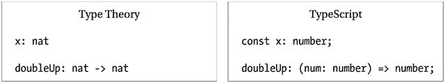
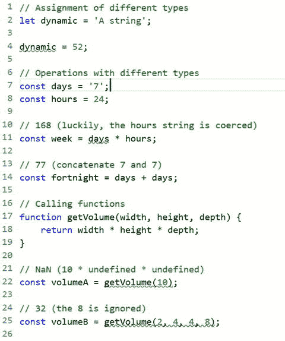
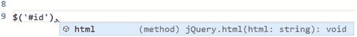

# 3.类型系统

类型理论解决的基本问题是确保程序有意义。由类型理论引起的根本问题是有意义的程序可能没有赋予它们的意义。对更丰富类型系统的追求源于这种紧张。—马克·马纳塞

在本章中，您将了解 TypeScript 类型系统，包括它与您以前可能遇到过的其他类型系统的一些重要区别。由于 TypeScript 从一系列语言中汲取了灵感，所以理解这些微妙的细节是值得的，因为依赖于您对其他类型系统的现有知识可能会导致一些令人讨厌的意外。通过比较结构类型系统和名义类型系统，并通过查看可选静态类型、类型擦除和 TypeScript 语言服务提供的强大类型推理的详细信息，来探究这些详细信息。

虽然许多 TypeScript 功能与 ECMAScript 规范的功能和建议的功能一致，但类型系统是 TypeScript 独有的。目前还没有在 ECMAScript 标准中添加类型注释或任何复杂的类型相关特性的计划。

在这一章的最后是关于环境声明的一节，它可以用来填充没有用 TypeScript 编写的代码的类型信息。这允许您使用带有类型检查和自动完成功能的外部代码，无论它是您已经拥有的旧 JavaScript 代码、运行时平台的补充，还是您在程序中使用的第三方库和框架。

## 类型系统

类型系统起源于类型理论，这归功于伯特兰·罗素，他在 20 世纪早期发展了该理论，并将其纳入他的三卷本《数学原理》(怀特黑德和罗素，剑桥大学出版社，1910 年)。类型理论是一个系统，其中每个术语都被赋予一个类型，并且基于类型来限制操作。TypeScript 的注释和类型理论积木的风格惊人的相似，如图 [3-1](#Fig1) 所示。

在类型理论中，符号用类型进行注释，就像用 TypeScript 类型注释一样。这方面唯一的区别是 type theory 省略了`const`关键字，使用了`nat`类型(自然数)而不是 TypeScript 中的 number 类型。函数注释也是可识别的，类型理论省略了括号，这可以提高 TypeScript 示例的可读性。



图 3-1。

Type theory and TypeScript similarities

通常，类型系统为系统中的每个变量、表达式、对象、函数、类或模块分配一个类型。这些类型与一组旨在暴露程序中错误的规则一起使用。这些检查可以在编译时(静态检查)或运行时(动态检查)执行。典型的规则包括确保赋值中使用的值与被赋值的变量类型相同，或者确保函数调用根据函数签名提供正确类型的参数。

在一个类型系统中使用的所有类型都作为契约，声明系统中所有不同组件之间可接受的交互。基于这些类型检测到的错误种类取决于类型系统中的规则和检查的复杂程度。

## 可选静态类型

JavaScript 是动态类型的；变量没有固定的类型，因此没有类型限制可以应用于操作。您可以将一种类型的值赋给一个变量，然后将完全不同类型的值赋给同一个变量。您可以使用两个不兼容的值执行运算，并获得不可预知的结果。如果你调用一个函数，没有必要强制你传递正确类型的参数，你甚至可以提供太多或太少的参数。这些在清单 [3-1](#Par13) 中进行了演示。

因此，JavaScript 类型系统非常灵活，但有时这种灵活性会带来问题。

```js
// Assignment of different types
let dynamic = 'A string';

dynamic = 52;

// Operations with different types
const days = '7';
const hours = 24;

// 168 (luckily, the hours string is coerced)
const week = days * hours;

// 77 (concatenate 7 and 7)
const fortnight = days + days;

// Calling functions
function getVolume(width, height, depth) {
        return width * height * depth;
}

// NaN (10 * undefined * undefined)
const volumeA = getVolume(10);

// 32 (the 8 is ignored)
const volumeB = getVolume(2, 4, 4, 8);

Listing 3-1.JavaScript dynamic types

```

TypeScript 提供了一个推断和指定类型的系统，但允许类型是可选的。可选性很重要，因为这意味着您可以选择何时强制类型以及何时允许动态类型。除非您选择退出类型检查，否则使用`any`类型，编译器将尝试确定您的程序中的类型，并将检查推断类型以及您使用类型注释指定的显式类型。类型注释在第 [1 章](01.html)中描述。

所有的检查都在编译时执行，这使得 TypeScript 成为静态类型。编译器负责构建所有类型的调度，根据这些类型检查表达式，并在将代码转换为有效的 JavaScript 时删除所有类型信息。

如果您将清单 [3-1](#Par13) 中的 Ja vaScript 代码粘贴到一个 TypeScript 文件中，您将会收到示例中所有类型错误的错误。你可以在下面的图 [3-2](#Fig2) 中的类型脚本列表中看到被标记的错误。



图 3-2。

TypeScript compiler errors Note

TypeScript 的类型系统中的一个要点是类型的可选性。这实际上意味着您不局限于静态类型，并且可以在任何需要的时候选择使用动态行为。

## 结构分型

TypeScript 具有结构化类型系统；这与大多数类 C 语言形成对比，后者通常是主格的。命名类型系统依赖于明确命名的注释来确定类型。在一个名义上的系统中，一个类只有用接口的名字来修饰时，才会被认为是实现了一个接口(也就是说，它必须显式地声明它实现了这个接口)。在结构类型系统中，不需要显式修饰，只要其结构与所需类型的规范相匹配，值就是可接受的。

名义类型系统旨在防止意外的类型等价——仅仅因为某些东西具有相同的属性并不意味着它是有效的——但是由于 TypeScript 在结构上是类型化的，所以意外的类型等价是可能的，并且是可取的。

在一个名义类型系统中，你可以使用命名类型来确保正确的参数被传递，例如，你可以创建一个`CustomerId`类型来包装标识符的值，并使用它来防止普通的`number`、`ProductId`、`CustomerTypeId`或任何其他类型的赋值。不接受具有相同属性但不同名称的类型。在一个结构类型系统中，如果`CustomerId`包装了一个名为`value`的包含 ID 号的公共属性，那么任何其他类型，只要有一个具有等价类型的`value`属性，都是可以接受的。

如果您希望在 TypeScript 中使用自定义类型来实现这种类型安全，则必须通过使这些类型在结构上唯一来确保它们不会意外地等效。在一个类上使用私有成员来使它在结构上不匹配是可能的，但是尽管关于对名义类型的一些支持的讨论还在继续，创建名义类型的最可读的技术是清单 [3-2](#Par24) 中所示的技术。

在清单 [3-2](#Par24) 中的示例类中，第一个方法避免了意外等价，并且将只接受一个`CustomerId`，但是第二个方法通过接受任何数字在某种程度上允许它。要调用第二个方法，必须传递标识符的`value`属性。

类型可以用来包装当前形式的任何数字标识。使用一个类型和一个工厂方法创建新的实例来创建`CustomerId`和`ProductId`。试图将`productId`实例传递给接受`CustomerId`的方法会导致错误。

```js
// DomainId type definition
type DomainId<T extends string> = {
  type: T,
  value: number,
}

// CustomerId
type CustomerId = DomainId<'CustomerId'>;
const createCustomerId = (value: number): CustomerId => ({ type: 'CustomerId', value });

// Product Id
type ProductId = DomainId<'ProductId'>;
const createProductId = (value: number): ProductId => ({ type: 'ProductId', value });

// Example class
class Example {
    static avoidAccidentalEquivalence(id: CustomerId) {
        // Implementation
    }

    static useEquivalence(id: number) {
        // Implementation
    }
}

var customerId = createCustomerId(1);
var productId = createProductId(5);

// Allowed

Example.avoidAccidentalEquivalence(customerId);

// Errors 'Supplied parameters do not match signature of call target'
Example.avoidAccidentalEquivalence(productId);

// Allowed
Example.useEquivalence(customerId.value);

// Allowed
Example.useEquivalence(productId.value);

Listing 3-2.Using and avoiding equivalence

```

虽然结构类型在有限的特殊情况下可能会造成困难，但它有很多优点。例如，引入兼容类型而不必更改现有代码要容易得多，并且可以创建无需从外部类继承就可以传递给外部代码的类型。在引入新的超类型而不改变新降级的子类型或与它们交互的代码的能力方面，它也优于名义类型。

结构类型化最重要的好处之一是它节省了无数显式的类型名修饰。无需添加特定的类型注释就可以实现接口，并且无需添加类型注释就可以创建匿名对象来匹配接口和类。如果属性和方法与所需类型属于同一类型或兼容类型，则可以使用这些对象。兼容类型可以是子类型、更窄的类型或结构相似的类型。

在结构化类型语言(如 TypeScript)中要避免的一件事是空结构。空接口或空类本质上是程序中几乎所有东西的有效超类型，这意味着任何对象都可以在编译时替换空结构，因为在类型检查期间没有契约要满足。

结构类型补充了 TypeScript 中的类型推理。有了这些特性，您可以将大部分工作留给编译器和语言服务，而不必在整个程序中显式地添加类型信息和类继承。

Note

在 TypeScript 程序中，不能依赖命名类型来创建限制，只能依赖唯一的结构。对于接口，这意味着使用唯一命名的属性或方法来创建唯一性。对于类，任何私有成员都会使结构唯一。

## 类型擦除

当你把你的 TypeScript 程序编译成普通的 JavaScript 时，生成的代码在两个方面是不同的:代码转换和类型擦除。代码转换将目标 JavaScript 版本中不可用的语言特性转换为有效的表示。例如，如果您的目标是 ECMAScript 5，其中没有可用的类，那么您的所有类都将被转换为立即调用的函数表达式，这些表达式使用 ECMAScript 5 中可用的原型继承创建适当的表示。类型删除是从代码中删除所有类型注释的过程，因为 JavaScript 不理解它们。

类型擦除移除类型批注、自定义类型和接口。这些仅在设计时和编译时需要，以便进行静态检查。运行时不检查类型，因此不需要类型信息。您在运行时应该不会遇到问题，因为已经检查了类型的逻辑使用，除非您通过使用`any`类型选择退出。

```js
class OrderedArray<T> {
    private items: T[] = [];

    constructor(private comparer?: (a: T, b: T) => number) {
    }

    add(item: T): void {
        this.items.push(item);
        this.items.sort(this.comparer);
    }

    getItem(index: number): T {
        if (this.items.length > index) {
            return this.items[index];
        }
        return null;
    }
}

var orderedArray: OrderedArray<number> = new OrderedArray<number>();

orderedArray.add(5);
orderedArray.add(1);
orderedArray.add(3);

var firstItem: number = orderedArray.getItem(0);

alert(firstItem); // 1

Listing 3-3.TypeScript ordered array class

```

清单 [3-3](#Par32) 显示了一个`OrderedArray`类的示例脚本清单。该类是泛型的，因此可以替换数组中元素的类型。对于复杂类型，可以提供一个可选的自定义比较器来计算数组中的项，以便进行排序，但是对于简单类型，可以省略该比较器。下面是该类的一个简单演示。这段代码被编译成清单 [3-4](#Par34) 中所示的 JavaScript。在编译后的输出中，所有的类型信息都消失了，该类被转换成一种常见的 JavaScript 模式，称为自执行匿名函数。

```js
var OrderedArray = (function () {
    function OrderedArray(comparer) {
        this.comparer = comparer;
        this.items = [];
    }
    OrderedArray.prototype.add = function (item) {
        this.items.push(item);
        this.items.sort(this.comparer);
    };
    OrderedArray.prototype.getItem = function (index) {
        if (this.items.length > index) {
            return this.items[index];
        }
        return null;
    };
    return OrderedArray;
}());
var orderedArray = new OrderedArray();
orderedArray.add(5);
orderedArray.add(1);
orderedArray.add(3);
var firstItem = orderedArray.getItem(0);
alert(firstItem); // 1
Listing 3-4.Compiled JavaScript code

```

尽管在编译期间执行了类型擦除和转换，JavaScript 输出与原始的 TypeScript 程序非常相似。几乎所有从 TypeScript 到 JavaScript 的转换都同样考虑到了原始代码。根据您所针对的 ECMAScript 版本，可能会有更多或更少的转换，例如，如果您在编译期间针对`ESNext`，则 TypeScript 向下编译到 ECMAScript 3 和 5 的最新特性不需要转换。

## 类型推理

类型推断与类型删除截然相反。类型推断是在没有显式类型批注的情况下，在编译时确定类型的过程。

大多数类型推断的基本示例，包括本书中的早期示例，展示了一个简单的赋值，并解释了如何将赋值左边的变量类型自动设置为右边的文字值类型。对于 TypeScript 来说，这种类型推断实际上是“第一级”,它能够更复杂地确定所使用的类型。

TypeScript 执行深度检查以在程序中创建类型计划，并使用该类型计划比较赋值、表达式和操作。在这个过程中，当直接类型不可用时，会使用一些巧妙的技巧，允许间接找到该类型。其中一个技巧是上下文类型化，TypeScript 使用表达式的上下文来确定类型。

清单 [3-5](#Par41) 展示了如何以更加间接的方式推断类型。`add`函数的返回值是通过从 return 语句向后工作来确定的。return 语句的类型是通过评估表达式`a + b`的类型找到的，而这又是通过检查单个参数的类型来完成的。

在清单 [3-5](#Par41) 的最后一个表达式中，匿名函数中的`result`参数类型可以使用声明该函数的上下文来推断。因为声明是被`callsFunction`的执行使用，所以编译器可以看到它是要作为`string`传递的；因此，结果参数将总是一个`string`类型。第三个例子来自`CallsFunction`的宣言；因为变量已经使用`CallsFunction`接口进行了类型化，所以编译器根据接口推断出`cb`参数的类型。

```js
function add(a: number, b: number) {
    /* The return value is used to determine
       the return type of the function */
    return a + b;
}

interface CallsFunction {
    (cb: (result: string) => any): void;
}

// The cb parameter is inferred to be a function accepting a string
var callsFunction: CallsFunction = function (cb) {
    cb('Done');

    // Error: Argument of type '1' is not assignable to parameter of type 'string'
    cb(1);
};

// The result parameter is inferred to be a string
callsFunction(function (result) {
    return result;
});

Listing 3-5.Bottom-up and top-down inference

```

### 最佳常见类型

当推断类型信息时，在有限的几种情况下，必须确定最佳的通用类型。清单 [3-6](#Par43) 展示了如何考虑数组中的值，以便在所有数组值之间生成最佳公共类型。

```js
// number[]
let x = [0, 1, null];

// (string | number)[]
let y = [0, 1, null, 'a'];

Listing 3-6.Best common types

```

确定最佳公共类型的过程不仅仅用于数组文字表达式；它们还用于确定多个值具有不同类型的任何情况，例如包含多个返回语句的函数或方法的返回类型。

### 上下文类型

上下文类型是高级类型推理的一个很好的例子。当编译器将其类型基于表达式的位置时，就会发生上下文类型化。在清单 [3-7](#Par46) 中，事件参数的类型由`window.onclick`定义的已知签名决定。推论不仅仅局限于参数；由于对`window.onclick`签名的现有了解，可以推断出包括返回值在内的整个签名。

```js
window.onclick = function(event) {
        var button = event.button;
};
Listing 3-7.Contextual types

```

如果检查清单 [3-7](#Par46) 的类型信息，会发现`event`参数是一个`MouseEvent`,`this`的范围是`Window`，返回类型是`a` `ny`。

### 加宽类型

术语“加宽类型”指的是 TypeScript 中函数调用、表达式或赋值的类型为`null`或`undefined`的情况。在这些情况下，编译器推断出的类型将是加宽的`any`类型。在清单 [3-8](#Par49) 中，`widened`变量的类型为`any`。

```js
function example() {
    return null;
}

var widened = example

();

Listing 3-8.Widened types

```

### 何时添加注释

因为类型推断从第一天起就是 TypeScript 的关键特性，所以关于何时用类型注释显式化类型的讨论可以毫无争议地进行。对于后来决定添加某种类型推断支持的静态类型语言来说，这是一个棘手的话题。

关于添加到程序中的类型注释级别的最终决定应该由所有团队成员共同做出，但是您可能希望使用以下建议作为讨论的起点。

*   从不添加类型注释开始(完全推理。)
*   在推断类型为`any.`的地方添加类型注释
*   为公共方法返回类型添加类型批注。
*   为公共方法参数添加类型批注。

与类型保持健康关系的关键是使用尽可能少的类型注释。如果类型可以被推断出来，就允许它被推断出来。尽可能信任编译器，你很快就会发现你可以相信它会做得很好。您可以让编译器使用一个特殊的标志(`--noImplicitAny`)来警告您无法找到类型的情况，该标志可以防止推断出`any`类型。您可以在附录 2 中阅读更多关于代码质量标志的内容。

关于类型注释的最后一点是要求尽可能少。如果你只需要一个对象有一个`name`成员，不要用更严格的类型来注释它，比如`Customer`。具体说明返回类型，但尽可能接受最通用的参数。

## 重复标识符

总的来说，你应该尽力避免程序中的名字冲突。TypeScript 提供了一些工具，允许您将程序移出全局范围并移入模块，从而使名称冲突变得不必要。但是，TypeScript 中的标识符有一些有趣的特性，包括许多允许在相同范围内使用相同名称的情况。

在大多数情况下，在同一范围内使用现有的类或变量名将导致“重复标识符”错误。没有特定的结构得到优惠待遇；两个标识符中的后一个将是错误的来源。如果您在程序中多次重用一个名称空间，这不会导致重复标识符错误，因为所有单独的块在逻辑上都合并到一个名称空间中。

重复标识符的另一个有效用途是用于接口。再一次，编译器知道在运行时不会有重复的标识符，因为接口在编译期间被删除；它的标识符永远不会出现在 JavaScript 输出中。使用接口和变量的重复标识符是 TypeScript 库中的一种常见模式，其中标准类型是使用接口定义的，然后通过类型批注分配给变量声明。清单 [3-9](#Par61) 显示了`DeviceMotionEvent`的类型脚本库定义。`DeviceMotionEvent`的接口后面紧跟着一个带有相同`D` `eviceMotionEvent`标识符的变量声明。

```js
interface DeviceMotionEvent extends Event {
    readonly acceleration: DeviceAcceleration | null;
    readonly accelerationIncludingGravity: DeviceAcceleration | null;
    readonly interval: number | null;
    readonly rotationRate: DeviceRotationRate | null;
    initDeviceMotionEvent(type: string, bubbles: boolean, cancelable: boolean, acceleration: DeviceAccelerationDict | null, accelerationIncludingGravity: DeviceAccelerationDict | null, rotationRate: DeviceRotationRateDict | null, interval: number | null): void;
}

declare var DeviceMotionEvent: {
    prototype: DeviceMotionEvent;
    new(typeArg: string, eventInitDict?: DeviceMotionEventInit): DeviceMotionEvent;
};

Listing 3-9.TypeScript DeviceMotionEvent

```

环境声明在本章后面会有更详细的解释，但是这种技术在变量声明前没有关键字`declare`也一样有效。在标准库中使用接口是经过深思熟虑的选择。接口是开放的，因此可以在附加的接口块中扩展定义。如果发布了一个新的 web 标准，向`DeviceMotionEvent`对象添加了一个`motionDescription`属性，您就不必等待它被添加到 TypeScript 标准库中；你可以简单地将清单 [3-10](#Par64) 中的代码添加到你的程序中来扩展接口定义。

来自同一个公共根的所有接口定义块被组合成一个单一类型，因此`DeviceMotionEvent`仍然具有来自标准库的所有原始属性，并且还具有来自附加接口块的`motionDescription`属性。

```js
interface DeviceMotionEvent {
    motionDescription: string;
}

// The existing DeviceMotionEvent has all of its existing properties
// plus our additional motionDescription property
function handleMotionEvent(e: DeviceMotionEvent) {
    var acceleration = e.acceleration;
    var description = e.motionDescription;
}

Listing 3-10.Extending the DeviceMotionEvent

```

## 类型检查

一旦从程序中收集了类型的计划，TypeScript 编译器就能够使用该计划来执行类型检查。最简单的方法是，编译器检查当调用一个接受类型为`number`的参数的函数时；所有调用代码都传递一个与`number`类型兼容的参数。

清单 [3-11](#Par67) 显示了一系列对带有名为`input`的参数的函数的有效调用，类型为`number`。接受类型为`number`、`enum`、`null`、`undefined`或`any`的参数。请记住，`any`类型允许 TypeScript 中的动态行为，因此它代表了您对编译器的承诺，即这些值在运行时是可接受的。

```js
function acceptNumber(input: number) {
    return input;
}

// number
acceptNumber(1);

// enum
acceptNumber(Size.XL);

// null
acceptNumber(null);

Listing 3-11.Checking a parameter

```

随着类型变得越来越复杂，类型检查需要对对象进行更深入的检查。检查对象时，会测试对象的每个成员。公共属性必须具有相同的名称和类型；公共方法必须有相同的签名。检查对象的成员时，如果属性引用嵌套对象，检查将继续深入到该对象以检查兼容性。

清单 [3-12](#Par70) 显示了三个不同命名的类和一个文字对象，显示了编译器所关心的所有兼容。

```js
class C1 {
    name: string;

    show(hint?: string) {
        return 1;
    }
}

class C2 {
    constructor(public name: string) {

    }

    show(hint: string = 'default') {
        return Math.floor(Math.random() * 10);
    }
}

class C3 {
    name: string;

    show() {
        return <any> 'Dynamic';
    }
}

var T4 = {
    name: '',
    show() {
        return 1;
    }
};

var c1 = new C1();
var c2 = new C2('A name');
var c3 = new C3();

// c1, c2, c3 and T4 are equivalent
var arr: C1[] = [c1, c2, c3, T4];

for (var i = 0; i < arr.length; i++) {
        arr[i].show();
}

Listing 3-12.Compatible types

```

这个例子值得注意的部分包括`name`属性和`show`方法。对象上必须存在`name`属性，它必须是公共的，并且必须是字符串类型。属性是否是构造函数属性并不重要。`show`方法必须返回与`number`兼容的类型。参数也必须兼容——在这种情况下，可选的`hint`参数可以使用默认参数或完全省略该参数来匹配。如果一个类有一个强制的`hint`参数，它将与清单 [3-12](#Par70) 中的类型不兼容。如第四种类型所示，就编译器而言，文字对象可以与类兼容，只要它们通过了类型比较。

类型检查不仅限于正匹配，在正匹配中，提供的类型必须具有所需类型的结构。越来越多的否定检查被添加到编译器中，使其能够检测不同类别的错误。例如，过量属性警告将突出显示对象上的非预期属性，这是捕捉错误键入属性名称的情况的好方法。当您升级项目中使用的 TypeScript 版本时，这种检查可能会引入额外的错误，但是如果您坚持不懈地检查编译器发送给您的消息，您最终会发现编译器已经设法为您捕捉到的细微错误。

## 环境声明

环境声明可用于向现有的 JavaScript 代码添加类型信息。通常，这用于为您自己的现有代码添加类型信息，或者为您希望在 TypeScript 程序中使用的第三方库添加类型信息。

环境声明可以通过从一个简单的不精确的声明开始，并随着时间的推移逐渐增加细节来逐步构建。清单 3-13 展示了一个你可以为 jQuery 框架编写的最不精确的环境声明的例子。该声明只是通知编译器一个外部变量将在运行时存在，而没有提供外部变量结构的进一步细节。这将抑制`$`变量的错误，但不会提供深度类型检查或有用的自动完成。

```js
declare var $: any;

$('#id').html('Hello World');

Listing 3-13.Imprecise ambient declaration

```

所有环境声明都以关键字`declare`开始。这告诉编译器下面的代码块只包含类型信息，不包含实现。使用`declare`关键字创建的代码块将在编译期间被删除，并且不会产生 JavaScript 输出。在运行时，您负责确保代码存在，并且它与您的声明相匹配。

为了获得编译时检查的全部好处，您可以创建一个更详细的环境声明，覆盖您使用的外部 JavaScript 的更多特性。如果您正在构建环境声明，您可以选择包含您最常用的功能，或者您认为最有可能导致类型错误的高风险功能。这允许您投资定义类型信息，为您的时间投资提供最大回报。

在清单 [3-14](#Par79) 中，jQuery 定义已经扩展到包含第一个例子中使用的两个元素:使用包含元素 id 的字符串查询选择元素，使用`html`方法设置内部 HTML。在这个例子中，声明了一个名为`jQuery`的类，这个类有接受字符串的`html`方法。`$`函数接受一个字符串查询并返回一个`jQuery`类的实例。

```js
declare class jQuery {
    html(html: string): void;
}

declare function $(query: string): jQuery;

$('#id').html('Hello World'); 

Listing 3-14.Ambient class and function

```

当使用这个更新的环境声明时，自动完成提供类型提示，如图 [3-3](#Fig3) 所示。任何使用未声明的变量、函数、方法或属性的尝试都将导致编译器错误，并且所有参数和赋值都将被检查。



图 3-3。

Ambient declaration autocompletion

可以为变量、函数、类、枚举以及内部和外部模块创建环境声明。接口似乎从这个列表中消失了，但是接口已经类似于环境声明，因为它们描述了一个类型而没有产生任何编译的代码。这意味着您可以使用接口编写环境声明，但是您不能对接口使用`declare`关键字。

Note

实际上，将 jQuery 声明为接口比声明为类更有意义，因为您不能使用`var jq = new jQuery();`实例化 jQuery 的实例，您需要做的只是将`declare class`关键字更改为`interface`关键字，因为环境类和接口都不需要任何实现。

### 申报文件

尽管可以将环境声明放在任何 TypeScript 文件中，但对于只包含环境声明的文件，有一个特殊的命名约定。惯例是使用一个`.d.ts`文件扩展名。文件中的每个模块、变量、函数、类和枚举都必须以`declare`关键字开头，这是由 TypeScript 编译器强制执行的。

若要在程序中使用声明文件，可以像引用任何其他类型脚本文件一样引用该文件。您可以使用引用注释，或者将文件作为 import 语句的目标。当使用导入语句定位一个文件时，声明文件应该放在同一个文件夹中，并与 JavaScript 文件同名，如图 [3-4](#Fig4) 所示。


图 3-4。

Declarat ion files

### 绝对打字

如果您计划为任何常见的 JavaScript 库或框架编写环境声明，您应该首先查看是否有人已经通过访问环境声明的在线库完成了这项艰苦的工作，明确键入:

[T2`http://definitelytyped.org/`](http://definitelytyped.org/)

由 Boris Yankov 发起的明确类型化项目包含了无数流行 JavaScript 项目的定义，包括 Angular、Backbone、Bootstrap、Breeze、D3、Ember、jQuery、Knockout、Node、下划线等等。甚至还有 Jasmine、Mocha 和 qUnit 等单元测试框架的声明。其中一些外部来源非常复杂，因此使用现有的声明可以节省大量时间。Microsoft 现在支持该存储库。您可以在以下位置搜索正确的定义名称和安装说明:

[T2`https://aka.ms/types`](https://aka.ms/types)

将现有类型定义引入项目的最简单方法是使用 NPM，如清单 [3-15](#Par90) 所示。

```js
npm install --save @types/jquery
Listing 3-15.installing type definitions

```

## 摘要

在 TypeScript 类型系统中工作至少需要了解一下名义类型和结构类型之间的区别。结构类型化会使一些设计变得有点棘手，但是它不会阻止您使用任何您可能希望从名义类型化系统中转移的模式。类型推断允许您省去类型注释，而允许在整个程序中推断类型。

当您编译程序时，会根据显式和隐式类型检查类型，这样就可以尽早检测出一大类错误。使用`any`类型，你可以选择退出程序特定部分的类型检查。

您可以通过创建或获取 JavaScript 代码的环境声明来添加 JavaScript 代码的类型信息。通常这些环境声明会存储在 JavaScript 文件旁边的声明文件中。

## 要点

*   静态类型检查是可选的。
*   TypeScript 是结构化类型的。
*   所有类型信息都在编译过程中被移除。
*   您可以让编译器使用类型推断为您计算出类型。
*   环境声明将类型信息添加到现有的 JavaScript 代码中。